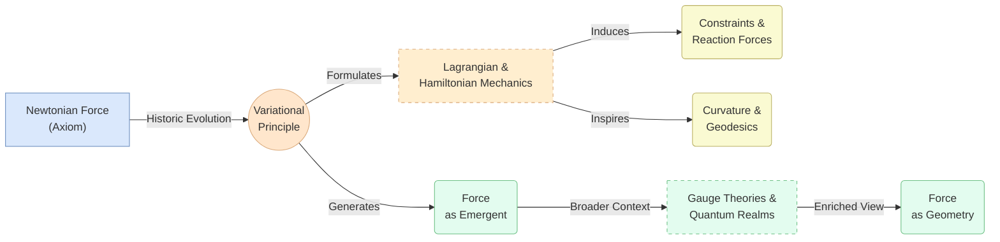

# Revisiting the Essence of Force in Classical Mechanics: A Geometrical and Variational Perspective
* * *

--- Unmask force: from Newton’s axiom to geometric emergences, discover its deeper nature beyond mere vectors.

# Chapter 1. Introduction and Historical Backdrop

**Epigraph:**  
“Once an axiom, force shaped centuries of motion theory—now we seek the truths beneath its surface.”

Classical mechanics began as a study of motion anchored in the idea that “force” is the fundamental driver of change. This opening chapter revisits force’s historical inception, tracing how it was elevated to a central pillar under Newton’s framework. We then preview the shift brought about by analytical mechanics, which gradually repositions force as less an absolute postulate and more an outcome of deeper mathematical structures (e.g., energy, variation, geometry). In doing so, we establish a launching point for re-examining force—from its earliest incarnations to its modern-day geometric reinterpretation.

## 1.1. The Newtonian Emergence

Historically, Isaac Newton’s Principia Mathematica (1687) laid the bedrock for classical mechanics with his three laws of motion, each hinging on the concept of force. For generations, these laws functioned as the ultimate blueprint:

1. An object remains at rest or in uniform motion unless acted upon by an external force.  
2. The rate of change of momentum is proportional to the net force applied (often taught as $F = m a$).  
3. Forces act in equal and opposite pairs.

In this original picture, force was the catalyst of all change in motion—a great unifying concept explaining everything from falling apples to planetary orbits. Force was seen as both physically “real” and mathematically irreducible: a fundamental entity that could be measured and applied across contexts. This viewpoint not only clarified everyday phenomena but also propelled the success of Newtonian mechanics for centuries.

Of course, Newton’s notion of force was not arbitrary. It sprang from a centuries-long evolution that included Galileo’s insights on inertia and Kepler’s mathematical descriptions of planetary orbits. Yet Newton boldly crystallized these ideas into a succinct framework, making force the linchpin of classical dynamics. In many respects, “force” was an axiom—a necessary starting point that demanded neither deeper justification nor geometric reinterpretation.

Over time, Newtonian mechanics branched into various subfields—like fluid dynamics and celestial mechanics—each continuing to treat force as a raw ingredient. Although new forms of force (electromagnetic, frictional, etc.) were recognized or theorized, the underlying approach remained: identify the forces, plug them into $F = m a$, solve the resulting equations of motion. Through Euler, Lagrange, and others, this approach blossomed into a prolific set of tools that fueled breakthroughs in engineering, astronomy, and beyond.

Thus, for classical physics’ formative stages, there was rarely a need to probe beneath force’s axiomatic status. Its conceptual crispness, along with the universal success of Newton’s laws, made force a fixture of the scientific worldview. However, hints of a deeper mathematical vantage would soon surface.

## 1.2. Analytical Mechanics and Paradigm Shift

Though Newton’s force-based formulation proved robust, an undercurrent of theoretical innovation began to suggest that force might not be the deepest currency of mechanics. The seeds of this shift were planted by mathematicians and physicists in the 18th and 19th centuries—most notably by Lagrange, Hamilton, and others—who explored a new set of ideas:

1. **Energy and Variational Principles**. The principle of least action revealed that the path a system takes can be derived by extremizing a single scalar quantity (the action), rather than enumerating explicit forces. In this variational setting, “force” arises naturally as a derivative of potential energy with respect to position, rather than as an autonomous entity.  

2. **Coordinates and Constraints**. By focusing on generalized coordinates and constraints—rather than raw forces—analytical mechanics placed the emphasis on a system’s configuration geometry. In the Lagrangian viewpoint, once you encode kinetic terms and potential energies, you can obtain the equations of motion without directly invoking Newton’s third law or force pairs.  

3. **Phase Space and Hamiltonian Structure**. Hamilton’s formalism, built on phase space (positions and momenta), eliminates explicit references to force altogether, reinterpreting dynamics via Hamilton’s equations. Here, “force” becomes a partial derivative of the Hamiltonian with respect to position—a localized manifestation of the system’s global energy function.

In these frameworks, force ceases to be an irreducible pillar and instead appears as a convenient label for “the derivative of energy,” “the negative gradient of potential,” or “the reaction associated with a Lagrange multiplier.” The audience—physicists, mathematicians, or engineers—can retain their intuitive notion of force in daily computations, but from a more abstract vantage, force is merely one face of deeper geometric objects (e.g., symplectic forms, tangential flows, or curvature constraints).

Consequently, analytical mechanics triggers a paradigm shift: it maintains Newtonian insights on how objects move but locates the real heart of motion in variational calculus and configuration geometry. This conceptual reorientation sets the stage for modern treatments of force, where force is understood as something that emerges from the shape of a potential or manifold, rather than an axiomatic ingredient.

## 1.3. Conclusion

In closing, Chapter 1 has shown how force, once the founding principle of Newtonian mechanics, evolved to a position where it can be viewed as a situational derivative of deeper mathematical principles. As we move through subsequent chapters, we will explore how this re-interpretation carries forward into variational methods, constraints, curvature, and modern physics, crystallizing a vision of force as an emergent or secondary phenomenon. We thereby echo the epigraph’s provocation: having once been an axiom, force now awaits a more profound understanding—one woven into the geometric and variational tapestry of classical mechanics.

# Chapter 2. Force in the Context of Variational Principles

**Epigraph:**  
“In the principle of least action, force emerges not as the directive, but as the derivative.”

Classical mechanics often begins by invoking “force” as the prime mover, but the variational approach sheds new light on its role. In this chapter, we demonstrate how, under the principle of least action, force becomes a secondary manifestation—specifically, the local derivative of a global action functional. Consequently, force appears less as an autonomous entity and more as a computational byproduct of deeper geometric or energetic structures. We then move on to restate these viewpoints in the language of Hamiltonian mechanics via Legendre transforms, revealing that force is equally encoded in partial derivatives of the Hamiltonian. Finally, we examine how, on manifolds, force naturally aligns with curvature or constraints—further underscoring its emergent status.  

## 2.1. Variational Calculus: From Action to Euler–Lagrange

A central pillar of analytical mechanics is the principle of stationary action (often called the least action principle). In this framework, one posits an **action functional** defined by
$$
S[q] \;=\; \int_{t_{1}}^{t_{2}} L\!\left(q(t), \dot{q}(t), t\right)\,\mathrm{d}t,
$$
where $q(t)$ represents the system’s coordinates in configuration space (possibly a manifold $\mathcal{Q}$), and $\dot{q}(t)$ denotes their time derivative. The Lagrangian $L$ typically takes the form
$$
L(q,\dot{q},t) \;=\; T(q,\dot{q}) \;-\; V(q),
$$
with $T$ as the kinetic energy (often quadratic in $\dot{q}$) and $V$ as the potential energy. The **principle of least action** asserts that the actual path $q(t)$ between fixed endpoints $q(t_{1})$ and $q(t_{2})$ makes $S[q]$ stationary under small variations $\delta q$. Formally,
$$
\delta S \;=\; 0.
$$
Carrying out the variational calculus—integrating by parts and enforcing that $\delta q$ vanish at the temporal boundaries—yields the **Euler–Lagrange equations**:
$$
\frac{\mathrm{d}}{\mathrm{d}t} \left(\frac{\partial L}{\partial \dot{q}^{i}}\right)
\;-\;
\frac{\partial L}{\partial q^{i}}
\;=\; 0
\quad
\text{for each coordinate } q^{i}.
$$
At first glance, these equations simply re-state Newton’s second law in a more abstract form. However, note how “force” emerges from the second term:
$$
-\;\frac{\partial L}{\partial q^{i}}
\;\;=\;\; 
-\;\frac{\partial (T - V)}{\partial q^i}
\;\;=\;\;
\frac{\partial V}{\partial q^i},
$$
if $T$ does not explicitly depend on $q$. This partial derivative $\frac{\partial V}{\partial q^i}$ is precisely what we’ve historically called a (generalized) force. It is not introduced as an axiom; instead, it **derives** from a globally defined scalar function $V$. Hence, “force” is a local shadow of the shape or slope of the potential $V$, itself embedded in the global action integral.  

From this angle, force is revealed as a **consequence** rather than a driver. The entire dynamical story is encoded in the trajectory’s stationarity with respect to an integral measure $S[q]$. Only by differentiating that integral does one recapture the notion of force. This conceptual reversal—switching from “force first” to “action first”—holds sweeping implications:

1. Forces unify naturally with potential energy in a single mathematical object $L$.  
2. Constraints (holonomic or otherwise) can be incorporated without rethinking “forces” from scratch; one simply modifies $L$ or the allowed variations $\delta q$.  
3. Symmetries become explicit through the variational perspective (eventually leading to Noether’s theorem), reinforcing how “forces” and “conserved quantities” are linked to deeper invariances in the action.

In short, the Euler–Lagrange framework cements the view that force arises from local derivatives of a more fundamental global principle.

## 2.2. Legendre Transforms and Hamiltonian Optics

While the Lagrangian viewpoint recasts force as a local derivative of the action, an equivalent transformation leads us to **Hamiltonian mechanics**, wherein force is encoded via partial derivatives of a Hamiltonian function $H$. The transformation bridging these perspectives is the **Legendre transform**.

Let us define the generalized momentum
$$
p_{i}
\;=\;
\frac{\partial L}{\partial \dot{q}^{i}}.
$$
Provided this relation can be inverted to express $\dot{q}^{i}$ in terms of $(q, p)$, one then constructs the **Hamiltonian**:
$$
H\left(q, p, t\right)
\;=\;
\sum_{i} \, p_{i}\,\dot{q}^{i}
\;-\;
L\!\left(q,\dot{q},t\right),
$$
with all $\dot{q}^{i}$ replaced by functions of $(q, p)$. This $H$ frequently interprets as total energy: $H = T + V$. One may then rewrite the action principle or the equations of motion in Hamiltonian form, yielding the canonical set:
$$
\dot{q}^{i} \;=\; \frac{\partial H}{\partial p_{i}},
\quad
\dot{p}_{i} \;=\; -\,\frac{\partial H}{\partial q^{i}}.
$$
Here, observe that $\dot{p}_i$—which amounts to the **time rate of change of momentum** (and, in Newtonian language, net force)—is simply
$$
\dot{p}_i
\;=\;
-\;\frac{\partial H}{\partial q^i}.
$$
Thus, the force is again realized as a **negative partial derivative**—this time of $H$. Once more, force does not stand alone; it is a local differential reflection of a global function (the Hamiltonian). If $H$ depends smoothly on $q$, then the “force” is effectively the “slope” of the Hamiltonian with respect to $q$.  

Interestingly, this viewpoint is akin to optical analogies used in “Hamiltonian optics,” where rays of light follow the stationary paths of an optical action, giving insight into how wavefronts bend. In just the same way, mechanical “rays” (orbits) bend according to derivatives of $H$. Hence, whether one prefers the Lagrangian or Hamiltonian languages, the notion of “force” never reverts to an independent entity: it resides as a derivative of a broader functional structure.

## 2.3. Geometrical Interpretation on Manifolds

A final vantage in this variational story is to embed the entire mechanical system in a **manifold** framework—often, a **configuration manifold** $\mathcal{Q}$, with coordinates $q^i$. In Lagrangian mechanics, one typically works on the **tangent bundle** $T\mathcal{Q}$, where points represent both positions and velocities $\dot{q}$. Hamiltonian mechanics, conversely, invokes the **cotangent bundle** $T^*\mathcal{Q}$, with coordinates $(q^i, p_i)$.  

Within such geometric language, “force” emerges from the curvature or constraints inherent in these bundles:

1. **Curvature and Geodesics.** One can interpret free motion (no external potential) as geodesic flow on $\mathcal{Q}$. Any departure from geodesic flow—perceived as a “force”—is then a statement about the manifold not being flat or about the presence of a potential or gauge field (which modifies the connection).  

2. **Constraints as Submanifolds.** Holonomic constraints effectively reduce the dimensionality of the manifold, restricting motion to a submanifold. What we label “constraint forces” can be seen as reaction terms ensuring the trajectory remains in the admissible subspace—again, locally emergent from geometry.  

3. **Potentials and 1-Forms.** In Hamiltonian geometry, a potential $V(q)$ might define an exact 1-form $\mathrm{d}V$. The negative gradient of $V$ supplies a “force,” but more fundamentally it is a geometric object describing how the system’s energy changes across the manifold.

Hence, the manifold approach cements the idea that “force” is merely the local reflection of a manifold’s structure—whether from potential topography, constraints, or differential forms. The deeper, unifying principle is that **motion** is shaped by how the manifold (and its associated bundles) direct permissible trajectories, with “force” as an accessory phenomenon capturing local rates of change.

## 2.4. Conclusion

The principle of least action illuminates a sweeping reinterpretation of force. Rather than a fundamental input to the equations of motion, force is the local partial derivative of a globally defined action (in Lagrangian form) or Hamiltonian (in phase-space form). By embracing a geometric viewpoint—where tangent/cotangent bundles and curvature encode the system’s dynamics—one sees force as neither purely “real” nor strictly “axial.” Instead, it stands as a **byproduct** of deeper variational structures, manifesting whenever the system’s trajectory diverges from geodesic flow or a potential function’s gradient is non-zero. This insight paves the way for Chapter 3, where we focus on how constraints and curvature drive force-like effects, continuously reinforcing the notion that force is far from an irreducible bedrock.

# Chapter 3. Constraints, Curvature, and Force as an Emergent Phenomenon

**Epigraph:**  
“Beneath every push lies a shaped manifold, guiding the path of motion by geometric decree.”

Modern analytical mechanics reveals that force is rarely a standalone construct—especially once we factor in the underlying manifold on which a system moves. This chapter explores how “constraint forces” or “fictitious forces” can be viewed as local reflections of deeper geometry or velocity-level restrictions, and how curvature itself can masquerade as force in rotating frames or curved spaces. By surveying holonomic, nonholonomic, and curvature-induced forces, we further entrench the principle that force emerges from how the manifold channels permissible trajectories.

## 3.1. Holonomic Constraints and Their Virtual Forces

One of the cleanest ways to see force as an outgrowth of geometry is through **holonomic constraints**—conditions that can be expressed as algebraic equations among the generalized coordinates:
$$
f\left(q^{1}, q^{2}, \ldots, q^{n}, t\right) \;=\; 0.
$$
A physical example might be a bead constrained to slide on a frictionless wire, or a pendulum constrained to move on a circular arc. In such cases, the configuration space reduces to a **submanifold** of the original manifold $\mathcal{Q}$. The system’s trajectory must remain on that submanifold at all times.

### 3.1.1. Virtual Displacements and Reaction Forces
When deriving the equations of motion via a Lagrangian or Hamiltonian approach, these constraints manifest as **reaction (constraint) forces** that enforce the submanifold condition. Mathematically, one often introduces **Lagrange multipliers** $\lambda^{\alpha}$ corresponding to each constraint:
$$
f_{\alpha}\left(q, t\right) \;=\; 0,
$$
leading to additional terms in the Euler–Lagrange equations:
$$
\frac{\mathrm{d}}{\mathrm{d}t}\left(\frac{\partial L}{\partial \dot{q}^i}\right) 
\;-\;
\frac{\partial L}{\partial q^i}
\;=\;
\sum_{\alpha}\,\lambda^{\alpha}\,\frac{\partial f_{\alpha}}{\partial q^i}.
$$
These extra “forces” do no work on virtual displacements consistent with the constraint; they merely restrict the system to remain on the valid submanifold. In a geometric sense, what is perceived as a “reaction force” is precisely the **normal** or **tangential** direction needed to keep the motion confined.

### 3.1.2. Geometry Over Push-Pull Interpretation
This approach clarifies that constraint forces are not fundamental “pushes” but outgrowths of the geometry of submanifolds. Once we specify that the path $q(t)$ cannot leave a certain region of configuration space, these “forces” simply reflect the manifold’s shape, enforcing boundary-like conditions on motion.

## 3.2. Nonholonomic Systems and Pseudoforces

Not all constraints are integrable into a direct relation $f(q) = 0$. Some appear at the **velocity** level:
$$
a_{1}(q,t)\,\dot{q}^{1} 
\;+\;
\cdots
\;+\;
a_{n}(q,t)\,\dot{q}^{n}
\;+\;
a_{0}(q,t)
\;=\;
0,
$$
and do not reduce to a simple position-level constraint. Such *nonholonomic constraints* often appear in rolling motion (e.g., a rolling wheel) or slipping friction conditions. They can be trickier to handle in a purely Lagrangian framework since they restrict allowable velocities rather than positions.

### 3.2.1. Emergent Pseudoforces
The geometry behind nonholonomic constraints is subtler; it frequently entails distributing constraints on the tangent bundle $T\mathcal{Q}$. What we label as *“pseudoforces”* or *“generalized reaction forces”* ensure the velocity vector remains in a permissible subspace at each instant. Because these constraints cannot be trivially expressed as $f(q)=0$, the resulting reaction forces, though very real in effect, do not necessarily derive from a simple potential $V(q)$. Instead, they reflect that velocity directions $\dot{q}$ are literally “projected” onto the subspace defined by the nonholonomic condition.

Such pseudoforces may not conserve energy, nor do they always fit neatly into the “geometry of submanifolds.” Yet the conceptual thread remains: these forces are emergent from the *inflexible shape of permissible velocities.* They act to enforce a localized geometry within the tangent bundle, constantly projecting motion into the valid domain.

## 3.3. Curvature as a Source of Apparent Forces

Perhaps nowhere is the emergent quality of force more apparent than in rotating or curved frames. Everyday examples include:

1. **Centrifugal and Coriolis Forces:** In a rotating reference frame with angular velocity $\boldsymbol{\Omega}$, an observer perceives “outward” centrifugal forces $\boldsymbol{F}_\text{centrifugal}$ and “deflecting” Coriolis forces $\boldsymbol{F}_\text{Coriolis}$. Neither is a genuine Newtonian interaction; each arises simply because a rotating frame has *non-inertial* geometry.  

2. **Gravity as Curvature:** In general relativity, gravitational attraction is identified with spacetime curvature rather than a fundamental “pull”. While classical mechanics does not fully adopt Einstein’s viewpoint, the notion that a curved manifold can mimic or generate what we interpret as force resonates with the theme: “force” can be the local expression of a deeper geometrical deviation from flatness.

### 3.3.1. Geodesics and Apparent Accelerations
In a purely *geometric* picture, free particles in a flat inertial frame follow straight lines (geodesics with zero “force”). Shift to a rotating coordinate system or bend the manifold, and these geodesics appear bent or accelerated—hence an observer in that frame invents “fictitious” or “inertial” forces to explain non-linear paths.

Equations for inertial forces in rotating frames often take the form
$$
\boldsymbol{F}_\text{inertial}
\;=\;
-m\,\left(\boldsymbol{\Omega}\times(\boldsymbol{\Omega}\times \mathbf{r})\right)
\;-\;
2m\,(\boldsymbol{\Omega}\times \dot{\mathbf{r}}),
$$
with the first term representing centrifugal force and the second Coriolis force. Yet from a global standpoint, these are simply the coordinates’ geometric artifacts—a reflection that the chosen basis is non-inertial. The system’s “real” or inertial path is still a geodesic in a higher-level sense.

## 3.4. Conclusion

In the presence of holonomic constraints, velocity-level (nonholonomic) restrictions, or manifold curvature, we see yet again that *force* is largely an emergent echo of geometry rather than an a priori entity. Reaction forces ensure that a system’s motion remains confined to a particular submanifold; nonholonomic constraints reshape permissible velocities into a restricted directionality; and apparent forces such as the Coriolis or centrifugal terms are nothing more than geometric aftereffects of non-inertial frames. In all these scenarios, “force” functions as a local reflection of the global rule that the manifold—and its associated constraints—imposes on trajectories.  

This resonates strongly with the geodesic viewpoint: in the absence of “external pushes,” free motion follows geodesics in a suitably chosen geometry. Any “force” is simply the local measure of curvature or constraints causing the path to deviate from a flat or unconstrained geodesic. Thus, whether discussing Lagrange multipliers, nonholonomic reaction terms, or inertial forces in rotating frames, we confirm a unifying theme: force emerges from how geometry and constraints shape admissible motion.  

Chapter 4 builds on this notion by confronting even broader contexts—field-theoretic perspectives, gauge symmetries, quantum frameworks—where the geometric nature of force intensifies, bridging the classical landscape with richer mathematical structures.

# Chapter 4. Looking Beyond: Modern Insights and Extensions

**Epigraph:**  
“When geometry embraces fields, and fields beget quantum realms, force is but one face of deeper symmetries.”

Classical mechanics initially flourished under Newton’s laws and was subsequently reimagined through Lagrangians, Hamiltonians, and configuration manifolds. Yet the geometric lens on “force” does not end there. Contemporary mathematics and physics further expand this viewpoint, blending spaces, symmetries, and fields in ways that dissolve the notion of force into broader geometric constructs. This chapter explores three key frontiers: gauge perspectives rooted in fiber bundles, the quantum and relativistic realms where “force” takes on new guises, and speculative advancements—discrete or non-commutative frameworks—that may reshape our very concept of force in the future.

## 4.1. Fiber Bundles and Gauge Perspectives

In classical mechanics, forces often derive from potential functions $V(q)$ or arise as reaction terms. Gauge theories, by contrast, elevate this idea to a *field-theoretic* plane. A canonical example is electromagnetism, modeled by a $U(1)$ gauge connection $A_\mu$. The electromagnetic field strength
$$
F_{\mu\nu}
\;=\;
\partial_{\mu} A_{\nu}
\;-\;
\partial_{\nu} A_{\mu},
$$
can be viewed as the *curvature* of the gauge bundle—a geometric object that generalizes the notion of “twisting” over spacetime. Charged particles “feel” the electromagnetic force precisely because they traverse a fiber bundle with nontrivial curvature. Instead of treating force as an independent entity, one interprets it as a local manifestation of how the gauge field distorts parallel transport.

Such bundle-based thinking pervades modern physics. For instance, non-Abelian gauge theories—like $SU(3)$ in Quantum Chromodynamics—expand the same geometric principle, explaining fundamental interactions via curvature in higher-dimensional fiber bundles. This perspective reveals a deep continuity between classical ideas of potential gradients and advanced field theories: whenever a field (or connection) is curved, we call the resulting effect a “force.” Once again, geometry subsumes force, unifying it with the broader language of connections and curvatures.

## 4.2. Beyond the Classical: Force in Quantum & Relativistic Extensions

Although “force” remains a convenient label for everyday calculations—e.g., the Lorentz force in electromagnetic contexts—quantum mechanics and relativity problematize its classical centrality. In quantum systems, the wavefunction $\psi(\mathbf{r},t)$ primarily governs evolution. Potential terms $V(\mathbf{r})$ still appear in the Schrödinger equation,
$$
i\hbar \,\frac{\partial \psi}{\partial t}
\;=\;
-\,\frac{\hbar^2}{2m}\,\nabla^2 \psi
\;+\;
V(\mathbf{r})\,\psi,
$$
but the notion of “force” becomes subordinate to amplitude distributions, interference, and boundary conditions. Force-like effects manifest through phase gradients or gauge potentials in quantum field settings; however, these are again interpretable as *geometrical phases* or connections (e.g., Berry phases in condensed matter).

Relativity further shifts the “force” paradigm. In general relativity, gravity arises from spacetime curvature described by the metric $g_{\mu\nu}$; test particles follow geodesics in that curved metric without any “gravitational force” acting. The Newtonian gravitational pull emerges as an approximation in weak fields, but fundamentally, force recedes in favor of geometric curvature. This aligns with our emergent viewpoint: if free motion is geodesic, then an apparent force is merely a coordinate expression of nontrivial geometry.

## 4.3. Potential Future Directions

Looking ahead, several theoretical expansions might further recast the idea of force:

1. **Discrete Approaches & Lattice Theories.** In numerical and high-energy physics, spacetime and fields are often discretized on grids or lattices. Here, “force” emerges from finite-difference constraints on local links and plaquettes. The curvature of a gauge field’s link variable structure underpins interaction energies, again underscoring that local “forces” are consequences of global connectivity in a discrete geometry.

2. **Non-Commutative Geometry.** Cutting-edge mathematics entertains the possibility that familiar spacetime coordinates may fail to commute at very small scales. This may produce new forms of “interaction” absent in standard gauge theory, or reinterpret known forces in ways that blur the boundary between geometry and quantum operators, hinting that “force” is simply the signature of deeper non-commutative relationships.

3. **Integrable Systems & Twistor Approaches.** Certain integrable models suggest that large families of classical solutions can be encoded in minimal surface structures or twistor spaces, reinforcing the notion that “force” is a reflection of how solutions embed in these advanced geometrical formalisms. As more sophisticated solution techniques arise, the gap between geometry and “force” might narrow even further.

In sum, the classical conception of force—as an explicit cause of motion—is openly challenged in quantum and relativistic domains, and new frameworks only deepen that challenge. Whether through gauge curvature, discrete constraints, or non-commuting coordinates, the theme resonates: force is best framed as a local reflection of grander geometric architectures. It may yet be replaced or reinterpreted in future physical theories, much as it has been seamlessly woven into the tapestry of gauge fields and spacetime curvature.

## 4.4. Conclusion

By embracing fiber bundles, gauge connections, and the advanced formalisms of modern physics, we see that “force” can be understood as one aspect of a more profound geometric tapestry. Classical mechanics taught us to derive force from potentials; field theory generalizes “potential” to “connection,” making it clear that whenever geometry bends, force is the local expression of that bending. As we push into quantum and relativistic regimes—where wavefunctions and spacetime curvature dominate—force becomes an even thinner slice of a much richer puzzle. This sets the stage for our final chapter, in which we unify these viewpoints and reflect on how recognizing force as emergent might reshape teaching, research, and future endeavors in classical mechanics and beyond.

# Chapter 5. Conclusion — Force Revisited

**Epigraph:**  
“From axiom to artifact, force stands revealed as geometry’s messenger in the dance of motion.”

In the chapters leading up to this final conclusion, we have traced a conceptual journey that repositions “force” from its Newtonian pedestal to a derived or emergent phenomenon—woven into the very fabric of geometry, variational principles, and constraints. No longer is force simply an independent vector that drives motion; rather, it springs from deeper constructs like the global action, manifold curvature, or gauge field connections. This chapter synthesizes the main insights and suggests how researchers, educators, and students might push these ideas forward in science and pedagogy.

## 5.1. Synthesis of the Emergent Perspective

Our exploration began with Newton’s laws—where force was the cornerstone of classical mechanics—and followed the development of analytical formalisms that gently dethroned force in favor of action principles. The **Lagrangian** and **Hamiltonian** methodologies revealed that force can be interpreted as the partial derivative of a global potential or an energy function. Building upon these ideas, we saw how geometric reasoning (in terms of manifolds, curvature, or constraints) often renders force a byproduct of deeper structures.

- **Chapter 1** recounted how Newton’s notion of force was initially treated as an axiom—unchallenged and foundational.  
- **Chapter 2** showed that once we adopt the principle of least action, force naturally appears as a derivative quantity—“the slope” of a potential or the variation of a Hamiltonian—rather than the fundamental driver of motion.  
- **Chapter 3** demonstrated how constraints and curvature can mimic or create “forces,” underscoring that force is frequently an artifact of restricting motion to submanifolds or rotating frames.  
- **Chapter 4** elaborated on modern insights, describing how field theory and advanced geometry subsume force within broader frameworks (e.g., gauge fields, spacetime curvature, quantum mechanics), further confirming its emergent status.

In effect, the entire narrative has consistently pivoted around one theme: while force remains an invaluable concept for practical analysis (from engineering design to everyday problem-solving), its theoretical bedrock is not a universal law or axiom. Instead, it emerges as a “local shadow” cast by more global geometric and variational relationships. Force is geometry’s voice in the local language of “pushes” and “pulls.”

## 5.2. Outlook for Researchers and Educators

Recognizing force as emergent rather than axiomatic carries powerful implications:

1. **Teaching Strategies**  
   - Curriculum Design: Introducing students to the deeper geometric and variational principles early can help them grasp force as one piece of a larger tapestry. Instead of focusing solely on $\mathbf{F} = m\,\mathbf{a}$ from the start, instructors might emphasize the principle of least action or the geometry of Hamiltonian flows.  
   - Conceptual Tools: Students who learn how constraints and curvature generate “effective forces” gain a more unified understanding that crosses traditional subdisciplinary boundaries (mechanics, electromagnetism, continuum theory, etc.).

2. **Advanced Research Directions**  
   - Cross-Disciplinary Bridges: The emergent interpretation of force resonates with modern mathematics (symplectic geometry, gauge theory) and advanced physics (quantum field theory, general relativity). Researchers can further explore how these viewpoints unify descriptions of fundamental interactions, bridging classical and quantum worlds, or gravitational and gauge frameworks.  
   - Novel Frameworks: With continued developments in discrete geometry, non-commutative spaces, and integrable systems, the notion of force may undergo further transformations. Research that questions the fundamental assumptions of classical geometry (e.g., by introducing quantum-corrected structures) could transform how we define—and measure—force in the future.

3. **Practical Applications**  
   - Engineering and Robotics: In complex robotic systems or multi-body dynamics, constraints are plentiful, and “effective forces” often matter more than raw external forces. Viewing force as emergent from constraint geometry can yield more elegant control algorithms.  
   - Interdisciplinary Collaborations: Fields like biomechanics (where anatomical constraints shape motion) or astrophysics (where gravitational curvature dominates) can benefit from reframing force as a geometric outcome, potentially offering deeper insights into complex dynamical systems.

Taken together, this outlook suggests that perceiving force as emergent—though it may seem subtle at first—can enrich both our theoretical understanding of motion and our capacity to innovate in applied contexts. When we see force as a derivative expression of deeper structures, we open doors to new methods of exploration, analysis, and teaching.

## 5.3. Final Reflections

From Newton’s era of absolute forces to modern discussions of gauge curvature, the evolution of mechanics reveals force as a flexible, context-dependent concept. Its consistent re-interpretation—from axiom to artifact—underscores the power of seeing motion through a geometric and variational lens. If one takes anything from this journey, it should be the encouragement to go beyond the immediate push-pull narrative, seeking the more fundamental “shaping” of trajectories by the underlying manifold, action principle, or gauge connection.

Thus, we close with the reaffirmation that “force” is not exiled from physics; it is simply recognized as one convenient representation of deeper phenomena. By situating force within these broader, often more elegant, frameworks, we illuminate fresh pathways for learning, discovery, and creativity in classical mechanics—and perhaps beyond.

# Appendix A. Conceptual Overview

To help readers grasp the key ideas and their interrelations at a glance, we offer here a schematic representation of the core concepts presented in this document. The following diagram highlights how “force” transitions from a Newtonian axiom to an emergent phenomenon embedded in geometrical and variational principles. It also illustrates the role of Lagrangian/Hamiltonian mechanics, constraints, curvature, and modern extensions such as gauge theories:

**Diagram Explanation**:

1. **Newtonian Force (Axiom)**  
   Historically, force was treated as the foundational driver of motion. Newton’s insights crystallized it as both a real quantity and a bedrock postulate.

2. **Variational Principle**  
   Lagrangian and Hamiltonian mechanics emerge from the principle of least action, placing the heart of dynamics in an action functional rather than in explicit force laws.

3. **Lagrangian & Hamiltonian Mechanics**  
   Within these analytical frameworks, force is no longer an independent input but arises through partial derivatives of potential functions, or equivalently through Hamiltonian gradients.

4. **Constraints & Reaction Forces**  
   Constraints (holonomic or nonholonomic) impose geometric restrictions on motion, giving rise to “reaction forces.” These are not fundamental pushes but instead geometric byproducts of boundary-like conditions on the system’s configuration space or tangent bundle.

5. **Curvature & Geodesics**  
   The notion of curvature further refines our understanding: free motion in a curved manifold (or rotating frame) generates “fictitious” or “inertial” forces that reflect geometric deviations from flat geodesic paths.

6. **Force as Emergent**  
   Synthesizing the above shifts us away from viewing force as axiomatic, seeing it instead as a local manifestation or “shadow” of global variational paths, potential landscapes, or manifold curvature.  

7. **Gauge Theories & Quantum Realms**  
   Extensions into modern physics—such as gauge theories and quantum field frameworks—embed force in field curvatures, fiber bundles, or phase factors, reinforcing the idea that “force” is a reduction of deeper geometric or field-theoretic structures.

8. **Force as Geometry**  
   Ultimately, in advanced treatments (ranging from gauge fields to non-commutative geometries), force is increasingly interpreted as the language by which underlying geometry communicates local changes to a system’s trajectory, bridging classical and quantum domains.

By examining these connections, one can see how the document’s overarching argument ties neatly together: force, while indispensable for practical applications and daily computations, ultimately emerges from more general constructs rather than standing as a permanent cornerstone of mechanics. This broad perspective paves the way for deeper insights, from classical constraints and curvature to high-level field theories and geometry, ensuring that “force” remains a valuable but secondary motif in the grand tapestry of motion.

