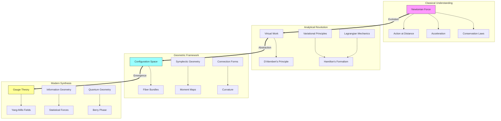
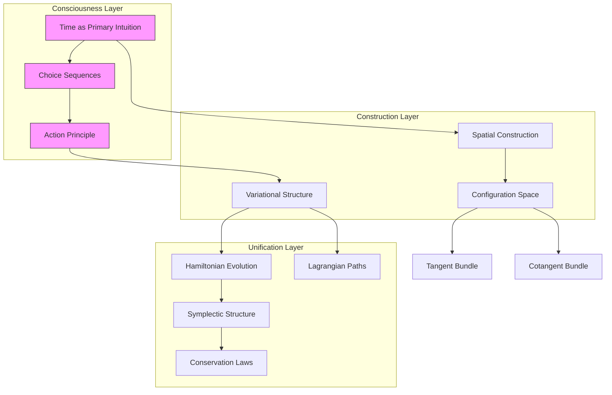
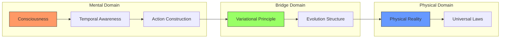

# The Essence of Force: A Geometric Journey Through Classical Mechanics
* * *

--- Force is not a cause but a consequence - it emerges from the geometry of space and time.

# Chapter 1: The Historical Evolution of Force

*"What we call force is but our mind grasping at shadows on the cave wall."*

## 1.1 Newton's Conception

Our journey begins not with Newton, but with a deeper question: Why did humanity first conceive of force? The ancient notion of "push and pull" arose from immediate bodily experience—the muscular sensation of effort against resistance. This anthropomorphic conception persisted from Aristotle through medieval impetus theory, seeing force as an inherent quality transferred between bodies.

Newton's genius lay not in measuring force—that had been done before—but in recognizing force as a mathematical relationship rather than a substance. His second law:
$$\mathbf{F} = m\mathbf{a}$$
appears deceptively simple. Yet it contains a profound shift: force becomes defined not by sensation but by its mathematical role in motion.

This abstraction came at a price. While mathematically powerful, force-based thinking introduces several conceptual difficulties:

1. **Action at a distance**: How can forces act instantaneously across space?
2. **Causality paradox**: If force causes acceleration, what causes force?
3. **Reference frame ambiguity**: Forces transform non-covariantly between frames

These issues hint at force's derivative nature—it is not fundamental but emergent from deeper principles.

## 1.2 The Analytical Revolution

The analytical revolution began with a subtle shift in perspective. D'Alembert's principle:
$$\sum_i (\mathbf{F}_i - m_i\mathbf{a}_i) \cdot \delta\mathbf{r}_i = 0$$
appears to merely rewrite Newton's laws. Yet it contains a revolutionary insight: force need not be primary. By considering virtual displacements $\delta\mathbf{r}_i$, D'Alembert transformed force from cause to constraint.

Euler deepened this insight through the calculus of variations. Consider a path $\gamma(t)$. Instead of asking what forces cause this motion, Euler asked: What property might characterize the actual path among all possible paths? This led to the functional perspective:
$$S[\gamma] = \int_{t_1}^{t_2} L(\gamma(t),\dot{\gamma}(t),t) \, dt$$
Here, force disappears entirely, replaced by the Lagrangian $L$. When we write:
$$\frac{d}{dt}\frac{\partial L}{\partial \dot{q}^i} - \frac{\partial L}{\partial q^i} = 0$$
forces re-emerge not as causes but as derived quantities—shadows cast by the geometry of configuration space.

The energy perspective completed this revolution. Hamilton's formulation:
$$H(q,p) = p_i\dot{q}^i - L(q,\dot{q})$$
reveals that what we call force is merely the gradient of potential energy:
$$\mathbf{F} = -\nabla V$$
This is not just mathematical convenience—it suggests force is secondary to more fundamental geometric structures.

[Technical note: The transition from force to geometry is reflected in the mathematical structures:
- Newton: Force vectors in $\mathbb{R}^3$
- D'Alembert: Constraint manifolds
- Hamilton: Symplectic geometry]

These developments reveal force as an intermediate concept—useful for calculation but not fundamental to nature's architecture. In the next chapter, we'll see how modern differential geometry completes this revolution, revealing force as an aspect of spatial curvature.

[Historical note: This evolution parallels the development of geometry itself, from Euclidean constructions to Riemann's intrinsic geometry.]

# Chapter 2: The Geometric Turn

*"Space itself dictates motion; force merely describes its curvature."*

## 2.1 Configuration Space and Constraints

The geometric revolution begins with a profound shift: instead of forces acting in space, space itself guides motion. Consider an $n$-particle system. Its configuration space $Q$ is not merely a convenience but the fundamental arena of dynamics:
$$Q = \{\text{all possible configurations}\} \simeq \mathbb{R}^{3n}$$
This seemingly simple definition contains a revolutionary insight: motion is fundamentally about paths in $Q$, not forces in $\mathbb{R}^3$.

The manifold structure of $Q$ emerges naturally through constraints. Consider a double pendulum. Its configuration space:
$$Q = S^1 \times S^1$$
reveals that constraints are not "forces" but the very geometry of possibility. The allowed motions are not those "forced" to obey constraints, but simply the natural geodesics in $Q$.

This geometrization deepens with the tangent bundle $TQ$ and cotangent bundle $T^*Q$:
$$\begin{align*}
TQ &= \{\text{configurations with velocities}\} \\
T^*Q &= \{\text{configurations with momenta}\}
\end{align*}$$
What we traditionally call "force" emerges as a vector field $F$ on $TQ$ or a one-form on $Q$—a geometric object rather than a causal agent.

## 2.2 The Role of Symmetry

Symmetry reveals the deepest connection between geometry and force. Noether's theorem states that every continuous symmetry yields a conservation law. But its profound meaning goes further: symmetries define what force can and cannot do.

Consider rotational symmetry. The conservation of angular momentum:
$$\frac{d}{dt}(\mathbf{r} \times \mathbf{p}) = 0$$
is not a consequence of forces but a geometric necessity—a statement about the structure of configuration space itself.

The relationship crystallizes in the momentum map $J$:
$$J: T^*Q \to \mathfrak{g}^*$$
where $\mathfrak{g}^*$ is the dual of the Lie algebra of symmetries. This reveals conservation laws as purely geometric features, independent of any notion of force.

Forces then emerge as symmetry breaking. Consider a central potential $V(r)$:
- Translational symmetry is broken → Forces appear
- Rotational symmetry remains → Angular momentum conserved

This leads to a profound realization: forces don't cause symmetry breaking—they are symmetry breaking.

[Technical insight: The modern perspective uses principal bundles:
- Configuration space $Q$ → Base space
- Symmetry group $G$ → Fiber
- Forces → Connection forms]

Key geometric structures emerge:

1. **Symplectic Form**:
   $$\omega = dq^i \wedge dp_i$$
   Not just a mathematical tool but the fundamental structure preserving geometry

2. **Momentum Map**:
   $$\langle J(z), X \rangle = \omega(X_Q(z), z)$$
   Unifying symmetries, conserved quantities, and geometry

3. **Connection Forms**:
   $$\alpha \in \Omega^1(P,\mathfrak{g})$$
   Revealing forces as geometric curvature

This geometric perspective resolves classical paradoxes:
- Action at a distance becomes curved configuration space
- Force causality becomes geometric necessity
- Reference frame ambiguity becomes bundle structure

[Mathematical note: The formalism naturally extends to:
- Gauge theories (principal bundles)
- Field theories (infinite-dimensional manifolds)
- Quantum mechanics (complex line bundles)]

In the next chapter, we'll see how this geometric understanding reveals force as an emergent phenomenon—a shadow cast by the curvature of possibility space itself.

# Chapter 3: Force as Emergent Phenomenon

*"Force emerges not from bodies pushing, but from space bending."*

## 3.1 Potential Theory

The transition from force to potential marks a fundamental shift in our understanding. Consider the classical equation:
$$\mathbf{F} = -\nabla V$$
Traditionally read as "potential creates force", we now understand it reversed: potential is primary, force derivative. This seemingly subtle shift revolutionizes our conception of physical law.

Consider a manifold $M$ with metric $g$. The natural motion emerges not from forces but from the gradient flow:
$$\frac{dx^i}{dt} = -g^{ij}\frac{\partial V}{\partial x^j}$$
This reveals a profound truth: particles don't move because they're pushed—they follow the natural geometry of their configuration space.

The modern perspective deepens through fiber bundles. A potential becomes a section of a line bundle $L \to M$:
$$V \in \Gamma(L)$$
"Forces" emerge as connections on this bundle:
$$\nabla_X V = (\partial_X + A_X)V$$
where $A$ is the connection one-form. This geometrizes force completely—it becomes pure curvature.

## 3.2 The Geometric Principle

The culmination comes through the principle of least action. Consider the action functional:
$$S[\gamma] = \int_{t_1}^{t_2} L(q,\dot{q},t)dt$$
Its Euler-Lagrange equations:
$$\frac{d}{dt}\frac{\partial L}{\partial \dot{q}^i} - \frac{\partial L}{\partial q^i} = 0$$
aren't force laws but statements about the geometry of path space.

The deep insight emerges through the Jacobi metric:
$$ds^2 = (E-V(q))(T_{ij} \, dq^i \, dq^j)$$
This reveals mechanical trajectories as geodesics in a curved space. "Force" disappears entirely, replaced by pure geometry.

The structure crystallizes through symplectic geometry. On $T^*Q$ with canonical symplectic form $\omega$:
$$\omega = dq^i \wedge dp_i$$
Hamilton's equations become:
$$i_{X_H}\omega = dH$$
This is not a force law but a statement of geometric necessity. The flow $X_H$ exists because of Darboux's theorem—a fact about symplectic manifolds, not forces.

[Technical insight: The modern framework uses:
- Symplectic reduction: $Q \to Q/G$
- Moment maps: $T^*Q  \to \mathfrak{g}^*$
- Connections on principal bundles]

Key geometric structures emerge:

1. **Ehresmann Connection**:
   $$\mathcal{H} \oplus \mathcal{V} = T(T^*Q)$$
   Splitting motion into horizontal and vertical components

2. **Symplectic Reduction**:
   $$J^{-1}(\mu)/G_\mu$$
   Revealing conservation laws as geometric quotients

3. **Geometric Phase**:
   $$\gamma = \oint A$$
   Unifying forces and topology

This leads to profound realizations:

1. **Force is Curvature**:
   - Not an entity but a measure of space bending
   - Emerges from global topology
   - Quantifiable through holonomy

2. **Motion is Natural**:
   - Follows geodesics in curved space
   - Conservation laws from symmetry
   - Evolution preserves geometry

3. **Reality is Geometric**:
   - Physical law as mathematical necessity
   - Force as derived concept
   - Structure determines behavior

[Mathematical note: This framework naturally extends to:
- Quantum mechanics (geometric quantization)
- Field theory (infinite jet bundles)
- Gravity (metric geometry)]

This geometric understanding transforms our view of force from cause to consequence—a shadow cast by the curvature of reality itself. In the next chapter, we'll explore how this perspective opens new horizons beyond classical mechanics.

# Chapter 4: Beyond Force

*"When we transcend force, we begin to see reality's true structure."*

## 4.1 Modern Perspectives

The geometric understanding of force opens profound new vistas. Consider Yang-Mills theory. Here, "force" becomes curvature of a principal $G$-bundle:
$$F = dA + \frac{1}{2}[A,A]$$
This isn't just mathematical abstraction—it reveals force as pure geometry. The electromagnetic force becomes curvature of a U(1) bundle; the strong force, curvature of an SU(3) bundle.

Quantum geometric phases deepen this insight. Berry's phase:
$$\gamma = i\oint \langle \psi|\nabla_R|\psi\rangle \cdot dR$$
reveals that quantum forces emerge from the geometry of state space itself. The Aharonov-Bohm effect:
$$\Delta\phi = \frac{e}{\hbar}\oint \mathbf{A}\cdot d\mathbf{r}$$
shows force-like effects without classical forces—pure topology.

Information theory provides another revolution. Consider the Fisher metric:
$$g_{ij} = \int p(x|\theta)\frac{\partial \log p}{\partial \theta^i}\frac{\partial \log p}{\partial \theta^j}dx$$
This reveals "statistical forces" as geodesic flow in probability space. The principle of maximum entropy:
$$S = -\sum_i p_i\log p_i$$
becomes geometric necessity, not physical law.

## 4.2 Future Directions

These perspectives suggest radical new directions. In quantum gravity, spacetime itself emerges from more fundamental structures. The Wheeler-DeWitt equation:
$$\mathcal{H}\Psi[g] = 0$$
suggests space, time, and force are all emergent phenomena.

Consider loop quantum gravity's fundamental insight: geometry is quantized. Space becomes a spin network:
$$|\Gamma,j_e,i_v\rangle$$
Forces emerge not from fields but from the discrete structure of spacetime itself.

String theory suggests an even more profound perspective. The $\beta$ function equations:
$$\beta^G_{\mu\nu} = R_{\mu\nu} + \nabla_\mu\nabla_\nu\Phi + ...$$
reveal gravity (and hence force) as a consistency requirement of quantum geometry.

Beyond current theories lie deeper possibilities:

1. **Emergent Causality**:
   - Time and force emerge together
   - Causal structure from quantum entanglement
   - Wheeler's "it from bit" principle

2. **Information Geometry**:
   - Reality as computation
   - Force from algorithmic necessity
   - Quantum circuits as fundamental

3. **Category Theory**:
   - Force as natural transformation
   - Physics from pure structure
   - Beyond geometry itself

[Technical insight: Modern frameworks suggest:
- Topos theory for quantum gravity
- Non-commutative geometry
- Higher category theory]

Key unifying principles emerge:

1. **Ultimate Emergence**:
   $$\text{Structure} \rightarrow \text{Geometry} \rightarrow \text{Force} \rightarrow \text{Experience}$$

2. **Information Foundation**:
   $$I = -\sum p_i\log p_i \rightarrow \text{All Physics}$$

3. **Pure Mathematics**:
   $$\text{Reality} \equiv \text{Mathematical Structure}$$

Future questions beckon:

1. **Beyond Geometry**:
   - What structures underlie space itself?
   - Is category theory more fundamental?
   - Can we transcend mathematical physics?

2. **Ultimate Reality**:
   - Is information fundamental?
   - Does consciousness play a role?
   - What lies beyond current mathematics?

3. **New Mathematics**:
   - Higher structures needed
   - Beyond set theory
   - Novel logical frameworks

[Final insight: Perhaps force, space, and time are all shadows of deeper mathematical structures we have yet to discover—or create.]

This journey from force to geometry may be just the beginning. The true nature of reality might transcend not just force, but geometry itself, leading to mathematical structures we can barely imagine today.

[Mathematical note: The future framework might use:
- $\infty$-categories
- Homotopy type theory
- Novel mathematical structures yet unknown]

As we close, we realize: Understanding force as geometry was just the first step. The true revolution lies ahead, in mathematical structures that will reshape our very conception of physical reality.

# Appendix A: Conceptual Architecture and Relations

*"The web of concepts reveals reality's geometric essence."*

## A.1 Conceptual Hierarchy and Relations

The following diagram captures the evolutionary understanding of force, from classical mechanics to geometric principles:

## A.2 Core Conceptual Framework

The following table articulates the key conceptual transformations across different levels of understanding:

| Level | Primary Entity | Mathematical Structure | Physical Interpretation | Geometric Essence |
|-------|---------------|----------------------|----------------------|------------------|
| Classical | Force Vector | $\mathbf{F} \in \mathbb{R}^3$ | Direct Causation | Euclidean Space |
| Analytical | Action Functional | $S[\gamma] = \int L \, dt$ | Variational Principle | Path Space |
| Geometric | Connection Form | $\omega \in \Omega^1(P,\mathfrak{g})$ | Structural Constraint | Fiber Bundle |
| Modern | Information Metric | $g_{ij} = E[\partial_i \log p \, \partial_j \log p]$ | Emergent Pattern | Statistical Manifold |

## A.3 Mathematical Architecture

The deep structure of force emerges through nested mathematical frameworks:

$$\begin{CD}
\text{Classical Force} @>>> \text{Potential Theory} @>>> \text{Connection Theory}\\
@VVV @VVV @VVV\\
\mathbb{R}^3 @>>> T^*Q @>>> P(M,G)\\
@VVV @VVV @VVV\\
\text{Vectors} @>>> \text{Symplectic Forms} @>>> \text{Gauge Fields}
\end{CD}$$

Where each transition reveals deeper geometric structure:

1. **First Order** (Classical):
   - Force vectors
   - Direct causation
   - Euclidean geometry

2. **Second Order** (Analytical):
   - Phase space
   - Hamiltonian flow
   - Symplectic geometry

3. **Third Order** (Modern):
   - Fiber bundles
   - Connection forms
   - Characteristic classes

## A.4 Emergent Principles

The conceptual evolution reveals three fundamental principles:

1. **Geometric Primacy**:
   $$\text{Geometry} \rightarrow \text{Force} \rightarrow \text{Motion}$$
   
2. **Structural Hierarchy**:
   $$\text{Local} \xrightarrow{\text{Connection}} \text{Global} \xrightarrow{\text{Topology}} \text{Universal}$$
   
3. **Information Foundation**:
   $$\text{Pattern} \rightarrow \text{Structure} \rightarrow \text{Force} \rightarrow \text{Dynamics}$$

[Mathematical note: The relationships presented here suggest force as an intermediate construct—neither fundamental nor arbitrary, but emergent from deeper mathematical structures.]

This appendix provides a multi-layered framework for understanding the evolution of force concepts, from concrete vectors to abstract geometric structures. Each layer reveals new aspects of the fundamental relationship between geometry and physics.

# Appendix B: The Architecture of Conscious Mechanics

*"In every structure of thought, consciousness finds its own reflection."*

## B.1 Core Concepts and Their Relations

Here we present the fundamental architecture of our constructive approach to mechanics, revealing the deep interconnections between consciousness, physical reality, and mathematical formalism.

## B.2 Fundamental Relations Table

| Concept | Primary Aspect | Conscious Construction | Mathematical Manifestation |
|---------|---------------|------------------------|---------------------------|
| Time | Flow of awareness | Choice sequences | $\mathbb{R} \text{ as consciousness}$ |
| Space | Motion potential | Configuration manifold | $Q \text{ as possibility}$ |
| Action | Change experience | Path construction | $S[\gamma] \text{ as synthesis}$ |
| Evolution | State flow | Phase space motion | $T^*Q \text{ as awareness}$ |
| Conservation | Invariant consciousness | Symmetry preservation | $\{F,H\}=0 \text{ as stability}$ |

## B.3 Consciousness-Reality Bridge

[Technical Note: This architecture reflects the intuitionistic foundation:
- All arrows represent constructive processes
- Each node embodies conscious creation
- The structure itself emerges through mental activity]

This architectural view reveals how consciousness constructs physical reality through successive layers of mathematical formalism, each emerging naturally from the previous through mental activity. The unity of mechanics appears not as an external discovery but as the necessary structure of conscious understanding itself.

[Final Note: This appendix provides a structural overview of our constructive approach, showing how the various concepts interweave to form a unified whole. The diagrams and tables should be read not as static structures but as dynamic patterns of conscious construction.]

