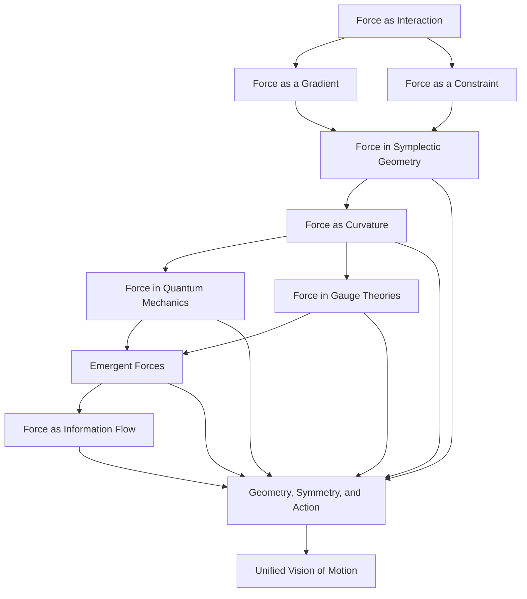

# The Essence of Force: A Geometric and Variational Perspective
* * *

--- Force is not an entity, but an echo of geometry and symmetry.

# **I. Introduction: The Question of Force**  
**Epigraph**: *"What moves the heavens is not force, but the harmony of laws."*

## **I.1. The Classical Definition of Force**  

Force, as introduced by Isaac Newton, is the cornerstone of classical mechanics. It is defined as the agent that causes a change in the motion of an object, encapsulated in the iconic second law of motion:
$$
\mathbf{F} = m\mathbf{a},
$$
where $\mathbf{F}$ is the force acting on a body, $m$ is its mass, and $\mathbf{a}$ is its acceleration. This formulation cemented force as a vector quantity capable of altering an object’s velocity, making it central to the study of motion.

Newtonian mechanics thrives on intuition: forces are external influences, like pushes and pulls, that directly affect an object’s state. This interpretation is particularly compelling when applied to simple systems, such as projectiles, pendulums, and planetary orbits. It provides a framework where forces can be measured, categorized (e.g., gravitational, electromagnetic), and superimposed.

However, this framework, while powerful and practical, is not without its limitations. It is a description, not an explanation, and it assumes force as a primary, irreducible concept. What is force, fundamentally? Is it a property of objects? A manifestation of energy? A geometric necessity? These deeper questions often remain hidden beneath its intuitive surface.

## **I.2. Limitations of the Newtonian View**

Though Newton’s conception of force is foundational, it begins to falter when faced with more complex systems or deeper questions. Three key limitations of the Newtonian perspective are worth noting:

1. **Dependence on Inertial Frames**:  
   Newton’s laws are strictly valid only in inertial reference frames. When transitioning to non-inertial frames, fictitious forces, such as centrifugal or Coriolis forces, must be introduced. These are not “real” forces but artifacts of the chosen coordinate system, raising questions about the universality of force.

2. **Ambiguity Under Constraints**:  
   In systems with constraints, such as a bead sliding along a wire or a pendulum swinging on a string, the forces maintaining the constraints (e.g., normal forces or tension) are not explicitly given by Newton’s laws. These forces emerge as geometric or variational necessities rather than fundamental interactions.

3. **Reduction to Energy Principles**:  
   The advent of Lagrangian and Hamiltonian mechanics revealed that motion could be described entirely in terms of energy principles, without direct reference to forces. In these formulations, force is no longer fundamental but a derived concept, subordinate to the principles of least action and the structure of configuration and phase space.

These limitations suggest that force, while indispensable in practical mechanics, may not be the deepest or most universal way to understand motion.

## **I.3. The Central Question: What is Force?**

To move beyond the classical view, we must confront the central question:  
*Is force a fundamental entity, or is it an emergent phenomenon derived from more primary principles of geometry, energy, and symmetry?*

This question invites us to re-evaluate the role of force in mechanics and to seek a deeper understanding of its nature. In doing so, we will explore:

- How force emerges from **gradients** of potential energy.  
- How force acts as a **geometric constraint** in variational principles.  
- How force dissolves into the **symplectic flows** of Hamiltonian mechanics.  
- How force is reinterpreted as **curvature** in non-inertial frames and general relativity.  

By following this path, we aim to reveal force not as an independent building block of mechanics but as a manifestation of deeper, more universal principles.

## **I.4. The Structure of the Document**

This exploration will unfold in layers, each delving deeper into the essence of force:

1. **Force in Classical Mechanics**:  
   We begin with the Newtonian conception of force and its reinterpretation in Lagrangian and Hamiltonian mechanics.

2. **Force as a Gradient and Constraint**:  
   We explore how force emerges as a gradient of potential energy and as a Lagrange multiplier enforcing geometric constraints.

3. **Force in Symplectic Geometry**:  
   In phase space, we examine how force vanishes as a primary entity, reappearing as the flow generated by the Hamiltonian.

4. **Force in Curvature and Geometry**:  
   We connect force to the curvature of configuration space and spacetime, showing its dependence on the geometry of the underlying manifold.

5. **The Future of Force**:  
   Finally, we speculate on the evolving role of force in quantum mechanics, gauge theories, and emergent phenomena, considering whether force will persist as a concept or dissolve into more abstract principles.

## **I.5. Why Re-Examine Force?**

The motivation for this re-examination is twofold:

1. **Theoretical Depth**: Force remains a cornerstone of physics, yet its nature is often taken for granted. By probing its essence, we gain deeper insights into the foundations of mechanics and the interplay between geometry, energy, and motion.

2. **Practical Implications**: A deeper understanding of force has implications for fields ranging from engineering to cosmology. Whether designing mechanical systems, modeling astrophysical phenomena, or exploring quantum gravity, the concept of force continues to evolve, and so must our understanding.

## **I.6. Key Insights**

From the outset, we establish three key insights that will guide our exploration:  

1. **Force is a Derived Concept**:  
   Force, as we understand it, is not fundamental but emerges from deeper principles such as energy gradients, geometric constraints, and symmetry.

2. **Geometry is Central**:  
   The essence of force lies in the geometry of configuration and phase space, where it reflects the curvature, constraints, and symmetries of the system.

3. **Symmetry Governs Motion**:  
   Force is deeply tied to symmetry, with conserved quantities (e.g., energy, momentum) arising from the invariances that shape motion.

## **I.7. Conclusion: A New Lens on Force**

This document invites the reader to transcend the classical view of force and embrace a more geometric and variational perspective. By the end of this journey, we aim to reimagine force not as an independent agent but as an echo of the deeper structures that govern motion.

In the next section, we begin with the Newtonian conception of force, tracing its evolution through classical mechanics and identifying the seeds of its modern reinterpretation.

This completes the introduction, setting the stage for a systematic exploration of the essence of force.

# **II. Force in Classical Mechanics**  
**Epigraph**: *"Force is the agent of change, but is it the origin of motion?"*

## **II.1. Newtonian Mechanics: Force as a Fundamental Interaction**

Newtonian mechanics begins with the premise that force is the primary cause of motion. In this framework, force is defined as the external influence that changes an object's state of motion, encapsulated in Newton's second law of motion:
$$
\mathbf{F} = m\mathbf{a},
$$
where $\mathbf{F}$ is the net force acting on an object, $m$ is its mass, and $\mathbf{a}$ is its acceleration. This equation establishes a direct, causal relationship between force and motion, making force the agent of change in mechanical systems.

**Intuitive Appeal**: Newton's formulation is both intuitive and practical. Forces such as gravity, tension, and friction are observable and measurable, making the concept accessible. This framework provides a powerful tool for solving problems in diverse domains, from planetary motion to engineering mechanics.

**Superposition and Universality**: Newtonian forces obey the principle of superposition, where the net force is the vector sum of individual forces acting on a body. This universality makes the concept of force adaptable to complex systems, where multiple interactions coexist.

However, this intuitive picture begins to blur when we probe deeper into the nature of force and motion.

## **II.2. The Constraints and Limitations of Newtonian Force**

While Newtonian mechanics excels in its descriptive power, it encounters conceptual and practical limitations:

1. **Dependence on Inertial Frames**:  
   Newton's laws are valid only in inertial reference frames. In non-inertial frames, fictitious forces—such as centrifugal and Coriolis forces—must be introduced to account for observed motion. These forces are not "real" forces but artifacts of the chosen coordinate system, undermining the universality of Newton's second law.

2. **Ambiguity in Systems with Constraints**:  
   In systems with geometric constraints, such as a pendulum constrained to swing along a circular arc or a bead sliding on a wire, the forces maintaining the constraints (e.g., tension or normal forces) are not explicitly determined by Newton's laws. These forces emerge instead as consequences of the system's geometry, suggesting that force is not the fundamental determinant of motion in such cases.

3. **Separation from Conservation Laws**:  
   Newtonian forces do not inherently explain why certain quantities, such as energy or momentum, are conserved. These conservation laws arise from deeper symmetries of nature, suggesting that force is not the most fundamental descriptor of motion.

## **II.3. Lagrangian Mechanics: Force as a Gradient**

The development of Lagrangian mechanics reframes the concept of force in terms of energy. In this formulation, the dynamics of a system are encoded in the **Lagrangian function**:
$$
L = T - V,
$$
where $T$ is the kinetic energy and $V$ is the potential energy. Rather than focusing on forces directly, Lagrangian mechanics describes motion through the **Principle of Least Action**:
$$
\delta S = 0, \quad S = \int_{t_1}^{t_2} L(q, \dot{q}, t) \, dt,
$$
where $S$ is the action, and $q$ represents the generalized coordinates of the system.

**Force as a Gradient**:  
In this framework, forces emerge as the gradients of potential energy in configuration space. For a single particle in a potential field $V(q)$, the force is given by:
$$
\mathbf{F} = -\nabla V.
$$
This reformulation shifts the focus from force as a primary quantity to potential energy as the governing principle. Motion is no longer driven by force alone but by the interplay of kinetic and potential energy.

**Advantages of the Lagrangian Perspective**:  
1. **Unified Treatment of Constraints**: Forces enforcing constraints, such as tension or normal forces, arise naturally as **Lagrange multipliers** in the variational formulation. This eliminates the need to treat such forces as separate entities.  
2. **Generality Across Coordinate Systems**: Lagrangian mechanics operates independently of the choice of coordinate system, making it particularly powerful for analyzing systems in non-Cartesian coordinates.  
3. **Connection to Symmetry**: The equations of motion derived from the Lagrangian naturally encode conservation laws, such as conservation of energy and momentum, through **Noether's theorem**. This reveals a deeper connection between motion and the symmetries of the system.

## **II.4. Hamiltonian Mechanics: Force as a Derived Quantity**

The Hamiltonian formulation of mechanics takes the abstraction one step further, shifting the focus from forces and accelerations to the evolution of a system in **phase space**. The state of a system is described by its generalized coordinates $q$ and conjugate momenta $p$, and its dynamics are governed by the **Hamiltonian function**:
$$
H = T + V,
$$
which represents the total energy of the system.

**Hamilton's Equations**:  
The equations of motion in Hamiltonian mechanics are given by:
$$
\dot{q}^i = \frac{\partial H}{\partial p_i}, \quad \dot{p}_i = -\frac{\partial H}{\partial q^i}.
$$
These equations describe the flow of the system in phase space, with force implicitly encoded in the derivatives of the Hamiltonian. Unlike Newtonian mechanics, where force is a primary concept, here force is a secondary quantity, derived from the energy landscape of the system.

**Force Dissolves into Symplectic Geometry**:  
In Hamiltonian mechanics, the symplectic structure of phase space takes center stage. The dynamics of the system are governed by the symplectic form:
$$
\omega = \sum_{i=1}^n dp_i \wedge dq^i,
$$
which is invariant under Hamiltonian flow. The concept of force as an independent entity dissolves, replaced by the geometric properties of phase space.

## **II.5. Reconciling the Perspectives**

The evolution from Newtonian to Lagrangian to Hamiltonian mechanics reveals a progressive abstraction of the concept of force. What begins as a tangible, intuitive quantity in Newtonian mechanics becomes increasingly geometric and derivative in nature:

1. **Newtonian Mechanics**: Force is a direct agent of change, driving motion according to $\mathbf{F} = m\mathbf{a}$.  
2. **Lagrangian Mechanics**: Force emerges as the gradient of potential energy, subordinate to the Principle of Least Action.  
3. **Hamiltonian Mechanics**: Force becomes a derivative of the Hamiltonian, embedded in the symplectic geometry of phase space.  

This progression suggests that force, while indispensable in classical mechanics, is not a fundamental building block but an emergent concept, arising from deeper principles of energy, geometry, and symmetry.

## **II.6. Key Insights**

1. **Force as Interaction vs. Derivation**:  
   Newtonian mechanics treats force as a fundamental interaction, while Lagrangian and Hamiltonian mechanics derive force from energy principles.

2. **Force and Geometry**:  
   The transition from configuration space (Lagrangian mechanics) to phase space (Hamiltonian mechanics) reveals the geometric nature of force, linking it to gradients, constraints, and flows.

3. **Force is Context-Dependent**:  
   In systems with constraints or in non-inertial frames, force loses its universality, appearing as a geometric or coordinate-dependent artifact.

## **II.7. Transition to the Next Section**

Having explored the role of force in classical mechanics, we now turn to its reinterpretation within the language of variational principles. In the next section, we will examine how force emerges as a gradient of potential energy and as a constraint in the context of the Principle of Least Action, deepening our understanding of its geometric and variational essence.

This section completes the historical and conceptual foundation for the document, setting the stage for a deeper geometric exploration of force.

# **III. Force as a Gradient and Constraint**  
**Epigraph**: *"Force is a shadow cast by the geometry of potential energy."*

## **III.1. Force as a Gradient of Potential Energy**

In the framework of variational mechanics, the concept of force is naturally reinterpreted as the gradient of potential energy in configuration space. Consider a system described by generalized coordinates $q^i$ in configuration space. If the system is subject to a potential energy $V(q)$, the force acting on the system is given by:
$$
\mathbf{F} = -\nabla V(q),
$$
where $\nabla V$ denotes the gradient of $V$ with respect to the coordinates $q^i$. This equation illustrates that force is not an independent entity but a derivative of the scalar potential energy function.

### **III.1.1. The Geometry of Gradients**  
The gradient $\nabla V$ represents the direction in configuration space along which $V(q)$ increases most rapidly. The minus sign in $\mathbf{F} = -\nabla V$ reflects the fact that forces act to minimize potential energy, driving the system toward states of lower energy. This geometric interpretation reveals that forces are fundamentally tied to the topography of the potential energy landscape.

### **III.1.2. Example: The Harmonic Oscillator**  
For a one-dimensional harmonic oscillator with potential energy $V(x) = \frac{1}{2}kx^2$, the force is:
$$
F = -\frac{dV}{dx} = -kx.
$$
Here, the linear restoring force is directly proportional to the displacement $x$, and its direction is always toward the equilibrium position ($x = 0$), where $V(x)$ is minimized. This simple example highlights how forces emerge as mathematical consequences of the potential energy function.

### **III.1.3. Central Force Fields**  
In systems with spherical symmetry, such as gravitational or electrostatic fields, the potential energy depends only on the radial distance $r$ from a central point:
$$
V(r) = \frac{-k}{r}.
$$
The force is then:
$$
\mathbf{F} = -\nabla V(r) = -\frac{\partial V}{\partial r} \hat{\mathbf{r}} = \frac{k}{r^2} \hat{\mathbf{r}},
$$
where $\hat{\mathbf{r}}$ is the radial unit vector. This derivation shows that the inverse-square law of force arises naturally from the gradient of a scalar potential.

## **III.2. Force as a Lagrange Multiplier**

In systems with constraints, forces often appear as secondary quantities that enforce the constraints. These forces are not explicitly part of the system's dynamics but arise as **Lagrange multipliers** in the variational formulation.

### **III.2.1. The Principle of Least Action with Constraints**  
The Principle of Least Action states that the trajectory of a system extremizes the action functional:
$$
S[q] = \int_{t_1}^{t_2} L(q, \dot{q}, t) \, dt,
$$
where $L(q, \dot{q}, t) = T - V$ is the Lagrangian. For systems subject to constraints $g_j(q, t) = 0$, the action is modified by introducing Lagrange multipliers $\lambda^j(t)$:
$$
S[q, \lambda] = \int_{t_1}^{t_2} \left( L(q, \dot{q}, t) + \sum_j \lambda^j g_j(q, t) \right) dt.
$$

The additional terms enforce the constraints during the system's evolution. The variation of the action yields the equations of motion:
$$
\frac{d}{dt} \left( \frac{\partial L}{\partial \dot{q}^i} \right) - \frac{\partial L}{\partial q^i} = \sum_j \lambda^j \frac{\partial g_j}{\partial q^i},
$$
where $\lambda^j \frac{\partial g_j}{\partial q^i}$ represents the constraint force acting on the system.

### **III.2.2. Example: A Bead on a Wire**  
Consider a bead constrained to slide along a curved wire in three-dimensional space. The position of the bead is described by $\mathbf{r}(t) = (x(t), y(t), z(t))$, and the constraint is that the bead remains on the wire, defined by $g(\mathbf{r}) = 0$. The Lagrangian is:
$$
L = \frac{1}{2}m\dot{\mathbf{r}}^2 - V(\mathbf{r}).
$$
The constraint force is:
$$
\mathbf{F}_\text{constraint} = \lambda \nabla g(\mathbf{r}),
$$
where $\lambda$ is the Lagrange multiplier. This force acts perpendicular to the wire, ensuring the bead remains on the constrained path.

### **III.2.3. General Interpretation**  
In constrained systems, forces such as the normal force or tension are not fundamental interactions but geometric effects that arise to satisfy the constraints. The Lagrange multipliers $\lambda^j$ encode the magnitude of these forces, linking them directly to the system's geometry.

## **III.3. Force and the Principle of Least Action**

The Principle of Least Action provides the most general framework for understanding force. In this context, force is neither a primitive concept nor a starting point; it is a byproduct of the variational process that determines the system's trajectory.

### **III.3.1. The Variational Nature of Force**  
The equations of motion derived from the action principle:
$$
\delta S = 0 \quad \Rightarrow \quad \frac{d}{dt} \left( \frac{\partial L}{\partial \dot{q}^i} \right) - \frac{\partial L}{\partial q^i} = 0,
$$
show that force appears as the term balancing the generalized momentum $\frac{\partial L}{\partial \dot{q}^i}$ with the spatial variation of the Lagrangian $\frac{\partial L}{\partial q^i}$. In systems where $L = T - V$, this reduces to the familiar form:
$$
\mathbf{F} = -\nabla V.
$$
However, in more general systems with constraints or non-conservative forces, the variational formulation naturally incorporates these complexities without requiring force to be treated as a separate concept.

### **III.3.2. Force as a Secondary Quantity**  
In the variational framework, force is not an input but an output. The primary quantities are the Lagrangian $L$, the action $S$, and the constraints $g_j(q, t)$. Force arises as a derived entity, reflecting the system's response to its energy landscape and geometric constraints.

## **III.4. Key Insights**

1. **Force as a Gradient**:  
   Forces emerge as gradients of potential energy, reflecting the geometry of the energy landscape in configuration space.

2. **Force as a Constraint**:  
   In systems with constraints, forces are not fundamental but arise as Lagrange multipliers, enforcing the system's geometric or physical restrictions.

3. **Force as Variational Output**:  
   The Principle of Least Action shows that force is a secondary quantity, derived from the extremization of the action functional. It is an artifact of deeper principles governing motion.

## **III.5. Transition to the Next Section**

Having explored the reinterpretation of force as a gradient and as a constraint within variational principles, we now turn to its role in phase space. In the next section, we will examine how force dissolves into the symplectic flows of Hamiltonian mechanics, where it is governed by the geometry of phase space rather than acting as an independent entity.

This section deepens the reader's understanding of force as an emergent consequence of geometry and variational reasoning, setting the stage for the even more abstract reformulations found in symplectic geometry.

# **IV. Force in Symplectic Geometry**  
**Epigraph**: *"In phase space, force dissolves into the flow of energy."*

## **IV.1. Symplectic Geometry: The Foundation of Phase Space Dynamics**

Symplectic geometry lies at the heart of Hamiltonian mechanics, providing the mathematical structure that governs the evolution of physical systems in phase space. Phase space, defined by the generalized coordinates $q^i$ and conjugate momenta $p_i$, serves as the natural arena for describing the state of a mechanical system. Unlike configuration space, which focuses solely on positions, phase space encompasses both positions and momenta, capturing the complete dynamical state of a system.

At the core of symplectic geometry is the symplectic 2-form:
$$
\omega = \sum_{i=1}^n dp_i \wedge dq^i,
$$
where $\wedge$ denotes the wedge product, encoding the antisymmetric pairing of momenta and positions. This 2-form defines the geometric structure of phase space and plays a central role in determining the system's dynamics.

### **IV.1.1. Key Properties of the Symplectic Form**  

1. **Non-Degeneracy**:  
   The symplectic form $\omega$ is non-degenerate, meaning that for any non-zero tangent vector $v$ in phase space, there exists another tangent vector $w$ such that:
   $$
   \omega(v, w) \neq 0.
   $$
   This property ensures that positions and momenta are intrinsically linked, with no redundancy in the phase space description.

2. **Closedness**:  
   The symplectic form is closed, satisfying:
   $$
   d\omega = 0,
   $$
   where $d$ denotes the exterior derivative. This property implies the conservation of phase space volume under Hamiltonian flow, as formalized in Liouville’s theorem.

3. **Invariance**:  
   The symplectic form is invariant under canonical transformations, which preserve the structure of phase space and the equations of motion. This invariance highlights the universality of Hamiltonian mechanics across different coordinate systems.

## **IV.2. Dynamics in Phase Space: Hamilton’s Equations**

In Hamiltonian mechanics, the dynamics of a system are encoded in the **Hamiltonian function** $H(q, p, t)$, which represents the total energy of the system:
$$
H = T + V,
$$
where $T$ is the kinetic energy and $V$ is the potential energy. The evolution of the system is governed by **Hamilton’s equations**:
$$
\dot{q}^i = \frac{\partial H}{\partial p_i}, \quad \dot{p}_i = -\frac{\partial H}{\partial q^i}.
$$

These equations describe the flow of the system in phase space, where $\dot{q}^i$ and $\dot{p}_i$ are the time derivatives of the coordinates and momenta. The symplectic form $\omega$ ensures that this flow is deterministic and reversible, with no loss of information.

### **IV.2.1. Force in Hamiltonian Mechanics**  
In the Hamiltonian formalism, force is no longer an independent entity. Instead, it is embedded in the derivatives of the Hamiltonian:
$$
\mathbf{F} = -\frac{\partial H}{\partial q^i}.
$$
This relationship shows that forces arise from the energy landscape of phase space, governed by the symplectic structure. Rather than acting as the primary driver of motion, force becomes a manifestation of the Hamiltonian flow.

### **IV.2.2. Geometric Interpretation of Hamilton’s Equations**  
Hamilton’s equations can be understood geometrically as the flow generated by the Hamiltonian vector field $X_H$, which satisfies:
$$
\iota_{X_H} \omega = dH,
$$
where $\iota_{X_H}$ denotes the interior product of $X_H$ with the symplectic form. This equation states that the Hamiltonian flow preserves the symplectic structure, ensuring consistency and conservation in the evolution of the system.

## **IV.3. Canonical Transformations: Invariance of the Symplectic Structure**

Canonical transformations are changes of coordinates in phase space that preserve the symplectic form $\omega$. These transformations are essential for simplifying complex systems and revealing hidden symmetries. Mathematically, a transformation $(q^i, p_i) \to (Q^i, P_i)$ is canonical if:
$$
\omega' = \sum_{i=1}^n dP_i \wedge dQ^i = \omega.
$$

### **IV.3.1. Darboux’s Theorem: Local Universality of Symplectic Geometry**  
One of the most profound results in symplectic geometry is Darboux’s theorem, which states that, locally, every symplectic manifold is equivalent to a canonical form. This means that regardless of the complexity of the system or the choice of coordinates, the symplectic structure can always be expressed as:
$$
\omega = \sum_{i=1}^n dP_i \wedge dQ^i.
$$
This universality underscores the geometric nature of Hamiltonian mechanics and the secondary role of force as a derived quantity.

### **IV.3.2. Impact on Force**  
Under canonical transformations, the equations of motion remain invariant, but the interpretation of force can change. For example, forces that appear complex in one set of coordinates may vanish or simplify in another. This reinforces the idea that force is not fundamental but context-dependent, shaped by the choice of coordinates and the underlying symplectic structure.

## **IV.4. Force as a Derived Concept in Symplectic Geometry**

In the symplectic framework, force dissolves as a primary concept, replaced by the geometric flow of energy in phase space. Several key insights emerge from this reinterpretation:

1. **Force as Symplectic Flow**:  
   Forces are encoded in the Hamiltonian vector field $X_H$, which generates the flow of the system in phase space. The symplectic structure ensures that this flow conserves energy and phase space volume.

2. **Force as Context-Dependent**:  
   In symplectic geometry, forces are not universal quantities but arise from the specific form of the Hamiltonian. They depend on the system’s energy landscape and the choice of coordinates.

3. **Force and Symmetry**:  
   The invariance of the symplectic form under canonical transformations highlights the deeper role of symmetry in governing motion. Force becomes a secondary consequence of these symmetries, not a fundamental driver of motion.

## **IV.5. Key Insights**

1. **Geometry Over Forces**:  
   In phase space, the symplectic structure replaces force as the central concept. Motion is governed by geometric flows, not by Newtonian interactions.

2. **Forces as Derivatives**:  
   Forces are embedded in the derivatives of the Hamiltonian, subordinate to the energy landscape of the system.

3. **Universality of Symplectic Geometry**:  
   The invariance of the symplectic form under canonical transformations reveals the universality of Hamiltonian mechanics, transcending the specific nature of forces.

## **IV.6. Transition to the Next Section**

Having explored the role of force in symplectic geometry, we now turn to its connection with curvature and geometry. In the next section, we will examine how force arises as a manifestation of geometric properties in non-inertial frames and in the context of general relativity, where it reflects the curvature of spacetime itself.

This section highlights the dissolution of force as an independent concept within symplectic geometry, emphasizing its emergence as a derivative phenomenon governed by the geometry of phase space. It sets the stage for further abstraction, linking force to the curvature of spacetime in the next section.

# **V. Force in Curvature and Geometry**  
**Epigraph**: *"Force is the curvature of the path through spacetime."*

## **V.1. Force in Non-Inertial Frames: Curvature in Configuration Space**

In non-inertial reference frames, the concept of force expands to include fictitious forces, which arise not from physical interactions but from the curvature of the configuration manifold. These forces provide a striking example of how "force" can emerge as a geometric artifact rather than a fundamental entity.

### **V.1.1. Fictitious Forces and Curvature**  
When a reference frame accelerates, the equations of motion must account for the relative effects experienced by objects within that frame. For example, in a rotating reference frame, the fictitious forces include the centrifugal force and the Coriolis force:
$$
\begin{aligned}
\mathbf{F}_\text{centrifugal} & = - m \boldsymbol{\omega} \times (\boldsymbol{\omega} \times \mathbf{r}), \\
\mathbf{F}_\text{Coriolis} & = - 2m (\boldsymbol{\omega} \times \mathbf{v}),
\end{aligned}
$$
where $\boldsymbol{\omega}$ is the angular velocity of the rotating frame, and $\mathbf{r}$ and $\mathbf{v}$ are the position and velocity of the object relative to the rotating frame.

These forces are not "real" in the Newtonian sense; they are artifacts of the frame's non-inertial nature. However, they are essential for describing motion within the chosen frame and can be understood as arising from the effective curvature of the configuration space induced by the frame's acceleration.

### **V.1.2. Geometric Interpretation in Configuration Space**  
The fictitious forces correspond to Christoffel symbols in the equations of motion:
$$
\frac{d^2 q^i}{dt^2} + \Gamma^i_{jk} \frac{dq^j}{dt} \frac{dq^k}{dt} = 0,
$$
where $\Gamma^i_{jk}$ are the Christoffel symbols of the configuration manifold. These symbols encapsulate how the manifold's curvature dictates the apparent forces acting on the system. The fictitious forces thus emerge as a direct consequence of the geometry of the configuration space, reinforcing the idea that force is not fundamental but geometric in origin.

## **V.2. Force in General Relativity: Curvature of Spacetime**

Einstein's theory of general relativity provides a profound geometric reinterpretation of force, particularly gravitational force. In this framework, gravity is no longer a force but a manifestation of the curvature of spacetime itself.

### **V.2.1. The Einstein Field Equations**  
The foundation of general relativity is the Einstein field equations:
$$
G_{\mu\nu} = \frac{8\pi G}{c^4} T_{\mu\nu},
$$
where $G_{\mu\nu}$ is the Einstein tensor describing spacetime curvature, $T_{\mu\nu}$ is the stress-energy tensor describing matter and energy, $G$ is the gravitational constant, and $c$ is the speed of light.

These equations describe how matter and energy curve spacetime, and in turn, how this curvature guides the motion of objects. The geodesic equation:
$$
\frac{d^2 x^\mu}{d\tau^2} + \Gamma^\mu_{\nu\rho} \frac{dx^\nu}{d\tau} \frac{dx^\rho}{d\tau} = 0,
$$
describes the motion of free-falling objects, where $\Gamma^\mu_{\nu\rho}$ are the Christoffel symbols associated with spacetime curvature.

### **V.2.2. Gravity as Geometry**  
In this formulation, the gravitational force traditionally described by Newton's law:
$$
\mathbf{F}_\text{gravity} = -\frac{G m_1 m_2}{r^2} \hat{\mathbf{r}},
$$
is replaced by the curvature of spacetime. Objects in free fall follow geodesics—paths of extremal length—in the curved spacetime, and what we perceive as gravitational force is simply the effect of this curvature on the motion of objects.

### **V.2.3. The Christoffel Symbols as Force Analogs**  
The Christoffel symbols $\Gamma^\mu_{\nu\rho}$, which appear in the geodesic equation, play a role analogous to forces in Newtonian mechanics. They describe how spacetime curvature influences the trajectory of an object, acting as "force coefficients" that depend on the geometry of spacetime rather than any direct physical interaction.

## **V.3. The Geometric Unification of Force**

The examples of fictitious forces in non-inertial frames and gravitational forces in general relativity highlight a unifying theme: force can often be reinterpreted as a manifestation of curvature, whether in configuration space or spacetime. This geometric perspective provides a deeper understanding of force as an emergent phenomenon tied to the underlying structure of the manifold.

### **V.3.1. Geodesics as the Natural Path**  
In both configuration space and spacetime, the trajectories of objects are determined by geodesics—paths that extremize some variational principle, such as the action in classical mechanics or the spacetime interval in general relativity. The deviations from geodesic motion, which we interpret as forces, arise from the curvature of the manifold or the constraints imposed on the system.

### **V.3.2. Constraints and Curvature**  
The interplay between constraints and curvature is particularly evident in systems with non-trivial geometry. For example:
- In a rotating frame, the curvature of configuration space leads to fictitious forces.
- In a gravitational field, the curvature of spacetime dictates the motion of objects.

In both cases, the forces are not fundamental but are artifacts of the geometry.

## **V.4. Key Insights**

1. **Force as Curvature**:  
   Both fictitious forces in non-inertial frames and gravitational forces in general relativity emerge from the curvature of the underlying manifold, whether configuration space or spacetime.

2. **Geodesics Over Forces**:  
   The true natural paths of motion are geodesics, determined by variational principles and the manifold's geometry. Forces arise as deviations from these geodesic paths.

3. **Christoffel Symbols as Force Proxies**:  
   The Christoffel symbols, which describe the connection on a manifold, play a role analogous to forces, encapsulating how geometry dictates motion.

4. **Unification Through Geometry**:  
   The geometric perspective unifies diverse phenomena under the umbrella of curvature, offering a deeper understanding of force as an emergent, context-dependent concept.

## **V.5. Transition to the Next Section**

Having explored the geometric nature of force in curved manifolds, we turn now to its possible future interpretations. In the next section, we will examine how the concept of force might evolve in the context of quantum mechanics, gauge theories, and emergent phenomena, and whether it might ultimately dissolve into more fundamental principles of geometry, symmetry, and information.

This section bridges the classical and relativistic views of force as curvature, preparing the reader for a speculative exploration of force's future in modern physics. It emphasizes the unifying power of geometry in reimagining force as an emergent phenomenon tied to the structure of space and time.

# **VI. The Future of Force**  
**Epigraph**: *"What remains of force when the equations are rewritten?"*

## **VI.1. Quantum Mechanics: The Disappearance of Force**

In the quantum realm, the classical notion of force becomes ambiguous, often dissolving entirely into more fundamental descriptions of physical phenomena. Quantum mechanics, governed by the Schrödinger equation:
$$
i\hbar \frac{\partial \Psi}{\partial t} = \hat{H}\Psi,
$$
shifts the focus from particles and forces to wavefunctions and operators. The Hamiltonian $\hat{H}$, representing the system's total energy, defines the evolution of the wavefunction $\Psi$. Force, as a vector quantity acting on particles, is notably absent.

### **VI.1.1. Potential Energy Supersedes Force**  
In quantum mechanics, dynamics are dictated by the potential energy function $V(q)$, which appears in $\hat{H}$ as part of the system's energy landscape. The classical force $\mathbf{F} = -\nabla V$ is no longer explicitly required; instead, the wavefunction evolves according to the potential's spatial structure. The concept of force becomes implicit, a secondary artifact of the potential’s influence on the probability density $|\Psi|^2$.

### **VI.1.2. Quantum Fields and Force as Exchange**  
In quantum field theory, the concept of force emerges in a radically different form. Forces between particles are mediated by the exchange of virtual particles, such as photons in electromagnetic interactions or gluons in the strong nuclear force. These mediators are quanta of the underlying fields, making force a manifestation of field interactions rather than a fundamental entity. For example:
$$
\mathbf{F}_\text{Coulomb} \propto \frac{1}{r^2}
$$
is understood as the result of photon exchange between charged particles. Here, force is an emergent phenomenon, subordinate to the field's quantum properties.

## **VI.2. Gauge Theories: Force as Symmetry**

In the Standard Model of particle physics, forces are reinterpreted as manifestations of symmetries. Gauge theories such as quantum electrodynamics (QED) and quantum chromodynamics (QCD) describe forces as the result of local gauge invariance—a principle requiring that the laws of physics remain unchanged under certain transformations of the fields.

### **VI.2.1. Forces as Gauge Interactions**  
In gauge theories, the fundamental forces (electromagnetic, weak, and strong) arise as interactions mediated by gauge bosons. For example:
- **Electromagnetic Force**: Mediated by photons, arising from $U(1)$ gauge symmetry.
- **Weak Nuclear Force**: Mediated by $W^\pm$ and $Z$ bosons, associated with $SU(2)$ gauge symmetry.
- **Strong Nuclear Force**: Mediated by gluons, associated with $SU(3)$ gauge symmetry.

In this framework, force is no longer a primitive concept but an emergent consequence of field symmetries. The equations governing these interactions, such as the Yang-Mills equations:
$$
D_\mu F^{\mu\nu} = J^\nu,
$$
where $D_\mu$ is the covariant derivative and $F^{\mu\nu}$ is the field strength tensor, reveal that forces are encoded in the geometry of the gauge fields.

### **VI.2.2. The Role of Symmetry**  
Gauge symmetries unify our understanding of forces, reducing them to the invariance properties of the underlying fields. Force dissolves into the language of symmetry, where interactions are shaped by the mathematical structure of the gauge group.

## **VI.3. Emergent Phenomena: Force in Complex Systems**

In complex systems, such as condensed matter physics or biology, the concept of force reappears in surprising and emergent ways. Here, force is not a fundamental interaction but a macroscopic phenomenon arising from the collective behavior of many underlying entities.

### **VI.3.1. Emergent Forces in Condensed Matter**  
In systems like superfluids, superconductors, or topological materials, effective forces emerge from the collective properties of the system. For example:
- The "force" driving the flow of Cooper pairs in a superconductor arises from the quantum mechanical pairing of electrons, not from a classical interaction.
- In topological insulators, edge currents behave as if driven by fictitious forces, reflecting the system's topological invariants.

These emergent forces are not reducible to fundamental interactions but are instead encoded in the system's large-scale behavior, demonstrating how force can arise from deeper principles of organization.

### **VI.3.2. Biological Systems and Collective Behavior**  
In biological and ecological systems, forces emerge as effective descriptions of collective phenomena. For instance:
- The "force" aligning the movement of birds in a flock or fish in a school is not a physical interaction but an emergent behavior resulting from local rules and feedback mechanisms.
- In ecosystems, forces like "competitive pressure" or "evolutionary drive" describe emergent dynamics rather than fundamental forces.

These examples suggest that force can be a useful metaphor for describing emergent patterns, even in contexts far removed from traditional physics.

## **VI.4. Beyond Force: Toward Fundamental Principles**

As we push the boundaries of our understanding, it becomes increasingly plausible that force will dissolve entirely as a concept, replaced by more fundamental principles of geometry, symmetry, and information.

### **VI.4.1. Force as Information Flow**  
Some theoretical frameworks propose that force is a manifestation of information flow. For example, in the holographic principle, gravity and spacetime itself emerge from the entanglement structure of quantum information. In such a view, force becomes a secondary construct, arising from the way information propagates and interacts.

### **VI.4.2. Force and the Primacy of Geometry**  
The geometric unification of forces in general relativity and gauge theories suggests that geometry may be the ultimate framework for understanding interactions. In such a paradigm, force is replaced by the curvature of abstract manifolds, whether in spacetime, configuration space, or phase space.

### **VI.4.3. The End of Force?**  
If physics continues to move toward deeper abstractions, force may eventually vanish as an independent concept. It will be absorbed into a more universal theory that prioritizes principles like symmetry, invariance, and information. In this sense, force is not the foundation of motion but a shadow cast by the underlying architecture of reality.

## **VI.5. Key Insights**

1. **Force as a Quantum Artifact**:  
   In quantum mechanics and quantum field theory, force dissolves into the dynamics of wavefunctions and the exchange of virtual particles.

2. **Force as Symmetry**:  
   In gauge theories, force emerges as a consequence of local gauge invariance, tied to the geometry of the underlying fields.

3. **Force as Emergent Phenomenon**:  
   In complex systems, force arises as an effective description of collective behavior, not as a fundamental interaction.

4. **The Dissolution of Force**:  
   In the future, force may be entirely replaced by universal principles of geometry, symmetry, and information, reflecting the deeper structure of reality.

## **VI.6. Transition to the Conclusion**

With the evolving role of force in quantum mechanics, gauge theories, and emergent systems, we have witnessed its gradual dissolution as a fundamental concept. In the concluding section, we will synthesize these insights, reimagining force as an artifact of deeper principles and reflecting on its implications for our understanding of the universe.

This section speculates on the future of force, tracing its decline as a fundamental concept and its absorption into broader frameworks of symmetry, geometry, and emergence. It invites the reader to view force not as a primary entity but as a contextual phenomenon shaped by the deeper architecture of reality.

# **VII. Conclusion: Force Reimagined**  
**Epigraph**: *"Force is the language of motion, but geometry is its grammar."*

## **VII.1. The Evolution of Force: From Fundamental to Emergent**

The journey we have undertaken reveals that the concept of force, while foundational to classical mechanics, is not an immutable truth but a contingent construct. Its evolution through successive frameworks of physics—Newtonian, Lagrangian, Hamiltonian, and beyond—demonstrates its gradual demotion from a fundamental entity to an emergent artifact of deeper principles.

1. **Force in Newtonian Mechanics**:  
   Force was initially conceived as the cornerstone of motion, an intuitive and measurable agent of change. It acted as the bridge between cause and effect, encapsulating interactions in the form of $\mathbf{F} = m\mathbf{a}$.

2. **Force in Variational Principles**:  
   With the advent of variational mechanics, force was reinterpreted as a derivative quantity, emerging from the geometry of the potential energy landscape or as a constraint enforcing the system's configuration. The Principle of Least Action revealed that motion is governed by the extremization of energy-based quantities, relegating force to a supporting role.

3. **Force in Symplectic Geometry**:  
   In the Hamiltonian framework, force dissolved further, replaced by the symplectic flow of phase space. Motion became a geometric phenomenon, with force encoded implicitly in the derivatives of the Hamiltonian. The symplectic structure, not force, dictated the system's evolution.

4. **Force as Curvature**:  
   In relativistic and geometric contexts, force was reimagined as a consequence of curvature. Whether in the configuration space of non-inertial frames or the spacetime of general relativity, force emerged as an artifact of the manifold's structure, encapsulated in Christoffel symbols and geodesic deviation.

5. **Force in Modern Physics**:  
   In quantum mechanics and gauge theories, force became a shadow, a secondary effect of deeper phenomena such as field symmetries, particle exchange, or information flow. It ceased to be a primitive concept, dissolving into the mathematical frameworks of wavefunctions, gauge fields, and spacetime geometry.

This progression illustrates that force is not an entity unto itself but a reflection of deeper symmetries, geometries, and variational principles. Its utility lies in its ability to encode and represent these underlying structures, but it is not fundamental.

## **VII.2. The Unifying Role of Geometry, Symmetry, and Variational Reasoning**

The reimagined essence of force is inseparable from the triumvirate of geometry, symmetry, and variational reasoning. These principles form the scaffolding upon which the concept of force is constructed and reinterpreted.

1. **Geometry as the Foundation**:  
   From configuration space to phase space to spacetime, the geometry of the underlying manifold dictates the motion of systems. Force emerges as the manifestation of curvature, gradients, or constraints within these spaces. The Christoffel symbols, symplectic forms, and potential energy functions are all geometric constructs that give rise to the phenomena we interpret as forces.

2. **Symmetry as the Governing Law**:  
   Noether's theorem revealed the deep connection between symmetries and conservation laws. Forces are tied to broken symmetries or variations in the invariance of a system. Gauge theories further demonstrated that forces are not fundamental interactions but consequences of local symmetries in quantum fields.

3. **Variational Principles as the Driver of Motion**:  
   The Principle of Least Action provides the ultimate framework for understanding motion. Forces arise as secondary byproducts of the extremization process, enforcing constraints or guiding systems along paths dictated by the geometry of the action functional.

This unifying perspective dissolves the classical notion of force as an independent agent, replacing it with a more profound understanding rooted in the mathematical and physical structures that govern the universe.

## **VII.3. Open Questions and Future Horizons**

As the concept of force continues to dissolve into deeper principles, several questions remain open, pointing toward the future of theoretical physics:

1. **The Role of Force in Quantum Gravity**:  
   In attempts to reconcile general relativity with quantum mechanics, such as string theory or loop quantum gravity, what becomes of force? Will it re-emerge as a consequence of quantum spacetime dynamics, or will it vanish entirely into the fabric of geometry and information?

2. **Force and Emergent Phenomena**:  
   In complex systems, from condensed matter to biological systems, forces often reappear as emergent macroscopic quantities. Can these be unified with the microscopic principles of symmetry and geometry? How do emergent forces relate to their fundamental counterparts?

3. **The Holographic Principle and Force as Information**:  
   The holographic principle suggests that spacetime and gravity emerge from the entanglement structure of quantum information. If this is true, is force ultimately an artifact of information transfer? How can this perspective be reconciled with classical and quantum descriptions?

4. **Beyond Geometry: The Next Paradigm**:  
   If geometry is the current framework for understanding force, what lies beyond? Could there be a deeper, more abstract paradigm—perhaps rooted in category theory, higher-dimensional symmetries, or topological invariants—that transcends even geometry?

These questions hint at a horizon where force, as a concept, is entirely subsumed by more universal principles. Its historical role as a cornerstone of mechanics will remain, but its future may lie in abstraction, as an echo of deeper truths yet to be uncovered.

## **VII.4. Final Reflection: Force as an Echo**

Force, in its many guises, has guided our understanding of motion and interaction for centuries. It has served as the language through which we describe the dynamics of the universe. Yet, as we have seen, it is not the origin of motion, nor is it fundamental. It is an echo—an emergent phenomenon that reflects the harmony of deeper principles.

1. **Force is Contextual**:  
   Its meaning changes with the framework: it is an interaction in Newtonian mechanics, a gradient in Lagrangian mechanics, a flow in Hamiltonian mechanics, and a curvature in general relativity.

2. **Force is Secondary**:  
   It arises not as a primary entity but as a consequence of variational principles, symmetries, and geometric structures.

3. **Force is an Artifact of Understanding**:  
   It is a concept that encapsulates, in an accessible way, the complex interplay of the universe's deeper laws. Its utility lies in its ability to bridge intuition and abstraction, serving as a stepping stone to higher understanding.

As we continue to explore the cosmos, both in the physical and mathematical sense, we may leave behind the concept of force as we know it. What remains, however, is the pursuit of the principles it represents: the geometry that shapes motion, the symmetry that governs interaction, and the variational reasoning that unites them.

Force, then, is not lost—it is transformed. It becomes the silent grammar underlying the universe's language, a testament to the power of abstraction and the beauty of coherence in the cosmos.

## **VII.5. Closing Thoughts: Toward a Unified Vision**

The reimagining of force as an emergent phenomenon offers a profound shift in perspective. It invites us to transcend the limitations of classical intuition and embrace the abstract, geometric, and variational principles that govern reality. In doing so, we take a step closer to understanding the universe not as a collection of forces but as a harmonious interplay of deeper structures.

Let us leave with the words of Albert Einstein, who once said:  
*"The most incomprehensible thing about the universe is that it is comprehensible."*  

Force, as an echo of the universe's deeper truths, exemplifies this sentiment. It is not an endpoint but a doorway—a guide leading us to the next great paradigm.

This conclusion synthesizes the document’s insights, offering a reflective and forward-looking perspective on the concept of force. It emphasizes its historical significance, its current reinterpretations, and its potential future dissolution into universal principles, leaving the reader with a sense of both closure and curiosity.

# **Appendix A: Conceptual Relationships in the Essence of Force**  
**Epigraph**: *"Understanding emerges when we map the relationships between ideas, revealing the harmony beneath the complexity."*

To synthesize and clarify the intricate relationships explored in this document, we present a structured visualization of the core and important concepts. This serves as both a guide and a reflection of the deeper connections that underpin the evolution of the concept of force.

## **A.A. Conceptual Relationship Table**

The table below organizes the key concepts discussed in the document and highlights their interconnections, with emphasis on how force is reinterpreted through different frameworks.

| **Concept**                       | **Definition**                                                                 | **Role of Force**                                  | **Relation to Other Concepts**                                                                                                                                                                                                                   |
|------------------------------------|---------------------------------------------------------------------------------|---------------------------------------------------|---------------------------------------------------------------------------------------------------------------------------------------------------------------------------------------------------------------------------------------------------|
| **Force as Interaction**           | A physical influence causing changes in motion, as in Newtonian mechanics.      | Fundamental agent of motion ($\mathbf{F} = m\mathbf{a}$). | Basis for classical mechanics; limited by dependency on inertial frames and lack of integration with energy and geometry.                                                                                                                        |
| **Force as a Gradient**            | The negative gradient of potential energy in configuration space.                | Emergent from energy landscapes ($\mathbf{F} = -\nabla V$). | Linked to Lagrangian mechanics and energy minimization; reflects the topography of potential energy.                                                                                                                                             |
| **Force as a Constraint**          | A force enforcing constraints, represented as Lagrange multipliers.              | Secondary, arises from variational principles.     | Tied to the geometry of configuration space and the Principle of Least Action; ensures adherence to constraints.                                                                                                                                  |
| **Force in Symplectic Geometry**   | A derived quantity encoded in the Hamiltonian flow of phase space.               | Dissolves as a primary entity, becomes implicit.   | Governed by the symplectic structure; reflects the invariance of motion under canonical transformations; subordinate to the energy structure encoded in phase space.                                                                               |
| **Force as Curvature**             | A manifestation of the curvature of configuration space or spacetime.            | Emergent from geometric properties of manifolds.   | Seen in fictitious forces (configuration space) and gravitational forces (spacetime); encapsulated in Christoffel symbols and geodesic deviation.                                                                                                |
| **Force in Quantum Mechanics**     | Interactions mediated by quantum fields and wavefunctions.                       | Dissolves into operators and field exchanges.      | Governed by the Schrödinger equation and quantum field theory; forces arise from particle interactions and gauge symmetries.                                                                                                                      |
| **Force in Gauge Theories**        | An emergent phenomenon from local gauge invariance.                              | Mediated by gauge bosons as field interactions.    | Unified with symmetry principles; described by Yang-Mills equations and the geometry of gauge fields.                                                                                                                                            |
| **Emergent Forces**                | Forces arising in complex systems or collective behaviors.                       | Effective phenomena, not fundamental interactions. | Observed in condensed matter systems (e.g., superconductors) and biological systems; tied to macroscopic patterns and topological properties rather than microscopic interactions.                                                                |
| **Force as Information Flow**      | A theoretical perspective linking force to the propagation of information.       | A secondary artifact of informational dynamics.    | Explored in the holographic principle and quantum gravity; suggests force arises from entanglement and information transfer.                                                                                                                      |
| **Geometry, Symmetry, and Action** | Foundational principles: geometry defines motion, symmetry generates conservation laws, and action governs dynamics. | The scaffolding beneath all interpretations of force. | Unifies all frameworks; force emerges as a secondary phenomenon from these deeper principles, whether as gradients, constraints, flows, or curvature.                                                                                             |

## **A.B. Conceptual Relationships Diagram**

To further illuminate the relationships between the core concepts, we provide a visual representation. This diagram captures the hierarchical and interconnected nature of force as it transitions through various frameworks.

**Explanation of the Diagram**:

1. **Core Transition**:  
   - The diagram begins with **Force as Interaction**, rooted in Newtonian mechanics.  
   - It branches into **Force as a Gradient** and **Force as a Constraint**, reflecting the transition to Lagrangian mechanics and energy-based reasoning.  

2. **Intermediate Interpretations**:  
   - **Force in Symplectic Geometry** evolves from these earlier interpretations, representing the abstraction of force into phase space.  
   - **Force as Curvature** emerges as a geometric perspective, unifying fictitious and gravitational forces through manifold curvature.

3. **Modern Physics and Beyond**:  
   - **Force in Quantum Mechanics** and **Force in Gauge Theories** represent quantum field perspectives, where force is mediated by particles and symmetries.  
   - **Emergent Forces** highlight macroscopic phenomena in complex systems, bridging physics with broader systems science.  

4. **Ultimate Abstraction**:  
   - **Force as Information Flow** and **Geometry, Symmetry, and Action** subsume all prior views, reflecting the evolution of force into deeper, universal principles.  
   - These culminate in a **Unified Vision of Motion**, where force is no longer fundamental but an emergent artifact of the universe's geometric and informational scaffolding.

## **A.C. Key Insights and Synthesis**

1. **Force as a Transformative Concept**:  
   This document shows that force is not a static or immutable idea but evolves based on the framework and principles applied.

2. **Geometry and Symmetry as Foundations**:  
   At every stage, geometry defines the structure of motion, and symmetry governs the conservation laws that guide it. Force, in all its forms, is a reflection of these deeper truths.

3. **From Fundamental to Emergent**:  
   Force begins as a classical cornerstone but dissolves into gradients, constraints, flows, curvatures, and eventually into information dynamics. This progression underscores its emergent nature.

4. **A Unified Vision**:  
   The ultimate understanding of motion transcends force as a concept. Instead, it embraces the interplay of geometry, symmetry, and action as the true scaffolding of physical reality.

This appendix serves as a conceptual map, guiding the reader through the layered reinterpretation of force and its connections to the deeper principles of physics. It complements the text, offering clarity and coherence to the document's intricate narrative.

