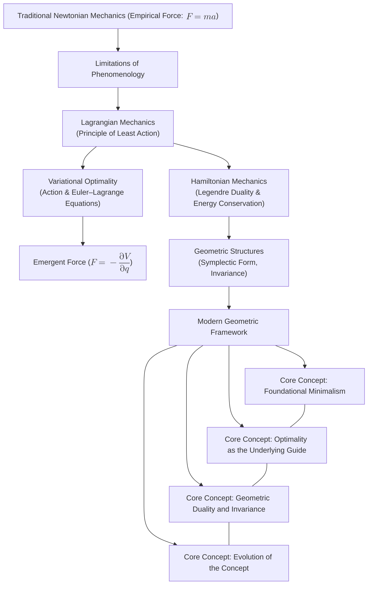

# The Essence of Force: A Reexamination Through the Lens of Classical Mechanics
* * *

--- From motion to geometry, force emerges as nature’s subtle whisper.

# I. Introduction

**Epigraph:**  
*"The universe in its simplicity hides the profound secrets of nature—only by stripping away the old can we behold the new."*

Classical mechanics has long provided the cornerstone by which we understand and predict the motion of bodies. Traditionally, we have approached the study of motion through three distinct yet interrelated formulations:

- **Newtonian Mechanics:** Here, force is introduced as an external agent that causes acceleration, succinctly encapsulated in the formula  
  $$
  F = m a.
  $$
  In this framework, force is regarded as the primary cause of motion or deformation of matter. Despite its tremendous success in engineering and everyday applications, this phenomenological view emphasizes kinematics and dynamics in a manner that often obscures deeper interrelationships.

- **Lagrangian Mechanics:** Emerging as a reformulation of Newtonian ideas, Lagrangian mechanics shifts the focus from forces to energy. By introducing the **Principle of Least Action**, where the action 
  $$
  S[q(t)] = \int_{t_1}^{t_2} L(q, \dot{q}, t) \, dt
  $$
  is rendered stationary (i.e., $\delta S = 0$), we obtain the Euler–Lagrange equations, which determine the system's evolution. Here, what we perceive as "force" appears naturally as the derivative (or gradient) of potential energies or as a consequence of constraints and boundary influences.

- **Hamiltonian Mechanics:** Further abstracting these ideas, Hamiltonian mechanics reformulates dynamics in terms of energy conservation and a dual description involving configuration and momentum. The Hamiltonian 
  $$
  H(q, p, t) = p \dot{q} - L(q, \dot{q}, t)
  $$
  accentuates the conservation laws and the geometrical structure of the phase space, where force is reinterpreted as an emergent property of the underlying symplectic geometry.

Despite decades—even centuries—of rigorous study and application, a fundamental question persists: **What is the true essence of force?** Historically regarded as an axiomatic input to describe interactions, force is now increasingly seen not as a primitive construct, but rather as an emergent phenomenon. In modern treatments, particularly when viewed through the lens of analytical mechanics, force is recast as a derivative concept—arising from gradients of potential functions, as a manifestation of constraints, or as a consequence of the geometry encoded in configuration and phase spaces.

This unified viewpoint contends that the observable manifestations of force are not the primary causes but natural consequences of deeper, variational principles and geometric invariants. The observed acceleration of a body, classically attributed to force, is in this perspective the result of optimizing the action—the motion follows the path of stationary action, inherently linked to energy distributions, potential landscapes, and the invariance properties of the system.

**Document Structure and Central Questions:**  
The purpose of this document is to reexamine the notion of force within classical mechanics by tracing its evolution and repositioning it within a holistic geometric framework. In doing so, we will address key questions such as:
- How has the concept of force evolved from Newton's formulation to the modern interpretations in analytical mechanics?
- In what ways do variational principles and geometric structures (e.g., configuration space, phase space, symplectic geometry) provide a deeper, unified understanding of force?
- What are the implications of viewing force as an emergent property rather than as an axiomatic cause for the advancing frontiers of theoretical and applied physics?

In the subsequent chapters, we will delve into a historical review of the concept, explore its modern reinterpretation via variational and geometric methods, and finally synthesize these views to envision future directions in the study of dynamics. Our aim is to strip away the traditional, phenomenological layers and reveal the subtle, underlying mechanisms—ultimately showing that what we perceive as "force" is simply nature’s subtle whisper, manifested through the elegant interplay of energy, geometry, and symmetry.

By rethinking the essence of force in these terms, we invite readers to join us in a journey of intellectual emancipation—a journey that promises fresh insights into the nature of motion itself.

# II. Historical Evolution of Force

**Epigraph:**  
*"From the hand of Newton to the equations of Euler, the narrative of force has continually evolved."*

The concept of force has undergone a remarkable transformation throughout the history of classical mechanics. From its early inception in the empirical observations of Newton to its sophisticated reformulation within analytical mechanics, our understanding of force has deepened considerably. This chapter explores that evolution, tracing the progression from a rudimentary cause of motion to an emergent phenomenon derived from geometric and variational principles.

## II.1. Newtonian Mechanics: The Empirical Genesis

Newtonian mechanics lays the foundation upon which much of classical physics is built. In this paradigm, force is introduced as an instantaneous interaction that causes an object to accelerate. According to Newton's second law, the relationship is succinctly stated as:
$$
F = m a,
$$
where  
- $F$ represents the net force acting on an object,  
- $m$ is the mass of the object, and  
- $a$ is its acceleration.

This formulation proved extraordinarily successful in describing a vast array of physical phenomena—from the orbits of planets to the simple motion of everyday objects. In engineering and applied sciences, Newton's view remains indispensable due to its directness and simplicity. However, it is important to note that this approach treats force as a fundamental, axiomatic concept, derived almost entirely from empirical observations.  

**Limitations of the Newtonian Perspective:**  
- **Phenomenological Focus:** Newtonian mechanics accepts force as a given without probing its underlying nature. It describes *what* happens (an acceleration occurs) rather than *why* the force exists.
- **Lack of Deeper Explanation:** While effective for practical applications, the Newtonian approach does not provide insights into the origins or intrinsic nature of force. There is no explanation of why forces should obey particular mathematical relationships or why they manifest the way they do.
- **Absence of Invariance:** The traditional formulation does not inherently reveal deeper geometric or variational structures that govern motion.

## II.2. The Analytical Mechanics Revolution

A profound shift occurred with the advent of analytical mechanics. Rather than taking force as an elemental building block, this framework reinterpreted force as a consequence of deeper, more abstract principles—chief among them, the Principle of Least Action.

### II.2.1. Variational Foundations

At the core of analytical mechanics lies the action functional, defined by:
$$
S[q(t)] = \int_{t_1}^{t_2} L(q, \dot{q}, t) \, dt,
$$
where $L(q, \dot{q}, t)$ is the Lagrangian of the system, typically given by the difference between kinetic and potential energy. The fundamental postulate is that the actual path $q(t)$ taken by a system renders the action stationary (i.e., $\delta S = 0$). This condition leads directly to the Euler–Lagrange equations:
$$
\frac{d}{dt} \left( \frac{\partial L}{\partial \dot{q}} \right) - \frac{\partial L}{\partial q} = 0.
$$
In this elegant formulation, what we measure as "force" in experimental settings emerges naturally as a derivative of the potential energy $V(q)$. For example, in the presence of a conservative force field, we have:
$$
F = -\frac{\partial V}{\partial q}.
$$
Thus, force is no longer an a priori primitive; rather, it is a derived quantity—a manifestation of the gradients of energy landscapes.

### II.2.2. The Hamiltonian Perspective and Geometric Insight

The analytical revolution did not stop with the variational formulation. Building on the work of Euler and Lagrange, Hamiltonian mechanics introduced the concept of conjugate momentum:
$$
p = \frac{\partial L}{\partial \dot{q}},
$$
and defined the Hamiltonian as:
$$
H(q, p, t) = p \dot{q} - L(q, \dot{q}, t).
$$
Hamilton's formulation shifts the focus from forces per se to the conservation of energy and to a rich underlying geometric structure. The dynamical evolution is then governed by Hamilton's equations:
$$
\dot{q} = \frac{\partial H}{\partial p}, \qquad \dot{p} = -\frac{\partial H}{\partial q}.
$$
Within this framework, the notion of force becomes enmeshed with the geometry of phase space (denoted by the cotangent bundle $T^*Q$) and symplectic structure—a perspective that emphasizes invariance and duality. Rather than serving as the primary agent that initiates change, force appears as an emergent property inherent to the structure of the governing equations.

## II.3. Conclusion
  
This chapter demonstrates the historical progression from Newton's foundational view—where force is a primary, observable cause of motion—to the analytical mechanics perspective, where force is understood as a consequence of variational principles and underlying geometric invariance. This evolution not only deepens our understanding but also sets the stage for the modern reinterpretation of force as an emergent phenomenon.

By reexamining force through these successive lenses, we begin to see that its essence is not defined by isolated interactions but by the broader, more subtle interplay of energy, geometry, and optimality. This realization paves the way for the subsequent chapters, where we explore the geometric reinterpretation of force and its implications for future research in dynamics.

This concludes our exploration of the historical evolution of force, marking the transition from a primitive empirical concept to a nuanced derivative emerging from the realm of analytical mechanics.

# III. The Geometric Reinterpretation of Force

**Epigraph:**  
*"What appears as force is but the shadow of geometry on the canvas of motion."*

In the modern view, force is no longer regarded as a primary, axiomatic ingredient of dynamics. Instead, it is seen as an emergent phenomenon—a consequence of deeper variational and geometric structures governing the evolution of a system. In this chapter, we develop this perspective in three interconnected parts. We start by exploring how forces naturally arise when a system follows the path of stationary action, then show how the Legendre transform bridges the gap between variational and energy-based approaches, and finally demonstrate the role of configuration and phase space geometry in reinterpreting force.

## III.1. Variational Principles and the Emergence of Force

At the heart of modern mechanics is the Principle of Least Action. Rather than prescribing forces directly, this principle posits that the actual path taken by a system is one that makes the action
$$
S[q(t)] = \int_{t_1}^{t_2} L(q, \dot{q}, t) \, \mathrm{d}t
$$
stationary, i.e., the first variation vanishes:
$$
\delta S = 0.
$$

### III.1.1. From Stationarity to Equations of Motion

By considering infinitesimal variations $\delta q(t)$ (with fixed endpoints), the condition $\delta S = 0$ leads directly to the Euler–Lagrange equations:
$$
\frac{d}{dt}\left(\frac{\partial L}{\partial \dot{q}}\right) - \frac{\partial L}{\partial q} = 0.
$$
In this equation, the term $\frac{\partial L}{\partial q}$ is typically decomposed into contributions from kinetic and potential energies. When the Lagrangian is expressed as
$$
L(q,\dot{q},t) = T(\dot{q}) - V(q),
$$
the Euler–Lagrange equations yield
$$
\frac{d}{dt}\left(\frac{\partial T}{\partial \dot{q}}\right) + \frac{\partial V}{\partial q} = 0.
$$
Here, the term $-\frac{\partial V}{\partial q}$ naturally takes on the role of a force, not as a primitive postulate but as the gradient of a potential function. In many cases, what we identify as "force" is simply the response of the dynamics to changes in potential energy.

### III.1.2. The Role of Boundary Terms and Constraints

Furthermore, when variations at the endpoints are allowed or when constraints are imposed, additional boundary terms enter the picture. These terms often encode physical information such as conserved quantities and reaction forces corresponding to constraints. Thus, even the supplementary aspects of the variational principle contribute to what we ultimately measure as force, reinforcing the idea that force is an emergent concept dependent on the overall structure of the action.

## III.2. The Role of Legendre Duality and Analytical Methods

While the Lagrangian framework emphasizes the principle of stationary action, it is transformed and enriched by the Legendre transform—a mathematical tool that connects the variational formulation to the energy-based Hamiltonian perspective.

### III.2.1. Bridging Two Formulations

The Legendre transform introduces the conjugate momentum
$$
p = \frac{\partial L}{\partial \dot{q}},
$$
and defines the Hamiltonian as
$$
H(q, p, t) = p \dot{q} - L(q, \dot{q}, t).
$$
This transformation recasts the dynamics in the phase space $(q, p)$, where the evolution is governed by Hamilton’s equations:
$$
\dot{q} = \frac{\partial H}{\partial p}, \quad \dot{p} = -\frac{\partial H}{\partial q}.
$$

### III.2.2. Duality and Emergent Force

In this dual formulation, forces are not directly introduced as separate entities; rather, they are implicit in the structure of the Hamiltonian. For instance, consider a potential energy function $V(q)$. In the Hamiltonian formulation, its influence appears in the term
$$
-\frac{\partial H}{\partial q} = -\frac{\partial V}{\partial q},
$$
which mirrors the force derived earlier in the Lagrangian view. This duality underscores that the essence of force—its dependence on energy gradients—is a natural outcome of the underlying mathematical structure. The Legendre transform thereby unifies the variational and energy approaches, revealing that the dynamics (and thus the emergent forces) are deeply encoded in the geometry of phase space.

## III.3. Force as a Consequence of Geometric Structures

The modern reinterpretation of force reaches its fullest expression when viewed through the lens of geometry. Here, the fundamental spaces of classical mechanics—the configuration space and the phase space—provide the stage upon which forces emerge as geometric artifacts.

### III.3.1. Configuration and Phase Spaces

The configuration space $Q$ represents all possible positions of a system. For systems described by generalized coordinates $q$, each point in $Q$ corresponds to a unique configuration. When augmented with velocities, the dynamics are traditionally formulated on the tangent bundle $TQ$. However, the Hamiltonian approach naturally leads to the cotangent bundle $T^*Q$, or phase space, where each point is given by $(q, p)$.

### III.3.2. The Poincaré–Cartan One-Form and Symplectic Structure

A central geometric object is the Poincaré–Cartan one-form, defined as
$$
\theta = p \, \mathrm{d}q.
$$
Its exterior derivative yields the symplectic form:
$$
\omega = -\mathrm{d}\theta = \mathrm{d}p \wedge \mathrm{d}q,
$$
which is a closed and non-degenerate 2-form. This symplectic structure encapsulates the invariant geometric framework of phase space and ensures that the dynamics are preserved under canonical transformations.

### III.3.3. Invariance and Canonical Transformations

Canonical transformations are those mappings in phase space that preserve the symplectic form $\omega$. Their existence highlights a fundamental invariance underlying the dynamics. In this geometric picture, what we historically identified as "force" is relegated to a secondary role—it emerges as a feature of the potential functions defined on $Q$ and is intimately connected with the invariance properties of the symplectic structure. The gradients of these potential functions (or curvature effects, in more advanced settings) provide the impetus behind motion, but only as a consequence of the deeper geometric architecture.

## III.4. Conclusion

Through these three intertwined perspectives—variational principles, Legendre duality, and geometric structures—we see that the observable force is not a primary, independent entity. Rather, it is the natural outcome of optimizing an action within a richly structured geometric background. By embracing this modern view, we shift our focus from force as a mysterious agent to a derived phenomenon, intricately linked to the energy landscape and the invariant properties of the underlying physics. This reexamination not only deepens our theoretical understanding but also opens new avenues for exploring dynamics in classical, quantum, and interdisciplinary realms.

# IV. Modern Synthesis and Future Perspectives

**Epigraph:**  
*"In the dance of dimensions, the future of force is choreographed by the geometry of the unseen."*

In this final chapter, we integrate historical insights with modern variational and geometric methods to forge a unified perspective on classical mechanics. By synthesizing the Newtonian, Lagrangian, and Hamiltonian viewpoints, we reveal that the concept of force—long treated as a primary instigator of motion—is more accurately understood as an emergent phenomenon arising from the interplay of energy distributions and invariant geometric structures. This modern synthesis not only resolves longstanding conceptual ambiguities but also opens promising avenues for future research across various advanced fields.

## IV.1. Unifying the Traditional and Geometric Views

Historically, force was introduced in its most familiar form as an interaction causing acceleration, encapsulated by the Newtonian formula
$$
F = m a.
$$
However, this formulation, while successful in explaining many physical phenomena, offers only a phenomenological description. The advent of analytical mechanics transformed this picture. In the Lagrangian formulation, the evolution of a system is governed by the Principle of Least Action,
$$
S[q(t)] = \int_{t_1}^{t_2} L(q,\dot{q},t) \, \mathrm{d}t,
$$
with the requirement $\delta S = 0$ leading to the Euler–Lagrange equations. In this context, the term
$$
-\frac{\partial V}{\partial q}
$$
naturally assumes the role of force, emerging as the gradient of the potential energy $V(q)$.

The Hamiltonian formulation further refines our understanding by introducing the conjugate momentum
$$
p = \frac{\partial L}{\partial \dot{q}},
$$
and defining the Hamiltonian function
$$
H(q,p,t) = p\dot{q} - L(q,\dot{q},t).
$$
Hamilton’s equations,
$$
\dot{q} = \frac{\partial H}{\partial p}, \qquad \dot{p} = -\frac{\partial H}{\partial q},
$$
reveal the deep-seated duality between configuration and momentum spaces and highlight the role of symplectic geometry.

Together, these diverse formulations converge to a single, unified framework: force is not a primitive notion, but rather a derived quantity arising from energy gradients and geometric constraints. The Newtonian view is thus subsumed within a broader geometric and variational context, where the invariance of the underlying symplectic structure guarantees that the observed accelerations are but manifestations of this deeper mathematical harmony.

## IV.2. Implications for Advanced Fields

The reinterpretation of force as an emergent phenomenon carries significant implications beyond classical mechanics, influencing several advanced disciplines:

- **Quantum Mechanics and Quantum Field Theories:**  
  The geometric approach underpins modern techniques such as geometric quantization, where canonical variables and symplectic structures play a pivotal role. Re-envisioning force in terms of energy gradients and geometric invariants provides a natural bridge to the quantum domain, where potential functions and Hamiltonians continue to define the evolution of quantum states. This unified perspective may lead to a more seamless transition between classical and quantum descriptions.

- **Modern Engineering and Control Theory:**  
  In engineering disciplines and robotics, the classical notion of force is a central design parameter. However, by framing force as an emergent consequence of energy optimization, engineers can develop novel control strategies that emphasize system-wide energy efficiency and stability. This may inspire new control algorithms that harness variational principles, leading to more robust, adaptive, and optimal systems.

- **Interdisciplinary Applications:**  
  Beyond traditional boundaries, the reimagined concept of force has potential applications in areas such as machine learning, complex systems, and even economics. For instance, algorithms that optimize energy-like functionals or explore configuration spaces may benefit from insights drawn from symplectic geometry and variational calculus. By rethinking force as a derivative concept, interdisciplinary collaborations can foster innovative solutions across a spectrum of scientific and technological challenges.

## IV.3. Envisioning New Paradigms in Dynamics

Looking to the future, the abstraction of force paves the way for radically new paradigms in the study of dynamics:

- **A Fully Geometric Approach:**  
  One speculative direction is the development of a framework where dynamics are entirely encoded in geometric structures, independent of any notion of force as an external agent. In such a formulation, the entire behavior of a system would be determined by properties of the underlying manifold—its curvature, topology, and symplectic invariants—leading to new ways of thinking about motion and interaction.

- **Novel Mathematical Frameworks:**  
  The abstraction of force may eventually lead to the formulation of higher-category theories or topological quantum field theories (TQFTs), where conventional notions of causality and interaction are replaced by more abstract invariants. These frameworks could provide deeper insights into the unification of classical and quantum mechanics and might reveal previously hidden symmetries in the fabric of physical laws.

- **Bridging the Gap between Theory and Application:**  
  By recasting force as an emergent, geometrically driven entity, future research might uncover unexpected connections between disparate fields. For example, the mathematical tools developed to analyze symplectic structures and variational principles could be applied to emerging areas such as quantum computing, complex network dynamics, and biological systems, offering new perspectives on how complex behaviors arise from simple, invariant principles.

## IV.4. Conclusion

In synthesizing these historical, variational, and geometric insights, we arrive at a unified vision of classical mechanics where force is no longer seen as an inscrutable cause, but rather as a subtle consequence of nature's intrinsic geometry. This modern synthesis not only refines our conceptual understanding but also lays the groundwork for innovative research that transcends traditional disciplinary boundaries. As we venture further into this geometric landscape, the reimagined notion of force will undoubtedly continue to inspire and challenge our understanding of the dynamics that govern the universe.

# V. Conclusion

**Epigraph:**  
*"In the quest for truth, simplicity is not naïveté—it is the direct path to profound understanding."*

In this document, we have embarked on a journey from the tangible, phenomenological conception of force—as introduced by Newton through the equation
$$
F = m a,
$$
to a refined, abstract understanding in which force emerges as a derived concept from the principles of least action and the intricate tapestry of geometric structures. Initially, force was perceived as a direct instigator of motion, a straightforward cause-effect mechanism that accounted well for everyday phenomena. However, the evolution through analytical mechanics reshaped this view fundamentally. With the introduction of the Lagrangian and Hamiltonian frameworks, force was recast as
$$
F = -\frac{\partial V}{\partial q},
$$
a manifestation of energy gradients, where the interplay of potential energy and the variational principle guides the evolution of a system.

The transition from the Newtonian paradigm to the variational and geometric formulations signifies a deeper unification: the classical notion of force is subsumed under the broader umbrella of energy optimization and the invariant properties of configuration and phase spaces. The employment of Legendre duality further linked the Lagrangian and Hamiltonian methodologies, revealing that what we observe as force is encoded within the symplectic structure of phase space—a geometric invariant that remains robust under canonical transformations.

This unified perspective not only bridges historical formulations but also lays the groundwork for future endeavors. The reimagined notion of force—as an emergent rather than intrinsic principle—opens several avenues for further inquiry:

- **Theoretical Expansion:**  
  By framing force as a derivative of more fundamental geometric and variational underpinnings, we are poised to probe even deeper into the nature of physical interactions. Such investigations may lead to the development of novel mathematical frameworks, including higher-category theories or topological quantum field theories, which could provide a more profound understanding of the symmetries and invariances that govern all dynamics.

- **Interdisciplinary Applications:**  
  Beyond classical mechanics, this refined insight holds promise for advancing quantum mechanics, engineering, and control theory. Reinterpreting force within a unified geometric context could yield innovative computational methods and control algorithms that harness energy optimization principles in complex systems and robotics, as well as inform the transition between classical and quantum descriptions.

- **Future Research Directions:**  
  Embracing the geometric essence of force invites further exploration into areas where traditional notions falter. Whether in the modeling of emergent phenomena in complex systems or in extending the principles of geometric mechanics to unsolved problems in theoretical physics, the abstraction of force as an emergent property serves as a launching pad for a new generation of research across both theoretical and applied domains.

In summary, by tracing the evolution from Newton’s intuitive laws to the abstract synthesis of modern geometric mechanics, we have not only consolidated disparate perspectives into a coherent framework but have also illuminated new pathways for understanding and harnessing the dynamics of nature. The deeper insight—that force is not a primitive cause but an emergent shadow of the underlying geometry—provides clarity and unification, reinforcing that simplicity and invariance hold the key to both profound theoretical insights and practical advances in our ongoing exploration of the universe.

# Appendix A: Relationships Between Core Concepts

This appendix presents both a diagram and a table that map the interconnections among the core concepts and important ideas discussed in this document. It illustrates how the traditional, variational, and geometric perspectives converge in our modern synthesis of force as an emergent phenomenon.

## A.A. Core Concepts Flowchart

Below is a flowchart illustrating the relationship among the key formulations and core concepts:

## A.B. Table: Mapping Core Concepts and Their Interrelationships

| **Core Concept**                   | **Description**                                                                                                                           | **Interrelationships**                                                                                                                                                                                   |
|------------------------------------|-------------------------------------------------------------------------------------------------------------------------------------------|----------------------------------------------------------------------------------------------------------------------------------------------------------------------------------------------------------|
| **Foundational Minimalism**        | Force is not a primary, axiomatic element; rather, it emerges from the interplay of energy gradients, constraints, and geometric structures. | Underpins the modern view by showing that force derives from deeper invariants, linking naturally to optimality and geometric formulations.                                                             |
| **Optimality as the Underlying Guide** | Variational principles (like the Principle of Least Action) govern trajectories, yielding force as the gradient of potential energy.       | Acts as the bridge between the classical (Newtonian) and modern (Lagrangian/Hamiltonian) descriptions, emphasizing how energy optimization replaces the notion of a primitive force.               |
| **Geometric Duality and Invariance**   | Force is reinterpreted as the manifestation of invariant geometric structures (e.g., symplectic forms) inherent in phase and configuration spaces. | Emerges naturally through Legendre duality and the preservation of symplectic structure; ties the energy-based Hamiltonian methods with the underlying geometry, reinforcing conservation principles. |
| **Evolution of the Concept**       | The historical journey from a phenomenological Newtonian force to a derivative concept in analytical mechanics, and ultimately its geometric reinterpretation. | Provides context that unifies the empirical and abstract formulations, showcasing the progressive refinement in our understanding of force.                                                               |

## A.C. Final Thoughts

This appendix reinforces that the modern conception of force—as analyzed in this document—is not a standalone axiom but an emergent phenomenon. By synthesizing traditional Newtonian views with analytical and geometric approaches, we observe that:
- **Energy Optimization (Optimality)** and **Geometric Invariance** ultimately yield the observable force.
- The **Evolution of the Concept** highlights a shift from primitive empirical descriptions to a refined, unified framework where force is derived from deeper mathematical principles.

Such a robust framework not only demystifies the nature of force but also serves as a cornerstone for future theoretical and interdisciplinary research.

