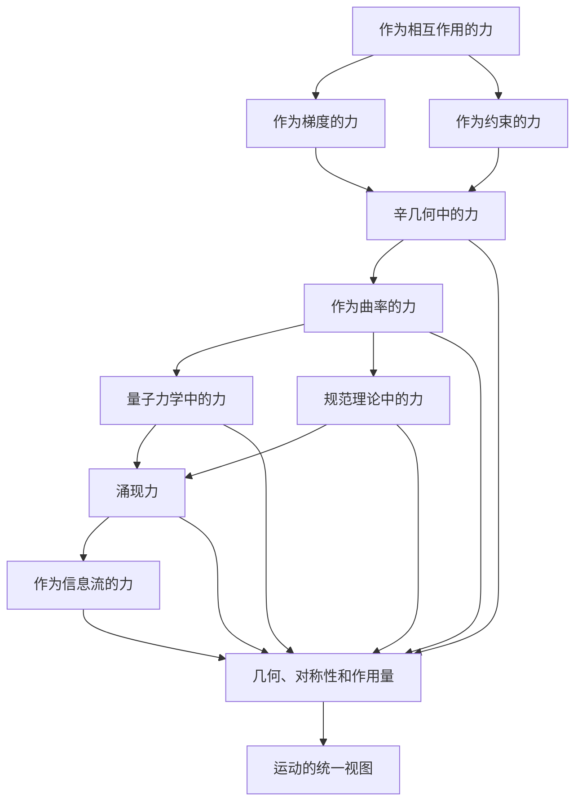

# 力的本质：几何与变分视角
* * *

--- 力不是实体，而是几何与对称性的回响。

# **I. 引言：力的问题**
**题词**: *"驱动天体的不是力，而是定律的和谐。"*

## **I.1. 力的经典定义**

如艾萨克·牛顿所引入的，力是经典力学的基石。它被定义为引起物体运动变化的媒介，体现在标志性的第二运动定律中：
$$
\mathbf{F} = m\mathbf{a},
$$
其中 $\mathbf{F}$ 是作用在物体上的力，$m$ 是其质量，$\mathbf{a}$ 是其加速度。这种表述确立了力作为一个矢量量，能够改变物体的速度，使其成为研究运动的核心。

牛顿力学依赖于直觉：力是外部影响，如推拉，直接影响物体的状态。当应用于简单系统时，例如抛射体、摆和行星轨道，这种解释尤其具有说服力。它提供了一个框架，使得力可以被测量、分类(例如重力、电磁力)并叠加。

然而，尽管这一框架强大且实用，但它并非没有局限性。它是一种描述而非解释，并假定力是一个基本的、不可约简的概念。从本质上讲，力是什么？它是物体的属性吗？它是能量的表现形式吗？它是几何的必然性吗？这些更深层次的问题往往隐藏在其直观的表面之下。

## **I.2. 牛顿观点的局限性**

虽然牛顿对力的构想是基础性的，但在面对更复杂的系统或更深层次的问题时，它开始显示出不足。以下是牛顿视角的三个关键局限：

1. **惯性参考标架的依赖性**：  
   牛顿定律仅严格适用于惯性参考标架。当转换到非惯性参考标架时，必须引入离心力或科里奥利力等虚构力。这些并不是“真实的”力，而是坐标系统选择的结果，这引发了关于力的普遍性的疑问。

2. **约束下的模糊性**：  
   在有约束的系统中，如沿着导线滑动的珠子或用绳子摆动的摆锤，维持约束的力(例如法向力或张力)并未由牛顿定律明确给出。这些力作为几何或变分必要性出现，而不是基本相互作用。

3. **归约为能量原理**：  
   拉格朗日和哈密顿力学的出现表明，运动可以用能量原理完全描述，无需直接引用力。在这些表述中，力不再是基本概念，而是次生概念，服从最小作用原理和构型空间及相空间的结构。

这些局限性表明，尽管力在实际力学中不可或缺，但可能不是理解运动最深刻或最普遍的方式。

## **I.3. 核心问题：力是什么？**

为了超越经典观点，我们必须面对核心问题：  
*力是一个基本实体，还是一个从更基本的几何、能量和对称性原则中衍生的现象？*

这个问题促使我们重新评估力在力学中的角色，并寻求对其本质的更深入理解。为此，我们将探讨：

- 力如何从势能的**梯度**中显现。  
- 力如何作为变分原理中的**几何约束**起作用。  
- 力如何在哈密顿力学的**辛流**中消解。  
- 力如何在非惯性参考标架和广义相对论中重新解释为**曲率**。  

通过这条路径，我们的目标是揭示力并非独立于力学的基本构建块，而是更深层次、更普遍原则的表现。

## **I.4. 文档结构**

这次探索将分层展开，每一层都深入探讨力的本质：

1. **经典力学中的力**：  
   我们从牛顿对力的理解开始，并重新解释拉格朗日和哈密顿力学中的力。

2. **作为梯度和约束的力**：  
   我们探讨力如何作为势能的梯度以及作为强制几何约束的拉格朗日乘数出现。

3. **辛几何中的力**：  
   在相空间中，我们研究力作为初级实体消失，重新出现在由哈密顿生成的流中。

4. **曲率和几何中的力**：  
   我们将力与构型空间和时空的曲率联系起来，展示其对底层流形几何的依赖性。

5. **力的未来**：  
   最后，我们推测力在未来量子力学、规范理论和涌现现象中的角色，考虑力是否将继续作为一种概念存在，还是融入更抽象的原则。

## **I.5. 为什么重新审视力？**

重新审视力的动机有两个方面：

1. **理论深度**：力仍然是物理学的基石，但其本质常常被视为理所当然。通过探究其本质，我们可以获得对力学基础以及几何、能量和运动之间相互作用的更深入见解。

2. **实际意义**：对力的更深入了解对从工程学到宇宙学的各个领域都有影响。无论是设计机械系统、模拟天体物理现象，还是探索量子引力，力的概念都在不断发展，因此我们也必须不断深化对其的理解。

## **I.6. 关键见解**

从一开始，我们确立指导我们探索的三个关键见解：

1. **力是一个派生概念**：  
   如我们所理解的力并不是基本的，而是从更深的原则中产生，如能量梯度、几何约束和对称性。

2. **几何是核心**：  
   力的本质在于构型空间和相空间的几何，在其中它反映了系统的曲率、约束和对称性。

3. **对称性支配运动**：  
   力与对称性紧密相关，守恒量(如能量、动量)源于塑造运动的不变性。

## **I.7. 结论：力的新视角**

本文邀请读者超越经典的力的观点，接受一种更几何化和变分化的视角。在这段旅程结束时，我们的目标是重新想象力不仅仅是独立的代理，而是支配运动的深层结构的回声。

本节完成了引言部分，为系统地探讨力的本质奠定基础。在下一节中，我们将从牛顿对力的构想开始，追溯其在经典力学中的演变，并识别其现代重新解释的种子。

# **II. 经典力学中的力**
**题词**: *"力是变化的代理，但它是否是运动的起源？"*

## **II.1. 牛顿力学：力作为基本相互作用**

牛顿力学的前提是力是运动的根本原因。在这个框架中，力被定义为改变物体运动状态的外部影响，体现在牛顿第二运动定律中：
$$
\mathbf{F} = m\mathbf{a},
$$
其中 $\mathbf{F}$ 是作用在物体上的净力，$m$ 是其质量，$\mathbf{a}$ 是其加速度。这个方程建立了力与运动之间的直接因果关系，使力成为机械系统中变化的媒介。

**直观吸引力**：牛顿的表述既直观又实用。诸如重力、张力和摩擦力等力是可以观察和测量的，使得这一概念易于理解。该框架提供了强大的工具，用于解决从行星运动到工程力学等不同领域的各种问题。

**叠加性和普遍性**：牛顿力服从叠加原理，即净力是个体作用在物体上的力的矢量和。这种普遍性使得力的概念能够适应复杂的系统，在这些系统中，多个相互作用共存。

然而，当我们深入探讨力和运动的本质时，这种直观的画面开始变得模糊。

## **II.2. 牛顿力的约束和局限性**

虽然牛顿力学在其描述能力上表现出色，但它在概念和实际应用中遇到了一些局限：

1. **惯性参考标架的依赖性**：  
   牛顿定律仅在惯性参考标架中有效。在非惯性参考标架中，必须引入离心力和科里奥利力等虚构力来解释观测到的运动。这些力并不是“真实的”力，而是坐标系统选择的结果，削弱了牛顿第二定律的普遍性。

2. **约束系统的模糊性**：  
   在具有几何约束的系统中，例如沿着圆弧摆动的摆或沿着导线滑动的珠子，维持约束的力(如张力或法向力)并未由牛顿定律明确确定。这些力作为系统几何结构的结果出现，表明在这种情况下，力不是运动的基本决定因素。

3. **与守恒定律的分离**：  
   牛顿力并没有内在地解释为什么某些量(如能量或动量)是守恒的。这些守恒定律源于更深层次的自然对称性，表明力不是描述运动最根本的方式。

## **II.3. 拉格朗日力学：力作为梯度**

拉格朗日力学的发展重新定义了力的概念，将其表达为能量的形式。在这个表述中，系统的动力学编码在**拉格朗日函数**中：
$$
L = T - V,
$$
其中 $T$ 是动能，$V$ 是势能。拉格朗日力学通过**最小作用量原理**描述运动：
$$
\delta S = 0, \quad S = \int_{t_1}^{t_2} L(q, \dot{q}, t) \, dt,
$$
其中 $S$ 是作用量，$q$ 表示系统的广义坐标。

**力作为梯度**：  
在这个框架中，力表现为构型空间中势能的梯度。对于处于势场 $V(q)$ 中的单个粒子，力由下式给出为：
$$
\mathbf{F} = -\nabla V.
$$
这种重构将焦点从力作为基本量转移到势能作为主导原则。运动不再仅由力驱动，而是由动能和势能的相互作用驱动。

**拉格朗日视角的优势**：
1. **统一处理约束**：约束力(如张力或法向力)自然地作为**拉格朗日乘数**出现在变分公式中，消除了将这些力视为独立实体的需求。
2. **坐标系统的普适性**：拉格朗日力学不依赖于坐标系的选择，使其特别适合分析非笛卡尔坐标系中的系统。
3. **与对称性的联系**：从拉格朗日导出的运动方程通过**诺特定理**自然地编码守恒律，如能量和动量的守恒，揭示了运动与系统对称性之间的深层联系。

## **II.4. 哈密顿力学：力作为派生量**

哈密顿力学的表述进一步抽象化，将焦点从力和加速度转移到相空间中的系统演化。系统的状态由广义坐标 $q$ 和共轭动量 $p$ 描述，其动力学由**哈密顿函数**控制：
$$
H = T + V,
$$
它表示系统的总能量。

**哈密顿方程**：  
哈密顿力学中的运动方程由下式给出：
$$
\dot{q}^i = \frac{\partial H}{\partial p_i}, \quad \dot{p}_i = -\frac{\partial H}{\partial q^i}.
$$
这些方程描述系统在相空间中的流，其中力隐含在哈密顿量的导数中。与牛顿力学不同，这里力是一个次级量，由系统的能量景观推导而来。

**力消解为辛几何**：  
在哈密顿力学中，相空间的辛结构占据中心地位。系统的动力学由辛形式控制：
$$
\omega = \sum_{i=1}^n dp_i \wedge dq^i,
$$
它是哈密顿流之下的不变量。力作为独立实体的概念消失，取而代之的是相空间的几何性质。

## **II.5. 调和不同观点**

从牛顿力学到拉格朗日力学到哈密顿力学的演变揭示了力概念的逐步抽象。在牛顿力学中作为具体、直观的数量逐渐演变为更加几何化和衍生的性质：

1. **牛顿力学**：力是直接的改变媒介，根据 $\mathbf{F} = m\mathbf{a}$ 驱动运动。
2. **拉格朗日力学**：力作为势能的梯度出现，服从最小作用量原理。
3. **哈密顿力学**：力成为哈密顿量的导数，嵌入相空间的辛几何中。

这一进展表明，尽管力在经典力学中不可或缺，但它不是基本构建块，而是从更深的能量、几何和对称性原则中涌现的概念。

## **II.6. 关键见解**

1. **力作为相互作用与派生物**：  
   牛顿力学将力视为基本相互作用，而拉格朗日和哈密顿力学则从能量原则中推导出力。

2. **力与几何**：  
   从构型空间(拉格朗日力学)到相空间(哈密顿力学)的转变揭示了力的几何本质，将其与梯度、约束和流联系起来。

3. **力是上下文相关的**：  
   在有约束或非惯性参考标架的系统中，力失去了普遍性，表现为几何或坐标依赖的产物。

## **II.7. 过渡到下一节**

在探讨在经典力学中力的作用之后，我们现在转向其在变分原理语言中的重新解释。在下一节中，我们将研究力如何作为势能的梯度和最小作用量原理中的约束出现，深化我们对其几何和变分本质的理解。

本节完成了文档的历史和概念基础，为进一步深入探索力的几何特性奠定基础。

# **III. 力作为梯度和约束**
**题词**: *"力是势能几何投下的阴影。"*

## **III.1. 力作为势能的梯度**

在变分力学的框架中，力的概念自然地被重新解释为构型空间中势能的梯度。考虑由构型空间中的广义坐标 $q^i$ 描述的系统。如果系统受到势能 $V(q)$ 的影响，则作用在系统上的力给出为：
$$
\mathbf{F} = -\nabla V(q),
$$
其中 $\nabla V$ 表示相对于坐标 $q^i$ 的 $V$ 的梯度。这个方程说明力不是一个独立实体，而是标量势能函数的导数。

### **III.1.1. 梯度的几何意义**  
梯度 $\nabla V$ 表示在构型空间中 $V(q)$ 增加最快的路径方向。$\mathbf{F} = -\nabla V$ 中的负号反映了力的作用是使势能最小化，推动系统趋向于低能量状态。这种几何解释揭示力本质上与势能景观的地形密切相关。

### **III.1.2. 例子：谐振子**  
对于一维谐振子，其势能为 $V(x) = \frac{1}{2}kx^2$，则力为：
$$
F = -\frac{dV}{dx} = -kx.
$$
这里，线性恢复力直接与位移 $x$ 成正比，且方向总是朝向平衡位置($x = 0$)，在该位置 $V(x)$ 最小。这个简单的例子展示了力如何作为势能函数的数学结果出现。

### **III.1.3. 中心力场**  
在具有球对称性的系统中，如引力或静电场，势能仅依赖于从中心点的径向距离 $r$：
$$
V(r) = \frac{-k}{r}.
$$
则力为：
$$
\mathbf{F} = -\nabla V(r) = -\frac{\partial V}{\partial r} \hat{\mathbf{r}} = \frac{k}{r^2} \hat{\mathbf{r}},
$$
其中 $\hat{\mathbf{r}}$ 是径向单位向量。这一推导表明，力的平方反比定律自然地源于标量势能的梯度。

## **III.2. 力作为拉格朗日乘数**

在有约束的系统中，力通常表现为强制执行约束的次级量。这些力并不是系统动力学的显式部分，而是在变分公式中作为**拉格朗日乘数**出现。

### **III.2.1. 带约束的最小作用量原理**  
最小作用量原理指出，系统的轨迹极值化作用量泛函：
$$
S[q] = \int_{t_1}^{t_2} L(q, \dot{q}, t) \, dt,
$$
其中 $L(q, \dot{q}, t) = T - V$ 是拉格朗日量。对于受约束 $g_j(q, t) = 0$ 的系统，通过引入拉格朗日乘数 $\lambda^j(t)$ 修改作用量：
$$
S[q, \lambda] = \int_{t_1}^{t_2} \left( L(q, \dot{q}, t) + \sum_j \lambda^j g_j(q, t) \right) dt.
$$

附加项在系统演化过程中强制执行约束。作用量的变化产生运动方程：
$$
\frac{d}{dt} \left( \frac{\partial L}{\partial \dot{q}^i} \right) - \frac{\partial L}{\partial q^i} = \sum_j \lambda^j \frac{\partial g_j}{\partial q^i},
$$
其中 $\lambda^j \frac{\partial g_j}{\partial q^i}$ 表示作用在系统上的约束力。

### **III.2.2. 例子：沿着导线滑动的珠子**  
考虑一个约束在三维空间中沿着弯曲导线滑动的珠子。珠子的位置由 $\mathbf{r}(t) = (x(t), y(t), z(t))$ 描述，约束条件是珠子保持在导线上，定义为 $g(\mathbf{r}) = 0$。拉格朗日量为：
$$
L = \frac{1}{2}m\dot{\mathbf{r}}^2 - V(\mathbf{r}).
$$
约束力为：
$$
\mathbf{F}_\text{constraint} = \lambda \nabla g(\mathbf{r}),
$$
其中 $\lambda$ 是拉格朗日乘数。此力垂直于导线，确保珠子保持在约束路径上。

### **III.2.3. 一般解释**  
在有约束的系统中，法向力或张力等力不是基本相互作用，而是满足约束的几何效应。拉格朗日乘数 $\lambda^j$ 编码这些力的大小，直接将它们与其系统的几何结构联系起来。

## **III.3. 力与最小作用量原理**

最小作用量原理提供了理解力的最一般框架。在这种背景下，力既不是原始概念也不是起点；它是确定系统轨迹的变分过程的副产品。

### **III.3.1. 力的变分性质**  
从作用量原理导出的运动方程：
$$
\delta S = 0 \quad \Rightarrow \quad \frac{d}{dt} \left( \frac{\partial L}{\partial \dot{q}^i} \right) - \frac{\partial L}{\partial q^i} = 0,
$$
表明力出现在平衡广义动量 $\frac{\partial L}{\partial \dot{q}^i}$ 和拉格朗日量的空间变化 $\frac{\partial L}{\partial q^i}$ 之间的项中。在 $L = T - V$ 的系统中，这简化为熟悉的形式：
$$
\mathbf{F} = -\nabla V.
$$
然而，在更一般的具有约束或非保守力的系统中，变分公式自然地包含这些复杂性，而不必将力视为单独的概念。

### **III.3.2. 力作为次级量**  
在变分框架中，力不是输入而是输出。基本量是拉格朗日量 $L$、作用量 $S$ 和约束 $g_j(q, t)$。力作为派生实体出现，反映系统对其能量景观和几何约束的响应。

## **III.4. 关键见解**

1. **力作为梯度**：  
   力作为势能的梯度出现，反映了构型空间中能量景观的几何结构。

2. **力作为约束**：  
   在有约束的系统中，力不是基本的，而是作为拉格朗日乘数出现，强制执行系统的几何或物理限制。

3. **力作为变分输出**：  
   最小作用量原理表明，力是一个次级量，由作用量泛函的极值化导出。它是支配运动的深层原则的结果。

## **III.5. 过渡到下一节**

在探讨了力作为梯度和作为在变分原理中的约束的重新解释之后，我们现在转向其在相空间中的角色。在下一节中，我们将研究力如何在哈密顿力学的辛流中消解，其中它由相空间的几何结构而非独立实体控制。

本节加深了读者对力作为一种几何和变分推理产生的涌现结果的理解，为进一步抽象的辛几何重构奠定基础。

# **IV. 辛几何中的力**
**题词**: *"在相空间中，力消解为能量的流。"*

## **IV.1. 辛几何：相空间动力学的基础**

辛几何是哈密顿力学的核心，提供描述物理系统在相空间中演化的数学结构。由广义坐标 $q^i$ 和共轭动量 $p_i$ 定义的相空间，是描述机械系统状态的自然场所。与仅关注位置的构型空间不同，相空间同时包含位置和动量，捕捉系统的完整动力学状态。

辛几何的核心是辛 $2$-形式：
$$
\omega = \sum_{i=1}^n dp_i \wedge dq^i,
$$
其中 $\wedge$ 表示楔积，编码动量和位置的反对称配对。这个 $2$-形式定义相空间的几何结构，并在确定系统动力学方面起着核心作用。

### **IV.1.1. 辛形式的关键性质**

1. **非退化性**：  
   辛形式 $\omega$ 是非退化的，意味着对于相空间中的任意非零切向量 $v$，存在另一个切向量 $w$ 使得：
   $$
   \omega(v, w) \neq 0.
   $$
   这个性质确保位置和动量内在地联系在一起，在相空间描述中没有冗余。

2. **闭合性**：  
   辛形式是闭合的，满足：
   $$
   d\omega = 0,
   $$
   其中 $d$ 表示外导数。这一性质意味着在哈密顿流下相空间体积的守恒，如刘维尔定理所形式化。

3. **不变性**：  
   辛形式在正则变换下是不变的，这些变换保持相空间的结构和运动方程。这种不变性突显哈密顿力学在不同坐标系统下的普遍性。

## **IV.2. 相空间中的动力学：哈密顿方程**

在哈密顿力学中，系统的动力学被编码在**哈密顿函数** $H(q, p, t)$ 中，它代表系统的总能量：
$$
H = T + V,
$$
其中 $T$ 是动能，$V$ 是势能。系统的演化由**哈密顿方程**控制：
$$
\dot{q}^i = \frac{\partial H}{\partial p_i}, \quad \dot{p}_i = -\frac{\partial H}{\partial q^i}.
$$

这些方程描述系统在相空间中的流，其中 $\dot{q}^i$ 和 $\dot{p}_i$ 分别是坐标和动量的时间导数。辛形式 $\omega$ 确保这种流动是确定且可逆的，没有信息损失。

### **IV.2.1. 哈密顿力学中的力**  
在哈密顿形式中，力不再是独立实体。相反，它嵌入在哈密顿量的导数中：
$$
\mathbf{F} = -\frac{\partial H}{\partial q^i}.
$$
这种关系表明力源自于相空间的能量景观，由辛结构支配。力不再是运动的根本驱动因素，而是哈密顿流的表现。

### **IV.2.2. 哈密顿方程的几何解释**  
哈密顿方程可以理解为由哈密顿向量场 $X_H$ 生成的流，该向量场满足：
$$
\iota_{X_H} \omega = dH,
$$
其中 $\iota_{X_H}$ 表示 $X_H$ 与辛形式的内积。该方程表明哈密顿流保持辛结构，确保系统演化的连贯性和守恒性。

## **IV.3. 正则变换：辛结构的不变性**

正则变换是在相空间中保持辛形式 $\omega$ 的坐标变换。这些变换对于简化复杂系统和揭示隐藏对称性至关重要。数学上，变换 $(q^i, p_i) \to (Q^i, P_i)$ 是正则的，如果：
$$
\omega' = \sum_{i=1}^n dP_i \wedge dQ^i = \omega.
$$

### **IV.3.1. 达布定理：辛几何的局部普适性**  
辛几何中最深刻的结果之一是达布定理，它指出局部上每个辛流形等价于一个标准形式。这意味着无论系统的复杂性或坐标的选择如何，辛结构总是可以表示为：
$$
\omega = \sum_{i=1}^n dP_i \wedge dQ^i.
$$
这种普适性强调了哈密顿力学的几何本质以及力作为派生量的次要角色。

### **IV.3.2. 对力的影响**  
在正则变换下，运动方程保持不变，但力的解释可能发生变化。例如，在一组坐标中复杂的力在另一组坐标中可能会消失或简化。这强化了力不是基本的，而是依赖于上下文的观点，受坐标选择和潜在辛结构的影响。

## **IV.4. 辛几何中的派生概念 —— 力**

在辛框架中，力不再是一个基本概念，而是被相空间中能量的几何流所取代。这一重新解释产生了几个关键见解：

1. **力作为辛流动**：  
   力被编码在哈密顿向量场 $X_H$ 中，该向量场生成系统在相空间中的流。辛结构确保这种流守恒能量和相空间体积。

2. **力作为上下文相关的**：  
   在辛几何中，力不是普适量，而是从哈密顿量的具体形式中产生。它们取决于系统的能量景观和坐标的选择。

3. **力与对称性**：  
   辛形式在正则变换下的不变性突显了对称性在支配运动中的深层作用。力成为这些对称性的次级结果，而不是运动的基本驱动力。

## **IV.5. 关键见解**

1. **几何超越力**：  
   在相空间中，辛结构取代力成为中心概念。运动由几何流而非牛顿相互作用支配。

2. **力作为导数**：  
   力嵌入在哈密顿量的导数中，服从系统的能量景观。

3. **辛几何的普适性**：  
   辛形式在正则变换下的不变性揭示了哈密顿力学的普适性，超越了具体力的本质。

## **IV.6. 过渡到下一节**

在探讨了力在辛几何中的作用之后，我们现在转向其与曲率和几何的联系。在下一节中，我们将研究力如何在非惯性参考标架和广义相对论的背景下出现，作为几何特性的表现，反映时空本身的曲率。

本节突显了力作为一个独立概念在辛几何中的消解，强调其作为一种由相空间几何决定的派生现象的出现。它为进一步抽象奠定了基础，将力与时空曲率联系起来。

# **V. 曲率和几何中的力**
**题词**: *"力是穿过时空路径的曲率。"*

## **V.1. 非惯性参考标架中的力：构型空间中的曲率**

在非惯性参考标架中，力的概念扩展到包括虚构力，这些力不是源于物理相互作用，而是源于构型流形的曲率。这些力提供了“力”如何作为几何产物而非基本实体出现的一个显著例子。

### **V.1.1. 虚构力与曲率**  
当参考标架加速时，运动方程必须考虑该参考标架内物体所经历的相对效应。例如，在旋转参考标架中，虚构力包括离心力和科里奥利力：
$$
\begin{aligned}
\mathbf{F}_\text{centrifugal} & = - m \boldsymbol{\omega} \times (\boldsymbol{\omega} \times \mathbf{r}), \\
\mathbf{F}_\text{Coriolis} & = - 2m (\boldsymbol{\omega} \times \mathbf{v}),
\end{aligned}
$$
其中 $\boldsymbol{\omega}$ 是旋转参考标架的角速度，$\mathbf{r}$ 和 $\mathbf{v}$ 分别是物体相对于旋转参考标架的位置和速度。

这些力在牛顿意义上不是“真实”的；它们是非惯性参考标架性质的产物。然而，它们对于描述选定参考标架内的运动是必不可少的，并且可以理解为由参考标架加速度诱导的构型空间的有效曲率产生的。

### **V.1.2. 构型空间中的几何解释**  
虚构力对应于运动方程中的克里斯托费尔符号：
$$
\frac{d^2 q^i}{dt^2} + \Gamma^i_{jk} \frac{dq^j}{dt} \frac{dq^k}{dt} = 0,
$$
其中 $\Gamma^i_{jk}$ 是构型流形的克里斯托费尔符号。这些符号封装了流形的曲率如何决定作用在系统上的表观力。因此，虚构力直接源自构型空间的几何结构，强化了力并非基本而是几何起源的观点。

## **V.2. 广义相对论中的力：时空的曲率**

爱因斯坦的广义相对论提供一种深刻的几何重新解释力，特别是引力。在这个框架中，引力不再是力，而是时空本身曲率的表现。

### **V.2.1. 爱因斯坦场方程**  
广义相对论的基础是爱因斯坦场方程：
$$
G_{\mu\nu} = \frac{8\pi G}{c^4} T_{\mu\nu},
$$
其中 $G_{\mu\nu}$ 是描述时空曲率的爱因斯坦张量，$T_{\mu\nu}$ 是描述物质和能量的应力-能量张量，$G$ 是引力常数，$c$ 是光速。

这些方程描述物质和能量如何弯曲时空，以及这种曲率如何引导物体的运动。自由下落物体的运动由测地线方程描述：
$$
\frac{d^2 x^\mu}{d\tau^2} + \Gamma^\mu_{\nu\rho} \frac{dx^\nu}{d\tau} \frac{dx^\rho}{d\tau} = 0,
$$
其中 $\Gamma^\mu_{\nu\rho}$ 是与时空曲率相关的克里斯托费尔符号。

### **V.2.2. 引力即几何**  
在这种表述中，传统上由牛顿定律描述的引力：
$$
\mathbf{F}_\text{gravity} = -\frac{G m_1 m_2}{r^2} \hat{\mathbf{r}},
$$
被时空的曲率所取代。自由下落的物体会沿着测地线 —— 在弯曲时空中极值长度的路径 —— 运动，我们所感知到的引力只是这种曲率对物体运动的影响。

### **V.2.3. 克里斯托费尔符号作为力的类比**  
出现在测地线方程中的克里斯托费尔符号 $\Gamma^\mu_{\nu\rho}$ 在牛顿力学中扮演着类似于力的角色。它们描述时空曲率如何影响物体的轨迹，作为依赖于时空几何而非任何直接物理相互作用的“力系数”。

## **V.3. 力的几何统一**

非惯性参考标架中的虚构力和广义相对论中的引力的例子突显一个统一的主题：力常常可以重新解释为曲率的表现，无论是在构型空间还是时空中。这种几何视角提供了对力作为与流形底层结构相关联的涌现现象的更深层次理解。

### **V.3.1. 测地线作为自然路径**  
无论是在构型空间还是在时空中，物体的轨迹由测地线确定 —— 即极值化某些变分原理的路径，如经典力学中的作用量或广义相对论中的时空间隔。来自于测地线运动的偏离，我们解释为力，产生于流形的曲率或施加在系统上的约束。

### **V.3.2. 约束与曲率**  
约束与曲率之间的相互作用在具有非平凡几何的系统中尤为明显。例如：
- 在旋转参考标架中，构型空间的曲率导致虚构力。
- 在引力场中，时空的曲率决定物体的运动。

在这两种情况下，力都不是基本的，而是几何的产物。

## **V.4. 关键见解**

1. **力作为曲率**：  
   非惯性参考标架中的虚构力和广义相对论中的引力都源自基础流形的曲率，无论是构型空间还是时空。

2. **测地线优于力**：  
   运动的真实自然路径是测地线，由变分原理和流形的几何确定。力作为偏离这些测地线路径的结果出现。

3. **克里斯托费尔符号作为力的代理**：  
   描述流形联络的克里斯托费尔符号在牛顿力学中扮演类似力的角色，封装了几何如何支配运动。

4. **通过几何统一**：  
   几何视角将各种现象统一在曲率的范围内，提供了对力作为涌现、上下文相关的概念的更深层次理解。

## **V.5. 过渡到下一节**

在探讨了弯曲流形中力的几何本质之后，我们现在转向其可能的未来解释。在下一节中，我们将研究力的概念如何在量子力学、规范理论和涌现现象的背景下演化，并探讨它是否最终会消解为更基本的几何、对称性和信息原则。

本节架起了经典和相对论对力作为曲率的看法，为读者准备了一个关于现代物理学中力未来的推测性探索。它强调了几何在重新想象力作为与时空结构相关的涌现现象方面的统一力量。

# **VI. 力的未来**
**题词**: *"当方程被重写时，力还剩下什么？"*

## **VI.1. 量子力学：力的消失**

在量子领域中，经典的力概念变得模糊，通常完全消解为对物理现象更基本的描述。由薛定谔方程控制的量子力学：
$$
i\hbar \frac{\partial \Psi}{\partial t} = \hat{H}\Psi,
$$
将焦点从粒子和力转移到波函数和算子上。哈密顿量 $\hat{H}$ 表示系统的总能量，定义波函数 $\Psi$ 的演化。作为作用于粒子上的矢量量的力明显消失了。

### **VI.1.1. 势能取代力**  
在量子力学中，动力学由势能函数 $V(q)$ 决定，它出现在 $\hat{H}$ 中作为系统能量景观的一部分。经典力 $\mathbf{F} = -\nabla V$ 不再显式需要；相反，波函数根据势的空间结构演化。力的概念变得隐含，成为势对概率密度 $|\Psi|^2$ 影响的次要产物。

### **VI.1.2. 量子场与交换力**  
在量子场论中，力的概念以一种根本不同的形式出现。粒子之间的力通过虚拟粒子的交换来介导，例如电磁相互作用中的光子或强核力中的胶子。这些中介是基础场的量子，使得力成为场相互作用的表现而非基本实体。例如：
$$
\mathbf{F}_\text{Coulomb} \propto \frac{1}{r^2}
$$
理解为带电粒子之间光子交换的结果。在这里，力是一种涌现现象，服从于场的量子性质。

## **VI.2. 规范理论：力即对称性**

在粒子物理学的标准模型中，力被重新解释为对称性的表现。如量子电动力学(QED)和量子色动力学(QCD)等规范理论描述力为局部规范不变性 —— 要求物理定律在某些场变换下保持不变的原则 —— 的结果。

### **VI.2.1. 力作为规范相互作用**  
在规范理论中，基本力(电磁、弱和强)作为由规范玻色子介导的相互作用产生。例如：
- **电磁力**：由光子介导，源自 $U(1)$ 规范对称性。
- **弱核力**：由 $W^\pm$ 和 $Z$ 玻色子介导，与 $SU(2)$ 规范对称性相关。
- **强核力**：由胶子介导，与 $SU(3)$ 规范对称性相关。

在这个框架中，力不再是原始概念，而是场对称性产生的涌现结果。这些相互作用的方程，如杨-米尔斯方程：
$$
D_\mu F^{\mu\nu} = J^\nu,
$$
其中 $D_\mu$ 是协变导数，$F^{\mu\nu}$ 是场强张量，它揭示了力编码在规范场的几何中。

### **VI.2.2. 对称性的作用**  
规范对称性统一了我们对力的理解，将其简化为基础场的不变性属性。力消解为对称性的语言，其中相互作用由规范群的数学结构塑造。

## **VI.3. 涌现现象：复杂系统中的力**

在复杂系统中，如凝聚态物理或生物学，力的概念以令人惊讶和涌现的方式重新出现。这里，力不是基本相互作用，而是从许多底层实体的集体行为中产生的宏观现象。

### **VI.3.1. 凝聚态中的涌现力**  
在超流体、超导体或拓扑材料等系统中，有效力从系统的集体性质中涌现。例如：
- 超导体中库珀对的流的“力”源于电子的量子配对，而不是经典相互作用。
- 在拓扑绝缘体中，边缘电流表现为受虚构力驱动的行为，反映系统的拓扑不变量。

这些涌现力无法简化为基本相互作用，而是编码在系统的宏观行为中，展示了力如何从更深的组织原则中产生。

### **VI.3.2. 生物系统和集体行为**  
在生物和生态系统中，力作为集体现象的有效描述而出现。例如：
- 鸟群中鸟类运动的“力”或鱼群中鱼类运动的“力”并不是物理相互作用，而是局部规则和反馈机制产生的涌现行为。
- 在生态系统中，像“竞争压力”或“进化驱动力”这样的力描述的是涌现的动力学，而不是基本力。

这些例子表明，即使在远离传统物理学的背景下，力也可以作为一种有用的比喻来描述涌现模式。

## **VI.4. 超越力：走向基本原理**

随着我们对理解的边界不断推进，力作为一个概念最终可能会完全消解，被更基本的几何、对称性和信息原理所取代。

### **VI.4.1. 力作为信息流**  
一些理论框架提出，力是信息流的表现。例如，在全息原理中，引力和时空本身从量子信息的纠缠结构中涌现。在这种观点中，力成为一个次要结构，源于信息传播和相互作用的方式。

### **VI.4.2. 力与几何的首要地位**  
广义相对论和规范理论中力的几何统一表明，几何可能是理解相互作用的最终框架。在这种范式中，力被抽象流形的曲率所取代，无论是在时空、构型空间还是相空间中。

### **VI.4.3. 力的终结？**  
如果物理学继续朝着更深的抽象发展，力做为一个独立概念可能最终会完全消失。它将被吸收进一个更普遍的理论中，该理论优先考虑对称性、不变性和信息等原则。在这种意义上，力不是运动的基础，而是实在底层架构投射的阴影。

## **VI.5. 关键见解**

1. **力作为量子产物**：  
   在量子力学和量子场论中，力消解为波函数的动力学和虚拟粒子的交换。

2. **力作为对称性**：  
   在规范理论中，力作为局部规范不变性的结果出现，与基础场的几何相关。

3. **力作为涌现现象**：  
   在复杂系统中，力作为集体行为的有效描述出现，而不是基本相互作用。

4. **力的消解**：  
   在未来，力可能完全被几何、对称性和信息等普遍原理所取代，反映实在的深层结构。

## **VI.6. 过渡到结论**

随着力在量子力学、规范理论和涌现系统中的角色演变，我们见证了其作为基本概念的逐渐消解。在结论部分，我们将综合这些见解，重新构想力作为更深层次原理的产物，并反思其对我们理解宇宙的意义。

本节推测了力的未来，追溯其作为基本概念的衰退及其被对称性、几何和涌现等更广泛框架的吸收。它邀请读者不再将力视为基本实体，而是作为由实在深层架构塑造的上下文现象。

# **VII. 结论：重新构想力**
**题词**: *"力是运动的语言，但几何是其语法。"*

## **VII.1. 力的演变：从基本到涌现**

我们所进行的旅程揭示了力的概念，尽管力在经典力学中是基础性的，但它不是一个不可改变的真理，而是一个条件性构造。它通过牛顿、拉格朗日、哈密顿等物理框架的逐步演化，展示了其从基本实体向更深层次原理的涌现产物的逐渐降级。

1. **牛顿力学中的力**：  
   力最初被设想为运动的基石，一个直观且可测量的变化代理。它作为原因和结果之间的桥梁，以 $\mathbf{F} = m\mathbf{a}$ 的形式封装相互作用。

2. **变分原理中的力**：  
   随着变分力学的出现，力被重新解释为衍生量，从势能景观的几何结构或作为强制系统配置的约束中涌现。最小作用量原理揭示了运动由能量基量的极值化控制，将力置于辅助角色。

3. **辛几何中的力**：  
   在哈密顿框架中，力进一步消解，被相空间的辛流代替。运动成为一种几何现象，力隐含地编码在哈密顿量的导数中。辛结构而非力决定系统的演化。

4. **作为曲率的力**：  
   在相对论和几何背景下，力被重新构想为曲率的结果。无论是在非惯性参考标架的构型空间还是广义相对论的时空中，力作为流形结构的产物涌现，封装在克里斯托费尔符号和测地线偏离中。

5. **现代物理学中的力**：  
   在量子力学和规范理论中，力成为影子，是更深现象如场对称性、粒子交换或信息流的次要效应。它不再是原始概念，而是消解在波函数、规范场和时空几何的数学框架中。

这种进展表明力不是独立的存在，而是更深层次对称性、几何和变分原理的反映。它的实用性在于其能够编码和表示这些底层结构，但它并不是根本的。

## **VII.2. 几何、对称性和变分推理的统一作用**

力被重新构想的本质与几何、对称性和变分推理三者的结合密不可分。这些原则构成了构建和重新解释力概念的框架。

1. **几何作为基础**：  
   从构型空间到相空间再到时空，底层流形的几何决定系统的运动。力作为这些空间内的曲率、梯度或约束的表现而涌现。克里斯托费尔符号、辛形式和势能函数都是产生我们解释为力的现象的几何构造。

2. **对称性作为统治法则**：  
   诺特定理揭示对称性和守恒定律之间的深刻联系。力与对称性破缺或系统不变性的变化相关。规范理论进一步表明力不是基本相互作用，而是量子场中局部对称性的结果。

3. **变分原理作为运动的驱动器**：  
   最小作用量原理提供了理解运动的最终框架。力作为极值化过程的次要副产品出现，强制约束或引导系统沿着由作用泛函几何决定的路径运动。

这种统一视角消除了力作为独立代理的经典概念，代之以基于治理宇宙的数学和物理结构的更深刻理解。

## **VII.3. 开放问题和未来前景**

随着力的概念继续消解为更深层次的原则，几个问题仍然存在，指向理论物理学的未来：

1. **量子引力中力的作用**：  
   在尝试调和广义相对论与量子力学(如弦理论或圈量子引力)的过程中，力会怎样？它是否会作为量子时空动力学的结果重新出现，还是会完全融入几何和信息的织物？

2. **力与涌现现象**：  
   在复杂系统中，从凝聚态到生物系统，力经常作为涌现宏观量重新出现。它们能否与对称性和几何的微观原则统一？涌现力与其基本对应物有何关系？

3. **全息原理与力作为信息**：  
   全息原理表明时空和引力从量子信息的纠缠结构中涌现。如果这是真的，力是否最终是信息传递的产物？如何调和这一观点与经典和量子描述？

4. **超越几何：下一个范式**：  
   如果几何是当前理解力的框架，那之后是什么呢？是否存在一个更深层次、更抽象的范式 —— 也许根植于范畴理论、高维对称性或拓扑不变量 —— 甚至超越了几何？

这些问题暗示了一个地平线，在那里，力作为一个概念完全被更普遍的原则所取代。它作为力学基石的历史角色将保留，但其未来可能在于抽象，作为更深层真理的回声。

## **VII.4. 最终反思：力作为回声**

力在其多种形式下，几个世纪以来指导了我们对运动和相互作用的理解。它作为我们描述宇宙动态的语言。然而，正如我们所见，它不是运动的起源，也不是根本的。它是回声 —— 一个反映更深层次原则和谐的涌现现象。

1. **力是上下文相关的**：  
   它的意义随框架变化：在牛顿力学中是相互作用，在拉格朗日力学中是梯度，在哈密顿力学中是流，在广义相对论中是曲率。

2. **力是次要的**：  
   它不是作为基本实体出现，而是作为变分原理、对称性和几何结构的结果出现。

3. **力是对理解的人工制品**：  
   它是一个概念，以一种易于理解的方式封装宇宙深层定律的复杂相互作用。它的实用性在于它能够连接直觉和抽象，作为通向更高理解的踏脚石。

当我们继续在物理和数学意义上探索宇宙时，我们可能会告别我们所知的力的概念。然而，留下的却是追求它所代表的原则：塑造运动的几何，支配相互作用的对称性，以及统一它们的变分推理。

因此，力并没有消失 —— 它被转化了。它成为宇宙语言背后的无声语法，抽象力量和宇宙连贯之美的证明。

## **VII.5. 结语：迈向统一愿景**

将力重新想象为涌现现象提供了一种深刻的视角转变。它邀请我们超越经典直觉的限制，拥抱支配实在的抽象、几何和变分原理。通过这样做，我们更近一步理解了宇宙不仅仅是作为力的集合，更是更深层次结构的和谐互动。

让我们以阿尔伯特·爱因斯坦的话结束：  
*"宇宙最不可思议的事情就是它是可以理解的。"*  

作为宇宙更深层次真理的回声，力体现了这一思想。它不是终点，而是门户 —— 引导我们进入下一个伟大范式的指南。

本结论综合了本文档的见解，提供了关于力概念的反思和前瞻视角。它强调了力的历史意义、当前的重新解释及其潜在的未来消解为普遍原则，给读者留下一种既闭合又好奇的感觉。

# **附录 A：力的本质中的概念关系**
**题词**: *"当我们绘制思想之间的关系图时，理解就会浮现，揭示复杂性之下的和谐。"*

为了综合并澄清本文档中探讨的复杂关系，我们提供一个核心和重要概念的结构化可视化。这既是一个指南，也是支撑力概念演化的深层次联系的反映。

## **A.A. 概念关系表**

下表组织了文档中讨论的关键概念，并强调它们之间的相互联系，重点在于通过不同框架重新解释力。

| **概念**                       | **定义**                                                                 | **力的作用**                                  | **与其他概念的关系**                                                                                                                                                                                                                   |
|------------------------------------|---------------------------------------------------------------------------------|---------------------------------------------------|-------------------------------------------------------------------------------------------------------------------------------------------------------------------------------------------------------------------------------------------|
| **作为相互作用的力**           | 在牛顿力学中引起运动变化的一种物理影响。      | 运动的基本代理($\mathbf{F} = m\mathbf{a}$)。 | 经典力学的基础；受限于依赖惯性参考标架以及与能量和几何的整合不足。                                                                                                                        |
| **作为梯度的力**            | 构型空间中势能的负梯度。                | 从能量景观中涌现($\mathbf{F} = -\nabla V$)。 | 与拉格朗日力学和能量最小化相关联；反映了势能的地貌。                                                                                                                                                                                                             |
| **作为约束的力**          | 表示为拉格朗日乘子的强制约束的力。              | 次要的，源于变分原理。     | 与构型空间的几何和最小作用量原理相关联；确保对约束的遵守。                                                                                                                                  |
| **辛几何中的力**   | 相空间哈密顿流中编码的衍生量。               | 不再是基本实体，变得隐含。   | 受辛结构支配；反映在正则变换下运动的不变性；次属于相空间中编码的能量结构。                                                                               |
| **作为曲率的力**             | 构型空间或时空的曲率表现。            | 从流形的几何属性中涌现。   | 见于虚构力(构型空间)和引力(时空)；封装在克里斯托费尔符号和测地线偏差中。                                                                                                |
| **量子力学中的力**     | 由量子场和波函数介导的相互作用。                       | 消解为算子和场交换。      | 由薛定谔方程和量子场论支配；力源于粒子相互作用和规范对称性。                                                                                                                      |
| **规范理论中的力**        | 局部规范不变性的涌现现象。                              | 以规范玻色子作为场相互作用媒介。    | 与对称性原则统一；由杨-米尔斯方程和规范场的几何描述。                                                                                                                                            |
| **涌现力**                | 在复杂系统或集体行为中出现的力。                       | 有效现象，不是基本相互作用。 | 观察到在凝聚态系统(如超导体)和生物系统中；与宏观模式和拓扑性质而非微观相互作用相关。                                                                |
| **作为信息流的力**      | 将力与信息传播联系起来的理论视角。       | 信息动力学的次要产物。    | 在全息原理和量子引力中探讨；表明力源自纠缠和信息转移。                                                                                                                      |
| **几何、对称性和作用量** | 基础原则：几何定义运动，对称性生成守恒定律，作用量支配动力学。 | 所有力解释的基础架构。 | 统一所有框架；力作为这些深层次原则的次要现象涌现，无论是作为梯度、约束、流还是曲率。                                                                                             |

## **A.B. 概念关系图**

为了进一步阐明核心概念间的关系，我们提供一个可视化表示。此图捕捉了力在各种框架中转换的层次结构和互联特性。

**图示说明**：

1. **核心转换**：  
   - 该图示始于**作为相互作用的力**，根植于牛顿力学。  
   - 它分支为**作为梯度的力**和**作为约束的力**，反映了向拉格朗日力学和基于能量推理的转变。  

2. **中间解释**：  
   - **辛几何中的力**从这些早期解释演化而来，代表将力抽象到相空间。  
   - **作为曲率的力**作为一种几何视角出现，通过流形曲率统一虚构力和引力。

3. **现代物理学及以后**：  
   - **量子力学中的力**和**规范理论中的力**代表量子场视角，其中力由粒子和对称性介导。  
   - **涌现力**突显了复杂系统中的宏观现象，连接物理学与更广泛系统科学。

4. **终极抽象**：  
   - **作为信息流的力**和**几何、对称性和作用量**包含所有先前的观点，反映了力进化为更深、普遍的原则。  
   - 这些最终汇聚成**运动的统一视图**，其中力不再是基础，而是宇宙几何和信息框架的涌现产物。

## **A.C. 关键见解与综合**

1. **作为变革性概念的力**：  
   本文档显示力不是一个静态或不可改变的概念，而是根据应用的框架和原则演变。

2. **几何和对称性作为基础**：  
   在每个阶段，几何定义了运动的结构，对称性支配着引导它的守恒定律。在其所有形式中，力都是这些深层真理的反映。

3. **从基础到涌现**：  
   力开始作为经典基石，但消解为梯度、约束、流、曲率，最终进入信息动力学。这一进程强调其涌现本质。

4. **统一视图**：  
   对运动的终极理解超越了作为概念的力。相反，它拥抱了几何、对称性和作用量之间的相互作用，作为物理实在的真正框架。

本附录作为一个概念地图，引导读者通过力的多层次重新解释及其与物理学更深层次原则的联系。它补充了正文，为文档复杂的叙述提供了清晰性和连贯性。

