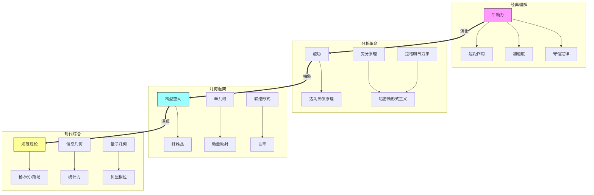

# 力的本质：穿过经典力学的几何之旅
* * *

--- 力不是原因而是结果 —— 它从时空的几何中涌现出来。

# 第一章：力的历史演变

*"我们称之为力的东西不过是我们在洞穴墙上抓取的影子。"*

## 1.1 牛顿的概念

我们的旅程并非从牛顿开始，而是从一个更深层次的问题开始：为什么人类首先构想出力？古代的“推拉”概念源于直接的身体体验 —— 肌肉对抗阻力的努力感。这种拟人化的概念从亚里士多德延续到中世纪的冲力理论，将力视为在物体之间传递的固有属性。

牛顿的天才并不在于测量力 —— 这之前已经有人做到了 —— 而在于认识到力是一种数学关系而非物质。他的第二定律：
$$\mathbf{F} = m\mathbf{a}$$
看似简单，但其中蕴含了一个深刻的转变：力不再由感觉定义，而是通过其在运动中的数学角色定义。

这种抽象是有代价的。尽管数学上强大，基于力的思考引入了几个概念上的困难：

1. **超距作用**：力如何能够在空间中瞬时作用？
2. **因果悖论**：如果力导致加速度，那么是什么导致了力？
3. **参考标架模糊性**：力在不同参考标架之间非协变变换

这些问题暗示了力的衍生性质 —— 它不是基本的，而是从更深层次的原则中涌现出来的。

## 1.2 分析革命

分析革命始于视角的微妙转变。达朗贝尔原理：
$$\sum_i (\mathbf{F}_i - m_i\mathbf{a}_i) \cdot \delta\mathbf{r}_i = 0$$
似乎只是重写了牛顿定律，但它包含了一个革命性的见解：力不一定是首要的。通过考虑虚位移 $\delta\mathbf{r}_i$，达朗贝尔将力从原因转变为约束。

欧拉通过变分法深化了这一见解。考虑一条路径 $\gamma(t)$。与其问什么力导致这个运动，而欧拉问道：实际路径在所有可能路径中有什么特性？这导致泛函视角：
$$S[\gamma] = \int_{t_1}^{t_2} L(\gamma(t),\dot{\gamma}(t),t) \, dt$$
在这里，力完全消失了，被拉格朗日量 $L$ 所取代。当我们写出：
$$\frac{d}{dt}\frac{\partial L}{\partial \dot{q}^i} - \frac{\partial L}{\partial q^i} = 0$$
力重新出现，不再是原因，而是导出的量 —— 构型空间几何投射的阴影。

能量视角完成了这场革命。哈密顿表述：
$$H(q,p) = p_i\dot{q}^i - L(q,\dot{q})$$
揭示我们所谓的力仅仅是势能的梯度：
$$\mathbf{F} = -\nabla V$$
这不仅仅是数学上的便利 —— 它表明力是次于更基本的几何结构的。

[技术注释：从力到几何的过渡反映在数学结构中：
- 牛顿：$\mathbb{R}^3$ 中的力向量
- 达朗贝尔：约束流形
- 哈密顿：辛几何]

这些发展揭示了力作为一个中间概念 —— 对计算有用，但并不是自然架构的基本组成部分。在下一章中，我们将看到现代微分几何如何完成这场革命，揭示力作为空间曲率的一个方面。

[历史注释：这种演变与几何本身的发展平行，从欧几里得构造到黎曼内蕴几何。]

# 第二章：几何转向

*"空间本身决定运动；力只是描述其曲率。"*

## 2.1 构型空间与约束

几何革命始于一个深刻的变化：不是力在空间中作用，而是空间本身引导运动。考虑一个 $n$-粒子系统。它的构型空间 $Q$ 不仅仅是一个方便的概念，而是动力学的基本舞台：
$$Q = \{\text{所有可能的构型}\} \simeq \mathbb{R}^{3n}$$
这个看似简单的定义包含革命性的见解：运动本质上是关于在 $Q$ 中的路径，而不是在 $\mathbb{R}^3$ 中的力。

$Q$ 的流形结构通过约束自然浮现。考虑一个双摆。其构型空间：
$$Q = S^1 \times S^1$$
揭示了约束不是“力”，而是可能性的几何结构。允许的运动不是“被迫”遵守约束的运动，而是在 $Q$ 中的自然测地线。

这种几何化随着切丛 $TQ$ 和余切丛 $T^*Q$ 深入：
$$\begin{align*}
TQ &= \{\text{带有速度的构型}\} \\
T^*Q &= \{\text{带有动量的构型}\}
\end{align*}$$
我们传统上称为“力”的东西表现为 $TQ$ 上的向量场 $F$ 或 $Q$ 上的 $1$-形式 —— 一个几何对象而非因果代理。

## 2.2 对称性的作用

对称性揭示几何与力之间最深层的联系。诺特定理指出，每个连续对称性都产生一个守恒律。但其深远意义不止于此：对称性定义力可以做什么和不能做什么。

考虑旋转对称性。角动量守恒：
$$\frac{d}{dt}(\mathbf{r} \times \mathbf{p}) = 0$$
不是力的结果，而是几何必然性 —— 关于构型空间结构本身的陈述。

这种关系在动量映射 $J$ 中结晶：
$$J: T^*Q \to \mathfrak{g}^*$$
其中 $\mathfrak{g}^*$ 是对称群李代数的对偶代数。这揭示了守恒律纯粹是几何特征，独立于任何力的概念。

力随后表现为对称破缺。考虑中心势 $V(r)$：
- 平移对称性被打破 → 力出现
- 旋转对称性保持 → 角动量守恒

这导致了一个深刻的发现：力并不导致对称破缺 —— 它们是对称破缺的表现。

[技术洞察：现代视角使用主丛：
- 构型空间 $Q$ → 底空间
- 对称群 $G$ → 纤维
- 力 → 联络形式]

关键几何结构浮现：

1. **辛形式**：
   $$\omega = dq^i \wedge dp_i$$
   不仅是数学工具，也是保持几何的基本结构

2. **动量映射**：
   $$\langle J(z), X \rangle = \omega(X_Q(z), z)$$
   统一对称性、守恒量和几何

3. **联络形式**：
   $$\alpha \in \Omega^1(P,\mathfrak{g})$$
   揭示力作为几何曲率

这种几何视角解决了经典悖论：
- 超距作用变为弯曲的构型空间
- 力的因果关系变为几何必然性
- 参考标架模糊性变为丛结构

[数学注释：形式主义自然扩展到：
- 规范理论(主丛)
- 场论(无限维流形)
- 量子力学(复线丛)]

在下一章中，我们将看到这种几何理解如何揭示力作为一种涌现现象 —— 可能性空间曲率投射的阴影。

# 第三章：力作为涌现现象

*"力不是从物体的推动中产生的，而是从空间的弯曲中涌现出来的。"*

## 3.1 势理论

从力到势的转变标志着我们对物理理解的根本性变化。考虑经典方程：
$$\mathbf{F} = -\nabla V$$
传统上读作“势产生力”，我们现在理解为相反：势是首要的，力是衍生的。这一看似微妙的转变彻底改变我们对物理定律的概念。

考虑一个具有度量 $g$ 的流形 $M$。自然运动不是由力产生的，而是由梯度流产生的：
$$\frac{dx^i}{dt} = -g^{ij}\frac{\partial V}{\partial x^j}$$
这揭示一个深刻的真理：粒子不因被推而运动 —— 它们跟随构型空间的自然几何结构。

现代视角通过纤维丛深化这一点。势成为一个线丛 $L \to M$ 的截面：
$$V \in \Gamma(L)$$
“力”表现为该丛上的联络：
$$\nabla_X V = (\partial_X + A_X)V$$
其中 $A$ 是联络 $1$-形式。这完全将力几何化 —— 它变成纯粹的曲率。

## 3.2 几何原理

通过最小作用量原理达到顶峰。考虑作用泛函：
$$S[\gamma] = \int_{t_1}^{t_2} L(q,\dot{q},t)dt$$
其欧拉-拉格朗日方程：
$$\frac{d}{dt}\frac{\partial L}{\partial \dot{q}^i} - \frac{\partial L}{\partial q^i} = 0$$
不是力定律，而是关于路径空间几何的陈述。

深刻见解通过雅可比度量显现：
$$ds^2 = (E-V(q))(T_{ij} \, dq^i \, dq^j)$$
这揭示了机械轨迹在弯曲空间中的测地线。“力”完全消失了，被纯粹的几何取代。

结构通过辛几何结晶。在具有典范辛形式 $\omega$ 的 $T^*Q$ 上：
$$\omega = dq^i \wedge dp_i$$
哈密顿方程变为：
$$i_{X_H}\omega = dH$$
这不是力定律，而是关于辛流形(而非力)的事实的几何必然性陈述。

[技术洞察：现代框架使用：
- 辛约化：$Q \to Q/G$
- 动量映射：$T^*Q \to \mathfrak{g}^*$
- 主丛上的联络]

关键几何结构浮现：

1. **埃雷斯曼联络**：
   $$\mathcal{H} \oplus \mathcal{V} = T(T^*Q)$$
   将运动分解为水平和垂直分量

2. **辛约化**：
   $$J^{-1}(\mu)/G_\mu$$
   揭示守恒律作为几何商

3. **几何相位**：
   $$\gamma = \oint A$$
   统一力与拓扑

这些导致深刻的发现：

1. **力即曲率**：
   - 不是一个实体，而是空间弯曲的度量
   - 从全局拓扑中涌现
   - 可通过全息量化

2. **运动是自然的**：
   - 跟随弯曲空间中的测地线
   - 守恒律来自对称性
   - 演化保持几何

3. **实在是几何的**：
   - 物理定律作为数学必然性
   - 力作为导出概念
   - 结构决定行为

[数学注释：此框架自然扩展到：
- 量子力学(几何量子化)
- 场论(无限射丛)
- 引力(度量几何)]

这种几何理解将我们的观点从原因转变为结果 —— 实在曲率投射的阴影。在下一章中，我们将探讨这种视角如何在经典力学之外开辟新的视野。

# 第四章：超越力

*"当我们超越力时，我们开始看到实在的真实结构。"*

## 4.1 现代视角

力的几何理解开启了深远的新视野。考虑杨-米尔斯理论。在这里，“力”成为主 $G$-丛的曲率：
$$F = dA + \frac{1}{2}[A,A]$$
这不仅仅是数学抽象 —— 它揭示了力作为纯粹的几何。电磁力成为 U(1) 丛的曲率；强相互作用力成为 SU(3) 丛的曲率。

量子几何相位加深了这一见解。贝里相位：
$$\gamma = i\oint \langle \psi|\nabla_R|\psi\rangle \cdot dR$$
揭示量子力从状态空间本身的几何中涌现。阿哈诺夫-波姆效应：
$$\Delta\phi = \frac{e}{\hbar}\oint \mathbf{A}\cdot d\mathbf{r}$$
展示没有经典力的类力效应 —— 纯粹的拓扑。

信息论提供了另一场革命。考虑费希尔度量：
$$g_{ij} = \int p(x|\theta)\frac{\partial \log p}{\partial \theta^i}\frac{\partial \log p}{\partial \theta^j}dx$$
这揭示“统计力”作为概率空间中的测地流。最大熵原理：
$$S = -\sum_i p_i\log p_i$$
成为几何必然性，而不是物理定律。

## 4.2 未来方向

这些视角提出了激进的新方向。在量子引力中，时空本身从更基本的结构中涌现。惠勒-德威特方程：
$$\mathcal{H}\Psi[g] = 0$$
表明时空和力都是涌现现象。

考虑圈量子引力的基本见解：几何被量子化。空间变成自旋网络：
$$|\Gamma,j_e,i_v\rangle$$
力不是从场中涌现，而是从时空本身的离散结构中涌现。

弦理论提出更为深远的视角。$\beta$ 函数方程：
$$\beta^G_{\mu\nu} = R_{\mu\nu} + \nabla_\mu\nabla_\nu\Phi + ...$$
揭示了引力(以及力)作为量子几何一致性的要求。

超越当前理论存在更深的可能性：

1. **涌现因果性**：
   - 时间和力共同涌现
   - 因果结构源自量子纠缠
   - 惠勒的“万物源于比特”原则

2. **信息几何**：
   - 实在作为计算对象
   - 来自算法必然性中的力
   - 基本的量子电路

3. **范畴论**：
   - 力作为自然变换
   - 纯结构中的物理学
   - 超越几何本身

[技术洞察：现代框架建议：
- 量子引力的拓扑斯理论
- 非交换几何
- 更高层次的范畴论]

关键统一原则浮现：

1. **终极涌现**：
   $$\text{结构} \rightarrow \text{几何} \rightarrow \text{力} \rightarrow \text{经验}$$

2. **信息基础**：
   $$I = -\sum p_i\log p_i \rightarrow \text{所有物理}$$

3. **纯数学**：
   $$\text{实在} \equiv \text{数学结构}$$

未来的疑问召唤：

1. **超越几何**：
   - 什么结构构成空间本身？
   - 范畴论是否更为根本？
   - 我们能否超越数学物理？

2. **终极实在**：
   - 信息是否是根本的？
   - 意识是否发挥作用？
   - 当前数学之外是什么？

3. **新数学**：
   - 所需的更高层次结构
   - 超越集合论
   - 新颖的逻辑框架

[最终见解：或许力、空间和时间都是我们尚未发现或创造的更深层次数学结构的阴影。]

从力到几何的旅程可能只是开始。实在的本质可能不仅超越了力，还超越了几何本身，引领我们进入今天几乎无法想象的数学结构。

[数学注释：未来的框架可能会使用：
- $\infty$-范畴
- 同伦类型理论
- 尚未知晓的新数学结构]

在结束时，我们意识到：将力视为几何只是第一步。真正的革命在于前方，那些将重塑我们对物理实在概念的数学结构。

# 附录 A：概念架构与关系

*"概念之网揭示实在的几何本质。"*

## A.1 概念层次与关系

以下图示捕捉从经典力学到几何原理的理解演化过程：

## A.2 核心概念框架

下表阐述不同理解层次之间的关键概念转换：

| 层次  | 基本实体 | 数学结构                                              | 物理解释 | 几何本质   |
| --- | ---- | ------------------------------------------------- | ---- | ------ |
| 经典  | 力向量  | $\mathbf{F} \in \mathbb{R}^3$                     | 直接因果 | 欧几里得空间 |
| 分析  | 作用泛函 | $S[\gamma] = \int L \, dt$                           | 变分原理 | 路径空间   |
| 几何  | 联络形式 | $\omega \in \Omega^1(P,\mathfrak{g})$             | 结构约束 | 纤维丛    |
| 现代  | 信息度量 | $g_{ij} = E[\partial_i \log p \, \partial_j \log p]$ | 涌现模式 | 统计流形   |

## A.3 数学架构

力的深层结构通过嵌套的数学框架显现：

$$\begin{CD}
\text{经典力} @>>> \text{势理论} @>>> \text{联络理论}\\
@VVV @VVV @VVV\\
\mathbb{R}^3 @>>> T^*Q @>>> P(M,G)\\
@VVV @VVV @VVV\\
\text{向量} @>>> \text{辛形式} @>>> \text{规范场}
\end{CD}$$

每个过渡揭示更深层次的几何结构：

1. **第一阶**(经典)：
   - 力向量
   - 直接因果
   - 欧几里得几何

2. **第二阶**(分析)：
   - 相空间
   - 哈密顿流
   - 辛几何

3. **第三阶**(现代)：
   - 纤维丛
   - 联络形式
   - 特征类

## A.4 涌现原理

概念的演化揭示三个基本原理：

1. **几何优先性**：
   $$\text{几何} \rightarrow \text{力} \rightarrow \text{运动}$$
   
2. **结构层次**：
   $$\text{局部} \xrightarrow{\text{联络}} \text{全局} \xrightarrow{\text{拓扑}} \text{普遍}$$
   
3. **信息基础**：
   $$\text{模式} \rightarrow \text{结构} \rightarrow \text{力} \rightarrow \text{动力学}$$

[数学注释：这里呈现的关系表明力是一种中间构造 —— 既不是基本的也不是任意的，而是从更深层次的数学结构中涌现出来的。]

此附录提供了一个多层次的框架，用于理解从具体向量到抽象几何结构的力概念的演化。每一层都揭示了几何与物理之间基本关系的新方面。

