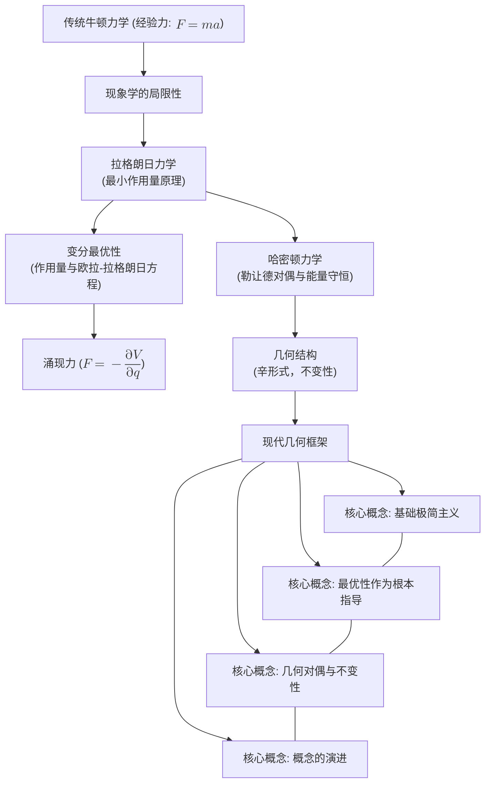

# 力的本质：通过经典力学视角的再审视
* * *

--- 从运动到几何，力涌现为自然的微妙低语。

# I. 引言

**题词：**  
*"宇宙在其简单性中隐藏着自然的深刻秘密 —— 只有剥离旧观念，我们才能见证新知。"*

经典力学长期以来为我们理解和预测物体运动提供了基石。传统上，我们通过三种不同但相互关联的表述来研究运动：

- **牛顿力学：** 在这里，力被引入作为一种引起加速度的外部作用，简洁地概括为公式  
  $$
  F = m a.
  $$
  在这一框架中，力被视为运动或物质变形的首要原因。尽管它在工程和日常应用中取得了巨大成功，这种现象学观点往往掩盖了更深层次的相互关系。

- **拉格朗日力学：** 作为牛顿思想的重新表述，拉格朗日力学将重点从力转移到能量。通过引入**最小作用量原理**，其中作用量  
  $$
  S[q(t)] = \int_{t_1}^{t_2} L(q, \dot{q}, t) \, dt
  $$
  被置为驻定(即 $\delta S = 0$)，我们得到了决定系统演化的欧拉-拉格朗日方程。在这里，我们感知为“力”的东西自然地表现为势能的导数(或梯度)，或是约束和边界影响的结果。

- **哈密顿力学：** 进一步抽象这些思想，哈密顿力学通过能量守恒和涉及构型与动量的对偶描述重新表述动力学。哈密顿量  
  $$
  H(q, p, t) = p \dot{q} - L(q, \dot{q}, t)
  $$
  突显守恒定律及相空间的几何结构，在此背景下，力被重新解释为底层辛几何的涌现属性。

尽管经过几十年甚至几个世纪的严格研究和应用，一个根本问题依然存在：**力的本质究竟是什么？** 历史上，力被视为描述相互作用的公理化输入，但现在它越来越多地被认为不是原始构造，而是一种涌现现象。在现代处理方法中，特别是在分析力学的视角下，力被重新定义为一种派生概念 —— 它源于势函数的梯度、约束的表现形式，或者是构型空间和相空间编码几何的结果。

这种统一的观点认为，力的可观测表现并非首要原因，而是更深变分原理和几何不变量的自然结果。在这一视角下，经典上归因于力的物体加速度是优化作用量的结果 —— 运动遵循驻定作用量的路径，与能量分布、势能景观以及系统的不变性性质密切相关。

**文档结构与核心问题：**  
本文档的目的是通过追溯力的概念演变并将其重新定位在一个整体几何框架内，重新审视经典力学中的力。在此过程中，我们将探讨以下关键问题：
- 力的概念如何从牛顿的表述演变为现代分析力学中的解释？
- 变分原理和几何结构(例如构型空间、相空间、辛几何)如何提供对力的更深层次、统一的理解？
- 将力视为一种涌现属性而非公理化原因对理论物理和应用物理的前沿发展有何影响？

在后续章节中，我们将回顾这一概念的历史，探索其通过变分和几何方法的现代重新诠释，并最终综合这些观点以展望动力学研究的未来方向。我们的目标是剥离传统的现象学层次，揭示微妙的底层机制 —— 最终表明我们所感知的“力”不过是自然的微妙低语，通过能量、几何和对称性的优雅互动得以显现。

通过从这些角度重新思考力的本质，我们邀请读者加入我们这段智力解放的旅程 —— 一段承诺对运动本质带来全新见解的旅程。

# II. 力的历史演变

**题词：**  
*"从牛顿之手到欧拉方程，力的故事不断演变。"*

力的概念在经典力学的历史中经历了显著的转变。从其在牛顿的经验观察中的早期萌芽，到在分析力学中的复杂重新表述，我们对力的理解得到了极大的深化。本章探讨这一演变过程，追溯力从运动的原始原因到基于几何和变分原理的涌现现象的进展。

## II.1. 牛顿力学：经验起源

牛顿力学奠定了经典物理学的大部分基础。在这个范式中，力被引入为一种瞬时作用，导致物体加速。根据牛顿第二定律，这种关系简洁地表示为：
$$
F = m a,
$$
其中  
- $F$ 表示作用于物体上的净力，  
- $m$ 是物体的质量，  
- $a$ 是其加速度。

这一公式在描述广泛物理现象方面取得了非凡的成功 —— 从行星轨道到日常物体的简单运动。在工程和应用科学中，牛顿的观点由于其直接性和简洁性仍然不可或缺。然而，需要注意的是，这种方法将力视为基本的、公理化的概念，几乎完全源自经验观察。

**牛顿视角的局限性：**  
- **现象学焦点**：牛顿力学接受力作为一个既定事实，而不探究其底层性质。它描述**发生了什么**(加速度发生)，而不是**为什么**存在力。
- **缺乏深层解释**：尽管在实际应用中有效，牛顿方法并未提供关于力的起源或内在本质的见解。没有解释为何力应遵循特定的数学关系，或为何它们以特定方式表现。
- **缺乏不变性**：传统公式并未揭示更深层次的几何或变分结构，这些结构支配着运动。

## II.2. 分析力学革命

随着分析力学的到来，发生了一场深刻的变化。该框架不再将力视为基本构建块，而是将其重新解释为更深、更抽象原则的结果 —— 其中最重要的是最小作用量原理。

### II.2.1. 变分基础

分析力学的核心是作用量泛函，定义为：
$$
S[q(t)] = \int_{t_1}^{t_2} L(q, \dot{q}, t) \, dt,
$$
其中 $L(q, \dot{q}, t)$ 是系统的拉格朗日函数，通常由动能与势能之差给出。基本假设是系统实际经历的路径 $q(t)$ 使作用量驻定(即 $\delta S = 0$)。这一条件直接导出欧拉-拉格朗日方程：
$$
\frac{d}{dt} \left( \frac{\partial L}{\partial \dot{q}} \right) - \frac{\partial L}{\partial q} = 0.
$$
在这种优雅的表述中，我们在实验环境中测量为“力”的东西自然地表现为势能 $V(q)$ 的导数。例如，在保守力场中，我们有：
$$
F = -\frac{\partial V}{\partial q}.
$$
因此，力不再是先验的基本量；相反，它是派生量 —— 能量景观梯度的表现形式。

### II.2.2. 哈密顿视角与几何洞察

分析力学革命并未止步于变分表述。基于欧拉和拉格朗日的工作，哈密顿力学引入了共轭动量的概念：
$$
p = \frac{\partial L}{\partial \dot{q}},
$$
并定义哈密顿量为：
$$
H(q, p, t) = p \dot{q} - L(q, \dot{q}, t).
$$
哈密顿表述将重点从力本身转移到能量守恒及丰富的底层几何结构。动力学演化随后由哈密顿方程控制：
$$
\dot{q} = \frac{\partial H}{\partial p}, \qquad \dot{p} = -\frac{\partial H}{\partial q}.
$$
在此框架中，力的概念与相空间(用余切丛 $T^*Q$ 表示)和辛结构交织在一起 —— 这一视角强调不变性和对偶性。力不再作为引发变化的主要代理，而是作为支配方程结构的固有属性而出现。

## II.3. 结论

本章展示了从牛顿的基础观点(力是运动的首要、可观测原因)到分析力学视角的历史进展，在后者中，力被视为变分原则和底层几何不变性的结果。这一演变不仅深化我们的理解，还为现代将力视为涌现现象的重新诠释奠定基础。

通过通过这些连续的视角重新审视力，我们开始认识到其本质并非由孤立的相互作用定义，而是由能量、几何和最优性之间的更广泛、更微妙的相互作用所决定。这一认识为后续章节铺平了道路，在那里我们将探索力的几何重新诠释及其对未来动力学研究的影响。

至此，我们完成了对力历史演变的探索，标志着从原始经验概念向分析力学领域中细致衍生现象的过渡。

# III. 力的几何重新诠释

**题词：**  
*"表现为力的，不过是几何在运动画布上的投影。"*

在现代观点中，力不再被视为动力学的基本、公理化成分。相反，它被看作是一种涌现现象 —— 更深层次变分和几何结构支配系统演化的结果。在本章中，我们从三个相互关联的部分发展这一视角。我们首先探讨当系统遵循驻定作用路径时力如何自然出现，然后展示勒让德变换如何弥合变分方法与基于能量的方法之间的差距，最后阐明构型空间和相空间几何在重新诠释力中的作用。

## III.1. 变分原理与力的涌现

现代力学的核心是最小作用量原理。该原理并未直接规定力，而是假设系统实际经历的路径使作用量
$$
S[q(t)] = \int_{t_1}^{t_2} L(q, \dot{q}, t) \, \mathrm{d}t
$$
驻定，即一阶变分为零：
$$
\delta S = 0.
$$

### III.1.1. 从驻定性到运动方程

通过考虑无穷小变分 $\delta q(t)$ (端点固定)，条件 $\delta S = 0$ 直接导出欧拉-拉格朗日方程：
$$
\frac{d}{dt}\left(\frac{\partial L}{\partial \dot{q}}\right) - \frac{\partial L}{\partial q} = 0.
$$
在此方程中，$\frac{\partial L}{\partial q}$ 项通常分解为动能和势能的贡献。当拉格朗日函数表示为
$$
L(q,\dot{q},t) = T(\dot{q}) - V(q),
$$
欧拉-拉格朗日方程给出
$$
\frac{d}{dt}\left(\frac{\partial T}{\partial \dot{q}}\right) + \frac{\partial V}{\partial q} = 0.
$$
在这里，$-\frac{\partial V}{\partial q}$ 项自然承担了力的角色，不是作为原始假设，而是作为势函数梯度的表现形式。在许多情况下，我们所识别的“力”仅仅是动力学对势能变化的响应。

### III.1.2. 边界项与约束的作用

此外，当允许端点处存在变分或施加约束时，额外的边界项进入画面。这些项通常编码物理信息，例如守恒量和对应于约束的反作用力。因此，即使是变分原理的补充方面也对最终测量的力有所贡献，强化了力作为一种依赖整体作用结构的涌现概念的观点。

## III.2. 勒让德对偶与分析方法的作用

尽管拉格朗日框架强调驻定作用原理，但它通过勒让德变换得到了转化和丰富 —— 这是一个将变分表述与基于能量的哈密顿视角联系起来的数学工具。

### III.2.1. 桥接两种表述

勒让德变换引入共轭动量
$$
p = \frac{\partial L}{\partial \dot{q}},
$$
并定义哈密顿量为
$$
H(q, p, t) = p \dot{q} - L(q, \dot{q}, t).
$$
这一变换将动力学重铸在相空间 $(q, p)$ 上，其演化由哈密顿方程控制：
$$
\dot{q} = \frac{\partial H}{\partial p}, \quad \dot{p} = -\frac{\partial H}{\partial q}.
$$

### III.2.2. 对偶性与涌现力

在这种对偶表述中，力并非作为独立实体直接引入；相反，它们隐含在哈密顿量的结构中。例如，考虑势能函数 $V(q)$。在哈密顿表述中，其影响出现在项
$$
-\frac{\partial H}{\partial q} = -\frac{\partial V}{\partial q},
$$
这与拉格朗日视角下推导出的力相呼应。这种对偶性强调了力的本质 —— 其对能量梯度的依赖 —— 是底层数学结构的自然结果。勒让德变换统一了变分与能量方法，揭示了动力学(以及由此产生的涌现力)深刻地编码在相空间的几何结构中。

## III.3. 力作为几何结构的结果

当通过几何的视角看待时，力的现代重新诠释达到了最充分的表达。在这里，经典力学的基本空间 —— 构型空间和相空间 —— 提供了力作为几何产物出现的舞台。

### III.3.1. 构型空间与相空间

构型空间 $Q$ 表示系统的所有可能位置。对于由广义坐标 $q$ 描述的系统，$Q$ 中的每个点对应一个唯一构型。当加入速度时，动力学传统上在切丛 $TQ$ 上表述。然而，哈密顿方法自然引向余切丛 $T^*Q$ 或相空间，其中每个点由 $(q, p)$ 给出。

### III.3.2. 庞加莱-嘉当 $1$-形式与辛结构

一个核心的几何对象是庞加莱-嘉当 $1$-形式，定义为
$$
\theta = p \, \mathrm{d}q.
$$
其外微分产生辛形式：
$$
\omega = -\mathrm{d}\theta = \mathrm{d}p \wedge \mathrm{d}q,
$$
这是一个闭合且非退化的 $2$-形式。这种辛结构封装相空间的不变几何框架，并确保动力学在规范变换下保持不变。

### III.3.3. 不变性与规范变换

规范变换是那些在相空间中保持辛形式 $\omega$ 的映射。它们的存在突显动力学背后的深层不变性。在这种几何图景中，历史上我们所识别的“力”被降级为次要角色 —— 它作为定义在 $Q$ 上的势函数的特征涌现出来，并与辛结构的不变性性质紧密相连。这些势函数的梯度(或在更高级设置中的曲率效应)提供了运动的动力，但只是深层几何架构的结果。

## III.4. 结论

通过这三个相互交织的视角 —— 变分原理、勒让德对偶和几何结构 —— 我们看到可观测的力并非一个首要、独立的实体。相反，它是优化作用量在丰富几何背景下的自然结果。通过接受这一现代观点，我们将注意力从力作为一个神秘代理转移到一种衍生现象，其与能量景观和底层物理的不变性性质密切相关。这种重新审视不仅深化了我们的理论理解，还为探索经典、量子及跨学科领域的动力学开辟了新途径。

# IV. 现代综合与未来展望

**题词：**  
*"在维度的舞蹈中，力的未来由不可见的几何编排。"*

在这一章中，我们将历史洞见与现代变分和几何方法结合起来，形成对经典力学的统一视角。通过综合牛顿、拉格朗日和哈密顿的观点，我们揭示这样一个事实：长期以来被视为运动首要引发者的力，更准确地应被理解为能量分布与不变几何结构相互作用下涌现的现象。这种现代综合不仅解决了长期存在的概念模糊性，还为未来在各个先进领域中的研究开辟了有希望的方向。

## IV.1. 统一传统与几何观点

历史上，力以其最熟悉的形式被引入，作为一种引起加速度的相互作用，由牛顿公式概括为
$$
F = m a.
$$
然而，尽管这一公式成功解释了许多物理现象，它仅提供了一种现象学描述。分析力学的到来改变这一图景。在拉格朗日表述中，系统的演化由最小作用量原理支配，
$$
S[q(t)] = \int_{t_1}^{t_2} L(q,\dot{q},t) \, \mathrm{d}t,
$$
并要求 $\delta S = 0$，从而导出欧拉-拉格朗日方程。在此背景下，该项
$$
-\frac{\partial V}{\partial q}
$$
自然承担了力的角色，作为势能 $V(q)$ 的梯度涌现出来。

哈密顿表述进一步完善我们的理解，引入共轭动量
$$
p = \frac{\partial L}{\partial \dot{q}},
$$
并定义哈密顿函数
$$
H(q,p,t) = p\dot{q} - L(q,\dot{q},t).
$$
哈密顿方程，
$$
\dot{q} = \frac{\partial H}{\partial p}, \qquad \dot{p} = -\frac{\partial H}{\partial q},
$$
揭示了构型空间与动量空间之间深刻的对偶性，并突显辛几何的作用。

这些多样化的表述共同汇聚到一个单一的统一框架中：力不是一个原始概念，而是从能量梯度和几何约束中衍生出的量。牛顿观点因此被纳入更广泛的几何和变分背景中，在这种背景下，底层数学结构的不变性保证所观察到的加速度只是这种深层数学和谐的表现。

## IV.2. 对先进领域的影响

将力重新诠释为一种涌现现象，其影响超出了经典力学范畴，影响多个先进的学科：

- **量子力学与量子场论：**  
  几何方法奠定了现代技术的基础，如几何量子化，其中正则变量和辛结构起着关键作用。以能量梯度和几何不变量重新设想力，为通往量子领域提供了自然的桥梁，在那里势函数和哈密顿量继续定义量子态的演化。这种统一视角可能导致经典与量子描述之间更加无缝的过渡。

- **现代工程与控制理论：**  
  在工程学科和机器人领域，经典的力概念是一个核心设计参数。然而，通过将力视为能量优化的涌现结果，工程师可以开发强调系统整体能量效率和稳定性的新型控制策略。这可能启发利用变分原理的新控制算法，从而产生更强大、自适应和最优的系统。

- **跨学科应用：**  
  超越传统界限，重新构思的力概念在机器学习、复杂系统甚至经济学等领域具有潜在应用。例如，优化类似能量的功能或探索构型空间的算法可以从辛几何和变分微积分中汲取见解。通过将力视为派生概念，跨学科合作可以在科学和技术挑战的广泛范围内促进创新解决方案。

## IV.3. 构想动力学的新范式

展望未来，力的抽象化为动力学研究的全新范式铺平道路：

- **完全几何方法：**  
  一个推测性的方向是发展一种框架，在该框架中动力学完全编码在几何结构中，不依赖于任何作为外部代理的力的概念。在这种表述中，整个系统的行为将由底层流形的性质决定 —— 其曲率、拓扑和辛不变量 —— 从而引领思考运动与相互作用的新方式。

- **新型数学框架：**  
  力的抽象化最终可能导致更高范畴理论或拓扑量子场论(TQFTs)的形成，在这些理论中，传统的因果性和相互作用概念被更抽象的不变量取代。这些框架可能为经典与量子力学的统一提供更深的洞察，并揭示物理定律织锦中之前隐藏的对称性。

- **弥合理论与应用之间的差距：**  
  通过将力重新构建为一种由几何驱动的涌现实体，未来的研究可能会发现不同领域之间的意外联系。例如，用于分析辛结构和变分原理的数学工具可以应用于新兴领域，如量子计算、复杂网络动力学和生物系统，提供关于复杂行为如何从简单不变原则中产生的新视角。

## IV.4. 结论

通过综合这些历史、变分和几何洞见，我们得出了经典力学的统一愿景，在此愿景中，力不再被视为不可捉摸的原因，而是自然内在几何的微妙结果。这种现代综合不仅精炼了我们的概念理解，还为超越传统学科边界的创新研究奠定了基础。随着我们进一步深入这一几何领域，重新构想的力概念无疑将继续激发并对我们理解支配宇宙的动力学提出挑战。

# V. 结论

**题词：**  
*"在追求真理的道路上，简洁并非幼稚 —— 它是通往深刻理解的直接路径。"*

在本文中，我们从牛顿通过公式
$$
F = m a,
$$
引入的直观、现象学的力的概念出发，迈向一个更为精炼、抽象的理解，在这一理解中，力作为最小作用量原理和复杂几何结构交织而成的衍生概念涌现出来。最初，力被视为运动的直接引发者，一种简单的因果机制，很好地解释了日常现象。然而，分析力学的发展从根本上重塑这一观点。随着拉格朗日和哈密顿框架的引入，力被重新表述为
$$
F = -\frac{\partial V}{\partial q},
$$
即能量梯度的表现形式，其中势能与变分原理的相互作用引导系统的演化。

从牛顿范式到变分与几何表述的转变标志着更深层次的统一：经典力的概念被纳入能量优化及构型空间与相空间不变性质的更广泛框架之下。勒让德对偶性的应用进一步连接拉格朗日与哈密顿方法，揭示了我们所观察到的力实际上编码在相空间的辛结构中 —— 一种在规范变换下保持稳健的几何不变量。

这种统一视角不仅弥合了历史表述之间的差距，还为未来的研究奠定基础。将力重新设想为一种涌现而非固有的原则，开辟了多条进一步探究的途径：

- **理论扩展：**  
  通过将力视为更基本的几何与变分基础的导出结果，我们可以深入探究物理相互作用的本质。此类研究可能导致新型数学框架的发展，包括高阶范畴理论或拓扑量子场论，它们可能提供对支配所有动力学的对称性和不变量的更深刻理解。

- **跨学科应用：**  
  超越经典力学领域，这种精炼的见解有望推动量子力学、工程学和控制理论的发展。在统一的几何背景下重新诠释力，可能会产生创新的计算方法和控制算法，利用复杂系统和机器人技术中的能量优化原则，同时促进经典与量子描述之间的过渡。

- **未来研究方向：**  
  接受力的几何本质邀请我们进一步探索传统概念失效的领域。无论是建模复杂系统中的涌现现象，还是将几何力学原理扩展到理论物理学中的未解问题，将力视为一种涌现属性为新一代理论与应用领域的研究提供了起点。

总之，通过追溯从牛顿直观定律到现代几何力学抽象综合的演变过程，我们不仅将不同的视角整合为一个连贯的框架，还照亮了理解与驾驭自然动力学的新途径。更深刻的洞见在于，力并非原始原因，而是底层几何的涌现投影，这为理论的深刻洞察和实践的进步提供了清晰性与统一性，强化了简单性和不变性在我们持续探索宇宙中的关键作用。

# 附录 A：核心概念之间的关系

本附录以图表形式展示本文讨论的核心概念和重要思想之间的相互联系。它说明了传统、变分与几何视角如何在我们对力作为涌现现象的现代综合中汇聚。

## A.A. 核心概念流程图

以下是展示关键表述和核心概念之间关系的流程图：

## A.B. 表格：核心概念及其相互关系映射

| **核心概念**      | **描述**                               | **相互关系**                                        |
| ------------- | ------------------------------------ | ----------------------------------------------- |
| **基础极简主义**    | 力并非首要、公理化元素；而是能量梯度、约束条件和几何结构相互作用的结果。 | 支撑现代观点，表明力源于更深的不变量，自然地链接到最优性和几何表述。              |
| **最优性作为根本指导** | 变分原理(如最小作用量原理)支配轨迹，使力成为势能梯度的结果。      | 成为经典(牛顿)与现代(拉格朗日/哈密顿)描述之间的桥梁，强调能量优化如何取代原始力的概念。  |
| **几何对偶与不变性**  | 力被重新解释为相空间和构型空间中固有几何结构(如辛形式)的体现。     | 通过勒让德对偶和辛结构的保持自然涌现；将基于能量的哈密顿方法与底层几何联系起来，强化守恒原则。 |
| **概念的演进**     | 从现象学的牛顿力到分析力学中的导出概念，最终实现其几何重新诠释。     | 提供上下文，统一经验与抽象表述，展示我们对力的理解逐步精炼的过程。               |

## A.C. 最后思考

本附录进一步强化了本文分析的现代力概念，并非孤立的公理，而是一种涌现现象。通过综合传统的牛顿观点与分析和几何方法，我们观察到：
- **能量优化 (最优性)** 和**几何不变性**最终产生了可观测的力。
- **概念的演进**突显从原始经验描述向精炼统一框架的转变，其中力从更深层的数学原则中导出。

这种强大的框架不仅解开了力的本质之谜，还为未来的理论与跨学科研究奠定了基石。

