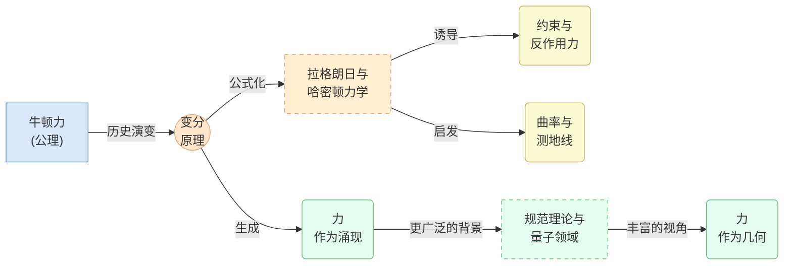

# 经典力学中力的本质再审视：几何与变分视角
* * *

--- 揭开力的面纱：从牛顿公理到几何涌现，发现其超越单纯向量的更深层次本质。

# 第 1 章 引言和历史背景

**题词：**  
“曾经作为公理，力塑造了几个世纪的运动理论 —— 现在我们寻求其表面之下的真理。”

经典力学始于以“力”作为变化基本驱动力的运动研究。本开篇章节回顾力的历史起源，追溯它如何在牛顿框架下被提升为中心支柱。接着预览分析力学带来的转变，逐渐将力重新定位为不仅仅是绝对假设，而是更深层次数学结构(如能量、变分、几何)的结果。通过这样做，我们为重新审视力 —— 从其最早的形式到现代几何再解释 —— 建立一个起点。

## 1.1. 牛顿的出现

历史上，艾萨克·牛顿的《自然哲学的数学原理》(1687 年)以其三大运动定律奠定了经典力学的基础，每一定律都基于力的概念。几代人以来，这些定律充当了最终蓝图：

1. 物体保持静止或匀速直线运动状态，除非受到外力作用。
2. 动量的变化率与所施加的净力成正比(通常表述为 $F = m a$)。
3. 力以大小相等方向相反的方式成对出现。

在这种原始图景中，力是所有运动变化的催化剂 —— 一个伟大的统一概念，解释了从落下的苹果到行星轨道的一切现象。力被视为既是物理上“真实的”，也是数学上不可约简的基本实体，可以在不同情境中测量和应用。这种观点不仅澄清了日常现象，还推动了牛顿力学数个世纪的成功。

当然，牛顿关于力的概念并非随意。它是包括伽利略关于惯性的见解和开普勒关于行星轨道的数学描述在内的几个世纪演变的结果。然而，牛顿大胆地将这些想法结晶成一个简洁的框架，使力成为经典动力学的核心。在许多方面，“力”是一个公理 —— 一个既不需要更深的理由也不需要几何重释的必要起点。

随着时间的推移，牛顿力学分支出各种子领域 —— 如流体力学和天体力学 —— 每个领域继续将力视为一种原始成分。尽管新形式的力(电磁力、摩擦力等)被识别或理论化，但基本方法保持不变：确定力，将其代入 $F = m a$，求解由此产生的运动方程。通过欧拉、拉格朗日等人，这种方法发展成为一套丰富的工具，推动了工程学、天文学等领域的突破。

因此，在经典物理学的形成阶段，很少有需要探究力的公理地位之下内容的需求。其概念的清晰性以及牛顿定律的普遍成功使力成为科学世界观中的固定元素。然而，更深层次数学视角的迹象很快浮现。

## 1.2. 分析力学与范式转变

尽管牛顿基于力的公式证明是稳健的，但一股理论创新的潜流开始暗示力可能不是力学最深层的货币。这一转变的种子由 18 和 19 世纪的数学家和物理学家 —— 尤其是拉格朗日、哈密顿等人 —— 种下，他们探索了一套新的思想：

1. **能量和变分原理**。最小作用量原理揭示了系统采取路径可以通过极值化单一标量量(作用量)而不是枚举显式力来得出。在变分设定中，“力”自然地作为势能相对于位置的导数出现，而不是作为一个独立的实体。

2. **坐标和约束**。通过聚焦于广义坐标和约束而不是原始力，分析力学强调了系统的配置几何。在拉格朗日观点中，一旦你编码动能项和势能，就可以获得运动方程，而无需直接调用牛顿第三定律或力对(作用力与反作用力)。

3. **相空间和哈密顿结构**。哈密顿形式主义建立在相空间(位置和动量)之上，完全消除了对力的显式引用，通过哈密顿方程重新诠释动力学。在这里，“力”成为哈密顿函数相对于位置的偏导数 —— 系统全局能量函数的一个局部表现。

在这些框架中，力不再是不可约简的支柱，而是作为“能量的导数”、“势能的负梯度”或“与拉格朗日乘数相关的反作用力”的方便标签出现。无论是物理学家、数学家还是工程师，都可以在日常计算中保留其对力的直观概念，但从更抽象的角度来看，力仅仅是更深层次几何对象(如辛形式、切向流或曲率约束)的一面。

因此，分析力学触发了一场范式转变：它保持了牛顿关于物体如何移动的见解，但将运动的真实核心置于变分微积分和配置几何中。这种概念上的重新定向为现代处理力的方法奠定了基础，其中力被理解为某种从势能或流形形状中涌现的现象，而非一个公理化的成分。

## 1.3. 结论

总之，本章展示了力 —— 曾经作为牛顿力学的奠基原则 —— 如何演变为可以被视为更深层次数学原理的情境导数的位置。随着我们进入后续章节，我们将探讨这种重新解释如何延续到变分方法、约束、曲率和现代物理学中，结晶出“力”作为一种涌现或次要现象的愿景。我们以此回应题词中的挑衅：曾经作为公理，力现在等待着一种更为深刻的理解 —— 编织进经典力学的几何和变分织锦之中。

# 第 2 章 变分原理中的力

**题词：**  
“在最小作用量原理中，力不作为指令，而是作为导数涌现。”

经典力学通常首先调用“力”作为首要推动者，但变分方法为它的角色带来了新的视角。在本章中，我们展示在最小作用量原理下，力如何成为一种次级表现 —— 具体来说，是全局作用量泛函的局部导数。因此，力看起来不像是一个独立的实体，而更像是更深层次几何或能量结构的计算副产品。然后，我们将通过勒让德变换以哈密顿力学的语言重新表述这些观点，揭示力同样编码在哈密顿函数的偏导数中。最后，我们考察在流形上，力如何自然地与曲率或约束对齐 —— 进一步强调其涌现状态。

## 2.1. 变分微积分：从作用量到欧拉-拉格朗日方程

分析力学的一个中心支柱是驻定作用量原理(常称为最小作用量原理)。在这个框架中，人们假设定义一个**作用量泛函**
$$
S[q] \;=\; \int_{t_{1}}^{t_{2}} L\!\left(q(t), \dot{q}(t), t\right)\,\mathrm{d}t,
$$
其中 $q(t)$ 表示系统在构型空间中的坐标(可能是流形 $\mathcal{Q}$)，$\dot{q}(t)$ 表示它们的时间导数。拉格朗日量 $L$ 通常具有如下形式
$$
L(q,\dot{q},t) \;=\; T(q,\dot{q}) \;-\; V(q),
$$
这里 $T$ 是动能(通常与 $\dot{q}$ 的二次项相关)，$V$ 是势能。**最小作用量原理**断言，在固定端点 $q(t_{1})$ 和 $q(t_{2})$ 之间的实际路径 $q(t)$ 使得 $S[q]$ 在小变化 $\delta q$ 下保持驻定。形式上，
$$
\delta S \;=\; 0.
$$
进行变分微积分 —— 分部积分并强制使 $\delta q$ 在时间边界处消失(为零) —— 得到**欧拉-拉格朗日方程**：
$$
\frac{\mathrm{d}}{\mathrm{d}t} \Bigl(\frac{\partial L}{\partial \dot{q}^{i}}\Bigr)
\;-\;
\frac{\partial L}{\partial q^{i}}
\;=\; 0
\quad
\text{for each coordinate } q^{i}.
$$
乍一看，这些方程只是以更抽象的形式重述牛顿第二定律。然而，请注意“力”如何从第二项出现：
$$
-\;\frac{\partial L}{\partial q^{i}}
\;\;=\;\; 
-\;\frac{\partial (T - V)}{\partial q^i}
\;\;=\;\;
\frac{\partial V}{\partial q^i},
$$
如果 $T$ 不显式依赖于 $q$。这个偏导数 $\frac{\partial V}{\partial q^i}$ 正是我们历史上所称的(广义)力。它不是作为一个公理引入的；相反，它从全局定义的标量函数 $V$ 中**推导**出来。因此，“力”是势能 $V$ 形状或斜率的局部投影，本身嵌入到全局作用量积分中。

从这个角度来看，力被揭示为一个**结果**而非驱动者。整个动力学故事都编码在轨迹相对于积分度量 $S[q]$ 的驻定性中。只有通过对该积分求导才能恢复力的概念。这种概念上的反转 —— 从“先有力”转向“先有作用量” —— 具有深远的影响：

1. 力自然地统一在单个数学对象 $L$ 中与势能结合。
2. 约束(完整或非完整)可以在不重新思考“力”的情况下纳入；只需修改 $L$ 或允许的变化 $\delta q$。
3. 对称性通过变分视角变得明确(最终导致诺特定理)，强化了“力”和“守恒量”是如何与作用量中的深层不变性相关的。

简而言之，欧拉-拉格朗日框架巩固了力源自更基本全局原则的局部导数的观点。

## 2.2. 勒让德变换与哈密顿光学

虽然拉格朗日观点将力重新定义为作用量的局部导数，但等价的变换引导我们进入**哈密顿力学**，在此力通过哈密顿函数 $H$ 的偏导数编码。连接这两种视角的变换是**勒让德变换**。

让我们定义广义动量
$$
p_{i}
\;=\;
\frac{\partial L}{\partial \dot{q}^{i}}.
$$
假定此关系可以反解出 $\dot{q}^{i}$ 作为 $(q, p)$ 的函数，则构造**哈密顿量**：
$$
H\left(q, p, t\right)
\;=\;
\sum_{i} \, p_{i}\,\dot{q}^{i}
\;-\;
L\!\left(q,\dot{q},t\right),
$$
所有 $\dot{q}^{i}$ 被替换为 $(q, p)$ 的函数。此 $H$ 通常解释为总能量：$H = T + V$。然后可以将作用量原理或运动方程写成哈密顿形式，得到规范集：
$$
\dot{q}^{i} \;=\; \frac{\partial H}{\partial p_{i}},
\quad
\dot{p}_{i} \;=\; -\,\frac{\partial H}{\partial q^{i}}.
$$
这里，观察到 $\dot{p}_i$  —— 即**动量的时间变化率**(在牛顿语言中为净力) —— 简单地是
$$
\dot{p}_i
\;=\;
-\;\frac{\partial H}{\partial q^i}.
$$
因此，力再次实现为一个**负偏导数** —— 这次是 $H$ 的。再一次，力不是一个孤立的存在；它是全局函数(哈密顿量)的局部微分反射。如果 $H$ 光滑依赖于 $q$，则“力”实际上是哈密顿量相对于 $q$ 的“斜率”。

有趣的是，这种观点类似于“哈密顿光学”中使用的光学类比，其中光射线遵循光学作用量的驻定路径，提供了关于波前弯曲的洞见。同样，机械“射线”(轨道)根据 $H$ 的导数弯曲。因此，无论是偏好拉格朗日还是哈密顿语言，“力”永远不会退回到一个独立实体：它驻留在更广泛的函数结构的导数中。

## 2.3. 流形上的几何解释

在这个变分故事中的最后一个视角是将整个机械系统嵌入到**流形**框架中 —— 通常是**构型流形** $\mathcal{Q}$，具有坐标 $q^i$。在拉格朗日力学中，通常工作在**切丛** $T\mathcal{Q}$ 上，其中点表示位置和速度 $\dot{q}$。相反，哈密顿力学调用**余切丛** $T^*\mathcal{Q}$，具有坐标 $(q^i, p_i)$。

在这种几何语言中，“力”从这些丛的内在曲率或约束中显现：

1. **曲率和测地线**。可以将自由运动(无外部势)解释为 $\mathcal{Q}$ 上的测地流。任何偏离测地流的现象 —— 被视为“力” —— 则是关于流形不是平坦的或者存在势能或规范场(这会修改联络)的陈述。

2. **约束作为子流形**。完整约束有效地降低了流形的维数，将运动限制在一个子流形上。“约束力”可以视为确保轨迹保持在允许子空间内的反应项 —— 再次是几何的局部显现。

3. **势能和 $1$-形式**。在哈密顿几何中，势能 $V(q)$ 可能定义一个精确的 $1$-形式 $\mathrm{d}V$。$V$ 的负梯度提供了一个“力”，但从根本上说，它是一个描述系统能量如何在流形上变化的几何对象。

因此，流形方法巩固了“力”仅仅是流形结构的局部反映的观点 —— 无论是来自势能地形、约束还是微分形式。更深、统一的原则是**运动**由流形(及其相关丛)如何指导允许轨迹来塑造，“力”作为一种伴随现象捕捉局部变化率。

## 2.4. 结论

最小作用量原理揭示了对力的一种广泛重新解释。力不再是运动方程的基本输入，而是全局定义的作用量(在拉格朗日形式中)或哈密顿量(在相空间形式中)的局部偏导数。通过采用几何视角 —— 其中切/余切丛和曲率编码系统的动力学 —— 人们看到力既不是纯粹“真实的”，也不是严格“公理化的”。相反，它是更深层次变分结构的**副产品**，每当系统的轨迹偏离测地流或势函数的梯度非零时就会显现。这一见解为第 3 章铺平了道路，其中我们将重点关注约束和曲率如何驱动类似力的效果，不断强化力远非不可约简的基础这一观念。

# 第 3 章 约束、曲率与力作为涌现现象

**题词：**  
“在每一个推动之下，都隐藏着一个形状化的流形，通过几何法令引导运动路径。”

现代分析力学揭示了力很少是一个独立的构造 —— 尤其是在我们考虑到系统在其上运动的底层流形时。本章探讨“约束力”或“虚构力”如何可以被视为更深层次几何或速度级限制的局部反映，以及曲率本身如何在旋转框架或弯曲空间中伪装成力。通过对完整约束、非完整约束和由曲率引起的力进行调查，我们进一步巩固了力从流形如何引导允许轨迹的原则。

## 3.1. 完整约束及其虚拟力

将力视为几何结果的最清晰方式之一是通过**完整约束** —— 这些条件可以表示为广义坐标之间的代数方程：
$$
f\left(q^{1}, q^{2}, \ldots, q^{n}, t\right) \;=\; 0.
$$
物理例子可能是一个珠子被限制在无摩擦的导线上滑动，或者摆被限制在一个圆弧上运动。在这种情况下，构型空间减少到原始流形 $\mathcal{Q}$ 的一个**子流形**。系统的轨迹必须始终保持在这个子流形上。

### 3.1.1. 虚位移与反作用力
当通过拉格朗日或哈密顿方法推导运动方程时，这些约束表现为**反作用(约束)力**，以强制满足子流形条件。数学上，通常引入与每个约束对应的**拉格朗日乘子** $\lambda^{\alpha}$：
$$
f_{\alpha}\left(q, t\right) \;=\; 0,
$$
这导致欧拉-拉格朗日方程中出现额外项：
$$
\frac{\mathrm{d}}{\mathrm{d}t}\Bigl(\frac{\partial L}{\partial \dot{q}^i}\Bigr) 
\;-\;
\frac{\partial L}{\partial q^i}
\;=\;
\sum_{\alpha}\,\lambda^{\alpha}\,\frac{\partial f_{\alpha}}{\partial q^i}.
$$
这些额外的“力”对符合约束的虚位移不做功；它们只是限制系统保持在有效的子流形上。从几何角度看，所谓的“反作用力”正是保持运动受限所需的**法向**或**切向**方向。

### 3.1.2. 几何而非推拉解释
这种方法阐明约束力并不是基本的“推力”，而是子流形几何的结果。一旦我们指定路径 $q(t)$ 不能离开构型空间的某个区域，这些“力”仅仅反映流形的形状，对运动施加边界条件。

## 3.2. 非完整系统与伪力

并非所有约束都可以直接表达为 $f(q) = 0$。有些出现在**速度**级别：
$$
a_{1}(q,t)\,\dot{q}^{1} 
\;+\;
\cdots
\;+\;
a_{n}(q,t)\,\dot{q}^{n}
\;+\;
a_{0}(q,t)
\;=\;
0,
$$
并且不能约化为简单的位置级约束。这种**非完整约束**常见于滚动运动(例如，滚动轮)或滑动摩擦条件。它们在纯拉格朗日框架中处理起来更加复杂，因为它们限制的是允许的速度而不是位置。

### 3.2.1. 涌现的伪力
非完整约束背后的几何更为微妙；它通常涉及在切丛 $T\mathcal{Q}$ 上分布约束。我们称之为“**伪力**”或“**广义反作用力**”，它们确保速度矢量在每一时刻保持在允许的子空间内。由于这些约束不能简单地表达为 $f(q)=0$，产生的反作用力尽管在效果上非常真实，但不一定源自简单的势能 $V(q)$。相反，它们反映了速度方向 $\dot{q}$ 字面上被“投影”到由非完整条件定义的子空间上。

这些伪力可能不守恒能量，也不总是整齐地适应“子流形的几何”。然而，概念线索依然存在：这些力是从**允许速度的不可变形状**中涌现出来的。它们的作用是在切丛内强制实现局部几何，不断将运动投影到有效域。

## 3.3. 曲率作为表观力的来源

也许力的涌现特性在旋转或弯曲框架中最明显。日常例子包括：

1. **离心力和科里奥利力**：在具有角速度 $\boldsymbol{\Omega}$ 的旋转参考标架中，观察者感知到“向外”的离心力 $\boldsymbol{F}_\text{centrifugal}$ 和“偏转”的科里奥利力 $\boldsymbol{F}_\text{Coriolis}$。两者都不是真正的牛顿相互作用；每个力仅因旋转框架具有**非惯性**几何而产生。

2. **引力作为曲率**：在广义相对论中，引力吸引被识别为时空曲率而非基本的“拉力”。虽然经典力学并未完全采纳爱因斯坦的观点，但弯曲流形可以模仿或生成我们所解释为力的概念与主题产生共鸣：“力”可以是深层几何偏离平坦性的局部表达。

### 3.3.1. 测地线与表观加速度
在纯粹的**几何**图景中，平直惯性框架中的自由粒子沿着直线(零“力”的测地线)运动。转换到旋转坐标系统或弯曲流形，这些测地线似乎弯曲或加速 —— 因此在该框架中的观察者发明了“虚构”或“惯性”力来解释非线性路径。

旋转框架中的惯性力方程常采用如下形式：
$$
\boldsymbol{F}_\text{inertial}
\;=\;
-m\,\left(\boldsymbol{\Omega}\times(\boldsymbol{\Omega}\times \mathbf{r})\right)
\;-\;
2m\,(\boldsymbol{\Omega}\times \dot{\mathbf{r}}),
$$
其中第一项代表离心力，第二项代表科里奥利力。然而，从全局角度来看，这些只是坐标几何的人工产物 —— 反映了选择的基底是非惯性的。系统的“真实”或惯性路径仍然是更高层次意义上的测地线。

## 3.4. 结论

在存在完整约束、速度级(非完整)限制或流形曲率的情况下，我们再次看到**力**主要是一种几何的涌现回响，而不是先验存在的实体。反作用力确保系统的运动保持在特定的子流形内；非完整约束将允许的速度重塑为受限的方向性；而诸如科里奥利或离心项的表观力仅仅是非惯性框架几何后效的表现。在所有这些情景中，“力”功能上作为全局规则的局部反映，该规则由流形及其相关约束施加于轨迹。

这强烈呼应了测地线观点：在没有“外部推力”的情况下，自由运动遵循在适当选择的几何中的测地线。任何“力”只是曲率或约束引起路径偏离平坦或不受约束的测地线的局部度量。因此，无论讨论拉格朗日乘子、非完整的反作用项还是旋转框架中的惯性力，我们都确认了一个统一的主题：力从几何和约束如何塑造允许运动中涌现。

第 4 章基于这一观念，面对更广泛的情境 —— 场论视角、规范对称性、量子框架 —— 其中力的几何性质增强，连接经典景观与更丰富的数学结构。

# 第4章 展望未来：现代见解与扩展

**题词：**  
“当几何拥抱场，场孕育量子领域时，力只是更深层次对称性的一个面相。”

经典力学最初在牛顿定律的基础上繁荣发展，随后通过拉格朗日、哈密顿以及构型流形重新构想。然而，“力”的几何视角并未止步于此。当代数学和物理学进一步扩展了这一观点，将空间、对称性和场融合在一起，使力的概念融入更广泛的几何构造中。本章探讨三个关键前沿：基于纤维丛的规范视角，量子和相对论领域中力的新面貌，以及可能重塑我们对未来力概念的推测性进展 —— 离散或非交换框架。

## 4.1. 纤维丛与规范视角

在经典力学中，力通常来源于势函数 $V(q)$ 或作为反作用项出现。相比之下，规范理论将这一思想提升到**场论**层面。一个典型的例子是电磁学，由 $U(1)$ 规范联络 $A_\mu$ 模型化。电磁场强
$$
F_{\mu\nu}
\;=\;
\partial_{\mu} A_{\nu}
\;-\;
\partial_{\nu} A_{\mu},
$$
可以被视为规范丛的**曲率** —— 一个在时空上推广“扭曲”概念的几何对象。带电粒子之所以“感受到”电磁力，正是由于它们穿越具有非平凡曲率的纤维丛。与其将力视为独立实体，不如将其解释为规范场如何扭曲平行输运的局部表现。

这种基于丛的思考方式贯穿于现代物理学中。例如，非阿贝尔规范理论 —— 如量子色动力学中的 $SU(3)$ —— 扩展了相同的几何原理，通过高维纤维丛中的曲率解释基本相互作用。这一视角揭示了经典势梯度思想与高级场论之间的深刻连续性：每当场(或联络)弯曲时，我们将由此产生的效应称为“力”。再次，几何包含力，将其统一于联络和曲率的广泛语言中。

## 4.2. 超越经典：量子与相对论扩展中的力

尽管“力”仍然是日常计算中的便捷标签 —— 例如电磁背景下的洛伦兹力 —— 量子力学和相对论质疑其经典的中心地位。在量子系统中，波函数 $\psi(\mathbf{r},t)$ 主要支配演化。势能项 $V(\mathbf{r})$ 仍然出现在薛定谔方程中，
$$
i\hbar \,\frac{\partial \psi}{\partial t}
\;=\;
-\,\frac{\hbar^2}{2m}\,\nabla^2 \psi
\;+\;
V(\mathbf{r})\,\psi,
$$
但“力”的概念变得从属于振幅分布、干涉和边界条件。“类力”效应通过量子场设置中的相位梯度或规范势显现；然而，这些又可解释为**几何相位**或联络(例如凝聚态物理中的贝里相位)。

相对论进一步转变“力”的范式。在广义相对论中，引力源于由度量 $g_{\mu\nu}$ 描述的时空曲率；测试粒子沿着该弯曲度量中的测地线运动，而无需任何“引力的力”作用。牛顿引力吸引在弱场中作为近似出现，但从根本上说，力让位于几何曲率。这与我们的涌现观点一致：如果自由运动是测地线，则表观力仅仅是非平凡几何的坐标表达。

## 4.3. 未来潜在方向

展望未来，几个理论扩展可能会进一步重构力的概念：

1. **离散方法与晶格理论**。在数值和高能物理学中，时空和场经常在网格或晶格上离散化。在这里，“力”从局部链接和斑块上的有限差分约束中涌现。规范场的链接变量结构的曲率支撑相互作用能量，再次强调局部“力”是离散几何全局连通性的结果。

2. **非交换几何**。前沿数学考虑熟悉的时空坐标在非常小的尺度下可能不交换的可能性。这可能产生标准规范理论中不存在的新形式的“相互作用”，或者以模糊几何与量子算符之间界限的方式重新解释已知力，暗示“力”只是更深层次非交换关系的标志。

3. **可积系统与扭量方法**。某些可积模型表明，大类经典解可以编码在最小表面结构或扭量空间中，强化了“力”是这些高级几何形式主义中嵌入解决方案的反映的观点。随着更复杂解技术的出现，几何与“力”之间的差距可能会进一步缩小。

总之，经典力概念 —— 作为运动的明确原因 —— 在量子和相对论领域中受到公开挑战，新框架只会加深这一挑战。无论是通过规范曲率、离散约束还是非交换坐标，主题都是一致的：“力”最好被理解为更宏大几何架构的局部反映。它在未来物理理论中可能会被取代或重新解释，正如它已被无缝编织进规范场和时空曲率的织锦中。

## 4.4. 结论

通过接纳纤维丛、规范联络和现代物理学的高级形式，我们看到“力”可以被理解为更深刻几何织锦的一个方面。经典力学教会我们从势能中推导出力；场论将“势能”推广到“联络”，明确了无论何时几何弯曲，力都是该弯曲的局部表达。当我们深入量子和相对论领域 —— 其中波函数和时空曲率占主导地位 —— 力成为更为丰富的谜题中的一片薄片。这为我们的最后一章奠定了基础，在其中我们将统一这些观点，并反思将力视为涌现如何可能重塑经典力学及其以外的教学、研究和未来努力。

# 第5章 结论 —— 力的再审视

**题词：**  
“从公理到人工制品，力在运动之舞中被揭示为几何的信使。”

在通往这一最终结论的章节中，我们追溯一个概念旅程，将“力”从其牛顿基座重新定位为一个衍生或涌现现象 —— 编织进几何、变分原理和约束的本质结构中。力不再是简单地驱动运动的独立矢量；相反，它源于更深层次的构造，如全局作用量、流形曲率或规范场连接。本章综合了主要见解，并建议研究人员、教育者和学生如何在科学和教学中推进这些思想。

## 5.1. 涌现视角的综合

我们的探索始于牛顿定律 —— 其中力是经典力学的基石 —— 并跟随分析形式的发展，温和地将力从中心位置移开，转而支持作用量原理。**拉格朗日**和**哈密顿**方法表明，力可以解释为全局势能或能量函数的偏导数。在此基础上，我们看到几何推理(以流形、曲率或约束的形式)往往使力成为更深层次结构的副产品。

- **第 1 章**回顾了牛顿关于力的概念最初被视为公理 —— 不受挑战且基础。
- **第 2 章**展示了当我们采用最小作用量原理时，力自然表现为一种导出量 —— 势能的“斜率”或哈密顿量的变化，而不是运动的基本驱动力。
- **第 3 章**演示了约束和曲率如何模仿或创造“力”，强调力通常是限制运动于子流形或旋转框架的人工制品。
- **第 4 章**阐述了现代见解，描述了场论和高级几何如何将力纳入更广泛的框架(例如，规范场、时空曲率、量子力学)，进一步确认其涌现状态。

实际上，整个叙述始终围绕一个主题：虽然力仍然是实际分析中不可或缺的概念(从工程设计到日常问题解决)，但其理论基础并不是普遍的定律或公理。相反，它是更广泛几何和变分关系投下的“局部阴影”。力是几何在“推”和“拉”的局部语言中的表达。

## 5.2. 对研究人员和教育者的展望

认识到力是涌现而非公理性的具有强大的意义：

1. **教学策略**
   - **课程设计**：尽早向学生介绍更深层次的几何和变分原理，有助于他们将力视为更大织锦的一部分。教师可以从一开始就强调最小作用量原理或哈密顿流的几何，而不是仅仅关注 $\mathbf{F} = m\,\mathbf{a}$。
   - **概念工具**：学习如何约束和曲率生成“有效力”的学生可获得跨越传统学科界限(力学、电磁学、连续介质理论等)的更统一的理解。

2. **高级研究方向**
   - **跨学科桥梁**：力的涌现解释与现代数学(辛几何、规范理论)和高级物理学(量子场论、广义相对论)产生共鸣。研究人员可以进一步探索这些观点如何统一描述基本相互作用，架起经典与量子世界之间，或引力与规范框架之间的桥梁。
   - **新框架**：随着离散几何、非交换空间和可积系统的持续发展，力的概念可能会经历进一步的转变。质疑经典几何基本假设的研究(例如通过引入量子修正结构)可能改变我们定义和测量力的方式。

3. **实际应用**
   - **工程与机器人技术**：在复杂的机器人系统或多体动力学中，约束丰富，“有效力”往往比原始外部力更为重要。将力视为由约束几何涌现的观点可以产生更优雅的控制算法。
   - **跨学科合作**：像生物力学(解剖约束塑造运动)或天体物理学(引力曲率占主导地位)等领域可以从重新构建力为几何结果中受益，可能提供对复杂动力系统更深入的洞察。

综上所述，这种展望表明，尽管力的涌现性起初看似微妙，但它可以丰富我们对运动的理论理解以及我们在应用背景下的创新能力。当我们看到力作为更深层次结构的导出表达时，我们打开了探索、分析和教学的新方法。

## 5.3. 最后的反思

从牛顿时代绝对力到现代规范曲率的讨论，力学的演变揭示了力是一个灵活、依赖上下文的概念。其从公理到人工制品的一致重新诠释，突显了通过几何和变分透镜看待运动的力量。如果从这次旅程中学到了什么，那应该是鼓励超越直接的推拉叙事，寻求底层流形、作用量原理或规范连接对轨迹的“塑造”。

因此，我们重申“力”并未从物理学中消失；它只是被认作更深层次现象的一种方便表示。通过将力置于这些更广泛、通常更优雅的框架中，我们为经典力学及其他领域的学习、发现和创造力照亮了新的路径。

# 附录 A. 概念概览

为了帮助读者一目了然地掌握本文档中的关键思想及其相互关系，我们在这里提供一个核心概念的示意图。下图突出显示了“力”如何从牛顿公理过渡到嵌入几何和变分原理中的涌现现象。它还展示拉格朗日/哈密顿力学、约束、曲率以及规范理论等现代扩展的作用：

**图表说明**：

1. **牛顿力(公理)**  
   历史上，力被视为运动的基础驱动。牛顿的见解使其既成为一种真实的量，也成为基础性的假设。

2. **变分原理**  
   拉格朗日和哈密顿力学源于最小作用量原理，将动力学的核心置于作用泛函中，而不是显式的力定律中。

3. **拉格朗日与哈密顿力学**  
   在这些分析框架中，力不再是独立输入，而是通过势函数的偏导数或等效于哈密顿梯度产生。

4. **约束与反作用力**  
   约束(完整或非完整)对运动施加几何限制，从而产生“反作用力”。这些不是基本的推力，而是系统构型空间或切丛边界条件下的几何副产品。

5. **曲率与测地线**  
   曲率的概念进一步完善了我们的理解：在弯曲流形(或旋转框架)中的自由运动产生“虚构”或“惯性”力，它们反映了与平坦的测地线路径的几何偏离。

6. **力作为涌现**  
   综合上述内容使我们远离将力视为公理的观点，而是将其视为全局变分路径、势能景观或流形曲率的局部表现或“阴影”。

7. **规范理论与量子领域**  
   向现代物理学的扩展 —— 如规范理论和量子场框架 —— 将力嵌入到场曲率、纤维丛或相位因子中，强化了“力”是更深层次几何或场论结构的简化这一观点。

8. **力作为几何**  
   最终，在高级处理中(从规范场到非交换几何)，力越来越被解释为底层几何以局部变化的形式与系统轨迹沟通的语言，架起了经典与量子领域的桥梁。

通过检查这些连接，可以看出文档的整体论点是如何紧密联系在一起的：尽管力对于实际应用和日常计算不可或缺，但它最终源自更一般的构造，而不是作为力学的永久基石。这种广泛的视角为从经典约束和曲率到高层次场论和几何的深入洞察铺平了道路，确保“力”仍然是运动大织锦中有价值但次要的主题。

