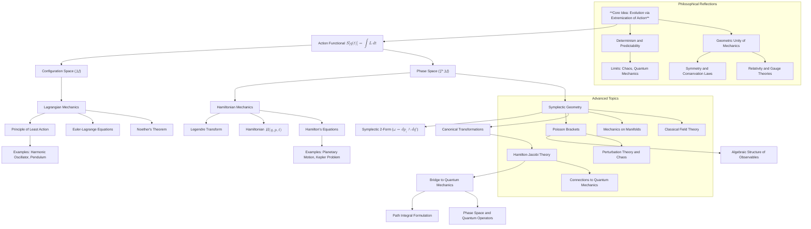

# Reconstructing Classical Mechanics: A Unified Conceptual Framework
* * *

--- From Principles to Geometry: A Deep Dive into the Foundations of Dynamics

# **1. Introduction**

## **1.1 The Significance of Classical Mechanics**

Classical mechanics is the cornerstone of physics, laying the foundation for our understanding of motion, forces, and the dynamics of physical systems. Its principles govern a vast range of phenomena, from the motion of planets to the oscillations of pendulums, and its formulations have profoundly influenced the development of modern science and mathematics. Beyond its practical applications, classical mechanics is a conceptual masterpiece, offering deep insights into the nature of determinism, symmetry, and geometric structure in physical laws.

However, the true power of classical mechanics lies not merely in its ability to describe motion but in its ability to encode universal physical principles into an elegant and unified framework. It provides tools for abstraction, enabling the study of dynamical systems across diverse domains, from particle dynamics to field theories and even quantum mechanics. Its influence extends far beyond physics, shaping modern mathematical fields such as differential geometry, symplectic topology, and variational calculus.

Classical mechanics is more than a collection of equations or tools—it is a language that reveals the structure of natural laws.

## **1.2 Challenges in Understanding Classical Mechanics**

Despite its foundational role, classical mechanics is often perceived as a fragmented field, divided into distinct subdomains such as Newtonian mechanics, Lagrangian mechanics, and Hamiltonian mechanics. While these formulations are mathematically equivalent, their conceptual connections are not always obvious. This fragmentation creates challenges in understanding the deeper unifying principles that link these approaches.

Moreover, the historical development of classical mechanics, rooted in Newton’s laws, tends to obscure its modern geometric and variational interpretations. For experienced researchers and educators, the challenge is not merely to revisit classical mechanics but to synthesize its diverse aspects into a cohesive framework that emphasizes its underlying unity.

Key questions arise:
- What is the essence of classical mechanics?
- Can we identify a unifying principle that connects its different formulations?
- How can we reframe classical mechanics to highlight its conceptual depth and reveal new perspectives?

## **1.3 A Principle-to-Geometry Reconstruction**

This document proposes a **principle-centric and geometry-focused approach** to reconstruct classical mechanics. The reconstruction begins with a single unifying idea: **the evolution of physical systems is governed by the extremization of a quantity, the action.** This principle, known as the **principle of least action**, provides the foundation for all of classical mechanics. From this starting point, the document builds outward, layer by layer, organizing the field into a hierarchical structure.

The reconstruction emphasizes the following key themes:
1. **The Principle of Evolution**: The universal idea that physical systems follow trajectories that extremize the action.
2. **Action as the Core Quantity**: The action functional serves as the central quantity from which all equations of motion are derived.
3. **Geometric Foundations**: The dynamics of physical systems are naturally encoded in geometric structures:
   - **Configuration Space ($M$)**: A space that encapsulates the generalized coordinates of the system.
   - **Phase Space ($T^*M$)**: A symplectic manifold that unifies positions and momenta.
   - **Symplectic Geometry**: The mathematical framework underpinning phase space, governed by the symplectic 2-form $\omega = dp_i \wedge dq^i$.

This reconstruction reveals classical mechanics as a hierarchy of interrelated concepts, progressing from core principles to advanced topics. By focusing on the geometric and variational foundations, the document aims to provide readers with a deeper understanding of classical mechanics, highlighting its conceptual unity and its connections to modern physics and mathematics.

## **1.4 Purpose and Objectives of the Document**

The purpose of this document is twofold:
1. To reorganize classical mechanics into a unified, hierarchical framework that emphasizes its fundamental principles and geometric underpinnings.
2. To provide experienced researchers and educators with a deeper understanding of classical mechanics, enabling them to revisit well-established concepts from a fresh and enriched perspective.

The document is structured to achieve the following objectives:
- **Clarify Core Principles**: Identify and articulate the fundamental principles (e.g., action, evolution, and symmetry) that govern classical mechanics.
- **Unify Formulations**: Show how Newtonian, Lagrangian, and Hamiltonian mechanics emerge naturally from the principle of least action and the structure of configuration and phase spaces.
- **Highlight Geometric Foundations**: Demonstrate the role of geometry (configuration space, phase space, symplectic structure) in encoding the dynamics of physical systems.
- **Extend to Advanced Topics**: Explore how the core ideas of classical mechanics generalize to fields such as chaos theory, field mechanics, and quantum mechanics.

## **1.5 Structure of the Document**

The document progresses systematically, starting with the **principle of evolution**, then expanding to the **analytical frameworks** of Lagrangian and Hamiltonian mechanics, and finally exploring the **geometric structure** of phase space and its extensions. The structure is designed to guide readers from foundational concepts to advanced topics, emphasizing the interconnectedness of ideas at each step.

1. **Core Principles of Classical Mechanics**: Introduces the principle of least action, the action functional, and their role in governing system dynamics.
2. **Configuration Space and Lagrangian Mechanics**: Develops the Lagrangian framework as the first analytical formulation, rooted in configuration space.
3. **Phase Space and Hamiltonian Mechanics**: Transitions to the Hamiltonian formalism, introducing phase space and symplectic geometry.
4. **Symplectic Geometry and Canonical Transformations**: Explores the geometric foundations of phase space and the role of symplectic structure in conservation laws and transformations.
5. **Advanced Topics and Extensions**: Expands classical mechanics to include perturbation theory, chaos, field theory, and connections to quantum mechanics.
6. **Philosophical and Foundational Reflections**: Reflects on the conceptual and philosophical implications of classical mechanics, including its role as a precursor to modern physics.

## **1.6 Closing Thought**

Classical mechanics is not merely a tool for solving problems—it is a conceptual framework that encodes the fundamental principles of nature. By reconstructing classical mechanics from its core principles and emphasizing its geometric structure, this document aims to provide a deeper, more unified understanding of the field, inspiring readers to explore its rich connections and potential extensions.

# **2. Core Principles of Classical Mechanics**

Classical mechanics rests on a conceptual foundation that is at once universal and elegant: **the evolution of physical systems is governed by a principle of extremization, where the system follows a trajectory that minimizes (or extremizes) a quantity called the action.** This principle unifies the study of motion and forces into a single framework based on variational calculus, providing a powerful tool for describing the dynamics of systems.

## **2.1 The Principle of Evolution**

The **Principle of Evolution** is the cornerstone of classical mechanics, asserting that **every physical system evolves along a trajectory that extremizes a specific scalar quantity: the action $S$.** This principle encapsulates the following key ideas:

1. **Extremization of a Quantity**
   The system's motion is governed by the condition that the action $S$ is stationary under small variations of the system's trajectory. Mathematically:
   $$
   \delta S = 0,
   $$
   where $S[q(t)]$ is the action functional, and $\delta S$ represents the variation of the action due to infinitesimal changes in the trajectory $q(t)$.

2. **Universality of Variational Principles**
   The principle of extremization is not unique to classical mechanics but is a universal feature of many physical theories, from optics (Fermat's principle) to field theory and quantum mechanics (path integrals). In classical mechanics, this principle manifests as the **Principle of Least Action.**

3. **Physical Intuition**
   The extremization of action reflects a form of **optimization in nature**: systems evolve along paths that "balance" energy, time, and geometry. This principle provides a unified description of dynamics, encompassing forces, motion, and energy conservation, without explicitly requiring Newtonian notions of force.

4. **Geometric Encoding**
   The principle of evolution is naturally expressed in terms of geometric structures:
   - **Configuration space $M$** represents the system's possible states.
   - The trajectory $q(t)$ is a curve in $M$, and the action $S[q(t)]$ is a scalar functional associated with the curve.

## **2.2 The Action Functional**

The action functional $S[q(t)]$ is the fundamental quantity in classical mechanics, encoding the system's dynamics in a single scalar. It is defined as:
$$
S[q(t)] = \int_{t_1}^{t_2} L(q, \dot{q}, t) \, dt,
$$
where:
- $L(q, \dot{q}, t)$ is the **Lagrangian**, a function that depends on the generalized coordinates $q^i$, their velocities $\dot{q}^i = \frac{dq^i}{dt}$, and time $t$.
- The Lagrangian is typically expressed as:
  $$
  L(q, \dot{q}, t) = T(q, \dot{q}) - V(q),
  $$
  where $T$ is the kinetic energy and $V$ is the potential energy.

### **2.2.1 Physical Intuition: Action as Accumulated Energy**
The action $S$ measures the "total energy cost" of a system's motion over time. Intuitively:
- The Lagrangian $L$ represents the instantaneous energy difference between kinetic and potential energy ($T - V$).
- The action $S$ accumulates this energy difference along the trajectory $q(t)$ between times $t_1$ and $t_2$.

### **2.2.2 Stationary Action and the Euler-Lagrange Equations**
The condition $\delta S = 0$ implies that the action is stationary (not necessarily minimized) with respect to variations in the trajectory $q(t)$. Mathematically, this leads to the **Euler-Lagrange equations**:
$$
\frac{\partial L}{\partial q^i} - \frac{d}{dt} \frac{\partial L}{\partial \dot{q}^i} = 0.
$$
These equations are the fundamental dynamical laws of classical mechanics in the Lagrangian formulation. They describe how the generalized coordinates $q^i$ evolve in time:
- The first term $\frac{\partial L}{\partial q^i}$ accounts for how the Lagrangian changes with position $q^i$.
- The second term $\frac{d}{dt} \frac{\partial L}{\partial \dot{q}^i}$ accounts for how the Lagrangian changes with velocity $\dot{q}^i$.

### **2.2.3 Examples**
1. **Simple Harmonic Oscillator**:
   - Lagrangian: $L = \frac{1}{2}m\dot{q}^2 - \frac{1}{2}kq^2$.
   - Euler-Lagrange equation: $m\ddot{q} + kq = 0$.

2. **Free Particle**:
   - Lagrangian: $L = \frac{1}{2}m\dot{q}^2$.
   - Euler-Lagrange equation: $m\ddot{q} = 0$, implying uniform motion.

## **2.3 The Role of Time**

Time plays a central role in classical mechanics as the **parameter of evolution**. It is through the flow of time that the system transitions from one state to another, and the action functional integrates the system's dynamics over this temporal progression.

### **2.3.1 Time as a Parameter for Evolution**
In classical mechanics:
- Time $t$ is an independent parameter that orders the sequence of events in the system.
- The trajectory $q(t)$ describes how the system evolves as time progresses.

The action functional explicitly depends on time through $L(q, \dot{q}, t)$, allowing for systems with time-dependent forces or constraints.

### **2.3.2 Time, Energy, and Dynamics**
Time is intimately connected to the concept of energy. In particular:
1. **Energy Conservation**:
   - If the Lagrangian $L$ does not explicitly depend on time ($\partial L/\partial t = 0$), the system's total energy $E$ is conserved:
     $$
     E = T + V = \dot{q}^i \frac{\partial L}{\partial \dot{q}^i} - L.
     $$
   
2. **Time as a Symmetry**:
   - Time translation symmetry (invariance of $L$ under shifts in $t$) leads to energy conservation via **Noether's theorem**.

## **2.4 Summary**

The **Core Principles of Classical Mechanics** can be summarized as follows:
1. **The Principle of Evolution**: Systems evolve by extremizing the action, a functional that encodes the system's dynamics.
2. **The Action Functional**: The action $S[q(t)] = \int L \, dt$ measures the accumulated energy difference ($T - V$) along a trajectory and serves as the central quantity in mechanics.
3. **The Role of Time**: Time acts as the parameter of evolution, connecting the extremization of action to the flow of energy and the system's dynamics.

This section lays the foundation for analytical mechanics, where the principle of least action and the action functional are expanded into the Lagrangian and Hamiltonian formalisms. These are explored in subsequent sections, starting with the geometry of configuration space and Lagrangian mechanics.

# **3. Configuration Space and Lagrangian Mechanics**

The Lagrangian framework represents the first analytical formulation of classical mechanics, rooted in the geometric structure of **configuration space**. It provides a powerful method to describe the dynamics of systems in terms of **generalized coordinates** and the **principle of least action**. By focusing on the system's energy (kinetic and potential), Lagrangian mechanics abstracts away direct references to forces and emphasizes the geometry of motion.

## **3.1 Configuration Space**

### **3.1.1 Definition and Structure**
The **configuration space**, denoted as $M$, is the set of all possible configurations or positions that a mechanical system can occupy. It is a manifold whose points are determined by **generalized coordinates** $q^i$ ($i = 1, 2, \dots, n$), which describe the degrees of freedom of the system:
- For a single particle in three-dimensional space, $M = \mathbb{R}^3$ with $q^i = (x, y, z)$.
- For a system of $N$ particles, $M$ becomes a higher-dimensional manifold, $\mathbb{R}^{3N}$, or a constrained submanifold if the particles are connected (e.g., rigid body systems).

### **3.1.2 Constraints in Configuration Space**
Constraints restrict the motion of the system to specific submanifolds of $M$:
1. **Holonomic Constraints**:
   - Constraints that can be expressed as equations of the form $f(q^i, t) = 0$.
   - Example: A particle constrained to move on a fixed sphere satisfies $x^2 + y^2 + z^2 = R^2$.
2. **Non-Holonomic Constraints**:
   - Constraints that depend on velocities and cannot be integrated into a position constraint.
   - Example: Rolling motion without slipping.

The configuration space $M$ is the natural stage for Lagrangian mechanics, as it captures the possible states of the system while incorporating constraints.

## **3.2 The Lagrangian**

### **3.2.1 Definition**
The **Lagrangian** $L(q, \dot{q}, t)$ is a scalar function defined on the **tangent bundle** $TM$, which represents the space of generalized coordinates $q^i$ and velocities $\dot{q}^i = dq^i/dt$. It is typically expressed as:
$$
L(q, \dot{q}, t) = T(q, \dot{q}) - V(q),
$$
where:
- $T(q, \dot{q})$ is the **kinetic energy**, which depends on the velocities $\dot{q}^i$:
  $$
  T = \frac{1}{2} \sum_{i,j} m_{ij}(q) \dot{q}^i \dot{q}^j,
  $$
  where $m_{ij}(q)$ is the mass tensor (e.g., for a single particle, it is diagonal with $m_{ij} = m\delta_{ij}$).
- $V(q)$ is the **potential energy**, which depends on the configuration $q^i$.

### **3.2.2 Physical Interpretation**
The Lagrangian $L$ represents the difference between the system's kinetic and potential energy:
- $T$ reflects the system's motion (inertia).
- $V$ reflects the forces acting on the system via their potential.

The Lagrangian encodes all the information about the system's dynamics, allowing us to derive the equations of motion without directly referencing forces.

## **3.3 The Euler-Lagrange Equations**

### **3.3.1 Derivation from the Principle of Least Action**
The dynamics of the system arise from the **principle of least action**, which states that the system evolves along trajectories $q(t)$ that extremize the action functional:
$$
S[q(t)] = \int_{t_1}^{t_2} L(q, \dot{q}, t) \, dt.
$$
By requiring $\delta S = 0$, the condition for stationary action leads to the **Euler-Lagrange equations**:
$$
\frac{\partial L}{\partial q^i} - \frac{d}{dt} \frac{\partial L}{\partial \dot{q}^i} = 0.
$$

### **3.3.2 Physical Interpretation of the Terms**
- $\frac{\partial L}{\partial q^i}$: Generalized force terms arising from the potential energy $V(q)$.
- $\frac{d}{dt} \frac{\partial L}{\partial \dot{q}^i}$: Inertial terms arising from the kinetic energy $T(q, \dot{q})$.

The Euler-Lagrange equations generalize Newton's second law to arbitrary coordinates and constraints, making them a more versatile tool for solving mechanical problems.

### **3.3.3 Examples**
1. **Simple Harmonic Oscillator**:
   - Lagrangian: $L = \frac{1}{2}m\dot{q}^2 - \frac{1}{2}kq^2$.
   - Euler-Lagrange equation: $m\ddot{q} + kq = 0$, describing oscillatory motion.

2. **Pendulum**:
   - Lagrangian: $L = \frac{1}{2}m\ell^2\dot{\theta}^2 - mg\ell(1 - \cos\theta)$, where $\theta$ is the angular displacement.
   - Euler-Lagrange equation: $\ddot{\theta} + \frac{g}{\ell}\sin\theta = 0$.

## **3.4 Symmetry and Noether's Theorem**

### **3.4.1 Symmetries in the Lagrangian**
Symmetries play a fundamental role in classical mechanics, describing invariances of the Lagrangian under certain transformations:
- **Time Translation Symmetry**:
  - If $L$ does not explicitly depend on time ($\partial L / \partial t = 0$), the system conserves **energy**.
- **Space Translation Symmetry**:
  - If $L$ is invariant under translation of $q^i$, the system conserves **linear momentum**.
- **Rotational Symmetry**:
  - If $L$ is invariant under rotations, the system conserves **angular momentum**.

### **3.4.2 Noether's Theorem**
Noether's theorem formalizes the connection between symmetries and conservation laws:
- For every continuous symmetry of the action functional $S[q(t)]$, there exists a conserved quantity.
- Examples:
  - Time translation symmetry $\Rightarrow$ Energy conservation.
  - Space translation symmetry $\Rightarrow$ Momentum conservation.
  - Rotational symmetry $\Rightarrow$ Angular momentum conservation.

### **3.4.3 Applications**
1. **Energy Conservation**:
   - For a system with $\partial L / \partial t = 0$, the conserved energy $E$ is:
     $$
     E = T + V = \dot{q}^i \frac{\partial L}{\partial \dot{q}^i} - L.
     $$

2. **Momentum Conservation**:
   - For a system with $L$ invariant under translations:
     $$
     p_i = \frac{\partial L}{\partial \dot{q}^i} \quad \text{(conserved)}.
     $$

## **3.5 Summary**

1. **Configuration Space**: The generalized coordinate space $M$ provides the geometric stage for describing the system's possible states and constraints.
2. **The Lagrangian**: A scalar function $L = T - V$ encapsulates the system's dynamics by combining kinetic and potential energy.
3. **Euler-Lagrange Equations**: Derived from the principle of least action, these equations generalize Newton's laws for arbitrary coordinates and constraints.
4. **Symmetry and Noether's Theorem**: Symmetries in the Lagrangian correspond to conserved quantities, providing a deep connection between invariance and dynamics.

This section establishes the Lagrangian framework as the foundation for analytical mechanics. The next section transitions to the Hamiltonian formalism, introducing phase space and the geometric structures underlying classical dynamics.

# **4. Phase Space and Hamiltonian Mechanics**

The Hamiltonian framework represents the second analytical formulation of classical mechanics, extending and generalizing the Lagrangian approach. It is rooted in the concept of **phase space**, where the dynamics of a system are represented geometrically in terms of generalized coordinates and momenta. This section explores the transition from configuration space to phase space using the **Legendre transform**, introduces the Hamiltonian as a central quantity, and develops the equations governing the system’s evolution.

## **4.1 Phase Space and the Legendre Transform**

### **4.1.1 Phase Space ($T^*M$)**
Phase space, denoted $T^*M$, is a symplectic manifold that provides a geometric framework for describing the states of a mechanical system. It is defined as the **cotangent bundle** of the configuration space $M$, with each point in $T^*M$ specified by:
- **Generalized coordinates** $q^i$: Positions or configuration variables.
- **Generalized momenta** $p_i$: Conjugate momenta associated with $q^i$.

Phase space encapsulates both the positions and momenta of a system, offering a complete description of its state at any given time:
$$
\text{Phase space coordinates: } (q^i, p_i), \quad i = 1, 2, \dots, n.
$$

The dimensionality of phase space is twice that of configuration space: $\dim(T^*M) = 2n$, where $n$ is the number of degrees of freedom. This expanded space enables a richer geometric representation of dynamics.

### **4.1.2 Legendre Transform: From Lagrangian to Hamiltonian**
The **Legendre transform** is a mathematical tool that transitions the dynamics from the Lagrangian framework, expressed in terms of generalized coordinates and velocities $(q^i, \dot{q}^i)$, to the Hamiltonian framework, expressed in terms of generalized coordinates and momenta $(q^i, p_i)$.

#### **4.1.2.1 Step 1: Define Generalized Momentum**
The generalized momentum $p_i$ is defined as the derivative of the Lagrangian $L(q, \dot{q}, t)$ with respect to the velocity $\dot{q}^i$:
$$
p_i = \frac{\partial L}{\partial \dot{q}^i}.
$$
This equation introduces a duality between velocity $\dot{q}^i$ (in the tangent bundle $TM$) and momentum $p_i$ (in the cotangent bundle $T^*M$).

#### **4.1.2.2 Step 2: Define the Hamiltonian**
The Hamiltonian $H(q, p, t)$ is defined as the Legendre transform of the Lagrangian:
$$
H(q, p, t) = \sum_i p_i \dot{q}^i - L(q, \dot{q}, t),
$$
where $\dot{q}^i$ must be expressed in terms of $q^i$ and $p_i$ by inverting the momentum-velocity relation $p_i = \frac{\partial L}{\partial \dot{q}^i}$. This inversion is possible when the Lagrangian is non-degenerate (i.e., the Hessian $\frac{\partial^2 L}{\partial \dot{q}^i \partial \dot{q}^j}$ is invertible).

#### **4.1.2.3 Physical Interpretation of the Hamiltonian**
The Hamiltonian $H(q, p, t)$ represents the **total energy** of the system:
- For time-independent systems, $H = T + V$, where $T$ is the kinetic energy and $V$ is the potential energy.
- For time-dependent systems, $H$ includes additional contributions due to external forces or constraints.

## **4.2 The Hamiltonian**

### **4.2.1 Definition**
The Hamiltonian $H(q, p, t)$ is a scalar function defined on phase space $T^*M$, which governs the system’s dynamics. It is expressed as:
$$
H(q, p, t) = \sum_i p_i \dot{q}^i - L(q, \dot{q}, t).
$$

### **4.2.2 Properties of the Hamiltonian**
1. **Energy Representation**: In many systems, the Hamiltonian corresponds to the total energy of the system:
   $$
   H = T + V.
   $$
2. **Generator of Time Evolution**: The Hamiltonian generates the equations of motion for both $q^i$ and $p_i$, as shown in the next section.
3. **Symmetry and Conservation**: When $H$ is independent of time ($\partial H / \partial t = 0$), the total energy is conserved.

### **4.2.3 Examples**
1. **Simple Harmonic Oscillator**:
   - Lagrangian: $L = \frac{1}{2}m\dot{q}^2 - \frac{1}{2}kq^2$.
   - Momentum: $p = m\dot{q}$.
   - Hamiltonian: $H = \frac{p^2}{2m} + \frac{1}{2}kq^2$.

2. **Free Particle**:
   - Lagrangian: $L = \frac{1}{2}m\dot{q}^2$.
   - Momentum: $p = m\dot{q}$.
   - Hamiltonian: $H = \frac{p^2}{2m}$.

## **4.3 Hamilton's Equations**

### **4.3.1 Derivation from Stationary Action**
The Hamiltonian formulation of mechanics is derived from the same principle of stationary action as the Lagrangian formulation. In phase space, the action $S$ is expressed as:
$$
S[q(t), p(t)] = \int_{t_1}^{t_2} \left( \sum_i p_i \dot{q}^i - H(q, p, t) \right) dt.
$$

Requiring $\delta S = 0$ for variations in $q^i(t)$ and $p_i(t)$ leads to **Hamilton's equations of motion**:
$$
\dot{q}^i = \frac{\partial H}{\partial p_i}, \quad \dot{p}_i = -\frac{\partial H}{\partial q^i}.
$$

### **4.3.2 Physical Interpretation**
1. $\dot{q}^i = \frac{\partial H}{\partial p_i}$: The rate of change of position $q^i$ is determined by how the Hamiltonian depends on the momentum $p_i$.
2. $\dot{p}_i = -\frac{\partial H}{\partial q^i}$: The rate of change of momentum $p_i$ is determined by how the Hamiltonian depends on the position $q^i$.

These equations describe the evolution of the system as a flow in phase space, with $H(q, p, t)$ acting as the generator of this flow.

### **4.3.3 Examples**
1. **Simple Harmonic Oscillator**:
   - Hamiltonian: $H = \frac{p^2}{2m} + \frac{1}{2}kq^2$.
   - Equations of motion:
     $$
     \dot{q} = \frac{\partial H}{\partial p} = \frac{p}{m}, \quad \dot{p} = -\frac{\partial H}{\partial q} = -kq.
     $$
     These equations describe sinusoidal oscillations in $q$ and $p$.

2. **Planetary Motion (Kepler Problem)**:
   - Hamiltonian: $H = \frac{p^2}{2m} - \frac{GmM}{r}$, where $r = \sqrt{x^2 + y^2 + z^2}$.
   - Hamilton's equations describe the elliptical orbits of planets.

## **4.4 Summary**

1. **Phase Space ($T^*M$)**: A symplectic manifold where the system's state is described by positions $q^i$ and momenta $p_i$.
2. **Legendre Transform**: Transforms the Lagrangian (velocity-based) formulation into the Hamiltonian (momentum-based) formulation.
3. **The Hamiltonian**: A scalar function representing the total energy and generating the system's dynamics.
4. **Hamilton's Equations**: The evolution equations for $q^i$ and $p_i$, derived from the principle of stationary action, describing the system's flow in phase space.

This section establishes the Hamiltonian framework as a natural extension of Lagrangian mechanics, highlighting the geometric structure of phase space and the central role of the Hamiltonian in governing dynamics. The next section delves deeper into the geometric foundations of phase space, focusing on symplectic geometry and canonical transformations.

# **5. Symplectic Geometry and Canonical Transformations**

The Hamiltonian framework, developed in phase space, is deeply tied to the geometric structure of symplectic manifolds. **Symplectic geometry** provides a mathematical language to describe the dynamics of classical systems, revealing the intrinsic relationships between conservation laws, transformations, and the invariance of physical quantities. This section introduces the symplectic structure of phase space, explores Poisson brackets as a natural extension of this geometry, and discusses canonical transformations and their unifying role in classical mechanics.

## **5.1 Symplectic Structure**

### **5.1.1 Definition of the Symplectic 2-Form**
The foundation of symplectic geometry is the **symplectic 2-form**, denoted by $\omega$, which is a closed, non-degenerate 2-form defined on phase space $T^*M$. In local coordinates $(q^i, p_i)$, the symplectic 2-form is given by:
$$
\omega = \sum_i dp_i \wedge dq^i,
$$
where $dp_i \wedge dq^i$ represents the exterior product of the differential forms $dp_i$ and $dq^i$.

### **5.1.2 Geometric Properties**
1. **Non-Degeneracy**:
   - The symplectic 2-form $\omega$ is non-degenerate, meaning that for any vector field $X$ on $T^*M$, if $\iota_X \omega = 0$, then $X = 0$. This ensures that $\omega$ defines a unique relationship between vectors and 1-forms.
   
2. **Closedness**:
   - The symplectic 2-form satisfies $d\omega = 0$, meaning it is invariant under the exterior derivative. This property reflects the conservation of phase space structure over time.

### **5.1.3 Physical Interpretation**
The symplectic 2-form encodes the fundamental relationships between positions $q^i$ and momenta $p_i$, and it governs the dynamics of the system:
- The term $dp_i \wedge dq^i$ represents the infinitesimal phase space area, tying symplectic geometry to conservation of phase space volume.
- The non-degeneracy of $\omega$ ensures that every observable on phase space generates a unique flow, corresponding to the time evolution of the system.

### **5.1.4 Liouville's Theorem**
Liouville's theorem is a direct consequence of the symplectic structure. It states:
- **The volume of a region in phase space is invariant under Hamiltonian flow.**

Mathematically, if $\Omega$ is the phase space volume element, defined as the $n$-fold wedge product of the symplectic form:
$$
\Omega = \frac{\omega^n}{n!},
$$
then the Hamiltonian flow generated by the vector field $X_H$ preserves $\Omega$:
$$
\mathcal{L}_{X_H} \Omega = 0,
$$
where $\mathcal{L}_{X_H}$ is the Lie derivative along $X_H$. This reflects the conservation of phase space density in statistical mechanics and underpins the classical foundations of ergodic theory.

## **5.2 Poisson Brackets**

### **5.2.1 Definition and Properties**
The **Poisson bracket** is a bilinear operation defined for two smooth functions $f(q, p)$ and $g(q, p)$ on phase space:
$$
\{ f, g \} = \sum_i \left( \frac{\partial f}{\partial q^i} \frac{\partial g}{\partial p_i} - \frac{\partial f}{\partial p_i} \frac{\partial g}{\partial q^i} \right).
$$

The Poisson bracket has the following key properties:
1. **Antisymmetry**:
   $$
   \{ f, g \} = -\{ g, f \}.
   $$

2. **Linearity**:
   $$
   \{ af + bg, h \} = a\{ f, h \} + b\{ g, h \}, \quad a, b \in \mathbb{R}.
   $$

3. **Jacobi Identity**:
   $$
   \{ f, \{ g, h \} \} + \{ g, \{ h, f \} \} + \{ h, \{ f, g \} \} = 0.
   $$

4. **Leibniz Rule**:
   $$
   \{ f, gh \} = g\{ f, h \} + h\{ f, g \}.
   $$

### **5.2.2 Physical Interpretation**
1. The Poisson bracket measures the infinitesimal rate of change of one function $f$ along the flow generated by another function $g$.
2. Hamilton's equations can be expressed compactly in terms of Poisson brackets:
   $$
   \dot{f} = \{ f, H \},
   $$
   where $H$ is the Hamiltonian, and $f$ is any function on phase space.

### **5.2.3 Examples**
1. The fundamental Poisson brackets for the canonical coordinates are:
   $$
   \{ q^i, p_j \} = \delta^i_j, \quad \{ q^i, q^j \} = 0, \quad \{ p_i, p_j \} = 0.
   $$

2. For the angular momentum components $L_x, L_y, L_z$ in three dimensions:
   $$
   \{ L_x, L_y \} = L_z, \quad \{ L_y, L_z \} = L_x, \quad \{ L_z, L_x \} = L_y.
   $$
   This reflects the algebraic structure of rotations in phase space.

## **5.3 Canonical Transformations**

### **5.3.1 Definition**
A **canonical transformation** is a change of variables in phase space $(q^i, p_i) \to (Q^i, P_i)$ that preserves the symplectic structure. Mathematically, a transformation is canonical if the new coordinates satisfy:
$$
\{ Q^i, P_j \} = \delta^i_j, \quad \{ Q^i, Q^j \} = \{ P_i, P_j \} = 0.
$$

### **5.3.2 Generating Functions**
Canonical transformations can be generated by a scalar function $F$, which relates the old and new phase space coordinates. Depending on the choice of variables, there are four common types of generating functions:
1. $F_1(q, Q)$,
2. $F_2(q, P)$,
3. $F_3(p, Q)$,
4. $F_4(p, P)$.

The generating function implicitly defines the transformation:
- For example, if $F_2(q, P)$ is chosen, the relationships are:
  $$
  p_i = \frac{\partial F_2}{\partial q^i}, \quad Q^i = \frac{\partial F_2}{\partial P_i}.
  $$

### **5.3.3 Hamilton-Jacobi Theory**
The Hamilton-Jacobi theory is a unifying framework within classical mechanics, where the dynamics of the system are encoded in a partial differential equation for the generating function $S(q, t)$, known as the **Hamilton-Jacobi equation**:
$$
H\left(q, \frac{\partial S}{\partial q}, t\right) + \frac{\partial S}{\partial t} = 0.
$$
Key insights:
1. $S(q, t)$ serves as the action functional for the system.
2. Solving the Hamilton-Jacobi equation reduces the problem of finding trajectories to solving simpler differential equations.

## **5.4 Summary**

1. **Symplectic Structure**: The symplectic 2-form $\omega$ defines the geometric foundation of phase space, ensuring the preservation of phase space volume and governing Hamiltonian dynamics.
2. **Poisson Brackets**: A natural algebraic structure on phase space, capturing the relationships between observables and encoding Hamilton's equations.
3. **Canonical Transformations**: Transformations that preserve the symplectic structure, providing a powerful tool for simplifying and analyzing mechanics.
4. **Hamilton-Jacobi Theory**: A unifying formalism that connects classical mechanics to wave mechanics, offering an alternative approach to solving dynamical problems.

This section reveals the geometric and algebraic elegance of classical mechanics, preparing the reader for advanced topics such as perturbation theory, chaos, and connections to quantum mechanics.

# **6. Advanced Topics and Extensions**

Classical mechanics, while historically rooted in the study of particle motion, extends far beyond its original scope. Its principles and mathematical structures form the foundation for exploring more advanced phenomena, systems, and theories. These include non-linear perturbations, chaotic dynamics, curved configuration spaces, classical field theories, and connections to quantum mechanics. This section delves into these advanced topics, highlighting their conceptual and mathematical extensions from the core framework of classical mechanics.

## **6.1 Perturbation Theory and Chaos**

### **6.1.1 Perturbation Theory**
- **Definition**: Perturbation theory studies systems whose dynamics can be understood as small deviations from a solvable, idealized system. It provides a systematic way to approximate the solutions of equations of motion when exact solutions are not available.
- **Types of Perturbations**:
  1. **Regular Perturbation Theory**:
     - Assumes that small changes in system parameters cause small, smooth corrections to the solutions.
     - Example: The influence of a weak external force on a pendulum's motion.
  2. **Singular Perturbation Theory**:
     - Deals with cases where small parameters cause significant qualitative changes in the system's behavior.
     - Example: The dynamics of planetary orbits under the influence of additional celestial bodies.

- **Applications**:
  - Planetary motion: Studying the stability of the solar system.
  - Resonance phenomena in mechanical or electrical systems.

### **6.1.2 Chaos and Nonlinear Dynamics**
- **Definition**: Chaos refers to the sensitive dependence of a system on initial conditions, where small differences in starting points lead to exponentially diverging trajectories over time.
- **Key Features**:
  1. **Determinism**: Chaotic systems are deterministic but unpredictable due to their sensitivity to initial conditions.
  2. **Phase Space Behavior**:
     - Chaotic trajectories exhibit complex structures in phase space, such as **strange attractors**.
  3. **Lyapunov Exponents**:
     - Measure the rate of divergence of nearby trajectories. A positive Lyapunov exponent indicates chaos.

- **Examples**:
  - The double pendulum: A simple mechanical system exhibiting chaotic behavior.
  - The three-body problem: The complex motion of three gravitationally interacting bodies.

- **Applications**:
  - Weather modeling (Lorenz attractor).
  - Understanding turbulence in fluid dynamics.

## **6.2 Mechanics on Manifolds**

### **6.2.1 Generalizing Mechanics to Curved Spaces**
- **Definition**: Mechanics on manifolds studies the motion of systems constrained to curved spaces, where the configuration space $M$ is no longer flat Euclidean space but a general differentiable manifold.
- **Geometric Framework**:
  - The kinetic energy $T$ is expressed in terms of the metric tensor $g_{ij}(q)$, which encodes the shape of the configuration space:
    $$
    T = \frac{1}{2} g_{ij}(q) \dot{q}^i \dot{q}^j.
    $$
  - The equations of motion involve **geodesics** on the manifold, where the system follows paths of minimal length or energy.

### **6.2.2 Applications**
1. **Rigid Body Dynamics**:
   - The configuration space of a rigid body is the rotation group $SO(3)$, a curved manifold.
   - Example: The motion of a spinning top or gyroscope.
2. **Robotics and Control Theory**:
   - Robots often operate in constrained spaces that are naturally modeled as manifolds.
   - Example: The configuration space of a robotic arm with multiple joints.

### **6.2.3 Covariant Formulation of Mechanics**
- **Connections and Parallel Transport**:
  - Forces and motion can be generalized using the concept of covariant derivatives.
  - Example: The motion of particles on the surface of a sphere (e.g., geodesic motion on Earth).

## **6.3 Classical Field Theory**

Classical field theory generalizes classical mechanics to systems where the degrees of freedom are distributed across space and time, rather than being localized to particles.

### **6.3.1 Action Principle for Fields**
- The action for a field $\phi(x^\mu)$ is a functional of the field and its derivatives:
  $$
  S[\phi] = \int \mathcal{L}(\phi, \partial_\mu \phi, x^\mu) \, d^4x,
  $$
  where $\mathcal{L}$ is the **Lagrangian density**, and $x^\mu$ are spacetime coordinates.

### **6.3.2 Euler-Lagrange Equations for Fields**
- Varying the action with respect to $\phi$ yields the field equations:
  $$
  \frac{\partial \mathcal{L}}{\partial \phi} - \partial_\mu \left( \frac{\partial \mathcal{L}}{\partial (\partial_\mu \phi)} \right) = 0.
  $$

### **6.3.3 Examples**
1. **Electromagnetism**:
   - The electromagnetic field $A_\mu$ is described by the action:
     $$
     S = -\frac{1}{4} \int F_{\mu\nu} F^{\mu\nu} \, d^4x,
     $$
     where $F_{\mu\nu} = \partial_\mu A_\nu - \partial_\nu A_\mu$ is the field strength tensor.
   - This yields Maxwell’s equations.
2. **Fluid Mechanics**:
   - Describes the motion of fluids using fields such as velocity $v(x, t)$ and pressure $P(x, t)$.
3. **Elasticity Theory**:
   - Captures the deformation of solids under external forces.

### **6.3.4 Applications**
- Modeling waves, fluids, and electromagnetic fields.
- Foundations of general relativity and quantum field theory.

## **6.4 Connections to Quantum Mechanics**

The transition from classical to quantum mechanics reveals deep connections between the two frameworks. Many classical concepts have quantum analogs, and classical mechanics serves as the foundation for understanding quantum systems.

### **6.4.1 Classical Phase Space and Quantum Operators**
- In classical mechanics, observables are functions on phase space $f(q, p)$.
- In quantum mechanics, observables become operators $\hat{f}(\hat{q}, \hat{p})$ acting on a Hilbert space:
  $$
  \hat{q} \psi(q) = q \psi(q), \quad \hat{p} \psi(q) = -i\hbar \frac{\partial \psi}{\partial q}.
  $$

### **6.4.2 Poisson Brackets and Commutators**
- The classical Poisson bracket corresponds to the quantum commutator:
  $$
  \{ f, g \}_{\text{classical}} \to \frac{1}{i\hbar} [\hat{f}, \hat{g}]_{\text{quantum}}.
  $$

### **6.4.3 Path Integral Formulation**
- The Feynman path integral reformulates quantum mechanics in terms of the classical action:
  $$
  \langle q_f, t_f | q_i, t_i \rangle = \int \mathcal{D}[q(t)] e^{iS[q]/\hbar},
  $$
  where the transition amplitude is a sum over all possible paths, weighted by $e^{iS[q]/\hbar}$.

### **6.4.4 Semiclassical Approximation**
- In the limit $\hbar \to 0$, quantum mechanics reduces to classical mechanics, with the classical trajectory corresponding to the extremum of the action.

### **6.4.5 Applications**
1. Quantum chaos: The study of quantum systems with chaotic classical counterparts.
2. Wigner functions: Phase space representations of quantum states.

## **6.5 Summary**

1. **Perturbation Theory and Chaos**:
   - Perturbation methods extend classical mechanics to non-linear and near-chaotic systems.
   - Chaos highlights the limits of predictability in deterministic systems.
2. **Mechanics on Manifolds**:
   - Generalizing configuration spaces to manifolds enables the study of constrained and curved systems.
3. **Classical Field Theory**:
   - Extends classical mechanics to field systems, forming the basis for electromagnetism, fluid mechanics, and elasticity.
4. **Connections to Quantum Mechanics**:
   - Classical mechanics provides the structure for quantum mechanics, with phase space, Poisson brackets, and the action principle forming bridges between the two.

This section highlights how classical mechanics extends beyond simple systems, generalizing to fields, non-linear dynamics, and quantum mechanics. It reveals the profound influence of classical principles on modern physics and their potential for further exploration.

# **7. Philosophical and Foundational Reflections**

The study of classical mechanics extends beyond its mathematical formalism and physical applications. It serves as a conceptual framework for understanding the structure of natural laws and the philosophical foundations of determinism, symmetry, and geometry in physics. This section reflects on the deeper implications of classical mechanics, its inherent limitations, and its role as a precursor to modern theories of physics.

## **7.1 The Nature of Determinism**

Determinism lies at the heart of classical mechanics, where the future of a system is fully determined by its initial conditions and governing laws. However, exploring the implications and limits of determinism reveals subtle nuances and deeper insights into the nature of physical reality.

### **7.1.1 Determinism and Predictability**
1. **Laplace’s Determinism**:
   - In the classical view articulated by Pierre-Simon Laplace, the universe is a deterministic machine:
     > "Given for one instant an intelligence which could comprehend all the forces by which nature is animated and the respective positions of the beings who compose it... nothing would be uncertain, and the future, as the past, would be present to its eyes."
   - Classical mechanics describes systems where the evolution of a state in phase space is completely determined by Hamilton’s equations or the Euler-Lagrange equations.

2. **Predictability as a Consequence**:
   - Determinism implies predictability, but practical limitations—such as chaotic systems or incomplete knowledge of initial conditions—can make long-term prediction impossible in practice.
   - Example: The **three-body problem** demonstrates deterministic yet highly unpredictable behavior due to sensitive dependence on initial conditions.

### **7.1.2 Limits of Determinism**
1. **Chaos and Nonlinear Systems**:
   - Chaotic systems, while deterministic, exhibit exponential sensitivity to initial conditions, making precise long-term prediction infeasible.
   - Example: Weather systems modeled by the Lorenz equations.

2. **Quantum Mechanics**:
   - At the microscopic scale, the deterministic framework of classical mechanics gives way to the probabilistic nature of quantum mechanics.
   - Observables in quantum mechanics are governed by the Schrödinger equation, where outcomes are described by probabilities rather than certainties.

3. **Emergent Phenomena**:
   - Deterministic microscopic laws can give rise to emergent, non-deterministic macroscopic phenomena. 
   - Example: Statistical mechanics describes phenomena (like entropy increase) that are not evident in underlying deterministic laws.

### **7.1.3 Philosophical Implications**
- Classical determinism raises questions about free will, the nature of time, and the concept of causality.
- The breakdown of determinism in modern physics suggests that classical mechanics, while powerful, is only an approximation of a more complex reality.

## **7.2 The Geometric Unity of Mechanics**

Classical mechanics is not merely a collection of equations; it is a geometric framework that encodes the laws of motion in the structure of mathematical spaces. This geometric perspective provides a unified understanding of mechanics and connects it to modern theories in physics.

### **7.2.1 The Role of Geometry**
1. **Configuration Space and Phase Space**:
   - Configuration space $M$ represents the possible states of a system, while phase space $T^*M$ encodes its full dynamical state.
   - The geometry of these spaces dictates the form of the equations of motion, with constraints and symmetries directly reflected in their structure.

2. **Symplectic Geometry**:
   - The symplectic 2-form $\omega = dp_i \wedge dq^i$ encapsulates the fundamental structure of phase space, governing the invariance of physical laws under Hamiltonian flow.
   - Conservation laws and symmetries emerge naturally from this geometric framework, as exemplified by Noether’s theorem.

3. **Canonical Transformations**:
   - Canonical transformations preserve the symplectic structure, ensuring that the fundamental relationships between variables remain unchanged.
   - The Hamilton-Jacobi equation provides a bridge between mechanics and wave theory, hinting at deeper connections to quantum mechanics.

### **7.2.2 Symmetry and Invariance**
1. **Noether’s Theorem and Conservation Laws**:
   - Symmetries of the action functional correspond directly to conserved quantities:
     - Time translation symmetry $\Rightarrow$ Energy conservation.
     - Spatial translation symmetry $\Rightarrow$ Momentum conservation.
     - Rotational symmetry $\Rightarrow$ Angular momentum conservation.

2. **Gauge Symmetries**:
   - Classical mechanics, particularly in its field-theoretic extensions, introduces gauge symmetries that form the basis of modern theories like electromagnetism and general relativity.

### **7.2.3 Connections to Modern Physics**
1. **Relativity**:
   - The geometric insights of classical mechanics directly influenced Einstein’s formulation of special and general relativity. The principle of least action and the geometric nature of spacetime are central to relativistic mechanics.

2. **Quantum Mechanics**:
   - The phase space structure of classical mechanics underlies the formulation of quantum mechanics:
     - Poisson brackets generalize to quantum commutators.
     - The Wigner function provides a quasi-probabilistic representation of quantum states in phase space.
   - The path integral formulation of quantum mechanics builds directly on the classical action principle:
     $$
     \langle q_f, t_f | q_i, t_i \rangle = \int \mathcal{D}[q(t)] e^{iS[q]/\hbar},
     $$
     where $S[q]$ is the classical action.

3. **Field Theories**:
   - Classical mechanics extends seamlessly into field theories, where the configuration space is replaced by fields distributed over spacetime. The geometric principles of classical mechanics form the basis for understanding electromagnetism, fluid dynamics, and general relativity.

## **7.3 Philosophical Reflections**

1. **Timeless Principles**:
   - The principles of classical mechanics, such as the extremization of action, are timeless and universal. They appear in modern physics in varied forms, from quantum field theory to general relativity.

2. **Reductionism vs. Emergence**:
   - Classical mechanics embodies reductionism, describing systems in terms of fundamental components. However, emergent phenomena challenge this view, showing how macroscopic behavior can transcend the sum of microscopic parts.

3. **Geometry as the Language of Nature**:
   - The geometric formulation of classical mechanics reflects a profound truth: the laws of nature are inherently geometric, with physical phenomena encoded in the structure of mathematical spaces.

4. **The Arrow of Time**:
   - Classical mechanics is time-reversible, yet macroscopic phenomena exhibit irreversibility (e.g., increasing entropy). This tension between microscopic reversibility and macroscopic irreversibility remains an open question in physics.

## **7.4 Summary**

1. **Determinism**:
   - Classical mechanics is deterministic and predictive, but chaos and quantum mechanics reveal the limits of this framework.
2. **Geometry**:
   - The geometric formulation of classical mechanics provides a unified understanding of its laws and connects it to modern physics.
3. **Symmetry**:
   - Symmetries and invariants are central to classical mechanics, forming the foundation for conservation laws and modern gauge theories.
4. **Modern Connections**:
   - Classical mechanics serves as the starting point for relativity, quantum mechanics, and field theory, illustrating its enduring relevance.

This final section highlights the philosophical depth and conceptual elegance of classical mechanics, emphasizing its role as a bridge between the past and future of physics. By reflecting on its geometric unity and foundational principles, we gain a deeper appreciation of its place in the broader scientific landscape.

# Appendix A : Core Relationship

## A.1 Core and Important Concept Relationships Diagram

**Explanation of the Diagram**:

1. **Core Idea and Action Functional**:
   - The **core idea** is that the evolution of physical systems is governed by the **extremization of the action functional**. This principle directly connects to the **configuration space** ($M$) and **phase space** ($T^*M$) representations.

2. **Lagrangian and Hamiltonian Mechanics**:
   - **Lagrangian mechanics** emerges in configuration space, governed by the principle of least action, leading to the **Euler-Lagrange equations** and conservation laws via **Noether's theorem**.
   - **Hamiltonian mechanics** emerges in phase space, derived via the **Legendre transform**, introducing the **Hamiltonian** as the generator of motion and leading to **Hamilton's equations**.

3. **Symplectic Geometry**:
   - Phase space is underpinned by the **symplectic 2-form** ($\omega = dp_i \wedge dq^i$), which ensures the preservation of phase space volume (Liouville's theorem). 
   - **Poisson brackets** provide the algebraic structure governing observables, and **canonical transformations** preserve the symplectic structure.
   - The **Hamilton-Jacobi theory** unifies canonical transformations and bridges classical mechanics to quantum mechanics.

4. **Advanced Topics**:
   - Extensions include **perturbation theory** and **chaos**, **mechanics on manifolds** for constrained systems, **classical field theory**, and **connections to quantum mechanics** (e.g., path integrals and phase space quantization).

5. **Philosophical Reflections**:
   - Classical mechanics embodies **determinism** and predictability but reveals its limits in chaotic systems and quantum mechanics.
   - The **geometric unity** of classical mechanics, through configuration and phase spaces, symplectic geometry, and symmetry principles, bridges classical physics, relativity, and quantum mechanics.

## **A.2 Summary Table of Core Relationships**

| **Core Concept**          | **Connected Concepts**                                                                                  | **Key Features**                                                                                                   |
|----------------------------|---------------------------------------------------------------------------------------------------------|-------------------------------------------------------------------------------------------------------------------|
| **Action Functional**      | Configuration Space, Phase Space, Lagrangian Mechanics, Hamiltonian Mechanics                          | Encodes the dynamics of the system via extremization of $S[q(t)] = \int L \, dt$.                             |
| **Configuration Space**    | Lagrangian Mechanics, Euler-Lagrange Equations, Noether’s Theorem                                       | Represents generalized coordinates $q^i$, defining the system’s possible states.                              |
| **Phase Space**            | Hamiltonian Mechanics, Symplectic Geometry, Poisson Brackets                                           | Combines positions $q^i$ and momenta $p_i$ to fully describe the system’s state.                          |
| **Symplectic Geometry**    | Symplectic $2$-Form, Canonical Transformations, Hamilton-Jacobi Theory                                    | Governs phase space dynamics and conservation laws; ensures invariance of physical laws under transformations.    |
| **Noether’s Theorem**      | Symmetry, Conservation Laws                                                                             | Links continuous symmetries (time, space, rotation) to conserved quantities (energy, momentum, angular momentum). |
| **Canonical Transformations** | Hamilton-Jacobi Theory, Symplectic Geometry                                                          | Preserve the symplectic structure, facilitating simplifications and generalizations of mechanics.                 |
| **Hamilton-Jacobi Theory** | Quantum Mechanics, Path Integral Formulation                                                           | Provides a bridge between classical and quantum mechanics.                                                        |
| **Determinism**            | Chaos, Quantum Mechanics                                                                               | Classical predictability challenged by chaotic dynamics and quantum uncertainty.                                  |
| **Geometric Unity**        | Symmetry, Relativity, Gauge Theories                                                                   | Encodes physics in the structure of configuration and phase spaces, extending to field and quantum theories.      |

