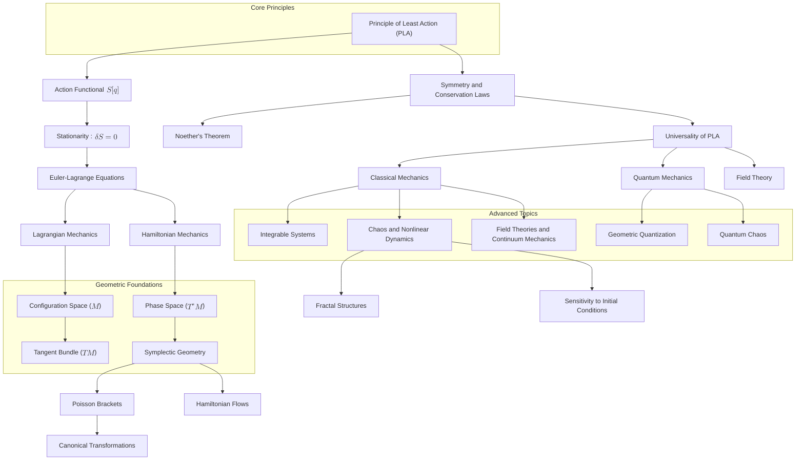

# Reconstructing Classical Mechanics: A Unified Geometric Framework
* * *

--- At the heart of motion lies a principle: nature acts with profound simplicity.

# **1. Introduction: The Unifying Vision of Classical Mechanics**

**Epigraph**:
*"Simplicity is the ultimate sophistication."* 
— Leonardo da Vinci

## **1.1 What is Classical Mechanics?**

Classical mechanics is the **cornerstone of physics**, providing the foundation for our understanding of motion, forces, and energy. It describes the behavior of physical systems ranging from planetary orbits to the dynamics of everyday objects, using a systematic framework rooted in mathematical principles.

Historically, classical mechanics began with **Newtonian mechanics**, where motion was explained through forces acting on masses. Over time, the field evolved into more abstract and general formulations:
- **Lagrangian mechanics**, which focuses on the principle of least action and energy-based descriptions.
- **Hamiltonian mechanics**, which emphasizes the role of phase space and symplectic geometry.

These formulations are not separate theories but **different perspectives** on the same underlying reality, each revealing unique insights. Classical mechanics goes beyond describing motion—it uncovers **universal principles** that govern all physical systems.

## **1.2 The Need for Reconstruction**

Modern physicists, educators, and researchers often approach classical mechanics as a collection of **disconnected tools**: Newton’s laws for forces, Lagrangian methods for constrained systems, and Hamiltonian formalism for advanced topics. While this approach is practical for solving problems, it obscures the **unifying principles** that bind these methods together.

The traditional view can lead to:
- **Fragmentation of knowledge**: The connections between Newtonian, Lagrangian, and Hamiltonian mechanics are often underemphasized.
- **Missed depth**: The deeper geometric and variational structures underlying classical mechanics are rarely fully explored.
- **Difficulty in modern extensions**: The lack of an integrated perspective makes it harder to connect classical mechanics to quantum mechanics, chaos theory, and field theories.

Reconstruction is necessary to:
- **Unify the formulations**: By showing how all of classical mechanics emerges from a single principle—the **Principle of Least Action** (PLA).
- **Highlight geometry**: Emphasize the geometric structures (manifolds, symplectic forms) that unify its concepts.
- **Provide deeper insights**: Reveal the intrinsic simplicity and universality of classical mechanics, inspiring new research directions.

Classical mechanics is not just a **toolbox** for solving physical problems—it is a **conceptual framework** that reflects the harmony and structure of the universe.

## **1.3 A Geometric Perspective**

At its core, classical mechanics is **geometric** in nature. The evolution of a system is best understood as a path or flow on a geometric space, governed by principles of symmetry and invariance. This perspective provides a unified language for describing motion, energy, and conservation laws.

Key geometric ideas include:
- **Configuration space**: The space of all possible positions of a system, which forms the basis for Lagrangian mechanics.
- **Phase space**: The space of all possible positions and momenta, which forms the basis for Hamiltonian mechanics.
- **Symplectic geometry**: The mathematical structure of phase space, encoding the fundamental dualities (e.g., position-momentum) and conservation laws.

The **Principle of Least Action** (PLA) serves as the bridge between these geometric ideas, linking the motion of systems to their underlying structure. By adopting a geometric perspective, we gain:
- **Clarity**: Geometric structures provide a natural, intuitive way to unify different formulations of mechanics.
- **Universality**: Geometry reveals the deep connections between classical mechanics, quantum mechanics, and modern physics.
- **Simplicity**: The apparent complexity of systems reduces to simple, elegant principles when viewed through geometry.

Reconstructing classical mechanics as a **geometric framework** allows us to see it not as a set of isolated techniques, but as a cohesive, profound description of the physical world.

## **1.4 Document Structure**

This document adopts a **layered approach** to reconstruct classical mechanics, starting from the most fundamental concepts and building outward to advanced topics. The structure reflects the intrinsic progression of ideas in classical mechanics, allowing readers to follow the logical flow from **first principles** to their applications.

1. **The Principle of Least Action**:
   - The foundational layer of classical mechanics, introducing the action functional and its variational principles.

2. **Lagrangian Mechanics**:
   - Motion on **configuration space**, with an emphasis on generalized coordinates, constraints, and conservation laws.

3. **Hamiltonian Mechanics**:
   - Dynamics on **phase space**, introducing energy, symplectic structures, and transformations.

4. **Symplectic Geometry**:
   - The mathematical foundation of phase space, revealing the dualities and invariances of classical mechanics.

5. **Dualities in Classical Mechanics**:
   - Exploration of complementary pairs such as position-momentum and energy-time, highlighting their geometric and physical significance.

6. **Advanced Topics and Applications**:
   - Extensions of classical mechanics to integrable systems, chaos, field theories, and quantum mechanics.

7. **Conclusion**:
   - A synthesis of the reconstructed framework, emphasizing its unifying principles and potential for new discoveries.

This progression ensures that the **core principles** are introduced first, while advanced topics are developed as natural extensions. The document’s focus on geometry and universality provides a fresh perspective, enabling readers to see classical mechanics not just as a set of techniques, but as a **profound framework** with far-reaching implications.

## **1.5 Key Takeaways from the Introduction**

- Classical mechanics is a unified, geometric framework rooted in the **Principle of Least Action**.
- A modern reconstruction is necessary to reveal the deep connections, symmetries, and universality underlying its formulations.
- By adopting a geometric perspective, we can unify classical mechanics, extend its insights to modern physics, and inspire new research directions.

This sets the stage for the document’s layered exploration, guiding readers through the elegant progression of ideas that define classical mechanics.

# **2. The Principle of Least Action: The Core of Mechanics**

**Epigraph**:
*"Nature operates by selecting the simplest path."*
— Anonymous

## **2.1 Definition of the Action Functional**

At the heart of classical mechanics lies the **action functional**, a scalar quantity that encodes the dynamics of a system. The action functional $S[q]$ is defined as the integral of the **Lagrangian function**, $L(q, \dot{q}, t)$, over a time interval:
$$
S[q] = \int_{t_1}^{t_2} L(q, \dot{q}, t) \, dt
$$
Here:
- $q$ represents the generalized coordinates of the system, which describe its position in the **configuration space**.
- $\dot{q}$ represents the generalized velocities.
- $L(q, \dot{q}, t) = T - V$, where $T$ is the kinetic energy and $V$ is the potential energy.

The **Principle of Least Action (PLA)** states that the true path $q(t)$ of a system between two points in time, $t_1$ and $t_2$, is the one that makes the action $S[q]$ stationary. This means that small variations $\delta q(t)$ around the true path do not change $S[q]$ to first order:
$$
\delta S = 0
$$
This **stationarity condition** does not necessarily mean the action is minimized—it could also be a maximum or a saddle point. What matters is that the variation vanishes, reflecting the system's adherence to natural laws.

## **2.2 Stationarity and Variational Principles**

The **Principle of Least Action** is mathematically equivalent to the **Euler-Lagrange equations**, which are derived using the calculus of variations. To find the path $q(t)$ that makes $S[q]$ stationary, we consider a small variation $q(t) \to q(t) + \epsilon \eta(t)$, where $\epsilon$ is a small parameter and $\eta(t)$ is an arbitrary smooth function that vanishes at the endpoints $t_1$ and $t_2$. Substituting this variation into the action:
$$
S[q + \epsilon \eta] = \int_{t_1}^{t_2} L(q + \epsilon \eta, \dot{q} + \epsilon \dot{\eta}, t) \, dt
$$
Expanding $S[q + \epsilon \eta]$ to first order in $\epsilon$ gives:
$$
\delta S = \frac{d}{d\epsilon} \int_{t_1}^{t_2} L(q + \epsilon \eta, \dot{q} + \epsilon \dot{\eta}, t) \, dt \bigg|_{\epsilon=0}
$$
Carrying out the variations and integrating by parts leads to the **Euler-Lagrange equations**:
$$
\frac{d}{dt} \frac{\partial L}{\partial \dot{q}^i} - \frac{\partial L}{\partial q^i} = 0
$$
These equations represent the fundamental equations of motion for a system in Lagrangian mechanics. The **stationarity of the action functional** is thus equivalent to the system obeying these dynamical equations.

## **2.3 Universality of the Principle of Least Action**

The **Principle of Least Action** is not limited to classical mechanics; it is a **universal principle** that underpins much of modern physics. Its universality stems from its ability to encode fundamental symmetries and conservation laws, as well as its geometric and variational nature.

### **2.3.1. Examples in Classical Mechanics**:
- **Free Particle**:
  For a free particle with $L = \frac{1}{2} m \dot{q}^2$, the Euler-Lagrange equations reduce to $m \ddot{q} = 0$, describing uniform motion in a straight line.
  
- **Harmonic Oscillator**:
  For a particle in a quadratic potential with $L = \frac{1}{2} m \dot{q}^2 - \frac{1}{2} k q^2$, the Euler-Lagrange equations yield $m \ddot{q} + k q = 0$, describing oscillatory motion.

- **Constrained Systems**:
  PLA naturally incorporates constraints, as in pendulums or systems with fixed surfaces, by modifying the Lagrangian with Lagrange multipliers.

### **2.3.2. Connection to Quantum Mechanics**:
In quantum mechanics, the PLA becomes central through the **path integral formulation** developed by Richard Feynman. Instead of a single path, quantum mechanics sums over all possible paths, weighting each by $e^{i S[q]/\hbar}$. The classical path emerges as the dominant contribution in the limit $\hbar \to 0$, where $S[q]$ is stationary.

### **2.3.3. Connection to Field Theory**:
In classical field theory, the action is extended to fields $\phi(x, t)$, with the Lagrangian density $\mathcal{L}$ describing the system. The Euler-Lagrange equations generalize to:
$$
\frac{\partial}{\partial t} \frac{\partial \mathcal{L}}{\partial \dot{\phi}} - \nabla \cdot \frac{\partial \mathcal{L}}{\partial (\nabla \phi)} + \frac{\partial \mathcal{L}}{\partial \phi} = 0
$$
This framework governs electromagnetism, general relativity, and even the Standard Model of particle physics.

## **2.4 Philosophical Implications**

The **Principle of Least Action** is more than a mathematical construct—it is a profound statement about the **simplicity and harmony** of nature. It reflects the following philosophical ideas:

1. **Economy of Nature**:
   Nature "chooses" paths that are efficient, elegant, and governed by symmetry. PLA embodies this idea, revealing that complex phenomena emerge from simple principles.

2. **Symmetry and Conservation**:
   Through **Noether’s theorem**, PLA connects symmetries in the Lagrangian to conservation laws. For example:
   - Time invariance $\Rightarrow$ Conservation of energy.
   - Spatial invariance $\Rightarrow$ Conservation of momentum.
   - Rotational invariance $\Rightarrow$ Conservation of angular momentum.

3. **Universality and Unification**:
   PLA provides a unifying framework that transcends the boundaries of classical mechanics. It connects diverse areas of physics, from the motion of planets to quantum fields, under a single principle.

4. **Aesthetic Principle**:
   The PLA resonates with the idea that physical laws are **beautiful** in their simplicity. Mathematicians and physicists alike are drawn to its elegance, seeing it as a reflection of deeper truths about the universe.

## **2.5 Summary**

- The **Principle of Least Action** is the foundation of classical mechanics, encapsulating the dynamics of systems through the action functional $S[q]$.
- Its stationarity condition ($\delta S = 0$) leads to the **Euler-Lagrange equations**, describing the natural paths of motion.
- PLA is universal, appearing not only in classical mechanics but also in quantum mechanics, field theory, and beyond.
- It reflects the philosophical ideas of simplicity, symmetry, and the unifying power of fundamental principles.

By starting with PLA, we establish a core conceptual framework that will guide the development of Lagrangian mechanics, Hamiltonian mechanics, and the geometric structures underlying classical mechanics.

# **3. Lagrangian Mechanics: Motion on Configuration Space**

**Epigraph**:
*"Action bridges geometry and motion."*
— Anonymous

## **3.1 Configuration Space and Generalized Coordinates**

In Lagrangian mechanics, the **configuration space** $M$ serves as the geometric stage for describing the motion of a system. Each point in $M$ corresponds to a possible arrangement of the system's degrees of freedom.

### **3.1.1 Definition of Configuration Space**:
- For a system with $n$ degrees of freedom, the configuration space is an $n$-dimensional manifold $M$.
- The coordinates $q = (q^1, q^2, ..., q^n)$ are **generalized coordinates** that describe the system's position in $M$.
   - Examples:
     - A single particle in 3D space: Configuration space is $\mathbb{R}^3$.
     - A double pendulum: Configuration space is $\mathbb{S}^1 \times \mathbb{S}^1$ (two angular degrees of freedom).

### **3.1.2 Why Generalized Coordinates?**  
- Generalized coordinates allow us to describe systems with constraints (e.g., a bead moving on a wire or a pendulum swinging on a fixed pivot) without explicitly dealing with forces of constraint.
- They provide the flexibility to work in spaces where Cartesian coordinates may not be practical or natural.

### **3.1.3 Role of Configuration Space**:  
Configuration space provides the foundation for defining **paths** $q(t)$ that a system traverses under the action principle. The geometry of $M$ determines how motion is described, particularly in systems with constraints or curved spaces.

## **3.2 Tangent Bundle ($TM$)**

The **tangent bundle** $TM$ extends the configuration space $M$ to include both positions and velocities, forming the natural setting for Lagrangian mechanics.

### **3.2.1 Definition of Tangent Bundle**:
- The tangent bundle $TM$ is the space of all possible positions and velocities. Each point in $TM$ is a pair $(q, \dot{q})$, where $q \in M$ and $\dot{q}$ is the velocity vector at $q$.
- Intuitively, $TM$ "doubles" the dimensions of $M$ by adding velocity components to each degree of freedom.

### **3.2.2 Why $TM$?**  
- A system's dynamics depend on both its position $q(t)$ and its velocity $\dot{q}(t)$.
- The **Lagrangian function** $L(q, \dot{q}, t)$ is defined on $TM \times \mathbb{R}$, making $TM$ the natural space for describing motion.

### **3.2.3 Geometric Interpretation**:  
- The tangent bundle encodes the **kinematics** of a system:
  - Paths in $TM$ correspond to possible trajectories in phase space.
  - Constraints on motion (e.g., fixed lengths or surfaces) restrict $TM$ to submanifolds.

### **3.2.4 Example**:  
- For a particle moving in $\mathbb{R}^3$, $M = \mathbb{R}^3$ and $TM = \mathbb{R}^3 \times \mathbb{R}^3$, where each velocity vector $\dot{q}$ corresponds to a direction in 3D space.

## **3.3 The Lagrangian Function**

The **Lagrangian function** $L(q, \dot{q}, t)$ is the central object in Lagrangian mechanics. It encodes the system's dynamics by balancing **kinetic energy** and **potential energy**.

### **3.3.1 Definition**:  
The Lagrangian of a system is given by:
$$
L(q, \dot{q}, t) = T(q, \dot{q}) - V(q, t)
$$
Where:
- $T(q, \dot{q})$: Kinetic energy, typically quadratic in $\dot{q}$.
- $V(q, t)$: Potential energy, a function of position and possibly time.

### **3.3.2 Physical Interpretation**:
- The Lagrangian measures the "difference" between the system's kinetic and potential energies.
- Paths that extremize the action (via $S[q] = \int L \, dt$) correspond to physically realizable trajectories.

### **3.3.3 Examples**:  
- **Free Particle**:
  For a particle of mass $m$ moving in free space:
  $$
  L = \frac{1}{2} m \dot{q}^2
  $$

- **Harmonic Oscillator**:
  For a mass $m$ connected to a spring with stiffness $k$:
  $$
  L = \frac{1}{2} m \dot{q}^2 - \frac{1}{2} k q^2
  $$

- **Constrained Systems**:
  Constraints are incorporated by reducing the degrees of freedom or adding Lagrange multipliers to enforce them.

### **3.3.4 Time-Dependent Lagrangians**:
- When $L(q, \dot{q}, t)$ explicitly depends on time (e.g., driven systems), the dynamics include time-dependent forces.

## **3.4 Symmetries and Conservation Laws**

Symmetries play a fundamental role in Lagrangian mechanics, as they lead directly to **conservation laws**. The connection between symmetries and conservation is formalized by **Noether's theorem**.

### **3.4.1 Noether’s Theorem**:  
For every continuous symmetry of the action $S[q]$, there exists a corresponding conserved quantity.

### **3.4.2 Key Examples of Symmetries**:
1. **Time Invariance**:
   If $L$ does not explicitly depend on time ($\partial L / \partial t = 0$), the system conserves **energy**.

2. **Translational Invariance**:
   If $L$ does not explicitly depend on position ($\partial L / \partial q = 0$), the system conserves **momentum**.

3. **Rotational Invariance**:
   If $L$ is invariant under rotations, the system conserves **angular momentum**.

### **3.4.3 Implications for Mechanics**:
- Symmetries reduce the complexity of problems by revealing conserved quantities.
- Conservation laws are geometric invariants of the underlying configuration space.

## **3.5 Examples of Lagrangian Mechanics**

### **3.5.1. Free Particle**:
- **System**: A particle of mass $m$ moving in free space.
- **Lagrangian**:
  $$
  L = \frac{1}{2} m \dot{q}^2
  $$
- **Equation of Motion**:
  $$
  m \ddot{q} = 0
  $$
  Describes uniform motion.

### **3.5.2. Harmonic Oscillator**:
- **System**: A mass $m$ attached to a spring with stiffness $k$.
- **Lagrangian**:
  $$
  L = \frac{1}{2} m \dot{q}^2 - \frac{1}{2} k q^2
  $$
- **Equation of Motion**:
  $$
  m \ddot{q} + k q = 0
  $$
  Describes oscillatory motion.

### **3.5.3. Constrained System: Pendulum**:
- **System**: A mass $m$ swinging on a fixed-length string $l$.
- **Generalized Coordinate**: Angular displacement $\theta$.
- **Lagrangian**:
  $$
  L = \frac{1}{2} m l^2 \dot{\theta}^2 - m g l \cos \theta
  $$
- **Equation of Motion**:
  $$
  \ddot{\theta} + \frac{g}{l} \sin \theta = 0
  $$

### **3.5.4. Central Force Problem (Planetary Motion)**:
- **System**: A particle moving under a central potential $V(r)$.
- **Lagrangian** (in polar coordinates):
  $$
  L = \frac{1}{2} m (\dot{r}^2 + r^2 \dot{\theta}^2) - V(r)
  $$
- Conserved quantities: Angular momentum and total energy.

## **3.5 Summary**

- Lagrangian mechanics provides a geometric framework for describing motion on **configuration space** $M$, extended to the **tangent bundle** $TM$.
- The **Lagrangian function** $L(q, \dot{q}, t) = T - V$ encodes the system's dynamics.
- **Symmetries** in the Lagrangian lead to conserved quantities via **Noether’s theorem**.
- Examples like the free particle, harmonic oscillator, pendulum, and central force problem demonstrate the versatility and elegance of the Lagrangian framework.

This section establishes the foundation for transitioning to **Hamiltonian mechanics**, where phase space and energy-based descriptions take center stage.

# **4. Hamiltonian Mechanics: Dynamics on Phase Space**

**Epigraph**:
*"The energy of a system directs its evolution."*
— Anonymous

## **4.1 Phase Space and the Cotangent Bundle ($T^*M$)**

In Hamiltonian mechanics, the **phase space** is the natural geometric setting where the dynamics of a system are described in terms of positions and momenta. While the configuration space $M$ captures all possible positions of a system, the phase space $T^*M$ extends this by including all possible momenta.

### **4.1.1 Definition of Phase Space**:
- The phase space is the **cotangent bundle** $T^*M$ of the configuration space $M$.
- A point in phase space is represented as $(q, p)$, where $q$ is the generalized position and $p$ is the generalized momentum conjugate to $q$.

### **4.1.2 Duality with the Tangent Bundle**:
- In Lagrangian mechanics, the tangent bundle $TM$ describes positions $q$ and velocities $\dot{q}$.
- The **Legendre transformation** (discussed in Section 4.2) maps $TM$ to $T^*M$, replacing velocities with momenta.

### **4.1.3 Geometric Structure of Phase Space**:
- $T^*M$ is a **symplectic manifold**, equipped with the symplectic form $\omega = dq \wedge dp$.
- The symplectic structure encodes the fundamental relationships between positions and momenta, governing the system's evolution via Hamiltonian mechanics.

### **4.1.4 Why Phase Space?**  
- Phase space provides a **complete description** of a system's state.
- It is particularly well-suited for describing systems with conserved quantities and for understanding the geometry of motion (e.g., trajectories, invariants, and symmetries).

### **4.1.5 Example**:  
- For a particle moving in 3D space, the configuration space is $M = \mathbb{R}^3$, and the phase space is $T^*M = \mathbb{R}^6$, with six dimensions: three for position ($q_x, q_y, q_z$) and three for momentum ($p_x, p_y, p_z$).

## **4.2 Legendre Transformation**

The **Legendre transformation** is the bridge between the Lagrangian and Hamiltonian formulations of mechanics. By converting velocities $\dot{q}$ into momenta $p$, it allows us to transition from the tangent bundle $TM$ to the cotangent bundle $T^*M$.

### **4.2.1 Definition of the Legendre Transformation**:
For a given Lagrangian $L(q, \dot{q}, t)$, the generalized momentum $p$ conjugate to $q$ is defined as:
$$
p_i = \frac{\partial L}{\partial \dot{q}^i}
$$
The Hamiltonian function $H(q, p, t)$ is then obtained via the Legendre transform:
$$
H(q, p, t) = p_i \dot{q}^i - L(q, \dot{q}, t)
$$
Where $\dot{q}^i$ is expressed as a function of $q$ and $p$ by inverting $p_i = \frac{\partial L}{\partial \dot{q}^i}$.

### **4.2.2 Physical Interpretation**:
- The Hamiltonian $H(q, p, t)$ represents the **total energy** of the system, expressed in terms of position and momentum.
- The Legendre transformation reinterprets the system's dynamics in terms of conserved quantities and phase space trajectories.

### **4.2.3 Examples**:
1. **Free Particle**:
   For $L = \frac{1}{2} m \dot{q}^2$,
   $p = m \dot{q}$, and
   $H = \frac{p^2}{2m}$, the total kinetic energy.

2. **Harmonic Oscillator**:
   For $L = \frac{1}{2} m \dot{q}^2 - \frac{1}{2} k q^2$,
   $p = m \dot{q}$, and
   $H = \frac{p^2}{2m} + \frac{1}{2} k q^2$, the total energy (kinetic + potential).

## **4.3 Hamiltonian Function and Dynamics**

The **Hamiltonian function** $H(q, p, t)$ governs the evolution of a system in phase space. It is typically interpreted as the **total energy** of the system, comprising kinetic and potential contributions.

### **4.3.1 Hamilton’s Equations**:
The dynamics of a system in Hamiltonian mechanics are described by **Hamilton’s equations**:
$$
\dot{q}^i = \frac{\partial H}{\partial p_i}, \quad \dot{p}_i = -\frac{\partial H}{\partial q^i}
$$
These equations describe the flow of a system in phase space:
- The rate of change of position $q^i$ is determined by the derivative of $H$ with respect to momentum $p_i$.
- The rate of change of momentum $p_i$ is determined by the derivative of $H$ with respect to position $q^i$.

### **4.3.2 Geometric Interpretation**:
- The flow generated by $H$ preserves the symplectic structure $\omega = dq \wedge dp$, ensuring conservation of phase space volume (Liouville’s theorem).
- Trajectories in phase space represent the system's evolution, with conserved quantities corresponding to invariants of the flow.

### **4.3.3 Connection to Energy Conservation**:
- If $H$ does not explicitly depend on time ($\partial H / \partial t = 0$), the Hamiltonian is conserved, representing the system's total energy.

## **4.4 Canonical Transformations**

Canonical transformations are changes of variables in phase space that preserve the structure of Hamilton’s equations. They are central to simplifying complex systems and understanding symmetries in mechanics.

### **4.4.1 Definition**:
A transformation $(q, p) \to (Q, P)$ is **canonical** if it preserves the symplectic structure:
$$
\omega = dq \wedge dp = dQ \wedge dP
$$
Equivalently, the transformed equations of motion remain Hamiltonian, with the same form as the original equations.

### **4.4.2 Generating Functions**:
Canonical transformations can be generated by functions $F$ of the old and new variables. For example:
- $F_1(q, Q)$, $F_2(q, P)$, etc., each representing a different type of generating function.

### **4.4.3 Applications**:
- Canonical transformations simplify the analysis of integrable systems by introducing **action-angle variables**, where the motion becomes periodic and geometrically clear.
- In quantum mechanics, they form the foundation of **geometric quantization**.

## **4.5 Examples of Hamiltonian Mechanics**

### **4.5.1. Free Particle**:
- **System**: A particle of mass $m$ moving in free space.
- **Hamiltonian**:
  $$
  H = \frac{p^2}{2m}
  $$
- **Equations of Motion**:
  $$
  \dot{q} = \frac{\partial H}{\partial p} = \frac{p}{m}, \quad \dot{p} = -\frac{\partial H}{\partial q} = 0
  $$
  The particle moves at constant velocity.

### **4.5.2. Harmonic Oscillator**:
- **System**: A mass $m$ attached to a spring with stiffness $k$.
- **Hamiltonian**:
  $$
  H = \frac{p^2}{2m} + \frac{1}{2} k q^2
  $$
- **Equations of Motion**:
  $$
  \dot{q} = \frac{p}{m}, \quad \dot{p} = -k q
  $$
  The motion is periodic, with trajectories forming ellipses in phase space.

### **4.5.3. Central Force Problem (Planetary Motion)**:
- **System**: A particle under a central potential $V(r) = -\frac{GmM}{r}$.
- **Hamiltonian**:
  $$
  H = \frac{p_r^2}{2m} + \frac{p_\theta^2}{2m r^2} - \frac{GmM}{r}
  $$
- Conserved Quantities: Total energy $H$, angular momentum $p_\theta$.
- Trajectories: Elliptical orbits in the case of gravitational force.

## **4.6 Summary**

- Hamiltonian mechanics reformulates dynamics in terms of **phase space** $T^*M$, where positions $q$ and momenta $p$ describe the state of a system.
- The **Legendre transformation** transitions from the Lagrangian to the Hamiltonian framework, with the Hamiltonian $H(q, p, t)$ representing the total energy of the system.
- **Hamilton’s equations** describe the evolution of the system in phase space, preserving the symplectic structure.
- **Canonical transformations** simplify complex systems and reveal deeper symmetries, playing a central role in modern mechanics and quantum theory.

This section provides the foundation for exploring **symplectic geometry** in the next chapter, where the mathematical structures underlying phase space are developed in full detail.

# **5. Symplectic Geometry: The Language of Mechanics**

**Epigraph**:
*"At the heart of mechanics lies a symplectic symphony."*
— Anonymous

## **5.1 Symplectic Manifolds and Structures**

Symplectic geometry provides the underlying mathematical framework of Hamiltonian mechanics. It formalizes the geometric structure of **phase space** and encodes the fundamental relationships between positions and momenta.

### **5.1.1 Definition of a Symplectic Manifold**:
- A **symplectic manifold** is a smooth, even-dimensional manifold $(M, \omega)$, where $\omega$ is a **closed, non-degenerate $2$-form** called the **symplectic form**.
- For a phase space $T^*M$, the canonical symplectic form is:
  $$
  \omega = \sum_i dq^i \wedge dp_i
  $$
  where $q^i$ and $p_i$ are generalized coordinates and momenta.

### **5.1.2 Key Properties of $\omega$**:
1. **Closedness**: $d\omega = 0$.
   - This ensures the local conservation of the symplectic structure and reflects the fact that the system's geometry is independent of time evolution.

2. **Non-degeneracy**: For any nonzero tangent vector $v$, there exists a $w$ such that $\omega(v, w) \neq 0$.
   - This guarantees that the symplectic form provides a well-defined pairing between coordinates and momenta.

### **5.1.3 Geometric Interpretation**:
- The symplectic form $\omega$ defines the **area element** in phase space, giving a natural measure of volumes and trajectories.
- Non-degeneracy ensures that positions and momenta are coupled, reflecting the duality and complementarity of these variables.

### **5.1.4 Examples**:
1. **Canonical Phase Space**:
   For a free particle in 2D, $M = \mathbb{R}^4$, and the symplectic form is:
   $$
   \omega = dq_x \wedge dp_x + dq_y \wedge dp_y
   $$
   Each pair $(q_x, p_x)$ and $(q_y, p_y)$ forms a conjugate coordinate system.

2. **Cotangent Bundle**:
   For any configuration space $Q$, the phase space $T^*Q$ inherits the canonical symplectic structure $\omega$, making it the natural setting for Hamiltonian dynamics.

## **5.2 Hamiltonian Flows and Conservation Laws**

Hamiltonian mechanics describes the evolution of a system as a **flow** on a symplectic manifold. The symplectic structure ensures that this flow preserves fundamental geometric and physical properties.

### **5.2.1 Hamiltonian Flows**:
- A Hamiltonian system is defined by a smooth function $H(q, p, t)$ (the Hamiltonian) and the symplectic form $\omega$.
- The equations of motion are given by **Hamilton’s equations**:
  $$
  \dot{q}^i = \frac{\partial H}{\partial p_i}, \quad \dot{p}_i = -\frac{\partial H}{\partial q^i}
  $$
  These equations describe the vector field $X_H$ (the Hamiltonian flow) on the symplectic manifold, where:
  $$
  \iota_{X_H} \omega = -dH
  $$
  Here, $\iota_{X_H} \omega$ represents the contraction of the symplectic form with the vector field $X_H$.

### **5.2.2 Liouville's Theorem**:
- The Hamiltonian flow preserves the volume form in phase space:
  $$
  \mathcal{L}_{X_H} \omega = 0
  $$
  where $\mathcal{L}_{X_H}$ is the Lie derivative. This implies that the total phase space volume remains constant over time.

### **5.2.3 Conservation Laws**:
- If the Hamiltonian $H$ does not explicitly depend on time, it is conserved along the flow:
  $$
  \frac{dH}{dt} = \frac{\partial H}{\partial t} = 0
  $$
- More generally, any smooth function $f(q, p)$ that commutes with $H$ under the **Poisson bracket** is conserved (see Section 5.3).

## **5.3 Poisson Brackets**

The **Poisson bracket** is a fundamental structure in Hamiltonian mechanics, encoding the algebraic relationships between observables and providing a bridge to quantum mechanics.

### **5.3.1 Definition of the Poisson Bracket**:
For two smooth functions $f(q, p)$ and $g(q, p)$ on phase space, the Poisson bracket is defined as:
$$
\{f, g\} = \sum_i \left( \frac{\partial f}{\partial q^i} \frac{\partial g}{\partial p_i} - \frac{\partial f}{\partial p_i} \frac{\partial g}{\partial q^i} \right)
$$

### **5.3.2 Key Properties**:
1. **Skew-Symmetry**: $\{f, g\} = -\{g, f\}$.
2. **Linearity**: $\{af + bg, h\} = a\{f, h\} + b\{g, h\}$.
3. **Jacobi Identity**: $\{f, \{g, h\}\} + \{g, \{h, f\}\} + \{h, \{f, g\}\} = 0$.
4. **Leibniz Rule**: $\{fg, h\} = f\{g, h\} + g\{f, h\}$.

### **5.3.3 Physical Interpretation**:
- The Poisson bracket encodes the rate of change of an observable $f$ along the Hamiltonian flow:
  $$
  \frac{df}{dt} = \{f, H\} + \frac{\partial f}{\partial t}
  $$
- Observables that commute with $H$ ($\{f, H\} = 0$) are constants of motion.

### **5.3.4 Examples**:
1. **Canonical Coordinates**:
   The Poisson brackets of canonical variables satisfy:
   $$
   \{q^i, p_j\} = \delta^i_j, \quad \{q^i, q^j\} = 0, \quad \{p_i, p_j\} = 0
   $$

2. **Angular Momentum**:
   For a 3D particle, the components of angular momentum $L_x, L_y, L_z$ satisfy:
   $$
   \{L_x, L_y\} = L_z, \quad \{L_y, L_z\} = L_x, \quad \{L_z, L_x\} = L_y
   $$

## **5.4 Applications of Symplectic Geometry**

Symplectic geometry provides a powerful framework for analyzing complex systems and understanding their deeper structure. Below are some key applications:

### **5.4.1. Integrable Systems**:
- **Definition**: A system is integrable if it has as many conserved quantities (in involution) as degrees of freedom.
- **Action-Angle Variables**: Symplectic geometry allows integrable systems to be expressed in terms of action-angle variables, where the motion becomes linear and periodic.

### **5.4.2. Symplectic Reduction**:
- Symplectic geometry simplifies constrained systems by reducing the dimensionality of phase space.
- Example: In planetary motion, angular momentum conservation reduces the effective phase space.

### **5.4.3. Chaos and Nonlinear Dynamics**:
- Symplectic geometry provides tools for understanding chaotic systems, where sensitivity to initial conditions results in complex trajectories.
- The symplectic structure ensures that even chaotic flows preserve phase space volume.

### **5.4.4. Geometric Quantization**:
- The transition from classical to quantum mechanics is guided by the symplectic structure.
- Observables with Poisson brackets generalize to quantum operators with commutators:
  $$
  \{f, g\} \to -\frac{i}{\hbar} [\hat{f}, \hat{g}]
  $$

## **5.5 Summary**

- **Symplectic manifolds** provide the geometric foundation for phase space, with the symplectic form $\omega$ encoding the structure of Hamiltonian dynamics.
- Hamiltonian flows preserve the symplectic structure and phase space volume, leading to conservation laws and invariants.
- The **Poisson bracket** formalizes the algebra of observables, linking classical mechanics to quantum mechanics.
- Applications of symplectic geometry include integrable systems, chaos, and geometric quantization, demonstrating its power and universality.

This section establishes the mathematical elegance of symplectic geometry, setting the stage for understanding the **dualities** and deeper connections in classical mechanics (explored in the next chapter).

# **6. Dualities in Classical Mechanics**

**Epigraph**:
*"Duality reveals the hidden unity of opposites."*
— Anonymous

## **6.1 Position-Momentum Duality**

One of the most fundamental dualities in classical mechanics is the relationship between **position** and **momentum**, encoded in the symplectic structure of phase space. This duality reflects the complementary nature of these quantities and plays a central role in the formulation of both classical and quantum mechanics.

### **6.1.1 Symplectic Encoding**:
- The symplectic structure $\omega = dq \wedge dp$ inherently couples position $q$ and momentum $p$.
- Position and momentum are treated as **conjugate variables**, meaning that their dynamics are interdependent and symmetric.

### **6.1.2 Canonical Poisson Brackets**:
- The Poisson brackets formalize the duality between position and momentum:
  $$
  \{q^i, p_j\} = \delta^i_j, \quad \{q^i, q^j\} = 0, \quad \{p_i, p_j\} = 0
  $$
  These relationships encode the fundamental structure of phase space and govern how observables interact dynamically.

### **6.1.3 Physical Interpretation**:
- Position $q$ determines where a system is located in configuration space, while momentum $p$ describes the "direction and strength" of motion in phase space.
- The duality becomes evident in Hamilton’s equations:
  $$
  \dot{q}^i = \frac{\partial H}{\partial p_i}, \quad \dot{p}_i = -\frac{\partial H}{\partial q^i}
  $$
  Changes in position are driven by momentum, and changes in momentum are driven by position.

### **6.1.4 Geometric View**:
- Trajectories in phase space are governed by Hamiltonian flows, which preserve the symplectic structure. Position and momentum are not independent—they are **interwoven** by the geometry of the system.

### **6.1.5 Quantum Counterpart**:
- In quantum mechanics, the position-momentum duality is expressed through the commutation relation:
  $$
  [\hat{q}, \hat{p}] = i\hbar
  $$
  This is the quantum analogue of the classical Poisson bracket and highlights the intrinsic uncertainty between these quantities.

### **6.1.6 Examples**:
- **Harmonic Oscillator**: In phase space, the duality between $q$ and $p$ manifests as elliptical trajectories, with energy oscillating between kinetic (momentum) and potential (position) contributions.
- **Free Particle**: The position $q$ increases linearly with time, while the momentum $p$ remains constant, reflecting their complementary roles.

## **6.2 Energy-Time Duality**

The duality between **energy** and **time** is another profound aspect of classical mechanics, rooted in the relationship between symmetries and conservation laws. While not as explicit as the position-momentum duality, it governs the temporal evolution of systems and has deep implications for both classical and quantum theories.

### **6.2.1 Hamiltonian as Energy**:
- The Hamiltonian $H(q, p, t)$ is often interpreted as the **total energy** of the system.
- Time evolution in Hamiltonian mechanics is governed by:
  $$
  \frac{df}{dt} = \{f, H\} + \frac{\partial f}{\partial t}
  $$
  This equation shows that the Hamiltonian generates the flow of time: it determines how observables evolve.

### **6.2.2 Time Translation Symmetry**:
- If the Hamiltonian does not explicitly depend on time ($\partial H / \partial t = 0$), the system is **time-invariant**, and total energy is conserved.
- Through **Noether’s theorem**, time invariance is directly linked to the conservation of energy.

### **6.2.3 Duality Perspective**:
- Energy governs the **rate of change** (temporal evolution) of the system, while time is the parameter along which this evolution unfolds.
- This duality is implicit in the way phase space trajectories are parameterized by time and shaped by the energy landscape.

### **6.2.4 Quantum Connection**:
- The energy-time relationship is more subtle in quantum mechanics, where it is often associated with the time-energy uncertainty principle:
  $$
  \Delta E \Delta t \gtrsim \hbar
  $$
  This reflects the trade-off between the precision of energy measurements and the time scale over which they are defined.

### **6.2.5 Examples**:
- **Pendulum**: The Hamiltonian encapsulates the total energy, which determines the pendulum’s oscillation period. The time evolution of the system is dictated by the energy landscape.
- **Kepler Problem (Planetary Motion)**: Energy conservation governs the orbital period of a planet, linking the geometry of the trajectory to its temporal evolution.

## **6.3 Geometric Interpretation of Dualities**

Dualities in classical mechanics are not merely algebraic relationships—they are deeply rooted in the **geometric structure** of the theory. The symplectic manifold, with its rich mathematical properties, provides a unifying framework for understanding these complementary pairs.

### **6.3.1 Symplectic Geometry and Dualities**:
- The symplectic form $\omega = dq \wedge dp$ encodes the position-momentum duality as a fundamental feature of phase space.
- Energy-time duality is reflected in the Hamiltonian’s role as a generator of time evolution within this symplectic framework.

### **6.3.2 Invariance and Symmetry**:
- Dualities arise from the invariance properties of the symplectic structure:
  - Position-momentum duality is preserved under **canonical transformations**, which leave the symplectic form invariant.
  - Energy-time duality emerges from time-translation symmetry, linking conservation laws to the geometry of motion.

### **6.3.3 Action-Angle Variables**:
- In integrable systems, dualities are elegantly expressed through **action-angle variables**. The action variables represent conserved quantities (e.g., energy), while the angle variables describe periodic motion in phase space.
- This formulation highlights the interplay between geometry (action) and dynamics (angle).

### **6.3.4 Reflection of Deeper Invariances**:
- Dualities are not arbitrary—they reflect deeper invariances in the laws of mechanics:
  - Position-momentum duality mirrors the complementarity between configuration and phase space.
  - Energy-time duality encapsulates the relationship between symmetries and conserved quantities.

### **6.3.5 Implications for Modern Physics**:
- These dualities extend beyond classical mechanics:
  - In quantum mechanics, the position-momentum and energy-time relationships are fundamental to the structure of Hilbert space and the formulation of uncertainty principles.
  - In field theory, dualities underpin concepts like wave-particle duality and the relationship between fields and their corresponding momenta.

## **6.5 Summary of Section**

- **Position-momentum duality** is encoded in the symplectic structure of phase space, reflecting the complementary roles of these quantities in governing dynamics.
- **Energy-time duality** governs temporal evolution and is rooted in the conservation of energy through time-translation symmetry.
- Both dualities are deeply geometric, arising naturally from the invariances and structure of symplectic manifolds.
- These dualities are not isolated; they reflect the **unifying principles** of classical mechanics and extend to quantum mechanics and modern physics, revealing the profound interconnectedness of physical laws.

This section highlights the elegance of dualities as a bridge between algebra, geometry, and physics, preparing the foundation for understanding advanced topics like integrable systems, chaos, and quantization.

# **7. Advanced Topics and Applications**

**Epigraph**:
*"The frontier of mechanics is the frontier of knowledge."*
— Anonymous

## **7.1 Integrable Systems and Action-Angle Variables**

Integrable systems represent an elegant class of mechanical systems where complex dynamics reduce to simple, predictable behavior. These systems are characterized by their **exact solvability** and underlying symmetries.

### **7.1.1 Definition of Integrable Systems**:
- A system with $n$ degrees of freedom is integrable if it admits $n$ independent conserved quantities $I_1, I_2, \dots, I_n$ that are in **involution**:
  $$
  \{I_i, I_j\} = 0, \quad \forall i, j
  $$
  Each conserved quantity corresponds to a symmetry of the system.

### **7.1.2 Action-Angle Variables**:
- Integrable systems can be expressed in terms of **action-angle variables** $(J, \theta)$, where:
  - **Action variables** $J_i$: Conserved quantities that parameterize invariant tori in phase space.
  - **Angle variables** $\theta_i$: Periodic coordinates describing motion on these tori.
- In these coordinates, the system’s Hamiltonian depends only on $J$, and the equations of motion become linear:
  $$
  \dot{\theta}_i = \omega_i(J), \quad \dot{J}_i = 0
  $$
  where $\omega_i$ are the frequencies of motion.

### **7.1.3 Geometric Interpretation**:
- The phase space of an integrable system is foliated by invariant tori, where trajectories are periodic or quasi-periodic. These tori encode the symmetries and stability of the system.

### **7.1.4 Examples**:
1. **Harmonic Oscillator**:
   The motion is periodic, and the action variable corresponds to the oscillator's energy.
2. **Kepler Problem (Planetary Motion)**:
   The system is integrable, with conserved quantities including energy, angular momentum, and the Laplace-Runge-Lenz vector.
3. **Rigid Body Dynamics**:
   The rotation of a rigid body (e.g., Euler’s equations) can be solved using action-angle variables.

### **7.1.5 Applications**:
- Integrable systems provide insight into **stable motion** in celestial mechanics, quantum systems, and molecular dynamics.
- They serve as a foundation for perturbative approaches to study nearly integrable and chaotic systems.

## **7.2 Chaos and Nonlinear Dynamics**

While integrable systems exhibit predictable behavior, **chaotic systems** reveal the richness and complexity of nonlinear dynamics. Chaos emerges from sensitivity to initial conditions, where small perturbations lead to exponentially divergent trajectories.

### **7.2.1 Key Features of Chaos**:
1. **Sensitivity to Initial Conditions**:
   Two nearby trajectories in phase space diverge exponentially, characterized by a **positive Lyapunov exponent**.
2. **Fractal Structures**:
   Chaotic systems exhibit fractal geometry in phase space, with strange attractors and intricate patterns.
3. **Nonlinear Interactions**:
   Chaos arises from nonlinear coupling between degrees of freedom, breaking integrability.

### **7.2.2 Phase Space and Chaos**:
- In chaotic systems, trajectories no longer lie on invariant tori but explore larger regions of phase space.
- However, the symplectic structure $\omega$ ensures that phase space volume is preserved (Liouville’s theorem).

### **7.2.3 Examples**:
1. **Double Pendulum**:
   Displays chaotic motion beyond certain energy thresholds, with extreme sensitivity to initial conditions.
2. **Three-Body Problem**:
   The gravitational interaction of three bodies is chaotic, with no general closed-form solution for their motion.
3. **Lorenz System**:
   A simplified model of atmospheric convection, which exhibits strange attractors and chaotic dynamics.

### **7.2.3 Applications**:
- **Turbulence**: Chaos underpins the irregular, unpredictable behavior of fluid flows.
- **Quantum Chaos**: Studies how classical chaos manifests in quantum systems, linking phase space dynamics to eigenstate distributions.
- **Control Theory**: Chaos informs methods for stabilizing nonlinear systems in engineering and biology.

## **7.3 Field Theories and Continuum Mechanics**

Classical mechanics extends beyond finite-dimensional systems to **field theories** and **continuum mechanics**, where the degrees of freedom form an infinite-dimensional system.

### **7.3.1 Field Theories**:
- In field theories, the configuration space is a function space, with fields replacing discrete coordinates. The dynamics are governed by the **Lagrangian density** $\mathcal{L}$:
  $$
  S[\phi] = \int \mathcal{L}(\phi, \partial_\mu \phi) \, d^4x
  $$
  where $\phi(x)$ is a field, and $\partial_\mu \phi$ represents its spacetime derivatives.

- The Euler-Lagrange equations generalize to partial differential equations:
  $$
  \frac{\partial \mathcal{L}}{\partial \phi} - \partial_\mu \frac{\partial \mathcal{L}}{\partial (\partial_\mu \phi)} = 0
  $$

### **7.3.2 Continuum Mechanics**:
- Describes the motion of deformable bodies and fluids, using fields to represent density, velocity, and stress.
- The Lagrangian formulation incorporates constraints like incompressibility or elasticity, leading to equations such as the Navier-Stokes equations for fluid flow.

### **7.3.3 Examples**:
1. **Electromagnetic Field**:
   The Lagrangian density $\mathcal{L} = -\frac{1}{4} F_{\mu\nu} F^{\mu\nu}$ leads to Maxwell’s equations.
2. **Wave Equation**:
   Describes the propagation of waves in a medium, governed by $\mathcal{L} = \frac{1}{2} (\dot{\phi}^2 - (\nabla \phi)^2)$.
3. **General Relativity**:
   The Einstein-Hilbert action $S = \int R \sqrt{-g} \, d^4x$ describes the curvature of spacetime and its interaction with matter.

### **7.3.4 Applications**:
- **Cosmology**: Field theories describe the evolution of the universe (e.g., inflation models).
- **Materials Science**: Continuum mechanics governs the behavior of solids and fluids under stress.

## **7.4 Geometric Quantization**

The transition from classical to quantum mechanics is deeply tied to the geometry of phase space. **Geometric quantization** formalizes this transition, providing a mathematically rigorous framework for constructing quantum theories from classical systems.

### **7.4.1 Quantization of Phase Space**:
- In classical mechanics, phase space is a symplectic manifold $(M, \omega)$.
- Geometric quantization involves associating a quantum Hilbert space $\mathcal{H}$ and operators to this classical structure.

### **7.4.2 Key Steps in Geometric Quantization**:
1. **Prequantization**:
   - Construct a complex line bundle $L$ over $M$, with a connection whose curvature equals $\omega$.
   - The wavefunctions are sections of this line bundle.

2. **Polarization**:
   - Choose a polarization (e.g., position or momentum) to reduce the dimensionality of the wavefunctions.
   - In the position representation, wavefunctions depend only on $q$, while $p$ becomes a differential operator.

3. **Commutation Relations**:
   - Classical Poisson brackets are replaced by quantum commutators:
     $$
     \{f, g\} \to -\frac{i}{\hbar} [\hat{f}, \hat{g}]
     $$

### **7.4.3 Applications**:
1. **Harmonic Oscillator**:
   Classical phase space trajectories become quantum eigenstates with discrete energy levels.
2. **Quantization on Curved Spaces**:
   Geometric quantization extends to systems with nontrivial topology, such as particles on a sphere or torus.
3. **Quantum Field Theory**:
   Path integrals and operator methods in quantum field theory are rooted in the geometric quantization of infinite-dimensional phase spaces.

### **7.4.4 Physical Insights**:
- Geometric quantization reveals how classical symmetries and structures persist in quantum systems.
- It connects classical conservation laws to quantum operators and eigenvalues.

## **7.5 Summary**

- **Integrable systems** and **action-angle variables** provide a framework for understanding stable, periodic motion, with applications in celestial mechanics and molecular dynamics.
- **Chaos and nonlinear dynamics** highlight the unpredictable behavior of complex systems, with applications in turbulence, quantum chaos, and control theory.
- **Field theories and continuum mechanics** generalize classical mechanics to infinite-dimensional systems, forming the basis for electromagnetism, fluid dynamics, and general relativity.
- **Geometric quantization** bridges classical and quantum mechanics, revealing how the structures of classical phase space inform quantum theory.

This section illustrates how classical mechanics extends into diverse and advanced domains, demonstrating its relevance to modern physics and its profound connections to quantum mechanics, cosmology, and beyond.

# **8. Conclusion: The Unified Vision of Mechanics**

**Epigraph**:
*"In simplicity, we find truth."*
— Anonymous

## **8.1 Synthesis of Concepts**

Classical mechanics, in its essence, is a journey of uncovering structure within motion, order within complexity, and unity within diversity. This document has reconstructed the subject as a **layered geometric framework**, where each layer builds upon foundational principles, revealing deeper insights into the nature of physical systems.

### **8.1.1 The Principle of Least Action (PLA): The Keystone**  
The Principle of Least Action (PLA) serves as the unifying foundation of mechanics. Its variational formulation encapsulates the dynamics of systems, linking motion to symmetry, and symmetry to conservation laws. Through the stationarity of the action functional, the natural paths of systems emerge, whether in configuration space, phase space, or fields.

### **8.1.2 Geometric Foundations: The Language of Mechanics**  
Mechanics is inherently geometric:
- **Configuration space** forms the stage for Lagrangian mechanics, where motion is described as a curve traced by generalized coordinates.
- **Phase space**, equipped with its symplectic structure, provides the richer language of Hamiltonian mechanics, where dynamics unfold as flows preserving conserved quantities.
- **Symplectic geometry** reveals that mechanics is not merely a study of forces but a study of invariants, transformations, and flows on manifolds.

### **8.1.3 Dualities and Universality**  
The dualities of classical mechanics—position-momentum, energy-time, and action-angle—are not isolated curiosities. They reflect the **universal symmetries** of physics:
- Position and momentum are paired as conjugate variables in phase space, their interplay governed by symplectic structure.
- Energy and time are dual aspects of temporal evolution, connected through conservation and symmetry.
- Action-angle variables simplify periodic systems, revealing the underlying harmony of stable motion.

### **8.1.4 From Simplicity to Complexity**  
Classical mechanics bridges the gap between simplicity and complexity:
- In **integrable systems**, the motion is predictable, governed by conserved quantities and periodic dynamics on invariant tori.
- In **chaotic systems**, the interplay of nonlinearity and sensitivity to initial conditions gives rise to rich, unpredictable behaviors.
- In **field theories**, mechanics extends to infinite dimensions, where the dynamics of fields and continua shape our understanding of electromagnetism, fluid dynamics, and spacetime itself.

### **8.1.5 A Unified Framework**  
By layering these perspectives, classical mechanics emerges as a cohesive framework. It is not merely a collection of equations, but a structured theory that unifies diverse phenomena under geometric principles. From particles to planets, from quantum systems to cosmic fields, the reconstructed view of mechanics lays bare the profound simplicity and elegance of nature’s laws.

## **8.2 Future Directions**

The journey of classical mechanics does not end with its reconstruction. Its principles and structures provide a foundation for exploring the frontiers of modern physics and interdisciplinary research.

### **8.2.1. Quantum Mechanics: The Next Layer**  
Classical mechanics serves as the precursor and counterpart to quantum mechanics. The principles of symmetry, conservation, and duality carry over into the quantum realm:
- **Geometric quantization** formalizes the transition from classical phase space to quantum Hilbert space, where observables become operators and Poisson brackets become commutators.
- The position-momentum and energy-time dualities transform into the uncertainty principles, reflecting the limits of measurement and knowledge in quantum systems.
- Classical phase space insights inform quantum phenomena, such as coherent states, semiclassical approximations, and quantum chaos.

### **8.2.2. Chaos, Complexity, and Nonlinear Dynamics**  
The study of chaotic systems and nonlinear dynamics remains a vibrant field:
- **Quantum chaos** seeks to understand how classical chaos manifests in quantum systems, with applications in atomic physics, nanotechnology, and information theory.
- **Turbulence** and fluid dynamics, rooted in classical mechanics, continue to challenge our ability to predict and model complex systems with many interacting degrees of freedom.
- **Interdisciplinary applications** of chaos theory extend to biology, economics, and even neuroscience, where nonlinear interactions govern emergent behaviors.

### **8.2.3. Field Theories and General Relativity**  
Classical mechanics transforms into field theory when extended to infinite-dimensional systems:
- The principles of mechanics underpin **general relativity**, where spacetime curvature replaces potential energy, and geodesics replace classical trajectories.
- The study of gravitational waves, cosmological inflation, and black hole dynamics owes much to the geometric insights of classical mechanics.

### **8.2.4. Integrable and Non-Integrable Systems**  
Advancing our understanding of integrability and its breakdown:
- Integrable systems remain a cornerstone for exactly solvable models in physics, from celestial mechanics to quantum spin chains.
- Non-integrable systems, including chaotic systems, offer a testing ground for perturbative methods and statistical mechanics, bridging deterministic and probabilistic approaches.

### **8.2.5. Mechanics in Emerging Fields**  
Classical mechanics continues to inspire progress in modern and emerging fields:
- **Machine learning and optimization**: Variational principles inspire algorithms rooted in action minimization.
- **Robotics and biomechanics**: Lagrangian and Hamiltonian methods provide tools for modeling motion, control, and stability in mechanical and biological systems.
- **Quantum computing**: The dualities of mechanics inform the design of algorithms and error correction in qubit systems.

## **8.3 Closing Reflection**

Classical mechanics is far more than a historical artifact—it is a living, breathing framework that continues to evolve and inspire. Its reconstruction as a unified geometric theory reveals its profound simplicity and power, providing insights that transcend its original scope. From the smallest particles to the largest structures in the universe, the principles of classical mechanics remain a guiding light in our quest to understand the fundamental nature of reality.

As we look to the future, classical mechanics serves not only as a foundation but also as a bridge, connecting diverse fields of science and uniting them under a shared language of motion, geometry, and symmetry. It is, in every sense, a testament to the elegance and universality of nature’s design.

# **Appendix A : Conceptual Relationships in Classical Mechanics**

To enhance the reader's understanding of the core ideas presented in this document, we provide a visualization of the relationships between the **core concepts** and their roles within the unified framework of classical mechanics. This appendix includes a **mermaid diagram** that illustrates the hierarchical and interconnected nature of these concepts.

## **A.1 Conceptual Relationships Diagram**

## **A.2 Explanation of the Diagram**

1. **The Principle of Least Action (PLA)**:
   - At the **core** of the framework, PLA governs the dynamics of systems through the **action functional** $S[q]$. Its stationarity condition ($\delta S = 0$) leads to the **Euler-Lagrange equations**, which form the basis for both **Lagrangian** and **Hamiltonian mechanics**.

2. **Symmetries and Conservation Laws**:
   - PLA inherently encodes symmetries, which are formalized through **Noether’s theorem**. These symmetries lead to conserved quantities (e.g., energy, momentum), bridging the gap between dynamics, geometry, and invariance.

3. **Geometric Foundations**:
   - The **configuration space** $M$ and its extension, the **tangent bundle** $TM$, provide the setting for **Lagrangian mechanics**.
   - The **phase space** $T^*M$, governed by **symplectic geometry**, is the foundation of **Hamiltonian mechanics**, encoding dualities like position-momentum and energy-time.
   - **Symplectic geometry** connects dynamics (via Hamiltonian flows) to algebraic structures (Poisson brackets) and transformations (canonical transformations).

4. **Universality of PLA**:
   - PLA extends beyond classical mechanics to **quantum mechanics** (via path integrals and geometric quantization) and **field theories** (via Lagrangian densities).
   - This universality highlights the deep connections between classical and modern physics.

5. **Advanced Topics**:
   - **Integrable systems** demonstrate the stability and solvability of periodic motion through action-angle variables.
   - **Chaos and nonlinear dynamics** explore the breakdown of integrability, revealing sensitivity to initial conditions and fractal structures.
   - **Field theories and continuum mechanics** generalize classical mechanics to infinite dimensions, encompassing electromagnetic fields, fluid dynamics, and general relativity.
   - **Geometric quantization** bridges classical mechanics and quantum mechanics, preserving the geometric structure of phase space.

## **A.3 Summary of Key Relationships**

| **Core Concept**                | **Related Concepts**                                                                                     | **Role in Framework**                                                                                             |
|----------------------------------|---------------------------------------------------------------------------------------------------------|-------------------------------------------------------------------------------------------------------------------|
| **Principle of Least Action**    | Action Functional, Euler-Lagrange Equations, Symmetries, Noether’s Theorem                              | Central organizing principle; generates equations of motion, symmetries, and conservation laws.                  |
| **Configuration Space ($M$)**      | Tangent Bundle ($TM$), Lagrangian Mechanics                                                         | Describes all possible positions of a system; foundation for Lagrangian mechanics.                               |
| **Phase Space ($T^*M$)**     | Symplectic Geometry, Hamiltonian Mechanics, Canonical Transformations                                   | Encodes positions and momenta; provides the geometric setting for Hamiltonian mechanics.                         |
| **Symplectic Geometry**          | Poisson Brackets, Hamiltonian Flows, Conserved Quantities                                               | Mathematical foundation of phase space; governs dynamics and invariances.                                        |
| **Dualities**                    | Position-Momentum, Energy-Time, Action-Angle Variables                                                 | Reveal the complementary nature of physical quantities and their geometric interpretations.                      |
| **Noether’s Theorem**            | Symmetries, Conservation Laws, Time Invariance, Spatial Invariance                                     | Links symmetries in the action to conserved quantities like energy, momentum, and angular momentum.              |
| **Integrable Systems**           | Action-Angle Variables, Symplectic Reduction                                                           | Describe predictable, periodic motion with conserved quantities in involution.                                   |
| **Chaos and Nonlinear Dynamics** | Sensitivity to Initial Conditions, Fractal Structures, Lyapunov Exponents                             | Explore unpredictable, complex behaviors that emerge from nonlinear interactions and breaking of integrability.  |
| **Field Theories**               | Lagrangian Density, General Relativity, Electromagnetism                                               | Extend mechanics to fields and continua, providing the foundation for modern physics (e.g., Maxwell’s equations).|
| **Geometric Quantization**       | Poisson Brackets, Quantum Operators, Symplectic Structure                                              | Bridges classical and quantum mechanics, preserving geometric insights in the quantum realm.                    |

## **A.4 Benefits of the Diagram and Table**

- **Visualization of Hierarchies**: The mermaid diagram shows the **interdependent hierarchy** of ideas, emphasizing how advanced topics emerge naturally from core principles.
- **Clarity of Connections**: The table details the relationships between concepts, their interdependencies, and their roles in the framework.
- **Unified Perspective**: Both tools reinforce the **layered progression** of classical mechanics, from foundational principles to advanced applications.

This appendix enhances the reader’s ability to grasp not only the individual concepts but also their place in the broader geometric framework of classical mechanics.

