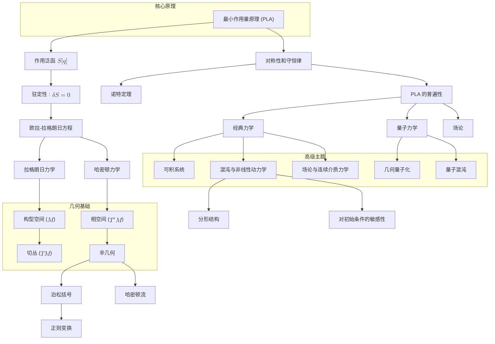

# 重构经典力学：一个统一的几何框架
* * *

--- 运动的核心在于一个原理：自然界以深刻的简单性运作。

# **1. 引言：经典力学的统一愿景**

**题词：**
*"简洁是最高级的精致。"* 
— 莱昂纳多·达·芬奇

## **1.1 什么是经典力学？**

经典力学是**物理学的基石**，为我们理解运动、力和能量提供基础。它描述从行星轨道到日常物体动力学的各种物理系统的行为，使用基于数学原理的系统框架。

历史上，经典力学始于**牛顿力学**，其中运动通过作用在质量上的力来解释。随着时间的推移，该领域演变为更抽象和一般化的表述：
- **拉格朗日力学**，专注于最小作用量原理和基于能量的描述。
- **哈密顿力学**，强调相空间和辛几何的作用。

这些表述不是独立的理论，而是对同一底层现实的**不同视角**，每个视角揭示独特的见解。经典力学不仅仅描述运动 —— 它揭示支配所有物理系统的**普遍原则**。

## **1.2 重构的必要性**

现代物理学家、教育工作者和研究人员通常将经典力学视为一组**不连贯的工具**：牛顿定律用于力，拉格朗日方法用于约束系统，哈密顿形式用于高级主题。虽然这种方法在解决问题时是实用的，但它掩盖了将这些方法联系在一起的**统一原则**。

传统观点可能导致：
- **知识的碎片化**：牛顿、拉格朗日和哈密顿力学之间的联系常常被忽视。
- **深度缺失**：经典力学背后的深层几何和变分结构很少得到充分探索。
- **现代扩展的困难**：缺乏整合的观点使得将经典力学与量子力学、混沌理论和场论联系起来更加困难。

重构是必要的，以：
- **统一表述**：通过展示所有经典力学如何从单一原则 —— **最小作用量原理 (PLA)** 中涌现出来。
- **突出几何**：强调统一其概念的几何结构(流形、辛形式)。
- **提供更深层次的见解**：揭示经典力学的内在简单性和普遍性，激发新的研究方向。

经典力学不仅仅是一个解决物理问题的**工具箱** —— 它是反映宇宙和谐与结构的**概念框架**。

## **1.3 几何视角**

在其核心，经典力学本质上是**几何的**。系统的演化最好被理解为几何空间上的一条路径或一条流，由对称性和不变性原则所支配。这一视角为描述运动、能量和守恒定律提供一个统一的语言。

关键的几何思想包括：
- **构型空间**：系统所有可能位置的空间，构成拉格朗日力学的基础。
- **相空间**：所有可能位置和动量的空间，构成哈密顿力学的基础。
- **辛几何**：相空间的数学结构，编码基本对偶性(如位置-动量)和守恒定律。

**最小作用量原理 (PLA)** 作为这些几何思想之间的桥梁，将系统的运动与其底层结构联系起来。通过采用几何视角，我们获得：
- **清晰性**：几何结构以自然直观的方式统一力学的不同表述。
- **普遍性**：几何揭示经典力学、量子力学和现代物理学之间的深刻联系。
- **简洁性**：当通过几何视角看待时，系统的表观复杂性简化为简单而优雅的原则。

将经典力学重构为一个**几何框架**使我们能够将其视为一套连贯而深刻的物理世界描述，而不仅仅是一组孤立的技术。

## **1.4 文档结构**

本文档采用**分层方法**重构经典力学，从最基础的概念开始，逐步扩展到高级主题。这种结构反映经典力学中思想的内在进展，使读者可以从**第一原理**到其应用中跟随逻辑流程。

1. **最小作用量原理**：
   - 经典力学的基础层，介绍作用量泛函及其变分原则。

2. **拉格朗日力学**：
   - **构型空间**上的运动，重点是广义坐标、约束和守恒定律。

3. **哈密顿力学**：
   - **相空间**上的动力学，介绍能量、辛结构和变换。

4. **辛几何**：
   - 相空间的数学基础，揭示经典力学的对偶性和不变性。

5. **经典力学中的对偶性**：
   - 探索互补对，如位置-动量和能量-时间，突出其几何和物理意义。

6. **高级主题和应用**：
   - 将经典力学扩展到可积系统、混沌、场论和量子力学。

7. **结论**：
   - 重构框架的综合，强调其统一原则和新发现的潜力。

这种进展确保**核心原则**首先被引入，而高级主题则作为自然扩展发展。文档关注几何和普遍性，提供一种新的视角，使读者不仅将经典力学视为一套技术，而是作为一个具有深远影响的**深刻框架**。

## **1.5 引言的关键要点**

- 经典力学是一个以**最小作用量原理**为基础的统一几何框架。
- 现代重构是必要的，以揭示其表述背后的深刻联系、对称性和普遍性。
- 通过采用几何视角，我们可以统一经典力学，将其见解扩展到现代物理学，并激发新的研究方向。

这为文档的分层探索奠定基础，引导读者通过定义经典力学的优雅思想进程。

# **2. 最小作用量原理：力学的核心**

**题词：**
*"自然通过选择最简单的路径运作。"*
— 无名氏

## **2.1 作用量泛函的定义**

经典力学的核心是**作用量泛函**，这是一个编码系统动力学的标量量。作用量泛函 $S[q]$ 定义为在时间区间上对**拉格朗日函数** $L(q, \dot{q}, t)$ 的积分：
$$
S[q] = \int_{t_1}^{t_2} L(q, \dot{q}, t) \, dt
$$
这里：
- $q$ 表示系统的广义坐标，描述其在**构型空间**中的位置。
- $\dot{q}$ 表示广义速度。
- $L(q, \dot{q}, t) = T - V$，其中 $T$ 是动能，$V$ 是势能。

**最小作用量原理 (PLA)** 指出，系统在两个时间点 $t_1$ 和 $t_2$ 之间的真实路径 $q(t)$ 是使作用量 $S[q]$ 驻定的路径。这意味着围绕真实路径的小变化 $\delta q(t)$ 不会改变 $S[q]$ 的一阶项：
$$
\delta S = 0
$$
这个**驻定条件**并不一定意味着作用量是最小的 —— 它也可能是最大值或鞍点。重要的是变化消失，反映系统遵循自然规律。

## **2.2 驻定性和变分原理**

**最小作用量原理**在数学上等价于通过变分法导出的**欧拉-拉格朗日方程**。为了找到使 $S[q]$ 驻定的路径 $q(t)$，我们考虑一个小变化 $q(t) \to q(t) + \epsilon \eta(t)$，其中 $\epsilon$ 是一个小参数，$\eta(t)$ 是一个在端点 $t_1$ 和 $t_2$ 处消失的任意光滑函数。将这个变化代入作用量：
$$
S[q + \epsilon \eta] = \int_{t_1}^{t_2} L(q + \epsilon \eta, \dot{q} + \epsilon \dot{\eta}, t) \, dt
$$
将 $S[q + \epsilon \eta]$ 展开到 $\epsilon$ 的一阶项，得到：
$$
\delta S = \frac{d}{d\epsilon} \int_{t_1}^{t_2} L(q + \epsilon \eta, \dot{q} + \epsilon \dot{\eta}, t) \, dt \bigg|_{\epsilon=0}
$$
进行变分并分部积分后，得到**欧拉-拉格朗日方程**：
$$
\frac{d}{dt} \frac{\partial L}{\partial \dot{q}^i} - \frac{\partial L}{\partial q^i} = 0
$$
这些方程代表拉格朗日力学中系统的根本运动方程。**作用量泛函的驻定性**因此等价于系统遵守这些动力学方程。

## **2.3 最小作用量原理的普遍性**

**最小作用量原理**不仅限于经典力学；它是现代物理学的一个**普遍原则**。它的普遍性源于其能够编码基本对称性和守恒定律，以及其几何和变分性质。

### **2.3.1 经典力学中的例子**：
- **自由粒子**：
  对于自由粒子，$L = \frac{1}{2} m \dot{q}^2$，欧拉-拉格朗日方程简化为 $m \ddot{q} = 0$，描述直线上的匀速运动。
  
- **谐振子**：
  对于处于二次势场中的粒子，$L = \frac{1}{2} m \dot{q}^2 - \frac{1}{2} k q^2$，欧拉-拉格朗日方程给出 $m \ddot{q} + k q = 0$，描述振荡运动。

- **约束系统**：
  PLA 自然地包含约束，如摆或具有固定表面的系统，通过在拉格朗日函数中引入拉格朗日乘子来修改。

### **2.3.2 与量子力学的联系**：
在量子力学中，PLA 通过理查德·费曼发展的**路径积分表述**成为中心。不是单一路径，量子力学对所有可能路径求和，每个路径加权为 $e^{i S[q]/\hbar}$。在 $\hbar \to 0$ 的极限下，经典路径作为 $S[q]$ 驻定的主要贡献出现。

### **2.3.3 与场论的联系**：
在经典场论中，作用量扩展到场 $\phi(x, t)$，用拉格朗日密度 $\mathcal{L}$ 描述系统。欧拉-拉格朗日方程推广为：
$$
\frac{\partial}{\partial t} \frac{\partial \mathcal{L}}{\partial \dot{\phi}} - \nabla \cdot \frac{\partial \mathcal{L}}{\partial (\nabla \phi)} + \frac{\partial \mathcal{L}}{\partial \phi} = 0
$$
这个框架支配电磁学、广义相对论，甚至是粒子物理的标准模型。

## **2.4 哲学含义**

**最小作用量原理**不仅仅是一个数学构造 —— 它是一个关于自然**简单性和和谐性**的深刻陈述。它反映以下哲学思想：

1. **自然的经济性**：
   自然“选择”高效、优雅且由对称性支配的路径。PLA 体现这一思想，揭示复杂现象从简单原则中涌现。

2. **对称性和守恒**：
   通过**诺特定理**，PLA 将拉格朗日函数中的对称性与守恒定律联系起来。例如：
   - 时间不变性 $\Rightarrow$ 能量守恒。
   - 空间不变性 $\Rightarrow$ 动量守恒。
   - 旋转不变性 $\Rightarrow$ 角动量守恒。

3. **普遍性和统一性**：
   PLA 提供一个超越经典力学边界的统一框架。它连接从行星运动到量子场的各个物理领域，归结为单一原则。

4. **美学原则**：
   PLA 与物理定律在其简单性方面的**美丽**理念相呼应。数学家和物理学家都被其优雅所吸引，视其为关于宇宙更深层次真理的反映。

## **2.5 总结**

- **最小作用量原理**是经典力学的基础，通过作用量泛函 $S[q]$ 概括系统的动力学。
- 其驻定条件 ($\delta S = 0$) 导致**欧拉-拉格朗日方程**，描述自然运动路径。
- PLA 是普遍的，不仅出现在经典力学中，还出现在量子力学、场论及其他领域。
- 它反映简单性、对称性和基本原则的统一力量的哲学思想。

通过从 PLA 开始，我们建立一个核心概念框架，该框架将引导拉格朗日力学、哈密顿力学及经典力学底层几何结构的发展。

# **3. 拉格朗日力学：构型空间上的运动**

**题词：**
*"作用量连接几何与运动。"*
— 无名氏

## **3.1 构型空间和广义坐标**

在拉格朗日力学中，**构型空间** $M$ 作为描述系统运动的几何舞台。$M$ 中的每个点对应于系统自由度的一种可能排列。

### **3.1.1 构型空间的定义**：
- 对于具有 $n$ 个自由度的系统，构型空间是一个 $n$ 维流形 $M$。
- 坐标 $q = (q^1, q^2, ..., q^n)$ 是描述系统在 $M$ 中位置的**广义坐标**。
   - 例子：
     - 三维空间中的单个粒子：构型空间是 $\mathbb{R}^3$。
     - 双摆：构型空间是 $\mathbb{S}^1 \times \mathbb{S}^1$(两个角自由度)。

### **3.1.2 为什么使用广义坐标？**
- 广义坐标允许我们在不显式处理约束力的情况下描述受约束的系统(例如，线上的珠子或固定支点上摆动的摆)。
- 它们提供在笛卡尔坐标可能不实用或自然的空间中工作的灵活性。

### **3.1.3 构型空间的作用**：
构型空间为定义系统在作用量原理下遍历的**路径** $q(t)$ 提供基础。$M$ 的几何结构决定如何描述运动，特别是在有约束或曲率空间的系统中。

## **3.2 切丛 ($TM$)**

**切丛** $TM$ 扩展构型空间 $M$，以包括位置和速度，形成拉格朗日力学的自然设置。

### **3.2.1 切丛的定义**：
- 切丛 $TM$ 是所有可能位置和速度的空间。$TM$ 中的每个点是一个对 $(q, \dot{q})$，其中 $q \in M$，$\dot{q}$ 是 $q$ 处的速度向量。
- 直观上，$TM$ “加倍”了 $M$ 的维度，通过为每个自由度添加速度分量。

### **3.2.2 为什么使用 $TM$？**
- 系统的动力学依赖于其位置 $q(t)$ 和速度 $\dot{q}(t)$。
- **拉格朗日函数** $L(q, \dot{q}, t)$ 定义在 $TM \times \mathbb{R}$ 上，使得 $TM$ 成为描述运动的自然空间。

### **3.2.3 几何解释**：
- 切丛编码系统的**运动学**：
  - $TM$ 中的路径对应于相空间中的可能轨迹。
  - 运动的约束(例如，固定长度或表面)将 $TM$ 限制为子流形。

### **3.2.4 例子**：
- 对于在 $\mathbb{R}^3$ 中运动的粒子，$M = \mathbb{R}^3$ 且 $TM = \mathbb{R}^3 \times \mathbb{R}^3$，其中每个速度向量 $\dot{q}$ 对应于三维空间中的一个方向。

## **3.3 拉格朗日函数**

**拉格朗日函数** $L(q, \dot{q}, t)$ 是拉格朗日力学的核心对象。它通过平衡**动能**和**势能**来编码系统的动力学。

### **3.3.1 定义**：
系统的拉格朗日量由以下公式给出：
$$
L(q, \dot{q}, t) = T(q, \dot{q}) - V(q, t)
$$
其中：
- $T(q, \dot{q})$：动能，通常为 $\dot{q}$ 的二次函数。
- $V(q, t)$：势能，是位置和可能时间的函数。

### **3.3.2 物理解释**：
- 拉格朗日量测量系统动能和势能之间的“差异”。
- 使作用量极值化(通过 $S[q] = \int L \, dt$)的路径对应于物理上可实现的轨迹。

### **3.3.3 例子**：
- **自由粒子**：
  对于质量为 $m$ 的自由空间中的粒子：
  $$
  L = \frac{1}{2} m \dot{q}^2
  $$

- **谐振子**：
  对于连接到弹簧的质点，弹簧刚度为 $k$：
  $$
  L = \frac{1}{2} m \dot{q}^2 - \frac{1}{2} k q^2
  $$

- **约束系统**：
  通过减少自由度或添加拉格朗日乘子来强制执行约束。

### **3.3.4 时变拉格朗日量**：
- 当 $L(q, \dot{q}, t)$ 显式依赖于时间(例如，驱动系统)时，动力学包括时变力。

## **3.4 对称性和守恒定律**

对称性在拉格朗日力学中起着根本作用，因为它们直接导致**守恒定律**。对称性和守恒之间的联系由**诺特定理**形式化。

### **3.4.1 诺特定理**：
对于作用量 $S[q]$ 的每一个连续对称性，存在一个相应的守恒量。

### **3.4.2 对称性的关键例子**：
1. **时间不变性**：
   如果 $L$ 不显式依赖于时间 ($\partial L / \partial t = 0$)，系统守恒**能量**。

2. **平移不变性**：
   如果 $L$ 不显式依赖于位置 ($\partial L / \partial q = 0$)，系统守恒**动量**。

3. **旋转不变性**：
   如果 $L$ 在旋转下不变，系统守恒**角动量**。

### **3.4.3 对力学的影响**：
- 对称性通过揭示守恒量减少问题的复杂性。
- 守恒律是底层构型空间的几何不变量。

## **3.5 拉格朗日力学的例子**

### **3.5.1 自由粒子**：
- **系统**：质量为 $m$ 的粒子在自由空间中运动。
- **拉格朗日量**：
  $$
  L = \frac{1}{2} m \dot{q}^2
  $$
- **运动方程**：
  $$
  m \ddot{q} = 0
  $$
  描述匀速运动。

### **3.5.2 谐振子**：
- **系统**：质量为 $m$ 的物体连接到刚度为 $k$ 的弹簧。
- **拉格朗日量**：
  $$
  L = \frac{1}{2} m \dot{q}^2 - \frac{1}{2} k q^2
  $$
- **运动方程**：
  $$
  m \ddot{q} + k q = 0
  $$
  描述振荡运动。

### **3.5.3 约束系统：摆**：
- **系统**：质量为 $m$ 的物体在固定长度的绳子上摆动。
- **广义坐标**：角度位移 $\theta$。
- **拉格朗日量**：
  $$
  L = \frac{1}{2} m l^2 \dot{\theta}^2 - m g l \cos \theta
  $$
- **运动方程**：
  $$
  \ddot{\theta} + \frac{g}{l} \sin \theta = 0
  $$

### **3.5.4 中心力问题(行星运动)**：
- **系统**：在中心势场 $V(r)$ 下运动的粒子。
- **拉格朗日量**(在极坐标下)：
  $$
  L = \frac{1}{2} m (\dot{r}^2 + r^2 \dot{\theta}^2) - V(r)
  $$
- 守恒量：角动量和总能量。

## **3.6 总结**

- 拉格朗日力学提供一个描述在**构型空间** $M$ 上运动的几何框架，并扩展到**切丛** $TM$。
- **拉格朗日函数** $L(q, \dot{q}, t) = T - V$ 编码系统的动力学。
- 拉格朗日中的**对称性**通过**诺特定理**导致守恒量。
- 自由粒子、谐振子、摆和中心力问题等例子展示拉格朗日框架的多样性和优雅性。

本节为过渡到**哈密顿力学**奠定基础，在那里相空间和基于能量的描述成为核心。

# **4. 哈密顿力学：相空间上的动力学**

**题词：**
*"系统的能量指引其演化。"*
— 无名氏

## **4.1 相空间和余切丛 ($T^*M$)**

在哈密顿力学中，**相空间**是描述系统位置和动量的动力学的自然几何环境。虽然构型空间 $M$ 捕捉系统的所有可能位置，但相空间 $T^*M$ 通过包括所有可能的动量扩展这一点。

### **4.1.1 相空间的定义**：
- 相空间是构型空间 $M$ 的**余切丛** $T^*M$。
- 相空间中的一个点表示为 $(q, p)$，其中 $q$ 是广义位置，$p$ 是与 $q$ 共轭的广义动量。

### **4.1.2 与切丛的对偶性**：
- 在拉格朗日力学中，切丛 $TM$ 描述位置 $q$ 和速度 $\dot{q}$。
- **勒让德变换**(在第 4.2 节讨论)将 $TM$ 映射到 $T^*M$，用动量替换速度。

### **4.1.3 相空间的几何结构**：
- $T^*M$ 是一个**辛流形**，配备辛形式 $\omega = dq \wedge dp$。
- 辛结构编码位置和动量之间的基本关系，通过哈密顿力学支配系统的演化。

### **4.1.4 为什么使用相空间？**
- 相空间提供系统的状态的**完整描述**。
- 它特别适合描述具有守恒量的系统，并有助于理解运动的几何特性(例如，轨迹、不变量和对称性)。

### **4.1.5 例子**：
- 对于在三维空间中运动的粒子，构型空间是 $M = \mathbb{R}^3$，相空间是 $T^*M = \mathbb{R}^6$，有六个维度：三个用于位置 ($q_x, q_y, q_z$) 和三个用于动量 ($p_x, p_y, p_z$)。

## **4.2 勒让德变换**

**勒让德变换**是拉格朗日力学和哈密顿力学之间桥梁。通过将速度 $\dot{q}$ 转换为动量 $p$，它使我们能够从切丛 $TM$ 过渡到余切丛 $T^*M$。

### **4.2.1 勒让德变换的定义**：
对于给定的拉格朗日函数 $L(q, \dot{q}, t)$，与 $q$ 共轭的广义动量 $p$ 定义为：
$$
p_i = \frac{\partial L}{\partial \dot{q}^i}
$$
然后通过勒让德变换获得哈密顿函数 $H(q, p, t)$：
$$
H(q, p, t) = p_i \dot{q}^i - L(q, \dot{q}, t)
$$
其中 $\dot{q}^i$ 表示为 $q$ 和 $p$ 的函数，通过求解 $p_i = \frac{\partial L}{\partial \dot{q}^i}$ 反演得到。

### **4.2.2 物理解释**：
- 哈密顿函数 $H(q, p, t)$ 表示系统的**总能量**，以位置和动量的形式表达。
- 勒让德变换重新解释系统的动力学，用守恒量和相空间轨迹来描述。

### **4.2.3 例子**：
1. **自由粒子**：
   对于 $L = \frac{1}{2} m \dot{q}^2$，
   $p = m \dot{q}$，并且
   $H = \frac{p^2}{2m}$，即总动能。

2. **谐振子**：
   对于 $L = \frac{1}{2} m \dot{q}^2 - \frac{1}{2} k q^2$，
   $p = m \dot{q}$，并且
   $H = \frac{p^2}{2m} + \frac{1}{2} k q^2$，即总能量(动能+势能)。

## **4.3 哈密顿函数和动力学**

**哈密顿函数** $H(q, p, t)$ 支配系统在相空间中的演化。它通常被解释为系统的**总能量**，包括动能和势能的贡献。

### **4.3.1 哈密顿方程**：
系统在哈密顿力学中的动力学由**哈密顿方程**描述：
$$
\dot{q}^i = \frac{\partial H}{\partial p_i}, \quad \dot{p}_i = -\frac{\partial H}{\partial q^i}
$$
这些方程描述系统在相空间中的流：
- 位置 $q^i$ 的变化率由哈密顿函数关于动量 $p_i$ 的导数决定。
- 动量 $p_i$ 的变化率由哈密顿函数关于位置 $q^i$ 的导数决定。

### **4.3.2 几何解释**：
- 由 $H$ 生成的流保持辛结构 $\omega = dq \wedge dp$，确保相空间体积守恒(刘维尔定理)。
- 相空间中的轨迹代表系统的演化，守恒量对应于流的不变量。

### **4.3.3 与能量守恒的关系**：
- 如果 $H$ 不显式依赖于时间 ($\partial H / \partial t = 0$)，则哈密顿函数守恒，表示系统的总能量。

## **4.4 正则变换**

正则变换是在相空间中保持哈密顿方程结构的变量变换。它们在简化复杂系统和理解力学中的对称性方面起着核心作用。

### **4.4.1 定义**：
如果变换 $(q, p) \to (Q, P)$ 保持辛结构：
$$
\omega = dq \wedge dp = dQ \wedge dP
$$
则该变换是**正则的**。等价地，变换后的运动方程仍然是哈密顿形式，与原始方程具有相同的形式。

### **4.4.2 生成函数**：
正则变换可以通过旧变量和新变量的函数 $F$ 生成。例如：
- $F_1(q, Q)$, $F_2(q, P)$ 等，每种生成函数代表不同类型的生成函数。

### **4.4.3 应用**：
- 正则变换通过引入**作用-角度变量**简化可积系统的分析，使得运动变得周期性和几何清晰。
- 在量子力学中，它们构成**几何量子化**的基础。

## **4.5 哈密顿力学的例子**

### **4.5.1 自由粒子**：
- **系统**：质量为 $m$ 的粒子在自由空间中运动。
- **哈密顿量**：
  $$
  H = \frac{p^2}{2m}
  $$
- **运动方程**：
  $$
  \dot{q} = \frac{\partial H}{\partial p} = \frac{p}{m}, \quad \dot{p} = -\frac{\partial H}{\partial q} = 0
  $$
  粒子以恒定速度运动。

### **4.5.2 谐振子**：
- **系统**：质量为 $m$ 的物体连接到刚度为 $k$ 的弹簧。
- **哈密顿量**：
  $$
  H = \frac{p^2}{2m} + \frac{1}{2} k q^2
  $$
- **运动方程**：
  $$
  \dot{q} = \frac{p}{m}, \quad \dot{p} = -k q
  $$
  运动是周期性的，在相空间中形成椭圆轨迹。

### **4.5.3 中心力问题(行星运动)**：
- **系统**：在中心势场 $V(r) = -\frac{GmM}{r}$ 下运动的粒子。
- **哈密顿量**：
  $$
  H = \frac{p_r^2}{2m} + \frac{p_\theta^2}{2m r^2} - \frac{GmM}{r}
  $$
- 守恒量：总能量 $H$ 和角动量 $p_\theta$。
- 轨迹：在引力作用下的椭圆轨道。

## **4.6 总结**

- 哈密顿力学将动力学重新表述为**相空间** $T^*M$ 上的描述，其中位置 $q$ 和动量 $p$ 描述系统的状态。
- **勒让德变换**从拉格朗日框架过渡到哈密顿框架，哈密顿函数 $H(q, p, t)$ 表示系统的总能量。
- **哈密顿方程**描述系统在相空间中的演化，保持了辛结构。
- **正则变换**简化复杂系统并揭示更深层次的对称性，在现代力学和量子理论中起着核心作用。

本节为探索下一章的**辛几何**奠定基础，在那里详细发展相空间的数学结构。

# **5. 辛几何：力学的语言**

**题词：**
*"力学的核心是一场辛的交响乐。"*
— 无名氏

## **5.1 辛流形和结构**

辛几何提供哈密顿力学的基础数学框架。它形式化了**相空间**的几何结构，并编码位置和动量之间的基本关系。

### **5.1.1 辛流形的定义**：
- 一个**辛流形**是一个光滑的、偶数维流形 $(M, \omega)$，其中 $\omega$ 是一个**闭的、非退化的 $2$-形式**，称为**辛形式**。
- 对于相空间 $T^*M$，规范的辛形式为：
  $$
  \omega = \sum_i dq^i \wedge dp_i
  $$
  其中 $q^i$ 和 $p_i$ 是广义坐标和动量。

### **5.1.2 $\omega$ 的关键性质**：
1. **闭性**：$d\omega = 0$。
   - 这确保辛结构的局部守恒，并反映系统的几何与时间演化无关的事实。

2. **非退化性**：对于任何非零切向量 $v$，存在一个 $w$ 使得 $\omega(v, w) \neq 0$。
   - 这保证辛形式在坐标和动量之间提供一个明确定义的配对。

### **5.1.3 几何解释**：
- 辛形式 $\omega$ 定义相空间中的**面积元素**，给出体积和轨迹的自然度量。
- 非退化性确保位置和动量是耦合的，反映这些变量的对偶性和互补性。

### **5.1.4 例子**：
1. **规范相空间**：
   对于二维自由粒子，$M = \mathbb{R}^4$，辛形式为：
   $$
   \omega = dq_x \wedge dp_x + dq_y \wedge dp_y
   $$
   每一对 $(q_x, p_x)$ 和 $(q_y, p_y)$ 形成一个共轭坐标系。

2. **余切丛**：
   对于任何构型空间 $Q$，相空间 $T^*Q$ 继承规范的辛结构 $\omega$，使其成为哈密顿动力学的自然环境。

## **5.2 哈密顿流和守恒定律**

哈密顿力学描述系统在一个辛流形上的**流**。辛结构确保这个流保持基本的几何和物理性质。

### **5.2.1 哈密顿流**：
- 一个哈密顿系统由一个光滑函数 $H(q, p, t)$ (哈密顿量)和辛形式 $\omega$ 定义。
- 运动方程由**哈密顿方程**给出：
  $$
  \dot{q}^i = \frac{\partial H}{\partial p_i}, \quad \dot{p}_i = -\frac{\partial H}{\partial q^i}
  $$
  这些方程描述辛流形上的向量场 $X_H$ (哈密顿流)，其中：
  $$
  \iota_{X_H} \omega = -dH
  $$
  这里，$\iota_{X_H} \omega$ 表示辛形式与向量场 $X_H$ 的收缩。

### **5.2.2 刘维尔定理**：
- 哈密顿流保持相空间中的体积形式：
  $$
  \mathcal{L}_{X_H} \omega = 0
  $$
  其中 $\mathcal{L}_{X_H}$ 是李导数。这意味着总相空间体积随时间保持不变。

### **5.2.3 守恒定律**：
- 如果哈密顿量 $H$ 不显式依赖于时间，则它沿着流守恒：
  $$
  \frac{dH}{dt} = \frac{\partial H}{\partial t} = 0
  $$
- 更一般地，任何与 $H$ 在**泊松括号**下交换的光滑函数 $f(q, p)$ 也是守恒的(见第 5.3 节)。

## **5.3 泊松括号**

**泊松括号**是哈密顿力学中的一个基本结构，编码可观测量之间的代数关系，并提供通往量子力学的桥梁。

### **5.3.1 泊松括号的定义**：
对于相空间上的两个光滑函数 $f(q, p)$ 和 $g(q, p)$，泊松括号定义为：
$$
\{f, g\} = \sum_i \left( \frac{\partial f}{\partial q^i} \frac{\partial g}{\partial p_i} - \frac{\partial f}{\partial p_i} \frac{\partial g}{\partial q^i} \right)
$$

### **5.3.2 关键性质**：
1. **反对称性**：$\{f, g\} = -\{g, f\}$。
2. **线性性**：$\{af + bg, h\} = a\{f, h\} + b\{g, h\}$。
3. **雅可比恒等式**：$\{f, \{g, h\}\} + \{g, \{h, f\}\} + \{h, \{f, g\}\} = 0$。
4. **莱布尼兹规则**：$\{fg, h\} = f\{g, h\} + g\{f, h\}$。

### **5.3.3 物理解释**：
- 泊松括号编码可观测量 $f$ 沿着哈密顿流的变化率：
  $$
  \frac{df}{dt} = \{f, H\} + \frac{\partial f}{\partial t}
  $$
- 与 $H$ 交换的可观测量 ($\{f, H\} = 0$) 是运动常数。

### **5.3.4 例子**：
1. **规范坐标**：
   规范变量的泊松括号满足：
   $$
   \{q^i, p_j\} = \delta^i_j, \quad \{q^i, q^j\} = 0, \quad \{p_i, p_j\} = 0
   $$

2. **角动量**：
   对于三维粒子，角动量分量 $L_x, L_y, L_z$ 满足：
   $$
   \{L_x, L_y\} = L_z, \quad \{L_y, L_z\} = L_x, \quad \{L_z, L_x\} = L_y
   $$

## **5.4 辛几何的应用**

辛几何为分析复杂系统并理解其深层次结构提供强大的框架。以下是一些关键应用：

### **5.4.1. 可积系统**：
- **定义**：如果一个系统具有与其自由度一样多的守恒量(处于对合状态)，则该系统是可积的。
- **作用-角度变量**：辛几何允许将可积系统表示为作用-角度变量的形式，使运动变得线性和周期性。

### **5.4.2. 辛约化**：
- 辛几何通过降低相空间的维度简化约束系统。
- 例子：在行星运动中，角动量守恒降低有效相空间的维度。

### **5.4.3. 混沌和非线性动力学**：
- 辛几何提供理解混沌系统工具，其中对初始条件的敏感性导致复杂的轨迹。
- 辛结构确保即使是混沌流也保持相空间体积。

### **5.4.4. 几何量子化**：
- 从经典到量子力学的过渡由辛结构指导。
- 具有泊松括号的可观测量推广为带有对易子的量子算符：
  $$
  \{f, g\} \to -\frac{i}{\hbar} [\hat{f}, \hat{g}]
  $$

## **5.5 总结**

- **辛流形**为相空间提供几何基础，辛形式 $\omega$ 编码哈密顿动力学的结构。
- 哈密顿流保持辛结构和相空间体积，导致守恒律和不变量。
- **泊松括号**形式化了可观测量的代数，将经典力学与量子力学联系起来。
- 辛几何的应用包括可积系统、混沌和几何量子化，展示其强大和普遍性。

本节确立了辛几何的数学优雅，为理解经典力学中的**对偶性**和更深层次的联系奠定基础(在下一章中探讨)。

# **6. 经典力学中的对偶性**

**题词：**
*"对偶揭示对立面的隐藏统一。"*
— 无名氏

## **6.1 位置-动量对偶**

经典力学中最基本的对偶之一是**位置**和**动量**之间的关系，这一关系编码在相空间的辛结构中。这种对偶反映这些量的互补性质，并在经典力学和量子力学的表述中扮演核心角色。

### **6.1.1 辛编码**：
- 辛结构 $\omega = dq \wedge dp$ 内在地耦合位置 $q$ 和动量 $p$。
- 位置和动量被视为**共轭变量**，这意味着它们的动力学是相互依赖且对称的。

### **6.1.2 规范泊松括号**：
- 泊松括号形式化了位置和动量之间的对偶：
  $$
  \{q^i, p_j\} = \delta^i_j, \quad \{q^i, q^j\} = 0, \quad \{p_i, p_j\} = 0
  $$
  这些关系编码相空间的基本结构，并决定可观测量如何动态交互。

### **6.1.3 物理解释**：
- 位置 $q$ 确定系统在构型空间中的位置，而动量 $p$ 描述相空间中运动的“方向和强度”。
- 从哈密顿方程可以看出对偶性：
  $$
  \dot{q}^i = \frac{\partial H}{\partial p_i}, \quad \dot{p}_i = -\frac{\partial H}{\partial q^i}
  $$
  位置的变化由动量驱动，动量的变化由位置驱动。

### **6.1.4 几何视角**：
- 相空间中的轨迹由哈密顿流控制，这些流保持辛结构。位置和动量不是独立的 —— 它们被系统的几何**交织**在一起。

### **6.1.5 量子对应**：
- 在量子力学中，位置-动量对偶通过交换关系表达为：
  $$
  [\hat{q}, \hat{p}] = i\hbar
  $$
  这是经典泊松括号的量子类比，突显这些量之间的内在不确定性。

### **6.1.6 例子**：
- **谐振子**：在相空间中，$q$ 和 $p$ 之间的对偶表现为椭圆轨迹，能量在动能(动量)和势能(位置)之间振荡。
- **自由粒子**：位置 $q$ 随时间线性增加，而动量 $p$ 保持不变，反映它们的互补作用。

## **6.2 能量-时间对偶**

**能量**和**时间**之间的对偶是经典力学中的另一个深刻方面，根植于对称性和守恒定律之间的关系。虽然不如位置-动量对偶明显，但它支配系统的时序演化，并对经典和量子理论有深远的影响。

### **6.2.1 哈密顿量作为能量**：
- 哈密顿量 $H(q, p, t)$ 通常被解释为系统的**总能量**。
- 在哈密顿力学中，时间演化由以下方程控制：
  $$
  \frac{df}{dt} = \{f, H\} + \frac{\partial f}{\partial t}
  $$
  这个方程表明哈密顿量生成时间流：它决定可观测量如何演化。

### **6.2.2 时间平移对称性**：
- 如果哈密顿量不显式依赖于时间 ($\partial H / \partial t = 0$)，则系统是**时间不变的**，总能量守恒。
- 通过**诺特定理**，时间不变性直接与能量守恒相关联。

### **6.2.3 对偶视角**：
- 能量支配系统的**变化率**(时间演化)，而时间是这种演化的参数。
- 这种对偶隐含在相空间轨迹的时间参数化和能量景观的形状中。

### **6.2.4 量子联系**：
- 在量子力学中，能量-时间关系更为微妙，常与时间-能量不确定原理相关联：
  $$
  \Delta E \Delta t \gtrsim \hbar
  $$
  这反映能量测量精度和定义它们的时间尺度之间的权衡。

### **6.2.5 例子**：
- **摆**：哈密顿量包含总能量，这决定了摆的振荡周期。系统的时序演化由能量景观决定。
- **开普勒问题(行星运动)**：能量守恒支配行星的轨道周期，将轨迹的几何与其时序演化联系起来。

## **6.3 对偶性的几何解释**

经典力学中的对偶性不仅仅是代数关系 —— 它们深深植根于理论的**几何结构**。辛流形及其丰富的数学性质为理解这些互补对提供一个统一的框架。

### **6.3.1 辛几何与对偶性**：
- 辛形式 $\omega = dq \wedge dp$ 将位置-动量对偶编码为相空间的一个基本特征。
- 能量-时间对偶反映在哈密顿量作为辛框架内时间演化的生成元的角色中。

### **6.3.2 不变性和对称性**：
- 对偶性源于辛结构的不变性属性：
  - 位置-动量对偶在**规范变换**下保持不变，这些变换使辛形式不变。
  - 能量-时间对偶源于时间平移对称性，将守恒律与运动的几何联系起来。

### **6.3.3 作用-角度变量**：
- 在可积系统中，对偶性通过**作用-角度变量**优雅地表达。作用变量表示守恒量(例如，能量)，而角度变量描述相空间中的周期运动。
- 这种表述突显几何(作用)与动力学(角度)之间的相互作用。

### **6.3.4 深层不变性的反映**：
- 对偶性不是任意的 —— 它们反映力学定律中的深层不变性：
  - 位置-动量对偶反映构型空间与相空间之间的互补性。
  - 能量-时间对偶封装对称性与守恒量之间的关系。

### **6.3.5 对现代物理学的影响**：
- 这些对偶性超出经典力学的范畴：
  - 在量子力学中，位置-动量和能量-时间关系是希尔伯特空间结构和不确定性原理表述的基础。
  - 在场论中，对偶性支撑波粒二象性等概念以及场与其相应动量之间的关系。

## **6.5 本节总结**

- **位置-动量对偶**编码在相空间的辛结构中，反映这些量在支配动力学中的互补作用。
- **能量-时间对偶**支配时序演化，并根植于通过时间平移对称性守恒的能量。
- 两种对偶都是深刻几何的，自然地源于辛流形的不变性和结构。
- 这些对偶不是孤立的；它们反映经典力学的**统一原则**，并延伸到量子力学和现代物理学，揭示物理定律的深刻互联性。

本节突显对偶性作为代数、几何和物理之间桥梁的优雅性，为理解如可积系统、混沌和量子化等高级主题奠定基础。

# **7. 高级主题与应用**

**题词：**
*"力学的前沿着是知识的前沿着。"*
— 无名氏

## **7.1 可积系统和作用-角度变量**

可积系统代表一类优雅的力学系统，其中复杂的动力学简化为简单、可预测的行为。这些系统以其**精确可解性**和潜在的对称性为特征。

### **7.1.1 可积系统的定义**：
- 如果一个具有 $n$ 个自由度的系统承认 $n$ 个独立的守恒量 $I_1, I_2, \dots, I_n$ 并且这些守恒量处于**对合**状态：
  $$
  \{I_i, I_j\} = 0, \quad \forall i, j
  $$
  每个守恒量对应于系统的对称性。

### **7.1.2 作用-角度变量**：
- 可积系统可以用**作用-角度变量** $(J, \theta)$ 表达，其中：
  - **作用变量** $J_i$：守恒量，参数化相空间中的不变环面。
  - **角度变量** $\theta_i$：描述在这些环面上运动的周期坐标。
- 在这些坐标中，系统的哈密顿量仅依赖于 $J$，而运动方程变为线性：
  $$
  \dot{\theta}_i = \omega_i(J), \quad \dot{J}_i = 0
  $$
  其中 $\omega_i$ 是运动频率。

### **7.1.3 几何解释**：
- 可积系统的相空间由不变环面层叠而成，轨迹在此环面上是周期或准周期的。这些环面编码系统的对称性和稳定性。

### **7.1.4 例子**：
1. **谐振子**：
   运动是周期性的，作用变量对应于振子的能量。
2. **开普勒问题(行星运动)**：
   系统是可积的，守恒量包括能量、角动量和拉普拉斯-龙格-伦茨矢量。
3. **刚体动力学**：
   刚体的旋转(例如欧拉方程)可以使用作用-角度变量求解。

### **7.1.5 应用**：
- 可积系统提供对天体力学、量子系统和分子动力学中**稳定运动**的洞察。
- 它们为研究近似可积系统和混沌系统提供基础。

## **7.2 混沌与非线性动力学**

虽然可积系统表现出可预测的行为，但**混沌系统**揭示非线性动力学的丰富性和复杂性。混沌源于对初始条件的敏感性，微小扰动会导致指数发散的轨迹。

### **7.2.1 混沌的关键特征**：
1. **对初始条件的敏感性**：
   相空间中两条邻近的轨迹呈指数发散，其特征是一个**正李雅普诺夫指数**。
2. **分形结构**：
   混沌系统在相空间中表现出分形几何，具有奇异吸引子和复杂的图案。
3. **非线性相互作用**：
   混沌源于自由度之间的非线性耦合，破坏了可积性。

### **7.2.2 相空间与混沌**：
- 在混沌系统中，轨迹不再位于不变环面上，而是探索更大的相空间区域。
- 然而，辛结构 $\omega$ 确保相空间体积保持不变(刘维尔定理)。

### **7.2.3 例子**：
1. **双摆**：
   超过一定能量阈值时表现出混沌运动，对初始条件极其敏感。
2. **三体问题**：
   三个天体之间的引力相互作用是混沌的，它们的运动没有一般的封闭形式解。
3. **洛伦兹系统**：
   一个简化的对流模型，表现出奇异吸引子和混沌动力学。

### **7.2.4 应用**：
- **湍流**：混沌支撑流体的流的不规则、不可预测行为。
- **量子混沌**：研究经典混沌如何在量子系统中表现，将相空间动力学与本征态分布联系起来。
- **控制理论**：混沌为工程和生物学中非线性系统的稳定方法提供信息。

## **7.3 场论与连续介质力学**

经典力学扩展到**场论**和**连续介质力学**，其中自由度形成无限维系统。

### **7.3.1 场论**：
- 在场论中，构型空间是一个函数空间，场取代离散坐标。动力学由**拉格朗日密度** $\mathcal{L}$ 控制：
  $$
  S[\phi] = \int \mathcal{L}(\phi, \partial_\mu \phi) \, d^4x
  $$
  其中 $\phi(x)$ 是一个场，$\partial_\mu \phi$ 表示其时空导数。

- 欧拉-拉格朗日方程推广为偏微分方程：
  $$
  \frac{\partial \mathcal{L}}{\partial \phi} - \partial_\mu \frac{\partial \mathcal{L}}{\partial (\partial_\mu \phi)} = 0
  $$

### **7.3.2 连续介质力学**：
- 描述可变形体和流体的运动，使用场表示密度、速度和应力。
- 拉格朗日表述结合如不可压缩性或弹性等约束，导致如纳维-斯托克斯方程等方程。

### **7.3.3 例子**：
1. **电磁场**：
   拉格朗日密度 $\mathcal{L} = -\frac{1}{4} F_{\mu\nu} F^{\mu\nu}$ 导致麦克斯韦方程。
2. **波动方程**：
   描述介质中波的传播，由 $\mathcal{L} = \frac{1}{2} (\dot{\phi}^2 - (\nabla \phi)^2)$ 控制。
3. **广义相对论**：
   爱因斯坦-希尔伯特作用 $S = \int R \sqrt{-g} \, d^4x$ 描述时空的曲率及其与物质的相互作用。

### **7.3.4 应用**：
- **宇宙学**：场论描述宇宙的演化(例如膨胀模型)。
- **材料科学**：连续介质力学支配固体和流体在应力下的行为。

## **7.4 几何量子化**

从经典力学到量子力学的过渡深刻地依赖于相空间的几何。**几何量子化**形式化这一过渡，提供一个从经典系统构造量子理论的数学严格框架。

### **7.4.1 相空间的量子化**：
- 在经典力学中，相空间是一个辛流形 $(M, \omega)$。
- 几何量子化涉及将一个量子希尔伯特空间 $\mathcal{H}$ 和算符与此经典结构关联。

### **7.4.2 几何量子化的主要步骤**：
1. **预量子化**：
   - 构造一个复线丛 $L$ 上的 $M$，其连接的曲率等于 $\omega$。
   - 波函数是该线丛的截面。

2. **极化**：
   - 选择一个极化(例如位置或动量)以减少波函数的维度。
   - 在位置表示中，波函数仅依赖于 $q$，而 $p$ 成为微分算符。

3. **对易关系**：
   - 经典泊松括号被量子对易子替代：
     $$
     \{f, g\} \to -\frac{i}{\hbar} [\hat{f}, \hat{g}]
     $$

### **7.4.3 应用**：
1. **谐振子**：
   经典相空间轨迹成为具有离散能级的量子本征态。
2. **曲面上的量子化**：
   几何量子化扩展到拓扑非平凡的系统，如球面上或环面上的粒子。
3. **量子场论**：
   量子场论中的路径积分和算符方法根植于无限维相空间的几何量子化。

### **7.4.4 物理解释**：
- 几何量子化揭示经典对称性和结构如何在量子系统中持续存在。
- 它将经典守恒律与量子算符和本征值联系起来。

## **7.5 总结**

- **可积系统**和**作用-角度变量**提供一个理解稳定、周期运动的框架，应用于天体力学和分子动力学。
- **混沌和非线性动力学**突出复杂系统的不可预测行为，应用于湍流、量子混沌和控制理论。
- **场论和连续介质力学**将经典力学推广到无限维系统，形成电磁学、流体力学和广义相对论的基础。
- **几何量子化**架起经典力学和量子力学之间的桥梁，揭示经典相空间结构如何影响量子理论。

本节展示了经典力学如何扩展到多样化的高级领域，展示了其在现代物理学中的相关性及其与量子力学、宇宙学等领域的深刻联系。

# **8. 结论：力学的统一视野**

**题词：**
*"在简单中，我们找到真理。"*
— 无名氏

## **8.1 概念的综合**

经典力学本质上是一场揭示运动中的结构、复杂性中的秩序以及多样性中的统一性的旅程。本文将这一学科重构为一个**分层的几何框架**，每一层都建立在基础原理之上，揭示物理系统性质的更深层次见解。

### **8.1.1 最小作用量原理(PLA)：基石**
最小作用量原理(PLA)作为力学的统一基础。其变分公式概括了系统的动力学，将运动与对称性联系起来，进而将对称性与守恒律联系起来。通过作用泛函的驻定性，系统的自然路径得以显现，无论是在构型空间、相空间还是场中。

### **8.1.2 几何基础：力学的语言**
力学本质上是几何的：
- **构型空间**构成拉格朗日力学的舞台，其中运动被描述为广义坐标所描绘的曲线。
- **相空间**，配备其辛结构，提供哈密顿力学的丰富语言，在此，动力学展开为保持守恒量的流。
- **辛几何**揭示力学不仅是对力的研究，而是对不变量、变换和流形上流的研究。

### **8.1.3 对偶性和普遍性**
经典力学中的对偶性 —— 位置-动量、能量-时间、作用-角度 —— 并非孤立的好奇现象。它们反映物理学的**普遍对称性**：
- 位置和动量在相空间中作为共轭变量成对出现，它们的相互作用由辛结构控制。
- 能量和时间是时间演化的对偶方面，通过守恒和对称性相连。
- 作用-角度变量简化周期系统，揭示稳定运动的内在和谐。

### **8.1.4 从简单到复杂**
经典力学架起简单与复杂之间的桥梁：
- 在**可积系统**中，运动是可预测的，由守恒量和不变环面上的周期动力学控制。
- 在**混沌系统**中，非线性和对初始条件的敏感性相互作用，产生了丰富且不可预测的行为。
- 在**场论**中，力学扩展到无限维，其中场和连续介质的动力学塑造了我们对电磁学、流体力学和时空本身的理解。

### **8.1.5 统一框架**
通过这些视角的叠加，经典力学作为一个连贯的框架浮现出来。它不仅仅是一组方程的集合，而是一个结构化的理论，将各种现象统一在几何原理之下。从粒子到行星，从量子系统到宇宙场，重构后的力学视角揭示了自然界法则的深刻简单性和优雅。

## **8.2 未来方向**

经典力学的重建之旅并未结束，其原理和结构为探索现代物理学和跨学科研究的前沿提供了基础。

### **8.2.1 量子力学：下一层**
经典力学是量子力学的前奏和对应物。对称性、守恒和对偶性的原则延伸到量子领域：
- **几何量子化**形式化了从经典相空间到量子希尔伯特空间的过渡，其中可观测量成为算符，泊松括号成为对易子。
- 位置-动量和能量-时间对偶性转化为不确定性原理，反映量子系统中测量和知识的极限。
- 经典相空间的洞见为量子现象提供信息，如相干态、半经典近似和量子混沌。

### **8.2.2 混沌、复杂性和非线性动力学**
混沌系统和非线性动力学的研究仍然是一个充满活力的领域：
- **量子混沌**旨在理解经典混沌如何在量子系统中表现，应用于原子物理学、纳米技术和信息理论。
- **湍流**和流体力学，基于经典力学，继续挑战我们预测和建模具有许多相互作用自由度的复杂系统的能力。
- 混沌理论的**跨学科应用**扩展到生物学、经济学甚至神经科学，其中非线性相互作用支配着涌现行为。

### **8.2.3 场论和广义相对论**
当扩展到无限维系统时，经典力学转变为场论：
- 力学原理支撑了**广义相对论**，其中时空曲率取代势能，测地线取代经典轨迹。
- 引力波、宇宙膨胀和黑洞动力学的研究很大程度上得益于经典力学的几何洞见。

### **8.2.4 可积与非可积系统**
推进我们对可积性和其破坏的理解：
- 可积系统仍然是物理学中精确可解模型的基石，从天体力学到量子自旋链。
- 非可积系统，包括混沌系统，为摄动方法和统计力学提供测试平台，连接确定性和概率性方法。

### **8.2.5 力学在新兴领域的应用**
经典力学继续在现代和新兴领域中激发进步：
- **机器学习和优化**：变分原理启发了基于作用最小化的算法。
- **机器人技术和生物力学**：拉格朗日和哈密顿方法为机械和生物系统中的运动、控制和稳定性建模提供工具。
- **量子计算**：力学的对偶性为量子比特系统中的算法设计和错误校正提供信息。

## **8.3 结语反思**

经典力学远不止于历史遗迹 —— 它是一个不断进化和激励的活生生的框架。将其重构为一个统一的几何理论揭示了其深刻的简单性和力量，提供超越其原始范围的见解。从最小的粒子到宇宙中最大的结构，经典力学的原则仍然是我们理解现实基本性质的指导之光。

展望未来，经典力学不仅是一个基础，也是一个桥梁，连接了不同科学领域的多样性，并将它们统一在一个共同的运动、几何和对称性的语言之下。它在每个意义上都是自然界设计的优雅和普遍性的见证。

# **附录 A : 经典力学中的概念关系**

为了增强读者对本文档中所呈现的核心思想的理解，我们提供一个核心概念及其在经典力学统一框架内角色的关系图。本附录包含一个**概念关系图**，该图展示这些概念的层次和相互关联性。

## **A.1 概念关系图**

## **A.2 图表解释**

1. **最小作用量原理 (PLA)**：
   - 在框架的**核心**，PLA 通过**作用泛函** $S[q]$ 控制系统的动力学。其驻定性条件 ($\delta S = 0$) 导致**欧拉-拉格朗日方程**，这是**拉格朗日力学**和**哈密顿力学**的基础。

2. **对称性和守恒律**：
   - PLA 内在地编码对称性，这些对称性通过**诺特定理**形式化。这些对称性导致守恒量(如能量、动量)，弥合动力学、几何和不变性的差距。

3. **几何基础**：
   - **构型空间** $M$ 及其扩展**切丛** $TM$ 提供**拉格朗日力学**的背景。
   - **相空间** $T^*M$，由**辛几何**控制，是**哈密顿力学**的基础，编码位置-动量和能量-时间等对偶性。
   - **辛几何**将动力学(通过哈密顿流)与代数结构(泊松括号)和变换(正则变换)连接起来。

4. **PLA 的普遍性**：
   - PLA 超越了经典力学，扩展到**量子力学**(通过路径积分和几何量子化)和**场论**(通过拉格朗日密度)。
   - 这种普遍性突显经典物理学和现代物理学之间的深刻联系。

5. **高级主题**：
   - **可积系统**通过作用-角度变量展示周期运动的稳定性和可解性。
   - **混沌与非线性动力学**探讨可积性的破坏，揭示对初始条件的敏感性和分形结构。
   - **场论与连续介质力学**将经典力学推广到无限维，涵盖电磁场、流体力学和广义相对论。
   - **几何量子化**架起经典力学和量子力学之间的桥梁，保持了相空间的几何结构。

## **A.3 关键关系总结**

| **核心概念**                | **相关概念**                                                                                     | **在框架中的角色**                                                                                             |
|-----------------------------|--------------------------------------------------------------------------------------------------|----------------------------------------------------------------------------------------------------------------|
| **最小作用量原理**           | 作用泛函, 欧拉-拉格朗日方程, 对称性, 诺特定理                                                   | 中心组织原则；生成运动方程、对称性和守恒律。                                                                   |
| **构型空间 ($M$)**            | 切丛 ($TM$), 拉格朗日力学                                                                       | 描述系统的所有可能位置；作为拉格朗日力学的基础。                                                               |
| **相空间 ($T^*M$)**          | 辛几何, 哈密顿力学, 正则变换                                                                    | 编码位置和动量；为哈密顿力学提供几何背景。                                                                     |
| **辛几何**                   | 泊松括号, 哈密顿流, 守恒量                                                                      | 相空间的数学基础；控制动力学和不变性。                                                                         |
| **对偶性**                   | 位置-动量, 能量-时间, 作用-角度变量                                                              | 揭示物理量的互补性质及其几何解释。                                                                             |
| **诺特定理**                 | 对称性, 守恒律, 时间不变性, 空间不变性                                                           | 将作用中的对称性与守恒量(如能量、动量和角动量)联系起来。                                                     |
| **可积系统**                 | 作用-角度变量, 辛约化                                                                           | 用处于对合状态的守恒量描述可预测的周期运动。                                                                   |
| **混沌与非线性动力学**       | 对初始条件的敏感性, 分形结构, 李雅普诺夫指数                                                    | 探讨由非线性相互作用和可积性破坏产生的不可预测复杂行为。                                                       |
| **场论**                     | 拉格朗日密度, 广义相对论, 电磁学                                                                | 将力学扩展到场和连续介质，为现代物理学(如麦克斯韦方程)奠定基础。                                             |
| **几何量子化**               | 泊松括号, 量子算符, 辛结构                                                                      | 架起经典力学和量子力学之间的桥梁，保留量子领域的几何洞见。                                                     |

## **A.4 图表和表格的好处**

- **层次结构的可视化**：上图显示了思想的**相互依赖层次**，强调高级主题如何自然地从核心原理中涌现。
- **连接的清晰性**：表格详细说明了概念之间的关系、相互依赖性和它们在框架中的角色。
- **统一视角**：这两种工具强化了经典力学的**分层进展**，从基础原理到高级应用。

本附录不仅增强了读者掌握单个概念的能力，还增强了读者在更广泛的经典力学几何框架中掌握这些概念的位置的能力。

