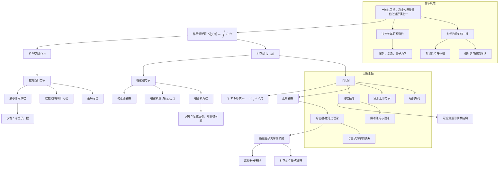

# 重构经典力学：一个统一的概念框架
* * *

--- 从原理到几何：深入探讨动力学的基础

# **1. 引言**

## **1.1 经典力学的意义**

经典力学是物理学的基石，为理解运动、力和物理系统的动力学奠定了基础。其原理涵盖了从行星运动到摆的振荡等广泛的现象，并深刻影响了现代科学和数学的发展。除了其实用应用，经典力学是一门概念杰作，提供了对决定论、对称性和物理定律中几何结构的深刻见解。

然而，经典力学的真正力量不仅在于它描述运动的能力，而在于它能够将普遍的物理原理编码进一个优雅且统一的框架。它提供了抽象工具，使人们能够在不同领域研究动力系统，从粒子动力学到场论，甚至量子力学。其影响远远超出了物理学，塑造了现代数学领域，如微分几何、辛拓扑和变分法。

经典力学不仅仅是一系列方程或工具的集合——它是一种揭示自然法则结构的语言。

## **1.2 理解经典力学的挑战**

尽管它具有基础性作用，经典力学常常被视为一个碎片化的领域，分为牛顿力学、拉格朗日力学和哈密顿力学等不同的子领域。虽然这些表述在数学上是等价的，但它们的概念联系并不总是显而易见。这种碎片化使得理解这些方法背后的深层统一原则变得困难。

此外，经典力学的历史发展，根植于牛顿定律，往往掩盖了其现代几何和变分解释。对于经验丰富的研究人员和教育工作者来说，挑战不仅仅是回顾经典力学，而是将其多样化的方面综合成一个强调其内在统一性的连贯框架。

关键问题出现了：
- 经典力学的本质是什么？
- 我们能否识别出连接其不同表述的统一原则？
- 我们如何重新构建经典力学以突出其概念深度并揭示新的视角？

## **1.3 从原理到几何的重构**

本文提出了一种**以原因为中心和几何为重点的方法**来重构经典力学。重构始于一个单一的统一思想：**物理系统的演化是由一个量——作用量的极值化所支配的。** 这个原则，即**最小作用量原理**，为所有经典力学提供了基础。从这个起点出发，本文逐层展开，将该领域组织成一个层次结构。

重构强调以下关键主题：
1. **演化原理**：物理系统遵循使作用量极值化的轨迹这一普遍思想。
2. **作用量为核心量**：作用量泛函作为从中导出所有运动方程的核心量。
3. **几何基础**：物理系统的动力学自然地编码在几何结构中：
   - **构型空间 ($M$)**：一个包含系统广义坐标的的空间。
   - **相空间 ($T^*M$)**：一个统一位置和动量的辛流形。
   - **辛几何**：支撑相空间的数学框架，由辛$2$-形式 $\omega = dp_i \wedge dq^i$ 支配。

通过这种重构，经典力学被揭示为一个相互关联的概念层次结构，从核心原则逐渐推进到高级主题。通过关注几何和变分基础，本文旨在为读者提供对经典力学的更深入理解，突出其概念统一性及其与现代物理学和数学的联系。

## **1.4 文档的目的和目标**

本文的目的是双重的：
1. 将经典力学重新组织成一个强调其基本原理和几何基础的统一、层次结构。
2. 为经验丰富的研究人员和教育工作者提供对经典力学的更深入理解，使他们能够从新鲜且丰富的角度重新审视已建立的概念。

本文的结构旨在实现以下目标：
- **澄清核心原则**：识别并阐述支配经典力学的基本原则(例如，作用量、演化和对称性)。
- **统一表述**：展示牛顿力学、拉格朗日力学和哈密顿力学如何自然地从最小作用量原理和构型空间及相空间的结构中涌现。
- **强调几何基础**：展示几何(构型空间、相空间、辛结构)在编码物理系统动力学中的作用。
- **扩展到高级主题**：探讨经典力学的核心思想如何推广到混沌理论、场力学和量子力学等领域。

## **1.5 文档的结构**

本文系统地推进，从**演化原理**开始，然后扩展到拉格朗日和哈密顿力学的**分析框架**，最后探索相空间的**几何结构**及其扩展。结构设计旨在引导读者从基础概念到高级主题，每一步都强调思想的相互关联性。

1. **经典力学的核心原则**：介绍最小作用量原理、作用量泛函及其在系统动力学中的作用。
2. **构型空间和拉格朗日力学**：发展拉格朗日框架作为第一个分析表述，基于构型空间。
3. **相空间和哈密顿力学**：过渡到哈密顿形式体系，引入相空间和辛几何。
4. **辛几何和正则变换**：探讨相空间的几何基础以及辛结构在守恒律和变换中的作用。
5. **高级主题和扩展**：将经典力学扩展到包括摄动理论、混沌、场论和与量子力学的联系。
6. **哲学和基础反思**：反思经典力学的概念和哲学意义，包括其作为现代物理学前奏的角色。

## **1.6 结语**

经典力学不仅仅是一个解决问题的工具——它是一个编码自然界基本原理的概念框架。通过从核心原则重构经典力学并强调其几何结构，本文旨在提供对该领域更深入、更统一的理解，激励读者探索其丰富的联系和潜在扩展。

# **2. 经典力学的核心原则**

经典力学建立在一个既普遍又优雅的概念基础上：**物理系统的演化由一个极值化原则支配，系统沿着使一个称为作用量的量最小化(或极值化)的轨迹运动。** 这一原则将运动和力的研究统一到一个基于变分微积分的单一框架中，提供了一种描述系统动力学的强大工具。

## **2.1 演化原理**

**演化原理**是经典力学的基石，断言**每个物理系统都沿着使某个特定标量量——作用量 $S$ 极值化的轨迹演化。** 这一原则概括了以下关键思想：

1. **作用量的极值化**
   系统的运动由作用量 $S$ 在系统轨迹的小变化下保持不变的条件所支配。数学上：
   $$
   \delta S = 0,
   $$
   其中 $S[q(t)]$ 是作用量泛函，而 $\delta S$ 表示由于轨迹 $q(t)$ 的无穷小变化引起的作用量的变化。

2. **变分原理的普遍性**
   极值化原理并非经典力学所独有，而是许多物理理论的普遍特征，从光学(费马原理)到场论和量子力学(路径积分)。在经典力学中，这一原则表现为**最小作用量原理**。

3. **物理直觉**
   作用量的极值化反映了自然界的一种**优化形式**：系统沿着“平衡”能量、时间和几何的路径演化。这一原则提供了一个统一的动力学描述，涵盖了力、运动和能量守恒，而不需要明确依赖牛顿的力的概念。

4. **几何编码**
   演化原理自然地用几何结构表达：
   - **构型空间 $M$** 表示系统的可能状态。
   - 轨迹 $q(t)$ 是 $M$ 中的一条曲线，而作用量 $S[q(t)]$ 是与该曲线相关联的标量泛函。

## **2.2 作用量泛函**

作用量泛函 $S[q(t)]$ 是经典力学中的基本量，它以单个标量的形式编码了系统的动力学。它定义为：
$$
S[q(t)] = \int_{t_1}^{t_2} L(q, \dot{q}, t) \, dt,
$$
其中：
- $L(q, \dot{q}, t)$ 是**拉格朗日函数**，它依赖于广义坐标 $q^i$、它们的速度 $\dot{q}^i = \frac{dq^i}{dt}$ 和时间 $t$。
- 拉格朗日函数通常表示为：
  $$
  L(q, \dot{q}, t) = T(q, \dot{q}) - V(q),
  $$
  其中 $T$ 是动能，$V$ 是势能。

### **2.2.1 物理直觉：作用量作为累积能量**
作用量 $S$ 测量的是系统运动过程中“总能量成本”。直观上：
- 拉格朗日函数 $L$ 表示动能和势能之间的瞬时能量差 ($T - V$)。
- 作用量 $S$ 沿着轨迹 $q(t)$ 在时间 $t_1$ 到 $t_2$ 之间累积这种能量差。

### **2.2.2 稳定作用量和欧拉-拉格朗日方程**
条件 $\delta S = 0$ 意味着作用量相对于轨迹 $q(t)$ 的变化是稳定的(不一定是最小的)。数学上，这导致了**欧拉-拉格朗日方程**：
$$
\frac{\partial L}{\partial q^i} - \frac{d}{dt} \frac{\partial L}{\partial \dot{q}^i} = 0.
$$
这些方程是经典力学中拉格朗日表述的基本动力学定律。它们描述了广义坐标 $q^i$ 随时间的演化：
- 第一项 $\frac{\partial L}{\partial q^i}$ 反映了拉格朗日函数随位置 $q^i$ 的变化。
- 第二项 $\frac{d}{dt} \frac{\partial L}{\partial \dot{q}^i}$ 反映了拉格朗日函数随速度 $\dot{q}^i$ 的变化。

### **2.2.3 示例**
1. **简谐振子**：
   - 拉格朗日函数：$L = \frac{1}{2}m\dot{q}^2 - \frac{1}{2}kq^2$。
   - 欧拉-拉格朗日方程：$m\ddot{q} + kq = 0$。

2. **自由粒子**：
   - 拉格朗日函数：$L = \frac{1}{2}m\dot{q}^2$。
   - 欧拉-拉格朗日方程：$m\ddot{q} = 0$，意味着匀速运动。

## **2.3 时间的作用**

时间在经典力学中扮演着作为**演化参数**的中心角色。正是通过时间的流逝，系统从一个状态过渡到另一个状态，而作用量泛函则在这一时间进程中整合系统的动力学。

### **2.3.1 时间作为演化的参数**
在经典力学中：
- 时间 $t$ 是一个独立的参数，它按顺序排列系统中的事件。
- 轨迹 $q(t)$ 描述了系统随时间的演化。

作用量泛函通过 $L(q, \dot{q}, t)$ 明确依赖于时间，允许处理具有时间依赖力或约束的系统。

### **2.3.2 时间、能量和动力学**
时间与能量的概念密切相关。特别是：
1. **能量守恒**：
   - 如果拉格朗日函数 $L$ 不显式依赖于时间 ($\partial L/\partial t = 0$)，则系统的总能量 $E$ 守恒：
     $$
     E = T + V = \dot{q}^i \frac{\partial L}{\partial \dot{q}^i} - L.
     $$
   
2. **时间作为对称性**：
   - 时间平移对称性($L$ 在 $t$ 的平移下不变)通过**诺特定理**导出能量守恒。

## **2.4 总结**

**经典力学的核心原则**可以总结如下：
1. **演化原理**：系统通过极值化作用量演化，作用量是一个编码系统动力学的泛函。
2. **作用量泛函**：作用量 $S[q(t)] = \int L \, dt$ 测量沿轨迹累积的能量差 ($T - V$)，并作为力学中的核心量。
3. **时间的作用**：时间作为演化的参数，将作用量的极值化与能量的流和系统的动力学联系起来。

本节为分析力学奠定了基础，其中最小作用量原理和作用量泛函被扩展到拉格朗日和哈密顿形式体系中。这些内容将在后续章节中探讨，从构型空间的几何和拉格朗日力学开始。

# **3. 构型空间与拉格朗日力学**

拉格朗日框架是经典力学的第一个分析表述，根植于**构型空间**的几何结构。它提供了一种强大的方法，通过**广义坐标**和**最小作用量原理**来描述系统的动力学。通过关注系统的能量(动能和势能)，拉格朗日力学抽象掉了对力的直接引用，并强调了运动的几何性质。

## **3.1 构型空间**

### **3.1.1 定义与结构**
**构型空间**，记为 $M$，是机械系统可以占据的所有可能配置或位置的集合。它是一个流形，其点由**广义坐标** $q^i$ ($i = 1, 2, \dots, n$) 确定，这些坐标描述了系统的自由度：
- 对于三维空间中的单个粒子，$M = \mathbb{R}^3$，其中 $q^i = (x, y, z)$。
- 对于 $N$ 个粒子组成的系统，$M$ 成为更高维的流形 $\mathbb{R}^{3N}$，或者如果粒子之间有连接(例如刚体系统)，则为约束子流形。

### **3.1.2 构型空间中的约束**
约束将系统的运动限制在 $M$ 的特定子流形上：
1. **完整约束**：
   - 可以表示为形式 $f(q^i, t) = 0$ 的约束方程。
   - 例子：一个被限制在固定球面上运动的粒子满足 $x^2 + y^2 + z^2 = R^2$。
2. **非完整约束**：
   - 依赖于速度且不能整合为位置约束的约束。
   - 例子：无滑动滚动运动。

构型空间 $M$ 是拉格朗日力学的自然舞台，因为它捕捉了系统的可能状态并包含了约束。

## **3.2 拉格朗日函数**

### **3.2.1 定义**
**拉格朗日函数** $L(q, \dot{q}, t)$ 是定义在**切丛** $TM$ 上的标量函数，表示广义坐标 $q^i$ 和速度 $\dot{q}^i = dq^i/dt$ 的空间。它通常表示为：
$$
L(q, \dot{q}, t) = T(q, \dot{q}) - V(q),
$$
其中：
- $T(q, \dot{q})$ 是**动能**，它依赖于速度 $\dot{q}^i$：
  $$
  T = \frac{1}{2} \sum_{i,j} m_{ij}(q) \dot{q}^i \dot{q}^j,
  $$
  其中 $m_{ij}(q)$ 是质量张量(例如对于单个粒子，它是对角矩阵，$m_{ij} = m\delta_{ij}$)。
- $V(q)$ 是**势能**，它依赖于配置 $q^i$。

### **3.2.2 物理解释**
拉格朗日函数 $L$ 表示系统的动能和势能之差：
- $T$ 反映系统的运动(惯性)。
- $V$ 反映作用在系统上的力的势能。

拉格朗日函数编码了关于系统动力学的所有信息，使我们能够在不直接引用力的情况下推导出运动方程。

## **3.3 欧拉-拉格朗日方程**

### **3.3.1 从最小作用量原理推导**
系统的动力学源于**最小作用量原理**，该原理指出系统沿着使作用量泛函极值化的轨迹 $q(t)$ 运动：
$$
S[q(t)] = \int_{t_1}^{t_2} L(q, \dot{q}, t) \, dt.
$$
通过要求 $\delta S = 0$，即作用量驻定条件，得到**欧拉-拉格朗日方程**：
$$
\frac{\partial L}{\partial q^i} - \frac{d}{dt} \frac{\partial L}{\partial \dot{q}^i} = 0.
$$

### **3.3.2 各项的物理解释**
- $\frac{\partial L}{\partial q^i}$：由势能 $V(q)$ 引起的广义力项。
- $\frac{d}{dt} \frac{\partial L}{\partial \dot{q}^i}$：由动能 $T(q, \dot{q})$ 引起的惯性项。

欧拉-拉格朗日方程将牛顿第二定律推广到任意坐标和约束条件下，使其成为解决力学问题的更通用工具。

### **3.3.3 示例**
1. **简谐振子**：
   - 拉格朗日函数：$L = \frac{1}{2}m\dot{q}^2 - \frac{1}{2}kq^2$。
   - 欧拉-拉格朗日方程：$m\ddot{q} + kq = 0$，描述振荡运动。

2. **摆**：
   - 拉格朗日函数：$L = \frac{1}{2}m\ell^2\dot{\theta}^2 - mg\ell(1 - \cos\theta)$，其中 $\theta$ 是角位移。
   - 欧拉-拉格朗日方程：$\ddot{\theta} + \frac{g}{\ell}\sin\theta = 0$。

## **3.4 对称性与诺特定理**

### **3.4.1 拉格朗日函数中的对称性**
对称性在经典力学中起着根本作用，描述了拉格朗日函数在某些变换下的不变性：
- **时间平移对称性**：
  - 如果 $L$ 不显式依赖于时间 ($\partial L / \partial t = 0$)，系统守恒**能量**。
- **空间平移对称性**：
  - 如果 $L$ 在 $q^i$ 的平移下不变，系统守恒**线性动量**。
- **旋转对称性**：
  - 如果 $L$ 在旋转下不变，系统守恒**角动量**。

### **3.4.2 诺特定理**
诺特定理正式化了对称性与守恒律之间的联系：
- 对于作用量泛函 $S[q(t)]$ 的每一个连续对称性，存在一个守恒量。
- 例子：
  - 时间平移对称性 $\Rightarrow$ 能量守恒。
  - 空间平移对称性 $\Rightarrow$ 动量守恒。
  - 旋转对称性 $\Rightarrow$ 角动量守恒。

### **3.4.3 应用**
1. **能量守恒**：
   - 对于 $\partial L / \partial t = 0$ 的系统，守恒能量 $E$ 为：
     $$
     E = T + V = \dot{q}^i \frac{\partial L}{\partial \dot{q}^i} - L.
     $$

2. **动量守恒**：
   - 对于 $L$ 在平移下不变的系统：
     $$
     p_i = \frac{\partial L}{\partial \dot{q}^i} \quad \text{(conserved)}.
     $$

## **3.5 总结**

1. **构型空间**：广义坐标空间 $M$ 提供了描述系统可能状态和约束的几何舞台。
2. **拉格朗日函数**：标量函数 $L = T - V$ 通过结合动能和势能来封装系统的动力学。
3. **欧拉-拉格朗日方程**：从最小作用量原理推导出的这些方程将牛顿定律推广到任意坐标和约束条件下。
4. **对称性与诺特定理**：拉格朗日函数中的对称性对应于守恒量，提供了不变性和动力学之间的深刻联系。

本节建立了拉格朗日框架作为分析力学的基础。下一节将过渡到哈密顿形式体系，引入相空间及经典动力学背后的几何结构。

# **4. 相空间与哈密顿力学**

哈密顿框架是经典力学的第二个分析表述，扩展并概括了拉格朗日方法。它根植于**相空间**的概念，在其中系统的动力学以广义坐标和动量的几何方式表示。本节探讨了从构型空间到相空间的过渡，使用**勒让德变换**引入哈密顿量作为核心量，并发展了描述系统演化的方程。

## **4.1 相空间与勒让德变换**

### **4.1.1 相空间 ($T^*M$)**
相空间，记为 $T^*M$，是一个辛流形，提供了描述机械系统状态的几何框架。它被定义为构型空间 $M$ 的**余切丛**，每个点在 $T^*M$ 中由以下内容指定：
- **广义坐标** $q^i$：位置或配置变量。
- **广义动量** $p_i$：与 $q^i$ 相关联的共轭动量。

相空间同时包含了系统的位形和动量，提供了其在任何给定时间的完整状态描述：
$$
\text{相空间坐标: } (q^i, p_i), \quad i = 1, 2, \dots, n.
$$

相空间的维数是构型空间的两倍：$\dim(T^*M) = 2n$，其中 $n$ 是自由度的数量。这个扩展的空间使得动力学的几何表示更加丰富。

### **4.1.2 勒让德变换：从拉格朗日到哈密顿**

**勒让德变换**是一种数学工具，将动力学从用广义坐标和速度 $(q^i, \dot{q}^i)$ 表达的拉格朗日框架转换为用广义坐标和动量 $(q^i, p_i)$ 表达的哈密顿框架。

#### **4.1.2.1 步骤 1：定义广义动量**
广义动量 $p_i$ 定义为拉格朗日函数 $L(q, \dot{q}, t)$ 对速度 $\dot{q}^i$ 的导数：
$$
p_i = \frac{\partial L}{\partial \dot{q}^i}.
$$
该方程引入了速度 $\dot{q}^i$(在切丛 $TM$ 中)和动量 $p_i$(在余切丛 $T^*M$ 中)之间的对偶性。

#### **4.1.2.2 步骤 2：定义哈密顿量**
哈密顿量 $H(q, p, t)$ 定义为拉格朗日函数的勒让德变换：
$$
H(q, p, t) = \sum_i p_i \dot{q}^i - L(q, \dot{q}, t),
$$
其中 $\dot{q}^i$ 必须通过逆动量-速度关系 $p_i = \frac{\partial L}{\partial \dot{q}^i}$ 用 $q^i$ 和 $p_i$ 表示。当拉格朗日函数是非退化的(即海森矩阵 $\frac{\partial^2 L}{\partial \dot{q}^i \partial \dot{q}^j}$ 可逆)时，这种逆变是可能的。

#### **4.1.2.3 哈密顿量的物理解释**
哈密顿量 $H(q, p, t)$ 表示系统的**总能量**：
- 对于时间无关的系统，$H = T + V$，其中 $T$ 是动能，$V$ 是势能。
- 对于时间相关的系统，$H$ 包含由于外部力或约束引起的额外贡献。

## **4.2 哈密顿量**

### **4.2.1 定义**
哈密顿量 $H(q, p, t)$ 是定义在相空间 $T^*M$ 上的标量函数，支配系统的动力学。它表示为：
$$
H(q, p, t) = \sum_i p_i \dot{q}^i - L(q, \dot{q}, t).
$$

### **4.2.2 哈密顿量的性质**
1. **能量表示**：在许多系统中，哈密顿量对应于系统的总能量：
   $$
   H = T + V.
   $$
2. **时间演化生成器**：哈密顿量生成 $q^i$ 和 $p_i$ 的运动方程，如下一节所示。
3. **对称性和守恒**：当 $H$ 不依赖于时间 ($\partial H / \partial t = 0$) 时，总能量守恒。

### **4.2.3 示例**
1. **简谐振子**：
   - 拉格朗日函数：$L = \frac{1}{2}m\dot{q}^2 - \frac{1}{2}kq^2$。
   - 动量：$p = m\dot{q}$。
   - 哈密顿量：$H = \frac{p^2}{2m} + \frac{1}{2}kq^2$。

2. **自由粒子**：
   - 拉格朗日函数：$L = \frac{1}{2}m\dot{q}^2$。
   - 动量：$p = m\dot{q}$。
   - 哈密顿量：$H = \frac{p^2}{2m}$。

## **4.3 哈密顿方程**

### **4.3.1 从稳定作用量推导**
哈密顿力学的表述是从与拉格朗日力学相同的稳定作用量原理推导出来的。在相空间中，作用量 $S$ 表示为：
$$
S[q(t), p(t)] = \int_{t_1}^{t_2} \left( \sum_i p_i \dot{q}^i - H(q, p, t) \right) dt.
$$

要求 $\delta S = 0$ 对 $q^i(t)$ 和 $p_i(t)$ 的变化，得到**哈密顿运动方程**：
$$
\dot{q}^i = \frac{\partial H}{\partial p_i}, \quad \dot{p}_i = -\frac{\partial H}{\partial q^i}.
$$

### **4.3.2 物理解释**
1. $\dot{q}^i = \frac{\partial H}{\partial p_i}$：位置 $q^i$ 的变化率由哈密顿量对动量 $p_i$ 的依赖性决定。
2. $\dot{p}_i = -\frac{\partial H}{\partial q^i}$：动量 $p_i$ 的变化率由哈密顿量对位置 $q^i$ 的依赖性决定。

这些方程描述系统在相空间中的流，其中 $H(q, p, t)$ 作为该流的生成元。

### **4.3.3 示例**
1. **简谐振子**：
   - 哈密顿量：$H = \frac{p^2}{2m} + \frac{1}{2}kq^2$。
   - 运动方程：
     $$
     \dot{q} = \frac{\partial H}{\partial p} = \frac{p}{m}, \quad \dot{p} = -\frac{\partial H}{\partial q} = -kq.
     $$
    这些方程描述了 $q$ 和 $p$ 的正弦振荡。

2. **行星运动(开普勒问题)**：
   - 哈密顿量：$H = \frac{p^2}{2m} - \frac{GmM}{r}$，其中 $r = \sqrt{x^2 + y^2 + z^2}$。
   - 哈密顿方程描述了行星的椭圆轨道。

## **4.4 总结**

1. **相空间 ($T^*M$)**：一个辛流形，系统的状态由位置 $q^i$ 和动量 $p_i$ 描述。
2. **勒让德变换**：将基于速度的拉格朗日表述转换为基于动量的哈密顿表述。
3. **哈密顿量**：一个表示总能量并生成系统动力学的标量函数。
4. **哈密顿方程**：从驻定作用量原理推导出的 $q^i$ 和 $p_i$ 的演化方程，描述了系统在相空间中的流。

本节建立了哈密顿框架作为拉格朗日力学的自然扩展，强调了相空间的几何结构以及哈密顿量在支配动力学中的核心作用。下一节将更深入地探讨相空间的几何基础，重点放在辛几何和规范变换上。

# **5. 辛几何与规范变换**

哈密顿框架在相空间中发展，与辛流形的几何结构紧密相连。**辛几何**提供了一种数学语言来描述经典系统的动力学，揭示了守恒律、变换和物理量不变性之间的内在关系。本节介绍相空间的辛结构，探讨泊松括号作为这种几何的自然扩展，并讨论规范变换及其在经典力学中的统一作用。

## **5.1 辛结构**

### **5.1.1 辛$2$-形式的定义**
辛几何的基础是**辛 $2$-形式**，记为 $\omega$，它是定义在相空间 $T^*M$ 上的一个闭的、非退化的$2$-形式。在局部坐标 $(q^i, p_i)$ 中，辛$2$-形式表示为：
$$
\omega = \sum_i dp_i \wedge dq^i,
$$
其中 $dp_i \wedge dq^i$ 表示微分形式 $dp_i$ 和 $dq^i$ 的外积。

### **5.1.2 几何性质**
1. **非退化性**：
   - 辛 $2$-形式 $\omega$ 是非退化的，这意味着对于相空间 $T^*M$ 上的任何向量场 $X$，如果 $\iota_X \omega = 0$，则 $X = 0$。这确保了 $\omega$ 定义了向量和$1$-形式之间的唯一关系。
   
2. **封闭性**：
   - 辛 $2$-形式满足 $d\omega = 0$，即它在外导数下不变。这一性质反映了相空间结构随时间的保守性。

### **5.1.3 物理解释**
辛 $2$-形式编码了位置 $q^i$ 和动量 $p_i$ 之间的基本关系，并支配系统的动力学：
- 项 $dp_i \wedge dq^i$ 表示无穷小相空间面积，将辛几何与相空间体积的保守性联系起来。
- $\omega$ 的非退化性确保了相空间上的每个可观测量生成唯一的流，对应于系统的时演化。

### **5.1.4 刘维尔定理**
刘维尔定理是辛结构的直接结果。它指出：
- **相空间中的区域体积在哈密顿流之下是不变的。**

数学上，如果 $\Omega$ 是相空间体积元，定义为辛形式的 $n$-重外积：
$$
\Omega = \frac{\omega^n}{n!},
$$
则由向量场 $X_H$ 生成的哈密顿流保持 $\Omega$：
$$
\mathcal{L}_{X_H} \Omega = 0,
$$
其中 $\mathcal{L}_{X_H}$ 是沿着 $X_H$ 的李导数。这反映了统计力学中相空间密度的保守性，并奠定了遍历理论的经典基础。

## **5.2 泊松括号**

### **5.2.1 定义与性质**
**泊松括号**是定义在相空间上两个光滑函数 $f(q, p)$ 和 $g(q, p)$ 之间的双线性运算：
$$
\{ f, g \} = \sum_i \left( \frac{\partial f}{\partial q^i} \frac{\partial g}{\partial p_i} - \frac{\partial f}{\partial p_i} \frac{\partial g}{\partial q^i} \right).
$$

泊松括号具有以下关键性质：
1. **反对称性**：
   $$
   \{ f, g \} = -\{ g, f \}.
   $$

2. **线性性**：
   $$
   \{ af + bg, h \} = a\{ f, h \} + b\{ g, h \}, \quad a, b \in \mathbb{R}.
   $$

3. **雅可比恒等式**：
   $$
   \{ f, \{ g, h \} \} + \{ g, \{ h, f \} \} + \{ h, \{ f, g \} \} = 0.
   $$

4. **莱布尼兹规则**：
   $$
   \{ f, gh \} = g\{ f, h \} + h\{ f, g \}.
   $$

### **5.2.2 物理解释**
1. 泊松括号衡量了一个函数 $f$ 沿着另一个函数 $g$ 生成的流的无穷小变化率。
2. 哈密顿方程可以用泊松括号简洁地表示：
   $$
   \dot{f} = \{ f, H \},
   $$
   其中 $H$ 是哈密顿量，$f$ 是相空间上的任意函数。

### **5.2.3 示例**
1. 规范坐标的基泊松括号为：
   $$
   \{ q^i, p_j \} = \delta^i_j, \quad \{ q^i, q^j \} = 0, \quad \{ p_i, p_j \} = 0.
   $$

2. 对于三维空间中的角动量分量 $L_x, L_y, L_z$：
   $$
   \{ L_x, L_y \} = L_z, \quad \{ L_y, L_z \} = L_x, \quad \{ L_z, L_x \} = L_y.
   $$
   这反映了相空间中旋转的代数结构。

## **5.3 规范变换**

### **5.3.1 定义**
**规范变换**是相空间中的变量变换 $(q^i, p_i) \to (Q^i, P_i)$，它保持辛结构。数学上，一个变换是规范的，如果新坐标满足：
$$
\{ Q^i, P_j \} = \delta^i_j, \quad \{ Q^i, Q^j \} = \{ P_i, P_j \} = 0.
$$

### **5.3.2 生成函数**
规范变换可以由一个标量函数 $F$ 生成，该函数关联旧的和新的相空间坐标。根据变量的选择，有四种常见的生成函数类型：
1. $F_1(q, Q)$,
2. $F_2(q, P)$,
3. $F_3(p, Q)$,
4. $F_4(p, P)$.

生成函数隐式定义了变换：
- 例如，如果选择 $F_2(q, P)$，则关系为：
  $$
  p_i = \frac{\partial F_2}{\partial q^i}, \quad Q^i = \frac{\partial F_2}{\partial P_i}.
  $$

### **5.3.3 哈密顿-雅可比理论**
哈密顿-雅可比理论是经典力学中的一个统一框架，其中系统的动力学被编码在一个偏微分方程中，该方程称为**哈密顿-雅可比方程**：
$$
H\left(q, \frac{\partial S}{\partial q}, t\right) + \frac{\partial S}{\partial t} = 0.
$$
关键见解：
1. $S(q, t)$ 作为系统的作用量泛函。
2. 解哈密顿-雅可比方程将寻找轨迹的问题简化为求解更简单的微分方程。

## **5.4 总结**

1. **辛结构**：辛 $2$-形式 $\omega$ 定义了相空间的几何基础，确保了相空间体积的保守性和哈密顿动力学的支配。
2. **泊松括号**：相空间上的自然代数结构，捕捉了可观测量之间的关系并编码了哈密顿方程。
3. **规范变换**：保持辛结构的变换，提供了简化和分析力学的强大工具。
4. **哈密顿-雅可比理论**：一个统一的形式体系，连接了经典力学与波动力学，提供了解决动力学问题的替代方法。

本节揭示了经典力学的几何和代数优美，后续为读者准备了如摄动理论、混沌以及与量子力学的联系等高级主题。

# **6. 高级主题与扩展**

经典力学虽然历史根源在于粒子运动的研究，但其原理和数学结构远超最初的范围，为探索更高级的现象、系统和理论奠定了基础。这些包括非线性摄动、混沌动力学、弯曲构型空间、经典场论以及与量子力学的联系。本节深入探讨这些高级主题，突出它们从经典力学核心框架的概念和数学扩展。

## **6.1 摄动理论与混沌**

### **6.1.1 摄动理论**
- **定义**：摄动理论研究那些可以理解为从一个可解的理想化系统的小偏差的动力系统。它提供了一种系统的方法来近似运动方程的解，当精确解不可得时。
- **摄动类型**：
  1. **正则摄动理论**：
     - 假设系统参数的小变化导致解的小而平滑的修正。
     - 示例：弱外部力对摆运动的影响。
  2. **奇异摄动理论**：
     - 处理小参数引起系统行为显著定性变化的情况。
     - 示例：在额外天体影响下的行星轨道动力学。

- **应用**：
  - 行星运动：研究太阳系的稳定性。
  - 机械或电气系统中的共振现象。

### **6.1.2 混沌与非线性动力学**
- **定义**：混沌指的是系统对初始条件的敏感依赖，其中起始点的小差异会导致随时间指数发散的轨迹。
- **关键特征**：
  1. **确定性**：混沌系统是确定性的，但由于对初始条件的敏感性而不易预测。
  2. **相空间行为**：
     - 混沌轨迹在相空间中表现出复杂的结构，如**奇怪吸引子**。
  3. **李雅普诺夫指数**：
     - 测量邻近轨迹的发散率。正的李雅普诺夫指数表明存在混沌。

- **示例**：
  - 双摆：一个展示混沌行为的简单机械系统。
  - 三体问题：三个引力相互作用的天体的复杂运动。

- **应用**：
  - 天气建模(洛伦兹吸引子)。
  - 流体力学中的湍流理解。

## **6.2 流形上的力学**

### **6.2.1 将力学推广到弯曲空间**
- **定义**：流形上的力学研究受约束于弯曲空间的系统的运动，其中构型空间 $M$ 不再是平坦的欧几里得空间，而是一个一般的微分流形。
- **几何框架**：
  - 动能 $T$ 用度量张量 $g_{ij}(q)$ 表示，该张量编码了构型空间的形状：
    $$
    T = \frac{1}{2} g_{ij}(q) \dot{q}^i \dot{q}^j.
    $$
  - 运动方程涉及流形上的**测地线**，即系统沿最小长度或能量路径移动。

### **6.2.2 应用**
1. **刚体动力学**：
   - 刚体的构型空间是旋转群 $SO(3)$，一个弯曲的流形。
   - 示例：自旋陀螺或回转仪的运动。
2. **机器人学与控制理论**：
   - 机器人通常在自然建模为流形的受限空间中操作。
   - 示例：具有多个关节的机械臂的构型空间。

### **6.2.3 力学的协变表述**
- **联络与平行移动**：
  - 力和运动可以通过协变导数的概念进行推广。
  - 示例：球面上粒子的运动(例如，地球上的测地线运动)。

## **6.3 经典场论**

经典场论将经典力学推广到自由度分布在时空中的系统，而不是局限于粒子。

### **6.3.1 场的变分原理**
- 场 $\phi(x^\mu)$ 的作用量是一个关于场及其导数的泛函：
  $$
  S[\phi] = \int \mathcal{L}(\phi, \partial_\mu \phi, x^\mu) \, d^4x,
  $$
  其中 $\mathcal{L}$ 是**拉格朗日密度**，$x^\mu$ 是时空坐标。

### **6.3.2 场的欧拉-拉格朗日方程**
- 对 $\phi$ 变分作用量得到场方程：
  $$
  \frac{\partial \mathcal{L}}{\partial \phi} - \partial_\mu \left( \frac{\partial \mathcal{L}}{\partial (\partial_\mu \phi)} \right) = 0.
  $$

### **6.3.3 示例**
1. **电磁学**：
   - 电磁场 $A_\mu$ 由作用量描述：
     $$
     S = -\frac{1}{4} \int F_{\mu\nu} F^{\mu\nu} \, d^4x,
     $$
    其中 $F_{\mu\nu} = \partial_\mu A_\nu - \partial_\nu A_\mu$ 是场强张量。
   - 这给出了麦克斯韦方程。
2. **流体力学**：
   - 使用速度 $v(x, t)$ 和压力 $P(x, t)$ 等场描述流体的运动。
3. **弹性理论**：
   - 捕捉固体在外力作用下的变形。

### **6.3.4 应用**
- 建模波、流体和电磁场。
- 广义相对论和量子场论的基础。

## **6.4 与量子力学的联系**

从经典力学到量子力学的过渡揭示了这两个框架之间的深刻联系。许多经典概念有量子类比，经典力学为理解量子系统提供了基础。

### **6.4.1 经典相空间与量子算符**
- 在经典力学中，可观测量是相空间 $f(q, p)$ 上的函数。
- 在量子力学中，可观测量变为作用在希尔伯特空间上的算符 $\hat{f}(\hat{q}, \hat{p})$：
  $$
  \hat{q} \psi(q) = q \psi(q), \quad \hat{p} \psi(q) = -i\hbar \frac{\partial \psi}{\partial q}.
  $$

### **6.4.2 泊松括号与对易子**
- 经典泊松括号对应于量子对易子：
  $$
  \{ f, g \}_{\text{classical}} \to \frac{1}{i\hbar} [\hat{f}, \hat{g}]_{\text{quantum}}.
  $$

### **6.4.3 路径积分表述**
- 费曼路径积分重新表述了量子力学，基于经典作用量：
  $$
  \langle q_f, t_f | q_i, t_i \rangle = \int \mathcal{D}[q(t)] e^{iS[q]/\hbar},
  $$
  其中跃迁振幅是对所有可能路径的求和，加权因子为 $e^{iS[q]/\hbar}$。

### **6.4.4 半经典近似**
- 在极限 $\hbar \to 0$ 下，量子力学简化为经典力学，经典轨迹对应于作用量的极值。

### **6.4.5 应用**
1. 量子混沌：研究具有混沌经典对应物的量子系统。
2. 维格纳函数：量子态的相空间表示。

## **6.5 总结**

1. **摄动理论与混沌**：
   - 摄动方法将经典力学扩展到非线性和接近混沌的系统。
   - 混沌突出了确定性系统中预测性的极限。
2. **流形上的力学**：
   - 将构型空间推广到流形，使研究受限和弯曲系统成为可能。
3. **经典场论**：
   - 将经典力学扩展到场系统，形成了电磁学、流体力学和弹性理论的基础。
4. **与量子力学的联系**：
   - 经典力学为量子力学提供了结构，相空间、泊松括号和作用量原理在两者之间架起了桥梁。

本节展示了经典力学如何超越简单系统，推广到场、非线性动力学和量子力学。它揭示了经典原理对现代物理学的深远影响及其进一步探索的潜力。

# **7. 哲学与基础反思**

经典力学的研究超越了其数学形式和物理应用，它作为理解自然法则结构以及物理学中决定论、对称性和几何性的哲学基础的概念框架。本节反思经典力学的更深层次含义、其固有限制及其作为现代物理学理论先驱的角色。

## **7.1 决定论的本质**

决定论是经典力学的核心，其中系统的未来完全由其初始条件和支配定律所确定。然而，探索决定论的含义和限制揭示了微妙的细微差别和对物理现实本质的更深入见解。

### **7.1.1 决定论与可预测性**
1. **拉普拉斯的决定论**：
   - 根据皮埃尔-西蒙·拉普拉斯的经典观点，宇宙是一个决定论的机器：
     > “给定一个智能体，在某一瞬间能够理解自然界所有力量及构成它的实体的相对位置……一切都不再不确定，未来如同过去一样将呈现在它的眼前。”
   - 经典力学描述了相空间中的状态演化完全由哈密顿方程或欧拉-拉格朗日方程决定的系统。

2. **可预测性作为结果**：
   - 决定论意味着可预测性，但实际限制——如混沌系统或初始条件的知识不完整——可能使得长期预测在实践中变得不可能。
   - 示例：**三体问题**展示了由于对初始条件的敏感依赖而表现出的确定性却高度不可预测的行为。

### **7.1.2 决定论的限制**
1. **混沌与非线性系统**：
   - 混沌系统虽然是决定论的，但对初始条件表现出指数敏感性，使得精确的长期预测在实际上变得不可行。
   - 示例：由洛伦兹方程建模的天气系统。

2. **量子力学**：
   - 在微观尺度上，经典力学的决定论框架让位于量子力学的概率性质。
   - 量子力学中的可观测量受薛定谔方程支配，其中结果由概率而非确定性描述。

3. **涌现现象**：
   - 确定性的微观定律可以产生涌现的、非确定性的宏观现象。
   - 示例：统计力学描述了(如熵增加)在底层确定性定律中不明显的现象。

### **7.1.3 哲学意义**
- 经典决定论引发了关于自由意志、时间的本质以及因果关系概念的问题。
- 现代物理学中决定论的瓦解表明，尽管经典力学强大，但它只是更复杂现实的一个近似。

## **7.2 力学的几何统一性**

经典力学不仅仅是一系列方程的集合；它是一个几何框架，该框架在数学空间的结构中编码了运动定律。这种几何视角提供了对力学的统一理解，并将其与现代物理学理论联系起来。

### **7.2.1 几何的作用**
1. **构型空间与相空间**：
   - 构型空间 $M$ 表示系统的可能状态，而相空间 $T^*M$ 编码其完整的动力学状态。
   - 这些空间的几何决定了运动方程的形式，约束和对称性直接反映在其结构中。

2. **辛几何**：
   - 辛$2$-形式 $\omega = dp_i \wedge dq^i$ 包含了相空间的基本结构，控制了物理定律在哈密顿流下的不变性。
   - 诺特定理通过这个几何框架自然地引出守恒律和对称性。

3. **正则变换**：
   - 正则变换保持辛结构不变，确保变量之间的基本关系保持不变。
   - 哈密顿-雅可比方程为力学与波动理论之间架起了桥梁，暗示了与量子力学的更深层次联系。

### **7.2.2 对称性与不变性**
1. **诺特定理与守恒律**：
   - 作用量泛函的对称性直接对应于守恒量：
     - 时间平移对称性 $\Rightarrow$ 能量守恒。
     - 空间平移对称性 $\Rightarrow$ 动量守恒。
     - 旋转对称性 $\Rightarrow$ 角动量守恒。

2. **规范对称性**：
   - 经典力学，特别是在其场论扩展中，引入了规范对称性，这些对称性构成了现代理论如电磁学和广义相对论的基础。

### **7.2.3 与现代物理学的联系**
1. **相对论**：
   - 经典力学的几何洞见直接影响了爱因斯坦狭义和广义相对论的建立。最小作用原理和时空的几何性质是相对论力学的核心。

2. **量子力学**：
   - 经典力学的相空间结构构成了量子力学表述的基础：
     - 泊松括号推广到量子对易子。
     - 维格纳函数提供了相空间中量子态的准概率表示。
   - 量子力学的路径积分表述直接基于经典作用原理：
     $$
     \langle q_f, t_f | q_i, t_i \rangle = \int \mathcal{D}[q(t)] e^{iS[q]/\hbar},
     $$
     其中 $S[q]$ 是经典作用量。

3. **场论**：
   - 经典力学无缝扩展到场论中，其中构型空间被替换为分布在时空上的场。经典力学的几何原理构成了理解电磁学、流体力学和广义相对论的基础。

## **7.3 哲学反思**

1. **永恒的原则**：
   - 经典力学的原则，如作用量极值化，是永恒和普遍的。它们以各种形式出现在现代物理学中，从量子场论到广义相对论。

2. **还原论与涌现**：
   - 经典力学体现了还原论，用基本成分描述系统。然而，涌现现象挑战了这一观点，展示了宏观行为如何超越微观部分的总和。

3. **几何作为自然的语言**：
   - 经典力学的几何表述反映了深刻的事实：自然法则本质上是几何的，物理现象编码在数学空间的结构中。

4. **时间之箭**：
   - 经典力学是时间可逆的，但宏观现象表现出不可逆性(例如，熵增加)。微观可逆性与宏观不可逆性之间的这种张力仍然是物理学中的一个开放问题。

## **7.4 总结**

1. **决定论**：
   - 经典力学是决定论和可预测的，但混沌和量子力学揭示了这一框架的局限性。
2. **几何**：
   - 经典力学的几何表述提供了对其定律的统一理解，并将其与现代物理学联系起来。
3. **对称性**：
   - 对称性和不变量是经典力学的核心，构成了守恒律和现代规范理论的基础。
4. **现代联系**：
   - 经典力学是相对论、量子力学和场论的起点，展示了其持久的相关性。

本最后一节强调了经典力学的哲学深度和概念优雅，强调了它作为连接物理学过去与未来的桥梁的作用。通过反思其几何统一性和基础原则，我们对其在更广泛的科学图景中的地位有了更深的理解。

# 附录 A : 核心关系

## A.1 核心和重要概念关系图

**图表解释**：

1. **核心思想与作用量泛函**：
   - **核心思想**是物理系统的演化由**作用量泛函的极值化**所支配。这一原则直接连接到**构型空间**($M$)和**相空间**($T^*M$)表示。

2. **拉格朗日与哈密顿力学**：
   - **拉格朗日力学**在构型空间中出现，由最小作用原理支配，导致**欧拉-拉格朗日方程**和通过**诺特定理**得出的守恒律。
   - **哈密顿力学**在相空间中出现，通过**勒让德变换**推导出，引入作为运动生成器的**哈密顿量**，并导致**哈密顿方程**。

3. **辛几何**：
   - 相空间由**辛 $2$-形式**($\omega = dp_i \wedge dq^i$)支撑，确保相空间体积的保持(刘维尔定理)。
   - **泊松括号**提供了可观测量的代数结构，而**正则变换**保持了辛结构。
   - **哈密顿-雅可比理论**统一正则变换，并架起经典力学到量子力学的桥梁。

4. **高级主题**：
   - 扩展包括**摄动理论**和**混沌**、**流形上的力学**用于约束系统、**经典场论**以及**与量子力学的联系**(例如，路径积分和相空间量化)。

5. **哲学反思**：
   - 经典力学体现了**决定论**和可预测性，但在混沌系统和量子力学中揭示了其局限性。
   - 经典力学的**几何统一性**，通过构型空间和相空间、辛几何和对称性原理，连接了经典物理学、相对论和量子力学。

## **A.2 核心关系总结表**

| **核心概念**          | **相关概念**                                                                                  | **关键特征**                                                                                                   |
|------------------------|------------------------------------------------------------------------------------------------|----------------------------------------------------------------------------------------------------------------|
| **作用量泛函**         | 构型空间, 相空间, 拉格朗日力学, 哈密顿力学                                                    | 通过 $S[q(t)] = \int L \, dt$ 的极值化编码系统的动力学。                                                |
| **构型空间**           | 拉格朗日力学, 欧拉-拉格朗日方程, 诺特定理                                                     | 表示广义坐标 $q^i$，定义系统的可能状态。                                                               |
| **相空间**             | 哈密顿力学, 辛几何, 泊松括号                                                                   | 结合位置 $q^i$ 和动量 $p_i$ 完全描述系统的状态。                                                   |
| **辛几何**             | 辛 $2$-形式, 正则变换, 哈密顿-雅可比理论                                                           | 支配相空间动力学和守恒律；确保物理定律在变换下的不变性。                                                      |
| **诺特定理**           | 对称性, 守恒律                                                                                 | 将连续对称性(时间、空间、旋转)与守恒量(能量、动量、角动量)联系起来。                                      |
| **正则变换**           | 哈密顿-雅可比理论, 辛几何                                                                     | 保持辛结构，便于力学的简化和推广。                                                                             |
| **哈密顿-雅可比理论**  | 量子力学, 路径积分表述                                                                         | 提供经典力学到量子力学的桥梁。                                                                                |
| **决定论**             | 混沌, 量子力学                                                                                 | 经典可预测性受到混沌动力学和量子不确定性的挑战。                                                                |
| **几何统一性**         | 对称性, 相对论, 规范理论                                                                       | 在构型空间和相空间的结构中编码物理学，扩展到场论和量子理论。                                                  |

