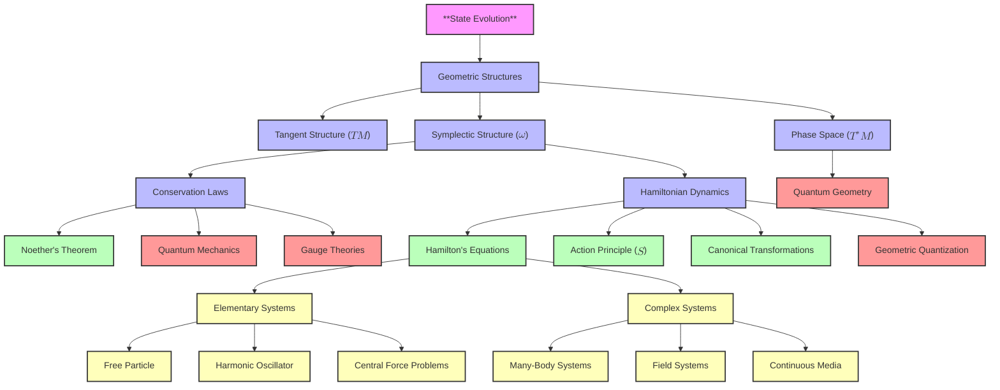

# A Pure Geometric Foundation of Classical Mechanics: From State Evolution to Physical Law
* * *

--- All physical laws are but whispers of geometry in evolution.

# **I. The Pure Origin**

**Epigraph**:
*"In the beginning, there was only change."*

## **I.A. State Evolution as Fundamental Reality**

### **I.A.1 The Primacy of State Evolution**

The universe, at its most fundamental level, is a system of evolving states. Each physical system is defined by its **state**, representing all the information required to describe it at a given moment. Classical mechanics is, at its core, a study of how these states evolve over time and under what conditions this evolution remains consistent and meaningful.

The evolution of states is not arbitrary; it must satisfy two universal requirements:

1. **Determinism**:
   Evolution must map a state uniquely to another state at a future (or past) time. Given the current state of a system, its future trajectory must be entirely predictable. This ensures the continuity and coherence of physical laws.

2. **Reversibility**:
   Evolution must allow backward mapping. Information about the past must be retrievable from the present state. This ensures that no information is lost during the evolution, preserving the integrity of the system.

These two principles impose strict constraints on the nature of state evolution, shaping the mathematical and physical structures that describe reality.

### **I.A.2 State Space: The Foundation of Evolution**

To mathematically describe state evolution, we introduce the concept of **state space** $\mathcal{M}$, the set of all possible states of a system. Each point in $\mathcal{M}$ corresponds to a unique configuration of the system. 

#### **I.A.2.1 Minimal Mathematical Properties of $\mathcal{M}$**  
1. **Smooth Manifold**:
   The state space $\mathcal{M}$ must be a smooth manifold to accommodate the continuous nature of evolution.
   - Smoothness ensures that small changes in the state lead to small changes in evolution, reflecting physical continuity.
   - The dimension of $\mathcal{M}$ corresponds to the degrees of freedom of the system.

2. **Continuous Evolution**:
   State evolution is described by a smooth curve $\gamma(t) \subset \mathcal{M}$, parameterized by time $t$. This curve represents the trajectory of the system through state space.

#### **I.A.2.2 Example**:
- For a single particle moving in three-dimensional space, the state space $\mathcal{M}$ is $\mathbb{R}^3$, representing the particle's position.
- For a pendulum, $\mathcal{M} = S^1$, the circle, representing its angular position.

### **I.A.3 Requirements for Consistent Evolution**

The requirements of determinism and reversibility impose structure on $\mathcal{M}$:

1. **Existence of Flows**:
   State evolution is represented by a vector field $X$ on $\mathcal{M}$, which assigns a direction of change to each point in state space. The flow generated by $X$ determines how states evolve over time.

2. **Preservation of Structure**:
   The mapping of states by the evolution must preserve certain properties of $\mathcal{M}$, ensuring that the system's behavior is consistent and reversible. This requirement leads directly to the emergence of geometry, as explored in the next section.

## **I.B. Emergence of Geometry**

### **I.B.1 Tangent Structure: Motion Requires Direction**

The first geometric structure to emerge from the requirement of continuous evolution is the **tangent space**.

1. **Tangent Vectors and Evolution**:
   At each point $x \in \mathcal{M}$, the possible directions of change are described by the tangent space $T_x\mathcal{M}$. A tangent vector $v \in T_x\mathcal{M}$ represents the rate of change of the system's state at $x$.

2. **Vector Fields**:
   State evolution is governed by a smooth vector field $X$ on $\mathcal{M}$:
   $$
   X: \mathcal{M} \to T\mathcal{M}, \quad X(x) \in T_x\mathcal{M}.
   $$
   The integral curves of $X$ represent the trajectories of the system in state space.

#### **I.B.1.1 Example**:  
For a particle moving along a line, the tangent vector represents its velocity. The vector field $X$ assigns a velocity to each position, describing the particle's motion.

### **I.B.2 Symplectic Structure: Reversibility and Information Preservation**

The requirement of **reversibility**, combined with the preservation of information, imposes additional structure on $\mathcal{M}$, giving rise to the **symplectic structure**.

1. **Phase Space and Cotangent Bundle**:
   - To fully describe a system's state, we must include both its position and its "momentum" (or conjugate variables). This naturally leads to the **phase space** $T^*\mathcal{M}$, the cotangent bundle of $\mathcal{M}$.
   - In phase space, a state is represented by a pair $(q^i, p_i)$, where $q^i$ are generalized coordinates and $p_i$ are their conjugate momenta.

2. **Symplectic Form**:
   The evolution of states in phase space is governed by a **symplectic form** $\omega$, a closed, non-degenerate $2$-form:
   $$
   \omega = \sum_i dp_i \wedge dq^i.
   $$
   - **Non-degeneracy** ensures that $\omega$ pairs each direction in phase space with a unique conjugate direction.
   - **Closedness** ($d\omega = 0$) ensures that the evolution preserves phase space structure, guaranteeing reversibility and conservation of information.

3. **Hamiltonian Evolution**:
   The symplectic structure requires the existence of a **Hamiltonian function** $H: T^*\mathcal{M} \to \mathbb{R}$, which generates the system's evolution. The flow of the system is determined by the Hamiltonian vector field $X_H$, satisfying:
   $$
   \iota_{X_H}\omega = dH.
   $$

#### **I.B.2.1 Example**:  
For a particle in a potential $V(q)$, the Hamiltonian is:
$$
H(q, p) = \frac{p^2}{2m} + V(q).
$$
The symplectic structure ensures that the evolution of $(q, p)$ conserves energy and preserves the phase space volume.

### **I.B.3 Phase Space: The Natural Arena of Evolution**

The combination of **tangent structure** and **symplectic structure** leads naturally to the concept of **phase space**.

1. **Definition of Phase Space**:
   Phase space $T^*\mathcal{M}$ is the cotangent bundle of the state space $\mathcal{M}$. It unifies positions and momenta into a single geometric structure.

2. **Properties of Phase Space**:
   - **Dimensionality**: If $\mathcal{M}$ has $n$ dimensions, $T^*\mathcal{M}$ has $2n$ dimensions.
   - **Canonical Coordinates**: Phase space is equipped with canonical coordinates $(q^i, p_i)$, where $i = 1, \dots, n$.

3. **Role of Phase Space**:
   Phase space provides the natural arena for describing state evolution, with the symplectic form $\omega$ encoding the fundamental geometric structure of the system.

### **I.B.4 Hamiltonian Vector Fields: Generators of Evolution**

The symplectic structure further requires that state evolution be governed by a **Hamiltonian vector field** $X_H$, which generates the flow of the system in phase space.

1. **Hamiltonian Dynamics**:
   The vector field $X_H$ satisfies:
   $$
   \iota_{X_H}\omega = dH,
   $$
   where $H$ is the Hamiltonian function. This equation determines the flow of the system in phase space.

2. **Equations of Motion**:
   In canonical coordinates, the equations of motion are:
   $$
   \dot{q}^i = \frac{\partial H}{\partial p_i}, \quad \dot{p}_i = -\frac{\partial H}{\partial q^i}.
   $$
   These are the **Hamiltonian equations**, which describe the evolution of the system in terms of its position and momentum.

## **I.C. Conclusion**

State evolution, when subjected to the requirements of determinism and reversibility, necessitates the emergence of geometric structures. The tangent structure describes the local directions of motion, while the symplectic structure ensures that evolution preserves information and consistency. Together, these structures define phase space as the natural arena for describing physical systems. The Hamiltonian, as the generator of evolution, completes the framework, establishing a geometric foundation for classical mechanics.

In the next section, we will formalize these structures into a complete **geometric framework**, demonstrating how physical laws emerge naturally as consequences of this unified geometric foundation.

# **II. The Geometric Framework**

**Epigraph**:
*"Space bends to accommodate motion."*

The consistent evolution of states, as outlined in Section I, necessitates the emergence of a geometric framework that governs the behavior of physical systems. This framework is built upon fundamental structures—symplectic geometry, phase space, and conservation laws—that are not merely mathematical conveniences but intrinsic requirements for describing and preserving the nature of state evolution. This section delves into the natural geometric structures that arise and demonstrates how they give rise to the physical laws of classical mechanics.

## **II.A. Natural Geometric Structures**

### **II.A.1. The Symplectic Form: The Foundation of Phase Space**

At the heart of the geometric framework is the **symplectic form** $\omega$, a closed, non-degenerate $2$-form that encodes the structure of phase space $T^*\mathcal{M}$. It provides the mathematical foundation for describing state evolution in classical mechanics.

1. **Definition and Properties**:
   The symplectic form $\omega$ satisfies the following properties:
   - **Non-degeneracy**: For any nonzero tangent vector $v$, there exists a tangent vector $w$ such that $\omega(v, w) \neq 0$. This ensures that the phase space is fully equipped to describe state evolution.
   - **Closedness**: $d\omega = 0$, meaning $\omega$ is preserved under smooth deformations. This guarantees the conservation of phase space structure during evolution.

2. **Canonical Coordinates**:
   Darboux's theorem ensures that, locally, $\omega$ can always be written in the canonical form:
   $$
   \omega = \sum_{i=1}^n dp_i \wedge dq^i,
   $$
   where $(q^i, p_i)$ are generalized position and momentum coordinates. These **canonical coordinates** provide a natural representation of phase space.

3. **Physical Interpretation**:
   - The symplectic form measures the "area" in phase space swept out by a trajectory.
   - It encodes the fundamental relationships between position $q$ and momentum $p$, ensuring their interdependence during evolution.

### **II.A.2. Phase Space: The Arena of State Evolution**

Phase space $T^*\mathcal{M}$, the cotangent bundle of the state space $\mathcal{M}$, provides the natural arena for describing classical mechanics.

1. **Structure of Phase Space**:
   - A point in phase space is represented by $(q^i, p_i)$, where $q^i$ are generalized positions and $p_i$ are their conjugate momenta.
   - The dimensionality of phase space is $2n$, where $n$ is the number of degrees of freedom in the system.

2. **Hamiltonian Flow**:
   State evolution in phase space is governed by the Hamiltonian function $H(q, p)$, which generates the flow of the system. The symplectic form $\omega$ ensures that this flow preserves the structure of phase space.

3. **Preservation of Volume (Liouville’s Theorem)**:
   The symplectic structure guarantees that the flow generated by $H$ preserves the total volume in phase space:
   $$
   \mathcal{L}_{X_H} \omega^n = 0,
   $$
   where $\omega^n$ is the phase space volume form and $\mathcal{L}_{X_H}$ is the Lie derivative along the Hamiltonian vector field $X_H$. This invariance reflects the incompressibility of trajectories in phase space.

### **II.A.3. Poisson Brackets: The Algebra of Observables**

The interplay between the symplectic structure and functions on phase space leads naturally to the concept of **Poisson brackets**, which encode the algebraic relationships between observables.

1. **Definition of Poisson Brackets**:
   For two functions $f, g$ defined on phase space, their Poisson bracket is given by:
   $$
   \{f, g\} = \sum_{i=1}^n \left( \frac{\partial f}{\partial q^i} \frac{\partial g}{\partial p_i} - \frac{\partial f}{\partial p_i} \frac{\partial g}{\partial q^i} \right).
   $$
   The Poisson bracket is antisymmetric, bilinear, and satisfies the Jacobi identity, making it a Lie bracket on the space of observables.

2. **Physical Significance**:
   - The Poisson bracket describes how one observable changes with respect to another under evolution.
   - For the Hamiltonian $H$, the time evolution of an observable $f$ is given by:
     $$
     \frac{df}{dt} = \{f, H\}.
     $$

3. **Connection to Symplectic Geometry**:
   The Poisson bracket reflects the symplectic structure, as it arises directly from the symplectic form $\omega$. It provides a powerful tool for analyzing the dynamics of complex systems.

### **II.A.4. Conservation Laws and Symmetries**

The symplectic structure naturally incorporates the principles of symmetry and conservation, as formalized by Noether’s theorem.

1. **Noether’s Theorem**:
   For every continuous symmetry of the Hamiltonian $H$, there exists a conserved quantity. Symmetries are represented by transformations that preserve the symplectic form $\omega$.

2. **Examples of Conserved Quantities**:
   - **Energy Conservation**: If $H$ is time-independent, the total energy is conserved.
   - **Momentum Conservation**: If $H$ is invariant under spatial translations, the linear momentum is conserved.
   - **Angular Momentum Conservation**: If $H$ is invariant under rotations, the angular momentum is conserved.

3. **Geometric Interpretation**:
   Conserved quantities correspond to invariant submanifolds in phase space. The flow generated by $H$ remains confined to these submanifolds, reflecting the constraints imposed by symmetry.

## **II.B. Physical Laws from Geometry**

The emergence of geometric structures provides the foundation for deriving the physical laws of classical mechanics. These laws are not imposed externally but arise as natural consequences of the symplectic framework.

### **II.B.1. Hamilton’s Equations: The Generator of Evolution**

The symplectic structure and Hamiltonian $H$ together determine the evolution of a system through **Hamilton’s equations**.

1. **Hamiltonian Vector Field**:
   The evolution of a system is governed by the Hamiltonian vector field $X_H$, defined by:
   $$
   \iota_{X_H} \omega = dH,
   $$
   where $\iota_{X_H}$ denotes the interior product of $X_H$ with the symplectic form $\omega$.

2. **Canonical Equations**:
   In canonical coordinates $(q^i, p_i)$, Hamilton’s equations take the familiar form:
   $$
   \dot{q}^i = \frac{\partial H}{\partial p_i}, \quad \dot{p}_i = -\frac{\partial H}{\partial q^i}.
   $$
   These equations describe the time evolution of position and momentum.

3. **Geometric Flow**:
   Hamilton’s equations describe the flow of the system in phase space, ensuring that the symplectic structure is preserved during evolution.

### **II.B.2. The Action Principle: The Variational Foundation**

The **principle of least action** provides an alternative formulation of classical mechanics, rooted in the variational properties of the action functional $S$.

1. **Action Functional**:
   The action $S$ is defined as:
   $$
   S = \int L \, dt,
   $$
   where $L = T - V$ is the Lagrangian. The action measures the "cost" of a trajectory in configuration space.

2. **Variational Principle**:
   The true trajectory of a system extremizes the action $S$, leading to the Euler-Lagrange equations in configuration space or Hamilton’s equations in phase space:
   $$
   \delta S = 0 \implies \iota_{X_H}\omega = dH.
   $$

3. **Connection to Symplectic Geometry**:
   The action principle arises naturally from the symplectic one-form $\theta = \sum_i p_i dq^i$, highlighting its geometric origin.

### **II.B.3. Symmetry and Canonical Transformations**

Canonical transformations are transformations in phase space that preserve the symplectic form $\omega$.

1. **Definition**:
   A transformation $(q, p) \to (Q, P)$ is canonical if:
   $$
   \omega = \sum_i dP_i \wedge dQ^i = \sum_i dp_i \wedge dq^i.
   $$

2. **Physical Significance**:
   - Canonical transformations simplify problems by changing coordinates while preserving the dynamics.
   - They form the foundation for advanced methods, such as action-angle variables in integrable systems.

3. **Conserved Quantities**:
   Symmetries of the Hamiltonian correspond to canonical transformations, leading to conserved quantities through Noether’s theorem.

## **II.C. Conclusion**

The geometric structures of symplectic geometry, phase space, and conservation laws form the foundation of classical mechanics. These structures emerge as necessities for consistent state evolution and give rise naturally to Hamilton’s equations, the action principle, and the conservation of fundamental quantities. By understanding these laws as geometric consequences, we reveal the intrinsic unity of classical mechanics.

In the next section, we will explore how specific physical systems emerge as direct manifestations of this geometric framework, illustrating the power and universality of these principles.

# **III. Physical Systems as Geometric Necessities**

**Epigraph**:
*"From abstract necessity springs concrete existence."*

The mathematical framework derived in Section II provides a universal and elegant description of state evolution. Its power lies in its ability to describe physical systems as natural manifestations of geometric principles. In this section, we demonstrate how elementary and complex physical systems emerge from this framework, revealing that the diversity of physical phenomena is encoded in the simple and universal structures of phase space, symplectic geometry, and Hamiltonian dynamics.

## **III.A. Elementary Systems**

Elementary systems represent the simplest dynamical systems, where the geometry of phase space and the Hamiltonian function directly govern the motion. These systems provide the foundation for understanding more complex dynamics.

### **III.A.1. Free Particle**

The free particle is the most fundamental system, representing motion without external forces.

1. **Hamiltonian**:
   The Hamiltonian for a free particle of mass $m$ is purely kinetic energy:
   $$
   H = \frac{p^2}{2m},
   $$
   where $p$ is the momentum.

2. **Phase Space Trajectories**:
   - The equations of motion derived from Hamilton’s equations are:
     $$
     \dot{q} = \frac{\partial H}{\partial p} = \frac{p}{m}, \quad \dot{p} = -\frac{\partial H}{\partial q} = 0.
     $$
   - The position $q$ evolves linearly with time, and the momentum $p$ remains constant.
   - In phase space, trajectories are straight lines parallel to the $q$-axis, representing uniform motion.

3. **Geometric Interpretation**:
   - The symplectic structure ensures that the phase space volume is preserved, consistent with Liouville’s theorem.
   - The system’s trajectory is a geodesic (straight path) in phase space, reflecting the absence of external forces.

### **III.A.2. Harmonic Oscillator**

The harmonic oscillator describes systems with a quadratic potential, such as springs or small oscillations near equilibrium.

1. **Hamiltonian**:
   The Hamiltonian for a harmonic oscillator is:
   $$
   H = \frac{p^2}{2m} + \frac{kq^2}{2},
   $$
   where $k$ is the spring constant, $q$ is the position, and $p$ is the momentum.

2. **Phase Space Trajectories**:
   - Hamilton’s equations yield:
     $$
     \dot{q} = \frac{\partial H}{\partial p} = \frac{p}{m}, \quad \dot{p} = -\frac{\partial H}{\partial q} = -kq.
     $$
   - The solutions are sinusoidal oscillations:
     $$
     q(t) = A \cos(\omega t + \phi), \quad p(t) = -m\omega A \sin(\omega t + \phi),
     $$
    where $\omega = \sqrt{\frac{k}{m}}$ is the natural frequency.
   - In phase space, trajectories are closed ellipses, reflecting periodic motion.

3. **Geometric Interpretation**:
   - Energy is conserved, and each ellipse corresponds to a constant energy surface.
   - The symplectic structure ensures that the area enclosed by each ellipse remains invariant, consistent with conservation laws.

### **III.A.3. Central Force Problems**

Central force systems describe motion under a potential that depends only on the radial distance $r$.

1. **Hamiltonian**:
   The Hamiltonian for a particle in a central potential $V(r)$ is:
   $$
   H = \frac{p_r^2}{2m} + \frac{L^2}{2mr^2} + V(r),
   $$
   where $p_r$ is the radial momentum, $L = r^2\dot{\theta}$ is the angular momentum (a conserved quantity), and $V(r)$ is the potential.

2. **Kepler Problem**:
   - For gravitational or Coulomb interactions, $V(r) = -\frac{k}{r}$, leading to elliptical orbits (Kepler’s laws).
   - The Hamiltonian dynamics naturally produce conic sections (ellipses, hyperbolas, or parabolas) as trajectories in configuration space.

3. **Geometric Interpretation**:
   - The conserved angular momentum $L$ corresponds to rotational symmetry.
   - The phase space trajectories are confined to a 4-dimensional submanifold due to conserved energy and angular momentum, reducing dimensionality and simplifying analysis.

## **III.B. Complex Systems**

Building upon the principles of elementary systems, complex systems emerge naturally from the same geometric framework. These systems exhibit richer dynamics, including collective behavior, wave phenomena, and continuous deformations.

### **III.B.1. Many-Body Systems**

Many-body systems consist of $N$ interacting particles, where the complexity arises from the interactions.

1. **Phase Space Structure**:
   - The state space is the Cartesian product of individual particle spaces:
     $$
     \mathcal{M} = \prod_{i=1}^N \mathcal{M}_i, \quad \text{dim}(T^*\mathcal{M}) = 6N.
     $$

2. **Hamiltonian**:
   The Hamiltonian includes kinetic and interaction terms:
   $$
   H = \sum_{i=1}^N \frac{p_i^2}{2m_i} + \sum_{i < j} V(r_{ij}),
   $$
   where $r_{ij} = |\mathbf{r}_i - \mathbf{r}_j|$ is the distance between particles.

3. **Emergent Behavior**:
   - Symmetry reduction techniques (e.g., center-of-mass coordinates) simplify the analysis.
   - Collective phenomena, such as normal modes in coupled oscillators, emerge naturally from the symplectic structure.

4. **Geometric Interpretation**:
   - The conservation of total momentum and angular momentum reflects the translational and rotational symmetries of the system.
   - Phase space trajectories reveal emergent collective modes and chaotic dynamics in certain regimes.

### **III.B.2. Field Systems**

Field systems describe the dynamics of fields, such as electromagnetic fields or wave equations, over continuous spacetime.

1. **Configuration Space**:
   - The state space is the space of fields $\phi(x)$ over a spatial domain $M$, with the phase space given by the field and its conjugate momentum $\pi(x)$.

2. **Hamiltonian**:
   The Hamiltonian density governs the dynamics:
   $$
   H = \int_M \left[ \frac{\pi^2}{2} + \frac{1}{2} (\nabla \phi)^2 + V(\phi) \right] d^3x,
   $$
   where $V(\phi)$ is the potential energy density.

3. **Wave Equations**:
   The Hamiltonian formalism leads to field equations like the Klein-Gordon or Maxwell equations, describing the evolution of waves or fields.

4. **Geometric Interpretation**:
   - The symplectic structure extends to infinite dimensions, preserving the phase space structure for field configurations.
   - Conservation laws, such as energy and momentum conservation, arise from symmetries of the Hamiltonian.

### **III.B.3. Continuous Media**

Continuous systems, such as fluids or elastic solids, are described by deformable media with infinite degrees of freedom.

1. **Configuration Space**:
   - The state space is the space of diffeomorphisms $\phi: M \to M$, describing the deformation of the medium.

2. **Hamiltonian Dynamics**:
   - The Hamiltonian includes kinetic energy and elastic or potential energy terms.
   - For fluids, the Euler equations arise naturally from the Hamiltonian framework.

3. **Geometric Interpretation**:
   - The phase space is infinite-dimensional, and the symplectic structure governs the evolution of flow fields.
   - Conservation of vorticity and energy reflects the underlying symmetries of the system.

## **III.C. Conclusion**

Elementary and complex systems alike emerge as natural consequences of the geometric framework developed in Section II. From the simplicity of free particles and harmonic oscillators to the richness of many-body systems and continuous media, the same principles—symplectic geometry, Hamiltonian flow, and conservation laws—govern all physical systems. This universality highlights the profound power of the geometric approach to classical mechanics.

In the next section, we explore how this framework serves as a bridge to modern physics, unifying classical and quantum mechanics and extending to broader theories such as field dynamics and quantum geometry.

# **IV. Deep Unification**

**Epigraph**:
*"All is geometry, geometry is all."*

Classical mechanics, reconstructed as a geometric framework, offers a profound bridge to modern physics. The structures of phase space, symplectic geometry, and conservation laws naturally extend into the quantum domain and beyond, revealing deep connections between seemingly disparate theories. This section explores how the geometric framework of classical mechanics seamlessly integrates with quantum mechanics, gauge theories, and modern physical paradigms, culminating in a unified vision of physical law.

## **IV.A. Classical-Quantum Bridge**

Classical mechanics is not merely a limiting case of quantum mechanics but its geometric precursor. By quantizing the structures of classical phase space, we uncover the mathematical continuity between classical and quantum descriptions of nature.

### **IV.A.1. Geometric Quantization**

Geometric quantization formalizes the transition from classical to quantum mechanics by constructing a quantum framework directly from the symplectic geometry of phase space.

#### **IV.A.1.1 Phase Space Volume Quantization**  
1. **Quantization Condition**:
   The symplectic form $\omega$ defines the volume of phase space. For quantization to occur, the total phase space volume must be discretized in units of $2\pi\hbar$, leading to:
   $$
   [\omega / 2\pi\hbar] \in H^2(M, \mathbb{Z}),
   $$
   where $H^2(M, \mathbb{Z})$ is the second cohomology group of the phase space $M$. This condition ensures that the phase space is compatible with quantum states.

2. **Physical Interpretation**:
   The quantization condition reflects the discrete nature of quantum states. For example, in atomic systems, the quantization of angular momentum and energy levels arises directly from this geometric condition.

#### **IV.A.1.2 Prequantum Line Bundles and Wavefunctions**  
1. **Line Bundles**:
   A prequantum line bundle is constructed over the phase space, with the symplectic form $\omega$ serving as its curvature. This bundle supports the wavefunctions of quantum mechanics as its sections.

2. **Wavefunctions**:
   Quantum states are represented by wavefunctions on the line bundle, where the phase of the wavefunction is determined by the symplectic one-form $\theta = p_i dq^i$. The action $S$ appears as the phase factor in the wavefunction:
   $$
   \psi \sim e^{iS/\hbar}.
   $$

#### **IV.A.1.3 Observables and Commutation Relations**  
1. **Quantum Observables**:
   Classical observables $f(q, p)$ correspond to quantum operators $\hat{f}$, constructed via the Hamiltonian vector fields $X_f$ associated with $f$:
   $$
   \hat{f} = -i\hbar \nabla_{X_f} + f.
   $$
   This operator mapping preserves the geometric structure of phase space.

2. **Commutation Relations**:
   The quantum commutator emerges naturally from the classical Poisson bracket:
   $$
   \{f, g\} \to \frac{1}{i\hbar}[\hat{f}, \hat{g}].
   $$
   This correspondence links the symplectic geometry of classical mechanics to the algebraic structure of quantum mechanics.

### **IV.A.2. Path Integral Formulation**

The path integral formulation of quantum mechanics highlights the deep role of the action $S$ in connecting classical and quantum systems.

1. **Feynman’s Path Integral**:
   The probability amplitude for a quantum system to transition between two states is given by a sum over all possible paths, weighted by the phase factor $e^{iS/\hbar}$:
   $$
   \mathcal{A} \sim \int e^{iS[q]/\hbar} \, \mathcal{D}[q].
   $$
   Here, $S[q]$ is the classical action for each path $q(t)$.

2. **Classical Limit**:
   In the limit $\hbar \to 0$, the dominant contribution to the path integral comes from the path that extremizes $S[q]$. This recovers the classical principle of least action, establishing a direct link between classical and quantum mechanics.

### **IV.A.3. Quantum-Classical Transition**

The geometric framework clarifies the relationship between classical and quantum mechanics:
1. **Coherence**: Classical trajectories are embedded as coherent states in quantum mechanics, preserving the symplectic structure.
2. **Emergence**: Classical mechanics emerges naturally as the limit of quantum mechanics when \(\hbar \to 0\), with the symplectic form $\omega$ remaining unchanged.

## **IV.B. Extensions to Modern Physics**

The geometric framework of classical mechanics extends seamlessly into modern physics, offering profound insights into field dynamics, gauge theories, and quantum geometry.

### **IV.B.1. Gauge Theories and Field Dynamics**

Gauge theories, which describe the fundamental forces of nature, are deeply rooted in symplectic geometry.

1. **Connection Forms as Physical Fields**:
   - The symplectic structure generalizes to gauge theories, where connection forms $A$ represent physical fields (e.g., the electromagnetic potential).
   - The curvature of $A$, given by $F = dA + A \wedge A$, corresponds to the field strength (e.g., the electromagnetic field $F_{\mu\nu}$).

2. **Canonical Quantization of Fields**:
   - The Hamiltonian formalism extends to fields, with phase space defined by field configurations and their conjugate momenta.
   - Symmetries of the gauge fields generate conserved charges, such as electric charge or color charge in quantum chromodynamics (QCD).

3. **Geometric Interpretation**:
   - The symplectic structure governs the dynamics of gauge fields, ensuring consistency with Noether’s theorem and conservation laws.
   - The interplay of symplectic geometry and gauge invariance underpins the Standard Model of particle physics.

### **IV.B.2. Quantum Geometry**

Quantum mechanics and general relativity converge in the study of quantum geometry, where classical spacetime itself becomes a geometric entity subject to quantization.

1. **Non-Commutative Geometry**:
   - Classical phase space is replaced by non-commutative geometry, where coordinates $(x, p)$ satisfy commutation relations:
     $$
     [x, p] = i\hbar.
     $$
   - This framework generalizes quantum mechanics to curved and higher-dimensional spaces.

2. **Quantum Groups**:
   - Symplectic symmetry groups are deformed into quantum groups, which describe symmetry in quantum spacetime.

3. **Geometric Quantization of Spacetime**:
   - The symplectic structure of classical mechanics inspires attempts to quantize spacetime itself, leading to theories of quantum gravity.

### **IV.B.3. Future Directions**

The geometric framework opens pathways to new developments in physics and mathematics, including:

1. **Quantum Gravity**:
   - Symplectic geometry provides a natural foundation for unifying quantum mechanics and general relativity.
   - The phase space of gravity, described by Ashtekar variables, connects classical mechanics to loop quantum gravity.

2. **Information Theory**:
   - The geometric approach reveals deep connections between symplectic structures and entropy, suggesting a link between classical mechanics and the thermodynamics of black holes.

3. **Emergent Phenomena**:
   - Geometric principles may explain emergent phenomena in condensed matter physics, such as topological phases of matter and quantum Hall effects.

## **IV.C. Conclusion**

The geometric framework of classical mechanics serves as a bridge between classical and modern physics, unifying diverse theories under the universal principles of symplectic geometry and state evolution. From the quantization of phase space to the dynamics of gauge fields and the structure of spacetime itself, geometry emerges as the language of physical law. This profound unity not only deepens our understanding of the natural world but also inspires new directions for theoretical and experimental exploration.

In closing, the reconstruction of classical mechanics as a geometric framework reveals that all physical laws are indeed "whispers of geometry in evolution." By listening to these whispers, we uncover the profound unity underlying the fabric of reality.

# **Appendix A: Conceptual Relationships in Classical Mechanics**

To enhance the reader's understanding of the core ideas and their interconnections, we present a diagram that visually organizes the relationships between the key concepts discussed in the document. This conceptual map highlights how fundamental principles lead to geometric structures, which in turn give rise to physical laws, systems, and their extensions into modern physics.

## **A.1. Explanation of the Conceptual Relationships**

This diagram illustrates the logical flow and connections between the core ideas, geometric structures, physical laws, and their implications:

### **A.1.1. Core Idea: State Evolution**
- **State Evolution** is the root of all subsequent structures in classical mechanics. It necessitates **determinism** and **reversibility**, which naturally lead to the emergence of geometric structures.

### **A.1.2. Geometric Structures**
- The **Tangent Structure** ($TM$) captures the local directions of motion, while the **Symplectic Structure** ($\omega$) ensures information preservation and consistency.
- **Phase Space** ($T^*\mathcal{M}$) unifies positions and momenta, serving as the natural arena for describing state evolution.
- These structures underpin **conservation laws** and **Hamiltonian dynamics**, which govern the behavior of physical systems.

### **A.1.3. Physical Laws**
- **Hamilton’s Equations** and the **Action Principle** arise naturally from the symplectic framework, providing the equations of motion for classical systems.
- **Noether’s Theorem** connects symmetries to conserved quantities, while **Canonical Transformations** preserve the symplectic structure, enabling powerful simplifications in mechanics.

### **A.1.4. Physical Systems**
- The geometric framework governs both **elementary systems**, such as free particles, harmonic oscillators, and central force problems, and **complex systems**, such as many-body systems, fields, and continuous media.
- These systems demonstrate how diverse physical phenomena emerge from the same geometric principles.

### **A.1.5. Connections to Modern Physics**
- Classical mechanics serves as the foundation for **quantum mechanics**, with **geometric quantization** bridging the two frameworks.
- The symplectic structure directly extends to **gauge theories**, describing fundamental forces, and to **quantum geometry**, where spacetime itself becomes subject to quantization.

## **A.2. Key Takeaways**

- **Unity of Framework**: The entire structure of classical mechanics, from state evolution to modern extensions, is unified by geometric principles.
- **Emergent Laws**: Physical laws (e.g., Hamilton’s equations, conservation laws) are not imposed externally but emerge naturally from the geometric structure of phase space.
- **Continuity Across Theories**: The framework seamlessly bridges classical mechanics, quantum mechanics, and modern physics, demonstrating the universality of symplectic geometry.

This visual representation reinforces the central theme of the document: **geometry is the language of physical law**, and classical mechanics is its most elegant expression.

