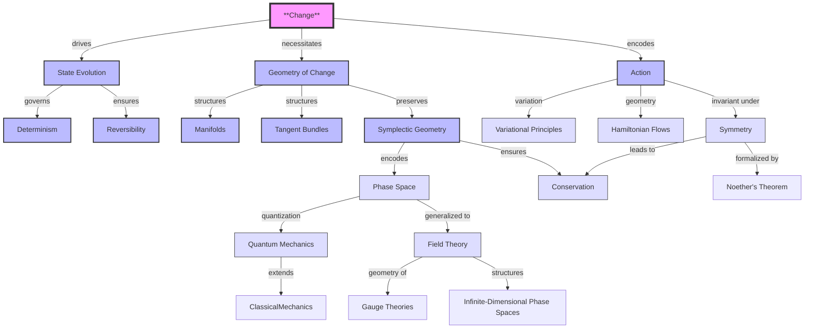

# Classical Mechanics: A Geometric Reconstruction of Change and Symmetry
* * *

--- From the flow of change arises the structure of symmetry.

# **I. Foundations: The Nature of Change**

**Epigraph**: *"In the beginning, there was change. All else follows."*

Classical mechanics begins with a single, undeniable observation: **things change**. At the heart of every physical phenomenon is the evolution of states—a process governed by deep structural principles. By understanding the nature of change, we uncover the geometric structures that form the foundation of classical mechanics. This chapter explores **change** as the most fundamental concept, introduces the state space where change occurs, and derives the geometric structures necessary to describe and preserve this evolution.

## **I.A. The Concept of Change**

**Goal**: Establish change as the foundational concept in classical mechanics. Define the mathematical framework for describing the evolution of states, and derive the principles of determinism and reversibility.

### **I.A.1. State Space: The Arena of Change**

The evolution of a system requires a well-defined mathematical space that contains all its possible states. This "state space" is denoted by $\mathcal{S}$.

- **Definition**:
  The state space $\mathcal{S}$ is the collection of all possible configurations of a system. Each point $s \in \mathcal{S}$ represents a complete description of the system at a given instant.

- **Examples**:
  - For a simple particle in $n$-dimensional space: $\mathcal{S} = \mathbb{R}^n$.
  - For a pendulum: $\mathcal{S} = \{ \text{angle } (\theta), \text{ angular velocity } (\dot{\theta}) \}$.
  - For many-body systems: $\mathcal{S}$ becomes higher-dimensional, encoding the states of all particles.

### **I.A.2. Evolution Operator: The Dynamics of Change**

To describe how a system evolves over time, we introduce the **evolution operator**, $\Phi$, which maps an initial state to its future state. The evolution is parametrized by time $t$.

- **Definition**:
  The evolution operator is a one-parameter family of transformations:
  $$
  \Phi: \mathcal{S} \times \mathbb{R} \to \mathcal{S},
  $$
  such that $s(t) = \Phi(s_0, t)$, where $s_0$ is the initial state of the system.

- **Key Properties**:
  1. **Identity**: At $t = 0$, the state remains unchanged:
     $$
     \Phi(s, 0) = s.
     $$
  2. **Group Property**: The evolution is consistent over time:
     $$
     \Phi(\Phi(s, t_1), t_2) = \Phi(s, t_1 + t_2).
     $$
  3. **Continuity**: Evolution depends smoothly on time $t$:
     $$
     \lim_{h \to 0} \Phi(s, t + h) = \Phi(s, t).
     $$

### **I.A.3. Principles of Change: Determinism and Reversibility**

From the properties of $\Phi$, we derive two critical principles that form the backbone of classical mechanics:

1. **Determinism**:
   The future state of a system is uniquely determined by its current state:
   $$
   s(t_2) = \Phi(s(t_1), t_2 - t_1).
   $$
   This guarantees that the system’s evolution is predictable and well-defined.

2. **Reversibility**:
   Physical evolution must allow for the reconstruction of past states:
   $$
   \Phi(s, -t) = \Phi^{-1}(s, t).
   $$
   This implies that the laws governing evolution are time-symmetric, ensuring no information is lost in the process.

## **I.B. Geometric Structures of Change**

**Goal**: Derive the geometric structures necessary to support consistent state evolution. Show how these structures naturally emerge from the requirements of classical mechanics.

### **I.B.1. Manifold Structure: The Foundation of State Space**

State space $\mathcal{S}$ must be a **smooth manifold** to support the continuity and differentiability of evolution.

- **Definition**:
  A manifold is a mathematical space that locally resembles $\mathbb{R}^n$, allowing for smooth transformations between states.

- **Local Coordinates**:
  Each point in $\mathcal{S}$ has a neighborhood $U$ with a coordinate map:
  $$
  \varphi: U \to \mathbb{R}^n.
  $$
  These coordinates allow us to describe evolution using calculus.

- **Physical Interpretation**:
  - A particle’s position in $\mathbb{R}^3$ is described by three coordinates $(x, y, z)$.
  - For a pendulum, the state space is a cylinder, with coordinates $(\theta, \dot{\theta})$.

### **I.B.2. Tangent and Cotangent Bundles: Describing Velocities and Momenta**

To describe how a system evolves, we need to account for both its position and its rate of change. This requires additional structures:

1. **Tangent Bundle $TM$**:
   The tangent bundle $TM$ is the space of all possible velocities of the system. At each point $s \in \mathcal{S}$, there is a tangent space $T_sM$ that contains all possible velocity vectors.

   - **Example**: For a particle in $\mathbb{R}^3$, the tangent bundle includes both positions $(x, y, z)$ and velocities $(\dot{x}, \dot{y}, \dot{z})$.

2. **Cotangent Bundle $T^*M$**:
   The cotangent bundle $T^*M$ is the space of all possible momenta of the system. At each point $s \in \mathcal{S}$, there is a cotangent space $T_s^*M$ that contains all possible momentum vectors $p$.

   - **Physical Relevance**: The cotangent bundle forms the basis of phase space, where both positions and momenta are treated as fundamental variables.

### **I.B.3. Symplectic Geometry: Preserving Information During Evolution**

Change must preserve the distinctions between states, ensuring no information is lost. This requirement introduces the **symplectic structure**, which encodes the geometry of phase space.

- **Symplectic Form**:
  A symplectic form $\omega$ is a closed, non-degenerate $2$-form that satisfies:
  $$
  \omega \in \Lambda^2(T^*M), \quad d\omega = 0, \quad \omega^n \neq 0.
  $$

- **Canonical Form**:
  In local coordinates $(q^i, p_i)$, the symplectic form takes the canonical form:
  $$
  \omega = \sum dp_i \wedge dq^i.
  $$

- **Physical Interpretation**:
  The symplectic form measures the "area" in phase space, preserving the structure of trajectories during evolution.

### **I.B.4. Hamiltonian Flows: The Dynamics of Change**

The symplectic structure naturally leads to **Hamiltonian flows**, which describe the deterministic evolution of systems in phase space.

- **Hamiltonian Vector Field**:
  For a given energy function $H: \mathcal{S} \to \mathbb{R}$, the Hamiltonian vector field $X_H$ satisfies:
  $$
  \iota_{X_H}\omega = dH,
  $$
  where $\iota_{X_H}$ denotes the interior product.

- **Equations of Motion**:
  The Hamiltonian flow generates the equations of motion:
  $$
  \begin{cases}
  \dot{q}^i = \frac{\partial H}{\partial p_i}, \\
  \dot{p}_i = -\frac{\partial H}{\partial q^i}.
  \end{cases}
  $$

- **Geometric Meaning**:
  Hamiltonian flows preserve the symplectic structure, ensuring that phase space volumes remain constant (Liouville’s theorem).

## **I.C. Connection to Next Section**

By grounding classical mechanics in the concept of change and deriving the geometric structures necessary to describe it, we have established the language and framework for describing physical laws. The next section introduces the **action principle**, which encodes the dynamics of change and bridges geometry with physical systems.

# **II. The Action Principle: A Geometric Perspective**

**Epigraph**: *"Nature’s efficiency is encoded in geometry."*

The action principle is one of the most profound ideas in classical mechanics, uniting the dynamics of physical systems with the geometry of their evolution. Far from being an ad hoc rule, it emerges naturally from the deeper geometric structures of phase space, acting as a bridge between abstract mathematical invariants and physical reality. This chapter explores the action principle as a geometric invariant, derives its variational formulation, and reveals its intimate connection to symmetry and conservation laws.

## **II.A. Action as a Fundamental Geometric Quantity**

**Goal**: Reinterpret the principle of least action as a geometric invariant, emphasizing its connection to the symplectic structure of phase space and its role in defining dynamics.

### **II.A.1. The Action Functional: A Path-Dependent Quantity**

The **action functional** assigns a numerical value to a path describing the evolution of a system. This functional encapsulates the entire dynamics of a system in a single integral.

- **Definition**:
  Let $\gamma: [t_1, t_2] \to M$ represent a path in the state manifold $M$. The action functional is defined as:
  $$
  S[\gamma] = \int_{\gamma} \alpha,
  $$
  where $\alpha$ is a one-form on the extended phase space $\tilde{M} = T^*Q \times \mathbb{R}$.

- **Physical Meaning**:
  $S[\gamma]$ measures the total "cost" or "efficiency" of a system’s evolution along the path $\gamma$. Nature selects the path that minimizes this quantity.

- **Geometric Interpretation**:
  The action is a path integral of the one-form $\alpha$, which encodes the state space’s geometrical properties.

### **II.A.2. Invariance of the Action**

One of the most remarkable properties of the action functional is its **invariance under canonical transformations**.

- **Canonical Transformations**:
  Transformations that preserve the symplectic structure $\omega$. In terms of coordinates $(q, p)$, these transformations leave:
  $$
  \omega = \sum dp_i \wedge dq^i
  $$
  invariant.

- **Action Invariance**:
  The action functional is invariant under these transformations:
  $$
  S[\gamma] = S[\phi(\gamma)],
  $$
  where $\phi$ is a canonical transformation.

- **Why Invariance Matters**:
  This invariance ensures that the equations of motion, derived from $S$, are independent of the choice of coordinates. It reflects the universality of physical laws.

### **II.A.3. Symplectic Structure and Dynamics**

The symplectic geometry of phase space plays a central role in the action principle.

- **Symplectic Form**:
  The symplectic structure $\omega$ is derived from the exterior derivative of the one-form $\alpha$:
  $$
  \omega = -d\alpha.
  $$

- **Dynamics from Symplectic Structure**:
  The symplectic form $\omega$ provides a geometric framework for defining dynamics. Specifically, for any Hamiltonian $H$, the symplectic structure defines a vector field $X_H$ such that:
  $$
  \iota_{X_H} \omega = dH.
  $$
  This equation generates the evolution of the system in phase space, as we will see in the next section.

## **II.B. Variational Principles and Dynamics**

**Goal**: Show how the variation of the action functional yields the equations of motion, bridging the action principle to the geometric structure of classical mechanics.

### **II.B.1. The Principle of Least Action**

The **principle of least action** states that the path a system follows between two states minimizes (or extremizes) the action functional $S[\gamma]$.

- **Mathematical Statement**:
  For all variations $\delta\gamma$ of the path $\gamma$ that preserve the endpoints, the action satisfies:
  $$
  \delta S[\gamma] = 0.
  $$

- **Physical Interpretation**:
  Nature is "efficient," selecting the path that minimizes the action. This principle encodes the deterministic evolution of the system.

### **II.B.2. Euler-Lagrange Equations**

In configuration space, the variation of the action leads to the **Euler-Lagrange equations**.

- **Action in Configuration Space**:
  Let $\gamma(t) = (q^i(t))$ represent a path in configuration space. The action is:
  $$
  S[q] = \int_{t_1}^{t_2} L(q^i, \dot{q}^i, t) \, dt,
  $$
  where $L(q^i, \dot{q}^i, t)$ is the Lagrangian.

- **Variation of the Action**:
  By varying $q^i(t)$ and integrating by parts, we obtain:
  $$
  \delta S[q] = \int_{t_1}^{t_2} \left( \frac{\partial L}{\partial q^i} - \frac{d}{dt} \frac{\partial L}{\partial \dot{q}^i} \right) \delta q^i \, dt.
  $$

- **Euler-Lagrange Equations**:
  The requirement $\delta S[q] = 0$ implies:
  $$
  \frac{\partial L}{\partial q^i} - \frac{d}{dt} \frac{\partial L}{\partial \dot{q}^i} = 0.
  $$

### **II.B.3. Hamilton’s Equations**

In phase space, the action principle leads directly to **Hamilton’s equations**.

- **Hamiltonian Formulation**:
  In phase space, the action functional is written as:
  $$
  S[\gamma] = \int \left( p_i \dot{q}^i - H(q^i, p_i, t) \right) dt.
  $$

- **Variation of the Action**:
  Varying $q^i(t)$ and $p_i(t)$, we obtain:
  $$
  \begin{aligned}
  \dot{q}^i &= \frac{\partial H}{\partial p_i}, \\
  \dot{p}_i &= -\frac{\partial H}{\partial q^i}.
  \end{aligned}
  $$

- **Geometric Interpretation**:
  These equations describe the flow of the system in phase space, governed by the symplectic structure $\omega$.

## **II.C. Symmetry and Conservation**

**Goal**: Establish the fundamental connection between symmetry and conservation laws using Noether’s theorem.

### **II.C.1. Symmetry in Classical Mechanics**

A symmetry is a transformation of the system that leaves the action invariant.

- **Definition**:
  A transformation $\phi: M \to M$ is a symmetry if:
  $$
  S[\phi(\gamma)] = S[\gamma].
  $$

- **Examples**:
  - Time translation invariance → Energy conservation.
  - Space translation invariance → Momentum conservation.
  - Rotational invariance → Angular momentum conservation.

### **II.C.2. Noether’s Theorem**

Noether’s theorem formalizes the connection between symmetries and conservation laws.

- **Statement**:
  For every continuous symmetry of the action, there exists a conserved quantity.

- **Proof Sketch**:
  Consider a one-parameter group of transformations $\phi_\epsilon$ with generator $X$. The invariance of $S$ implies:
  $$
  \mathcal{L}_X \alpha = 0,
  $$
  leading to a conserved quantity $Q_X = i_X \alpha$.

- **Examples of Conserved Quantities**:
  - Time translation → Energy $H = T + V$.
  - Space translation → Momentum $p = m\dot{q}$.
  - Rotation → Angular momentum $L = q \times p$.

### **II.C.3. Conservation and Geometry**

Conserved quantities are encoded geometrically in the moment map $\mu: M \to \mathfrak{g}^*$, where $\mathfrak{g}$ is the Lie algebra of the symmetry group.

- **Momentum Map**:
  For a symmetry group $G$, the moment map satisfies:
  $$
  \{H, \mu(g)\} = 0 \quad \text{for all } g \in \mathfrak{g}.
  $$

- **Conserved Quantities as Flow Invariants**:
  Conservation laws ensure that certain functions remain constant along the symplectic flow.

## **II.D. Connection to Next Section**

The action principle and its symmetries naturally lead to the geometric formulation of physical systems. The next chapter expands on these concepts, showing how configuration space, phase space, and symplectic geometry unify the various classical mechanics formalisms.

# **III. The Unified Geometric Framework**

**Epigraph**: *"The dance of particles is the geometry of space itself."*

Classical mechanics finds its most profound expression in the geometric structures that describe how physical systems evolve. These structures—configuration spaces, phase spaces, symplectic forms, and their associated dynamics—are not just mathematical tools but the essence of the physical laws themselves. This chapter builds on the foundations of change and the action principle to reveal the unified geometric framework underpinning classical mechanics, showing how it naturally encodes the dynamics of physical systems.

## **III.A. Configuration Space and Phase Space**

**Goal**: Develop the geometric structures central to classical mechanics, starting with configuration space and phase space, and introduce symplectic geometry as the foundation for physical evolution.

### **III.A.1. Configuration Space: The Stage of Motion**

The **configuration space** $Q$ represents all possible positions of a system. It is the simplest geometric structure that describes the state of a system without reference to its motion.

- **Definition**:
  Configuration space $Q$ is the manifold of all possible configurations of a system. Each point $q \in Q$ corresponds to a unique arrangement of the system.

- **Examples**:
  - A free particle in 3D space: $Q = \mathbb{R}^3$.
  - A pendulum: $Q = S^1$, the circle of possible angles.
  - A system of $N$ particles: $Q = \mathbb{R}^{3N}$ or $Q = M^N$ if constrained to a manifold $M$.

- **Physical Interpretation**:
  Configuration space serves as the "stage" upon which dynamics unfolds. It encodes the degrees of freedom of the system.

### **III.A.2. Tangent and Cotangent Bundles: From Velocities to Momenta**

To describe motion, we extend configuration space to include velocities and momenta. This leads to the **tangent bundle** $TQ$ and the **cotangent bundle** $T^*Q$.

1. **Tangent Bundle $TQ$**:
   - $TQ$ is the space of all possible velocities of the system. At each point $q \in Q$, the tangent space $T_qQ$ contains all velocity vectors $v$.
   - **Physical Example**: For a particle in $\mathbb{R}^3$, $TQ = \mathbb{R}^3 \times \mathbb{R}^3$, representing positions and velocities $(q, \dot{q})$.

2. **Cotangent Bundle $T^*Q$**:
   - $T^*Q$ is the space of all possible momenta. At each point $q \in Q$, the cotangent space $T_q^*Q$ contains all momentum covectors $p$.
   - **Physical Example**: For a particle in $\mathbb{R}^3$, $T^*Q = \mathbb{R}^3 \times \mathbb{R}^3$, representing positions and momenta $(q, p)$.

- **Phase Space**:
  Phase space is identified with the cotangent bundle $T^*Q$, where both positions $q$ and momenta $p$ are treated as fundamental variables:
  $$
  (q^i, p_i) \in T^*Q.
  $$

### **III.A.3. Symplectic Geometry: The Structure of Phase Space**

The dynamics of classical mechanics are encoded in the symplectic structure of phase space. Symplectic geometry provides the framework for defining and preserving the evolution of physical systems.

- **Symplectic Form**:
  Phase space $T^*Q$ is equipped with a symplectic $2$-form $\omega$, defined locally as:
  $$
  \omega = \sum_{i=1}^n dp_i \wedge dq^i.
  $$
  This form measures the "area" in phase space and governs how trajectories evolve.

- **Key Properties of $\omega$**:
  1. **Non-degeneracy**: $\omega(X, Y) = 0$ for all $Y$ implies $X = 0$.
  2. **Closedness**: $d\omega = 0$, ensuring the preservation of phase space volume.

- **Canonical Coordinates**:
  Darboux’s theorem guarantees that locally, phase space can always be written in terms of canonical coordinates $(q^i, p_i)$ where $\omega = \sum dp_i \wedge dq^i$.

### **III.A.4. Lagrangian Submanifolds: Encoding Physical Systems**

Lagrangian submanifolds are special subspaces of phase space that encode the dynamics of physical systems.

- **Definition**:
  A submanifold $\Lambda \subset T^*Q$ is Lagrangian if:
  $$
  \dim(\Lambda) = n \quad \text{and} \quad \omega|_\Lambda = 0.
  $$

- **Generating Functions**:
  Lagrangian submanifolds can be locally described by generating functions $S(q)$, where:
  $$
  p_i = \frac{\partial S}{\partial q^i}.
  $$

- **Physical Meaning**:
  - Lagrangian submanifolds represent the space of possible trajectories of a system.
  - The action functional $S[q] = \int L \, dt$ generates the dynamics constrained to $\Lambda$.

## **III.B. Dynamics as Geometry**

**Goal**: Reformulate the dynamics of classical mechanics as the geometry of phase space, showing how symplectic flows preserve the structure of phase space and unify different formalisms.

### **III.B.1. Hamiltonian Vector Fields: Generating Dynamics**

The dynamics of a system are governed by a Hamiltonian function $H(q, p)$, which represents the total energy of the system. The Hamiltonian generates a vector field $X_H$ that describes the system’s flow in phase space.

- **Definition**:
  The Hamiltonian vector field $X_H$ satisfies:
  $$
  \iota_{X_H} \omega = dH,
  $$
  where $\iota_{X_H}$ denotes the interior product of $X_H$ with $\omega$.

- **Equations of Motion**:
  In canonical coordinates $(q^i, p_i)$, the Hamiltonian vector field generates the equations of motion:
  $$
  \begin{cases}
  \dot{q}^i = \frac{\partial H}{\partial p_i}, \\
  \dot{p}_i = -\frac{\partial H}{\partial q^i}.
  \end{cases}
  $$

### **III.B.2. Symplectic Flows: Preserving Phase Space Structure**

The evolution of a system in phase space is described by a **symplectic flow**, which preserves the symplectic form $\omega$.

- **Liouville’s Theorem**:
  Symplectic flows preserve the volume of phase space:
  $$
  \mathcal{L}_{X_H} \omega = 0 \quad \implies \quad \frac{d}{dt} \int_\Omega \omega^n = 0.
  $$

- **Physical Meaning**:
  The preservation of phase space volume ensures that the number of possible microstates of the system remains constant over time, connecting classical mechanics to statistical mechanics.

### **III.B.3. Unifying Hamiltonian and Lagrangian Formulations**

The Hamiltonian and Lagrangian formulations of mechanics are unified within the geometric framework of phase space.

- **Lagrangian Mechanics**:
  Dynamics are derived from the action principle in configuration space, with the Lagrangian $L(q^i, \dot{q}^i, t)$.

- **Hamiltonian Mechanics**:
  Dynamics are derived from the Hamiltonian $H(q^i, p_i, t)$ in phase space.

- **Legendre Transform**:
  The Legendre transform connects the two formalisms:
  $$
  H(q^i, p_i) = \sum_i p_i \dot{q}^i - L(q^i, \dot{q}^i).
  $$

## **III.C. Conclusion**

The geometric framework of classical mechanics reveals the deep unity underlying its various formulations. By describing dynamics as symplectic flows in phase space, we see how the preservation of geometric structures governs the evolution of physical systems. This perspective not only unifies the Hamiltonian and Lagrangian approaches but also prepares the ground for extensions to quantum mechanics and modern physics, where geometry continues to play a central role.

# **IV. Modern Extensions and Synthesis**  

**Epigraph**: *"The boundary between classical and quantum is itself a geometric structure."*

The geometric framework of classical mechanics is not just the foundation of classical physics but also the natural precursor to quantum mechanics and modern field theories. This chapter explores how the principles of classical mechanics extend into the quantum domain through geometric quantization and how the same ideas generalize to infinite-dimensional systems, such as fields and gauge theories. These extensions reveal the universality of geometric principles in physics and their role in unifying classical and modern theories.

## **IV.A. The Classical-Quantum Bridge**  

**Goal**: Reveal how quantum mechanics emerges as a natural extension of classical mechanics through the geometric formalism of symplectic structures, quantization, and path integrals.

### **IV.A.1. Geometric Quantization: From Classical to Quantum States**  

The transition from classical to quantum mechanics is encoded in the process of **geometric quantization**, which provides a systematic way to construct quantum systems from classical phase space.

- **Quantization and Symplectic Geometry**:
  Classical mechanics is governed by a symplectic manifold $(M, \omega)$, where $\omega$ encodes the structure of phase space. Quantization introduces a Hilbert space of quantum states $\mathcal{H}$ and operators that act on these states.

- **Prequantization**:
  - Define a complex line bundle $L \to M$ over the phase space $M$ with connection $\nabla$, such that the curvature of $\nabla$ is proportional to the symplectic form:
    $$
    \text{curv}(\nabla) = -\frac{i}{\hbar} \omega.
    $$
  - This ensures that the symplectic structure is "lifted" to the quantum level.

- **Polarization**:
  - A polarization defines a subset of phase space variables (e.g., $q^i$) that are promoted to quantum operators.
  - The wavefunctions $\psi \in \mathcal{H}$ depend only on the selected coordinates, reducing the dimensionality of the quantum system.

- **States and Observables**:
  - Classical observables $f$ on $M$ are promoted to operators $\hat{f}$ acting on $\mathcal{H}$:
    $$
    \hat{f} = -i\hbar \nabla_{X_f} + f,
    $$
    where $X_f$ is the Hamiltonian vector field of $f$.

### **IV.A.2. Correspondence Between Poisson Brackets and Commutators**  

The geometric structure of classical mechanics naturally leads to the algebraic framework of quantum mechanics.

- **Poisson Brackets in Classical Mechanics**:
  The dynamics of classical observables are governed by the Poisson bracket:
  $$
  \{f, g\} = \sum_{i=1}^n \left( \frac{\partial f}{\partial q^i} \frac{\partial g}{\partial p_i} - \frac{\partial f}{\partial p_i} \frac{\partial g}{\partial q^i} \right).
  $$

- **Commutators in Quantum Mechanics**:
  Quantization replaces Poisson brackets with commutators:
  $$
  \{f, g\} \longrightarrow \frac{1}{i\hbar} [\hat{f}, \hat{g}].
  $$

- **Example**:
  For position $\hat{q}$ and momentum $\hat{p}$, the canonical quantization leads to:
  $$
  [\hat{q}, \hat{p}] = i\hbar.
  $$

This correspondence preserves the symplectic structure and ensures the consistency of quantum mechanics as an extension of classical mechanics.

### **IV.A.3. Path Integral Formulation: A Geometric Perspective**  

The path integral formulation of quantum mechanics provides a natural extension of the classical action principle to the quantum domain.

- **Action as a Phase**:
  In the quantum framework, the action $S[\gamma]$ along a path $\gamma$ determines the phase contribution of that path:
  $$
  e^{iS[\gamma]/\hbar}.
  $$

- **Quantum Propagator**:
  The transition amplitude between two states is given by a sum over all possible paths connecting them:
  $$
  K(q_f, t_f; q_i, t_i) = \int_{\text{paths}} e^{iS[\gamma]/\hbar} \mathcal{D}\gamma.
  $$

- **Classical Limit**:
  In the limit $\hbar \to 0$, the dominant contribution to the path integral comes from the classical path that extremizes $S[\gamma]$, recovering classical mechanics:
  $$
  \delta S[\gamma] = 0.
  $$

The path integral formulation highlights the deep connection between classical and quantum mechanics, with the classical action serving as the organizing principle even in the quantum regime.

## **IV.B. From Classical Mechanics to Field Theory**  

**Goal**: Extend the geometric framework of classical mechanics to continuous systems, gauge theories, and modern physics.

### **IV.B.1. Infinite-Dimensional Phase Space and Field Systems**  

Classical mechanics naturally extends to field theory, where the configuration space consists of field configurations rather than discrete particle positions.

- **Configuration Space**:
  For a field $\phi(x)$ defined over spacetime $\Sigma$, the configuration space is:
  $$
  \mathcal{Q} = \{\phi: \Sigma \to V\},
  $$
  where $V$ is the field’s target space (e.g., scalar or vector fields).

- **Phase Space and Symplectic Structure**:
  The phase space is the cotangent bundle $T^*\mathcal{Q}$, with the symplectic form:
  $$
  \omega = \int_\Sigma \delta \pi(x) \wedge \delta \phi(x),
  $$
  where $\pi(x)$ is the conjugate momentum to $\phi(x)$.

- **Field Equations**:
  The dynamics of the field are derived from the action principle, leading to equations like the wave equation or Maxwell’s equations:
  $$
  \frac{\delta S[\phi]}{\delta \phi} = 0.
  $$

### **IV.B.2. Gauge Theories and Geometric Structures**  

Gauge theories, which describe the fundamental forces of nature, emerge naturally within the symplectic framework.

- **Principal Bundles**:
  A gauge theory is defined on a principal bundle $P \to \Sigma$, with a structure group $G$. Connections $A$ on this bundle represent gauge fields.

- **Field Strength and Symplectic Structure**:
  The field strength $F = dA + \frac{1}{2}[A, A]$ determines the curvature of the connection, and the dynamics are governed by an action of the form:
  $$
  S[A] = \int_\Sigma \text{Tr}(F \wedge *F).
  $$

- **Gauge Invariance**:
  The action is invariant under local gauge transformations, leading to conserved currents via Noether’s theorem.

### **IV.B.3. Modern Applications: From Quantum Fields to String Theory**  

The geometric framework extends further to modern theories like quantum field theory (QFT) and string theory.

1. **Quantum Field Theory**:
   - Fields are quantized analogously to particles, with the commutation relations:
     $$
     [\phi(x), \pi(y)] = i\hbar \delta(x-y).
     $$
   - Path integrals are used to compute quantum amplitudes:
     $$
     Z = \int \mathcal{D}\phi \, e^{iS[\phi]/\hbar}.
     $$

2. **String Theory**:
   - Strings replace particles as fundamental objects, with configurations described by maps:
     $$
     X: \Sigma \to M,
     $$
     where $\Sigma$ is the string worldsheet and $M$ is spacetime.
   - The action is a generalization of the particle action:
     $$
     S[X] = \int_\Sigma \sqrt{-\det(\partial_\alpha X^\mu \partial_\beta X_\mu)} \, d^2\sigma.
     $$

3. **Higher-Dimensional Theories**:
   - Geometric frameworks like $n$-plectic geometry and higher gauge theories generalize classical mechanics to describe interactions in higher dimensions.

## **IV.C. Conclusion**  

The extensions of classical mechanics into quantum mechanics and field theory reveal the universality of geometric principles in physics. From the symplectic structure of phase space to the infinite-dimensional geometry of fields, the same foundational ideas govern systems across scales. This unified perspective not only deepens our understanding of classical and quantum systems but also points toward future discoveries in theoretical physics, such as quantum gravity and the geometry of information.

# **Appendix A : Conceptual Relationships in Classical Mechanics**

To help readers quickly grasp the core ideas and their interconnections, we present the relationships between the fundamental concepts of the document. This appendix provides a **relationship table** followed by a diagram, visually summarizing the logical flow and dependencies among the key concepts of classical mechanics.

## **A.1 Table of Relationships**

| **Core Concept**          | **Related Concepts**                                                                                     | **Relationship**                                                                                                                                           | **Mathematical Framework**                                                                                  |
|----------------------------|----------------------------------------------------------------------------------------------------------|-------------------------------------------------------------------------------------------------------------------------------------------------------------|------------------------------------------------------------------------------------------------------------|
| **Change**                | State Evolution, Geometry, Action                                                                       | Change is the fundamental phenomenon that drives state evolution and necessitates geometric structures.                                                     | Transition maps $\Phi(s, t)$ on state space $\mathcal{S}$.                                          |
| **State Evolution**       | Determinism, Reversibility, Geometry                                                                     | State evolution governs how systems progress over time, constrained by determinism and reversibility.                                                       | One-parameter group of transformations $\Phi: \mathcal{S} \times \mathbb{R} \to \mathcal{S}$.          |
| **Geometry of Change**    | Manifolds, Tangent Bundles, Symplectic Geometry                                                          | Geometry provides the structure within which change and evolution are consistently described.                                                               | Smooth manifolds $(\mathcal{S}, \varphi)$, symplectic forms $\omega$.                               |
| **Action**                | Symplectic Geometry, Variational Principles                                                             | The action is a geometric invariant that encodes the dynamics of a system and connects geometry to physical laws.                                            | Action functional $S[\gamma] = \int_{\gamma} \alpha$, where $\alpha$ is a one-form.                 |
| **Symplectic Geometry**   | Phase Space, Hamiltonian Flows, Conservation                                                            | Symplectic geometry encodes the structure of phase space and ensures the preservation of information during evolution.                                        | Canonical symplectic form $\omega = \sum dp_i \wedge dq^i$, Hamiltonian vector fields $X_H$.        |
| **Symmetry**              | Conservation, Noether’s Theorem                                                                         | Symmetries in the action functional lead to conserved quantities, providing a deep link between geometry and physical laws.                                   | Group actions on state space $G \times M \to M$, moment maps $\mu: M \to \mathfrak{g}^*$.           |
| **Conservation**          | Symmetry, Hamiltonian Dynamics                                                                          | Conservation laws (e.g., energy, momentum) arise naturally from symmetries in the physical system.                                                           | Conserved quantities $Q_X$ derived from Noether’s theorem.                                             |
| **Quantum Mechanics**     | Symplectic Geometry, Geometric Quantization, Path Integrals                                             | Quantum mechanics extends classical mechanics by quantizing the symplectic structure and reformulating the action principle.                                 | Poisson brackets $\{f, g\} \to \frac{1}{i\hbar}[\hat{f}, \hat{g}]$, path integrals $e^{iS/\hbar}$.  |
| **Field Theory**          | Infinite-Dimensional Phase Spaces, Gauge Theories, Symplectic Structures                               | Field theory generalizes classical mechanics to systems with infinite degrees of freedom, such as fields and spacetime-dependent quantities.                 | Infinite-dimensional phase space $T^*\mathcal{Q}$, gauge invariance, principal bundles $P \to \Sigma$. |

## **A.2 Conceptual Relationships Diagram**

## **A.3 Key Insights from the Diagram**

1. **Central Role of Change**:
   Change is the root concept driving all other structures in classical mechanics, from state evolution to geometry and action.

2. **Geometry as a Framework**:
   The geometry of state space (manifolds, tangent/cotangent bundles) and phase space (symplectic structure) is essential for encoding the evolution of states.

3. **Action as the Bridge**:
   The action principle connects the geometric framework to dynamics, with variational principles and symplectic flows emerging naturally.

4. **Symmetry and Conservation**:
   Symmetry plays a pivotal role, linking physical invariants (e.g., energy, momentum) to geometry through Noether’s theorem.

5. **Extension to Modern Physics**:
   The classical framework extends seamlessly into quantum mechanics via geometric quantization and into field theory for infinite-dimensional systems like fields and gauge theories.

## **A.4 Concluding Remarks**

This appendix demonstrates the **hierarchical and interconnected nature** of the core concepts in classical mechanics. By understanding these relationships, readers can appreciate how classical mechanics, as reconstructed in this document, forms a **unified geometric framework** that connects change, symmetry, and conservation, while naturally bridging to quantum mechanics and modern field theories. This perspective not only elucidates classical mechanics but also highlights its foundational role in the deeper structure of physics.

