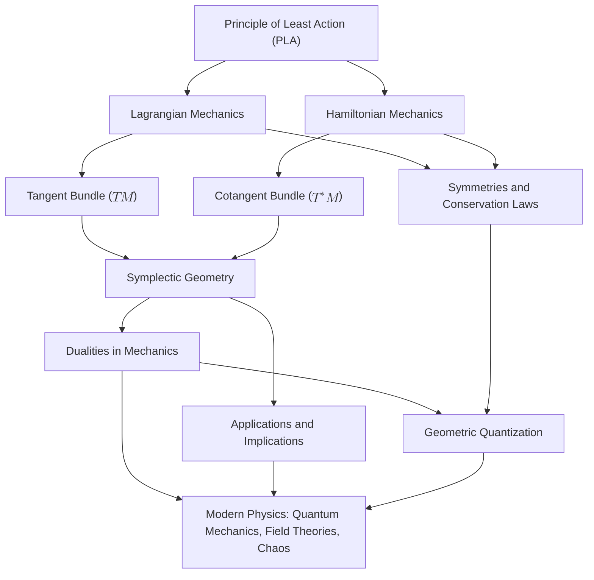

# Reconstructing Classical Mechanics: A Modern Geometric Framework Rooted in the Principle of Least Action
* * *

--- The geometry of mechanics unveils the unity of motion, symmetry, and structure.

# **1. Introduction: The Need for a Geometric Reconstruction**

**Epigraph**:
*"The essence of mathematics lies in its freedom."*
— Georg Cantor

**Why do we need to reconstruct classical mechanics?**
Classical mechanics, one of the oldest and most profound branches of physics, provides the foundation for understanding motion, forces, and the structure of the universe. Its equations describe the orbits of planets, the oscillations of pendulums, and the trajectories of projectiles. Yet, beneath its surface lies a deeper question: **What is the essence of classical mechanics?**

For centuries, classical mechanics has been taught and understood as a collection of frameworks—Newtonian, Lagrangian, and Hamiltonian—each suited to different problems. While these approaches have been immensely successful, they often obscure the unity and elegance that underpins mechanics. Concepts such as forces, energy, and momentum are introduced as separate entities, fragmenting our understanding of the subject. This fragmentation, while practical, can hinder deeper insights into the nature of motion, symmetry, and conservation.

In this chapter, we argue for a **geometric reconstruction of classical mechanics**. By stripping away historical conventions and focusing solely on its intrinsic principles, we aim to uncover the profound geometric structures that unify its various formulations. This reconstruction not only reveals the elegance of classical mechanics but also provides a foundation for extending it into modern physics, including quantum mechanics and field theory.

## **1.1. Historical Development: From Forces to Action**

The evolution of classical mechanics reflects humanity's quest to understand motion and predict natural phenomena.

1. **Newtonian Mechanics**:
   Classical mechanics began with Isaac Newton's **laws of motion**, which introduced the concept of force as the cause of motion. Newton's second law,
   $$
   F = ma,
   $$
   provided a direct, intuitive way to predict the trajectory of particles under the influence of forces. This framework emphasized **local interactions** and was instrumental in explaining planetary motion, pendulums, and collisions.

2. **Lagrangian Mechanics**:
   In the 18th century, Joseph-Louis Lagrange reformulated mechanics by introducing the **Principle of Least Action (PLA)**. Rather than focusing on forces, Lagrange described motion as the path that extremizes a scalar quantity called the **action**. This approach shifted attention from forces to **energy** and revealed deeper connections between motion and symmetry.

3. **Hamiltonian Mechanics**:
   In the 19th century, William Rowan Hamilton expanded on Lagrange's ideas by introducing **Hamiltonian mechanics**, which reformulated motion in terms of positions and momenta in **phase space**. This approach emphasized the geometric structure of mechanics and laid the groundwork for modern physics, including statistical mechanics and quantum mechanics.

Despite these developments, these frameworks were often treated as distinct, with little emphasis on their underlying unity.

## **1.2. The Limitations of Traditional Approaches**

While Newtonian, Lagrangian, and Hamiltonian mechanics each offer unique insights, their traditional formulations suffer from several limitations:

1. **Fragmentation of Concepts**:
   - Forces, energy, and momentum are introduced as separate entities with little connection between them.
   - The transition from Newtonian to Lagrangian to Hamiltonian mechanics is often presented as a historical progression rather than a unified framework.

2. **Local vs. Global Perspectives**:
   - Newtonian mechanics focuses on local interactions (forces) but lacks a global perspective on motion.
   - The global, geometric nature of motion is more apparent in Lagrangian and Hamiltonian mechanics but is often underemphasized in traditional teaching.

3. **Lack of Geometric Intuition**:
   - Traditional approaches rarely highlight the geometric structures, such as **manifolds**, **tangent bundles**, and **symplectic forms**, that provide a natural language for mechanics.
   - This lack of geometric perspective obscures the connections between classical mechanics and modern physics.

4. **Missed Opportunities for Unification**:
   - Symmetry, conservation laws, and variational principles are often treated as separate topics rather than aspects of a unified framework.
   - The Principle of Least Action, while central to mechanics, is often presented as just another tool rather than the cornerstone of the subject.

These limitations suggest the need for a fresh perspective—one that emphasizes the unity of mechanics and its geometric essence.

## **1.3. The Geometric Perspective: Mechanics as Geometry**

In modern mathematics and physics, geometry has emerged as the natural language for describing physical systems. Classical mechanics, too, finds its most profound expression in **geometric structures**.

1. **Manifolds and State Space**:
   - The motion of a system can be described as a curve on a **manifold** (the state space).
   - For example, the configuration of a pendulum can be represented as a point on a circle $S^1$, while its state (position and velocity) lies on the **tangent bundle** $TS^1$.

2. **Phase Space and Symplectic Geometry**:
   - The true nature of classical mechanics emerges in **phase space**, where positions and momenta form a symplectic manifold.
   - The **symplectic structure** encodes the fundamental relationships between position, momentum, and energy, ensuring the preservation of information during evolution.

3. **Action as a Geometric Quantity**:
   - The **action functional**, central to the Principle of Least Action, is a geometric object. It assigns a scalar value to paths in configuration space, revealing the natural efficiency of motion.

By adopting this geometric perspective, classical mechanics can be reconstructed as a unified framework, where motion, symmetry, and conservation emerge naturally from the underlying geometry.

## **1.4. Objectives of This Reconstruction**

The goal of this document is to systematically reconstruct classical mechanics using modern geometric insights. Specifically, we aim to:

1. **Unify Classical Mechanics**:
   - Show that Newtonian, Lagrangian, and Hamiltonian mechanics are not separate frameworks but different manifestations of the same geometric principles.

2. **Reveal the Role of Geometry**:
   - Demonstrate that mechanics is fundamentally about the geometry of motion on manifolds and in phase space.
   - Highlight the importance of tangent and cotangent bundles, symplectic geometry, and variational principles.

3. **Emphasize Symmetry and Conservation**:
   - Use Noether’s theorem to show how symmetries lead to conservation laws.
   - Explore the deep connection between symmetry, geometry, and the Principle of Least Action.

4. **Bridge to Modern Physics**:
   - Illustrate how classical mechanics provides the foundation for quantum mechanics, field theory, and general relativity.
   - Show that the geometric reconstruction of classical mechanics opens pathways for exploring new physical theories.

## **1.5. Connection to the Next Section**

This introduction sets the stage for the systematic development of classical mechanics. In the next chapter, we begin with the **Principle of Least Action**, which serves as the cornerstone of this reconstruction. By deriving the Euler-Lagrange equations and exploring the variational nature of action, we will lay the foundation for the geometric framework that unifies Lagrangian and Hamiltonian mechanics.

## **1.6. Conclusion**

Classical mechanics, when viewed through the lens of geometry, is not merely a collection of empirical laws but a profound description of motion, symmetry, and invariance. By reconstructing mechanics from its intrinsic principles, we gain not only a deeper understanding of its nature but also a powerful framework for exploring the frontier of physics and mathematics.

# **2. The Principle of Least Action: Foundations of Variational Mechanics**

**Epigraph**:
*"Action is the foundational key to all success."*
— Pablo Picasso

The **Principle of Least Action (PLA)** is the cornerstone of classical mechanics. It provides a unifying framework that connects motion, symmetry, and conservation laws. Unlike the force-centric view of Newtonian mechanics, PLA offers a global, variational perspective: **the motion of a system is determined by the path that extremizes a scalar quantity called the action.** This chapter explores the historical origins, mathematical structure, and profound implications of the Principle of Least Action, establishing it as the foundation for understanding the dynamics of physical systems.

## **2.1. Historical Origins of the Principle of Least Action**

The concept of action has a deep historical lineage, rooted in the quest to understand nature's efficiency.

1. **Fermat’s Principle of Least Time**:
   In the 17th century, Pierre de Fermat proposed that light travels along the path that minimizes the time taken. This idea of extremal principles hinted at a broader framework that applies to all motion.

2. **Maupertuis and the Principle of Least Action**:
   Pierre-Louis Maupertuis introduced the term "action" in the 18th century, suggesting that nature operates with economy. He proposed that the true path of a system minimizes the action, a concept he viewed as a universal law of nature.

3. **Lagrange and Hamilton**:
   Joseph-Louis Lagrange formalized the Principle of Least Action mathematically, introducing the **Lagrangian formalism** based on energy considerations. Later, William Rowan Hamilton reformulated mechanics in terms of the **Hamiltonian formalism**, extending the principle into phase space and uncovering its connection to broader geometric structures.

4. **Modern Perspective**:
   Today, PLA is recognized as the unifying principle underlying classical mechanics, quantum mechanics, and field theory. It connects diverse phenomena through its variational nature and reveals the intrinsic efficiency of natural processes.

## **2.2. The Action Functional**

At the heart of PLA is the **action functional**, a scalar quantity that encodes the dynamics of a system.

1. **Definition**:
   The action $S[q]$ is defined as the integral of the **Lagrangian** $L(q, \dot{q}, t)$ over time:
   $$
   S[q] = \int_{t_1}^{t_2} L(q, \dot{q}, t) \, dt,
   $$
   where:
   - $q$ represents the generalized coordinates of the system.
   - $\dot{q} = \frac{dq}{dt}$ is the generalized velocity.
   - $L(q, \dot{q}, t) = T - V$ is the Lagrangian, defined as the difference between the kinetic energy $T$ and the potential energy $V$.

2. **Physical Interpretation**:
   - The action $S[q]$ measures the "cost" of a particular trajectory $q(t)$.
   - Nature selects the path that minimizes (or extremizes) this cost, reflecting its intrinsic economy.

3. **Path Dependence**:
   - The action functional depends on the entire path $q(t)$ taken by the system, not just its endpoints.
   - This global perspective distinguishes PLA from the local, force-based approach of Newtonian mechanics.

## **2.3. Variational Principles and the Euler-Lagrange Equations**

The Principle of Least Action is a **variational principle**, meaning that the true path of a system extremizes the action functional.

1. **The Variational Problem**:
   Consider a family of paths $q(t)$ connecting two fixed points $q(t_1) = q_1$ and $q(t_2) = q_2$. The true path $q(t)$ satisfies:
   $$
   \delta S[q] = 0,
   $$
   where $\delta S[q]$ represents the variation of the action.

2. **Derivation of the Euler-Lagrange Equations**:
   By substituting $S[q] = \int_{t_1}^{t_2} L(q, \dot{q}, t) \, dt$ and performing a variation, we obtain:
   $$
   \delta S[q] = \int_{t_1}^{t_2} \left( \frac{\partial L}{\partial q} - \frac{d}{dt} \frac{\partial L}{\partial \dot{q}} \right) \delta q \, dt.
   $$
   For the variation to vanish for all $\delta q$, the term in parentheses must equal zero. Thus, the **Euler-Lagrange equations** are:
   $$
   \frac{d}{dt} \frac{\partial L}{\partial \dot{q}^i} - \frac{\partial L}{\partial q^i} = 0.
   $$

3. **Geometric Meaning**:
   - The Euler-Lagrange equations describe the stationary paths of the action functional.
   - These equations are the equations of motion for the system, connecting the variational principle to dynamics.

## **2.4. Philosophical Implications: Efficiency and Symmetry**

The Principle of Least Action has profound philosophical implications, revealing nature's inherent efficiency and symmetry.

1. **Natural Efficiency**:
   - PLA captures the idea that nature operates with economy, favoring paths that minimize "effort" or "cost."
   - This principle is consistent with the broader notion of optimality in physics, from Fermat's principle in optics to geodesics in general relativity.

2. **Symmetry and Conservation**:
   - PLA naturally incorporates symmetries, as variations that respect a system's symmetry do not change the action.
   - Noether's theorem formalizes this connection, showing that every symmetry of the action corresponds to a conserved quantity (e.g., energy, momentum, angular momentum).

3. **Global Perspective**:
   - Unlike Newtonian mechanics, which focuses on local forces, PLA provides a global view of motion.
   - This perspective unifies diverse physical phenomena under a single, elegant principle.

## **2.5. Connection to Modern Physics**

The Principle of Least Action extends far beyond classical mechanics, serving as the foundation for modern physics.

1. **Quantum Mechanics**:
   - In quantum mechanics, PLA manifests in the **path integral formulation**. The probability amplitude for a quantum system is given by a sum over all possible paths, weighted by $e^{iS[q]/\hbar}$, where $S[q]$ is the classical action.

2. **Field Theory**:
   - In classical and quantum field theory, PLA governs the dynamics of fields, with the action functional generalized to integrals over spacetime.
   - For example, the Maxwell equations for electromagnetism arise from extremizing the action:
     $$
     S[A_\mu] = \int F^{\mu\nu}F_{\mu\nu} \, d^4x,
     $$
     where $F_{\mu\nu}$ is the electromagnetic field tensor.

3. **General Relativity**:
   - Einstein's field equations derive from the Einstein-Hilbert action, which extremizes the curvature of spacetime:
     $$
     S[g] = \int R \sqrt{-g} \, d^4x,
     $$
     where $R$ is the Ricci scalar and $g$ is the metric determinant.

## **2.6. Connection to the Next Section**

The Principle of Least Action provides the foundation for the geometric reconstruction of classical mechanics. In the next chapter, we explore **Lagrangian mechanics**, which emerges naturally from PLA when viewed on the tangent bundle of configuration space. By developing the Lagrangian framework, we will see how the action functional encodes the dynamics of motion and leads to deeper insights into symmetry and conservation.

## **2.7. Conclusion**

The Principle of Least Action is more than a mathematical tool—it is a profound statement about the nature of motion and the structure of physical laws. By extremizing the action, systems reveal their most efficient paths, connecting motion to symmetry, conservation, and geometry. This principle not only unifies classical mechanics but also forms the bridge to modern physics, providing a universal framework for understanding the dynamics of nature.

# **3. Lagrangian Mechanics: Motion on the Tangent Bundle**

**Epigraph**:
*"Action is the bridge between motion and geometry."*
— Anonymous

The Lagrangian formulation of classical mechanics reveals the deep connection between motion and geometry. It is rooted in the **Principle of Least Action** and provides a framework that unifies the dynamics of physical systems by focusing on energy rather than forces. Central to this formulation is the **tangent bundle**, a geometric structure that encodes both the positions and velocities of a system. This chapter explores the geometric interpretation of Lagrangian mechanics, its treatment of constraints, and the symmetries that lead to conservation laws.

## **3.1. Configuration Space and the Tangent Bundle**

The motion of a mechanical system is naturally described in terms of its **configuration space** and its **tangent bundle**.

1. **Configuration Space ($M$)**:
   The configuration space $M$ is the set of all possible positions of a system. Each point $q \in M$ represents a unique configuration.
   - **Examples**:
     - A particle in 3D space: $M = \mathbb{R}^3$.
     - A pendulum: $M = S^1$, representing the angular position of the pendulum.
     - A double pendulum: $M = S^1 \times S^1$, representing the angles of the two pendulums.

2. **Tangent Bundle ($TM$)**:
   To describe motion, we need both the position $q \in M$ and the velocity $\dot{q} \in T_qM$. The **tangent bundle** $TM$ is the space of all possible positions and velocities.
   - Locally, $TM$ is represented by coordinates $(q^i, \dot{q}^i)$, where $q^i$ are the generalized coordinates and $\dot{q}^i$ are the generalized velocities.
   - **Physical Example**: For a particle in 3D, $TM = \mathbb{R}^3 \times \mathbb{R}^3$, where $q = (x, y, z)$ and $\dot{q} = (\dot{x}, \dot{y}, \dot{z})$.

3. **Geometric Interpretation**:
   The tangent bundle $TM$ serves as the natural stage for describing the motion of systems. A trajectory of the system corresponds to a curve $\gamma(t) = (q(t), \dot{q}(t))$ in $TM$.

## **3.2. The Lagrangian as a Function on the Tangent Bundle**

The dynamics of a system are encoded in the **Lagrangian** $L(q, \dot{q}, t)$, a scalar function defined on the tangent bundle $TM$.

1. **Definition of the Lagrangian**:
   The Lagrangian is defined as the difference between the system's **kinetic energy** $T$ and **potential energy** $V$:
   $$
   L(q, \dot{q}, t) = T(q, \dot{q}) - V(q, t).
   $$

2. **Energy Interpretation**:
   - The **kinetic energy** $T$ depends on the velocities $\dot{q}$. For example, for a particle of mass $m$ in 3D:
     $$
     T = \frac{1}{2} m \|\dot{q}\|^2 = \frac{1}{2} m (\dot{x}^2 + \dot{y}^2 + \dot{z}^2).
     $$
   - The **potential energy** $V$ depends on the position $q$. For example, for a particle in a gravitational field:
     $$
     V = m g z,
     $$
    where $z$ is the height above a reference point.

3. **Role in Dynamics**:
   The Lagrangian $L(q, \dot{q}, t)$ determines the equations of motion through the **Principle of Least Action**, as shown in Chapter 2.

## **3.3. Generalized Coordinates and Constraints**

Lagrangian mechanics excels in systems with **constraints**, where the motion is restricted to specific configurations or paths.

1. **Generalized Coordinates**:
   - Lagrangian mechanics uses **generalized coordinates** $q^i$ to describe motion, which need not correspond to Cartesian coordinates.
   - For example, a pendulum's position is naturally described by its angle $\theta$, not by Cartesian coordinates.

2. **Holonomic Constraints**:
   A **holonomic constraint** is a constraint that can be expressed as a function of the coordinates $q^i$ and time:
   $$
   f(q^i, t) = 0.
   $$
   - Example: A particle constrained to move on a sphere satisfies $x^2 + y^2 + z^2 = R^2$.

3. **Treatment of Constraints**:
   Constraints reduce the number of independent degrees of freedom, simplifying the equations of motion. Lagrange multipliers can be used to handle constraints systematically.
   - For example, for a particle constrained to a surface, the constraint force can be incorporated into the equations of motion using a multiplier $\lambda$:
     $$
     \frac{d}{dt} \frac{\partial L}{\partial \dot{q}^i} - \frac{\partial L}{\partial q^i} = \lambda \frac{\partial f}{\partial q^i}.
     $$

## **3.4. Symmetries and Conservation Laws: Noether’s Theorem**

One of the most profound results in Lagrangian mechanics is **Noether’s theorem**, which connects symmetries to conservation laws.

1. **Statement of Noether’s Theorem**:
   For every continuous symmetry of the Lagrangian $L(q, \dot{q}, t)$, there exists a corresponding conserved quantity.

2. **Examples of Symmetries and Conserved Quantities**:
   - **Time Translation Symmetry**: If $L$ does not explicitly depend on time $t$, the total energy $E = T + V$ is conserved.
   - **Space Translation Symmetry**: If $L$ is invariant under spatial translations, the linear momentum $p = m\dot{q}$ is conserved.
   - **Rotational Symmetry**: If $L$ is invariant under rotations, the angular momentum $L = q \times p$ is conserved.

3. **Geometric Interpretation**:
   Symmetries correspond to invariances of the action under transformations. Conserved quantities are geometric invariants of the system's trajectory in the tangent bundle.

## **3.5. Examples**

1. **Simple Harmonic Oscillator**:
   - **Lagrangian**:
     $$
     L = \frac{1}{2} m \dot{x}^2 - \frac{1}{2} k x^2,
     $$
    where $m$ is the mass and $k$ is the spring constant.
   - **Equations of Motion**:
    From the Euler-Lagrange equation:
     $$
     m \ddot{x} + k x = 0.
     $$

2. **Particle in a Gravitational Field**:
   - **Lagrangian**:
     $$
     L = \frac{1}{2} m (\dot{x}^2 + \dot{y}^2 + \dot{z}^2) - m g z.
     $$
   - **Equations of Motion**:
    The Euler-Lagrange equations yield:
     $$
     m \ddot{z} = -m g, \quad \ddot{x} = 0, \quad \ddot{y} = 0.
     $$

## **3.6. Connection to the Next Section**

Lagrangian mechanics, formulated on the tangent bundle $TM$, provides a powerful framework for describing motion in terms of energy and symmetry. However, this perspective is incomplete without considering the dual picture: **Hamiltonian mechanics**, formulated on the cotangent bundle $T^*M$. The transition from Lagrangian to Hamiltonian mechanics is achieved through the **Legendre transformation**, which we explore in the next chapter.

## **3.7. Conclusion**

Lagrangian mechanics reveals the profound connection between motion and geometry, with the tangent bundle $TM$ serving as the natural stage for describing dynamics. By encoding the system's kinetic and potential energy in the Lagrangian $L(q, \dot{q}, t)$, this framework unifies the treatment of constraints, symmetries, and conservation laws. Through Noether’s theorem, Lagrangian mechanics highlights the inseparable link between symmetry and invariance, setting the stage for the dual perspective of Hamiltonian mechanics.

# **4. Legendre Transformation and Hamiltonian Mechanics**

**Epigraph**:
*"In every duality, there is a hidden unity."*
— Anonymous

The transition from Lagrangian mechanics to Hamiltonian mechanics represents a profound shift in perspective, one that highlights the interplay between energy, geometry, and duality. At the heart of this transition lies the **Legendre transformation**, a mathematical tool that bridges the configuration-velocity description of the Lagrangian framework with the position-momentum description of Hamiltonian mechanics. By reformulating dynamics on the **cotangent bundle** $T^*M$, Hamiltonian mechanics provides a geometric framework that reveals the symplectic structure underlying classical mechanics and sets the stage for its extension to modern physics.

## **4.1. The Legendre Transformation: Bridging Two Frameworks**

To transition from Lagrangian mechanics to Hamiltonian mechanics, we use the **Legendre transformation**, which maps velocities ($\dot{q}$) in the tangent bundle ($TM$) to momenta ($p$) in the cotangent bundle ($T^*M$).

1. **Definition of the Legendre Transformation**:
   Given a Lagrangian $L(q, \dot{q}, t)$, the **generalized momentum** $p_i$ conjugate to the coordinate $q^i$ is defined as:
   $$
   p_i = \frac{\partial L}{\partial \dot{q}^i}.
   $$
   This equation relates the velocities $\dot{q}^i$ to the momenta $p_i$, effectively re-expressing the dynamics in terms of $q^i$ and $p_i$.

2. **Hamiltonian Function**:
   The **Hamiltonian** $H(q, p, t)$ is defined as the Legendre transform of the Lagrangian:
   $$
   H(q, p, t) = \sum_i p_i \dot{q}^i - L(q, \dot{q}, t),
   $$
   where $\dot{q}^i$ is expressed in terms of $q^i$ and $p_i$ using the relation $p_i = \frac{\partial L}{\partial \dot{q}^i}$.

3. **Physical Interpretation**:
   - The Hamiltonian $H(q, p, t)$ typically represents the **total energy** of the system, with $H = T + V$ for many systems.
   - While the Lagrangian encodes the difference between kinetic and potential energy ($L = T - V$), the Hamiltonian provides a more symmetric view, treating position and momentum as dual variables.

## **4.2. Hamiltonian Mechanics on the Cotangent Bundle**

The reformulation of mechanics in terms of the Hamiltonian occurs naturally on the **cotangent bundle** $T^*M$, the space of all possible positions $q$ and momenta $p$.

1. **Cotangent Bundle ($T^*M$)**:
   - The cotangent bundle $T^*M$ is the dual space to the tangent bundle $TM$.
   - Each point in $T^*M$ is specified by a pair $(q^i, p_i)$, where $q^i$ are generalized coordinates and $p_i$ are their conjugate momenta.

2. **Canonical Coordinates**:
   The coordinates $(q^i, p_i)$ are called **canonical coordinates** because they naturally arise from the symplectic structure of phase space.

3. **Hamilton’s Equations**:
   The dynamics of a system in Hamiltonian mechanics are governed by **Hamilton’s equations**:
   $$
   \dot{q}^i = \frac{\partial H}{\partial p_i}, \quad \dot{p}_i = -\frac{\partial H}{\partial q^i}.
   $$
   These first-order differential equations describe the evolution of the system in phase space.

4. **Geometric Interpretation**:
   - Hamilton’s equations describe the flow of the system in phase space $(q, p)$.
   - The Hamiltonian $H(q, p, t)$ generates the dynamics, analogous to how the Lagrangian generates dynamics in configuration space.

## **4.3. Symplectic Structure on Phase Space**

Hamiltonian mechanics is deeply rooted in the **symplectic geometry** of phase space, which provides a geometric framework for understanding its fundamental structure.

1. **Symplectic Form**:
   The cotangent bundle $T^*M$ is equipped with a **symplectic form** $\omega$, which encodes the geometric structure of phase space. In canonical coordinates $(q^i, p_i)$, the symplectic form is given by:
   $$
   \omega = \sum_i dp_i \wedge dq^i.
   $$
   This $2$-form measures the "area" in phase space and governs the structure of Hamiltonian flows.

2. **Properties of the Symplectic Form**:
   - **Non-degeneracy**: The symplectic form is non-degenerate, ensuring that the phase space dynamics are fully determined.
   - **Closedness**: The symplectic form satisfies $d\omega = 0$, a property that underlies the conservation of phase space volume (Liouville’s theorem).

3. **Geometric Meaning**:
   - The symplectic form provides a natural framework for defining canonical transformations, which preserve the structure of phase space.
   - In Hamiltonian mechanics, the symplectic form ensures that the evolution of the system is consistent with the conservation of energy and other invariants.

## **4.4. Examples of Hamiltonian Systems**

1. **Simple Harmonic Oscillator**:
   - **Lagrangian**:
     $$
     L = \frac{1}{2}m\dot{x}^2 - \frac{1}{2}kx^2.
     $$
   - **Generalized Momentum**:
     $$
     p = m\dot{x}.
     $$
   - **Hamiltonian**:
    Substituting $p = m\dot{x}$ into the Hamiltonian definition:
     $$
     H = \frac{p^2}{2m} + \frac{1}{2}kx^2.
     $$
   - **Hamilton’s Equations**:
     $$
     \dot{x} = \frac{\partial H}{\partial p} = \frac{p}{m}, \quad \dot{p} = -\frac{\partial H}{\partial x} = -kx.
     $$

2. **Particle in a Gravitational Field**:
   - **Lagrangian**:
     $$
     L = \frac{1}{2}m\dot{z}^2 - mgz.
     $$
   - **Generalized Momentum**:
     $$
     p_z = m\dot{z}.
     $$
   - **Hamiltonian**:
     $$
     H = \frac{p_z^2}{2m} + mgz.
     $$
   - **Hamilton’s Equations**:
     $$
     \dot{z} = \frac{\partial H}{\partial p_z} = \frac{p_z}{m}, \quad \dot{p}_z = -\frac{\partial H}{\partial z} = -mg.
     $$

## **4.5. Connection to the Next Section**

Hamiltonian mechanics, formulated on the cotangent bundle $T^*M$, provides a powerful dual perspective to Lagrangian mechanics. By emphasizing the symplectic structure of phase space, it highlights the geometric foundations of classical mechanics and connects naturally to modern topics such as quantum mechanics and geometric quantization. The next chapter delves deeper into the **symplectic geometry** of phase space, exploring how this structure governs the dynamics of Hamiltonian systems and their conserved quantities.

## **4.6. Conclusion**

The Legendre transformation and Hamiltonian mechanics reveal the duality between configuration space and phase space, bridging the Lagrangian and Hamiltonian formulations of classical mechanics. By reformulating dynamics on the cotangent bundle $T^*M$, Hamiltonian mechanics emphasizes the symplectic structure of phase space, providing a geometric framework that unifies motion, symmetry, and conservation. This dual perspective not only deepens our understanding of classical mechanics but also serves as a foundation for exploring its extensions into quantum mechanics and modern field theory.

# **5. Symplectic Geometry: The Language of Hamiltonian Systems**

**Epigraph**:
*"Geometry is not true, it is advantageous."*
— Robert M. Pirsig

Symplectic geometry lies at the heart of Hamiltonian mechanics, offering a unified and elegant framework for understanding the structure of phase space and the dynamics of systems. By defining a geometric language that encodes the interplay between position and momentum, symplectic geometry captures the intrinsic properties of Hamiltonian systems, including conservation laws, invariants, and the dynamics of motion. This chapter introduces the fundamental concepts of symplectic manifolds, explores their properties, and demonstrates how they form the backbone of classical mechanics.

## **5.1. Definition of Symplectic Manifolds**

A **symplectic manifold** is a mathematical structure that provides the natural setting for Hamiltonian mechanics.

1. **Symplectic Manifold**:
   A symplectic manifold is a smooth manifold $M$ equipped with a **symplectic form** $\omega$, a closed, non-degenerate $2$-form:
   $$
   \omega \in \Omega^2(M), \quad d\omega = 0, \quad \text{and } \omega(X, Y) \neq 0 \text{ for all } X, Y \neq 0.
   $$

2. **Canonical Example**:
   The cotangent bundle $T^*M$ of a configuration space $M$ is a symplectic manifold, with the canonical symplectic form:
   $$
   \omega = \sum_i dp_i \wedge dq^i,
   $$
   where $(q^i, p_i)$ are the canonical coordinates of the phase space.

3. **Physical Interpretation**:
   - The symplectic form $\omega$ encodes the geometric structure of phase space, describing the relationships between positions $q$ and momenta $p$.
   - It defines the "area" in phase space, governing how trajectories evolve under Hamiltonian dynamics.

## **5.2. Properties of the Symplectic Form**

The symplectic form $\omega$ possesses several key properties that are critical to the structure and behavior of Hamiltonian systems.

1. **Closedness**:
   The condition $d\omega = 0$ ensures that the symplectic form is conserved under smooth deformations. This property underpins many invariants in Hamiltonian mechanics, including Liouville's theorem.

2. **Non-Degeneracy**:
   The non-degeneracy of $\omega$ implies that each vector field $X$ in phase space has a unique conjugate $Y$. This ensures that the equations of motion are well-defined and that the phase space dynamics are fully determined.

3. **Volume Preservation (Liouville’s Theorem)**:
   The symplectic form defines a natural volume element in phase space:
   $$
   \Omega = \omega^n,
   $$
   where $n = \dim(M)/2$. Liouville's theorem states that Hamiltonian flows preserve this volume:
   $$
   \mathcal{L}_H \Omega = 0,
   $$
   where $\mathcal{L}_H$ is the Lie derivative along the Hamiltonian vector field. This conservation of phase space volume reflects the incompressibility of trajectories under Hamiltonian evolution.

## **5.3. Symplectic Invariants and Conserved Quantities**

Symplectic geometry provides a natural framework for understanding conserved quantities and symmetries in Hamiltonian systems.

1. **Conserved Quantities**:
   - A function $f(q, p)$ is conserved if it commutes with the Hamiltonian under the **Poisson bracket**:
     $$
     \{f, H\} = \frac{\partial f}{\partial q} \frac{\partial H}{\partial p} - \frac{\partial f}{\partial p} \frac{\partial H}{\partial q} = 0.
     $$
   - Conserved quantities are directly linked to symmetries via Noether’s theorem.

2. **Noether’s Theorem in the Symplectic Framework**:
   Symmetries of the Hamiltonian system correspond to transformations that preserve the symplectic form. For every such symmetry, there exists a conserved quantity. Examples include:
   - **Time Translation Symmetry**: Conserves energy.
   - **Space Translation Symmetry**: Conserves linear momentum.
   - **Rotational Symmetry**: Conserves angular momentum.

3. **Action-Angle Variables**:
   In integrable systems, the symplectic structure allows the dynamics to be expressed in terms of **action-angle variables**, simplifying the description of periodic or quasi-periodic motion.

## **5.4. Examples of Symplectic Systems**

To illustrate the power of symplectic geometry, we provide examples of canonical Hamiltonian systems.

1. **Free Particle in Phase Space**:
   - **Hamiltonian**:
     $$
     H = \frac{p^2}{2m}.
     $$
   - **Symplectic Form**:
     $$
     \omega = dp \wedge dq.
     $$
   - **Equations of Motion**:
     $$
     \dot{q} = \frac{\partial H}{\partial p} = \frac{p}{m}, \quad \dot{p} = -\frac{\partial H}{\partial q} = 0.
     $$
    The particle moves linearly in phase space, with constant momentum.

2. **Pendulum Dynamics**:
   - **Hamiltonian**:
     $$
     H = \frac{p^2}{2m} + mgl(1 - \cos q),
     $$
    where $q$ is the angle and $p$ is the angular momentum.
   - **Symplectic Form**:
     $$
     \omega = dp \wedge dq.
     $$
   - **Phase Space Geometry**:
    The dynamics of the pendulum are represented as trajectories in phase space, with separatrices dividing regions of oscillatory and rotational motion.

3. **Harmonic Oscillator**:
   - **Hamiltonian**:
     $$
     H = \frac{p^2}{2m} + \frac{1}{2}kx^2.
     $$
   - **Symplectic Form**:
     $$
     \omega = dp \wedge dq.
     $$
   - **Phase Space Trajectories**:
    The trajectories are ellipses in phase space, reflecting the periodic exchange between kinetic and potential energy.

## **5.5. Connection to Dualities and Advanced Topics**

Symplectic geometry provides the mathematical foundation for understanding the dualities and deeper structures in classical mechanics.

1. **Position-Momentum Duality**:
   The symplectic form $\omega = dp \wedge dq$ reflects the fundamental duality between position $q$ and momentum $p$. This duality is central to both classical and quantum mechanics.

2. **Energy-Time Duality**:
   In Hamiltonian mechanics, the Hamiltonian $H$ plays the dual role of generating time evolution and representing the total energy of the system.

3. **Canonical Transformations**:
   Transformations that preserve the symplectic form are called **canonical transformations**. These transformations provide a powerful tool for simplifying dynamics and exploring the invariants of a system.

4. **Bridge to Quantum Mechanics**:
   The symplectic structure of phase space underlies the transition from classical to quantum mechanics, where the Poisson brackets are replaced by commutators:
   $$
   \{f, g\} \to \frac{1}{i\hbar}[\hat{f}, \hat{g}].
   $$

## **5.6. Connection to the Next Section**

The symplectic geometry of phase space provides a natural language for understanding dualities, symmetries, and conserved quantities in classical mechanics. In the next chapter, we explore how these dualities manifest explicitly in the structure of classical mechanics, linking position and momentum, energy and time, and ultimately connecting classical mechanics to quantum mechanics.

## **5.7. Conclusion**

Symplectic geometry is the foundation of Hamiltonian mechanics, encoding the structure of phase space and governing the dynamics of classical systems. Through the symplectic form, we uncover invariants, symmetries, and conserved quantities, revealing the geometric unity of motion and energy. This framework not only deepens our understanding of classical mechanics but also bridges to modern physics, including quantum mechanics, integrable systems, and chaos theory. By exploring these structures, we gain a profound insight into the interplay between geometry, symmetry, and dynamics.

# **6. Dualities in Classical Mechanics**

**Epigraph**:
*"Duality is the interplay of opposites that reveals unity."*
— Anonymous

Dualities are a fundamental theme in classical mechanics, where complementary perspectives coexist to describe the same physical reality. These dualities are not contradictions but reflections of the underlying geometric and variational structures that govern mechanics. By examining the dualities of position and momentum, energy and time, and the transformations that preserve the symplectic structure of phase space, we uncover the deep unity within the classical framework. Furthermore, these dualities form a bridge to quantum mechanics, where similar principles are extended and reinterpreted.

## **6.1. Position-Momentum Duality: The Symplectic Interplay of $q$ and $p$**

Position and momentum are the most fundamental pair of dual variables in classical mechanics. Their interplay is encoded in the symplectic geometry of phase space.

1. **Canonical Coordinates**:
   In Hamiltonian mechanics, the state of a system is described by the canonical variables $(q^i, p_i)$, where:
   - $q^i$: Generalized coordinates (positions).
   - $p_i$: Generalized momenta, defined via the Legendre transformation $p_i = \frac{\partial L}{\partial \dot{q}^i}$.

2. **Symplectic Structure**:
   The relationship between $q$ and $p$ is governed by the symplectic form:
   $$
   \omega = \sum_i dp_i \wedge dq^i.
   $$
   This $2$-form defines the geometry of phase space, ensuring that position and momentum are treated as conjugate variables.

3. **Poisson Brackets**:
   The duality between $q$ and $p$ is further expressed through the Poisson bracket:
   $$
   \{q^i, p_j\} = \delta^i_j, \quad \{q^i, q^j\} = 0, \quad \{p_i, p_j\} = 0.
   $$
   This structure ensures that changes in $q$ and $p$ are interdependent, as reflected in Hamilton's equations:
   $$
   \dot{q}^i = \frac{\partial H}{\partial p_i}, \quad \dot{p}_i = -\frac{\partial H}{\partial q^i}.
   $$

4. **Geometric Interpretation**:
   Position and momentum are complementary perspectives on the same phase space trajectory. Their duality allows mechanics to be formulated in terms of either $q(t)$ (Lagrangian mechanics) or $(q, p)$ (Hamiltonian mechanics), depending on the context.

## **6.2. Energy-Time Duality: The Role of the Hamiltonian**

Energy and time form another fundamental duality, closely tied to the nature of the Hamiltonian.

1. **Hamiltonian as the Generator of Time Evolution**:
   - In Hamiltonian mechanics, the Hamiltonian $H(q, p, t)$ represents the total energy of the system (kinetic + potential) for many physical systems.
   - The evolution of any phase space function $f(q, p, t)$ is given by:
     $$
     \frac{df}{dt} = \{f, H\} + \frac{\partial f}{\partial t}.
     $$

2. **Energy-Time Duality**:
   - The Hamiltonian $H$ serves as the generator of time evolution, just as momentum $p$ generates spatial translations.
   - This duality mirrors the structure of position-momentum duality, with the time evolution of the system encoded in Hamilton's equations:
     $$
     \dot{q}^i = \frac{\partial H}{\partial p_i}, \quad \dot{p}_i = -\frac{\partial H}{\partial q^i}.
     $$

3. **Noether’s Theorem and Energy Conservation**:
   - If the Hamiltonian is time-independent ($\partial H/\partial t = 0$), the total energy is conserved:
     $$
     \frac{dH}{dt} = 0.
     $$
   - This conservation law reflects the symmetry of the system under time translation.

4. **Connection to Quantum Mechanics**:
   In quantum mechanics, energy and time duality is expressed through the time-dependent Schrödinger equation:
   $$
   i\hbar \frac{\partial \psi}{\partial t} = \hat{H} \psi,
   $$
   where the Hamiltonian $\hat{H}$ governs the temporal evolution of the quantum state.

## **6.3. Canonical Transformations: Preserving the Symplectic Structure**

Canonical transformations are mappings in phase space that preserve the symplectic structure, highlighting the invariance of Hamiltonian mechanics under certain transformations.

1. **Definition**:
   A transformation $(q, p) \to (Q, P)$ is canonical if it preserves the symplectic form:
   $$
   \omega = \sum_i dp_i \wedge dq^i = \sum_i dP_i \wedge dQ^i.
   $$

2. **Generating Functions**:
   Canonical transformations can be generated by functions $F$ that relate $(q, p)$ and $(Q, P)$. For example:
   - Type-1 generating function: $F_1(q, Q)$, where:
     $$
     p = \frac{\partial F_1}{\partial q}, \quad P = -\frac{\partial F_1}{\partial Q}.
     $$

3. **Physical Significance**:
   Canonical transformations provide a way to simplify problems in mechanics by changing variables while preserving the fundamental structure of the equations. Examples include:
   - **Action-Angle Variables**: Used to solve integrable systems.
   - **Normal Forms**: Simplify the study of perturbations in dynamical systems.

4. **Symplectic Invariants**:
   Quantities preserved under canonical transformations include the phase space volume (Liouville’s theorem) and certain conserved quantities associated with the system's symmetries.

## **6.4. Implications for Quantum Mechanics**

The dualities of classical mechanics provide a natural foundation for understanding quantum mechanics, where similar structures appear with modified interpretations.

1. **Position-Momentum Duality in Quantum Mechanics**:
   - In quantum mechanics, position and momentum become operators $\hat{q}$ and $\hat{p}$, satisfying the commutation relation:
     $$
     [\hat{q}, \hat{p}] = i\hbar.
     $$
   - The classical Poisson bracket $\{q, p\} = 1$ transitions to the quantum commutator.

2. **Energy-Time Duality**:
   - The energy-time duality is reflected in the uncertainty principle:
     $$
     \Delta E \cdot \Delta t \geq \frac{\hbar}{2}.
     $$
   - Here, $\Delta E$ and $\Delta t$ represent the uncertainties in energy and time, respectively.

3. **Canonical Transformations and Quantum Mechanics**:
   - In quantum mechanics, canonical transformations correspond to unitary transformations that preserve the inner product structure of Hilbert space.
   - The symplectic structure of classical mechanics underpins the phase space formulation of quantum mechanics (e.g., Wigner functions).

## **6.5. Connection to the Next Section**

The dualities explored in this chapter—position-momentum, energy-time, and canonical transformations—highlight the deep geometric and structural unity of classical mechanics. These dualities not only simplify the classical framework but also provide a bridge to modern theories, including quantum mechanics and field theory. In the next chapter, we reinterpret the **Principle of Least Action** as a geometric object, further unifying the Lagrangian and Hamiltonian formulations within the language of symplectic geometry.

## **6.6. Conclusion**

Dualities in classical mechanics reveal the elegant interplay between complementary variables and perspectives. The position-momentum duality underpins the symplectic structure of phase space, the energy-time duality reflects fundamental conservation laws, and canonical transformations preserve the invariants of Hamiltonian systems. These dualities form the backbone of classical mechanics and extend naturally into quantum mechanics, where their geometric and algebraic structures take on new meanings. By understanding these dualities, we uncover the unity and coherence of the classical framework, bridging the gap between classical and modern physics.

# **7. Geometric Interpretation of the Principle of Least Action**

**Epigraph**:
*"Nature does nothing in vain."*
— Aristotle

The **Principle of Least Action (PLA)** is not merely a computational tool for deriving equations of motion but a profound geometric principle that unifies the Lagrangian and Hamiltonian formulations. At its core, the action functional provides a bridge between the two frameworks, revealing the deep connection between variational principles, symplectic geometry, and the trajectories of physical systems in phase space. This chapter reinterprets the action functional as a geometric object, explores its role in variational principles, and uncovers the symplectic meaning of trajectories as flows on manifolds.

## **7.1. The Action Functional in Symplectic Geometry**

The action functional, central to the Principle of Least Action, takes on a natural geometric interpretation when expressed in the language of symplectic geometry.

1. **Definition of the Action Functional**:
   The action functional $S[q]$ for a trajectory $q(t)$ in configuration space is given by:
   $$
   S[q] = \int_{t_1}^{t_2} L(q, \dot{q}, t) \, dt,
   $$
   where $L(q, \dot{q}, t)$ is the Lagrangian.

   In Hamiltonian mechanics, the action can be expressed in terms of the generalized coordinates $q^i$, momenta $p_i$, and the Hamiltonian $H(q, p, t)$:
   $$
   S[q] = \int_{t_1}^{t_2} \left( \sum_i p_i \dot{q}^i - H(q, p, t) \right) dt.
   $$

2. **Geometric Interpretation**:
   - The term $\sum_i p_i \dot{q}^i$ represents the **symplectic potential**, a $1$-form on phase space that encodes the relationship between position and momentum.
   - The action functional measures the total "weighted area" swept out by the system in phase space, with the Hamiltonian $H$ acting as a constraint on the energy of the system.

3. **Variational Nature**:
   The action functional encodes the dynamics of the system as a variational principle: the physical trajectory $q(t)$ extremizes $S[q]$, leading to the Euler-Lagrange or Hamiltonian equations of motion.

## **7.2. Lagrangian Submanifolds and Variational Principles**

The geometry of the action functional becomes clearer when viewed in the context of **Lagrangian submanifolds** in the symplectic manifold $T^*M$.

1. **Symplectic Manifold and Lagrangian Submanifolds**:
   - A symplectic manifold $(T^*M, \omega)$ is a phase space equipped with a symplectic form $\omega = \sum_i dp_i \wedge dq^i$, as introduced in Chapter 5.
   - A **Lagrangian submanifold** is a subspace of $T^*M$ where the symplectic form $\omega$ vanishes. In other words, the dynamics of the system are confined to a submanifold where the symplectic structure is maximally constrained.

2. **Trajectories as Lagrangian Submanifolds**:
   - The physical trajectory of a system in phase space corresponds to a curve in a Lagrangian submanifold.
   - The variational principle ensures that this curve is stationary with respect to variations of the action functional, preserving the symplectic structure.

3. **Hamilton's Principle in Symplectic Terms**:
   In symplectic geometry, Hamilton's principle can be rephrased as:
   - The trajectory of the system corresponds to a curve on a Lagrangian submanifold that extremizes the symplectic action:
     $$
     \delta S[q] = 0.
     $$
   - This ensures that the system evolves in a way that preserves the geometric structure of phase space.

## **7.3. The Geometric Meaning of Trajectories: Flows on Symplectic Manifolds**

The trajectories of physical systems can be understood as flows generated by the Hamiltonian function on a symplectic manifold. This perspective highlights the geometric and dynamical unity of classical mechanics.

1. **Hamiltonian Flows**:
   - The Hamiltonian $H(q, p, t)$ generates a vector field $X_H$ on the symplectic manifold $T^*M$, defined by:
     $$
     \iota_{X_H} \omega = -dH,
     $$
    where $\iota_{X_H}$ is the interior product of the vector field $X_H$ with the symplectic form $\omega$.
   - The flow of $X_H$ describes the time evolution of the system in phase space, preserving the symplectic structure.

2. **Phase Space Trajectories**:
   - A trajectory in phase space corresponds to an **integral curve** of the Hamiltonian vector field $X_H$.
   - These trajectories conserve the symplectic structure, ensuring that the phase space volume and other invariants remain unchanged (Liouville's theorem).

3. **Action and Symplectic Area**:
   - The action functional $S[q]$ can be interpreted as the symplectic area enclosed by the trajectory in phase space.
   - This geometric meaning of action highlights its role as a measure of the "effort" required for the system to evolve along a given path.

4. **Lagrangian and Hamiltonian Dynamics as Flows**:
   - In the Lagrangian framework, trajectories are curves on the tangent bundle $TM$, determined by extremizing the action.
   - In the Hamiltonian framework, these trajectories are flows on the cotangent bundle $T^*M$, governed by the symplectic geometry and the Hamiltonian function.

## **7.4. Unifying the Lagrangian and Hamiltonian Formulations**

The geometric reinterpretation of the action functional provides a unifying perspective that bridges the Lagrangian and Hamiltonian formulations.

1. **Action as a Geometric Object**:
   - In the Lagrangian framework, the action $S[q]$ is defined as an integral over the Lagrangian $L(q, \dot{q}, t)$, capturing the dynamics in configuration space.
   - In the Hamiltonian framework, the action incorporates both the symplectic potential $\sum_i p_i \dot{q}^i$ and the Hamiltonian $H$, revealing the interplay between position, momentum, and energy.

2. **Dual Perspectives**:
   - The Lagrangian formulation emphasizes the configuration space $M$ and the tangent bundle $TM$, focusing on velocities and energy differences.
   - The Hamiltonian formulation, rooted in the cotangent bundle $T^*M$, highlights the symplectic structure and the duality of position and momentum.

3. **Geometric Unity**:
   - Both formulations are unified by the symplectic geometry of phase space, with the action functional serving as the geometric link.
   - The trajectories derived from either formulation are equivalent, reflecting the same physical reality from complementary perspectives.

## **7.5. Connection to the Next Section**

The geometric interpretation of the Principle of Least Action reveals the unity of classical mechanics, connecting variational principles, symplectic geometry, and the dynamics of physical systems. In the next chapter, we explore the **applications and implications** of this framework, including its role in integrable systems, chaos, and modern theories such as geometric quantization and field theory.

## **7.6. Conclusion**

The Principle of Least Action, reinterpreted as a geometric object, provides a profound insight into the structure of classical mechanics. The action functional unifies the Lagrangian and Hamiltonian formulations, revealing the symplectic geometry of phase space and the role of trajectories as flows on Lagrangian submanifolds. By understanding the action as a measure of symplectic area and dynamical evolution, we uncover the deep geometric and variational principles that govern motion, symmetry, and conservation in classical mechanics. This perspective not only enhances our comprehension of classical systems but also lays the groundwork for exploring modern extensions of mechanics in quantum theory and beyond.

# **8. Applications and Implications**

**Epigraph**:
*"The real voyage of discovery consists not in seeking new landscapes, but in having new eyes."*
— Marcel Proust

The geometric reconstruction of classical mechanics unveils profound insights and a powerful mathematical framework that extends far beyond traditional formulations. Its applications range from understanding integrable systems to exploring chaotic dynamics and the foundations of modern physical theories, such as symplectic topology and geometric quantization. This chapter illustrates how the principles and structures we have developed—symplectic geometry, variational principles, and dualities—drive innovation and discovery in physics and mathematics, bridging classical and quantum mechanics.

## **8.1. Integrable Systems and Action-Angle Variables**

Integrable systems form a class of dynamical systems that are solvable in terms of coordinates that exhibit regular, periodic, or quasi-periodic behavior. Geometric mechanics provides the natural framework to understand and solve these systems.

1. **Definition of Integrable Systems**:
   - A Hamiltonian system is integrable if it possesses $n = \frac{1}{2}\dim(T^*M)$ independent, conserved quantities $F_1, F_2, \dots, F_n$ that are in involution:
     $$
     \{F_i, F_j\} = 0, \quad \forall i, j.
     $$
   - These conserved quantities partition the phase space into invariant tori, on which the motion is confined.

2. **Action-Angle Variables**:
   - The dynamics of integrable systems can be simplified using **action-angle variables** $(I_i, \theta_i)$, where:
     - $I_i$: Actions, conserved quantities that parametrize the invariant tori.
     - $\theta_i$: Angles, conjugate variables that evolve linearly over time.
   - In these variables, the Hamiltonian becomes a function of the actions alone:
     $$
     H = H(I_1, I_2, \dots, I_n),
     $$
    and the equations of motion are trivially integrable:
     $$
     \dot{\theta}_i = \frac{\partial H}{\partial I_i}, \quad \dot{I}_i = 0.
     $$

3. **Examples**:
   - **Harmonic Oscillator**: The phase space is foliated by ellipses corresponding to constant energy surfaces, which are invariant tori in action-angle variables.
   - **Kepler Problem**: The motion of planets in a central gravitational field is integrable, with the invariant tori corresponding to fixed orbital parameters.

4. **Geometric Interpretation**:
   - Action-angle variables reveal the deep connection between integrability and the topology of phase space. The invariant tori are Lagrangian submanifolds of the symplectic manifold $T^*M$, preserving the symplectic structure.

## **8.2. Chaos and Nonlinear Dynamics**

While integrable systems represent orderly and predictable dynamics, most physical systems exhibit complexities that lead to chaotic behavior. The geometric perspective equips us with the tools to study such nonlinear dynamics.

1. **Transition from Order to Chaos**:
   - Nonlinear perturbations of integrable systems (e.g., adding a small perturbation to the harmonic oscillator) can break the invariant tori and lead to chaotic trajectories in phase space.
   - The **Kolmogorov-Arnold-Moser (KAM) theorem** demonstrates that some tori survive small perturbations, while others are destroyed, leading to a coexistence of regular and chaotic regions in phase space.

2. **Phase Space Structures in Chaos**:
   - **Poincaré Sections**: A geometric tool to visualize chaotic dynamics by plotting intersections of trajectories with a lower-dimensional subspace.
   - **Separatrices and Homoclinic Tangles**: Structures in phase space that mark the boundaries between regular and chaotic regions.

3. **Lyapunov Exponents and Sensitivity to Initial Conditions**:
   - Chaotic systems exhibit exponential sensitivity to initial conditions, quantified by positive **Lyapunov exponents**, which measure the divergence of nearby trajectories in phase space.

4. **Applications**:
   - **Celestial Mechanics**: Long-term predictions of planetary motion reveal chaotic behavior due to gravitational interactions.
   - **Fluid Dynamics**: Turbulent flows exhibit chaotic properties that can be studied using geometric tools.

5. **Geometric Insights**:
   - Chaotic systems highlight the richness of symplectic geometry in non-integrable settings, where the interplay between invariant structures and their breakdown governs the system's behavior.

## **8.3. Modern Theories: Symplectic Topology, Geometric Quantization, and Field Theories**

The geometric reconstruction of classical mechanics provides a foundation for modern theories that extend its principles into quantum mechanics, topology, and field theory.

### **8.3.1. Symplectic Topology**

1. **Symplectic Invariants**:
   - Symplectic topology studies global properties of symplectic manifolds that remain invariant under diffeomorphisms preserving the symplectic structure. Examples include:
     - **Gromov's Non-Squeezing Theorem**: A symplectic ball cannot be symplectically embedded into a cylinder of smaller radius, highlighting the rigidity of symplectic structures.
     - **Hofer's Metric**: A distance metric on the group of symplectic transformations, capturing the "size" of symplectic deformations.

2. **Applications**:
   - Understanding the topology of phase space in chaotic systems.
   - Applications in string theory and mirror symmetry, where symplectic geometry plays a central role.

### **8.3.2. Geometric Quantization**

1. **Quantization of Phase Space**:
   - Geometric quantization provides a framework to transition from classical to quantum mechanics by associating quantum states with geometric structures on phase space.
   - The symplectic form $\omega$ serves as the foundation for constructing a Hilbert space, with the action functional determining the phase of quantum states.

2. **Connection to Quantum Mechanics**:
   - Classical observables $f(q, p)$ are promoted to quantum operators, with the Poisson bracket replaced by the commutator:
     $$
     \{f, g\} \to \frac{1}{i\hbar}[\hat{f}, \hat{g}].
     $$
   - Path integral formulations of quantum mechanics rely on the action functional as the phase factor $e^{iS/\hbar}$, highlighting the deep role of symplectic geometry.

3. **Applications**:
   - Quantum field theory, where phase space quantization is applied to infinite-dimensional systems.
   - Development of quantum computing algorithms based on geometric principles.

### **8.3.3. Field Theories and General Relativity**

1. **Classical Field Theory**:
   - The action functional extends naturally to field theory, where fields replace particles as the dynamical variables.
   - Examples include electromagnetism, with the action given by:
     $$
     S[A_\mu] = \int F^{\mu\nu}F_{\mu\nu} \, d^4x,
     $$
    where $F^{\mu\nu}$ is the field strength tensor.

2. **General Relativity**:
   - Einstein's field equations derive from the Einstein-Hilbert action:
     $$
     S[g] = \int R \sqrt{-g} \, d^4x,
     $$
    where $R$ is the Ricci scalar and $g$ is the determinant of the metric tensor.

3. **Symplectic Structures in Field Theories**:
   - Symplectic geometry underlies canonical formulations of field theories, connecting classical solutions to quantum states via path integrals and geometric quantization.

## **8.4. Implications for Future Research**

The geometric reconstruction of classical mechanics opens new pathways for research, including:

1. **Chaos and Topology**: Using symplectic topology to classify and understand chaotic systems.
2. **Quantum-Classical Correspondence**: Bridging the gap between classical and quantum mechanics through geometric quantization.
3. **Unification of Physics**: Extending geometric principles to unify classical mechanics, quantum mechanics, and field theories.

## **8.5. Conclusion**

The applications and implications of geometric mechanics demonstrate its far-reaching potential, from solving integrable systems and understanding chaos to laying the foundation for modern physical theories. By reinterpreting classical mechanics through the lens of geometry, we not only gain deeper insights into the dynamics of physical systems but also establish a framework for exploring the mysteries of the quantum world, the topology of phase space, and the unification of forces in nature. This perspective is not merely a reinterpretation of classical mechanics but a gateway to the future of physics and mathematics.

# **9. Conclusion: Toward a Unified Vision**

**Epigraph**:
*"Simplicity is the ultimate sophistication."*
— Leonardo da Vinci

The reconstruction of classical mechanics reveals a profound and unified vision of the physical world. By tracing its geometric foundations, we have shown that classical mechanics is more than a collection of equations; it is a coherent framework rooted in the interplay of motion, symmetry, and structure. This perspective not only deepens our understanding of classical systems but also provides a bridge to modern physics, opening pathways to new discoveries.

## **9.1. The Unity of Motion, Symmetry, and Geometry**

At the heart of classical mechanics lies a geometric unity that transcends historical formulations.

1. **Motion as a Geometric Flow**:
   - The trajectories of physical systems are not arbitrary but are governed by the variational principles of least action, which encode the economy of nature.
   - These trajectories manifest as flows on geometric structures: curves on the tangent bundle in Lagrangian mechanics and integral curves of Hamiltonian vector fields in Hamiltonian mechanics.

2. **Symmetry as a Guiding Principle**:
   - Symmetry underpins the conservation laws that govern physical systems, as formalized by Noether’s theorem.
   - The geometric structures of configuration space and phase space are shaped by these symmetries, ensuring the consistency and elegance of the mechanics.

3. **Geometry as the Unifying Language**:
   - The use of tangent bundles ($TM$), cotangent bundles ($T^*M$), and symplectic manifolds provides a natural framework for describing the dynamics of physical systems.
   - This geometric language not only unifies Lagrangian and Hamiltonian mechanics but also exposes the deeper structures that connect classical mechanics to quantum theory and field theory.

## **9.2. The Transformative Power of the Geometric Perspective**

By reconstructing classical mechanics through its geometric foundation, we unveil its transformative power to reinterpret, extend, and simplify our understanding of physical systems.

1. **Reinterpretation of Classical Concepts**:
   - The Principle of Least Action emerges as a geometric object, providing a common ground for Lagrangian and Hamiltonian mechanics.
   - Dualities like position-momentum and energy-time are not just computational conveniences but reflections of deeper symplectic structures.

2. **Simplification through Geometry**:
   - Complex systems, such as integrable systems and chaotic dynamics, find natural descriptions in phase space geometry, where invariant tori, symplectic flows, and conserved quantities become intuitive.
   - The geometric framework reduces the apparent complexity of nonlinear systems by revealing their underlying structure.

3. **Extension to Modern Physics**:
   - The tools of symplectic geometry, variational principles, and geometric quantization form the foundation for quantum mechanics, field theories, and general relativity.
   - Concepts such as symplectic invariants, action-angle variables, and Lagrangian submanifolds extend classical mechanics into new domains of research.

## **9.3. Future Directions in Physics and Mathematics**

The geometric reconstruction of classical mechanics is not an endpoint but a foundation for future exploration in both physics and mathematics.

1. **Bridging Classical and Quantum Mechanics**:
   - The geometric quantization of phase space offers a pathway to unify classical and quantum mechanics, where the symplectic structure transitions into the quantum commutator algebra.
   - The role of the action functional in path integrals and quantum field theory highlights the continuity between classical and quantum principles.

2. **Exploring Chaos and Nonlinear Dynamics**:
   - Advances in symplectic topology and dynamical systems theory can further illuminate the boundary between order and chaos, especially in complex systems like turbulence, planetary motion, and biological systems.

3. **Integrable Systems and Higher Dimensions**:
   - The study of integrable systems in higher dimensions and their symplectic structures can provide insights into advanced topics, such as string theory and holography, where classical mechanics serves as a bridge to quantum gravity.

4. **Unified Frameworks for Modern Physics**:
   - The geometric perspective offers a way to unify disparate areas of physics, including classical mechanics, quantum mechanics, and general relativity, within a single mathematical language grounded in variational principles and symplectic geometry.

## **9.4. Closing Reflections**

Classical mechanics, when reconstructed through the lens of modern geometry, transforms from a historical theory into a timeless framework for understanding physical reality. Its principles, rooted in the economy of action, the constraints of symmetry, and the elegance of geometry, reveal the unity of motion, structure, and invariance across scales and systems. By embracing this perspective, we not only deepen our appreciation for the classical world but also lay the groundwork for exploring the mysteries of the quantum universe and the unification of physical laws.

This journey through the geometric reconstruction of classical mechanics serves as both a culmination of centuries of thought and a starting point for the next era of discovery in physics and mathematics. Let this unified vision inspire further exploration, as we continue to seek simplicity, symmetry, and beauty in the language of nature.

**Final Thought**:
*"Geometry is the art of giving the same name to different things."*
— Henri Poincaré

# **Appendix A : Core Concepts and Their Relationships**

To enhance the reader's understanding of the document's core ideas and their interconnections, this appendix provides a **conceptual relationship map diagram**. This visualization highlights the logical flow and geometric unification underlying classical mechanics as reconstructed in the document.

## **A.1. Legend and Explanation**

This diagram reflects the **conceptual hierarchy** and relationships among the key components of the document:

1. **Principle of Least Action (PLA)**:
   - **Central Node**: The foundational principle connecting all frameworks. PLA inspires both **Lagrangian mechanics** (via tangent bundles) and **Hamiltonian mechanics** (via cotangent bundles).
   - It provides the variational perspective, emphasizing the natural economy of motion.

2. **Lagrangian Mechanics and Tangent Bundle ($TM$)**:
   - Lagrangian mechanics is formulated on the **tangent bundle**, where positions and velocities define the system's state.
   - Symmetries within this framework lead naturally to **Noether's theorem** and conserved quantities.

3. **Hamiltonian Mechanics and Cotangent Bundle ($T^*M$)**:
   - Hamiltonian mechanics reformulates motion on the **cotangent bundle**, where positions and momenta are the canonical variables.
   - The Legendre transformation bridges the Lagrangian and Hamiltonian frameworks.

4. **Symplectic Geometry**:
   - Provides the **unifying geometric framework** for Hamiltonian mechanics, encoding the relationships between position, momentum, and energy.
   - It highlights conserved quantities, invariants, and dualities (e.g., **position-momentum duality** and **energy-time duality**).

5. **Dualities and Symmetries**:
   - Dualities (e.g., **position-momentum**, **energy-time**) emerge naturally from the symplectic structure.
   - Symmetries are explicitly linked to conservation laws via **Noether’s theorem**, emphasizing the deep connection between geometry and invariance.

6. **Geometric Quantization**:
   - A bridge between classical and quantum mechanics, geometric quantization incorporates the symplectic structure of phase space into quantum systems.
   - This step connects classical trajectories to quantum wavefunctions, providing a pathway to modern quantum theories.

7. **Applications and Implications**:
   - The reconstructed framework provides insight into **integrable systems**, **chaotic dynamics**, and **field theories**.
   - **Symplectic topology** and **geometric quantization** extend its reach into modern physics, including quantum mechanics and general relativity.

8. **Modern Physics**:
   - The geometric reconstruction of classical mechanics forms the foundation for advanced topics such as quantum field theory, chaos theory, and the study of nonlinear dynamics.
   - The connections between classical and quantum mechanics are clarified, highlighting the relevance of classical ideas in cutting-edge research.

## **A.2. Key Takeaways from the Diagram**

- **Unification**: The Principle of Least Action serves as the cornerstone, unifying Lagrangian and Hamiltonian mechanics through the overarching framework of symplectic geometry.
- **Duality as Structure**: Dualities like position-momentum and energy-time are not just mathematical tools but intrinsic features of the symplectic geometry underlying mechanics.
- **Geometry as Language**: The tangent and cotangent bundles, symplectic forms, and variational principles provide the natural geometric language for classical mechanics and its extensions.
- **Path to Quantum Mechanics**: The reconstructed framework seamlessly bridges classical and quantum domains through geometric quantization, enabling a deeper understanding of the transition between the two.

This appendix complements the main text by summarizing the relationships between key concepts in a structured and visual manner, serving as a guide for readers to navigate the unified framework presented in the document.

