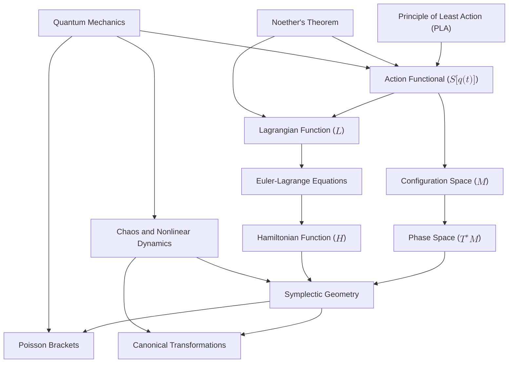

# Reconstructing Classical Mechanics: A Unified Geometric Framework
* * *

--- From Action to Structure: Exploring the Geometry of Motion and Evolution

# **1. Introduction**

**Epigraph**:
*"To understand motion is to uncover the geometry of nature."*

## **1.1 Foundations of Classical Mechanics**

Classical mechanics, at its essence, seeks to describe and predict the motion of physical systems. It is the **cornerstone of physics**, providing the foundation for understanding natural phenomena ranging from the trajectory of celestial bodies to the oscillations of pendulums. However, classical mechanics is far more than a collection of equations or computational tools—it is a profound framework that encodes the **universal principles** governing motion, symmetry, and conservation.

At its heart lies the **Principle of Least Action (PLA)**, a unifying idea that transcends the various formulations of mechanics. PLA asserts that the evolution of a system is determined by the path that extremizes a scalar quantity called the **action**. From this principle, the entire structure of classical mechanics unfolds, encompassing the Lagrangian and Hamiltonian formalisms, symmetries, and conservation laws.

But what is classical mechanics truly about? Is it simply a study of motion? Or is it something deeper? Classical mechanics is best understood as a **geometric theory**—a language through which the dynamics of systems are encoded in the structure of **configuration space**, **phase space**, and **symplectic geometry**. It is a theory of relationships, where motion, forces, and conservation emerge naturally from the underlying geometric framework.

By revisiting classical mechanics with modern mathematical tools and deep conceptual clarity, we can uncover its true essence: **a universal framework for describing the evolution of systems, grounded in symmetry, geometry, and variational principles**.

## **1.2 Fragmentation and Challenges**

Despite its profound foundation, classical mechanics is often presented as a fragmented collection of methods and tools. Students and researchers encounter it in distinct formulations:
- **Newtonian mechanics**, focused on forces and accelerations.
- **Lagrangian mechanics**, emphasizing energy and constraints.
- **Hamiltonian mechanics**, revealing the structure of phase space and symplectic geometry.

While these formulations are mathematically equivalent, their conceptual connections are not always clear. This fragmentation obscures the unifying principles that bind them together, leaving learners with a toolbox of methods but little understanding of the deeper framework.

Moreover, historical presentations often emphasize Newtonian mechanics as the starting point, relegating Lagrangian and Hamiltonian mechanics to advanced topics. This approach risks missing the profound simplicity and universality of the **Principle of Least Action**, which serves as the natural foundation of all these formulations.

Key challenges arise:
1. **Lack of Unity**: The connections between Newtonian, Lagrangian, and Hamiltonian mechanics are rarely emphasized, leading to a fragmented understanding.
2. **Missed Depth**: The geometric and variational nature of classical mechanics is often underexplored, leaving its elegance and coherence hidden.
3. **Difficulty in Modern Extensions**: Without a unified foundation, extending classical mechanics to advanced topics like chaos, quantum mechanics, and field theory becomes conceptually challenging.

Yet, these challenges present an opportunity. By reframing classical mechanics around its unifying principles and leveraging modern mathematics, we can transform it from a set of tools into a **cohesive conceptual framework**. This approach not only deepens our understanding of classical mechanics but also connects it seamlessly to modern physics.

## **1.3 Reconstruction from First Principles**

This document proposes a **principle-centric and geometry-focused reconstruction** of classical mechanics. At its core is the **Principle of Least Action (PLA)**, which asserts that the path taken by a physical system is the one that extremizes the action functional. From this foundational principle, we systematically build outward, layer by layer, uncovering the geometric structures and symmetries that govern motion.

The reconstruction emphasizes the following key themes:
1. **Action as the Core Quantity**: The action functional encapsulates the dynamics of a system, unifying energy, motion, and constraints into a single variational principle.
2. **Geometry as the Language of Mechanics**: The dynamics of systems are encoded in the geometric structures of configuration space, phase space, and symplectic manifolds. These structures reveal the invariant relationships underlying motion.
3. **Symmetry and Conservation**: Symmetries in mechanical systems lead directly to conservation laws through **Noether’s theorem**, providing a deep connection between invariance and physical quantities.
4. **Unified Formulations**: Newtonian, Lagrangian, and Hamiltonian mechanics emerge naturally as different perspectives on the same underlying principles.
5. **Modern Extensions**: By leveraging modern mathematical tools, classical mechanics seamlessly extends to chaos theory, integrable systems, quantum mechanics, and field theory.

This reconstruction is not merely a reorganization of existing knowledge but an exploration of classical mechanics as a conceptual masterpiece. By focusing on its **geometric and variational foundations**, we aim to reveal its intrinsic unity, elegance, and relevance to modern physics.

## **1.4 Objectives of This Document**

The purpose of this document is to:
1. **Reorganize classical mechanics** into a unified, hierarchical framework based on its core principles.
2. **Emphasize its geometric nature**, using modern mathematical insights to provide a deeper understanding.
3. **Unify its formulations**, showing how Newtonian, Lagrangian, and Hamiltonian mechanics are interconnected.
4. **Extend its scope**, demonstrating how classical mechanics bridges to modern physics, including chaos, quantum mechanics, and field theory.

This document is aimed at experienced researchers and educators, providing them with a fresh perspective on classical mechanics. It seeks to deepen their understanding of the field, highlight its connections to modern physics, and inspire new insights into the nature of mechanical systems.

## **1.5 Structure of the Document**

The document progresses systematically, starting from the **principle of least action**, then expanding to the **geometric structures** of configuration and phase spaces, and finally exploring **advanced topics and extensions**. The structure reflects the natural hierarchy of ideas in classical mechanics, ensuring clarity and logical progression.

1. **The Principle of Least Action**: The foundational principle of classical mechanics, from which all formulations and structures emerge.
2. **Configuration Space and Lagrangian Mechanics**: The first analytical framework, rooted in configuration space and the action principle.
3. **Phase Space and Hamiltonian Mechanics**: The transition to phase space and the Hamiltonian formalism, revealing the structure of symplectic geometry.
4. **Symplectic Geometry and Canonical Transformations**: The geometric foundation of phase space, highlighting conservation laws and invariants.
5. **Advanced Topics and Extensions**: Exploring chaos, field theory, and connections to quantum mechanics.
6. **Philosophical Reflections**: Reflecting on the conceptual and philosophical implications of classical mechanics.

This layered approach ensures that readers can follow the progression from foundational principles to advanced concepts, gaining both clarity and depth at each step.

## **1.6 Closing Thought**

Classical mechanics is not merely a historical artifact—it is a living framework that continues to inspire and evolve. By reconstructing it from first principles and emphasizing its geometric foundation, we uncover its true essence: **a universal theory of motion, grounded in symmetry, conservation, and the beauty of mathematical structure**. This document invites readers to explore classical mechanics not just as a tool for solving problems but as a profound lens through which to understand the natural world.

# **2. The Principle of Least Action: The Core of Mechanics**

**Epigraph:**
*"Nature’s path is the one that balances all possibilities."*

## **2.1 The Action Functional**

At the foundation of classical mechanics lies the **action functional**, a scalar quantity that encodes the fundamental dynamics of a system. It serves as the bridge between the physical properties of a system and the mathematical equations governing its evolution. The action is defined as:
$$
S[q(t)] = \int_{t_1}^{t_2} L(q, \dot{q}, t) \, dt,
$$
where:
- $q(t)$ represents the generalized coordinates of the system, describing its position in **configuration space**.
- $\dot{q}(t) = \frac{dq}{dt}$ is the generalized velocity.
- $L(q, \dot{q}, t)$ is the **Lagrangian**, defined as:
  $$
  L(q, \dot{q}, t) = T(q, \dot{q}) - V(q, t),
  $$
  where $T$ is the **kinetic energy** and $V$ is the **potential energy**.

### **2.1.1 Physical Interpretation**  
The action functional captures the **energy profile of a system’s trajectory** over time.
- The Lagrangian $L = T - V$ represents the instantaneous balance between kinetic and potential energy.
- The action $S$ accumulates this balance over the entire path $q(t)$ from $t_1$ to $t_2$.

In essence, the action measures the "cost" of a particular trajectory. The **Principle of Least Action** asserts that nature chooses the path with a stationary action, reflecting an inherent optimization in the laws of physics.

### **2.1.2 Examples**  
1. **Free Particle**:
   For a particle of mass $m$ moving freely in one dimension:
   $$
   L = \frac{1}{2}m\dot{q}^2, \quad S[q(t)] = \int_{t_1}^{t_2} \frac{1}{2}m\dot{q}^2 \, dt.
   $$
   The action minimizes when the particle travels in a straight line at constant velocity.

2. **Harmonic Oscillator**:
   For a particle in a quadratic potential $V = \frac{1}{2}kq^2$:
   $$
   L = \frac{1}{2}m\dot{q}^2 - \frac{1}{2}kq^2.
   $$
   The stationary action corresponds to oscillatory motion governed by Hooke’s law.

## **2.2 The Principle of Least Action (PLA)**

The **Principle of Least Action** (PLA) states that the actual trajectory $q(t)$ of a system between two points in time, $t_1$ and $t_2$, is the one that makes the action functional $S[q(t)]$ **stationary**. This means that small variations $\delta q(t)$ around the true path do not change $S$ to first order:
$$
\delta S = 0.
$$

### **2.2.1 Mathematical Derivation**  
To find the trajectory that extremizes $S$, we consider a small variation of the path:
$$
q(t) \to q(t) + \epsilon \eta(t),
$$
where $\epsilon$ is a small parameter and $\eta(t)$ is an arbitrary smooth function that vanishes at the endpoints ($\eta(t_1) = \eta(t_2) = 0$). Substituting this into the action:
$$
S[q + \epsilon \eta] = \int_{t_1}^{t_2} L(q + \epsilon\eta, \dot{q} + \epsilon\dot{\eta}, t) \, dt.
$$
Expanding to first order in $\epsilon$:
$$
\delta S = \epsilon \int_{t_1}^{t_2} \left( \frac{\partial L}{\partial q} \eta + \frac{\partial L}{\partial \dot{q}} \dot{\eta} \right) dt.
$$
Integrating the second term by parts and using the boundary conditions ($\eta(t_1) = \eta(t_2) = 0$):
$$
\delta S = \epsilon \int_{t_1}^{t_2} \left( \frac{\partial L}{\partial q} - \frac{d}{dt} \frac{\partial L}{\partial \dot{q}} \right) \eta \, dt.
$$
For $\delta S = 0$ to hold for all variations $\eta(t)$, the integrand must vanish:
$$
\frac{\partial L}{\partial q} - \frac{d}{dt} \frac{\partial L}{\partial \dot{q}} = 0.
$$
These are the **Euler-Lagrange equations**, the fundamental equations of motion in the Lagrangian formulation of mechanics.

### **2.2.2 Universality of PLA**  
- The PLA is not unique to classical mechanics—it underpins many areas of physics, including optics (Fermat’s principle), quantum mechanics (path integrals), and field theory.
- It provides a unifying principle, from which the dynamics of any mechanical system can be derived.

## **2.3 Implications of PLA**

The Principle of Least Action serves as the **unifying foundation** of classical mechanics, from which all formulations naturally emerge. Its implications are profound, revealing the intrinsic simplicity and elegance of physical laws.

### **2.3.1. Unified Formulations**  
The PLA unifies the different formulations of classical mechanics:
- **Newtonian Mechanics**: The Euler-Lagrange equations reduce to Newton’s second law ($F = ma$) in Cartesian coordinates.
- **Lagrangian Mechanics**: The PLA provides a systematic method for deriving equations of motion in generalized coordinates, accommodating constraints naturally.
- **Hamiltonian Mechanics**: The Hamiltonian formalism arises from the PLA through the **Legendre transform**, transitioning from configuration space to phase space.

### **2.3.2. Symmetry and Conservation Laws**  
Through **Noether’s theorem**, the PLA directly links symmetries in the action to conservation laws:
- **Time Invariance** $\Rightarrow$ Conservation of Energy.
- **Spatial Invariance** $\Rightarrow$ Conservation of Momentum.
- **Rotational Invariance** $\Rightarrow$ Conservation of Angular Momentum.

This connection highlights the deep relationship between invariance and physical quantities, reflecting the geometric nature of classical mechanics.

### **2.3.3. Geometric Interpretation**  
The PLA encodes the dynamics of a system as a **geometric problem** in configuration space:
- The trajectory $q(t)$ is a curve that extremizes the action functional, analogous to finding the shortest path (geodesic) on a surface.
- This geometric perspective provides a natural framework for extending mechanics to modern topics such as symplectic geometry, field theory, and quantum mechanics.

### **2.3.4. Simplicity and Universality**  
The PLA elegantly encapsulates the complexity of dynamics in a single variational principle. Its universality makes it a powerful tool for understanding diverse physical systems, from pendulums to planetary motion and beyond.

## **2.4 Summary**

- The **action functional** $S[q(t)] = \int L \, dt$ serves as the central quantity in classical mechanics, encoding the dynamics of a system over time.
- The **Principle of Least Action** asserts that physical systems evolve along paths that make the action stationary, leading to the Euler-Lagrange equations.
- The PLA unifies the formulations of classical mechanics, connects symmetries to conservation laws, and provides a geometric framework for understanding motion.
- By revealing the simplicity and elegance of natural laws, the PLA serves as the cornerstone for reconstructing classical mechanics and extending it to modern physics.

This section establishes the foundation for the next stages of the document, where the geometric structures of configuration space, phase space, and symplectic geometry are explored in detail.

# **3. Configuration Space and Lagrangian Mechanics**

**Epigraph**:
*"Motion is the consequence of energy shaped by geometry."*

## **3.1 Configuration Space ($M$)**

The **configuration space** ($M$) is the geometric foundation of Lagrangian mechanics. It represents the set of all possible configurations (or positions) that a system can occupy, serving as the stage on which physical motion unfolds. Each point in $M$ corresponds to a unique arrangement of the system’s degrees of freedom.

### **3.1.1 Definition and Structure**
- For a system with $n$ degrees of freedom, the configuration space $M$ is an $n$-dimensional **manifold**.
  - Example: A single particle in 3D space has $M = \mathbb{R}^3$.
  - Example: A double pendulum, with two angular degrees of freedom, has $M = \mathbb{S}^1 \times \mathbb{S}^1$ (a product of two circles).
- Generalized coordinates $q = (q^1, q^2, \dots, q^n)$ describe the system’s position in $M$. These coordinates are not limited to Cartesian coordinates but can be adapted to the system’s constraints and symmetry.

### **3.1.2 Constraints in Configuration Space**
Constraints restrict the motion of a system to specific submanifolds of $M$:
1. **Holonomic Constraints**:
   - Constraints that depend only on the coordinates and time, expressed as equations $f(q^i, t) = 0$.
   - Example: A bead constrained to move along a wire satisfies $f(x, y, z) = 0$, where $f$ represents the wire’s shape.
   
2. **Non-Holonomic Constraints**:
   - Constraints that depend on velocities and cannot be integrated into position constraints.
   - Example: Rolling without slipping: $v_{\text{contact}} = 0$.

### **3.1.3 Role of Configuration Space**
- Configuration space provides a **geometric abstraction**, allowing the system’s dynamics to be expressed independently of the specific forces acting on it.
- The trajectory of the system in $M$ is determined by the **Principle of Least Action**, making $M$ the natural setting for Lagrangian mechanics.

## **3.2 The Lagrangian Function**

The **Lagrangian function** $L(q, \dot{q}, t)$ is the central object in Lagrangian mechanics. It encapsulates the system’s dynamics by balancing kinetic and potential energies.

### **3.2.1 Definition**
The Lagrangian is defined as:
$$
L(q, \dot{q}, t) = T(q, \dot{q}) - V(q, t),
$$
where:
- $T(q, \dot{q})$ is the **kinetic energy**, typically quadratic in the velocities $\dot{q}^i$:
  $$
  T = \frac{1}{2} \sum_{i,j} m_{ij}(q) \dot{q}^i \dot{q}^j,
  $$
  where $m_{ij}(q)$ is the mass tensor, encoding the system’s inertial properties.
- $V(q, t)$ is the **potential energy**, which depends on the configuration $q$ and may vary with time.

### **3.2.2 Physical Interpretation**
- The Lagrangian represents the **difference** between the system’s kinetic and potential energy at any instant.
- $T$ reflects the system’s motion (inertia), while $V$ reflects the forces acting on the system through their potential.
- The dynamics of the system arise from the extremization of the action $S[q(t)] = \int L \, dt$, with $L$ encoding how energy is distributed along the path.

### **3.2.3 Examples**
1. **Free Particle**:
   For a particle of mass $m$ in 3D space with no potential:
   $$
   L = \frac{1}{2}m(\dot{x}^2 + \dot{y}^2 + \dot{z}^2).
   $$

2. **Harmonic Oscillator**:
   For a mass $m$ attached to a spring with stiffness $k$:
   $$
   L = \frac{1}{2}m\dot{q}^2 - \frac{1}{2}kq^2.
   $$

3. **Pendulum**:
   For a pendulum of length $l$ and mass $m$:
   $$
   L = \frac{1}{2}m l^2 \dot{\theta}^2 - m g l (1 - \cos\theta),
   $$
   where $\theta$ is the angular displacement.

## **3.3 The Euler-Lagrange Equations**

The **Euler-Lagrange equations** describe the equations of motion for a system in Lagrangian mechanics. They are derived by applying the **Principle of Least Action** to the action functional $S[q(t)] = \int L \, dt$.

### **3.3.1 Derivation**
The Principle of Least Action states that the actual path $q(t)$ of the system extremizes the action functional:
$$
\delta S = 0.
$$
Substituting $S[q(t)] = \int_{t_1}^{t_2} L(q, \dot{q}, t) \, dt$, variations in $q(t)$ lead to:
$$
\frac{\partial L}{\partial q^i} - \frac{d}{dt} \frac{\partial L}{\partial \dot{q}^i} = 0.
$$
These are the **Euler-Lagrange equations**, which generalize Newton’s second law to arbitrary coordinates and constraints.

### **3.3.2 Physical Meaning**
- The term $\frac{\partial L}{\partial q^i}$ represents the generalized forces arising from the potential energy $V$.
- The term $\frac{d}{dt} \frac{\partial L}{\partial \dot{q}^i}$ represents the inertial effects from the kinetic energy $T$.

### **3.3.3 Examples**
1. **Harmonic Oscillator**:
   From $L = \frac{1}{2}m\dot{q}^2 - \frac{1}{2}kq^2$:
   $$
   \frac{d}{dt}(m\dot{q}) + kq = 0 \quad \Rightarrow \quad m\ddot{q} + kq = 0.
   $$

2. **Pendulum**:
   From $L = \frac{1}{2}m l^2 \dot{\theta}^2 - m g l (1 - \cos\theta)$:
   $$
   \frac{d}{dt}(m l^2 \dot{\theta}) + m g l \sin\theta = 0 \quad \Rightarrow \quad \ddot{\theta} + \frac{g}{l}\sin\theta = 0.
   $$

## **3.4 Symmetries and Noether’s Theorem**

Symmetries play a fundamental role in classical mechanics, leading to conserved quantities through **Noether’s theorem**.

### **3.4.1 Noether’s Theorem**
For every continuous symmetry of the action $S[q(t)]$, there exists a corresponding conserved quantity.
- **Time Invariance**:
   If $L$ does not explicitly depend on time ($\partial L / \partial t = 0$), then the **total energy** $E$ is conserved:
   $$
   E = \dot{q}^i \frac{\partial L}{\partial \dot{q}^i} - L.
   $$

- **Spatial Invariance**:
   If $L$ is invariant under translations in $q^i$, the **momentum** $p_i$ is conserved:
   $$
   p_i = \frac{\partial L}{\partial \dot{q}^i}.
   $$

- **Rotational Invariance**:
   If $L$ is invariant under rotations, the **angular momentum** $L_i$ is conserved.

### **3.3.2 Examples of Symmetry and Conservation**
1. **Energy Conservation**:
   For the harmonic oscillator, $L = \frac{1}{2}m\dot{q}^2 - \frac{1}{2}kq^2$, the total energy:
   $$
   E = \frac{1}{2}m\dot{q}^2 + \frac{1}{2}kq^2
   $$
   is conserved.

2. **Momentum Conservation**:
   For a free particle in 3D space ($L = \frac{1}{2}m\dot{q}^2$), the momentum:
   $$
   \vec{p} = m\dot{\vec{q}}
   $$
   is conserved.

3. **Angular Momentum Conservation**:
   For a central force problem ($L = \frac{1}{2}m(\dot{r}^2 + r^2\dot{\theta}^2) - V(r)$), the angular momentum:
   $$
   L_\theta = mr^2\dot{\theta}
   $$
   is conserved due to rotational symmetry.

## **3.5 Summary**

- **Configuration space** provides the geometric setting for describing a system’s possible states and constraints.
- The **Lagrangian function** $L = T - V$ encapsulates the dynamics of the system by balancing kinetic and potential energies.
- The **Euler-Lagrange equations**, derived from the Principle of Least Action, govern the system’s motion in generalized coordinates.
- **Noether’s theorem** connects symmetries in the Lagrangian to conserved quantities, revealing the deep relationship between invariance and dynamics.

This section establishes the Lagrangian framework as the foundation for analytical mechanics. The next section transitions to **Hamiltonian mechanics**, where phase space and symplectic geometry take center stage.

# **4. Phase Space and Hamiltonian Mechanics**

**Epigraph**:
*"Phase space reveals the duality of nature’s forces and forms."*

## **4.1 Phase Space ($T^*M$)**

Phase space, denoted $T^*M$, is the natural geometric setting for Hamiltonian mechanics. It provides a complete description of a system’s state by combining its positions and momenta. Unlike configuration space, which focuses solely on positions, phase space encodes the full dynamical information needed to describe the evolution of a mechanical system.

### **4.1.1 Definition**
- **Phase space** is the **cotangent bundle** of the configuration space $M$.
  - If $M$ is the configuration space with generalized coordinates $q^i$, then $T^*M$ is the space of all possible pairs $(q^i, p_i)$, where $p_i$ are the momenta conjugate to $q^i$.
- Each point in phase space $(q^i, p_i)$ specifies a unique state of the system, where:
  - $q^i$: Generalized positions (configuration).
  - $p_i = \frac{\partial L}{\partial \dot{q}^i}$: Generalized momenta, derived from the Lagrangian.

### **4.1.2 Structure of Phase Space**
- **Dimensionality**: If the configuration space $M$ has $n$ degrees of freedom, the phase space $T^*M$ has $2n$ dimensions (positions and momenta).
- **Geometric Interpretation**:
  - Phase space is a **symplectic manifold**, equipped with a symplectic structure (explored in Chapter 5).
  - It is the natural arena for describing motion as flows generated by the Hamiltonian.

### **4.1.3 Example**
1. **Single Particle in 3D Space**:
   - Configuration space: $M = \mathbb{R}^3$.
   - Phase space: $T^*M = \mathbb{R}^6$, with coordinates $(x, y, z; p_x, p_y, p_z)$.

2. **Double Pendulum**:
   - Configuration space: $M = \mathbb{S}^1 \times \mathbb{S}^1$ (two angular coordinates).
   - Phase space: $T^*M = \mathbb{S}^1 \times \mathbb{S}^1 \times \mathbb{R}^2$, including angular momenta.

### **4.1.4 Significance**
- Phase space provides a **complete and geometric picture** of the system's dynamics.
- Trajectories in phase space represent the evolution of the system over time, governed by Hamilton’s equations.
- The symplectic structure of $T^*M$ encodes fundamental dynamical relationships, such as the conservation of phase space volume (Liouville’s theorem).

## **4.2 The Hamiltonian Function**

The **Hamiltonian function** $H(q, p, t)$ is the central object in Hamiltonian mechanics. It governs the evolution of a system in phase space, playing the dual role of an energy function and a generator of motion.

### **4.2.1 Definition**
The Hamiltonian is defined as:
$$
H(q, p, t) = \sum_i p_i \dot{q}^i - L(q, \dot{q}, t),
$$
where $\dot{q}^i$ (generalized velocities) must be expressed in terms of $q^i$ and $p_i$ using the relationship:
$$
p_i = \frac{\partial L}{\partial \dot{q}^i}.
$$
This transformation from the Lagrangian $L$ to the Hamiltonian $H$ is called the **Legendre transform**.

### **4.2.2 Physical Interpretation**
1. **Energy**:
   - For many systems, $H$ represents the **total energy**:
     $$
     H = T + V,
     $$
    where $T$ is the kinetic energy and $V$ is the potential energy.
   - Even for systems where $H \neq T + V$, it still governs the system’s dynamics.

2. **Generator of Motion**:
   - The Hamiltonian generates the flow of the system in phase space through Hamilton’s equations (explored in Section 4.3).

### **4.2.3 Construction of the Hamiltonian**
1. **Free Particle**:
   - Lagrangian: $L = \frac{1}{2}m\dot{q}^2$.
   - Momentum: $p = m\dot{q}$.
   - Hamiltonian:
     $$
     H = \frac{p^2}{2m}.
     $$

2. **Harmonic Oscillator**:
   - Lagrangian: $L = \frac{1}{2}m\dot{q}^2 - \frac{1}{2}kq^2$.
   - Momentum: $p = m\dot{q}$.
   - Hamiltonian:
     $$
     H = \frac{p^2}{2m} + \frac{1}{2}kq^2.
     $$

3. **Pendulum**:
   - Lagrangian: $L = \frac{1}{2}m l^2 \dot{\theta}^2 - mgl(1 - \cos\theta)$.
   - Momentum: $p = m l^2 \dot{\theta}$.
   - Hamiltonian:
     $$
     H = \frac{p^2}{2ml^2} - mgl\cos\theta.
     $$

### **4.2.4 Role of the Hamiltonian**
- The Hamiltonian governs the system’s **time evolution** in phase space.
- It encapsulates the system’s energy balance and encodes the dynamics as a flow on $T^*M$.

## **4.3 Hamilton’s Equations**

Hamiltonian mechanics reformulates the equations of motion as a system of **first-order differential equations** in phase space. These equations, known as **Hamilton’s equations**, describe the time evolution of the generalized coordinates $q^i$ and momenta $p_i$.

### **4.3.1 Derivation from the Action Principle**
Starting from the action functional in phase space:
$$
S[q(t), p(t)] = \int_{t_1}^{t_2} \left( \sum_i p_i \dot{q}^i - H(q, p, t) \right) dt,
$$
and requiring $\delta S = 0$ for variations in $q^i(t)$ and $p_i(t)$, we obtain Hamilton’s equations:
$$
\dot{q}^i = \frac{\partial H}{\partial p_i}, \quad \dot{p}_i = -\frac{\partial H}{\partial q^i}.
$$

### **4.3.2 Interpretation**
1. **Position Equation** ($\dot{q}^i = \frac{\partial H}{\partial p_i}$):
   - The rate of change of position $q^i$ is determined by how the Hamiltonian depends on momentum $p_i$.
   - Example: For a free particle, $H = \frac{p^2}{2m}$, so $\dot{q} = \frac{p}{m}$, consistent with Newton’s second law.

2. **Momentum Equation** ($\dot{p}_i = -\frac{\partial H}{\partial q^i}$):
   - The rate of change of momentum $p_i$ is determined by how the Hamiltonian depends on position $q^i$.
   - Example: For a harmonic oscillator, $H = \frac{p^2}{2m} + \frac{1}{2}kq^2$, so $\dot{p} = -kq$, consistent with Hooke’s law.

### **4.3.3 Examples**
1. **Harmonic Oscillator**:
   - Hamiltonian: $H = \frac{p^2}{2m} + \frac{1}{2}kq^2$.
   - Equations of motion:
     $$
     \dot{q} = \frac{\partial H}{\partial p} = \frac{p}{m}, \quad \dot{p} = -\frac{\partial H}{\partial q} = -kq.
     $$
   - These describe sinusoidal oscillations in $q$ and $p$.

2. **Kepler Problem (Planetary Motion)**:
   - Hamiltonian: $H = \frac{p_r^2}{2m} + \frac{p_\theta^2}{2mr^2} - \frac{GmM}{r}$.
   - Hamilton’s equations describe the elliptical orbits of planets.

### **4.3.4 Comparison with Lagrangian Mechanics**
- **Lagrangian Mechanics**: Describes motion in configuration space $M$ using second-order differential equations (Euler-Lagrange equations).
- **Hamiltonian Mechanics**: Describes motion in phase space $T^*M$ using first-order differential equations (Hamilton’s equations).
- The two formulations are mathematically equivalent but offer different conceptual and computational advantages.

## **4.4 Summary**

- **Phase space** ($T^*M$) provides a complete geometric description of a system’s state, combining generalized coordinates $q^i$ and momenta $p_i$.
- The **Hamiltonian function** $H(q, p, t)$ governs the system’s dynamics, serving as both an energy function and a generator of motion.
- **Hamilton’s equations** reformulate the equations of motion as first-order differential equations in phase space, describing the system’s evolution as a flow.
- Hamiltonian mechanics extends the Lagrangian framework, offering a richer geometric perspective and paving the way for the exploration of symplectic geometry and advanced topics like chaos, integrable systems, and quantum mechanics.

This section sets the stage for Chapter 5, where the geometric structure of phase space is formalized through **symplectic geometry**, revealing deeper insights into conservation laws, invariants, and transformations.

# **5. Symplectic Geometry: The Structure of Phase Space**

**Epigraph**:
*"Symplectic geometry encodes the harmony of motion."*

## **5.1 Symplectic Manifolds and the Symplectic Form**

Symplectic geometry provides the mathematical foundation for phase space in Hamiltonian mechanics. It formalizes the geometric structure that governs the dynamics of classical systems, connecting conservation laws, invariants, and the fundamental nature of motion.

### **5.1.1 Definition of a Symplectic Manifold**
A **symplectic manifold** is a smooth, even-dimensional manifold $(M, \omega)$ equipped with a **symplectic form** $\omega$, which is:
1. **Closed**: $d\omega = 0$.
   - This property reflects the conservation of phase space structure and ensures that the geometry of motion does not change over time.
2. **Non-degenerate**: For any nonzero tangent vector $v \in T_pM$, there exists another tangent vector $w \in T_pM$ such that $\omega(v, w) \neq 0$.
   - This guarantees that the symplectic form provides a pairing between positions and momenta, ensuring that motion is well-defined.

In the context of Hamiltonian mechanics, the phase space $T^*M$ is a symplectic manifold, where $\omega$ encodes the relationships between generalized coordinates $q^i$ and conjugate momenta $p_i$.

### **5.1.2 The Symplectic $2$-Form**
The symplectic form $\omega$ in local coordinates $(q^i, p_i)$ is given by:
$$
\omega = \sum_i dp_i \wedge dq^i,
$$
where $dp_i \wedge dq^i$ is the exterior product of the differentials $dp_i$ and $dq^i$. This form represents the infinitesimal area in phase space.

### **5.1.3 Properties of $\omega$**
1. **Area Element**:
   The symplectic form defines a natural area element in phase space, making it possible to measure regions of phase space and understand volume conservation (Liouville’s theorem).
2. **Preservation of Structure**:
   Hamiltonian flows preserve the symplectic form $\omega$, ensuring that the geometry of phase space remains invariant under time evolution.
3. **Duality**:
   The symplectic form inherently couples positions $q^i$ and momenta $p_i$, reflecting the dual nature of these quantities.

### **5.1.4 Example: Canonical Phase Space**
For a free particle in 2D:
- Phase space coordinates: $(q_x, q_y, p_x, p_y)$.
- Symplectic form:
  $$
  \omega = dp_x \wedge dq_x + dp_y \wedge dq_y.
  $$
  This structure encodes the relationships between spatial positions and momenta.

### **5.1.5 Physical Interpretation**
1. **Conservation of Phase Space Volume**:
   The closedness of $\omega$ ensures that the phase space volume is conserved during Hamiltonian evolution. This is a geometric expression of Liouville’s theorem.
2. **Geometric Encoding of Dynamics**:
   The symplectic form provides a way to encode the equations of motion geometrically, independent of specific coordinates.

## **5.2 Poisson Brackets and Observables**

The **Poisson bracket** is an algebraic structure that arises naturally from the symplectic geometry of phase space. It provides a powerful tool for studying the relationships between observables and understanding the dynamics of classical systems.

### **5.2.1 Definition of the Poisson Bracket**
For two smooth functions $f(q, p)$ and $g(q, p)$ on phase space, the Poisson bracket is defined as:
$$
\{f, g\} = \sum_i \left( \frac{\partial f}{\partial q^i} \frac{\partial g}{\partial p_i} - \frac{\partial f}{\partial p_i} \frac{\partial g}{\partial q^i} \right).
$$

### **5.2.2 Properties of the Poisson Bracket**
1. **Antisymmetry**:
   $\{f, g\} = -\{g, f\}$.
2. **Linearity**:
   $\{af + bg, h\} = a\{f, h\} + b\{g, h\}$, where $a, b \in \mathbb{R}$.
3. **Jacobi Identity**:
   $\{f, \{g, h\}\} + \{g, \{h, f\}\} + \{h, \{f, g\}\} = 0$.
4. **Leibniz Rule**:
   $\{fg, h\} = f\{g, h\} + g\{f, h\}$.

### **5.2.3 Physical Interpretation**
- The Poisson bracket encodes the **rate of change** of one observable $f$ along the flow generated by another observable $g$.
- For the Hamiltonian $H$, the equations of motion can be written compactly as:
  $$
  \dot{f} = \{f, H\}.
  $$

### **5.2.4 Examples**
1. **Canonical Coordinates**:
   The Poisson brackets for the canonical phase space coordinates satisfy:
   $$
   \{q^i, p_j\} = \delta^i_j, \quad \{q^i, q^j\} = 0, \quad \{p_i, p_j\} = 0.
   $$

2. **Angular Momentum**:
   For the components of angular momentum $L_x, L_y, L_z$:
   $$
   \{L_x, L_y\} = L_z, \quad \{L_y, L_z\} = L_x, \quad \{L_z, L_x\} = L_y.
   $$
   These brackets encode the algebra of rotations in phase space.

### **5.2.5 Role in Observables**
- The Poisson bracket provides an algebraic structure for the space of observables on phase space.
- It serves as a precursor to the commutator in quantum mechanics, bridging classical and quantum systems.

## **5.3 Canonical Transformations**

**Canonical transformations** are changes of variables in phase space that preserve the symplectic structure. They form the backbone of Hamiltonian mechanics, simplifying problems and revealing hidden symmetries.

### **5.3.1 Definition**
A transformation $(q^i, p_i) \to (Q^i, P_i)$ is **canonical** if it preserves the symplectic form:
$$
\omega = \sum_i dp_i \wedge dq^i = \sum_i dP_i \wedge dQ^i.
$$
Equivalently, the Poisson bracket relations are preserved:
$$
\{Q^i, P_j\} = \delta^i_j, \quad \{Q^i, Q^j\} = 0, \quad \{P_i, P_j\} = 0.
$$

### **5.3.2 Generating Functions**
Canonical transformations can be generated by scalar functions $F$, which relate the old and new variables. Depending on the choice of variables, there are four common types of generating functions:
1. $F_1(q, Q)$,
2. $F_2(q, P)$,
3. $F_3(p, Q)$,
4. $F_4(p, P)$.

For example, if $F_2(q, P)$ is chosen, the relationships are:
$$
p_i = \frac{\partial F_2}{\partial q^i}, \quad Q^i = \frac{\partial F_2}{\partial P_i}.
$$

### **5.3.3 Applications**
1. **Simplifying Problems**:
   Canonical transformations are used to simplify the equations of motion, often by introducing variables such as **action-angle variables** in integrable systems.

2. **Hamilton-Jacobi Theory**:
   The Hamilton-Jacobi equation provides a unifying framework for generating canonical transformations. The solution $S(q, t)$ of the Hamilton-Jacobi equation acts as a generating function, reducing the problem of solving differential equations to solving first-order partial differential equations.

### **5.3.4 Example: Harmonic Oscillator**
For the harmonic oscillator, introducing action-angle variables $(J, \theta)$:
- The action $J$ is conserved.
- The angle $\theta$ evolves linearly with time, simplifying the motion.

## **5.4 Summary**

- **Symplectic geometry** provides the geometric foundation for Hamiltonian mechanics, with the symplectic form $\omega$ encoding the relationships between positions and momenta.
- The **Poisson bracket** formalizes the algebra of observables, connecting dynamics to the symplectic structure and serving as a bridge to quantum mechanics.
- **Canonical transformations** preserve the symplectic structure, offering powerful tools for simplifying problems and uncovering symmetries.

This section establishes the deep geometric structure of phase space, paving the way for advanced topics such as integrable systems, chaos, and quantum mechanics. Symplectic geometry not only unifies the theory of classical mechanics but also connects it to broader frameworks in modern physics.

# **6. Advanced Topics and Modern Connections**

**Epigraph**:
*"From classical roots, modern physics extends its branches."*

Classical mechanics, built on the Principle of Least Action (PLA) and supported by its geometric and analytic frameworks, is not merely a historical artifact. It serves as the foundation and conceptual springboard for exploring far-reaching modern topics in physics. This chapter explores three crucial extensions: **chaos and nonlinear dynamics** (the study of deterministic unpredictability), **classical field theory and continuum mechanics** (the transition from discrete systems to continuous media), and **quantum mechanics** (the domain where classical intuition meets the probabilistic nature of the quantum world). These connections underscore the enduring power of classical mechanics to shape and inform our understanding of the universe.

## **6.1 Chaos and Nonlinear Dynamics**

Chaos theory, a cornerstone of modern dynamical systems, emerges naturally from classical mechanics when studying nonlinear systems. It reveals how deterministic systems can exhibit unpredictable and highly sensitive behavior, challenging the traditional notion of predictability in Newtonian mechanics.

### **6.1.1 Characteristics of Chaos**
Chaos is defined by three key features:
1. **Sensitivity to Initial Conditions**:
   Systems that are chaotic exhibit an exponential divergence of nearby trajectories in phase space, characterized by a positive **Lyapunov exponent**. This sensitivity, colloquially known as the "butterfly effect," makes long-term prediction impossible, even for deterministic systems.
   
2. **Nonlinear Interactions**:
   Chaos arises in systems governed by nonlinear equations of motion, where small perturbations can lead to qualitatively different outcomes. Unlike linear systems, superposition does not apply.

3. **Fractal Structures**:
   Chaotic systems often exhibit fractal structures in their phase space, such as **strange attractors**, which encode the system's long-term behavior in a geometrically intricate manner.

### **6.1.2 Examples of Chaotic Systems**
1. **Double Pendulum**:
   The double pendulum, with two coupled degrees of freedom, transitions from predictable motion to chaos as energy increases. Its sensitivity to initial conditions makes it a classic example of chaotic dynamics.
   
2. **Logistic Map**:
   A simple discrete-time model used in population dynamics, the logistic map demonstrates how chaos can emerge even in low-dimensional systems.

3. **Three-Body Problem**:
   The gravitational interaction of three bodies (e.g., Sun, Earth, and Moon) is inherently chaotic, highlighting the limits of long-term planetary predictions.

### **6.1.3 Implications for Predictability**
Chaos challenges the deterministic worldview of classical mechanics. While the equations of motion remain deterministic, the practical limitations of measuring initial conditions precisely render chaotic systems effectively unpredictable. This has profound implications for fields ranging from meteorology to astrophysics.

### **6.1.4 Geometric Perspective**
From a geometric standpoint, chaos reflects the complexity of trajectories in phase space. Tools like **Poincaré sections** and **Lyapunov exponents** allow us to visualize and quantify chaotic dynamics.

## **6.2 Classical Field Theory and Continuum Mechanics**

Classical mechanics extends beyond systems of discrete particles to describe continuous media such as fluids, elastic solids, and electromagnetic fields. This transition is formalized through **classical field theory**, where the degrees of freedom are fields defined over space and time.

### **6.2.1 Key Concepts**
1. **Field Variables**:
   Instead of tracking finite coordinates $q^i(t)$, field theories describe systems in terms of fields $\phi(x, t)$, where $x$ is a point in space and $t$ is time. These fields can represent physical quantities like displacement, velocity, or electromagnetic fields.

2. **Lagrangian Density**:
   The dynamics of a field are governed by a **Lagrangian density** $\mathcal{L}(\phi, \partial_\mu \phi)$, which generalizes the Lagrangian of discrete systems. The action becomes an integral over spacetime:
   $$
   S[\phi] = \int \mathcal{L}(\phi, \partial_\mu \phi) \, d^4x.
   $$

3. **Field Equations**:
   By extremizing the action, we derive the **Euler-Lagrange equations for fields**:
   $$
   \frac{\partial \mathcal{L}}{\partial \phi} - \partial_\mu \left( \frac{\partial \mathcal{L}}{\partial (\partial_\mu \phi)} \right) = 0.
   $$

### **6.2.2 Examples of Classical Field Theories**
1. **Electromagnetic Fields**:
   The Lagrangian density for Maxwell’s equations is:
   $$
   \mathcal{L} = -\frac{1}{4} F_{\mu\nu}F^{\mu\nu},
   $$
   where $F_{\mu\nu}$ is the electromagnetic field tensor.

2. **Elasticity and Fluid Dynamics**:
   - Elastic solids are described by displacement fields and stress-strain relations.
   - Fluid mechanics uses fields like velocity $\vec{v}(x, t)$ and density $\rho(x, t)$, governed by the Navier-Stokes equations.

3. **Relativistic Fields**:
   The Klein-Gordon equation, describing a scalar field $\phi(x, t)$, is derived from the Lagrangian density:
   $$
   \mathcal{L} = \frac{1}{2} (\partial_\mu \phi)(\partial^\mu \phi) - \frac{1}{2}m^2\phi^2.
   $$

### **6.2.3 Connections to Continuum Mechanics**
Continuum mechanics describes deformable bodies and fluids using the same variational principles as particle mechanics. For example:
- **Elastic Solids**: Governed by Hooke’s law and the equations of elasticity, derived from a potential energy functional.
- **Fluid Dynamics**: The Euler or Navier-Stokes equations are derived from the action principle, with the Lagrangian density incorporating kinetic and potential energy terms.

### **6.2.4 Role of Symmetries**
In classical field theory, Noether’s theorem generalizes to fields, connecting symmetries (e.g., spacetime translations, rotations) to conserved quantities like energy, momentum, and angular momentum.

## **6.3 Connections to Quantum Mechanics**

Classical mechanics provides the conceptual and mathematical foundation for quantum mechanics. Despite their differences, the two frameworks are deeply intertwined, with classical mechanics serving as the limiting case of quantum mechanics when $\hbar \to 0$.

### **6.3.1 Quantization**
Quantization bridges classical and quantum mechanics, translating classical observables into quantum operators and replacing Poisson brackets with commutators:
- Classical: $\{q, p\} = 1$.
- Quantum: $[\hat{q}, \hat{p}] = i\hbar$.

### **6.3.2 Path Integral Formulation**
The **path integral formulation** of quantum mechanics, introduced by Feynman, is a direct extension of the Principle of Least Action. Instead of a single trajectory, quantum systems explore all possible paths, with each path weighted by:
$$
e^{iS[q(t)]/\hbar}.
$$
Here, $S[q(t)]$ is the classical action, connecting quantum amplitudes to classical mechanics.

### **6.3.3 Semiclassical Approximations**
In the semiclassical limit ($\hbar \to 0$), quantum mechanics reduces to classical mechanics. Techniques like the **WKB approximation** highlight how classical trajectories emerge from quantum wavefunctions.

### **6.3.4 Correspondence in Observables**
1. **Energy Levels**:
   In systems like the harmonic oscillator, quantum energy levels emerge as quantized forms of classical energy.
   
2. **Wave-Particle Duality**:
   Classical trajectories correspond to the peak of quantum wavefunctions in the semiclassical limit (e.g., using the Bohr-Sommerfeld quantization rule).

### **6.3.5 Quantum-Classical Duality**
The classical phase space, with its symplectic structure and Poisson brackets, serves as the precursor to quantum Hilbert space and operator algebra. Concepts like **canonical transformations** in classical mechanics inform unitary transformations in quantum mechanics.

### **6.3.6 Modern Extensions**
Quantum mechanics extends classical ideas to realms of superposition, entanglement, and uncertainty, but the underlying variational principles remain rooted in classical mechanics.

## **6.4 Summary**

- **Chaos and Nonlinear Dynamics** reveal the limits of predictability in classical systems, highlighting the richness of deterministic yet unpredictable behavior.
- **Classical Field Theory and Continuum Mechanics** extend classical mechanics to continuous systems, from fluids to relativistic fields, demonstrating the universality of variational principles.
- **Quantum Mechanics** bridges classical and quantum worlds, with classical mechanics providing the foundation for understanding quantum dynamics through concepts like quantization, path integrals, and semiclassical approximations.

These advanced topics showcase the profound versatility and enduring relevance of classical mechanics, not only as a historical framework but as a foundation for modern physics. From the chaotic to the quantum, classical mechanics continues to inspire new insights and deeper connections between the fundamental laws of nature.

# **7. Philosophical Reflections and Conclusion**

**Epigraph**:
*"In simplicity, we find the profound truths of nature."*

## **7.1 The Elegance of Classical Mechanics**

Classical mechanics, when viewed through the unified lens of the **Principle of Least Action (PLA)** and its geometric structures, transcends its historical role as a computational tool. It becomes a profound intellectual framework, a testament to the simplicity and coherence of natural laws. This reconstruction reveals a deep elegance, where the seemingly diverse formulations of Newtonian, Lagrangian, and Hamiltonian mechanics are harmonized into a single geometric symphony.

### **7.1.1 Unity in Diversity**
- The **PLA**, as the cornerstone of classical mechanics, provides a universal framework that unites dynamics, symmetry, and conservation. From the motion of celestial bodies to the oscillations of a pendulum, all phenomena are governed by the same variational principle.
- The transition from **configuration space** to **phase space** and the incorporation of **symplectic geometry** highlight how classical mechanics is not just a theory of forces but a theory of structure. It encodes the interplay between motion, energy, and geometry.

### **7.1.2 Aesthetic Appreciation**
The elegance of classical mechanics lies in its ability to describe the complexity of the natural world with minimal assumptions:
- The **simplicity of its foundations**—a scalar action functional—contrasts with the richness of its implications.
- The **symmetry and invariance** embedded in the laws of mechanics evoke the beauty of mathematical patterns, bridging the abstract and the physical.
- The **universality** of its principles, extending from particle dynamics to fields and chaos, reflects the interconnectedness of the cosmos.

As a conceptual framework, classical mechanics is not merely a tool but a lens through which we uncover the hidden order of nature. It is a triumph of human thought, where simplicity and profundity converge.

## **7.2 Implications for Modern Physics**

The reconstruction of classical mechanics is not an endpoint but a foundation for further exploration. By emphasizing its unifying principles and geometric underpinnings, we illuminate its deep connections to modern physics and its potential for future discoveries.

### **7.2.1. Bridging Classical and Quantum Worlds**
Classical mechanics serves as the conceptual and mathematical precursor to quantum mechanics:
- The **path integral formulation** of quantum mechanics directly extends the PLA, with quantum amplitudes weighted by the classical action.
- The **symplectic structure of phase space** provides the foundation for the algebra of observables in quantum mechanics, where Poisson brackets transition to commutators.
- Semiclassical techniques, like the WKB approximation and Bohr-Sommerfeld quantization, show how classical trajectories emerge as the high-energy limit of quantum wavefunctions.

Understanding classical mechanics in its full geometric depth enriches our comprehension of quantum phenomena, highlighting the continuity between the classical and quantum realms.

### **7.2.2. Chaos and Nonlinear Dynamics**
The study of chaos, deeply rooted in classical mechanics, has profound implications for determinism and predictability:
- In fields like meteorology, astrophysics, and biology, the sensitivity to initial conditions revealed by classical chaos informs our understanding of complex systems.
- The fractal structures and strange attractors in phase space demonstrate how order and randomness coexist, offering a richer perspective on the dynamics of nature.

Chaos theory, arising naturally from nonlinear classical systems, continues to inform modern research in complexity science and emergent phenomena.

### **7.2.3. Field Theory and Relativity**
Classical mechanics extends seamlessly to field theory, providing the variational principles that underpin electromagnetism, fluid dynamics, and elasticity:
- The action principle, generalized to fields, governs the dynamics of spacetime in general relativity and the behavior of matter in continuum mechanics.
- The geometric perspective of classical mechanics foreshadows the geometric foundations of modern physics, from Riemannian geometry in general relativity to fiber bundles in gauge theory.

By revisiting classical mechanics through its geometric reconstruction, we strengthen the bridge to these advanced frameworks and deepen our understanding of their shared principles.

### **7.2.4. Future Perspectives**
The reconstruction of classical mechanics as a geometric framework invites extensions into yet unexplored territories:
- **Integrable Systems**: The symplectic and Hamiltonian structures provide tools for understanding systems with conserved quantities and hidden symmetries, with applications in modern soliton theory and statistical mechanics.
- **Quantum Chaos**: The interplay between classical chaos and quantum mechanics is a frontier of research, where classical trajectories inform the behavior of quantum systems in the semiclassical limit.
- **Foundations of Physics**: Revisiting fundamental principles, such as the PLA, may inspire new formulations or unifications in theoretical physics, perhaps bridging quantum mechanics and general relativity.

## **7.3 Final Thoughts**

In revisiting classical mechanics, we are reminded that the greatest insights often emerge from the simplest principles. The **Principle of Least Action**, a single variational idea, weaves together the tapestry of motion, symmetry, and conservation. From the trajectories of particles to the evolution of fields, classical mechanics provides a unified, geometric language that transcends its historical boundaries.

### **7.3.1 The Enduring Relevance of Classical Mechanics**
Far from being obsolete, classical mechanics continues to inform and inspire:
- It is the **conceptual foundation** for modern physics, from quantum mechanics to relativity.
- Its **geometric and variational principles** offer tools for exploring new areas of science, from chaos theory to complexity.
- Its **elegance and simplicity** foster a deeper appreciation of the natural world, reminding us of the harmony underlying physical laws.

### **7.3.2 A Call to Exploration**
This reconstruction of classical mechanics is not an ending but a beginning. By embracing its unifying principles, we open doors to new connections, insights, and discoveries. Whether in teaching, research, or philosophical reflection, classical mechanics invites us to think deeply, to appreciate the beauty of its structure, and to explore the universe with curiosity and wonder.

## **7.4 Closing Reflection**
*"In the interplay of action and geometry, we uncover the rhythms of the cosmos. Classical mechanics, born of simplicity, reveals the profound truth that nature's laws are written in the language of harmony and structure. Let this framework inspire us to seek deeper understanding and new horizons in the ever-evolving story of physics."*

# **Appendix A : Core Concepts and Relationships**

**Epigraph:**
*"To see the whole, one must first understand the connections."*

This appendix provides a structured overview of the **core concepts** and their relationships, as outlined in the document *Reconstructing Classical Mechanics: A Unified Geometric Framework*. The aim is to help readers quickly grasp the interconnected nature of the ideas presented, while reinforcing the unity of classical mechanics as a geometric and variational framework.

## **A.A. Conceptual Relationships Table**

The following table summarizes the key concepts, their definitions, and how they relate to one another:

| **Core Concept**          | **Definition**                                                                                       | **Key Relationships**                                                                                                           |
|----------------------------|---------------------------------------------------------------------------------------------------|-------------------------------------------------------------------------------------------------------------------------------|
| **Principle of Least Action (PLA)** | The path taken by a system is the one that extremizes the action functional $S[q(t)] = \int L \, dt$. | - Foundation of **Lagrangian mechanics** and **Hamiltonian mechanics**. - Encodes symmetries via **Noether’s theorem**. - Connects to **quantum path integrals**. |
| **Action Functional ($S[q(t)]$)** | Scalar quantity encoding the dynamics of a system through the Lagrangian $L = T - V$.                   | - Extremized by the PLA. - Defines motion in **configuration space**. - Governs field dynamics in **classical field theory**. |
| **Configuration Space ($M$)** | The space of all possible positions (configurations) of a system, represented by generalized coordinates $q^i$. | - Provides the geometric foundation for **Lagrangian mechanics**. - Constrained by holonomic and non-holonomic constraints. |
| **Lagrangian Function ($L$)** | The difference between the kinetic energy $T$ and potential energy $V$: $L = T - V$.              | - Central to **action functional**. - Leads to **Euler-Lagrange equations**. - Symmetries in $L$ yield conservation laws. |
| **Euler-Lagrange Equations** | Differential equations governing motion derived from the PLA.                                       | - Equivalent to **Newtonian mechanics** in Cartesian coordinates. - Basis for deriving **Hamiltonian mechanics**.          |
| **Phase Space ($T^*M$)** | The cotangent bundle of $M$, containing both positions $q^i$ and momenta $p_i$.                        | - Geometric foundation of **Hamiltonian mechanics**. - Encodes the symplectic structure via $\omega = dp \wedge dq$.    |
| **Hamiltonian Function ($H$)** | Function representing the total energy of a system: $H = T + V$.                                           | - Generator of motion in phase space. - Derived from $L$ via the **Legendre transform**. - Governs **Hamilton’s equations**. |
| **Symplectic Geometry**    | The study of the symplectic manifold ($T^*M$) and the symplectic form $\omega = dp \wedge dq$.             | - Encodes conservation laws (e.g., Liouville’s theorem). - Basis for **canonical transformations**. - Connects to **Poisson brackets**. |
| **Noether’s Theorem**      | Symmetries of the action functional correspond to conserved quantities (energy, momentum, angular momentum). | - Links time invariance to energy conservation. - Links spatial invariance to momentum conservation. - Generalized to fields. |
| **Poisson Brackets**       | Algebraic structure defining the rate of change of observables in phase space.                       | - Encodes dynamics via $\dot{f} = \{f, H\}$. - Precursor to quantum commutators $[\hat{q}, \hat{p}] = i\hbar$.       |
| **Canonical Transformations** | Transformations in phase space that preserve the symplectic structure $\omega$.                          | - Simplify equations of motion. - Basis for **Hamilton-Jacobi theory**. - Related to **action-angle variables**.         |
| **Chaos and Nonlinear Dynamics** | Study of systems exhibiting sensitivity to initial conditions and fractal structures in phase space.             | - Emerges from nonlinear extensions of **Hamiltonian mechanics**. - Visualized via **Poincaré sections** and attractors.   |
| **Quantum Mechanics**      | The probabilistic theory of particles, rooted in the quantization of classical observables.                     | - Extends the PLA via **path integrals**. - Poisson brackets transition to commutators. - Semiclassical limit relates to classical mechanics. |

## **A.B. Relationship Diagram**

The relationships among these concepts are best visualized as a directed graph, showing how foundational ideas (e.g., PLA, action functional) give rise to derived structures and modern extensions.

## **A.C. Conceptual Flow Summary**

### **A.C.1. Foundations**
- The **Principle of Least Action** (PLA) is the central idea, from which all other concepts emerge.
- The **action functional** encapsulates the dynamics of a system, linking energy, motion, and constraints.

### **A.C.2. Analytical Frameworks**
- **Lagrangian mechanics** operates in configuration space, describing motion via the Euler-Lagrange equations.
- **Hamiltonian mechanics** extends this framework to phase space, introducing symplectic geometry and canonical transformations.

### **A.C.3. Geometric Structures**
- **Configuration space** and **phase space** provide the geometric arenas for motion.
- **Symplectic geometry** formalizes the structure of phase space, encoding conservation laws and invariants.

### **A.C.4. Modern Extensions**
- **Noether’s theorem** connects symmetries to conservation, forming a bridge to field theory.
- **Chaos theory** and **quantum mechanics** extend classical principles to nonlinear and probabilistic domains, respectively, while retaining the variational and geometric foundations.

## **A.D. Closing Reflection**

This appendix serves as a map to navigate the conceptual landscape of classical mechanics. By understanding the interconnections between core ideas—action, geometry, and symmetry—we see how classical mechanics evolves into a cohesive framework that bridges historical formulations and modern physics. Readers are encouraged to revisit the relationships outlined here as they explore the document, deepening their understanding of the profound unity underlying the laws of motion.

