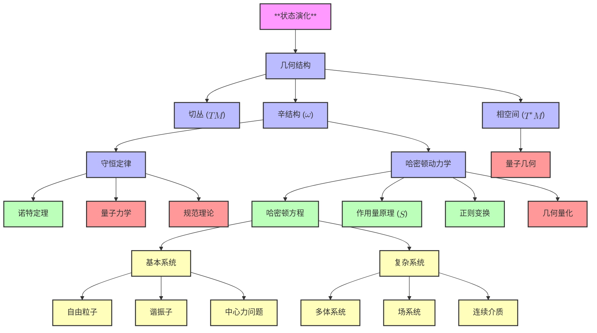

# 经典力学的纯几何基础：从状态演化到物理定律
* * *

--- 所有物理定律不过是演化中的几何之低语。

# **I. 纯粹起源**

**题词**：
*"起初，唯有变化。"*

## **I.A. 状态演化作为基本现实**

### **I.A.1 状态演化的首要性**

宇宙在其最基本层面上是一个状态演化系统。每个物理系统由其**状态**定义，表示描述该系统在某一时刻所需的所有信息。经典力学的核心是对这些状态如何随时间演变以及这种演变在什么条件下保持一致性和意义的研究。

状态的演化不是任意的；它必须满足两个普遍的要求：

1. **决定论**：
   演化必须将一个状态唯一映射到未来的(或过去的)另一个状态。给定系统的当前状态，其未来轨迹必须完全可预测。这确保了物理定律的连续性和连贯性。

2. **可逆性**：
   演化必须允许反向映射。过去的信息必须可以从当前状态中恢复。这确保了在演化过程中没有信息丢失，保持系统的完整性。

这两个原则对状态演化的性质施加了严格的约束，塑造了描述现实的数学和物理结构。

### **I.A.2 状态空间：演化的基础**

为了数学地描述状态演化，我们引入了**状态空间** $\mathcal{M}$ 的概念，即系统所有可能状态的集合。$\mathcal{M}$ 中的每一点对应于系统的唯一配置。

#### **I.A.2.1 $\mathcal{M}$ 的最小数学性质**
1. **光滑流形**：
   状态空间 $\mathcal{M}$ 必须是光滑流形以适应演化的连续性质。
   - 光滑性确保状态的小变化导致演化的小变化，反映物理连续性。
   - $\mathcal{M}$ 的维度对应于系统的自由度。

2. **连续演化**：
   状态演化由光滑曲线 $\gamma(t) \subset \mathcal{M}$ 描述，该曲线由时间 $t$ 参数化。这条曲线代表系统在状态空间中的轨迹。

#### **I.A.2.2 例子**：
- 对于在三维空间中运动的单个粒子，状态空间 $\mathcal{M}$ 是 $\mathbb{R}^3$，表示粒子的位置。
- 对于摆，$\mathcal{M} = S^1$，即圆，表示其角位置。

### **I.A.3 一致演化的要求**

决定论和可逆性的要求对 $\mathcal{M}$ 施加了结构：

1. **流的存在**：
   状态演化由 $\mathcal{M}$ 上的向量场 $X$ 表示，该向量场为状态空间中的每一点赋予一个变化方向。由 $X$ 生成的流决定了状态如何随时间演化。

2. **结构的保持**：
   演化对状态的映射必须保持 $\mathcal{M}$ 的某些性质，以确保系统的行文是一致和可逆的。这一要求直接导致了几何的出现，如下一节所探讨的。

## **I.B. 几何的出现**

### **I.B.1 切丛结构：运动需要方向**

从连续演化的要求中首先出现的几何结构是**切空间**。

1. **切向量和演化**：
   在每一点 $x \in \mathcal{M}$，可能的变化方向由切空间 $T_x\mathcal{M}$ 描述。切向量 $v \in T_x\mathcal{M}$ 表示系统状态在 $x$ 处的变化率。

2. **向量场**：
   状态演化由 $\mathcal{M}$ 上的光滑向量场 $X$ 控制：
   $$
   X: \mathcal{M} \to T\mathcal{M}, \quad X(x) \in T_x\mathcal{M}.
   $$
   $X$ 的积分曲线代表系统在状态空间中的轨迹。

#### **I.B.1.1 例子**：
对于沿直线运动的粒子，切向量表示其速度。向量场 $X$ 为每个位置分配一个速度，描述粒子的运动。

### **I.B.2 辛结构：可逆性和信息保持**

**可逆性**的要求，结合信息的保持，对 $\mathcal{M}$ 施加了额外的结构，产生**辛结构**。

1. **相空间和余切丛**：
   - 为了完全描述系统的状态，我们必须包括其位置和“动量”(或共轭变量)。这自然引出了**相空间** $T^*\mathcal{M}$，即 $\mathcal{M}$ 的余切丛。
   - 在相空间中，状态由一对 $(q^i, p_i)$ 表示，其中 $q^i$ 是广义坐标，$p_i$ 是它们的共轭动量。

2. **辛形式**：
   相空间中状态的演化由**辛形式** $\omega$ 控制，这是一个闭合、非退化的 $2$-形式：
   $$
   \omega = \sum_i dp_i \wedge dq^i.
   $$
   - **非退化性**确保 $\omega$ 将相空间中的每个方向与唯一的共轭方向配对。
   - **闭合性** ($d\omega = 0$) 确保演化保持相空间结构，保证可逆性和信息保持。

3. **哈密顿演化**：
   辛结构要求存在一个**哈密顿函数** $H: T^*\mathcal{M} \to \mathbb{R}$，它生成系统的演化。系统的流由哈密顿向量场 $X_H$ 确定，满足：
   $$
   \iota_{X_H}\omega = dH.
   $$

#### **I.B.2.1 例子**：
对于处于势能 $V(q)$ 中的粒子，哈密顿量为：
$$
H(q, p) = \frac{p^2}{2m} + V(q).
$$
辛结构确保 $(q, p)$ 的演化守恒能量并保持相空间体积。

### **I.B.3 相空间：演化的自然竞技场**

**切丛结构**和**辛结构**的结合自然引出**相空间**的概念。

1. **相空间的定义**：
   相空间 $T^*\mathcal{M}$ 是状态空间 $\mathcal{M}$ 的余切丛。它将位置和动量统一为单一的几何结构。

2. **相空间的性质**：
   - **维数**：如果 $\mathcal{M}$ 有 $n$ 维，则 $T^*\mathcal{M}$ 有 $2n$ 维。
   - **正则坐标**：相空间配备了正则坐标 $(q^i, p_i)$，其中 $i = 1, \dots, n$。

3. **相空间的作用**：
   相空间为描述状态演化提供了自然的舞台，辛形式 $\omega$ 编码了系统的根本几何结构。

### **I.B.4 哈密顿向量场：演化的生成器**

辛结构进一步要求状态演化由**哈密顿向量场** $X_H$ 控制，它生成系统在相空间中的流。

1. **哈密顿动力学**：
   向量场 $X_H$ 满足：
   $$
   \iota_{X_H}\omega = dH,
   $$
   其中 $H$ 是哈密顿函数。这个方程确定了系统在相空间中的流。

2. **运动方程**：
   在正则坐标下，运动方程为：
   $$
   \dot{q}^i = \frac{\partial H}{\partial p_i}, \quad \dot{p}_i = -\frac{\partial H}{\partial q^i}.
   $$
   这些是**哈密顿方程**，描述了系统在位置和动量方面的演化。

## **I.C. 结论**

当状态演化受到决定论和可逆性的要求时，必然会出现几何结构。切丛结构描述了局部运动的方向，而辛结构确保演化保持信息和一致性。这两种结构共同定义了相空间作为描述物理系统的自然舞台。哈密顿量作为演化的生成器，完成了框架，建立了经典力学的几何基础。

在下一节中，我们将把这些结构形式化为一个完整的**几何框架**，展示物理定律如何自然地作为这一统一几何基础的结果而出现。

# **II. 几何框架**

**题词**：
*"空间弯曲以适应运动。"*

如第一节所述，状态的一致演化要求出现一个支配物理系统行为的几何框架。这个框架建立在基本结构之上——辛几何、相空间和守恒定律——这些不仅是数学上的便利，而是描述和保持状态演化本质的内在需求。本节深入探讨自然出现的几何结构，并展示它们如何引出经典力学的物理定律。

## **II.A. 自然几何结构**

### **II.A.1. 辛形式：相空间的基础**

几何框架的核心是**辛形式** $\omega$，这是一个闭合、非退化的 $2$-形式，它编码了相空间 $T^*\mathcal{M}$ 的结构。它为描述经典力学中的状态演化提供了数学基础。

1. **定义和性质**：
   辛形式 $\omega$ 满足以下性质：
   - **非退化性**：对于任何非零切向量 $v$，存在切向量 $w$ 使得 $\omega(v, w) \neq 0$。这确保了相空间能够完全描述状态演化。
   - **闭合性**：$d\omega = 0$，意味着 $\omega$ 在光滑变形下保持不变。这保证了演化过程中相空间结构的守恒。

2. **正则坐标**：
   Darboux 定理确保局部上 $\omega$ 总是可以写成正则形式：
   $$
   \omega = \sum_{i=1}^n dp_i \wedge dq^i,
   $$
   其中 $(q^i, p_i)$ 是广义位置和动量坐标。这些**正则坐标**为相空间提供了一个自然的表示。

3. **物理解释**：
   - 辛形式测量相空间中由轨迹扫过的“面积”。
   - 它编码了位置 $q$ 和动量 $p$ 之间的基本关系，确保它们在演化过程中的相互依赖。

### **II.A.2. 相空间：状态演化的竞技场**

相空间 $T^*\mathcal{M}$，即状态空间 $\mathcal{M}$ 的余切丛，提供了描述经典力学的自然舞台。

1. **相空间的结构**：
   - 相空间中的一点由 $(q^i, p_i)$ 表示，其中 $q^i$ 是广义位置，$p_i$ 是其共轭动量。
   - 相空间的维度为 $2n$，其中 $n$ 是系统的自由度数。

2. **哈密顿流**：
   相空间中的状态演化由哈密顿函数 $H(q, p)$ 控制，它生成系统的流。辛形式 $\omega$ 确保这个流保持相空间的结构。

3. **体积守恒(Liouville 定理)**：
   辛结构保证由 $H$ 生成的流保持相空间中的总体积：
   $$
   \mathcal{L}_{X_H} \omega^n = 0,
   $$
   其中 $\omega^n$ 是相空间体积形式，$\mathcal{L}_{X_H}$ 是沿哈密顿向量场 $X_H$ 的 Lie 导数。这种不变性反映了相空间中轨迹的不可压缩性。

### **II.A.3. 泊松括号：可观测量的代数**

辛结构与相空间上的函数之间的相互作用自然地引出了**泊松括号**的概念，它编码了可观测量之间的代数关系。

1. **泊松括号的定义**：
   对于定义在相空间上的两个函数 $f, g$，它们的泊松括号由下式给出：
   $$
   \{f, g\} = \sum_{i=1}^n \left( \frac{\partial f}{\partial q^i} \frac{\partial g}{\partial p_i} - \frac{\partial f}{\partial p_i} \frac{\partial g}{\partial q^i} \right).
   $$
   泊松括号是反对称的、双线性的，并满足 Jacobi 恒等式，使其成为可观测量空间上的 Lie 括号。

2. **物理意义**：
   - 泊松括号描述了一个可观测量相对于另一个可观测量在演化下的变化。
   - 对于哈密顿量 $H$，可观测量 $f$ 的时间演化由下式给出：
     $$
     \frac{df}{dt} = \{f, H\}.
     $$

3. **与辛几何的联系**：
   泊松括号反映了辛结构，因为它直接从辛形式 $\omega$ 中产生。它为分析复杂系统的动力学提供了强大的工具。

### **II.A.4. 守恒定律和对称性**

辛结构自然地结合了对称性和守恒的原则，正如 Noether 定理所形式化的。

1. **Noether 定理**：
   对于哈密顿量 $H$ 的每一个连续对称性，存在一个守恒量。对称性由保持辛形式 $\omega$ 的变换表示。

2. **守恒量的例子**：
   - **能量守恒**：如果 $H$ 与时间无关，则总能量守恒。
   - **动量守恒**：如果 $H$ 在空间平移下不变，则线性动量守恒。
   - **角动量守恒**：如果 $H$ 在旋转下不变，则角动量守恒。

3. **几何解释**：
   守恒量对应于相空间中的不变子流形。由 $H$ 生成的流被限制在这些子流形上，反映了对称性所施加的约束。

## **II.B. 从几何到物理定律**

几何结构的出现为推导经典力学的物理定律提供了基础。这些定律不是外部强加的，而是作为辛框架的自然结果而出现。

### **II.B.1. 哈密顿方程：演化的生成元**

辛结构和哈密顿量 $H$ 一起决定了系统通过**哈密顿方程**的演化。

1. **哈密顿向量场**：
   系统的演化由哈密顿向量场 $X_H$ 控制，定义为：
   $$
   \iota_{X_H} \omega = dH,
   $$
   其中 $\iota_{X_H}$ 表示 $X_H$ 与辛形式 $\omega$ 的内积。

2. **正则方程**：
   在正则坐标 $(q^i, p_i)$ 下，哈密顿方程具有熟悉的形式：
   $$
   \dot{q}^i = \frac{\partial H}{\partial p_i}, \quad \dot{p}_i = -\frac{\partial H}{\partial q^i}.
   $$
   这些方程描述了位置和动量的时间演化。

3. **几何流**：
   哈密顿方程描述了系统在相空间中的流，确保演化过程中辛结构的保持。

### **II.B.2. 作用量原理：变分基础**

**最小作用量原理** 提供了经典力学的另一种表述，根植于作用泛函 $S$ 的变分性质。

1. **作用泛函**：
   作用 $S$ 定义为：
   $$
   S = \int L \, dt,
   $$
   其中 $L = T - V$ 是拉格朗日量。作用量测量了配置空间中轨迹的“代价”。

2. **变分原理**：
   系统的真实轨迹使作用 $S$ 极值化，导致配置空间中的 Euler-Lagrange 方程或相空间中的哈密顿方程：
   $$
   \delta S = 0 \implies \iota_{X_H}\omega = dH.
   $$

3. **与辛几何的联系**：
   作用量原理自然地源于辛 $1$-形式 $\theta = \sum_i p_i dq^i$，突显了其几何起源。

### **II.B.3. 对称性和正则变换**

正则变换是相空间中保持辛形式 $\omega$ 的变换。

1. **定义**：
   变换 $(q, p) \to (Q, P)$ 是正则的，如果：
   $$
   \omega = \sum_i dP_i \wedge dQ^i = \sum_i dp_i \wedge dq^i.
   $$

2. **物理意义**：
   - 正则变换通过改变坐标简化问题，同时保持动力学。
   - 它们构成了高级方法的基础，例如可积系统中的作用-角度变量。

3. **守恒量**：
   哈密顿量的对称性对应于正则变换，通过 Noether 定理引出守恒量。

## **II.C. 结论**

辛几何、相空间和守恒定律的几何结构构成了经典力学的基础。这些结构作为一致状态演化的必要条件而出现，并自然地引出哈密顿方程、作用量原理和基本量的守恒。通过将这些定律理解为几何结果，我们揭示了经典力学的内在统一性。

在下一节中，我们将探讨具体的物理系统如何作为这一几何框架的直接表现，展示了这些原则的力量和普遍性。

# **III. 物理系统作为几何必要性**

**题词**：
*"从抽象的必然性中产生具体的实在。"*

第二节中推导出的数学框架为状态演化提供了一个普遍且优雅的描述。其力量在于能够将物理系统描述为几何原则的自然表现。在本节中，我们将展示基本和复杂的物理系统如何从这个框架中涌现，揭示物理现象的多样性被编码在相空间、辛几何和哈密顿动力学的简单而普遍的结构中。

## **III.A. 基本系统**

基本系统代表最简单的动力系统，其中相空间的几何结构和哈密顿函数直接控制运动。这些系统为理解更复杂的动力学提供了基础。

### **III.A.1. 自由粒子**

自由粒子是最基本的系统，表示没有外力作用下的运动。

1. **哈密顿量**：
   质量为 $m$ 的自由粒子的哈密顿量仅包含动能：
   $$
   H = \frac{p^2}{2m},
   $$
   其中 $p$ 是动量。

2. **相空间轨迹**：
   - 由哈密顿方程得出的运动方程为：
     $$
     \dot{q} = \frac{\partial H}{\partial p} = \frac{p}{m}, \quad \dot{p} = -\frac{\partial H}{\partial q} = 0.
     $$
   - 位置 $q$ 随时间线性演化，动量 $p$ 保持不变。
   - 在相空间中，轨迹是平行于 $q$-轴的直线，表示匀速运动。

3. **几何解释**：
   - 辛结构确保了相空间体积的守恒，与 Liouville 定理一致。
   - 系统的轨迹是相空间中的测地线(直线)，反映了不存在外力。

### **III.A.2. 谐振子**

谐振子描述具有二次势能的系统，如弹簧或接近平衡的小振动。

1. **哈密顿量**：
   谐振子的哈密顿量为：
   $$
   H = \frac{p^2}{2m} + \frac{kq^2}{2},
   $$
   其中 $k$ 是弹簧常数，$q$ 是位置，$p$ 是动量。

2. **相空间轨迹**：
   - 哈密顿方程给出：
     $$
     \dot{q} = \frac{\partial H}{\partial p} = \frac{p}{m}, \quad \dot{p} = -\frac{\partial H}{\partial q} = -kq.
     $$
   - 解为正弦振动：
     $$
     q(t) = A \cos(\omega t + \phi), \quad p(t) = -m\omega A \sin(\omega t + \phi),
     $$
    其中 $\omega = \sqrt{\frac{k}{m}}$ 是固有频率。
   - 在相空间中，轨迹是封闭的椭圆，反映周期性运动。

3. **几何解释**：
   - 能量守恒，每个椭圆对应一个能量常数面。
   - 辛结构确保每个椭圆所包围的面积保持不变，与守恒定律一致。

### **III.A.3. 中心力问题**

中心力系统描述只依赖于径向距离 $r$ 的势能下的运动。

1. **哈密顿量**：
   粒子在中心势 $V(r)$ 下的哈密顿量为：
   $$
   H = \frac{p_r^2}{2m} + \frac{L^2}{2mr^2} + V(r),
   $$
   其中 $p_r$ 是径向动量，$L = r^2\dot{\theta}$ 是角动量(守恒量)，$V(r)$ 是势能。

2. **开普勒问题**：
   - 对于引力或库仑相互作用，$V(r) = -\frac{k}{r}$，导致椭圆轨道(开普勒定律)。
   - 哈密顿动力学自然生成配置空间中的圆锥截面(椭圆、双曲线或抛物线)作为轨迹。

3. **几何解释**：
   - 守恒的角动量 $L$ 对应旋转对称性。
   - 相空间轨迹被限制在一个四维子流形上，由于能量和角动量守恒，降低了维度并简化了分析。

## **III.B. 复杂系统**

基于基本系统的原理，复杂系统自然地从相同的几何框架中涌现。这些系统表现出更丰富的动力学，包括集体行为、波动现象和连续变形。

### **III.B.1. 多体系统**

多体系统由 $N$ 个相互作用的粒子组成，复杂性源于相互作用。

1. **相空间结构**：
   - 状态空间是个体粒子空间的笛卡尔积：
     $$
     \mathcal{M} = \prod_{i=1}^N \mathcal{M}_i, \quad \text{dim}(T^*\mathcal{M}) = 6N.
     $$

2. **哈密顿量**：
   哈密顿量包括动能和相互作用项：
   $$
   H = \sum_{i=1}^N \frac{p_i^2}{2m_i} + \sum_{i < j} V(r_{ij}),
   $$
   其中 $r_{ij} = |\mathbf{r}_i - \mathbf{r}_j|$ 是粒子之间的距离。

3. **涌现行为**：
   - 对称性约化技术(例如质心坐标)简化了分析。
   - 集体现象，如耦合振子中的正常模式，自然地从辛结构中涌现。

4. **几何解释**：
   - 总动量和角动量的守恒反映了系统的平移和旋转对称性。
   - 相空间轨迹揭示了某些区域内的集体现象和混沌动力学。

### **III.B.2. 场系统**

场系统描述电磁场或波动方程等场在连续时空中的动力学。

1. **配置空间**：
   - 状态空间是定义在空间域 $M$ 上的场 $\phi(x)$ 的空间，相空间由场及其共轭动量 $\pi(x)$ 给出。

2. **哈密顿量**：
   哈密顿密度控制动力学：
   $$
   H = \int_M \left[ \frac{\pi^2}{2} + \frac{1}{2} (\nabla \phi)^2 + V(\phi) \right] d^3x,
   $$
   其中 $V(\phi)$ 是势能密度。

3. **波动方程**：
   哈密顿形式主义导出场方程，如 Klein-Gordon 方程或 Maxwell 方程，描述波或场的演化。

4. **几何解释**：
   - 辛结构扩展到无限维，保持场配置的相空间结构。
   - 守恒定律，如能量和动量守恒，源自哈密顿量的对称性。

### **III.B.3. 连续介质**

连续系统，如流体或弹性固体，由具有无限自由度的可变形介质描述。

1. **配置空间**：
   - 状态空间是由微分同胚 $\phi: M \to M$ 描述的介质变形的空间。

2. **哈密顿动力学**：
   - 哈密顿量包括动能和弹性或势能项。
   - 对于流体，Euler 方程自然地从哈密顿框架中产生。

3. **几何解释**：
   - 相空间是无限维的，辛结构控制流场的演化。
   - 涡量和能量的守恒反映了系统的底层对称性。

## **III.C. 结论**

无论是基本系统还是复杂系统，都是第二节中发展的几何框架的自然结果。从自由粒子和谐振子的简单性到多体系统和连续介质的丰富性，相同的原理——辛几何、哈密顿流和守恒定律——支配所有物理系统。这种普遍性突显了几何方法在经典力学中的深刻力量。

在下一节中，我们将探讨这个框架如何作为现代物理学的桥梁，统一经典和量子力学，并扩展到场动力学和量子几何等更广泛的理论。

# **IV. 深度统一**

**题词**：
*"万物皆几何，几何即万物。"*

以几何框架重构的经典力学为现代物理学提供了一个深刻的桥梁。相空间、辛几何和守恒定律的结构自然延伸到量子领域及更远，揭示了看似不同的理论之间的深刻联系。本节探讨了经典力学的几何框架如何无缝地与量子力学、规范理论和现代物理范式相结合，最终形成一个统一的物理定律视野。

## **IV.A. 经典-量子桥梁**

经典力学不仅是量子力学的一个极限情况，而是其几何前驱。通过对经典相空间结构进行量化，我们揭示了经典和量子描述自然界之间的数学连续性。

### **IV.A.1. 几何量化**

几何量化通过直接从相空间的辛几何构造一个量子框架，形式化了从经典到量子力学的过渡。

#### **IV.A.1.1 相空间体积量化**
1. **量化条件**：
   辛形式 $\omega$ 定义了相空间的体积。为了实现量化，总相空间体积必须以 $2\pi\hbar$ 为单位离散化，导致：
   $$
   [\omega / 2\pi\hbar] \in H^2(M, \mathbb{Z}),
   $$
   其中 $H^2(M, \mathbb{Z})$ 是相空间 $M$ 的第二上同调群。此条件确保相空间与量子态兼容。

2. **物理解释**：
   量化条件反映了量子态的离散性质。例如，在原子系统中，角动量和能级的量化直接源自这一几何条件。

#### **IV.A.1.2 预量子线丛和波函数**
1. **线丛**：
   在相空间上构造预量子线丛，其中辛形式 $\omega$ 作为其曲率。这个丛支持量子力学中的波函数作为其截面。

2. **波函数**：
   量子态由线丛上的波函数表示，波函数的相位由辛一形式 $\theta = p_i dq^i$ 确定。作用量 $S$ 作为波函数中的相因子出现：
   $$
   \psi \sim e^{iS/\hbar}.
   $$

#### **IV.A.1.3 观测量和对易关系**
1. **量子观测量**：
   经典观测量 $f(q, p)$ 对应于通过与 $f$ 相关联的哈密顿向量场 $X_f$ 构造的量子算符 $\hat{f}$：
   $$
   \hat{f} = -i\hbar \nabla_{X_f} + f.
   $$
   这种算符映射保持了相空间的几何结构。

2. **对易关系**：
   量子对易子自然地从经典泊松括号中涌现：
   $$
   \{f, g\} \to \frac{1}{i\hbar}[\hat{f}, \hat{g}].
   $$
   这种对应关系将经典力学的辛几何与量子力学的代数结构联系起来。

### **IV.A.2. 路径积分表述**

路径积分表述强调了作用量 $S$ 在连接经典和量子系统中的重要作用。

1. **费曼路径积分**：
   量子系统在两个状态之间跃迁的概率幅由所有可能路径的和给出，每条路径加权因子为 $e^{iS/\hbar}$：
   $$
   \mathcal{A} \sim \int e^{iS[q]/\hbar} \, \mathcal{D}[q].
   $$
   这里，$S[q]$ 是每条路径 $q(t)$ 的经典作用量。

2. **经典极限**：
   在 $\hbar \to 0$ 的极限下，路径积分的主要贡献来自使 $S[q]$ 极值化的路径。这恢复了经典的最小作用原理，建立了经典和量子力学之间的直接联系。

### **IV.A.3. 量子-经典转换**

几何框架澄清了经典和量子力学之间的关系：
1. **相干性**：经典轨迹嵌入为量子力学中的相干态，保持辛结构。
2. **涌现**：当 \(\hbar \to 0\) 时，经典力学自然地作为量子力学的极限出现，而辛形式 $\omega$ 保持不变。

## **IV.B. 向现代物理学的扩展**

经典力学的几何框架无缝地延伸到现代物理学，提供了关于场动力学、规范理论和量子几何的深刻见解。

### **IV.B.1. 规范理论和场动力学**

描述自然界基本力的规范理论深深植根于辛几何。

1. **联络形式作为物理场**：
   - 辛结构推广到规范理论，其中联络形式 $A$ 表示物理场(如电磁势)。
   - $A$ 的曲率 $F = dA + A \wedge A$ 对应于场强(如电磁场 $F_{\mu\nu}$)。

2. **场的正则量化**：
   - 哈密顿形式主义扩展到场论，相空间由场配置及其共轭动量定义。
   - 规范场的对称性生成守恒荷，如电荷或量子色动力学 (QCD) 中的颜色荷。

3. **几何解释**：
   - 辛结构支配规范场的动力学，确保与 Noether 定理和守恒定律的一致性。
   - 辛几何与规范不变性的相互作用构成了粒子物理标准模型的基础。

### **IV.B.2. 量子几何**

量子力学和广义相对论在量子几何的研究中汇聚，其中经典时空本身成为一种受量化影响的几何实体。

1. **非交换几何**：
   - 经典相空间被非交换几何取代，坐标 $(x, p)$ 满足对易关系：
     $$
     [x, p] = i\hbar.
     $$
   - 该框架将量子力学推广到弯曲和高维空间。

2. **量子群**：
   - 辛对称群变形为量子群，描述量子时空中的对称性。

3. **时空的几何量化**：
   - 经典力学的辛结构启发了对时空本身的量化尝试，导致了量子引力理论。

### **IV.B.3. 未来方向**

几何框架为物理学和数学的新发展开辟了道路，包括：

1. **量子引力**：
   - 辛几何为统一量子力学和广义相对论提供了自然基础。
   - 用 Ashtekar 变量描述的引力相空间将经典力学与圈量子引力联系起来。

2. **信息论**：
   - 几何方法揭示了辛结构与熵之间的深刻联系，暗示了经典力学与黑洞热力学之间的联系。

3. **涌现现象**：
   - 几何原理可能解释凝聚态物理中的涌现现象，如拓扑物质相和量子霍尔效应。

## **IV.C. 结论**

经典力学的几何框架作为连接经典和现代物理学的桥梁，将多样化的理论统一在辛几何和状态演化的普遍原则之下。从相空间的量化到场动力学和时空结构，几何学作为物理定律的语言浮现出来。这种深刻的统一不仅加深了我们对自然界的理解，还为理论和实验探索指明了新的方向。

最后，经典力学作为几何框架的重构揭示了所有物理定律确实是“演化中的几何之低语”。通过倾听这些低语，我们揭开了现实结构背后的深刻统一性。

# **附录 A：经典力学中的概念关系**

为了增强读者对核心思想及其相互联系的理解，我们提供了一个图表，该图表以视觉方式组织了文档中讨论的关键概念之间的关系。这个概念图突出了基本原理如何导致几何结构，这些几何结构进而产生物理定律、系统及其在现代物理学中的扩展。

## **A.1. 概念关系的解释**

此图表展示了核心思想、几何结构、物理定律及其含义之间的逻辑流程和联系：

### **A.1.1. 核心思想：状态演化**
- **状态演化**是经典力学中所有后续结构的根源。它需要**决定论**和**可逆性**，这些自然地导致了几何结构的出现。

### **A.1.2. 几何结构**
- **切丛** ($TM$) 捕捉运动的局部方向，而**辛结构** ($\omega$) 确保信息的保持和一致性。
- **相空间** ($T^*\mathcal{M}$) 统一了位置和动量，作为描述状态演化的自然场所。
- 这些结构支撑了 **守恒定律** 和 **哈密顿动力学**，它们支配着物理系统的行为。

### **A.1.3. 物理定律**
- **哈密顿方程** 和 **作用量原理** 自然地从辛框架中产生，提供了经典系统的运动方程。
- **诺特定理** 将对称性与守恒量联系起来，而 **正则变换** 保持辛结构，使得力学中有强大的简化方法。

### **A.1.4. 物理系统**
- 几何框架不仅支配**基本系统**，如自由粒子、谐振子和中心力问题，也支配**复杂系统**，如多体系统、场和连续介质。
- 这些系统展示了多种物理现象如何从相同的几何原则中涌现。

### **A.1.5. 与现代物理学的联系**
- 经典力学是**量子力学**的基础，**几何量化**搭建了这两个框架之间的桥梁。
- 辛结构直接扩展到**规范理论**，描述基本力，并扩展到**量子几何**，其中时空本身成为量化研究的对象。

## **A.2. 关键要点**

- **框架的统一性**：从状态演化到现代扩展，整个经典力学结构由几何原则统一。
- **涌现的定律**：物理定律(例如，哈密顿方程、守恒定律)不是外部强加的，而是从相空间的几何结构中自然涌现的。
- **理论间的连续性**：该框架无缝连接了经典力学、量子力学和现代物理学，展示了辛几何的普遍性。

这种视觉表示强化了文档的核心主题：**几何是物理定律的语言**，而经典力学是其最优雅的表现形式。

