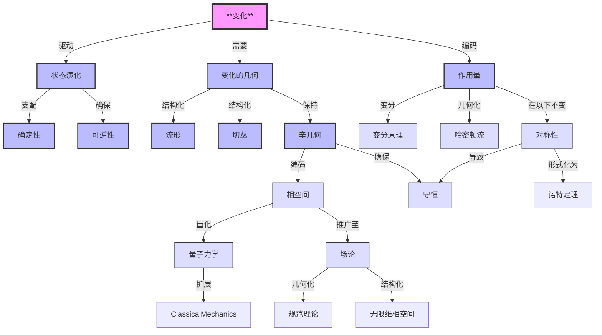

# 经典力学：变化与对称性的几何重构
* * *

--- 从变化的流中涌现出对称性的结构。

# **I. 基础：变化的本质**

**题词**：*"起初，有变化。其余的一切随之而来。"*

经典力学始于一个无可否认的观察：**事物在变化**。每个物理现象的核心是状态的演化 —— 这一过程由深层次的结构性原理所支配。通过理解变化的本质，我们揭示构成经典力学基础的几何结构。本章探讨**变化**作为最根本的概念，介绍变化发生的状态空间，并推导描述和保持这种演化的必要几何结构。

## **I.A. 变化概念**

本节将变化确立为经典力学的基础概念。定义描述状态演化的数学框架，并推导决定论和可逆性的原则。

### **I.A.1. 状态空间：变化的舞台**

系统的演化需要一个明确定义的数学空间，该空间包含其所有可能的状态。这个“状态空间”记作 $\mathcal{S}$。

- **定义**：
  状态空间 $\mathcal{S}$ 是系统所有可能配置的集合。每个点 $s \in \mathcal{S}$ 表示系统在某一时刻的完整描述。

- **例子**：
  - 对于 $n$-维空间中的简单粒子：$\mathcal{S} = \mathbb{R}^n$。
  - 对于单摆：$\mathcal{S} = \{ \text{angle } (\theta), \text{ angular velocity } (\dot{\theta}) \}$。
  - 对于多体系统：$\mathcal{S}$ 成为更高维的空间，编码所有粒子的状态。

### **I.A.2. 演化算子：变化的动力学**

为了描述系统如何随时间演化，我们引入**演化算子** $\Phi$，它将初始状态映射到未来状态。演化由时间 $t$ 参数化。

- **定义**：
  演化算子是一族依赖于一个参数的变换：
  $$
  \Phi: \mathcal{S} \times \mathbb{R} \to \mathcal{S},
  $$
  使得 $s(t) = \Phi(s_0, t)$，其中 $s_0$ 是系统的初始状态。

- **关键性质**：
  1. **恒等性**：在 $t = 0$ 时，状态保持不变：
     $$
     \Phi(s, 0) = s.
     $$
  2. **群性质**：演化在时间上一致：
     $$
     \Phi(\Phi(s, t_1), t_2) = \Phi(s, t_1 + t_2).
     $$
  3. **连续性**：演化光滑地依赖于时间 $t$：
     $$
     \lim_{h \to 0} \Phi(s, t + h) = \Phi(s, t).
     $$

### **I.A.3. 变化的原则：决定论和可逆性**

从 $\Phi$ 的性质中，我们推导出两个构成经典力学支柱的关键原则：

1. **决定论**：
   系统的未来状态由其当前状态唯一确定：
   $$
   s(t_2) = \Phi(s(t_1), t_2 - t_1).
   $$
   这将保证系统的演化是可预测且明确的。

2. **可逆性**：
   物理演化必须允许重建过去的状态：
   $$
   \Phi(s, -t) = \Phi^{-1}(s, t).
   $$
   这意味着控制演化的定律是时间对称的，确保过程中没有信息丢失。

## **I.B. 变化的几何结构**

本节推导支持一致状态演化的必要几何结构。展示这些结构如何自然地从经典力学的要求中涌现出来。

### **I.B.1. 流形结构：状态空间的基础**

状态空间 $\mathcal{S}$ 必须是一个**光滑流形**，以支持演化的连续性和可微性。

- **定义**：
  流形是一个局部类似于 $\mathbb{R}^n$ 的数学空间，允许状态之间的光滑变换。

- **局部坐标**：
  $\mathcal{S}$ 中的每个点都有一个邻域 $U$ 和一个坐标映射：
  $$
  \varphi: U \to \mathbb{R}^n.
  $$
  这些坐标使我们能够使用微积分描述演化。

- **物理解释**：
  - 三维空间中粒子的位置由三个坐标 $(x, y, z)$ 描述。
  - 对于单摆，状态空间是一个圆柱体，坐标为 $(\theta, \dot{\theta})$。

### **I.B.2. 切丛和余切丛：描述速度和动量**

为了描述系统的演化，我们需要考虑其位置及其变化率。这需要额外的结构：

1. **切丛 $TM$**：
   切丛 $TM$ 是系统所有可能速度的空间。对于每个点 $s \in \mathcal{S}$，存在一个切空间 $T_sM$，其中包含所有可能的速度向量。

   - **例子**：对于 $\mathbb{R}^3$ 中的粒子，切丛包括位置 $(x, y, z)$ 和速度 $(\dot{x}, \dot{y}, \dot{z})$。

2. **余切丛 $T^*M$**：
   余切丛 $T^*M$ 是系统所有可能动量的空间。对于每个点 $s \in \mathcal{S}$，存在一个余切空间 $T_s^*M$，其中包含所有可能的动量向量 $p$。

   - **物理意义**：余切丛构成相空间的基础，在此位置和动量被视为基本变量。

### **I.B.3. 辛几何：演化中保持信息**

变化必须保持状态之间的区别，确保不丢失信息。这一要求引入了**辛结构**，它编码相空间的几何。

- **辛形式**：
  辛形式 $\omega$ 是一个闭合、非退化的$2$-形式，满足：
  $$
  \omega \in \Lambda^2(T^*M), \quad d\omega = 0, \quad \omega^n \neq 0.
  $$

- **典范形式**：
  在局部坐标 $(q^i, p_i)$ 下，辛形式取典范形式：
  $$
  \omega = \sum dp_i \wedge dq^i.
  $$

- **物理解释**：
  辛形式测量相空间中的“面积”，在演化过程中保持轨迹的结构。

### **I.B.4. 哈密顿流：变化的动力学**

辛结构自然导致**哈密顿流**，它们描述相空间中系统的确定性演化。

- **哈密顿向量场**：
  对于给定的能量函数 $H: \mathcal{S} \to \mathbb{R}$，哈密顿向量场 $X_H$ 满足：
  $$
  \iota_{X_H}\omega = dH,
  $$
  其中 $\iota_{X_H}$ 表示内积。

- **运动方程**：
  哈密顿流生成运动方程：
  $$
  \begin{cases}
  \dot{q}^i = \frac{\partial H}{\partial p_i}, \\
  \dot{p}_i = -\frac{\partial H}{\partial q^i}.
  \end{cases}
  $$

- **几何意义**：
  哈密顿流保持辛结构，确保相空间体积保持不变(刘维尔定理)。

## **I.C. 与下一章的联系**

通过将经典力学建立在变化的概念基础上，并推导描述变化所需的几何结构，我们已经建立了描述物理定律的语言和框架。下一章将介绍**作用量原理**，它编码变化的动力学，并将几何与物理系统联系起来。

# **II. 作用量原理：几何视角**

**题词**：*"自然的效应编码在几何中。"*

作用量原理是经典力学中最深刻的概念之一，它将物理系统的动力学与演化几何统一起来。远非一个随意的规则，它从相空间的深层几何结构中自然涌现，作为抽象数学不变量与物理现实之间的桥梁。本章探讨作用量原理作为一个几何不变量，推导其变分形式，并揭示其与对称性和守恒定律的紧密联系。

## **II.A. 作用量作为一个基本几何量**

本节将最小作用量原理重新解释为一个几何不变量，强调其与相空间辛结构的联系及其在定义动力学中的作用。

### **II.A.1. 作用量泛函：路径依赖的量**

**作用量泛函**为描述系统演化的路径赋予一个数值。这个泛函通过一个积分封装系统的整个动力学。

- **定义**：
  设 $\gamma: [t_1, t2] \to M$ 表示状态流形 $M$ 中的一条路径。作用量泛函定义为：
  $$
  S[\gamma] = \int_{\gamma} \alpha,
  $$
  其中 $\alpha$ 是扩展相空间 $\tilde{M} = T^*Q \times \mathbb{R}$ 上的一个 $1$-形式。

- **物理意义**：
  $S[\gamma]$ 测量系统沿着路径 $\gamma$ 演化时的总“成本”或“效应”。自然界选择使该量最小化的路径。

- **几何解释**：
  作用量是 $1$-形式 $\alpha$ 的路径积分，它编码状态空间的几何性质。

### **II.A.2. 作用量的不变性**

作用量泛函最显著的性质之一是其**在规范变换下的不变性**。

- **规范变换**：
  保持辛结构 $\omega$ 不变的变换。在坐标 $(q, p)$ 下，这些变换：
  $$
  \omega = \sum dp_i \wedge dq^i
  $$
  保持不变。

- **作用量不变性**：
  作用量泛函在这类变换下不变：
  $$
  S[\gamma] = S[\phi(\gamma)],
  $$
  其中 $\phi$ 是一个规范变换。

- **为什么不变性重要**：
  这种不变性确保从 $S$ 导出的运动方程不依赖于坐标的选择。它反映物理定律的普遍性。

### **II.A.3. 辛结构与动力学**

相空间的辛几何在作用量原理中起着核心作用。

- **辛形式**：
  辛结构 $\omega$ 由 $1$-形式 $\alpha$ 的外导数得出：
  $$
  \omega = -d\alpha.
  $$

- **由辛结构定义的动力学**：
  辛形式 $\omega$ 提供一个定义动力学的几何框架。具体来说，对于任何哈密顿量 $H$，辛结构定义一个向量场 $X_H$，使得：
  $$
  \iota_{X_H} \omega = dH.
  $$
  这个方程生成系统在相空间中的演化，正如我们将在下一章中看到的。

## **II.B. 变分原理与动力学**

本节展示作用量泛函的变分如何产生运动方程，将作用量原理与经典力学的几何结构联系起来。

### **II.B.1. 最小作用量原理**

**最小作用量原理**指出，系统在两个状态之间所遵循的路径使作用量泛函 $S[\gamma]$ 最小(或极值)。

- **数学表述**：
  对于所有保持端点不变的路径 $\gamma$ 的变分 $\delta\gamma$，作用量满足：
  $$
  \delta S[\gamma] = 0.
  $$

- **物理解释**：
  自然是“高效的”，选择使作用量最小化的路径。这一原理编码系统的确定性演化。

### **II.B.2. 欧拉-拉格朗日方程**

在构型空间中，作用量的变分导致**欧拉-拉格朗日方程**。

- **构型空间中的作用量**：
  设 $\gamma(t) = (q^i(t))$ 表示构型空间中的一条路径。作用量为：
  $$
  S[q] = \int_{t_1}^{t_2} L(q^i, \dot{q}^i, t) \, dt,
  $$
  其中 $L(q^i, \dot{q}^i, t)$ 是拉格朗日量。

- **作用量的变分**：
  通过对 $q^i(t)$ 进行变分并分部积分，我们得到：
  $$
  \delta S[q] = \int_{t_1}^{t_2} \left( \frac{\partial L}{\partial q^i} - \frac{d}{dt} \frac{\partial L}{\partial \dot{q}^i} \right) \delta q^i \, dt.
  $$

- **欧拉-拉格朗日方程**：
  要求 $\delta S[q] = 0$ 意味着：
  $$
  \frac{\partial L}{\partial q^i} - \frac{d}{dt} \frac{\partial L}{\partial \dot{q}^i} = 0.
  $$

### **II.B.3. 哈密顿方程**

在相空间中，作用量原理直接导致**哈密顿方程**。

- **哈密顿表述**：
  在相空间中，作用量泛函写为：
  $$
  S[\gamma] = \int \left( p_i \dot{q}^i - H(q^i, p_i, t) \right) dt.
  $$

- **作用量的变分**：
  通过对 $q^i(t)$ 和 $p_i(t)$ 进行变分，我们得到：
  $$
  \begin{aligned}
  \dot{q}^i &= \frac{\partial H}{\partial p_i}, \\
  \dot{p}_i &= -\frac{\partial H}{\partial q^i}.
  \end{aligned}
  $$

- **几何解释**：
  这些方程描述系统在相空间中的流，其受辛结构 $\omega$ 的支配。

## **II.C. 对称性与守恒**

本节使用诺特定理建立对称性与守恒定律之间的基本联系。

### **II.C.1. 经典力学中的对称性**

对称性是使作用量不变的系统变换。

- **定义**：
  变换 $\phi: M \to M$ 是一个对称性，如果：
  $$
  S[\phi(\gamma)] = S[\gamma].
  $$

- **例子**：
  - 时间平移不变性 → 能量守恒。
  - 空间平移不变性 → 动量守恒。
  - 旋转不变性 → 角动量守恒。

### **II.C.2. 诺特定理**

诺特定理形式化了对称性与守恒定律之间的联系。

- **陈述**：
  对于作用量的每一个连续对称性，存在一个守恒量。

- **证明概要**：
  考虑一个参数群变换 $\phi_\epsilon$ 的生成元 $X$。作用量的不变性意味着：
  $$
  \mathcal{L}_X \alpha = 0,
  $$
  导致守恒量 $Q_X = i_X \alpha$。

- **守恒量的例子**：
  - 时间平移 → 能量 $H = T + V$。
  - 空间平移 → 动量 $p = m\dot{q}$。
  - 旋转 → 角动量 $L = q \times p$。

### **II.C.3. 守恒与几何**

守恒量几何地编码在矩映射 $\mu: M \to \mathfrak{g}^*$ 中，其中 $\mathfrak{g}$ 是对称群的李代数。

- **矩映射**：
  对于对称群 $G$，矩映射满足：
  $$
  \{H, \mu(g)\} = 0 \quad \text{对所有 } g \in \mathfrak{g}.
  $$

- **守恒量作为流不变量**：
  守恒定律确保某些函数在辛流上保持不变。

## **II.D. 与下一章的联系**

作用量原理及其对称性自然地引出物理系统的几何表述。下一章将进一步扩展这些概念，展示构型空间、相空间和辛几何如何统一各种经典力学的形式体系。

# **III. 统一的几何框架**

**题词**：*"粒子的舞蹈即是空间本身的几何。"*

经典力学在其描述物理系统如何演化的几何结构中找到最深刻的表现形式。这些结构 —— 构型空间、相空间、辛形式及其相关动力学 —— 不仅是数学工具，更是物理定律本身的核心。本章在变化和作用量原理的基础上，揭示经典力学背后的统一几何框架，展示它如何自然地编码物理系统的动力学。

## **III.A. 构型空间与相空间**

本节发展经典力学中的核心几何结构，从构型空间和相空间开始，并引入辛几何作为物理演化的基础。

### **III.A.1. 构型空间：运动的舞台**

**构型空间** $Q$ 表示一个系统所有可能的位置。它是描述系统状态的最简单几何结构，不涉及其运动。

- **定义**：
  构型空间 $Q$ 是系统所有可能构型的流形。每个点 $q \in Q$ 对应于系统的唯一排列。

- **例子**：
  - 3D 空间中的自由粒子：$Q = \mathbb{R}^3$。
  - 单摆：$Q = S^1$，即可能角度的圆。
  - $N$ 个粒子的系统：$Q = \mathbb{R}^{3N}$ 或如果限制在流形 $M$ 上，则 $Q = M^N$。

- **物理解释**：
  构型空间是动力学展开的“舞台”。它编码系统的自由度。

### **III.A.2. 切丛与余切丛：从速度到动量**

为了描述运动，我们将构型空间扩展以包括速度和动量。这导致**切丛** $TQ$ 和**余切丛** $T^*Q$。

1. **切丛 $TQ$**：
   - $TQ$ 是系统所有可能速度的空间。在每个点 $q \in Q$，切空间 $T_qQ$ 包含所有速度向量 $v$。
   - **物理例子**：对于 $\mathbb{R}^3$ 中的粒子，$TQ = \mathbb{R}^3 \times \mathbb{R}^3$，表示位置和速度 $(q, \dot{q})$。

2. **余切丛 $T^*Q$**：
   - $T^*Q$ 是系统所有可能动量的空间。在每个点 $q \in Q$，余切空间 $T_q^*Q$ 包含所有动量余向量 $p$。
   - **物理例子**：对于 $\mathbb{R}^3$ 中的粒子，$T^*Q = \mathbb{R}^3 \times \mathbb{R}^3$，表示位置和动量 $(q, p)$。

- **相空间**：
  相空间被识别为余切丛 $T^*Q$，其中位置 $q$ 和动量 $p$ 被视为基本变量：
  $$
  (q^i, p_i) \in T^*Q.
  $$

### **III.A.3. 辛几何：相空间的结构**

经典力学的动力学编码在相空间的辛结构中。辛几何提供定义和保持物理系统演化结构的框架。

- **辛形式**：
  相空间 $T^*Q$ 配备一个辛 $2$-形式 $\omega$，局部定义为：
  $$
  \omega = \sum_{i=1}^n dp_i \wedge dq^i.
  $$
  这个形式测量相空间中的“面积”，并控制轨迹如何演化。

- **$\omega$ 的关键性质**：
  1. **非退化性**：对所有 $Y$，若 $\omega(X, Y) = 0$，则 $X = 0$。
  2. **闭合性**：$d\omega = 0$，确保相空间体积的保持。

- **规范坐标**：
  Darboux 定理保证在局部上，相空间总是可以用规范坐标 $(q^i, p_i)$ 表示，其中 $\omega = \sum dp_i \wedge dq^i$。

### **III.A.4. 拉格朗日子流形：编码物理系统**

拉格朗日子流形是相空间中的特殊子空间，编码物理系统的动力学。

- **定义**：
  子流形 $\Lambda \subset T^*Q$ 是拉格朗日子流形，如果：
  $$
  \dim(\Lambda) = n \quad \text{且} \quad \omega|_\Lambda = 0.
  $$

- **生成函数**：
  拉格朗日子流形可以局部由生成函数 $S(q)$ 描述，其中：
  $$
  p_i = \frac{\partial S}{\partial q^i}.
  $$

- **物理意义**：
  - 拉格朗日子流形表示系统可能轨迹的空间。
  - 作用量泛函 $S[q] = \int L \, dt$ 生成被约束在 $\Lambda$ 上的动力学。

## **III.B. 动力学作为几何**

本节将经典力学的动力学重新表述为相空间的几何，展示辛流如何保持相空间结构并统一不同的形式体系。

### **III.B.1. 哈密顿向量场：生成动力学**

系统的动力学由哈密顿函数 $H(q, p)$ 控制，它表示系统的总能量。哈密顿函数生成一个向量场 $X_H$，描述系统在相空间中的流。

- **定义**：
  哈密顿向量场 $X_H$ 满足：
  $$
  \iota_{X_H} \omega = dH,
  $$
  其中 $\iota_{X_H}$ 表示 $X_H$ 与 $\omega$ 的内积。

- **运动方程**：
  在规范坐标 $(q^i, p_i)$ 下，哈密顿向量场生成运动方程：
  $$
  \begin{cases}
  \dot{q}^i = \frac{\partial H}{\partial p_i}, \\
  \dot{p}_i = -\frac{\partial H}{\partial q^i}.
  \end{cases}
  $$

### **III.B.2. 辛流：保持相空间结构**

系统在相空间中的演化由**辛流**描述，它保持辛形式 $\omega$。

- **刘维尔定理**：
  辛流保持相空间的体积：
  $$
  \mathcal{L}_{X_H} \omega = 0 \quad \implies \quad \frac{d}{dt} \int_\Omega \omega^n = 0.
  $$

- **物理意义**：
  保持相空间体积确保系统的可能微观状态的数量随着时间保持不变，将经典力学问连接到统计力学。

### **III.B.3. 统一哈密顿和拉格朗日表述**

哈密顿和拉格朗日力学的形式体系在相空间的几何框架内得到统一。

- **拉格朗日力学**：
  动力学从构型空间中的作用量原理导出，使用拉格朗日量 $L(q^i, \dot{q}^i, t)$。

- **哈密顿力学**：
  动力学从相空间中的哈密顿量 $H(q^i, p_i, t)$ 导出。

- **勒让德变换**：
  勒让德变换连接两种形式体系：
  $$
  H(q^i, p_i) = \sum_i p_i \dot{q}^i - L(q^i, \dot{q}^i).
  $$

## **III.C. 结论**

经典力学的几何框架揭示其各种表述形式背后的深层统一性。通过将动力学描述为相空间中的辛流，我们看到几何结构的保持如何支配物理系统的演化。这一视角不仅统一哈密顿和拉格朗日方法，还为量子力学和现代物理学的扩展奠定基础，在这些领域中，几何继续发挥着核心作用。

# **IV. 现代扩展与综合**

**题词**：*"经典力学与量子力学之间的界限本身是一种几何结构。"*

经典力学的几何框架不仅是经典物理学的基础，也是量子力学和现代场论的自然前奏。本章探讨经典力学的原则如何通过几何量化扩展到量子领域，以及同样的思想如何推广到无限维系统，如场和规范理论。这些扩展揭示几何原理在物理学中的普遍性及其在统一经典和现代理论中的作用。

## **IV.A. 经典-量子桥梁**

本节揭示量子力学如何通过辛结构、量化和路径积分的几何形式主义作为经典力学的自然扩展而出现。

### **IV.A.1. 几何量化：从经典态到量子态**

从经典到量子力学的过渡编码在**几何量化**的过程中，它提供一种系统地从经典相空间构建量子系统的方法。

- **量化与辛几何**：
  经典力学由辛流形 $(M, \omega)$ 控制，其中 $\omega$ 编码相空间的结构。量化引入一个量子态的希尔伯特空间 $\mathcal{H}$ 和作用于这些态上的算符。

- **预量化**：
  - 定义一个复线丛 $L \to M$ 在相空间 $M$ 上，并带有连接 $\nabla$，使得 $\nabla$ 的曲率与辛形式成比例：
    $$
    \text{curv}(\nabla) = -\frac{i}{\hbar} \omega.
    $$
  - 这确保辛结构被“提升”到量子水平。

- **极化**：
  - 极化定义相空间变量(例如 $q^i$)的一个子集，这些变量被提升为量子算符。
  - 波函数 $\psi \in \mathcal{H}$ 仅依赖于选定的坐标，从而减少量子系统的维度。

- **状态与可观测量**：
  - 经典可观测量 $f$ 在 $M$ 上被提升为作用于 $\mathcal{H}$ 上的算符 $\hat{f}$：
    $$
    \hat{f} = -i\hbar \nabla_{X_f} + f,
    $$
    其中 $X_f$ 是 $f$ 的哈密顿向量场。

### **IV.A.2. 泊松括号与对易子的对应**

经典力学的几何结构自然引出量子力学的代数框架。

- **经典力学中的泊松括号**：
  经典可观测量的动力学由泊松括号控制：
  $$
  \{f, g\} = \sum_{i=1}^n \left( \frac{\partial f}{\partial q^i} \frac{\partial g}{\partial p_i} - \frac{\partial f}{\partial p_i} \frac{\partial g}{\partial q^i} \right).
  $$

- **量子力学中的对易子**：
  量化将泊松括号替换为对易子：
  $$
  \{f, g\} \longrightarrow \frac{1}{i\hbar} [\hat{f}, \hat{g}].
  $$

- **例子**：
  对于位置 $\hat{q}$ 和动量 $\hat{p}$，正则量化导致：
  $$
  [\hat{q}, \hat{p}] = i\hbar.
  $$

这种对应关系保持辛结构，并确保量子力学作为经典力学的扩展的一致性。

### **IV.A.3. 路径积分表述：几何视角**

量子力学的路径积分表述提供经典作用量原理在量子领域的自然扩展。

- **作用量作为相位**：
  在量子框架中，沿着路径 $\gamma$ 的作用量 $S[\gamma]$ 决定该路径的相位贡献：
  $$
  e^{iS[\gamma]/\hbar}.
  $$

- **量子传播子**：
  两个态之间的跃迁振幅由所有可能路径的和给出：
  $$
  K(q_f, t_f; q_i, t_i) = \int_{\text{paths}} e^{iS[\gamma]/\hbar} \mathcal{D}\gamma.
  $$

- **经典极限**：
  在 $\hbar \to 0$ 的极限下，路径积分的主要贡献来自使 $S[\gamma]$ 极值化的经典路径，恢复了经典力学：
  $$
  \delta S[\gamma] = 0.
  $$

路径积分表述突显经典和量子力学之间的深刻联系，即使在量子领域，经典作用量也作为组织原则。

## **IV.B. 从经典力学到场论**

本节将经典力学的几何框架扩展到连续系统、规范理论和现代物理学。

### **IV.B.1. 无限维相空间与场系统**

经典力学自然扩展到场论中，其中构型空间由场配置而非离散粒子位置组成。

- **构型空间**：
  对于定义在时空 $\Sigma$ 上的场 $\phi(x)$，构型空间是：
  $$
  \mathcal{Q} = \{\phi: \Sigma \to V\},
  $$
  其中 $V$ 是场的目标空间(例如标量或矢量场)。

- **相空间与辛结构**：
  相空间是余切丛 $T^*\mathcal{Q}$，具有辛形式：
  $$
  \omega = \int_\Sigma \delta \pi(x) \wedge \delta \phi(x),
  $$
  其中 $\pi(x)$ 是 $\phi(x)$ 的共轭动量。

- **场方程**：
  场的动力学由作用量原理导出，导致如波动方程或麦克斯韦方程等方程：
  $$
  \frac{\delta S[\phi]}{\delta \phi} = 0.
  $$

### **IV.B.2. 规范理论与几何结构**

描述自然界基本力的规范理论在辛框架内自然涌现。

- **主丛**：
  规范理论定义在一个主丛 $P \to \Sigma$ 上，带有结构群 $G$。此丛上的连接 $A$ 表示规范场。

- **场强与辛结构**：
  场强 $F = dA + \frac{1}{2}[A, A]$ 决定连接的曲率，动力学由如下形式的作用量控制：
  $$
  S[A] = \int_\Sigma \text{Tr}(F \wedge *F).
  $$

- **规范不变性**：
  作用量在局部规范变换下不变，通过诺特定理导致守恒流。

### **IV.B.3. 现代应用：从量子场论到弦理论**

几何框架进一步扩展到现代理论，如量子场论(QFT)和弦理论。

1. **量子场论**：
   - 场以类似于粒子的方式被量化，具有交换关系：
     $$
     [\phi(x), \pi(y)] = i\hbar \delta(x-y).
     $$
   - 使用路径积分计算量子振幅：
     $$
     Z = \int \mathcal{D}\phi \, e^{iS[\phi]/\hbar}.
     $$

2. **弦理论**：
   - 弦取代粒子成为基本对象，其配置由映射描述：
     $$
     X: \Sigma \to M,
     $$
    其中 $\Sigma$ 是弦的世界面，$M$ 是时空。
   - 作用量是粒子作用量的推广：
     $$
     S[X] = \int_\Sigma \sqrt{-\det(\partial_\alpha X^\mu \partial_\beta X_\mu)} \, d^2\sigma.
     $$

3. **高维理论**：
   - 几何框架如 $n$-plectic 几何和高阶规范理论将经典力学推广到描述高维中的相互作用。

## **IV.C. 结论**

经典力学向量子力学和场论的扩展揭示几何原理在物理学中的普遍性。从相空间的辛结构到场的无限维几何，相同的基础思想支配着不同尺度的系统。这种统一的视角不仅加深我们对经典和量子系统的理解，还指明未来理论物理学的发现方向，如量子引力和信息的几何。

# **附录 A : 经典力学中的概念关系**

为了帮助读者快速掌握核心思想及其相互联系，我们将展示文档中基本概念之间的关系。本附录提供一个**关系表**，随后是一个图示，直观地总结经典力学关键概念之间的逻辑流程和依赖关系。

## **A.1 关系表**

| **核心概念**          | **相关概念**                                                                                     | **关系**                                                                                                                                           | **数学框架**                                                                                  |
|-----------------------|--------------------------------------------------------------------------------------------------|-----------------------------------------------------------------------------------------------------------------------------------------------------|------------------------------------------------------------------------------------------------|
| **变化**              | 状态演化、几何、作用量                                                                       | 变化是驱动状态演化并需要几何结构的基本现象。                                                                                                       | 状态空间 $\mathcal{S}$ 上的过渡映射 $\Phi(s, t)$。                                            |
| **状态演化**         | 确定性、可逆性、几何                                                                     | 状态演化支配系统如何随时间进展，并受确定性和可逆性的约束。                                                                                         | 一个参数变换群 $\Phi: \mathcal{S} \times \mathbb{R} \to \mathcal{S}$。                        |
| **变化的几何**       | 流形、切丛、辛几何                                                                        | 几何提供描述变化和演化的结构。                                                                                                                   | 光滑流形 $(\mathcal{S}, \varphi)$，辛形式 $\omega$。                                        |
| **作用量**           | 辛几何、变分原理                                                                         | 作用量是一个几何不变量，它编码系统的动力学，并将几何与物理定律连接起来。                                                                         | 作用量泛函 $S[\gamma] = \int_{\gamma} \alpha$，其中 $\alpha$ 是一个一形式。                 |
| **辛几何**           | 相空间、哈密顿流、守恒                                                                    | 辛几何编码相空间的结构，并确保信息在演化过程中得以保存。                                                                                         | 标准辛形式 $\omega = \sum dp_i \wedge dq^i$，哈密顿向量场 $X_H$。                           |
| **对称性**           | 守恒、诺特定理                                                                            | 作用量泛函中的对称性导致守恒量，提供几何与物理定律之间深刻的联系。                                                                               | 状态空间上的群作用 $G \times M \to M$，矩映射 $\mu: M \to \mathfrak{g}^*$。                  |
| **守恒**             | 对称性、哈密顿动力学                                                                      | 守恒律(如能量、动量)自然地源于物理系统中的对称性。                                                                                                | 由诺特定理导出的守恒量 $Q_X$。                                                                |
| **量子力学**         | 辛几何、几何量化、路径积分                                                               | 量子力学通过量化辛结构并重新表述作用量原理扩展经典力学。                                                                                          | 泊松括号 $\{f, g\} \to \frac{1}{i\hbar}[\hat{f}, \hat{g}]$，路径积分 $e^{iS/\hbar}$。        |
| **场论**             | 无限维相空间、规范理论、辛结构                                                            | 场论将经典力学问扩展到具有无限自由度的系统，如场和时空依赖量。                                                                                      | 无限维相空间 $T^*\mathcal{Q}$，规范不变性，主丛 $P \to \Sigma$。                            |

## **A.2 概念关系图**

## **A.3 图中的关键见解**

1. **变化的核心作用**：
   变化是驱动经典力学中所有其他结构的根本概念，从状态演化到几何和作用量。

2. **几何作为框架**：
   状态空间(流形、切/余切丛)和相空间(辛结构)的几何对于编码状态的演化至关重要。

3. **作用量作为桥梁**：
   作用量原理将几何框架与动力学连接起来，变分原理和辛流自然地从中涌现。

4. **对称性和守恒**：
   对称性起着关键作用，通过诺特定理将物理不变量(如能量、动量)与几何联系起来。

5. **向现代物理学的扩展**：
   经典框架通过几何量化无缝扩展到量子力学，并通过无限维系统如场和规范理论扩展到场论。

## **A.4 结语**

本附录展示了经典力学中核心概念的**层次性和互联性**。通过理解这些关系，读者可以欣赏到经典力学，如本文档中所重构的那样，形成一个**统一的几何框架**，该框架连接变化、对称性和守恒，同时自然地桥接到量子力学和现代场论。这一视角不仅阐明了经典力学，还突显其在物理学更深层次结构中的基础作用。

