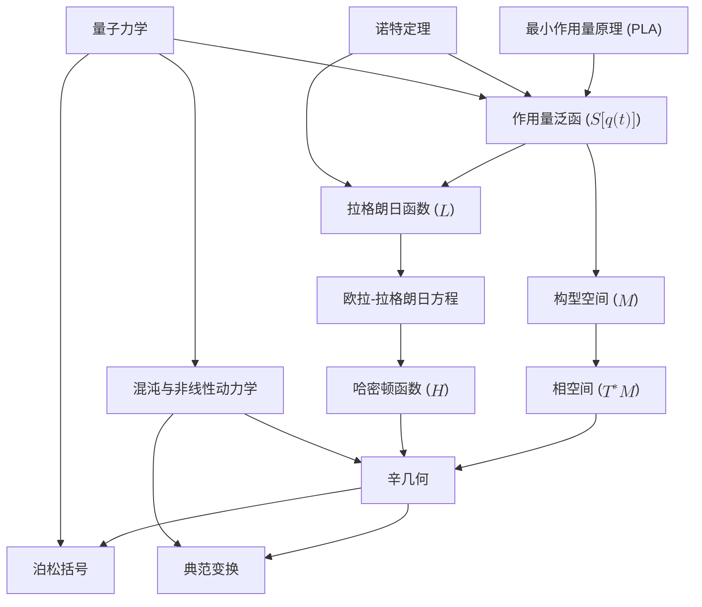

# 重构经典力学：一个统一的几何框架
* * *

--- 从作用量到结构：探索运动和演化的几何

# **1. 引言**

**题词**：
*"理解运动即是揭示自然的几何。"*

## **1.1 经典力学的基础**

经典力学，本质上，旨在描述和预测物理系统的运动。它是**物理学的基石**，为理解从天体轨迹到摆的振动等各种自然现象提供基础。然而，经典力学不仅仅是方程或计算工具的集合 —— 它是一个深刻框架，编码支配运动、对称性和守恒的**普遍原理**。

其核心是**最小作用量原理 (PLA)**，这是一个超越各种力学表述形式的统一思想。PLA 断言，系统的演化由使称为**作用量**的标量量极值化的路径决定。从这一原理出发，整个经典力学的结构展开，涵盖拉格朗日和哈密顿形式、对称性和守恒律。

但经典力学真正是什么？它仅仅是对运动的研究吗？还是更深层次的东西？经典力学最好被理解为一个**几何理论** —— 通过构型空间、相空间和辛几何的结构编码系统动力学的语言。它是一个关系理论，其中运动、力和守恒自然地从底层几何框架中涌现。

通过使用现代数学工具和深入的概念清晰度重新审视经典力学，我们可以揭示其真正的本质：**一个基于对称性、几何和变分原理的描述系统演化的通用框架**。

## **1.2 分散与挑战**

尽管其基础深厚，经典力学通常被呈现为方法和工具的分散集合。学生和研究人员在不同的表述形式中遇到它：
- **牛顿力学**，专注于力和加速度。
- **拉格朗日力学**，强调能量和约束。
- **哈密顿力学**，揭示相空间和辛几何的结构。

虽然这些表述形式在数学上是等价的，但它们的概念联系并不总是明确的。这种分散模糊了将它们联系在一起的统一原理，使学习者拥有一套方法，但对其更深层次的框架缺乏理解。

此外，历史上的介绍往往强调牛顿力学作为起点，将拉格朗日和哈密顿力学归类为高级主题。这种方法可能会错过**最小作用量原理**的深刻简单性和普遍性，该原理是所有这些表述形式的自然基础。

主要挑战包括：
1. **缺乏统一性**：牛顿、拉格朗日和哈密顿力学之间的联系很少被强调，导致理解分散。
2. **深度不足**：经典力学的几何和变分性质经常未得到充分探索，使其优雅和连贯性隐藏。
3. **现代扩展困难**：没有统一的基础，将经典力学扩展到混沌、量子力学和场论等高级主题在概念上变得具有挑战性。

然而，这些挑战也带来机会。通过围绕其统一原理重构经典力学并利用现代数学，我们可以将其从一套工具转变为一个**连贯的概念框架**。这种方法不仅深化我们对经典力学的理解，还使其无缝连接到现代物理学。

## **1.3 从第一原理重构**

本文提出一种以**原理为中心和几何为重点的重构**经典力学的方法。其核心是**最小作用量原理 (PLA)**，该原理断言，物理系统所采取的路径是使作用量泛函极值化的路径。从这一基础原理出发，我们系统地逐层构建，揭示支配运动的几何结构和对称性。

重构强调以下关键主题：
1. **作用量为核心量**：作用量泛函概括系统的动力学，将能量、运动和约束统一为一个变分原理。
2. **几何为力学的语言**：系统的动力学编码在构型空间、相空间和辛流形的几何结构中。这些结构揭示运动背后的不变关系。
3. **对称性和守恒**：机械系统中的对称性通过**诺特定理**直接导致守恒律，提供不变性和物理量之间的深刻联系。
4. **统一的表述形式**：牛顿、拉格朗日和哈密顿力学自然地作为相同底层原理的不同视角出现。
5. **现代扩展**：通过利用现代数学工具，经典力学无缝扩展到混沌理论、可积系统、量子力学和场论。

这种重构不仅仅是现有知识的重新组织，而是对经典力学作为概念杰作的探索。通过关注其**几何和变分基础**，我们旨在揭示其内在的统一性、优雅性和与现代物理学的相关性。

## **1.4 本文的目标**

本文的目的是：
1. **重组经典力学**，基于其核心原理构建一个统一的、层次分明的框架。
2. **强调其几何性质**，利用现代数学见解提供更深入的理解。
3. **统一其表述形式**，展示牛顿、拉格朗日和哈密顿力学之间的相互联系。
4. **扩展其范围**，展示经典力学如何连接到现代物理学，包括混沌、量子力学和场论。

本文面向有经验的研究人员和教育工作者，为他们提供对经典力学的新视角。它旨在加深他们对该领域的理解，突出其与现代物理学的联系，并激发对机械系统性质的新见解。

## **1.5 文档结构**

文档系统地进展，从**最小作用量原理**开始，然后扩展到构型空间和相空间的**几何结构**，最后探索**高级主题和扩展**。结构反映经典力学中思想的自然层次，确保清晰和逻辑连贯。

1. **最小作用量原理**：经典力学的基础原理，所有表述形式和结构从中衍生。
2. **构型空间与拉格朗日力学**：第一个分析框架，根植于构型空间和作用量原理。
3. **相空间与哈密顿力学**：转向相空间和哈密顿形式，揭示辛几何的结构。
4. **辛几何与正则变换**：相空间的几何基础，突出守恒律和不变量。
5. **高级主题与扩展**：探索混沌、场论及其与量子力学的联系。
6. **哲学反思**：反思经典力学的概念和哲学含义。

这种分层方法确保读者可以从基础原理逐步推进到高级概念，在每个步骤中获得清晰和深度。

## **1.6 结语**

经典力学不仅仅是一个历史遗迹 —— 它是一个不断启发和发展的活生生框架。通过从第一原理重构并强调其几何基础，我们揭示其真正的本质：**一个基于对称性、守恒和数学结构之美的运动通用理论**。本文邀请读者不仅将经典力学视为解决问题的工具，而是作为一个深刻透镜，通过它来理解自然世界。

# **2. 最小作用量原理：力学的核心**

**题词：**
*"自然的路径是平衡所有可能性的路径。"*

## **2.1 作用量泛函**

经典力学的基础是**作用量泛函**，一个编码系统基本动力学的标量量。它作为系统物理性质与控制其演化的数学方程之间的桥梁。作用量定义为：
$$
S[q(t)] = \int_{t_1}^{t_2} L(q, \dot{q}, t) \, dt,
$$
其中：
- $q(t)$ 表示系统的广义坐标，描述其在**构型空间**中的位置。
- $\dot{q}(t) = \frac{dq}{dt}$ 是广义速度。
- $L(q, \dot{q}, t)$ 是**拉格朗日量**，定义为：
  $$
  L(q, \dot{q}, t) = T(q, \dot{q}) - V(q, t),
  $$
  其中 $T$ 是**动能**，$V$ 是**势能**。

### **2.1.1 物理解释**  
作用量泛函捕捉系统轨迹随时间的**能量分布**。
- 拉格朗日量 $L = T - V$ 表示动能和势能的瞬时平衡。
- 作用量 $S$ 在整个路径 $q(t)$ 从 $t_1$ 到 $t_2$ 的过程中累积这种平衡。

本质上，作用量测量一条特定轨迹的“代价”。**最小作用量原理**断言，自然界选择使作用量达到驻值的路径，反映物理定律中的内在优化。

### **2.1.2 例子**  
1. **自由粒子**：
   对于在一维中自由运动的质量为 $m$ 的粒子：
   $$
   L = \frac{1}{2}m\dot{q}^2, \quad S[q(t)] = \int_{t_1}^{t_2} \frac{1}{2}m\dot{q}^2 \, dt.
   $$
   当粒子以恒定速度沿着直线运动时，作用量最小化。

2. **谐振子**：
   对于处于二次势 $V = \frac{1}{2}kq^2$ 中的粒子：
   $$
   L = \frac{1}{2}m\dot{q}^2 - \frac{1}{2}kq^2.
   $$
   驻值作用量对应于由胡克定律支配的振荡运动。

## **2.2 最小作用量原理 (PLA)**

**最小作用量原理 (PLA)** 断言，系统在两个时刻 $t_1$ 和 $t_2$ 之间的实际轨迹 $q(t)$ 是使作用量泛函 $S[q(t)]$ **驻值**的路径。这意味着围绕真实路径的小变动 $\delta q(t)$ 不会改变 $S$ 的一阶变化：
$$
\delta S = 0.
$$

### **2.2.1 数学推导**  
为了找到使 $S$ 极值化的轨迹，我们考虑路径的一个小变动：
$$
q(t) \to q(t) + \epsilon \eta(t),
$$
其中 $\epsilon$ 是一个小参数，$\eta(t)$ 是一个在端点处为零($\eta(t_1) = \eta(t_2) = 0$)的任意光滑函数。将此代入作用量：
$$
S[q + \epsilon \eta] = \int_{t_1}^{t_2} L(q + \epsilon\eta, \dot{q} + \epsilon\dot{\eta}, t) \, dt.
$$
对 $\epsilon$ 进行一阶展开：
$$
\delta S = \epsilon \int_{t_1}^{t_2} \left( \frac{\partial L}{\partial q} \eta + \frac{\partial L}{\partial \dot{q}} \dot{\eta} \right) dt.
$$
对第二项进行分部积分并利用边界条件($\eta(t_1) = \eta(t_2) = 0$)：
$$
\delta S = \epsilon \int_{t_1}^{t_2} \left( \frac{\partial L}{\partial q} - \frac{d}{dt} \frac{\partial L}{\partial \dot{q}} \right) \eta \, dt.
$$
为了使 $\delta S = 0$ 对所有变动 $\eta(t)$ 成立，被积函数必须为零：
$$
\frac{\partial L}{\partial q} - \frac{d}{dt} \frac{\partial L}{\partial \dot{q}} = 0.
$$
这些是**欧拉-拉格朗日方程**，即拉格朗日形式的经典力学的基本运动方程。

### **2.2.2 PLA 的普遍性**  
- PLA 并不局限于经典力学 —— 它是许多物理领域(如光学中的费马原理、量子力学中的路径积分和场论)的基础。
- 它提供一个统一的原理，从中可以推导出任何机械系统的动力学。

## **2.3 PLA 的意义**

最小作用量原理作为经典力学的**统一基础**，从中自然地涌现出各种表述形式。其意义深远，揭示了物理定律的内在简单性和优雅性。

### **2.3.1 统一的表述形式**  
PLA 统一了经典力学的不同表述形式：
- **牛顿力学**：欧拉-拉格朗日方程在直角坐标系中简化为牛顿第二定律($F = ma$)。
- **拉格朗日力学**：PLA 提供一种系统的方法，在广义坐标中推导运动方程，自然地容纳约束条件。
- **哈密顿力学**：通过**勒让德变换**，哈密顿形式从 PLA 中产生，从构型空间过渡到相空间。

### **2.3.2 对称性和守恒律**  
通过**诺特定理**，PLA 直接将作用量中的对称性与守恒律联系起来：
- **时间不变性** $\Rightarrow$ 能量守恒。
- **空间不变性** $\Rightarrow$ 动量守恒。
- **旋转不变性** $\Rightarrow$ 角动量守恒。

这种联系突显不变性和物理量之间的深刻关系，反映经典力学的几何本质。

### **2.3.3 几何解释**  
PLA 将系统的动力学编码为构型空间中的**几何问题**：
- 轨迹 $q(t)$ 是使作用量泛函极值化的曲线，类似于在曲面上寻找最短路径(测地线)。
- 这种几何视角为扩展力学到现代主题(如辛几何、场论和量子力学)提供自然框架。

### **2.3.4 简单性和普遍性**  
PLA 优雅地将复杂的动力学封装在一个变分原理中。其普遍性使其成为理解各种物理系统(从摆到行星运动及更广泛的现象)的强大工具。

## **2.4 总结**

- **作用量泛函** $S[q(t)] = \int L \, dt$ 是经典力学中的核心量，编码系统随时间的动力学。
- **最小作用量原理** 断言，物理系统沿着使作用量驻值的路径演化，导致欧拉-拉格朗日方程。
- PLA 统一经典力学的各种表述形式，将对称性与守恒律联系起来，并为理解运动提供几何框架。
- 通过揭示自然法则的简单性和优雅性，PLA 成为重构经典力学并将其扩展到现代物理学的基石。

本节为文档的下一阶段奠定基础，接下来将详细探讨构型空间、相空间和辛几何的几何结构。

# **3. 构型空间与拉格朗日力学**

**题词：**
*"运动是能量在几何约束下的结果。"*

## **3.1 构型空间 ($M$)**

**构型空间** ($M$) 是拉格朗日力学的几何基础。它表示系统可以占据的所有可能配置(或位置)的集合，作为物理运动展开的舞台。$M$ 中的每一点对应于系统自由度的一个独特排列。

### **3.1.1 定义与结构**
- 对于具有 $n$ 个自由度的系统，构型空间 $M$ 是一个 $n$ 维的**流形**。
  - 例子：一个三维空间中的单粒子有 $M = \mathbb{R}^3$。
  - 例子：一个具有两个角自由度的双摆有 $M = \mathbb{S}^1 \times \mathbb{S}^1$(两个圆的乘积)。
- 广义坐标 $q = (q^1, q^2, \dots, q^n)$ 描述系统在 $M$ 中的位置。这些坐标不仅限于直角坐标，还可以根据系统的约束和对称性进行调整。

### **3.1.2 构型空间中的约束**
约束将系统的运动限制在 $M$ 的特定子流形上：
1. **完整约束**：
   - 仅依赖于坐标和时间的约束，表示为方程 $f(q^i, t) = 0$。
   - 例子：一个被限制沿着导线移动的珠子满足 $f(x, y, z) = 0$，其中 $f$ 表示导线的形状。
   
2. **非完整约束**：
   - 依赖于速度且不能积分成位置约束的约束。
   - 例子：无滑滚动：$v_{\text{contact}} = 0$。

### **3.1.3 构型空间的作用**
- 构型空间提供一个**几何抽象**，使系统的动力学可以独立于作用在其上的具体力来表达。
- 系统在 $M$ 中的轨迹由**最小作用量原理**确定，使 $M$ 成为拉格朗日力学的自然设置。

## **3.2 拉格朗日函数**

**拉格朗日函数** $L(q, \dot{q}, t)$ 是拉格朗日力学的核心对象。它通过平衡动能和势能来封装系统的动力学。

### **3.2.1 定义**
拉格朗日函数定义为：
$$
L(q, \dot{q}, t) = T(q, \dot{q}) - V(q, t),
$$
其中：
- $T(q, \dot{q})$ 是**动能**，通常在速度 $\dot{q}^i$ 上是二次的：
  $$
  T = \frac{1}{2} \sum_{i,j} m_{ij}(q) \dot{q}^i \dot{q}^j,
  $$
  其中 $m_{ij}(q)$ 是质量张量，编码系统的惯性属性。
- $V(q, t)$ 是**势能**，依赖于配置 $q$ 并可能随时间变化。

### **3.2.2 物理解释**
- 拉格朗日函数表示系统在任何瞬时的**动能与势能之差**。
- $T$ 反映系统的运动(惯性)，而 $V$ 通过其势反映作用在系统上的力。
- 系统的动力学源于作用量 $S[q(t)] = \int L \, dt$ 的极值化，$L$ 编码能量沿着路径的分布。

### **3.2.3 例子**
1. **自由粒子**：
   对于在三维空间中没有势能的质量为 $m$ 的粒子：
   $$
   L = \frac{1}{2}m(\dot{x}^2 + \dot{y}^2 + \dot{z}^2).
   $$

2. **谐振子**：
   对于连接到弹簧的刚性系数为 $k$ 的质量 $m$：
   $$
   L = \frac{1}{2}m\dot{q}^2 - \frac{1}{2}kq^2.
   $$

3. **摆**：
   对于长度为 $l$、质量为 $m$ 的摆：
   $$
   L = \frac{1}{2}m l^2 \dot{\theta}^2 - m g l (1 - \cos\theta),
   $$
   其中 $\theta$ 是角位移。

## **3.3 欧拉-拉格朗日方程**

**欧拉-拉格朗日方程** 描述拉格朗日力学中系统的运动方程。它们通过将**最小作用量原理**应用于作用量泛函 $S[q(t)] = \int L \, dt$ 来推导。

### **3.3.1 推导**
最小作用量原理断言，系统的实际路径 $q(t)$ 使作用量泛函极值化：
$$
\delta S = 0.
$$
代入 $S[q(t)] = \int_{t_1}^{t_2} L(q, \dot{q}, t) \, dt$，$q(t)$ 的变动导致：
$$
\frac{\partial L}{\partial q^i} - \frac{d}{dt} \frac{\partial L}{\partial \dot{q}^i} = 0.
$$
这些是**欧拉-拉格朗日方程**，它们将牛顿第二定律推广到任意坐标和约束条件。

### **3.3.2 物理意义**
- 项 $\frac{\partial L}{\partial q^i}$ 表示由势能 $V$ 引起的广义力。
- 项 $\frac{d}{dt} \frac{\partial L}{\partial \dot{q}^i}$ 表示由动能 $T$ 引起的惯性效应。

### **3.3.3 例子**
1. **谐振子**：
   从 $L = \frac{1}{2}m\dot{q}^2 - \frac{1}{2}kq^2$：
   $$
   \frac{d}{dt}(m\dot{q}) + kq = 0 \quad \Rightarrow \quad m\ddot{q} + kq = 0.
   $$

2. **摆**：
   从 $L = \frac{1}{2}m l^2 \dot{\theta}^2 - m g l (1 - \cos\theta)$：
   $$
   \frac{d}{dt}(m l^2 \dot{\theta}) + m g l \sin\theta = 0 \quad \Rightarrow \quad \ddot{\theta} + \frac{g}{l}\sin\theta = 0.
   $$

## **3.4 对称性和诺特定理**

对称性在经典力学中起着根本作用，通过**诺特定理**导致守恒量。

### **3.4.1 诺特定理**
对于作用量 $S[q(t)]$ 的每一个连续对称性，都存在一个相应的守恒量。
- **时间不变性**：
   如果 $L$ 不显式依赖于时间($\partial L / \partial t = 0$)，则**总能量** $E$ 守恒：
   $$
   E = \dot{q}^i \frac{\partial L}{\partial \dot{q}^i} - L.
   $$

- **空间不变性**：
   如果 $L$ 在 $q^i$ 的平移下不变，则**动量** $p_i$ 守恒：
   $$
   p_i = \frac{\partial L}{\partial \dot{q}^i}.
   $$

- **旋转不变性**：
   如果 $L$ 在旋转下不变，则**角动量** $L_i$ 守恒。

### **3.4.2 对称性与守恒的实例**
1. **能量守恒**：
   对于谐振子，$L = \frac{1}{2}m\dot{q}^2 - \frac{1}{2}kq^2$，总能量：
   $$
   E = \frac{1}{2}m\dot{q}^2 + \frac{1}{2}kq^2
   $$
   守恒。

2. **动量守恒**：
   对于三维空间中的自由粒子($L = \frac{1}{2}m\dot{q}^2$)，动量：
   $$
   \vec{p} = m\dot{\vec{q}}
   $$
   守恒。

3. **角动量守恒**：
   对于中心力问题($L = \frac{1}{2}m(\dot{r}^2 + r^2\dot{\theta}^2) - V(r)$)，角动量：
   $$
   L_\theta = mr^2\dot{\theta}
   $$
   由于旋转对称性守恒。

## **3.5 总结**

- **构型空间** 提供描述系统可能状态和约束的几何背景。
- **拉格朗日函数** $L = T - V$ 通过平衡动能和势能来封装系统的动力学。
- **欧拉-拉格朗日方程**，由最小作用量原理推导而来，控制系统在广义坐标中的运动。
- **诺特定理** 将拉格朗日函数中的对称性与守恒量联系起来，揭示不变性和动力学之间的深刻关系。

本节建立了分析力学的拉格朗日框架。下一节将过渡到**哈密顿力学**，其中相空间和辛几何成为核心内容。

# **4. 相空间与哈密顿力学**

**题词：**
*"相空间揭示自然力和形式的二重性。"*

## **4.1 相空间 ($T^*M$)**

相空间，记作 $T^*M$，是哈密顿力学的自然几何背景。它通过结合位置和动量提供对系统状态的完整描述。与仅关注位置的构型空间不同，相空间编码描述机械系统演化所需的所有动力学信息。

### **4.1.1 定义**
- **相空间**是构型空间 $M$ 的**余切丛**。
  - 如果 $M$ 是具有广义坐标 $q^i$ 的构型空间，则 $T^*M$ 是所有可能的配对 $(q^i, p_i)$ 的空间，其中 $p_i$ 是与 $q^i$ 共轭的动量。
- 相空间中的每一点 $(q^i, p_i)$ 指定系统的唯一状态，其中：
  - $q^i$: 广义位置(构型)。
  - $p_i = \frac{\partial L}{\partial \dot{q}^i}$: 广义动量，由拉格朗日函数导出。

### **4.1.2 相空间的结构**
- **维数**：如果构型空间 $M$ 有 $n$ 个自由度，则相空间 $T^*M$ 有 $2n$ 维(位置和动量)。
- **几何解释**：
  - 相空间是一个**辛流形**，配备辛结构(详见第 5 章)。
  - 它是描述运动作为由哈密顿量生成的流的自然舞台。

### **4.1.3 例子**
1. **三维空间中的单粒子**：
   - 构型空间：$M = \mathbb{R}^3$。
   - 相空间：$T^*M = \mathbb{R}^6$，坐标为 $(x, y, z; p_x, p_y, p_z)$。

2. **双摆**：
   - 构型空间：$M = \mathbb{S}^1 \times \mathbb{S}^1$ (两个角坐标)。
   - 相空间：$T^*M = \mathbb{S}^1 \times \mathbb{S}^1 \times \mathbb{R}^2$，包括角动量。

### **4.1.4 意义**
- 相空间提供系统的动力学的**完整和几何图景**。
- 相空间中的轨迹表示系统随时间的演化，由哈密顿方程控制。
- $T^*M$ 的辛结构编码基本的动力学关系，例如相空间体积守恒(刘维尔定理)。

## **4.2 哈密顿函数**

**哈密顿函数** $H(q, p, t)$ 是哈密顿力学的核心对象。它支配着系统在相空间中的演化，同时扮演能量函数和运动生成器的双重角色。

### **4.2.1 定义**
哈密顿函数定义为：
$$
H(q, p, t) = \sum_i p_i \dot{q}^i - L(q, \dot{q}, t),
$$
其中 $\dot{q}^i$(广义速度)必须使用关系式：
$$
p_i = \frac{\partial L}{\partial \dot{q}^i}
$$
以 $q^i$ 和 $p_i$ 表达。从拉格朗日函数 $L$ 到哈密顿函数 $H$ 的这种变换称为**勒让德变换**。

### **4.2.2 物理解释**
1. **能量**：
   - 对于许多系统，$H$ 表示**总能量**：
     $$
     H = T + V,
     $$
    其中 $T$ 是动能，$V$ 是势能。
   - 即使对于 $H \neq T + V$ 的系统，它仍然支配着系统的动力学。

2. **运动生成器**：
   - 哈密顿量通过哈密顿方程(详见第4.3节)生成相空间中的流。

### **4.2.3 哈密顿函数的构造**
1. **自由粒子**：
   - 拉格朗日函数：$L = \frac{1}{2}m\dot{q}^2$。
   - 动量：$p = m\dot{q}$。
   - 哈密顿函数：
     $$
     H = \frac{p^2}{2m}.
     $$

2. **谐振子**：
   - 拉格朗日函数：$L = \frac{1}{2}m\dot{q}^2 - \frac{1}{2}kq^2$。
   - 动量：$p = m\dot{q}$。
   - 哈密顿函数：
     $$
     H = \frac{p^2}{2m} + \frac{1}{2}kq^2.
     $$

3. **摆**：
   - 拉格朗日函数：$L = \frac{1}{2}m l^2 \dot{\theta}^2 - mgl(1 - \cos\theta)$。
   - 动量：$p = m l^2 \dot{\theta}$。
   - 哈密顿函数：
     $$
     H = \frac{p^2}{2ml^2} - mgl\cos\theta.
     $$

### **4.2.4 哈密顿函数的作用**
- 哈密顿函数支配着系统在相空间中的**时间演化**。
- 它封装系统的能量平衡，并将动力学编码为 $T^*M$ 上的流。

## **4.3 哈密顿方程**

哈密顿力学将运动方程重新表述为相空间中的**一阶微分方程组**。这些方程，称为**哈密顿方程**，描述广义坐标 $q^i$ 和动量 $p_i$ 随时间的演化。

### **4.3.1 从作用量原理推导**
从相空间中的作用量泛函开始：
$$
S[q(t), p(t)] = \int_{t_1}^{t_2} \left( \sum_i p_i \dot{q}^i - H(q, p, t) \right) dt,
$$
并要求 $\delta S = 0$ 对于 $q^i(t)$ 和 $p_i(t)$ 的变动，我们得到哈密顿方程：
$$
\dot{q}^i = \frac{\partial H}{\partial p_i}, \quad \dot{p}_i = -\frac{\partial H}{\partial q^i}.
$$

### **4.3.2 解释**
1. **位置方程** ($\dot{q}^i = \frac{\partial H}{\partial p_i}$)：
   - 位置 $q^i$ 的变化率由哈密顿函数对动量 $p_i$ 的依赖决定。
   - 例子：对于自由粒子，$H = \frac{p^2}{2m}$，所以 $\dot{q} = \frac{p}{m}$，符合牛顿第二定律。

2. **动量方程** ($\dot{p}_i = -\frac{\partial H}{\partial q^i}$)：
   - 动量 $p_i$ 的变化率由哈密顿函数对位置 $q^i$ 的依赖决定。
   - 例子：对于谐振子，$H = \frac{p^2}{2m} + \frac{1}{2}kq^2$，所以 $\dot{p} = -kq$，符合胡克定律。

### **4.3.3 例子**
1. **谐振子**：
   - 哈密顿函数：$H = \frac{p^2}{2m} + \frac{1}{2}kq^2$。
   - 运动方程：
     $$
     \dot{q} = \frac{\partial H}{\partial p} = \frac{p}{m}, \quad \dot{p} = -\frac{\partial H}{\partial q} = -kq.
     $$
   - 这些方程描述 $q$ 和 $p$ 中的正弦振荡。

2. **开普勒问题(行星运动)**：
   - 哈密顿函数：$H = \frac{p_r^2}{2m} + \frac{p_\theta^2}{2mr^2} - \frac{GmM}{r}$。
   - 哈密顿方程描述行星的椭圆轨道。

### **4.3.4 与拉格朗日力学的比较**
- **拉格朗日力学**：在构型空间 $M$ 中使用二阶微分方程(欧拉-拉格朗日方程)描述运动。
- **哈密顿力学**：在相空间 $T^*M$ 中使用一阶微分方程(哈密顿方程)描述运动。
- 这两种表述在数学上是等价的，但在概念和计算上有不同的优势。

## **4.4 总结**

- **相空间** ($T^*M$) 提供系统的状态的完整几何描述，结合了广义坐标 $q^i$ 和动量 $p_i$。
- **哈密顿函数** $H(q, p, t)$ 支配着系统的动力学，既作为能量函数又作为运动生成器。
- **哈密顿方程** 将运动方程重新表述为相空间中的一阶微分方程，描述了系统作为流的演化。
- 哈密顿力学扩展了拉格朗日框架，提供了一个更丰富的几何视角，并为辛几何、混沌、可积系统和量子力学等高级主题的探索铺平道路。

本节为第 5 章奠定基础，在那里通过**辛几何**正式化了相空间的几何结构，揭示守恒律、不变量和变换的更深层次的见解。

# **5. 辛几何：相空间的结构**

**题词：**
*"辛几何编码运动的和谐。"*

## **5.1 辛流形与辛形式**

辛几何为哈密顿力学中的相空间提供数学基础。它正式化了支配经典系统动力学的几何结构，连接守恒律、不变量和运动的基本性质。

### **5.1.1 辛流形的定义**
一个**辛流形**是一个光滑的偶数维流形 $(M, \omega)$，配备**辛形式** $\omega$，它是：
1. **闭形式**：$d\omega = 0$。
   - 这个性质反映相空间结构的守恒，并确保运动的几何结构不会随时间改变。
2. **非退化**：对于任何非零切向量 $v \in T_pM$，存在另一个切向量 $w \in T_pM$ 使得 $\omega(v, w) \neq 0$。
   - 这保证了辛形式在位置和动量之间提供一种配对，确保运动是明确定义的。

在哈密顿力学的背景下，相空间 $T^*M$ 是一个辛流形，其中 $\omega$ 编码广义坐标 $q^i$ 和共轭动量 $p_i$ 之间的关系。

### **5.1.2 辛 2-形式**
在局部坐标 $(q^i, p_i)$ 中，辛形式 $\omega$ 表示为：
$$
\omega = \sum_i dp_i \wedge dq^i,
$$
其中 $dp_i \wedge dq^i$ 是微分 $dp_i$ 和 $dq^i$ 的外积。这种形式表示相空间中的无穷小面积。

### **5.1.3 $\omega$ 的性质**
1. **面积元素**：
   辛形式定义相空间中的自然面积元素，使得测量相空间区域并理解体积守恒(刘维尔定理)成为可能。
2. **结构的保持**：
   哈密顿流保持辛形式 $\omega$，确保相空间的几何结构在时间演化下保持不变。
3. **对偶性**：
   辛形式内在地耦合位置 $q^i$ 和动量 $p_i$，反映这些量的二重性。

### **5.1.4 例子：典范相空间**
对于二维中的自由粒子：
- 相空间坐标：$(q_x, q_y, p_x, p_y)$。
- 辛形式：
  $$
  \omega = dp_x \wedge dq_x + dp_y \wedge dq_y.
  $$
  这种结构编码空间位置和动量之间的关系。

### **5.1.5 物理解释**
1. **相空间体积守恒**：
   $\omega$ 的闭性确保相空间体积在哈密顿演化过程中守恒。这是刘维尔定理的几何表达。
2. **动力学的几何编码**：
   辛形式提供一种独立于具体坐标的几何方法来编码运动方程。

## **5.2 泊松括号与可观测量**

**泊松括号**是从相空间的辛几何自然引出的一种代数结构。它为研究可观测量之间的关系以及理解经典系统的动力学提供强大的工具。

### **5.2.1 泊松括号的定义**
对于相空间上的两个光滑函数 $f(q, p)$ 和 $g(q, p)$，泊松括号定义为：
$$
\{f, g\} = \sum_i \left( \frac{\partial f}{\partial q^i} \frac{\partial g}{\partial p_i} - \frac{\partial f}{\partial p_i} \frac{\partial g}{\partial q^i} \right).
$$

### **5.2.2 泊松括号的性质**
1. **反对称性**：
   $\{f, g\} = -\{g, f\}$。
2. **线性性**：
   $\{af + bg, h\} = a\{f, h\} + b\{g, h\}$，其中 $a, b \in \mathbb{R}$。
3. **雅可比恒等式**：
   $\{f, \{g, h\}\} + \{g, \{h, f\}\} + \{h, \{f, g\}\} = 0$。
4. **莱布尼兹规则**：
   $\{fg, h\} = f\{g, h\} + g\{f, h\}$。

### **5.2.3 物理解释**
- 泊松括号编码一个可观测量 $f$ 沿着由另一个可观测量 $g$ 生成的流的**变化率**。
- 对于哈密顿量 $H$，运动方程可以紧凑地写为：
  $$
  \dot{f} = \{f, H\}.
  $$

### **5.2.4 例子**
1. **典范坐标**：
   典范相空间坐标的泊松括号满足：
   $$
   \{q^i, p_j\} = \delta^i_j, \quad \{q^i, q^j\} = 0, \quad \{p_i, p_j\} = 0.
   $$

2. **角动量**：
   对于角动量的分量 $L_x, L_y, L_z$：
   $$
   \{L_x, L_y\} = L_z, \quad \{L_y, L_z\} = L_x, \quad \{L_z, L_x\} = L_y.
   $$
   这些括号编码相空间中旋转的代数。

### **5.2.5 在可观测量中的作用**
- 泊松括号为相空间上的可观测量空间提供代数结构。
- 它作为量子力学中交换子的前驱，架起经典和量子系统之间的桥梁。

## **5.3 正则变换**

**正则变换**是相空间中保持辛结构的变量变换。它们构成哈密顿力学的骨干，简化问题并揭示隐藏的对称性。

### **5.3.1 定义**
变换 $(q^i, p_i) \to (Q^i, P_i)$ 是**正则**的，如果它保持辛形式：
$$
\omega = \sum_i dp_i \wedge dq^i = \sum_i dP_i \wedge dQ^i.
$$
等价地，泊松括号关系也保持不变：
$$
\{Q^i, P_j\} = \delta^i_j, \quad \{Q^i, Q^j\} = 0, \quad \{P_i, P_j\} = 0.
$$

### **5.3.2 生成函数**
正则变换可以通过标量函数 $F$ 生成，该函数关联旧变量和新变量。根据所选变量的不同，有四种常见的生成函数：
1. $F_1(q, Q)$，
2. $F_2(q, P)$，
3. $F_3(p, Q)$，
4. $F_4(p, P)$。

例如，如果选择 $F_2(q, P)$，则关系为：
$$
p_i = \frac{\partial F_2}{\partial q^i}, \quad Q^i = \frac{\partial F_2}{\partial P_i}.
$$

### **5.3.3 应用**
1. **简化问题**：
   正则变换用于简化运动方程，通常通过引入诸如**作用-角度变量**在可积系统中的变量。
2. **哈密顿-雅可比理论**：
   哈密顿-雅可比方程为生成正则变换提供统一框架。哈密顿-雅可比方程的解 $S(q, t)$ 作为生成函数，将求解微分方程的问题转化为求解一阶偏微分方程的问题。

### **5.3.4 例子：谐振子**
对于谐振子，引入作用-角度变量 $(J, \theta)$：
- 作用量 $J$ 是守恒的。
- 角度 $\theta$ 随时间线性演化，简化了运动。

## **5.4 总结**

- **辛几何**为哈密顿力学提供几何基础，辛形式 $\omega$ 编码位置和动量之间的关系。
- **泊松括号**正式化了可观测量的代数，将动力学与辛结构联系起来，并作为通向量子力学的桥梁。
- **正则变换**保持辛结构，提供简化问题和揭示对称性的强大工具。

本节建立了相空间的深层几何结构，为进一步探讨可积系统、混沌和量子力学等高级主题铺平道路。辛几何不仅统一了经典力学的理论，还将其与现代物理学中的更广泛框架连接起来。

# **6. 高级主题与现代联系**

**题词：**
*"从经典根基，现代物理延展其分支。"*

经典力学，建立在最小作用量原理(PLA)之上，并由其几何和分析框架支撑，不仅仅是一个历史遗迹。它作为探索物理学中深远现代主题的基础和概念跳板。本章探讨三个关键的扩展：**混沌与非线性动力学**(确定性不可预测性的研究)、**经典场论与连续介质力学**(从离散系统到连续介质的过渡)以及**量子力学**(经典直觉与量子世界概率性质交汇的领域)。这些联系突显经典力学在塑造和指导我们对宇宙理解方面的持久力量。

## **6.1 混沌与非线性动力学**

混沌理论，现代动力系统的一个基石，当研究非线性系统时，它自然地从经典力学中产生。它揭示确定性系统如何表现出不可预测且高度敏感的行为，挑战了牛顿力学中可预测性的传统观念。

### **6.1.1 混沌的特征**
混沌由三个关键特征定义：
1. **对初始条件的敏感性**：
   混沌系统在相空间中表现出相邻轨迹的指数发散，这由正**李雅普诺夫指数**表征。这种敏感性，通俗地说是“蝴蝶效应”，使得即使是确定性系统也难以进行长期预测。
   
2. **非线性相互作用**：
   混沌出现在由非线性运动方程控制的系统中，其中小扰动可能导致定性不同的结果。与线性系统不同，叠加原理不适用。

3. **分形结构**：
   混沌系统在其相空间中通常表现出分形结构，如**奇异吸引子**，以几何上复杂的方式编码系统的长期行为。

### **6.1.2 混沌系统的例子**
1. **双重摆**：
   具有两个耦合自由度的双重摆，随着能量增加，从可预测运动过渡到混沌。其对初始条件的敏感性使其成为混沌动力学的经典例子。
   
2. **逻辑映射**：
   一个用于人口动力学的简单离散时间模型，逻辑映射展示了即使在低维系统中混沌也能出现。

3. **三体问题**：
   三个天体(如太阳、地球和月亮)之间的引力相互作用本质上是混沌的，突显了长期行星预测的限制。

### **6.1.3 对可预测性的含义**
混沌挑战了经典力学的决定论世界观。尽管运动方程保持确定性，但精确测量初始条件的实际限制使得混沌系统实际上无法预测。这对从气象学到天体物理学等领域有着深远的影响。

### **6.1.4 几何视角**
从几何角度看，混沌反映相空间中轨迹的复杂性。诸如**庞加莱截面**和**李雅普诺夫指数**等工具使我们能够可视化和量化混沌动力学。

## **6.2 经典场论与连续介质力学**

经典力学不仅限于描述离散粒子系统，还扩展到描述连续介质，如流体、弹性固体和电磁场。这一过渡通过**经典场论**正式化，其中自由度是定义在时空上的场。

### **6.2.1 关键概念**
1. **场变量**：
   不再追踪有限坐标 $q^i(t)$，场理论用场 $\phi(x, t)$ 描述系统，其中 $x$ 是空间中的点，$t$ 是时间。这些场可以表示位移、速度或电磁场等物理量。

2. **拉格朗日密度**：
   场的动力学由**拉格朗日密度** $\mathcal{L}(\phi, \partial_\mu \phi)$ 控制，这是离散系统拉格朗日量的推广。作用量变为时空积分：
   $$
   S[\phi] = \int \mathcal{L}(\phi, \partial_\mu \phi) \, d^4x.
   $$

3. **场方程**：
   通过对作用量求极值，我们推导出**场的欧拉-拉格朗日方程**：
   $$
   \frac{\partial \mathcal{L}}{\partial \phi} - \partial_\mu \left( \frac{\partial \mathcal{L}}{\partial (\partial_\mu \phi)} \right) = 0.
   $$

### **6.2.2 经典场论的例子**
1. **电磁场**：
   麦克斯韦方程的拉格朗日密度为：
   $$
   \mathcal{L} = -\frac{1}{4} F_{\mu\nu}F^{\mu\nu},
   $$
   其中 $F_{\mu\nu}$ 是电磁场张量。

2. **弹性与流体力学**：
   - 弹性固体由位移场和应力-应变关系描述。
   - 流体力学使用诸如速度 $\vec{v}(x, t)$ 和密度 $\rho(x, t)$ 等场，受纳维-斯托克斯方程控制。

3. **相对论场**：
   描述标量场 $\phi(x, t)$ 的克莱因-戈登方程由拉格朗日密度导出：
   $$
   \mathcal{L} = \frac{1}{2} (\partial_\mu \phi)(\partial^\mu \phi) - \frac{1}{2}m^2\phi^2.
   $$

### **6.2.3 与连续介质力学的联系**
连续介质力学使用与粒子力学相同的变分原理来描述可变形体和流体。例如：
- **弹性固体**：由胡克定律和弹性方程控制，从势能泛函导出。
- **流体力学**：欧拉或纳维-斯托克斯方程由作用量原理导出，拉格朗日密度包含动能和势能项。

### **6.2.4 对称性的作用**
在经典场论中，诺特定理推广到场，将对称性(如时空平移、旋转)与能量、动量和角动量等守恒量联系起来。

## **6.3 与量子力学的联系**

经典力学为量子力学提供概念和数学基础。尽管两者存在差异，但这两个框架紧密交织在一起，经典力学是量子力学在 $\hbar \to 0$ 时的极限情况。

### **6.3.1 量化**
量化架起经典与量子力学之间的桥梁，将经典可观测量转换为量子算符，并将泊松括号替换为交换子：
- 经典：$\{q, p\} = 1$。
- 量子：$[\hat{q}, \hat{p}] = i\hbar$。

### **6.3.2 路径积分表述**
费曼引入的量子力学**路径积分表述**是最小作用量原理的直接扩展。量子系统不是遵循单一轨迹，而是探索所有可能的路径，每条路径的权重为：
$$
e^{iS[q(t)]/\hbar}.
$$
这里，$S[q(t)]$ 是经典作用量，将量子振幅与经典力学联系起来。

### **6.3.3 半经典近似**
在半经典极限($\hbar \to 0$)下，量子力学简化为经典力学。WKB 近似等技术展示了经典轨迹如何从量子波函数中浮现。

### **6.3.4 可观测量的对应**
1. **能级**：
   在谐振子等系统中，量子能级作为经典能量的量化形式出现。
   
2. **波粒二象性**：
   经典轨迹对应于半经典极限下量子波函数的峰值(例如，使用玻尔-索末菲量化规则)。

### **6.3.5 量子-经典对偶**
具有辛结构和泊松括号的经典相空间是量子希尔伯特空间和算符代数的前身。经典力学中的**正则变换**为量子力学中的幺正变换提供信息。

### **6.3.6 现代扩展**
量子力学将经典思想扩展到叠加、纠缠和不确定性等领域，但其基本的变分原理仍然根植于经典力学。

## **6.4 总结**

- **混沌与非线性动力学**揭示经典系统中可预测性的界限，突显确定性却不可预测行为的丰富性。
- **经典场论与连续介质力学**将经典力学扩展到连续系统，从流体到相对论场，展示变分原理的普遍性。
- **量子力学**架起经典与量子世界的桥梁，经典力学通过量化、路径积分和半经典近似等概念为理解量子动力学提供基础。

这些高级主题展示了经典力学的深刻多样性和持久相关性，不仅作为一个历史框架，而且作为现代物理学的基础。从混沌到量子，经典力学继续激发新的见解，并加深自然界基本规律之间的联系。

# **7. 哲学反思与结论**

**题词：**
*"在简单中，我们发现自然的深刻真理。"*

## **7.1 经典力学的优雅**

通过**最小作用量原理 (PLA)** 及其几何结构的统一视角来看，经典力学超越了其作为计算工具的历史角色。它成为一个深刻的智力框架，证明自然法则的简单性和连贯性。这种重构揭示一种深邃的优雅，其中牛顿、拉格朗日和哈密顿力学看似不同的表述被和谐地融入单一的几何交响乐中。

### **7.1.1 多样中的统一**
- **PLA** 作为经典力学的基石，提供一个将动力学、对称性和守恒统一起来的普遍框架。从天体运动到摆的振动，所有现象都由同一变分原理支配。
- 从**构型空间**到**相空间**的过渡以及**辛几何**的引入突显经典力学不仅是力的理论，而且是结构的理论。它编码运动、能量和几何之间的相互作用。

### **7.1.2 美学欣赏**
经典力学的优雅在于它能够以最少的假设描述自然世界的复杂性：
- **基础的简单性** —— 一个标量作用量泛函 —— 与它的丰富含义形成对比。
- 力学定律中嵌入的**对称性和不变性**唤起了数学模式的美，连接抽象与物理。
- 其原理的**普遍性**，从粒子动力学到场论和混沌，反映宇宙的互联性。

作为一种概念框架，经典力学不仅仅是一个工具，而是一种我们用来揭示自然隐藏秩序的透镜。它是人类思想的胜利，其中简单性和深刻性汇聚在一起。

## **7.2 对现代物理学的意义**

经典力学的重构不是一个终点，而是进一步探索的基础。通过强调其统一的原理和几何基础，我们照亮了它与现代物理学的深刻联系及其对未来发现的潜力。

### **7.2.1 桥接经典与量子世界**
经典力学是量子力学的概念和数学前身：
- 量子力学的**路径积分表述**直接扩展 PLA，量子振幅由经典作用量加权。
- 相空间的**辛结构**为量子力学中的可观测量代数提供基础，泊松括号过渡到对易子。
- 半经典技术，如 WKB 近似和玻尔-索末菲量化，展示了经典轨迹如何作为量子波函数的高能极限出现。

对经典力学的几何深度的理解丰富了我们对量子现象的理解，突显经典与量子领域之间的连续性。

### **7.2.2 混沌与非线性动力学**
混沌的研究，深深植根于经典力学，对决定论和可预测性有深远的影响：
- 在气象学、天体物理学和生物学等领域，经典混沌揭示的对初始条件的敏感性增进我们对复杂系统的理解。
- 相空间中的分形结构和奇异吸引子展示秩序与随机性的共存，提供对自然动态更丰富的视角。

混沌理论，自然地从非线性经典系统中产生，继续为复杂科学和涌现现象的现代研究提供信息。

### **7.2.3 场论与相对论**
经典力学无缝扩展到场论，提供支配电磁学、流体力学和弹性力学的变分原理：
- 作用量原理推广到场，支配广义相对论中的时空动力学和连续介质力学中的物质行为。
- 从广义相对论中的黎曼几何到场论中的纤维丛，经典力学的几何视角预示现代物理学的几何基础。

通过从几何重构的角度重新审视经典力学，我们加强了通往这些高级框架的桥梁，并深化对其共享原理的理解。

### **7.2.4 未来展望**
将经典力学重构为几何框架邀请我们进入尚未探索的领域：
- **可积系统**：辛结构和哈密顿结构为理解具有守恒量和隐藏对称性的系统提供工具，应用于现代孤子理论和统计力学。
- **量子混沌**：经典混沌与量子力学之间的相互作用是研究的前沿着领域，其中经典轨迹在半经典极限下指导量子系统的行为。
- **物理学基础**：重新审视基本原理，如PLA，可能会启发理论物理学中的新表述或统一，或许可以桥接量子力学和广义相对论。

## **7.3 最后的思考**

在重新审视经典力学时，我们被提醒最深刻的见解往往源自最简单的原理。**最小作用量原理**，这一个变分思想，编织运动、对称性和守恒的织锦。从粒子的轨迹到场的演化，经典力学提供了一种统一的几何语言，超越其历史界限。

### **7.3.1 经典力学的持久相关性**
远未过时，经典力学继续提供信息和启发：
- 它是现代物理学的**概念基础**，从量子力学到相对论。
- 其**几何和变分原理**为探索科学的新领域提供工具，从混沌理论到复杂性。
- 其**优雅和简单性**促进对自然世界的更深层次欣赏，提醒我们物理定律背后的和谐。

### **7.3.2 探索的呼唤**
经典力学的重构不是结束，而是开始。通过拥抱其统一的原理，我们打开了通往新联系、见解和发现的大门。无论是在教学、研究还是哲学反思中，经典力学都邀请我们深入思考，欣赏其结构之美，并以好奇心和惊奇之心探索宇宙。

## **7.4 结语**
*"在作用量与几何的交织中，我们揭示了宇宙的节奏。经典力学，诞生于简单之中，揭示了自然法则以和谐与结构的语言书写的深刻真理。让这个框架激励我们在物理学不断演变的故事中寻求更深层次的理解和新的视野。"*

# **附录 A : 核心概念与关系**

**题词：**
*"要看到整体，必须首先理解连接。"*

本附录提供在《重构经典力学：统一的几何框架》中所述**核心概念**及其关系的结构化概述。目的是帮助读者快速掌握所呈现思想的相互关联性，同时强化经典力学作为几何和变分框架的统一性。

## **A.A. 概念关系表**

下表总结关键概念、它们的定义以及它们之间的关系：

| **核心概念**          | **定义**                                                                                       | **关键关系**                                                                                                           |
|----------------------------|---------------------------------------------------------------------------------------------------|-------------------------------------------------------------------------------------------------------------------------------|
| **最小作用量原理 (PLA)** | 系统所取路径是使作用量泛函 $S[q(t)] = \int L \, dt$ 极值化的路径。 | - **拉格朗日力学**和**哈密顿力学**的基础。 - 通过**诺特定理**编码对称性。 - 与**量子路径积分**相连。 |
| **作用量泛函 ($S[q(t)]$)** | 通过拉格朗日量 $L = T - V$ 编码系统动力学的标量量。                   | - 由PLA极值化。 - 定义**构型空间**中的运动。 - 在**经典场论**中支配场的动力学。 |
| **构型空间 ($M$)** | 所有可能位置(构型)的空间，用广义坐标 $q^i$ 表示。 | - 提供**拉格朗日力学**的几何基础。 - 受全约束和非全约束限制。 |
| **拉格朗日函数 ($L$)** | 动能 $T$ 与势能 $V$ 之差：$L = T - V$.              | - **作用量泛函**的核心。 - 导致**欧拉-拉格朗日方程**。 - $L$ 中的对称性产生守恒律。 |
| **欧拉-拉格朗日方程** | 从PLA导出的支配运动的微分方程。                                       | - 在笛卡尔坐标中等价于**牛顿力学**。 - 推导**哈密顿力学**的基础。          |
| **相空间 ($T^*M$)** | $M$ 的余切丛，包含位置 $q^i$ 和动量 $p_i$.                        | - **哈密顿力学**的几何基础。 - 通过 $\omega = dp \wedge dq$ 编码辛结构。    |
| **哈密顿函数 ($H$)** | 表示系统总能量的函数：$H = T + V$.                                           | - 相空间中运动的生成器。 - 通过**勒让德变换**从 $L$ 导出。 - 支配**哈密顿方程**。 |
| **辛几何**    | 研究辛流形 ($T^*M$) 和辛形式 $\omega = dp \wedge dq$.             | - 编码守恒律(如刘维尔定理)。 - **典范变换**的基础。 - 与**泊松括号**相连。 |
| **诺特定理**      | 作用量泛函的对称性对应于守恒量(能量、动量、角动量)。 | - 将时间不变性与能量守恒联系起来。 - 将空间不变性与动量守恒联系起来。 - 推广到场论。 |
| **泊松括号**       | 定义相空间中可观测量变化率的代数结构。                       | - 通过 $\dot{f} = \{f, H\}$ 编码动力学。 - 量子对易子 $[\hat{q}, \hat{p}] = i\hbar$ 的前驱。       |
| **典范变换** | 保持辛结构 $\omega$ 的相空间变换。                          | - 简化运动方程。 - **哈密顿-雅可比理论**的基础。 - 与**作用-角度变量**相关。         |
| **混沌与非线性动力学** | 研究在相空间中表现出对初始条件敏感性和分形结构的系统。             | - 来自**哈密顿力学**的非线性扩展。 - 通过**庞加莱截面**和吸引子可视化。   |
| **量子力学**      | 以经典可观测量的量化为基础的粒子概率论。                     | - 通过**路径积分**扩展PLA。 - 泊松括号过渡到对易子。 - 半经典极限与经典力学相关。 |

## **A.B. 关系图**

这些概念之间的关系最好通过有向图来可视化，展示基础思想(例如，PLA、作用量泛函)如何引出衍生结构和现代扩展。

## **A.C. 概念流程总结**

### **A.C.1. 基础**
- **最小作用量原理 (PLA)** 是中心思想，所有其他概念由此衍生。
- **作用量泛函**包含系统的动力学，将能量、运动和约束联系起来。

### **A.C.2. 分析框架**
- **拉格朗日力学**在构型空间中操作，通过欧拉-拉格朗日方程描述运动。
- **哈密顿力学**将此框架扩展到相空间，引入辛几何和典范变换。

### **A.C.3. 几何结构**
- **构型空间**和**相空间**提供运动的几何场所。
- **辛几何**正式化了相空间的结构，编码守恒律和不变量。

### **A.C.4. 现代扩展**
- **诺特定理**将对称性与守恒联系起来，形成通往场论的桥梁。
- **混沌理论**和**量子力学**分别将经典原理扩展到非线性和概率领域，同时保留变分和几何基础。

## **A.D. 结语**

本附录作为导航经典力学概念景观的地图。通过理解核心思想 —— 作用量、几何和对称性 —— 之间的相互联系，我们看到经典力学如何演变成一个连贯的框架，将历史表述与现代物理学联系起来。鼓励读者在探索文档时回顾这里概述的关系，以加深对运动定律背后深刻统一性的理解。

