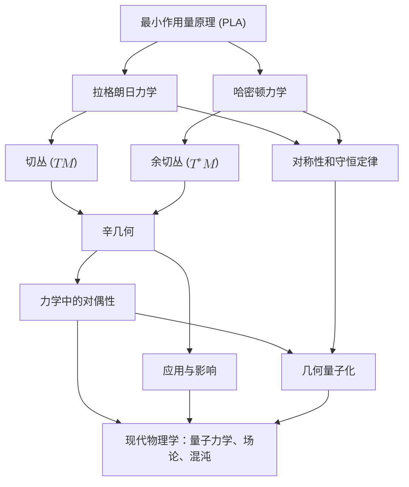

# 重构经典力学：基于最小作用量原理的现代几何框架
* * *

--- 力学的几何揭示运动、对称性和结构的统一。

# **1. 引言：几何重构的必要性**

**题词**：
*"数学的本质在于其自由。"*
— 格奥尔格·康托

**为什么我们需要重构经典力学？**
经典力学，作为物理学中最古老和最深刻的分支之一，提供理解运动、力和宇宙结构的基础。它的方程描述行星的轨道、摆的振动和抛射体的轨迹。然而，在其表面之下，存在着一个更深层次的问题：**经典力学的本质是什么？**

几个世纪以来，经典力学一直被教授和理解为一系列框架 —— 牛顿力学、拉格朗日力学和哈密顿力学 —— 每个框架都适用于不同的问题。虽然这些方法取得了巨大的成功，但它们常常掩盖力学中所蕴含的统一性和优雅性。诸如力、能量和动量等概念作为独立实体被引入，碎片化了我们对这一学科的理解。这种碎片化虽然在实践中是实用的，但它可能会阻碍对运动、对称性和守恒性质的更深入洞察。

在本章中，我们主张对经典力学进行**几何重构**。通过剥离历史惯例并专注于其内在原则，我们旨在揭示统一其各种表述的深刻几何结构。这种重构不仅揭示经典力学的优雅性，还为其扩展到现代物理学(包括量子力学和场论)提供基础。

## **1.1. 历史发展：从力到作用量**

经典力学的演变反映人类对运动和自然现象的理解和预测的追求。

1. **牛顿力学**：
   经典力学始于艾萨克·牛顿的**运动定律**，他引入力作为运动的原因。牛顿第二定律，
   $$
   F = ma,
   $$
   提供一种直接、直观的方法来预测受力粒子的轨迹。这个框架强调**局部相互作用**，并在解释行星运动、摆和碰撞方面起到重要作用。

2. **拉格朗日力学**：
   在18世纪，约瑟夫-路易·拉格朗日通过对力学的重新表述引入**最小作用量原理 (PLA)**。拉格朗日不再关注力，而是将运动描述为使称为**作用量**的标量量极值化的路径。这种方法将注意力从力转移到**能量**，揭示运动与对称性之间的更深层次联系。

3. **哈密顿力学**：
   在19世纪，威廉·罗文·哈密顿在拉格朗日思想的基础上引入**哈密顿力学**，它用**相空间**中的位置和动量重新表述运动。这种方法强调力学的几何结构，并为现代物理学(包括统计力学和量子力学)奠定基础。

尽管有这些发展，这些框架通常被视为彼此独立的，很少强调它们之间的内在统一性。

## **1.2. 传统方法的局限性**

虽然牛顿力学、拉格朗日力学和哈密顿力学各自提供独特的见解，但它们的传统表述存在若干局限性：

1. **概念的碎片化**：
   - 力、能量和动量作为独立实体被引入，彼此之间几乎没有联系。
   - 从牛顿力学到拉格朗日力学再到哈密顿力学的过渡通常被呈现为历史进程，而不是一个统一的框架。

2. **局部与全局视角**：
   - 牛顿力学侧重于局部相互作用(力)，但缺乏对运动的全局视角。
   - 运动的全局几何性质在拉格朗日和哈密顿力学中更为明显，但在传统教学中往往被忽视。

3. **缺乏几何直觉**：
   - 传统方法很少强调提供力学自然语言的几何结构，如**流形**、**切丛**和**辛形式**。
   - 这种缺乏几何视角的情况模糊了经典力学与现代物理学之间的联系。

4. **错失统一的机会**：
   - 对称性、守恒律和变分原理通常被视为独立的主题，而不是统一框架的方面。
   - 最小作用量原理虽然是力学的核心，但通常只被当作另一种工具，而不是学科的基石。

这些局限性表明需要一种新的视角 —— 一种强调力学统一性和其几何本质的视角。

## **1.3. 几何视角：力学即几何**

在现代数学和物理学中，几何已成为描述物理系统的自然语言。经典力学同样在其最深刻的表现中找到**几何结构**。

1. **流形与状态空间**：
   - 系统的运动可以描述为**流形**(状态空间)上的曲线。
   - 例如，摆的配置可以表示为圆 $S^1$ 上的一个点，而其状态(位置和速度)则位于**切丛** $TS^1$ 上。

2. **相空间与辛几何**：
   - 经典力学的真实本质在**相空间**中显现，其中位置和动量形成一个辛流形。
   - **辛结构**编码位置、动量和能量之间的基本关系，确保信息在演化过程中得以保存。

3. **作用量作为几何量**：
   - **作用量泛函**，作为最小作用量原理的核心，是一个几何对象。它为构型空间中的路径分配一个标量值，揭示运动的自然效率。

通过采用这种几何视角，经典力学可以被重构为一个统一的框架，其中运动、对称性和守恒自然地从底层几何中涌现出来。

## **1.4. 本次重构的目标**

本文档的目标是系统地使用现代几何洞见重构经典力学。具体来说，我们旨在：

1. **统一经典力学**：
   - 展示牛顿力学、拉格朗日力学和哈密顿力学不是独立的框架，而是相同几何原则的不同表现形式。

2. **揭示几何的作用**：
   - 演示力学从根本上是关于流形和相空间上运动的几何。
   - 强调切丛、余切丛、辛几何和变分原理的重要性。

3. **强调对称性和守恒**：
   - 使用诺特定理展示对称性如何导致守恒律。
   - 探索对称性、几何和最小作用量原理之间的深层联系。

4. **连接现代物理学**：
   - 描述经典力学如何为量子力学、场论和广义相对论提供基础。
   - 展示经典力学的几何重构为探索新的物理理论开辟途径。

## **1.5. 与下一章的联系**

本引言为经典力学的系统发展奠定基础。在下一章中，我们将从**最小作用量原理**开始，这是本次重构的基石。通过推导欧拉-拉格朗日方程并探讨作用量的变分性质，我们将为统一拉格朗日和哈密顿力学的几何框架奠定基础。

## **1.6. 结论**

通过几何的视角来看，经典力学不仅仅是一系列经验定律的集合，而是对运动、对称性和不变性的深刻描述。通过从其内在原则重构力学，我们不仅获得了对其本质的更深入理解，还获得了一个探索物理学和数学前沿的强大框架。

# **2. 最小作用量原理：变分力学的基础**

**题词**：
*"行动是所有成功的基础。"*
— 巴勃罗·毕加索

**最小作用量原理 (PLA)** 是经典力学的基石。它提供一个统一的框架，连接运动、对称性和守恒定律。与牛顿力学中以力为中心的观点不同，PLA 提供一个全局的、变分的视角：**系统的运动由使称为作用量的标量量极值化的路径决定**。本章探讨最小作用量原理的历史起源、数学结构及其深远影响，确立其作为理解物理系统动力学的基础。

## **2.1. 最小作用量原理的历史起源**

作用量的概念有着深厚的历史渊源，根植于对自然效率的理解。

1. **费马的最短时间原理**：
   在17世纪，皮埃尔·德·费马提出光沿时间最短的路径传播。这一关于极值原则的想法暗示了一个适用于所有运动的更广泛框架。

2. **莫佩尔蒂和最小作用量原理**：
   皮埃尔-路易·莫佩尔蒂在18世纪引入了“作用量”一词，认为自然界以经济的方式运作。他提出系统的真正路径是最小化作用量，他认为这是一个自然界的普遍法则。

3. **拉格朗日和哈密顿**：
   约瑟夫-路易·拉格朗日从能量角度出发，将最小作用量原理形式化，引入了**拉格朗日形式主义**。后来，威廉·罗文·哈密顿用**哈密顿形式主义**重新表述了力学，将原理扩展到相空间，并揭示了其与更广泛的几何结构的联系。

4. **现代视角**：
   今天，PLA 被公认为是经典力学、量子力学和场论的基础原理。它通过其变分性质连接各种现象，揭示自然过程的内在效率。

## **2.2. 作用量泛函**

PLA 的核心是**作用量泛函**，一个编码系统动力学的标量量。

1. **定义**：
   作用量 $S[q]$ 定义为 **拉格朗日量** $L(q, \dot{q}, t)$ 对时间的积分：
   $$
   S[q] = \int_{t_1}^{t_2} L(q, \dot{q}, t) \, dt,
   $$
   其中：
   - $q$ 表示系统的广义坐标。
   - $\dot{q} = \frac{dq}{dt}$ 是广义速度。
   - $L(q, \dot{q}, t) = T - V$ 是拉格朗日量，定义为动能 $T$ 和势能 $V$ 之差。

2. **物理解释**：
   - 作用量 $S[q]$ 度量一条特定轨迹 $q(t)$ 的“代价”。
   - 自然选择使这个代价最小化(或极值化)的路径，反映其内在的经济性。

3. **路径依赖性**：
   - 作用量泛函依赖于系统所取的整个路径 $q(t)$，而不仅仅是其端点。
   - 这种全局视角使 PLA 有别于牛顿力学中的局部、基于力的方法。

## **2.3. 变分原理和欧拉-拉格朗日方程**

最小作用量原理是一个**变分原理**，意味着系统的真正路径使作用量泛函极值化。

1. **变分问题**：
   考虑连接两个固定点 $q(t_1) = q_1$ 和 $q(t_2) = q_2$ 的一系列路径 $q(t)$。真正的路径 $q(t)$ 满足：
   $$
   \delta S[q] = 0,
   $$
   其中 $\delta S[q]$ 表示作用量的变分。

2. **欧拉-拉格朗日方程的推导**：
   通过代入 $S[q] = \int_{t_1}^{t_2} L(q, \dot{q}, t) \, dt$ 并进行变分，我们得到：
   $$
   \delta S[q] = \int_{t_1}^{t_2} \left( \frac{\partial L}{\partial q} - \frac{d}{dt} \frac{\partial L}{\partial \dot{q}} \right) \delta q \, dt.
   $$
   为了使变分对所有 $\delta q$ 都为零，括号内的项必须等于零。因此，**欧拉-拉格朗日方程** 为：
   $$
   \frac{d}{dt} \frac{\partial L}{\partial \dot{q}^i} - \frac{\partial L}{\partial q^i} = 0.
   $$

3. **几何意义**：
   - 欧拉-拉格朗日方程描述作用量泛函的驻定路径。
   - 这些方程是系统的运动方程，将变分原理与动力学联系起来。

## **2.4. 哲学含义：效率与对称性**

最小作用量原理具有深刻的哲学含义，揭示自然的内在效率和对称性。

1. **自然效率**：
   - PLA 捕捉自然界以经济方式运作的思想，倾向于使“努力”或“代价”最小化的路径。
   - 这一原则与物理学中更广泛的最优性概念一致，从光学中的费马原理到广义相对论中的测地线。

2. **对称性与守恒**：
   - PLA 自然地包含对称性，因为尊重系统对称性的变分不会改变作用量。
   - 诺特定理正式化了这种联系，表明每个作用量的对称性对应于一个守恒量(例如，能量、动量、角动量)。

3. **全局视角**：
   - 与专注于局部力的牛顿力学不同，PLA 提供运动的全局视图。
   - 这种视角将不同的物理现象统一在一个单一、优雅的原则下。

## **2.5. 与现代物理学的联系**

最小作用量原理远不止于经典力学，它是现代物理学的基础。

1. **量子力学**：
   - 在量子力学中，PLA 体现在**路径积分表述**中。量子系统的概率幅由所有可能路径的和给出，权重为 $e^{iS[q]/\hbar}$，其中 $S[q]$ 是经典作用量。

2. **场论**：
   - 在经典和量子场论中，PLA 支配着场的动力学，作用量泛函推广为空间时间上的积分。
   - 例如，麦克斯韦方程组由电磁场张量 $F_{\mu\nu}$ 的作用量极值化得出：
     $$
     S[A_\mu] = \int F^{\mu\nu}F_{\mu\nu} \, d^4x,
     $$
    其中 $F_{\mu\nu}$ 是电磁场张量。

3. **广义相对论**：
   - 爱因斯坦场方程由爱因斯坦-希爾伯特作用量得出，该作用量极值化时空的曲率：
     $$
     S[g] = \int R \sqrt{-g} \, d^4x,
     $$
    其中 $R$ 是里奇标量，$g$ 是度规行列式。

## **2.6. 与下一章的联系**

最小作用量原理为经典力学的几何重构提供基础。在下一章中，我们将探讨**拉格朗日力学**，它自然地从 PLA 中涌现出来，当在构型空间的切丛上观察时。通过发展拉格朗日框架，我们将看到作用量泛函如何编码运动的动力学，并导致对对称性和守恒的更深入见解。

## **2.7. 结论**

最小作用量原理不仅仅是一个数学工具 —— 它是一个关于运动本质和物理定律结构的深刻陈述。通过极值化作用量，系统揭示它们最有效的路径，将运动与对称性、守恒和几何联系起来。这一原理不仅统一经典力学，还形成通往现代物理学的桥梁，提供一个理解自然动力学的普遍框架。

# **3. 拉格朗日力学：切丛上的运动**

**题词**：
*"作用量是运动与几何之间的桥梁。"*
— 匿名

拉格朗日力学的经典表述揭示运动与几何之间的深刻联系。它基于**最小作用量原理**，提供一个统一物理系统动力学的框架，该框架通过关注能量而非力来描述系统。这一表述的核心是**切丛**，一个几何结构，它编码系统的构型和速度。本章探讨拉格朗日力学的几何解释、约束处理以及导致守恒定律的对称性。

## **3.1. 构型空间和切丛**

机械系统的运动自然地用其**构型空间**和**切丛**来描述。

1. **构型空间 ($M$)**：
   构型空间 $M$ 是系统所有可能位置的集合。每个点 $q \in M$ 表示一个唯一的构型。
   - **例子**：
     - 三维空间中的粒子：$M = \mathbb{R}^3$。
     - 单摆：$M = S^1$，表示摆的角度位置。
     - 双摆：$M = S^1 \times S^1$，表示两个摆的角度。

2. **切丛 ($TM$)**：
   为了描述运动，我们需要既包括位置 $q \in M$ 也包括速度 $\dot{q} \in T_qM$。**切丛** $TM$ 是所有可能位置和速度的空间。
   - 局部上，$TM$ 由坐标 $(q^i, \dot{q}^i)$ 表示，其中 $q^i$ 是广义坐标，$\dot{q}^i$ 是广义速度。
   - **物理例子**：对于三维空间中的粒子，$TM = \mathbb{R}^3 \times \mathbb{R}^3$，其中 $q = (x, y, z)$ 和 $\dot{q} = (\dot{x}, \dot{y}, \dot{z})$。

3. **几何解释**：
   切丛 $TM$ 是描述系统运动的自然舞台。系统的轨迹对应于 $TM$ 中的一条曲线 $\gamma(t) = (q(t), \dot{q}(t))$。

## **3.2. 切丛上的拉格朗日函数**

系统的动力学通过定义在切丛 $TM$ 上的**拉格朗日量** $L(q, \dot{q}, t)$ 编码。

1. **拉格朗日量的定义**：
   拉格朗日量定义为系统的**动能** $T$ 和**势能** $V$ 之差：
   $$
   L(q, \dot{q}, t) = T(q, \dot{q}) - V(q, t).
   $$

2. **能量解释**：
   - **动能** $T$ 依赖于速度 $\dot{q}$。例如，对于质量为 $m$ 的三维空间中的粒子：
     $$
     T = \frac{1}{2} m \|\dot{q}\|^2 = \frac{1}{2} m (\dot{x}^2 + \dot{y}^2 + \dot{z}^2).
     $$
   - **势能** $V$ 依赖于位置 $q$。例如，对于处于重力场中的粒子：
     $$
     V = m g z,
     $$
    其中 $z$ 是相对于参考点的高度。

3. **在动力学中的作用**：
   拉格朗日量 $L(q, \dot{q}, t)$ 通过**最小作用量原理**确定运动方程，如第2章所示。

## **3.3. 广义坐标和约束**

拉格朗日力学在处理具有**约束**的系统时表现出色，这些系统的运动被限制在特定的构型或路径上。

1. **广义坐标**：
   - 拉格朗日力学使用**广义坐标** $q^i$ 来描述运动，这些坐标不一定对应于笛卡尔坐标。
   - 例如，单摆的位置自然由角度 $\theta$ 描述，而不是笛卡尔坐标。

2. **完整约束**：
   **完整约束** 是可以表示为坐标 $q^i$ 和时间的函数的约束：
   $$
   f(q^i, t) = 0.
   $$
   - 例子：被限制在球面上运动的粒子满足 $x^2 + y^2 + z^2 = R^2$。

3. **约束的处理**：
   约束减少独立自由度的数量，简化运动方程。拉格朗日乘数法可以系统地处理约束。
   - 例如，对于被限制在表面上运动的粒子，约束力可以通过乘数 $\lambda$ 纳入运动方程：
     $$
     \frac{d}{dt} \frac{\partial L}{\partial \dot{q}^i} - \frac{\partial L}{\partial q^i} = \lambda \frac{\partial f}{\partial q^i}.
     $$

## **3.4. 对称性和守恒定律：诺特定理**

拉格朗日力学中最深刻的结果之一是**诺特定理**，它将对称性与守恒定律联系起来。

1. **诺特定理的陈述**：
   对于拉格朗日量 $L(q, \dot{q}, t)$ 的每一个连续对称性，存在一个相应的守恒量。

2. **对称性和守恒量的例子**：
   - **时间平移对称性**：如果 $L$ 不显式依赖于时间 $t$，则总能量 $E = T + V$ 守恒。
   - **空间平移对称性**：如果 $L$ 在空间平移下不变，则线性动量 $p = m\dot{q}$ 守恒。
   - **旋转对称性**：如果 $L$ 在旋转下不变，则角动量 $L = q \times p$ 守恒。

3. **几何解释**：
   对称性对应于作用量在变换下的不变性。守恒量是系统轨迹在切丛中的几何不变量。

## **3.5. 例子**

1. **简谐振子**：
   - **拉格朗日量**：
     $$
     L = \frac{1}{2} m \dot{x}^2 - \frac{1}{2} k x^2,
     $$
    其中 $m$ 是质量，$k$ 是弹簧常数。
   - **运动方程**：
    从欧拉-拉格朗日方程得出：
     $$
     m \ddot{x} + k x = 0.
     $$

2. **重力场中的粒子**：
   - **拉格朗日量**：
     $$
     L = \frac{1}{2} m (\dot{x}^2 + \dot{y}^2 + \dot{z}^2) - m g z.
     $$
   - **运动方程**：
    欧拉-拉格朗日方程给出：
     $$
     m \ddot{z} = -m g, \quad \ddot{x} = 0, \quad \ddot{y} = 0.
     $$

## **3.6. 与下一节的联系**

建立在切丛 $TM$ 上的拉格朗日力学提供一个强大的框架，用于以能量和对称为基础描述运动。然而，不考虑对偶图景 —— 建立在余切丛 $T^*M$ 上的**哈密顿力学**，这种视角是不完整的。从拉格朗日力学到哈密顿力学的过渡是通过**勒让德变换**实现的，我们将在下一章探讨这一点。

## **3.7. 结论**

拉格朗日力学揭示运动与几何之间的深刻联系，切丛 $TM$ 是描述动力学的自然舞台。通过在拉格朗日量 $L(q, \dot{q}, t)$ 中编码系统的动能和势能，这一框架统一约束、对称性和守恒定律的处理。通过诺特定理，拉格朗日力学强调对称性和不变性之间不可分割的联系，为哈密顿力学的对偶视角奠定基础。

# **4. 勒让德变换和哈密顿力学**

**题词**：
*"在每一种对偶性中，都隐藏着一种统一性。"*
— 匿名

从拉格朗日力学到哈密顿力学的转变代表视角上的深刻变化，这一变化突显能量、几何与对偶性之间的相互作用。这种转变的核心在于**勒让德变换**，它是一座桥梁，连接拉格朗日框架中的构型-速度描述与哈密顿力学中的位置-动量描述。通过在**余切丛** $T^*M$ 上重新表述动力学，哈密顿力学提供一个揭示经典力学辛结构的几何框架，并为现代物理学的扩展奠定基础。

## **4.1. 勒让德变换：连接两个框架**

为了从拉格朗日力学到哈密顿力学的转变，我们使用**勒让德变换**，它将切丛 ($TM$) 中的速度 ($\dot{q}$) 映射到余切丛 ($T^*M$) 中的动量 ($p$)。

1. **勒让德变换的定义**：
   给定一个拉格朗日量 $L(q, \dot{q}, t)$，坐标 $q^i$ 的**广义动量** $p_i$ 定义为：
   $$
   p_i = \frac{\partial L}{\partial \dot{q}^i}.
   $$
   这个方程将速度 $\dot{q}^i$ 与动量 $p_i$ 联系起来，有效地用 $q^i$ 和 $p_i$ 重新表达动力学。

2. **哈密顿函数**：
   **哈密顿量** $H(q, p, t)$ 定义为拉格朗日量的勒让德变换：
   $$
   H(q, p, t) = \sum_i p_i \dot{q}^i - L(q, \dot{q}, t),
   $$
   其中 $\dot{q}^i$ 通过关系 $p_i = \frac{\partial L}{\partial \dot{q}^i}$ 用 $q^i$ 和 $p_i$ 表达。

3. **物理解释**：
   - 哈密顿量 $H(q, p, t)$ 通常表示系统的**总能量**，对于许多系统，$H = T + V$。
   - 虽然拉格朗日量编码动能和势能之差 ($L = T - V$)，但哈密顿量提供一个更对称的观点，将位置和动量视为对偶变量。

## **4.2. 余切丛上的哈密顿力学**

以哈密顿量为基础的力学自然地在**余切丛** $T^*M$ 上重新表述，$T^*M$ 是所有可能位置 $q$ 和动量 $p$ 的空间。

1. **余切丛 ($T^*M$)**：
   - 余切丛 $T^*M$ 是切丛 $TM$ 的对偶空间。
   - 余切丛中的每个点由一对 $(q^i, p_i)$ 指定，其中 $q^i$ 是广义坐标，$p_i$ 是其共轭动量。

2. **正则坐标**：
   坐标 $(q^i, p_i)$ 称为**正则坐标**，因为它们自然地源自相空间的辛结构。

3. **哈密顿方程**：
   系统在哈密顿力学中的动力学由**哈密顿方程**控制：
   $$
   \dot{q}^i = \frac{\partial H}{\partial p_i}, \quad \dot{p}_i = -\frac{\partial H}{\partial q^i}.
   $$
   这些一阶微分方程描述系统在相空间中的演化。

4. **几何解释**：
   - 哈密顿方程描述系统在相空间 $(q, p)$ 中的流动。
   - 哈密顿量 $H(q, p, t)$ 生成动力学，类似于拉格朗日量在构型空间中生成动力学的方式。

## **4.3. 相空间的辛结构**

哈密顿力学深深植根于相空间的**辛几何**，这为理解其基本结构提供几何框架。

1. **辛形式**：
   余切丛 $T^*M$ 配备一个**辛形式** $\omega$，它编码相空间的几何结构。在正则坐标 $(q^i, p_i)$ 下，辛形式由下式给出：
   $$
   \omega = \sum_i dp_i \wedge dq^i.
   $$
   这个 $2$-形式测量相空间中的“面积”，并支配哈密顿流的结构。

2. **辛形式的性质**：
   - **非退化性**：辛形式是非退化的，确保相空间动力学的完全确定性。
   - **闭合性**：辛形式满足 $d\omega = 0$，这是相空间体积守恒(刘维尔定理)的基础。

3. **几何意义**：
   - 辛形式为定义保持相空间结构的正则变换提供一个自然框架。
   - 在哈密顿力学中，辛形式确保系统演化的能量和其他不变量的守恒。

## **4.4. 哈密顿系统的例子**

1. **简谐振子**：
   - **拉格朗日量**：
     $$
     L = \frac{1}{2}m\dot{x}^2 - \frac{1}{2}kx^2.
     $$
   - **广义动量**：
     $$
     p = m\dot{x}.
     $$
   - **哈密顿量**：
    将 $p = m\dot{x}$ 代入哈密顿量的定义：
     $$
     H = \frac{p^2}{2m} + \frac{1}{2}kx^2.
     $$
   - **哈密顿方程**：
     $$
     \dot{x} = \frac{\partial H}{\partial p} = \frac{p}{m}, \quad \dot{p} = -\frac{\partial H}{\partial x} = -kx.
     $$

2. **重力场中的粒子**：
   - **拉格朗日量**：
     $$
     L = \frac{1}{2}m\dot{z}^2 - mgz.
     $$
   - **广义动量**：
     $$
     p_z = m\dot{z}.
     $$
   - **哈密顿量**：
     $$
     H = \frac{p_z^2}{2m} + mgz.
     $$
   - **哈密顿方程**：
     $$
     \dot{z} = \frac{\partial H}{\partial p_z} = \frac{p_z}{m}, \quad \dot{p}_z = -\frac{\partial H}{\partial z} = -mg.
     $$

## **4.5. 与下一章的联系**

建立在余切丛 $T^*M$ 上的哈密顿力学为拉格朗日力学提供强大的对偶视角。通过强调相空间的辛结构，它突显经典力学的几何基础，并自然地连接到量子力学和几何量子化等现代主题。下一章深入探讨相空间的**辛几何**，探索这一结构如何支配哈密顿系统的动力学及其守恒量。

## **4.6. 结论**

勒让德变换和哈密顿力学揭示构型空间与相空间之间的对偶性，连接拉格朗日和哈密顿对经典力学的表述。通过在余切丛 $T^*M$ 上重新表述动力学，哈密顿力学强调相空间的辛结构，提供一个统一运动、对称性和守恒的几何框架。这种对偶视角不仅加深我们对经典力学的理解，还为探索其在量子力学和现代场论中的扩展奠定基础。

# **5. 辛几何：哈密顿系统的语言**

**题词**：
*"几何不是真理，它只是有用的。"*
— 罗伯特·M·皮尔斯

辛几何是哈密顿力学的核心，提供一个统一而优雅的框架，用于理解相空间的结构和系统的动力学。通过定义一种编码位置和动量之间相互作用的几何语言，辛几何捕捉哈密顿系统的内在性质，包括守恒定律、不变量和运动的动力学。本章介绍辛流形的基本概念，探讨其性质，并展示它们如何构成经典力学的骨干。

## **5.1. 辛流形的定义**

一个**辛流形**是为哈密顿力学提供自然背景的数学结构。

1. **辛流形**：
   辛流形是一个配备有**辛形式** $\omega$ 的光滑流形 $M$，其中 $\omega$ 是闭的、非退化的 $2$-形式：
   $$
   \omega \in \Omega^2(M), \quad d\omega = 0, \quad \text{且 } \omega(X, Y) \neq 0 \text{ 对所有 } X, Y \neq 0.
   $$

2. **典范例子**：
   构型空间 $M$ 的余切丛 $T^*M$ 是一个辛流形，具有典范辛形式：
   $$
   \omega = \sum_i dp_i \wedge dq^i,
   $$
   其中 $(q^i, p_i)$ 是相空间的正则坐标。

3. **物理解释**：
   - 辛形式 $\omega$ 编码相空间的几何结构，描述位置 $q$ 和动量 $p$ 之间的关系。
   - 它定义相空间中的“面积”，支配轨迹在哈密顿动力学下的演化。

## **5.2. 辛形式的性质**

辛形式 $\omega$ 拥有若干关键性质，这些性质对哈密顿系统的结构和行为至关重要。

1. **闭合性**：
   条件 $d\omega = 0$ 确保辛形式在光滑变形下保持不变。这一性质支撑许多哈密顿力学中的不变量，包括刘维尔定理。

2. **非退化性**：
   辛形式的非退化性意味着相空间中的每个向量场 $X$ 都有一个唯一的共轭 $Y$。这确保运动方程是良好定义的，并且相空间动力学是完全确定的。

3. **体积保持(刘维尔定理)**：
   辛形式定义相空间中的自然体积元素：
   $$
   \Omega = \omega^n,
   $$
   其中 $n = \dim(M)/2$。刘维尔定理指出，哈密顿流保持这个体积：
   $$
   \mathcal{L}_H \Omega = 0,
   $$
   其中 $\mathcal{L}_H$ 是沿哈密顿向量场的李导数。这种相空间体积的守恒反映轨迹在哈密顿演化下的不可压缩性。

## **5.3. 辛不变量和守恒量**

辛几何提供一个理解哈密顿系统中守恒量和对称性的自然框架。

1. **守恒量**：
   - 如果函数 $f(q, p)$ 在**泊松括号**下与哈密顿量 $H$ 对易，则它是守恒的：
     $$
     \{f, H\} = \frac{\partial f}{\partial q} \frac{\partial H}{\partial p} - \frac{\partial f}{\partial p} \frac{\partial H}{\partial q} = 0.
     $$
   - 通过诺特定理，守恒量直接与对称性相关联。

2. **辛框架下的诺特定理**：
   哈密顿系统的对称性对应于保持辛形式不变的变换。对于每一个这样的对称性，存在一个守恒量。例子包括：
   - **时间平移对称性**：守恒能量。
   - **空间平移对称性**：守恒线性动量。
   - **旋转对称性**：守恒角动量。

3. **作用-角度变量**：
   在可积系统中，辛结构允许动力学用**作用-角度变量**表示，简化周期或准周期运动的描述。

## **5.4. 辛系统的例子**

为了说明辛几何的力量，我们提供几个典范的哈密顿系统的例子。

1. **相空间中的自由粒子**：
   - **哈密顿量**：
     $$
     H = \frac{p^2}{2m}.
     $$
   - **辛形式**：
     $$
     \omega = dp \wedge dq.
     $$
   - **运动方程**：
     $$
     \dot{q} = \frac{\partial H}{\partial p} = \frac{p}{m}, \quad \dot{p} = -\frac{\partial H}{\partial q} = 0.
     $$
    粒子在相空间中线性移动，动量保持不变。

2. **单摆动力学**：
   - **哈密顿量**：
     $$
     H = \frac{p^2}{2m} + mgl(1 - \cos q),
     $$
    其中 $q$ 是角度，$p$ 是角动量。
   - **辛形式**：
     $$
     \omega = dp \wedge dq.
     $$
   - **相空间几何**：
    单摆的动力学在相空间中表现为轨迹，分界线将振荡和旋转运动区域分开。

3. **谐振子**：
   - **哈密顿量**：
     $$
     H = \frac{p^2}{2m} + \frac{1}{2}kx^2.
     $$
   - **辛形式**：
     $$
     \omega = dp \wedge dq.
     $$
   - **相空间轨迹**：
    轨迹在相空间中是椭圆，反映动能和势能之间的周期性交换。

## **5.5. 与对偶性和高级主题的联系**

辛几何为理解经典力学中的对偶性和更深层次的结构提供数学基础。

1. **位置-动量对偶性**：
   辛形式 $\omega = dp \wedge dq$ 反映位置 $q$ 和动量 $p$ 之间的基本对偶性。这种对偶性在经典力学和量子力学中都起着核心作用。

2. **能量-时间对偶性**：
   在哈密顿力学中，哈密顿量 $H$ 在生成时间演化和表示系统总能量方面起着双重作用。

3. **正则变换**：
   保持辛形式不变的变换称为**正则变换**。这些变换为简化动力学和探索系统的不变量提供强大工具。

4. **通向量子力学的桥梁**：
   相空间的辛结构构成从经典力学到量子力学的过渡基础，其中泊松括号被对易子取代：
   $$
   \{f, g\} \to \frac{1}{i\hbar}[\hat{f}, \hat{g}].
   $$

## **5.6. 与下一章的联系**

相空间的辛几何为理解经典力学中的对偶性、对称性和守恒量提供一种自然的语言。在下一章中，我们将探讨这些对偶性如何在经典力学的结构中显式地表现出来，连接位置和动量、能量和时间，并最终将经典力学与量子力学联系起来。

## **5.7. 结论**

辛几何是哈密顿力学的基础，它编码相空间的结构并支配经典系统的动力学。通过辛形式，我们揭示不变量、对称性和守恒量，展示运动和能量的几何统一性。这一框架不仅加深我们对经典力学的理解，还架起通往现代物理学的桥梁，包括量子力学、可积系统和混沌理论。通过探索这些结构，我们获得了关于几何、对称性和动力学之间相互作用的深刻见解。

# **6. 经典力学中的对偶性**

**题词**：
*"对偶性是揭示统一性的对立面之间的相互作用。"*
— 匿名

对偶性是经典力学中的一个基本主题，其中互补的视角共存以描述相同的物理现实。这些对偶性并不是矛盾，而是反映支配力学的底层几何和变分结构。通过研究位置和动量、能量和时间的对偶性，以及保持相空间辛结构的变换，我们揭示了经典框架内的深刻统一性。此外，这些对偶性为量子力学架起一座桥梁，在那里类似的原理得到了扩展和重新解释。

## **6.1. 位置-动量对偶性：$q$ 和 $p$ 的辛相互作用**

位置和动量是经典力学中最基本的一对对偶变量。它们的相互作用编码在相空间的辛几何中。

1. **正则坐标**：
   在哈密顿力学中，系统的状态由正则变量 $(q^i, p_i)$ 描述，其中：
   - $q^i$：广义坐标(位置)。
   - $p_i$：广义动量，通过勒让德变换定义为 $p_i = \frac{\partial L}{\partial \dot{q}^i}$。

2. **辛结构**：
   $q$ 和 $p$ 之间的关系由辛形式支配：
   $$
   \omega = \sum_i dp_i \wedge dq^i.
   $$
   这个 $2$-形式定义相空间的几何，确保位置和动量被视为共轭变量。

3. **泊松括号**：
   $q$ 和 $p$ 之间的对偶性进一步通过泊松括号表达：
   $$
   \{q^i, p_j\} = \delta^i_j, \quad \{q^i, q^j\} = 0, \quad \{p_i, p_j\} = 0.
   $$
   这种结构确保 $q$ 和 $p$ 的变化是相互依赖的，正如哈密顿方程所反映的：
   $$
   \dot{q}^i = \frac{\partial H}{\partial p_i}, \quad \dot{p}_i = -\frac{\partial H}{\partial q^i}.
   $$

4. **几何解释**：
   位置和动量是对同一相空间轨迹的互补视角。它们的对偶性使得力学可以表述为 $q(t)$(拉格朗日力学)或 $(q, p)$(哈密顿力学)，具体取决于上下文。

## **6.2. 能量-时间对偶性：哈密顿量的作用**

能量和时间构成另一个基本对偶性，与哈密顿量的本质紧密相关。

1. **哈密顿量作为时间演化的生成元**：
   - 在哈密顿力学中，哈密顿量 $H(q, p, t)$ 表示许多物理系统的总能量(动能 + 势能)。
   - 任意相空间函数 $f(q, p, t)$ 的演化由下式给出：
     $$
     \frac{df}{dt} = \{f, H\} + \frac{\partial f}{\partial t}.
     $$

2. **能量-时间对偶性**：
   - 哈密顿量 $H$ 作为时间演化的生成元，类似于动量 $p$ 生成空间平移。
   - 这种对偶性镜像位置-动量对偶性，系统的时间演化编码在哈密顿方程中：
     $$
     \dot{q}^i = \frac{\partial H}{\partial p_i}, \quad \dot{p}_i = -\frac{\partial H}{\partial q^i}.
     $$

3. **诺特定理与能量守恒**：
   - 如果哈密顿量与时间无关 ($\partial H/\partial t = 0$)，则总能量守恒：
     $$
     \frac{dH}{dt} = 0.
     $$
   - 这个守恒定律反映系统在时间平移下的对称性。

4. **与量子力学的联系**：
   在量子力学中，能量和时间对偶性通过含时薛定谔方程表达：
   $$
   i\hbar \frac{\partial \psi}{\partial t} = \hat{H} \psi,
   $$
   其中哈密顿算符 $\hat{H}$ 支配着量子态的时间演化。

## **6.3. 正则变换：保持辛结构**

正则变换是相空间中的映射，它们保持辛结构，突显哈密顿力学在某些变换下的不变性。

1. **定义**：
   变换 $(q, p) \to (Q, P)$ 是正则的，如果它保持辛形式：
   $$
   \omega = \sum_i dp_i \wedge dq^i = \sum_i dP_i \wedge dQ^i.
   $$

2. **生成函数**：
   正则变换可以通过函数 $F$ 生成，该函数将 $(q, p)$ 和 $(Q, P)$ 关联起来。例如：
   - 第一类生成函数：$F_1(q, Q)$，其中：
     $$
     p = \frac{\partial F_1}{\partial q}, \quad P = -\frac{\partial F_1}{\partial Q}.
     $$

3. **物理意义**：
   正则变换提供一种简化力学问题的方法，通过改变变量同时保持方程的基本结构。例子包括：
   - **作用-角度变量**：用于求解可积系统。
   - **规范形式**：简化动力系统中扰动的研究。

4. **辛不变量**：
   在正则变换下保持不变的量包括相空间体积(刘维尔定理)和与系统对称性相关的某些守恒量。

## **6.4. 对量子力学的意义**

经典力学中的对偶性为理解量子力学提供自然的基础，其中类似的结构以修改后的解释出现。

1. **量子力学中的位置-动量对偶性**：
   - 在量子力学中，位置和动量成为算符 $\hat{q}$ 和 $\hat{p}$，满足对易关系：
     $$
     [\hat{q}, \hat{p}] = i\hbar.
     $$
   - 经典泊松括号 $\{q, p\} = 1$ 过渡到量子对易子。

2. **能量-时间对偶性**：
   - 能量-时间对偶性反映在不确定性原理中：
     $$
     \Delta E \cdot \Delta t \geq \frac{\hbar}{2}.
     $$
   - 其中，$\Delta E$ 和 $\Delta t$ 分别表示能量和时间的不确定性。

3. **正则变换与量子力学**：
   - 在量子力学中，正则变换对应于保持希尔伯特空间内积结构的幺正变换。
   - 经典力学的辛结构支撑量子力学的相空间表述(例如，维格纳函数)。

## **6.5. 与下一章的联系**

本章探讨的位置-动量、能量-时间以及正则变换的对偶性，突显经典力学的深层几何和结构统一性。这些对偶性不仅简化经典框架，还为现代理论(如量子力学和场论)架起桥梁。在下一章中，我们将重新解释**最小作用量原理**作为一个几何对象，进一步在辛几何的语言中统一拉格朗日和哈密顿表述。

## **6.6. 结论**

经典力学中的对偶性揭示互补变量和视角之间的优雅相互作用。位置-动量对偶性支撑相空间的辛结构，能量-时间对偶性反映基本的守恒定律，而正则变换则保持哈密顿系统的不变量。这些对偶性构成经典力学的骨干，并自然地延伸到量子力学中，其几何和代数结构赋予新的含义。通过理解这些对偶性，我们揭示了经典框架的统一性和连贯性，弥合了经典物理学与现代物理学之间的差距。

# **7. 最小作用量原理的几何解释**

**题词**：
*"自然不做无用之事。"*
— 亚里士多德

**最小作用量原理 (PLA)** 不仅是推导运动方程的计算工具，而且是一个深刻的几何原则，它统一拉格朗日和哈密顿表述。在其核心，作用泛函提供连接两个框架的桥梁，揭示变分原理、辛几何与物理系统在相空间中的轨迹之间的深刻联系。本章将重新解释作用泛函作为一个几何对象，探讨其在变分原理中的作用，并揭示轨迹作为流形上的流的辛意义。

## **7.1. 辛几何中的作用泛函**

作用泛函，作为最小作用量原理的核心，在辛几何的语言中获得自然的几何解释。

1. **作用泛函的定义**：
   配置空间中轨迹 $q(t)$ 的作用泛函 $S[q]$ 定义为：
   $$
   S[q] = \int_{t_1}^{t_2} L(q, \dot{q}, t) \, dt,
   $$
   其中 $L(q, \dot{q}, t)$ 是拉格朗日函数。

   在哈密顿力学中，作用可以表示为广义坐标 $q^i$、动量 $p_i$ 和哈密顿量 $H(q, p, t)$ 的函数：
   $$
   S[q] = \int_{t_1}^{t_2} \left( \sum_i p_i \dot{q}^i - H(q, p, t) \right) dt.
   $$

2. **几何解释**：
   - 项 $\sum_i p_i \dot{q}^i$ 表示**辛势能**，它是相空间上的一个 $1$-形式，编码位置和动量之间的关系。
   - 作用泛函测量系统在相空间中扫过的“加权面积”，其中哈密顿量 $H$ 作为系统的能量约束。

3. **变分性质**：
   作用泛函通过变分原理编码系统的动力学：物理轨迹 $q(t)$ 使 $S[q]$ 极值化，从而导致欧拉-拉格朗日或哈密顿运动方程。

## **7.2. 拉格朗日子流形与变分原理**

从**拉格朗日子流形**的角度来看，作用泛函的几何变得更加清晰，这些子流形位于辛流形 $T^*M$ 中。

1. **辛流形与拉格朗日子流形**：
   - 辛流形 $(T^*M, \omega)$ 是配备有辛形式 $\omega = \sum_i dp_i \wedge dq^i$ 的相空间，如第 5 章所介绍。
   - **拉格朗日子流形**是 $T^*M$ 的一个子空间，其中辛形式 $\omega$ 消失。换句话说，系统的动力学被限制在一个辛结构最大约束的子流形上。

2. **轨迹作为拉格朗日子流形**：
   - 系统在相空间中的物理轨迹对应于拉格朗日子流形中的曲线。
   - 变分原理确保这条曲线相对于作用泛函的变化是驻点，保持辛结构。

3. **辛几何中的哈密顿原理**：
   在辛几何中，哈密顿原理可以重新表述为：
   - 系统的轨迹对应于一条在拉格朗日子流形上极值化辛作用的曲线：
     $$
     \delta S[q] = 0.
     $$
   - 这确保系统以一种保持相空间几何结构的方式演化。

## **7.3. 轨迹的几何意义：辛流形上的流**

物理系统的轨迹可以理解为由哈密顿函数在辛流形上生成的流。这一视角突显经典力学的几何和动力学统一性。

1. **哈密顿流**：
   - 哈密顿量 $H(q, p, t)$ 生成辛流形 $T^*M$ 上的向量场 $X_H$，定义为：
     $$
     \iota_{X_H} \omega = -dH,
     $$
    其中 $\iota_{X_H}$ 是向量场 $X_H$ 与辛形式 $\omega$ 的内积。
   - $X_H$ 的流描述系统在相空间中的时间演化，保持辛结构。

2. **相空间轨迹**：
   - 相空间中的轨迹对应于哈密顿向量场 $X_H$ 的**积分曲线**。
   - 这些轨迹保持辛结构，确保相空间体积和其他不变量保持不变(刘维尔定理)。

3. **作用与辛面积**：
   - 作用泛函 $S[q]$ 可以解释为轨迹在相空间中围成的辛面积。
   - 作用的这种几何意义突显它作为系统沿给定路径演化所需“努力”的度量。

4. **拉格朗日和哈密顿动力学作为流**：
   - 在拉格朗日框架中，轨迹是切丛 $TM$ 上的曲线，由极值化作用确定。
   - 在哈密顿框架中，这些轨迹是余切丛 $T^*M$ 上的流，受辛几何和哈密顿函数支配。

## **7.4. 统一拉格朗日和哈密顿表述**

作用泛函的几何重新解释提供一个统一的视角，架起拉格朗日和哈密顿表述之间的桥梁。

1. **作用作为一个几何对象**：
   - 在拉格朗日框架中，作用 $S[q]$ 定义为拉格朗日函数 $L(q, \dot{q}, t)$ 的积分，捕捉配置空间中的动力学。
   - 在哈密顿框架中，作用包含辛势能 $\sum_i p_i \dot{q}^i$ 和哈密顿量 $H$，揭示位置、动量和能量之间的相互作用。

2. **双重视角**：
   - 拉格朗日表述强调配置空间 $M$ 和切丛 $TM$，关注速度和能量差异。
   - 哈密顿表述基于余切丛 $T^*M$，突出辛结构和位置与动量的对偶性。

3. **几何统一性**：
   - 两种表述都由相空间的辛几何统一，作用泛函作为几何链接。
   - 从任一表述得出的轨迹都是等价的，反映同一物理现实的不同视角。

## **7.5. 与下一章的联系**

最小作用量原理的几何解释揭示经典力学的统一性，连接变分原理、辛几何和物理系统的动力学。在下一章中，我们将探讨该框架的**应用和影响**，包括其在可积系统、混沌以及现代理论(如几何量子化和场论)中的角色。

## **7.6. 结论**

最小作用量原理，作为几何对象重新解释，提供对经典力学结构的深刻洞察。作用泛函统一拉格朗日和哈密顿表述，揭示相空间的辛几何以及轨迹作为拉格朗日子流形上的流的角色。通过理解作用作为辛面积和动力学演化的度量，我们揭开了支配运动、对称性和守恒的经典力学中的深层几何和变分原理。这一视角不仅增强我们对经典系统的理解，还为探索量子理论及其他领域的力学现代扩展奠定基础。

# **8. 应用与影响**

**题词**：
*"真正的发现之旅不在于寻找新的风景，而在于拥有新的眼睛。"*
— 马塞尔·普鲁斯特

经典力学的几何重构揭示深刻见解和强大的数学框架，其应用范围远超传统表述。从理解可积系统到探索混沌动力学，再到现代物理理论(如辛拓扑和几何量子化)的基础，这些应用展示我们所发展的原则和结构 —— 辛几何、变分原理和对偶性 —— 如何推动物理学和数学中的创新和发现，架起经典力学与量子力学之间的桥梁。

## **8.1. 可积系统与作用-角变量**

可积系统是一类可以通过表现出规则、周期或准周期行为的坐标来求解的动力系统。几何力学提供理解和求解这些系统的自然框架。

1. **可积系统的定义**：
   - 如果哈密顿系统具有 $n = \frac{1}{2}\dim(T^*M)$ 个独立的守恒量 $F_1, F_2, \dots, F_n$，且这些守恒量处于对合状态：
     $$
     \{F_i, F_j\} = 0, \quad \forall i, j.
     $$
     则该系统是可积的。
   - 这些守恒量将相空间划分为不变环面，运动被限制在这些环面上。

2. **作用-角变量**：
   - 可积系统的动力学可以使用**作用-角变量** $(I_i, \theta_i)$ 简化，其中：
     - $I_i$：作用，作为参数化不变环面的守恒量。
     - $\theta_i$：角度，共轭变量，随时间线性演化。
   - 在这些变量中，哈密顿量仅依赖于作用：
     $$
     H = H(I_1, I_2, \dots, I_n),
     $$
     运动方程变得易于求解：
     $$
     \dot{\theta}_i = \frac{\partial H}{\partial I_i}, \quad \dot{I}_i = 0.
     $$

3. **例子**：
   - **谐振子**：相空间由对应于常能面的椭圆叶状化，这些椭圆在作用-角变量中表示为不变环面。
   - **开普勒问题**：行星在中心引力场中的运动是可积的，不变环面对应于固定的轨道参数。

4. **几何解释**：
   - 作用-角变量揭示可积性和相空间拓扑之间的深刻联系。不变环面是辛流形 $T^*M$ 的拉格朗日子流形，保持辛结构。

## **8.2. 混沌与非线性动力学**

虽然可积系统代表有序和可预测的动力学，但大多数物理系统表现出导致混沌行为的复杂性。几何视角为我们提供研究这种非线性动力学的工具。

1. **从有序到混沌的转变**：
   - 可积系统的非线性扰动(例如，向谐振子添加小扰动)可以破坏不变环面，并在相空间中导致混沌轨迹。
   - **Kolmogorov-Arnold-Moser (KAM) 定理** 表明，一些环面在小扰动下仍然存在，而其他环面则被破坏，导致相空间中规则区域和混沌区域的共存。

2. **混沌中的相空间结构**：
   - **庞加莱截面**：一种通过绘制轨迹与低维子空间交点来可视化混沌动力学的几何工具。
   - **分界线和同宿缠结**：相空间中标志着规则区域和混沌区域边界的结构。

3. **李雅普诺夫指数与对初始条件的敏感性**：
   - 混沌系统对初始条件表现出指数敏感性，这由正**李雅普诺夫指数**量化，测量相空间中相邻轨迹的发散程度。

4. **应用**：
   - **天体力学**：由于引力相互作用，行星运动的长期预测揭示混沌行为。
   - **流体力学**：湍流表现出可以用几何工具研究的混沌特性。

5. **几何洞察**：
   - 混沌系统突显辛几何在非可积环境中的丰富性，其中不变结构及其破坏之间的相互作用决定系统的动态行为。

## **8.3. 现代理论：辛拓扑、几何量子化与场论**

经典力学的几何重构为现代理论奠定基础，这些理论将其原则扩展到量子力学、拓扑和场论中。

### **8.3.1. 辛拓扑**

1. **辛不变量**：
   - 辛拓扑研究辛流形的全局性质，这些性质在保持辛结构的微分同胚下保持不变。例如：
     - **Gromov 不挤压定理**：一个辛球不能辛嵌入到半径更小的圆柱体中，突出显示辛结构的刚性。
     - **Hofer 度量**：辛变换群上的距离度量，捕捉辛变形的“大小”。

2. **应用**：
   - 理解混沌系统中相空间的拓扑。
   - 在弦理论和镜像对称中，辛几何扮演核心角色的应用。

### **8.3.2. 几何量子化**

1. **相空间的量子化**：
   - 几何量子化提供一个从经典力学过渡到量子力学的框架，通过将量子态与相空间上的几何结构关联起来。
   - 辛形式 $\omega$ 作为构建希尔伯特空间的基础，作用泛函决定量子态的相位。

2. **与量子力学的联系**：
   - 经典可观测量 $f(q, p)$ 被提升为量子算符，泊松括号被替换为对易子：
     $$
     \{f, g\} \to \frac{1}{i\hbar}[\hat{f}, \hat{g}].
     $$
   - 量子力学的路径积分表述依赖于作用泛函作为相因子 $e^{iS/\hbar}$，突显辛几何的深层作用。

3. **应用**：
   - 量子场论，其中相空间量子化应用于无穷维系统。
   - 基于几何原理开发量子计算算法。

### **8.3.3. 场论与广义相对论**

1. **经典场论**：
   - 作用泛函自然地扩展到场论中，场取代粒子成为动力变量。
   - 例如，电磁学的作用由以下公式给出：
     $$
     S[A_\mu] = \int F^{\mu\nu}F_{\mu\nu} \, d^4x,
     $$
    其中 $F^{\mu\nu}$ 是场强张量。

2. **广义相对论**：
   - 爱因斯坦场方程由爱因斯坦-希耳伯特作用导出：
     $$
     S[g] = \int R \sqrt{-g} \, d^4x,
     $$
    其中 $R$ 是里奇标量，$g$ 是度规张量的行列式。

3. **场论中的辛结构**：
   - 辛几何构成场论规范表述的基础，通过路径积分和几何量子化将经典解连接到量子态。

## **8.4. 对未来研究的影响**

经典力学的几何重构开辟新的研究途径，包括：

1. **混沌与拓扑**：利用辛拓扑分类和理解混沌系统。
2. **量子-经典对应**：通过几何量子化弥合经典力学与量子力学之间的差距。
3. **物理学的统一**：扩展几何原则以统一经典力学、量子力学和场论。

## **8.5. 结论**

几何力学的应用和影响展示其广泛的潜力，从求解可积系统和理解混沌，到为现代物理理论奠定基础。通过几何视角重新解释经典力学，我们不仅获得了对物理系统动力学的更深层次的理解，还建立了一个探索量子世界之谜、相空间拓扑以及自然界力的统一的框架。这一视角不仅仅是对经典力学的重新诠释，而是通往物理学和数学未来的门户。

# **9. 结论：迈向统一的愿景**

**题词**：
*"简约是终极的精致。"*
— 莱昂纳多·达·芬奇

经典力学的重构揭示了对物理世界的深刻而统一的愿景。通过追溯其几何基础，我们展示了经典力学不仅仅是一组方程的集合；它是一个连贯的框架，根植于运动、对称性和结构之间的相互作用。这一视角不仅加深我们对经典系统的理解，还提供一座通往现代物理学的桥梁，开辟了新的发现途径。

## **9.1. 运动、对称性与几何的统一**

经典力学的核心在于一种超越历史表述的几何统一性。

1. **运动作为几何流**：
   - 物理系统的轨迹不是任意的，而是由最小作用量原理所支配的变分原则编码的自然经济性。
   - 这些轨迹表现为几何结构上的流：拉格朗日力学中的切丛曲线和哈密顿力学中的哈密顿向量场积分曲线。

2. **对称性作为指导原则**：
   - 对称性支撑着治理物理系统的守恒定律，正如诺特定理所形式化的。
   - 配置空间和相空间的几何结构由这些对称性塑造，确保力学的一致性和优雅。

3. **几何作为统一语言**：
   - 使用切丛 ($TM$)、余切丛 ($T^*M$) 和辛流形为描述物理系统动力学提供自然框架。
   - 这种几何语言不仅统一拉格朗日和哈密顿力学，还揭示将经典力学连接到量子理论和场论的更深层次结构。

## **9.2. 几何视角的变革力量**

通过对经典力学进行几何基础的重构，我们揭示了其重新解释、扩展和简化我们对物理系统理解的变革力量。

1. **经典概念的重新解释**：
   - 最小作用量原理作为一个几何对象出现，为拉格朗日和哈密顿力学提供共同的基础。
   - 位置-动量和能量-时间等对偶性不仅仅是计算上的便利，而是更深层次辛结构的反映。

2. **通过几何简化**：
   - 复杂系统，如可积系统和混沌动力学，在相空间几何中找到了自然描述，其中不变环面、辛流和守恒量变得直观。
   - 几何框架通过揭示非线性系统的底层结构减少其表观复杂性。

3. **扩展到现代物理学**：
   - 辛几何工具、变分原理和几何量子化构成量子力学、场论和广义相对论的基础。
   - 辛不变量、作用-角变量和拉格朗日子流形等概念将经典力学扩展到新的研究领域。

## **9.3. 物理学与数学的未来方向**

经典力学的几何重构不仅是终点，而是未来在物理学和数学探索的基础。

1. **弥合经典与量子力学**：
   - 相空间的几何量子化为统一经典力学和量子力学提供一条路径，其中辛结构过渡到量子交换代数。
   - 作用泛函在路径积分和量子场论中的作用突显经典和量子原则之间的连续性。

2. **探索混沌与非线性动力学**：
   - 辛拓扑和动力系统理论的进步可以进一步阐明秩序与混沌之间的界限，特别是在湍流、行星运动和生物系统等复杂系统中。

3. **高维中的可积系统**：
   - 研究高维中的可积系统及其辛结构可以为弦理论和全息原理等高级主题提供见解，其中经典力学作为通向量子引力的桥梁。

4. **现代物理学的统一框架**：
   - 几何视角提供一种方式，可以在变分原理和辛几何的基础上，用单一的数学语言统一物理学的不同领域，包括经典力学、量子力学和广义相对论。

## **9.4. 结语反思**

当通过现代几何的视角重构时，经典力学从一个历史理论转变为理解物理现实的永恒框架。其原则，根植于作用的经济性、对称性的约束和几何的优雅，揭示了跨尺度和系统运动、结构和不变性的统一性。通过拥抱这一视角，我们不仅加深了对经典世界的欣赏，还为探索量子宇宙的奥秘和物理定律的统一奠定了基础。

经典力学的几何重构之旅既是几个世纪思考的总结，也是物理学和数学新时代发现的起点。愿这一统一的愿景激发更多的探索，因为我们继续在自然的语言中寻求简单性、对称性和美。

**最后的思考**：
*"几何是赋予不同事物相同名称的艺术。"*
— 亨利·庞加莱

# **附录 A : 核心概念及其关系**

为了增强读者对文档核心思想及其相互联系的理解，本附录提供一个**概念关系图**。该可视化展示了贯穿经典力学的逻辑流程和几何统一性，正如文档中所重构的那样。

## **A.1. 图例与说明**

该图反映文档中关键组成部分的**概念层次结构**及其关系：

1. **最小作用量原理 (PLA)**：
   - **中心节点**：连接所有框架的基础原则。PLA 启发**拉格朗日力学**(通过切丛)和**哈密顿力学**(通过余切丛)。
   - 它提供变分视角，强调运动的自然经济性。

2. **拉格朗日力学和切丛 ($TM$)**：
   - 拉格朗日力学在**切丛**上进行公式化，其中位置和速度定义系统的状态。
   - 该框架内的对称性自然导致**诺特定理**和守恒量。

3. **哈密顿力学和余切丛 ($T^*M$)**：
   - 哈密顿力学在**余切丛**上重新表述运动，其中位置和动量是正则变量。
   - 勒让德变换桥接拉格朗日和哈密顿框架。

4. **辛几何**：
   - 为哈密顿力学提供**统一的几何框架**，编码位置、动量和能量之间的关系。
   - 它突显守恒量、不变量和对偶性(例如，**位置-动量对偶**和**能量-时间对偶**)。

5. **对偶性和对称性**：
   - 对偶性(例如，**位置-动量**，**能量-时间**)自然地从辛结构中涌现。
   - 通过**诺特定理**，对称性明确地与守恒定律相关联，强调几何与不变性之间的深刻联系。

6. **几何量子化**：
   - 作为经典力学和量子力学之间的桥梁，几何量子化将相空间的辛结构纳入量子系统。
   - 这一步骤将经典轨迹连接到量子波函数，为现代量子理论提供路径。

7. **应用与影响**：
   - 重构的框架为**可积系统**、**混沌动力学**和**场论**提供洞见。
   - **辛拓扑**和**几何量子化**将其扩展到现代物理学，包括量子力学和广义相对论。

8. **现代物理学**：
   - 经典力学的几何重构构成了高级主题的基础，如量子场论、混沌理论和非线性动力学的研究。
   - 经典力学和量子力学之间的联系得以澄清，突显经典思想在前沿研究中的相关性。

## **A.2. 从图中得出的关键要点**

- **统一性**：最小作用量原理作为基石，通过辛几何的总体框架统一拉格朗日和哈密顿力学。
- **对偶作为结构**：位置-动量和能量-时间等对偶性不仅仅是数学工具，而是力学下辛几何的内在特征。
- **几何作为语言**：切丛、余切丛、辛形式和变分原理为经典力学及其扩展提供自然的几何语言。
- **通往量子力学的路径**：重构的框架通过几何量子化无缝连接经典和量子领域，使我们能够更深入地理解两者之间的过渡。

本附录通过以结构化和可视化的方式总结关键概念之间的关系，补充了正文内容，为读者提供了导航文档中呈现的统一框架的指南。

