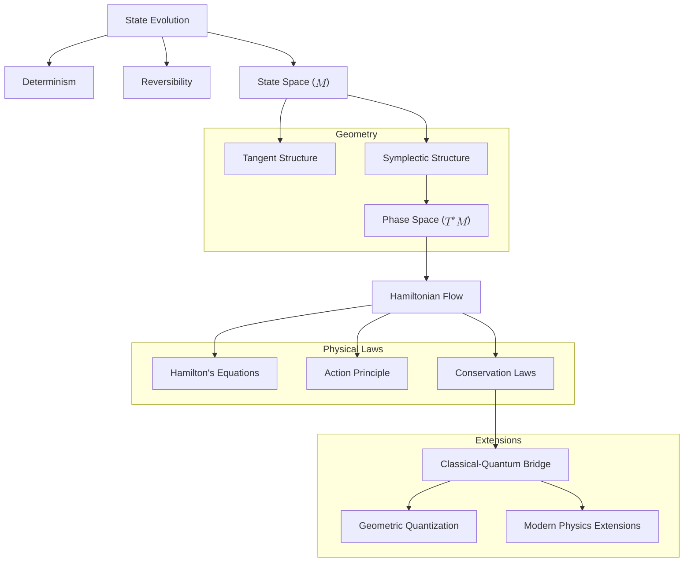

# The Geometric Essence of Classical Mechanics: A Reconstruction from First Principles
* * *

--- All motion is but the geometry of change made manifest.

# **I. Foundations: The Nature of State Evolution**  
**Epigraph**: *"In the beginning, there was only change."*

## **I.A. State Evolution as Fundamental Reality**  

Classical mechanics begins with a single, universal observation: **things change**. At its most fundamental level, the universe is a system of evolving states, where each state encapsulates all the information needed to describe a physical system at a given moment. Classical mechanics is, at its core, the study of how these states evolve over time according to consistent and universal principles.

### **I.A.1. Defining State Evolution**  

State evolution is the process by which physical systems undergo continuous change. Let us define core requirements for this evolution:

1. **Determinism**:
   Evolution must uniquely map a state at one time to a single state at any future time. Formally, if a system's state at time $t$ is represented by $s(t)$, the evolution is determined by a map:
   $$
   \phi_t: \mathcal{M} \to \mathcal{M}, \quad s(t) \mapsto s(t + \Delta t),
   $$
   where $\mathcal{M}$ is the **state space**, the set of all possible states of the system. Determinism ensures that the trajectory of a system $\gamma(t) \subset \mathcal{M}$, describing its evolution, is well-defined and unique.

2. **Reversibility**:
   The evolution must preserve information, allowing the recovery of past states from the present. Reversibility implies the existence of an inverse mapping:
   $$
   \phi_{-t} = \phi_t^{-1}, \quad \phi_{-t}(\phi_t(s)) = s.
   $$
   This ensures that evolution is time-symmetric: no state is lost, and no new states are created.

### **I.A.2. State Space as the Arena of Evolution**  

To describe state evolution rigorously, we introduce the concept of a **state space** $\mathcal{M}$, a mathematical structure representing all possible configurations of a physical system. The properties of $\mathcal{M}$ are dictated by the requirements of evolution:

1. **Smooth Manifold**:
   $\mathcal{M}$ must be a smooth $n$-dimensional manifold to allow continuous and differentiable evolution. Smoothness ensures that small changes in the state result in small changes in its trajectory, reflecting the continuity of physical processes.

2. **Dimensionality**:
   The dimension of $\mathcal{M}$ corresponds to the degrees of freedom of the system. For example:
   - A single particle in three-dimensional space has $n = 3$ degrees of freedom, so $\mathcal{M} \cong \mathbb{R}^3$.
   - A pendulum constrained to move in a plane has $n = 1$, so $\mathcal{M} \cong S^1$, the circle.

3. **Trajectories in State Space**:
   The evolution of a system is represented as a smooth curve $\gamma(t) \subset \mathcal{M}$, parameterized by time $t$. Each point on the trajectory corresponds to the state of the system at a given moment.

### **I.A.3. Requirements for Consistent Evolution**  

The principles of determinism and reversibility impose additional mathematical and physical constraints on $\mathcal{M}$:

1. **Existence of Flows**:
   The evolution of states can be described by a smooth vector field $X$ on $\mathcal{M}$. The vector field assigns a direction of change to each point in $\mathcal{M}$, and its integral curves represent the trajectories of the system:
   $$
   \frac{d\gamma(t)}{dt} = X(\gamma(t)),
   $$
   where $\gamma(t)$ is the trajectory and $X$ is the generator of the flow $\phi_t$.

2. **Preservation of Information**:
   The mapping of states by the evolution must preserve the structure of $\mathcal{M}$. This requirement ensures that no information is lost or created during evolution, leading directly to the emergence of geometric structures, as described in the next section.

## **I.B. Emergence of Geometry**  

The requirements of consistent state evolution—determinism, reversibility, and information preservation—force the emergence of specific geometric structures on $\mathcal{M}$. These structures form the foundation of classical mechanics.

### **I.B.1. Tangent Structure: Motion Requires Direction**  

1. **Tangent Space**:
   At each point $x \in \mathcal{M}$, the tangent space $T_x\mathcal{M}$ represents all possible directions of change (velocities) that the system can experience at $x$. A tangent vector $v \in T_x\mathcal{M}$ is a rate of change of the system's state.

2. **Vector Fields**:
   The evolution of the system is governed by a smooth vector field $X$ on $\mathcal{M}$, which assigns a tangent vector to each point in $\mathcal{M}$:
   $$
   X: \mathcal{M} \to T\mathcal{M}, \quad X(x) \in T_x\mathcal{M}.
   $$
   The integral curves of $X$ describe the trajectories of the system.

3. **Geometric Interpretation**:
   The tangent structure encodes the local geometry of motion, providing the foundation for describing continuous evolution.

### **I.B.2. Symplectic Structure: Reversibility and Information Preservation**  

The principle of reversibility and the requirement to preserve information impose additional constraints, leading to the emergence of a **symplectic structure** on $\mathcal{M}$.

1. **Phase Space and Cotangent Bundle**:
   To fully describe the state of a system, we must include both its position and its momentum (or conjugate variables). This naturally leads to the **phase space** $T^*\mathcal{M}$, the cotangent bundle of $\mathcal{M}$.
   - A state in phase space is represented by a pair $(q^i, p_i)$, where $q^i$ are generalized coordinates and $p_i$ are their conjugate momenta.

2. **Symplectic Form**:
   The evolution of states in phase space is governed by a closed, non-degenerate 2-form $\omega$:
   $$
   \omega = \sum_{i=1}^n dp_i \wedge dq^i.
   $$
   - **Non-degeneracy**: Ensures that $\omega$ defines a unique pairing between position and momentum directions.
   - **Closedness** ($d\omega = 0$): Guarantees that the symplectic structure is preserved during evolution, ensuring reversibility.

3. **Geometric Flow**:
   The symplectic structure ensures that the phase space volume is conserved, reflecting the incompressibility of trajectories:
   $$
   \mathcal{L}_{X_H} \omega = 0,
   $$
   where $X_H$ is the Hamiltonian vector field.

### **I.B.3. Phase Space: The Natural Arena of Evolution**  

The interplay of tangent and symplectic structures leads naturally to the concept of **phase space**:

1. **Definition**:
   Phase space $T^*\mathcal{M}$ is the cotangent bundle of the state space $\mathcal{M}$. It unifies positions and momenta into a single geometric structure.

2. **Canonical Coordinates**:
   Phase space is equipped with canonical coordinates $(q^i, p_i)$, where $q^i$ are positions and $p_i$ are momenta. These coordinates provide a natural representation of the symplectic structure:
   $$
   \omega = \sum_{i=1}^n dp_i \wedge dq^i.
   $$

3. **Role**:
   Phase space provides the natural arena for describing state evolution. The symplectic structure $\omega$ encodes the fundamental geometric relationships between positions and momenta.

### **I.B.4. Hamiltonian Flow: Generators of Evolution**  

The symplectic structure requires that state evolution be governed by a **Hamiltonian function** $H: T^*\mathcal{M} \to \mathbb{R}$, which generates the system's flow:

1. **Hamiltonian Vector Field**:
   The evolution is determined by the Hamiltonian vector field $X_H$, which satisfies:
   $$
   \iota_{X_H}\omega = dH,
   $$
   where $\iota_{X_H}$ denotes the interior product of $X_H$ with the symplectic form $\omega$.

2. **Equations of Motion**:
   In canonical coordinates, the equations of motion are:
   $$
   \dot{q}^i = \frac{\partial H}{\partial p_i}, \quad \dot{p}_i = -\frac{\partial H}{\partial q^i}.
   $$
   These are the **Hamiltonian equations**, which describe the evolution of the system in phase space.

## **I.C. Conclusion**  

State evolution, constrained by determinism, reversibility, and information preservation, necessitates the emergence of tangent and symplectic structures. Together, these structures define phase space as the natural arena for describing physical systems. The Hamiltonian function, as the generator of evolution, completes this geometric framework, establishing the foundation for classical mechanics.

In the next section, we will formalize these structures into a comprehensive **geometric framework**, showing how the laws of classical mechanics emerge as natural consequences of this unified foundation.

# **II. The Geometric Framework of Mechanics**  
**Epigraph**: *"Space bends to accommodate motion."*

## **II.A. Natural Geometric Structures**  

Classical mechanics is fundamentally a theory of state evolution governed by geometry. The requirements of determinism, reversibility, and information preservation necessitate the emergence of specific geometric structures. These structures—symplectic forms, phase spaces, and Poisson brackets—are the mathematical backbone of mechanics, providing a unified framework for describing motion and its governing laws.

### **II.A.1. The Symplectic Form: The Foundation of Phase Space**

At the heart of the geometric framework lies the **symplectic form** $\omega$, a closed, non-degenerate 2-form that encodes the structure of phase space.

1. **Definition and Properties**:
   The symplectic form $\omega$ satisfies the following essential properties:
   - **Non-degeneracy**: For any non-zero tangent vector $v \in T_x(T^*\mathcal{M})$, there exists a $w \in T_x(T^*\mathcal{M})$ such that $\omega(v, w) \neq 0$. This ensures that the symplectic structure fully captures the geometric relationships in phase space.
   - **Closedness**:
     $$
     d\omega = 0,
     $$
    meaning $\omega$ is invariant under smooth deformations. This property guarantees that the symplectic structure is preserved during evolution, ensuring consistency and reversibility.

2. **Canonical Form**:
   Darboux's theorem ensures that, locally, the symplectic form can always be written in the canonical form:
   $$
   \omega = \sum_{i=1}^n dp_i \wedge dq^i,
   $$
   where $q^i$ are generalized coordinates and $p_i$ are their conjugate momenta. This result highlights the universality of the symplectic structure and provides a natural coordinate system for phase space.

3. **Physical Interpretation**:
   - The symplectic form $\omega$ measures the "area" in phase space swept out by trajectories.
   - It encodes the fundamental coupling between positions $q^i$ and momenta $p_i$, ensuring that their evolution is geometrically consistent.

### **II.A.2. Phase Space: The Arena of State Evolution**

The symplectic structure defines **phase space**, the natural stage on which classical mechanics unfolds.

1. **Definition**:
   Phase space is the cotangent bundle $T^*\mathcal{M}$, where $\mathcal{M}$ is the configuration space of the system. A point in phase space is represented by a pair $(q^i, p_i)$, where $q^i$ are generalized positions and $p_i$ are their conjugate momenta.

2. **Dimensionality**:
   If the configuration space $\mathcal{M}$ has $n$ dimensions (corresponding to $n$ degrees of freedom), the phase space $T^*\mathcal{M}$ has $2n$ dimensions. This doubling reflects the inclusion of both positions and momenta.

3. **Canonical Coordinates**:
   The coordinates $(q^i, p_i)$ provide a natural representation of phase space. The symplectic form $\omega$ in these coordinates takes the canonical form:
   $$
   \omega = \sum_{i=1}^n dp_i \wedge dq^i.
   $$

4. **Role of Phase Space**:
   Phase space provides the complete description of a system's state, unifying positions and momenta into a single geometric structure. The symplectic form $\omega$ governs the relationships between these variables, ensuring the consistency of their evolution.

### **II.A.3. Poisson Brackets: The Algebra of Observables**

The symplectic structure leads directly to the concept of **Poisson brackets**, which encode the algebraic relationships between observables in phase space.

1. **Definition**:
   For two observables $f, g$ defined on phase space, their Poisson bracket is given by:
   $$
   \{f, g\} = \sum_{i=1}^n \left( \frac{\partial f}{\partial q^i} \frac{\partial g}{\partial p_i} - \frac{\partial f}{\partial p_i} \frac{\partial g}{\partial q^i} \right).
   $$

2. **Key Properties**:
   - **Antisymmetry**:
     $$
     \{f, g\} = -\{g, f\}.
     $$
   - **Leibniz Rule**:
     $$
     \{f, gh\} = \{f, g\}h + g\{f, h\}.
     $$
   - **Jacobi Identity**:
     $$
     \{\{f, g\}, h\} + \{\{g, h\}, f\} + \{\{h, f\}, g\} = 0.
     $$

3. **Physical Interpretation**:
   - The Poisson bracket describes how one observable changes with respect to another under the dynamics of the system.
   - Time evolution of an observable $f$ is given by:
     $$
     \frac{df}{dt} = \{f, H\},
     $$
     where $H$ is the Hamiltonian function.

4. **Connection to Symplectic Geometry**:
   The Poisson bracket arises directly from the symplectic form $\omega$, reflecting the underlying geometric structure of phase space.

### **II.A.4. Conservation Laws and Symmetries**

The symplectic structure naturally incorporates the principles of symmetry and conservation, as formalized by Noether’s theorem.

1. **Symmetries and Conservation Laws**:
   - A symmetry of the Hamiltonian $H$ corresponds to a transformation that preserves the symplectic form $\omega$.
   - For every continuous symmetry, there exists a conserved quantity.

2. **Examples of Conserved Quantities**:
   - **Energy Conservation**: If $H$ is time-independent, the total energy is conserved.
   - **Momentum Conservation**: If $H$ is invariant under spatial translations, linear momentum is conserved.
   - **Angular Momentum Conservation**: If $H$ is invariant under rotations, angular momentum is conserved.

3. **Liouville’s Theorem**:
   The symplectic structure ensures that phase space volume is preserved during evolution:
   $$
   \mathcal{L}_{X_H} \omega^n = 0,
   $$
   where $\omega^n$ is the phase space volume form, and $\mathcal{L}_{X_H}$ is the Lie derivative along the Hamiltonian vector field $X_H$. This property reflects the incompressibility of trajectories in phase space.

## **II.B. Physical Laws as Geometric Necessities**

The geometric structures of symplectic geometry and phase space naturally give rise to the physical laws of classical mechanics. These laws are not imposed externally but emerge as intrinsic consequences of the framework.

### **II.B.1. Hamilton’s Equations: The Generator of Evolution**

The evolution of a system is governed by the Hamiltonian function $H$, which generates the flow in phase space.

1. **Hamiltonian Vector Field**:
   The dynamics are determined by the Hamiltonian vector field $X_H$, satisfying:
   $$
   \iota_{X_H}\omega = dH,
   $$
   where $\iota_{X_H}$ denotes the interior product of $X_H$ with the symplectic form $\omega$.

2. **Canonical Equations**:
   In canonical coordinates $(q^i, p_i)$, the equations of motion are:
   $$
   \dot{q}^i = \frac{\partial H}{\partial p_i}, \quad \dot{p}_i = -\frac{\partial H}{\partial q^i}.
   $$
   These are Hamilton’s equations, describing the time evolution of positions $q^i$ and momenta $p_i$.

3. **Geometric Flow**:
   The symplectic structure ensures that the flow generated by $X_H$ preserves the phase space structure, guaranteeing consistent and reversible evolution.

### **II.B.2. The Action Principle: The Variational Foundation**

The principle of least action provides an alternative formulation of classical mechanics, rooted in the variational properties of the action functional.

1. **Action Functional**:
   The action $S$ is given by:
   $$
   S = \int L \, dt,
   $$
   where $L = T - V$ is the Lagrangian (kinetic energy minus potential energy).

2. **Variational Principle**:
   The true trajectory of a system extremizes the action $S$, leading to Hamilton’s equations:
   $$
   \delta S = 0 \implies \iota_{X_H}\omega = dH.
   $$

3. **Geometric Origin**:
   The action principle arises naturally from the symplectic one-form $\theta = \sum_i p_i \, dq^i$, highlighting its geometric foundation.

### **II.B.3. Symmetry and Conservation**

Symmetries in the Hamiltonian framework correspond to canonical transformations that preserve the symplectic form $\omega$.

1. **Canonical Transformations**:
   Transformations $(q, p) \to (Q, P)$ are canonical if they preserve the symplectic structure:
   $$
   \omega = \sum_i dP_i \wedge dQ^i = \sum_i dp_i \wedge dq^i.
   $$

2. **Conserved Quantities**:
   Symmetries of the Hamiltonian generate conserved quantities, as formalized by Noether’s theorem.

## **II.C. Conclusion**

The geometric framework of classical mechanics, built upon the symplectic form, phase space, and Poisson brackets, provides a universal and elegant description of state evolution. From this framework, Hamilton’s equations, the action principle, and conservation laws emerge as inevitable consequences. These structures form the foundation for understanding both the simplest systems and their more complex extensions.

In the next section, we will explore how specific physical systems arise as natural manifestations of this geometric framework, demonstrating its power and universality.

# **III. Physical Systems as Geometric Necessities**  
**Epigraph**: *"From abstract necessity springs concrete existence."*

The abstract geometric framework of classical mechanics—centered on symplectic geometry, phase space, and conservation laws—serves as a universal foundation for describing physical systems. These systems, ranging from simple particles to complex many-body interactions and fields, emerge as direct consequences of the geometric principles. This section bridges the gap between abstract geometry and concrete physical phenomena, showing that the diversity of classical systems is encoded within the universal language of mechanics.

## **III.A. Elementary Systems**  

Elementary systems represent the simplest physical models, where the Hamiltonian and symplectic structure directly govern motion. These systems provide foundational examples of how trajectories and conservation laws emerge from the geometric framework.

### **III.A.1. Free Particle**  

The free particle is the most fundamental system, describing motion without external forces.

1. **Hamiltonian**:
   The Hamiltonian for a free particle of mass $m$ is given by its kinetic energy:
   $$
   H(q, p) = \frac{p^2}{2m},
   $$
   where $q$ represents the position, and $p$ represents the momentum.

2. **Equations of Motion**:
   Using Hamilton's equations:
   $$
   \dot{q} = \frac{\partial H}{\partial p} = \frac{p}{m}, \quad \dot{p} = -\frac{\partial H}{\partial q} = 0,
   $$
   the particle moves with constant momentum $p = p_0$ and its position evolves linearly:
   $$
   q(t) = q_0 + \frac{p_0}{m}t.
   $$

3. **Phase Space Trajectories**:
   In phase space, trajectories are straight lines parallel to the $q$-axis, reflecting uniform motion.

4. **Geometric Interpretation**:
   - The symplectic structure ensures the preservation of phase space volume (Liouville’s theorem).
   - The trajectory is a geodesic in phase space, representing the simplest possible motion.

### **III.A.2. Harmonic Oscillator**  

The harmonic oscillator is a system with a restoring force proportional to displacement, modeling springs, pendulums, and small oscillations near equilibrium.

1. **Hamiltonian**:
   The Hamiltonian for a harmonic oscillator is:
   $$
   H(q, p) = \frac{p^2}{2m} + \frac{kq^2}{2},
   $$
   where $k$ is the spring constant, $q$ is the position, and $p$ is the momentum.

2. **Equations of Motion**:
   Using Hamilton's equations:
   $$
   \dot{q} = \frac{\partial H}{\partial p} = \frac{p}{m}, \quad \dot{p} = -\frac{\partial H}{\partial q} = -kq,
   $$
   the solutions are sinusoidal:
   $$
   q(t) = A\cos(\omega t + \phi), \quad p(t) = -m\omega A\sin(\omega t + \phi),
   $$
   where $\omega = \sqrt{\frac{k}{m}}$ is the natural frequency, $A$ is the amplitude, and $\phi$ is the phase.

3. **Phase Space Trajectories**:
   - Trajectories in phase space are closed ellipses, reflecting periodic motion.
   - Each ellipse corresponds to a constant energy surface:
     $$
     E = \frac{p^2}{2m} + \frac{kq^2}{2}.
     $$

4. **Geometric Interpretation**:
   - The symplectic structure ensures that the area enclosed by each ellipse is invariant.
   - The oscillator demonstrates how energy conservation and periodicity emerge naturally from the geometry of phase space.

### **III.A.3. Central Force Problems**  

Central force systems describe motion under a force that depends only on the distance from a fixed center, such as gravitational or electrostatic forces.

1. **Hamiltonian**:
   The Hamiltonian for a particle of mass $m$ in a central potential $V(r)$ is:
   $$
   H(r, p_r, L) = \frac{p_r^2}{2m} + \frac{L^2}{2mr^2} + V(r),
   $$
   where $r$ is the radial distance, $p_r$ is the radial momentum, and $L = r^2\dot{\theta}$ is the conserved angular momentum.

2. **Kepler Problem**:
   For an inverse-square potential $V(r) = -\frac{k}{r}$, which describes gravitational or Coulomb interactions:
   - Trajectories are conic sections (ellipses, parabolas, or hyperbolas), as determined by the total energy and angular momentum.
   - The system satisfies Kepler’s laws of planetary motion.

3. **Geometric Interpretation**:
   - Rotational symmetry leads to conservation of angular momentum $L$.
   - The phase space trajectories are confined to 4-dimensional submanifolds due to conserved energy and angular momentum.

## **III.B. Complex Systems**  

Building on the principles of elementary systems, complex systems exhibit richer dynamics, including collective behavior, wave phenomena, and continuous deformations. These systems arise naturally from the same geometric framework.

### **III.B.1. Many-Body Systems**  

Many-body systems consist of $N$ interacting particles, where complexity arises from their interactions.

1. **Phase Space Structure**:
   The state space for $N$ particles is the Cartesian product of individual phase spaces:
   $$
   \mathcal{M} = \prod_{i=1}^N \mathcal{M}_i, \quad T^*\mathcal{M} \cong \prod_{i=1}^N T^*\mathcal{M}_i.
   $$
   The total phase space has dimension $6N$ for particles in three-dimensional space.

2. **Hamiltonian**:
   The total Hamiltonian includes kinetic and interaction terms:
   $$
   H = \sum_{i=1}^N \frac{p_i^2}{2m_i} + \sum_{i < j} V(r_{ij}),
   $$
   where $r_{ij} = |\mathbf{r}_i - \mathbf{r}_j|$ is the distance between particles.

3. **Emergent Behavior**:
   - Symmetry reduction simplifies analysis (e.g., center-of-mass coordinates).
   - Collective phenomena, such as normal modes in coupled oscillators, emerge naturally.

4. **Geometric Interpretation**:
   - Conservation of total momentum and angular momentum reflects the translational and rotational symmetries of the system.
   - Phase space trajectories reveal emergent patterns and chaotic dynamics in certain regimes.

### **III.B.2. Field Systems**  

Field systems describe the dynamics of continuous fields, such as electromagnetic fields or wave equations, over spacetime.

1. **Configuration Space**:
   The state space is the space of field configurations $\phi(x)$ over a spatial domain $M$, with phase space defined by the field $\phi$ and its conjugate momentum $\pi(x)$.

2. **Hamiltonian**:
   The Hamiltonian density governs field dynamics:
   $$
   H = \int_M \left[ \frac{\pi^2}{2} + \frac{1}{2} (\nabla \phi)^2 + V(\phi) \right] d^3x,
   $$
   where $V(\phi)$ is the potential energy density.

3. **Wave Dynamics**:
   - Field equations, such as the Klein-Gordon equation or Maxwell’s equations, emerge naturally from the Hamiltonian formalism.
   - Solutions describe wave propagation and dynamics.

4. **Geometric Interpretation**:
   - The symplectic structure extends to infinite dimensions, preserving phase space volume for field configurations.
   - Conservation laws, such as energy and momentum, arise from symmetries of the Hamiltonian.

### **III.B.3. Continuous Media**  

Continuous systems, such as fluids and elastic solids, are described by deformable media with infinite degrees of freedom.

1. **Configuration Space**:
   The state space is the space of diffeomorphisms $\phi: M \to M$, describing the deformation of the medium.

2. **Hamiltonian Dynamics**:
   - The Hamiltonian includes kinetic energy and elastic or potential energy terms.
   - For fluids, the Euler equations arise naturally from the Hamiltonian framework.

3. **Geometric Interpretation**:
   - The phase space is infinite-dimensional, and the symplectic structure governs the evolution of flow fields.
   - Conservation of vorticity and energy reflects symmetries in the fluid system.

## **III.C. Conclusion**  

From elementary systems like free particles and harmonic oscillators to complex systems like many-body interactions, fields, and continuous media, the geometric framework of classical mechanics provides a universal foundation. The same principles—symplectic geometry, Hamiltonian flow, and conservation laws—govern all these systems, demonstrating the profound unity of classical mechanics.

In the next section, we explore how this framework bridges the gap to modern physics, revealing its natural extensions to quantum mechanics and gauge theories.

# **IV. Deep Unification**  
**Epigraph**: *"All is geometry, geometry is all."*

The geometric framework of classical mechanics, built upon symplectic geometry, phase space, and conservation laws, does not merely describe classical systems but also serves as a natural precursor to quantum mechanics and modern physics. This section explores how the principles of classical mechanics extend seamlessly into quantum mechanics and broader physical theories, revealing their profound unity.

## **IV.A. Classical-Quantum Bridge**

Quantum mechanics, though seemingly distinct from classical mechanics, emerges naturally as a geometric extension of the classical framework. By quantizing the symplectic structures of phase space, we uncover the deep continuity between classical and quantum descriptions of nature.

### **IV.A.1. Geometric Quantization**  

Geometric quantization formalizes the transition from classical to quantum mechanics by constructing quantum systems directly from the symplectic geometry of phase space.

1. **Phase Space Volume Quantization**:
   Classical phase space is governed by the symplectic form $\omega$, which defines the "volume" of phase space regions. Quantum mechanics introduces a fundamental quantization condition, discretizing phase space:
   $$
   \frac{1}{2\pi\hbar} \int_{\Sigma} \omega \in \mathbb{Z},
   $$
   where $\Sigma$ is a 2-dimensional surface in phase space, and $\hbar$ is Planck's constant. This condition ensures that the symplectic structure is compatible with the discrete nature of quantum states, such as quantized energy levels in atomic systems.

2. **Prequantum Line Bundles**:
   - The symplectic form $\omega$ is interpreted as the curvature of a complex line bundle $L$ over phase space. This bundle supports the wavefunctions of quantum mechanics as its sections.
   - The connection on the bundle, denoted $\nabla$, satisfies:
     $$
     \text{curv}(\nabla) = -\frac{i}{\hbar} \omega.
     $$

3. **Wavefunctions and the Symplectic One-Form**:
   Wavefunctions in quantum mechanics arise as sections of the prequantum line bundle. The symplectic one-form $\theta = \sum_i p_i \, dq^i$ determines the phase of the wavefunction. The action $S$ appears as a phase factor in the wavefunction:
   $$
   \psi \sim e^{\frac{i}{\hbar} S}.
   $$

### **IV.A.2. Quantum Operators and Commutation Relations**  

In the geometric framework, observables and their dynamics in quantum mechanics arise naturally from the classical Poisson bracket structure.

1. **From Observables to Operators**:
   Classical observables $f(q, p)$ are promoted to quantum operators $\hat{f}$ acting on the Hilbert space of wavefunctions. The operator $\hat{f}$ is constructed using the Hamiltonian vector field $X_f$ associated with $f$:
   $$
   \hat{f} = -i\hbar \nabla_{X_f} + f,
   $$
   where $\nabla_{X_f}$ is a derivative operation along the flow generated by $X_f$.

2. **Commutation Relations**:
   The quantum commutator emerges directly from the classical Poisson bracket:
   $$
   [\hat{f}, \hat{g}] = i\hbar \widehat{\{f, g\}},
   $$
   where $\{f, g\}$ is the classical Poisson bracket:
   $$
   \{f, g\} = \sum_i \left( \frac{\partial f}{\partial q^i} \frac{\partial g}{\partial p_i} - \frac{\partial f}{\partial p_i} \frac{\partial g}{\partial q^i} \right).
   $$
   This correspondence ensures that the algebra of quantum operators retains the structure of the classical phase space.

### **IV.A.3. Path Integral Formulation**  

The path integral formulation bridges classical and quantum mechanics by expressing quantum dynamics through the action functional $S$.

1. **Feynman’s Path Integral**:
   The probability amplitude for a quantum system to transition between two states is given by a sum over all possible paths $q(t)$, weighted by the phase factor $e^{\frac{i}{\hbar} S[q]}$:
   $$
   \mathcal{A} \sim \int e^{\frac{i}{\hbar} S[q]} \, \mathcal{D}[q].
   $$
   Here, $S[q]$ is the classical action for the path $q(t)$.

2. **Classical Limit**:
   In the limit $\hbar \to 0$, the dominant contribution to the path integral comes from the path that extremizes $S[q]$, recovering the classical principle of least action:
   $$
   \delta S = 0.
   $$

3. **Geometric Interpretation**:
   The path integral formalism reveals that quantum mechanics is fundamentally a theory of phase, governed by the symplectic structure of phase space.

## **IV.B. Extensions to Modern Physics**

The geometric framework of classical mechanics extends naturally to modern physics, encompassing gauge theories, quantum field theories, and quantum geometry. These extensions illustrate the universality of symplectic geometry and its central role in understanding the physical universe.

### **IV.B.1. Gauge Theories and Field Dynamics**  

Gauge theories, which describe the fundamental forces of nature, are deeply rooted in symplectic geometry.

1. **Connection Forms as Physical Fields**:
   - In gauge theories, the connection form $A$ on a principal bundle represents physical fields, such as the electromagnetic potential.
   - The curvature $F = dA + A \wedge A$ corresponds to the field strength, such as the electromagnetic field tensor $F_{\mu\nu}$.

2. **Hamiltonian Formalism for Fields**:
   - The Hamiltonian description of fields (e.g., Maxwell’s equations, Yang-Mills theory) arises naturally from the symplectic structure of the field phase space.
   - Canonical quantization of fields generalizes the Poisson bracket to infinite dimensions, leading to commutation relations for field operators.

3. **Geometric Interpretation**:
   - Symmetries of the gauge fields generate conserved charges via Noether’s theorem (e.g., electric charge, color charge in QCD).
   - The symplectic structure ensures consistency between gauge invariance and field dynamics.

### **IV.B.2. Quantum Geometry and Gravity**  

At the intersection of quantum mechanics and general relativity lies quantum geometry, where spacetime itself becomes a geometric entity subject to quantization.

1. **Noncommutative Geometry**:
   - Classical phase space is replaced by noncommutative geometry, where spacetime coordinates $(x^\mu, p_\mu)$ satisfy commutation relations:
     $$
     [x^\mu, p_\nu] = i\hbar \delta^\mu_\nu.
     $$
   - This framework introduces a quantum structure to spacetime, generalizing classical geometry.

2. **Quantum Groups**:
   - Symplectic symmetry groups are deformed into quantum groups, providing a mathematical foundation for quantum spacetime symmetries.

3. **Geometric Quantization of Spacetime**:
   - The symplectic structure of classical mechanics inspires attempts to quantize spacetime itself, forming the basis of quantum gravity theories.

### **IV.B.3. Future Directions**  

The geometric framework opens new pathways for theoretical and experimental exploration:

1. **Quantum Gravity**:
   - Symplectic geometry provides a natural foundation for unifying quantum mechanics and general relativity.
   - The phase space of gravity, described by Ashtekar variables, connects classical mechanics to loop quantum gravity.

2. **Information Theory**:
   - The geometric approach reveals deep connections between symplectic structures and entropy, linking classical mechanics to the thermodynamics of black holes.

3. **Emergent Phenomena**:
   - Geometric principles underlie emergent phenomena in condensed matter physics, such as topological phases of matter and the quantum Hall effect.

## **IV.C. Conclusion**  

The deep unification of classical mechanics, quantum mechanics, and modern physics lies in their shared reliance on symplectic geometry and state evolution. The geometric framework provides not only a foundation for understanding classical systems but also a bridge to quantum and relativistic theories. By revealing the profound unity of physical laws, this framework inspires new approaches to exploring the mysteries of the universe.

In the next section, we reflect on the implications of reconstructing classical mechanics as a geometric framework and summarize how this unified perspective enriches our understanding of physical reality.

# **V. Conclusion**  
**Epigraph**: *"In understanding geometry, we understand the universe."*

## **V.1. Reflections on the Geometric Reconstruction of Classical Mechanics**

Classical mechanics, often viewed as a collection of empirical laws and historical formulations, reveals its true nature when reconstructed from first principles. By grounding the entire framework in the universal concept of **state evolution**, we uncover a profound unity between motion, geometry, and physical law. This reconstruction demonstrates that classical mechanics is not simply a practical toolkit for solving problems but a deeply geometric theory where every law emerges as a necessity of consistent evolution.

1. **State Evolution as the Core Principle**:
   The journey began with a single foundational idea: **state evolution**. By imposing minimal requirements—determinism, reversibility, and information preservation—we derived the mathematical structures that form the backbone of mechanics. This approach shows that the laws of physics are not arbitrary but inevitable consequences of these constraints.

2. **Geometry as the Language of Mechanics**:
   The emergence of geometric structures—smooth manifolds, tangent bundles, symplectic forms, and phase spaces—highlights that geometry is not merely a mathematical tool but the essence of classical mechanics. The symplectic structure, in particular, governs all aspects of motion, ensuring consistency, conservation, and the preservation of information.

3. **Physical Laws as Geometric Necessities**:
   Laws such as Hamilton's equations, the principle of least action, and conservation laws are not imposed externally but arise naturally from the symplectic framework. They represent the interplay between geometry and the physical constraints of evolution, revealing the intrinsic order of the universe.

## **V.2. The Unity of Classical Mechanics**

This reconstruction unifies the diverse branches of classical mechanics—Newtonian, Lagrangian, and Hamiltonian—under a single geometric framework. Each formalism becomes a different perspective on the same underlying reality:

1. **Newtonian Mechanics**:
   The study of forces and accelerations is reinterpreted as the evolution of states in configuration space, emphasizing the deterministic flow of motion.

2. **Lagrangian Mechanics**:
   The principle of least action emerges as a variational consequence of the symplectic structure, providing a powerful method for analyzing systems with constraints and symmetries.

3. **Hamiltonian Mechanics**:
   The Hamiltonian formalism elevates the role of phase space, where the interplay between positions and momenta is governed by the symplectic geometry, offering a global perspective on dynamics.

Through this unification, we see classical mechanics as a single, coherent theory where all formalisms are interconnected expressions of the same geometric principles.

## **V.3. Bridging Classical and Quantum Mechanics**

The geometric reconstruction of classical mechanics also provides a seamless bridge to quantum mechanics. By quantizing the symplectic structure of phase space, we transition from the deterministic trajectories of classical systems to the probabilistic wavefunctions of quantum mechanics. This continuity reveals that quantum mechanics is not a separate theory but a natural extension of classical principles into the realm of discrete states and uncertainty.

1. **Geometric Quantization**:
   The quantization condition, $[\omega / 2\pi\hbar] \in H^2(M, \mathbb{Z})$, demonstrates how the smooth geometry of phase space gives rise to the discrete structure of quantum systems. Observables become operators, and the Poisson bracket transforms into the commutator, preserving the algebraic structure of classical mechanics.

2. **Path Integral Formulation**:
   The action functional $S$ serves as the link between classical and quantum mechanics, with Feynman's path integral formulation encoding the phase of quantum wavefunctions. In the classical limit ($\hbar \to 0$), quantum paths converge to the classical trajectories that extremize $S$.

This bridge underscores the universality of the geometric framework, which accommodates both classical and quantum worlds under a unified structure.

## **V.4. Implications for Modern Physics**

The insights gained from reconstructing classical mechanics extend far beyond its traditional scope, influencing modern physics and theoretical exploration:

1. **Gauge Theories and Symmetry**:
   The symplectic structure underpins gauge theories, where the conservation laws of classical mechanics generalize to conserved charges such as electric charge or color charge. The geometric language of connections and curvature describes the dynamics of fundamental forces.

2. **Quantum Geometry and Gravity**:
   The principles of classical mechanics inspire attempts to quantize spacetime itself, as seen in approaches to quantum gravity. Noncommutative geometry and quantum groups extend the symplectic framework to the structure of spacetime, uniting general relativity and quantum mechanics.

3. **Emergent Phenomena**:
   Geometric principles explain emergent phenomena in condensed matter physics, such as topological phases of matter and the quantum Hall effect. These systems reveal how global geometric and topological invariants govern physical behavior.

4. **Information Theory**:
   The preservation of information in classical mechanics resonates with modern studies of entropy, black hole thermodynamics, and the holographic principle, suggesting deep connections between geometry and information.

## **V.5. Future Directions and Open Questions**

The geometric reconstruction of classical mechanics opens new avenues for exploration and raises profound questions about the nature of reality:

1. **Is Geometry the Ultimate Foundation of Physics?**
   Can all physical laws, from quantum mechanics to cosmology, be derived from geometric principles? If so, what is the most fundamental geometric structure underlying the universe?

2. **The Role of Symmetry in Physics**:
   Symmetry plays a central role in classical mechanics, quantum mechanics, and gauge theories. Could deeper symmetries, such as those of higher-dimensional spaces or quantum groups, unify all physical forces?

3. **Bridging the Classical and Quantum Realms**:
   The geometric framework provides a natural bridge between classical and quantum mechanics, but how can it be extended to fully capture phenomena like quantum entanglement or spacetime singularities?

4. **Applications to New Fields**:
   Can the principles of classical mechanics be applied to emerging fields such as machine learning, complex systems, or biological dynamics, where geometry and evolution also play a critical role?

## **V.6. Final Reflection**

This exploration of classical mechanics reveals that its essence lies not in forces or equations but in the geometry of change and motion. By reconstructing the theory from the ground up, we have uncovered the profound unity and simplicity underlying its diverse phenomena. Geometry emerges as the language of nature, encoding the laws of motion, symmetry, and conservation in its elegant structures.

**In understanding geometry, we understand the universe.** Classical mechanics, as the geometry of evolution, provides a window into the fundamental order of reality. Its principles inspire us to think deeply, to question assumptions, and to seek the unifying patterns that govern the cosmos.

Let this reconstruction not be an endpoint but an invitation—to revisit, rethink, and reimagine the frameworks through which we understand the physical world. For as geometry whispers its truths, we are called to listen, interpret, and explore.

This concludes the reconstruction of classical mechanics as a geometric framework. Through this lens, we see not just the mechanics of motion but the profound interplay between mathematics, physics, and reality itself.

# **Appendix A : Conceptual Relationships in the Geometric Framework of Classical Mechanics**

To provide a clear and concise understanding of the core ideas presented in the document, this appendix organizes the key concepts and their interconnections into a diagram and a **relationship table**. These tools visually and logically illustrate how the foundational concepts of classical mechanics—state evolution, geometry, and physical laws—are unified under a single framework.

## **A.I. Conceptual Relationship Diagram**

Below is a flowchart that captures the hierarchical and relational structure of the concepts described in the document:

## **A.II. Core Concept Relationship Table**

The following table summarizes the relationships between the document's core concepts, their function, and how they connect to the larger framework of classical mechanics:

| **Concept**            | **Definition/Role**                                                                                      | **Related Concepts**                                                                                       |
|-------------------------|---------------------------------------------------------------------------------------------------------|-----------------------------------------------------------------------------------------------------------|
| **State Evolution**     | The universal principle describing how physical systems change over time.                              | Determinism, Reversibility, State Space ($\mathcal{M}$)                                               |
| **Determinism**         | Each state uniquely determines its future trajectory.                                                  | State Evolution, State Space ($\mathcal{M}$)                                                          |
| **Reversibility**       | Evolution must preserve information and allow backward mapping.                                        | State Evolution, Symplectic Structure                                                                    |
| **State Space** ($\mathcal{M}$) | The set of all possible states of a system, represented as a smooth manifold.                              | Tangent Structure, Symplectic Structure                                                                  |
| **Tangent Structure**   | Encodes the direction of motion (velocities) at each point of $\mathcal{M}$.                       | State Space ($\mathcal{M}$), Phase Space ($T^*\mathcal{M}$)                                       |
| **Symplectic Structure**| A closed, non-degenerate 2-form ($\omega$) on phase space that governs the interplay of positions and momenta. | State Space ($\mathcal{M}$), Phase Space ($T^*\mathcal{M}$), Hamiltonian Flow                     |
| **Phase Space** ($T^*\mathcal{M}$) | The cotangent bundle of $\mathcal{M}$, combining positions and momenta into a unified geometric structure. | Tangent Structure, Symplectic Structure, Hamiltonian Flow                                                |
| **Hamiltonian Flow**    | The evolution of states in phase space, generated by the Hamiltonian function $H$.                 | Symplectic Structure, Hamilton's Equations                                                               |
| **Hamilton's Equations**| Governs the time evolution of positions $q^i$ and momenta $p_i$ in phase space.                | Hamiltonian Flow, Conservation Laws                                                                      |
| **Action Principle**    | The variational principle that extremizes the action functional $S$ to derive the equations of motion. | Hamiltonian Flow, Conservation Laws                                                                      |
| **Conservation Laws**   | Physical quantities preserved due to symmetries in the Hamiltonian system.                             | Hamilton's Equations, Noether's Theorem                                                                  |
| **Classical-Quantum Bridge** | The connection between classical and quantum mechanics through geometric quantization of phase space.            | Conservation Laws, Geometric Quantization                                                                |
| **Geometric Quantization** | The quantization of symplectic structures, leading to quantum operators and commutators.                          | Poisson Brackets, Quantum Operators                                                                      |
| **Modern Physics Extensions** | Applications of the geometric framework to gauge theories, quantum field theory, and quantum gravity.             | Classical-Quantum Bridge, Conservation Laws                                                              |

## **A.III. Key Observations from the Relationships**

1. **State Evolution as the Root Concept**:
   All other structures in classical mechanics—state space, tangent and symplectic structures, phase space, and physical laws—emerge as consequences of the fundamental principle of **state evolution**.

2. **Geometry as the Unifying Framework**:
   The tangent and symplectic structures define the geometry of phase space, which in turn governs the dynamics of physical systems. Geometry provides the language through which physical laws, such as Hamilton's equations and conservation laws, are expressed.

3. **Physical Laws as Emergent Properties**:
   Physical laws, including the action principle and conservation laws, are not imposed externally but arise naturally from the geometric constraints of phase space and symplectic structure.

4. **Extensions to Quantum Mechanics and Modern Physics**:
   The same geometric principles that underlie classical mechanics extend seamlessly into quantum mechanics (via geometric quantization) and modern physical theories (e.g., gauge theories and quantum gravity). This continuity highlights the universality of the framework.

## **A.IV. Final Notes**

This appendix serves as a conceptual map for the document, illustrating how the ideas of state evolution, geometry, and physical laws interconnect to form a unified framework. By organizing these relationships, we emphasize the elegance and depth of the geometric reconstruction of classical mechanics, making its profound implications more accessible to the reader.

