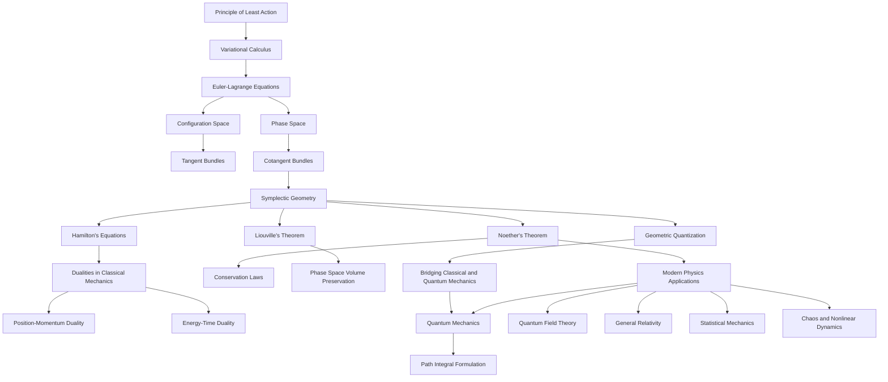

# The Geometric Foundations of Classical Mechanics: A Reconstruction from First Principles
* * *

--- At the heart of motion lies geometry, and at the heart of geometry lies change.

# **I. Introduction: The Nature of Classical Mechanics**
**Epigraph**: *"Every law of motion is but a whisper of geometry."*

## **I.A. Revisiting Classical Mechanics**

**Goal**: Frame classical mechanics as a study of evolution and change, highlighting its historical development and connections to modern physics.

Classical mechanics is the foundation of physics, providing the first comprehensive framework to describe the motion of the universe. Beginning with Newton's Principia, it has evolved into a profound and flexible structure encompassing Newtonian, Lagrangian, and Hamiltonian formulations. Despite being centuries old, its principles remain relevant, influencing diverse fields from quantum mechanics to modern cosmology.

This section revisits classical mechanics not merely as a collection of equations or empirical laws but as a conceptual framework centered on **change and evolution**, governed by symmetry, conservation, and mathematical structure. The key question we seek to answer is:

- *What is the true essence of classical mechanics, and how can it be reconstructed from its core principles?*

To address this, we trace its historical development through three perspectives:
1. **Newtonian Mechanics**:
   - The study of forces and accelerations, governed by $F = ma$.
   - Focuses on the trajectory of a particle in three-dimensional space.

2. **Lagrangian Mechanics**:
   - Reformulates motion using the **Principle of Least Action**, reducing dynamics to the extremization of a scalar quantity (the action).
   - Provides a natural framework for constrained systems and generalized coordinates.

3. **Hamiltonian Mechanics**:
   - Encodes motion in terms of energy and elegantly unifies positions and momenta in **phase space**.
   - Introduces symplectic geometry as the mathematical language of mechanics.

By comparing these formulations, we see that classical mechanics is not merely a study of motion but a profound exploration of **how systems evolve** in a way that reflects the underlying geometry and symmetry of nature.

## **I.B. The Geometric Perspective**

**Goal**: Introduce the core idea that classical mechanics is fundamentally geometric.

At its heart, classical mechanics is a **geometric theory**. It describes the motion of systems as trajectories on geometric spaces—**configuration space** and **phase space**—governed by the interplay of symmetries, conservation laws, and variational principles. The key insight is that the laws of physics are **manifestations of geometry**, and the dynamics of a system arise naturally from its underlying geometric structure.

1. **The Principle of Least Action**:
   - Central to this geometric perspective is the Principle of Least Action, which states:
     *The true path of a system is the one that extremizes the action functional $S$.*
   - This principle connects physical laws to variational calculus, highlighting the deep relationship between physics and geometry.

2. **Symplectic Geometry and Phase Space**:
   - Classical mechanics introduces **phase space**, a symplectic manifold where positions $q^i$ and momenta $p_i$ are treated as dual variables.
   - The dynamics of a system are encoded in the symplectic structure $\omega = \sum_{i=1}^n dp_i \wedge dq^i$, which governs the flow of trajectories.

3. **Dualities in Mechanics**:
   - Classical mechanics is rich in **duality structures**:
     - **Position-Momentum Duality**: Describes the interaction between configuration space and phase space.
     - **Energy-Time Duality**: Connects the Hamiltonian (energy function) to time evolution.

4. **Modern Connections**:
   - This geometric perspective forms a natural bridge to quantum mechanics, where phase space quantization and operator algebra extend these classical ideas into the quantum realm.
   - It also informs modern theories such as gauge fields, general relativity, and quantum field theory.

By shifting our focus from forces and trajectories to the **geometry of change**, we uncover a unifying framework for classical mechanics that connects its diverse branches and reveals its deep relationship with modern physics.

## **I.C. Key Observations and Connections**

1. **Reinterpretation of Classical Mechanics**:
   - Instead of viewing mechanics as a set of disconnected formalisms (Newtonian, Lagrangian, Hamiltonian), we reinterpret it as a unified geometric theory of evolution and change.

2. **Central Role of Geometry**:
   - Geometry is not just a tool for describing motion; it is the foundation of the laws themselves. The concepts of configuration space, phase space, and symplectic geometry are essential to understanding the nature of dynamics.

3. **Principle of Least Action as a Bridge**:
   - The Principle of Least Action serves as the conceptual and mathematical bridge between the different formulations of mechanics.

4. **Relevance to Modern Physics**:
   - The geometric framework of classical mechanics provides insights into quantum mechanics, relativistic theories, and beyond, showcasing its timeless relevance.

## **I.D. Transition to the Next Section**

Having established the geometric perspective, the next section delves into the **Principle of Least Action**, the cornerstone of this framework. By exploring its mathematical formulation and physical interpretation, we lay the foundation for deriving the equations of motion and understanding the geometry of evolution.

# **II. The Principle of Least Action: A Geometric Foundation**
**Epigraph**: *"Nature acts by minimizing effort."*

## **II.A. The Action Functional**

**Goal**: Define the action functional and its central role in classical mechanics.

The **Principle of Least Action** is the cornerstone of classical mechanics, encapsulating the essence of motion in a geometric and variational framework. It asserts that the evolution of a physical system follows a path that extremizes a scalar quantity called the **action**, defined by the integral of the Lagrangian over time.

1. **Definition of the Action Functional**:
   Let the Lagrangian $L$ be a function that depends on the generalized coordinates $q^i$, their time derivatives (velocities) $\dot{q}^i$, and possibly time $t$:
   $$
   L(q^i, \dot{q}^i, t) = T - V,
   $$
   where $T$ is the kinetic energy and $V$ is the potential energy. The **action functional** $S$ is given by:
   $$
   S[q] = \int_{t_1}^{t_2} L(q^i, \dot{q}^i, t) \, dt,
   $$
   where $q(t)$ denotes a possible trajectory of the system.

2. **Physical Interpretation**:
   - The action measures the "effort" or "cost" of a system's path through configuration space.
   - Nature selects the trajectory $q(t)$ that minimizes (or extremizes) this action.

3. **Historical Origins**:
   - The principle has its roots in the work of Maupertuis, Euler, and Lagrange, who sought to unify mechanics under a single geometric principle.
   - Hamilton further generalized the concept, connecting it to optics and wave theory, laying the foundation for modern physics.

4. **Geometric Perspective**:
   - In configuration space, the action defines a "length" or "effort" associated with paths.
   - The true trajectory is the one that minimizes this geometric quantity, akin to a geodesic in curved space.

This principle bridges mechanics with geometry, providing a universal framework for deriving the equations of motion, as explored in the next subsection.

## **II.B. Variational Calculus and Euler-Lagrange Equations**

**Goal**: Derive the equations of motion from the action principle.

The **action principle** relies on **variational calculus**, a mathematical framework for finding extrema of functionals. By applying this method to the action functional, we derive the fundamental equations of motion for a system: the **Euler-Lagrange equations**.

1. **Variational Calculus**:
   - Consider a family of trajectories $q^i(t)$ that vary smoothly around a given path $q^i_0(t)$. A small variation $\delta q^i(t)$ modifies the trajectory:
     $$
     q^i(t) \to q^i(t) + \epsilon \, \delta q^i(t), \quad \text{where } \epsilon \text{ is infinitesimal}.
     $$
   - The variation of the action is:
     $$
     \delta S = \frac{d}{d\epsilon} S[q^i + \epsilon \, \delta q^i] \Big|_{\epsilon=0}.
     $$
   - The path $q^i(t)$ that extremizes $S$ satisfies $\delta S = 0$.

2. **Derivation of the Euler-Lagrange Equations**:
   Substituting $S[q] = \int_{t_1}^{t_2} L(q^i, \dot{q}^i, t) \, dt$ into $\delta S = 0$:
   $$
   \delta S = \int_{t_1}^{t_2} \left( \frac{\partial L}{\partial q^i} \delta q^i + \frac{\partial L}{\partial \dot{q}^i} \delta \dot{q}^i \right) dt.
   $$
   Integration by parts on the $\delta \dot{q}^i$ term yields:
   $$
   \delta S = \int_{t_1}^{t_2} \left( \frac{\partial L}{\partial q^i} - \frac{d}{dt} \frac{\partial L}{\partial \dot{q}^i} \right) \delta q^i \, dt + \left[ \frac{\partial L}{\partial \dot{q}^i} \delta q^i \right]_{t_1}^{t_2}.
   $$
   The boundary term vanishes for variations that fix the endpoints ($\delta q^i(t_1) = \delta q^i(t_2) = 0$), leaving:
   $$
   \frac{\partial L}{\partial q^i} - \frac{d}{dt} \frac{\partial L}{\partial \dot{q}^i} = 0.
   $$
   These are the **Euler-Lagrange equations**, which govern the dynamics of the system.

3. **Illustrative Examples**:
   - **Free Particle**:
     For a free particle with $L = \frac{1}{2}m \dot{q}^2$:
     $$
     \frac{d}{dt} \left( m \dot{q} \right) = 0 \implies \dot{q} = v_0 \, (\text{constant velocity}).
     $$
   - **Harmonic Oscillator**:
     For $L = \frac{1}{2}m \dot{q}^2 - \frac{1}{2}k q^2$:
     $$
     m \ddot{q} + kq = 0 \implies \ddot{q} + \omega^2 q = 0, \quad \omega = \sqrt{\frac{k}{m}}.
     $$

4. **Physical Interpretation**:
   - The Euler-Lagrange equations describe how a system evolves to minimize the action.
   - They generalize Newton's second law $F = ma$ to arbitrary coordinates and systems.

5. **Geometric Insight**:
   - The extremization of $S$ corresponds to selecting the "optimal" trajectory in configuration space.
   - The equations of motion are geometric constraints imposed by the action principle.

## **II.C. Key Observations and Connections**

1. **Unification via the Action Principle**:
   - The Principle of Least Action provides a universal framework for deriving the laws of motion, unifying all classical systems under a single variational method.

2. **Connection to Geometry**:
   - The action defines a geometric quantity on the space of trajectories, and the true path minimizes this quantity.
   - The Euler-Lagrange equations emerge as the geometric conditions for extremization.

3. **Bridge to Modern Physics**:
   - The action principle forms the foundation for Hamiltonian mechanics, symplectic geometry, and quantum mechanics (via path integrals).

## **II.D. Transition to the Next Section**

Having established the centrality of the action principle and derived the equations of motion, the next section explores the **geometric structures** that underpin classical mechanics. Starting with configuration space and phase space, we delve into the mathematical framework of tangent and cotangent bundles, which form the foundation for both Lagrangian and Hamiltonian mechanics.

# **III. Configuration Space and Phase Space**
**Epigraph**: *"All motion begins with position but is completed by momentum."*

## **III.A. Configuration Space**

**Goal**: Define configuration space as the arena of position-based motion.

The **configuration space** $\mathcal{M}$ is the geometric setting in which classical mechanics begins. It represents the set of all possible configurations (positions) of a physical system, serving as the foundation for describing motion.

1. **Definition**:
   - Configuration space $\mathcal{M}$ is an $n$-dimensional manifold, where $n$ corresponds to the degrees of freedom of the system.
   - Each point $q \in \mathcal{M}$ specifies a unique configuration of the system.
   - Examples:
     - A single particle in three-dimensional space: $\mathcal{M} \cong \mathbb{R}^3$.
     - A pendulum constrained to move in a plane: $\mathcal{M} \cong S^1$ (a circle).
     - A system of $N$ interacting particles: $\mathcal{M} \cong \mathbb{R}^{3N}$.

2. **Tangent Bundles $T\mathcal{M}$**:
   - The tangent bundle $T\mathcal{M}$ is the space of all possible velocities at every point in $\mathcal{M}$.
   - At each configuration $q \in \mathcal{M}$, the **tangent space** $T_q\mathcal{M}$ consists of all velocity vectors $\dot{q}$ describing the instantaneous rate of change of $q$.
   - The Lagrangian formalism operates on $T\mathcal{M}$, where the dynamics are encoded in the Lagrangian $L(q, \dot{q}, t)$.

3. **Geometric Visualization**:
   - Configuration space provides a global view of the system's possible states.
   - Tangent vectors $\dot{q}$ at each point $q$ describe the directions in which the system can move.

4. **Examples of Configuration Space**:
   - **Pendulum**: A pendulum constrained to swing in a plane has $\mathcal{M} = S^1$, a one-dimensional circle. Its tangent bundle $T\mathcal{M}$ consists of angular positions $\theta$ and angular velocities $\dot{\theta}$.
   - **Multi-Particle Systems**: For $N$ particles in three-dimensional space, $\mathcal{M} \cong \mathbb{R}^{3N}$, with $T\mathcal{M}$ representing the positions and velocities of all particles.

5. **Role in Mechanics**:
   - Configuration space provides the foundation for defining the Lagrangian function $L(q, \dot{q}, t) = T - V$, where $T$ and $V$ are kinetic and potential energies, respectively.
   - Motion is described as a trajectory $q(t)$ on $\mathcal{M}$, determined by the Euler-Lagrange equations.

## **III.B. Phase Space and Cotangent Bundles**

**Goal**: Introduce phase space as the unification of positions and momenta.

While configuration space $\mathcal{M}$ focuses on positions, **phase space** $T^*\mathcal{M}$ extends this perspective by incorporating momenta, creating a complete description of a system's state. Phase space is the natural arena for Hamiltonian mechanics.

1. **Definition of Phase Space $T^*\mathcal{M}$**:
   - Phase space is the **cotangent bundle** of configuration space: $T^*\mathcal{M}$.
   - Each point in phase space is a pair $(q, p)$, where:
     - $q \in \mathcal{M}$ represents the system's position (configuration).
     - $p \in T_q^*\mathcal{M}$ represents the conjugate momentum, a covector in the cotangent space.

2. **Role of Momentum**:
   - Momentum $p_i = \frac{\partial L}{\partial \dot{q}^i}$ is the quantity conjugate to the coordinate $q^i$.
   - Momentum encodes the system's tendency to continue moving, completing the description of its state.

3. **Symplectic Structure of Phase Space**:
   - Phase space is equipped with a **symplectic structure**, a closed, non-degenerate 2-form $\omega$:
     $$
     \omega = \sum_{i=1}^n dp_i \wedge dq^i.
     $$
   - The symplectic structure governs the geometry of phase space and ensures that Hamiltonian flows preserve phase space volume (Liouville’s theorem).

4. **Geometric Visualization**:
   - Phase space trajectories are curves $(q(t), p(t))$ that describe the evolution of a system in both position and momentum.
   - For a harmonic oscillator, phase space trajectories are elliptical, reflecting the periodic exchange between kinetic and potential energy.

5. **Examples of Phase Space**:
   - **Free Particle**: $\mathcal{M} = \mathbb{R}^3$, $T^*\mathcal{M} = \mathbb{R}^6$, where $(q, p)$ includes positions and momenta in three dimensions.
   - **Harmonic Oscillator**: Phase space trajectories are ellipses, with $H = \frac{p^2}{2m} + \frac{kq^2}{2}$.

6. **Hamiltonian Formalism on Phase Space**:
   - The Hamiltonian $H(q, p)$ is a function on phase space that generates the system's evolution.
   - Hamilton’s equations describe the dynamics in terms of symplectic geometry:
     $$
     \dot{q}^i = \frac{\partial H}{\partial p_i}, \quad \dot{p}_i = -\frac{\partial H}{\partial q^i}.
     $$

7. **Comparison with Configuration Space**:
   - Configuration space $\mathcal{M}$: Focuses on positions and velocities, the domain of the Lagrangian formalism.
   - Phase space $T^*\mathcal{M}$: Combines positions and momenta, the domain of the Hamiltonian formalism.

8. **Applications**:
   - Phase space provides a richer framework for analyzing dynamics, especially in systems with conserved quantities or symmetries.
   - Symplectic geometry extends naturally to quantum mechanics, where phase space quantization connects classical and quantum descriptions.

## **III.C. Key Observations and Connections**

1. **From Configuration to Phase Space**:
   - While configuration space describes the positions of a system, phase space unifies positions and momenta into a complete state description.
   - The transition from $\mathcal{M}$ to $T^*\mathcal{M}$ reflects the shift from Lagrangian to Hamiltonian mechanics.

2. **Symplectic Geometry as the Foundation**:
   - The symplectic structure of phase space underpins the Hamiltonian formalism, ensuring consistency and conservation in dynamical evolution.

3. **Geometric Duality**:
   - Phase space illustrates the duality between positions ($q$) and momenta ($p$), a recurring theme in classical and quantum mechanics.

4. **Connection to Modern Physics**:
   - Phase space and symplectic geometry provide the mathematical foundation for advanced topics such as quantum mechanics, statistical mechanics, and field theory.

## **III.D. Transition to the Next Section**

Having established the geometric foundations of configuration space and phase space, the next section delves deeper into the **Lagrangian and Hamiltonian formulations of mechanics**. These two perspectives, connected by the Legendre transform, offer complementary descriptions of motion and reveal the rich duality underlying classical systems.

# **IV. Lagrangian and Hamiltonian Mechanics**
**Epigraph**: *"Dual perspectives of the same physical reality."*

## **IV.A. Lagrangian Mechanics**

**Goal**: Develop the Lagrangian formulation of mechanics.

The **Lagrangian formulation** of mechanics, established by Joseph-Louis Lagrange, redefines classical mechanics in terms of energy functions rather than forces. It uses the **Principle of Least Action** to derive equations of motion, making it particularly suited for systems with constraints and generalized coordinates.

1. **Defining the Lagrangian**:
   - The **Lagrangian function** $L(q, \dot{q}, t)$ is defined as the difference between the kinetic energy $T$ and potential energy $V$:
     $$
     L = T - V.
     $$
   - Here, $q = (q^1, q^2, \dots, q^n)$ are the generalized coordinates, and $\dot{q} = (\dot{q}^1, \dot{q}^2, \dots, \dot{q}^n)$ are their time derivatives (generalized velocities).

2. **The Principle of Least Action and Euler-Lagrange Equations**:
   - The **action** is given by:
     $$
     S = \int_{t_1}^{t_2} L(q, \dot{q}, t) \, dt.
     $$
   - The equations of motion are derived by extremizing the action $S$ using variational calculus, leading to the **Euler-Lagrange equations**:
     $$
     \frac{d}{dt} \left( \frac{\partial L}{\partial \dot{q}^i} \right) - \frac{\partial L}{\partial q^i} = 0, \quad i = 1, 2, \dots, n.
     $$

3. **Advantages of the Lagrangian Formalism**:
   - **Generalized Coordinates**: The Lagrangian framework allows the use of any coordinate system, making it ideal for systems with constraints (e.g., pendulums, rigid bodies).
   - **Intrinsic Description**: It eliminates the need to directly calculate forces, focusing instead on energy differences.
   - **Symmetry and Conservation Laws**: Symmetries of $L$ directly lead to conserved quantities via **Noether’s theorem**.

4. **Applications of Lagrangian Mechanics**:
   - **Central Force Motion**:
     For a particle moving under a central potential $V(r)$:
     $$
     L = \frac{1}{2}m\left(\dot{r}^2 + r^2\dot{\theta}^2\right) - V(r).
     $$
     The resulting equations describe planetary motion, including Kepler’s laws.
   - **Constrained Systems**:
     Systems like pendulums, double pendulums, and rigid bodies are naturally described using Lagrangian mechanics.
   - **Electromagnetic Systems**:
     Charged particles in electromagnetic fields are modeled using the Lagrangian:
     $$
     L = \frac{1}{2}m\dot{\mathbf{r}}^2 + q\mathbf{A} \cdot \dot{\mathbf{r}} - q\phi,
     $$
     where $\mathbf{A}$ is the vector potential and $\phi$ is the scalar potential.

5. **Geometric Insight**:
   - The Lagrangian formalism operates on the **tangent bundle** $T\mathcal{M}$, where $\mathcal{M}$ is the configuration space.
   - Trajectories are curves on $T\mathcal{M}$ that extremize the action functional.

## **IV.B. Hamiltonian Mechanics**

**Goal**: Transition to the Hamiltonian formulation via the Legendre transform.

The **Hamiltonian formulation** of mechanics, developed by William Rowan Hamilton, provides an alternative perspective by focusing on energy and phase space. It is particularly powerful for studying conserved systems, symplectic geometry, and the transition to quantum mechanics.

1. **From Lagrangian to Hamiltonian: The Legendre Transform**:
   - The **Hamiltonian function** $H(q, p, t)$ is obtained from the Lagrangian $L(q, \dot{q}, t)$ via the **Legendre transform**:
     $$
     H(q, p, t) = \sum_{i=1}^n p_i \dot{q}^i - L(q, \dot{q}, t),
     $$
     where $p_i = \frac{\partial L}{\partial \dot{q}^i}$ are the conjugate momenta.
   - $H$ represents the total energy of the system when $L = T - V$:
     $$
     H = T + V.
     $$

2. **Hamilton’s Equations of Motion**:
   - The dynamics of the system are governed by the **Hamiltonian equations**:
     $$
     \dot{q}^i = \frac{\partial H}{\partial p_i}, \quad \dot{p}_i = -\frac{\partial H}{\partial q^i}, \quad i = 1, 2, \dots, n.
     $$
   - These first-order differential equations describe the evolution of positions $q^i$ and momenta $p_i$ in **phase space** $T^*\mathcal{M}$.

3. **Advantages of the Hamiltonian Formalism**:
   - **Phase Space Representation**: The Hamiltonian framework unifies positions and momenta into a single symplectic structure, enabling deeper geometric insights.
   - **Time Evolution**: The Hamiltonian $H$ acts as the generator of time evolution, connecting energy conservation with the flow of trajectories in phase space.
   - **Quantization**: The Hamiltonian formalism provides a natural transition to quantum mechanics, where $H$ becomes the energy operator.

4. **Applications of Hamiltonian Mechanics**:
   - **Harmonic Oscillator**:
     For $H = \frac{p^2}{2m} + \frac{1}{2}kx^2$, Hamilton’s equations yield:
     $$
     \dot{q} = \frac{p}{m}, \quad \dot{p} = -kx,
     $$
     describing periodic motion in phase space as elliptical trajectories.
   - **Planetary Motion**:
     Hamiltonian mechanics simplifies the analysis of celestial systems by leveraging conserved quantities like angular momentum.
   - **Statistical Mechanics**:
     The Hamiltonian formalism underpins the microcanonical and canonical ensembles in statistical mechanics.

5. **Geometric Insight**:
   - The Hamiltonian formalism operates on the **cotangent bundle** $T^*\mathcal{M}$, which serves as the phase space.
   - The symplectic structure $\omega = \sum dp_i \wedge dq^i$ governs the flow of trajectories, ensuring conservation of phase space volume (Liouville’s theorem).

6. **Comparison of Lagrangian and Hamiltonian Mechanics**:
   - **Lagrangian Mechanics**:
     Operates on $T\mathcal{M}$ (tangent bundle), uses generalized velocities $\dot{q}$, and focuses on the Principle of Least Action.
   - **Hamiltonian Mechanics**:
     Operates on $T^*\mathcal{M}$ (cotangent bundle), uses positions $q$ and momenta $p$, and emphasizes energy conservation and symplectic geometry.

## **IV.C. Key Observations and Connections**

1. **Unified Framework**:
   - Lagrangian and Hamiltonian mechanics are complementary formulations, connected by the Legendre transform. Both are derived from the Principle of Least Action.

2. **Geometric Foundations**:
   - Lagrangian mechanics is rooted in the geometry of the tangent bundle $T\mathcal{M}$, while Hamiltonian mechanics is governed by the symplectic structure of phase space $T^*\mathcal{M}$.

3. **Applications to Modern Physics**:
   - The Hamiltonian formalism extends naturally to quantum mechanics, statistical mechanics, and field theory, showcasing its versatility and power.

## **IV.D. Transition to the Next Section**

With the Lagrangian and Hamiltonian formulations established, the next section delves into **symplectic geometry and dualities**, which form the mathematical backbone of phase space. By exploring the symplectic structure, we uncover the geometric principles that govern motion and conservation laws in classical mechanics.

# **V. Symplectic Geometry and Dualities**
**Epigraph**: *"Symmetry and duality govern the dance of motion."*

## **V.A. Symplectic Manifolds**

**Goal**: Introduce symplectic geometry as the mathematical foundation of phase space.

Symplectic geometry provides the mathematical backbone of Hamiltonian mechanics and phase space. It describes the structure that governs the evolution of physical systems, ensuring consistency, conservation, and reversibility. Symplectic manifolds are the natural geometric stage for classical mechanics.

1. **Definition of Symplectic Manifolds**:
   - A **symplectic manifold** $(\mathcal{M}, \omega)$ is a smooth, even-dimensional manifold $\mathcal{M}$ equipped with a **symplectic form** $\omega$, which is:
     - **Closed**: $d\omega = 0$, ensuring conservation properties.
     - **Non-degenerate**: For any nonzero tangent vector $v$, there exists a $w$ such that $\omega(v, w) \neq 0$, ensuring that $\omega$ provides a unique pairing between directions in phase space.
   - The most common example in classical mechanics is the phase space $T^*\mathcal{Q}$, where $\mathcal{Q}$ is the configuration space, and $\omega = \sum_{i=1}^n dp_i \wedge dq^i$.

2. **Properties of the Symplectic Form**:
   - The symplectic form $\omega$ encodes the fundamental relationships between positions $q^i$ and their conjugate momenta $p_i$:
     $$
     \omega = \sum_{i=1}^n dp_i \wedge dq^i.
     $$
   - It defines the geometry of phase space, governing the evolution of trajectories.
   - The **volume form** $\omega^n = \omega \wedge \omega \wedge \dots \wedge \omega$ (applied $n$ times) ensures the preservation of phase space volume during evolution, a property formalized in **Liouville’s theorem**.

3. **Hamiltonian Flow and Symplectic Geometry**:
   - A **Hamiltonian vector field** $X_H$ is defined by the condition:
     $$
     \iota_{X_H} \omega = dH,
     $$
     where $H(q, p)$ is the Hamiltonian function, and $\iota_{X_H}$ is the interior product.
   - The flow generated by $X_H$ preserves $\omega$, ensuring that symplectic geometry governs the time evolution of the system.

4. **Darboux’s Theorem**:
   - A key result in symplectic geometry is **Darboux’s theorem**, which states that any symplectic manifold is locally equivalent to $\mathbb{R}^{2n}$ with the canonical symplectic form $\omega = \sum_{i=1}^n dp_i \wedge dq^i$.
   - This means that all symplectic manifolds are locally "flat," simplifying the study of their local behavior.

5. **Geometric Insight into Motion**:
   - Symplectic geometry provides a **coordinate-free** description of classical mechanics, focusing on the intrinsic structure of phase space rather than specific parametrizations.
   - The symplectic form $\omega$ determines how positions and momenta are intertwined, ensuring the consistency of evolution and conservation laws.

## **V.B. Position-Momentum and Energy-Time Dualities**

**Goal**: Explore the fundamental dualities in classical mechanics.

Duality is a recurring theme in classical mechanics, reflecting the interplay between complementary quantities that together define a system's state. Symplectic geometry formalizes these relationships, revealing their geometric and physical significance.

1. **Position-Momentum Duality**:
   - **Configuration Space vs. Phase Space**:
     - In configuration space $\mathcal{Q}$, motion is described by positions $q^i$ and their derivatives $\dot{q}^i$.
     - In phase space $T^*\mathcal{Q}$, positions $q^i$ are paired with conjugate momenta $p_i$, providing a complete description of the state.
   - **Canonical Coordinates and the Symplectic Form**:
     - The pairing between $q^i$ and $p_i$ is encoded in the symplectic form $\omega = \sum dp_i \wedge dq^i$, reflecting their complementary roles in determining motion.
   - **Geometric Interpretation**:
     - Position and momentum are conjugate variables, meaning that changes in one induce changes in the other, as governed by Hamilton’s equations:
       $$
       \dot{q}^i = \frac{\partial H}{\partial p_i}, \quad \dot{p}_i = -\frac{\partial H}{\partial q^i}.
       $$

2. **Energy-Time Duality**:
   - **Hamiltonian as the Generator of Time Evolution**:
     - The Hamiltonian $H(q, p)$ represents the total energy of the system and acts as the generator of time evolution:
       $$
       \frac{dF}{dt} = \{F, H\},
       $$
       where $\{F, H\}$ is the Poisson bracket.
     - This reflects the duality between energy (a conserved quantity) and time (the parameter of evolution).
   - **Poisson Brackets as Duality Operators**:
     - The Poisson bracket formalism encodes the interaction between complementary quantities:
       $$
       \{q^i, p_j\} = \delta^i_j, \quad \{H, q^i\} = \dot{q}^i, \quad \{H, p_i\} = \dot{p}_i.
       $$
     - These relationships highlight how energy governs the time evolution of positions and momenta.

3. **Phase Space Symmetry and Conservation**:
   - The duality between position and momentum is deeply connected to symplectic geometry, which ensures that phase space volume is preserved over time (**Liouville’s theorem**).
   - Similarly, energy-time duality is tied to Noether’s theorem, where time-translation symmetry leads to energy conservation.

4. **Physical Examples of Dualities**:
   - **Harmonic Oscillator**:
     - The periodic exchange between kinetic and potential energy reflects energy-time duality.
     - The elliptical trajectories in phase space illustrate position-momentum duality.
   - **Free Particle**:
     - Position evolves linearly with time, while momentum remains constant, showcasing their complementary roles.
   - **Electromagnetic Fields**:
     - The interaction between electric and magnetic fields reflects a deeper geometric duality, analogous to position-momentum duality in mechanics.

5. **Geometric Interpretation of Dualities**:
   - Dualities are not merely algebraic relationships but reflect the **geometry of phase space**.
   - The interplay between complementary variables is encoded in the symplectic structure, ensuring consistency and conservation in the evolution of the system.

## **V.C. Key Observations and Connections**

1. **Symplectic Geometry as the Foundation**:
   - Symplectic manifolds and the symplectic form $\omega$ provide the geometric framework for understanding classical mechanics, ensuring consistency, conservation, and reversibility.

2. **Dualities in Mechanics**:
   - Position-momentum duality and energy-time duality are manifestations of the symplectic structure, reflecting the complementary roles of these quantities in defining a system's state.

3. **Relevance to Modern Physics**:
   - The symplectic structure underlies quantum mechanics, where position-momentum duality transitions to the uncertainty principle and energy-time duality governs wave-particle interactions.

4. **Connections to Conservation Laws**:
   - Dualities are deeply tied to conservation laws, which arise from symmetries of the Hamiltonian system (e.g., Noether’s theorem).

## **V.D. Transition to the Next Section**

Having established the symplectic geometry of phase space and the fundamental dualities in classical mechanics, the next section delves into **conservation laws and symmetry**. These principles, rooted in the symplectic structure, reveal how symmetries generate conserved quantities, forming the basis for Noether’s theorem and Liouville’s theorem.

# **VI. Conservation Laws and Symmetry**
**Epigraph**: *"Symmetry begets conservation."*

## **VI.A. Noether’s Theorem**

**Goal**: Derive conservation laws from symmetries.

Noether’s theorem is one of the most profound results in theoretical physics, linking the symmetries of a system to its conserved quantities. It provides a geometric and variational basis for understanding conservation laws, revealing their deep connection to the structure of spacetime and the dynamics of physical systems.

1. **Statement of Noether’s Theorem**:
   - For every continuous symmetry of the action functional $S[q] = \int L(q, \dot{q}, t) \, dt$, there exists a conserved quantity.
   - Symmetries are transformations that leave the action $S$ invariant, such as translations, rotations, or time shifts.

2. **Mathematical Derivation**:
   - Consider a transformation of the generalized coordinates $q^i \to q^i + \epsilon \eta^i(q, t)$, where $\eta^i$ are infinitesimal generators of the symmetry, and $\epsilon$ is a small parameter.
   - The variation of the action is:
     $$
     \delta S = \int_{t_1}^{t_2} \left( \frac{\partial L}{\partial q^i} \eta^i + \frac{\partial L}{\partial \dot{q}^i} \frac{d\eta^i}{dt} \right) dt.
     $$
   - Using the Euler-Lagrange equations, the terms involving $\frac{\partial L}{\partial q^i}$ vanish, leaving:
     $$
     \delta S = \int_{t_1}^{t_2} \frac{d}{dt} \left( \frac{\partial L}{\partial \dot{q}^i} \eta^i \right) dt.
     $$
   - If the action is invariant under the transformation ($\delta S = 0$), then the quantity:
     $$
     Q = \frac{\partial L}{\partial \dot{q}^i} \eta^i
     $$
    is conserved ($\frac{dQ}{dt} = 0$).

3. **Physical Interpretation**:
   - Noether’s theorem shows that conserved quantities arise due to invariances in the physical system:
     - **Time translation symmetry** → Conservation of energy.
     - **Space translation symmetry** → Conservation of linear momentum.
     - **Rotational symmetry** → Conservation of angular momentum.

4. **Examples of Noether’s Theorem**:
   - **Energy Conservation**:
     For a system with time-invariant $L(q, \dot{q})$:
     $$
     H = \dot{q}^i \frac{\partial L}{\partial \dot{q}^i} - L
     $$
     is conserved, representing the total energy.
   - **Linear Momentum Conservation**:
     For a system invariant under spatial translations ($q^i \to q^i + \epsilon$), the conserved quantity is the total linear momentum:
     $$
     p_i = \frac{\partial L}{\partial \dot{q}^i}.
     $$
   - **Angular Momentum Conservation**:
     For rotationally symmetric systems, the conserved angular momentum is:
     $$
     \mathbf{L} = \mathbf{r} \times \mathbf{p}.
     $$

5. **Geometric Insight**:
   - Symmetries correspond to **flows on configuration space** (or phase space) that leave the action invariant.
   - Conserved quantities are the **momentum maps** associated with these flows in symplectic geometry.

## **VI.B. Liouville’s Theorem**

**Goal**: Discuss the preservation of phase space volume.

Liouville’s theorem is a cornerstone of classical mechanics, stating that the flow of a Hamiltonian system preserves the volume of phase space. This result is a direct consequence of the symplectic structure and ensures the consistency of statistical mechanics.

1. **Statement of Liouville’s Theorem**:
   - In a Hamiltonian system, the phase space volume occupied by a set of trajectories remains constant under time evolution.
   - Mathematically, for a phase space distribution function $\rho(q, p, t)$:
     $$
     \frac{d\rho}{dt} = 0.
     $$
    This reflects the incompressibility of phase space flow.

2. **Proof of Liouville’s Theorem**:
   - The dynamics of a Hamiltonian system are governed by the symplectic structure:
     $$
     \dot{q}^i = \frac{\partial H}{\partial p_i}, \quad \dot{p}_i = -\frac{\partial H}{\partial q^i}.
     $$
   - The phase space flow is volume-preserving because the divergence of the Hamiltonian vector field $X_H$ vanishes:
     $$
     \nabla \cdot X_H = \sum_i \left( \frac{\partial \dot{q}^i}{\partial q^i} + \frac{\partial \dot{p}_i}{\partial p_i} \right) = 0.
     $$
   - Equivalently, the Lie derivative of the symplectic volume form $\omega^n$ along $X_H$ is zero:
     $$
     \mathcal{L}_{X_H} (\omega^n) = 0.
     $$

3. **Physical Interpretation**:
   - Liouville’s theorem implies that the density of trajectories in phase space remains constant over time.
   - It ensures that systems evolve in a way that preserves the "information" encoded in their initial conditions, a crucial property for statistical mechanics and ergodic theory.

4. **Applications of Liouville’s Theorem**:
   - **Statistical Mechanics**:
     The theorem underpins the microcanonical and canonical ensembles, ensuring the conservation of phase space volume in isolated systems.
   - **Chaos and Predictability**:
     In chaotic systems, Liouville’s theorem ensures that while individual trajectories may diverge, the overall volume of trajectories in phase space remains constant.
   - **Quantum Mechanics**:
     Liouville’s theorem has an analog in quantum mechanics, where the unitary evolution of the wavefunction preserves probability density.

5. **Geometric Insight**:
   - Liouville’s theorem is a direct consequence of the symplectic structure $\omega$ and the non-degeneracy of Hamiltonian flows.
   - It reflects the **incompressibility** of phase space, ensuring that symplectic transformations preserve the geometric structure of the system.

## **VI.C. Key Observations and Connections**

1. **Symmetry and Conservation**:
   - Noether’s theorem formalizes the intimate connection between symmetries and conserved quantities, providing a universal framework for deriving conservation laws.

2. **Phase Space Volume Preservation**:
   - Liouville’s theorem ensures that the symplectic structure of phase space is preserved under time evolution, maintaining the consistency of Hamiltonian dynamics.

3. **Geometric Foundations**:
   - Both Noether’s theorem and Liouville’s theorem are deeply rooted in the symplectic geometry of phase space, highlighting the geometric nature of classical mechanics.

4. **Relevance to Modern Physics**:
   - Noether’s theorem extends naturally to field theory, where it forms the basis for conserved currents.
   - Liouville’s theorem connects classical and quantum mechanics, bridging deterministic and probabilistic frameworks.

## **VI.D. Transition to the Next Section**

With the principles of symmetry and conservation established, the next section explores how these geometric foundations extend to **modern physics**, including quantum mechanics, field theory, and general relativity. By connecting classical mechanics to these advanced frameworks, we reveal its enduring relevance and universality.

# **VII. Extensions and Connections to Modern Physics**
**Epigraph**: *"Classical insights illuminate the quantum and the cosmic."*

## **VII.A. Geometric Quantization**

**Goal**: Show how symplectic geometry bridges classical and quantum mechanics.

Geometric quantization provides the bridge between the classical and quantum worlds, rooted in the symplectic structure of phase space. By translating classical concepts such as trajectories, observables, and Poisson brackets into their quantum counterparts, geometric quantization shows how the symplectic geometry of classical mechanics underpins the structure of quantum mechanics.

1. **Phase Space and Quantization**:
   - In classical mechanics, phase space $T^*\mathcal{M}$ is a symplectic manifold with the form $\omega = \sum dp_i \wedge dq^i$. Quantization associates classical observables and trajectories in $T^*\mathcal{M}$ with quantum operators and wavefunctions.
   - The **quantization condition** arises from the symplectic structure:
     $$
     \frac{1}{2\pi \hbar} \int \omega \in \mathbb{Z},
     $$
    meaning that the symplectic form must be integrally quantized over closed surfaces in phase space.

2. **From Poisson Brackets to Commutators**:
   - The classical Poisson bracket between two observables $F$ and $G$ is defined as:
     $$
     \{F, G\} = \sum_i \left( \frac{\partial F}{\partial q^i} \frac{\partial G}{\partial p_i} - \frac{\partial F}{\partial p_i} \frac{\partial G}{\partial q^i} \right).
     $$
   - Quantization maps these brackets to quantum commutators:
     $$
     \{F, G\} \to \frac{1}{i\hbar} [\hat{F}, \hat{G}],
     $$
    where $\hat{F}$ and $\hat{G}$ are quantum operators corresponding to the classical observables.

3. **Wavefunctions and Operators**:
   - In quantum mechanics, the state of a system is described by a wavefunction $\psi(q)$, which resides in a Hilbert space $\mathcal{H}$.
   - Observables such as position and momentum are promoted to operators:
     $$
     \hat{q}^i \psi(q) = q^i \psi(q), \quad \hat{p}_i \psi(q) = -i\hbar \frac{\partial \psi(q)}{\partial q^i}.
     $$
   - These operators satisfy the canonical commutation relations:
     $$
     [\hat{q}^i, \hat{p}_j] = i\hbar \delta^i_j.
     $$

4. **Path Integral Formulation**:
   - Feynman’s path integral approach to quantum mechanics connects directly to the Principle of Least Action in classical mechanics.
   - The quantum amplitude for a particle to transition between two states is given by a sum over all possible paths, weighted by the classical action:
     $$
     \mathcal{A} \propto \int e^{iS[q]/\hbar} \, \mathcal{D}[q].
     $$
   - This formulation highlights the geometric foundations of quantum mechanics, as the classical action $S[q]$ plays a central role.

5. **Geometric Insight**:
   - Geometric quantization formalizes the transition from the symplectic geometry of phase space to the algebraic structure of quantum mechanics.
   - Classical trajectories become probabilistic distributions, and conserved quantities become eigenvalues of quantum operators.

6. **Applications of Geometric Quantization**:
   - **Harmonic Oscillator**: The quantization of the harmonic oscillator involves discrete energy levels $E_n = \hbar \omega \left( n + \frac{1}{2} \right)$, derived from the symplectic structure of phase space.
   - **Spin Systems**: Quantization of angular momentum introduces $\hbar$-dependent quantized spin states, linking classical and quantum rotational dynamics.
   - **Gauge Theories**: Geometric quantization extends to field theories, where phase space becomes the space of field configurations.

## **VII.B. Classical Mechanics in Modern Physics**

**Goal**: Explore how classical mechanics informs modern theories.

Classical mechanics, despite being centuries old, remains foundational in modern physics. Its principles extend to quantum mechanics, field theory, and general relativity, revealing the universality of the geometric framework developed through classical mechanics.

1. **Gauge Theories and Symplectic Geometry**:
   - **Gauge Symmetries**: Classical mechanics introduces the concept of configuration spaces with constraints, which serve as precursors to gauge symmetries in modern physics.
   - **Field Dynamics**: The Hamiltonian formalism extends naturally to field theory, where the phase space consists of field configurations and their conjugate momenta.
   - **Symplectic Reduction**: The reduction of phase space in constrained systems (e.g., gauge fixing) forms the basis for the quantization of gauge theories.

2. **Quantum Field Theory**:
   - The principles of classical mechanics extend to quantum field theory (QFT), where fields replace particles as the fundamental objects.
   - The Lagrangian and Hamiltonian formalism are used to derive equations of motion for fields, such as the Klein-Gordon or Dirac equations.
   - Symplectic geometry informs the phase space structure of quantum fields, enabling canonical quantization.

3. **General Relativity**:
   - General relativity is deeply rooted in the variational principles of classical mechanics. The Einstein-Hilbert action:
     $$
     S = \int R \sqrt{-g} \, d^4x,
     $$
    where $R$ is the Ricci scalar and $g$ is the determinant of the metric tensor, generalizes the Principle of Least Action to curved spacetime.
   - Hamiltonian mechanics plays a role in canonical formulations of general relativity (e.g., ADM formalism), where spacetime is decomposed into hypersurfaces.

4. **Statistical Mechanics and Thermodynamics**:
   - Liouville’s theorem underpins statistical mechanics, ensuring the preservation of phase space volume in isolated systems.
   - The connection between microscopic dynamics and macroscopic thermodynamic quantities emerges naturally from the symplectic structure of classical mechanics.

5. **Chaos and Nonlinear Dynamics**:
   - Classical mechanics provides the framework for studying chaotic systems, where small changes in initial conditions lead to exponential divergence of trajectories.
   - Symplectic geometry ensures that even in chaotic dynamics, phase space volume is preserved.
   - Insights from classical chaos inform the study of quantum chaos, where classical trajectories influence quantum systems.

6. **Applications Across Scales**:
   - **Cosmology**: Classical mechanics informs models of cosmic evolution, including inflationary dynamics and the behavior of gravitational waves.
   - **Condensed Matter Physics**: The symplectic structure of classical mechanics influences the study of collective excitations and phase transitions in condensed matter systems.
   - **High-Energy Physics**: Classical mechanics provides the variational and geometric tools for understanding particle collisions, scattering amplitudes, and the Standard Model.

7. **Geometric Unification**:
   - The geometric principles of classical mechanics unify disparate fields of physics. For example:
     - The symplectic structure of phase space connects classical mechanics to quantum mechanics.
     - The variational principles underlying the action functional extend to field theory and general relativity.

## **VII.C. Key Observations and Connections**

1. **Foundational Role of Classical Mechanics**:
   - Classical mechanics is not limited to low-energy or macroscopic systems; its principles inform and unify modern physics across scales.

2. **Geometric Insights**:
   - The symplectic and variational principles developed in classical mechanics provide a universal language for describing physical systems, from particles to fields to spacetime itself.

3. **Bridging Classical and Quantum**:
   - Geometric quantization formalizes the transition from deterministic classical mechanics to probabilistic quantum mechanics, preserving the underlying symplectic structure.

4. **Timeless Relevance**:
   - Classical mechanics continues to inspire modern developments in physics, from chaos theory to quantum field theory, showcasing its enduring significance.

## **VII.D. Conclusion**

By extending the geometric principles of classical mechanics to modern physics, we see how its foundational role transcends the boundaries of classical systems. From quantum mechanics to cosmology, the insights of classical mechanics illuminate the deepest structures of reality, uniting the classical and quantum, the local and cosmic, under a single geometric framework.

# **Appendix A : Core Concepts and Their Interconnections**  
**Epigraph**: *"Understanding emerges from the clarity of relationships."*

To provide a structured overview of the core concepts discussed in this document and their interconnections, the following section presents a **conceptual relationship diagram**. This diagram highlights how the foundational principles, frameworks, and geometric structures of classical mechanics unify to form a cohesive theoretical foundation.

## **A.1. Core Relationships Diagram**

## **A.2. Explanation of Key Relationships**

1. **Principle of Least Action as the Foundation**:
   - The Principle of Least Action drives the entire framework, connecting directly to **variational calculus** and the derivation of the **Euler-Lagrange equations**.
   - This principle embeds the geometry of motion into the equations of classical mechanics.

2. **Configuration and Phase Space**:
   - **Configuration space** is the geometric setting for position-based motion, and its tangent bundles naturally lead to the Lagrangian formalism.
   - **Phase space**, as the cotangent bundle of configuration space, introduces momenta and forms the foundation of the Hamiltonian formalism.

3. **Symplectic Geometry as the Unifying Structure**:
   - The symplectic structure arises from the phase space's cotangent bundle and governs the dynamics of Hamiltonian systems.
   - Symplectic geometry underpins key results like **Hamilton's equations**, **Noether's theorem**, and **Liouville's theorem**, ensuring the consistency and conservation of phase space structures.

4. **Dualities in Classical Mechanics**:
   - **Position-momentum duality** and **energy-time duality** emerge naturally from the symplectic structure, illustrating complementary aspects of the system's state and evolution.

5. **Conservation Laws and Symmetry**:
   - **Noether's theorem** links symmetries to conserved quantities, showing how invariances in the action functional lead to the conservation of energy, momentum, and angular momentum.
   - **Liouville's theorem** guarantees the conservation of phase space volume, a critical property in statistical mechanics and chaos theory.

6. **Bridging to Quantum Mechanics**:
   - **Geometric quantization** translates the symplectic structure of phase space into quantum mechanics, connecting classical Poisson brackets to quantum commutators and providing the foundation for the **path integral formulation**.

7. **Extensions to Modern Physics**:
   - The geometric principles of classical mechanics extend seamlessly to modern frameworks, including quantum field theory, general relativity, and statistical mechanics, showcasing the timeless relevance of these ideas.

## **A.3. Key Observations**

- **Hierarchy of Concepts**: The **Principle of Least Action** serves as the root of the entire framework, with variational calculus and the symplectic structure branching out to support the diverse formulations of classical mechanics.
- **Unified Framework**: The connections between Lagrangian and Hamiltonian mechanics, conservation laws, dualities, and modern physics highlight the geometric unity of classical mechanics.
- **Timeless Relevance**: The extensions to quantum mechanics, field theories, and chaos theory demonstrate the enduring importance of classical mechanics in understanding the universe.

## **A.4. Alternative Representation: Tabular Summary of Relationships**

| **Core Concept**                | **Direct Dependencies**                          | **Key Extensions**                                       |
|----------------------------------|--------------------------------------------------|---------------------------------------------------------|
| Principle of Least Action        | Variational Calculus, Action Functional          | Euler-Lagrange Equations, Path Integral Formulation      |
| Variational Calculus             | Principle of Least Action                        | Euler-Lagrange Equations, Hamiltonian Formalism          |
| Configuration Space              | Euler-Lagrange Equations                         | Tangent Bundles, Lagrangian Mechanics                   |
| Phase Space                      | Symplectic Geometry                              | Cotangent Bundles, Hamiltonian Mechanics                |
| Symplectic Geometry              | Phase Space, Hamiltonian Mechanics               | Noether's Theorem, Liouville's Theorem                  |
| Dualities                        | Symplectic Geometry                              | Position-Momentum, Energy-Time                          |
| Conservation Laws                | Noether's Theorem, Symmetries                   | Energy, Momentum, Angular Momentum                      |
| Geometric Quantization           | Symplectic Geometry                              | Quantum Mechanics, Path Integral Formulation            |
| Modern Physics Applications      | Symplectic Geometry, Conservation Laws           | Quantum Field Theory, General Relativity, Chaos Theory  |

This appendix complements the full document by distilling its key relationships into visual and tabular formats, enabling readers to quickly grasp the interconnected nature of the concepts explored. It also highlights how classical mechanics, in its geometric essence, provides a unifying framework that transcends its historical roots and informs modern physics.

