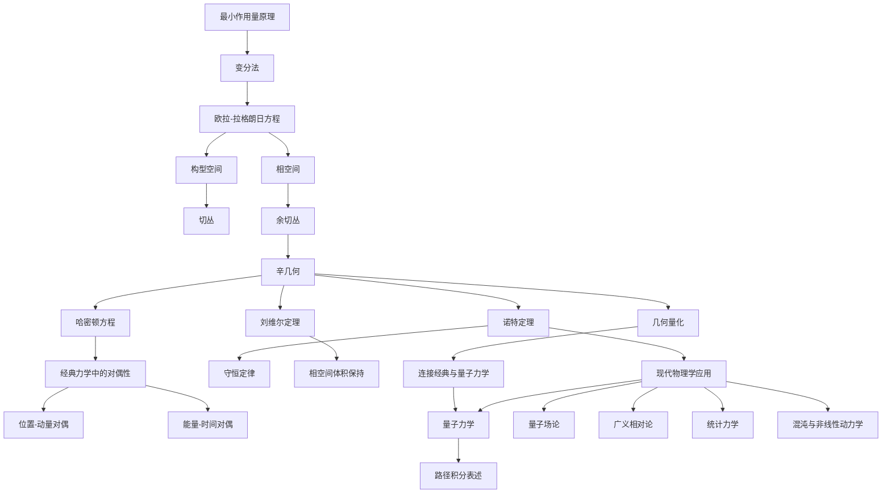

# 经典力学的几何基础：从第一原理重构
* * *

--- 运动的核心是几何，而几何的核心是变化。

# **I. 引言：经典力学的本质**
**题词**：*"每一条运动定律都是几何的低语。"*

## **I.A. 重温经典力学**

**目标**：将经典力学作为演化和变化的研究框架，突出其历史发展及其与现代物理学的联系。

经典力学是物理学的基础，提供描述宇宙运动的第一个全面框架。从牛顿的《自然哲学的数学原理》开始，它已经演变成一个深刻且灵活的结构，涵盖牛顿、拉格朗日和哈密顿的各种表述。尽管已有数百年历史，但其原则仍然相关，影响着从量子力学到现代宇宙学的各个领域。

本节重新审视经典力学，不仅仅将其视为一组方程或经验定律的集合，而是作为一个以**变化和演化**为中心的概念框架，由对称性、守恒律和数学结构所支配。我们试图回答的关键问题是：

- *经典力学的真正本质是什么，如何从其核心原则进行重构？*

为了解答这个问题，我们通过三个视角追溯其历史发展：
1. **牛顿力学**：
   - 研究受力和加速度的规律，由 $F = ma$ 控制。
   - 关注粒子在三维空间中的轨迹。

2. **拉格朗日力学**：
   - 使用**最小作用量原理**重新表述运动，将动力学简化为标量量(作用量)的极值化。
   - 为约束系统和广义坐标提供一个自然的框架。

3. **哈密顿力学**：
   - 用能量编码运动，并优雅地在**相空间**中统一位置和动量。
   - 引入辛几何作为力学的数学语言。

通过比较这些表述，我们看到经典力学不仅仅是运动的研究，而是对**系统如何演化**的深刻探索，反映了自然的底层几何和对称性。

## **I.B. 几何视角**

**目标**：介绍经典力学本质上是一个几何理论的核心思想。

在核心上，经典力学是一个**几何理论**。它将系统的运动描述为几何空间——**配置空间**和**相空间**——上的轨迹，这些轨迹由对称性、守恒律和变分原理的相互作用所控制。关键的洞见是，物理定律是**几何的体现**，系统的动力学自然地源于其底层的几何结构。

1. **最小作用量原理**：
   - 在这个几何视角中，中心地位的是最小作用量原理，该原理指出：
     *系统的真正路径是使作用泛函 $S$ 极值化的路径。*
   - 这一原理将物理定律与变分微积分联系起来，突出了物理与几何之间的深刻关系。

2. **辛几何与相空间**：
   - 经典力学引入**相空间**，这是一个辛流形，在其中位置 $q^i$ 和动量 $p_i$ 被视为对偶变量。
   - 系统的动力学被编码在辛结构 $\omega = \sum_{i=1}^n dp_i \wedge dq^i$ 中，该结构控制着轨迹的流动。

3. **力学中的对偶性**：
   - 经典力学富含**对偶结构**：
     - **位置-动量对偶**：描述配置空间和相空间之间的相互作用。
     - **能量-时间对偶**：将哈密顿量(能量函数)与时间演化联系起来。

4. **现代联系**：
   - 这种几何视角形成通往量子力学的自然桥梁，其中相空间量化和算子代数将这些经典概念扩展到量子领域。
   - 它还为现代理论如规范场、广义相对论和量子场论提供了信息。

通过将我们的关注点从力和轨迹转移到**变化的几何**，我们揭示了一个统一的经典力学框架，连接其不同的分支，并揭示了其与现代物理学的深层关系。

## **I.C. 关键观察与联系**

1. **经典力学的重新解释**：
   - 我们不再将力学视为一组不相关的形式体系(牛顿、拉格朗日、哈密顿)，而是将其重新解释为一个统一的几何演化和变化理论。

2. **几何的核心作用**：
   - 几何不仅仅是描述运动的工具；它是定律本身的基础。配置空间、相空间和辛几何的概念对于理解动力学的本质至关重要。

3. **最小作用量原理作为桥梁**：
   - 最小作用量原理作为不同力学表述之间的概念和数学桥梁。

4. **与现代物理学的相关性**：
   - 经典力学的几何框架为量子力学、相对论理论等提供见解，展示了其永恒的相关性。

## **I.D. 向下一节的过渡**

在建立几何视角之后，下一节深入探讨**最小作用量原理**，这一框架的基石。通过探索其数学表述和物理解释，我们为推导运动方程和理解演化的几何奠定基础。

# **II. 最小作用量原理：几何基础**
**题词**：*"自然通过最小化效应来行动。"*

## **II.A. 作用量泛函**

**目标**：定义作用量泛函及其在经典力学中的核心地位。

**最小作用量原理**是经典力学的基石，它在一个几何和变分框架中封装运动的本质。该原理断言，物理系统的演化遵循一条使称为**作用量**的标量量极值化的路径，作用量由拉格朗日量对时间的积分定义。

1. **作用量泛函的定义**：
   设拉格朗日量 $L$ 是一个依赖于广义坐标 $q^i$、它们的时间导数(速度) $\dot{q}^i$ 以及可能的时间 $t$ 的函数：
   $$
   L(q^i, \dot{q}^i, t) = T - V,
   $$
   其中 $T$ 是动能，$V$ 是势能。**作用量泛函** $S$ 定义为：
   $$
   S[q] = \int_{t_1}^{t_2} L(q^i, \dot{q}^i, t) \, dt,
   $$
   其中 $q(t)$ 表示系统的可能轨迹。

2. **物理解释**：
   - 作用量衡量了系统在配置空间中路径的“效应”或“成本”。
   - 自然选择使这个作用量最小化(或极值化)的轨迹 $q(t)$。

3. **历史起源**：
   - 该原理的根源可以追溯到莫佩尔蒂、欧拉和拉格朗日的工作，他们试图将力学统一在一个单一的几何原理下。
   - 哈密顿进一步推广这一概念，将其与光学和波动理论联系起来，为现代物理学奠定基础。

4. **几何视角**：
   - 在配置空间中，作用量定义一条路径的“长度”或“效应”。
   - 真正的轨迹是最小化这个几何量的路径，类似于曲面上的测地线。

这一原理将力学与几何联系起来，提供一个推导运动方程的通用框架，如下一小节所探讨的。

## **II.B. 变分微积分与欧拉-拉格朗日方程**

**目标**：从作用量原理推导运动方程。

**作用量原理**依赖于**变分微积分**，这是一种寻找泛函极值的数学框架。通过将这种方法应用于作用量泛函，我们推导出系统的根本运动方程：**欧拉-拉格朗日方程**。

1. **变分微积分**：
   - 考虑一族围绕给定路径 $q^i_0(t)$ 平滑变化的轨迹 $q^i(t)$。一个小的变化 $\delta q^i(t)$ 修改了轨迹：
     $$
     q^i(t) \to q^i(t) + \epsilon \, \delta q^i(t), \quad \text{where } \epsilon \text{ is infinitesimal}.
     $$
   - 作用量的变化为：
     $$
     \delta S = \frac{d}{d\epsilon} S[q^i + \epsilon \, \delta q^i] \Big|_{\epsilon=0}.
     $$
   - 使 $S$ 极值化的路径 $q^i(t)$ 满足 $\delta S = 0$。

2. **欧拉-拉格朗日方程的推导**：
   将 $S[q] = \int_{t_1}^{t_2} L(q^i, \dot{q}^i, t) \, dt$ 代入 $\delta S = 0$：
   $$
   \delta S = \int_{t_1}^{t_2} \left( \frac{\partial L}{\partial q^i} \delta q^i + \frac{\partial L}{\partial \dot{q}^i} \delta \dot{q}^i \right) dt.
   $$
   对 $\delta \dot{q}^i$ 项进行分部积分得到：
   $$
   \delta S = \int_{t_1}^{t_2} \left( \frac{\partial L}{\partial q^i} - \frac{d}{dt} \frac{\partial L}{\partial \dot{q}^i} \right) \delta q^i \, dt + \left[ \frac{\partial L}{\partial \dot{q}^i} \delta q^i \right]_{t_1}^{t_2}.
   $$
   对于固定端点的变分($\delta q^i(t_1) = \delta q^i(t_2) = 0$)，边界项消失，留下：
   $$
   \frac{\partial L}{\partial q^i} - \frac{d}{dt} \frac{\partial L}{\partial \dot{q}^i} = 0.
   $$
   这些是**欧拉-拉格朗日方程**，它们支配着系统的动力学。

3. **说明性例子**：
   - **自由粒子**：
     对于自由粒子，$L = \frac{1}{2}m \dot{q}^2$：
     $$
     \frac{d}{dt} \left( m \dot{q} \right) = 0 \implies \dot{q} = v_0 \, (\text{constant velocity}).
     $$
   - **谐振子**：
     对于 $L = \frac{1}{2}m \dot{q}^2 - \frac{1}{2}k q^2$：
     $$
     m \ddot{q} + kq = 0 \implies \ddot{q} + \omega^2 q = 0, \quad \omega = \sqrt{\frac{k}{m}}.
     $$

4. **物理解释**：
   - 欧拉-拉格朗日方程描述系统如何演化以最小化作用量。
   - 它们将牛顿第二定律 $F = ma$ 推广到任意坐标和系统。

5. **几何洞见**：
   - $S$ 的极值化对应于在配置空间中选择“最优”轨迹。
   - 运动方程是作用量原理施加的几何约束条件。

## **II.C. 关键观察与联系**

1. **通过作用量原理的统一**：
   - 最小作用量原理提供一个推导运动定律的通用框架，将所有经典系统统一在一个单一的变分方法下。

2. **与几何的联系**：
   - 作用量定义轨迹空间上的几何量，真正的路径最小化这个量。
   - 欧拉-拉格朗日方程作为极值化的几何条件出现。

3. **与现代物理学的桥梁**：
   - 作用量原理为哈密顿力学、辛几何和量子力学(通过路径积分)奠定了基础。

## **II.D. 向下一节的过渡**

在确立作用量原理的核心地位并推导出运动方程后，下一节探讨支撑经典力学的**几何结构**。从配置空间和相空间开始，我们将深入研究切丛和余切丛的数学框架，这些构成了拉格朗日力学和哈密顿力学的基础。

# **III. 配置空间与相空间**
**题词**：*"所有运动始于位置，但由动量完成。"*

## **III.A. 配置空间**

**目标**：定义配置空间作为基于位置的运动的舞台。

**配置空间** $\mathcal{M}$ 是经典力学开始的几何环境。它表示物理系统所有可能的构型(位置)的集合，是描述运动的基础。

1. **定义**：
   - 配置空间 $\mathcal{M}$ 是一个 $n$ 维流形，其中 $n$ 对应于系统的自由度。
   - 每个点 $q \in \mathcal{M}$ 确定系统的唯一构型。
   - 例子：
     - 三维空间中的单粒子：$\mathcal{M} \cong \mathbb{R}^3$。
     - 限制在平面内摆动的摆：$\mathcal{M} \cong S^1$(一个圆)。
     - $N$ 个相互作用的粒子系统：$\mathcal{M} \cong \mathbb{R}^{3N}$。

2. **切丛 $T\mathcal{M}$**：
   - 切丛 $T\mathcal{M}$ 是 $\mathcal{M}$ 中每个点上所有可能速度的空间。
   - 在每个构型 $q \in \mathcal{M}$ 处，**切空间** $T_q\mathcal{M}$ 包含所有描述 $q$ 的瞬时变化率的速度向量 $\dot{q}$。
   - 拉格朗日形式主义在 $T\mathcal{M}$ 上操作，动力学由拉格朗日量 $L(q, \dot{q}, t)$ 编码。

3. **几何可视化**：
   - 配置空间提供了系统可能状态的全局视图。
   - 每个点 $q$ 处的切向量 $\dot{q}$ 描述了系统可以移动的方向。

4. **配置空间的例子**：
   - **摆**：限制在平面内摆动的摆有 $\mathcal{M} = S^1$，一个一维圆。其切丛 $T\mathcal{M}$ 包括角位置 $\theta$ 和角速度 $\dot{\theta}$。
   - **多粒子系统**：对于三维空间中的 $N$ 个粒子，$\mathcal{M} \cong \mathbb{R}^{3N}$，$T\mathcal{M}$ 表示所有粒子的位置和速度。

5. **在力学中的作用**：
   - 配置空间为定义拉格朗日函数 $L(q, \dot{q}, t) = T - V$ 提供基础，其中 $T$ 和 $V$ 分别是动能和势能。
   - 运动被描述为 $\mathcal{M}$ 上的轨迹 $q(t)$，由欧拉-拉格朗日方程确定。

## **III.B. 相空间与余切丛**

**目标**：引入相空间作为位置和动量的统一。

配置空间 $\mathcal{M}$ 侧重于位置，而**相空间** $T^*\mathcal{M}$ 通过包含动量扩展这一视角，提供一个系统状态的完整描述。相空间是哈密顿力学的自然舞台。

1. **相空间 $T^*\mathcal{M}$ 的定义**：
   - 相空间是配置空间的**余切丛**：$T^*\mathcal{M}$。
   - 相空间中的每个点是一个配对 $(q, p)$，其中：
     - $q \in \mathcal{M}$ 表示系统的位形(位置)。
     - $p \in T_q^*\mathcal{M}$ 表示共轭动量，是余切空间中的一个余向量。

2. **动量的作用**：
   - 动量 $p_i = \frac{\partial L}{\partial \dot{q}^i}$ 是坐标 $q^i$ 的共轭量。
   - 动量编码系统继续运动的趋势，完成对其状态的描述。

3. **相空间的辛结构**：
   - 相空间配备了**辛结构**，一个封闭且非退化的 $2$-形式 $\omega$：
     $$
     \omega = \sum_{i=1}^n dp_i \wedge dq^i.
     $$
   - 辛结构控制相空间的几何，并确保哈密顿流保持相空间体积(刘维尔定理)。

4. **几何可视化**：
   - 相空间轨迹是曲线 $(q(t), p(t))$，描述系统在位置和动量上的演化。
   - 对于谐振子，相空间轨迹是椭圆形的，反映动能和势能之间的周期性交换。

5. **相空间的例子**：
   - **自由粒子**：$\mathcal{M} = \mathbb{R}^3$，$T^*\mathcal{M} = \mathbb{R}^6$，其中 $(q, p)$ 包括三个维度的位置和动量。
   - **谐振子**：相空间轨迹是椭圆，$H = \frac{p^2}{2m} + \frac{kq^2}{2}$。

6. **相空间上的哈密顿形式主义**：
   - 哈密顿量 $H(q, p)$ 是相空间上的一个函数，生成系统的演化。
   - 哈密顿方程用辛几何描述动力学：
     $$
     \dot{q}^i = \frac{\partial H}{\partial p_i}, \quad \dot{p}_i = -\frac{\partial H}{\partial q^i}.
     $$

7. **与配置空间的比较**：
   - 配置空间 $\mathcal{M}$：关注位置和速度，是拉格朗日形式主义的领域。
   - 相空间 $T^*\mathcal{M}$：结合位置和动量，是哈密顿形式主义的领域。

8. **应用**：
   - 相空间为分析动力学提供一个更丰富的框架，特别是在具有守恒量或对称性的系统中。
   - 辛几何自然地扩展到量子力学，其中相空间量化连接经典和量子描述。

## **III.C. 关键观察与联系**

1. **从配置空间到相空间**：
   - 虽然配置空间描述了系统的位形，但是相空间将位置和动量统一成一个完整的状态描述。
   - 从 $\mathcal{M}$ 到 $T^*\mathcal{M}$ 的过渡反映从拉格朗日力学到哈密顿力学的转变。

2. **辛几何作为基础**：
   - 相空间的辛结构支撑哈密顿形式主义，确保动力学演化的连贯性和守恒。

3. **几何对偶性**：
   - 相空间展示了位置 ($q$) 和动量 ($p$) 之间的对偶性，这是经典和量子力学中反复出现的主题。

4. **与现代物理学的联系**：
   - 相空间和辛几何为量子力学、统计力学和场论等高级主题提供数学基础。

## **III.D. 向下一节的过渡**

在建立配置空间和相空间的几何基础后，下一节深入探讨**拉格朗日和哈密顿力学的表述**。这两个视角通过勒让德变换相连，提供运动的互补描述，揭示经典系统背后的丰富对偶性。

# **IV. 拉格朗日力学与哈密顿力学**
**题词**：*"同一物理实在的对偶视角。"*

## **IV.A. 拉格朗日力学**

**目标**：发展力学的拉格朗日表述。

由约瑟夫-路易·拉格朗日建立的**拉格朗日力学表述**，用能量函数而非力重新定义经典力学。它使用**最小作用量原理**推导运动方程，特别适合有约束和广义坐标的系统。

1. **定义拉格朗日量**：
   - **拉格朗日函数** $L(q, \dot{q}, t)$ 定义为动能 $T$ 与势能 $V$ 之差：
     $$
     L = T - V.
     $$
   - 其中，$q = (q^1, q^2, \dots, q^n)$ 是广义坐标，$\dot{q} = (\dot{q}^1, \dot{q}^2, \dots, \dot{q}^n)$ 是它们的时间导数(广义速度)。

2. **最小作用量原理与欧拉-拉格朗日方程**：
   - **作用量** 给出为：
     $$
     S = \int_{t_1}^{t_2} L(q, \dot{q}, t) \, dt.
     $$
   - 运动方程通过变分微积分极值化作用量 $S$ 导出，得到**欧拉-拉格朗日方程**：
     $$
     \frac{d}{dt} \left( \frac{\partial L}{\partial \dot{q}^i} \right) - \frac{\partial L}{\partial q^i} = 0, \quad i = 1, 2, \dots, n.
     $$

3. **拉格朗日形式主义的优势**：
   - **广义坐标**：拉格朗日框架允许使用任意坐标系，使其非常适合有约束的系统(如摆、刚体)。
   - **内在描述**：它消除直接计算力的需要，而是专注于能量差异。
   - **对称性与守恒定律**：$L$ 的对称性通过**诺特定理**直接导致守恒量。

4. **拉格朗日力学的应用**：
   - **中心力场运动**：
     对于在中心势 $V(r)$ 下运动的粒子：
     $$
     L = \frac{1}{2}m\left(\dot{r}^2 + r^2\dot{\theta}^2\right) - V(r).
     $$
     所得方程描述了行星运动，包括开普勒定律。
   - **受约束系统**：
     像摆、双摆和刚体这样的系统自然地用拉格朗日力学描述。
   - **电磁系统**：
     电磁场中的带电粒子用拉格朗日量建模：
     $$
     L = \frac{1}{2}m\dot{\mathbf{r}}^2 + q\mathbf{A} \cdot \dot{\mathbf{r}} - q\phi,
     $$
     其中 $\mathbf{A}$ 是矢势，$\phi$ 是标势。

5. **几何洞见**：
   - 拉格朗日形式主义在**切丛** $T\mathcal{M}$ 上操作，其中 $\mathcal{M}$ 是配置空间。
   - 轨迹是 $T\mathcal{M}$ 上极值化作用量泛函的曲线。

## **IV.B. 哈密顿力学**

**目标**：通过勒让德变换过渡到哈密顿表述。

由威廉·罗文·哈密顿发展的**哈密顿力学表述**，通过关注能量和相空间提供了另一种视角。它特别适用于研究守恒系统、辛几何以及向量子力学的过渡。

1. **从拉格朗日量到哈密顿量：勒让德变换**：
   - **哈密顿函数** $H(q, p, t)$ 通过**勒让德变换**从拉格朗日量 $L(q, \dot{q}, t)$ 获得：
     $$
     H(q, p, t) = \sum_{i=1}^n p_i \dot{q}^i - L(q, \dot{q}, t),
     $$
     其中 $p_i = \frac{\partial L}{\partial \dot{q}^i}$ 是共轭动量。
   - 当 $L = T - V$ 时，$H$ 表示系统的总能量：
     $$
     H = T + V.
     $$

2. **哈密顿运动方程**：
   - 系统的动力学由**哈密顿方程**控制：
     $$
     \dot{q}^i = \frac{\partial H}{\partial p_i}, \quad \dot{p}_i = -\frac{\partial H}{\partial q^i}, \quad i = 1, 2, \dots, n.
     $$
   - 这些一阶微分方程描述位置 $q^i$ 和动量 $p_i$ 在**相空间** $T^*\mathcal{M}$ 中的演化。

3. **哈密顿形式主义的优势**：
   - **相空间表示**：哈密顿框架将位置和动量统一在一个单一的辛结构中，使几何洞见更加深刻。
   - **时间演化**：哈密顿量 $H$ 作为时间演化的生成元，连接能量守恒与相空间中轨迹的流动。
   - **量化**：哈密顿形式主义为量子力学提供自然的过渡，其中 $H$ 成为能量算符。

4. **哈密顿力学的应用**：
   - **谐振子**：
     对于 $H = \frac{p^2}{2m} + \frac{1}{2}kx^2$，哈密顿方程给出：
     $$
     \dot{q} = \frac{p}{m}, \quad \dot{p} = -kx,
     $$
     描述了相空间中的周期运动作为椭圆轨迹。
   - **行星运动**：
     哈密顿力学通过利用角动量等守恒量简化了天体力学系统的分析。
   - **统计力学**：
     哈密顿形式主义支撑了统计力学中的微正则和正则系综。

5. **几何洞见**：
   - 哈密顿形式主义在**余切丛** $T^*\mathcal{M}$ 上操作，其作为相空间。
   - 辛结构 $\omega = \sum dp_i \wedge dq^i$ 控制轨迹的流动，确保相空间体积的守恒(刘维尔定理)。

6. **拉格朗日力学与哈密顿力学的比较**：
   - **拉格朗日力学**：
     在 $T\mathcal{M}$(切丛)上操作，使用广义速度 $\dot{q}$，并专注于最小作用量原理。
   - **哈密顿力学**：
     在 $T^*\mathcal{M}$(余切丛)上操作，使用位置 $q$ 和动量 $p$，并强调能量守恒和辛几何。

## **IV.C. 关键观察与联系**

1. **统一框架**：
   - 拉格朗日力学和哈密顿力学是互补的表述，通过勒让德变换相连。两者都源自最小作用量原理。

2. **几何基础**：
   - 拉格朗日力学植根于切丛 $T\mathcal{M}$ 的几何，而哈密顿力学由相空间 $T^*\mathcal{M}$ 的辛结构支配。

3. **在现代物理学中的应用**：
   - 哈密顿形式主义自然地扩展到量子力学、统计力学和场论，展示了其多样性和强大功能。

## **IV.D. 向下一节的过渡**

在建立了拉格朗日和哈密顿表述后，下一节深入探讨**辛几何与对偶性**，这是相空间的数学骨干。通过探索辛结构，我们揭示了经典力学中支配运动和守恒定律的几何原则。

# **V. 辛几何与对偶性**
**题词**：*"对称性和对偶性支配着运动的舞蹈。"*

## **V.A. 辛流形**

**目标**：引入辛几何作为相空间的数学基础。

辛几何为哈密顿力学和相空间提供数学骨干。它描述支配物理系统演化的结构，确保一致性、守恒性和可逆性。辛流形是经典力学的自然几何舞台。

1. **辛流形的定义**：
   - 一个**辛流形** $(\mathcal{M}, \omega)$ 是一个配备有**辛形式** $\omega$ 的光滑、偶数维流形 $\mathcal{M}$，其中 $\omega$ 满足：
     - **封闭性**：$d\omega = 0$，确保守恒性质。
     - **非退化性**：对于任意非零切向量 $v$，存在一个 $w$ 使得 $\omega(v, w) \neq 0$，确保 $\omega$ 在相空间中提供唯一的方向配对。
   - 经典力学中最常见的例子是相空间 $T^*\mathcal{Q}$，其中 $\mathcal{Q}$ 是配置空间，且 $\omega = \sum_{i=1}^n dp_i \wedge dq^i$。

2. **辛形式的性质**：
   - 辛形式 $\omega$ 编码位置 $q^i$ 和其共轭动量 $p_i$ 之间的基本关系：
     $$
     \omega = \sum_{i=1}^n dp_i \wedge dq^i.
     $$
   - 它定义相空间的几何，控制轨迹的演化。
   - **体积形式** $\omega^n = \omega \wedge \omega \wedge \dots \wedge \omega$ (应用 $n$ 次)确保演化过程中相空间体积的守恒，这一性质在**刘维尔定理**中正式化。

3. **哈密顿流与辛几何**：
   - **哈密顿向量场** $X_H$ 由以下条件定义：
     $$
     \iota_{X_H} \omega = dH,
     $$
     其中 $H(q, p)$ 是哈密顿函数，$\iota_{X_H}$ 是内积。
   - 由 $X_H$ 生成的流保持 $\omega$，确保辛几何支配系统的时演化。

4. **达布定理**：
   - 辛几何中的一个重要结果是**达布定理**，它表明任意辛流形局部等价于带有典范辛形式 $\omega = \sum_{i=1}^n dp_i \wedge dq^i$ 的 $\mathbb{R}^{2n}$。
   - 这意味着所有辛流形在局部上都是“平坦”的，这简化了对其局部行为的研究。

5. **运动的几何洞见**：
   - 辛几何提供经典力学的**坐标无关**描述，关注相空间的内在结构而非具体的参数化。
   - 辛形式 $\omega$ 确定位置和动量如何交织在一起，确保演化的一致性和守恒定律。

## **V.B. 位置-动量与能量-时间对偶性**

**目标**：探讨经典力学中的基本对偶性。

对偶性是经典力学中反复出现的主题，反映互补量之间的相互作用，这些量共同定义系统的状态。辛几何形式化了这些关系，揭示它们的几何和物理意义。

1. **位置-动量对偶性**：
   - **配置空间与相空间**：
     - 在配置空间 $\mathcal{Q}$ 中，运动由位置 $q^i$ 及其导数 $\dot{q}^i$ 描述。
     - 在相空间 $T^*\mathcal{Q}$ 中，位置 $q^i$ 与共轭动量 $p_i$ 配对，提供一个完整的状态描述。
   - **典范坐标与辛形式**：
     - $q^i$ 和 $p_i$ 之间的配对编码在辛形式 $\omega = \sum dp_i \wedge dq^i$ 中，反映它们在决定运动中的互补角色。
   - **几何解释**：
     - 位置和动量是对偶变量，意味着一个的变化会引发另一个的变化，如哈密顿方程所示：
       $$
       \dot{q}^i = \frac{\partial H}{\partial p_i}, \quad \dot{p}_i = -\frac{\partial H}{\partial q^i}.
       $$

2. **能量-时间对偶性**：
   - **哈密顿量作为时间演化的生成元**：
     - 哈密顿量 $H(q, p)$ 表示系统的总能量，并作为时间演化的生成元：
       $$
       \frac{dF}{dt} = \{F, H\},
       $$
       其中 $\{F, H\}$ 是泊松括号。
     - 这反映能量(守恒量)与时间(演化参数)之间的对偶性。
   - **泊松括号作为对偶算子**：
     - 泊松括号形式主义编码互补量之间的相互作用：
       $$
       \{q^i, p_j\} = \delta^i_j, \quad \{H, q^i\} = \dot{q}^i, \quad \{H, p_i\} = \dot{p}_i.
       $$
     - 这些关系突显能量如何支配位置和动量的时间演化。

3. **相空间对称性与守恒**：
   - 位置和动量之间的对偶性与辛几何密切相关，后者确保相空间体积随时间保持不变(**刘维尔定理**)。
   - 同样，能量-时间对偶性与诺特定理相关，其中时间平移对称性导致能量守恒。

4. **对偶性的物理实例**：
   - **谐振子**：
     - 动能和势能之间的周期交换反映能量-时间对偶性。
     - 相空间中的椭圆轨迹展示位置-动量对偶性。
   - **自由粒子**：
     - 位置随时间线性演化，而动量保持不变，展示它们的互补角色。
   - **电磁场**：
     - 电场和磁场之间的相互作用反映更深层次的几何对偶性，类似于力学中的位置-动量对偶性。

5. **对偶性的几何解释**：
   - 对偶性不仅仅是代数关系，还反映**相空间的几何**。
   - 互补变量之间的相互作用编码在辛结构中，确保系统演化的一致性和守恒性。

## **V.C. 关键观察与联系**

1. **辛几何作为基础**：
   - 辛流形和辛形式 $\omega$ 提供理解经典力学的几何框架，确保一致性、守恒性和可逆性。

2. **力学中的对偶性**：
   - 位置-动量对偶性和能量-时间对偶性是辛结构的体现，反映这些量在定义系统状态中的互补角色。

3. **与现代物理学的相关性**：
   - 辛结构是量子力学的基础，其中位置-动量对偶性过渡到不确定性原理，能量-时间对偶性支配波粒相互作用。

4. **与守恒定律的联系**：
   - 对偶性与守恒定律密切相关，这些定律源自哈密顿系统的对称性(例如，诺特定理)。

## **V.D. 向下一节的过渡**

在建立相空间的辛几何和经典力学中的基本对偶性后，下一节深入探讨**守恒定律与对称性**。这些原则根植于辛结构，揭示了对称性如何生成守恒量，形成了诺特定理和刘维尔定理的基础。

# **VI. 守恒定律与对称性**
**题词**：*"对称性孕育守恒。"*

## **VI.A. 诺特定理**

**目标**：从对称性推导守恒定律。

诺特定理是理论物理学中最深刻的结果之一，将系统的对称性与其守恒量联系起来。它提供理解守恒定律的几何和变分基础，揭示它们与时空结构和物理系统动力学的深层联系。

1. **诺特定理的陈述**：
   - 对于作用量泛函 $S[q] = \int L(q, \dot{q}, t) \, dt$ 的每一个连续对称性，存在一个守恒量。
   - 对称性是指使作用量 $S$ 不变的变换，如平移、旋转或时间平移。

2. **数学推导**：
   - 考虑广义坐标 $q^i \to q^i + \epsilon \eta^i(q, t)$ 的变换，其中 $\eta^i$ 是对称性的无穷小生成元，$\epsilon$ 是一个小参数。
   - 作用量的变化为：
     $$
     \delta S = \int_{t_1}^{t_2} \left( \frac{\partial L}{\partial q^i} \eta^i + \frac{\partial L}{\partial \dot{q}^i} \frac{d\eta^i}{dt} \right) dt.
     $$
   - 使用欧拉-拉格朗日方程，涉及 $\frac{\partial L}{\partial q^i}$ 的项消失(为零)，留下：
     $$
     \delta S = \int_{t_1}^{t_2} \frac{d}{dt} \left( \frac{\partial L}{\partial \dot{q}^i} \eta^i \right) dt.
     $$
   - 如果作用量在变换下不变($\delta S = 0$)，则该量：
     $$
     Q = \frac{\partial L}{\partial \dot{q}^i} \eta^i
     $$
    是守恒的($\frac{dQ}{dt} = 0$)。

3. **物理解释**：
   - 诺特定理表明，守恒量源于物理系统的不变性：
     - **时间平移对称性** → 能量守恒。
     - **空间平移对称性** → 动量守恒。
     - **旋转对称性** → 角动量守恒。

4. **诺特定理的例子**：
   - **能量守恒**：
     对于时间不变的 $L(q, \dot{q})$ 系统：
     $$
     H = \dot{q}^i \frac{\partial L}{\partial \dot{q}^i} - L
     $$
     是守恒的，表示总能量。
   - **动量守恒**：
     对于在空间平移下不变的系统($q^i \to q^i + \epsilon$)，守恒量是总动量：
     $$
     p_i = \frac{\partial L}{\partial \dot{q}^i}.
     $$
   - **角动量守恒**：
     对于旋转对称系统，守恒的角动量是：
     $$
     \mathbf{L} = \mathbf{r} \times \mathbf{p}.
     $$

5. **几何洞见**：
   - 对称性对应于**配置空间**(或相空间)上的流，这些流使作用量不变。
   - 守恒量是辛几何中这些流的**动量映射**。

## **VI.B. 刘维尔定理**

**目标**：讨论相空间体积的保持。

刘维尔定理是经典力学的基石，指出哈密顿系统的相空间体积在时间演化中保持不变。这一结果是辛结构的直接后果，确保统计力学的一致性。

1. **刘维尔定理的陈述**：
   - 在哈密顿系统中，一组轨迹占据的相空间体积在时间演化中保持不变。
   - 数学上，对于相空间分布函数 $\rho(q, p, t)$：
     $$
     \frac{d\rho}{dt} = 0.
     $$
    这反映相空间流的不可压缩性。

2. **刘维尔定理的证明**：
   - 哈密顿系统的动力学由辛结构控制：
     $$
     \dot{q}^i = \frac{\partial H}{\partial p_i}, \quad \dot{p}_i = -\frac{\partial H}{\partial q^i}.
     $$
   - 相空间流是体积保持的，因为哈密顿向量场 $X_H$ 的散度为零：
     $$
     \nabla \cdot X_H = \sum_i \left( \frac{\partial \dot{q}^i}{\partial q^i} + \frac{\partial \dot{p}_i}{\partial p_i} \right) = 0.
     $$
   - 或者，沿着 $X_H$ 的辛体积形式 $\omega^n$ 的李导数为零：
     $$
     \mathcal{L}_{X_H} (\omega^n) = 0.
     $$

3. **物理解释**：
   - 刘维尔定理意味着相空间中的轨迹密度随时间保持不变。
   - 它确保系统以一种保持其初始条件所编码的“信息”的方式演化，这是统计力学和遍历理论的关键性质。

4. **刘维尔定理的应用**：
   - **统计力学**：
     该定理支撑微正则和正则系综，确保孤立系统的相空间体积守恒。
   - **混沌与可预测性**：
     在混沌系统中，刘维尔定理确保尽管单个轨迹可能发散，但相空间中轨迹的总体体积保持不变。
   - **量子力学**：
     刘维尔定理在量子力学中有类似物，即波函数的幺正演化保持概率密度。

5. **几何洞见**：
   - 刘维尔定理是辛结构 $\omega$ 和哈密顿流非退化的直接后果。
   - 它反映相空间的**不可压缩性**，确保辛变换保持系统的几何结构。

## **VI.C. 关键观察与联系**

1. **对称性与守恒**：
   - 诺特定理形式化了对称性与守恒量之间的密切联系，提供一个推导守恒定律的通用框架。

2. **相空间体积保持**：
   - 刘维尔定理确保相空间的辛结构在时间演化中保持不变，维持哈密顿动力学的一致性。

3. **几何基础**：
   - 诺特定理和刘维尔定理都深深植根于相空间的辛几何，突显经典力学的几何本质。

4. **与现代物理学的相关性**：
   - 诺特定理自然地扩展到场论中，形成守恒流的基础。
   - 刘维尔定理连接经典力学和量子力学，架起确定性和概率性框架之间的桥梁。

## **VI.D. 向下一节的过渡**

在建立对称性和守恒的原则后，下一节探讨这些几何基础如何延伸到**现代物理学**，包括量子力学、场论和广义相对论。通过将经典力学与这些高级框架联系起来，我们揭示了其持久的相关性和普遍性。

# **VII. 扩展与现代物理学的联系**
**题词**：*"经典力学的洞见照亮量子力学与宇宙。"*

## **VII.A. 几何量化**

**目标**：展示辛几何如何连接经典力学和量子力学。

几何量化提供经典世界与量子世界的桥梁，根植于相空间的辛结构。通过将经典概念如轨迹、可观测量和泊松括号翻译成其量子对应物，几何量化展示了经典力学的辛几何如何支撑量子力学的结构。

1. **相空间与量化**：
   - 在经典力学中，相空间 $T^*\mathcal{M}$ 是一个具有形式 $\omega = \sum dp_i \wedge dq^i$ 的辛流形。量化将 $T^*\mathcal{M}$ 中的经典可观测量和轨迹与量子算符和波函数关联起来。
   - **量化条件**源于辛结构：
     $$
     \frac{1}{2\pi \hbar} \int \omega \in \mathbb{Z},
     $$
    意味着辛形式在相空间中的闭合曲面上必须整数量化。

2. **从泊松括号到对易子**：
   - 两个可观测量 $F$ 和 $G$ 的经典泊松括号定义为：
     $$
     \{F, G\} = \sum_i \left( \frac{\partial F}{\partial q^i} \frac{\partial G}{\partial p_i} - \frac{\partial F}{\partial p_i} \frac{\partial G}{\partial q^i} \right).
     $$
   - 量化将这些括号映射为量子对易子：
     $$
     \{F, G\} \to \frac{1}{i\hbar} [\hat{F}, \hat{G}],
     $$
    其中 $\hat{F}$ 和 $\hat{G}$ 是对应于经典可观测量的量子算符。

3. **波函数与算符**：
   - 在量子力学中，系统的状态由一个波函数 $\psi(q)$ 描述，它位于希尔伯特空间 $\mathcal{H}$ 中。
   - 位置和动量等可观测量被提升为算符：
     $$
     \hat{q}^i \psi(q) = q^i \psi(q), \quad \hat{p}_i \psi(q) = -i\hbar \frac{\partial \psi(q)}{\partial q^i}.
     $$
   - 这些算符满足正则对易关系：
     $$
     [\hat{q}^i, \hat{p}_j] = i\hbar \delta^i_j.
     $$

4. **路径积分表述**：
   - 费曼的路径积分方法直接连接到经典力学中的最小作用量原理。
   - 粒子在两个状态之间跃迁的量子振幅由所有可能路径的总和给出，权重为经典作用量：
     $$
     \mathcal{A} \propto \int e^{iS[q]/\hbar} \, \mathcal{D}[q].
     $$
   - 这种表述突显量子力学的几何基础，因为经典作用量 $S[q]$ 在其中起着核心作用。

5. **几何洞见**：
   - 几何量化形式化了从相空间的辛几何到量子力学的代数结构的过渡。
   - 经典轨迹成为概率分布，守恒量成为量子算符的本征值。

6. **几何量化的应用**：
   - **谐振子**：谐振子的量化涉及离散能量级 $E_n = \hbar \omega \left( n + \frac{1}{2} \right)$，这是从相空间的辛结构导出的。
   - **自旋系统**：角动量的量化引入 $\hbar$-依赖的量化自旋态，连接经典和量子旋转动力学。
   - **规范理论**：几何量化扩展到场论中，其中相空间成为场配置的空间。

## **VII.B. 现代物理学中的经典力学**

**目标**：探讨经典力学如何影响现代理论。

尽管经典力学已有几个世纪的历史，但它仍然是现代物理学的基础。它的原则延伸到量子力学、场论和广义相对论，揭示了几何框架的普遍性，这些框架是通过经典力学发展而来的。

1. **规范理论与辛几何**：
   - **规范对称性**：经典力学引入了带约束的配置空间的概念，这为现代物理学中的规范对称性奠定基础。
   - **场动力学**：哈密顿形式自然地扩展到场论中，其中相空间由场配置及其共轭动量组成。
   - **辛约化**：受约束系统的相空间约化(例如，规范固定)构成规范理论量化的基础。

2. **量子场论**：
   - 经典力学的原则扩展到量子场论 (QFT)，其中场取代粒子成为基本对象。
   - 拉格朗日和哈密顿形式用于推导场的运动方程，如克莱因-戈登方程或狄拉克方程。
   - 辛几何指导量子场的相空间结构，使得正则量化成为可能。

3. **广义相对论**：
   - 广义相对论深深植根于经典力学的变分原理。爱因斯坦-希耳伯特作用量：
     $$
     S = \int R \sqrt{-g} \, d^4x,
     $$
    其中 $R$ 是里奇标量，$g$ 是度规张量的行列式，将最小作用量原理推广到弯曲时空。
   - 哈密顿力学在广义相对论的正则表述(例如，ADM 形式)中起作用，其中时空被分解为超曲面。

4. **统计力学与热力学**：
   - 刘维尔定理是统计力学的基础，确保孤立系统的相空间体积保持不变。
   - 经典力学的辛结构自然地产生微观动力学与宏观热力学量之间的联系。

5. **混沌与非线性动力学**：
   - 经典力学提供了研究混沌系统的基本框架，其中初始条件的小变化导致轨迹的指数发散。
   - 辛几何确保即使在混沌动力学中，相空间体积也保持不变。
   - 经典混沌的见解为量子混沌的研究提供了信息，其中经典轨迹影响量子系统。

6. **跨尺度的应用**：
   - **宇宙学**：经典力学为宇宙演化模型提供了信息，包括膨胀动力学和引力波的行为。
   - **凝聚态物理**：经典力学的辛结构影响了凝聚态系统中集体激发和相变的研究。
   - **高能物理**：经典力学提供了理解粒子碰撞、散射振幅和标准模型的变分和几何工具。

7. **几何统一**：
   - 经典力学的几何原则统一不同领域的物理学。例如：
     - 相空间的辛结构将经典力学与量子力学联系起来。
     - 作用量泛函的变分原理扩展到场论和广义相对论。

## **VII.C. 关键观察与联系**

1. **经典力学的基础作用**：
   - 经典力学不仅限于低能或宏观系统；其原则在各个尺度上告知并统一现代物理学。

2. **几何洞见**：
   - 在经典力学中发展的辛和变分原则为描述物理系统提供一种通用语言，从粒子到场再到时空本身。

3. **连接经典与量子**：
   - 几何量化形式化了从确定性的经典力学到概率性的量子力学的过渡，保持底层的辛结构。

4. **永恒的相关性**：
   - 经典力学继续启发物理学的现代发展，从混沌理论到量子场论，展示其持久的重要性。

## **VII.D. 结论**

通过将经典力学的几何原则扩展到现代物理学，我们看到其基础作用超越了经典系统的界限。从量子力学到宇宙学，经典力学的洞见照亮实在的最深层结构，将经典与量子、局部与宇宙统一在一个单一的几何框架下。

# **附录 A : 核心概念及其相互联系**
**题词**：*"理解源于关系的清晰。"*

为了提供一个结构化的概述，展示本文讨论的核心概念及其相互联系，以下部分呈现了一个**概念关系图**。该图展示经典力学的基础原则、框架和几何结构如何统一形成一个连贯的理论基础。

## **A.1. 核心关系图**

## **A.2. 关键关系解释**

1. **最小作用量原理作为基础**：
   - 最小作用量原理驱动整个框架，直接连接到**变分法**和**欧拉-拉格朗日方程**的推导。
   - 该原理将运动的几何嵌入到经典力学的方程中。

2. **配置空间与相空间**：
   - **配置空间**是基于位置的运动的几何背景，其切丛自然引出拉格朗日形式。
   - **相空间**作为配置空间的余切丛，引入动量并构成了哈密顿形式的基础。

3. **辛几何作为统一结构**：
   - 辛结构从相空间的余切丛中产生，并支配哈密顿系统的动力学。
   - 辛几何支撑诸如**哈密顿方程**、**诺特定理**和**刘维尔定理**等关键结果，确保相空间结构的一致性和守恒性。

4. **经典力学中的对偶性**：
   - **位置-动量对偶**和**能量-时间对偶**自然地从辛结构中涌现，展示系统状态和演化方面的互补性。

5. **守恒定律与对称性**：
   - **诺特定理**将对称性与守恒量联系起来，展示作用量泛函中的不变性如何导致能量、动量和角动量的守恒。
   - **刘维尔定理**保证相空间体积的守恒，这是统计力学和混沌理论中的一个关键性质。

6. **通往量子力学的桥梁**：
   - **几何量化**将相空间的辛结构翻译成量子力学，将经典泊松括号连接到量子对易子，并为**路径积分表述**提供基础。

7. **扩展到现代物理学**：
   - 经典力学的几何原则无缝扩展到现代框架，包括量子场论、广义相对论和统计力学，展示这些思想的永恒相关性。

## **A.3. 关键观察**

- **概念层次**：**最小作用量原理**作为整个框架的根，变分法和辛结构从中分支出来，支持经典力学的各种表述。
- **统一框架**：拉格朗日力学和哈密顿力学、守恒定律、对偶性以及现代物理学之间的联系突显经典力学的几何统一性。
- **永恒的相关性**：向量子力学、场论和混沌理论的扩展展示经典力学在理解宇宙中的持久重要性。

## **A.4. 替代表示：关系表格总结**

| **核心概念**                | **直接依赖**                          | **关键扩展**                                       |
|----------------------------------|--------------------------------------------------|---------------------------------------------------------|
| 最小作用量原理        | 变分法, 作用量泛函          | 欧拉-拉格朗日方程, 路径积分表述      |
| 变分法             | 最小作用量原理                        | 欧拉-拉格朗日方程, 哈密顿形式          |
| 构型空间              | 欧拉-拉格朗日方程                         | 切丛, 拉格朗日力学                   |
| 相空间                      | 辛几何                              | 余切丛, 哈密顿力学                |
| 辛几何              | 相空间, 哈密顿力学               | 诺特定理, 刘维尔定理                  |
| 对偶性                        | 辛几何                              | 位置-动量, 能量-时间                          |
| 守恒定律                | 诺特定理, 对称性                   | 能量, 动量, 角动量                      |
| 几何量化           | 辛几何                              | 量子力学, 路径积分表述            |
| 现代物理学应用      | 辛几何, 守恒定律           | 量子场论, 广义相对论, 混沌理论  |

本附录通过将文档的关键关系提炼成视觉和表格格式，补充了全文，使读者能够快速掌握所探讨概念的相互关联性。它还强调了经典力学在其几何本质中提供的统一框架，超越了其历史根源并指导现代物理学。

