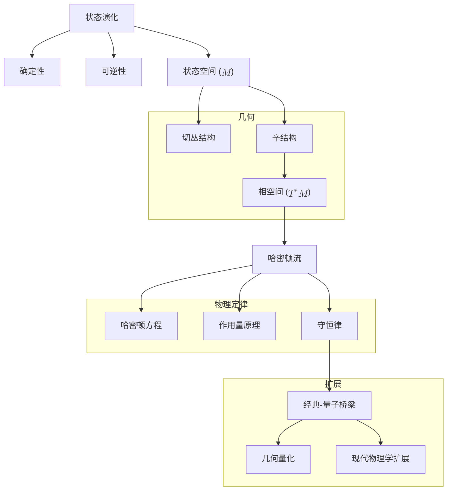

# 经典力学的几何本质：从第一性原理重构
* * *

--- 所有运动不过是变化的几何显现。

# **I. 基础：状态演化的性质**  
**题词**：*"起初，只有变化。"*

## **I.A. 状态演化作为基本现实**  

经典力学始于一个普遍的观察：**事物会变化**。在其最根本的层面上，宇宙是一个演化状态的系统，其中每个状态都包含描述给定时刻物理系统的全部信息。经典力学的核心是研究这些状态如何根据一致且普遍的原则随时间演化。

### **I.A.1. 定义状态演化**  

状态演化是物理系统经历连续变化的过程。让我们定义这一演化的核心要求：

1. **确定性**：
   演化必须将一个时间的状态唯一映射到任意未来时间的单个状态。形式上，如果系统在时间 $t$ 的状态表示为 $s(t)$，则演化由映射决定：
   $$
   \phi_t: \mathcal{M} \to \mathcal{M}, \quad s(t) \mapsto s(t + \Delta t),
   $$
   其中 $\mathcal{M}$ 是**状态空间**，即系统所有可能状态的集合。确定性确保系统轨迹 $\gamma(t) \subset \mathcal{M}$，描述其演化，是明确定义且唯一的。

2. **可逆性**：
   演化必须保持信息，允许从当前恢复过去的状态。可逆性意味着存在逆映射：
   $$
   \phi_{-t} = \phi_t^{-1}, \quad \phi_{-t}(\phi_t(s)) = s.
   $$
   这确保演化的时对称性：没有任何状态丢失，也没有新状态被创造。

### **I.A.2. 状态空间作为演化的竞技场**  

为了严格描述状态演化，我们引入**状态空间** $\mathcal{M}$ 的概念，这是一个代表物理系统所有可能配置的数学结构。$\mathcal{M}$ 的性质由演化的条件决定：

1. **光滑流形**：
   $\mathcal{M}$ 必须是一个光滑的 $n$ 维流形，以允许连续和可微的演化。光滑性确保状态的小变化会导致其轨迹的小变化，反映物理过程的连续性。

2. **维数**：
   $\mathcal{M}$ 的维数对应于系统的自由度。例如：
   - 三维空间中的单个粒子具有 $n = 3$ 个自由度，因此 $\mathcal{M} \cong \mathbb{R}^3$。
   - 在平面上受约束运动的摆具有 $n = 1$，因此 $\mathcal{M} \cong S^1$，即圆。

3. **状态空间中的轨迹**：
   系统的演化表示为 $\mathcal{M}$ 中的一条光滑曲线 $\gamma(t)$，由时间 $t$ 参数化。轨迹上的每一点对应于系统在某一时刻的状态。

### **I.A.3. 一致演化的条件**  

确定性和可逆性的原则对 $\mathcal{M}$ 施加额外的数学和物理约束：

1. **流的存在**：
   状态的演化可以用 $\mathcal{M}$ 上的一个光滑向量场 $X$ 来描述。向量场为 $\mathcal{M}$ 中的每个点赋予一个变化方向，其积分曲线表示系统的轨迹：
   $$
   \frac{d\gamma(t)}{dt} = X(\gamma(t)),
   $$
   其中 $\gamma(t)$ 是轨迹，$X$ 是生成流 $\phi_t$ 的生成元。

2. **信息的保持**：
   演化通过映射状态必须保持 $\mathcal{M}$ 的结构。这一要求确保在演化过程中不丢失或创建任何信息，直接导致几何结构的出现，如下一节所述。

## **I.B. 几何的涌现**  

一致状态演化的条件 —— 确定性、可逆性和信息保持 —— 迫使 $\mathcal{M}$ 上特定几何结构的涌现。这些结构构成经典力学的基础。

### **I.B.1. 切结构：运动需要方向**  

1. **切空间**：
   在每个点 $x \in \mathcal{M}$ 处，切空间 $T_x\mathcal{M}$ 表示系统在 $x$ 处可以经历的所有可能变化方向(速度)。切向量 $v \in T_x\mathcal{M}$ 是系统状态的变化率。

2. **向量场**：
   系统的演化由 $\mathcal{M}$ 上的一个光滑向量场 $X$ 控制，它为 $\mathcal{M}$ 中的每个点赋予一个切向量：
   $$
   X: \mathcal{M} \to T\mathcal{M}, \quad X(x) \in T_x\mathcal{M}.
   $$
   $X$ 的积分曲线描述系统的轨迹。

3. **几何解释**：
   切结构编码运动的局部几何，提供描述连续演化的基础。

### **I.B.2. 辛结构：可逆性和信息保持**  

可逆性的原则和保持信息的要求施加额外的约束，导致 $\mathcal{M}$ 上**辛结构**的涌现。

1. **相空间和余切丛**：
   为了完整描述系统的状态，我们必须包括其位置和动量(或共轭变量)。这自然引出**相空间** $T^*\mathcal{M}$，即 $\mathcal{M}$ 的余切丛。
   - 相空间中的状态由一个配对 $(q^i, p_i)$ 表示，其中 $q^i$ 是广义坐标，$p_i$ 是其共轭动量。

2. **辛形式**：
   相空间中状态的演化由一个闭的、非退化的 $2$-形式 $\omega$ 控制：
   $$
   \omega = \sum_{i=1}^n dp_i \wedge dq^i.
   $$
   - **非退化性**：确保 $\omega$ 定义位置和动量方向之间的唯一配对。
   - **闭性** ($d\omega = 0$)：保证辛结构在演化过程中得以保持，确保可逆性。

3. **几何流**：
   辛结构确保相空间体积得以保持，反映轨迹的不可压缩性：
   $$
   \mathcal{L}_{X_H} \omega = 0,
   $$
   其中 $X_H$ 是哈密顿向量场。

### **I.B.3. 相空间：演化的自然竞技场**  

切结构和辛结构的相互作用自然引出**相空间**的概念：

1. **定义**：
   相空间 $T^*\mathcal{M}$ 是状态空间 $\mathcal{M}$ 的余切丛。它将位置和动量统一成一个单一的几何结构。

2. **正则坐标**：
   相空间配备正则坐标 $(q^i, p_i)$，其中 $q^i$ 是位置，$p_i$ 是动量。这些坐标提供一个自然的辛结构表示：
   $$
   \omega = \sum_{i=1}^n dp_i \wedge dq^i.
   $$

3. **作用**：
   相空间提供描述状态演化的自然场所。辛结构 $\omega$ 编码位置和动量之间的基本几何关系。

### **I.B.4. 哈密顿流：演化的生成器**  

辛结构要求状态演化由**哈密顿函数** $H: T^*\mathcal{M} \to \mathbb{R}$ 控制，该函数生成系统的流：

1. **哈密顿向量场**：
   演化由满足以下条件的哈密顿向量场 $X_H$ 决定：
   $$
   \iota_{X_H}\omega = dH,
   $$
   其中 $\iota_{X_H}$ 表示 $X_H$ 与辛形式 $\omega$ 的内积。

2. **运动方程**：
   在正则坐标下，运动方程为：
   $$
   \dot{q}^i = \frac{\partial H}{\partial p_i}, \quad \dot{p}_i = -\frac{\partial H}{\partial q^i}.
   $$
   这些是**哈密顿方程**，描述系统在相空间中的演化。

## **I.C. 结论**  

状态演化，受限于确定性、可逆性和信息保持，必然导致切结构和辛结构的涌现。这些结构共同定义了相空间作为描述物理系统的自然场所。哈密顿函数作为演化的生成器，完成了这一几何框架，建立了经典力学的基础。

在下一节中，我们将把这些结构形式化为一个全面的**几何框架**，展示经典力学的定律如何作为这一统一基础的自然结果而涌现。

# **II. 力学的几何框架**  
**题词**：*"空间弯曲以适应运动。"*

## **II.A. 自然几何结构**  

经典力学本质上是一个由几何控制的状态演化理论。确定性、可逆性和信息保持的要求迫使特定几何结构的涌现。这些结构 —— 辛形式、相空间和泊松括号 —— 是力学的数学支柱，提供了一个描述运动及其控制定律的统一框架。

### **II.A.1. 辛形式：相空间的基础**

几何框架的核心在于**辛形式** $\omega$，一个闭的、非退化的 $2$-形式，它编码相空间的结构。

1. **定义与性质**：
   辛形式 $\omega$ 满足以下基本性质：
   - **非退化性**：对于任意非零切向量 $v \in T_x(T^*\mathcal{M})$，存在一个 $w \in T_x(T^*\mathcal{M})$ 使得 $\omega(v, w) \neq 0$。这确保辛结构完全捕捉相空间中的几何关系。
   - **闭性**：
     $$
     d\omega = 0,
     $$
    表示 $\omega$ 在光滑变形下不变。这一性质保证辛结构在演化过程中得以保持，确保一致性和可逆性。

2. **正则形式**：
   Darboux 定理确保局部上辛形式可以总是写成正则形式：
   $$
   \omega = \sum_{i=1}^n dp_i \wedge dq^i,
   $$
   其中 $q^i$ 是广义坐标，$p_i$ 是其共轭动量。这一结果突显辛结构的普遍性，并为相空间提供一个自然的坐标系。

3. **物理解释**：
   - 辛形式 $\omega$ 测量相空间中轨迹扫过的“面积”。
   - 它编码位置 $q^i$ 和动量 $p_i$ 之间的基本耦合，确保它们的演化在几何上是一致的。

### **II.A.2. 相空间：状态演化的竞技场**

辛结构定义**相空间**，这是经典力学展开的自然舞台。

1. **定义**：
   相空间是余切丛 $T^*\mathcal{M}$，其中 $\mathcal{M}$ 是系统的构型空间。相空间中的一点由一个配对 $(q^i, p_i)$ 表示，其中 $q^i$ 是广义位置，$p_i$ 是其共轭动量。

2. **维数**：
   如果构型空间 $\mathcal{M}$ 有 $n$ 维(对应于 $n$ 个自由度)，则相空间 $T^*\mathcal{M}$ 有 $2n$ 维。这种加倍反映了位置和动量的包含。

3. **正则坐标**：
   坐标 $(q^i, p_i)$ 提供相空间的自然表示。在这些坐标下，辛形式 $\omega$ 取正则形式：
   $$
   \omega = \sum_{i=1}^n dp_i \wedge dq^i.
   $$

4. **相空间的作用**：
   相空间提供系统状态的完整描述，将位置和动量统一成一个单一的几何结构。辛形式 $\omega$ 控制这些变量之间的关系，确保它们演化的连贯性。

### **II.A.3. 泊松括号：可观测量的代数**

辛结构直接引出**泊松括号**的概念，它编码相空间中可观测量之间的代数关系。

1. **定义**：
   对于定义在相空间上的两个可观测量 $f, g$，它们的泊松括号由下式给出：
   $$
   \{f, g\} = \sum_{i=1}^n \left( \frac{\partial f}{\partial q^i} \frac{\partial g}{\partial p_i} - \frac{\partial f}{\partial p_i} \frac{\partial g}{\partial q^i} \right).
   $$

2. **关键性质**：
   - **反对称性**：
     $$
     \{f, g\} = -\{g, f\}.
     $$
   - **Leibniz 规则**：
     $$
     \{f, gh\} = \{f, g\}h + g\{f, h\}.
     $$
   - **Jacobi 恒等式**：
     $$
     \{\{f, g\}, h\} + \{\{g, h\}, f\} + \{\{h, f\}, g\} = 0.
     $$

3. **物理解释**：
   - 泊松括号描述一个可观测量相对于另一个可观测量在系统动力学下的变化。
   - 可观测量 $f$ 的时间演化由下式给出：
     $$
     \frac{df}{dt} = \{f, H\},
     $$
     其中 $H$ 是哈密顿函数。

4. **与辛几何的联系**：
   泊松括号直接从辛形式 $\omega$ 源起，反映了相空间的基本几何结构。

### **II.A.4. 守恒律与对称性**

辛结构自然地包含了对称性和守恒律的原则，正如 Noether 定理所形式化的那样。

1. **对称性与守恒律**：
   - 哈密顿函数 $H$ 的对称性对应于保持辛形式 $\omega$ 不变的变换。
   - 对于每一个连续对称性，存在一个守恒量。

2. **守恒量的例子**：
   - **能量守恒**：如果 $H$ 与时间无关，则总能量守恒。
   - **动量守恒**：如果 $H$ 在空间平移下不变，则线性动量守恒。
   - **角动量守恒**：如果 $H$ 在旋转下不变，则角动量守恒。

3. **刘维尔定理**：
   辛结构确保相空间体积在演化过程中得以保持：
   $$
   \mathcal{L}_{X_H} \omega^n = 0,
   $$
   其中 $\omega^n$ 是相空间体积形式，$\mathcal{L}_{X_H}$ 是沿着哈密顿向量场 $X_H$ 的 Lie 导数。这一性质反映相空间中轨迹的不可压缩性。

## **II.B. 物理定律作为几何必然性**

辛几何和相空间的几何结构自然引出经典力学的物理定律。这些定律不是外部强加的，而是作为框架的内在结果而涌现。

### **II.B.1. 哈密顿方程：演化的生成器**

系统的演化由哈密顿函数 $H$ 控制，该函数生成相空间中的流。

1. **哈密顿向量场**：
   动力学由满足以下条件的哈密顿向量场 $X_H$ 决定：
   $$
   \iota_{X_H}\omega = dH,
   $$
   其中 $\iota_{X_H}$ 表示 $X_H$ 与辛形式 $\omega$ 的内积。

2. **正则方程**：
   在正则坐标 $(q^i, p_i)$ 下，运动方程为：
   $$
   \dot{q}^i = \frac{\partial H}{\partial p_i}, \quad \dot{p}_i = -\frac{\partial H}{\partial q^i}.
   $$
   这些是哈密顿方程，描述位置 $q^i$ 和动量 $p_i$ 的时间演化。

3. **几何流**：
   辛结构确保由 $X_H$ 生成的流保持相空间结构，保证一致且可逆的演化。

### **II.B.2. 作用量原理：变分基础**

最小作用量原理提供了经典力学的另一种表述，根植于作用量泛函的变分性质。

1. **作用量泛函**：
   作用量 $S$ 由下式给出：
   $$
   S = \int L \, dt,
   $$
   其中 $L = T - V$ 是拉格朗日量(动能减去势能)。

2. **变分原理**：
   系统的真实轨迹使作用量 $S$ 极值化，导致哈密顿方程：
   $$
   \delta S = 0 \implies \iota_{X_H}\omega = dH.
   $$

3. **几何起源**：
   作用量原理自然地源于辛 $1$-形式 $\theta = \sum_i p_i \, dq^i$，突显其几何基础。

### **II.B.3. 对称性与守恒**

哈密顿框架中的对称性对应于保持辛形式 $\omega$ 不变的正则变换。

1. **正则变换**：
   变换 $(q, p) \to (Q, P)$ 是正则的，如果它们保持辛结构：
   $$
   \omega = \sum_i dP_i \wedge dQ^i = \sum_i dp_i \wedge dq^i.
   $$

2. **守恒量**：
   哈密顿函数的对称性生成守恒量，正如 Noether 定理所形式化的那样。

## **II.C. 结论**

建立在辛形式、相空间和泊松括号之上的经典力学的几何框架提供一个普遍且优雅的状态演化描述。从这个框架中，哈密顿方程、作用量原理和守恒律作为不可避免的结果涌现。这些结构构成了理解最简单系统及其更复杂扩展的基础。

在下一节中，我们将探讨具体物理系统如何作为这一几何框架的自然表现出现，展示其强大和普遍性。

# **III. 物理系统作为几何必然性**  
**题词**：*"从抽象的必然性中产生具体的实在。"*

经典力学的抽象几何框架 —— 以辛几何、相空间和守恒律为中心 —— 作为描述物理系统的通用基础。这些系统，从简单的粒子到复杂的多体相互作用和场，直接源自几何原理。本节弥合抽象几何与具体物理现象之间的差距，展示经典系统的多样性如何编码在力学的通用语言中。

## **III.A. 基本系统**  

基本系统代表最简单的物理模型，在这些模型中，哈密顿函数和辛结构直接控制运动。这些系统提供了轨迹和守恒律如何从几何框架中涌现的基础示例。

### **III.A.1. 自由粒子**  

自由粒子是最基本的系统，描述没有外力作用下的运动。

1. **哈密顿函数**：
   质量为 $m$ 的自由粒子的哈密顿函数由其动能给出：
   $$
   H(q, p) = \frac{p^2}{2m},
   $$
   其中 $q$ 表示位置，$p$ 表示动量。

2. **运动方程**：
   使用哈密顿方程：
   $$
   \dot{q} = \frac{\partial H}{\partial p} = \frac{p}{m}, \quad \dot{p} = -\frac{\partial H}{\partial q} = 0,
   $$
   粒子以恒定动量 $p = p_0$ 运动，其位置线性演化：
   $$
   q(t) = q_0 + \frac{p_0}{m}t.
   $$

3. **相空间轨迹**：
   在相空间中，轨迹是平行于 $q$-轴的直线，反映匀速运动。

4. **几何解释**：
   - 辛结构确保相空间体积的保持(刘维尔定理)。
   - 轨迹是相空间中的测地线，代表最简单的可能运动。

### **III.A.2. 谐振子**  

谐振子是一个具有与位移成正比的恢复力的系统，用于建模弹簧、摆和近平衡点的小振动。

1. **哈密顿函数**：
   谐振子的哈密顿函数为：
   $$
   H(q, p) = \frac{p^2}{2m} + \frac{kq^2}{2},
   $$
   其中 $k$ 是弹簧常数，$q$ 是位置，$p$ 是动量。

2. **运动方程**：
   使用哈密顿方程：
   $$
   \dot{q} = \frac{\partial H}{\partial p} = \frac{p}{m}, \quad \dot{p} = -\frac{\partial H}{\partial q} = -kq,
   $$
   其解为正弦波：
   $$
   q(t) = A\cos(\omega t + \phi), \quad p(t) = -m\omega A\sin(\omega t + \phi),
   $$
   其中 $\omega = \sqrt{\frac{k}{m}}$ 是固有频率，$A$ 是振幅，$\phi$ 是相位。

3. **相空间轨迹**：
   - 相空间中的轨迹是封闭的椭圆，反映周期性运动。
   - 每个椭圆对应一个常能面：
     $$
     E = \frac{p^2}{2m} + \frac{kq^2}{2}.
     $$

4. **几何解释**：
   - 辛结构确保每个椭圆所包围的面积不变。
   - 谐振子展示了能量守恒和周期性如何自然地从相空间的几何结构中涌现。

### **III.A.3. 中心力问题**  

中心力系统描述仅依赖于到固定中心距离的力作用下的运动，如引力或静电力。

1. **哈密顿函数**：
   质量为 $m$ 的粒子在中心势 $V(r)$ 中的哈密顿函数为：
   $$
   H(r, p_r, L) = \frac{p_r^2}{2m} + \frac{L^2}{2mr^2} + V(r),
   $$
   其中 $r$ 是径向距离，$p_r$ 是径向动量，$L = r^2\dot{\theta}$ 是守恒的角动量。

2. **开普勒问题**：
   对于逆平方势 $V(r) = -\frac{k}{r}$，描述引力或库仑相互作用：
   - 轨迹是圆锥曲线(椭圆、抛物线或双曲线)，由总能量和角动量决定。
   - 系统满足开普勒行星运动定律。

3. **几何解释**：
   - 旋转对称性导致角动量 $L$ 守恒。
   - 相空间轨迹被限制在由守恒能量和角动量定义的 4 维子流形上。

## **III.B. 复杂系统**  

基于基本系统的原理，复杂系统表现出更丰富的动力学，包括集体行为、波动现象和连续变形。这些系统自然地从相同的几何框架中涌现。

### **III.B.1. 多体系统**  

多体系统由 $N$ 个相互作用的粒子组成，复杂性源于它们之间的相互作用。

1. **相空间结构**：
   $N$ 个粒子的状态空间是个体相空间的笛卡尔积：
   $$
   \mathcal{M} = \prod_{i=1}^N \mathcal{M}_i, \quad T^*\mathcal{M} \cong \prod_{i=1}^N T^*\mathcal{M}_i.
   $$
   对于三维空间中的粒子，总相空间的维数为 $6N$。

2. **哈密顿函数**：
   总哈密顿函数包括动能和相互作用项：
   $$
   H = \sum_{i=1}^N \frac{p_i^2}{2m_i} + \sum_{i < j} V(r_{ij}),
   $$
   其中 $r_{ij} = |\mathbf{r}_i - \mathbf{r}_j|$ 是粒子之间的距离。

3. **涌现行为**：
   - 对称性约化简化分析(例如，质心坐标)。
   - 集体现象，如耦合振子的正常模式，自然涌现。

4. **几何解释**：
   - 总动量和角动量的守恒反映了系统的平移和旋转对称性。
   - 相空间轨迹揭示了某些区域中的涌现模式和混沌动力学。

### **III.B.2. 场系统**  

场系统描述时空上连续场的动力学，如电磁场或波动方程。

1. **构型空间**：
   状态空间是定义在空间域 $M$ 上的场配置 $\phi(x)$ 的空间，相空间由场 $\phi$ 和其共轭动量 $\pi(x)$ 定义。

2. **哈密顿函数**：
   哈密顿密度控制场动力学：
   $$
   H = \int_M \left[ \frac{\pi^2}{2} + \frac{1}{2} (\nabla \phi)^2 + V(\phi) \right] d^3x,
   $$
   其中 $V(\phi)$ 是势能密度。

3. **波动动力学**：
   - 场方程，如 Klein-Gordon 方程或 Maxwell 方程，自然地从哈密顿形式主义中涌现。
   - 解描述波动传播和动力学。

4. **几何解释**：
   - 辛结构扩展到无限维度，保持场配置的相空间体积。
   - 能量和动量等守恒律从哈密顿函数的对称性中产生。

### **III.B.3. 连续介质**  

连续系统，如流体和弹性固体，由具有无限自由度的可变形介质描述。

1. **构型空间**：
   状态空间是微分同胚 $\phi: M \to M$ 的空间，描述介质的变形。

2. **哈密顿动力学**：
   - 哈密顿函数包括动能和弹性或势能项。
   - 对于流体，Euler 方程自然地从哈密顿框架中产生。

3. **几何解释**：
   - 相空间是无限维的，辛结构控制流场的演化。
   - 旋度和能量的守恒反映了流体系统中的对称性。

## **III.C. 结论**  

从自由粒子和谐振子等基本系统到多体相互作用、场和连续介质等复杂系统，经典力学的几何框架提供了一个通用的基础。相同的原理 —— 辛几何、哈密顿流和守恒律 —— 支配所有这些系统，展示了经典力学的深刻统一性。

在下一节中，我们将探讨这个框架如何弥合通向现代物理学的差距，揭示其在量子力学和规范理论中的自然扩展。

# **IV. 深度统一**  
**题词**：*"一切皆几何，几何即一切。"*

经典力学的几何框架，建立在辛几何、相空间和守恒律之上，不仅描述了经典系统，还自然地成为量子力学和现代物理学的先驱。本节探讨经典力学的原理如何无缝延伸到量子力学和更广泛的物理理论中，揭示它们深刻的统一性。

## **IV.A. 经典-量子桥梁**

尽管量子力学似乎与经典力学截然不同，但它自然地作为经典框架的几何扩展而出现。通过对相空间的辛结构进行量化，我们揭示经典与量子对自然描述之间的深刻连续性。

### **IV.A.1. 几何量化**  

几何量化通过直接从相空间的辛几何构造量子系统，形式化了从经典到量子力学的过渡。

1. **相空间体积量化**：
   经典相空间由辛形式 $\omega$ 控制，它定义相空间区域的“体积”。量子力学引入一个基本的量化条件，离散化了相空间：
   $$
   \frac{1}{2\pi\hbar} \int_{\Sigma} \omega \in \mathbb{Z},
   $$
   其中 $\Sigma$ 是相空间中的二维曲面，$\hbar$ 是普朗克常数。这个条件确保辛结构与量子态的离散性质兼容，例如原子系统中的能量量子化。

2. **预量子线丛**：
   - 辛形式 $\omega$ 被解释为相空间上的复线丛 $L$ 的曲率。这个丛支持量子力学中的波函数作为其截面。
   - 丛上的连接，记为 $\nabla$，满足：
     $$
     \text{curv}(\nabla) = -\frac{i}{\hbar} \omega.
     $$

3. **波函数和辛一形式**：
   量子力学中的波函数作为预量子线丛的截面出现。辛一形式 $\theta = \sum_i p_i \, dq^i$ 确定波函数的相位。作用量 $S$ 作为波函数中的相因子出现：
   $$
   \psi \sim e^{\frac{i}{\hbar} S}.
   $$

### **IV.A.2. 量子算符和对易关系**  

在几何框架中，量子力学中的可观测量及其动力学自然地从经典的泊松括号结构中产生。

1. **从可观测量到算符**：
   经典可观测量 $f(q, p)$ 被提升为作用于波函数希尔伯特空间的量子算符 $\hat{f}$。算符 $\hat{f}$ 使用与 $f$ 相关的哈密顿向量场 $X_f$ 构造：
   $$
   \hat{f} = -i\hbar \nabla_{X_f} + f,
   $$
   其中 $\nabla_{X_f}$ 是沿 $X_f$ 生成的流的导数运算。

2. **对易关系**：
   量子对易子直接从经典泊松括号中涌现：
   $$
   [\hat{f}, \hat{g}] = i\hbar \widehat{\{f, g\}},
   $$
   其中 $\{f, g\}$ 是经典泊松括号：
   $$
   \{f, g\} = \sum_i \left( \frac{\partial f}{\partial q^i} \frac{\partial g}{\partial p_i} - \frac{\partial f}{\partial p_i} \frac{\partial g}{\partial q^i} \right).
   $$
   这种对应关系确保量子算子代数保留经典相空间的结构。

### **IV.A.3. 路径积分表述**  

路径积分表述通过作用量泛函 $S$ 表达量子动力学，弥合经典和量子力学之间的差距。

1. **费曼路径积分**：
   量子系统在两个状态之间跃迁的概率幅由所有可能路径 $q(t)$ 的总和给出，权重为相因子 $e^{\frac{i}{\hbar} S[q]}$：
   $$
   \mathcal{A} \sim \int e^{\frac{i}{\hbar} S[q]} \, \mathcal{D}[q].
   $$
   其中，$S[q]$ 是路径 $q(t)$ 的经典作用量。

2. **经典极限**：
   在 $\hbar \to 0$ 的极限下，路径积分的主要贡献来自使 $S[q]$ 极值化的路径，这恢复了经典最小作用量原理：
   $$
   \delta S = 0.
   $$

3. **几何解释**：
   路径积分表述揭示量子力学本质上是一个由相空间的辛结构控制的相理论。

## **IV.B. 现代物理学的扩展**

经典力学的几何框架自然地扩展到现代物理学，涵盖规范理论、量子场论和量子几何。这些扩展展示了辛几何的普遍性和其在理解物理宇宙中的核心作用。

### **IV.B.1. 规范理论和场动力学**  

描述自然界基本力的规范理论深深植根于辛几何。

1. **连接形式作为物理场**：
   - 在规范理论中，主丛上的连接形式 $A$ 表示物理场，如电磁势。
   - 曲率 $F = dA + A \wedge A$ 对应于场强，如电磁场张量 $F_{\mu\nu}$。

2. **场的哈密顿表述**：
   - 场的哈密顿描述(例如，Maxwell 方程、Yang-Mills 理论)自然地从场相空间的辛结构中产生。
   - 场的正则量化将泊松括号推广到无限维度，导致场算符的对易关系。

3. **几何解释**：
   - 规范场的对称性通过 Noether 定理生成守恒荷(例如，电荷、QCD 中的颜色荷)。
   - 辛结构确保规范不变性和场动力学之间的一致性。

### **IV.B.2. 量子几何与引力**  

在量子力学和广义相对论的交汇处是量子几何，其中时空本身成为一个受量化影响的几何实体。

1. **非交换几何**：
   - 经典相空间被非交换几何取代，其中时空坐标 $(x^\mu, p_\mu)$ 满足对易关系：
     $$
     [x^\mu, p_\nu] = i\hbar \delta^\mu_\nu.
     $$
   - 这个框架引入时空的量子结构，推广了经典几何。

2. **量子群**：
   - 辛对称群被形变为量子群，为量子时空对称性提供数学基础。

3. **时空的几何量化**：
   - 经典力学的辛结构启发了对时空本身的量化尝试，形成了量子引力理论的基础。

### **IV.B.3. 未来方向**  

几何框架为理论和实验探索开辟新的途径：

1. **量子引力**：
   - 辛几何为统一量子力学和广义相对论提供自然的基础。
   - 引力的相空间，由 Ashtekar 变量描述，将经典力学与圈量子引力联系起来。

2. **信息理论**：
   - 几何方法揭示辛结构与熵之间的深刻联系，将经典力学与黑洞热力学联系起来。

3. **涌现现象**：
   - 几何原则奠定了凝聚态物理中涌现现象的基础，如拓扑物质相和量子霍尔效应。

## **IV.C. 结论**  

经典力学、量子力学和现代物理学的深度统一在于它们共同依赖于辛几何和状态演化。几何框架不仅为理解经典系统提供了基础，还架起了通往量子和相对论理论的桥梁。通过揭示物理定律的深刻统一性，这一框架激发了探索宇宙奥秘的新方法。

在下一节中，我们将反思重构经典力学为几何框架的意义，并总结这种统一视角如何丰富我们对物理现实的理解。

# **V. 结论**  
**题词**：*"在理解几何中，我们理解宇宙。"*

## **V.1. 对经典力学几何重构的反思**

经典力学，通常被视为一组经验定律和历史公式的集合，当从基本原理重构时，揭示了其真实本质。通过将整个框架建立在普遍的概念**状态演化**之上，我们发现了运动、几何和物理定律之间的深刻统一。这种重构表明，经典力学不仅是一个解决实际问题的实用工具包，而是一个深刻几何理论，其中每一条定律都是一致演化的必然结果。

1. **状态演化作为核心原则**：
   这段旅程始于一个基础思想：**状态演化**。通过施加最小的要求 —— 确定性、可逆性和信息保持 —— 我们推导出了构成力学骨架的数学结构。这种方法表明，物理定律不是任意的，而是这些约束条件的必然结果。

2. **几何作为力学的语言**：
   几何结构的出现 —— 光滑流形、切丛、辛形式和相空间 —— 突显了几何不仅仅是数学工具，而是经典力学的本质。特别是辛结构，它控制所有运动方面，确保一致性、守恒和信息的保持。

3. **物理定律作为几何的必然**：
   像哈密顿方程、最小作用量原理和守恒律这样的定律不是外部强加的，而是自然地从辛框架中产生的。它们代表几何与演化物理约束之间的相互作用，揭示了宇宙的内在秩序。

## **V.2. 经典力学的统一**

这种重构将经典力学的不同分支 —— 牛顿力学、拉格朗日力学和哈密顿力学 —— 统一在一个单一的几何框架下。每个形式主义成为同一底层现实的不同视角：

1. **牛顿力学**：
   力和加速度的研究被重新解释为配置空间中的状态演化，强调了运动的确定性流动。

2. **拉格朗日力学**：
   最小作用量原理作为辛结构的变分结果出现，提供了一种强大的方法来分析具有约束和对称性的系统。

3. **哈密顿力学**：
   哈密顿形式主义提升了相空间的作用，其中位置和动量之间的相互作用由辛几何控制，提供了动力学的全局视角。

通过这种统一，我们将经典力学视为一个单一、连贯的理论，其中所有形式主义都是相同几何原则的相互关联表达。

## **V.3. 经典力学与量子力学的桥梁**

经典力学的几何重构也为量子力学提供一个无缝的桥梁。通过对相空间的辛结构进行量化，我们从经典系统的确定性轨迹过渡到量子力学的概率波函数。这种连续性揭示量子力学不是一个独立的理论，而是经典原则向离散态和不确定性领域的自然扩展。

1. **几何量化**：
   量化条件 $[\omega / 2\pi\hbar] \in H^2(M, \mathbb{Z})$ 展示了相空间的平滑几何如何引出量子系统的离散结构。可观测量成为算子，泊松括号转变为对易子，保留了经典力学的代数结构。

2. **路径积分表述**：
   作用量泛函 $S$ 作为经典和量子力学之间的纽带，费曼路径积分表述编码量子波函数的相位。在经典极限 ($\hbar \to 0$) 下，量子路径收敛到使 $S$ 极值化的经典轨迹。

这座桥梁强调几何框架的普遍性，它在统一结构下容纳了经典和量子世界。

## **V.4. 对现代物理学的影响**

从重构经典力学中获得的见解远远超出其传统范围，影响了现代物理学和理论探索：

1. **规范理论与对称性**：
   辛结构支撑规范理论，其中经典力学的守恒律推广到如电荷或色荷等守恒荷。连接和曲率的几何语言描述了基本力的动力学。

2. **量子几何与引力**：
   经典力学的原则启发了对时空本身的量化尝试，如在量子引力方法中所见。非交换几何和量子群将辛框架扩展到时空结构，统一广义相对论和量子力学。

3. **涌现现象**：
   几何原则解释了凝聚态物理中的涌现现象，如拓扑物质相和量子霍尔效应。这些系统揭示了全局几何和拓扑不变量如何支配物理行为。

4. **信息理论**：
   经典力学中的信息保持与现代熵研究、黑洞热力学和全息原理相呼应，暗示了几何与信息之间的深刻联系。

## **V.5. 未来方向和开放问题**

经典力学的几何重构开辟了新的探索途径，并提出了关于现实本质的深刻问题：

1. **几何是否是物理学的终极基础？**
   量子力学到宇宙学的所有物理定律能否从几何原理中推导出来？如果是这样，宇宙最根本的几何结构是什么？

2. **对称性在物理学中的作用**：
   对称性在经典力学、量子力学和规范理论中起着核心作用。更深层次的对称性，如高维空间或量子群的对称性，能否统一所有物理力？

3. **弥合经典与量子领域**：
   几何框架为经典和量子力学之间提供了自然的桥梁，但如何扩展以完全捕捉如量子纠缠或时空奇点等现象？

4. **新领域的应用**：
   经典力学的原则能否应用于新兴领域，如机器学习、复杂系统或生物动力学，其中几何和演化也起着关键作用？

## **V.6. 最后的反思**

对经典力学的探索揭示了其本质不在于力或方程，而在于变化和运动的几何。通过从头重构这一理论，我们发现其多样现象背后的深刻统一和简单性。几何作为自然的语言，以其优雅的结构编码运动、对称和守恒的法则。

**在理解几何中，我们理解宇宙。** 经典力学作为演化的几何，提供一个窥视现实基本秩序的窗口。其原则激励我们深入思考，质疑假设，并寻求支配宇宙的统一模式。

让这次重构不仅仅是一个终点，而是一个邀请 —— 重新审视、重新思考并重新想象我们理解物理世界的方式。因为随着几何低语其真理，我们被召唤去倾听、解读和探索。

这标志着作为几何框架的经典力学重构的结束。通过这个视角，我们不仅看到了运动的力学，还看到了数学、物理和现实本身之间的深刻互动。

# **附录 A : 经典力学几何框架中的概念关系**

为了提供一个清晰和简洁的理解文档中呈现的核心思想，本附录将关键概念及其相互联系组织成图示和**关系表**。这些工具以视觉和逻辑的方式展示了经典力学的基础概念 —— 状态演化、几何和物理定律 —— 如何在单一框架下统一。

## **A.I. 概念关系图**

以下是捕捉文档中描述的概念的层次和关系结构的流程图：

## **A.II. 核心概念关系表**

下表总结文档核心概念之间的关系、它们的功能以及它们如何连接到经典力学的更大框架：

| **概念**            | **定义/角色**                                                                                      | **相关概念**                                                                                       |
|-------------------------|---------------------------------------------------------------------------------------------------------|-----------------------------------------------------------------------------------------------------------|
| **状态演化**     | 描述物理系统随时间变化的普遍原则。                              | 确定性, 可逆性, 状态空间 ($\mathcal{M}$)                                               |
| **确定性**         | 每个状态唯一决定其未来的轨迹。                                                  | 状态演化, 状态空间 ($\mathcal{M}$)                                                          |
| **可逆性**       | 演化必须保持信息并允许反向映射。                                        | 状态演化, 辛结构                                                                    |
| **状态空间** ($\mathcal{M}$) | 系统所有可能状态的集合，表示为光滑流形。                              | 切丛结构, 辛结构                                                                  |
| **切丛结构**   | 编码 $\mathcal{M}$ 每一点的运动方向(速度)。                       | 状态空间 ($\mathcal{M}$), 相空间 ($T^*\mathcal{M}$)                                       |
| **辛结构**| 相空间上的闭合、非退化的2-形式 ($\omega$)，它控制位置和动量之间的相互作用。 | 状态空间 ($\mathcal{M}$), 相空间 ($T^*\mathcal{M}$), 哈密顿流                     |
| **相空间** ($T^*\mathcal{M}$) | $\mathcal{M}$ 的余切丛，将位置和动量结合成一个统一的几何结构。 | 切丛结构, 辛结构, 哈密顿流                                                |
| **哈密顿流**    | 由哈密顿函数 $H$ 生成的相空间中状态的演化。                 | 辛结构, 哈密顿方程                                                               |
| **哈密顿方程**| 控制相空间中位置 $q^i$ 和动量 $p_i$ 的时间演化。                | 哈密顿流, 守恒律                                                                      |
| **作用量原理**    | 使作用量泛函 $S$ 极值化的变分原理，用于推导运动方程。 | 哈密顿流, 守恒律                                                                      |
| **守恒律**   | 由于哈密顿系统中的对称性而保持不变的物理量。                             | 哈密顿方程, Noether 定理                                                                  |
| **经典-量子桥梁** | 通过相空间的几何量化建立的经典和量子力学之间的联系。            | 守恒律, 几何量化                                                                |
| **几何量化** | 辛结构的量化，导致量子算符和对易子。                          | 泊松括号, 量子算符                                                                      |
| **现代物理学扩展** | 几何框架在规范理论、量子场论和量子引力中的应用。             | 经典-量子桥梁, 守恒律                                                              |

## **A.III. 关系中的关键观察**

1. **状态演化作为根本概念**：
   经典力学中的所有其他结构 —— 状态空间、切丛和辛结构、相空间和物理定律 —— 都是**状态演化**这一基本原理的结果。

2. **几何作为统一框架**：
   切丛和辛结构定义相空间的几何，这反过来又支配物理系统的动力学。几何提供表达物理定律(如哈密顿方程和守恒律)的语言。

3. **物理定律作为涌现性质**：
   包括作用量原理和守恒律在内的物理定律不是外部强加的，而是自然地从相空间和辛结构的几何约束中产生的。

4. **向量子力学和现代物理学的扩展**：
   支撑经典力学的相同几何原理无缝地延伸到量子力学(通过几何量化)和现代物理理论(例如，规范理论和量子引力)。这种连续性突显框架的普遍性。

## **A.IV. 最后说明**

本附录作为文档的概念地图，展示了状态演化、几何和物理定律的思想如何相互关联形成一个统一的框架。通过组织这些关系，我们强调了经典力学几何重构的优雅和深度，使其深远的影响更易于读者理解。

