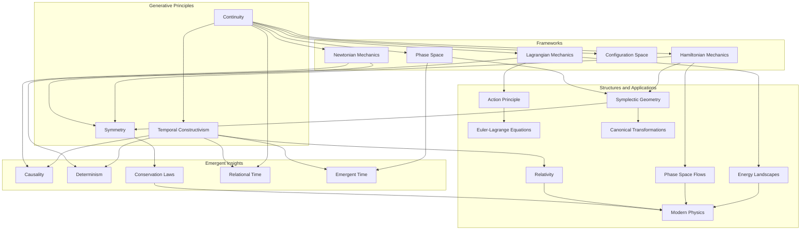

# Reconstructing Classical Mechanics: A Radical Vision Grounded in Core Principles
* * *

--- Nature speaks in the language of structure and motion; our task is to listen, abstract, and reconstruct.

# **1. Introduction: The Need for Reconstruction**

*"The foundations of mechanics are not found in equations but in the principles that shape them."*

Classical Mechanics, often heralded as the cornerstone of physical science, is a towering edifice born of centuries of intellectual labor. From the sweeping insights of Newton’s laws to the refined elegance of Lagrangian and Hamiltonian mechanics, it has provided humanity with a robust framework for understanding motion, forces, and energy. Yet, despite its monumental success, Classical Mechanics is not the seamless, monolithic structure it is often portrayed to be. Instead, it is a patchwork tapestry, woven from historical developments, evolving intuitions, and mathematical formalisms. To truly understand its essence, we must confront its layered complexity, question its assumptions, and, ultimately, reimagine its foundations.

## **1.1. The Historical Layers of Classical Mechanics**

Classical Mechanics is not a single, unified language but an amalgamation of overlapping dialects. Newtonian mechanics, with its direct appeal to forces and accelerations, speaks in the language of cause and effect. It offers an intuitive and pragmatic approach to motion, grounded in the tangible experiences of the physical world. Yet, as the quest for deeper understanding progressed, this language evolved.

The 18th and 19th centuries saw the emergence of Analytical Mechanics, a more abstract and refined dialect. Lagrangian mechanics shifted focus from forces to energy, introducing the principle of least action—a profound insight that bridged mechanics with broader physical theories. Hamiltonian mechanics, in turn, revealed the symplectic structure of phase space, unveiling hidden symmetries and invariances that govern the evolution of systems. Each of these formulations brought new perspectives and tools, but they also introduced fragmentation. What unites these frameworks? What deeper truths do they all express? These are the questions that remain unresolved within the traditional narrative.

## **1.2. The Challenges of Reconciliation**

Despite its success, Classical Mechanics faces challenges that demand a deeper reckoning. First, its multiple formulations—Newtonian, Lagrangian, Hamiltonian—often seem disconnected, each requiring its own assumptions and mathematical machinery. Why do such disparate approaches all describe the same physical phenomena? Is there a unifying principle that underpins them all, or are they merely artifacts of human invention?

Second, the mathematical structures of Classical Mechanics, while powerful, often obscure its conceptual heart. Configuration spaces, phase spaces, symplectic manifolds—all these constructs serve to formalize mechanics, but they can feel disconnected from the intuitive truths they are meant to represent. Are these structures intrinsic to nature, or are they intellectual scaffolds we impose upon it? This tension between the formal and the intuitive remains unresolved.

Finally, Classical Mechanics, while deterministic and elegant, often struggles to articulate the role of time and causality at its core. Time, in traditional formulations, is treated as a passive parameter, a silent backdrop against which motion unfolds. But is this truly sufficient? What if time itself is an active participant in the evolution of systems, a construct that emerges alongside motion and causality?

## **1.3. The Opportunity for Reconstruction**

To address these challenges, we propose a radical rethinking of Classical Mechanics—one that strips it down to its conceptual essence and rebuilds it from first principles. This reconstruction does not seek to discard the vast knowledge and insights of the past but rather to reorganize them around a minimal set of generative principles. By identifying the seeds from which the entire edifice of mechanics can emerge, we aim to reveal its true nature as a coherent, self-consistent framework.

The opportunity here is profound. By reconstructing Classical Mechanics, we can achieve several goals:
1. **Unification**: Identify the deep principles that unify Newtonian, Lagrangian, and Hamiltonian mechanics, revealing their shared conceptual foundation.
2. **Clarity**: Simplify the language and structures of mechanics, making its core ideas more accessible and intuitive without sacrificing rigor.
3. **Generativity**: Provide a framework that not only explains existing phenomena but also inspires new ways of thinking about motion, energy, and causality.
4. **Insight**: Illuminate the connections between Classical Mechanics and other domains of physics, from quantum mechanics to general relativity, opening pathways to new discoveries.

This document is not merely an academic exercise. It is an invitation to rethink, to question, and to imagine. By embracing the intrinsic simplicity and elegance of nature, we can reconstruct Classical Mechanics as a living, breathing framework—one that evolves alongside our understanding of the universe.

## **1.4. Framing the Journey Ahead**

In the chapters that follow, we will embark on this reconstruction, starting from the foundational principles of continuity, extremality, duality, symmetry, and temporal constructivism. These principles are not axioms in the traditional sense but generative ideas—conceptual seeds that grow into the vast landscape of Classical Mechanics. We will build outward from these principles, layer by layer, exploring how they give rise to the equations, structures, and interpretations that define the field.

This process will be both analytical and philosophical, blending the precision of mathematics with the intuition of physical reasoning. Along the way, we will challenge assumptions, confront paradoxes, and seek deeper insights. Our goal is not merely to understand Classical Mechanics but to reimagine it, revealing its essence as a dynamic, self-emergent system.

Classical Mechanics is more than a collection of equations and laws. It is a profound expression of nature’s structure and motion—a dialogue between the physical world and the human mind. To reconstruct it is to rediscover its soul.

Let us begin.

# **2. The Core Generative Principles**

*"From minimal principles arise infinite worlds of motion and structure."*

Classical Mechanics, when distilled to its essence, reveals itself not as a collection of disparate rules and equations but as the manifestation of a few profound, generative principles. These principles are not rigid axioms imposed upon the universe but reflections of nature’s intrinsic tendencies, encoded in the continuous evolution of systems. They serve as the seeds from which the vast architecture of Classical Mechanics emerges, layer by layer, connecting motion, energy, and causality into a coherent and elegant whole. In this section, we examine these generative principles—continuity, extremality, duality, symmetry, and temporal constructivism—and explore how they form the foundation of the mechanical framework. 

## **2.1 Principle of Continuity**

Nature unfolds with a smooth coherence, an unbroken flow that resists abrupt jumps or discontinuities. The **Principle of Continuity** asserts that the evolution of physical systems is inherently continuous, governed by differentiable trajectories in both configuration and phase spaces. This principle reflects the deep consistency of nature, where causality and motion emerge seamlessly from preceding states.

Mathematically, continuity manifests in the differentiability of functions describing motion. Let a system’s configuration at time $t$ be represented by a set of generalized coordinates $q_i(t)$. The principle of continuity ensures that $q_i(t)$ and their velocities $\dot{q}_i(t)$ are smooth functions of time:
$$
q_i(t) \in C^\infty \quad \text{and} \quad \dot{q}_i(t) = \frac{dq_i(t)}{dt}.
$$
This foundational idea enables the formulation of dynamical equations, ensuring that all physical laws respect the seamless evolution of systems. Discontinuities, when they arise (e.g., in collisions or phase transitions), require rethinking the scales and limits of description, often pointing to deeper layers of physical reality beyond Classical Mechanics.

Continuity is not merely a mathematical convenience; it reflects the very fabric of causality. Without it, the predictive power of mechanics would collapse, as systems would become unpredictable, disconnected from their prior states.

## **2.2 Principle of Extremality**

In nature, processes seem to unfold along paths that optimize or extremize certain quantities. The **Principle of Extremality** encapsulates this tendency, asserting that the dynamics of systems arise through the minimization or maximization of specific functionals. This principle is most famously embodied in the **Principle of Least Action**, which states that the trajectory of a system between two states is the one for which the action $S$ is extremized:
$$
S = \int_{t_1}^{t_2} L(q_i, \dot{q}_i, t) \, dt,
$$
where $L(q_i, \dot{q}_i, t)$ is the Lagrangian, representing the difference between kinetic and potential energies:
$$
L = T - V.
$$
The variational condition $\delta S = 0$ leads to the Euler-Lagrange equations:
$$
\frac{d}{dt} \left( \frac{\partial L}{\partial \dot{q}_i} \right) - \frac{\partial L}{\partial q_i} = 0,
$$
which govern the motion of the system. This principle reveals a profound economy in nature: rather than prescribing motion through forces alone, it suggests that the universe operates by optimizing certain holistic quantities. 

Extremality transcends mechanics, playing a unifying role across physics. In optics, light follows paths of stationary optical length (Fermat’s principle). In relativity, geodesics extremize spacetime intervals. This universal tendency toward extremality is a guiding thread through the tapestry of physical law.

## **2.3 Duality of Description**

Classical Mechanics is characterized by a profound duality in how it describes the state of systems. On one hand, we have **Configuration Space**, which represents the geometric arrangement of a system in terms of positions $q_i$. On the other hand, we have **Phase Space**, which incorporates both positions $q_i$ and momenta $p_i$, providing a more complete description of a system’s state.

The **Duality of Description** reflects the complementary perspectives offered by these spaces. Configuration space emphasizes constraints and potential energy landscapes, while phase space captures the flow of energy and motion. The transition between these spaces is mediated by the Legendre transform, which connects the Lagrangian $L$ and Hamiltonian $H$:
$$
H(q_i, p_i, t) = \sum_i p_i \dot{q}_i - L(q_i, \dot{q}_i, t),
$$
where $p_i = \frac{\partial L}{\partial \dot{q}_i}$ are the conjugate momenta.

In phase space, the evolution of systems is governed by Hamilton’s equations:
$$
\dot{q}_i = \frac{\partial H}{\partial p_i}, \quad \dot{p}_i = -\frac{\partial H}{\partial q_i}.
$$
This duality is not merely a mathematical artifact but a reflection of the deep interplay between geometry and energy. It reveals that motion is as much about the structure of space as it is about the flow of momentum, unifying these perspectives into a holistic understanding of dynamics.

## **2.4 Emergent Symmetry**

Symmetry is the hidden architect of the physical world, constraining and shaping the laws of motion. The **Principle of Emergent Symmetry** asserts that symmetries are not merely aesthetic features of equations but fundamental to the structure of mechanics. They lead directly to conservation laws, as captured by Noether’s theorem.

For every continuous symmetry of the action $S$, there exists a conserved quantity. For example:
- Translational symmetry in time $t$ leads to conservation of energy.
- Translational symmetry in space $q_i$ leads to conservation of linear momentum.
- Rotational symmetry leads to conservation of angular momentum.

Mathematically, these symmetries correspond to invariances of the Lagrangian $L$. If $L$ is invariant under a transformation $q_i \to q_i^\prime$, then a conserved quantity $Q$ exists:
$$
\frac{dQ}{dt} = 0.
$$
Symmetry is more than a constraint—it is a generative principle, revealing the deep unity and simplicity underlying the apparent complexity of physical systems. It provides a bridge between physical intuition and mathematical formalism, guiding the construction and interpretation of mechanical laws.

## **2.5 Temporal Constructivism**

Time, traditionally treated as an independent parameter, is reimagined in the **Principle of Temporal Constructivism** as an active, generative process. In this view, the evolution of systems is not merely a progression along a preexisting timeline but an act of construction, where motion and causality are realized dynamically.

This principle challenges the static interpretation of time in Newtonian mechanics, where $t$ serves as a passive backdrop. Instead, it aligns with the intuition that time is woven into the fabric of motion, emerging alongside the unfolding of systems. For instance, the Hamiltonian formalism treats time symmetrically with other variables, suggesting that its role is not fundamentally different from spatial coordinates.

Temporal constructivism aligns Classical Mechanics with modern perspectives, such as the relational view of time in General Relativity and the dynamic interpretation of quantum processes. It invites us to rethink causality not as a preordained sequence but as a co-emergent property of physical interactions.

## **2.6 Conclusion**

The core generative principles—continuity, extremality, duality, symmetry, and temporal constructivism—are the seeds from which the vast landscape of Classical Mechanics grows. They are not independent but interwoven, each principle enriching and reinforcing the others. Together, they provide a minimal yet profound foundation for reimagining mechanics as a coherent, self-emergent framework. In the next section, we will see how these principles give rise to the equations and frameworks of motion, illuminating the inner structure of dynamics.

# **3. Building the Inner System: Dynamics and Motion**

*"Dynamics is the poetry of motion, written in the language of principles."*

The core principles of continuity, extremality, duality, symmetry, and temporal constructivism provide the foundation upon which the vast architecture of Classical Mechanics can be constructed. In this section, we will use these principles to derive the frameworks of dynamics and motion—including Newtonian mechanics, Lagrangian mechanics, and Hamiltonian mechanics—and demonstrate their coherence and interdependence. These frameworks are not disjoint formulations; rather, they are interconnected perspectives on the same underlying truths, each revealing distinct facets of the system’s behavior. Together, they form the inner system of Classical Mechanics: the equations and structures that govern the evolution of motion.

## **3.1 Newtonian Foundations**

Newtonian mechanics represents the most intuitive and direct formulation of motion, grounded in the interplay of force, inertia, and acceleration. It is encapsulated in Newton’s three laws, which form the backbone of this framework:

1. A body remains in its state of rest or uniform motion unless acted upon by an external force.  
2. The acceleration $\vec{a}$ of a body is proportional to the net force $\vec{F}$ acting on it and inversely proportional to its mass $m$:  
   $$
   \vec{F} = m \vec{a}.
   $$
3. For every action, there is an equal and opposite reaction.

### **3.1.1 Force and Inertia: The Language of Interaction**
Newtonian mechanics articulates motion as the response of a system to external influences. The equation $\vec{F} = m \vec{a}$ encapsulates this interaction, linking the geometry of motion (acceleration $\vec{a}$) to the cause of motion (force $\vec{F}$) through the measure of inertia (mass $m$).

This framework operates in **configuration space**, where the state of a system is described by its position $\vec{q}$ as a function of time $t$. The second-order differential equation of motion, derived from $\vec{F} = m \vec{a}$, governs the trajectory $\vec{q}(t)$:
$$
m \frac{d^2 \vec{q}}{dt^2} = \vec{F}.
$$

### **3.1.2 Limitations and Bridges to Higher Frameworks**
Although Newtonian mechanics is intuitive and practical, it focuses on forces and accelerations, leaving deeper principles, such as energy and symmetry, implicit. To uncover these hidden layers, we must transition to more abstract formulations: Lagrangian and Hamiltonian mechanics.

## **3.2 Lagrangian Mechanics**

Lagrangian mechanics reframes motion in terms of energy and the optimization of action, moving beyond the localized concept of force. It is based on the **Principle of Least Action**, which asserts that the trajectory of a system between two states is the one that extremizes the action $S$:
$$
S = \int_{t_1}^{t_2} L(q_i, \dot{q}_i, t) \, dt,
$$
where $L(q_i, \dot{q}_i, t)$ is the **Lagrangian**, defined as:
$$
L = T - V.
$$
Here, $T$ is the kinetic energy and $V$ is the potential energy of the system.

### **3.2.1 The Euler-Lagrange Equations**
By applying the calculus of variations to the action $S$, we derive the **Euler-Lagrange equations**, which govern the motion of the system:
$$
\frac{d}{dt} \left( \frac{\partial L}{\partial \dot{q}_i} \right) - \frac{\partial L}{\partial q_i} = 0.
$$
These equations generalize Newton’s second law, embedding it within a broader framework that emphasizes energy and the geometry of motion.

### **3.2.2 Configuration Space and Constraints**
Lagrangian mechanics operates naturally in **configuration space**, where the generalized coordinates $q_i$ encapsulate the system’s degrees of freedom. Constraints, such as holonomic or non-holonomic, can be seamlessly incorporated into the Lagrangian framework, making it particularly powerful for complex systems.

### **3.2.3 From Forces to Energy Landscapes**
Unlike Newtonian mechanics, which focuses on forces, Lagrangian mechanics shifts the perspective to energy. The dynamics are understood as the system navigating an energy landscape, where the interplay of kinetic and potential energy defines the trajectory.

## **3.3 Hamiltonian Mechanics**

Hamiltonian mechanics represents yet another leap in abstraction, reframing motion in terms of the flow of energy and the structure of phase space. It is based on the **Hamiltonian function** $H$, which represents the total energy of the system:
$$
H(q_i, p_i, t) = T + V,
$$
where $p_i = \frac{\partial L}{\partial \dot{q}_i}$ are the conjugate momenta.

### **3.3.1 Hamilton’s Equations**
The dynamics of the system are governed by **Hamilton’s equations**:
$$
\dot{q}_i = \frac{\partial H}{\partial p_i}, \quad \dot{p}_i = -\frac{\partial H}{\partial q_i}.
$$
These equations describe the evolution of the system in **phase space**, where the state is characterized by both positions $q_i$ and momenta $p_i$.

### **3.3.2 Symplectic Structure and Flow**
Hamiltonian mechanics reveals the **symplectic structure** of phase space, where the flow of the system is governed by conserved quantities and invariances. The symplectic form $\omega$ ensures that phase space trajectories preserve volume, reflecting the conservation of information:
$$
\omega = \sum_i dq_i \wedge dp_i.
$$

### **3.3.3 Energy as the Central Actor**
In Hamiltonian mechanics, energy takes center stage, dictating the evolution of the system through the Hamiltonian function. This perspective emphasizes the interconnectedness of motion and energy, providing a deeper understanding of the system’s dynamics.

## **3.4 The Interplay of Representations**

Newtonian, Lagrangian, and Hamiltonian mechanics are not competing frameworks but complementary representations of the same underlying principles. Each provides a unique lens through which to understand motion:

1. **Newtonian Mechanics**: The language of forces and accelerations, offering an intuitive and localized perspective on motion.
2. **Lagrangian Mechanics**: The language of energy and action, emphasizing the global optimization of trajectories.
3. **Hamiltonian Mechanics**: The language of phase space and energy flow, revealing the deep structure and symmetries of dynamics.

These representations are connected through mathematical transformations:
- The **Legendre transform** bridges the Lagrangian and Hamiltonian formulations.
- The Euler-Lagrange equations generalize Newton’s laws within the Lagrangian framework.

### **3.4.1 Unified by Generative Principles**
What unites these frameworks is their shared foundation in the core generative principles:
- **Continuity** ensures smooth trajectories in configuration and phase spaces.
- **Extremality** governs the optimization of action and energy.
- **Duality** connects configuration space to phase space.
- **Symmetry** constrains and organizes motion through conservation laws.
- **Temporal Constructivism** emphasizes the dynamic realization of motion over time.

Together, these frameworks form a cohesive inner system, each illuminating a distinct yet harmonious aspect of Classical Mechanics.

## **3.5 Conclusion**

The inner system of Classical Mechanics, constructed from Newtonian, Lagrangian, and Hamiltonian mechanics, reflects the richness and coherence of its foundational principles. These frameworks are not isolated silos but interconnected representations, each revealing the same underlying truths through different mathematical and conceptual lenses. In the following sections, we will explore how these frameworks extend into advanced structures, revealing the deeper geometry and topology that underpin the mechanics of motion.

# **4. Advanced Structures: Configuration and Phase Spaces**  

*"Geometry binds together the threads of motion and energy."*

The frameworks of Classical Mechanics—Newtonian, Lagrangian, and Hamiltonian mechanics—are not merely algebraic constructs; they are deeply rooted in geometry and topology. The underlying spaces in which these dynamics unfold—**configuration spaces** and **phase spaces**—encode the structural and symplectic essence of motion. These advanced structures are not just mathematical abstractions but essential tools for understanding the interconnectedness of positions, momenta, constraints, and energy flows. This section delves into the geometric and topological foundations of Classical Mechanics, culminating in the unified perspective offered by symplectic manifolds and the duality that underpins mechanical systems.

## **4.1 Configuration Space**

At the heart of any mechanical system is its **configuration space**, the mathematical space that represents all possible positions or configurations of the system. If a system has $n$ degrees of freedom, its configuration space is an $n$-dimensional manifold, denoted as $Q$. Each point $q \in Q$ corresponds to a unique arrangement of the system.

### **4.1.1 Geometric Representation**
The configuration space is constructed from generalized coordinates $q_i$, which describe the system’s positions:
$$
q = (q_1, q_2, \dots, q_n).
$$
For example:
- A single particle moving in three-dimensional space has $Q = \mathbb{R}^3$.
- A double pendulum’s configuration space is a toroidal manifold, $Q = S^1 \times S^1$, reflecting its angular degrees of freedom.

### **4.1.2 Constraints and Submanifolds**
Physical systems are often subject to constraints, which reduce the effective dimensionality of the configuration space:
- **Holonomic constraints**: These are algebraic constraints of the form $f(q_1, q_2, \dots, t) = 0$, which restrict the motion to a submanifold of $Q$.
- **Non-holonomic constraints**: These involve inequalities or differential constraints that cannot be integrated into algebraic equations, introducing complexity into the system’s geometry.

Configuration space provides the natural setting for Lagrangian mechanics, where the trajectory of a system is a curve $q(t)$ on $Q$ determined by the principle of least action. However, to fully capture the dynamics, we must extend our view to phase space.

## **4.2 Phase Space**

**Phase space** is the arena in which Hamiltonian mechanics operates, encapsulating both the position and momentum of the system. For a system with $n$ degrees of freedom, the phase space is a $2n$-dimensional manifold, denoted as $T^*Q$, the **cotangent bundle** of the configuration space.

### **4.2.1 Structure of Phase Space**
A point in phase space is given by:
$$
z = (q_1, \dots, q_n, p_1, \dots, p_n),
$$
where $q_i$ are the generalized coordinates and $p_i$ are the conjugate momenta:
$$
p_i = \frac{\partial L}{\partial \dot{q}_i}.
$$
Phase space provides a richer description of the system, encoding not just its configuration but also its energetic state. The evolution of the system in phase space is governed by Hamilton’s equations:
$$
\dot{q}_i = \frac{\partial H}{\partial p_i}, \quad \dot{p}_i = -\frac{\partial H}{\partial q_i}.
$$

### **4.2.2 Topological Insights**
Phase space reveals the deep structure of dynamical systems:
- **Trajectories**: The path of the system through phase space represents its evolution over time.
- **Energy Surfaces**: For systems with conserved energy, motion is confined to a $2n-1$-dimensional hypersurface in phase space, defined by $H(q, p) = E$.
- **Invariant Volumes**: Liouville’s theorem states that the volume of any region in phase space is conserved under the flow of Hamilton’s equations, reflecting the symplectic nature of the system.

Phase space serves as a bridge between the geometric intuition of configuration space and the energy-centric view of Hamiltonian mechanics. Its symplectic structure underpins the conservation laws and invariances that define mechanical systems.

## **4.3 Symplectic Manifolds**

The deep interplay between geometry and mechanics is fully realized in the framework of **symplectic manifolds**, which provide the mathematical foundation for phase space. A symplectic manifold $(M, \omega)$ is a smooth manifold $M$ equipped with a non-degenerate, closed 2-form $\omega$, known as the **symplectic form**.

### **4.3.1 Symplectic Form and Dynamics**
The symplectic form $\omega$ encodes the geometric structure of phase space:
$$
\omega = \sum_{i=1}^n dq_i \wedge dp_i.
$$
This form defines the conserved volume element in phase space and governs the Hamiltonian flow:
$$
\iota_X \omega = dH,
$$
where $X$ is the Hamiltonian vector field. The symplectic nature of phase space ensures that the dynamics are invariant under canonical transformations, preserving the geometric structure.

### **4.3.2 Canonical Transformations**
Canonical transformations are mappings of phase space that preserve the symplectic form $\omega$:
$$
\phi^* \omega = \omega.
$$
These transformations reveal the invariances and symmetries of the system, allowing for simplifications and deeper insights into its behavior.

## **4.4 Duality and Structure**

The duality between configuration space and phase space lies at the heart of Classical Mechanics. While configuration space $Q$ captures the geometric constraints and degrees of freedom, phase space $T^*Q$ provides the energetic and dynamical context. This duality is reflected in the relationship between the Lagrangian and Hamiltonian formulations, mediated by the **Legendre transform**:
$$
H(q, p) = \sum_i p_i \dot{q}_i - L(q, \dot{q}).
$$

### **4.4.1 Unification Through Geometry**
The cotangent bundle $T^*Q$ unifies configuration and phase spaces into a single geometric structure, where:
- The base manifold $Q$ represents positions.
- The fibers $T_q^*Q$ represent momenta.

This unified view highlights the interconnectedness of motion and energy, revealing the deep symmetries and invariances that govern dynamics.

### **4.4.2 Topology and Global Structure**
The global topology of configuration and phase spaces influences the nature of motion:
- Systems with non-trivial topology (e.g., a pendulum on a torus) exhibit constraints and symmetries that shape their dynamics.
- Topological invariants, such as winding numbers or Chern classes, provide insights into the stability and behavior of systems.

## **4.5 Conclusion**

The advanced structures of configuration and phase spaces, unified through the framework of symplectic manifolds, form the geometric and topological backbone of Classical Mechanics. These structures are not merely mathematical tools but reflections of the deep order and symmetry inherent in nature. They reveal the hidden architecture that binds motion, energy, and constraints into a coherent whole. In the next section, we will explore how symmetry and conservation laws emerge from these structures, illuminating the hidden order that governs mechanical systems.

# **5. Symmetry and Conservation: The Hidden Order**

*"In symmetry, we find the fingerprints of nature’s laws."*

Symmetry lies at the heart of Classical Mechanics, not as a decorative feature but as a profound principle that governs the structure of physical laws. It constrains dynamics, reveals deeper order within complexity, and serves as a bridge between the abstract world of mathematics and the tangible phenomena of nature. Symmetry gives rise to conservation laws, the enduring invariants that anchor motion across time. Building upon the geometric and topological structures of configuration and phase spaces, this section explores the far-reaching implications of symmetry, culminating in Noether’s theorem, which formalizes the connection between invariance and conservation. We then delve into practical applications, showing how symmetry illuminates the behavior of physical systems across scales, from pendulums to planetary orbits and beyond.

## **5.1 The Meaning of Symmetry**

Symmetry, in its essence, reflects invariance under transformation. In Classical Mechanics, symmetry implies that certain properties of a system remain unchanged when subjected to specific transformations—be they spatial, temporal, or internal (e.g., changes in reference frame). This invariance is not merely an aesthetic principle; it is a structural cornerstone that constrains the equations governing motion.

### **5.1.1 Types of Symmetry**
1. **Spatial Symmetry**:
   - **Translational Symmetry**: Invariance under shifts in spatial position $\vec{r} \to \vec{r} + \vec{a}$.
   - **Rotational Symmetry**: Invariance under rotations about an axis, described by transformations of the form $\vec{r} \to R\vec{r}$, where $R$ is a rotation matrix.

2. **Temporal Symmetry**:
   - **Time Translation**: Invariance under shifts in time $t \to t + \Delta t$.
   
3. **Internal Symmetry**:
   - Symmetries intrinsic to the system, such as invariance under changes in internal parameters or generalized coordinates.

### **5.1.2 Symmetry as a Constraint**
Symmetry reduces the degrees of freedom in a system and simplifies its description. For example:
- A system with rotational symmetry about an axis cannot exhibit motion that violates this symmetry (e.g., angular momentum around the axis must be conserved).
- Translational symmetry implies the absence of preferred spatial locations, leading to the conservation of linear momentum.

Symmetry is thus both a constraint and an organizing principle, encoding the fundamental invariances of nature into the mathematical framework of mechanics.

## **5.2 Noether’s Theorem**

The profound connection between symmetry and conservation laws was formalized by Emmy Noether in 1918. Noether’s theorem reveals that every continuous symmetry of the action $S$ corresponds to a conserved quantity. This result unifies seemingly disparate phenomena—such as the conservation of energy, momentum, and angular momentum—under a single, universal principle.

### **5.2.1 Mathematical Statement of Noether’s Theorem**
Consider a system with an action $S$ defined as:
$$
S = \int_{t_1}^{t_2} L(q_i, \dot{q}_i, t) \, dt,
$$
where $L$ is the Lagrangian. If the action $S$ is invariant under a continuous transformation $q_i \to q_i^\prime$ (e.g., a translation, rotation, or time shift), then there exists a conserved quantity $Q$, defined by:
$$
Q = \sum_i \frac{\partial L}{\partial \dot{q}_i} \delta q_i,
$$
where $\delta q_i$ represents the infinitesimal change associated with the symmetry transformation.

### **5.2.2 Examples of Symmetry and Conservation**
1. **Time Translation Symmetry**:
   - Invariance of $L$ under $t \to t + \Delta t$.
   - Corresponding conserved quantity: **Energy**.
   $$
   E = \sum_i \dot{q}_i \frac{\partial L}{\partial \dot{q}_i} - L.
   $$

2. **Spatial Translational Symmetry**:
   - Invariance of $L$ under $q_i \to q_i + a$.
   - Corresponding conserved quantity: **Linear Momentum**.
   $$
   p_i = \frac{\partial L}{\partial \dot{q}_i}.
   $$

3. **Rotational Symmetry**:
   - Invariance of $L$ under rotations $q_i \to Rq_i$.
   - Corresponding conserved quantity: **Angular Momentum**.
   $$
   \vec{L} = \vec{r} \times \vec{p}.
   $$

### **5.2.3 Interpretation and Implications**
Noether’s theorem not only explains the origin of conservation laws but also provides a systematic method for discovering new conserved quantities. It establishes a fundamental link between the geometric and dynamical properties of a system, grounding physical behavior in the invariances of nature.

## **5.3 Applications and Extensions**

The power of symmetry and conservation extends beyond theoretical elegance; it has profound practical implications for understanding and analyzing physical systems. Here, we explore key applications and their broader significance.

### **5.3.1 Angular Momentum in Rotational Systems**
Rotational symmetry underpins the conservation of angular momentum, which governs the behavior of spinning and orbiting systems:
- **Planetary Orbits**: The conservation of angular momentum explains the elliptical trajectories of planets and their constant areal velocity (Kepler’s second law).
- **Rigid Body Dynamics**: The stability of spinning objects, such as gyroscopes, arises from angular momentum conservation.

### **5.3.2 Energy Conservation in Isolated Systems**
The invariance of physical laws under time translation leads to energy conservation:
- **Pendulums**: The interplay between kinetic and potential energy exemplifies the conservation of total mechanical energy.
- **Collisions**: Elastic collisions conserve both kinetic energy and momentum, enabling precise predictions of post-collision velocities.

### **5.3.3 Modern Extensions**
Symmetry principles extend beyond Classical Mechanics into modern physics, where they play a central role in formulating theories:
- **Quantum Mechanics**: Symmetry underpins the selection rules and conservation laws governing quantum states.
- **Relativity**: The invariance of the spacetime interval in Special Relativity reflects Lorentz symmetry, while General Relativity is grounded in diffeomorphism invariance.
- **Field Theories**: Gauge symmetries in quantum field theory give rise to fundamental forces, such as electromagnetism (via $U(1)$ symmetry) and the weak and strong interactions.

### **5.3.4 Weak and Emergent Symmetries**
Not all symmetries are exact; some are approximate or emergent:
- **Broken Symmetry**: Systems can exhibit symmetry-breaking, where the underlying laws remain invariant, but the observed state does not (e.g., ferromagnetism, Higgs mechanism).
- **Emergent Symmetry**: At macroscopic scales, new symmetries may arise from the collective behavior of microscopic components (e.g., hydrodynamics, critical phenomena).

## **5.4 Conclusion**

Symmetry is the hidden order that shapes the laws of Classical Mechanics, constraining motion while revealing deep connections between geometry, dynamics, and conservation. Through Noether’s theorem, we understand that conservation laws are not arbitrary but emerge directly from the invariances of nature. These principles underpin the stability and predictability of physical systems, providing a bridge to modern physics and new domains of exploration. In the next section, we will explore the role of time and causality, completing the picture of motion as a dynamic, temporal construct.

# **6. Temporal Evolution and Causality**

*"Time is not a backdrop—it is the stage upon which reality performs."*

Time is the silent architect of Classical Mechanics, orchestrating the flow of motion and encoding the passage of events into the fabric of reality. Yet, its role is often taken for granted, treated as an unchanging parameter or a passive medium against which dynamics unfold. This section reexamines the role of time, moving from its conventional interpretation in Newtonian mechanics to a more nuanced understanding through **Temporal Constructivism**, where time becomes a generative and participatory element of physical systems. Finally, we explore how causality and determinism emerge as consequences of the mechanics of time, grounding the flow of events in the logic of temporal evolution.

## **6.1 Time in Newtonian Mechanics**

In Newtonian mechanics, time is introduced as an **absolute and independent parameter**—a universal clock that ticks uniformly across all frames of reference. It serves as the foundation for describing motion, appearing explicitly in the equations of dynamics:
$$
\vec{F} = m \frac{d^2 \vec{r}}{dt^2}.
$$

### **6.1.1 Time as an Independent Parameter**
Time in Newtonian mechanics is absolute, meaning that it flows identically for all observers, independent of their state of motion. This conception allows the state of a system to be described as a function of time $t$, where the trajectory of a particle is given by $\vec{r}(t)$, and its velocity and acceleration are derived as time derivatives:
$$
\vec{v}(t) = \frac{d\vec{r}}{dt}, \quad \vec{a}(t) = \frac{d^2\vec{r}}{dt^2}.
$$
This view of time simplifies the formulation of mechanical laws, making it possible to describe the evolution of systems with precision. However, it isolates time as a passive backdrop, rather than an intrinsic component of dynamics. This interpretation leaves unanswered questions: What is the origin of time? Is it truly independent of the physical systems it governs?

### **6.1.2 Limitations of Absolute Time**
While Newtonian time is conceptually straightforward, it imposes a rigid structure that fails to account for deeper interdependencies between time, motion, and energy. For instance:
1. **Irreversibility**: Newtonian mechanics is time-symmetric, offering no intrinsic distinction between past and future. Yet, in physical systems, the arrow of time emerges through entropy and thermodynamic processes.
2. **Relational Nature**: The independence of time contradicts the relational view, where time arises from the interactions and changes of physical systems.

To transcend these limitations, we must rethink time not as a fixed parameter but as a construct that emerges from the dynamics it helps to shape.

## **6.2 Temporal Constructivism**

Temporal Constructivism represents a paradigm shift in the interpretation of time, framing it not as a preexisting dimension but as an **active and generative process** that arises from the evolution of systems. This perspective aligns with modern insights from both classical and quantum physics, where time is increasingly seen as relational and emergent.

### **6.2.1 Time as a Relational Construct**
In Temporal Constructivism, time is not an external backdrop but a measure of change within the system itself. It is defined by the progression of states, where the "flow of time" becomes a reflection of evolving relationships between physical quantities. Mathematically, this can be expressed as:
$$
t \sim \phi(\text{change}),
$$
where $\phi$ is a mapping that relates the system's internal changes (e.g., motion, energy transfer) to a temporal parameter.

For example, in a simple harmonic oscillator, the periodic changes in position and momentum define a natural "clock" independent of external time. The system evolves according to its own intrinsic rhythm, suggesting that time is embedded within the dynamics.

### **6.2.2 Emergence Through Dynamics**
Temporal Constructivism suggests that time emerges as a consequence of motion, energy, and causality:
1. **Motion as Time’s Generator**: The progression of particles through space defines intervals of time. Without motion, the concept of time would lose meaning.
2. **Energy Flow and Temporal Direction**: The exchange of energy governs the pace of evolution, linking time to the dynamic processes that drive change.
3. **Causality as a Temporal Framework**: The causal relationships between events establish the order and structure of time, where causes precede effects.

This view aligns with the Hamiltonian formulation of mechanics, where time enters symmetrically as one of many variables. The Hamiltonian $H$ governs evolution through the equations:
$$
\frac{dq_i}{dt} = \frac{\partial H}{\partial p_i}, \quad \frac{dp_i}{dt} = -\frac{\partial H}{\partial q_i}.
$$
Here, time is not the driving force but a parameter that encodes the unfolding of relationships between position $q_i$ and momentum $p_i$.

## **6.3 Causality and Determinism**

Classical Mechanics embeds a deterministic worldview, where the state of a system at any given time uniquely determines its future and past. This determinism is deeply intertwined with the role of time and causality, which order the sequence of events and their interdependencies.

### **6.3.1 Causality in Classical Mechanics**
Causality in Classical Mechanics is the principle that the present state of a system determines its future evolution. This is expressed mathematically through initial value problems for differential equations:
$$
\vec{F} = m \frac{d^2 \vec{r}}{dt^2}, \quad \vec{r}(t_0) = \vec{r}_0, \quad \vec{v}(t_0) = \vec{v}_0.
$$
Given the initial conditions $\vec{r}_0$ and $\vec{v}_0$ at time $t_0$, the equations of motion predict the trajectory $\vec{r}(t)$ for all future times $t > t_0$.

### **6.3.2 The Flow of Causality**
Causality provides the framework for interpreting time as a sequence of linked events:
1. **Temporal Order**: Events are organized into a sequence where earlier states influence later ones.
2. **Locality**: Causes produce effects in their immediate vicinity, propagating through the system over time.
3. **Predictability**: Deterministic laws ensure that the evolution of a system is predictable, provided the initial conditions are known.

### **6.3.3 Challenges to Determinism**
While Classical Mechanics suggests a deterministic universe, certain phenomena challenge this view:
- **Chaos**: In chaotic systems, small changes in initial conditions lead to exponentially diverging trajectories, limiting practical predictability despite theoretical determinism.
- **Time Irreversibility**: The fundamental equations of motion are time-symmetric, yet macroscopic processes exhibit a clear arrow of time, raising questions about the emergence of irreversibility.

These challenges point to the need for a deeper understanding of how time and causality interact, particularly in the context of systems with many degrees of freedom.

## **6.4 Conclusion**

Time, far from being a passive backdrop, is a dynamic and relational construct that emerges from the evolution of physical systems. In Newtonian mechanics, it serves as an absolute parameter, but Temporal Constructivism reveals its deeper role as a generative process tied to motion, energy, and causality. The flow of time provides the framework for determinism, linking causes to effects and structuring the evolution of systems. This exploration of time and causality completes our reexamination of the foundational principles of Classical Mechanics, preparing the stage for new horizons and connections with modern physics.

# **7. Conclusions and New Horizons**

*"To reconstruct the past is to light the way for the future."*

Classical Mechanics is more than a set of equations; it is a profound testament to humanity’s ability to abstract, synthesize, and formalize the principles underlying motion and change. In this document, we have sought to reconstruct its framework, peeling back the historical layers and mathematical formalism to reveal the generative principles at its core. By grounding the edifice of mechanics in the seeds of **continuity**, **extremality**, **duality**, **symmetry**, and **temporal constructivism**, we have forged a vision that unifies its disparate formulations while opening pathways to deeper insights and connections.

In this concluding section, we synthesize the reconstructed framework, explore its implications for modern physics, and chart potential directions for future inquiry. The goal is not merely to reflect on what has been achieved but to illuminate the horizon, where classical ideas blur into quantum, relativistic, and even emergent paradigms.

## **7.1 The Coherence of the Reconstructed Framework**

The reconstructed framework of Classical Mechanics stands as a cohesive whole, built from a minimal set of principles that are both conceptually profound and mathematically robust. Each principle contributes to the architecture of mechanics, while their interconnections ensure a unified and generative structure:

1. **Continuity** ensures the smooth evolution of systems, anchoring the deterministic flow of motion in differentiable trajectories.  
2. **Extremality** captures nature’s optimization tendencies, revealing that the dynamics of systems emerge as the extremization of action, energy, or other quantities.  
3. **Duality** bridges configuration and phase spaces, offering complementary perspectives on position and momentum, energy and geometry.  
4. **Symmetry** constrains and organizes dynamics, linking invariances to conservation laws through Noether’s theorem.  
5. **Temporal Constructivism** reimagines time as an emergent, relational construct born from motion and causality, rather than a passive backdrop.

By integrating these principles, we recover the Newtonian, Lagrangian, and Hamiltonian formulations of mechanics as different expressions of the same underlying truths. What once appeared as fragmented formulations now stands as a coherent and layered structure—a self-consistent system that reflects the deep order of nature.

This reconstruction does not merely recapitulate Classical Mechanics; it redefines it as a living framework, one that evolves with our understanding of the universe.

## **7.2 Implications for Modern Physics**

The reconstructed framework reveals Classical Mechanics not as an isolated relic but as a bridge to deeper and more comprehensive theories. Its principles resonate across the domains of modern physics, offering insights and unifying threads that connect classical and contemporary paradigms.

### **7.2.1 Quantum Mechanics**
Classical Mechanics shares profound structural and conceptual ties with Quantum Mechanics:
- The **Principle of Extremality**, embodied in the classical action, foreshadows the path integral formulation of quantum mechanics, where the classical trajectory is but one contribution to the sum over histories.
- The **duality** of configuration and phase spaces mirrors the wave-particle duality and the conjugate relationship between position and momentum in quantum systems.
- Symplectic geometry, foundational to Hamiltonian mechanics, provides the mathematical backbone for quantum phase space and the Poisson-to-commutator correspondence.

The reconstructed framework invites us to view Classical Mechanics not as distinct from quantum mechanics but as its limiting case, where the Planck constant $\hbar \to 0$. The generative principles of Classical Mechanics serve as a conceptual scaffolding for understanding the emergence of quantum phenomena.

### **7.2.2 Relativity**
The reconstruction also reveals Classical Mechanics as a precursor to Relativity, with its principles extending naturally into relativistic contexts:
- **Continuity** and **extremality** transition seamlessly into the spacetime framework of General Relativity, where geodesics extremize the spacetime interval.
- The relational nature of time in **Temporal Constructivism** resonates with the relativistic idea of time as a dynamic and observer-dependent quantity, shaped by the curvature of spacetime.
- Symmetry, particularly Lorentz invariance, becomes the organizing principle of relativistic dynamics, dictating the form of physical laws.

Classical Mechanics thus serves as a limiting case of Relativity, where the speed of light $c \to \infty$. Its reconstructed framework highlights the deep conceptual continuity between these domains.

### **7.2.3 Emergent and Complex Systems**
Beyond the boundaries of traditional physics, the principles of Classical Mechanics find new relevance in the study of emergent and complex systems:
- **Symmetry breaking** and **emergent symmetry** provide tools for understanding phase transitions, from the crystallization of matter to the emergence of collective behavior in biological and social systems.
- The interplay of **continuity** and **extremality** underpins principles of self-organization, where systems evolve toward states of optimized energy flow or entropy production.
- **Temporal Constructivism** offers a framework for exploring non-equilibrium systems, where time and causality emerge dynamically from interactions.

The reconstruction positions Classical Mechanics not just as a theory of particles and forces but as a universal framework for understanding systems across scales and disciplines.

## **7.3 Open Questions and Future Directions**

While the reconstructed framework provides clarity and unification, it also raises profound questions that beckon further exploration. These questions lie at the boundaries of Classical Mechanics, where its principles intersect with quantum, relativistic, and emergent phenomena.

### **7.3.1 The Nature of Time**
Temporal Constructivism challenges us to rethink time itself. If time is relational and emergent, what governs its flow in systems far from equilibrium? How does the classical conception of time transition into the probabilistic and entangled nature of time in quantum systems? Could time be an emergent property of a deeper, timeless substrate?

### **7.3.2 Symmetry and Its Breaking**
While symmetry explains much of the structure of Classical Mechanics, the phenomenon of symmetry breaking opens new questions:
- How do broken symmetries encode the transition from classical to quantum behavior?
- What role does symmetry breaking play in the emergence of macroscopic phenomena, such as turbulence or life?

### **7.3.3 Extremality and Optimization in Nature**
The Principle of Extremality suggests that nature operates through optimization, but the scope of this principle remains open:
- Are there deeper quantities—beyond action and energy—that nature extremizes?
- How does extremality generalize in systems with stochastic or chaotic dynamics?

### **7.3.4 Bridging the Classical and the Quantum**
The reconstructed framework provides a conceptual bridge to quantum mechanics, but significant gaps remain:
- How does the classical notion of determinism give way to the probabilistic nature of the quantum realm?
- Can the generative principles of Classical Mechanics inspire new formalisms for quantum and post-quantum theories?

## **7.4 A Vision for the Future**

The true power of Classical Mechanics lies not in its finality but in its generativity. The reconstructed framework invites us to view mechanics not as a static edifice but as a dynamic and evolving system, capable of inspiring new theories and perspectives. By grounding mechanics in minimal yet profound principles, we create a foundation that is open-ended, capable of adapting to new discoveries and paradigms.

Looking forward, Classical Mechanics can serve as a template for reconstructing other domains of physics, from thermodynamics to quantum field theory. Its principles—continuity, extremality, duality, symmetry, and temporal constructivism—are not confined to mechanics but resonate across the entire spectrum of physical inquiry. They remind us that the universe, at its core, is a system of relationships, bound by structure yet alive with possibility.

## **7.5 Conclusion**

To reconstruct Classical Mechanics is to rediscover its essence as a reflection of nature’s deep order and simplicity. It is to see the universe not as a collection of isolated parts but as a coherent and interconnected whole, where motion, energy, and causality flow seamlessly from a few generative principles. This reconstruction is not the end of the story but the beginning of a new chapter—one that bridges classical and modern physics, unites abstraction with intuition, and opens the door to uncharted realms of thought.  

The journey of reconstruction is, ultimately, an act of creation. By looking back to the foundations of mechanics, we light the way forward—toward a deeper understanding of the cosmos and our place within it.

# **Appendix A: Core Concepts and Their Interconnections**

*"To understand the whole, we must first illuminate the connections between its parts."*

This appendix provides a structured synthesis of the core principles and concepts explored in the document, emphasizing their interdependencies and roles within the reconstructed framework of Classical Mechanics. By mapping these relationships, we aim to offer clarity and insight into how the generative principles—continuity, extremality, duality, symmetry, and temporal constructivism—serve as the foundation for the theoretical architecture and its emergent structures. This appendix is designed to complement the main text, providing a conceptual roadmap for deeper engagement with the ideas presented.

## **A.1 Relationship Table of Core Concepts**

The following table summarizes the relationships between the foundational principles, key frameworks, and emergent structures of Classical Mechanics. Each principle acts as a generative node, influencing multiple aspects of the system.

| **Core Principle**         | **Key Role**                                                                                      | **Interconnections**                                                                                                                                                                                                                                                                                                                                                         | **Emergent Structures**                                                                                                                                                                                                                              |
|-----------------------------|--------------------------------------------------------------------------------------------------|-----------------------------------------------------------------------------------------------------------------------------------------------------------------------------------------------------------------------------------------------------------------------------------------------------------------------------------------------------------------------------|-----------------------------------------------------------------------------------------------------------------------------------------------------------------------------------------------------------------------------------------------------|
| **Continuity**              | Ensures smooth evolution of physical systems.                                                   | - Provides the foundation for differentiable trajectories in configuration and phase spaces. - Enables deterministic causality in Newtonian, Lagrangian, and Hamiltonian frameworks. - Connects directly to Temporal Constructivism by encoding time as a continuous parameter.                                                                                         | - Dynamical equations (Newton’s laws, Euler-Lagrange, Hamilton’s equations). - Configuration and phase spaces as differentiable manifolds.                                                                                                      |
| **Extremality**             | Governs motion as an optimization process, minimizing or maximizing key quantities.             | - Forms the basis for the Principle of Least Action (Lagrangian mechanics). - Governs the structure of phase space trajectories (Hamiltonian mechanics). - Links to symmetry by revealing conserved quantities through Noether’s theorem.                                                                                                                              | - Action functional and Euler-Lagrange equations. - Energy landscapes defining trajectories. - Connection to geodesics in General Relativity and Quantum Mechanics (path integrals).                                                         |
| **Duality of Description**  | Connects configuration and phase space perspectives.                                            | - Links Lagrangian and Hamiltonian mechanics through the Legendre transform. - Provides complementary views of motion: geometric constraints (configuration space) and energetic flows (phase space). - Symmetry emerges as a shared property across both spaces.                                                                                                   | - Legendre transform. - Symplectic geometry. - Phase space flows described by Hamiltonian dynamics.                                                                                                                                          |
| **Symmetry**                | Organizes and constrains motion through invariances.                                            | - Directly linked to conservation laws (e.g., energy, momentum, angular momentum) via Noether’s theorem. - Emerges from the structures of configuration and phase spaces. - Enables dynamic simplifications through canonical transformations (Hamiltonian mechanics).                                                                                                 | - Conservation laws. - Symplectic invariance and Liouville’s theorem. - Applications in quantum mechanics and field theories through gauge symmetries.                                                                                       |
| **Temporal Constructivism** | Reimagines time as an emergent and relational construct.                                         | - Relates to Continuity by treating time as a dynamic parameter tied to motion. - Frames causality and determinism as emergent properties of evolving systems. - Extends into Relativity, where time is observer-dependent and integrated with space. - Connects to Extremality through the dynamic evolution of systems toward optimized states.                             | - Temporal order as a relational framework (causality). - Integration into Hamiltonian mechanics (time as a variable). - Transition to relativistic and quantum time constructs (e.g., spacetime, entanglement).                              |

## **A.2 Conceptual Interdependencies Diagram**

The following diagram visually represents the interconnections between core principles, key frameworks, and emergent structures. This diagram highlights how the principles interact to generate the overarching system of Classical Mechanics.

## **A.3 Key Observations from the Diagram**

1. **Continuity as the Foundation**:
   Continuity underpins nearly all aspects of Classical Mechanics, ensuring smooth trajectories and deterministic flows. Its influence extends across frameworks (Newtonian, Lagrangian, Hamiltonian) and even bridges into Temporal Constructivism.

2. **Extremality and Optimization**:
   The Principle of Extremality reveals itself as a unifying thread across Lagrangian and Hamiltonian mechanics. It ties together the action principle, energy landscapes, and the optimization processes seen in geodesics and quantum path integrals.

3. **Duality as a Bridge**:
   The duality between configuration space and phase space provides complementary perspectives, uniting geometric constraints with energetic dynamics. The Legendre transform acts as the mathematical bridge, while symplectic geometry ensures coherence.

4. **Symmetry as an Architect**:
   Symmetry emerges as a hidden architect, organizing motion and invariances through Noether’s theorem. Its generative power extends into conservation laws and modern physics, including quantum mechanics and relativity.

5. **Temporal Constructivism and Causality**:
   Time is reimagined not as a backdrop but as a dynamic construct emerging from motion and energy. This reinterpretation aligns Classical Mechanics with modern physics, bridging the deterministic worldview with relational and emergent concepts of time.

## **A.4 Concluding Reflection**

By mapping these principles, frameworks, and structures, we see that the reconstructed framework of Classical Mechanics is not a collection of disparate concepts but a unified, generative system. Each principle enriches the others, creating a web of interdependencies that reflect the inherent coherence of nature’s laws. This appendix serves as a guide for navigating the document’s core ideas, reinforcing the vision of Classical Mechanics as an evolving, interconnected framework.

