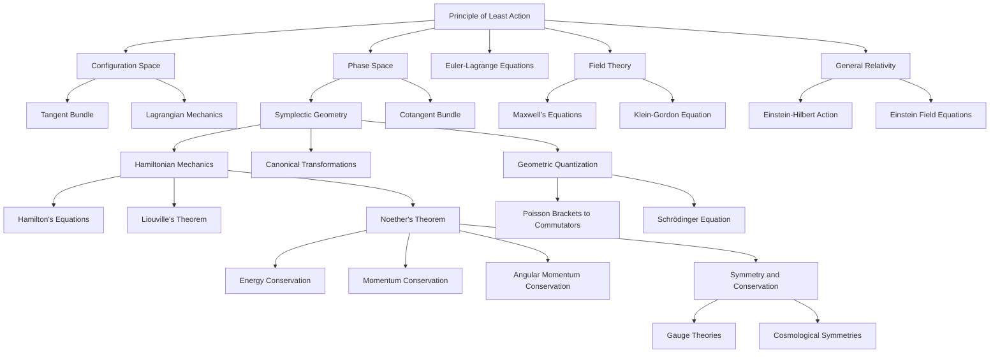

# Reimagining Classical Mechanics: A Reconstruction from First Principles
* * *

--- From simplicity emerges motion, and from motion emerges the universe.

# **I. Introduction: The Nature of Classical Mechanics**  
**Epigraph**: *"Every law of motion is but a whisper of geometry."*

## **I.1. Reimagining Classical Mechanics**

Classical mechanics is often presented as a collection of seemingly distinct frameworks—Newtonian force-based dynamics, Lagrangian variational principles, and Hamiltonian energy-centric formalisms. Each of these perspectives has served as a cornerstone of physics, yet they are often taught and understood as separate layers of analysis, disconnected in their fundamental nature. This fragmented view obscures the true essence of classical mechanics.

At its heart, classical mechanics is a study of **change and evolution**, governed by the symmetries of nature and the geometric structures inherent in space and time. It is a framework that reveals the deep interplay between motion, energy, and the constraints imposed by the physical universe. To fully grasp its essence, we must strip away the historical accretions and reimagine classical mechanics as a unified system constructed from **first principles**.

This document undertakes such a reimagining, striving to reconstruct classical mechanics from its most fundamental concept: the **Principle of Least Action**. Through this lens, we will build an interconnected framework that unites all aspects of classical mechanics—forces, energy, geometry, and conservation laws—into a cohesive whole.

## **I.2. The Unifying Core: The Principle of Least Action**

The Principle of Least Action is not merely a tool for deriving equations of motion; it is the **conceptual and mathematical bedrock** of classical mechanics. It asserts that the true path of a system through its state space is one that extremizes a scalar quantity called the **action**, defined by:
$$
S[q] = \int_{t_1}^{t_2} L(q, \dot{q}, t) \, dt,
$$
where $L(q, \dot{q}, t)$ is the **Lagrangian** of the system, representing the difference between kinetic energy ($T$) and potential energy ($V$):
$$
L = T - V.
$$
The Principle of Least Action is a geometric and variational statement about motion. It provides a universal framework for understanding how nature "chooses" the paths systems follow. Unlike Newton's laws, which focus on forces, or Hamiltonian mechanics, which privileges energy conservation, the action principle encapsulates **all dynamics** into a single, unifying concept.

## **I.3. Challenging Traditional Frameworks**

The historical development of classical mechanics, while illuminating, often obscures its deeper unity. Newtonian mechanics, Lagrangian mechanics, and Hamiltonian mechanics are typically presented as distinct layers of analysis:

1. **Newtonian Mechanics**:  
   - Built on the foundation of forces and accelerations.  
   - Governed by Newton's second law:  
     $$
     \mathbf{F} = m \mathbf{a}.
     $$  
   - While intuitive, it lacks the geometric elegance and generality of later formulations.

2. **Lagrangian Mechanics**:  
   - Reframes motion using the Principle of Least Action, focusing on energy differences rather than forces.  
   - Natural for systems with constraints and generalized coordinates.  

3. **Hamiltonian Mechanics**:  
   - Encodes dynamics in terms of positions and momenta within **phase space**, governed by Hamilton's equations.  
   - Introduces symplectic geometry as the language of mechanics.

However, these frameworks are not separate layers but **projections of a deeper geometric reality**. By reconstructing classical mechanics from the Principle of Least Action, we can reveal the underlying unity of these perspectives, showing how they emerge naturally from variational reasoning and the symplectic structure of phase space.

## **I.4. The Central Question**

To reimagine classical mechanics, we must ask:

- *What are the simplest principles from which the entire framework of classical mechanics can be reconstructed?*

This question challenges us to abandon preconceived notions and seek a minimalist foundation. The Principle of Least Action serves as this foundation, from which all other concepts—configuration space, phase space, symplectic geometry, conservation laws, and even quantum mechanics—emerge as natural extensions.

## **I.5. The Path Forward**

This document will unfold in layers, beginning with the Principle of Least Action and expanding outward to encompass the entirety of classical mechanics. Along the way, we will reframe traditional ideas like forces and energy in terms of geometry, symmetry, and variational reasoning. Each section builds on the last, creating a narrative that progresses from the simplest insights to the most profound implications.

1. **The Principle of Least Action**: The core foundation of classical mechanics.  
2. **Configuration Space and Phase Space**: The geometric arenas of motion.  
3. **Symplectic Geometry**: The structure governing phase space dynamics.  
4. **Conservation Laws and Symmetry**: The interplay between invariance and conserved quantities.  
5. **Connections to Modern Physics**: Bridging classical mechanics to quantum mechanics, field theory, and relativity.

At the end of this journey, we will have reconstructed classical mechanics as a geometric and variational theory, revealing its timeless relevance and its profound role as a bridge to modern physics.

## **I.6. Key Observations**

1. **Geometry as the Foundation**:  
   Classical mechanics is a geometric theory at its core, with motion described as trajectories on configuration space and phase space.

2. **Symmetry and Conservation**:  
   The symmetries of nature are the architects of conservation laws, uniting seemingly disparate phenomena under a common framework.

3. **Reconstruction from Minimal Principles**:  
   By starting with the Principle of Least Action, we can derive all of classical mechanics, exposing its inherent unity and simplicity.

4. **Timeless Relevance**:  
   The ideas of classical mechanics extend far beyond their historical origins, informing modern physics and deepening our understanding of the universe.

## **I.7. Conclusion**

From the Principle of Least Action, we will reconstruct classical mechanics step by step, uncovering its geometric essence and its connections to modern physics. This reimagining challenges us to look beyond the traditional frameworks and embrace a deeper, more unified understanding of motion, symmetry, and the structure of reality.

In the next section, we dive into the foundation of this reconstruction: the Principle of Least Action, the single thread from which the tapestry of classical mechanics is woven.

# **II. The Principle of Least Action: The Core Foundation**  
**Epigraph**: *"Nature acts by minimizing effort."*

## **II.1. The Principle of Least Action: A Universal Truth**

At the heart of classical mechanics lies a profound and unifying principle: the **Principle of Least Action**. It is not merely a mathematical tool but a conceptual foundation that governs the evolution of physical systems. Unlike force-based formulations, which focus on the interactions between objects, the action principle offers a higher-level perspective: it unites motion, energy, and geometry into a single, elegant variational framework.

## **II.2. Defining the Action Functional**

The action functional $S[q]$ encodes the cumulative "effort" of a system as it evolves between two points in time, $t_1$ and $t_2$. It is defined as:
$$
S[q] = \int_{t_1}^{t_2} L(q^i, \dot{q}^i, t) \, dt,
$$
where:
- $q^i$ are the generalized coordinates describing the system's configuration,
- $\dot{q}^i = \frac{dq^i}{dt}$ are the generalized velocities,
- $L(q^i, \dot{q}^i, t)$ is the **Lagrangian**, which encapsulates the system's dynamics through the difference between its **kinetic energy** ($T$) and **potential energy** ($V$):
$$
L = T - V.
$$
The action $S[q]$ integrates the Lagrangian over the trajectory $q(t)$ of the system, capturing the essence of its motion as a single scalar quantity.

## **II.3. Nature’s Path: Extremizing the Action**

The Principle of Least Action asserts that the true trajectory of a system is the one that extremizes the action functional $S[q]$. This extremization can correspond to a **minimum**, **maximum**, or **saddle point** of $S[q]$, depending on the context. In most physical systems, the trajectory minimizes the action, hence the name.

The principle can be summarized as:
$$
\delta S[q] = 0,
$$
where $\delta S[q]$ represents a small variation in the action due to a slight perturbation of the trajectory $q(t)$. This variational condition leads directly to the **Euler-Lagrange equations**, which are the equations of motion for the system.

## **II.4. The Euler-Lagrange Equations**

The Euler-Lagrange equations are derived by applying variational calculus to the action functional. Consider a small variation of the trajectory:
$$
q^i(t) \to q^i(t) + \epsilon \eta^i(t),
$$
where $\eta^i(t)$ is an arbitrary, smooth function that vanishes at the endpoints ($\eta^i(t_1) = \eta^i(t_2) = 0$), and $\epsilon$ is an infinitesimal parameter. The variation of the action is given by:
$$
\delta S = \frac{d}{d\epsilon} \int_{t_1}^{t_2} L(q^i + \epsilon \eta^i, \dot{q}^i + \epsilon \dot{\eta}^i, t) \, dt \bigg|_{\epsilon=0}.
$$
Expanding this expression to first order in $\epsilon$, we obtain:
$$
\delta S = \int_{t_1}^{t_2} \left( \frac{\partial L}{\partial q^i} \eta^i + \frac{\partial L}{\partial \dot{q}^i} \dot{\eta}^i \right) dt.
$$
Using integration by parts on the term involving $\dot{\eta}^i$, and noting that $\eta^i(t_1) = \eta^i(t_2) = 0$, we arrive at:
$$
\delta S = \int_{t_1}^{t_2} \left[ \frac{\partial L}{\partial q^i} - \frac{d}{dt} \frac{\partial L}{\partial \dot{q}^i} \right] \eta^i \, dt.
$$
For the action to be extremized ($\delta S = 0$) for arbitrary variations $\eta^i(t)$, the term in brackets must vanish, leading to the **Euler-Lagrange equations**:
$$
\frac{d}{dt}\left(\frac{\partial L}{\partial \dot{q}^i}\right) - \frac{\partial L}{\partial q^i} = 0.
$$
These equations are the fundamental equations of motion in the Lagrangian formulation of classical mechanics.

## **II.5. Physical Interpretation of the Action**

The action and its extremization provide a unifying framework for understanding the dynamics of physical systems:

1. **Effort of Motion**: The action measures the "effort" or "cost" of a system's trajectory through configuration space. Nature "selects" the trajectory that minimizes this effort.

2. **Global Perspective**: Unlike Newton’s laws, which describe motion locally (in terms of forces at each instant), the action principle considers the entire trajectory as a whole, emphasizing the global structure of motion.

3. **Universality**: The Principle of Least Action applies not only to classical mechanics but also to quantum mechanics, field theory, and general relativity, making it a cornerstone of modern physics.

## **II.6. Examples of the Principle of Least Action in Action**

1. **The Free Particle**:  
   For a particle of mass $m$ moving freely in space, the Lagrangian is purely kinetic:
   $$
   L = \frac{1}{2} m \dot{q}^2.
   $$
   The Euler-Lagrange equation reduces to:
   $$
   \frac{d}{dt} \left( m \dot{q} \right) = 0 \implies \dot{q} = \text{constant}.
   $$
   This result corresponds to the well-known law of inertia: the particle moves in a straight line with constant velocity.

2. **The Harmonic Oscillator**:  
   For a particle of mass $m$ subject to a restoring force proportional to displacement ($F = -kx$), the Lagrangian is:
   $$
   L = \frac{1}{2} m \dot{q}^2 - \frac{1}{2} k q^2.
   $$
   The Euler-Lagrange equation becomes:
   $$
   m \ddot{q} + kq = 0 \implies \ddot{q} + \omega^2 q = 0, \quad \omega = \sqrt{\frac{k}{m}}.
   $$
   This is the equation of motion for a simple harmonic oscillator, with solutions describing sinusoidal motion.

3. **Central Force Motion**:  
   For a particle moving under a central potential $V(r)$, the Lagrangian in spherical coordinates is:
   $$
   L = \frac{1}{2} m \left( \dot{r}^2 + r^2 \dot{\theta}^2 \right) - V(r).
   $$
   The resulting equations describe the dynamics of planetary motion, including Kepler's laws.

## **II.7. Universality of the Action Principle**

The Principle of Least Action transcends specific systems, serving as a universal framework for understanding dynamics. Its power lies in its generality:

- **Newtonian Mechanics**: Forces and accelerations are embedded within the Euler-Lagrange equations.  
- **Lagrangian Mechanics**: The action principle is central, providing a pathway to equations of motion.  
- **Hamiltonian Mechanics**: The action principle leads naturally to Hamilton’s formulation, with phase space dynamics governed by the symplectic structure.  

In every context, the action principle reveals the underlying simplicity and elegance of nature’s laws.

## **II.8. Key Insights**

1. The Principle of Least Action is the **core foundation** of classical mechanics, encapsulating the entire framework in a single variational statement.  
2. The **action functional** unites energy, motion, and geometry into a scalar quantity that governs the evolution of physical systems.  
3. The **Euler-Lagrange equations**, derived from variational calculus, are the equations of motion for any system described by a Lagrangian.  
4. The action principle is **universal**, bridging classical mechanics, quantum mechanics, and field theory.  

## **II.9. Transition to the Next Section**

Having established the Principle of Least Action as the core foundation, we now turn to the **geometric arenas of motion**: configuration space and phase space. These spaces provide the setting in which the action principle unfolds, revealing the deeper structure of classical mechanics.

# **III. Configuration Space and Phase Space: The Arenas of Motion**  
**Epigraph**: *"All motion begins with position but is completed by momentum."*

## **III.A. Configuration Space: The Geometric Arena of Position-Based Motion**

In classical mechanics, a system’s state is first and foremost defined by its **configuration**—the set of positions that fully describes the system at a given time. The space that contains all possible configurations of the system is called the **configuration space**, denoted $\mathcal{M}$. It serves as the geometric foundation for describing motion in terms of generalized coordinates.

### **III.A.1. Definition and Structure of Configuration Space**

The configuration space $\mathcal{M}$ is a manifold, typically **finite-dimensional**, where each point $q \in \mathcal{M}$ represents a unique arrangement of the system's components. The dimension of $\mathcal{M}$ corresponds to the number of **degrees of freedom** $n$ of the system, which is the number of independent parameters required to specify the system's state.

For example:
- A single particle in three-dimensional space has $\mathcal{M} \cong \mathbb{R}^3$, with coordinates $q = (x, y, z)$.  
- A rigid double pendulum, constrained to move in a plane, has $\mathcal{M} \cong S^1 \times S^1$, where $S^1$ represents the angular coordinates of each pendulum arm.

### **III.A.2. Tangent Bundles and Velocities**

To describe motion, we must consider not only the positions $q^i$ but also their **rates of change**—the velocities $\dot{q}^i = \frac{dq^i}{dt}$. These velocities are elements of the **tangent space** $T_q\mathcal{M}$ at each point $q \in \mathcal{M}$. The collection of all tangent spaces forms the **tangent bundle** $T\mathcal{M}$, which is the natural setting for the Lagrangian formulation of mechanics.

- **Tangent Space**: At each configuration $q$, the tangent space $T_q\mathcal{M}$ is a vector space containing all possible velocity vectors $\dot{q}$ at $q$.  
- **Tangent Bundle**: The tangent bundle $T\mathcal{M}$ is the union of all tangent spaces across $\mathcal{M}$:  
  $$
  T\mathcal{M} = \bigcup_{q \in \mathcal{M}} T_q\mathcal{M}.
  $$  
  Each point in $T\mathcal{M}$ is specified by a pair $(q, \dot{q})$, where $q \in \mathcal{M}$ and $\dot{q} \in T_q\mathcal{M}$.

### **III.A.3. Configuration Space in the Lagrangian Formalism**

The Lagrangian formulation of mechanics is naturally expressed in terms of configuration space and its tangent bundle. The Lagrangian $L(q, \dot{q}, t)$ is a function that depends on the generalized coordinates $q$, their velocities $\dot{q}$, and time $t$. The action functional:
$$
S[q] = \int_{t_1}^{t_2} L(q, \dot{q}, t) \, dt
$$
is defined over trajectories in $\mathcal{M}$, and the **Principle of Least Action** determines the path $q(t)$ that extremizes this functional.

Thus, configuration space $\mathcal{M}$ provides the geometric stage for the Lagrangian description of motion, while the tangent bundle $T\mathcal{M}$ encodes the dynamics through velocity vectors.

### **III.A.4. Examples of Configuration Space**

1. **Single Particle in 3D Space**:  
   - Configuration space: $\mathcal{M} = \mathbb{R}^3$.  
   - Tangent bundle: $T\mathcal{M} = \mathbb{R}^3 \times \mathbb{R}^3$, where $(q, \dot{q})$ specifies position and velocity.

2. **Pendulum System**:  
   - Configuration space: $\mathcal{M} = S^1$, a circle representing the angular position $\theta$.  
   - Tangent bundle: $T\mathcal{M} = S^1 \times \mathbb{R}$, where $\dot{\theta}$ is the angular velocity.

3. **Multi-Particle Systems**:  
   - For $N$ particles in 3D space: $\mathcal{M} = \mathbb{R}^{3N}$, with positions $q = (x_1, y_1, z_1, \dots, x_N, y_N, z_N)$.  
   - Tangent bundle: $T\mathcal{M} = \mathbb{R}^{3N} \times \mathbb{R}^{3N}$.

## **III.B. Phase Space: The Unified Arena of Position and Momentum**

While configuration space focuses on positions and velocities, **phase space** provides a more complete description of a system's state by incorporating both positions and their conjugate momenta. This shift from $(q, \dot{q})$ to $(q, p)$ introduces the geometric structure necessary for the Hamiltonian formalism.

### **III.B.1. Definition and Structure of Phase Space**

The **phase space** $T^*\mathcal{M}$ is the **cotangent bundle** of the configuration space $\mathcal{M}$. It is the natural setting for Hamiltonian mechanics, where each point in $T^*\mathcal{M}$ is specified by a pair $(q, p)$, with:
- $q \in \mathcal{M}$ representing the generalized coordinates (positions),
- $p \in T_q^*\mathcal{M}$ representing the conjugate momenta.

The momenta $p_i$ are defined as:
$$
p_i = \frac{\partial L}{\partial \dot{q}^i},
$$
linking phase space to the Lagrangian formulation.

### **III.B.2. The Symplectic Structure of Phase Space**

Phase space is not just a collection of positions and momenta—it is endowed with a **symplectic structure**, a geometric framework that governs the dynamics of Hamiltonian systems. The symplectic structure is defined by the **symplectic 2-form** $\omega$, given in canonical coordinates by:
$$
\omega = \sum_{i=1}^n dp_i \wedge dq^i.
$$
Key properties of the symplectic form:
1. **Closedness**: $d\omega = 0$, ensuring conservation of phase space volume (Liouville’s theorem).  
2. **Non-Degeneracy**: For any nonzero tangent vector $v$, there exists a $w$ such that $\omega(v, w) \neq 0$, enabling a unique relationship between positions and momenta.

The symplectic structure provides a geometric foundation for Hamilton’s equations and the flow of trajectories in phase space.

### **III.B.3. Dynamics in Phase Space: Hamiltonian Mechanics**

The Hamiltonian $H(q, p, t)$, representing the total energy of the system, governs the evolution of trajectories in phase space. Hamilton’s equations of motion are derived from the symplectic structure:
$$
\dot{q}^i = \frac{\partial H}{\partial p_i}, \quad \dot{p}_i = -\frac{\partial H}{\partial q^i}.
$$
These equations describe how the state $(q(t), p(t))$ evolves over time, with the symplectic form $\omega$ ensuring consistency and conservation.

### **III.B.4. Examples of Phase Space**

1. **Single Particle in 3D Space**:  
   - Phase space: $T^*\mathcal{M} = \mathbb{R}^3 \times \mathbb{R}^3$, where $q = (x, y, z)$ and $p = (p_x, p_y, p_z)$.  
   - Symplectic form: $\omega = dp_x \wedge dx + dp_y \wedge dy + dp_z \wedge dz$.

2. **Harmonic Oscillator**:  
   - Phase space: $T^*\mathcal{M} = \mathbb{R}^2$, with $q = x$ and $p = p_x$.  
   - Trajectories in phase space are elliptical, reflecting periodic motion.

3. **Multi-Particle Systems**:  
   - For $N$ particles: $T^*\mathcal{M} = \mathbb{R}^{3N} \times \mathbb{R}^{3N}$, where $q$ and $p$ describe all positions and momenta.  

## **III.C. Configuration Space and Phase Space: A Unified Perspective**

Configuration space provides the geometric foundation for the Lagrangian formulation, focusing on positions and velocities. Phase space extends this perspective to include momenta, introducing the symplectic geometry that underpins Hamiltonian mechanics. Together, these spaces form the arenas in which classical mechanics unfolds, linking motion, energy, and geometry into a cohesive framework.

## **III.D. Key Insights**

1. **Configuration Space**: The geometric space of positions, forming the basis for the Lagrangian description of motion.  
2. **Phase Space**: The cotangent bundle of configuration space, incorporating momenta and providing the stage for Hamiltonian dynamics.  
3. **Symplectic Structure**: The governing principle of phase space, ensuring conservation and consistency in dynamical evolution.  

## **III.E. Transition to the Next Section**

With the geometric arenas of motion established, we now delve into the **symplectic geometry** that governs phase space dynamics, exploring its mathematical structure and its role in unifying the principles of classical mechanics.

# **IV. Symplectic Geometry and Its Governing Principles**  
**Epigraph**: *"Symmetry and structure govern the dance of motion."*

## **IV.A. Symplectic Manifolds: The Geometric Foundation of Phase Space Dynamics**

Symplectic geometry lies at the heart of classical mechanics. It provides the mathematical structure underpinning phase space, ensuring that the evolution of physical systems is consistent, deterministic, and governed by fundamental principles of conservation. A **symplectic manifold** is the natural geometric setting for Hamiltonian mechanics, and its properties encode the deep interplay between positions and momenta in phase space.

### **IV.A.1. Definition of a Symplectic Manifold**

A **symplectic manifold** $(\mathcal{M}, \omega)$ consists of:
1. A smooth, even-dimensional manifold $\mathcal{M}$, representing the phase space of the system.
2. A **symplectic form** $\omega$, a closed, non-degenerate differential 2-form that defines the geometric structure of $\mathcal{M}$.

The symplectic form $\omega$ satisfies two key properties:
1. **Closedness**:  
   $$
   d\omega = 0,
   $$  
   ensuring conservation of the symplectic structure over time. This property is directly linked to Liouville's theorem, which we will explore in a later section.

2. **Non-degeneracy**:  
   For any nonzero tangent vector $v \in T_p\mathcal{M}$, there exists another tangent vector $w \in T_p\mathcal{M}$ such that:
   $$
   \omega(v, w) \neq 0.
   $$  
   Non-degeneracy ensures that $\omega$ provides a unique pairing between directions in phase space, establishing a one-to-one correspondence between positions and momenta.

In canonical coordinates $(q^i, p_i)$, the symplectic form is expressed as:
$$
\omega = \sum_{i=1}^n dp_i \wedge dq^i.
$$
Here, $dq^i$ and $dp_i$ represent infinitesimal changes in positions and momenta, respectively, and $\wedge$ denotes the wedge product, encoding the antisymmetric pairing of these variables.

### **IV.A.2. Canonical Transformations and Darboux’s Theorem**

The remarkable power of symplectic geometry lies in its invariance under **canonical transformations**. A canonical transformation is a change of coordinates $(q^i, p_i) \to (Q^i, P_i)$ in phase space that preserves the symplectic structure, ensuring that the equations of motion remain unchanged. Mathematically, the transformation satisfies:
$$
\omega' = \omega,
$$
where $\omega'$ is the symplectic form in the new coordinates.

Darboux’s theorem guarantees that, locally, every symplectic manifold is equivalent to a canonical form. This means that, regardless of the complexity of the system or the choice of coordinates, the symplectic structure can always be expressed as:
$$
\omega = \sum_{i=1}^n dP_i \wedge dQ^i,
$$
where $(Q^i, P_i)$ are the canonical coordinates. This universality simplifies the study of Hamiltonian dynamics, as the local structure of phase space is always "flat" in a symplectic sense.

### **IV.A.3. The Role of Symplectic Geometry in Dynamics**

Symplectic geometry governs the evolution of systems in phase space through the flow of trajectories generated by the Hamiltonian function $H(q, p, t)$. The symplectic structure ensures that these flows are deterministic, volume-preserving, and consistent with the conservation laws of classical mechanics.

Key implications of symplectic geometry include:
1. **Determinism**: The non-degeneracy of $\omega$ guarantees that the Hamiltonian equations of motion have unique solutions for given initial conditions.  
2. **Conservation of Phase Space Volume**: The closedness of $\omega$ ensures that the volume of any region in phase space remains constant over time, as formalized by Liouville’s theorem.  
3. **Energy Conservation**: The symplectic flow preserves the Hamiltonian $H$, representing the total energy of the system.

Thus, symplectic geometry provides the mathematical framework that unifies the geometric, variational, and dynamical aspects of classical mechanics.

## **IV.B. Hamilton's Equations and Dualities**

In classical mechanics, dynamics are encoded in the Hamiltonian function $H(q, p, t)$, which represents the total energy of the system. The symplectic structure translates this energy function into a deterministic flow in phase space, governed by **Hamilton's equations**. These equations reveal the intricate dualities between positions and momenta, as well as between energy and time.

### **IV.B.1. Derivation of Hamilton’s Equations**

The symplectic form $\omega$ enables the definition of a **Hamiltonian vector field** $X_H$, which generates the flow of the system in phase space. The vector field $X_H$ is defined implicitly by the condition:
$$
\iota_{X_H} \omega = dH,
$$
where $\iota_{X_H}$ denotes the interior product of $X_H$ with the symplectic form $\omega$, and $dH$ is the differential of the Hamiltonian.

In canonical coordinates $(q^i, p_i)$, this condition leads to Hamilton’s equations of motion:
$$
\dot{q}^i = \frac{\partial H}{\partial p_i}, \quad \dot{p}_i = -\frac{\partial H}{\partial q^i}.
$$
These equations describe the time evolution of the system’s positions $q^i$ and momenta $p_i$ and are fully determined by the Hamiltonian function $H(q, p, t)$.

### **IV.B.2. Position-Momentum Duality**

Hamilton’s equations reveal a fundamental **duality** between positions and momenta. In phase space:
- Positions $q^i$ evolve under the influence of the momenta $p_i$, as governed by $\frac{\partial H}{\partial p_i}$.  
- Momenta $p_i$ evolve under the influence of the positions $q^i$, as governed by $-\frac{\partial H}{\partial q^i}$.

This interplay reflects the intrinsic coupling of configuration space and momentum space, a relationship encoded geometrically in the symplectic form $\omega$. The antisymmetric structure of $\omega$ ensures that changes in positions and momenta are interdependent, driving the system’s evolution.

### **IV.B.3. Energy-Time Duality**

The Hamiltonian $H(q, p, t)$ serves as the generator of time evolution in phase space. For any observable $F(q, p, t)$, its time evolution is given by the **Poisson bracket**:
$$
\frac{dF}{dt} = \{F, H\} + \frac{\partial F}{\partial t},
$$
where the Poisson bracket is defined as:
$$
\{F, G\} = \sum_{i=1}^n \left( \frac{\partial F}{\partial q^i} \frac{\partial G}{\partial p_i} - \frac{\partial F}{\partial p_i} \frac{\partial G}{\partial q^i} \right).
$$

Energy-time duality arises from the fact that $H$ governs the rate of change of all observables, encapsulating the system’s dynamical evolution. This duality mirrors the position-momentum relationship and highlights the central role of the Hamiltonian in connecting geometry, energy, and time.

### **IV.B.4. Examples of Hamiltonian Dynamics**

1. **Harmonic Oscillator**:  
   For a one-dimensional harmonic oscillator with:
   $$
   H = \frac{p^2}{2m} + \frac{1}{2} kq^2,
   $$
   Hamilton’s equations yield:
   $$
   \dot{q} = \frac{\partial H}{\partial p} = \frac{p}{m}, \quad \dot{p} = -\frac{\partial H}{\partial q} = -kq.
   $$
   These equations describe sinusoidal motion, with elliptical trajectories in phase space.

2. **Central Force Motion**:  
   For a particle under a central potential $V(r)$, the Hamiltonian:
   $$
   H = \frac{p_r^2}{2m} + \frac{L^2}{2mr^2} + V(r),
   $$
   governs the dynamics, including conservation of angular momentum and energy.

## **IV.C. Key Insights**

1. **Symplectic Manifolds**: The phase space of classical mechanics is a symplectic manifold, where the symplectic form $\omega$ governs the geometry and dynamics.  
2. **Hamilton’s Equations**: The equations of motion arise naturally from the symplectic structure and the Hamiltonian function.  
3. **Dualities**: Classical mechanics is permeated by dualities—between positions and momenta, energy and time—that reflect the deep symmetry of phase space.  
4. **Universality of Symplectic Geometry**: Darboux’s theorem ensures that symplectic geometry is locally canonical, making it universally applicable to all Hamiltonian systems.

## **IV.D. Transition to the Next Section**

Having established the symplectic structure and the governing principles of Hamiltonian dynamics, we now explore the profound connection between **symmetry and conservation**, as formalized in Noether’s theorem. This connection reveals how the invariances of nature give rise to the conserved quantities that define order in motion.

# **V. Conservation Laws and Symmetry**  
**Epigraph**: *"Symmetry begets conservation."*

## **V.A. Noether's Theorem: The Bridge Between Symmetry and Conservation**

In the realm of classical mechanics, the profound connection between symmetry and conservation is formalized in **Noether's theorem**. This theorem elegantly reveals how every symmetry of a physical system corresponds to a conserved quantity, establishing symmetry as the architect of order in motion.

### **V.A.1. Statement of Noether's Theorem**

Noether's theorem applies to systems whose dynamics are governed by an action functional $S[q]$ that is invariant under a continuous symmetry transformation. The theorem states:

*For every continuous symmetry of the action functional, there exists a corresponding conserved quantity.*

Let the action functional be:
$$
S[q] = \int_{t_1}^{t_2} L(q, \dot{q}, t) \, dt,
$$
where $L$ is the Lagrangian. If the action remains invariant under a continuous transformation of the generalized coordinates:
$$
q^i \to q^i + \epsilon \eta^i(q, t),
$$
where $\epsilon$ is an infinitesimal parameter and $\eta^i$ represents the symmetry generator, then there exists a conserved quantity $J$, given by:
$$
J = \frac{\partial L}{\partial \dot{q}^i} \eta^i(q, t).
$$

This conserved quantity $J$ remains constant along the trajectory of the system, encapsulating the invariance imposed by the symmetry.

### **V.A.2. Proof of Noether's Theorem**

1. **Symmetry of the Action**:  
   Assume the action $S[q]$ remains unchanged under the infinitesimal transformation:
   $$
   q^i \to q^i + \epsilon \eta^i(q, t).
   $$
   The variation in the action is:
   $$
   \delta S = \int_{t_1}^{t_2} \left( \frac{\partial L}{\partial q^i} \eta^i + \frac{\partial L}{\partial \dot{q}^i} \frac{d}{dt} \eta^i \right) dt = 0.
   $$

2. **Equation of Motion**:  
   Using the Euler-Lagrange equations:
   $$
   \frac{d}{dt} \frac{\partial L}{\partial \dot{q}^i} - \frac{\partial L}{\partial q^i} = 0,
   $$
   the variation simplifies to:
   $$
   \delta S = \int_{t_1}^{t_2} \frac{d}{dt} \left( \frac{\partial L}{\partial \dot{q}^i} \eta^i \right) dt = 0.
   $$

3. **Conserved Quantity**:  
   Since the integral of a total time derivative vanishes, the quantity:
   $$
   J = \frac{\partial L}{\partial \dot{q}^i} \eta^i
   $$
   is conserved, i.e., $\frac{dJ}{dt} = 0$.

Thus, Noether's theorem provides a direct correspondence between symmetries and conservation laws.

### **V.A.3. Examples of Noether's Theorem in Action**

1. **Time-Translation Symmetry and Energy Conservation**:  
   If the Lagrangian $L$ is invariant under time translations ($t \to t + \epsilon$), then the conserved quantity is the **Hamiltonian**:
   $$
   H = \frac{\partial L}{\partial \dot{q}^i} \dot{q}^i - L,
   $$
   representing the total energy of the system.

2. **Spatial-Translation Symmetry and Momentum Conservation**:  
   If $L$ is invariant under spatial translations ($q^i \to q^i + \epsilon$), the conserved quantity is the **linear momentum**:
   $$
   p_i = \frac{\partial L}{\partial \dot{q}^i}.
   $$

3. **Rotational Symmetry and Angular Momentum Conservation**:  
   If $L$ is invariant under rotations, the conserved quantity is the **angular momentum**:
   $$
   L_z = q_x p_y - q_y p_x,
   $$
   where $(q_x, q_y)$ are the coordinates in the plane of rotation.

These examples illustrate how Noether's theorem unifies the diverse conservation laws of classical mechanics under the umbrella of symmetry.

## **V.B. Liouville’s Theorem: The Preservation of Phase Space Volume**

While Noether's theorem connects symmetries to conserved quantities, **Liouville’s theorem** reveals a fundamental property of phase space: the **volume of any region in phase space remains constant under Hamiltonian flow**. This invariance is a cornerstone of statistical mechanics and chaos theory, ensuring the consistency of probability distributions over time.

### **V.B.1. Statement of Liouville's Theorem**

Let $\mathcal{M}$ be the phase space of a Hamiltonian system, with coordinates $(q^i, p_i)$ and symplectic form:
$$
\omega = \sum_{i=1}^n dp_i \wedge dq^i.
$$
Under the Hamiltonian flow generated by $H(q, p)$, the phase space volume element:
$$
d\Gamma = \prod_{i=1}^n dq^i \, dp_i
$$
remains invariant. Mathematically:
$$
\frac{d}{dt} \int_\Omega d\Gamma = 0,
$$
where $\Omega \subseteq \mathcal{M}$ is any region of phase space.

### **V.B.2. Proof of Liouville’s Theorem**

1. **Hamiltonian Flow**:  
   The time evolution of phase space coordinates is governed by Hamilton’s equations:
   $$
   \dot{q}^i = \frac{\partial H}{\partial p_i}, \quad \dot{p}_i = -\frac{\partial H}{\partial q^i}.
   $$

2. **Phase Space Divergence**:  
   Consider the phase space vector field $X_H = (\dot{q}^i, \dot{p}_i)$. The divergence of $X_H$ is:
   $$
   \nabla \cdot X_H = \sum_{i=1}^n \left( \frac{\partial \dot{q}^i}{\partial q^i} + \frac{\partial \dot{p}_i}{\partial p_i} \right).
   $$
   Substituting Hamilton’s equations, we find:
   $$
   \nabla \cdot X_H = 0.
   $$

3. **Volume Preservation**:  
   The divergence-free property of $X_H$ implies that the phase space flow is incompressible, preserving the volume element $d\Gamma$ over time.

Thus, Liouville’s theorem ensures that the Hamiltonian flow preserves phase space volume, reflecting the deterministic and reversible nature of classical mechanics.

### **V.B.3. Implications of Liouville’s Theorem**

1. **Statistical Mechanics**:  
   In statistical mechanics, Liouville’s theorem underpins the conservation of probability distributions in phase space. The invariance of $d\Gamma$ ensures that the evolution of a system respects the principles of equilibrium and ergodicity.

2. **Chaos Theory**:  
   In chaotic systems, Liouville’s theorem guarantees that while individual trajectories may diverge exponentially, the total phase space volume remains constant, leading to complex but structured behavior.

3. **Quantum Correspondence**:  
   The preservation of phase space volume in classical mechanics is mirrored in quantum mechanics by the unitarity of time evolution, ensuring probability conservation.

## **V.C. Key Insights**

1. **Noether’s Theorem**: Symmetry is the source of conservation, linking fundamental invariances to quantities like energy, momentum, and angular momentum.  
2. **Liouville’s Theorem**: The preservation of phase space volume reflects the deterministic and reversible nature of Hamiltonian dynamics.  
3. **Unified Framework**: Together, these theorems highlight the deep interplay between symmetry, conservation, and the geometry of phase space, revealing the inherent structure of classical mechanics.

## **V.D. Transition to the Next Section**

With the principles of symmetry and conservation firmly established, we turn to the bridge between classical and quantum mechanics: **geometric quantization**. This transition reveals how the geometric foundations of classical mechanics extend into the probabilistic and wave-like domain of quantum systems, offering a deeper understanding of the universe's fundamental nature.

# **VI. Bridging to Modern Physics**  
**Epigraph**: *"Classical insights illuminate the quantum and the cosmic."*

## **VI.A. Geometric Quantization: Translating Symplectic Geometry to Quantum Mechanics**

Classical mechanics, with its symplectic structure and variational principles, provides the geometric foundation upon which quantum mechanics is built. The process of **geometric quantization** translates the deterministic, continuous nature of classical phase space into the probabilistic, discrete framework of quantum mechanics. This bridge is not merely a technical formalism but a profound shift in our understanding of the universe, where classical trajectories dissolve into quantum uncertainty.

### **VI.A.1. From Phase Space to Quantum States**

In classical mechanics, the state of a system is represented as a point in a **phase space** $T^*\mathcal{M}$, with coordinates $(q^i, p_i)$. The symplectic structure of phase space, encoded in the 2-form:
$$
\omega = \sum_{i=1}^n dp_i \wedge dq^i,
$$
provides the foundation for dynamic evolution through Hamilton’s equations. However, in quantum mechanics, the state of a system is no longer a point but a vector in a complex **Hilbert space** $\mathcal{H}$. The transition from phase space to Hilbert space is governed by the principles of geometric quantization.

### **VI.A.2. The Quantization Condition**

Geometric quantization imposes a fundamental constraint on phase space, requiring that the symplectic structure be compatible with the discrete nature of quantum states. This is expressed through the **quantization condition**:
$$
\frac{1}{2\pi \hbar} \int_{\Gamma} \omega \in \mathbb{Z},
$$
where $\Gamma$ is any closed $2$-surface in phase space, and $\hbar$ is Planck’s constant. This condition ensures that the phase space volume enclosed by $\Gamma$ is quantized in units of $\hbar$, reflecting the discrete nature of quantum mechanics.

Physically, this condition underlies the **Bohr-Sommerfeld quantization rule**, which approximates quantum energy levels by requiring that the action $S$ along a classical trajectory satisfies:
$$
\oint p \, dq = n h, \quad n \in \mathbb{Z}.
$$

### **VI.A.3. Poisson Brackets to Quantum Commutators**

The transition from classical to quantum mechanics also involves replacing the **Poisson bracket** structure of classical observables with the **commutator** structure of quantum operators. In classical mechanics, the Poisson bracket between two functions $F(q, p)$ and $G(q, p)$ is given by:
$$
\{F, G\} = \sum_{i=1}^n \left( \frac{\partial F}{\partial q^i} \frac{\partial G}{\partial p_i} - \frac{\partial F}{\partial p_i} \frac{\partial G}{\partial q^i} \right).
$$
In quantum mechanics, the corresponding commutator for operators $\hat{F}$ and $\hat{G}$ is:
$$
[\hat{F}, \hat{G}] = i \hbar \widehat{\{F, G\}}.
$$

This correspondence preserves the algebraic structure of classical mechanics while introducing the uncertainty inherent in quantum systems. For example, the canonical commutation relation:
$$
[\hat{q}^i, \hat{p}_j] = i \hbar \delta^i_j
$$
is a direct quantization of the classical Poisson bracket $\{q^i, p_j\} = \delta^i_j$.

### **VI.A.4. Wavefunctions and the Schrödinger Equation**

The geometric quantization process assigns a quantum state $\psi(q)$ to each allowable configuration in phase space. These states evolve according to the **Schrödinger equation**:
$$
i \hbar \frac{\partial \psi}{\partial t} = \hat{H} \psi,
$$
where $\hat{H}$ is the quantum Hamiltonian operator. The classical Hamiltonian $H(q, p)$ determines $\hat{H}$ through a process of operator substitution:
$$
p_i \to -i \hbar \frac{\partial}{\partial q^i}.
$$

Thus, the deterministic trajectories of classical mechanics are replaced by the probabilistic evolution of quantum wavefunctions, with the symplectic geometry of phase space providing the foundation for this transition.

## **VI.B. Extensions to Field Theory and Relativity**

The principles of classical mechanics, rooted in geometry and variational reasoning, extend seamlessly into the broader realms of field theory and general relativity. These modern frameworks generalize classical mechanics to describe systems with infinite degrees of freedom and the curvature of spacetime itself.

### **VI.B.1. Variational Principles in Field Theory**

In field theory, the **action principle** remains the cornerstone of dynamics. Instead of describing the motion of particles, the action functional now governs the evolution of fields $\phi(x)$ over spacetime. The action is expressed as an integral over a Lagrangian density $\mathcal{L}$:
$$
S[\phi] = \int \mathcal{L}(\phi, \partial_\mu \phi, x^\mu) \, d^4x,
$$
where $x^\mu$ are spacetime coordinates and $\partial_\mu \phi$ represents the field derivatives.

The Euler-Lagrange equations generalize to the field setting, yielding the equations of motion:
$$
\frac{\partial \mathcal{L}}{\partial \phi} - \partial_\mu \left( \frac{\partial \mathcal{L}}{\partial (\partial_\mu \phi)} \right) = 0.
$$

Examples include:
- Maxwell’s equations for electromagnetism, derived from the Lagrangian density:
  $$
  \mathcal{L} = -\frac{1}{4} F_{\mu\nu} F^{\mu\nu},
  $$
  where $F_{\mu\nu} = \partial_\mu A_\nu - \partial_\nu A_\mu$ is the electromagnetic field tensor.
- The Klein-Gordon equation for scalar fields, derived from:
  $$
  \mathcal{L} = \frac{1}{2} (\partial_\mu \phi)(\partial^\mu \phi) - \frac{1}{2} m^2 \phi^2.
  $$

### **VI.B.2. General Relativity: Geometry as Dynamics**

Classical mechanics’ emphasis on geometry reaches its apex in Einstein’s theory of **general relativity**, where spacetime itself becomes a dynamic entity. The Einstein-Hilbert action:
$$
S[g] = \frac{1}{16 \pi G} \int R \sqrt{-g} \, d^4x,
$$
where $R$ is the Ricci scalar curvature and $g$ is the determinant of the metric tensor $g_{\mu\nu}$, encapsulates the gravitational dynamics of spacetime.

The variational principle applied to this action yields Einstein’s field equations:
$$
R_{\mu\nu} - \frac{1}{2} R g_{\mu\nu} = \frac{8 \pi G}{c^4} T_{\mu\nu},
$$
which describe how matter and energy (through the stress-energy tensor $T_{\mu\nu}$) curve spacetime.

General relativity extends the geometric insights of classical mechanics to the structure of the universe itself, revealing a profound unity between motion and spacetime curvature.

### **VI.B.3. Gauge Theories and Symmetry**

The principles of symmetry and conservation, encapsulated in Noether’s theorem, are elevated in the context of **gauge theories**, which describe the fundamental forces of nature. In these theories, symmetries are local rather than global, leading to the introduction of gauge fields as mediators of interactions.

For example:
- The Standard Model of particle physics is a gauge theory based on the symmetry group $SU(3) \times SU(2) \times U(1)$, describing the strong, weak, and electromagnetic forces.
- The connection between gauge theory and classical mechanics lies in their shared reliance on variational principles and symmetry, highlighting the universality of these concepts.

## **VI.C. Key Insights**

1. **Geometric Quantization**: The transition from classical to quantum mechanics is guided by the symplectic geometry of phase space, linking classical trajectories to quantum probabilities.  
2. **Field Theory**: Variational principles extend classical mechanics to fields, describing systems with infinite degrees of freedom.  
3. **General Relativity**: The geometric insights of classical mechanics culminate in the dynamic curvature of spacetime, uniting gravity and motion.  
4. **Gauge Theories**: Symmetry principles, rooted in Noether’s theorem, underpin the fundamental forces of nature in both classical and modern physics.

## **VI.D. Transition to the Next Section**

With the bridge from classical mechanics to modern physics illuminated, we arrive at the final reflection: the timeless geometry of change. In the conclusion, we will synthesize the insights gained, emphasizing the enduring relevance of classical mechanics as a foundation for understanding the universe.

# **VII. Conclusion: The Timeless Geometry of Change**  
**Epigraph**: *"From simplicity arises complexity, from motion arises the universe."*

## **VII.1. The Reconstruction of Classical Mechanics**

At the heart of classical mechanics lies the profound interplay between simplicity and complexity, between geometric elegance and physical reality. This reconstruction has sought to strip away the historical scaffolding of separate frameworks—Newtonian, Lagrangian, and Hamiltonian—and reveal the unified essence beneath. By starting from the **Principle of Least Action**, we have built outward, layer by layer, to encompass the full structure of classical mechanics as a **geometric and variational theory**.

This framework is not merely a collection of tools for solving problems; it is an exploration of the fundamental nature of **change and evolution**. Motion, at its core, is a continuous dance between symmetries, constraints, and conserved quantities, all encoded in the geometry of the universe. Through this lens, classical mechanics becomes not just a theory of forces and trajectories but a manifestation of the deeper **architecture of reality**.

## **VII.2. Key Insights from the Reconstruction**

1. **The Principle of Least Action as the Core Foundation**:  
   The Principle of Least Action unifies motion, energy, and geometry into a single variational principle. It reveals that nature "chooses" paths that extremize effort, encapsulating the dynamics of physical systems in a profoundly simple yet universal framework.

2. **Configuration Space and Phase Space as Arenas of Motion**:  
   The geometric structure of configuration space and phase space provides the stage on which classical mechanics unfolds. Configuration space describes the system's possible positions, while phase space, governed by symplectic geometry, encodes the full state of motion through dualities like position-momentum and energy-time.

3. **Symplectic Geometry and its Governing Role**:  
   The symplectic structure of phase space governs the deterministic and reversible evolution of systems. It is the geometric backbone of Hamiltonian mechanics, ensuring conservation and consistency across trajectories.

4. **Symmetry as the Architect of Conservation**:  
   Noether's theorem reveals the deep connection between symmetry and conservation laws. Time-translation symmetry gives rise to energy conservation, spatial symmetry to momentum conservation, and rotational symmetry to angular momentum. These conserved quantities are the fingerprints of the underlying invariances of nature.

5. **The Bridge to Modern Physics**:  
   Classical mechanics serves as a bridge to quantum mechanics, field theory, and general relativity. Through geometric quantization, the deterministic paths of classical systems dissolve into quantum uncertainty, while variational principles extend naturally to infinite degrees of freedom in field theory and to the curvature of spacetime in general relativity.

## **VII.3. The Enduring Relevance of Classical Mechanics**

Classical mechanics is often perceived as a "finished" chapter in the history of science, a precursor to the quantum and relativistic revolutions. Yet this reconstruction reveals its enduring relevance, not just as a foundation for modern physics but as a conceptual framework that transcends its historical origins. Classical mechanics teaches us that:

1. **Geometry is Fundamental**:  
   The laws of motion are deeply intertwined with the geometric structure of space and time. Symplectic geometry, manifold theory, and variational calculus are not merely mathematical tools—they are the language of nature itself.

2. **Symmetry is Universal**:  
   The symmetries of classical mechanics echo throughout modern physics, from the gauge symmetries of quantum field theory to the diffeomorphism invariance of general relativity. Symmetry is the unifying principle that connects diverse phenomena across scales.

3. **Simplicity Begets Complexity**:  
   The entire framework of classical mechanics arises from a minimal set of principles: the extremization of action, the structure of phase space, and the invariance of the action under symmetry transformations. From these principles emerge the intricate dynamics of the physical world, from planetary orbits to chaotic systems.

4. **Determinism and Emergence**:  
   While classical mechanics is deterministic at its core, it provides a foundation for understanding emergent phenomena, from statistical mechanics to chaos theory. It bridges the gap between the microscopic and the macroscopic, between order and complexity.

## **VII.4. Open Questions and Future Explorations**

The reconstruction of classical mechanics invites us to reflect on deeper questions that extend beyond its boundaries. These questions challenge us to transcend the current framework and explore the mysteries of the universe with new perspectives:

1. **The Nature of Action**:  
   What is the deeper significance of the action functional? Is it merely a mathematical construct, or does it reflect a fundamental property of reality? Could the principle of least action be generalized to encompass quantum gravity or other unexplored domains?

2. **Connections to Information and Entropy**:  
   How does the symplectic structure of phase space relate to the flow of information and entropy in physical systems? Can classical mechanics provide new insights into the interplay between order and disorder, particularly in the context of complex and chaotic systems?

3. **The Role of Symmetry in Cosmology**:  
   Symmetry governs the laws of motion, but what role does it play in the large-scale structure of the universe? How do broken symmetries shape the evolution of the cosmos, from the Big Bang to the present?

4. **Bridging Classical and Quantum Realities**:  
   While geometric quantization provides a formal bridge between classical and quantum mechanics, the conceptual gap remains vast. Can we develop a deeper understanding of how classical trajectories emerge from quantum probabilities, or how quantum phenomena encode classical principles?

5. **The Limits of Classical Mechanics**:  
   As a theory of the macroscopic world, classical mechanics is limited by its assumptions of determinism, continuity, and locality. What lies beyond these assumptions, and how might new principles emerge to unify classical, quantum, and relativistic frameworks?

## **VII.5. The Timeless Geometry of Change**

Classical mechanics is not merely a relic of the past; it is a living framework that continues to shape our understanding of the universe. Its principles echo across disciplines, from physics to mathematics, from cosmology to complexity science. By reconstructing classical mechanics from its first principles, we uncover a framework that is both timeless and evolving, rooted in simplicity yet capable of describing the most intricate patterns of motion.

As we look to the future, classical mechanics reminds us that the search for understanding begins with the most fundamental questions: *What is motion? What governs change? How does structure arise from simplicity?* These questions are as relevant today as they were in the time of Newton and Lagrange, and they will continue to guide us as we explore the uncharted territories of the physical universe.

## **VII.6. Final Reflection**

In the end, classical mechanics is more than a theory—it is a way of seeing the world. It teaches us that motion is governed not by arbitrariness but by deep principles of symmetry, geometry, and conservation. It invites us to view the universe as a harmonious interplay of forces, paths, and structures, all emerging from a foundation of profound simplicity.

Let this reconstruction serve as both a tribute to the elegance of classical mechanics and a call to transcend its boundaries. For in the dance of motion, the universe reveals its essence, and in our quest to understand it, we come closer to understanding ourselves.

**"From simplicity arises complexity, from motion arises the universe."**

# **Appendix A: The Interconnected Framework of Classical Mechanics**  
**Epigraph**: *"To see the universe in its full elegance, one must trace the threads that connect its principles."*

This appendix provides a concise yet comprehensive overview of the core and important concepts presented in this document. The relationships between these concepts are key to understanding the unified framework of classical mechanics as reconstructed from first principles. To aid in this understanding, we present both a **conceptual relationship table** and a **diagram**.

## **A.1. Conceptual Relationship Table**  

The table below maps the relationships between the core concepts of the document, highlighting their dependencies and roles in reconstructing classical mechanics.

| **Core Concept**               | **Definition/Role**                                                                                     | **Direct Dependencies**                                                                                                             | **Emergent Concepts**                                                                                 |
|---------------------------------|---------------------------------------------------------------------------------------------------------|------------------------------------------------------------------------------------------------------------------------------------|-------------------------------------------------------------------------------------------------------|
| **Principle of Least Action**   | Governs the dynamics of systems by extremizing the action functional.                                   | None (Foundation of the framework)                                                                                               | Euler-Lagrange Equations, Configuration Space, Phase Space                                           |
| **Configuration Space**         | The geometric space of all possible positions of a system.                                              | Generalized Coordinates, Least Action                                                                                           | Tangent Bundle, Lagrangian Mechanics                                                                 |
| **Phase Space**                 | The cotangent bundle of configuration space, incorporating both positions and momenta.                  | Configuration Space, Symplectic Geometry                                                                                        | Hamiltonian Mechanics, Symplectic Flow                                                              |
| **Symplectic Geometry**         | The geometric structure of phase space, defined by a closed, non-degenerate 2-form.                     | Phase Space                                                                                                                     | Hamiltonian Flow, Canonical Transformations                                                          |
| **Euler-Lagrange Equations**    | The equations of motion derived from the extremization of the action functional.                        | Least Action, Lagrangian Mechanics                                                                                              | Motion in Configuration Space                                                                        |
| **Hamilton's Equations**        | Governs the evolution of systems in phase space using the Hamiltonian and symplectic structure.          | Symplectic Geometry, Phase Space                                                                                                | Position-Momentum Duality, Energy-Time Duality                                                       |
| **Noether’s Theorem**           | Links symmetries of the action to conserved quantities.                                                  | Least Action, Symmetry                                                                                                           | Energy Conservation, Momentum Conservation, Angular Momentum Conservation                           |
| **Liouville’s Theorem**         | States that the phase space volume is preserved under Hamiltonian flow.                                 | Symplectic Geometry, Hamiltonian Mechanics                                                                                      | Statistical Mechanics, Chaos Theory                                                                  |
| **Geometric Quantization**      | Translates symplectic geometry into quantum mechanics by quantizing phase space coordinates.             | Phase Space, Symplectic Geometry                                                                                                | Poisson Brackets to Quantum Commutators, Schrödinger Equation                                        |
| **Field Theory**                | Extends variational principles to systems with infinite degrees of freedom.                             | Least Action, Lagrangian Mechanics                                                                                              | Maxwell’s Equations, Klein-Gordon Equation                                                           |
| **General Relativity**          | Describes spacetime dynamics as a curvature generated by matter and energy, based on variational principles. | Least Action, Symplectic Geometry                                                                                               | Einstein-Hilbert Action, Einstein Field Equations                                                    |
| **Symmetry and Conservation**   | Symmetry is the source of conserved quantities, as formalized by Noether’s theorem.                     | Symplectic Geometry, Least Action                                                                                               | Gauge Theories, Cosmological Symmetries                                                              |

## **A.2. Conceptual Relationship Diagram**

The following diagram illustrates the relationships between the core and important concepts of classical mechanics. This visual representation captures the hierarchical and interconnected nature of the framework.

## **A.3. Summary of Relationships**

- The **Principle of Least Action** serves as the **foundation**, from which all other concepts emerge.
- **Configuration Space** and **Phase Space** are the geometric arenas, with phase space incorporating momenta and governed by **symplectic geometry**.
- **Symplectic Geometry** underpins the evolution of systems, leading to **Hamiltonian Mechanics**, **Noether’s Theorem**, and **Liouville’s Theorem**.
- **Noether’s Theorem** bridges symmetry to conservation laws, while **Liouville’s Theorem** ensures phase space volume preservation.
- The framework naturally extends to **Geometric Quantization**, bridging classical and quantum mechanics, and to **Field Theory** and **General Relativity**, generalizing classical mechanics to modern physics.

## **A.4. Insights from the Framework**

1. **Unified Structure**: The framework emphasizes that classical mechanics is not a collection of isolated tools but a coherent system rooted in geometry, symmetry, and variational reasoning.  
2. **Emergence of Modern Theories**: Concepts like symplectic geometry and variational principles seamlessly transition into quantum mechanics, field theory, and relativity.  
3. **Timeless Relevance**: By understanding the relationships between these principles, we gain not only a deeper appreciation of classical mechanics but also a foundation for exploring the mysteries of the universe.

This appendix serves as a roadmap for readers to navigate the intricate connections within the reconstructed framework of classical mechanics, fostering a holistic understanding of its principles and their profound implications.

