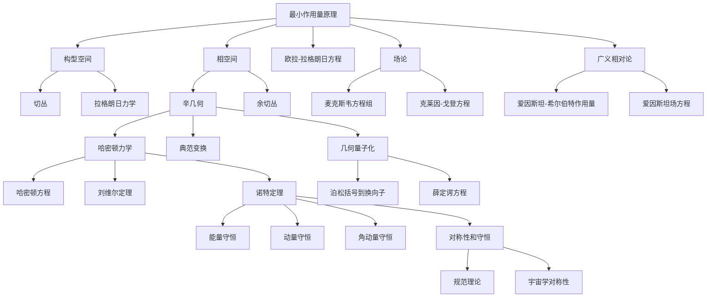

# 重新构想经典力学：从第一原理重构
* * *

--- 从简单性中产生运动，从运动中产生宇宙。

# **I. 引言：经典力学的本质**
**题词**: *"每一个运动定律只是几何学的低语。"*

## **I.1. 重新构想经典力学**

经典力学通常被呈现为一系列看似不同的框架 —— 基于牛顿力的动力学、拉格朗日变分原理和以哈密顿能量为中心的形式化方法。这些视角中的每一个都作为物理学的基石，但它们通常被独立地教授和理解，被视为分离的分析层次，在其根本性质上互不相连。这种碎片化的观点掩盖了经典力学的真正本质。

在本质上，经典力学是对**变化和演化**的研究，由自然界的对称性和时空中的几何结构所支配。它揭示了运动、能量以及物理宇宙施加的约束之间的深层相互作用。为了全面掌握其本质，我们必须剥离历史积累并从**第一性原理**出发重新构想经典力学。

本文件进行这样的重构尝试，力求从其最基本的概念 —— **最小作用量原理** —— 重建经典力学。通过这一视角，我们将构建一个将经典力学的所有方面 —— 力、能量、几何和守恒定律 —— 统一为一个整体的互联框架。

## **I.2. 统一的核心：最小作用量原理**

最小作用量原理不仅仅是一个推导运动方程的工具；它是经典力学的**概念和数学基础**。它断言系统在其状态空间中真实路径是使一个称为**作用量**的标量量达到极值的路径，定义为：
$$
S[q] = \int_{t_1}^{t_2} L(q, \dot{q}, t) \, dt,
$$
其中 $L(q, \dot{q}, t)$ 是系统的**拉格朗日量**，表示动能($T$)与势能($V$)之差：
$$
L = T - V.
$$
最小作用量原理是对运动的几何和变分陈述。它提供了一个理解自然界如何“选择”系统遵循的路径的通用框架。与关注力的牛顿定律或强调能量守恒的哈密顿力学不同，作用量原理将**所有动力学**归纳为一个单一的、统一的概念。

## **I.3. 挑战传统框架**

尽管经典力学的历史发展具有启发性，但它往往掩盖了其更深的统一性。牛顿力学、拉格朗日力学和哈密顿力学通常被呈现为独立的分析层次：

1. **牛顿力学**：  
   - 建立在力和加速度的基础上。  
   - 受牛顿第二定律支配：  
     $$
     \mathbf{F} = m \mathbf{a}.
     $$  
   - 虽然直观，但缺乏后来表述的几何优雅性和普遍性。

2. **拉格朗日力学**：  
   - 使用最小作用量原理重新表述运动，关注能量差异而非力。  
   - 对有约束和广义坐标的系统非常自然。

3. **哈密顿力学**：  
   - 在**相空间**中用位置和动量编码动力学，受哈密顿方程支配。  
   - 引入辛几何作为力学的语言。

然而，这些框架不是独立的层次，而是**更深层次几何实在的投影**。通过从最小作用量原理重建经典力学，我们可以揭示这些视角背后的统一性，展示它们如何自然地从变分推理和相空间的辛结构中浮现。

## **I.4. 核心问题**

要重新构想经典力学，我们必须问：

- *哪些最简单的原则可以从整个经典力学框架中重建？*

这个问题挑战我们摒弃先入为主的观念，寻求一个简约的基础。最小作用量原理就是这个基础，从中可以衍生出所有其他概念 —— 构型空间、相空间、辛几何、守恒定律，甚至量子力学 —— 作为自然扩展。

## **I.5. 前进的道路**

本文档将逐层展开，从最小作用量原理开始，并向外扩展以涵盖整个经典力学。在此过程中，我们将用几何、对称性和变分推理重新框定传统的概念如力和能量。每一节都在前一节的基础上构建，创建一个从最简单的见解到最深远的影响的叙事。

1. **最小作用量原理**：经典力学的核心基础。  
2. **构型空间和相空间**：运动的几何舞台。  
3. **辛几何**：支配相空间动力学的结构。  
4. **守恒定律与对称性**：不变性与守恒量之间的相互作用。  
5. **与现代物理学的联系**：将经典力学与量子力学、场论和相对论连接起来。

在这段旅程结束时，我们将把经典力学重构为一个几何和变分理论，揭示其永恒的相关性及其作为通向现代物理学桥梁的重要角色。

## **I.6. 关键观察**

1. **几何作为基础**：  
   经典力学在其核心是一种几何理论，运动被描述为构型空间和相空间上的轨迹。

2. **对称性与守恒**：  
   自然界的对称性是守恒定律的建筑师，将看似不同的现象统一在一个共同的框架之下。

3. **从最小原则重构**：  
   通过从最小作用量原理开始，我们可以推导出所有的经典力学，揭示其内在的统一性和简洁性。

4. **永恒的相关性**：  
   经典力学的思想远远超出其历史起源，为现代物理学提供了信息，深化了我们对宇宙的理解。

## **I.7. 结论**

我们将从最小作用量原理出发逐步重建经典力学，揭示其几何本质及其与现代物理学的联系。这种重构促使我们超越传统框架，拥抱对运动、对称性和现实结构更深刻、更统一的理解。

在下一节中，我们将深入探讨这一重构的基础：最小作用量原理，即编织经典力学挂毯的那根线。

# **II. 最小作用量原理：核心基础**
**题词**: *"自然通过最小化努力而行动。"*

## **II.1. 最小作用量原理：普遍真理**

经典力学的核心是一个深刻且统一的原则：**最小作用量原理**。它不仅仅是一个数学工具，而且是一个概念基础，支配物理系统的演化。与基于力的表述不同，后者关注物体之间的相互作用，而作用量原理提供了一个更高层次的视角：它将运动、能量和几何统一到一个单一的、优雅的变分框架中。

## **II.2. 定义作用量泛函**

作用量泛函 $S[q]$ 编码系统在两个时间点 $t_1$ 和 $t_2$ 之间演化的“效应”。其定义为：
$$
S[q] = \int_{t_1}^{t_2} L(q^i, \dot{q}^i, t) \, dt,
$$
其中：
- $q^i$ 是描述系统构型的广义坐标，
- $\dot{q}^i = \frac{dq^i}{dt}$ 是广义速度，
- $L(q^i, \dot{q}^i, t)$ 是**拉格朗日量**，通过动能($T$)与势能($V$)之差来封装系统的动力学：
$$
L = T - V.
$$
作用量 $S[q]$ 将拉格朗日量沿着系统的轨迹 $q(t)$ 积分，将运动的本质捕捉为一个单一的标量量。

## **II.3. 自然的路径：极值化作用量**

最小作用量原理断言系统的真正轨迹是使作用量泛函 $S[q]$ 极值化的那条路径。这种极值化可以对应于 $S[q]$ 的**最小值**、**最大值**或**鞍点**，具体取决于上下文。在大多数物理系统中，轨迹使作用量最小化，因此得名。

该原理可以总结为：
$$
\delta S[q] = 0,
$$
其中 $\delta S[q]$ 表示由于轨迹 $q(t)$ 的微小扰动引起的作用量的小变化。这个变分条件直接导致**欧拉-拉格朗日方程**，即系统的运动方程。

## **II.4. 欧拉-拉格朗日方程**

欧拉-拉格朗日方程通过对作用量泛函应用变分法导出。考虑轨迹的一个小变化：
$$
q^i(t) \to q^i(t) + \epsilon \eta^i(t),
$$
其中 $\eta^i(t)$ 是一个任意光滑函数，在端点处消失($\eta^i(t_1) = \eta^i(t_2) = 0$)，$\epsilon$ 是一个无穷小参数。作用量的变化由下式给出：
$$
\delta S = \frac{d}{d\epsilon} \int_{t_1}^{t_2} L(q^i + \epsilon \eta^i, \dot{q}^i + \epsilon \dot{\eta}^i, t) \, dt \bigg|_{\epsilon=0}.
$$
展开此表达式至 $\epsilon$ 的一阶项，我们得到：
$$
\delta S = \int_{t_1}^{t_2} \left( \frac{\partial L}{\partial q^i} \eta^i + \frac{\partial L}{\partial \dot{q}^i} \dot{\eta}^i \right) dt.
$$
对涉及 $\dot{\eta}^i$ 的项进行部分积分，并注意到 $\eta^i(t_1) = \eta^i(t_2) = 0$，我们得到：
$$
\delta S = \int_{t_1}^{t_2} \left[ \frac{\partial L}{\partial q^i} - \frac{d}{dt} \frac{\partial L}{\partial \dot{q}^i} \right] \eta^i \, dt.
$$
为了使作用量对于任意变化 $\eta^i(t)$ 极值化($\delta S = 0$)，方括号中的项必须消失(为零)，从而得出**欧拉-拉格朗日方程**：
$$
\frac{d}{dt}\left(\frac{\partial L}{\partial \dot{q}^i}\right) - \frac{\partial L}{\partial q^i} = 0.
$$
这些方程是拉格朗日形式的经典力学的基本运动方程。

## **II.5. 作用量的物理解释**

作用量及其极值化提供了一个理解物理系统动力学的统一框架：

1. **运动的效应**：作用量衡量系统在构型空间中轨迹的“效应”或“成本”。自然界“选择”使这种努力最小化的轨迹。

2. **全局视角**：不同于牛顿定律，后者描述局部运动(每个瞬间的力)，作用量原理考虑整个轨迹作为一个整体，强调运动的全局结构。

3. **普遍性**：最小作用量原理不仅适用于经典力学，还适用于量子力学、场论和广义相对论，使其成为现代物理学的基石。

## **II.6. 最小作用量原理的实际例子**

1. **自由粒子**：  
   对于质量为 $m$ 在空间中自由运动的粒子，拉格朗日量纯粹是动能：
   $$
   L = \frac{1}{2} m \dot{q}^2.
   $$
   欧拉-拉格朗日方程简化为：
   $$
   \frac{d}{dt} \left( m \dot{q} \right) = 0 \implies \dot{q} = \text{constant}.
   $$
   这个结果对应于著名的惯性定律：粒子以恒定速度沿直线运动。

2. **谐振子**：  
   对于质量为 $m$ 受到与位移成正比的恢复力($F = -kx$)作用的粒子，拉格朗日量为：
   $$
   L = \frac{1}{2} m \dot{q}^2 - \frac{1}{2} k q^2.
   $$
   欧拉-拉格朗日方程变为：
   $$
   m \ddot{q} + kq = 0 \implies \ddot{q} + \omega^2 q = 0, \quad \omega = \sqrt{\frac{k}{m}}.
   $$
   这是简单谐振子的运动方程，其解描述了正弦运动。

3. **中心力运动**：  
   对于在中心势 $V(r)$ 之下运动的粒子，在球坐标系中的拉格朗日量为：
   $$
   L = \frac{1}{2} m \left( \dot{r}^2 + r^2 \dot{\theta}^2 \right) - V(r).
   $$
   所得方程描述了行星运动的动力学，包括开普勒定律。

## **II.7. 作用量原理的普遍性**

最小作用量原理超越特定系统，作为理解动力学的通用框架。它的力量在于其普遍性：

- **牛顿力学**：力和加速度嵌入在欧拉-拉格朗日方程中。  
- **拉格朗日力学**：作用量原理是核心，提供通往运动方程的途径。  
- **哈密顿力学**：作用量原理自然地引出哈密顿表述，相空间动力学由辛结构支配。  

在每一个上下文中，作用量原理揭示了自然界定律的基础简单性和优雅性。

## **II.8. 关键见解**

1. 最小作用量原理是经典力学的**核心基础**，通过单一变分陈述封装整个框架。  
2. **作用量泛函**将能量、运动和几何统一为一个标量量，支配物理系统的演化。  
3. **欧拉-拉格朗日方程**，通过变分法推导，是任意由拉格朗日量描述的系统的运动方程。  
4. 作用量原理是**普遍的**，连接经典力学、量子力学和场论。  

## **II.9. 转向下一节**

在建立最小作用量原理作为核心基础之后，我们现在转向**运动的几何舞台**：构型空间和相空间。这些空间提供了作用量原理展开的背景，揭示了经典力学更深层次的结构。

# **III. 构型空间和相空间：运动的舞台**
**题词**: *"一切运动始于位置，但由动量完成。"*

## **III.A. 构型空间：基于位置运动的几何舞台**

在经典力学中，系统的状态首先由其**构型**定义 —— 在给定时间完全描述系统的位形集合。包含系统所有可能构型的空间称为**构型空间**，记作 $\mathcal{M}$。它为用广义坐标描述运动提供几何基础。

### **III.A.1. 构型空间的定义与结构**

构型空间 $\mathcal{M}$ 是一个流形，通常是**有限维**的，其中每个点 $q \in \mathcal{M}$ 表示系统组件的一种独特排列。$\mathcal{M}$ 的维度对应于系统的**自由度数** $n$，即指定系统状态所需的独立参数数量。

例如：
- 三维空间中的单个粒子有 $\mathcal{M} \cong \mathbb{R}^3$，坐标为 $q = (x, y, z)$。  
- 受限于在一个平面内运动的刚性双摆有 $\mathcal{M} \cong S^1 \times S^1$，其中 $S^1$ 表示每个摆臂的角度坐标。

### **III.A.2. 切丛与速度**

为了描述运动，我们不仅需要考虑位置 $q^i$，还需要它们的**变化率** —— 速度 $\dot{q}^i = \frac{dq^i}{dt}$。这些速度是每个点 $q \in \mathcal{M}$ 处的**切空间** $T_q\mathcal{M}$ 中的元素。所有切空间的集合形成**切丛** $T\mathcal{M}$，这是拉格朗日力学表述的自然背景。

- **切空间**：在每个构型 $q$ 处，切空间 $T_q\mathcal{M}$ 是一个向量空间，包含所有可能的速度向量 $\dot{q}$ 在 $q$ 处。  
- **切丛**：切丛 $T\mathcal{M}$ 是 $\mathcal{M}$ 上所有切空间的并集：  
  $$
  T\mathcal{M} = \bigcup_{q \in \mathcal{M}} T_q\mathcal{M}.
  $$  
  每个点在 $T\mathcal{M}$ 中由一个配对 $(q, \dot{q})$ 指定，其中 $q \in \mathcal{M}$ 和 $\dot{q} \in T_q\mathcal{M}$。

### **III.A.3. 拉格朗日形式中的构型空间**

力学的拉格朗日表述自然地通过构型空间及其切丛来表达。拉格朗日量 $L(q, \dot{q}, t)$ 是一个依赖于广义坐标 $q$、它们的速度 $\dot{q}$ 和时间 $t$ 的函数。作用量泛函：
$$
S[q] = \int_{t_1}^{t_2} L(q, \dot{q}, t) \, dt
$$
定义在 $\mathcal{M}$ 上的轨迹上，而**最小作用量原理**确定使该泛函极值化的路径 $q(t)$。

因此，构型空间 $\mathcal{M}$ 提供了拉格朗日描述运动的几何舞台，而切丛 $T\mathcal{M}$ 通过速度向量编码动力学。

### **III.A.4. 构型空间的例子**

1. **三维空间中的单个粒子**：  
   - 构型空间：$\mathcal{M} = \mathbb{R}^3$。  
   - 切丛：$T\mathcal{M} = \mathbb{R}^3 \times \mathbb{R}^3$，其中 $(q, \dot{q})$ 指定位置和速度。

2. **摆系统**：  
   - 构型空间：$\mathcal{M} = S^1$，表示角位置 $\theta$ 的圆。  
   - 切丛：$T\mathcal{M} = S^1 \times \mathbb{R}$，其中 $\dot{\theta}$ 是角速度。

3. **多粒子系统**：  
   - 对于 $N$ 个粒子在三维空间中：$\mathcal{M} = \mathbb{R}^{3N}$，位置为 $q = (x_1, y_1, z_1, \dots, x_N, y_N, z_N)$。  
   - 切丛：$T\mathcal{M} = \mathbb{R}^{3N} \times \mathbb{R}^{3N}$。

## **III.B. 相空间：位置和动量的统一舞台**

虽然构型空间关注位置和速度，**相空间**通过同时包含位置和它们的共轭动量提供对系统状态更完整的描述。从 $(q, \dot{q})$ 转变为 $(q, p)$ 引入了哈密顿形式所需的几何结构。

### **III.B.1. 相空间的定义与结构**

**相空间** $T^*\mathcal{M}$ 是构型空间 $\mathcal{M}$ 的**余切丛**。它是哈密顿力学的自然背景，其中每个点在 $T^*\mathcal{M}$ 中由一个配对 $(q, p)$ 指定，其中：
- $q \in \mathcal{M}$ 表示广义坐标(位置)，
- $p \in T_q^*\mathcal{M}$ 表示共轭动量。

动量 $p_i$ 定义为：
$$
p_i = \frac{\partial L}{\partial \dot{q}^i},
$$
将相空间与拉格朗日表述联系起来。

### **III.B.2. 相空间的辛结构**

相空间不仅仅是位置和动量的集合 —— 它被赋予一个**辛结构**，这是一个控制哈密顿系统动力学的几何框架。辛结构由**辛 2-形式** $\omega$ 定义，在正则坐标下给出：
$$
\omega = \sum_{i=1}^n dp_i \wedge dq^i.
$$
辛形式的关键性质：
1. **闭合性**：$d\omega = 0$，确保相空间体积的守恒(刘维尔定理)。  
2. **非退化性**：对于任意非零切向量 $v$，存在一个 $w$ 使得 $\omega(v, w) \neq 0$，从而在位置和动量之间建立唯一关系。

辛结构为哈密顿方程和相空间中的轨迹的流提供几何基础。

### **III.B.3. 相空间中的动力学：哈密顿力学**

哈密顿量 $H(q, p, t)$ 表示系统的总能量，控制相空间中轨迹的演化。哈密顿方程由辛结构导出：
$$
\dot{q}^i = \frac{\partial H}{\partial p_i}, \quad \dot{p}_i = -\frac{\partial H}{\partial q^i}.
$$
这些方程描述状态 $(q(t), p(t))$ 随时间的演变，辛形式 $\omega$ 确保一致性和守恒。

### **III.B.4. 相空间的例子**

1. **三维空间中的单个粒子**：  
   - 相空间：$T^*\mathcal{M} = \mathbb{R}^3 \times \mathbb{R}^3$，其中 $q = (x, y, z)$ 和 $p = (p_x, p_y, p_z)$。  
   - 辛形式：$\omega = dp_x \wedge dx + dp_y \wedge dy + dp_z \wedge dz$。

2. **谐振子**：  
   - 相空间：$T^*\mathcal{M} = \mathbb{R}^2$，其中 $q = x$ 和 $p = p_x$。  
   - 相空间中的轨迹是椭圆形的，反映周期运动。

3. **多粒子系统**：  
   - 对于 $N$ 个粒子：$T^*\mathcal{M} = \mathbb{R}^{3N} \times \mathbb{R}^{3N}$，其中 $q$ 和 $p$ 描述所有位置和动量。  

## **III.C. 构型空间和相空间：统一视角**

构型空间为拉格朗日表述提供几何基础，专注于位置和速度。相空间扩展这一视角，包括了动量，并引入支撑哈密顿力学的辛几何。这些空间共同形成经典力学展开的舞台，将运动、能量和几何结合成一个连贯的框架。

## **III.D. 关键见解**

1. **构型空间**：位置的几何空间，构成拉格朗日描述运动的基础。  
2. **相空间**：构型空间的余切丛，包含动量，并提供哈密顿动力学的舞台。  
3. **辛结构**：相空间的控制原则，确保动力学演化的守恒性和一致性。  

## **III.E. 转向下一节**

在建立运动的几何舞台之后，我们将深入探讨支配相空间动力学的**辛几何**，探索其数学结构及其在统一经典力学原理中的作用。

# **IV. 辛几何及其支配原理**
**题词**: *"对称性和结构主宰运动的舞蹈。"*

## **IV.A. 辛流形：相空间动力学的几何基础**

辛几何位于经典力学的核心。它提供支撑相空间的数学结构，确保物理系统的演化是一致的、确定的并由基本守恒原理支配的。一个**辛流形**是哈密顿力学的自然几何背景，其性质编码相空间中位置和动量之间的深刻相互作用。

### **IV.A.1. 辛流形的定义**

一个**辛流形** $(\mathcal{M}, \omega)$ 包括：
1. 一个光滑的偶数维流形 $\mathcal{M}$，表示系统的相空间。
2. 一个**辛形式** $\omega$，一个闭合的、非退化的微分 2-形式，定义 $\mathcal{M}$ 的几何结构。

辛形式 $\omega$ 满足两个关键性质：
1. **闭合性**：  
   $$
   d\omega = 0,
   $$  
   确保辛结构随时间保持不变。这一性质直接与刘维尔定理相关，我们将在后面的部分探讨。

2. **非退化性**：  
   对于任意非零切向量 $v \in T_p\mathcal{M}$，存在另一个切向量 $w \in T_p\mathcal{M}$ 使得：
   $$
   \omega(v, w) \neq 0.
   $$  
   非退化性确保 $\omega$ 在相空间方向之间提供唯一配对，建立位置和动量之间的一一对应关系。

在正则坐标 $(q^i, p_i)$ 下，辛形式表示为：
$$
\omega = \sum_{i=1}^n dp_i \wedge dq^i.
$$
这里，$dq^i$ 和 $dp_i$ 分别代表位置和动量的无穷小变化，$\wedge$ 表示楔积，编码这些变量的反对称配对。

### **IV.A.2. 正则变换与达布定理**

辛几何的显著力量在于其在**正则变换**之下的不变性。正则变换是在相空间中的坐标变换 $(q^i, p_i) \to (Q^i, P_i)$，该变换保持辛结构不变，确保运动方程不变。数学上，变换满足：
$$
\omega' = \omega,
$$
其中 $\omega'$ 是新坐标下的辛形式。

达布定理保证，在局部上，每个辛流形等价于一个正则形式。这意味着，无论系统的复杂性或坐标的选取如何，辛结构总可以表示为：
$$
\omega = \sum_{i=1}^n dP_i \wedge dQ^i,
$$
其中 $(Q^i, P_i)$ 是正则坐标。这种普遍性简化了哈密顿动力学的研究，因为相空间的局部结构在辛意义上总是“平坦”的。

### **IV.A.3. 辛几何在动力学中的角色**

辛几何通过由哈密顿函数 $H(q, p, t)$ 生成的轨迹流来支配系统在相空间中的演化。辛结构确保这些流是确定性的、体积守恒的，并且符合经典力学的守恒定律。

辛几何的关键含义包括：
1. **确定性**：$\omega$ 的非退化性保证哈密顿运动方程对于给定初始条件有唯一解。  
2. **相空间体积守恒**：$\omega$ 的闭合性确保在相空间中任意区域的体积随着时间保持不变，如刘维尔定理所形式化。  
3. **能量守恒**：辛流保持哈密顿量 $H$，表示系统的总能量。

因此，辛几何提供统一经典力学几何、变分和动力学方面的数学框架。

## **IV.B. 哈密顿方程与对偶性**

在经典力学中，动力学被编码在哈密顿函数 $H(q, p, t)$ 中，它表示系统的总能量。辛结构将这个能量函数转化为相空间中由**哈密顿方程**支配的确定性流，揭示位置和动量之间以及能量和时间之间的复杂对偶性。

### **IV.B.1. 哈密顿方程的推导**

辛形式 $\omega$ 使我们能够定义一个**哈密顿向量场** $X_H$，它在相空间中生成系统的流。向量场 $X_H$ 由以下条件隐式定义：
$$
\iota_{X_H} \omega = dH,
$$
其中 $\iota_{X_H}$ 表示 $X_H$ 与辛形式 $\omega$ 的内积，$dH$ 是哈密顿量的微分。

在正则坐标 $(q^i, p_i)$ 下，这一条件导致哈密顿运动方程：
$$
\dot{q}^i = \frac{\partial H}{\partial p_i}, \quad \dot{p}_i = -\frac{\partial H}{\partial q^i}.
$$
这些方程描述系统的位置 $q^i$ 和动量 $p_i$ 的时间演化，并完全由哈密顿函数 $H(q, p, t)$ 决定。

### **IV.B.2. 位置-动量对偶性**

哈密顿方程揭示位置和动量之间的基本**对偶性**。在相空间中：
- 位置 $q^i$ 受动量 $p_i$ 影响而演化，由 $\frac{\partial H}{\partial p_i}$ 控制。  
- 动量 $p_i$ 受位置 $q^i$ 影响而演化，由 $-\frac{\partial H}{\partial q^i}$ 控制。

这种相互作用反映构型空间和动量空间之间的内在耦合，这种关系在辛形式 $\omega$ 中以几何方式编码。$\omega$ 的反对称结构确保位置和动量的变化相互依赖，推动系统的演化。

### **IV.B.3. 能量-时间对偶性**

哈密顿量 $H(q, p, t)$ 是相空间中时间演化的生成元。对于任意可观测量 $F(q, p, t)$，其时间演化由**泊松括号**给出：
$$
\frac{dF}{dt} = \{F, H\} + \frac{\partial F}{\partial t},
$$
其中泊松括号定义为：
$$
\{F, G\} = \sum_{i=1}^n \left( \frac{\partial F}{\partial q^i} \frac{\partial G}{\partial p_i} - \frac{\partial F}{\partial p_i} \frac{\partial G}{\partial q^i} \right).
$$

能量-时间对偶性源于这样一个事实，即 $H$ 控制着所有可观测量的变化率，囊括了系统的动力学演化。这种对偶性类似于位置-动量关系，并突显了哈密顿量在连接几何、能量和时间方面的核心作用。

### **IV.B.4. 哈密顿动力学的例子**

1. **谐振子**：  
   对于一维谐振子，其哈密顿量为：
   $$
   H = \frac{p^2}{2m} + \frac{1}{2} kq^2,
   $$
   哈密顿方程给出：
   $$
   \dot{q} = \frac{\partial H}{\partial p} = \frac{p}{m}, \quad \dot{p} = -\frac{\partial H}{\partial q} = -kq.
   $$
   这些方程描述正弦运动，在相空间中有椭圆轨迹。

2. **中心力运动**：  
   对于在中心势 $V(r)$ 之下的粒子，哈密顿量：
   $$
   H = \frac{p_r^2}{2m} + \frac{L^2}{2mr^2} + V(r),
   $$
   控制动力学，包括角动量和能量的守恒。

## **IV.C. 关键见解**

1. **辛流形**：经典力学的相空间是一个辛流形，其中辛形式 $\omega$ 支配几何和动力学。  
2. **哈密顿方程**：运动方程自然地从辛结构和哈密顿函数中产生。  
3. **对偶性**：经典力学充满了对偶性 —— 位置和动量之间、能量和时间之间 —— 反映了相空间的深层对称性。  
4. **辛几何的普遍性**：达布定理确保辛几何在局部上是正则的，使其普遍适用于所有哈密顿系统。

## **IV.D. 转向下一节**

在建立辛结构和哈密顿动力学的支配原理之后，我们将探索**对称性和守恒**之间的深刻联系，这在诺特定理中得到了形式化。这种联系揭示了自然界不变性如何产生定义运动秩序的守恒量。

# **V. 守恒律与对称性**
**题词**: *"对称性产生守恒。"*

## **V.A. 诺特定理：对称性与守恒律之间的桥梁**

在经典力学领域中，对称性和守恒之间深刻的联系在**诺特定理**中得到了形式化。该定理优雅地揭示了每一个物理系统的对称性如何对应一个守恒量，确立了对称性作为运动秩序的建筑师。

### **V.A.1. 诺特定理的陈述**

诺特定理适用于其动力学由作用泛函 $S[q]$ 支配且该作用泛函在连续对称变换之下保持不变的系统。定理陈述如下：

*对于作用泛函的每一个连续对称性，存在一个相应的守恒量。*

设作用泛函为：
$$
S[q] = \int_{t_1}^{t_2} L(q, \dot{q}, t) \, dt,
$$
其中 $L$ 是拉格朗日量。如果作用在广义坐标的连续变换之下：
$$
q^i \to q^i + \epsilon \eta^i(q, t),
$$
保持不变，其中 $\epsilon$ 是无穷小参数，且 $\eta^i$ 表示对称生成元，则存在一个守恒量 $J$，给出为：
$$
J = \frac{\partial L}{\partial \dot{q}^i} \eta^i(q, t).
$$

这个守恒量 $J$ 沿着系统的轨迹保持不变，体现对称性所施加的不变性。

### **V.A.2. 诺特定理的证明**

1. **作用的对称性**：  
   假设作用 $S[q]$ 在无穷小变换之下保持不变：
   $$
   q^i \to q^i + \epsilon \eta^i(q, t).
   $$
   作用的变化是：
   $$
   \delta S = \int_{t_1}^{t_2} \left( \frac{\partial L}{\partial q^i} \eta^i + \frac{\partial L}{\partial \dot{q}^i} \frac{d}{dt} \eta^i \right) dt = 0.
   $$

2. **运动方程**：  
   使用欧拉-拉格朗日方程：
   $$
   \frac{d}{dt} \frac{\partial L}{\partial \dot{q}^i} - \frac{\partial L}{\partial q^i} = 0,
   $$
   变化简化为：
   $$
   \delta S = \int_{t_1}^{t_2} \frac{d}{dt} \left( \frac{\partial L}{\partial \dot{q}^i} \eta^i \right) dt = 0.
   $$

3. **守恒量**：  
   由于总时间导数的积分消失(为零)，该量：
   $$
   J = \frac{\partial L}{\partial \dot{q}^i} \eta^i
   $$
   是守恒的，即 $\frac{dJ}{dt} = 0$。

因此，诺特定理提供了对称性和守恒律之间的直接对应关系。

### **V.A.3. 诺特定理的应用实例**

1. **时间平移对称性与能量守恒**：  
   如果拉格朗日量 $L$ 对时间平移($t \to t + \epsilon$)不变，则守恒量是**哈密顿量**：
   $$
   H = \frac{\partial L}{\partial \dot{q}^i} \dot{q}^i - L,
   $$
   其表示系统的总能量。

2. **空间平移对称性与动量守恒**：  
   如果 $L$ 对空间平移($q^i \to q^i + \epsilon$)不变，则守恒量是**线动量**：
   $$
   p_i = \frac{\partial L}{\partial \dot{q}^i}.
   $$

3. **旋转对称性与角动量守恒**：  
   如果 $L$ 对旋转不变，则守恒量是**角动量**：
   $$
   L_z = q_x p_y - q_y p_x,
   $$
   其中 $(q_x, q_y)$ 是旋转平面中的坐标。

这些例子说明了诺特定理如何在对称性之下统一经典力学中多样的守恒定律。

## **V.B. 刘维尔定理：相空间体积的保存**

虽然诺特定理将对称性与守恒量联系起来，但**刘维尔定理**揭示相空间的一个基本性质：**相空间中任意区域的体积在哈密顿流之下保持不变**。这种不变性是统计力学和混沌理论的基础，确保概率分布在时间上的连贯性。

### **V.B.1. 刘维尔定理的陈述**

设 $\mathcal{M}$ 是哈密顿系统的相空间，具有坐标 $(q^i, p_i)$ 和辛形式：
$$
\omega = \sum_{i=1}^n dp_i \wedge dq^i.
$$
在由 $H(q, p)$ 生成的哈密顿流之下，相空间体积元素：
$$
d\Gamma = \prod_{i=1}^n dq^i \, dp_i
$$
保持不变。数学上表示为：
$$
\frac{d}{dt} \int_\Omega d\Gamma = 0,
$$
其中 $\Omega \subseteq \mathcal{M}$ 是相空间的任意区域。

### **V.B.2. 刘维尔定理的证明**

1. **哈密顿流**：  
   相空间坐标的时变由哈密顿方程支配：
   $$
   \dot{q}^i = \frac{\partial H}{\partial p_i}, \quad \dot{p}_i = -\frac{\partial H}{\partial q^i}.
   $$

2. **相空间散度**：  
   考虑相空间向量场 $X_H = (\dot{q}^i, \dot{p}_i)$。$X_H$ 的散度是：
   $$
   \nabla \cdot X_H = \sum_{i=1}^n \left( \frac{\partial \dot{q}^i}{\partial q^i} + \frac{\partial \dot{p}_i}{\partial p_i} \right).
   $$
   代入哈密顿方程，我们得到：
   $$
   \nabla \cdot X_H = 0.
   $$

3. **体积保持**：  
   $X_H$ 的无散度性质意味着相空间流是不可压缩的，随着时间推移保持体积元素 $d\Gamma$ 不变。

因此，刘维尔定理确保哈密顿流保持相空间体积，反映了经典力学的确定性和可逆性。

### **V.B.3. 刘维尔定理的意义**

1. **统计力学**：  
   在统计力学中，刘维尔定理支撑相空间中概率分布的守恒。$d\Gamma$ 的不变性确保系统演化遵循平衡和遍历性原理。

2. **混沌理论**：  
   在混沌系统中，刘维尔定理保证尽管个别轨迹可能指数级发散，但总的相空间体积保持不变，导致复杂但有结构的行为。

3. **量子对应**：  
   经典力学中相空间体积的保持在量子力学中通过时间演化的幺正性反映出来，确保概率守恒。

## **V.C. 关键见解**

1. **诺特定理**：对称性是守恒的来源，将基本不变性与能量、动量和角动量等量联系起来。  
2. **刘维尔定理**：相空间体积的保持反映哈密顿动力学的确定性和可逆性。  
3. **统一框架**：这些定理共同突显对称性、守恒律和相空间几何之间的深刻相互作用，揭示经典力学内在的结构。

## **V.D. 转向下一节**

在对称性和守恒原则牢固建立的基础上，我们将转向经典力学与量子力学之间的桥梁：**几何量子化**。这一转变揭示了经典力学的几何基础如何扩展到量子系统的概率性和波动性领域，提供了对宇宙基本性质的更深层次理解。

# **VI. 通往现代物理的桥梁**
**题词**: *"经典见解照亮量子与宇宙。"*

## **VI.A. 几何量子化：从辛几何到量子力学的转换**

经典力学以其辛结构和变分原理提供构建量子力学的几何基础。**几何量子化**的过程将经典的确定性、连续性质转化为量子力学的概率性、离散框架。这一桥梁不仅仅是技术形式主义，更是我们对宇宙理解的根本转变，其中经典轨迹溶解为量子不确定性。

### **VI.A.1. 从相空间到量子态**

在经典力学中，系统的状态表示为**相空间** $T^*\mathcal{M}$ 中的一个点，坐标为 $(q^i, p_i)$。相空间的辛结构通过 2-形式：
$$
\omega = \sum_{i=1}^n dp_i \wedge dq^i,
$$
提供通过哈密顿方程进行动力学演化的基础。然而，在量子力学中，系统的状态不再是点，而是在复数**希尔伯特空间** $\mathcal{H}$ 中的向量。从相空间到希尔伯特空间的过渡由几何量子化的原则支配。

### **VI.A.2. 量子化条件**

几何量子化对相空间施加一个基本约束，要求辛结构与量子态的离散性质兼容。这通过**量子化条件**表达：
$$
\frac{1}{2\pi \hbar} \int_{\Gamma} \omega \in \mathbb{Z},
$$
其中 $\Gamma$ 是相空间中的任意闭合 $2$ 维曲面，$\hbar$ 是普朗克常数。此条件确保 $\Gamma$ 所包围的相空间体积以 $\hbar$ 为单位量子化，反映量子力学的离散性质。

物理上，该条件支撑了**玻尔-索末菲量子化规则**，通过要求沿着经典轨迹的作用 $S$ 满足：
$$
\oint p \, dq = n h, \quad n \in \mathbb{Z}.
$$
来近似量子能级。

### **VI.A.3. 泊松括号到量子对易子**

从经典到量子力学的转换还涉及用量子算符的**对易子**结构替换经典可观测量的**泊松括号**结构。在经典力学中，两个函数 $F(q, p)$ 和 $G(q, p)$ 之间的泊松括号由下式给出：
$$
\{F, G\} = \sum_{i=1}^n \left( \frac{\partial F}{\partial q^i} \frac{\partial G}{\partial p_i} - \frac{\partial F}{\partial p_i} \frac{\partial G}{\partial q^i} \right).
$$
在量子力学中，相应算子 $\hat{F}$ 和 $\hat{G}$ 的对易子为：
$$
[\hat{F}, \hat{G}] = i \hbar \widehat{\{F, G\}}.
$$

这种对应关系保持了经典力学的代数结构，同时引入了量子系统固有的不确定性。例如，正则对易关系：
$$
[\hat{q}^i, \hat{p}_j] = i \hbar \delta^i_j
$$
是对经典泊松括号 $\{q^i, p_j\} = \delta^i_j$ 的直接量子化。

### **VI.A.4. 波函数与薛定谔方程**

几何量子化过程将每个允许配置分配给相空间的一个量子态 $\psi(q)$。这些状态根据**薛定谔方程**演化：
$$
i \hbar \frac{\partial \psi}{\partial t} = \hat{H} \psi,
$$
其中 $\hat{H}$ 是量子哈密顿算子。经典哈密顿量 $H(q, p)$ 通过算子置换过程确定 $\hat{H}$：
$$
p_i \to -i \hbar \frac{\partial}{\partial q^i}.
$$

因此，经典力学的确定性轨迹被量子波函数的概率性演化所取代，相空间的辛几何为这一过渡提供基础。

## **VI.B. 场论与相对论的扩展**

经典力学的原则，根植于几何和变分推理，无缝延伸到场论和广义相对论的更广泛领域。这些现代框架将经典力学推广到描述具有无限自由度的系统和时空本身的弯曲。

### **VI.B.1. 场论中的变分原理**

在场论中，**作用原理**仍然是动力学的核心。它不再描述粒子的运动，作用泛函现在控制着时空上的场 $\phi(x)$ 的演化。作用表示为拉格朗日密度 $\mathcal{L}$ 的积分：
$$
S[\phi] = \int \mathcal{L}(\phi, \partial_\mu \phi, x^\mu) \, d^4x,
$$
其中 $x^\mu$ 是时空坐标，$\partial_\mu \phi$ 表示场导数。

欧拉-拉格朗日方程推广到场设置，产生运动方程：
$$
\frac{\partial \mathcal{L}}{\partial \phi} - \partial_\mu \left( \frac{\partial \mathcal{L}}{\partial (\partial_\mu \phi)} \right) = 0.
$$

例子包括：
- 麦克斯韦方程组用于电磁学，从拉格朗日密度推导：
  $$
  \mathcal{L} = -\frac{1}{4} F_{\mu\nu} F^{\mu\nu},
  $$
  其中 $F_{\mu\nu} = \partial_\mu A_\nu - \partial_\nu A_\mu$ 是电磁场张量。
- 标量场的克莱因-戈登方程，从以下公式推导：
  $$
  \mathcal{L} = \frac{1}{2} (\partial_\mu \phi)(\partial^\mu \phi) - \frac{1}{2} m^2 \phi^2.
  $$

### **VI.B.2. 广义相对论：几何即动力学**

经典力学对几何的强调在爱因斯坦的**广义相对论**中达到顶峰，时空本身成为一个动力学实体。爱因斯坦-希尔伯特作用：
$$
S[g] = \frac{1}{16 \pi G} \int R \sqrt{-g} \, d^4x,
$$
其中 $R$ 是里奇标量曲率，且 $g$ 是度规张量 $g_{\mu\nu}$ 的行列式，封装了时空的引力动力学。

应用于该作用的变分原理产生爱因斯坦场方程：
$$
R_{\mu\nu} - \frac{1}{2} R g_{\mu\nu} = \frac{8 \pi G}{c^4} T_{\mu\nu},
$$
描述物质和能量(通过应力-能量张量 $T_{\mu\nu}$)如何弯曲时空。

广义相对论将经典力学的几何洞察扩展到宇宙结构本身，揭示了运动与时空曲率之间的深刻统一。

### **VI.B.3. 规范理论与对称性**

诺特定理中体现的对称性和守恒原则在描述自然基本力的**规范理论**中得到提升。在这些理论中，对称性是局部的而非全局的，导致引入规范场作为相互作用的媒介。

例如：
- 粒子物理学的标准模型是一个基于对称群 $SU(3) \times SU(2) \times U(1)$ 的规范理论，描述强、弱和电磁力。
- 规范理论与经典力学之间的联系在于它们共同依赖于变分原理和对称性，突显了这些概念的普遍性。

## **VI.C. 关键见解**

1. **几何量子化**：从经典到量子力学的过渡由相空间的辛几何引导，将经典轨迹与量子概率联系起来。  
2. **场论**：变分原理将经典力学扩展到场，描述具有无限自由度的系统。  
3. **广义相对论**：经典力学的几何洞察在时空的动力学曲率中达到巅峰，统一了引力与运动。  
4. **规范理论**：对称性原则，根植于诺特定理，支撑了自然界的基本力在经典和现代物理中的表现。

## **VI.D. 转向下一节**

随着从经典力学到现代物理的桥梁被照亮，我们将来到最后的反思：变化的时间几何。在结论部分，我们将综合获得的见解，强调经典力学作为理解宇宙基础的持久相关性。

# **VII. 结论：变化的时间几何**
**题词**: *"从简单中产生复杂，从运动中诞生宇宙。"*

## **VII.1. 经典力学的重构**

经典力学的核心在于简单与复杂、几何优雅与物理现实之间的深刻相互作用。这种重构试图剥离历史上独立框架 —— 牛顿力学、拉格朗日力学和哈密顿力学 —— 的构建脚手架，并揭示其下统一的本质。通过从**最小作用量原理**出发，我们层层构建，以包含经典力学作为一个**几何和变分理论**的完整结构。

这个框架不仅仅是解决问题的一系列工具；它是对**变化和演化**本质的探索。在最核心处，运动是存在于对称性、约束条件和守恒量之间的一种连续舞蹈，所有这些都编码在宇宙的几何结构中。通过这一视角，经典力学不仅成为一种力和轨迹的理论，更是深层的**实在架构**的表现。

## **VII.2. 重构中的关键见解**

1. **最小作用量原理作为核心基础**：  
   最小作用量原理将运动、能量和几何统一在一个单一的变分原则中。它揭示了自然“选择”使效应达到极值的路径，将物理系统的动力学封装在一个非常简单却普遍适用的框架中。

2. **构型空间和相空间作为运动的舞台**：  
   构型空间和相空间的几何结构提供了经典力学展开的舞台。构型空间描述系统可能的位置，而由辛几何支配的相空间则通过位置-动量和能量-时间等对偶性编码运动的全状态。

3. **辛几何及其主导作用**：  
   相空间的辛结构决定系统的确定性和可逆性演化。它是哈密顿力学的几何骨架，确保轨迹上的守恒和一致性。

4. **对称为守恒的建筑师**：  
   诺特定理揭示对称性和守恒定律之间的深刻联系。时间平移对称性导致能量守恒，空间对称性导致动量守恒，旋转对称性导致角动量守恒。这些守恒量是自然界潜在不变性的指纹。

5. **通往现代物理学的桥梁**：  
   经典力学作为通向量子力学、场论和广义相对论的桥梁。通过几何量子化，经典系统的确定性路径溶解为量子不确定性，而变分原理自然延伸到场论的无限自由度以及广义相对论中的时空曲率。

## **VII.3. 经典力学的持久相关性**

经典力学常被视为科学史上一个“已完成”的章节，是量子革命和相对论革命的前奏。然而，这种重构揭示了它的持久相关性，它不仅是现代物理学的基础，而且是一个超越其历史起源的概念框架。经典力学教导我们：

1. **几何是基本的**：  
   运动定律与时空的几何结构紧密交织。辛几何、流形理论和变分法不仅仅是数学工具 —— 它们是自然的语言本身。

2. **对称性是普遍的**：  
   经典力学中的对称性贯穿于现代物理学，从量子场论中的规范对称性到广义相对论中的微分同胚不变性。对称性是连接不同尺度现象的统一原则。

3. **简单孕育复杂**：  
   整个经典力学框架源于一组最小的原则：作用量的极值化、相空间的结构以及作用量在对称变换之下的不变性。从这些原则中涌现出物理世界的复杂动力学，从行星轨道到混沌系统。

4. **决定论与涌现**：  
   虽然经典力学本质上是决定论的，但它为理解涌现现象提供基础，从统计力学到混沌理论。它弥合了微观与宏观、秩序与复杂性之间的鸿沟。

## **VII.4. 开放问题与未来探索**

经典力学的重构促使我们反思超出其边界的深层次问题。这些问题挑战我们超越当前框架，用新的视角探索宇宙的奥秘：

1. **作用量的本质**：  
   作用量泛函的更深层次意义是什么？它仅仅是一个数学构造，还是反映实在的基本属性？最小作用量原理能否推广以涵盖量子引力或其他未探索的领域？

2. **信息与熵的联系**：  
   相空间的辛结构如何与物理系统的信息流和熵相关？经典力学能否为有序与无序之间的相互作用提供新见解，特别是在复杂和混沌系统的背景下？

3. **对称性在宇宙学中的角色**：  
   对称性支配着运动的规律，但它在宇宙的大尺度结构中扮演什么角色？对称性破缺如何塑造宇宙从大爆炸到现在的发展？

4. **经典与量子现实之间的桥梁**：  
   尽管几何量子化提供了一个形式化的桥梁，将经典力学与量子力学连接起来，但概念上的差距仍然巨大。我们能否发展出对经典轨迹如何从量子概率中出现或量子现象如何编码经典原理的更深入理解？

5. **经典力学的局限性**：  
   作为一种宏观世界理论，经典力学受限于其决定论、连续性和局域性的假设。这些假设之外是什么，以及如何出现新的原则来统一经典、量子和相对论框架？

## **VII.5. 变化的时间几何**

经典力学不仅仅是过去的遗迹；它是一个不断塑造我们对宇宙理解的活生生的框架。它的原则跨越学科，从物理学到数学，从宇宙学到复杂性科学。通过从第一原则重构经典力学，我们揭示了一个既永恒又演化的框架，植根于简单却能够描述最复杂的运动模式。

展望未来，经典力学提醒我们，对理解的追求始于最基本的问题：*什么是运动？什么支配变化？结构如何从简单中产生？* 这些问题今天与牛顿和拉格朗日时代一样重要，并将继续指导我们在探索物理宇宙未知领域的过程中前进。

## **VII.6. 最后的思考**

最终，经典力学不仅仅是一种理论 —— 它是一种看待世界的方式。它教导我们，运动不是任意的，而是由深刻的对称性、几何和守恒原则所支配。它邀请我们将宇宙视为一种和谐的力、路径和结构的相互作用，所有这些都源于一种深刻的简单性。

让这种重构既是对经典力学优雅性的致敬，也是对超越其界限的号召。因为在运动的舞蹈中，宇宙揭示其本质，在我们的探索中，我们也更加接近了解自己。

**"从简单中产生复杂，从运动中诞生宇宙。"**

# **附录 A：经典力学的互联框架**
**题词**: *"要看到宇宙的全部优雅，必须追踪连接其原则的线索。"*

本附录提供一个简洁而全面的概述，涵盖本文档中提出的核心和重要概念。理解这些概念之间的关系是掌握从第一原则重构的经典力学统一框架的关键。为了帮助理解，我们提供**概念关系表**和**图示**。

## **A.1. 概念关系表**

下表列出了文档核心概念之间的关系，突出它们在重构经典力学中的依赖性和作用。

| **核心概念**      | **定义/角色**                  | **直接依赖**     | **衍生概念**             |
| ------------- | -------------------------- | ------------ | -------------------- |
| **最小作用量原理**   | 通过极值化作用量泛函来支配系统动力学。        | 无(框架的基础)     | 欧拉-拉格朗日方程，构型空间，相空间   |
| **构型空间**      | 系统所有可能位置的几何空间。             | 广义坐标，最小作用量   | 切丛，拉格朗日力学            |
| **相空间**       | 构型空间的余切丛，包含位置和动量。          | 构型空间，辛几何     | 哈密顿力学，辛流             |
| **辛几何**       | 相空间的几何结构，由一个闭合非退化的 2-形式定义。 | 相空间          | 哈密顿流，典范变换            |
| **欧拉-拉格朗日方程** | 由作用量泛函的极值化导出的运动方程。         | 最小作用量，拉格朗日力学 | 构型空间中的运动             |
| **哈密顿方程**     | 使用哈密顿量和辛结构来描述相空间中系统演化的方程。  | 辛几何，相空间      | 位置-动量对偶，能量-时间对偶      |
| **诺特定理**      | 将作用量的对称性与守恒量联系起来。          | 最小作用量，对称性    | 能量守恒，动量守恒，角动量守恒      |
| **刘维尔定理**     | 指出在哈密顿流之下相空间体积保持不变。        | 辛几何，哈密顿力学    | 统计力学，混沌理论            |
| **几何量子化**     | 通过对相空间坐标的量子化将辛几何转化为量子力学。   | 相空间，辛几何      | 泊松括号到量子换向子，薛定谔方程     |
| **场论**        | 将变分原理扩展到具有无限自由度的系统。        | 最小作用量，拉格朗日力学 | 麦克斯韦方程组，克莱因-戈登方程     |
| **广义相对论**     | 基于变分原理描述由物质和能量产生的时空动力学。    | 最小作用量，辛几何    | 爱因斯坦-希尔伯特作用量，爱因斯坦场方程 |
| **对称性和守恒**    | 对称性是守恒量的来源，如诺特定理所形式化。      | 辛几何，最小作用量    | 规范理论，宇宙学对称性          |

## **A.2. 概念关系图**

下面的图示说明经典力学核心和重要概念之间的关系。这种可视化表示捕捉了框架的层次结构和互联性质。

## **A.3. 关系总结**

- **最小作用量原理**作为**基础**，从中产生所有其他概念。
- **构型空间**和**相空间**是几何舞台，其中相空间包含动量，并由**辛几何**支配。
- **辛几何**支持系统的演化，导致**哈密顿力学**、**诺特定理**和**刘维尔定理**。
- **诺特定理**将对称性与守恒定律联系起来，而**刘维尔定理**确保相空间体积的保存。
- 该框架自然延伸至**几何量子化**，架起经典力学和量子力学之间的桥梁，以及**场论**和**广义相对论**，将经典力学推广到现代物理学。

## **A.4. 框架中的见解**

1. **统一结构**：该框架强调经典力学不是孤立工具的集合，而是基于几何、对称性和变分推理的连贯系统。
2. **现代理论的涌现**：像辛几何和变分原理这样的概念无缝过渡到量子力学、场论和相对论。
3. **永恒的相关性**：通过理解这些原则之间的关系，我们不仅获得了对经典力学的更深层次的理解，还为探索宇宙奥秘奠定了基础。

本附录作为读者导航重构的经典力学框架内复杂连接的地图，促进对其原则及其深远影响的整体理解。

