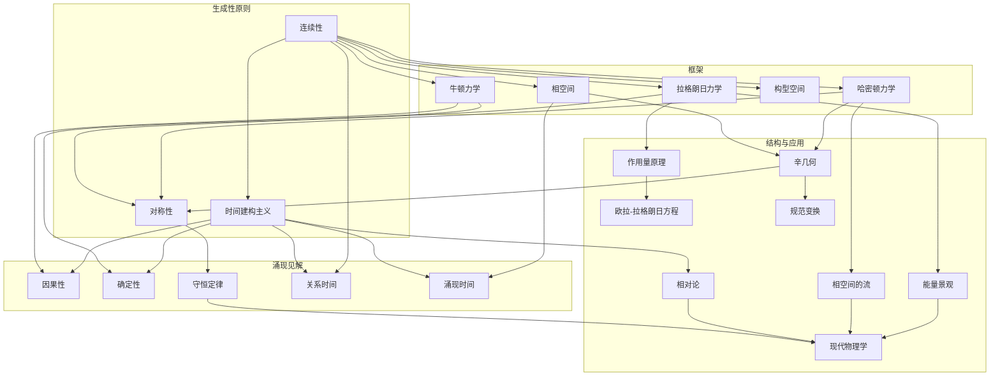

# 重构经典力学：基于核心原理的激进视角
* * *

--- 自然用结构和运动的语言说话；我们的任务是倾听、抽象和重构。

# **1. 引言：重构的需求**

*"力学的基础不在于方程，而在于塑造它们的原则。"*

经典力学常被誉为物理科学的基石，是几个世纪智力劳动的产物。从牛顿定律的广泛见解到拉格朗日和哈密顿力学的精致优雅，它为人类提供了一个理解运动、力和能量的强大框架。然而，尽管取得了巨大的成功，经典力学并不是一个无缝、单一的整体结构，而是由历史发展、不断演变的直觉和数学形式主义编织而成的拼凑挂毯。为了真正理解其本质，我们必须面对它的层次复杂性，质疑其假设，并最终重新想象其基础。

## **1.1. 经典力学的历史层次**

经典力学不是一种单一的统一语言，而是多种重叠方言的融合。牛顿力学以其对力和加速度的直接诉求，用因果关系的语言表达。它提供了一种直观且实用的方法来描述运动，基于物理世界的实际体验。然而，随着对更深层次理解的追求，这种语言也在演变。

18 和 19 世纪见证了分析力学的出现，这是一种更加抽象和精细的方言。拉格朗日力学将焦点从力转移到能量，引入了最小作用量原理 —— 这一深刻的见解将力学与更广泛的物理理论联系起来。哈密顿力学则揭示了相空间的辛几何结构，揭示了控制系统演化的隐藏对称性和不变性。每种这些表述都带来了新的视角和工具，但也引入了分裂。这些框架是如何统一的？它们共同表达了哪些更深层次的真理？这些问题在传统的叙述中仍未解决。

## **1.2. 调和的挑战**

尽管取得了成功，经典力学仍面临需要更深层次审视的挑战。首先，其多种表述方式 —— 牛顿力学、拉格朗日力学、哈密顿力学 —— 往往显得互不相关，各自需要自己的假设和数学机制。为什么如此不同的方法都能描述相同的物理现象？是否存在一种统一原则支撑着它们，还是它们只是人类发明的产物？

其次，经典力学的数学结构虽然强大，但常常掩盖了其概念核心。构型空间、相空间、辛流形 —— 所有这些构造都是为了形式化力学，但它们可能感觉与它们所代表的直观真理脱节。这些结构是自然固有的，还是我们施加于自然之上的知识支架？这种形式与直观之间的张力仍然未解决。

最后，经典力学虽然具有确定性和优雅性，但在表达时间及其因果关系的核心角色时往往显得吃力。在传统表述中，时间被视为被动参数，是运动展开的无声背景。但这真的足够吗？如果时间本身是系统演化的积极参与者，是与运动和因果关系一同出现的结构呢？

## **1.3. 重构的机会**

为了解决这些挑战，我们提出对经典力学进行彻底的重新思考 —— 将其剥离至概念本质并从第一原则重建。这种重构并不寻求抛弃过去的广泛知识和见解，而是围绕一组最小的生成原则重新组织它们。通过识别整个力学大厦可以从中涌现的种子，我们旨在揭示其作为连贯一致框架的真实性质。

这里的机遇是深远的。通过重构经典力学，我们可以实现几个目标：
1. **统一**：识别统一牛顿力学、拉格朗日力学和哈密顿力学的深层原则，揭示它们共享的概念基础。
2. **清晰度**：简化力学的语言和结构，使其核心思想更加易于理解和直观，而不牺牲严谨性。
3. **生成性**：提供一个不仅能解释现有现象，还能激发关于运动、能量和因果关系的新思维方式的框架。
4. **洞察力**：阐明经典力学与其他物理学领域(从量子力学到广义相对论)之间的联系，开辟通往新发现的道路。

本文档不仅仅是一个学术练习。它是对重新思考、质疑和想象的邀请。通过拥抱自然内在的简单和优雅，我们可以将经典力学重建为一个活生生、呼吸着的框架 —— 一个随着我们对宇宙的理解而进化的框架。

## **1.4. 构建未来的旅程**

在接下来的章节中，我们将开始这一重构之旅，从连续性、极值性、对偶性、对称性和时间建构主义等基础原则出发。这些原则不是传统意义上的公理，而是生成性的想法 —— 概念的种子，在经典力学的广阔景观中成长。我们将从这些原则向外构建，一层层地探索它们如何产生定义该领域的方程、结构和解释。

这个过程既是分析的也是哲学的，结合了数学的精确性和物理推理的直觉。在此过程中，我们将挑战假设，面对悖论，并寻求更深层次的见解。我们的目标不仅仅是理解经典力学，而是重新想象它，揭示其作为一个动态的、自我涌现的系统的本质。

经典力学不仅仅是一系列方程和定律的集合。它是自然界结构和运动的深刻表达 —— 物理世界与人类思维之间的对话。重构它就是重新发现它的灵魂。

让我们开始吧。

# **2. 核心生成原则**

*"从最小的原则中产生出无限的运动和结构世界。"*

当经典力学被提炼到其本质时，它揭示了自己并非一系列分散的规则和方程，而是少数几个深刻生成原则的表现。这些原则不是强加于宇宙的刚性公理，而是自然内在倾向的反映，编码在系统的连续演化中。它们作为种子，一层层地构建出经典力学的庞大架构，将运动、能量和因果关系连接成一个连贯而优雅的整体。在本节中，我们将探讨这些生成原则 —— 连续性、极值性、对偶性、对称性和时间建构主义 —— 以及它们如何构成机械框架的基础。

## **2.1 连续性原则**

自然界以一种光滑的一致性展开，是一种不中断的流，抵制突然跳跃或不连续性。**连续性原则**断言物理系统的演化本质上是连续的，由构型空间和相空间中的可微轨迹所控制。这一原则反映了自然的深层一致性，在这里，因果关系和运动从先前状态无缝地涌现。

数学上，连续性体现在描述运动的函数的可微性。设系统在时间 $t$ 的构型由一组广义坐标 $q_i(t)$ 表示。连续性原则确保 $q_i(t)$ 及其速度 $\dot{q}_i(t)$ 是时间的光滑函数：
$$
q_i(t) \in C^\infty \quad \text{and} \quad \dot{q}_i(t) = \frac{dq_i(t)}{dt}.
$$
这一基础思想使得动力学方程得以形式化，确保所有物理定律尊重系统的无缝演化。当出现不连续性(例如碰撞或相变)时，需要重新考虑描述的尺度和极限，通常指向经典力学之外更深层次的物理实在。

连续性不仅仅是数学上的便利；它反映了因果关系的本质。没有它，力学的预测能力将崩溃，因为系统会变得不可预测，与先前状态脱节。

## **2.2 极值性原则**

在自然界中，过程似乎沿着优化或极值化某些量的路径展开。**极值性原则**概括了这一趋势，断言系统的动力学通过特定泛函的最小化或最大化产生。这一原则最著名的是体现在**最小作用量原理**中，该原理指出，系统在两个状态之间的轨迹是使作用量 $S$ 极值化的轨迹：
$$
S = \int_{t_1}^{t_2} L(q_i, \dot{q}_i, t) \, dt,
$$
其中 $L(q_i, \dot{q}_i, t)$ 是拉格朗日量，表示动能和势能之差：
$$
L = T - V.
$$
变分条件 $\delta S = 0$ 导致欧拉-拉格朗日方程：
$$
\frac{d}{dt} \left( \frac{\partial L}{\partial \dot{q}_i} \right) - \frac{\partial L}{\partial q_i} = 0,
$$
这些方程支配系统的运动。这一原则揭示了自然界的深刻经济性：与其仅通过力来规定运动，它表明宇宙通过优化某些整体量来运作。

极值性超越了力学，在物理学中扮演统一角色。在光学中，光沿着光学长度驻定的路径传播(费马原理)。在相对论中，测地线极值化时空间隔。这种向极值性的普遍趋势是物理法则织锦中的指导线索。

## **2.3 描述的对偶性**

经典力学以其描述系统状态的深刻对偶性为特征。一方面，我们有**构型空间**，它以位置 $q_i$ 表示系统的几何排列。另一方面，我们有**相空间**，它包含位置 $q_i$ 和动量 $p_i$，提供系统状态的更完整描述。

**描述的对偶性**反映这些空间提供的互补视角。构型空间强调约束和势能景观，而相空间捕捉能量和运动的流。这些空间之间的转换由勒让德变换介导，它连接拉格朗日量 $L$ 和哈密顿量 $H$：
$$
H(q_i, p_i, t) = \sum_i p_i \dot{q}_i - L(q_i, \dot{q}_i, t),
$$
其中 $p_i = \frac{\partial L}{\partial \dot{q}_i}$ 是共轭动量。

在相空间中，系统的演化由哈密顿方程支配：
$$
\dot{q}_i = \frac{\partial H}{\partial p_i}, \quad \dot{p}_i = -\frac{\partial H}{\partial q_i}.
$$
这种对偶性不仅仅是数学上的产物，而是几何与能量之间深刻相互作用的反映。它揭示了运动不仅关乎空间的结构，也关乎动量的流，将这些视角统一为对动力学的整体理解。

## **2.4 涌现对称性**

对称性是物理世界的隐藏建筑师，约束并塑造运动定律。**涌现对称性原则**断言对称性不仅是方程的美学特征，而且是力学结构的根本。它们直接导致守恒定律，如诺特定理所捕捉的。

对于每个作用量 $S$ 的连续对称性，存在一个守恒量。例如：
- 时间 $t$ 的平移对称性导致能量守恒。
- 空间 $q_i$ 的平移对称性导致线动量守恒。
- 旋转对称性导致角动量守恒。

数学上，这些对称性对应于拉格朗日量 $L$ 的不变性。如果 $L$ 在变换 $q_i \to q_i^\prime$ 之下不变，则存在一个守恒量 $Q$：
$$
\frac{dQ}{dt} = 0.
$$
对称性不仅仅是约束 —— 它是生成原则，揭示物理系统表观复杂性背后的深层统一和简单性。它提供了物理直觉与数学形式主义之间的桥梁，指导机械定律的构造和解释。

## **2.5 时间建构主义**

传统上被视为独立参数的时间，在**时间建构主义原则**中被重新设想为一种主动的生成过程。在这种观点下，系统的演化不仅是沿着预先存在的时间线的进展，而是作为一种构造行为，其中运动和因果关系动态实现。

这一原则挑战了牛顿力学中时间的静态解释，其中 $t$ 作为被动背景。相反，它符合将时间编织进运动结构的直觉，随着系统的展开而显现。例如，哈密顿形式主义对时间与其他变量进行对称处理，暗示其角色与其他空间坐标并无本质区别。

时间建构主义使得经典力学与现代视角保持一致，如广义相对论中的时间关系视图和量子过程的动力学解释。它邀请我们重新思考因果关系不是预定序列，而是物理相互作用共同涌现的属性。

## **2.6 结论**

核心生成原则 —— 连续性、极值性、对偶性、对称性和时间建构主义 —— 是从经典力学广阔景观生长出来的种子。它们不是独立的，而是交织在一起的，每个原则丰富并强化其他原则。它们一起提供了一个最小但深刻的基础，用于将力学重新想象为一个连贯、自我涌现的框架。在下一节中，我们将看到这些原则如何产生运动的方程和框架，揭示动力学的内在结构。

# **3. 建立内部系统：动力学与运动**

*“动力学是用原理语言写成的运动诗篇。”*

连续性、极值性、对偶性、对称性和时间建构主义这些核心原则为经典力学宏大的架构提供基础。在本节中，我们将使用这些原则推导出动力学和运动的框架 —— 包括牛顿力学、拉格朗日力学和哈密顿力学 —— 并展示它们的一致性和相互依赖性。这些框架不是孤立的表述；相反，它们是对相同基本真理的不同视角，每个都揭示系统行为的不同方面。它们共同构成经典力学的内部系统：控制运动演化的方程和结构。

## **3.1 牛顿基础**

牛顿力学代表最直观和直接的运动表述形式，基于力、惯性和加速度之间的相互作用。它概括在牛顿的三条定律中，构成了这个框架的支柱：

1. 若无外力作用，物体将保持静止或匀速直线运动状态。
2. 物体的加速度 $\vec{a}$ 与其所受合外力 $\vec{F}$ 成正比，与其质量 $m$ 成反比：
   $$
   \vec{F} = m \vec{a}.
   $$
3. 对于每一个作用力，总有一个大小相等方向相反的反作用力。

### **3.1.1 力与惯性：互动的语言**
牛顿力学通过系统对外部影响的响应来描述运动。方程 $\vec{F} = m \vec{a}$ 概括了这种互动，通过惯性(质量 $m$)将运动的几何(加速度 $\vec{a}$)与运动的原因(力 $\vec{F}$)联系起来。

此框架操作于**构型空间**，其中系统的状态由其位置 $\vec{q}$ 随着时间 $t$ 的函数描述。从 $\vec{F} = m \vec{a}$ 导出的运动二阶微分方程控制轨迹 $\vec{q}(t)$：
$$
m \frac{d^2 \vec{q}}{dt^2} = \vec{F}.
$$

### **3.1.2 局限性与通向更高框架的桥梁**
尽管牛顿力学直观且实用，但它侧重于力和加速度，而像能量和对称性这样的深层原则则隐含不现。为了揭示这些隐藏层次，我们必须转向更抽象的表述形式：拉格朗日力学和哈密顿力学。

## **3.2 拉格朗日力学**

拉格朗日力学根据能量和作用量的优化重新定义运动，超越了局部化的力概念。它基于**最小作用量原理**，该原理断言系统在两状态之间轨迹是最小化作用量 $S$ 的那条：
$$
S = \int_{t_1}^{t_2} L(q_i, \dot{q}_i, t) \, dt,
$$
其中 $L(q_i, \dot{q}_i, t)$ 是**拉格朗日量**，定义为：
$$
L = T - V.
$$
这里，$T$ 是动能，$V$ 是系统的势能。

### **3.2.1 欧拉-拉格朗日方程**
通过对作用量 $S$ 应用变分法，我们导出**欧拉-拉格朗日方程**，它控制系统的运动：
$$
\frac{d}{dt} \left( \frac{\partial L}{\partial \dot{q}_i} \right) - \frac{\partial L}{\partial q_i} = 0.
$$
这些方程将牛顿第二定律一般化，将其嵌入到一个强调能量和运动几何的更广泛的框架中。

### **3.2.2 构型空间与约束条件**
拉格朗日力学自然地操作于**构型空间**，其中广义坐标 $q_i$ 包含系统的自由度。约束条件，如完整约束或非完整约束，可以无缝地整合进拉格朗日框架，使其对于复杂系统特别强大。

### **3.2.3 从力到能量景观**
不同于专注于力的牛顿力学，拉格朗日力学转变视角至能量。动力学被理解为系统在一个能量景观中的导航，动能和势能之间的相互作用定义了轨迹。

## **3.3 哈密顿力学**

哈密顿力学代表另一个抽象飞跃，依据能量流和相空间结构重新定义运动。它基于**哈密顿函数** $H$，表示系统的总能量：
$$
H(q_i, p_i, t) = T + V,
$$
其中 $p_i = \frac{\partial L}{\partial \dot{q}_i}$ 是共轭动量。

### **3.3.1 哈密顿方程**
系统的动力学由**哈密顿方程**控制：
$$
\dot{q}_i = \frac{\partial H}{\partial p_i}, \quad \dot{p}_i = -\frac{\partial H}{\partial q_i}.
$$
这些方程在**相空间**中描述系统的演化，其中状态由位置 $q_i$ 和动量 $p_i$ 共同表征。

### **3.3.2 辛结构与流**
哈密顿力学揭示相空间的**辛结构**，其中系统的流由守恒量和不变性控制。辛形式 $\omega$ 确保相空间轨迹保持体积，反映信息的守恒：
$$
\omega = \sum_i dq_i \wedge dp_i.
$$

### **3.3.3 能量作为中心角色**
在哈密顿力学中，能量占据中心地位，通过哈密顿函数决定系统的演化。这一视角强调运动与能量的互联性，提供了对系统动力学的更深理解。

## **3.4 表述间的交互**

牛顿力学、拉格朗日力学和哈密顿力学不是竞争性的框架，而是同一基本原理的互补性表述。每个提供一个独特的视角来理解运动：

1. **牛顿力学**：力和加速度的语言，提供一种关于运动的直观和局部视角。
2. **拉格朗日力学**：能量和作用量的语言，强调轨迹的整体优化。
3. **哈密顿力学**：相空间和能量流的语言，揭示动力学的深层次结构和对称性。

这些表述通过数学变换相互连接：
- **勒让德变换**架起拉格朗日和哈密顿表述之间的桥梁。
- 欧拉-拉格朗日方程在拉格朗日框架内一般化了牛顿定律。

### **3.4.1 由生成性原则统一**
这些框架的统一在于它们共享的核心生成性原则：
- **连续性**确保构型空间和相空间中的光滑轨迹。
- **极值性**控制作用量和能量的优化。
- **对偶性**将构型空间与相空间连接起来。
- **对称性**通过守恒定律约束和组织运动。
- **时间建构主义**强调随着时间的运动的动力学实现。

这些框架共同构成一个连贯的内部系统，每个都照亮经典力学不同但和谐的一个方面。

## **3.5 结论**

由牛顿力学、拉格朗日力学和哈密顿力学构建的经典力学内部系统，反映其基础原则的丰富性和一致性。这些框架并非孤立的筒仓，而是相互关联的表述，每个都通过不同的数学和概念透镜揭示相同的底层真理。在接下来的部分中，我们将探讨这些框架如何扩展到高级结构，揭示支撑运动机制的深层几何和拓扑。

# **4. 高级结构：构型空间与相空间**

*“几何将运动和能量的线索编织在一起。”*

经典力学的框架 —— 牛顿力学、拉格朗日力学和哈密顿力学 —— 不仅仅是代数构造；它们深深植根于几何和拓扑学。这些动力学展开的底层空间 —— **构型空间**和**相空间** —— 编码运动的结构和辛本质。这些高级结构不仅是数学抽象，而且是理解位置、动量、约束和能量流相互关联的基本工具。本节深入探讨经典力学的几何和拓扑基础，最终形成由辛流形提供的统一视角以及支撑机械系统的对偶性。

## **4.1 构型空间**

任何机械系统的核心是其**构型空间**，即表示系统所有可能位置或构型的数学空间。如果一个系统有 $n$ 个自由度，其构型空间是一个 $n$ 维流形，记作 $Q$。每个点 $q \in Q$ 对应系统的唯一排列。

### **4.1.1 几何表示**
构型空间由广义坐标 $q_i$ 构成，描述系统的位置：
$$
q = (q_1, q_2, \dots, q_n).
$$
例如：
- 在三维空间中运动的一个粒子有 $Q = \mathbb{R}^3$。
- 双摆的构型空间是一个环面流形，$Q = S^1 \times S^1$，反映其角度自由度。

### **4.1.2 约束与子流形**
物理系统通常受到约束，这会降低构型空间的有效维度：
- **完整约束**：这些是形式为 $f(q_1, q_2, \dots, t) = 0$ 的代数约束，将运动限制在 $Q$ 的子流形上。
- **非完整约束**：这些涉及不等式或微分约束，不能整合为代数方程，给系统的几何带来复杂性。

构型空间为拉格朗日力学提供自然背景，其中系统的轨迹是在 $Q$ 上由最小作用量原理决定的曲线 $q(t)$。然而，要完全捕捉动力学，我们必须扩展到相空间。

## **4.2 相空间**

**相空间**是哈密顿力学操作的场所，包含系统的位形和动量。对于具有 $n$ 个自由度的系统，相空间是一个 $2n$ 维流形，记作 $T^*Q$，即构型空间的**余切丛**。

### **4.2.1 相空间的结构**
相空间中的一个点由以下给出：
$$
z = (q_1, \dots, q_n, p_1, \dots, p_n),
$$
其中 $q_i$ 是广义坐标，$p_i$ 是共轭动量：
$$
p_i = \frac{\partial L}{\partial \dot{q}_i}.
$$
相空间提供系统的更丰富描述，不仅编码其构型还编码其能量状态。系统在相空间中的演化由哈密顿方程控制：
$$
\dot{q}_i = \frac{\partial H}{\partial p_i}, \quad \dot{p}_i = -\frac{\partial H}{\partial q_i}.
$$

### **4.2.2 拓扑洞察**
相空间揭示动力学系统的深层结构：
- **轨迹**：系统在相空间中的路径代表其随着时间的演化。
- **能量表面**：对于具有守恒能量的系统，运动被限制在相空间中的 $2n-1$ 维超曲面上，由 $H(q, p) = E$ 定义。
- **不变体积**：刘维尔定理指出，相空间中任意区域的体积在哈密顿方程的流之下保持不变，反映了系统的辛性质。

相空间作为构型空间的几何直觉与哈密顿力学的能量中心观点之间的桥梁。其辛结构支撑定义机械系统的守恒定律和不变性。

## **4.3 辛流形**

几何与力学之间的深层相互作用在**辛流形**框架中得到充分体现，该框架为相空间提供数学基础。一个辛流形 $(M, \omega)$ 是一个光滑流形 $M$，配备一个非退化的闭合 2-形式 $\omega$，称为**辛形式**。

### **4.3.1 辛形式与动力学**
辛形式 $\omega$ 编码相空间的几何结构：
$$
\omega = \sum_{i=1}^n dq_i \wedge dp_i.
$$
这个形式定义相空间中的守恒体积元素，并控制哈密顿流：
$$
\iota_X \omega = dH,
$$
其中 $X$ 是哈密顿向量场。相空间的辛性质确保动力学在典范变换之下的不变性，保持了几何结构。

### **4.3.2 典范变换**
典范变换是保持辛形式 $\omega$ 不变的相空间映射：
$$
\phi^* \omega = \omega.
$$
这些变换揭示系统的不变性和对称性，允许简化并深入了解其行为。

## **4.4 对偶性与结构**

构型空间与相空间之间的对偶性构成经典力学的核心。虽然构型空间 $Q$ 捕捉几何约束和自由度，而相空间 $T^*Q$ 提供能量和动力学背景。这种对偶性体现在拉格朗日和哈密顿表述之间的关系中，以**勒让德变换**为中介：
$$
H(q, p) = \sum_i p_i \dot{q}_i - L(q, \dot{q}).
$$

### **4.4.1 几何上的统一**
余切丛 $T^*Q$ 将构型空间和相空间统一为一个单一的几何结构，其中：
- 基流形 $Q$ 表示位置。
- 纤维 $T_q^*Q$ 表示动量。

这一统一视图突显运动和能量的相互联系，揭示支配动力学的深层对称性和不变性。

### **4.4.2 拓扑与全局结构**
构型空间和相空间的全局拓扑影响运动本质：
- 具有非平凡拓扑的系统(如环面上的摆)表现出约束和对称性，塑造其动力学。
- 拓扑不变量，如缠绕数或陈类，提供关于系统稳定性和行为的见解。

## **4.5 结论**

构型空间和相空间的高级结构，通过辛流形框架统一，形成经典力学的几何和拓扑骨架。这些结构不仅仅是数学工具，而是反映自然界固有的深层次秩序和对称性。它们揭示了将运动、能量和约束结合成一个连贯整体的隐藏架构。在下一节中，我们将探讨这些结构如何产生对称性和守恒定律，揭示支配机械系统的隐藏秩序。

# **5. 对称性与守恒：隐藏的秩序**

*“在对称中，我们找到了自然界法则的指纹。”*

对称性是经典力学的核心，不是作为一种装饰性特征，而是作为深刻的原则，它支配着物理定律的结构。它约束动力学，揭示复杂性中的深层次秩序，并作为抽象数学世界与自然现象之间的桥梁。对称性产生守恒定律，这些持久不变量锚定时间上的运动。基于构型空间和相空间的几何和拓扑结构，本节探讨对称性的深远影响，最终得出诺特定理，该定理形式化了不变性和守恒之间的联系。然后我们将深入探讨实际应用，展示对称性如何从摆到行星轨道及更广泛的尺度上揭示物理系统的行为。

## **5.1 对称性的意义**

对称性本质上反映在变换之下的不变性。在经典力学中，对称性意味着当系统受到特定变换(无论是空间、时间或内部变换)时，某些性质保持不变。这种不变性不仅仅是美学原则；它是结构的基石，约束着描述运动的方程。

### **5.1.1 对称性的类型**
1. **空间对称性**：
   - **平移对称性**：在空间位置 $\vec{r} \to \vec{r} + \vec{a}$ 之下的不变性。
   - **旋转对称性**：围绕轴的旋转之下的不变性，由形如 $\vec{r} \to R\vec{r}$ 的变换描述，其中 $R$ 是旋转矩阵。

2. **时间对称性**：
   - **时间平移**：在时间 $t \to t + \Delta t$ 之下的不变性。

3. **内部对称性**：
   - 系统固有的对称性，例如在内部参数或广义坐标变化之下的不变性。

### **5.1.2 作为约束的对称性**
对称性减少系统的自由度并简化其描述。例如：
- 具有绕某一轴旋转对称性的系统不能表现出违反此对称性的运动(例如，绕该轴的角动量必须守恒)。
- 平移对称性意味着不存在优先的空间位置，导致线动量的守恒。

因此，对称性既是约束也是组织原则，将自然的基本不变性编码到力学的数学框架中。

## **5.2 诺特定理**

对称性与守恒定律之间的深刻联系由埃米·诺特于 1918 年正式提出。诺特定理揭示作用量 $S$ 的每一个连续对称性都对应一个守恒量。这一结果统一了看似不同的现象 —— 如能量、动量和角动量的守恒 —— 在一个单一的普遍原则之下。

### **5.2.1 诺特定理的数学表述**
考虑具有作用量 $S$ 的系统，定义为：
$$
S = \int_{t_1}^{t_2} L(q_i, \dot{q}_i, t) \, dt,
$$
其中 $L$ 是拉格朗日量。如果作用量 $S$ 在连续变换 $q_i \to q_i^\prime$ (例如平移、旋转或时间偏移)之下不变，则存在一个守恒量 $Q$，定义为：
$$
Q = \sum_i \frac{\partial L}{\partial \dot{q}_i} \delta q_i,
$$
其中 $\delta q_i$ 表示与对称变换相关的无穷小变化。

### **5.2.2 对称性与守恒的例子**
1. **时间平移对称性**：
   - $L$ 在 $t \to t + \Delta t$ 之下的不变性。
   - 对应的守恒量：**能量**。
   $$
   E = \sum_i \dot{q}_i \frac{\partial L}{\partial \dot{q}_i} - L.
   $$

2. **空间平移对称性**：
   - $L$ 在 $q_i \to q_i + a$ 之下的不变性。
   - 对应的守恒量：**线动量**。
   $$
   p_i = \frac{\partial L}{\partial \dot{q}_i}.
   $$

3. **旋转对称性**：
   - $L$ 在旋转 $q_i \to Rq_i$ 之下的不变性。
   - 对应的守恒量：**角动量**。
   $$
   \vec{L} = \vec{r} \times \vec{p}.
   $$

### **5.2.3 解释与含义**
诺特定理不仅解释守恒定律的起源，还提供一种发现新守恒量的系统方法。它建立了系统几何和动力学性质之间的基本联系，将物理行为建立在自然的不变性基础上。

## **5.3 应用与扩展**

对称性和守恒的力量超越理论优雅；它们对理解和分析物理系统具有深远的实际意义。这里，我们探讨关键应用及其更广泛的意义。

### **5.3.1 旋转系统中的角动量**
旋转对称性支撑角动量的守恒，这决定了自旋和轨道系统的行为：
- **行星轨道**：角动量守恒解释行星椭圆轨迹及其常面积速度(开普勒第二定律)。
- **刚体动力学**：陀螺仪等旋转物体的稳定性源于角动量守恒。

### **5.3.2 孤立系统中的能量守恒**
物理定律在时间平移之下的不变性导致能量守恒：
- **摆**：动能和势能之间的相互作用体现总机械能的守恒。
- **碰撞**：弹性碰撞既守恒动能也守恒动量，使得能够精确预测碰撞后的速度。

### **5.3.3 现代扩展**
对称性原理扩展到经典力学之外，在现代物理学中发挥核心作用：
- **量子力学**：对称性支撑控制量子态的选择规则和守恒定律。
- **相对论**：狭义相对论中的时空间隔不变性反映洛伦兹对称性，而广义相对论则基于微分同胚不变性。
- **场论**：量子场论中的规范对称性产生基本力，如通过 $U(1)$ 对称性的电磁力以及弱和强相互作用。

### **5.3.4 弱对称性和涌现对称性**
并非所有对称性都是精确的；有些是对近似的或涌现的：
- **对称性破缺**：系统可以表现出对称性破缺，其中基础定律保持不变，但观察到的状态并不如此(例如铁磁性、希格斯机制)。
- **涌现对称性**：在宏观尺度上，新的对称性可能从微观成分的集体行为中出现(例如流体力学、临界现象)。

## **5.4 结论**

对称性是塑造经典力学定律的隐藏秩序，约束运动同时揭示了几何、动力学和守恒之间的深层联系。通过诺特定理，我们理解到守恒定律并非任意产生，而是直接源自于自然的不变性。这些原则奠定物理系统的稳定性和可预测性，提供通向现代物理学和新探索领域的桥梁。在下一节中，我们将探讨时间和因果关系的作用，使得运动图景作为动力学的、时间性的构造更加完整。

# **6. 时间演化与因果关系**

*“时间不是背景 —— 它是实在表演的舞台。”*

时间是经典力学中无声的建筑师，协调运动的流并将事件的进程编码到实在的结构中。然而，其角色往往被忽视，被视为一个不变的参数或动力学展开所依赖的被动媒介。本节重新审视时间的角色，从牛顿力学中的传统解释转向通过**时间建构主义**的更细致理解，其中时间成为物理系统生成和参与的元素。最后，我们探讨因果关系和决定论如何作为时间机制的结果出现，并将事件的流建立在时间演化的逻辑基础上。

## **6.1 牛顿力学中的时间**

在牛顿力学中，时间被引入为一个**绝对且独立的参数** —— 一个在所有参考标架中均匀计时的宇宙时钟。它作为描述运动的基础，在动力学方程中显式出现：
$$
\vec{F} = m \frac{d^2 \vec{r}}{dt^2}.
$$

### **6.1.1 作为独立参数的时间**
牛顿力学中的时间是绝对的，意味着它对所有观察者以相同的方式流动，独立于它们的运动状态。这一概念允许将系统的状态描述为时间 $t$ 的函数，其中粒子的轨迹由 $\vec{r}(t)$ 给出，其速度和加速度则作为时间导数得出：
$$
\vec{v}(t) = \frac{d\vec{r}}{dt}, \quad \vec{a}(t) = \frac{d^2\vec{r}}{dt^2}.
$$
这种对时间的看法简化了机械定律的表述，使得可以精确地描述系统的演化。然而，它将时间视为被动的背景，而不是动力学的内在组成部分。这种解释留下了未解的问题：时间的起源是什么？它是否真正独立于其所支配的物理系统？

### **6.1.2 绝对时间的局限性**
虽然牛顿时间的概念简单明了，但它施加了一个刚性结构，无法解释时间、运动和能量之间的深层相互依赖性。例如：
1. **不可逆性**：牛顿力学是时间对称的，不提供过去和未来的内在区别。然而，在物理系统中，时间箭头通过熵和热力学过程显现。
2. **关系本质**：时间的独立性与关系观点相矛盾，后者认为时间源于物理系统的相互作用和变化。

为了超越这些局限，我们必须重新思考时间，将其视为一种固定参数，而是作为一种由其帮助塑造的动力学过程中产生的构造。

## **6.2 时间建构主义**

时间建构主义代表了对时间解释的范式转变，将其框架化为一个不是预先存在的维度，而是一个**活跃且生成的过程**，该过程源自系统的演化。这一观点与经典和量子物理学的现代见解一致，其中时间越来越被视为关系性和涌现性的。

### **6.2.1 作为关系构造的时间**
在时间建构主义中，时间不是外部背景，而是系统内部变化的度量。它由状态的进展定义，其中“时间的流”成为物理量之间演变关系的反映。数学上，这可以表示为：
$$
t \sim \phi(\text{change}),
$$
其中 $\phi$ 是一个映射，将系统的内部变化(如运动、能量转移)与时间参数相关联。

例如，在简谐振子中，位置和动量的周期性变化定义一个独立于外部时间的自然“时钟”。系统根据其自身的内在节奏演化，表明时间嵌入在动力学中。

### **6.2.2 动力学中的涌现**
时间建构主义认为时间作为运动、能量和因果关系的结果而出现：
1. **运动作为时间的生成元**：粒子在空间中的进展定义时间间隔。没有运动，时间的概念将失去意义。
2. **能量流与时序方向**：能量交换决定演化的步伐，将时间与驱动变化的动力学过程联系起来。
3. **因果关系作为时间框架**：事件之间的因果关系建立时间和结构，其中原因先于结果。

这一观点与哈密顿力学的表述一致，时间对称地作为许多变量之一进入其中。哈密顿量 $H$ 通过方程控制演化：
$$
\frac{dq_i}{dt} = \frac{\partial H}{\partial p_i}, \quad \frac{dp_i}{dt} = -\frac{\partial H}{\partial q_i}.
$$
这里，时间不是驱动力，而是编码位置 $q_i$ 和动量 $p_i$ 之间关系展开的参数。

## **6.3 因果关系与决定论**

经典力学嵌入一个决定论的世界观，即任意给定时间的系统状态唯一确定其未来和过去。这种决定论与时间和因果关系的作用紧密交织，后者排序事件序列及其相互依赖性。

### **6.3.1 经典力学中的因果关系**
经典力学中的因果关系是指系统的当前状态决定其未来演化。这通过微分方程的初值问题数学表达：
$$
\vec{F} = m \frac{d^2 \vec{r}}{dt^2}, \quad \vec{r}(t_0) = \vec{r}_0, \quad \vec{v}(t_0) = \vec{v}_0.
$$
给定初始条件 $\vec{r}_0$ 和 $\vec{v}_0$ 在时间 $t_0$，运动方程预测未来所有时间 $t > t_0$ 的轨迹 $\vec{r}(t)$。

### **6.3.2 因果关系的流**
因果关系提供了将时间解释为一系列链接事件的框架：
1. **时间顺序**：事件按顺序组织，早期状态影响后期状态。
2. **局部性**：原因在其附近产生效果，随时间在系统中传播。
3. **可预测性**：决定论定律确保系统的演化是可预测的，前提是已知初始条件。

### **6.3.3 对决定论的挑战**
尽管经典力学暗示了一个决定论的宇宙，但某些现象挑战了这一观点：
- **混沌**：在混沌系统中，初始条件的微小变化导致轨迹指数发散，限制了实际可预测性，尽管理论上是决定论的。
- **时间不可逆性**：运动的基本方程是对称的，但宏观过程表现出明确的时间箭头，引发了关于不可逆性如何出现的问题。

这些挑战指出了需要更深入理解时间与因果关系如何相互作用，特别是在具有许多自由度的系统背景下。

## **6.4 结论**

时间远非被动的背景，而是一个动力学的关系构造，从物理系统的演化中涌现。在牛顿力学中，它作为一个绝对参数存在，但时间建构主义揭示其作为与运动、能量和因果关系相关的生成过程的更深层次角色。时间的流为决定论提供框架，将原因与结果联系起来并构建系统的演化。这种对时间和因果关系的探索完成了我们对经典力学基础原则的重新审视，为进一步拓展现代物理学的新领域奠定了基础。

# **7. 结论与新视野**

*“重建过去就是为未来照亮道路。”*

经典力学不仅仅是一组方程；它是人类抽象、综合并形式化运动和变化原则的深刻证明。在本文档中，我们试图重建其框架，剥离历史层次和数学形式主义，揭示其核心的生成原则。通过将力学的大厦建立在**连续性**、**极值性**、**对偶性**、**对称性**和**时间建构主义**的基础上，我们形成了一种统一其不同表述的愿景，并开辟了通往更深层次见解和联系的道路。

在这一结论部分，我们将综合重建的框架，探讨其对现代物理学的影响，并规划未来研究的潜在方向。目标不仅是反思已取得的成就，而是照亮地平线，在那里经典思想模糊地融入量子、相对论甚至涌现范式。

## **7.1 重建框架的一致性**

重建的经典力学框架作为一个整体而存在，基于一组概念深刻且数学稳健的基本原则构建。每个原则都为力学的架构做出贡献，它们之间的相互联系确保了一个统一且生成性的结构：

1. **连续性**确保系统的光滑演化，将确定性运动流锚定在可微分轨迹上。
2. **极值性**捕捉自然界的优化倾向，揭示系统动力学作为作用量、能量或其他量的极值化出现。
3. **对偶性**连接构型空间和相空间，提供位置和动量、能量和几何互补视角。
4. **对称性**约束和组织动力学，通过诺特定理将不变性与守恒定律联系起来。
5. **时间建构主义**重新构想时间为从运动和因果关系中产生的涌现性关系构造，而不是被动的背景。

通过整合这些原则，我们恢复了牛顿、拉格朗日和哈密顿力学表述作为同一基本真理的不同表达。曾经看似碎片化的表述现在成为一个连贯且分层的结构 —— 一个自洽的系统，反映了自然的深层秩序。

这种重建不仅仅是对经典力学的重述；它将其重新定义为一个活生生的框架，随着我们对宇宙的理解而发展。

## **7.2 对现代物理学的影响**

重建的框架揭示了经典力学并非孤立的遗迹，而是通向更深入和更全面理论的桥梁。其原则贯穿现代物理学领域，提供了连接经典和当代范式的见解和统一线索。

### **7.2.1 量子力学**
经典力学与量子力学有着深刻的结构和概念联系：
- **极值原理**体现在经典作用量中，预示量子力学中的路径积分表述，其中经典轨迹只是历史总和中的一个贡献。
- **对偶性**在构型空间和相空间之间架起桥梁，反映量子系统中的波粒二象性和位置与动量的共轭关系。
- 辛几何，作为哈密顿力学的基础，为量子相空间和泊松括号到对易子对应提供数学基础。

重建的框架邀请我们将经典力学视为量子力学的一个极限情况，其中普朗克常数 $\hbar \to 0$。经典力学的生成原则成为理解量子现象出现的概念脚手架。

### **7.2.2 相对论**
重建还揭示了经典力学作为相对论的前奏，其原则自然延伸至相对论背景：
- **连续性**和**极值性**无缝过渡到广义相对论的时空框架，其中测地线极值化时空间隔。
- **时间建构主义**中的时间关系性质与相对论中时间作为一个动力学和观察者依赖的量一致，由时空曲率塑造。
- 对称性，特别是洛伦兹不变性，成为相对论动力学的组织原则，决定物理定律的形式。

因此，经典力学作为相对论的一个极限情况，其中光速 $c \to \infty$。其重建框架突显了这些领域之间的深层概念连续性。

### **7.2.3 涌现与复杂系统**
超越传统物理学的边界，经典力学的原则在涌现代和复杂系统的研究中找到了新的相关性：
- **对称破缺**和**涌现对称性**为理解相变提供了工具，从物质的结晶到生物和社会系统中的集体行为出现。
- **连续性**和**极值性**之间的相互作用支撑了自组织原则，系统演变为优化能量的流或熵产生的状态。
- **时间建构主义**提供了一个探索非平衡系统的框架，其中时间和因果关系从相互作用中动态地涌现。

重建将经典力学不仅定位为粒子和力的理论，而且是跨尺度和学科理解系统的通用框架。

## **7.3 开放问题与未来方向**

虽然重建的框架提供了清晰度和统一性，但它也提出了需要进一步探索的深刻问题。这些问题位于经典力学的边界处，其原则与量子、相对论和涌现现象交汇。

### **7.3.1 时间的本质**
时间建构主义挑战我们重新思考时间本身。如果时间是关系性和涌现性的，什么控制远离平衡系统的流？经典时间概念如何过渡到量子系统中概率性和纠缠的时间性质？时间是否可能是更深层次的、永恒的基质的涌现属性？

### **7.3.2 对称性及其破缺**
尽管对称性解释了经典力学的大部分结构，对称破缺现象开启了新的问题：
- 破裂的对称性如何编码从经典到量子行为的转变？
- 对称破缺在宏观现象(如湍流或生命)的出现中扮演什么角色？

### **7.3.3 自然中的极值性与优化**
极值原理表明自然界通过优化运作，但该原理的范围仍然开放：
- 是否存在比作用量和能量更深的量 —— 自然界会使其达到极值？
- 在随机或混沌动力学系统中，极值性如何推广？

### **7.3.4 经典与量子之间的桥梁**
重建的框架为量子力学提供了概念桥梁，但仍有显著差距：
- 经典决定论概念如何让位于量子领域的概率性质？
- 经典力学的生成原则能否激发量子及后量子理论的新形式？

## **7.4 未来的愿景**

经典力学的真正力量不在于其终结性，而在于其生成性。重建的框架邀请我们将力学视为一个动态的且不断发展的系统，能够激发新理论和观点。通过将力学建立在少量但深刻的原则基础上，我们创造了一个开放式的基础，能够适应新发现和范式。

展望未来，经典力学可以作为重建其他物理学领域的模板，从热力学到量子场论。其原则 —— 连续性、极值性、对偶性、对称性和时间建构主义 —— 不限于力学，而是贯穿整个物理探究谱系。它们提醒我们，宇宙在其核心是一个关系系统，被结构所束缚，同时充满了可能性。

## **7.5 结论**

重建经典力学就是重新发现其本质作为反映自然深层秩序和简单性的体现。它是看到宇宙不是一个孤立部分的集合，而是一个连贯且相互关联的整体，在这个整体中，运动、能量和因果关系从几个生成原则中无缝流出。这种重建不是故事的结束，而是新篇章的开始 —— 一个桥接经典和现代物理学、统一抽象与直觉、打开未探索思维领域的门扉。

重建之旅最终是一种创造行为。通过回顾力学的基础，我们为前进的道路照明 —— 朝着更深入理解宇宙及其内部位置的方向迈进。

# **附录A：核心概念及其相互关系**

*“要理解整体，我们必须首先阐明其各部分之间的联系。”*

本附录提供在文档中探讨的核心原则和概念的结构化综合，强调它们在重建的经典力学框架中的相互依赖性和角色。通过绘制这些关系图，我们旨在提供清晰度和洞察力，了解生成性原则 —— 连续性、极值性、对偶性、对称性及时间建构主义 —— 如何作为理论架构及其涌现结构的基础。此附录旨在补充正文，为深入探讨所提出的思想提供概念路线图。

## **A.1 核心概念的关系表**

下表总结了经典力学的基础原则、关键框架和涌现结构之间的关系。每个原则作为一个生成节点，影响系统的多个方面。

| **核心原则**               | **关键作用**                                                                                      | **相互关系**                                                                                                                                                                                                                                                                                                                                                         | **涌现结构**                                                                                                                                                                                                                              |
|-----------------------------|--------------------------------------------------------------------------------------------------|-----------------------------------------------------------------------------------------------------------------------------------------------------------------------------------------------------------------------------------------------------------------------------------------------------------------------------------------------------------------------------|-----------------------------------------------------------------------------------------------------------------------------------------------------------------------------------------------------------------------------------------------|
| **连续性**                  | 确保物理系统的平滑演化。                                                                       | - 为构型空间和相空间中的可微轨迹提供基础。 - 在牛顿、拉格朗日和哈密顿框架中实现确定性因果关系。 - 通过将时间编码为连续参数直接连接到时间建构主义。                                                                                                                                                                                                                 | - 动力学方程(牛顿定律、欧拉-拉格朗日方程、哈密顿方程)。 - 构型空间和相空间作为可微流形。                                                                                                                                                |
| **极值性**                  | 将运动视为优化过程，最小化或最大化关键量。                                                     | - 形成最小作用量原理(拉格朗日力学)的基础。 - 控制相空间轨迹的结构(哈密顿力学)。 - 通过揭示诺特定理中的守恒量与对称性相连。                                                                                                                                                                                                                                  | - 作用泛函和欧拉-拉格朗日方程。 - 定义轨迹的能量景观。 - 连接到广义相对论中的测地线和量子力学(路径积分)。                                                           |
| **描述的对偶性**            | 连接构型空间和相空间视角。                                                                     | - 通过勒让德变换连接拉格朗日和哈密顿力学。 - 提供运动的互补视图：几何约束(构型空间)和能量的流(相空间)。 - 对称性作为两个空间中共有的属性出现。                                                                                                                                                                                                             | - 勒让德变换。 - 辛几何。 - 哈密顿动力学描述的相空间的流。                                                                                                              |
| **对称性**                  | 通过对称不变性组织和约束运动。                                                                 | - 直接通过诺特定理与守恒定律(如能量、动量、角动量)相连。 - 从构型空间和相空间的结构中出现。 - 通过哈密顿力学中的规范变换实现动力学简化。                                                                                                                                                                                                                       | - 守恒定律。 - 辛不变性和刘维尔定理。 - 通过规范对称性应用于量子力学和场论。                                                                                             |
| **时间建构主义**            | 重新想象时间为一种涌现的和关系性的构造。                                                       | - 通过将时间视为与运动相关的动力学参数与连续性相关联。 - 将因果性和确定性框定为演化系统的涌现性质。 - 延伸至相对论，其中时间是观察者依赖的并与空间整合。 - 通过系统向优化状态的动力演化与极值性相连。                                                                                                                                                         | - 作为关系框架的时间顺序(因果性)。 - 在哈密顿力学中的时间变量整合。 - 转变为相对论和量子时间构造(如时空、纠缠)。                                                   |

## **A.2 概念相互依赖关系图**

下图直观表示核心原则、关键框架和涌现结构之间的相互关系。该图突显了这些原则如何交互以生成经典力学的整体系统。

## **A.3 关键观察**

1. **连续性作为基础**：
   连续性几乎支撑了经典力学的所有方面，确保轨迹光滑且因果关系确定。其影响跨越框架(牛顿、拉格朗日、哈密顿)，甚至延伸至时间建构主义。

2. **极值性与优化**：
   极值原理作为统一线索出现在拉格朗日和哈密顿力学中。它将作用量原理、能量景观以及在测地线和量子路径积分中看到的优化过程联系起来。

3. **对偶性作为桥梁**：
   构型空间和相空间之间的对偶性提供互补视角，将几何约束与能量动力学结合。勒让德变换作为数学桥梁，而辛几何确保一致性。

4. **对称性作为建筑师**：
   对称性作为隐藏的建筑师，通过诺特定理组织运动和不变性。其生成能力扩展到守恒定律以及现代物理学，包括量子力学和相对论。

5. **时间建构主义与因果性**：
   时间被重新构想不是背景而是从运动和能量中涌现的动力学构造。这种重新解释使经典力学与现代物理学保持一致，将确定世界观与关系性和涌现的时间概念联系起来。

## **A.4 最后的反思**

通过绘制这些原则、框架和结构，我们可以看到重建的经典力学框架并不是分散概念的集合，而是一个统一且生成的系统。每个原则都丰富其他原则，创建了一个反映自然界法则内在一致性的相互依赖网络。此附录作为导航文档核心思想的指南，强化了经典力学作为一个不断演变、相互关联框架的愿景。
