# The Philosophical Foundations of Classical Mechanics
* * *

--- Classical mechanics is not merely a science of motion but a philosophy of reality, symmetry, and purpose.

# **I. Introduction: Rethinking Classical Mechanics**  
**Epigraph**: *"Mechanics is not just the study of motion—it is the exploration of reality’s principles."*

## **I.1. The Dual Identity of Classical Mechanics**

Classical mechanics has long stood as one of the most elegant and enduring achievements of human thought. At its core, it is a framework for describing and predicting motion, rooted in the physical laws first formalized by Isaac Newton. Yet classical mechanics is more than a collection of equations; it is a philosophical lens through which we explore the very fabric of reality.

For centuries, classical mechanics has served as the bridge between human intuition and the mathematical precision of nature. It is the science of motion, but also a testament to the interplay of symmetry, causality, and conservation. Beneath its technical formulations lies a profound narrative of existence, one that speaks to the principles that govern not only motion but also the structure of reality itself.

## **I.2. Beyond the Technical: Mechanics as Philosophy**

While classical mechanics is often regarded as a technical discipline—a means to calculate trajectories, forces, and energies—it is, at its heart, deeply philosophical. It raises questions that transcend its immediate applications:  
- Why does nature favor certain paths over others?  
- What is the relationship between force, energy, and motion?  
- Is force fundamental, or is it emergent?  
- How do symmetry and invariance shape the laws of physics?  

These questions are not merely academic; they touch upon the nature of knowledge (epistemology), the purpose inherent in physical laws (teleology), and the fundamental structure of existence (ontology). To truly understand classical mechanics, we must move beyond its surface-level utility and engage with these deeper, more philosophical dimensions.

## **I.3. The Central Question**

The central question driving this exploration is simple yet profound:  
*What is the deeper essence of classical mechanics?*

This question invites us to reconsider classical mechanics not as a static framework but as a dynamic, evolving philosophy. It challenges us to think beyond the equations and numbers and to uncover the principles that give mechanics its universality and power.

To address this question, we will adopt three complementary philosophical perspectives:  
1. **Teleology**: What purpose or directionality underlies the laws of motion?  
2. **Epistemology**: How has our understanding of mechanics evolved, and what does this reveal about the nature of knowledge?  
3. **Ontology**: What is the nature of force, motion, and reality as described by classical mechanics?

## **I.4. The Philosophical Foundations of Classical Mechanics**

To unravel the essence of classical mechanics, we will explore its evolution and reinterpret its core concepts from these philosophical perspectives.

1. **Teleology**:  
   Motion, as described by classical mechanics, is guided by optimization principles, such as the Principle of Least Action. This teleological perspective suggests that nature operates with purpose, selecting paths that minimize or extremize certain quantities.  

2. **Epistemology**:  
   The progression from Newtonian mechanics to Lagrangian and Hamiltonian mechanics reflects a deepening abstraction in how we represent and understand motion. Classical mechanics is not static; it is a refinement of our epistemic frameworks, driven by the interplay of symmetry, geometry, and energy.  

3. **Ontology**:  
   Force, once considered a fundamental entity, is now understood as a secondary phenomenon, emerging from geometric and variational principles. The true essence of mechanics lies not in forces but in the structure of configuration and phase space, where motion is encoded in the geometry of reality.

## **I.5. The Structure of the Document**

This document is structured as a layered exploration of classical mechanics, moving from its philosophical foundations to its modern implications:

1. **Teleology: The Purpose of Motion**  
   We begin by examining the Principle of Least Action and the teleological interpretation of motion as optimization.  

2. **Epistemology: The Evolution of Knowledge in Mechanics**  
   Next, we trace the evolution of mechanical thought, from Newtonian forces to the abstractions of Lagrangian and Hamiltonian mechanics, revealing how mechanics encodes knowledge about the universe.  

3. **Ontology: The Reality of Force and Motion**  
   We then reinterpret force and motion as emergent phenomena, exploring their relationship to symmetry, geometry, and conservation laws.  

4. **The Unity of Symmetry, Geometry, and Action**  
   In this section, we synthesize our insights to reveal a unified philosophical framework for classical mechanics, centered on the interplay of symmetry, geometry, and action.  

5. **Beyond Classical Mechanics: Toward a New Paradigm**  
   Finally, we speculate on the future of mechanics, exploring its dissolution into quantum mechanics, general relativity, and information theory, and its role as a foundation for deeper unifying principles.

## **I.6. Why Rethink Classical Mechanics?**

The motivation for this re-examination is both intellectual and practical:  

1. **Philosophical Depth**:  
   Classical mechanics has shaped our understanding of the universe for centuries, but its philosophical implications remain underexplored. By digging deeper into its foundations, we can gain new insights into the nature of reality, motion, and causality.  

2. **Modern Relevance**:  
   Classical mechanics is not an outdated framework; it is the foundation upon which modern physics is built. Understanding its philosophical essence can illuminate the connections between classical and modern theories, from quantum mechanics to general relativity.  

3. **A New Lens on Reality**:  
   By reconstructing classical mechanics through the perspectives of teleology, epistemology, and ontology, we can develop a richer, more integrated understanding of the universe—one that bridges the gap between science, philosophy, and metaphysics.

## **I.7. Key Insights**

From the outset, we establish three guiding insights that will shape our exploration:

1. **Optimization and Purpose**:  
   Motion is not arbitrary; it is guided by principles of optimization, such as the Principle of Least Action. This reflects a deeper teleological structure within the laws of nature.  

2. **Knowledge as Abstraction**:  
   Classical mechanics evolves as a refinement of how we encode knowledge about motion, energy, and geometry. Its progression from Newtonian to Hamiltonian mechanics reflects a deepening abstraction and unification.  

3. **Reality as Geometry**:  
   The true essence of mechanics lies in its geometric foundations. Forces, constraints, and dynamics are secondary phenomena, emerging from the curvature and structure of configuration and phase space.

## **I.8. Conclusion: A Philosophical Inquiry Begins**

This introduction invites the reader to approach classical mechanics not as a static framework but as a living philosophy. By rethinking its foundations through teleology, epistemology, and ontology, we aim to uncover its deeper essence and elevate our understanding of motion, causality, and reality.

This sets the stage for the subsequent sections, where we will explore each philosophical perspective in depth, progressively building a unified vision of classical mechanics as a foundational philosophy of the universe.

# **II. Teleology: The Purpose of Motion**  
**Epigraph**: *"Nature does nothing in vain." — Aristotle*

## **II.1. The Historical Roots of Teleology in Mechanics**

Teleology, the philosophical idea that natural processes are guided by purpose or end-goals, has profound historical roots. Aristotle, in his natural philosophy, argued that all motion and change in the universe are directed toward fulfilling inherent purposes. The circular motion of the heavens, the fall of a stone, and the growth of a plant were, in his view, teleological—each driven by intrinsic goals.

While the Aristotelian worldview gave way to the mechanistic philosophy of the Scientific Revolution, the echoes of teleology lingered. Newtonian mechanics replaced "purpose" with external forces and initial conditions, emphasizing causality over intentionality. Yet, with the advent of variational principles in the 18th and 19th centuries, teleology reemerged in a subtler, more mathematical form. The Principle of Least Action, first articulated by Maupertuis and later formalized by Euler, Lagrange, and Hamilton, brought back the notion that nature selects optimal paths—a modern, mathematical teleology.

## **II.2. The Principle of Least Action**

The Principle of Least Action (PLA) is one of the most profound and unifying ideas in physics. It states that the motion of a system between two states is such that the action $S$, defined as the integral of the Lagrangian $L$ over time, is extremized (typically minimized):
$$
S = \int_{t_1}^{t_2} L(q, \dot{q}, t) \, dt.
$$
Here, $L = T - V$, the difference between kinetic and potential energy, encapsulates the system's dynamics. The PLA asserts that, out of all conceivable paths, nature "chooses" the one that optimizes the action.

### **II.2.1. Teleological Interpretation**  
The PLA introduces a teleological perspective to mechanics: motion is not merely the result of proximate causes (forces acting at each instant), but the fulfillment of a global optimization principle spanning time. In this sense, the PLA suggests that nature is "economical," selecting paths that optimize specific quantities like energy or action.

### **II.2.2. Example: The Brachistochrone Problem**  
The Brachistochrone problem, posed by Johann Bernoulli, illustrates the teleological essence of the PLA. The problem asks: *What curve minimizes the time taken for a particle to slide, under gravity, from one point to another?* The solution is a cycloid, a curve that minimizes the action functional. This example encapsulates the idea that natural motion is guided by optimization principles rather than arbitrary forces.

## **II.3. Variational Methods and Teleology**

The Principle of Least Action finds its mathematical foundation in variational methods, which provide a powerful framework for understanding teleology in mechanics. Variational calculus allows us to derive the equations of motion by requiring that the action functional be stationary (i.e., its first variation vanishes):
$$
\delta S = 0.
$$
This leads directly to the Euler-Lagrange equations:
$$
\frac{d}{dt} \left( \frac{\partial L}{\partial \dot{q}^i} \right) - \frac{\partial L}{\partial q^i} = 0,
$$
which govern the dynamics of the system.

### **II.3.1. Connection to Optimization**  
The variational approach reveals the teleological essence of motion: the equations of motion arise as conditions for extremizing the action. This is not a local principle (like Newton's laws) but a global one, integrating the entire trajectory of the system. In this way, mechanical systems are fundamentally guided by optimization, reflecting an implicit "purpose" in their motion.

### **II.3.2. Geometric Constraints and Teleology**  
In systems with constraints, such as a bead sliding on a wire or a pendulum constrained to swing in an arc, the PLA naturally incorporates the constraints into the optimization process. The resulting motion satisfies both the variational principle and the geometric constraints, further emphasizing the teleological harmony between structure and motion.

## **II.4. Implications of Teleology in Physical Laws**

The idea that nature "chooses" optimal paths has profound implications for how we understand physical laws and the universe:

1. **Global vs. Local Perspectives**:  
   Teleology introduces a global perspective, where motion is not merely the result of instantaneous forces but the outcome of a holistic principle spanning time and space. This contrasts with Newtonian mechanics, which focuses on local, causal interactions.

2. **Unification of Principles**:  
   The PLA unifies diverse phenomena under a single mathematical framework. Whether describing planetary orbits, wave propagation, or quantum systems, the PLA provides a universal principle that transcends specific physical contexts.

3. **Purpose in Nature**:  
   While the PLA does not imply conscious intent, it suggests an intrinsic "economy" in natural laws. This teleological perspective bridges the gap between metaphysical ideas of purpose and the empirical rigor of physics.

## **II.5. Teleology in Lagrangian Mechanics**

Lagrangian mechanics, as a reformulation of Newtonian mechanics, embodies the teleological essence of the PLA. By focusing on the system's energy (via the Lagrangian $L = T - V$), rather than forces, Lagrangian mechanics shifts the emphasis from local causality to global optimization.

### **II.5.1. Example: The Simple Pendulum**  
Consider a simple pendulum, where the motion is governed by the Lagrangian:
$$
L = T - V = \frac{1}{2}m\ell^2\dot{\theta}^2 - mg\ell(1 - \cos\theta).
$$
The equations of motion, derived from the Euler-Lagrange equations, describe the pendulum's oscillatory motion. However, the teleological perspective reveals that this motion is not merely caused by the force of gravity but is the result of the system minimizing its action over time.

### **II.5.2. Generalized Coordinates and Constraints**  
Lagrangian mechanics further emphasizes teleology by allowing the use of generalized coordinates $q^i$ to describe systems with constraints. The formalism naturally incorporates these constraints into the optimization process, reinforcing the idea that motion is guided by the system's intrinsic structure.

## **II.6. Geometric Constraints and Teleological Harmony**

Teleology becomes even more striking in systems with geometric constraints, where the motion is shaped by both the variational principle and the system's geometry. For example:

- A particle constrained to move on a surface follows a path determined by the geodesics of the surface, which extremize the distance traveled.  
- A charged particle in an electromagnetic field follows a trajectory that minimizes the action functional, incorporating both the field's influence and the geometric constraints of spacetime.

These examples highlight the interplay between teleology, geometry, and dynamics, where the motion arises as the harmonious fulfillment of multiple principles.

## **II.7. Teleology Beyond Classical Mechanics**

The Principle of Least Action extends far beyond classical mechanics, appearing in quantum mechanics, general relativity, and even emergent phenomena:

1. **Quantum Mechanics**:  
   In the path integral formulation of quantum mechanics, proposed by Richard Feynman, the PLA takes on a probabilistic form. Particles explore all possible paths, but the path of stationary action dominates, reflecting a teleological selection at the quantum level.

2. **General Relativity**:  
   In Einstein's theory of general relativity, the geodesic principle—the idea that objects move along paths of extremal spacetime curvature—can be seen as a manifestation of the PLA in a geometric context.

3. **Emergent Systems**:  
   In complex systems, such as biological or ecological systems, teleological principles emerge in the form of optimization processes, such as energy minimization or entropy maximization, reflecting the universality of teleological ideas.

## **II.8. Key Insights**

1. **Motion as Optimization**:  
   The Principle of Least Action reveals that motion is not arbitrary but guided by optimization principles, reflecting a deeper purpose in natural laws.

2. **Teleology in Mechanics**:  
   Variational methods and Lagrangian mechanics emphasize the global, teleological nature of motion, where dynamics are shaped by the interplay of energy, constraints, and geometry.

3. **Universality of Teleology**:  
   The teleological perspective extends beyond classical mechanics, providing a unifying principle across physics, from quantum mechanics to general relativity and emergent systems.

## **II.9. Transition to Epistemology**

Having explored the teleological foundations of classical mechanics, we now turn to its epistemological dimension. In the next section, we will examine how our understanding of motion and causality has evolved, from the forces of Newtonian mechanics to the abstractions of Lagrangian and Hamiltonian formalisms. This evolution reflects not only the refinement of mechanical knowledge but also the deepening abstraction of how we represent and understand the universe.

This section establishes the teleological essence of classical mechanics, emphasizing the Principle of Least Action as a unifying, purpose-driven principle that shapes motion across physical systems. It sets the stage for the epistemological exploration in the following section.

# **III. Epistemology: The Evolution of Knowledge in Mechanics**  
**Epigraph**: *"Mechanics is the refinement of knowing how the universe moves."*

## **III.1. The Epistemological Foundations of Classical Mechanics**

Classical mechanics is not merely a technical framework for predicting motion but a reflection of how humanity encodes and refines its understanding of nature. It represents a progression of knowledge, where each reformulation—Newtonian, Lagrangian, and Hamiltonian—marks a deeper abstraction and unification of the principles governing motion.

At its heart, this evolution is epistemological: it reveals how we have come to *know* motion, causality, and the interconnectedness of physical systems. This journey is not just about discovering laws but about developing better representations of reality, each more encompassing and insightful than the last.

## **III.2. Newtonian Mechanics: Force as a Primary Concept**

Isaac Newton’s formulation of mechanics was revolutionary precisely because it introduced a clear causal framework for motion. Newton’s second law,  
$$
\mathbf{F} = m\mathbf{a},
$$  
elevated force to the status of a primary concept. In this view, motion is caused by external forces acting on masses, and the dynamics of a system can be deduced by identifying and summing these forces.

### **III.2.1. Epistemological Significance**  
Newtonian mechanics encapsulated the knowledge of motion in terms of forces and their effects. It was intuitive, rooted in observable phenomena like pushes, pulls, and resistance. The epistemology of Newtonian mechanics was grounded in *cause and effect*, offering a framework that was both practical and predictive.

### **III.2.1. Limitations of the Newtonian Paradigm**  
However, Newtonian mechanics is not without its epistemological limitations:  
1. **Dependence on Inertial Frames**: Newton’s laws are valid only within inertial reference frames, requiring the introduction of fictitious forces in non-inertial frames (e.g., centrifugal and Coriolis forces).  
2. **Inadequacy for Complex Systems**: Newtonian mechanics struggles with systems involving constraints, distributed forces, or collective behaviors, where forces are not easily isolated or quantified.  
3. **Lack of Generality**: Newtonian mechanics is a local theory, focusing on instantaneous forces, and does not naturally encode global principles like conservation laws or symmetries.

These limitations highlight the need for a deeper epistemological framework, one that transcends forces and embraces more abstract principles.

## **III.3. Lagrangian Mechanics: Energy and Action as Knowledge**

The shift from Newtonian to Lagrangian mechanics represents a profound epistemological leap. In Lagrangian mechanics, forces are no longer primary; instead, the focus shifts to energy and the global principle of least action. The dynamics of a system are encoded in the **Lagrangian function**:  
$$
L = T - V,
$$  
where $T$ is the kinetic energy and $V$ is the potential energy.

### **III.3.1. Epistemological Advancements**  
1. **From Local to Global**:  
   Lagrangian mechanics is inherently global. It describes motion as the path that minimizes (or extremizes) the action $S$:  
   $$
   S = \int_{t_1}^{t_2} L(q, \dot{q}, t) \, dt.
   $$  
   This global perspective transcends the local, force-based causality of Newtonian mechanics, offering a more holistic understanding of motion.

2. **Energy as a Unifying Concept**:  
   By reformulating mechanics in terms of energy, Lagrangian mechanics unifies diverse phenomena under a single framework. It provides a natural way to handle constraints, symmetries, and conservation laws.

3. **Generalized Coordinates**:  
   The use of generalized coordinates $q^i$ allows Lagrangian mechanics to describe systems with complex constraints, such as those in non-Cartesian geometries. This abstraction enhances its versatility and applicability.

### **III.3.2. Example: The Double Pendulum**  
Consider a double pendulum, a system with two degrees of freedom. In Newtonian mechanics, analyzing this system requires resolving forces at each joint and accounting for mutual interactions. In Lagrangian mechanics, the system is described by two generalized coordinates $\theta_1$ and $\theta_2$, and the dynamics are derived from the Lagrangian:  
$$
L = T - V = \frac{1}{2}m_1\ell_1^2\dot{\theta}_1^2 + \frac{1}{2}m_2(\ell_1^2\dot{\theta}_1^2 + \ell_2^2\dot{\theta}_2^2 + 2\ell_1\ell_2\dot{\theta}_1\dot{\theta}_2\cos(\theta_1 - \theta_2)) - V(\theta_1, \theta_2).
$$  
This reorganization of knowledge simplifies the analysis, revealing the system’s dynamics as a consequence of its energy structure.

## **III.4. Hamiltonian Mechanics: Abstraction into Phase Space**

The transition from Lagrangian to Hamiltonian mechanics represents an even deeper epistemological shift. In Hamiltonian mechanics, the state of a system is encoded in **phase space**, where the generalized coordinates $q^i$ and conjugate momenta $p_i$ define each point. The dynamics are governed by the **Hamiltonian function**:  
$$
H = T + V,
$$  
which represents the total energy of the system.

### **III.4.1. Epistemological Advancements**  
1. **Phase Space Representation**:  
   Phase space provides a complete description of a system’s state, encompassing both positions and momenta. This dual perspective is more general and powerful than configuration space alone.

2. **Canonical Equations of Motion**:  
   The equations of motion in Hamiltonian mechanics,  
   $$
   \dot{q}^i = \frac{\partial H}{\partial p_i}, \quad \dot{p}_i = -\frac{\partial H}{\partial q^i},
   $$  
   describe the flow of the system in phase space. These equations are inherently geometric, reflecting the symplectic structure of phase space.

3. **Symplectic Geometry**:  
   The symplectic structure, defined by the symplectic 2-form $\omega = \sum dp_i \wedge dq^i$, provides a geometric foundation for Hamiltonian mechanics. This abstraction reveals deep connections between mechanics, geometry, and topology.

### **III.4.2. Example: The Simple Harmonic Oscillator**  
For a harmonic oscillator, the Hamiltonian is:  
$$
H = \frac{p^2}{2m} + \frac{1}{2}kx^2.
$$  
The motion in phase space traces out elliptical trajectories, reflecting the conservation of total energy. This geometric representation offers insights into the system’s behavior that are less apparent in configuration space.

## **III.5. Legendre Transform and Duality**

The transition from Lagrangian to Hamiltonian mechanics is facilitated by the **Legendre transform**, which relates the Lagrangian $L(q, \dot{q}, t)$ to the Hamiltonian $H(q, p, t)$. This mathematical operation embodies an epistemological duality:  
- The Lagrangian emphasizes configuration space and velocities.  
- The Hamiltonian emphasizes phase space and momenta.

This duality reflects a deeper truth about mechanics: different representations encode complementary aspects of the same underlying reality. The Legendre transform unifies these perspectives, enriching our understanding of motion.

## **III.6. Mechanics as a Refinement of Knowledge**

The epistemological evolution of classical mechanics—from Newtonian forces to Lagrangian action to Hamiltonian geometry—reveals a progressive refinement in how we represent and understand motion:

1. **From Cause to Structure**:  
   Newtonian mechanics emphasizes causality through forces. Lagrangian and Hamiltonian mechanics shift the focus to structural principles, such as energy, symmetry, and geometry.

2. **From Local to Global**:  
   The progression from forces to action reflects a transition from local, instantaneous descriptions of motion to global, holistic principles that integrate the entire trajectory of a system.

3. **From Intuition to Abstraction**:  
   Each reformulation introduces greater abstraction, distancing mechanics from intuitive concepts like force and replacing them with abstract mathematical constructs like phase space and symplectic geometry.

## **III.7. Key Insights**

1. **Force as a Starting Point**:  
   Newtonian mechanics begins with forces as primary, offering an intuitive but limited framework for understanding motion.

2. **Energy and Action as Knowledge**:  
   Lagrangian mechanics transcends forces, encoding motion in terms of energy and action, revealing the global optimization principles underlying natural laws.

3. **Geometry and Symmetry**:  
   Hamiltonian mechanics abstracts motion into phase space, where symplectic geometry and conservation laws unify diverse phenomena under a single framework.

4. **Duality as a Unifying Principle**:  
   The Legendre transform exemplifies the epistemological duality of mechanics, where configuration space and phase space offer complementary lenses for understanding reality.

## **III.8. Transition to Ontology**

Having traced the epistemological evolution of classical mechanics, we now turn to its ontological dimension. In the next section, we will reinterpret force and motion as emergent phenomena, exploring their relationship to symmetry, geometry, and conservation laws. This ontological perspective will reveal the deeper structures that underlie the abstractions of mechanics.

This section establishes how classical mechanics refines our knowledge of motion, evolving from intuitive forces to abstract principles of energy, action, and geometry. It sets the stage for a deeper exploration of the nature of force and motion in the following section.

# **IV. Ontology: The Reality of Force and Motion**  
**Epigraph**: *"Force is not a thing—it is a consequence of reality’s structure."*

## **IV.1. The Ontological Shift: From Cause to Structure**

In its earliest conception, force was treated as a fundamental entity—a primal cause of motion. This view, articulated in Newtonian mechanics, established force as the agent of change, encapsulating interaction and causality. However, as mechanics evolved through the frameworks of Lagrangian and Hamiltonian mechanics, force was gradually dethroned from its central role. What emerged was a more profound realization: force is not fundamental but an emergent phenomenon, a derived consequence of deeper underlying structures.

This shift in perspective transforms our understanding of motion. Instead of viewing force as the root cause of dynamics, we now see it as an artifact of the geometry, symmetry, and variational principles that govern the universe. Force, in this ontological framework, becomes a language we use to describe reality, not the reality itself.

## **IV.2. Force as an Emergent Concept**

The ontological reimagination of force begins with its reinterpretation as an emergent property. In Newtonian mechanics, force is primary, directly causing acceleration. But in Lagrangian and Hamiltonian mechanics, force is no longer central; instead, it arises as a secondary feature of the system's energy and constraints.

### **IV.2.1. From Newton to Lagrange**  
In Lagrangian mechanics, the equations of motion are derived not from forces but from the extremization of the action functional $S$. The Euler-Lagrange equations,  
$$
\frac{d}{dt} \left( \frac{\partial L}{\partial \dot{q}^i} \right) - \frac{\partial L}{\partial q^i} = 0,
$$  
govern the system's dynamics, with force appearing implicitly as the gradient of the potential energy:  
$$
F_i = -\frac{\partial V}{\partial q^i}.
$$  
Here, force is revealed as a mathematical consequence of the energy landscape, not as a primitive entity.

### **IV.2.2. From Lagrange to Hamilton**  
In Hamiltonian mechanics, the abstraction deepens. The dynamics of the system are encoded in the Hamiltonian function $H$, which governs the flow in phase space through the canonical equations:  
$$
\dot{q}^i = \frac{\partial H}{\partial p_i}, \quad \dot{p}_i = -\frac{\partial H}{\partial q^i}.
$$  
Force no longer appears explicitly; instead, it is subsumed into the symplectic structure of phase space. In this framework, force is an emergent property of the Hamiltonian flow, derived from the system's geometry and energy.

### **IV.2.3. Force as a Constraint**  
In systems with constraints, forces such as tension or normal forces are not fundamental interactions but arise as Lagrange multipliers enforcing the constraints. This further reduces force to an emergent role, subordinate to the system's geometric and variational structure.

## **IV.3. Symmetry and Conservation: The Ontological Link**

The ontological reimagining of force is inseparable from the role of symmetry. Noether’s theorem provides a profound connection between symmetry and conservation, revealing that the invariances of a system dictate its conserved quantities.

### **IV.3.1. Noether’s Theorem**  
Noether’s theorem states that every continuous symmetry of the action corresponds to a conserved quantity. For example:  
- Translational symmetry leads to the conservation of linear momentum.  
- Rotational symmetry leads to the conservation of angular momentum.  
- Temporal symmetry leads to the conservation of energy.  

Force, in this context, is not a fundamental entity but a manifestation of broken or applied symmetries. It emerges as the system's response to deviations from symmetry, acting to restore equilibrium or enforce constraints.

### **IV.3.2. Symmetry as the Source of Motion**  
The ontological significance of symmetry lies in its generative role. Motion itself can be viewed as a response to the geometric and energetic symmetries of the system. Force, then, is a derivative concept, arising from the interplay between these symmetries and the system's constraints.

## **IV.4. Geometry and Curvature: Force as a Geometric Artifact**

The connection between force and geometry becomes explicit when we consider systems embedded in curved configuration spaces or spacetime. In these contexts, force is reinterpreted as a consequence of the manifold's curvature.

### **IV.4.1. Force in Configuration Space**  
In configuration space, the motion of a system is influenced by the geometry of the space in which it evolves. For example, the equations of motion for a system with constraints can be written as:  
$$
\frac{d^2 q^i}{dt^2} + \Gamma^i_{jk} \frac{dq^j}{dt} \frac{dq^k}{dt} = 0,
$$  
where $\Gamma^i_{jk}$ are the Christoffel symbols of the configuration manifold. These symbols encode the curvature of the manifold, and the "forces" acting on the system arise as artifacts of this curvature.

### **IV.4.2. Force in General Relativity**  
In general relativity, the equivalence principle eliminates the need for gravitational force as a fundamental interaction. Instead, gravity is reinterpreted as the curvature of spacetime. The geodesic equation,  
$$
\frac{d^2 x^\mu}{d\tau^2} + \Gamma^\mu_{\nu\rho} \frac{dx^\nu}{d\tau} \frac{dx^\rho}{d\tau} = 0,
$$  
describes the motion of objects in curved spacetime. Here, the Christoffel symbols $\Gamma^\mu_{\nu\rho}$ play a role analogous to force, guiding motion through the geometry of spacetime.

### **IV.4.3. Curvature and Physical Interaction**  
These examples highlight a profound ontological insight: forces, whether gravitational or otherwise, are not fundamental interactions but reflections of the curvature and topology of the manifold in which motion occurs. Force is geometry made manifest.

## **IV.5. Phase Space Ontology: The Reality Beneath Force**

The deepest ontological shift occurs in Hamiltonian mechanics, where the state of a system is represented in phase space. Here, force is entirely replaced by the flow of the Hamiltonian vector field.

### **IV.5.1. Symplectic Manifolds**  
Phase space is a symplectic manifold, a geometric structure defined by the symplectic 2-form:  
$$
\omega = \sum_{i=1}^n dp_i \wedge dq^i.
$$  
This structure governs the evolution of the system, ensuring that the flow of the Hamiltonian preserves phase space volume (Liouville’s theorem). In this framework, force is no longer a distinct entity but an implicit feature of the symplectic geometry.

### **IV.5.2. The Hamiltonian Flow**  
The Hamiltonian vector field $X_H$, defined by the equation $\iota_{X_H} \omega = dH$, generates the system's evolution in phase space. The trajectories in phase space are determined entirely by this flow, with "force" emerging as a derivative phenomenon tied to the gradient of the Hamiltonian.

## **IV.6. Key Ontological Insights**

1. **Force as Emergent**:  
   Force is not a fundamental entity but a secondary phenomenon, arising from energy gradients, constraints, and geometric structures.

2. **Symmetry and Conservation**:  
   The invariances of a system dictate its conserved quantities, with force appearing as a response to symmetry-breaking or constraint enforcement.

3. **Geometry as Reality**:  
   Forces are artifacts of the curvature and topology of configuration space, phase space, or spacetime, reflecting the geometric structure of reality.

4. **Phase Space Primacy**:  
   In Hamiltonian mechanics, force dissolves entirely into the symplectic flow of phase space, revealing the deeper ontology of motion as geometric evolution.

## **IV.7. Transition to Unity**

Having reinterpreted force as an emergent and derivative phenomenon, we are now prepared to synthesize these insights into a unified framework. In the next section, we will explore how the interplay of symmetry, geometry, and the Principle of Least Action provides a comprehensive foundation for classical mechanics, unifying its teleological, epistemological, and ontological dimensions.

This section establishes force not as a cause but as a consequence of deeper structures, paving the way for a unified view of classical mechanics as a philosophy of reality.

# **V. The Unity of Symmetry, Geometry, and Action**  
**Epigraph**: *"Symmetry is the language of the universe, geometry its structure, and action its purpose."*

## **V.1. The Convergence of Symmetry, Geometry, and Action**

In classical mechanics, the interplay between symmetry, geometry, and action is not merely a technical convenience—it is the essence of the framework itself. These three pillars form a unified structure, each reinforcing the others to describe the fundamental principles governing motion and causality. To understand classical mechanics is to witness the harmony of these elements:  
- **Symmetry** reveals the invariances of nature and gives rise to conservation laws.  
- **Geometry** encodes the structure of motion in configuration spaces, phase spaces, and spacetime.  
- **Action** serves as the bridge, unifying these concepts through optimization principles.

This section synthesizes the insights of teleology, epistemology, and ontology into a cohesive philosophical vision, where the unity of symmetry, geometry, and action becomes the scaffolding of classical mechanics.

## **V.2. Symmetry as the Source of Natural Laws**

Symmetry is the foundation upon which the predictability of natural laws rests. In classical mechanics, symmetry is more than a mathematical property—it is the manifestation of nature’s invariances. The profound connection between symmetry and conservation is formalized in **Noether’s theorem**, which states that:  
*Every continuous symmetry of the action corresponds to a conserved quantity.*

### **V.2.1. The Role of Invariance**  
1. **Translational Symmetry**: Invariance under spatial translation leads to the conservation of linear momentum.  
2. **Rotational Symmetry**: Invariance under rotation results in the conservation of angular momentum.  
3. **Temporal Symmetry**: Invariance under time translation implies the conservation of energy.

These symmetries are not arbitrary—they reflect the fundamental invariances of spacetime itself. The laws of mechanics are encoded in these symmetries, which constrain and guide the motion of physical systems.

### **V.2.2. Symmetry as a Generative Principle**  
Rather than being a consequence of motion, symmetry **generates** the laws that govern it. For example, the conservation laws arising from Noether’s theorem impose strict constraints on the allowable dynamics of a system. Symmetry, therefore, is the origin of natural law, shaping the behavior of the universe at every scale.

## **V.3. Geometry as Reality’s Scaffolding**

If symmetry is the language of nature, geometry is its structural framework. The trajectories of objects, the constraints they obey, and the forces they experience are all encoded in the geometry of the underlying spaces.

### **V.3.1. Configuration Space and Curvature**  
In systems with constraints, the configuration space (the space of all possible states) may have curvature. For instance:  
- A particle constrained to move on a sphere experiences "forces" that arise from the curvature of the sphere.  
- These forces are not fundamental interactions but geometric artifacts, encoded in the Christoffel symbols of the manifold.

The motion of the particle is governed by geodesics—paths of extremal length or curvature—on the configuration space. Geometry thus provides the framework for understanding motion as a consequence of the system’s structure.

### **V.3.2. Phase Space and Symplectic Geometry**  
In Hamiltonian mechanics, the phase space is a symplectic manifold, its structure defined by the symplectic 2-form:  
$$
\omega = \sum_{i=1}^n dp_i \wedge dq^i.
$$  
This geometric structure governs the evolution of the system, ensuring the conservation of phase space volume (Liouville’s theorem). The flow of the Hamiltonian vector field, generated by the equations of motion, is a purely geometric phenomenon.

### **V.3.3. Spacetime and General Relativity**  
In general relativity, the geometry of spacetime itself determines the motion of objects. The geodesic equation,  
$$
\frac{d^2 x^\mu}{d\tau^2} + \Gamma^\mu_{\nu\rho} \frac{dx^\nu}{d\tau} \frac{dx^\rho}{d\tau} = 0,
$$  
describes motion as the consequence of spacetime curvature. Here, geometry subsumes force entirely, with gravitational interactions reinterpreted as manifestations of curved spacetime.

## **V.4. Action as the Unifying Principle**

The **Principle of Least Action** unites symmetry and geometry into a single framework, providing a teleological perspective on motion. By requiring that the action $S$ be stationary,  
$$
\delta S = 0 \quad \text{where} \quad S = \int_{t_1}^{t_2} L \, dt,
$$  
nature selects paths of extremal action. This principle encapsulates the constraints imposed by symmetry and the structure encoded in geometry.

### **V.4.1. Action as a Global Principle**  
Unlike Newtonian mechanics, which focuses on local forces, the Principle of Least Action is inherently global. It considers the entire trajectory of a system, integrating over time and space to determine the path that satisfies the variational principle. This global perspective reflects the interconnectedness of symmetry, geometry, and motion.

### **V.4.2. Action and Conservation Laws**  
Noether’s theorem emerges naturally from the Principle of Least Action. The invariances of the action functional under transformations (symmetries) directly correspond to conserved quantities. Action, therefore, is the mechanism through which symmetry generates conservation laws.

### **V.4.3. Action and Geometry**  
The action functional encodes the geometry of the system. For instance, in systems with constraints, the action incorporates the curvature of the configuration space or the symplectic structure of phase space. Minimizing the action reveals the interplay between geometry and dynamics, unifying these perspectives into a single framework.

## **V.5. The Philosophical Unity of Mechanics**

The synthesis of symmetry, geometry, and action offers a profound philosophical insight into classical mechanics:  
- Symmetry reveals the invariances that dictate the laws of nature.  
- Geometry encodes the structure of reality, shaping motion through curvature and topology.  
- Action provides the unifying principle, connecting symmetry and geometry through optimization.

This unity is not merely a feature of classical mechanics—it is a reflection of the deeper order of the universe. The laws of motion are not arbitrary; they are the inevitable consequences of this triadic interplay.

## **V.6. Key Insights into the Unity**

1. **Symmetry Generates Order**:  
   The invariances of natural laws, expressed through symmetry, are the source of conservation principles and the predictability of motion.

2. **Geometry Shapes Reality**:  
   The curvature and topology of configuration spaces, phase spaces, and spacetime govern the dynamics of physical systems, making geometry the scaffolding of motion.

3. **Action Bridges Concepts**:  
   The Principle of Least Action unifies symmetry and geometry, providing a teleological framework for understanding motion as an optimization process.

4. **Universality of the Framework**:  
   The interplay of symmetry, geometry, and action extends beyond classical mechanics, appearing in quantum mechanics (via path integrals), general relativity (via geodesics), and even emergent phenomena in complex systems.

## **V.7. Transition to a New Paradigm**

Having synthesized the unity of symmetry, geometry, and action, we now turn to the future of mechanics. In the next section, we will explore how the philosophical foundations of classical mechanics dissolve into modern paradigms, from quantum mechanics to information theory. This transition reflects not the abandonment of classical principles but their evolution into deeper, more universal frameworks.

This section completes the philosophical unification of classical mechanics, demonstrating how its core elements coalesce into a single, harmonious vision of motion and reality. It sets the stage for exploring the broader implications of this unity in the context of modern physics and future paradigms.

# **VI. Beyond Classical Mechanics: Toward a New Paradigm**  
**Epigraph**: *"Every paradigm is a shadow of a deeper truth."*

## **VI.1. The Dissolution of Force: From Classical to Quantum Realities**

Classical mechanics, with its emphasis on deterministic trajectories and forces as causal agents, provides a powerful framework for understanding macroscopic phenomena. Yet, as we probe deeper into the realms of the microscopic, the concept of force dissolves into abstraction, replaced by operators, probabilities, and wavefunctions. The deterministic precision of Newtonian mechanics gives way to the probabilistic nature of quantum mechanics.

### **VI.1.1. Quantum Mechanics: A Paradigm Shift**  
In quantum mechanics, the trajectory of a particle is no longer a pre-defined path through space. Instead, the particle's behavior is described by a wavefunction $\psi(x, t)$, which encodes the probabilities of finding the particle in various states. The deterministic equations of motion are replaced by the Schrödinger equation:  
$$
i\hbar \frac{\partial \psi}{\partial t} = \hat{H} \psi,
$$  
where $\hat{H}$ is the Hamiltonian operator.

- **Force as a Byproduct of Potentials**: In quantum mechanics, forces are not fundamental; they emerge as gradients of potentials, which are encoded in the Hamiltonian.  
- **Path Integral Formulation**: Richard Feynman’s path integral approach reintroduces the Principle of Least Action in a probabilistic context. In this framework, a particle explores all possible paths, with each path contributing to the particle’s behavior based on its action. This generalization of the classical action principle reveals a deeper connection between classical and quantum paradigms.

### **VI.1.2. Conceptual Implications**  
The transition from classical to quantum mechanics challenges our understanding of causality and determinism. Force, once central to the classical worldview, becomes a derived concept, subordinate to the wavefunction and the probabilistic structure of reality.

## **VI.2. Force as Geometry: Insights from General Relativity**

While quantum mechanics dissolves force into the abstract realm of wavefunctions, general relativity reinterprets it as geometry. Einstein’s theory replaced the Newtonian concept of gravitational force with the curvature of spacetime, fundamentally altering our understanding of motion.

### **VI.2.1. Gravity as Curvature**  
In general relativity, the geodesic equation describes the trajectory of objects in curved spacetime:  
$$
\frac{d^2 x^\mu}{d\tau^2} + \Gamma^\mu_{\nu\rho} \frac{dx^\nu}{d\tau} \frac{dx^\rho}{d\tau} = 0,
$$  
where $\Gamma^\mu_{\nu\rho}$ are the Christoffel symbols representing spacetime curvature. Here:  
- Objects "fall" not due to gravitational force but because they follow geodesics—paths of extremal curvature—in spacetime.  
- The equivalence principle eliminates the need for a force of gravity, replacing it with a purely geometric interpretation.

### **VI.2.2. The Ontological Revolution**  
General relativity shifts the ontology of force: it is no longer an interaction but a manifestation of spacetime geometry. This geometric perspective aligns with the insights of classical mechanics, where forces were shown to be emergent artifacts of geometry and variational principles.

## **VI.3. Emergent Phenomena and the Macroscopic Origins of Force**

Beyond the quantum and relativistic domains, the concept of force reemerges in the macroscopic world as an emergent phenomenon. In complex systems, forces arise not from fundamental interactions but from collective behaviors and constraints.

### **VI.3.1. Forces in Complex Systems**  
In materials science, fluid dynamics, and thermodynamics, forces such as pressure, tension, and viscosity are macroscopic emergents:  
- **Pressure in Gases**: The force exerted by a gas on the walls of a container arises from the collective collisions of individual molecules.  
- **Elasticity in Solids**: The restoring forces in deformed materials emerge from the interactions between atoms within the material's lattice.  
- **Viscosity in Fluids**: The resistance to flow is the result of intermolecular interactions and energy dissipation at the macroscopic scale.

These examples illustrate that force, far from being fundamental, is often a statistical artifact of underlying microscopic processes.

### **VI.3.2. Thermodynamics and Entropic Forces**  
In statistical mechanics, forces can arise from entropy maximization. Entropic forces, such as those driving the self-assembly of macromolecules, reflect the system’s tendency to move toward configurations of higher entropy, rather than any fundamental interaction.

## **VI.4. Force as Information: The Holographic Principle**

At the frontier of theoretical physics, the concept of force is undergoing yet another transformation, this time into the realm of information. The holographic principle, a cornerstone of modern physics, suggests that the fundamental nature of reality may be encoded in lower-dimensional surfaces, challenging traditional notions of force and interaction.

### **VI.4.1. The Holographic Principle**  
Proposed by Gerard’t Hooft and Leonard Susskind, the holographic principle posits that all information contained in a volume of space can be represented on its boundary surface. This radical idea implies that:  
- Gravitational forces and spacetime curvature may emerge from quantum information encoded on a holographic surface.  
- The dynamics of spacetime itself are tied to the entanglement and flow of quantum information.

### **VI.4.2. Force as an Emergent Property of Information**  
In this paradigm, force is not a fundamental entity but a macroscopic manifestation of the underlying quantum information structure. For example:  
- The thermodynamic properties of black holes, such as Hawking radiation, reveal that gravity may be an emergent phenomenon tied to the entropy of the event horizon.  
- Jacobson’s derivation of Einstein’s field equations from thermodynamic principles suggests that spacetime curvature—and thus gravitational force—is rooted in information theory.

This perspective unifies the insights of classical mechanics, quantum mechanics, and general relativity under the banner of informational physics.

## **VI.5. Classical Mechanics as a Stepping Stone**

Classical mechanics, far from being obsolete, remains a vital stepping stone in humanity’s quest to understand the universe. Its principles—symmetry, geometry, and action—are not discarded but generalized and extended in modern theories.

### **VI.5.1. Continuity of Principles**  
1. **Symmetry**: The invariances that underpin classical mechanics are preserved in quantum field theory and general relativity, where they dictate the behavior of fundamental particles and spacetime itself.  
2. **Geometry**: The geometric foundations of classical mechanics, from configuration spaces to phase spaces, provide the scaffolding for modern theories such as string theory and loop quantum gravity.  
3. **Action**: The Principle of Least Action bridges classical and quantum mechanics, appearing in the path integral formulation and continuing to guide the development of new paradigms.

### **VI.5.2. A Framework for Understanding**  
Classical mechanics offers a conceptual framework that remains relevant:  
- It provides an intuitive foundation for exploring more abstract theories.  
- Its philosophical insights—teleology, epistemology, and ontology—continue to inform our understanding of motion, causality, and structure.

## **VI.6. Toward a Unified Vision of Reality**

As classical mechanics dissolves into quantum mechanics, general relativity, and informational physics, it becomes clear that these paradigms are not isolated but interconnected. Each builds upon the other, revealing deeper layers of reality.

### **VI.6.1. Unification Through Abstraction**  
The evolution from classical to modern physics is a journey of abstraction, where each step transcends the limitations of the previous framework:  
- Classical mechanics abstracts forces into symmetries and variational principles.  
- Quantum mechanics abstracts trajectories into wavefunctions and probabilities.  
- General relativity abstracts interactions into geometry.  
- Informational physics abstracts reality itself into the language of information and entropy.

### **VI.6.2. A Holistic Understanding**  
This progression points toward a unified vision of reality, where classical mechanics is not discarded but subsumed into a broader, more comprehensive framework. At its heart, this unified vision retains the insights of classical mechanics, reinterpreted through the lenses of modern science.

## **VI.7. Key Insights for the Future**

1. **Force as an Artifact**: The concept of force evolves from a causal agent in classical mechanics to an emergent property in quantum, relativistic, and informational frameworks.  
2. **Geometry and Information**: Modern physics reinterprets motion and interaction as manifestations of geometry and quantum information.  
3. **Classical Foundations**: The principles of classical mechanics—symmetry, geometry, and action—remain central to our understanding of the universe, providing a foundation for future discoveries.  
4. **Quest for Unity**: The dissolution of classical mechanics into modern paradigms reflects not fragmentation but a deeper unification of knowledge.

## **VI.8. Conclusion: A New Horizon**

Classical mechanics, once the pinnacle of human understanding, is now a stepping stone toward deeper truths. Its principles of symmetry, geometry, and action echo through quantum mechanics, general relativity, and informational physics, guiding us toward a unified vision of reality. The future of mechanics lies not in abandoning its insights but in transcending them, embracing the profound interconnectedness of all physical phenomena.

As we move forward, classical mechanics remains a testament to humanity’s capacity for abstraction, unification, and wonder—a foundation upon which the edifice of modern physics continues to rise.

# **VII. Conclusion: A Philosophical Reflection on Mechanics**  
**Epigraph**: *"Mechanics is not the end of inquiry—it is the beginning of wonder."*

## **VII.1. The Journey Through Classical Mechanics**

Classical mechanics has carried us on an intellectual journey that transcends the confines of its equations. From the causality of Newtonian forces to the abstraction of Lagrangian energy principles, and further into the geometric elegance of Hamiltonian phase spaces, we have uncovered not only a framework for motion but a profound philosophy of reality.  

Through the chapters of this exploration, we have reinterpreted classical mechanics as more than a tool of prediction—it is a lens through which the universe reveals its intrinsic harmony. Symmetry, geometry, and action are not merely constructs of the human mind; they are the language of nature, encoded into the very fabric of existence.

## **VII.2. Recap of Insights: A Synthesis of Perspectives**

The philosophical foundations of classical mechanics emerge from the interplay of teleology, epistemology, and ontology, each offering a unique perspective into the essence of motion and existence.

1. **Teleological Insight**:  
   Motion, as governed by the Principle of Least Action, is not arbitrary but purposeful. Nature’s tendency to optimize, to seek paths of extremal action, reflects a deeper order where motion is guided by principles rather than imposed by forces. Teleology in mechanics reveals the universe as an orchestrated system, where every trajectory fulfills an implicit, optimization-driven purpose.

2. **Epistemological Insight**:  
   The evolution of mechanics, from Newton’s forces to the abstract symmetries of phase space, is a testament to humanity’s ability to refine its understanding of reality. Each reformulation—Newtonian, Lagrangian, and Hamiltonian—represents a leap in abstraction, encoding deeper truths about motion, energy, and structure. Classical mechanics is not static knowledge but a dynamic refinement of how we know the universe.

3. **Ontological Insight**:  
   Force, once considered fundamental, is revealed as emergent, a derivative of deeper geometric and variational principles. Symmetry and geometry govern the structure of motion, while force becomes a byproduct of these foundational elements. The reality described by classical mechanics is thus not one of isolated interactions but of interconnected structures shaped by invariance and curvature.

4. **Unifying Principle**:  
   The triadic unity of symmetry, geometry, and action is the cornerstone of classical mechanics. Symmetry dictates the invariances of nature, geometry encodes the structure of reality, and action bridges these elements through its optimization principles. Together, they form an elegant synthesis that transcends the boundaries of mechanics and touches the foundations of existence.

## **VII.3. Mechanics as a Philosophy of Reality**

Classical mechanics is more than a system of equations—it is a philosophy of how the universe is structured and why it behaves as it does. It offers a framework to contemplate questions that extend beyond physics:  
- **What is the nature of causality?** Classical mechanics suggests that causality is not merely local but global, arising from the interplay of constraints, symmetries, and energy landscapes.  
- **What is the essence of motion?** Motion is not arbitrary but emerges from the deeper variational principles encoded in the universe’s structure.  
- **What is reality itself?** Reality, as seen through classical mechanics, is a geometric tapestry woven from curvature, topology, and symmetry, where forces are secondary artifacts of deeper-order relationships.

Mechanics invites us to see the universe not as a chaotic collection of isolated events but as a harmonious system governed by principles of order and optimization.

## **VII.4. Open Questions and the Road Ahead**

While classical mechanics has illuminated much, it also opens pathways to deeper questions that remain unanswered:

1. **The Nature of Symmetry**:  
   Symmetry is central to classical mechanics, but what gives rise to these symmetries? Are they fundamental, or do they emerge from deeper principles yet to be discovered?

2. **The Boundaries of Geometry**:  
   Classical mechanics relies on the geometry of configuration and phase spaces, but quantum mechanics and general relativity suggest that spacetime itself may emerge from quantum information. What lies beneath the geometric scaffolding of reality?

3. **Force as an Artifact**:  
   If force is an emergent phenomenon, what are the true "building blocks" of motion? Is it information, as suggested by the holographic principle? Is it quantum entanglement, or something yet unimagined?

4. **The Role of Action in Modern Physics**:  
   The Principle of Least Action bridges classical and quantum mechanics, yet its full implications remain mysterious. How does action unify the deterministic and probabilistic realms, and what does this tell us about the nature of time, causality, and existence?

These questions point toward the future of mechanics as a framework not only for understanding motion but for unifying diverse physical paradigms.

## **VII.5. Final Reflection: The Unity of Symmetry, Geometry, and Purpose**

At its core, classical mechanics reveals a universe imbued with unity—where symmetry provides the rules, geometry provides the structure, and action provides the purpose. This triadic unity is not confined to classical mechanics; it echoes through quantum mechanics, general relativity, and even information theory, suggesting that these principles are universal.

The deeper we delve into mechanics, the more we see its principles reflected in every corner of physics. Symmetry governs the invariances of quantum fields. Geometry dictates the curvature of spacetime. Action, as a unifying principle, bridges the classical and quantum worlds. Classical mechanics, then, is not an isolated framework but a foundational philosophy, one that speaks to the interconnectedness of all things.

## **VII.6. Mechanics as the Beginning of Wonder**

As we conclude, we return to the epigraph: *"Mechanics is not the end of inquiry—it is the beginning of wonder."*  

Classical mechanics, with its elegance and precision, represents one of humanity’s greatest intellectual achievements. Yet, its true power lies in its ability to inspire wonder. It invites us to ask deeper questions, to explore the boundaries of knowledge, and to seek the unity that underlies the apparent diversity of the universe.

Through the lens of classical mechanics, we glimpse a universe that is both knowable and profound, structured yet infinite in its subtleties. It is a testament to the power of human thought—a reminder that, with every answer, new questions emerge, and with every discovery, a deeper mystery unfolds.

In the end, classical mechanics is not merely a philosophy of motion. It is a philosophy of existence, a guide to understanding reality, and an invitation to wonder at the cosmos and our place within it.

## **VII.7. The Legacy of Classical Mechanics**

Classical mechanics stands as both a historical pinnacle and a stepping stone. Its principles of symmetry, geometry, and action will continue to guide us as we venture into new realms of physics, from the quantum to the cosmological, and beyond.

Its true legacy lies not in its finality but in its universality. Classical mechanics is not the end; it is the beginning—a foundation upon which all further inquiry is built. As we step into the future, guided by its insights, we carry forward its timeless message: that the universe is a harmonious whole, and that understanding it is both humanity’s greatest challenge and its greatest reward.

# **Appendix A: Mapping the Foundations of Classical Mechanics**

**Epigraph**: *"To see the whole, one must first understand how the parts connect."*

This appendix provides a structured overview of the core concepts and their relationships within this article. By presenting these connections, we aim to enhance the reader’s understanding of how teleology, epistemology, and ontology converge in classical mechanics, unified by the principles of symmetry, geometry, and action.

Below is a conceptual map illustrating the relationships between the key ideas discussed in the document. The map is followed by a **summary table** for clarity.

## **A.A. Conceptual Map**

```mermaid
graph TD
    A1[Teleology of Classical Mechanics] -->|Optimization Principles| B1["Principle of Least Action (PLA)"]
    B1 -->|Guides Motion| B2[Paths of Extremal Action]
    B1 -->|Mathematical Framework| C1[Variational Methods]
    B1 -->|Harmony| C2[Geometric Constraints]

    A2[Epistemology of Mechanics] -->|Knowledge Refinement| D1[Newtonian Mechanics]
    D1 -->|Force as Primary| D2[Local Causality]
    A2 -->|Abstraction| D3[Lagrangian Mechanics]
    D3 -->|Energy and Action| D4[Global Optimization]
    A2 -->|Deepening Abstraction| D5[Hamiltonian Mechanics]
    D5 -->|Phase Space| D6[Symplectic Geometry]

    A3[Ontology of Force and Motion] -->|Emergent Phenomena| E1[Force as Derived]
    E1 -->|Energy Gradients| E2[Constraints and Variations]
    A3 -->|Symmetry and Conservation| E3[Noether's Theorem]
    E3 -->|Conserved Quantities| E4[Momentum, Energy, Angular Momentum]
    A3 -->|Geometry Shapes Reality| E5[Curvature and Topology]

    F1[Unified Framework] -->|Triadic Unity| G1[Symmetry]
    F1 -->|Triadic Unity| G2[Geometry]
    F1 -->|Triadic Unity| G3[Action]
    G1 -->|Invariance Principles| H1[Conservation Laws]
    G2 -->|Structure of Motion| H2[Configuration and Phase Space]
    G3 -->|Connection| H3[Optimization Across Time]

    F2[Future Paradigms] -->|Quantum Mechanics| I1[Wavefunctions and Operators]
    F2 -->|General Relativity| I2[Spacetime Curvature]
    F2 -->|Informational Physics| I3[Holographic Principle]
    I3 -->|Emergent Gravity| I4[Force as Information]
```

## **A.B. Summary Table: Relationships Between Core Concepts**

| **Concept**                     | **Definition**                                                                                 | **Related Concepts**                                                                                      | **Key Connections**                                                                                     |
|----------------------------------|-----------------------------------------------------------------------------------------------|-----------------------------------------------------------------------------------------------------------|---------------------------------------------------------------------------------------------------------|
| **Teleology**                   | The purpose or directionality guiding motion, represented by the Principle of Least Action     | Variational Methods, Optimization, Geometric Constraints                                                  | Teleology introduces the idea that nature selects paths of extremal action, reflecting harmony.         |
| **Principle of Least Action**   | A unifying principle stating that motion minimizes or extremizes action over time              | Lagrangian Mechanics, Optimization, Teleology                                                             | The PLA serves as the mathematical basis for teleology, connecting motion to a global optimization framework. |
| **Epistemology**                | The progressive refinement of knowledge in mechanics, from forces to energy and geometry       | Newtonian Mechanics, Lagrangian Mechanics, Hamiltonian Mechanics                                           | Epistemology reveals how mechanics evolves from local causality (forces) to global principles (action, geometry). |
| **Newtonian Mechanics**         | A framework emphasizing forces as the primary cause of motion                                  | Local Causality, Lagrangian Mechanics, Force as Derived                                                   | Newtonian mechanics begins with intuitive concepts but lacks the unifying abstraction of later frameworks.|
| **Lagrangian Mechanics**        | A reformulation focusing on energy and the Principle of Least Action                          | Variational Methods, Teleology, Energy and Action                                                         | Lagrangian mechanics shifts perspective from forces to energy, emphasizing global optimization.         |
| **Hamiltonian Mechanics**       | A deeper abstraction based on phase space and symplectic geometry                              | Phase Space, Symplectic Geometry, Conservation Laws                                                       | Hamiltonian mechanics encodes motion geometrically, revealing deeper structural insights.               |
| **Ontology**                    | The study of the nature of force, motion, and reality as emergent phenomena                    | Force as Derived, Symmetry and Conservation, Geometry and Curvature                                       | Ontology examines force as a secondary phenomenon tied to geometry and symmetry.                        |
| **Force**                       | An emergent concept arising from energy gradients, constraints, and variational principles     | Noether’s Theorem, Geometry, Symmetry                                                                     | Force is reinterpreted as a derivative of deeper structural principles.                                 |
| **Symmetry**                    | The invariance properties of nature that give rise to conservation laws                        | Noether’s Theorem, Conservation Laws, Geometry                                                            | Symmetry governs the predictability of motion through invariance principles.                            |
| **Geometry**                    | The structural framework for motion, encoded in configuration and phase spaces                | Phase Space, Curvature, Symplectic Geometry                                                               | Geometry shapes motion by determining paths and constraints through curvature and topology.             |
| **Action**                      | The principle connecting symmetry and geometry, guiding motion through optimization           | Principle of Least Action, Variational Methods, Conservation Laws                                         | Action provides a unifying principle across time, linking symmetry and geometry.                        |
| **Future Paradigms**            | Extensions of classical mechanics into quantum, relativistic, and informational frameworks     | Quantum Mechanics, General Relativity, Holographic Principle                                              | Future paradigms reinterpret classical insights in more abstract and universal contexts.                |
| **Quantum Mechanics**           | The probabilistic framework replacing deterministic trajectories with wavefunctions           | Path Integrals, Operators, Holographic Principle                                                          | Extends the PLA probabilistically, connecting classical optimization to quantum probabilities.           |
| **General Relativity**          | A geometric reinterpretation of gravity as spacetime curvature                                | Geodesics, Curvature, Informational Physics                                                               | Replaces force with curvature, aligning with ontological insights of classical mechanics.               |
| **Informational Physics**       | A paradigm where reality and forces are emergent phenomena of quantum information structures   | Holographic Principle, Entropy, Emergent Gravity                                                          | Unifies mechanics with quantum and geometric frameworks through information theory.                      |

## **A.C. Insights from the Conceptual Map**

1. **Triadic Unity**:  
   The interplay of symmetry, geometry, and action underpins the entire philosophical framework of classical mechanics. These elements are interconnected through the Principle of Least Action, which reflects the teleological purpose of motion and encodes the epistemological and ontological structures of the universe.

2. **Evolution of Knowledge**:  
   The progression from Newtonian to Lagrangian and Hamiltonian mechanics reflects a deepening abstraction in our understanding. This reveals how knowledge is refined, moving from local causality (force) to global principles (action and geometry).

3. **Emergent Ontology**:  
   Force is reinterpreted as an emergent phenomenon arising from symmetry, geometry, and variational principles. This ontological shift integrates classical mechanics with modern paradigms such as quantum mechanics and general relativity.

4. **Future Paradigms**:  
   Classical mechanics serves as a foundation for modern physics, with its principles echoed in quantum mechanics, general relativity, and informational physics. These paradigms extend classical insights, unifying them under broader, more abstract frameworks.

## **A.D. Final Reflection on the Map**

This conceptual map highlights the inherent unity and progression within this article. By understanding the relationships between teleology, epistemology, and ontology, readers can grasp how classical mechanics transcends its technical origins to become a profound philosophy of reality. The journey from symmetry to geometry to action—and beyond—echoes through every layer of physics, inviting us to explore deeper truths about the universe and our place within it.

