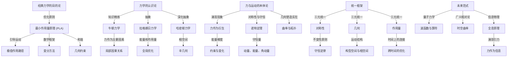

# 经典力学的哲学基础
* * *

--- 经典力学不仅仅是运动的科学，它是实在、对称性与目的的哲学。

# **I. 引言：重新思考经典力学**
**题词**：*"力学不仅仅是运动的研究 —— 它是探索实在原则的学科。"*

## **I.1. 经典力学的双重身份**

经典力学长期以来一直是人类思想中最优雅和最持久的成就之一。在其核心，它是一个描述和预测运动的框架，根植于由艾萨克·牛顿首次形式化的物理定律。然而，经典力学不仅仅是一系列方程的集合；它是一种通过其观察实在本质的哲学透镜。

几个世纪以来，经典力学作为连接人类直觉与自然界数学精确性的桥梁而存在。它是运动的科学，也是对称性、因果关系和守恒之间相互作用的见证。在其技术表述之下，隐藏着一个关于存在的深刻叙述，这个叙述不仅涉及运动的原则，也涉及实在结构本身。

## **I.2. 超越技术层面：力学作为哲学**

虽然经典力学通常被视为一种技术学科 —— 一种用于计算轨迹、力和能量的方法 —— 但其实质上是深刻的哲学性质。它提出了超越直接应用的问题：
- 为什么自然偏好某些路径而非其他路径？
- 力、能量和运动之间的关系是什么？
- 力是基本的，还是涌现的？
- 对称性和不变性如何塑造物理定律？

这些问题不仅仅是学术上的；它们涉及到知识的本质(认识论)、物理定律中的目的性(目的论)以及存在的基本结构(本体论)。要真正理解经典力学，我们必须超越其表面的实用性，并深入探讨这些更深层次的哲学维度。

## **I.3. 中心问题**

驱动这一探索的核心问题是简单而深刻的：
*经典力学的深层本质是什么？*

这个问题邀请我们重新审视经典力学，不是作为一个静态框架，而是作为一种动态发展的哲学。它挑战我们超越方程和数字，去揭示赋予力学普遍性和力量的原则。

为了解决这个问题，我们将采用三种互补的哲学视角：
1. **目的论**：运动定律背后的目的或方向性是什么？
2. **认识论**：我们对力学的理解是如何演变的，这揭示了知识的本质是什么？
3. **本体论**：经典力学所描述的力、运动和实在的本质是什么？

## **I.4. 经典力学的哲学基础**

为了揭示经典力学的本质，我们将从这些哲学视角探讨其演变并重新解释其核心概念。

1. **目的论**：
   经典力学中描述的运动是由优化原则指导的，例如最小作用量原理。这种目的论视角表明，自然以某种目的运作，选择使某些量最小化或极值化的路径。

2. **认识论**：
   从牛顿力学发展到拉格朗日和哈密顿力学的过程反映我们在表示和理解运动方面的抽象深化。经典力学不是静态的；它是我们认知框架的精炼，受到对称性、几何学和能量相互作用的推动。

3. **本体论**：
   力曾经被认为是一个基本实体，现在被理解为从几何和变分原则中涌现的次级现象。力学的真正本质不在于力，而在于构型空间和相空间的结构，在那里运动编码在实在的几何中。

## **I.5. 文档结构**

本文档结构是对经典力学的多层次探索，从其哲学基础到现代意义：

1. **目的论：运动的目的**
   我们首先通过最小作用量原理及其对运动的优化解释来考察目的论视角。

2. **认识论：力学中知识的演变**
   接下来，我们追溯机械思维的发展历程，从牛顿力学到拉格朗日和哈密顿力学的抽象，揭示力学如何编码关于宇宙的知识。

3. **本体论：力与运动的实在**
   然后，我们将力和运动重新解释为涌现现象，探讨它们与对称性、几何学和守恒定律的关系。

4. **对称性、几何学与作用量的统一**
   在这一部分，我们将综合我们的见解，揭示经典力学的一个统一的哲学框架，该框架围绕对称性、几何学和作用量之间的相互作用展开。

5. **超越经典力学：迈向新范式**
   最后，我们推测力学的未来，探讨其在量子力学、广义相对论和信息理论中的溶解作用，及其作为更深层次统一原则基础的角色。

## **I.6. 为什么要重新思考经典力学？**

重新审视的动力既是智力上的也是实际的：

1. **哲学深度**：
   几个世纪以来，经典力学塑造了我们对宇宙的理解，但其哲学含义仍然未被充分探索。通过深入挖掘其基础，我们可以获得关于实在、运动和因果关系的新见解。

2. **现代相关性**：
   经典力学不是一个过时的框架；它是现代物理学的基础。理解其哲学本质可以照亮经典与现代理论之间的联系，从量子力学到广义相对论。

3. **新的实在视角**：
   通过从目的论、认识论和本体论的角度重建经典力学，我们可以发展出一个更丰富、更集成的宇宙理解，弥合科学、哲学和形而上学之间的鸿沟。

## **I.7. 关键见解**

从一开始，我们就确立三个指导见解，将塑造我们的探索：

1. **优化与目的**：
   运动不是任意的；它受优化原则的指导，如最小作用量原理。这反映出自然法则中更深层次的目的论结构。

2. **知识作为抽象**：
   经典力学随着我们对运动、能量和几何学知识的编码方式的精炼而演变。从牛顿力学到哈密顿力学的发展反映了抽象和统一的深化。

3. **实在作为几何**：
   力学的真正本质在于其几何基础。力、约束和动力学是从构型空间和相空间的曲率和结构中涌现的次级现象。

## **I.8. 结论：哲学探究的开始**

这篇引言邀请读者以非静态的方式接近经典力学，将其视为一种活生生的哲学。通过从目的论、认识论和本体论的角度重新思考其基础，我们旨在揭示其深层本质，提升我们对运动、因果关系和实在的理解。

这为后续各节奠定了基础，在这些章节中，我们将深入探讨每个哲学视角，逐步构建经典力学作为一个宇宙基础哲学的统一愿景。

# **II. 目的论：运动的目的**
**题词**：*"自然不做无用之事。"  ——  亚里士多德*

## **II.1. 力学中目的论的历史根源**

目的论，即自然过程是由目的或最终目标引导的哲学思想，具有深远的历史根源。亚里士多德在其自然哲学中认为，宇宙中所有的运动和变化都是朝着实现内在目的的方向进行的。在他看来，天体的圆周运动、石头的下落和植物的生长都是目的论的 —— 每一个都由内在目标驱动。

虽然亚里士多德的世界观被科学革命的机械哲学所取代，但目的论的回声依然存在。牛顿力学用外部力和初始条件代替了“目的”，强调因果性而非意图性。然而，随着 18 和 19 世纪变分原理的出现，目的论以一种更微妙、更数学的形式重新浮现。最小作用量原理首先由莫佩尔蒂提出，后来由欧拉、拉格朗日和哈密顿形式化，带回了自然选择最优路径的概念 —— 一种现代的、数学上的目的论。

## **II.2. 最小作用量原理**

最小作用量原理(PLA)是物理学中最深刻和统一的思想之一。它指出，一个系统在两个状态之间的运动使得作用量 $S$ 极值化(通常是最小化)，定义为拉格朗日量 $L$ 对时间的积分：
$$
S = \int_{t_1}^{t_2} L(q, \dot{q}, t) \, dt.
$$
这里，$L = T - V$ 是动能与势能之差，包含了系统的动力学。PLA 断言，在所有可能的路径中，自然“选择”优化作用量的那一条。

### **II.2.1. 目的论解释**
PLA 引入了力学中的目的论视角：运动不仅仅是近因(每一时刻作用的力)的结果，而是跨越时间的全局优化原则的实现。在这种意义上，PLA 表明自然是“经济的”，选择优化特定量如能量或作用量的路径。

### **II.2.2. 例子：最速降线问题**
约翰·伯努利提出的最速降线问题说明了 PLA 的目的论本质。问题是：*什么曲线能使粒子在重力作用下从一点滑到另一点所需的时间最短？* 其解是一个摆线，这条曲线使作用量泛函最小化。这个例子体现了自然运动是由优化原则而非任意力引导的思想。

## **II.3. 变分方法与目的论**

最小作用量原理在其数学基础上依赖于变分方法，这提供了一个理解力学中目的论的强大框架。变分法允许我们通过要求作用量泛函保持平稳(即其一阶变分为零)来推导运动方程：
$$
\delta S = 0.
$$
这直接导致欧拉-拉格朗日方程：
$$
\frac{d}{dt} \left( \frac{\partial L}{\partial \dot{q}^i} \right) - \frac{\partial L}{\partial q^i} = 0,
$$
这些方程控制着系统的动力学。

### **II.3.1. 与优化的联系**
变分方法揭示了运动的目的论本质：运动方程作为优化作用量的条件出现。这不是局部原则(如牛顿定律)，而是一个全局原则，整合了整个系统的轨迹。这样，机械系统从根本上由优化引导，反映其运动中的隐含“目的”。

### **II.3.2. 几何约束与目的论**
在有约束的系统中，如珠子沿着导线滑动或单摆限制在弧上摆动，PLA 自然地将约束纳入优化过程中。结果运动既满足变分原则又满足几何约束，进一步强调了结构与运动之间的目的论和谐。

## **II.4. 物理定律中目的论的影响**

自然“选择”最优路径的想法对我们理解和物理定律及宇宙的方式产生深远影响：

1. **全局与局部视角**：  
   目的论引入一种全局视角，其中运动不仅是瞬时力的结果，而是跨越时间和空间的整体原则的结果。这与关注局部因果相互作用的牛顿力学形成对比。

2. **原则的统一**：  
   PLA 在一个单一的数学框架下统一了各种现象。无论是描述行星轨道、波传播还是量子系统，PLA 提供一个超越具体物理背景的普遍原则。

3. **自然中的目的**：  
   尽管 PLA 并不意味着有意图，但它暗示在自然法则中的内在“经济”。这种目的论观点弥合了关于目的的形而上学思想与物理学的经验严格性之间的差距。

## **II.5. 拉格朗日力学中的目的论**

作为牛顿力学的重新表述，拉格朗日力学体现了 PLA 的目的论本质。通过关注系统的能量(通过拉格朗日量 $L = T - V$)，而不是力，拉格朗日力学将重点从局部因果性转移到全局优化。

### **II.5.1. 例子：简单摆**
考虑一个简单的摆，其运动由以下拉格朗日量控制：
$$
L = T - V = \frac{1}{2}m\ell^2\dot{\theta}^2 - mg\ell(1 - \cos\theta).
$$
由欧拉-拉格朗日方程推导出的运动方程描述了摆的振荡运动。然而，目的论视角揭示，这种运动不仅由重力引起，而且是系统随时间最小化其作用量的结果。

### **II.5.2. 广义坐标与约束**
拉格朗日力学通过允许使用广义坐标 $q^i$ 来描述有约束的系统，进一步强调了目的论。该形式主义自然地将这些约束纳入优化过程中，强化了运动由系统内在结构引导的观点。

## **II.6. 几何约束与目的论和谐**

在具有几何约束的系统中，目的论变得更加显著，其中运动由变分原理和系统的几何形状共同决定。例如：

- 粒子在表面上的运动遵循由表面测地线确定的路径，这极值化了行进的距离。  
- 在电磁场中的带电粒子遵循极值化作用量泛函的轨迹，结合了场的影响和时空的几何约束。

这些例子突显目的论、几何学和动力学之间的相互作用，其中运动作为多个原则和谐实现的结果产生。

## **II.7. 超越经典力学的目的论**

最小作用量原理远远超出经典力学，出现在量子力学、广义相对论甚至涌现现象中：

1. **量子力学**：  
   在理查德·费曼提出的量子力学路径积分表述中，PLA 呈现出概率形式。粒子探索所有可能的路径，但驻定作用量的路径占主导地位，反映量子水平上的目的论选择。

2. **广义相对论**：  
   在爱因斯坦的广义相对论中，测地线原理 —— 物体沿着时空曲率极值化的路径运动 —— 可以视为几何上下文中的 PLA 表现。

3. **涌现系统**：  
   在复杂系统中，如生物或生态系统，目的论原则以优化过程的形式出现，如能量最小化或熵最大化，反映了目的论思想的普遍性。

## **II.8. 关键见解**

1. **运动作为优化**：  
   最小作用量原理揭示，运动不是任意的，而是由优化原则引导的，反映自然法则中更深的目的。

2. **力学中的目的论**：  
   变分方法和拉格朗日力学强调运动的全局、目的论性质，其中动力学由能量、约束和几何学之间的相互作用塑造。

3. **目的论的普遍性**：  
   目的论视角超越经典力学，提供从量子力学到广义相对论和涌现系统的物理学统一原则。

## **II.9. 过渡到认识论**

在探讨了经典力学的目的论基础之后，我们现在转向其认识论维度。在下一节中，我们将研究我们对运动和因果关系的理解如何从牛顿力学的力演变为拉格朗日和哈密顿形式主义的抽象。这一演变不仅反映机械知识的精炼，也反映我们表示和理解宇宙的抽象程度的加深。

本节确立了经典力学的目的论本质，强调最小作用量原理作为一种统一的、以目的为导向的原则，塑造了物理系统中的运动。它为接下来的认识论探索奠定基础。

# **III. 认识论：力学中知识的演变**
**题词**：*"力学是关于宇宙如何运动的知识的精炼。"*

## **III.1. 经典力学的认识论基础**

经典力学不仅仅是一个预测运动的技术框架，它反映了人类如何编码和提炼对自然的理解。它代表知识的进步，其中每个重新表述 —— 牛顿力学、拉格朗日力学和哈密顿力学 —— 标志着对控制运动的原则的更深层次抽象和统一。

在其核心，这种演变是认识论的：它揭示了我们如何了解运动、因果关系以及物理系统的相互联系。这一旅程不仅是发现定律的过程，也是发展更好实在表示的过程，每一种表示都比前一种更加全面和深刻。

## **III.2. 牛顿力学：力作为基本概念**

艾萨克·牛顿对力学的表述之所以具有革命性，正是因为它为运动引入一个清晰的因果框架。牛顿第二定律，
$$
\mathbf{F} = m\mathbf{a},
$$
将力提升到基本概念的地位。在这种观点下，运动是由作用在质量上的外部力引起的，系统的动力学可以通过识别和累加这些力来推导。

### **III.2.1. 认识论意义**
牛顿力学以力及其效应的形式封装了对运动的知识。它是直观的，根植于可观察的现象，如推力、拉力和阻力。牛顿力学的认识论基于**因果关系**，提供了一个既实用又预测性的框架。

### **III.2.2. 牛顿范式的局限性**
然而，牛顿力学也存在认识论上的局限性：
1. **惯性参考标架的依赖性**：牛顿定律仅在惯性参考标架中有效，在非惯性参考标架中需要引入虚拟力(例如离心力和科里奥利力)。
2. **复杂系统的不足**：牛顿力学难以处理涉及约束、分布力或集体行为的系统，因为在这些系统中力不易隔离或量化。
3. **缺乏普遍性**：牛顿力学是一种局部理论，关注瞬时力，并不自然地编码全局原则，如守恒律或对称性。

这些局限性突显了需要一个更深层次的认识论框架，该框架超越力并拥抱更抽象的原则。

## **III.3. 拉格朗日力学：能量与作用量作为知识**

从牛顿力学到拉格朗日力学的转变代表一次深刻的认识论飞跃。在拉格朗日力学中，力不再是主要概念；相反，重点转向能量和最小作用量的全局原则。系统的动力学被编码在**拉格朗日函数**中：
$$
L = T - V,
$$
其中 $T$ 是动能，$V$ 是势能。

### **III.3.1. 认识论进展**
1. **从局部到全局**：
   拉格朗日力学本质上是全局的。它描述运动作为极值化(通常是极小化)作用量 $S$ 的路径：
   $$
   S = \int_{t_1}^{t_2} L(q, \dot{q}, t) \, dt.
   $$
   这种全局视角超越了牛顿力学基于力的局部因果性，提供对运动更整体的理解。

2. **能量作为统一概念**：
   通过用能量重新表述力学，拉格朗日力学在一个单一框架下统一了各种现象。它提供一种自然的方法来处理约束、对称性和守恒律。

3. **广义坐标**：
   使用广义坐标 $q^i$ 允许拉格朗日力学描述具有复杂约束的系统，例如非笛卡尔几何中的系统。这种抽象增强了其多功能性和适用性。

### **III.3.2. 例子：双摆**
考虑一个双摆，这是一个有两个自由度的系统。在牛顿力学中，分析这个系统需要在每个关节处解析力并考虑相互作用。在拉格朗日力学中，系统由两个广义坐标 $\theta_1$ 和 $\theta_2$ 描述，其动力学由拉格朗日量得出：
$$
L = T - V = \frac{1}{2}m_1\ell_1^2\dot{\theta}_1^2 + \frac{1}{2}m_2(\ell_1^2\dot{\theta}_1^2 + \ell_2^2\dot{\theta}_2^2 + 2\ell_1\ell_2\dot{\theta}_1\dot{\theta}_2\cos(\theta_1 - \theta_2)) - V(\theta_1, \theta_2).
$$
这种知识的重组简化了分析，揭示了系统的动力学作为其能量结构的结果。

## **III.4. 哈密顿力学：抽象进入相空间**

从拉格朗日力学到哈密顿力学的转变代表了一次更深的认识论转变。在哈密顿力学中，系统的状态被编码在**相空间**中，这里广义坐标 $q^i$ 与共轭动量 $p_i$ 定义其中每个点。动力学由**哈密顿函数**控制：
$$
H = T + V,
$$
这代表系统的总能量。

### **III.4.1. 认识论进展**
1. **相空间表示**：
   相空间提供一个系统的完整状态描述，包括位置和动量。这种对偶视角比单独的构型空间更为一般和强大。

2. **正则运动方程**：
   哈密顿力学中的运动方程，
   $$
   \dot{q}^i = \frac{\partial H}{\partial p_i}, \quad \dot{p}_i = -\frac{\partial H}{\partial q^i},
   $$
   描述系统在相空间中的流。这些方程本质上是几何的，反映相空间的辛结构。

3. **辛几何**：
   辛结构由辛 $2$-形式 $\omega = \sum dp_i \wedge dq^i$ 定义，为哈密顿力学提供几何基础。这种抽象揭示力学、几何和拓扑之间的深层联系。

### **III.4.2. 例子：简谐振子**
对于简谐振子，哈密顿量是：
$$
H = \frac{p^2}{2m} + \frac{1}{2}kx^2.
$$
在相空间中的运动描绘出椭圆轨迹，反映了总能量的守恒。这种几何表示提供了在构型空间中不太明显的系统行为见解。

## **III.5. 勒让德变换与对偶性**

从拉格朗日力学到哈密顿力学的转变通过**勒让德变换**实现，它将拉格朗日量 $L(q, \dot{q}, t)$ 与哈密顿量 $H(q, p, t)$ 联系起来。这一数学操作体现认识论上的对偶性：
- 拉格朗日量强调构型空间和速度。
- 哈密顿量强调相空间和动量。

这种对偶性反映一个关于力学的更深层次真理：不同的表示编码相同底层实在的互补方面。勒让德变换统一了这些视角，丰富我们对运动的理解。

## **III.6. 力学作为知识的精炼**

从牛顿力学到拉格朗日作用再到哈密顿几何的经典力学认识论演变揭示了我们如何表示和理解运动的逐步精炼：

1. **从因果到结构**：
   牛顿力学通过力强调因果关系。拉格朗日和哈密顿力学将焦点转移到结构原则，如能量、对称性和几何。

2. **从局部到全局**：
   从力到作用的演变反映从局部、瞬时运动描述到整合整个系统轨迹的全局、整体原则的转变。

3. **从直觉到抽象**：
   每一次重新表述引入了更大的抽象，使力学远离如力这样的直观概念，并将其替换为抽象的数学构造，如相空间和辛几何。

## **III.7. 关键见解**

1. **力作为起点**：
   牛顿力学以力作为基本概念开始，提供一个理解运动的直观但有限的框架。

2. **能量与作用量作为知识**：
   拉格朗日力学超越了力，将运动编码为能量和作用量，揭示自然法则背后的全局优化原则。

3. **几何与对称性**：
   哈密顿力学将运动抽象为相空间，其中辛几何和守恒律在单一框架下统一了多种现象。

4. **对偶性作为统一原则**：
   勒让德变换例证了力学的认识论对偶性，其中构型空间和相空间为理解实在提供互补的视角。

## **III.8. 过渡到本体论**

在追溯了经典力学的认识论演变之后，我们现在转向其本体论维度。在下一节中，我们将重新解释力和运动作为涌现现象，探索它们与对称性、几何和守恒律的关系。这种本体论视角将揭示力学抽象背后更深层次的结构。 

本节展示了经典力学如何精炼我们对运动的知识，从直观的力演变为抽象的能量、作用量和几何原理。它为接下来对力和运动本质的深入探讨奠定基础。

# **IV. 本体论：力与运动的实在**
**题词**：*"力不是一种事物 —— 它是实在结构的结果。"*

## **IV.1. 本体论转变：从因果到结构**

在其最早的概念中，力被视为一种基本实体 —— 运动的原始原因。这种观点在牛顿力学中得到了明确阐述，确立了力作为变化的媒介，包含相互作用和因果关系。然而，随着力学通过拉格朗日和哈密顿力学框架的发展，力逐渐失去其核心地位。出现一个更为深刻的认知：力并非基本，而是深层次结构衍生的现象。

这种视角的转变改变我们对运动的理解。与其将力视为动力学的根本原因，我们现在将其看作是几何、对称性和变分原理描述实在的语言，而非实在本身。

## **IV.2. 力作为涌现概念**

力的本体论重新想象始于将其重新解释为涌现属性。在牛顿力学中，力是主要因素，直接导致加速度。但在拉格朗日和哈密顿力学中，力不再是中心；相反，它作为系统能量和约束的次级特征而出现。

### **IV.2.1. 从牛顿到拉格朗日**
在拉格朗日力学中，运动方程不是从力推导出来的，而是从作用量泛函 $S$ 的极值化得出。欧拉-拉格朗日方程，
$$
\frac{d}{dt} \left( \frac{\partial L}{\partial \dot{q}^i} \right) - \frac{\partial L}{\partial q^i} = 0,
$$
控制系统的动力学，其中力隐式地表现为势能的梯度：
$$
F_i = -\frac{\partial V}{\partial q^i}.
$$
在这里，力被揭示为能量景观的数学结果，而不是原始实体。

### **IV.2.2. 从拉格朗日到哈密顿**
在哈密顿力学中，抽象进一步加深。系统的动力学被编码在哈密顿函数 $H$ 中，通过正则方程控制相空间中的流：
$$
\dot{q}^i = \frac{\partial H}{\partial p_i}, \quad \dot{p}_i = -\frac{\partial H}{\partial q^i}.
$$
力不再显式出现；相反，它被包含在相空间的辛结构中。在这个框架中，力是哈密顿流的一个涌现属性，源自系统的几何和能量。

### **IV.2.3. 力作为约束**
在具有约束的系统中，如张力或法向力等力并不是基本相互作用，而是作为强制执行约束的拉格朗日乘子出现。这进一步将力的角色降为一个涌现角色，从属于系统的几何和变分结构。

## **IV.3. 对称性与守恒：本体论联系**

力的本体论重新想象与对称性的角色密不可分。诺特定理提供一种深刻的对称性与守恒之间的联系，揭示了系统的不变性决定其守恒量。

### **IV.3.1. 诺特定理**
诺特定理指出，每个连续的作用量对称性对应于一个守恒量。例如：
- 平移对称性导致线动量守恒。
- 旋转对称性导致角动量守恒。
- 时间对称性导致能量守恒。

在这种背景下，力不是基本实体，而是对称性破坏或应用的表现。它作为系统对称性偏差的响应出现，起到恢复平衡或强制约束的作用。

### **IV.3.2. 对称性作为运动的来源**
对称性的本体论意义在于其生成作用。运动本身可以被视为系统几何和能量对称性的响应。因此，力是一个衍生概念，源自于这些对称性与系统约束之间的相互作用。

## **IV.4. 几何与曲率：力作为几何现象**

当我们考虑嵌入弯曲构型空间或时空的系统时，力与几何之间的联系变得明显。在这种情况下，力被重新解释为流形曲率的结果。

### **IV.4.1. 构型空间中的力**
在构型空间中，系统的运动受到其演化所在空间几何的影响。例如，具有约束的系统的运动方程可以写成：
$$
\frac{d^2 q^i}{dt^2} + \Gamma^i_{jk} \frac{dq^j}{dt} \frac{dq^k}{dt} = 0,
$$
其中 $\Gamma^i_{jk}$ 是构型流形的克里斯托费尔符号。这些符号编码流形的曲率，“力”作为这些曲率的结果出现在系统上。

### **IV.4.2. 广义相对论中的力**
在广义相对论中，等效原理消除了引力作为基本相互作用的需要。相反，引力被重新解释为时空的曲率。测地线方程，
$$
\frac{d^2 x^\mu}{d\tau^2} + \Gamma^\mu_{\nu\rho} \frac{dx^\nu}{d\tau} \frac{dx^\rho}{d\tau} = 0,
$$
描述物体在弯曲时空中的运动。这里，克里斯托费尔符号 $\Gamma^\mu_{\nu\rho}$ 起着类似于力的作用，通过时空的几何引导运动。

### **IV.4.3. 曲率与物理相互作用**
这些例子揭示了一个深刻的本体论见解：无论是引力还是其他力，都不是基本相互作用，而是运动发生所在的流形的曲率和拓扑结构的反映。力是几何的具体表现。

## **IV.5. 相空间本体论：力之下的实在**

最深刻的本体论转变发生在哈密顿力学中，其中系统的状态在相空间中表示。在这里，力完全被哈密顿矢量场的流动所取代。

### **IV.5.1. 辛流形**
相空间是一个辛流形，由辛 $2$-形式定义：
$$
\omega = \sum_{i=1}^n dp_i \wedge dq^i.
$$
这一结构控制系统的演化，确保哈密顿流动保持相空间体积(刘维尔定理)。在这个框架中，力不再是独立实体，而是辛几何的隐式特征。

### **IV.5.2. 哈密顿流**
哈密顿矢量场 $X_H$，由方程 $\iota_{X_H} \omega = dH$ 定义，生成相空间中系统的演化。相空间中的轨迹完全由该流决定，“力”作为一个依赖于哈密顿量梯度的衍生现象出现。

## **IV.6. 关键本体论见解**

1. **力作为涌现**：
   力不是基本实体，而是能量梯度、约束和几何结构的次级现象。

2. **对称性与守恒**：
   系统的不变性决定其守恒量，力表现为对称性破坏或约束强制的响应。

3. **几何即实在**：
   力是构型空间、相空间或时空的曲率和拓扑结构的反映，体现实在的几何结构。

4. **相空间优先**：
   在哈密顿力学中，力完全融入相空间的辛流，揭示运动作为几何演化的更深层次本体论。

## **IV.7. 过渡到统一**

在重新诠释力为涌现和衍生现象之后，我们现在准备将这些见解综合成一个统一框架。在下一节中，我们将探讨对称性、几何和最小作用量原理如何共同提供经典力学的全面基础，统一其目的论、认识论和本体论维度。

本节建立了力不是原因，而是更深层次结构的结果，为经典力学作为实在哲学的统一视图铺平道路。

# **V. 对称性、几何与作用量的统一**
**题词**：*"对称性是宇宙的语言，几何是其结构，作用量是其目的。"*

## **V.1. 对称性、几何与作用量的融合**

在经典力学中，对称性、几何和作用量之间的相互作用不仅仅是技术上的便利 —— 它是框架本身的核心。这三个支柱形成一个统一的结构，每个支柱相互强化，以描述支配运动和因果关系的基本原理。理解经典力学就是见证这些元素的和谐：
- **对称性**揭示自然的不变性并产生了守恒定律。
- **几何**编码构型空间、相空间和时空中的运动结构。
- **作用量**作为桥梁，通过优化原则统一这些概念。

本节将目的论、认识论和本体论的见解综合为一个连贯的哲学愿景，在这个愿景中，对称性、几何和作用量的统一成为经典力学的支架。

## **V.2. 对称性作为自然法则的源泉**

对称性是自然法则可预测性的基础。在经典力学中，对称性不仅仅是数学属性 —— 它是自然不变性的表现。对称性和守恒之间深刻的联系在**诺特定理**中得到了形式化，该定理指出：
*每个作用量的连续对称性对应于一个守恒量。*

### **V.2.1. 不变性的作用**
1. **平移对称性**：空间平移下的不变性导致线动量守恒。
2. **旋转对称性**：旋转下的不变性导致角动量守恒。
3. **时间平移对称性**：时间平移下的不变性意味着能量守恒。

这些对称性不是任意的 —— 它们反映时空本身的不变性。力学定律被编码在这些对称性中，约束并引导物理系统的运动。

### **V.2.2. 对称性作为生成原则**
对称性不是运动的结果，而是**生成**支配它的定律。例如，由诺特定理产生的守恒定律对系统的允许动力学施加严格的限制。因此，对称性是自然法则的起源，塑造宇宙在各个尺度上的行为。

## **V.3. 几何作为实在的支架**

如果对称性是自然的语言，那么几何就是其结构框架。物体的轨迹、它们遵守的约束以及它们经历的力都被编码在底层空间的几何中。

### **V.3.1. 构型空间与曲率**
在具有约束的系统中，构型空间(所有可能状态的空间)可能具有曲率。例如：
- 限制在一个球面上运动的粒子会经历由球面曲率引起的“力”。
- 这些力不是基本相互作用，而是几何现象，编码在流形的克里斯托费尔符号中。

粒子的运动由测地线(极值长度或曲率的路径)控制，这使得几何提供理解运动作为系统结构结果的框架。

### **V.3.2. 相空间与辛几何**
在哈密顿力学中，相空间是一个辛流形，其结构由辛 $2$-形式定义：
$$
\omega = \sum_{i=1}^n dp_i \wedge dq^i.
$$
这一几何结构控制系统的演化，确保相空间体积的守恒(刘维尔定理)。由运动方程生成的哈密顿矢量场的流动是一个纯粹的几何现象。

### **V.3.3. 时空与广义相对论**
在广义相对论中，时空的几何决定物体的运动。测地线方程，
$$
\frac{d^2 x^\mu}{d\tau^2} + \Gamma^\mu_{\nu\rho} \frac{dx^\nu}{d\tau} \frac{dx^\rho}{d\tau} = 0,
$$
将运动描述为时空曲率的结果。在这里，几何完全取代了力，引力相互作用被重新解释为弯曲时空的表现。

## **V.4. 作用量作为统一原则**

**最小作用量原理**将对称性和几何统一到一个单一的框架中，为运动提供一个目的论视角。通过要求作用量 $S$ 是驻定的，
$$
\delta S = 0 \quad \text{where} \quad S = \int_{t_1}^{t_2} L \, dt,
$$
自然界选择作用量极值的路径。这一原理封装对称性施加的约束和几何编码的结构。

### **V.4.1. 作用量作为全局原则**
不同于关注局部力的牛顿力学，最小作用量原理本质上是全局的。它考虑系统的整个轨迹，通过对时间和空间进行积分来确定满足变分原理的路径。这种全局视角反映对称性、几何和运动之间的相互联系。

### **V.4.2. 作用量与守恒定律**
诺特定理自然而然地从最小作用量原理中产生。作用量泛函在变换(对称性)下的不变性直接对应于守恒量。因此，作用量是通过优化过程生成守恒定律的机制。

### **V.4.3. 作用量与几何**
作用量泛函编码系统的几何。例如，在具有约束的系统中，作用量包含构型空间的曲率或相空间的辛结构。最小化作用量揭示几何与动力学之间的相互作用，将这些视角统一到一个单一的框架中。

## **V.5. 力学的哲学统一**

对称性、几何和作用量的综合为经典力学提供深刻的哲学见解：
- 对称性揭示决定自然法则的不变性。
- 几何编码实在的结构，通过曲率和拓扑形状运动。
- 作用量提供统一的原则，通过优化连接对称性和几何。

这种统一不仅仅是经典力学的一个特征 —— 它是宇宙更深层次秩序的反映。运动定律并非任意的；它们是这种三重互动的必然结果。

## **V.6. 关于统一的关键见解**

1. **对称性生成秩序**：
   自然法则的不变性通过对称性表达，是守恒原理和运动可预测性的来源。

2. **几何塑造实在**：
   构型空间、相空间和时空的曲率和拓扑结构决定物理系统的动力学，使几何成为运动的支架。

3. **作用量桥接概念**：
   最小作用量原理统一了对称性和几何，提供通过优化过程理解运动的目的论框架。

4. **框架的普遍性**：
   对称性、几何和作用量的相互作用超出了经典力学，出现在量子力学(通过路径积分)、广义相对论(通过测地线)甚至复杂系统中的涌现现象中。

## **V.7. 向新范式的过渡**

在合成了对称性、几何和作用量的统一之后，我们现在转向力学的未来。在下一节中，我们将探讨经典力学的哲学基础如何溶解到现代范式中，从量子力学到信息论。这种转变并不意味着放弃经典原理，而是将其进化为更深入、更普遍的框架。

本节完成了经典力学的哲学统一，展示其核心元素如何凝聚成一个单一、和谐的运动和实在愿景。它为探索这一统一在现代物理学和未来范式背景下的更广泛含义奠定基础。

# **VI. 超越经典力学：迈向新范式**
**题词**：*"每个范式都是更深层次真理的影子。"*

## **VI.1. 力的溶解：从经典到量子实在**

经典力学以其对确定性轨迹和力作为因果代理的强调，为理解宏观现象提供一个强大的框架。然而，当我们深入微观领域时，力的概念被抽象化取代，取而代之的是算子、概率和波函数。牛顿力学的确定性精度让位于量子力学的概率性质。

### **VI.1.1. 量子力学：范式的转变**
在量子力学中，粒子的轨迹不再是空间中的预定义路径。相反，粒子的行为由波函数 $\psi(x, t)$ 描述，该函数编码在不同状态下找到粒子的概率。确定性的运动方程被薛定谔方程取代：
$$
i\hbar \frac{\partial \psi}{\partial t} = \hat{H} \psi,
$$
其中 $\hat{H}$ 是哈密顿算子。

- **力作为势能的副产品**：在量子力学中，力不是基本的；它们表现为势能的梯度，这些势能被编码在哈密顿量中。
- **路径积分表述**：理查德·费曼的路径积分方法在一个概率背景下重新引入最小作用量原理。在这个框架中，粒子探索所有可能的路径，每条路径根据其作用量对粒子行为做出贡献。这一经典作用量原理的推广揭示了经典与量子范式之间更深层次的联系。

### **VI.1.2. 概念上的影响**
从经典力学到量子力学的转变挑战了我们对因果性和决定论的理解。曾经是经典世界观核心的力成为派生概念，从属于波函数和实在的概率结构。

## **VI.2. 力作为几何：来自广义相对论的见解**

当量子力学将力抽象为波函数的领域时，广义相对论将其重新解释为几何。爱因斯坦的理论用时空曲率取代牛顿引力概念，从根本上改变我们对运动的理解。

### **VI.2.1. 引力作为曲率**
在广义相对论中，测地线方程描述物体在弯曲时空中的轨迹：
$$
\frac{d^2 x^\mu}{d\tau^2} + \Gamma^\mu_{\nu\rho} \frac{dx^\nu}{d\tau} \frac{dx^\rho}{d\tau} = 0,
$$
其中 $\Gamma^\mu_{\nu\rho}$ 是表示时空曲率的克里斯托费尔符号。在这里：
- 物体“下落”不是由于引力而是因为它们沿着时空中的测地线(极值曲率路径)移动。
- 等效原理消除了对引力的需求，以纯粹几何解释代替它。

### **VI.2.2. 本体论革命**
广义相对论改变了力的本体论：它不再是相互作用，而是时空几何的表现。这种几何视角与经典力学的见解一致，其中力被显示为几何和变分原则的涌现结果。

## **VI.3. 新兴现象和宏观尺度上力的起源**

超越量子和相对论领域，力的概念在宏观世界中作为新兴现象再次出现。在复杂系统中，力不是源于基本相互作用，而是源于集体行为和约束。

### **VI.3.1. 复杂系统中的力**
在材料科学、流体力学和热力学中，如压力、张力和粘性等力是宏观涌现的结果：
- **气体中的压力**：气体对容器壁施加的力来源于单个分子的集体碰撞。
- **固体中的弹性**：变形材料中的恢复力来源于材料晶格中原子之间的相互作用。
- **流体中的粘性**：流动阻力是分子间相互作用和宏观尺度上能量耗散的结果。

这些例子说明了力远非基本，通常是由潜在微观过程的统计结果。

### **VI.3.2. 热力学与熵力**
在统计力学中，力可以从熵最大化中产生。例如驱动大分子自组装的熵力反映系统趋向于高熵构型的趋势，而不是任意基本相互作用。

## **VI.4. 力作为信息：全息原理**

在理论物理的前沿，力的概念正在经历又一次转变，这次进入信息领域。现代物理学的基石 —— 全息原理表明，实在的基本性质可能编码在低维表面上，挑战传统的力和相互作用观念。

### **VI.4.1. 全息原理**
由 Gerard’t Hooft 和 Leonard Susskind 提出，全息原理认为一个体积空间内包含的所有信息可以表示在其边界表面上。这一激进想法意味着：
- 引力和时空曲率可能是从全息表面编码的量子信息中产生的。
- 时空本身的动力学与量子信息的纠缠和流动有关。

### **VI.4.2. 力作为信息的涌现属性**
在这种范式中，力不是基本实体，而是潜在量子信息结构的宏观表现。例如：
- 黑洞的热力学性质，如霍金辐射，揭示引力可能是与事件视界的熵相关的涌现现象。
- 雅各布森从热力学原理推导出爱因斯坦场方程表明，时空曲率 —— 从而引力 —— 植根于信息论。

这种观点在信息物理学的旗帜下统一了经典力学、量子力学和广义相对论的见解。

## **VI.5. 经典力学作为垫脚石**

经典力学远未过时，仍然是人类探索宇宙的重要垫脚石。它的原则 —— 对称性、几何和作用量 —— 没有被抛弃，而是在现代理论中得到推广和扩展。

### **VI.5.1. 原则的连续性**
1. **对称性**：支撑经典力学的不变性在量子场论和广义相对论中得以保留，支配着基本粒子和时空本身的行为。
2. **几何**：经典力学的几何基础，从构型空间到相空间，为现代理论如弦论和圈量子引力提供了支架。
3. **作用量**：最小作用量原理连接经典和量子力学，出现在路径积分表述中，并继续指导新范式的发展。

### **VI.5.2. 理解的框架**
经典力学提供了一个仍然相关的概念框架：
- 它为探索更抽象的理论提供直观的基础。
- 它的哲学见解 —— 目的论、认识论和本体论 —— 继续影响我们对运动、因果关系和结构的理解。

## **VI.6. 朝着统一实在的愿景前进**

随着经典力学溶解为量子力学、广义相对论和信息物理学，很明显这些范式并非孤立，而是相互关联的。每一层都建立在另一层之上，揭示实在更深层次的内容。

### **VI.6.1. 抽象中的统一**
从经典到现代物理学的演变是一次抽象之旅，每一步都超越了前一框架的局限：
- 经典力学将力抽象为对称性和变分原则。
- 量子力学将轨迹抽象为波函数和概率。
- 广义相对论将相互作用抽象为几何。
- 信息物理学将实在本身抽象为信息和熵的语言。

### **VI.6.2. 整体理解**
这一进展指向一个统一的实在愿景，其中经典力学并未被抛弃，而是融入更广泛、更全面的框架中。在这个统一愿景的核心，保留了经典力学的见解，通过现代科学的视角重新诠释。

## **VI.7. 对未来的启示**

1. **力作为人工产物**：力的概念从经典力学中的因果代理演变为量子、相对论和信息框架中的涌现属性。
2. **几何与信息**：现代物理学将运动和相互作用重新解释为几何和量子信息的表现。
3. **经典基础**：经典力学的原则 —— 对称性、几何和作用量 —— 仍然是我们理解宇宙的核心，为未来发现奠定基础。
4. **追求统一**：经典力学向现代范式的溶解并不反映分裂，而是知识更深层次的统一。

## **VI.8. 结论：新的地平线**

经典力学，曾经是人类理解的巅峰，现在成为迈向更深层次真理的垫脚石。它的对称性、几何和作用量原则在量子力学、广义相对论和信息物理学中回响，引导我们走向一个统一的实在愿景。力学的未来不在于抛弃其见解，而在于超越它们，拥抱所有物理现象深刻的相互联系。

当我们前进时，经典力学仍然是人类抽象能力、统一性和惊奇的见证 —— 它是现代物理学大厦继续崛起的基础。

# **VII. 结论：关于力学的哲学反思**
**题词**：*"力学不是探索的终点 —— 它是惊奇的开始。"*

## **VII.1. 经典力学之旅**

经典力学带我们进行了一场超越其方程限制的智力旅程。从牛顿力的因果关系到拉格朗日能量原理的抽象，再到哈密顿相空间的几何优雅，我们不仅揭示了运动的框架，还揭示了关于实在的深刻哲学。

通过这一探索的章节，我们将经典力学重新解释为不仅仅是预测的工具 —— 它是我们通过其窥视宇宙内在和谐的透镜。对称性、几何和作用量不仅仅是人类思维的构造；它们是自然的语言，编码于存在的本质之中。

## **VII.2. 洞察回顾：视角的综合**

经典力学的哲学基础源于目的论、认识论和本体论之间的相互作用，每个方面都提供对运动和存在的本质的独特视角。

1. **目的论洞见**：  
   根据最小作用量原理控制的运动不是任意的而是有目的的。自然界倾向于优化，寻求极值作用路径，这反映了运动由原则而非外加力指导的更深秩序。力学中的目的论揭示了宇宙是一个精心安排的系统，每条轨迹都实现了一个隐含的、基于优化的目的。

2. **认识论洞见**：  
   从牛顿的力到相空间抽象对称性的力学演变证明了人类提炼对实在理解的能力。每一次重构 —— 牛顿式、拉格朗日式和哈密顿式 —— 代表一次抽象上的飞跃，编码关于运动、能量和结构的更深层次真理。经典力学不是静态的知识，而是我们如何认识宇宙的动态精炼。

3. **本体论洞见**：  
   力，一度被认为是基本的，现在被揭示为涌现的，是对称性和变分原则的衍生。对称性和几何学决定运动的结构，而力成为这些基础元素的副产品。因此，经典力学所描述的实在不是一个孤立相互作用的世界，而是由不变性和曲率塑造的相互关联结构。

4. **统一原则**：  
   对称性、几何和作用量的三元统一是经典力学的基石。对称性规定自然的不变性，几何学编码实在的结构，作用量通过其优化原则连接这些元素。它们共同形成一个超越力学界限触及存在基础的优美综合。

## **VII.3. 力学作为实在的哲学**

经典力学不仅仅是一组方程 —— 它是关于宇宙如何结构及其行为方式的哲学。它提供一个框架来思考超出物理学的问题：
- **因果关系的本质是什么？** 经典力学表明因果关系不仅是局部的，而且是全局的，源于约束、对称性和能量景观之间的相互作用。
- **运动的本质是什么？** 运动并非任意，而是从宇宙结构中编码的深层变分原则中产生的。
- **实在本身是什么？** 通过经典力学观察到的实在是由曲率、拓扑和对称性编织而成的几何织物，其中力是深层次关系的次要产物。

力学邀请我们不要将宇宙视为孤立事件的混乱集合，而是将其视为由有序和优化原则治理的和谐系统。

## **VII.4. 开放问题与前行之路**

虽然经典力学已经照亮了许多领域，但它也开启了仍未解答的更深层次问题：

1. **对称性的本质**：  
   对称性是经典力学的核心，但是什么导致这些对称性？它们是基本的，还是从尚未发现的更深层次原则中浮现？

2. **几何的边界**：  
   经典力学依赖构型和相空间的几何，但量子力学和广义相对论暗示时空本身可能源自量子信息。实在几何支架之下隐藏着什么？

3. **力作为人工产物**：  
   如果力是涌现的现象，那么运动的真正“构建块”是什么？是信息，如全息原理所暗示的那样？是量子纠缠，还是尚未想象的事物？

4. **作用量在现代物理学中的角色**：  
   最小作用量原理架起经典力学和量子力学的桥梁，但其全部含义仍然神秘。作用量如何统一确定性和概率领域，这告诉我们时间、因果关系和存在的本质是什么？

这些问题指向力学作为理解运动框架的未来，也是统一不同物理范式的道路。

## **VII.5. 最后的反思：对称性、几何和目的的统一**

在其核心，经典力学揭示了一个充满统一性的宇宙 —— 对称性提供规则，几何提供结构，作用量提供目的。这种三元统一不仅限于经典力学；它在量子力学、广义相对论甚至信息理论中回响，表明这些原则是普遍的。

我们深入探究力学越深，就越能看到它的原则反映在物理学的每一个角落。对称性统治着量子场的不变性。几何学决定时空的曲率。作用量作为统一原则，架起了经典和量子世界之间的桥梁。因此，经典力学不是一个孤立的框架，而是一种基础哲学，一种涉及万物相互联系的哲学。

## **VII.6. 力学作为惊奇的开始**

在结论部分，我们回到题词：“力学不是探索的终点 —— 它是惊奇的开始。”

经典力学以其优雅和精确性，代表了人类最伟大的智力成就之一。然而，它的真正力量在于激发惊奇的能力。它邀请我们提出更深层次的问题，探索知识的边界，并寻求统一多样宇宙的统一性。

通过经典力学的透镜，我们瞥见一个既可知又深刻的宇宙，结构化且在其微妙之处无限。它是人类思想力量的证明 —— 提醒我们，每一个答案都会产生新的问题，每一个发现都会揭示更深的奥秘。

最终，经典力学不仅仅是一种运动哲学。它是一种存在的哲学，一种理解实在的指南，也是对宇宙及其内部位置感到惊奇的邀请。

## **VII.7. 经典力学的遗产**

经典力学既是历史的巅峰，也是垫脚石。它的对称性、几何和作用量原则将继续指导我们进入物理学的新领域，从量子到宇宙学，以及更远。

其真正的遗产不在于终结，而在于普遍性。经典力学不是终点；它是起点 —— 一切进一步探究的基础。随着我们在其见解指导下步入未来，我们传承其永恒的信息：宇宙是一个和谐的整体，理解它是人类最大的挑战也是最大的回报。

# **附录A：经典力学基础的映射**

**题词**：*"要看到整体，必须首先理解各部分是如何连接的。"*

本附录提供本文中核心概念及其关系的结构化概述。通过展示这些联系，我们旨在增强读者对目的论、认识论和本体论如何在经典力学中汇聚的理解，统一于对称性、几何和作用量的原则之下。

下面是关键思想之间关系的概念图，随后是为清晰起见提供的**总结表格**。

## **A.A. 概念图**

## **A.B. 总结表格：核心概念间的关系**

| **概念**                     | **定义**                                                                                 | **相关概念**                                                                                      | **关键联系**                                                                                     |
|------------------------------|-----------------------------------------------------------------------------------------|---------------------------------------------------------------------------------------------------|-------------------------------------------------------------------------------------------------|
| **目的论**                   | 引导运动的目的或方向性，由最小作用量原理代表                                             | 变分方法、优化、几何约束                                                                          | 目的论引入自然选择极值作用路径的思想，反映了和谐。                                               |
| **最小作用量原理**           | 一个统一原则，指出运动在一段时间内最小化或极值化作用量                                   | 拉格朗日力学、优化、目的论                                                                        | 最小作用量原理作为目的论的数学基础，将运动连接到全局优化框架。                                     |
| **认识论**                   | 力学知识从力到能量和几何的逐步精炼                                                       | 牛顿力学、拉格朗日力学、哈密顿力学                                                                | 认识论揭示力学如何从局部因果关系(力)进化到全局原则(作用量、几何)。                           |
| **牛顿力学**                 | 强调力作为运动主要原因的框架                                                             | 局部因果关系、拉格朗日力学、力作为衍生                                                            | 牛顿力学从直观概念开始，但缺乏后来框架的统一抽象。                                                 |
| **拉格朗日力学**             | 关注能量和最小作用量原理的重构                                                           | 变分方法、目的论、能量和作用量                                                                    | 拉格朗日力学从力转向能量，强调全局优化。                                                           |
| **哈密顿力学**               | 基于相空间和辛几何的更深抽象                                                             | 相空间、辛几何、守恒定律                                                                          | 哈密顿力学以几何方式编码运动，揭示更深层次的结构洞察。                                             |
| **本体论**                   | 研究力、运动和实在作为涌现现象的本质                                                     | 力作为衍生、对称性和守恒、几何和曲率                                                              | 本体论考察力作为次级现象，与几何和对称性相关联。                                                   |
| **力**                       | 由能量梯度、约束和变分原理产生的涌现概念                                                 | 诺特定理、几何、对称性                                                                            | 力被重新解释为更深层次结构原则的衍生。                                                             |
| **对称性**                   | 自然界的不变性质，产生守恒定律                                                           | 诺特定理、守恒定律、几何                                                                          | 对称性通过不变性原则治理运动的可预测性。                                                           |
| **几何**                     | 编码在构型空间和相空间中的运动结构框架                                                   | 相空间、曲率、辛几何                                                                              | 几何通过曲率和拓扑确定路径和约束来塑造运动。                                                       |
| **作用量**                   | 连接对称性和几何，通过优化指导运动的原理                                                  | 最小作用量原理、变分方法、守恒定律                                                                | 作用量提供一个跨越时间的统一原则，连接对称性和几何。                                              |
| **未来范式**                 | 经典力学向量子、相对论和信息框架的扩展                                                   | 量子力学、广义相对论、全息原理                                                                    | 未来范式在更抽象和普遍的背景下重释经典见解。                                                       |
| **量子力学**                 | 用波函数替换确定轨迹的概率框架                                                           | 路径积分、算符、全息原理                                                                          | 将最小作用量原理概率化，将经典优化与量子概率连接起来。                                             |
| **广义相对论**               | 将引力重新解释为时空曲率的几何框架                                                       | 测地线、曲率、信息物理                                                                            | 与经典力学的本体论见解一致，用曲率代替力。                                                         |
| **信息物理**                 | 实在和力是量子信息结构的涌现现象的范式                                                   | 全息原理、熵、涌现引力                                                                            | 通过信息理论统一力学与量子和几何框架。                                                             |

## **A.C. 来自概念图的洞见**

1. **三元统一**：  
   对称性、几何和作用量之间的相互作用构成经典力学整个哲学框架的基础。这些元素通过最小作用量原理相互连接，后者反映运动的目的论目标，并编码宇宙的认识论和本体论结构。

2. **知识的演变**：  
   从牛顿力学到拉格朗日力学再到哈密顿力学的进步展示了我们所理解的更深抽象。这揭示了知识如何从局部因果关系(力)演变为全局原则(作用量和几何)。

3. **涌现的本体论**：  
   力被重新解释为源自对称性、几何和变分原则的涌现现象。这种本体论转变将经典力学与现代范式如量子力学和广义相对论整合在一起。

4. **未来范式**：  
   经典力学作为现代物理学的基础，其原则在量子力学、广义相对论和信息物理中回响。这些范式扩展了经典见解，在更广泛、更抽象的框架下统一它们。

## **A.D. 对概念图的最终反思**

这个概念图突显本文中固有的统一性和进展。通过理解目的论、认识论和本体论之间的关系，读者可以掌握经典力学如何超越其技术起源，成为一种关于实在的深刻哲学。从对称性到几何再到作用量 —— 以及更远的旅程 —— 在整个物理学的每一层回响，邀请我们探索关于宇宙及其内部位置的更深层次真理。

