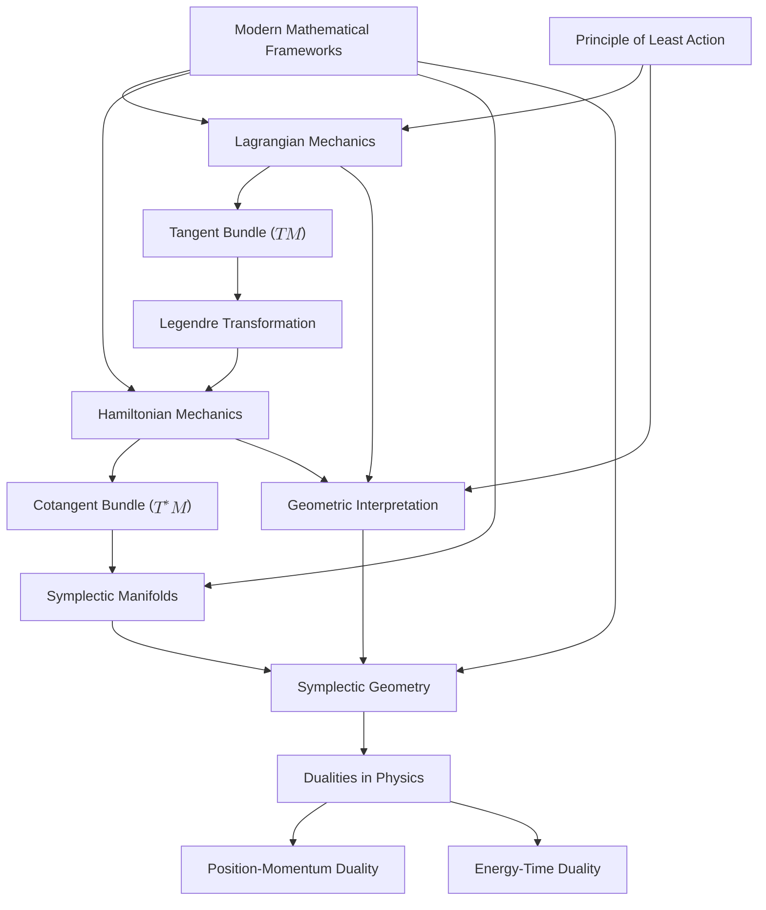

# Reconstructing Classical Mechanics: A Deep Geometric Insight into the Principle of Least Action
* * *

*"Geometry is the art of giving the same name to different things."*
— Henri Poincaré

# **1. Introduction**

*“The essence of mathematics lies in its freedom.”*
— Georg Cantor

Classical mechanics, the venerable cornerstone of physics, has long provided profound insights into the natural world. It laid the groundwork for our understanding of motion, forces, and energy, influencing countless developments across science and engineering. Traditionally framed through Newtonian mechanics, it relies heavily on vectorial descriptions and differential equations, offering a powerful but sometimes fragmented picture of physical phenomena.

However, as our mathematical language and understanding have evolved, so too has our capacity to reinterpret classical mechanics through new lenses. The advent of modern mathematical frameworks—particularly those rooted in geometry and topology—offers an opportunity to revisit and reconstruct classical mechanics from its own principles, unveiling deeper structures and connections that were previously obscured.

One of the most profound principles in physics is the **Principle of Least Action**. Rather than viewing motion merely as a response to forces, this principle encapsulates the behavior of physical systems as a whole, declaring that the actual path taken by a system between two states is the one for which the action integral is minimized (or stationary). This variational approach provides a unifying thread that weaves together disparate areas of physics, from classical mechanics to quantum field theory.

Yet, despite its unifying potential, the principle is often introduced as a mathematical convenience rather than a fundamental truth rooted in the geometry of the underlying space. This perspective can leave the profound implications and the intrinsic beauty of the principle underappreciated.

In this document, we embark on a journey to **reconstruct classical mechanics**, not by discarding its foundations, but by enriching them with modern geometric insights. By delving into the **geometric structures** inherent in mechanical systems—specifically the **tangent and cotangent bundles**, **symplectic manifolds**, and the transformative **Legendre transformation**—we aim to illuminate the deep connections that lie at the heart of physical laws.

Our exploration is motivated by several key considerations:

1. **Unified Framework**: Traditional mechanics often treats concepts like energy, momentum, and forces in segmented ways. A geometric approach allows us to view these concepts within a single, coherent framework.

2. **Intrinsic Structures**: By focusing on the geometric and topological properties of the spaces in which mechanics is formulated, we gain insights into the invariances and symmetries that govern physical laws.

3. **Modern Mathematical Tools**: The language of differential geometry and symplectic manifolds provides powerful tools to generalize and extend classical concepts, offering potential pathways to new discoveries.

4. **Deepening Understanding**: A geometric reconstruction not only clarifies existing knowledge but also deepens our intuition about why physical systems behave the way they do, potentially revealing hidden relationships and dualities.

The **geometric interpretation** of classical mechanics is not merely a mathematical reformulation; it is an invitation to perceive the physical world through a lens that highlights harmony, symmetry, and elegance. By embracing this perspective, we aspire to:

- **Reveal Hidden Connections**: Uncover the often-overlooked relationships between different areas of mechanics by expressing them in geometric terms.

- **Simplify Complexity**: Strip away unnecessary complications to expose the underlying simplicity of fundamental principles.

- **Encourage Exploration**: Inspire scholars and researchers to apply these insights to advanced topics and emerging areas in physics.

In the chapters that follow, we will systematically build upon the principle of least action, exploring its geometric underpinnings and implications. We will delve into the roles of the tangent and cotangent bundles, examine the significance of symplectic geometry, and elucidate how the Legendre transformation serves as a bridge between Lagrangian and Hamiltonian formulations.

By the end of this journey, we hope to have provided not just a reconstruction of classical mechanics, but a reinvigoration of its principles—casting new light on old concepts and paving the way for future advancements. This document is intended for experienced educators and researchers who are already familiar with the traditional formulations but are seeking a deeper, more unified understanding that could spark innovation and exploration in the field.

Let us begin this exploration, embracing the freedom of mathematics to transcend boundaries and uncover the profound geometries that govern the dance of the cosmos.

# **2. Foundations of Classical Mechanics**

*"Action is the foundational key to all success."*
— Pablo Picasso

Classical mechanics, while centuries old, continues to be a bedrock of physical understanding, offering profound insights into the motion and interactions of objects. To embark on a journey toward a geometric reconstruction of classical mechanics, it is imperative to first comprehend its foundational principles in depth. This chapter delves into the cornerstone concepts that not only define classical mechanics but also pave the way for a deeper geometric interpretation in subsequent discussions.

## **2.1 The Principle of Least Action**

### **2.1.1 Historical Significance**

The **Principle of Least Action** is one of the most elegant and unifying concepts in physics. Its origins trace back to the works of Pierre de Fermat, who proposed that light travels along the path of least time. This idea was later generalized by mathematicians and physicists such as Maupertuis, Euler, Lagrange, and Hamilton, culminating in a principle that applies to all classical mechanical systems.

Historically, the principle provided a powerful alternative to Newtonian mechanics. While Newton's laws focus on forces and accelerations at each instant, the principle of least action considers the entire trajectory of a system between two points in time, leading to a more holistic understanding of motion.

### **2.1.2 The Action Functional**

At the heart of the principle lies the **action functional**, a scalar quantity defined as an integral over time:
$$
S[q] = \int_{t_1}^{t_2} L(q(t), \dot{q}(t), t) \, dt
$$
Here, $q(t)$ represents the generalized coordinates of the system, $\dot{q}(t)$ their time derivatives (generalized velocities), and $L$ is the **Lagrangian** of the system. The action $S$ is a functional—its value depends on the entire function $q(t)$, not just its values at a single point.

### **2.1.3 Variational Principles**

The principle asserts that the physical trajectory of a system between times $t_1$ and $t_2$ is the one that makes the action functional $S[q]$ stationary with respect to infinitesimal variations of the path, holding the endpoints fixed. Mathematically, this is expressed as:
$$
\delta S = \delta \int_{t_1}^{t_2} L(q, \dot{q}, t) \, dt = 0
$$
This condition leads to the **Euler-Lagrange equations**, which are necessary and sufficient conditions for $S[q]$ to be stationary under variations:
$$
\frac{d}{dt} \left( \frac{\partial L}{\partial \dot{q}_i} \right) - \frac{\partial L}{\partial q_i} = 0, \quad i = 1, \dots, n
$$
These equations govern the dynamics of the system, encapsulating Newton's laws within a more general and powerful framework.

### **2.1.4 Role in Deriving Equations of Motion**

The variational approach provides a systematic method for deriving the equations of motion for any mechanical system:

1. **Define the Lagrangian $L$**: Typically as $L = T - V$, where $T$ is the kinetic energy and $V$ is the potential energy.

2. **Compute the Variations**: Calculate the variation $\delta S$ due to small changes in the path $q(t) \rightarrow q(t) + \delta q(t)$.

3. **Apply the Stationary Action Condition**: Set $\delta S = 0$ to find the path that extremizes the action.

4. **Derive the Euler-Lagrange Equations**: Obtain a set of second-order differential equations that describe the system's evolution.

This method is remarkably versatile, accommodating constraints and generalized coordinates seamlessly, and serves as a foundational tool in both classical and modern physics.

### **2.1.5 Deep Philosophical Implications**

The principle of least action suggests that nature operates optimally, choosing paths that minimize (or extremize) a certain quantity. This idea resonates with fundamental notions of efficiency and simplicity in physical laws. It also implies an element of foresight or global optimization, contrasting with the local causality emphasized in Newtonian mechanics.

## **2.2 Lagrangian Mechanics**

### **2.2.1 Introduction to the Tangent Bundle $TM$**

To fully appreciate the Lagrangian formulation, it is essential to understand the geometric structure known as the **tangent bundle**. For a configuration space $M$, which is the set of all possible positions $q$ of a system, the tangent bundle $TM$ is the collection of all possible positions and velocities $(q, \dot{q})$.

- **Configuration Space $M$**: An $n$-dimensional manifold representing all possible states of the system.

- **Tangent Space $T_qM$**: At each point $q \in M$, the tangent space $T_qM$ consists of all possible velocity vectors at $q$.

- **Tangent Bundle $TM$**: The union of all tangent spaces at every point in $M$:
  $$
  TM = \bigsqcup_{q \in M} T_qM
  $$

The tangent bundle $TM$ is a $2n$-dimensional manifold, providing a natural setting for formulating mechanics in terms of positions and velocities.

### **2.2.2 The Lagrangian Function $L(q, \dot{q}, t)$**

The Lagrangian is a real-valued function defined on $TM \times \mathbb{R}$:
$$
L: TM \times \mathbb{R} \rightarrow \mathbb{R}
$$
For many systems, $L$ takes the form:
$$
L(q, \dot{q}, t) = T(\dot{q}) - V(q)
$$

- **Kinetic Energy $T(\dot{q})$**: Depends on the velocities $\dot{q}$ and, in general, is a quadratic form when expressed in an inertial frame.

- **Potential Energy $V(q)$**: Depends on the positions $q$.

### **2.2.3 Derivation of the Euler-Lagrange Equations**

Starting from the action functional:
$$
S[q] = \int_{t_1}^{t_2} L(q, \dot{q}, t) \, dt
$$
We consider a small variation $\delta q(t)$ with fixed endpoints. The variation of the action is:
$$
\delta S = \int_{t_1}^{t_2} \left( \frac{\partial L}{\partial q} \delta q + \frac{\partial L}{\partial \dot{q}} \delta \dot{q} \right) dt
$$
Integrating the second term by parts and applying the fixed endpoints condition $\delta q(t_1) = \delta q(t_2) = 0$, we obtain:
$$
\delta S = \int_{t_1}^{t_2} \left( \frac{\partial L}{\partial q} - \frac{d}{dt} \frac{\partial L}{\partial \dot{q}} \right) \delta q \, dt
$$
Setting $\delta S = 0$ for arbitrary $\delta q(t)$ yields the Euler-Lagrange equations.

### **2.2.4 Interpretation on the Tangent Bundle**

In geometric terms, the Euler-Lagrange equations define a vector field on $TM$ whose integral curves represent the physical trajectories of the system. The tangent bundle framework allows us to view dynamics as flows on manifolds, where each point in $TM$ specifies a state of the system (position and velocity).

This perspective is powerful because it abstracts away from coordinate representations, focusing instead on the intrinsic geometry of motion.

### **2.2.5 Benefits of the Lagrangian Formulation**

1. **Universality**: Applicable to a wide range of systems, including those with non-Cartesian coordinates and constraints.

2. **Symmetry and Conservation**: Symmetries in $L$ lead to conservation laws via Noether's theorem, revealing deep connections between geometry and physical quantities.

3. **Preparatory Ground**: Forms the basis for more advanced theories, such as quantum mechanics and general relativity, where the action principle remains central.

### **2.2.6 Examples Illustrating Key Concepts**

#### **2.2.6.1 Simple Harmonic Oscillator**

For a mass $m$ attached to a spring with stiffness $k$:

- **Lagrangian**: $L = \frac{1}{2} m \dot{q}^2 - \frac{1}{2} k q^2$

- **Euler-Lagrange Equation**:
  $$
  m\ddot{q} + kq = 0
  $$
  Which is the familiar equation of motion for a harmonic oscillator.

#### **2.2.6.2 Particle in a Gravitational Field**

A particle of mass $m$ moving under gravity:

- **Lagrangian**: $L = \frac{1}{2} m \dot{\mathbf{q}}^2 - mgz$

- **Euler-Lagrange Equations**:
  $$
  m\ddot{x} = 0, \quad m\ddot{y} = 0, \quad m\ddot{z} = -mg
  $$

Recovering Newton's second law for a constant gravitational force.

### **2.2.7 Holonomic Constraints and Generalized Coordinates**

The Lagrangian framework excels in handling constraints. By introducing generalized coordinates that automatically satisfy the constraints, the equations of motion can be derived without the need for explicit constraint forces.

### **2.2.8 Connection to Hamilton's Principle**

The principle of least action in the Lagrangian formulation is sometimes referred to as **Hamilton's Principle**. It emphasizes that the true path of a system between two configurations is such that the action integral is stationary, reinforcing the deep variational underpinning of classical mechanics.

## **2.3 Summary**

The exploration of the principle of least action and the Lagrangian formulation in this chapter establishes the essential groundwork for the geometric structures that will be discussed in later chapters. By understanding how the action functional and the Euler-Lagrange equations arise from variational principles on the tangent bundle $TM$, we prepare to delve into symplectic geometry, the Legendre transformation, and Hamiltonian mechanics. These concepts will further illuminate the intrinsic geometric nature of classical mechanics, revealing deeper insights into the fabric of physical law.

# **3. Geometric Structures in Mechanics**

*"Geometry is not true, it is advantageous."*
— Robert M. Pirsig

The profound interplay between geometry and physics has been a cornerstone in the advancement of our understanding of the natural world. In classical mechanics, this relationship is exemplified by the geometric structures that underpin the formulation of the theory. By delving into these structures, we can gain deeper insights into the nature of motion, forces, and energy. This chapter introduces the essential geometric concepts of **tangent and cotangent bundles** and the framework of **symplectic manifolds**, which are fundamental to the modern geometric interpretation of classical mechanics.

## **3.1 Tangent and Cotangent Bundles**

### **3.1.1 Introduction to Fiber Bundles**

At the heart of differential geometry lies the concept of a **fiber bundle**, which provides a rigorous mathematical framework to describe spaces that locally resemble a product of two spaces but may possess a more intricate global structure. A fiber bundle $E$ consists of:

- A **base space** $M$, typically representing the manifold of all possible states (configuration space) of a system.
- A **fiber** $F$ attached to each point $q \in M$, representing additional information such as velocities or momenta.
- A **projection map** $\pi: E \rightarrow M$ that associates each point in the total space $E$ with a point in the base space $M$.

In mechanics, fiber bundles enable us to elegantly encapsulate both the positions and the state variables (like velocities and momenta) necessary to describe a system's evolution.

### **3.1.2 The Tangent Bundle $TM$**

#### **3.1.2.1 Definition and Geometric Significance**

Given a smooth manifold $M$, the **tangent bundle** $TM$ is the union of all tangent spaces at every point in $M$:
$$
TM = \bigsqcup_{q \in M} T_qM
$$
where $T_qM$ denotes the tangent space at point $q$, and $\bigsqcup$ represents the disjoint union over $M$.

- **Tangent Space $T_qM$**: The set of all possible directions in which one can tangentially pass through $q$. It consists of all velocity vectors at point $q$.

In the context of mechanics:

- **Configuration Space $M$**: Represents all possible positions of the system.
- **Phase Space $TM$**: Combining $q$ and $\dot{q}$ (velocities), $TM$ contains all possible states of the system in terms of positions and velocities.

#### **3.1.2.2 Role in Mechanics**

- **Lagrangian Mechanics**: The Lagrangian $L(q, \dot{q}, t)$ is defined on $TM \times \mathbb{R}$, making $TM$ the natural setting for formulating the equations of motion using the principle of least action.
- **Trajectory Description**: A system's evolution is described by a path $\gamma(t) = (q(t), \dot{q}(t))$ in $TM$.
- **Visualization of Dynamics**: Understanding the flow of states in $TM$ provides insights into the system's behavior, stability, and possible configurations.

#### **3.1.2.3 Local Coordinate Representation**

In a local chart, if $\{ q^i \}$ are coordinates on $M$, then a tangent vector at $q$ is expressed as:
$$
v = \dot{q}^i \frac{\partial}{\partial q^i}
$$
A point in the tangent bundle $TM$ is then given by the pair $(q^i, \dot{q}^i)$.

### **3.1.3 The Cotangent Bundle $T^*M$**

#### **3.1.3.1 Definition and Geometric Significance**

The **cotangent bundle** $T^*M$ is the dual space to the tangent bundle, comprising all cotangent spaces at each point $q \in M$:
$$
T^*M = \bigsqcup_{q \in M} T_q^*M
$$
where $T_q^*M$ is the cotangent space at $q$, consisting of all linear functionals (covectors) that act on $T_qM$.

- **Cotangent Space $T_q^*M$**: Represents the set of all possible linear functionals at $q$, mapping tangent vectors to real numbers.

In mechanics:

- **Momentum Space**: The cotangent bundle serves as the natural setting for momenta, which are covectors.
- **Phase Space in Hamiltonian Mechanics**: $T^*M$ becomes the phase space where positions $q$ and canonical momenta $p$ define the state of the system.

#### **3.1.3.2 Role in Mechanics**

- **Hamiltonian Mechanics**: The Hamiltonian $H(q, p, t)$ is defined on $T^*M \times \mathbb{R}$, utilizing positions and momenta to describe the system.
- **Symplectic Structure**: $T^*M$ inherently possesses a symplectic structure, critical for formulating Hamilton's equations and understanding conservation laws.
- **Canonical Coordinates**: The use of $(q^i, p_i)$ coordinates facilitates the transition from Lagrangian to Hamiltonian formulations.

#### **3.1.3.3 Local Coordinate Representation**

In local coordinates, a point in $T^*M$ is given by $(q^i, p_i)$, where $p_i$ are the components of the covector $p$, corresponding to the generalized momenta.

### **3.1.4 Physical Interpretation and Importance**

- **Duality of $TM$ and $T^*M$**: Reflects the fundamental relationship between velocities and momenta, pivotal in the Legendre transformation.
- **Geometric Framework**: Provides a rigorous mathematical structure to analyze mechanical systems, facilitating the application of differential geometry and topology.
- **Visualization of Physical Processes**: Enables the depiction of dynamics as trajectories within these geometric spaces, enhancing intuition and understanding.

### **3.1.5 Example: Simple Harmonic Oscillator**

Consider a one-dimensional harmonic oscillator with mass $m$ and spring constant $k$:

- **Configuration Space $M$**: The real line $\mathbb{R}$, representing the position $q$.
- **Tangent Bundle $TM$**: $\mathbb{R} \times \mathbb{R}$, with coordinates $(q, \dot{q})$.
- **Cotangent Bundle $T^*M$**: $\mathbb{R} \times \mathbb{R}$, with coordinates $(q, p)$, where $p = m \dot{q}$.

In this example, the structures of $TM$ and $T^*M$ allow us to transition seamlessly between the Lagrangian and Hamiltonian descriptions.

## **3.2 Symplectic Manifolds**

### **3.2.1 Definition and Fundamental Properties**

A **symplectic manifold** is a smooth, even-dimensional manifold $(M, \omega)$ equipped with a closed, non-degenerate differential 2-form $\omega$, known as the **symplectic form**.

- **Closed Form**: $d\omega = 0$, ensuring that $\omega$ is conserved along the flow.
- **Non-degeneracy**: For every non-zero vector $v \in T_qM$, there exists a vector $u \in T_qM$ such that $\omega(v, u) \neq 0$.

These properties imbue the manifold with a rich geometric structure that is essential for the formulation of Hamiltonian mechanics.

### **3.2.2 Symplectic Form**

The symplectic form $\omega$ provides a measurement of the "oriented area" spanned by pairs of tangent vectors. It is bilinear, antisymmetric, and provides a natural way to encode the mechanics of the system geometrically.

#### **3.2.2.1 Canonical Symplectic Form on $T^*M$**

On the cotangent bundle $T^*M$, the canonical symplectic form is defined as:
$$
\omega = -d\theta
$$
where $\theta$ is the **Liouville 1-form** (or canonical 1-form):
$$
\theta = p_i \, dq^i
$$
In local coordinates, the symplectic form becomes:
$$
\omega = dq^i \wedge dp_i
$$
This form is essential in expressing Hamilton's equations and analyzing the flow of the system.

### **3.2.3 Role in Mechanics**

#### **3.2.3.1 Hamiltonian Mechanics**

The symplectic manifold $(T^*M, \omega)$ provides the geometric arena for Hamiltonian mechanics:

- **Hamilton's Equations**: Expressed using the symplectic form:
  $$
  \dot{q}^i = \frac{\partial H}{\partial p_i}, \quad \dot{p}_i = -\frac{\partial H}{\partial q^i}
  $$

- **Symplectic Flow**: The time evolution of the system preserves the symplectic structure, a property known as **symplectomorphism**.

#### **3.2.3.2 Poisson Brackets**

The symplectic structure allows the definition of the **Poisson bracket** of two functions $f, g$:
$$
\{f, g\} = \omega(X_f, X_g) = \frac{\partial f}{\partial q^i} \frac{\partial g}{\partial p_i} - \frac{\partial f}{\partial p_i} \frac{\partial g}{\partial q^i}
$$
This bracket encodes the infinitesimal canonical transformations and underlies the equations of motion.

#### **3.2.3.3 Conservation Laws and Symmetries**

- **Noether's Theorem**: Symplectic geometry provides the framework for Noether's theorem, linking symmetries of the Hamiltonian to conserved quantities.
- **Energy Conservation**: The Hamiltonian $H$ is conserved if it does not explicitly depend on time, a direct consequence of the symplectic structure.

### **3.2.4 Examples in Mechanics**

#### **3.2.4.1 Free Particle**

For a free particle moving in $\mathbb{R}^n$:

- **Symplectic Form**: $\omega = dq^i \wedge dp_i$
- **Hamiltonian**: $H = \frac{1}{2m} p_i p_i$
- **Equations of Motion**: Linear trajectories in phase space, preserving the symplectic area.

#### **3.2.4.2 Pendulum**

- **Configuration Space**: $M = S^1$ (the circle), accounting for the periodicity of the pendulum's angle.
- **Symplectic Structure**: The cotangent bundle $T^*S^1$ possesses a natural symplectic form, enabling the analysis of the pendulum's dynamics within this framework.

### **3.2.5 Darboux's Theorem**

An important result in symplectic geometry is **Darboux's Theorem**, which states:

- **Statement**: Every symplectic manifold is locally symplectomorphic to $(\mathbb{R}^{2n}, \omega_0)$, where $\omega_0 = dq^i \wedge dp_i$.
- **Implication**: Locally, all symplectic manifolds look the same, simplifying the analysis of local properties of mechanical systems.

### **3.2.6 Importance of Symplectic Geometry in Mechanics**

#### **3.2.6.1 Preservation of Phase Space Volume**

- **Liouville's Theorem**: In Hamiltonian mechanics, the flow preserves the symplectic volume, meaning that the phase space density remains constant along trajectories.
- **Canonical Transformations**: Transformations that preserve the symplectic form ($\omega$) are canonical and preserve the structure of the equations of motion.

#### **3.2.6.2 Global Properties and Topology**

While Darboux's theorem assures local equivalence, the global properties of symplectic manifolds can vary significantly:

- **Topology of $M$**: Influences the global dynamics and possible configurations.
- **Obstructions**: Certain global symplectic invariants impact the existence of particular motions or states.

#### **3.2.6.3 Quantum Mechanics Connection**

- **Geometric Quantization**: Symplectic manifolds serve as the classical starting point for quantization procedures, linking classical and quantum mechanics.
- **Phase Space Path Integrals**: Utilize symplectic geometry to formulate quantum mechanical amplitudes.

### **3.2.7 Geometric Interpretation of Mechanics**

- **Dynamics as Flows**: The motion of a system corresponds to a flow on the symplectic manifold, determined by Hamilton's equations.
- **Symplectic Leaves**: In integrable systems, the motion can be confined to lower-dimensional submanifolds, providing insights into conserved quantities and stability.

## **3.3 Summary**

This chapter builds upon the foundational principles established earlier, transitioning from the action principle and Lagrangian mechanics to a more profound geometric understanding of classical mechanics. By introducing the tangent and cotangent bundles, we have established the essential geometric spaces where mechanical systems evolve. The exploration of symplectic manifolds equips us with the necessary tools to delve into Hamiltonian mechanics, the Legendre transformation, and the deep symmetries of physical laws. These concepts are pivotal for the subsequent examination of dualities in physics and the geometric interpretation of the principle of least action, as they provide the mathematical structure that unifies various formulations of mechanics under a common geometric framework.

*By embracing the geometric structures inherent in mechanics, we not only gain deeper insights into the nature of physical laws but also pave the way for advancements in theoretical physics, from classical to quantum realms. The journey through tangent and cotangent bundles and symplectic manifolds sets the stage for a richer, more unified understanding of the mechanics that govern the universe.*

# **4. Legendre Transformation and Dualities**

*"In every duality, there is a hidden unity."*
— Anonymous

In classical mechanics, the Lagrangian and Hamiltonian formulations offer profound insights into physical systems. The **Legendre Transformation** serves as a critical bridge between these two formulations, establishing connections between the **tangent bundle ($TM$)** and the **cotangent bundle ($T^*M$)**. Through this transformation, we unveil deep dual relationships between physical quantities. This chapter delves into the mathematical formalism of the Legendre transformation and explores the dualities it manifests in physics, particularly the **position-momentum duality** and the **energy-time duality**. These dualities are significant not only mathematically but also play a central role in our understanding of physical phenomena.

## **4.1 The Mathematical Formalism of the Legendre Transformation**

### **4.1.1 Definition of the Legendre Transformation**

The Legendre transformation is a mathematical operation that transforms a convex function into its conjugate function. In physics, it is utilized to establish relationships between the Lagrangian and Hamiltonian functions, thereby transitioning between the tangent and cotangent bundles.

Given a variable $x$ and a convex function $f(x)$, its Legendre transform is defined as:
$$
f^*(p) = \sup_{x} \left( px - f(x) \right)
$$
where $p$ is the variable conjugate to $x$, often referred to as the momentum corresponding to $x$.

### **4.1.2 Application in Mechanics**

In Lagrangian mechanics, the state of a system is described by its position $q$ and velocity $\dot{q}$, with the Lagrangian function $L(q, \dot{q}, t)$ defined as the kinetic energy $T$ minus the potential energy $V$:
$$
L(q, \dot{q}, t) = T(\dot{q}) - V(q)
$$
The Legendre transformation is used to convert $L$ into the Hamiltonian function $H(q, p, t)$, where $p$ is the generalized momentum defined by:
$$
p = \frac{\partial L}{\partial \dot{q}}
$$
The Hamiltonian function is then defined as:
$$
H(q, p, t) = p\, \dot{q} - L(q, \dot{q}, t)
$$
By expressing $\dot{q}$ in terms of $p$, we complete the transformation from $TM$ to $T^*M$.

### **4.1.3 Connecting $TM$ and $T^*M$**

- **Tangent Bundle $TM$**: Contains positions $q$ and velocities $\dot{q}$; it is the stage for Lagrangian mechanics.
- **Cotangent Bundle $T^*M$**: Contains positions $q$ and generalized momenta $p$; it serves as the framework for Hamiltonian mechanics.

The Legendre transformation establishes a correspondence between these two spaces, allowing us to switch between different formulations of mechanics seamlessly.

### **4.1.4 Physical Significance of the Legendre Transformation**

- **Redefinition of the Energy Function**: Through the Legendre transformation, we shift the dynamical description of the system from velocities to momenta.
- **Providing New Perspectives**: The Hamiltonian formulation offers advantages in analyzing dynamical systems, especially in addressing complex systems and facilitating quantization.

### **4.1.5 Example: Simple Harmonic Oscillator**

For a simple harmonic oscillator with mass $m$ and spring constant $k$:

- **Lagrangian Function**:
  $$
  L = \frac{1}{2} m \dot{q}^{\,2} - \frac{1}{2} k q^{2}
  $$

- **Generalized Momentum**:
  $$
  p = \frac{\partial L}{\partial \dot{q}} = m \dot{q}
  $$

- **Hamiltonian Function**:
  $$
  H = p\, \dot{q} - L = \frac{p^{2}}{2m} + \frac{1}{2} k q^{2}
  $$

Through the Legendre transformation, we successfully transition the system's description from velocity space to momentum space.

## **4.2 Position-Momentum Duality**

### **4.2.1 The Concept of Duality**

In physics, duality refers to two seemingly different but fundamentally interconnected concepts or variables. This relationship often manifests mathematically through transformations or symmetries. In classical mechanics, position and momentum form one of the most fundamental dualities.

### **4.2.2 Position-Momentum Duality in the Legendre Transformation**

- **Position $q$**: Describes the location of a particle in space; it is a directly observable quantity.
- **Momentum $p$**: Related to the rate of change of position; connected to velocity $\dot{q}$ through the definition of generalized momentum.

The Legendre transformation converts the velocity variable $\dot{q}$ into the momentum variable $p$, highlighting the intrinsic connection between position and momentum. This transformation is not merely a mathematical substitution but represents a fundamental change in the description of the system's dynamics.

### **4.2.3 Manifestation in Symplectic Geometry**

In symplectic geometry, position and momentum are treated as conjugate coordinates, together forming the phase space:

- **Phase Space**: Composed of $(q, p)$ and structured as the cotangent bundle $T^*M$; it is the foundational setting for Hamiltonian mechanics.
- **Symplectic Form**: A closed, non-degenerate 2-form defined on phase space:
  $$
  \omega = dq \wedge dp
  $$

This symplectic form encapsulates the duality between position and momentum and ensures the preservation of Hamiltonian dynamics.

### **4.2.4 Canonical Transformations and Duality**

Canonical transformations are changes of variables in phase space that preserve the symplectic form. These transformations underline the symmetrical relationship between position and momentum, allowing the same physical system to be described in different coordinate systems without altering its fundamental properties.

### **4.2.5 Physical Meaning and Deeper Understanding**

The position-momentum duality reflects fundamental limits in measurement and state description. In classical mechanics, it underscores the interdependence of position and momentum, while in quantum mechanics, it is closely related to the Heisenberg uncertainty principle. A profound understanding of this duality enhances our ability to comprehend and predict the dynamical behavior of systems within a broader physical framework.

## **4.3 Energy-Time Duality**

### **4.3.1 The Role of Time in Mechanics**

In classical mechanics, time is typically treated as an independent parameter that describes the evolution of systems. However, there exists a duality between energy and time that is as fundamental as the position-momentum duality.

### **4.3.2 Manifestation of Energy-Time Duality**

- **Energy $E$**: The total energy of the system, given by the Hamiltonian function $H(q, p, t)$.
- **Time $t$**: The parameter governing the system's evolution, which under certain circumstances can be considered a dynamic variable.

This duality becomes particularly significant in advanced theories, such as relativity and quantum mechanics, where the interplay between energy and time leads to profound implications.

### **4.3.3 Hamilton-Jacobi Equation and Duality**

The Hamilton-Jacobi equation provides a bridge between classical and quantum mechanics:
$$
H\left(q, \frac{\partial S}{\partial q}, t\right) + \frac{\partial S}{\partial t} = 0
$$
Here, $S$ is the action, and the equation shows that the partial derivative of $S$ with respect to time, together with the Hamiltonian, sums to zero. This reflects a deep connection between energy and time, where changes in energy are intimately linked to the temporal evolution of the system.

### **4.3.4 Manifestation in Quantum Mechanics**

- **Uncertainty Principle**: The energy-time uncertainty relation $\Delta E \, \Delta t \geq \frac{\hbar}{2}$ emphasizes that energy and time cannot both be precisely determined simultaneously, highlighting their dual nature.
- **Spectral and Time-Domain Analysis**: In quantum mechanics and signal processing, there is a fundamental duality between frequency (related to energy) and time-domain representations.

### **4.3.5 Geometric Interpretation in Classical Mechanics**

Within the geometric framework of classical mechanics, the energy-time duality can be understood through the analysis of system trajectories in phase space:

- **Parameterization of Phase Space Trajectories**: Time acts as a parameter along which the system evolves in phase space, with its motion constrained by the energy levels (energy shells).
- **Time Evolution in Conservative Systems**: For Hamiltonians that do not explicitly depend on time, energy is conserved, and the system's evolution reflects motion along surfaces of constant energy.

### **4.3.6 Physical Significance and Impact**

The energy-time duality reminds us that time is not merely a passive parameter but is closely intertwined with the system's energy characteristics. Recognizing and understanding this duality is crucial for exploring the temporal scales of physical processes and the energy transformations within them. It has significant implications in fields like spectroscopy, particle physics, and the study of transient phenomena.

## **4.4 Summary**

This chapter bridges earlier geometric concepts with the deep-seated properties of physical systems by thoroughly exploring the Legendre transformation and the position-momentum and energy-time dualities. The Legendre transformation is not just a mathematical tool but a window into the inherent symmetries and dualities of physical systems. Understanding these dualities elevates our grasp of the essence of classical mechanics, laying a solid foundation for subsequent explorations into Hamiltonian mechanics, variational principles in symplectic geometry, and more expansive physical theories.

*The existence of dualities suggests that in physics, many seemingly independent concepts are, in fact, different expressions of the same underlying reality. By uncovering these profound connections, we not only deepen our understanding of existing theories but also open doors to discovering new physical laws.*

# **5. Hamiltonian Mechanics on Cotangent Bundles**

*"The laws of nature are but the mathematical thoughts of God."*
— Euclid

## **5.1 Formulation of Hamiltonian Mechanics**

The transition from Lagrangian to Hamiltonian mechanics marks a profound shift in how we understand dynamical systems. While Lagrangian mechanics operates on the tangent bundle $TM$ of the configuration manifold $M$, Hamiltonian mechanics finds its natural habitat on the cotangent bundle $T^*M$. This section delves into the formulation of Hamiltonian mechanics within the geometric framework of $T^*M$, emphasizing the symplectic structure that underpins the theory.

**The Cotangent Bundle $T^*M$**

The cotangent bundle $T^*M$ of a manifold $M$ is the union of all cotangent spaces $T_q^*M$ at every point $q \in M$:
$$
T^*M = \bigcup_{q \in M} T_q^*M.
$$
Each cotangent space $T_q^*M$ consists of all linear functionals (covectors) that map tangent vectors at $q$ to real numbers. In mechanics, elements of $T^*M$ are naturally associated with positions and their conjugate momenta $(q^i, p_i)$, forming the phase space of the system.

**Legendre Transformation Revisited**

To transition from the Lagrangian $L(q^i, \dot{q}^i, t)$ defined on $TM$ to the Hamiltonian $H(q^i, p_i, t)$ on $T^*M$, we employ the Legendre transformation:
$$
\begin{aligned}
p_i &= \frac{\partial L}{\partial \dot{q}^i}, \\
H(q^i, p_i, t) &= p_i \dot{q}^i - L(q^i, \dot{q}^i, t).
\end{aligned}
$$
Here, $p_i$ are the conjugate momenta corresponding to the generalized coordinates $q^i$, and $\dot{q}^i$ are expressed in terms of $q^i$ and $p_i$ by inverting the first equation.

**Symplectic Structure on $T^*M$**

The cotangent bundle $T^*M$ carries a natural symplectic structure, arising from its differential geometry. The symplectic form $\omega$ is a closed, non-degenerate 2-form defined as:
$$
\omega = dp_i \wedge dq^i.
$$
This symplectic form encodes the fundamental Poisson brackets and is essential in formulating Hamilton's equations.

**Hamilton's Equations via Symplectic Geometry**

Hamiltonian dynamics can be elegantly expressed using the symplectic form. Given a Hamiltonian function $H: T^*M \times \mathbb{R} \to \mathbb{R}$, the equations of motion are derived from the condition that the flow $\phi_t$ generated by $H$ preserves the symplectic form:
$$
\iota_{X_H} \omega = dH,
$$
where $X_H$ is the Hamiltonian vector field associated with $H$, and $\iota_{X_H}$ denotes the interior product. This leads to Hamilton's equations:
$$
\dot{q}^i = \frac{\partial H}{\partial p_i}, \quad \dot{p}_i = -\frac{\partial H}{\partial q^i}.
$$
These first-order differential equations describe the time evolution of the system in phase space $T^*M$.

**Properties of Hamilton's Equations**

1. **Symplectic Invariance**: Hamiltonian flows preserve the symplectic form ($\mathcal{L}_{X_H} \omega = 0$), where $\mathcal{L}_{X_H}$ is the Lie derivative along $X_H$. This preservation reflects the conservation of the fundamental structure of phase space under time evolution.

2. **Time Reversibility**: Hamilton's equations are symmetric under time reversal when $H$ is time-independent, embodying the reversible nature of classical mechanics.

3. **Canonical Transformations**: Transformations that preserve the symplectic form (canonical transformations) allow us to simplify problems by changing variables while maintaining the form of Hamilton's equations.

**Example: Simple Harmonic Oscillator**

Consider a one-dimensional simple harmonic oscillator with mass $m$ and spring constant $k$.

- **Hamiltonian**:
  $$
  H(q, p) = \frac{p^2}{2m} + \frac{1}{2} k q^2.
  $$

- **Hamilton's Equations**:
  $$
  \begin{aligned}
  \dot{q} &= \frac{\partial H}{\partial p} = \frac{p}{m}, \\
  \dot{p} &= -\frac{\partial H}{\partial q} = -k q.
  \end{aligned}
  $$

These equations describe oscillatory motion, with solutions illustrating the elegance and power of Hamiltonian mechanics in $T^*M$.

## **5.2 Symplectic Structure and Conserved Quantities**

The symplectic structure not only provides the arena for formulating Hamiltonian mechanics but also plays a pivotal role in understanding conserved quantities through Noether's theorem. This section explores how symmetries in the Hamiltonian framework give rise to conservation laws, highlighting the deep interplay between geometry and physics.

**Noether's Theorem in Hamiltonian Mechanics**

Noether's theorem establishes that every continuous symmetry of the action corresponds to a conserved quantity. In the context of Hamiltonian mechanics, symmetries are expressed through transformations that leave the Hamiltonian $H$ invariant.

**Canonical Transformations and Symmetries**

A canonical transformation is a change of variables $(q^i, p_i) \to (Q^i, P_i)$ that preserves the symplectic form:
$$
dp_i \wedge dq^i = dP_i \wedge dQ^i.
$$
If the Hamiltonian remains unchanged under such a transformation, the generator of the transformation is a conserved quantity.

**Momentum Maps and Conserved Quantities**

Consider a symmetry generated by a vector field $X$ on $T^*M$. The momentum map $J$ associates with $X$ a function $J_X$ on $T^*M$ such that:
$$
\iota_{X} \omega = -dJ_X.
$$
When $X$ is a Hamiltonian vector field, $J_X$ is conserved along the flow of $H$:
$$
\frac{d}{dt} J_X = \{ J_X, H \} = 0.
$$

**Example: Conservation of Linear Momentum**

For a system invariant under spatial translations, the Hamiltonian does not depend explicitly on the coordinates $q^i$:
$$
\frac{\partial H}{\partial q^i} = 0.
$$
From Hamilton's equations:
$$
\dot{p}_i = -\frac{\partial H}{\partial q^i} = 0,
$$
implying that the momenta $p_i$ are conserved. This reflects the conservation of linear momentum due to translational symmetry.

**Example: Conservation of Angular Momentum**

For rotationally invariant systems, the Hamiltonian remains unchanged under rotations generated by the angular momentum operator $L$. The conservation of angular momentum arises naturally:
$$
\frac{d}{dt} L = \{ L, H \} = 0.
$$

**Symplectic Structure and Poisson Brackets**

The symplectic form $\omega$ induces the Poisson bracket between functions $f, g$ on $T^*M$:
$$
\{ f, g \} = \omega(X_f, X_g) = \frac{\partial f}{\partial q^i} \frac{\partial g}{\partial p_i} - \frac{\partial f}{\partial p_i} \frac{\partial g}{\partial q^i}.
$$
Conserved quantities commute with the Hamiltonian under the Poisson bracket:
$$
\{ H, C \} = 0 \implies \frac{d}{dt} C = 0.
$$

**Implications of Noether's Theorem**

1. **Energy Conservation**: Time translation symmetry leads to the conservation of energy. If $H$ does not depend explicitly on time, it is conserved:
   $$
   \frac{dH}{dt} = \frac{\partial H}{\partial t} = 0.
   $$

2. **Symmetry and Integrability**: Systems with sufficient symmetries may be integrable, allowing for complete solutions in terms of conserved quantities.

3. **Reduction of Degrees of Freedom**: Conserved quantities reduce the effective number of variables, simplifying the analysis of complex systems.

**Geometric Understanding**

The symplectic structure provides a geometric framework in which conserved quantities correspond to flows that preserve $\omega$. Symmetries generate group actions on $T^*M$, and the associated momentum maps encapsulate the conservation laws.

**Connections to the Legendre Transformation**

The Legendre transformation enables the transition from Lagrangian to Hamiltonian mechanics, revealing the symplectic structure that is not apparent in $TM$. By moving to $T^*M$, we uncover the natural geometric language to express conservation laws and symmetries inherent in classical mechanics.

## **5.3 Summary**

In this exploration of Hamiltonian mechanics on cotangent bundles, we have delved into the profound geometric structures that underlie classical mechanics. By formulating the dynamics on $T^*M$ with its inherent symplectic structure, we gain not only a powerful mathematical framework but also a deeper understanding of the fundamental principles governing physical systems.

The symplectic geometry not only encapsulates the equations of motion but also illuminates the path to discovering conserved quantities through Noether's theorem. This geometric perspective reveals the elegance and unity of mechanics, where symmetries and conservation laws are manifestations of the underlying mathematical structure.

Building upon the Legendre transformation and the foundations laid in the earlier sections, we see how Hamiltonian mechanics emerges naturally from the principle of least action when viewed through the lens of modern mathematics. This approach not only unifies various concepts in mechanics but also opens avenues for further exploration in advanced theories, such as quantum mechanics and symplectic topology.

*By embracing the geometric underpinnings of classical mechanics, we move closer to grasping the intrinsic nature of physical laws, echoing Euclid's sentiment that the laws of nature are, indeed, mathematical thoughts.*

# **6. Geometric Interpretation of the Principle of Least Action**

*"Nature does nothing in vain."*
— Aristotle

The Principle of Least Action is not merely a computational tool but a profound reflection of the inherent efficiency and elegance of natural laws. To truly grasp its significance, it's essential to delve into its geometric underpinnings. By reinterpreting the action functional geometrically, we uncover how classical mechanics is intrinsically linked to the geometry of the spaces through which systems evolve. This perspective not only enriches our understanding but also unifies the various formulations of mechanics under a common geometric framework.

## **6.1 Action as a Geometric Object**

**Reinterpreting the Action Functional**

The action functional, traditionally expressed as:
$$
S[q] = \int_{t_1}^{t_2} L(q(t), \dot{q}(t), t) \, dt,
$$
where $L$ is the Lagrangian of the system, can be viewed through a geometric lens by considering differential forms and paths on manifolds.

**Configuration Space as a Manifold**

The configuration space $M$ of a mechanical system is a smooth manifold representing all possible positions $q$ the system can occupy. Each point $q \in M$ corresponds to a unique configuration of the system.

**Tangent Bundle and Velocities**

The **tangent bundle** $TM$ of $M$ is the manifold consisting of all possible pairs $(q, \dot{q})$, where $\dot{q}$ is a tangent vector at $q$. This bundle encapsulates all possible positions and velocities of the system.

**Action as an Integral over Paths**

A path $\gamma: [t_1, t_2] \rightarrow M$ represents the evolution of the system over time. The action functional computes a scalar value associated with this path by integrating the Lagrangian along the trajectory:
$$
S[\gamma] = \int_{\gamma} L(q, \dot{q}, t) \, dt.
$$
This integral can be interpreted geometrically as the accumulation of a certain quantity (the Lagrangian) along the path in the manifold $M$.

**Differential Forms and the Action**

By associating the Lagrangian with a differential form, we can express the action in terms of **semi-basic 1-forms** on $TM$. The Lagrangian $L$ induces the **Poincaré–Cartan 1-form** $\theta_L$:
$$
\theta_L = \frac{\partial L}{\partial \dot{q}^i} dq^i - L \, dt.
$$
The exterior derivative of $\theta_L$ yields the **Poincaré–Cartan 2-form** $\omega_L$:
$$
\omega_L = d\theta_L.
$$
These forms enable us to express the dynamics of the system in terms of geometric objects on $TM$.

**Action and Symplectic Geometry**

On the cotangent bundle $T^*M$, equipped with its natural symplectic structure, the action can be connected to the integral of the canonical 1-form $\theta$ along a lift of the path $\gamma$ into $T^*M$:
$$
S[\gamma] = \int_{\gamma} (p_i \, dq^i - H \, dt),
$$
where $p_i = \frac{\partial L}{\partial \dot{q}^i}$ are the conjugate momenta, and $H$ is the Hamiltonian.

**Geometric Interpretation**

This geometric formulation highlights that the action is a functional that depends on the trajectory $\gamma$ traversing the manifold $M$ and can be understood as the integral of a differential form over this path. It bridges the Lagrangian and Hamiltonian descriptions, emphasizing the role of geometry in the fundamental laws of mechanics.

**Examples**

- **Free Particle**: The action corresponds to the length of the path in spacetime, and the least action path is a straight line, the shortest distance between two points.
  
- **Light in Optics**: Fermat's principle states that light travels the path of least time, which can be interpreted geometrically as geodesics in a medium with refractive index as a metric.

## **6.2 Variational Principles in Symplectic Geometry**

**Symplectic Manifolds as the Stage for Mechanics**

A **symplectic manifold** $(M, \omega)$ is a smooth even-dimensional manifold equipped with a closed, non-degenerate 2-form $\omega$. In mechanics, the phase space $T^*M$ naturally carries a symplectic structure, making it the ideal setting for Hamiltonian dynamics.

**Variational Principles and Symplectic Paths**

The principle of least action states that the actual path taken by a system is such that the action functional is stationary with respect to variations of the path. In symplectic geometry, this principle can be explored by considering the geometry of the phase space and the properties of the symplectic form.

**Hamilton's Equations and Symplectic Flow**

Hamilton's equations can be derived from the condition that the Hamiltonian vector field $X_H$ preserves the symplectic form:
$$
\omega(X_H, \cdot) = dH.
$$
This equation implies that the flow generated by $X_H$ is a symplectomorphism, preserving the symplectic structure $\omega$.

**Symplectic Energy and Action**

The action along a path in phase space can be related to the symplectic area (the integral of $\omega$) enclosed by the trajectory. For periodic or closed trajectories, this area becomes a significant quantity, linking classical mechanics with quantum mechanics through the Bohr-Sommerfeld quantization condition.

**Variational Calculus in Symplectic Geometry**

By employing variational calculus within the symplectic framework, we can consider variations $\delta \gamma$ of a path $\gamma$ in phase space that preserve certain constraints (e.g., fixed endpoints). The requirement that the first variation of the action vanishes leads to the classical equations of motion.

**Geometric Implications**

- **Lagangian Submanifolds**: The solutions to Hamilton's equations correspond to Lagrangian submanifolds of $T^*M$, on which the symplectic form $\omega$ restricts to zero. This property reflects the conservation of certain quantities along the trajectories.
  
- **Symplectic Capacities and Invariants**: Symplectic geometry introduces global invariants that can influence the behavior of dynamical systems, potentially constraining the types of motion or transformations that are possible.

**Examples**

- **Kepler Problem**: The motion of planets can be analyzed using symplectic manifolds, revealing conserved quantities like angular momentum and enabling a deeper understanding of orbital mechanics.
  
- **Integrable Systems**: Systems with enough conserved quantities can be studied using action-angle variables, where the geometry of tori in phase space becomes paramount.

**Quantization and the Geometric Phase**

The geometric interpretation of the action functional extends into quantum mechanics. Concepts like the **geometric phase** (or Berry phase) emerge from the geometrical properties of parameter spaces and have profound implications in fields like quantum optics and condensed matter physics.

**Implications for Classical and Modern Physics**

- **Unification of Mechanics**: The geometric approach unifies the Lagrangian and Hamiltonian formulations, showing them to be different perspectives within the same geometric framework.
  
- **Advanced Theories**: Understanding the geometric nature of the action is essential in areas like general relativity and string theory, where the fabric of spacetime itself is dynamic and geometric.

**Concluding Thoughts**

Recasting the principle of least action in geometric terms enriches our comprehension of classical mechanics and provides powerful tools for tackling complex problems. It reveals that the laws governing physical systems are deeply rooted in the geometry of the spaces through which they evolve, affirming the profound connection between physics and geometry.

## **6.3 Summary**

This chapter synthesizes the concepts from previous sections, illustrating how the principle of least action is not just a calculational method but an expression of the geometric essence of mechanics. By interpreting the action functional as a geometric object and exploring variational principles within the symplectic framework, we deepen our understanding of classical mechanics and set the stage for exploring more advanced topics and modern developments in physics.

# **7. Applications and Implications**

*"The real voyage of discovery consists not in seeking new landscapes, but in having new eyes."*
— Marcel Proust

Having established the deep geometric foundations of classical mechanics, we now turn our attention to the **applications and implications** of these insights in more complex and contemporary settings. This exploration not only demonstrates the power and versatility of geometric methods but also opens doors to new avenues of research and understanding in physics.

## **7.1 Advanced Topics in Mechanics**

### **7.1.1 Integrable Systems and Action-Angle Variables**

**Integrable Systems** are those possessing as many conserved quantities (integrals of motion) as degrees of freedom, allowing them to be solved exactly. The geometric approach provides profound insights into such systems:

- **Torus Structure**: In the phase space of integrable systems, the trajectories lie on invariant tori. Using **action-angle variables**, the Hamiltonian dynamics become linear and the motions are represented as straight lines on these tori.
  
- **Liouville's Theorem**: The theorem states that if a system is integrable, its phase flow preserves the symplectic structure. The action variables are conserved, and the angle variables evolve linearly in time.
  
- **Examples**: The harmonic oscillator and the Kepler problem are classical examples where geometric methods simplify analysis and yield exact solutions.

**Geometric Significance**:

- The use of action-angle variables exemplifies how geometry simplifies complex dynamics by reducing them to linear motion on a geometrically simple manifold.
  
- It highlights the deep connection between symmetries, conserved quantities, and the underlying geometric structure of phase space.

### **7.1.2 Chaos and Nonlinear Dynamics**

The geometric framework also sheds light on **chaotic systems** and **nonlinear dynamics**, where small changes in initial conditions lead to vastly different outcomes:

- **Phase Space Structure**: Chaotic systems exhibit complex structures in phase space, such as strange attractors and fractal boundaries, which are deeply tied to the system's symplectic geometry.
  
- **Poincaré Maps**: By analyzing the intersections of trajectories with a lower-dimensional subspace, we gain insights into the system's long-term behavior and stability.

- **Kolmogorov-Arnold-Moser (KAM) Theory**: KAM theory describes how integrable systems respond to small perturbations, predicting the persistence of some invariant tori and the emergence of chaos.

**Geometric Interpretation**:

- The breakdown of invariant tori in perturbed integrable systems reveals the delicate balance between order and chaos, governed by the system's geometry.
  
- Understanding the geometric mechanisms underlying chaos aids in predicting and controlling complex systems across physics, engineering, and beyond.

### **7.1.3 Modern Developments in Mechanics**

#### **7.1.3.1 Geometric Mechanics and Field Theories**

- **Fiber Bundles and Gauge Theories**: Extending the notion of fiber bundles to field theories enables the formulation of gauge theories, which are central to the Standard Model of particle physics.
  
- **Symplectic and Poisson Manifolds in Field Theory**: The generalization of symplectic geometry to infinite-dimensional manifolds allows for the geometric formulation of classical field theories.

#### **7.1.3.2 Contact Geometry and Thermodynamics**

- **Contact Manifolds**: By extending symplectic geometry to **contact geometry**, we can describe systems with dissipation, such as thermodynamic processes.
  
- **Geometric Thermodynamics**: This approach provides new insights into the laws of thermodynamics, phase transitions, and critical phenomena through a geometric lens.

#### **7.1.3.3 Geometric Quantization**

- **Bridging Classical and Quantum Mechanics**: Geometric quantization seeks to systematically transition from classical symplectic manifolds to quantum Hilbert spaces, preserving geometric structures.
  
- **Applications**: This methodology has profound implications in the study of quantum chaos, topological quantum field theories, and the quantum Hall effect.

**Impact on Contemporary Physics**:

- The geometric perspective is instrumental in cutting-edge research areas like string theory, where the geometry of extra dimensions plays a critical role.
  
- It also influences the development of new mathematical tools and concepts, such as mirror symmetry and moduli spaces, which have broad applications across physics and mathematics.

## **7.2 Towards New Horizons**

### **7.2.1 Emerging Research Areas**

**Symplectic Topology and Floer Homology**

- **Symplectic Topology**: Explores global properties of symplectic manifolds, providing classifications and invariants that impact our understanding of mechanics at a foundational level.
  
- **Floer Homology**: A tool for studying the geometry of infinite-dimensional manifolds, with applications in quantum field theory and string theory.

**Noncommutative Geometry**

- **Deformation of Phase Space**: By considering noncommutative geometries, researchers explore modifications of classical phase space that may lead to quantum gravity theories.

- **Implications for Mechanics**: This approach could reconcile general relativity and quantum mechanics, leading to a deeper understanding of spacetime structure.

**Geometric Mechanics in Biology and Chemistry**

- **Mechanical Systems in Biology**: Applying geometric mechanics to biological systems—such as molecular motors, cellular movement, and population dynamics—reveals underlying principles shared with physical systems.
  
- **Chemical Reaction Networks**: Modeling chemical kinetics using geometric methods uncovers conservation laws and dynamical behaviors that are not immediately apparent.

### **7.2.2 Potential for Novel Discoveries**

**Unification of Physical Theories**

- **Towards a Theory of Everything**: Geometric methods could be the key to unifying general relativity and quantum mechanics, providing a consistent framework for all fundamental interactions.

- **Geometric Cosmology**: Understanding the geometry of the universe at large scales may lead to breakthroughs in cosmology, dark matter, and dark energy research.

**Technological Advancements**

- **Quantum Computing**: Geometric insights into quantum mechanics can influence the development of quantum algorithms and error correction methods.

- **Advanced Materials**: The study of symplectic and contact structures could impact the design of materials with unique mechanical and electromagnetic properties.

**Educational Transformation**

- **New Pedagogical Approaches**: Emphasizing geometry in physics education can foster deeper intuition and appreciation of the interconnectedness of physical laws.
  
- **Interdisciplinary Collaboration**: Bridging disciplines through geometric methods encourages collaboration between mathematicians, physicists, engineers, and other scientists.

### **7.2.3 Vision for the Future**

A deeper geometric understanding of classical mechanics is not just an academic pursuit but a gateway to transformative advancements in science and technology. By embracing this perspective, researchers and students alike can:

- **Discover Hidden Structures**: Unveil new symmetries and invariants that could revolutionize our understanding of physical systems.
  
- **Innovate Across Disciplines**: Apply geometric methods to solve complex problems in diverse fields such as meteorology, economics, and robotics.

- **Transform Theoretical Frameworks**: Develop new theories that better describe the complexities of the natural world, from subatomic particles to cosmic phenomena.

## **7.3 Summary**

This exploration into advanced applications and the potential horizons of geometric mechanics emphasizes the transformative power of viewing classical mechanics through a geometric lens. It encourages scholars to extend these concepts beyond traditional boundaries, fostering innovation and discovery. By integrating these deep geometric insights into their research, scientists can unlock new levels of understanding and pave the way for groundbreaking developments in physics and related fields.

*As we contemplate the vast landscape of possibilities that geometric mechanics unveils, we are reminded of Marcel Proust's words: the true voyage of discovery lies not in seeking new landscapes, but in seeing with new eyes. Embracing geometric perspectives equips us with those new eyes, allowing us to perceive the hidden harmonies of the universe and inspiring us to venture into uncharted territories of knowledge.*

# **8. Conclusion**

*"Simplicity is the ultimate sophistication."*
— Leonardo da Vinci

In traversing the intricate landscape of classical mechanics, we have embarked on a journey to peel back the layers of traditional formulations and to reveal the profound geometric structures that underpin the fundamental laws of nature. This reconstruction, grounded in the **principle of least action**, has illuminated how modern mathematical frameworks—particularly those involving differential geometry and symplectic topology—can deepen our understanding and provide a more unified perspective of physical phenomena.

**Unveiling the Geometric Fabric**

At the heart of this exploration lies the recognition that the equations and principles of mechanics are manifestations of underlying geometric structures. By considering the **tangent and cotangent bundles** of configuration spaces, we have reframed the motions and interactions of mechanical systems as flows and transformations within geometric manifolds. This shift from a purely analytical viewpoint to a geometric one allows us to see mechanics not just as equations of motion but as expressions of the geometry of the spaces through which systems evolve.

**The Principle of Least Action as a Geometric Guiding Light**

The **principle of least action** emerges as more than a mere method for deriving equations of motion; it is a profound statement about the economy and harmony of nature. When cast in geometric terms, the action functional becomes a bridge connecting paths in configuration space to the symplectic geometry of phase space. This interpretation underscores how the natural trajectories of systems are those that honor the intrinsic geometric properties of the space, highlighting the elegance and simplicity with which nature operates.

**Symplectic Geometry and the Harmony of Dualities**

The introduction of **symplectic manifolds** into the discussion has revealed the deep symmetries and dualities inherent in mechanics. The symplectic structure encapsulates the conservation laws and invariances that are central to physical laws. Through the **Legendre transformation**, we have connected the Lagrangian and Hamiltonian formulations, not merely as two sides of the same coin but as complementary perspectives linked by geometric transformations.

The exploration of **position-momentum** and **energy-time dualities** within this framework sheds light on how these fundamental pairs are entwined in the fabric of mechanics. These dualities are not arbitrary but arise naturally from the symplectic geometry, reflecting the inherent symmetries of the physical world.

**Implications and Applications**

By applying these geometric insights to complex mechanical systems, we have seen how they can simplify and clarify problems that are otherwise intractable. The study of integrable systems, chaotic dynamics, and modern developments like quantum mechanics and general relativity all benefit from this geometric approach. It provides a language and toolkit that can handle complexity with elegance, revealing patterns and structures that might otherwise remain hidden.

**Towards New Horizons**

Looking forward, the geometric reconstruction of classical mechanics opens doors to new areas of research and understanding. It invites us to consider questions such as:

- How might these geometric principles inform our understanding of quantum mechanics, where the symplectic structure plays a crucial role in phase space formulations?
- Can the geometric approach shed light on unifying theories in physics, such as string theory or loop quantum gravity, where the structure of spacetime itself is a central concern?
- How can the deep connections between geometry and physics inspire new mathematical discoveries, enriching both fields simultaneously?

This perspective encourages us to adopt **new eyes** in our quest for knowledge, as Marcel Proust suggests. It challenges us to look beyond equations and to seek the geometric and topological truths that underlie them.

**The Profound Simplicity of Nature**

In reflecting upon this journey, we recognize that the geometric reconstruction of classical mechanics brings us closer to the intrinsic nature of physical laws. It reaffirms the idea that at the deepest levels, nature operates through principles of remarkable simplicity and elegance. By embracing the geometric foundations, we not only unify previously disparate concepts but also gain profound insights into the workings of the universe.

This approach aligns with Leonardo da Vinci's assertion that simplicity is the ultimate sophistication. In stripping away extraneous complexities and focusing on the geometric essence, we achieve a more profound and nuanced understanding of mechanics. It is a testament to the power of human thought and the elegance of the mathematical structures that govern reality.

**Closing Thoughts**

The endeavor to reconstruct classical mechanics through a geometric lens has been both challenging and rewarding. It demands a willingness to think deeply, to question established norms, and to explore the intrinsic nature of things. Yet, it is precisely this depth of thought that yields the richest insights and the most transformative advancements.

As we conclude this exploration, we are left with a renewed appreciation for the unity and coherence of the physical laws that govern our world. The geometric structures we have uncovered do not merely provide alternative formulations; they offer a more cohesive and enlightened understanding of the universe. They remind us that, in the grand tapestry of nature, simplicity and complexity are woven together through the threads of geometry, guiding us toward ever deeper realms of knowledge.

*This conclusion serves as the culmination of our journey, weaving together the themes and insights from each preceding section. It reflects on how the geometric interpretation of classical mechanics unifies various concepts— from the principle of least action to symplectic geometry and dualities—and highlights their significance in providing a profound understanding of physical laws. By delving deeper into the intrinsic nature of mechanics, we recognize the transformative potential of this approach, both in advancing theoretical physics and in inspiring future research. It is an invitation to continue exploring the geometric foundations of the universe, embracing simplicity as the key to unlocking the deepest mysteries of nature.*

# **References**

1. **Goldstein, H., Poole, C., & Safko, J.** (2002). *Classical Mechanics* (3rd ed.). Addison-Wesley.

   - A comprehensive textbook that provides a thorough treatment of classical mechanics, including the Lagrangian and Hamiltonian formulations, with a focus on physical intuition and mathematical rigor.

2. **Arnold, V. I.** (1989). *Mathematical Methods of Classical Mechanics* (2nd ed.). Springer.

   - This seminal work presents classical mechanics from a modern mathematical perspective, emphasizing differential geometry and the symplectic structure of phase space.

3. **Abraham, R., & Marsden, J. E.** (1978). *Foundations of Mechanics* (2nd ed.). Benjamin/Cummings Publishing Company.

   - A foundational text that bridges mathematics and physics, exploring the geometric underpinnings of mechanics, including symplectic manifolds and fiber bundle theory.

4. **Marsden, J. E., & Ratiu, T. S.** (1999). *Introduction to Mechanics and Symmetry: A Basic Exposition of Classical Mechanical Systems* (2nd ed.). Springer.

   - This book delves into the role of symmetry in mechanics, offering insights into reduction theory, Hamiltonian systems, and the geometric methods used to analyze mechanical systems.

5. **Libermann, P., & Marle, C.-M.** (1987). *Symplectic Geometry and Analytical Mechanics*. D. Reidel Publishing Company.

   - An advanced text focusing on the mathematical structures of symplectic geometry and their applications to analytical mechanics, suitable for readers seeking a deeper mathematical understanding.

6. **Noether, E.** (1918). *Invariante Variationsprobleme*. *Nachrichten von der Gesellschaft der Wissenschaften zu Göttingen, Mathematisch-Physikalische Klasse*, 1918, 235–257.

   - Emmy Noether's groundbreaking paper introducing Noether's theorem, which links symmetries and conservation laws in physics, foundational for understanding the variational principles in mechanics.

7. **Woodhouse, N. M. J.** (1991). *Geometric Quantization* (2nd ed.). Clarendon Press.

   - Explores the process of geometric quantization, connecting classical mechanics with quantum mechanics through symplectic geometry, providing advanced insights into the quantization of classical systems.

8. **Arnold, V. I., Kozlov, V. V., & Neishtadt, A. I.** (2006). *Mathematical Aspects of Classical and Celestial Mechanics* (3rd ed.). Springer.

   - Part of the Encyclopaedia of Mathematical Sciences series, this volume covers advanced topics in classical mechanics, including perturbation theory and the Hamiltonian formalism in celestial mechanics.

9. **Marsden, J. E., & Weinstein, A.** (1974). *Reduction of Symplectic Manifolds with Symmetry*. *Reports on Mathematical Physics*, 5(1), 121–130.

   - A seminal paper discussing the reduction of symplectic manifolds possessing symmetries, foundational for understanding the role of symmetry in Hamiltonian systems.

10. **José, J. V., & Saletan, E. J.** (1998). *Classical Dynamics: A Contemporary Approach*. Cambridge University Press.

    - Offers a modern approach to classical dynamics, integrating geometric and computational methods, and emphasizing the use of variational principles and symplectic geometry.

11. **Da Silva, A. C.** (2001). *Lectures on Symplectic Geometry*. Springer.

    - An accessible introduction to symplectic geometry, covering fundamental concepts and advanced topics, suitable for those interested in the geometric structures that underpin classical mechanics.

12. **Sousa Dias, E., & de Gosson, M.** (2019). *Symplectic Methods in Harmonic Analysis and in Mathematical Physics*. Birkhäuser.

    - Explores the applications of symplectic geometry in harmonic analysis and mathematical physics, providing advanced methods relevant to both classical and quantum mechanics.

13. **Souriau, J.-M.** (1997). *Structure of Dynamical Systems: A Symplectic View of Physics*. Birkhäuser.

    - Presents a comprehensive view of dynamical systems using symplectic geometry, covering the mathematical structures that model physical systems and their evolution.

14. **Giaquinto, A.** (2018). *Symmetry and Quantum Mechanics*. Springer.

    - While focusing on quantum mechanics, this text provides valuable insights into the role of symmetry and its geometric interpretation, which are rooted in principles from classical mechanics.

15. **Butterfield, J., & Pagonis, C.** (Eds.). (1999). *From Physics to Philosophy*. Cambridge University Press.

    - A collection of essays exploring the philosophical implications of modern physics concepts, including discussions on the foundational principles of mechanics and their geometric interpretations.

These references provide a thorough foundation for further study into the geometric aspects of classical mechanics, the principle of least action, symplectic geometry, and the profound dualities that connect physics and mathematics. They are suitable for advanced readers seeking to deepen their understanding of the subjects discussed in this document.

# **Appendix A : Interrelationships of Core Concepts**

To facilitate a deeper understanding of the interconnected concepts presented in this document, we provide a visual representation elucidating the relationships between the core ideas and their roles within the geometric reconstruction of classical mechanics. This diagram serves as a conceptual roadmap, highlighting how each component builds upon and integrates with others to form a cohesive framework.

## **A.1 Conceptual Map of Core Ideas**

## **A.2 Explanation of Relationships**

- **Principle of Least Action (A)** is the foundational cornerstone, asserting that the path taken by a mechanical system between two states minimizes the action functional.

- **Lagrangian Mechanics (B)** arises from applying the principle of least action, formulating dynamics in terms of the Lagrangian $L(q, \dot{q}, t)$ on the **Tangent Bundle (C)**, $TM$, which encapsulates positions and velocities.

- The **Geometric Interpretation (M)** permeates the framework, emphasizing how geometric structures underpin the formulations of mechanics.

- The **Legendre Transformation (D)** serves as a mathematical bridge from Lagrangian to **Hamiltonian Mechanics (E)**, facilitating the transition between formulations by moving from velocities to momenta.

- **Hamiltonian Mechanics (E)** is formulated on the **Cotangent Bundle (F)**, $T^*M$, naturally leading to the exploration of **Symplectic Manifolds (G)** and the rich structure of **Symplectic Geometry (H)**.

- **Symplectic Geometry (H)** provides the mathematical underpinnings for conservation laws and dynamics, further revealing the inherent **Dualities in Physics (I)**.

- **Dualities in Physics (I)**, such as **Position-Momentum Duality (J)** and **Energy-Time Duality (K)**, manifest naturally within the symplectic framework, highlighting deep connections between physical quantities.

- **Modern Mathematical Frameworks (L)**, including differential geometry and fiber bundle theory, are instrumental in formulating and understanding each component, integrating them into a unified geometric perspective.

## **A.3 Key Points**

- The **Principle of Least Action** initiates the journey, leading to both Lagrangian and Hamiltonian formulations through geometric constructs.

- **Tangent ($TM$)** and **Cotangent ($T^*M$)** bundles represent natural geometric settings for Lagrangian and Hamiltonian mechanics, respectively.

- The **Legendre Transformation** connects $TM$ and $T^*M$, highlighting how positions and velocities relate to positions and momenta.

- **Symplectic Manifolds** and **Symplectic Geometry** provide the structural foundation for Hamiltonian mechanics, essential for understanding conservation laws and dynamics.

- **Dualities**, such as position-momentum and energy-time, emerge from the symplectic structure, demonstrating the geometric interpretation of fundamental physical concepts.

- The **Geometric Interpretation** is not an isolated concept but an overarching theme that integrates all aspects of the theory, offering profound insights into the nature of classical mechanics.

## **A.4 Utilizing the Conceptual Map**

Readers are encouraged to refer to this conceptual map when navigating the document to:

- **Understand Progression**: See how each section builds upon the previous ones, reflecting the logical flow of ideas.

- **Visualize Connections**: Recognize the interdependencies between concepts, aiding in the comprehension of complex relationships.

- **Integrate Knowledge**: Use the diagram as a tool to integrate mathematical formalisms with physical interpretations, reinforcing the unified geometric perspective.

- **Explore Further**: Identify areas of interest for deeper exploration, facilitated by the references provided, to expand understanding beyond the scope of this document.

*This appendix complements the document by distilling its core concepts into an interconnected visual framework, aligning with the high-level discourse and analytical depth presented throughout. By engaging with this material, readers can enhance their grasp of the geometric reconstruction of classical mechanics and appreciate the elegant symphony of mathematics and physics that underlies it.*

