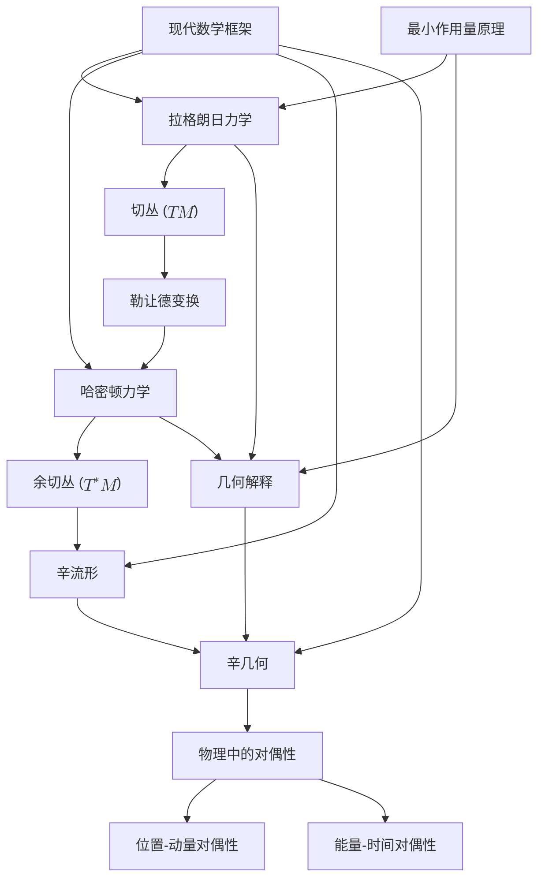

# 重构经典力学：最小作用量原理的深刻几何洞察
* * *

*"几何学是赋予不同事物相同名称的艺术。"*
— 亨利·庞加莱

# **1. 引言**

*“数学的本质在于其自由。”*
— 格奥尔格·康托尔

经典力学，作为物理学的尊贵基石，长期以来为自然世界提供了深刻的洞见。它为我们理解运动、力和能量奠定了基础，影响了科学和工程领域的无数发展。传统上通过牛顿力学框架表述，它依赖于矢量描述和微分方程，提供了一种强大但有时碎片化的物理现象图景。

然而，随着我们的数学语言和理解的进化，我们重新解释经典力学的能力也得到了提升。现代数学框架的出现，特别是那些基于几何和拓扑学的框架，为我们提供了一个机会，从其自身原理出发，重新审视和重构经典力学，揭示出之前被掩盖的更深层次结构和联系。

物理学中最深刻的原则之一是**最小作用量原理**。这一原理不仅仅是将运动视为对力的响应，而是将物理系统的整体行为封装起来，声明系统在两个状态之间所采取的实际路径是使作用量积分最小化(或稳定)的路径。这种变分方法提供了一条统一的线索，将从经典力学到量子场论的不同领域编织在一起。

尽管该原理具有统一的潜力，但它往往被作为一种数学上的便利手段引入，而不是植根于底层空间几何的基本真理。这种视角可能会使该原理的深远意义及其内在美被低估。

在本文中，我们将踏上**重构经典力学**的旅程，不是抛弃其基础，而是用现代几何洞见加以丰富。通过深入探讨机械系统中的**几何结构** —— 特别是**切丛和余切丛**、**辛流形**以及变革性的**勒让德变换** —— 我们旨在照亮物理定律核心的深层联系。

我们的探索由以下几个关键考虑因素驱动：

1. **统一框架**：传统力学通常以分割的方式处理诸如能量、动量和力等概念。几何方法使我们能够在一个单一、连贯的框架内看待这些概念。

2. **内在结构**：通过关注力学表述所处空间的几何和拓扑性质，我们获得了关于支配物理定律的不变性和对称性的洞见。

3. **现代数学工具**：微分几何和辛流形的语言提供了强大的工具，可以推广和扩展经典概念，为新发现提供潜在途径。

4. **深化理解**：几何重构不仅澄清了现有知识，还加深了我们对物理系统为何如此行为的直觉，可能揭示隐藏的关系和对偶性。

经典力学的**几何解释**不仅仅是数学上的重新表述；它是一种邀请，让我们通过一个突出和谐、对称和优雅的视角来感知物理世界。通过接纳这一视角，我们希望：

- **揭示隐藏的联系**：通过几何术语表达不同力学领域的经常被忽视的关系。
- **简化复杂性**：剥离不必要的复杂性，揭示基本原理的内在简单性。
- **鼓励探索**：激发学者和研究人员将这些洞见应用于高级主题和物理学中的新兴领域。

在随后的章节中，我们将系统地基于最小作用量原理进行构建，探讨其几何基础和意义。我们将深入研究切丛和余切丛的作用，考察辛几何的重要性，并阐明勒让德变换如何作为拉格朗日力学和哈密顿力学之间的桥梁。

到本旅程结束时，我们希望能够提供的不仅是经典力学的重构，更是对其原则的复兴 —— 以新的光芒照亮旧概念，并为未来的进展铺平道路。本文旨在面向已经熟悉传统表述的经验丰富的教育工作者和研究人员，他们正在寻求更深层次、更统一的理解，这可能会激发创新和探索。

让我们开始这一探索，拥抱数学的自由，超越界限，揭示支配宇宙之舞的深刻几何结构。

# **2. 经典力学的基础**

*"行动是所有成功的基础。"*
— 巴勃罗·毕加索

尽管经典力学已有数个世纪的历史，它仍然是物理理解的基石，提供了关于物体运动和相互作用的深刻见解。为了踏上重构经典力学几何结构的旅程，首先深入理解其基础原理是至关重要的。本章将探讨不仅定义了经典力学而且为后续更深层次几何解释铺路的核心概念。

## **2.1 最小作用量原理**

### **2.1.1 历史意义**

**最小作用量原理**是物理学中最优雅和统一的概念之一。其起源可以追溯到皮埃尔·德·费马的工作，他提出光沿最短时间路径传播。这一思想后来被数学家和物理学家如莫泊丢、欧拉、拉格朗日和哈密顿等人推广，最终形成了适用于所有经典力学系统的原理。

历史上，该原理为牛顿力学提供了一个强大的替代方案。虽然牛顿定律关注的是每个瞬间的力和加速度，而最小作用量原理考虑的是系统在两个时间点之间的整个轨迹，从而对运动提供了一种更为整体的理解。

### **2.1.2 作用量泛函**

该原理的核心是**作用量泛函**，一个标量量，定义为时间上的积分：
$$
S[q] = \int_{t_1}^{t_2} L(q(t), \dot{q}(t), t) \, dt
$$
这里，$q(t)$ 表示系统的广义坐标，$\dot{q}(t)$ 是它们的时间导数(广义速度)，而 $L$ 是系统的**拉格朗日量**。作用量 $S$ 是一个泛函 —— 它的值依赖于整个函数 $q(t)$，而不仅仅是单一点的值。

### **2.1.3 变分原理**

该原理断言，系统在时间 $t_1$ 和 $t_2$ 之间的物理轨迹是使作用量泛函 $S[q]$ 对路径的无穷小变化保持不变的那一条，同时保持端点固定。数学上，这表示为：
$$
\delta S = \delta \int_{t_1}^{t_2} L(q, \dot{q}, t) \, dt = 0
$$
这个条件导致了**欧拉-拉格朗日方程**，这些方程是 $S[q]$ 在变分下保持不变的必要且充分条件：
$$
\frac{d}{dt} \left( \frac{\partial L}{\partial \dot{q}_i} \right) - \frac{\partial L}{\partial q_i} = 0, \quad i = 1, \dots, n
$$
这些方程支配着系统的动力学，将牛顿定律纳入了一个更广泛和强大的框架中。

### **2.1.4 导出运动方程的作用**

变分方法提供了一种系统的方法来导出任何机械系统的运动方程：

1. **定义拉格朗日量 $L$**：通常取 $L = T - V$，其中 $T$ 是动能，$V$ 是势能。

2. **计算变分**：计算由于路径 $q(t) \rightarrow q(t) + \delta q(t)$ 的微小变化引起的变分 $\delta S$。

3. **应用作用量驻定条件**：设置 $\delta S = 0$ 以找到使作用量极值化的路径。

4. **导出欧拉-拉格朗日方程**：获得一组描述系统演化的二阶微分方程。

这种方法非常灵活，能够无缝处理约束和广义坐标，并作为经典和现代物理学中的基础工具。

### **2.1.5 深刻的哲学含义**

最小作用量原理暗示自然以最优方式运作，选择使某个量最小化(或极值化)的路径。这一思想与物理定律中的效率和简单性基本概念相呼应。它还暗示了一种预见性或全局优化的元素，与牛顿力学中强调的局部因果关系形成对比。

## **2.2 拉格朗日力学**

### **2.2.1 切丛 $TM$ 的介绍**

为了充分理解拉格朗日表述，必须了解称为**切丛**的几何结构。对于一个配置空间 $M$，即系统所有可能位置 $q$ 的集合，切丛 $TM$ 是所有可能的位置和速度 $(q, \dot{q})$ 的集合。

- **配置空间 $M$**：一个 $n$-维流形，表示系统的所有可能状态。

- **切空间 $T_qM$**：在每个点 $q \in M$，切空间 $T_qM$ 包含所有可能的速度向量 $q$。

- **切丛 $TM$**：所有点 $M$ 上切空间的并集：
  $$
  TM = \bigsqcup_{q \in M} T_qM
  $$

切丛 $TM$ 是一个 $2n$-维流形，为用位置和速度表述力学提供了自然的背景。

### **2.2.2 拉格朗日函数 $L(q, \dot{q}, t)$**

拉格朗日量是一个定义在 $TM \times \mathbb{R}$ 上的实值函数：
$$
L: TM \times \mathbb{R} \rightarrow \mathbb{R}
$$
对于许多系统，$L$ 的形式为：
$$
L(q, \dot{q}, t) = T(\dot{q}) - V(q)
$$

- **动能 $T(\dot{q})$**：依赖于速度 $\dot{q}$，一般情况下，在惯性系中表达时为二次形式。

- **势能 $V(q)$**：依赖于位置 $q$。

### **2.2.3 欧拉-拉格朗日方程的推导**

从作用量泛函开始：
$$
S[q] = \int_{t_1}^{t_2} L(q, \dot{q}, t) \, dt
$$
我们考虑一个具有固定端点的小变分 $\delta q(t)$。作用量的变分为：
$$
\delta S = \int_{t_1}^{t_2} \left( \frac{\partial L}{\partial q} \delta q + \frac{\partial L}{\partial \dot{q}} \delta \dot{q} \right) dt
$$
通过分部积分第二项并应用固定端点条件 $\delta q(t_1) = \delta q(t_2) = 0$，我们得到：
$$
\delta S = \int_{t_1}^{t_2} \left( \frac{\partial L}{\partial q} - \frac{d}{dt} \frac{\partial L}{\partial \dot{q}} \right) \delta q \, dt
$$
对于任意 $\delta q(t)$ 设置 $\delta S = 0$ 即可得到欧拉-拉格朗日方程。

### **2.2.4 切丛上的解释**

从几何角度看，欧拉-拉格朗日方程定义了 $TM$ 上的一个向量场，其积分曲线代表系统的物理轨迹。切丛框架使我们可以将动力学视为流形上的流，其中 $TM$ 中的每个点指定系统的状态(位置和速度)。

这种视角之所以强大，是因为它抽象出了坐标表示，而是专注于运动的内在几何。

### **2.2.5 拉格朗日表述的优点**

1. **普遍性**：适用于广泛的系统，包括非笛卡尔坐标和受约束的系统。

2. **对称性和守恒律**：通过对称性在 $L$ 中的应用，诺特定理揭示了几何与物理量之间的深刻联系。

3. **预备基础**：为更高级的理论(如量子力学和广义相对论)奠定了基础，在这些理论中作用量原理仍然居于核心地位。

### **2.2.6 说明关键概念的例子**

#### **2.2.6.1 简谐振子**

对于连接在弹簧上的质量 $m$，弹簧刚度为 $k$：

- **拉格朗日量**：$L = \frac{1}{2} m \dot{q}^2 - \frac{1}{2} k q^2$

- **欧拉-拉格朗日方程**：
  $$
  m\ddot{q} + kq = 0
  $$
  这是谐振子熟悉的运动方程。

#### **2.2.6.2 重力场中的粒子**

一个质量为 $m$ 的粒子在重力场中运动：

- **拉格朗日量**：$L = \frac{1}{2} m \dot{\mathbf{q}}^2 - mgz$

- **欧拉-拉格朗日方程**：
  $$
  m\ddot{x} = 0, \quad m\ddot{y} = 0, \quad m\ddot{z} = -mg
  $$

恢复了牛顿第二定律在恒定重力场下的形式。

### **2.2.7 完整约束和广义坐标**

拉格朗日框架在处理约束方面表现出色。通过引入自动满足约束的广义坐标，可以在不需要显式约束力的情况下导出运动方程。

### **2.2.8 与哈密顿原理的联系**

拉格朗日表述中的最小作用量原理有时被称为**哈密顿原理**。它强调系统在两个配置之间的真路径使得作用量积分保持驻定，强化了经典力学中的深刻变分基础。

## **2.3 小结**

本章对最小作用量原理和拉格朗日表述的探讨为后续章节中将讨论的几何结构奠定了必要的基础。通过理解作用量泛函和欧拉-拉格朗日方程如何从切丛 $TM$ 上的变分原理中产生，我们为深入研究辛几何、勒让德变换和哈密顿力学做好了准备。这些概念将进一步阐明经典力学的内在几何性质，揭示物理定律结构的更深层次洞见。

# **3. 力学中的几何结构**

*"几何不是真理，它只是有用的。"*
— 罗伯特·M·皮尔斯

几何与物理之间的深刻互动一直是我们理解自然世界进步的基石。在经典力学中，这种关系通过支撑理论表述的几何结构得以体现。通过深入探讨这些结构，我们可以更深入地理解运动、力和能量的本质。本章介绍**切丛和余切丛**以及**辛流形**框架等基本几何概念，这些是现代经典力学几何解释的基础。

## **3.1 切丛和余切丛**

### **3.1.1 纤维丛简介**

微分几何的核心概念是**纤维丛**，它提供了一个严格的数学框架来描述局部类似于两个空间的乘积但可能具有更复杂整体结构的空间。一个纤维丛 $E$ 包括：

- 一个**基底空间** $M$，通常表示系统所有可能状态(配置空间)的流形。
- 一个**纤维** $F$ 连接在每个点 $q \in M$，表示额外的信息，如速度或动量。
- 一个**投影映射** $\pi: E \rightarrow M$，将总空间 $E$ 中的每个点与基底空间 $M$ 中的一个点关联。

在力学中，纤维丛使我们可以优雅地封装描述系统演化的必要位置和状态变量(如速度和动量)。

### **3.1.2 切丛 $TM$**

#### **3.1.2.1 定义和几何意义**

给定一个光滑流形 $M$，**切丛** $TM$ 是 $M$ 上每个点的所有切空间的并集：
$$
TM = \bigsqcup_{q \in M} T_qM
$$
其中 $T_qM$ 表示点 $q$ 处的切空间，而 $\bigsqcup$ 表示 $M$ 上的不交并。

- **切空间 $T_qM$**：所有可以沿 $q$ 点切向通过的方向的集合。它由点 $q$ 处的所有速度向量组成。

在力学的背景下：

- **配置空间 $M$**：表示系统的所有可能位置。
- **相空间 $TM$**：结合 $q$ 和 $\dot{q}$(速度)，$TM$ 包含系统在位置和速度方面的所有可能状态。

#### **3.1.2.2 在力学中的作用**

- **拉格朗日力学**：拉格朗日量 $L(q, \dot{q}, t)$ 定义在 $TM \times \mathbb{R}$ 上，使得 $TM$ 成为使用最小作用量原理表述运动方程的自然场所。
- **轨迹描述**：系统的演化由 $TM$ 中的一条路径 $\gamma(t) = (q(t), \dot{q}(t))$ 描述。
- **动力学可视化**：理解 $TM$ 中状态的流提供了对系统行为、稳定性和可能构型的洞见。

#### **3.1.2.3 局部坐标表示**

在一个局部坐标图表中，如果 $\{ q^i \}$ 是 $M$ 上的坐标，则 $q$ 点处的切向量表示为：
$$
v = \dot{q}^i \frac{\partial}{\partial q^i}
$$
切丛 $TM$ 中的一个点由坐标配对 $(q^i, \dot{q}^i)$ 给出。

### **3.1.3 余切丛 $T^*M$**

#### **3.1.3.1 定义和几何意义**

**余切丛** $T^*M$ 是切丛的对偶空间，由每个点 $q \in M$ 处的所有余切空间组成：
$$
T^*M = \bigsqcup_{q \in M} T_q^*M
$$
其中 $T_q^*M$ 是 $q$ 点处的余切空间，由所有作用于 $T_qM$ 的线性泛函(余向量)组成。

- **余切空间 $T_q^*M$**：表示 $q$ 点处所有可能的线性泛函，将切向量映射到实数。

在力学中：

- **动量空间**：余切丛作为动量的自然场所，动量是余向量。
- **哈密顿力学中的相空间**：$T^*M$ 成为相空间，其中位置 $q$ 和正则动量 $p$ 定义系统的状态。

#### **3.1.3.2 在力学中的作用**

- **哈密顿力学**：哈密顿量 $H(q, p, t)$ 定义在 $T^*M \times \mathbb{R}$ 上，利用位置和动量描述系统。
- **辛结构**：$T^*M$ 内在地具有辛结构，对于表述哈密顿方程和理解守恒律至关重要。
- **正则坐标**：使用 $(q^i, p_i)$ 坐标有助于从拉格朗日表述过渡到哈密顿表述。

#### **3.1.3.3 局部坐标表示**

在局部坐标中，余切丛 $T^*M$ 中的一个点由坐标 $(q^i, p_i)$ 给出，其中 $p_i$ 是余向量 $p$ 的分量，对应广义动量。

### **3.1.4 物理解释和重要性**

- **$TM$ 和 $T^*M$ 的对偶性**：反映速度和动量之间的基本关系，在勒让德变换中起关键作用。
- **几何框架**：提供分析机械系统的严格数学结构，便于应用微分几何和拓扑学。
- **物理过程的可视化**：使我们能够将动力学描绘为这些几何空间中的轨迹，增强直觉和理解。

### **3.1.5 示例：简谐振子**

考虑一个一维简谐振子，质量为 $m$，弹簧常数为 $k$：

- **配置空间 $M$**：实直线 $\mathbb{R}$，表示位置 $q$。
- **切丛 $TM$**：$\mathbb{R} \times \mathbb{R}$，坐标为 $(q, \dot{q})$。
- **余切丛 $T^*M$**：$\mathbb{R} \times \mathbb{R}$，坐标为 $(q, p)$，其中 $p = m \dot{q}$。

在这个例子中，$TM$ 和 $T^*M$ 的结构使我们可以在拉格朗日和哈密顿描述之间无缝转换。

## **3.2 辛流形**

### **3.2.1 定义和基本性质**

一个**辛流形**是一个装备有闭的、非退化的微分 $2$-形式 $\omega$ 的光滑偶数维流形 $(M, \omega)$，称为**辛形式**。

- **闭形式**：$d\omega = 0$，确保 $\omega$ 沿着流是守恒的。
- **非退化性**：对于每个非零向量 $v \in T_qM$，存在一个向量 $u \in T_qM$ 使得 $\omega(v, u) \neq 0$。

这些性质赋予流形丰富的几何结构，这对于哈密顿力学的表述至关重要。

### **3.2.2 辛形式**

辛形式 $\omega$ 提供由切向量对张成的“定向面积”的测量。它是双线性的、反对称的，并提供一种自然的方式将系统的力学几何化。

#### **3.2.2.1 余切丛 $T^*M$ 上的典范辛形式**

在余切丛 $T^*M$ 上，典范辛形式定义为：
$$
\omega = -d\theta
$$
其中 $\theta$ 是**刘维尔$1$-形式**(或典范$1$-形式)：
$$
\theta = p_i \, dq^i
$$
在局部坐标中，辛形式变为：
$$
\omega = dq^i \wedge dp_i
$$
这种形式在表达哈密顿方程和分析系统的流时至关重要。

### **3.2.3 在力学中的作用**

#### **3.2.3.1 哈密顿力学**

辛流形 $(T^*M, \omega)$ 为哈密顿力学提供了几何舞台：

- **哈密顿方程**：使用辛形式表示为：
  $$
  \dot{q}^i = \frac{\partial H}{\partial p_i}, \quad \dot{p}_i = -\frac{\partial H}{\partial q^i}
  $$

- **辛流**：系统的随时间演化保持辛结构，这一性质被称为**辛同胚**。

#### **3.2.3.2 泊松括号**

辛结构允许定义两个函数 $f, g$ 的**泊松括号**：
$$
\{f, g\} = \omega(X_f, X_g) = \frac{\partial f}{\partial q^i} \frac{\partial g}{\partial p_i} - \frac{\partial f}{\partial p_i} \frac{\partial g}{\partial q^i}
$$
这个括号编码无穷小正则变换，并构成运动方程的基础。

#### **3.2.3.3 守恒定律和对称性**

- **诺特定理**：辛几何提供了诺特定理的框架，将哈密顿量的对称性与守恒量联系起来。
- **能量守恒**：如果哈密顿量 $H$ 不显式依赖于时间，则它是守恒的，这是辛结构的直接结果。

### **3.2.4 力学中的例子**

#### **3.2.4.1 自由粒子**

对于在 $\mathbb{R}^n$ 中运动的自由粒子：

- **辛形式**：$\omega = dq^i \wedge dp_i$
- **哈密顿量**：$H = \frac{1}{2m} p_i p_i$
- **运动方程**：相空间中的线性轨迹，保持辛面积。

#### **3.2.4.2 摆**

- **配置空间**：$M = S^1$(圆)，考虑到摆角度的周期性。
- **辛结构**：余切丛 $T^*S^1$ 具有自然的辛形式，使我们能够在该框架内分析摆的动力学。

### **3.2.5 达布定理**

辛几何中的一个重要结果是**达布定理**，其陈述如下：

- **陈述**：每个辛流形局部上辛同胚于 $(\mathbb{R}^{2n}, \omega_0)$，其中 $\omega_0 = dq^i \wedge dp_i$。
- **意义**：局部上，所有辛流形看起来都相同，简化了机械系统局部性质的分析。

### **3.2.6 辛几何在力学中的重要性**

#### **3.2.6.1 相空间体积的保持**

- **刘维尔定理**：在哈密顿力学中，流保持辛体积，意味着相空间密度沿着轨迹保持不变。
- **正则变换**：保持辛形式 ($\omega$) 的变换是正则的，并保持运动方程的结构。

#### **3.2.6.2 全局性质和拓扑**

尽管达布定理保证局部等价性，但辛流形的全局性质可能会显著不同：

- **$M$ 的拓扑**：影响全局动力学和可能的构型。
- **障碍**：某些全局辛不变量影响特定运动或状态的存在。

#### **3.2.6.3 与量子力学的联系**

- **几何量子化**：辛流形作为量子化程序的经典起点，连接经典力学和量子力学。
- **相空间路径积分**：利用辛几何来表述量子力学振幅。

### **3.2.7 力学的几何解释**

- **动力学作为流**：系统的运动对应于辛流形上的流，由哈密顿方程确定。
- **辛叶**：在可积系统中，运动可以限制在低维子流形上，提供关于守恒量和稳定性的洞见。

## **3.3 小结**

本章基于前面建立的基本原理，从作用量原理和拉格朗日力学过渡到对经典力学更深刻的几何理解。通过引入切丛和余切丛，我们建立了机械系统演化的本质几何空间。对辛流形的探讨为我们深入研究哈密顿力学、勒让德变换以及物理定律的深层对称性提供了必要的工具。这些概念对于后续考察物理学中的对偶性和最小作用量原理的几何解释至关重要，因为它们提供了统一各种力学表述的共同几何框架。

*通过拥抱力学固有的几何结构，我们不仅获得了对物理定律本质的更深入理解，还为从经典到量子领域的理论物理学进展铺平了道路。通过对切丛和余切丛以及辛流形的探索，我们为更丰富、更统一地理解支配宇宙的力学奠定了基础。*

# **4. 勒让德变换与对偶性**

*"在每一个对偶之中，都蕴藏着一个隐藏的统一。"*
 ——  佚名

在经典力学中，拉格朗日和哈密顿两种描述方式提供了对物理系统的深刻理解。而在这两种描述之间，**勒让德变换 (Legendre Transformation)** 扮演着关键的纽带角色。通过它，我们能够在**切丛 ($TM$)** 和**余切丛 ($T^*M$)** 之间建立联系，揭示物理量之间的深层次对偶关系。本章将深入探讨勒让德变换的数学形式化，以及它在物理学中体现的对偶性，特别是**位置-动量对偶**和**能量-时间对偶**。这些对偶性不仅在数学上具有重要意义，而且在物理现象的理解中也起着核心作用。

## **4.1 勒让德变换的数学形式化**

### **4.1.1 勒让德变换的定义**

勒让德变换是一种将一个凸函数转换为其共轭函数的数学操作。在物理学中，它用于在拉格朗日函数和哈密顿函数之间建立联系，从而在切丛和余切丛之间转换。

给定一个变量 $x$ 和一个凸函数 $f(x)$，其勒让德变换定义为：
$$
f^*(p) = \sup_{x} \left( px - f(x) \right)
$$
其中，$p$ 是与 $x$ 对偶的变量，称为共轭变量。

### **4.1.2 在力学中的应用**

在拉格朗日力学中，系统的状态由位置 $q$ 和速度 $\dot{q}$ 描述，其拉格朗日函数 $L(q, \dot{q}, t)$ 定义为系统的动能 $T$ 减去势能 $V$：
$$
L(q, \dot{q}, t) = T(\dot{q}) - V(q)
$$
勒让德变换将 $L$ 转换为哈密顿函数 $H(q, p, t)$，其中 $p$ 是广义动量，定义为：
$$
p = \frac{\partial L}{\partial \dot{q}}
$$
哈密顿函数定义为：
$$
H(q, p, t) = p \dot{q} - L(q, \dot{q}, t)
$$
通过将 $\dot{q}$ 以 $p$ 表达，从而完成从 $TM$ 到 $T^*M$ 的转换。

### **4.1.3 连接 $TM$ 和 $T^*M$**

- **切丛 $TM$**：包含了位置 $q$ 和速度 $\dot{q}$，是拉格朗日力学的舞台。
- **余切丛 $T^*M$**：包含了位置 $q$ 和广义动量 $p$，是哈密顿力学的舞台。

勒让德变换在这两个空间之间建立了对应关系，使得我们可以在不同的描述之间切换。

### **4.1.4 勒让德变换的物理意义**

- **能量函数的重定义**：通过勒让德变换，我们将系统的动力学从速度描述转换为动量描述。
- **提供新的视角**：哈密顿形式的出现使得对系统的动力学分析更加方便，特别是在处理复杂系统和量子化时。

### **4.1.5 示例：简单谐振子**

对于质量为 $m$、弹性系数为 $k$ 的简单谐振子：

- **拉格朗日函数**：
$$
L = \frac{1}{2} m \dot{q}^2 - \frac{1}{2} k q^2
$$

- **广义动量**：
$$
p = \frac{\partial L}{\partial \dot{q}} = m \dot{q}
$$

- **哈密顿函数**：
$$
H = p \dot{q} - L = \frac{p^2}{2m} + \frac{1}{2} k q^2
$$

通过勒让德变换，我们成功地将系统的描述从速度空间转换到了动量空间。

## **4.2 位置-动量对偶**

### **4.2.1 对偶性的概念**

在物理学中，对偶性是指两种看似不同但彼此相关联的概念或变量。这种关系在数学上通常通过变换或对称性来体现。在经典力学中，位置和动量构成了一种基本的对偶关系。

### **4.2.2 勒让德变换中的位置-动量对偶**

- **位置 $q$**：描述了粒子在空间中的位置，是一个直接可观测的量。
- **动量 $p$**：与位置的变化率有关，通过广义动量的定义与速度 $\dot{q}$ 联系。

勒让德变换将速度变量 $\dot{q}$ 转换为动量变量 $p$，体现了位置和动量之间的内在联系。这种转换不仅是在数学上的变量替换，更是对系统动力学描述方式的根本变化。

### **4.2.3 在辛几何中的体现**

在辛几何中，位置和动量被视为对偶的坐标，共同构成了相空间：

- **相空间**：由 $(q, p)$ 组成的余切丛 $T^*M$，是哈密顿力学的基本舞台。
- **辛形式**：在相空间中定义的二次微分形式：
$$
\omega = dq \wedge dp
$$

这个辛形式体现了位置和动量之间的对偶关系，并确保了哈密顿动力学的正确性。

### **4.2.4 正则变换和对偶性**

正则变换是在保持辛形式不变的情况下，对相空间坐标进行的变换。这些变换凸显了位置和动量之间的对偶对称性，允许在不同的坐标系统中描述相同的物理系统。

### **4.2.5 物理意义和深层理解**

位置-动量对偶性反映了测量和状态描述中的基本限制，也是量子力学中不确定性原理的经典对应。深刻理解这种对偶性，有助于我们在更广泛的物理背景下认识系统的动力学行为。

## **4.3 能量-时间对偶**

### **4.3.1 时间在力学中的角色**

时间在经典力学中通常被视为一个独立参数，用于描述系统的演化。然而，能量和时间之间也存在着一种对偶关系，与位置-动量对偶性相媲美。

### **4.3.2 能量-时间对偶性的体现**

- **能量 $E$**：系统的总能量，是哈密顿函数 $H(q, p, t)$ 的值。
- **时间 $t$**：描述系统演化的参数，但在某些情况下可以被视为动态变量。

这种对偶性在某些高级理论中，如相对论和量子力学中显得尤为重要。

### **4.3.3 哈密顿-雅可比方程与对偶性**

哈密顿-雅可比方程：
$$
H\left(q, \frac{\partial S}{\partial q}, t\right) + \frac{\partial S}{\partial t} = 0
$$
这里，作用量 $S$ 的时间偏导数与哈密顿函数相加为零，体现能量和时间之间的深层联系。

### **4.3.4 在量子力学中的体现**

- **不确定性原理**：能量-时间不确定性关系 $\Delta E \Delta t \geq \frac{\hbar}{2}$，强调能量和时间不能同时被精确测定。
- **谱-时域分析**：频率(与能量相关)和时间域分析之间的对偶性。

### **4.3.5 经典力学中的几何解释**

在经典力学的几何框架下，能量-时间对偶性可以通过分析系统在相空间中的轨迹来理解：

- **相空间轨迹的参数化**：时间作为参数，系统在相空间中的运动受能量的约束。
- **守恒系统中的时间演化**：对于不显含时间的哈密顿量，能量守恒，时间演化体现系统在能量壳上的运动。

### **4.3.6 物理意义和影响**

能量-时间对偶性提醒我们，时间不仅是一个被动的参数，更与系统的能量特性紧密相关。理解这种对偶性对深入研究物理过程的时间尺度和能量特征具有重要意义。

## **4.4 小结**

本章通过深入探讨勒让德变换，以及位置-动量和能量-时间的对偶性，架起了前面几何概念与物理系统深层性质之间的桥梁。勒让德变换不仅是数学上的工具，更是揭示物理系统内在对称性和对偶性的窗口。理解这些对偶性，有助于我们在更高层次上把握经典力学的本质，为后续探索哈密顿力学、辛几何中的变分原理，以及更广泛的物理理论奠定坚实的基础。

*对偶性的存在提示我们，在物理学中，很多看似独立的概念实际上是同一事物的不同表述。通过揭示这些深层联系，我们不仅加深了对已有理论的理解，也为探索新的物理规律打开了大门。*

# **5. 余切丛上的哈密顿力学**

*"自然界的规律不过是上帝的数学思想。"*
— 欧几里得

## **5.1 哈密顿力学的表述**

从拉格朗日力学到哈密顿力学的转变标志着我们对动力系统理解的重大转变。虽然拉格朗日力学在配置流形 $M$ 的切丛 $TM$ 上进行，但哈密顿力学则自然地栖息于余切丛 $T^*M$ 上。本节深入探讨了哈密顿力学在 $T^*M$ 的几何框架内的表述，强调了支撑该理论的辛结构。

**余切丛 $T^*M$**

流形 $M$ 的余切丛 $T^*M$ 是所有点 $q \in M$ 处的余切空间 $T_q^*M$ 的并集：
$$
T^*M = \bigcup_{q \in M} T_q^*M.
$$
每个余切空间 $T_q^*M$ 由所有将 $q$ 点处的切向量映射到实数的线性泛函(余向量)组成。在力学中，$T^*M$ 的元素自然与位置及其共轭动量 $(q^i, p_i)$ 相关联，形成系统的相空间。

**重新审视勒让德变换**

为了从定义在 $TM$ 上的拉格朗日量 $L(q^i, \dot{q}^i, t)$ 转换到定义在 $T^*M$ 上的哈密顿量 $H(q^i, p_i, t)$，我们使用勒让德变换：
$$
\begin{aligned}
p_i &= \frac{\partial L}{\partial \dot{q}^i}, \\
H(q^i, p_i, t) &= p_i \dot{q}^i - L(q^i, \dot{q}^i, t).
\end{aligned}
$$
这里，$p_i$ 是广义坐标 $q^i$ 的共轭动量，而 $\dot{q}^i$ 通过反转第一个方程用 $q^i$ 和 $p_i$ 表示。

**在 $T^*M$ 上的辛结构**

余切丛 $T^*M$ 具有自然的辛结构，源于其微分几何。辛形式 $\omega$ 是一个闭的、非退化的 $2$-形式，定义为：
$$
\omega = dp_i \wedge dq^i.
$$
这个辛形式编码基本的泊松括号，并在表述哈密顿方程时至关重要。

**通过辛几何表达哈密顿方程**

哈密顿动力学可以优雅地用辛形式表示。给定一个哈密顿函数 $H: T^*M \times \mathbb{R} \to \mathbb{R}$，运动方程由 $H$ 生成的流 $\phi_t$ 保持辛形式的条件导出：
$$
\iota_{X_H} \omega = dH,
$$
其中 $X_H$ 是与 $H$ 相关的哈密顿向量场，$\iota_{X_H}$ 表示内积。这导致哈密顿方程：
$$
\dot{q}^i = \frac{\partial H}{\partial p_i}, \quad \dot{p}_i = -\frac{\partial H}{\partial q^i}.
$$
这些一阶微分方程描述系统在相空间 $T^*M$ 中的时间演化。

**哈密顿方程的性质**

1. **辛不变性**：哈密顿流保持辛形式 ($\mathcal{L}_{X_H} \omega = 0$)，其中 $\mathcal{L}_{X_H}$ 是沿着 $X_H$ 的李导数。这种保持反映相空间的基本结构在时间演化下的守恒。

2. **时间可逆性**：当 $H$ 不显式依赖于时间时，哈密顿方程在时间反演下是对称的，体现经典力学的可逆性。

3. **正则变换**：保持辛形式的变换(正则变换)允许我们通过改变变量来简化问题，同时保持哈密顿方程的形式。

**示例：简谐振子**

考虑一个质量为 $m$、弹簧常数为 $k$ 的一维简谐振子。

- **哈密顿量**：
  $$
  H(q, p) = \frac{p^2}{2m} + \frac{1}{2} k q^2.
  $$

- **哈密顿方程**：
  $$
  \begin{aligned}
  \dot{q} &= \frac{\partial H}{\partial p} = \frac{p}{m}, \\
  \dot{p} &= -\frac{\partial H}{\partial q} = -k q.
  \end{aligned}
  $$

这些方程描述振荡运动，其解展示了哈密顿力学在 $T^*M$ 中的优雅和强大。

## **5.2 辛结构和守恒量**

辛结构不仅提供表述哈密顿力学的舞台，还在通过诺特定理理解守恒量方面发挥了关键作用。本节探讨了哈密顿框架中的对称性如何产生守恒定律，突出了几何与物理之间的深刻互动。

**哈密顿力学中的诺特定理**

诺特定理建立了每个连续对称性对应一个守恒量。在哈密顿力学的背景下，对称性通过使哈密顿量 $H$ 保持不变的变换表达。

**正则变换和对称性**

正则变换是保持辛形式的变量变化 $(q^i, p_i) \to (Q^i, P_i)$：
$$
dp_i \wedge dq^i = dP_i \wedge dQ^i.
$$
如果哈密顿量在这种变换下保持不变，则变换的生成元是一个守恒量。

**动量映射和守恒量**

考虑由 $T^*M$ 上的向量场 $X$ 生成的对称性。动量映射 $J$ 将 $X$ 与 $T^*M$ 上的函数 $J_X$ 关联，使得：
$$
\iota_{X} \omega = -dJ_X.
$$
当 $X$ 是哈密顿向量场时，$J_X$ 沿着 $H$ 的流是守恒的：
$$
\frac{d}{dt} J_X = \{ J_X, H \} = 0.
$$

**示例：线性动量守恒**

对于在空间平移下不变的系统，哈密顿量不显式依赖于坐标 $q^i$：
$$
\frac{\partial H}{\partial q^i} = 0.
$$
根据哈密顿方程：
$$
\dot{p}_i = -\frac{\partial H}{\partial q^i} = 0,
$$
这意味着动量 $p_i$ 是守恒的。这反映了由于平移对称性而守恒的线性动量。

**示例：角动量守恒**

对于旋转不变系统，哈密顿量在由角动量算子 $L$ 生成的旋转下保持不变。角动量的守恒自然地出现：
$$
\frac{d}{dt} L = \{ L, H \} = 0.
$$

**辛结构和泊松括号**

辛形式 $\omega$ 诱导了函数 $f, g$ 在 $T^*M$ 上的泊松括号：
$$
\{ f, g \} = \omega(X_f, X_g) = \frac{\partial f}{\partial q^i} \frac{\partial g}{\partial p_i} - \frac{\partial f}{\partial p_i} \frac{\partial g}{\partial q^i}.
$$
守恒量在泊松括号下与哈密顿量对易：
$$
\{ H, C \} = 0 \implies \frac{d}{dt} C = 0.
$$

**诺特定理的影响**

1. **能量守恒**：时间平移对称性导致能量守恒。如果 $H$ 不显式依赖于时间，则它是守恒的：
   $$
   \frac{dH}{dt} = \frac{\partial H}{\partial t} = 0.
   $$

2. **对称性和可积性**：具有足够对称性的系统可能是可积的，允许通过守恒量获得完整解。

3. **自由度的减少**：守恒量减少了有效变量的数量，简化了复杂系统的分析。

**几何理解**

辛结构提供了一个几何框架，在其中守恒量对应于保持 $\omega$ 的流。对称性生成 $T^*M$ 上的群作用，而相关的动量映射则封装了守恒律。

**与勒让德变换的联系**

勒让德变换使得从拉格朗日力学到哈密顿力学的过渡成为可能，揭示了在 $TM$ 中不明显的辛结构。通过转移到 $T^*M$，我们发现了表达经典力学中固有的守恒律和对称性的自然几何语言。

## **5.3 总结**

在对余切丛上的哈密顿力学的探讨中，我们深入研究了支撑经典力学的深刻几何结构。通过在 $T^*M$ 上以其内在的辛结构表述动力学，我们不仅获得了一个强大的数学框架，还更深入地理解了支配物理系统的根本原理。

辛几何不仅封装了运动方程，还通过诺特定理照亮了发现守恒量的道路。这种几何视角揭示了力学的优雅和统一性，其中对称性和守恒律是底层数学结构的体现。

基于勒让德变换和前几节奠定的基础，我们看到当通过现代数学的视角来看待时，哈密顿力学如何自然地从最小作用量原理中涌现出来。这种方法不仅统一了力学中的各种概念，还为量子力学和辛拓扑等高级理论的进一步探索开辟了道路。

*通过拥抱经典力学的几何基础，我们更接近于掌握物理定律的内在本质，呼应了欧几里得的观点，即自然法则确实是数学思想。*

# **6. 最小作用量原理的几何解释**

*"自然不做无用之功。"*
— 亚里士多德

最小作用量原理不仅仅是一个计算工具，而是对自然法则固有的效率和优雅性的深刻反映。要真正理解其重要性，必须深入探讨其几何基础。通过从几何角度重新解释作用量泛函，我们揭示了经典力学如何内在地与系统演化所经过的空间的几何结构相联系。这种视角不仅丰富了我们的理解，还统一了各种力学表述，使其纳入共同的几何框架。

## **6.1 作为几何对象的作用量**

**重新解释作用量泛函**

传统上，作用量泛函表示为：
$$
S[q] = \int_{t_1}^{t_2} L(q(t), \dot{q}(t), t) \, dt,
$$
其中 $L$ 是系统的拉格朗日量。通过考虑流形上的微分形式和路径，可以从几何角度看待作用量泛函。

**配置空间作为流形**

机械系统的配置空间 $M$ 是一个光滑流形，表示系统可以占据的所有可能位置 $q$ 。每个点 $q \in M$ 对应于系统的唯一构型。

**切丛和速度**

$M$ 的**切丛** $TM$ 是由所有可能的对 $(q, \dot{q})$ 组成的流形，其中 $\dot{q}$ 是在 $q$ 处的切向量。这个丛封装了系统的所有可能位置和速度。

**作为路径积分的作用量**

路径 $\gamma: [t_1, t_2] \rightarrow M$ 表示系统随时间的演化。作用量泛函通过沿着轨迹积分拉格朗日量来计算与此路径相关联的一个标量值：
$$
S[\gamma] = \int_{\gamma} L(q, \dot{q}, t) \, dt.
$$
此积分可以几何地解释为沿流形 $M$ 中路径累积的某个量(拉格朗日量)。

**微分形式和作用量**

通过将拉格朗日量与微分形式关联，我们可以用 $TM$ 上的**半基本 $1$-形式**表达作用量。拉格朗日量 $L$ 诱导**庞加莱-嘉当 $1$-形式** $\theta_L$：
$$
\theta_L = \frac{\partial L}{\partial \dot{q}^i} dq^i - L \, dt.
$$
$\theta_L$ 的外导数产生**庞加莱-嘉当 $2$-形式** $\omega_L$：
$$
\omega_L = d\theta_L.
$$
这些形式使我们能够用 $TM$ 上的几何对象表达系统的动力学。

**作用量和辛几何**

在余切丛 $T^*M$ 上，装备有其自然的辛结构，作用量可以通过沿着路径 $\gamma$ 在 $T^*M$ 中的提升积分典范 $1$-形式 $\theta$ 来连接：
$$
S[\gamma] = \int_{\gamma} (p_i \, dq^i - H \, dt),
$$
其中 $p_i = \frac{\partial L}{\partial \dot{q}^i}$ 是共轭动量，而 $H$ 是哈密顿量。

**几何解释**

这种几何表述突显作用量是依赖于穿越流形 $M$ 的轨迹 $\gamma$ 的泛函，并可以理解为沿着该路径积分微分形式。它架起了拉格朗日和哈密顿描述之间的桥梁，强调了几何在力学基本定律中的作用。

**例子**

- **自由粒子**：作用量对应于时空中的路径长度，最小作用量路径是一条直线，即两点之间的最短距离。
  
- **光学中的光**：费马原理指出光沿最短时间路径传播，这可以几何地解释为具有折射率作为度量的介质中的测地线。

## **6.2 辛几何中的变分原理**

**辛流形作为力学的舞台**

一个**辛流形** $(M, \omega)$ 是一个装备有闭的、非退化的 $2$-形式 $\omega$ 的光滑偶数维流形。在力学中，相空间 $T^*M$ 自然携带辛结构，成为哈密顿动力学的理想设置。

**变分原理和辛路径**

最小作用量原理指出，系统实际采取的路径使得作用量泛函相对于路径的变化是驻定的。在辛几何中，这一原理可以通过考虑相空间的几何结构和辛形式的性质来探讨。

**哈密顿方程和辛流**

哈密顿方程可以从哈密顿向量场 $X_H$ 保持辛形式的条件推导出来：
$$
\omega(X_H, \cdot) = dH.
$$
这个方程意味着由 $X_H$ 生成的流是一个辛同胚，保持辛结构 $\omega$。

**辛能量和作用量**

相空间中沿路径的作用量可以与由轨迹封闭的辛面积( $\omega$ 的积分)相关联。对于周期或闭合轨迹，这个面积成为一个重要的量，通过玻尔-索末菲量子化条件将经典力学与量子力学联系起来。

**辛几何中的变分微积分**

通过在辛框架内应用变分微积分，我们可以考虑在相空间中保持某些约束(例如固定端点)的路径 $\gamma$ 的变化 $\delta \gamma$。要求作用量的一阶变分为零导致经典的运动方程。

**几何含义**

- **拉格朗日子流形**：哈密顿方程的解对应于 $T^*M$ 的拉格朗日子流形，在这些子流形上辛形式 $\omega$ 限制为零。这一性质反映了沿着轨迹守恒的某些量。
  
- **辛容量和不变量**：辛几何引入了影响动力系统行为的全局不变量，可能限制可能的运动或变换类型。

**例子**

- **开普勒问题**：可以使用辛流形分析行星的运动，揭示如角动量等守恒量，并加深对轨道力学的理解。
  
- **可积系统**：具有足够守恒量的系统可以使用作用-角度变量研究，其中相空间中环面的几何变得至关重要。

**量子化和几何相位**

作用量泛函的几何解释延伸到量子力学。像**几何相位**(或贝里相位)这样的概念源于参数空间的几何性质，在量子光学和凝聚态物理等领域有深远的影响。

**对经典和现代物理学的意义**

- **力学的统一**：几何方法统一了拉格朗日和哈密顿表述，显示它们是同一几何框架内的不同视角。
  
- **高级理论**：理解作用量的几何本质在广义相对论和弦理论等领域至关重要，因为时空本身的织物是动态且几何的。

**总结思考**

以几何术语重铸最小作用量原理丰富了我们对经典力学的理解，并提供了处理复杂问题的强大工具。它揭示了支配物理系统的定律深深植根于它们演化所经过的空间的几何结构中，肯定了物理与几何之间深刻的联系。

## **6.3 总结**

本章综合了前几节的概念，说明了最小作用量原理不仅仅是计算方法，而是力学几何本质的表达。通过将作用量泛函视为几何对象并在辛框架内探讨变分原理，我们深化了对经典力学的理解，并为探索更高级主题和现代物理学的发展奠定了基础。

# **7. 应用与影响**

*"真正的发现之旅不在于寻找新的风景，而在于拥有新的眼光。"*
— 马塞尔·普鲁斯特

在建立了经典力学的深刻几何基础之后，我们现在将注意力转向这些见解在更复杂和现代环境中的**应用与影响**。这一探索不仅展示了几何方法的强大和多功能性，还为物理学中的新研究和理解开辟了道路。

## **7.1 力学中的高级主题**

### **7.1.1 可积系统与作用-角度变量**

**可积系统**是指具有与自由度一样多的守恒量(运动积分)的系统，使得它们可以精确求解。几何方法为这类系统提供了深刻的洞见：

- **环面结构**：在可积系统的相空间中，轨迹位于不变环面上。使用**作用-角度变量**，哈密顿动力学变为线性，运动表示为这些环面上的直线。
  
- **刘维尔定理**：该定理指出，如果一个系统是可积的，其相流保持辛结构。作用变量是守恒的，而角度变量随时间线性演化。
  
- **例子**：谐振子和开普勒问题是经典的例子，其中几何方法简化了分析并得出精确解。

**几何意义**：

- 使用作用-角度变量的例子展示了如何通过将复杂动力学简化为简单流形上的线性运动来简化几何。
  
- 它强调了对称性、守恒量与相空间底层几何结构之间的深刻联系。

### **7.1.2 混沌与非线性动力学**

几何框架还揭示了**混沌系统**和**非线性动力学**，其中初始条件的小变化会导致截然不同的结果：

- **相空间结构**：混沌系统在相空间中表现出复杂的结构，如奇异吸引子和分形边界，这些结构与系统的辛几何紧密相关。
  
- **庞加莱映射**：通过分析轨迹与低维子空间的交点，我们可以获得关于系统长期行为和稳定性的洞见。

- **Kolmogorov-Arnold-Moser (KAM) 理论**：KAM理论描述了可积系统对外部小扰动的响应，预测了一些不变环面的持久性和混沌的出现。

**几何解释**：

- 在受扰动的可积系统中，不变环面的破裂揭示了秩序与混沌之间由系统几何所支配的微妙平衡。
  
- 理解混沌背后的几何机制有助于预测和控制物理、工程等领域的复杂系统。

### **7.1.3 力学的现代发展**

#### **7.1.3.1 几何力学与场论**

- **纤维丛与规范理论**：将纤维丛的概念扩展到场论中，使我们能够表述规范理论，这是粒子物理标准模型的核心。
  
- **辛流形与泊松流形在场论中的应用**：将辛几何推广到无限维流形，允许我们以几何方式表述经典场论。

#### **7.1.3.2 接触几何与热力学**

- **接触流形**：通过将辛几何扩展到**接触几何**，我们可以描述带有耗散的系统，如热力学过程。
  
- **几何热力学**：这种方法通过几何视角提供对热力学定律、相变和临界现象的新见解。

#### **7.1.3.3 几何量子化**

- **连接经典与量子力学**：几何量子化旨在系统地从经典辛流形过渡到量子希尔伯特空间，同时保留几何结构。
  
- **应用**：此方法在量子混沌、拓扑量子场论和量子霍尔效应的研究中有深远的影响。

**对当代物理学的影响**：

- 几何视角在弦理论等前沿研究领域中起着关键作用，其中额外维度的几何起着至关重要的作用。
  
- 它还促进了新数学工具和概念的发展，如镜像对称和模空间，这些在物理学和数学中都有广泛的应用。

## **7.2 通向新视野**

### **7.2.1 新兴研究领域**

**辛拓扑与佛罗尔同调**

- **辛拓扑**：探讨辛流形的全局性质，提供分类和不变量，影响我们对力学基础的理解。
  
- **佛罗尔同调**：一种研究无限维流形几何的工具，应用于量子场论和弦理论。

**非交换几何**

- **相空间的变形**：通过考虑非交换几何，研究人员探索对经典相空间的修改，这可能导致量子引力理论。
  
- **对力学的影响**：这种方法可能调和广义相对论与量子力学，从而更深入地理解时空结构。

**生物学与化学中的几何力学**

- **生物系统中的力学**：将几何力学应用于生物系统 —— 如分子马达、细胞运动和种群动态 —— 揭示了与物理系统共享的基本原理。
  
- **化学反应网络**：使用几何方法建模化学动力学，揭示出不易立即察觉的守恒律和动力学行为。

### **7.2.2 新发现的潜力**

**物理理论的统一**

- **通向万物理论**：几何方法可能是统一广义相对论与量子力学的关键，提供一个描述所有基本相互作用的一致框架。

- **几何宇宙学**：理解大尺度宇宙的几何可能导致宇宙学、暗物质和暗能量研究的突破。

**技术进步**

- **量子计算**：对量子力学的几何洞察可以影响量子算法和纠错方法的发展。

- **先进材料**：研究辛和接触结构可能影响具有独特机械和电磁性能的材料设计。

**教育变革**

- **新的教学方法**：在物理教育中强调几何可以培养对物理定律互联性的更深直觉和欣赏。
  
- **跨学科合作**：通过几何方法架桥，鼓励数学家、物理学家、工程师和其他科学家之间的合作。

### **7.2.3 对未来的愿景**

对经典力学的更深层次几何理解不仅是学术追求，而是通往科学和技术转型的门户。通过拥抱这一视角，研究人员和学生可以：

- **发现隐藏的结构**：揭示可能革新我们对物理系统理解的新对称性和不变量。
  
- **跨学科创新**：将几何方法应用于气象学、经济学和机器人学等不同领域，解决复杂问题。

- **转换理论框架**：开发更好地描述自然世界复杂性的新理论，从亚原子粒子到宇宙现象。

## **7.3 总结**

对高级应用和几何力学潜在前景的探索强调了通过几何视角看待经典力学的变革力量。它鼓励学者们超越传统界限，拓展这些概念，促进创新和发现。通过将这些深刻的几何洞见融入他们的研究中，科学家可以解锁新的理解层次，并为物理学及相关领域的重大发展铺平道路。

*当我们思考几何力学揭示的广阔可能性时，我们被马塞尔·普鲁斯特的话所提醒：真正的发现之旅不在于寻找新的风景，而在于拥有新的眼光。拥抱几何视角赋予我们这种新的眼光，使我们能够感知宇宙的隐藏和谐，并激励我们进入知识的未知领域。*

# **8. 结论**

*"简洁是最终的精致。"*
— 莱昂纳多·达·芬奇

在穿越经典力学复杂景观的过程中，我们踏上了一段旅程，旨在剥开传统表述的层次，揭示支撑自然基本定律的深刻几何结构。这一基于**最小作用量原理**的重构，阐明了现代数学框架 —— 特别是涉及微分几何和辛拓扑的框架 —— 如何深化我们的理解，并提供对物理现象更加统一的视角。

**揭示几何织物**

在这次探索的核心，是我们认识到力学的方程和原理是底层几何结构的表现形式。通过考虑构形空间的**切丛和余切丛**，我们将机械系统的运动和相互作用重新表述为几何流形内的流和变换。这种从纯分析观点向几何观点的转变使我们不仅将力学视为运动方程，而且将其视为系统演化空间几何的表达。

**最小作用量原理作为几何引导灯**

**最小作用量原理**不仅仅是一种推导运动方程的方法；它是关于自然经济性和和谐性的深刻陈述。当用几何术语表述时，作用泛函成为连接构形空间路径与相空间辛几何的桥梁。这种解释强调了系统的自然轨迹是如何尊重空间的内在几何性质的，突显了自然运作的优雅和简洁性。

**辛几何与对偶性的和谐**

引入**辛流形**的讨论揭示了力学中固有的深层对称性和对偶性。辛结构囊括了守恒律和不变性，这些是物理定律的核心。通过**勒让德变换**，我们将拉格朗日和哈密顿表述联系起来，不仅仅是作为同一事物的两面，而是由几何变换连接的互补视角。

在这个框架内探讨**位置-动量**和**能量-时间对偶性**，揭示了这些基本对在力学织物中的交织方式。这些对偶性并非任意出现，而是自然地源于辛几何，反映了物理世界的内在对称性。

**影响与应用**

通过将这些几何洞见应用于复杂的机械系统，我们看到了它们如何简化和澄清那些原本难以处理的问题。可积系统、混沌动力学以及量子力学和广义相对论等现代发展都受益于这种几何方法。它提供了一种语言和工具包，能够以优雅的方式处理复杂性，揭示可能被隐藏的模式和结构。

**通向新视野**

展望未来，经典力学的几何重构为新的研究和理解领域打开了大门。它邀请我们思考以下问题：

- 这些几何原则如何帮助我们理解量子力学，在其中辛结构在相空间表述中起着关键作用？
- 几何方法能否为物理学中的统一理论(如弦理论或圈量子引力)提供启示，其中时空结构本身是一个核心问题？
- 几何与物理之间的深刻联系能否激发新的数学发现，同时丰富这两个领域？

这种视角鼓励我们在追求知识的过程中采用**新的眼光**，正如马塞尔·普鲁斯特所建议的那样。它挑战我们超越方程，寻求其背后的几何和拓扑真理。

**自然的深刻简洁性**

回顾这段旅程，我们认识到经典力学的几何重构使我们更接近物理定律的内在本质。它重申了一个观点：在最深层次上，自然通过非凡的简单性和优雅性运作。通过拥抱几何基础，我们不仅统一了以前分散的概念，还获得了对宇宙运作的深刻见解。

这种方法与莱昂纳多·达·芬奇的观点一致，即简洁是最终的精致。通过剥离多余的复杂性并专注于几何本质，我们实现了对力学更为深刻和细致的理解。这是人类思维力量的证明，也是支配现实的数学结构之优雅的见证。

**结束语**

通过几何视角重构经典力学的努力既具有挑战性又富有回报。它要求我们深入思考，质疑既定规范，探索事物的内在本质。然而，正是这种深度的思考带来了最丰富的洞见和最具变革性的进步。

当我们结束这次探索时，我们对支配我们世界的物理定律的统一性和连贯性有了新的欣赏。我们揭示的几何结构不仅仅是提供了替代表述；它们提供了一种更加连贯和启迪的宇宙理解。它们提醒我们，在自然的伟大织锦中，简洁性和复杂性通过几何的线编织在一起，引导我们进入更深的知识领域。

*这个结论作为我们旅程的总结，将前面各节的主题和洞见编织在一起。它反思了经典力学的几何解释如何统一各种概念 —— 从最小作用量原理到辛几何和对偶性 —— 并强调了它们在提供对物理定律深刻理解方面的重要性。通过深入探讨力学的本质，我们认识到这种方法的变革潜力，无论是在推进理论物理还是启发未来研究方面。这是一个继续探索宇宙几何基础的邀请，拥抱简洁性作为解锁自然最深奥秘的关键。*

# **附录 A : 核心概念的相互关系**

为了加深对本文中提出的相互关联概念的理解，我们提供了一个视觉表示，阐明了核心思想之间的关系及其在经典力学几何重构中的作用。该图作为概念路线图，突出了每个组成部分如何建立并与其他部分整合，形成一个连贯的框架。

## **A.1 核心概念的概念图**

## **A.2 关系说明**

- **最小作用量原理 (A)** 是基础基石，断言机械系统在两个状态之间所取的路径使作用泛函最小化。

- **拉格朗日力学 (B)** 通过应用最小作用量原理产生，以拉格朗日函数 $L(q, \dot{q}, t)$ 在**切丛 (C)** $TM$ 上表述动力学，其中包含了位置和速度。

- **几何解释 (M)** 贯穿整个框架，强调几何结构如何支撑力学的表述。

- **勒让德变换 (D)** 作为从拉格朗日到**哈密顿力学 (E)** 的数学桥梁，通过从速度过渡到动量来促进不同表述之间的转换。

- **哈密顿力学 (E)** 在**余切丛 (F)** $T^*M$ 上表述，自然引向**辛流形 (G)** 和丰富的**辛几何 (H)** 结构。

- **辛几何 (H)** 为守恒律和动力学提供了数学基础，进一步揭示了物理中的**对偶性 (I)**。

- **物理中的对偶性 (I)**，如**位置-动量对偶性 (J)** 和**能量-时间对偶性 (K)**，在辛框架内自然显现，突显了物理量之间的深刻联系。

- **现代数学框架 (L)**，包括微分几何和纤维丛理论，在表述和理解每个组成部分时起着关键作用，将它们整合到统一的几何视角中。

## **A.3 关键点**

- **最小作用量原理** 发起了这一旅程，通过几何构造引导出拉格朗日和哈密顿表述。

- **切丛 ($TM$)** 和**余切丛 ($T^*M$)** 分别代表拉格朗日和哈密顿力学的自然几何设置。

- **勒让德变换** 连接 $TM$ 和 $T^*M$，突出位置和速度与位置和动量之间的关系。

- **辛流形**和**辛几何**为哈密顿力学提供了结构基础，对于理解守恒律和动力学至关重要。

- **对偶性**，如位置-动量和能量-时间，从辛结构中浮现，展示了基本物理概念的几何解释。

- **几何解释**不是一个孤立的概念，而是贯穿所有理论方面的主题，提供了对经典力学本质的深刻见解。

## **A.4 使用概念图**

鼓励读者在浏览文档时参考此概念图，以便：

- **理解进展**：看到每一节如何基于前一节构建，反映思想的逻辑流。

- **可视化连接**：识别概念之间的依赖关系，有助于理解复杂的关系。

- **整合知识**：使用图表作为工具，将数学形式与物理解释结合起来，强化统一的几何视角。

- **深入探索**：根据提供的参考资料，识别感兴趣的领域进行更深入的探索，扩展对本文范围之外的理解。

*本附录通过将核心概念提炼成一个相互关联的视觉框架，补充了文档内容，与全文的高水平论述和分析深度相一致。通过参与这些材料，读者可以增强对经典力学几何重构的理解，并欣赏其背后的数学和物理优雅交响曲。*

