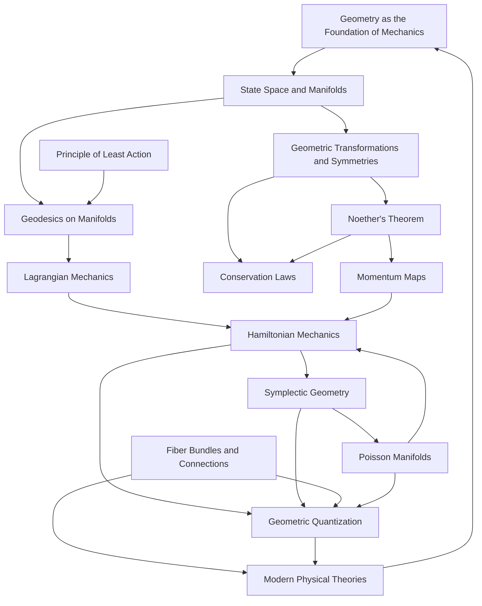

# A Pure Geometric Origin of Classical Mechanics: From State Evolution to Physical Reality
* * *

--- From the fabric of geometry arises the tapestry of physical law.

# **1. Introduction**

**Epigraph**:
*"Geometry is knowledge that appears to be produced by human beings, yet whose meaning is totally independent of them."*
— Rudolf Steiner

The study of classical mechanics, a discipline that has withstood the test of centuries, remains as fundamental today as it was in the times of Newton and Lagrange. It forms the bedrock upon which much of modern physics is constructed. Yet, despite its longevity and apparent familiarity, there persists a sense of incompleteness in our understanding. Questions linger not about the mechanics of computation or the application of established formulas, but about the very essence of what classical mechanics truly represents. **What is the intrinsic nature of classical mechanics? Can we distill its principles to a purer form, one that reveals deeper insights into the fabric of physical reality?**

## **1.1 The Quest for the Essence of Classical Mechanics**

Classical mechanics traditionally presents itself as a collection of laws and equations governing the motion of bodies under the influence of forces. While these laws—Newton's laws of motion, Hamilton's equations, and the Euler-Lagrange equations—provide powerful predictive tools, they often mask the underlying unity and simplicity of the physical world. The multiplicity of formulations can obscure the fundamental connections between different mechanical systems and the laws that govern them.

One challenge lies in the compartmentalization of concepts:

- **Newtonian Mechanics** focuses on forces and accelerations, often leading to complicated vector equations when dealing with multiple particles or non-inertial frames.
  
- **Lagrangian Mechanics** emphasizes energy differences, utilizing generalized coordinates to simplify problems but sometimes lacking intuitive physical interpretation.
  
- **Hamiltonian Mechanics** introduces phase space and symplectic structures, providing elegant mathematical frameworks yet sometimes feeling removed from tangible physical concepts.

This fragmentation prompts a deeper inquiry: **Is there a more fundamental principle from which all these formulations emerge?**

## **1.2 Geometry as the Foundation**

Geometry, the study of shapes, spaces, and their properties, has long been a cornerstone of mathematical thought. It offers a language that is both universal and profoundly connected to physical reality. The geometric approach to physics suggests that the laws of nature are manifestations of the geometric properties of the underlying space in which physical processes occur.

Historically, the interplay between geometry and physics has led to significant advancements:

- **General Relativity**: Einstein's revolutionary insight that gravity is not a force but a manifestation of the curvature of spacetime profoundly reshaped our understanding of gravitational phenomena.

- **Gauge Theories**: The formulation of fundamental interactions (electromagnetic, weak, and strong forces) as connections in fiber bundles reveals the deep geometric nature of physical laws.

In this spirit, we propose that **classical mechanics itself can be reconstructed entirely from pure geometric principles**. By regarding mechanical systems as geometric objects evolving within appropriately defined spaces, we can unveil the intrinsic simplicity and unity of the laws of motion.

## **1.3 The Motivation for a Geometric Reconstruction**

The motivation for this geometric reconstruction is multifaceted:

1. **Unification of Formulations**: A geometric foundation can seamlessly integrate Newtonian, Lagrangian, and Hamiltonian mechanics, revealing them as different facets of the same underlying structure.

2. **Deeper Insight into Physical Laws**: By deriving physical laws from geometric principles, we gain a more profound understanding of why these laws take the form they do, rather than simply accepting them as empirical observations.

3. **Simplification and Elegance**: Geometry provides tools to simplify complex problems through symmetry and invariance principles, leading to more elegant solutions and generalizations.

4. **Bridging Classical and Modern Physics**: A geometric perspective creates natural pathways to advanced theories, such as quantum mechanics and general relativity, facilitating a more cohesive understanding of physics as a whole.

## **1.4 Envisioned Journey Through Geometry**

This document embarks on a journey to **reconstruct classical mechanics from the ground up**, using pure geometry as our guide. We will delve into the intrinsic nature of mechanical systems, exploring how their evolution can be described entirely by geometric transformations within suitably defined spaces.

- **Chapter 2: Foundational Geometric Concepts**
  We begin by establishing the mathematical structures necessary for our reconstruction. This includes the introduction of state spaces as manifolds, the language of differentiable geometry, and the role of symmetries and transformations.

- **Chapter 3: Dynamics Arising from Geometry**
  Here, we explore how the motion of mechanical systems can be understood as geodesics within these geometric spaces, invoking the principle of least action as a natural consequence of geometric properties.

- **Chapter 4: Lagrangian Mechanics from Geometric Foundations**
  We derive the Lagrangian formalism by expressing kinetic and potential energies in geometric terms, leading to the Euler-Lagrange equations through variational principles applied within manifolds.

- **Chapter 5: Hamiltonian Mechanics and Symplectic Geometry**
  The transition to Hamiltonian mechanics is achieved by introducing symplectic structures. We investigate how Hamilton's equations emerge naturally from the symplectic geometry of phase space.

- **Chapter 6: Geometric Interpretation of Conservation Laws**
  We examine Noether's theorem in the geometric context, demonstrating how symmetries lead to conservation laws through the language of differential geometry and group theory.

- **Chapter 7: Advanced Geometric Structures in Mechanics**
  This chapter extends our geometric framework to include fiber bundles, connections, and Poisson manifolds, providing tools to tackle more complex systems and laying the groundwork for field theories.

- **Chapter 8: Bridging Classical and Quantum Mechanics Geometrically**
  We explore the pathway from classical to quantum mechanics via geometric quantization, highlighting how the structures developed can be extended to modern physical theories.

- **Chapter 9: Conclusion**
  We reflect on the insights gained through this geometric reconstruction, considering the implications for our understanding of physical reality and potential directions for future research.

## **1.5 The Deeper Implications**

Reconstructing classical mechanics from geometric principles is not merely an academic exercise; it is an endeavor to **reveal the profound interconnectedness of mathematics and physics**. Geometry, being abstract yet inherently connected to space and form, provides a unique bridge between human intuition and the underlying laws of the universe.

By viewing classical mechanics through this lens, we aim to:

- **Demystify Complex Concepts**: Present concepts in a way that is intuitive yet rigorous, making advanced ideas more accessible.

- **Foster Interdisciplinary Thinking**: Encourage the blending of mathematical rigor with physical intuition, opening avenues for innovation at the intersection of disciplines.

- **Inspire New Perspectives**: Challenge conventional approaches, prompting readers to think differently about familiar concepts and potentially leading to novel discoveries.

## **1.6 Invitation to the Reader**

We invite you, the experienced educator, researcher, or curious mind, to embark on this journey with us. Together, we will **delve deep into the geometric heart of classical mechanics**, uncovering layers of understanding that may have remained hidden within traditional treatments.

This exploration is not just about acquiring knowledge but about **engaging with the very essence of how we perceive and describe physical reality**. It is an opportunity to revisit foundational principles, question assumptions, and appreciate the elegance that arises when geometry and physics are woven together seamlessly.

Let us begin this endeavor to rediscover classical mechanics, not as a relic of the past, but as a living, evolving framework that continues to offer profound insights into the world around us.

# **2. Foundational Geometric Concepts**

**Epigraph**:
*"In the realm of geometry, every point tells a story."*
— Anonymous

A thorough understanding of classical mechanics requires a foundational grasp of the geometric structures upon which the theory is built. Geometry provides the language and framework necessary to describe the states and evolution of mechanical systems in a way that is both rigorous and deeply insightful. In this chapter, we lay the groundwork for our geometric reconstruction of classical mechanics by introducing the essential concepts of state spaces, manifolds, coordinate systems, and the symmetries inherent in geometric transformations. By delving into these foundational elements, we equip ourselves with the tools to interpret physical phenomena as manifestations of geometric properties and transformations.

## **2.1 State Space and Manifolds**

At the heart of our geometric approach lies the concept of the **state space**, a mathematical structure that represents all possible states of a mechanical system. This space is more than a mere collection of points; it is imbued with a rich geometric and topological structure that captures the essence of the system's physical properties.

### **2.1.1 The State Space as a Manifold**

A **manifold** is a mathematical space that, on a small scale, resembles Euclidean space but can have a more complicated global structure. Formally, an $n$-dimensional manifold $M$ is a topological space in which every point has a neighborhood that is homeomorphic (topologically equivalent) to an open subset of $\mathbb{R}^n$.

The state space of a mechanical system is modeled as a manifold because:

- **Local Euclidean Structure**: Near any point (state), the system's behavior can be approximated by linear equations, akin to how a small patch on a sphere appears flat.
  
- **Global Complexity**: The overall structure can accommodate complex configurations, constraints, and topologies arising from the physical characteristics of the system.

**Example**: Consider a simple pendulum constrained to move in a plane. The state space of its configuration is a circle $S^1$, a one-dimensional manifold that captures all possible angular positions.

### **2.1.2 Coordinate Systems and Charts**

To perform calculations and describe the manifold quantitatively, we introduce **coordinate systems** via the concept of **charts**.

- A **chart** $(U, \phi)$ consists of an open subset $U \subset M$ and a homeomorphism $\phi: U \rightarrow \mathbb{R}^n$ that maps points in $U$ to $\mathbb{R}^n$.
  
- An **atlas** is a collection of charts that covers the entire manifold $M$, ensuring that every point is included in at least one chart.

**Purpose of Coordinate Systems**:

- **Localization**: Coordinates allow us to describe the manifold locally, facilitating calculations involving derivatives and integrals.

- **Transition Functions**: Where charts overlap, **transition functions** $\phi_{\alpha\beta}$ relate the coordinates in one chart to those in another, ensuring consistency across the manifold.

**Importance in Mechanics**:

- **Generalized Coordinates**: In classical mechanics, generalized coordinates $q^i$ are used to specify the configuration of a system. These serve as coordinate functions on the manifold.

- **Degrees of Freedom**: The dimension of the manifold corresponds to the number of degrees of freedom of the system.

**Example**: For a particle moving in three-dimensional space without constraints, the manifold is $\mathbb{R}^3$, and the standard Cartesian coordinates $(x, y, z)$ serve as a global coordinate system.

### **2.1.3 Smooth Structures and Differentiability**

To analyze motion and define concepts like velocity and acceleration, the manifold must possess additional structure:

- A **smooth manifold** is a manifold equipped with an atlas of charts whose transition functions are infinitely differentiable ($C^\infty$).

- **Differentiable Functions**: Functions between manifolds that respect the smooth structure are called differentiable if they pull back smooth functions to smooth functions.

**Tangent Spaces**:

- At each point $p \in M$, the **tangent space** $T_p M$ consists of all tangent vectors at $p$, providing a linear approximation of the manifold near $p$.

- **Vector Fields**: Assigning a tangent vector to each point yields a vector field, representing, for example, the velocity field of a moving particle.

**Importance in Mechanics**:

- **Trajectories**: The path of a system's evolution is represented as a smooth curve $\gamma(t): I \rightarrow M$, where $I$ is an interval in $\mathbb{R}$.

- **Velocity and Acceleration**: The time derivatives of $\gamma(t)$ are elements of the tangent space $T_{\gamma(t)} M$, providing the necessary quantities to describe motion.

### **2.1.4 Examples of State Spaces**

1. **Rigid Body Rotation**:

   - **Configuration Manifold**: The group $SO(3)$ of rotation matrices represents all possible orientations of a rigid body in three dimensions.

   - **Manifold Structure**: $SO(3)$ is a smooth, compact, three-dimensional manifold (Lie group), capturing the rotational degrees of freedom.

2. **Double Pendulum**:

   - **Configuration Manifold**: The product of two circles $S^1 \times S^1$ represents the angular positions of the two pendulum arms.

   - **Manifold Structure**: A two-dimensional torus, reflecting the periodicity and combinatorial possibilities of the angles.

3. **Phase Space**:

   - For systems where both positions and momenta are considered, the **phase space** extends the configuration manifold to include momentum coordinates, forming a **cotangent bundle** $T^*M$.

   - This space is central to Hamiltonian mechanics and will be explored further in subsequent chapters.

### **2.1.5 Significance in Physical States**

The manifold structure of the state space ensures that:

- **Continuity and Smoothness**: Physical states change smoothly over time, reflecting the continuity of physical processes.

- **Global vs. Local Properties**: While local properties govern immediate behavior, the global topology of the manifold can have significant effects on the system's evolution (e.g., the possibility of closed orbits or topological constraints leading to conserved quantities).

- **Mathematical Rigor**: Providing a rigorous mathematical framework allows for precise definitions and proofs, essential for advanced theoretical developments.

## **2.2 Geometric Transformations and Symmetries**

Symmetry plays a pivotal role in physics, providing insights into conservation laws and fundamental interactions. In geometry, transformations that preserve certain structures lead to symmetries of the manifold, which, when applied to the state space of a mechanical system, translate into physical invariances.

### **2.2.1 Diffeomorphisms**

A **diffeomorphism** is a smooth, invertible map $f: M \rightarrow M$ such that both $f$ and $f^{-1}$ are infinitely differentiable. Diffeomorphisms serve as the smooth automorphisms of the manifold, reshaping it without tearing or gluing.

**Properties**:

- **Structure Preservation**: Diffeomorphisms preserve the differentiable structure of the manifold.

- **Coordinate Transformation**: Changing from one coordinate system to another is facilitated by diffeomorphisms.

**Role in Mechanics**:

- **Changing Perspectives**: Diffeomorphisms allow us to examine the system from different coordinate perspectives, which can simplify problems or reveal hidden symmetries.

- **Equivalence of Descriptions**: Two descriptions related by a diffeomorphism are considered physically equivalent if the physical laws are invariant under such transformations.

### **2.2.2 Group Actions and Symmetry Groups**

A **group action** of a group $G$ on a manifold $M$ is a smooth mapping $\Phi: G \times M \rightarrow M$ satisfying:

1. **Identity**: $\Phi(e, p) = p$ for all $p \in M$, where $e$ is the identity element of $G$.

2. **Compatibility**: $\Phi(g_1 g_2, p) = \Phi(g_1, \Phi(g_2, p))$ for all $g_1, g_2 \in G$ and $p \in M$.

**Symmetry Groups in Mechanics**:

- **Definition**: A symmetry group of a mechanical system is a group $G$ whose action leaves the system's Lagrangian (or Hamiltonian) invariant.

- **Examples**:

  - **Translation Symmetry**: The group $\mathbb{R}^n$ acting on $\mathbb{R}^n$ by translation corresponds to the conservation of linear momentum.

  - **Rotational Symmetry**: The group $SO(3)$ acting on $\mathbb{R}^3$ via rotations corresponds to the conservation of angular momentum.

### **2.2.3 Invariances and Physical Laws**

The presence of symmetries leads to invariances in the physical laws governing the system:

- **Noether's Theorem**: A continuous symmetry of the action functional implies the existence of a conserved quantity. This profound result links geometric symmetries to conservation laws in physics.

- **Invariance of the Lagrangian**: If the Lagrangian $L$ remains unchanged under the action of a symmetry group $G$, then the equations of motion exhibit corresponding conservation properties.

**Mathematical Representation**:

- **Infinitesimal Generators**: The Lie algebra associated with a Lie group $G$ consists of vector fields generating infinitesimal transformations.

- **Symplectic Transformations**: In Hamiltonian mechanics, canonical transformations that preserve the symplectic structure are associated with conserved quantities.

### **2.2.4 Examples of Geometric Symmetries**

1. **Time Translation Symmetry**:

   - **Transformation**: $t \rightarrow t + \delta t$

   - **Invariance**: If the Lagrangian does not explicitly depend on time ($\partial L / \partial t = 0$), the system is invariant under time translations.

   - **Conservation Law**: Conservation of energy.

2. **Spatial Rotation Symmetry**:

   - **Transformation**: $\mathbf{r} \rightarrow R \mathbf{r}$, where $R \in SO(3)$

   - **Invariance**: For systems with rotational symmetry, the Lagrangian is invariant under rotations.

   - **Conservation Law**: Conservation of angular momentum.

3. **Galilean Transformation** (Classical Mechanics):

   - **Transformation**: $\mathbf{r} \rightarrow \mathbf{r} + \mathbf{v} t$, $t \rightarrow t$

   - **Invariance**: Newton's laws are invariant under Galilean transformations, reflecting the principle of relativity in classical mechanics.

### **2.2.5 Diffeomorphisms and Physical Equivalence**

In the context of general relativity and advanced mechanics, diffeomorphisms play a more profound role:

- **General Covariance**: The laws of physics are formulated in a way that is invariant under arbitrary differentiable coordinate transformations (diffeomorphisms).

- **Physical Observables**: Quantities that are invariant under diffeomorphisms are considered physically meaningful.

**Implications for Mechanics**:

- **Invariant Formulations**: Expressing the laws of mechanics in a coordinate-free, geometrically invariant way enhances their generality and applicability.

- **Understanding Forces as Geometry**: In some advanced theories, what we perceive as forces may be interpreted as geometric effects arising from the structure of the manifold (e.g., gravity in general relativity).

### **2.2.6 Symmetries Leading to Simplifications**

Exploiting symmetries can greatly simplify the analysis of mechanical systems:

- **Reduced Degrees of Freedom**: Symmetries can be used to reduce the number of variables, transforming a complex problem into a more manageable one.

- **Conserved Quantities**: Identifying conserved quantities allows for integration of equations of motion and deeper insights into the system's behavior.

- **Canonical Forms**: Through appropriate coordinate choices and transformations, the equations governing a system can be cast into canonical forms that are more amenable to solution.

### **2.2.7 Group Theory in Mechanics**

**Lie Groups and Lie Algebras**:

- **Lie Groups**: Continuous groups that are also differentiable manifolds, enabling the application of calculus.

- **Lie Algebras**: The tangent space at the identity element of a Lie group, equipped with a bracket operation, capturing the group's infinitesimal structure.

**Application in Mechanics**:

- **Symmetry Analysis**: Lie group methods are powerful tools for analyzing symmetries and solving differential equations arising in mechanics.

- **Representation Theory**: Studying how groups act on vector spaces provides insights into the possible states and transitions of a system.

### **2.2.8 Conclusion and Outlook**

Understanding the geometric transformations and symmetries of the state space manifold is essential for:

- **Predicting Physical Behavior**: Symmetries inform us about conservation laws and invariant properties that are crucial for predicting how systems evolve.

- **Unifying Principles**: Recognizing that diverse physical phenomena can be attributed to underlying geometric symmetries reinforces the unity of physical laws.

- **Advancing Theoretical Developments**: These concepts lay the groundwork for more advanced topics, such as Hamiltonian mechanics, symplectic geometry, and geometric quantization, which we will explore in subsequent chapters.

## **2.3 Conclusion**

By establishing a solid foundation in the geometric concepts of state spaces, manifolds, coordinate systems, and symmetries, we are now equipped to delve deeper into the geometric formulation of dynamics. In the next chapter, we will explore how the motion of mechanical systems arises naturally from the geometric properties of these spaces, further illuminating the profound connection between geometry and physical reality.

# **3. Dynamics Arising from Geometry**

**Epigraph**:
*"The path of least resistance is etched in the curves of space."*
— Anonymous

In the geometric framework we've established, the dynamics of mechanical systems emerge as natural consequences of the manifold's intrinsic properties. Instead of viewing forces and accelerations as primary, we interpret motion as the manifestation of geometry. The evolution of a system corresponds to a path on its state space manifold, and the laws governing this evolution arise from the geometric characteristics of that space. In this chapter, we delve into how geodesics—generalizations of straight lines to curved spaces—represent the natural trajectories of physical systems. By introducing the Principle of Least Action as a geometric concept, we connect the shortest paths in geometry to the motion observed in mechanics. We then employ variational calculus within this geometric context to derive the fundamental equations of motion, revealing the profound interplay between geometry and physics.

## **3.1 Geodesics and the Principle of Least Action**

The concept of geodesics is central to differential geometry and plays a pivotal role in our geometric interpretation of mechanics. Geodesics can be thought of as the "straightest" or "shortest" paths between points on a manifold, generalizing the notion of straight lines in Euclidean space. In the realm of mechanics, we propose that the natural motion of a system corresponds to geodesics on its state space manifold. This perspective inherently incorporates the Principle of Least Action, framing it as a geometric assertion about the paths systems prefer.

### **3.1.1 Geodesics on a Manifold**

A **geodesic** on a manifold $M$ is a curve $\gamma(t)$ that satisfies a specific variational property—it extremizes a certain functional, typically the length or energy associated with the path. For a Riemannian manifold equipped with a metric tensor $g$, the length of a curve $\gamma: [a, b] \rightarrow M$ is given by:
$$
L[\gamma] = \int_a^b \sqrt{g_{ij}(\gamma(t)) \frac{d\gamma^i}{dt} \frac{d\gamma^j}{dt}} \, dt,
$$
where $\gamma^i(t)$ are the coordinate representations of the curve, and $g_{ij}$ defines the manifold's geometric structure.

Geodesics satisfy the **geodesic equation**:
$$
\frac{d^2 \gamma^k}{dt^2} + \Gamma^k_{ij} \frac{d\gamma^i}{dt} \frac{d\gamma^j}{dt} = 0,
$$
where $\Gamma^k_{ij}$ are the Christoffel symbols derived from the metric. This equation expresses how the curve $\gamma(t)$ evolves in such a way that it maintains a constant velocity vector in a parallel-transport sense, reflecting the manifold's curvature.

### **3.1.2 The Principle of Least Action as a Geometric Concept**

**The Principle of Least Action (PLA)** states that the trajectory of a mechanical system between two states is such that the action functional $S$ is extremized:
$$
S[\gamma] = \int_{t_1}^{t_2} L(q, \dot{q}, t) \, dt,
$$
where $L$ is the Lagrangian of the system, $q$ are the generalized coordinates, and $\dot{q}$ their time derivatives.

In our geometric framework, we reinterpret this principle:

- **Geometric Action Functional**: The action $S[\gamma]$ becomes a geometric quantity associated with the path $\gamma$ on the manifold.

- **Geodesic Paths as Natural Trajectories**: The paths that extremize $S$ are geodesics, making the PLA a statement about the geometry of the manifold.

This bridges the PLA with the variational property defining geodesics, showing that the natural motion of a system is inherently geometric.

### **3.1.3 Connecting Geodesics to Physical Trajectories**

To link geodesics with physical motion, we consider:

- **Mechanical Systems on Manifolds**: The state space manifold $M$ represents all possible configurations of the system, with its geometry influenced by the system's constraints and properties.

- **Metric Encodes Kinetic Energy**: In mechanics, the kinetic energy defines a metric on $M$:
  $$
  T = \tfrac{1}{2} g_{ij} \dot{q}^i \dot{q}^j,
  $$
  where $g_{ij}$ is the mass matrix or metric tensor.

- **Potential Energy Modifies Geometry**: Potential energy introduces additional structure, such as modifying the connection or acting as a scalar field affecting the geodesic paths.

**Example**: A free particle moving in flat space follows a straight line—the geodesic of Euclidean space. Introducing gravitational potential curves the space, altering the geodesic to a parabolic trajectory, revealing how geometry dictates motion.

### **3.1.4 Gravitational Motion as Geodesics**

In general relativity, particles move along geodesics in curved spacetime:

- **Spacetime Manifold**: The four-dimensional manifold with a Lorentzian metric $g_{\mu\nu}$.

- **Geodesic Equation**:
  $$
  \frac{d^2 x^\mu}{d \tau^2} + \Gamma^\mu_{\alpha\beta} \frac{d x^\alpha}{d \tau} \frac{d x^\beta}{d \tau} = 0,
  $$
  where $\tau$ is the proper time.

- **Interpretation**: Gravity is not a force but the manifestation of spacetime curvature, with geodesics representing natural free-fall trajectories.

This illustrates the profound connection between geometry and dynamics, reinforcing the idea that mechanics can be derived from geometric principles.

### **3.1.5 Generalizing to Other Forces**

While gravity has a clear geometric interpretation, other forces can also be incorporated:

- **Electromagnetic Force**: Charged particles move along geodesics in a manifold with an affine connection modified by the electromagnetic potential—this leads to the concept of minimal coupling in gauge theories.

- **Potential Fields as Geometric Modifications**: Potential energies alter the manifold's structure, affecting the geodesic paths without introducing external forces per se.

### **3.1.6 Implications of the Geometric Viewpoint**

- **Unified Description**: By framing all forces and motions as geometric effects, we achieve a unified description of mechanics.

- **Intrinsic Properties**: The dynamics depend solely on the manifold's intrinsic geometry, not on external or arbitrary constructs.

- **Predictive Power**: Geodesic equations derived from the manifold's geometry can predict the system's behavior without invoking traditional force laws.

## **3.2 Variational Calculus in Geometry**

To formalize the connection between geodesics and the equations of motion, we employ variational calculus within the geometric context. The calculus of variations allows us to find the paths that extremize functionals, such as the action, by considering infinitesimal variations of the paths.

### **3.2.1 The Variational Principle in Geometric Terms**

Given a manifold $M$, we consider a family of curves $\gamma_\varepsilon(t)$ parameterized by $\varepsilon$, such that $\gamma_0(t)$ is the curve of interest. The action functional $S$ depends on $\gamma$:
$$
S[\gamma] = \int_{t_1}^{t_2} L(q, \dot{q}, t) \, dt.
$$
The variation $\delta S$ is determined by how $S$ changes as we vary the curve $\gamma$:
$$
\delta S = \left. \frac{d}{d\varepsilon} S[\gamma_\varepsilon] \right|_{\varepsilon=0}.
$$
The **Principle of Least Action** asserts that $\delta S = 0$ for the true path of the system.

### **3.2.2 Application to Geodesics**

For geodesics, the Lagrangian $L$ is derived from the metric:
$$
L = \tfrac{1}{2} g_{ij}(q) \dot{q}^i \dot{q}^j.
$$
Applying the variational principle:

1. **Compute $\delta S$ Using Variations $\delta q^i$**:
   $$
   \delta S = \int_{t_1}^{t_2} \left( \frac{\partial L}{\partial q^i} \delta q^i + \frac{\partial L}{\partial \dot{q}^i} \delta \dot{q}^i \right) dt.
   $$

2. **Integrate by Parts**:
   $$
   \delta S = \int_{t_1}^{t_2} \left( \frac{\partial L}{\partial q^i} - \frac{d}{dt} \frac{\partial L}{\partial \dot{q}^i} \right) \delta q^i dt + \left[ \frac{\partial L}{\partial \dot{q}^i} \delta q^i \right]_{t_1}^{t_2}.
   $$
   The boundary term vanishes if $\delta q^i(t_1) = \delta q^i(t_2) = 0$.

3. **Derive Euler-Lagrange Equations**:

   Setting $\delta S = 0$ for arbitrary $\delta q^i$ leads to:
   $$
   \frac{d}{dt} \frac{\partial L}{\partial \dot{q}^i} - \frac{\partial L}{\partial q^i} = 0.
   $$

### **3.2.3 Geometric Interpretation of Euler-Lagrange Equations**

Within this framework:

- **Connection to Geodesic Equation**: The Euler-Lagrange equations for the Lagrangian derived from the metric are equivalent to the geodesic equations.

- **Intrinsic Dynamics**: The equations of motion are intrinsic to the manifold, independent of coordinate choices.

- **Variational Origins**: The motion arises from an extremal principle, emphasizing the naturalness of the paths.

### **3.2.4 Incorporating Potential Energy**

When potential energy $V(q)$ is present, the Lagrangian becomes:
$$
L = \tfrac{1}{2} g_{ij} \dot{q}^i \dot{q}^j - V(q).
$$
The Euler-Lagrange equations now include potential-derived forces:
$$
\frac{d}{dt} \left( g_{ij} \dot{q}^j \right) - \tfrac{1}{2} \frac{\partial g_{jk}}{\partial q^i} \dot{q}^j \dot{q}^k + \frac{\partial V}{\partial q^i} = 0.
$$

**Interpretation**:

- **Modified Geodesics**: The potential energy alters the geodesics, curving the paths according to $V(q)$.

- **Geometry Encodes Forces**: Forces are interpreted as arising from the manifold's geometry and potential landscape.

### **3.2.5 Constraints and Lagrange Multipliers**

For systems with constraints:

- **Constraint Equations**: $f_a(q) = 0$.

- **Extended Lagrangian**:
  $$
  L' = L - \lambda^a f_a(q),
  $$
  where $\lambda^a$ are Lagrange multipliers.

- **Euler-Lagrange Equations with Constraints**:
  $$
  \frac{d}{dt} \frac{\partial L'}{\partial \dot{q}^i} - \frac{\partial L'}{\partial q^i} = 0.
  $$

- **Geometric Interpretation**: Constraints restrict motion to a submanifold, and the multipliers enforce these conditions within the variational framework.

### **3.2.6 Advantages of the Geometric Variational Approach**

- **Coordinate-Free Formulation**: The intrinsic nature of the geometric approach eliminates dependence on specific coordinate systems.

- **Unified Treatment of Systems**: Both conservative and non-conservative systems, with or without constraints, are handled within the same framework.

- **Foundation for Further Theories**: This approach sets the stage for advanced topics like Hamiltonian mechanics and field theories, where geometry remains central.

### **3.2.7 Examples**

**1. Harmonic Oscillator**:

- **Lagrangian**:
  $$
  L = \tfrac{1}{2} m (\dot{x})^2 - \tfrac{1}{2} k x^2.
  $$

- **Euler-Lagrange Equation**:
  $$
  m \ddot{x} + k x = 0.
  $$

- **Geometric View**: The oscillator's motion is along geodesics modified by the potential $V(x) = \tfrac{1}{2} k x^2$, curving the manifold accordingly.

**2. Particle in a Central Potential**:

- **Lagrangian in Spherical Coordinates**:
  $$
  L = \tfrac{1}{2} m \left( \dot{r}^2 + r^2 \dot{\theta}^2 + r^2 \sin^2\theta \, \dot{\phi}^2 \right) - V(r).
  $$

- **Conservation Laws from Symmetry**: Rotational symmetry leads to conservation of angular momentum, evident from the geometric invariance under rotations.

## **3.3 Conclusion and Implications**

By interpreting dynamics through the lens of geometry, we uncover a deeper understanding of motion:

- **Motion as Geodesic Flow**: Systems naturally evolve along geodesics determined by the manifold's geometry, unifying the concept of motion across different contexts.

- **Forces as Geometric Effects**: What we perceive as forces are manifestations of the manifold's curvature and structure, integrating dynamics with geometry intrinsically.

- **Unified Framework**: This approach provides a consistent and elegant framework for deriving equations of motion, applicable to a wide range of mechanical systems.

- **Foundation for Advanced Theories**: The insights gained pave the way for exploring Hamiltonian mechanics, symplectic geometry, and even quantum mechanics, where geometry continues to play a crucial role.

As we proceed to the next chapter, we will build upon this geometric foundation to develop **Lagrangian mechanics** in greater detail. By defining the Lagrangian as a geometric object and revisiting the Euler-Lagrange equations, we will further illuminate how geometry encapsulates the essence of dynamics.

# **4. Lagrangian Mechanics from Geometric Foundations**

**Epigraph**:
*"Dynamics is the poetry of geometry in motion."*
— Anonymous

Having established that the motion of mechanical systems can be understood as geodesics on a manifold, arising naturally from the geometric properties of the state space, we now turn our attention to formalizing this understanding within the framework of **Lagrangian mechanics**. In this chapter, we aim to define the **Lagrangian function** as a geometric object, explicitly connecting kinetic and potential energies to geometric constructs. We will then revisit the **Euler-Lagrange equations**, deriving them through geometric reasoning rooted in the variational principles applied to manifolds. This approach not only reaffirms the results of classical mechanics but deepens our comprehension by revealing the intrinsic geometric essence of dynamics.

## **4.1 The Lagrangian as a Geometric Object**

The **Lagrangian function** $L$ is central to the formulation of classical mechanics, serving as the scalar function whose extremization yields the equations of motion. Traditionally defined as the difference between kinetic and potential energies, $L = T - V$, we now endeavor to interpret both $T$ and $V$ in geometric terms, thereby rendering the Lagrangian itself as a geometric entity.

### **4.1.1 Geometric Interpretation of Kinetic Energy**

In the context of a manifold $M$ representing the configuration space of a mechanical system, the kinetic energy $T$ arises naturally from the geometric structure of $M$.

#### **4.1.1.1 Metric Tensor and Kinetic Energy**

A **Riemannian manifold** $(M, g)$ is a smooth manifold endowed with a **metric tensor** $g$, a symmetric, positive-definite (0,2)-tensor field that defines an inner product on the tangent space $T_q M$ at each point $q \in M$. The metric tensor allows us to measure lengths and angles on the manifold.

The kinetic energy $T$ of a system moving along a path $\gamma(t)$ on $M$ is given by:
$$
T = \tfrac{1}{2} g_{ij}(q) \dot{q}^i \dot{q}^j,
$$
where:

- $g_{ij}(q)$ are the components of the metric tensor in local coordinates $\{ q^i \}$,
- $\dot{q}^i = \frac{dq^i}{dt}$ are the components of the velocity vector in these coordinates.

This expression of kinetic energy is inherently geometric, as it directly involves the metric tensor that encapsulates the geometric properties of the manifold.

#### **4.1.1.2 Physical Interpretation**

The metric tensor $g_{ij}$ can be seen as a generalization of the mass matrix for systems with generalized coordinates and constraints. It accounts for the distribution of mass and the geometry of the configuration space, influencing how the kinetic energy depends on the velocities $\dot{q}^i$.

**Example**: For a particle of mass $m$ moving in three-dimensional Euclidean space, the metric tensor is simply $g_{ij} = m \delta_{ij}$, leading to the familiar expression $T = \tfrac{1}{2} m (\dot{x}^2 + \dot{y}^2 + \dot{z}^2)$.

### **4.1.2 Geometric Interpretation of Potential Energy**

While kinetic energy is associated with the geometry of velocities on the manifold, potential energy $V$ relates to scalar fields defined over the manifold.

#### **4.1.2.1 Potential as a Scalar Field**

The potential energy function $V: M \rightarrow \mathbb{R}$ assigns a real number to each point $q \in M$, representing the potential energy associated with that configuration. This scalar field encapsulates the forces acting within the system that derive from potentials.

#### **4.1.2.2 Geometric Significance**

In the geometric framework, potential energy modifies the manifold by introducing a scalar field that influences the dynamics without altering the underlying geometric structure defined by $g$. It can be viewed as "height" in a gravitational field or as variations in potential energy landscape across the manifold.

**Example**: For a particle in a gravitational field near Earth's surface, $V(q) = m g h(q)$, where $h(q)$ is the height function on the manifold.

### **4.1.3 The Lagrangian Function as a Geometric Scalar**

Combining the geometric expressions for kinetic and potential energies, the Lagrangian function $L: TM \rightarrow \mathbb{R}$ is defined on the tangent bundle $TM$ of the manifold $M$:
$$
L(q, \dot{q}, t) = T(q, \dot{q}) - V(q, t) = \tfrac{1}{2} g_{ij}(q) \dot{q}^i \dot{q}^j - V(q, t).
$$
Here, $L$ depends on the position $q$, the velocity $\dot{q}$, and possibly time $t$ if the potential is time-dependent.

#### **4.1.3.1 Properties of the Lagrangian**

- **Scalar Function**: $L$ is a scalar under coordinate transformations, ensuring that its value is invariant under changes of coordinates on $M$.
- **Intrinsic to the Manifold**: Since $L$ is constructed from geometric quantities $g$ and $V$, it encapsulates the intrinsic properties of the manifold and the forces acting on the system.
- **Defined on the Tangent Bundle**: The domain of $L$ is the tangent bundle $TM$, reflecting that it depends on both positions and velocities.

### **4.1.4 Examples of Lagrangians in Geometric Terms**

#### **4.1.4.1 Simple Pendulum**

- **Configuration Manifold**: Circle $S^1$, parametrized by angle $\theta$.
- **Metric Tensor**: $g_{\theta\theta} = m l^2$, where $l$ is the length of the pendulum.
- **Kinetic Energy**: $T = \tfrac{1}{2} m l^2 \dot{\theta}^2$.
- **Potential Energy**: $V(\theta) = m g l (1 - \cos\theta)$.
- **Lagrangian**:

  $$
  L(\theta, \dot{\theta}) = \tfrac{1}{2} m l^2 \dot{\theta}^2 - m g l (1 - \cos\theta).
  $$

#### **4.1.4.2 Rigid Body Rotation**

- **Configuration Manifold**: Rotation group $SO(3)$.
- **Metric Tensor**: Defined via the moment of inertia tensor $I_{ij}$.
- **Kinetic Energy**:
  $$
  T = \tfrac{1}{2} I_{ij} \omega^i \omega^j,
  $$
  where $\omega^i$ are components of the angular velocity in body-fixed coordinates.
- **Potential Energy**: Depends on external fields, e.g., gravitational potential for a non-uniform mass distribution.
- **Lagrangian**:
  $$
  L(R, \dot{R}) = T(R, \dot{R}) - V(R),
  $$
  where $R \in SO(3)$ represents the rotation matrix.

### **4.1.5 The Role of the Lagrangian in Dynamics**

The Lagrangian function serves as the bridge between geometry and dynamics:

- **Encapsulates Dynamics**: $L$ contains all the information necessary to describe the system's motion through the geometric quantities $g_{ij}$ and $V(q)$.
- **Variational Principles**: The action integral $S[\gamma] = \int L \, dt$ is a functional whose extremization yields the equations of motion via the Principle of Least Action.
- **Coordinate-Free Interpretation**: Because $L$ is constructed from geometric invariants, the resulting dynamics are independent of the specific coordinate system chosen.

### **4.1.6 Advantages of Geometric Definition**

- **Unified Framework**: Provides a consistent method for deriving the Lagrangians of various systems within a single geometric framework.
- **Clarity in Constraints**: Constraints can be naturally incorporated into the geometry of $M$, affecting $g$ and simplifying the analysis.
- **Facilitates Symmetry Analysis**: Geometric structures make symmetries more apparent, aiding in identifying conservation laws via Noether's theorem.

## **4.2 Euler-Lagrange Equations Revisited**

Having established the Lagrangian as a geometric object, we now revisit the derivation of the **Euler-Lagrange equations** using geometric reasoning. This derivation not only reinforces the connection between geometry and dynamics but also highlights the intrinsic nature of the equations of motion.

### **4.2.1 Variational Principle on Manifolds**

Consider a smooth manifold $M$ representing the configuration space of a mechanical system. Let $\gamma: [t_1, t_2] \rightarrow M$ be a smooth curve on $M$ representing the path of the system between times $t_1$ and $t_2$.

The **action functional** is defined as:
$$
S[\gamma] = \int_{t_1}^{t_2} L(q(t), \dot{q}(t), t) \, dt,
$$
where $L: TM \times \mathbb{R} \rightarrow \mathbb{R}$ is the Lagrangian.

The **Principle of Least Action** states that the actual path $\gamma$ taken by the system makes $S[\gamma]$ stationary with respect to variations $\delta \gamma$ that vanish at the endpoints.

### **4.2.2 Derivation of the Euler-Lagrange Equations**

To derive the equations of motion, we consider a family of curves $\gamma_\varepsilon(t)$, with $\gamma_0(t) = \gamma(t)$ being the actual path, and $\varepsilon$ a real parameter.

#### **4.2.2.1 Computing the Variation of the Action**

The variation of the action is:
$$
\delta S = \left. \frac{d}{d\varepsilon} S[\gamma_\varepsilon] \right|_{\varepsilon=0} = \int_{t_1}^{t_2} \left( \frac{\partial L}{\partial q^i} \delta q^i + \frac{\partial L}{\partial \dot{q}^i} \delta \dot{q}^i \right) dt,
$$
where $\delta q^i = \left. \frac{d}{d\varepsilon} q^i_\varepsilon \right|_{\varepsilon=0}$ are the variations of the coordinates.

#### **4.2.2.2 Integration by Parts**

We integrate the term involving $\delta \dot{q}^i$:
$$
\int_{t_1}^{t_2} \frac{\partial L}{\partial \dot{q}^i} \delta \dot{q}^i dt = \left[ \frac{\partial L}{\partial \dot{q}^i} \delta q^i \right]_{t_1}^{t_2} - \int_{t_1}^{t_2} \frac{d}{dt} \left( \frac{\partial L}{\partial \dot{q}^i} \right) \delta q^i dt.
$$
Since $\delta q^i(t_1) = \delta q^i(t_2) = 0$, the boundary term vanishes.

#### **4.2.2.3 Stationarity Condition**

Setting $\delta S = 0$ for arbitrary $\delta q^i$ leads to:
$$
\int_{t_1}^{t_2} \left( \frac{\partial L}{\partial q^i} - \frac{d}{dt} \left( \frac{\partial L}{\partial \dot{q}^i} \right) \right) \delta q^i dt = 0.
$$
For this integral to vanish for all $\delta q^i$, the integrand must be zero:
$$
\frac{d}{dt} \left( \frac{\partial L}{\partial \dot{q}^i} \right) - \frac{\partial L}{\partial q^i} = 0.
$$
These are the **Euler-Lagrange equations**, the fundamental equations governing the motion of the system.

### **4.2.3 Geometric Interpretation**

#### **4.2.3.1 Covariant Derivatives and Geometry**

In a geometric context, the Euler-Lagrange equations can be interpreted using covariant derivatives on the manifold $M$:

- The term $\frac{d}{dt} \left( \frac{\partial L}{\partial \dot{q}^i} \right)$ involves the acceleration, which can be related to the covariant derivative of the velocity vector along the curve $\gamma(t)$.
- The partial derivatives $\frac{\partial L}{\partial q^i}$ involve the gradients of the Lagrangian with respect to the coordinates, reflecting how the geometry of $M$ and the potential $V(q)$ influence the motion.

#### **4.2.3.2 Intrinsic Equations of Motion**

By expressing the equations in terms of geometric quantities, we obtain intrinsic equations of motion that are independent of coordinate choices:
$$
\nabla_{\dot{\gamma}} \left( \frac{\partial L}{\partial \dot{\gamma}} \right) - \frac{\partial L}{\partial \gamma} = 0,
$$
where $\nabla_{\dot{\gamma}}$ denotes the covariant derivative along the curve $\gamma$.

#### **4.2.3.3 Connection to Geodesics**

When the Lagrangian is purely kinetic, $L = \tfrac{1}{2} g_{ij} \dot{q}^i \dot{q}^j$, the Euler-Lagrange equations reduce to the geodesic equations on the manifold $M$:
$$
\ddot{q}^k + \Gamma^k_{ij} \dot{q}^i \dot{q}^j = 0,
$$
where $\Gamma^k_{ij}$ are the Christoffel symbols associated with the metric $g_{ij}$.

When potential energy is present, the equations become:
$$
\ddot{q}^k + \Gamma^k_{ij} \dot{q}^i \dot{q}^j = g^{kl} \frac{\partial V}{\partial q^l},
$$
illustrating how the potential modifies the geodesic paths, effectively "curving" the manifold in a manner dictated by $V$.

### **4.2.4 Examples and Applications**

#### **4.2.4.1 Particle in a Potential Field**

For a particle of mass $m$ moving under potential $V(q)$:

- **Lagrangian**:
  $$
  L(q, \dot{q}) = \tfrac{1}{2} m g_{ij} \dot{q}^i \dot{q}^j - V(q).
  $$

- **Euler-Lagrange Equations**:
  $$
  m \left( \ddot{q}^k + \Gamma^k_{ij} \dot{q}^i \dot{q}^j \right) = -\frac{\partial V}{\partial q^k}.
  $$

This equation elegantly combines the geometric effects (through $\Gamma^k_{ij}$) and the influence of the potential.

#### **4.2.4.2 Mechanical Systems with Constraints**

For systems with holonomic constraints, the configuration space is a submanifold $N \subset M$:

- The Lagrangian remains defined on $N$, and the variational principle is applied to curves $\gamma(t)$ confined to $N$.
- The Euler-Lagrange equations naturally incorporate the constraints through the manifold's geometry.

### **4.2.5 Advantages of the Geometric Approach**

#### **4.2.5.1 Coordinate Independence**

By formulating the Euler-Lagrange equations geometrically, we ensure that the equations of motion are invariant under coordinate transformations, reflecting the physical reality that the dynamics should not depend on arbitrary choices of coordinates.

#### **4.2.5.2 Unified Treatment of Forces and Geometry**

The geometric derivation seamlessly integrates forces (via potential energy) and geometric effects (via the manifold's curvature), providing a holistic view of dynamics.

#### **4.2.5.3 Facilitates Symmetry Analysis**

Geometric reasoning highlights symmetries inherent in the manifold. If the Lagrangian is invariant under a continuous group of transformations, Noether's theorem can be applied directly within this framework to identify conserved quantities.

### **4.2.6 Connection to Hamiltonian Mechanics**

The geometric formulation of the Euler-Lagrange equations sets the stage for transitioning to Hamiltonian mechanics:

- The Legendre transformation, which moves from velocities $\dot{q}^i$ to momenta $p_i = \frac{\partial L}{\partial \dot{q}^i}$, is naturally understood in the geometric context of the cotangent bundle $T^*M$.
- The Hamiltonian function $H(q, p)$ emerges as another geometric object, leading to Hamilton's equations, which will be explored in the next chapter.

## **4.3 Summary and Implications**

By defining the Lagrangian as a geometric object and deriving the Euler-Lagrange equations through geometric reasoning, we have:

- Reinforced the profound connection between geometry and dynamics, illustrating how the laws of motion emerge naturally from the manifold's properties.
- Demonstrated that kinetic and potential energies are intrinsically geometric, arising from the metric tensor and scalar fields on the manifold.
- Provided a coordinate-independent formulation of mechanics, emphasizing the universality and elegance of the geometric approach.

This geometric perspective not only enriches our understanding of classical mechanics but also lays a robust foundation for advanced topics:

- **Hamiltonian Mechanics and Symplectic Geometry**: The geometric structures introduced here smoothly transition into the symplectic geometry of phase space, where Hamiltonian dynamics unfold.
- **Conservation Laws and Symmetries**: The geometric framework facilitates the application of Noether's theorem, connecting symmetries to conserved quantities in a natural way.
- **Generalizations to Field Theories**: Extending these concepts to infinite-dimensional manifolds opens the door to classical field theories and, ultimately, to quantum mechanics.

As we proceed to delve into Hamiltonian mechanics and symplectic geometry in the next chapter, we will continue to build upon the geometric foundations established here, further illuminating the intricate tapestry woven by geometry and physical law.

# **5. Hamiltonian Mechanics and Symplectic Geometry**

**Epigraph**:
*"In the symplectic sea, energy flows along invisible currents."*
— Anonymous

The geometric journey through classical mechanics leads us naturally from the Lagrangian formulation, grounded in the configuration space and variational principles, to the Hamiltonian framework, which unfolds within the rich geometric tapestry of **symplectic geometry**. The transition to Hamiltonian mechanics is not merely a change of variables or formalism; it represents a profound shift in perspective, revealing the deep geometric structures that underpin the dynamics of physical systems.

In this chapter, we explore **phase space** as a symplectic manifold, delving into the intrinsic properties that make it the natural setting for Hamiltonian dynamics. We will define **symplectic structures**, elucidate how they provide the geometric foundation for Hamilton's equations, and discuss the role of **canonical coordinates**. By deriving Hamilton's equations from symplectic geometry, we emphasize the geometric essence of evolution in phase space, unveiling how energy and motion are interwoven within the symplectic fabric.

## **5.1 Symplectic Manifolds and Phase Space**

At the heart of Hamiltonian mechanics lies the concept of **phase space**, a geometric space that encompasses both the positions and momenta of a system. Unlike configuration space, which only accounts for the positions (generalized coordinates), phase space provides a complete description of the system's state at any given time. The structure of phase space is profoundly symplectic, and understanding this symplectic structure is key to appreciating the geometric nature of Hamiltonian dynamics.

### **5.1.1 Phase Space as a Symplectic Manifold**

A **symplectic manifold** $(M, \omega)$ is a smooth even-dimensional manifold $M$ equipped with a closed, non-degenerate differential $2$-form $\omega$, known as the **symplectic form**. This symplectic form encapsulates the geometric structure necessary to describe the evolution of Hamiltonian systems.

**Definition of a Symplectic Manifold**:

- **Symplectic Form $\omega$**: A $2$-form $\omega \in \Omega^2(M)$ that is:
  - **Closed**: $d\omega = 0$.
  - **Non-Degenerate**: For any non-zero tangent vector $v \in T_p M$, there exists a $u \in T_p M$ such that $\omega(v, u) \neq 0$.

- **Even-Dimensional Manifold**: The non-degeneracy of $\omega$ implies that $\dim(M) = 2n$ for some integer $n$, corresponding to $n$ degrees of freedom in the physical system.

**Physical Interpretation**:

- The manifold $M$ represents the **phase space** of the system, with points $z = (q^i, p_i)$ specifying the generalized coordinates $q^i$ and their conjugate momenta $p_i$.
  
- The symplectic form $\omega$ encodes the fundamental Poisson bracket relations between coordinates and momenta, reflecting the intrinsic coupling between them.

### **5.1.2 The Cotangent Bundle and Natural Symplectic Structure**

For a configuration manifold $Q$, the phase space $M = T^*Q$ is naturally identified with the **cotangent bundle** of $Q$:

- **Cotangent Bundle $T^*Q$**: The union of all cotangent spaces $T^*_q Q$ at each point $q \in Q$, where $T^*_q Q$ consists of linear functionals on the tangent space $T_q Q$.

- **Canonical Coordinates**: On $T^*Q$, one can use local coordinates $(q^i, p_i)$, where $p_i$ are the components of the momentum covector at $q$.

**Canonical Symplectic Form**:

- The symplectic form $\omega$ on $T^*Q$ is given by:
  $$
  \omega = -d\theta,
  $$
  where $\theta$ is the **Liouville $1$-form** (also called the **canonical $1$-form**):
  $$
  \theta = p_i \, dq^i.
  $$

- In local coordinates, the symplectic form becomes:
  $$
  \omega = dq^i \wedge dp_i.
  $$

**Properties**:

- **Closedness**: $d\omega = 0$ since $\omega = -d\theta$ and $d^2 = 0$.

- **Non-Degeneracy**: The pairing between $dq^i$ and $dp_i$ ensures that $\omega$ is non-degenerate.

### **5.1.3 Significance of the Symplectic Structure**

The symplectic structure provides the geometric framework necessary for Hamiltonian mechanics:

- **Encodes Dynamics**: The symplectic form $\omega$ defines how position and momentum variables are intertwined, governing the flow of the system.

- **Coordinate-Free Formulation**: The symplectic structure allows for a description of dynamics independent of specific coordinate choices.

- **Foundation for Poisson Brackets**: The symplectic form underpins the Poisson bracket, a fundamental construct in Hamiltonian mechanics.

### **5.1.4 Canonical Coordinates and Transformations**

**Canonical Coordinates**:

- Coordinates $(q^i, p_i)$ are **canonical** if they satisfy:
  $$
  \{ q^i, q^j \} = 0, \quad \{ p_i, p_j \} = 0, \quad \{ q^i, p_j \} = \delta^i_j,
  $$
  where $\{ \cdot , \cdot \}$ denotes the Poisson bracket.

- These relations reflect the underlying symplectic structure and ensure that the equations of motion retain their form under coordinate transformations that preserve $\omega$.

**Canonical Transformations**:

- A smooth map $\phi: M \rightarrow M$ is a **canonical transformation** (or **symplectomorphism**) if it preserves the symplectic form:
  $$
  \phi^* \omega = \omega.
  $$

- Canonical transformations correspond to changes in the phase space variables that maintain the Hamiltonian structure of the equations of motion.

### **5.1.5 Examples of Symplectic Manifolds**

**Example 1: Simple Harmonic Oscillator**

- **Phase Space**: $\mathbb{R}^2$ with coordinates $(q, p)$.

- **Symplectic Form**: $\omega = dq \wedge dp$.

**Example 2: Motion on a Sphere**

- **Configuration Space**: $S^2$, the 2-sphere.

- **Phase Space**: $T^*S^2$, the cotangent bundle of $S^2$.

- **Symplectic Form**: Derived from the canonical $1$-form on $T^*S^2$.

### **5.1.6 The Role of Symplectic Geometry in Hamiltonian Mechanics**

Symplectic geometry is indispensable in Hamiltonian mechanics as it:

- **Provides the Language for Dynamics**: The evolution of a Hamiltonian system is naturally described using symplectic geometry.

- **Reveals Invariants and Conservation Laws**: Symplectic structures are closely related to conservation laws through Noether's theorem and the existence of conserved quantities.

- **Facilitates Quantization**: Understanding the symplectic structure is essential for the geometric quantization of classical systems.

## **5.2 Hamilton's Equations from Symplectic Structure**

With the symplectic manifold and symplectic form established, we now turn to deriving **Hamilton's equations** using the language of symplectic geometry. This derivation emphasizes the geometric essence of dynamics, showing that the evolution of a Hamiltonian system is governed by the flow generated by the Hamiltonian vector field on the symplectic manifold.

### **5.2.1 Hamiltonian Functions and Vector Fields**

**Hamiltonian Function $H$**:

- A smooth function $H: M \rightarrow \mathbb{R}$ representing the total energy of the system.

**Hamiltonian Vector Field $X_H$**:

- Associated with every Hamiltonian function $H$ is a vector field $X_H$ defined by:
  $$
  \iota_{X_H} \omega = dH,
  $$
  where $\iota_{X_H} \omega$ denotes the interior product (contraction) of $\omega$ with $X_H$.

- **Interpretation**: The Hamiltonian vector field $X_H$ generates the flow that governs the time evolution of the system in phase space.

### **5.2.2 Derivation of Hamilton's Equations**

**In Local Coordinates**:

- Writing $\omega$ and $dH$ in canonical coordinates $(q^i, p_i)$:
  $$
  \omega = dq^i \wedge dp_i, \quad dH = \frac{\partial H}{\partial q^i} dq^i + \frac{\partial H}{\partial p_i} dp_i.
  $$

- The condition $\iota_{X_H} \omega = dH$ leads to:
  $$
  \omega(X_H, \cdot) = dH.
  $$

**Components of $X_H$**:

- Let $X_H = (\dot{q}^i, \dot{p}_i)$, then:
  $$
  \omega(X_H, \cdot) = dq^i \wedge dp_i (\dot{q}^j, \dot{p}_j, \cdot) = \dot{q}^i dp_i - \dot{p}_i dq^i.
  $$

- Equating to $dH$, we obtain:
  $$
  \dot{q}^i = \frac{\partial H}{\partial p_i}, \quad \dot{p}_i = -\frac{\partial H}{\partial q^i}.
  $$

These are **Hamilton's equations**, derived directly from the symplectic structure.

### **5.2.3 Geometric Interpretation of Hamilton's Equations**

**Symplectic Flow**:

- The Hamiltonian vector field $X_H$ generates a flow $\phi_t$ on $M$, where $\phi_t: M \rightarrow M$ satisfies:
  $$
  \frac{d}{dt} \phi_t(z) = X_H(\phi_t(z)), \quad \phi_0(z) = z.
  $$

- The flow preserves the symplectic form:
  $$
  \phi_t^* \omega = \omega,
  $$
  signifying that symplectic structures are invariant under Hamiltonian evolution.

**Phase Space Trajectories**:

- The trajectories of the system in phase space correspond to integral curves of $X_H$.

- The symplectic structure ensures that these trajectories are determined uniquely by the initial conditions and the Hamiltonian function.

### **5.2.4 Poisson Brackets and Dynamics**

**Poisson Bracket**:

- For smooth functions $f, g: M \rightarrow \mathbb{R}$, the Poisson bracket is defined by:
  $$
  \{ f, g \} = \omega(X_f, X_g),
  $$
  where $X_f$ and $X_g$ are the Hamiltonian vector fields associated with $f$ and $g$.

- In canonical coordinates:
  $$
  \{ f, g \} = \frac{\partial f}{\partial q^i} \frac{\partial g}{\partial p_i} - \frac{\partial f}{\partial p_i} \frac{\partial g}{\partial q^i}.
  $$

**Equation of Motion for Observables**:

- The time evolution of any observable $f$ is given by:
  $$
  \frac{df}{dt} = \{ f, H \}.
  $$

- This expression highlights the role of the Poisson bracket in determining the dynamics of observables.

### **5.2.5 Conservation Laws and Symmetries**

**Noether's Theorem in Hamiltonian Mechanics**:

- If $H$ is invariant under a continuous symmetry generated by a function $F$, then $F$ is conserved along the flow:
  $$
  \frac{dF}{dt} = \{ F, H \} = 0.
  $$

- The symplectic structure facilitates the identification of conserved quantities through the examination of symmetries in $H$.

### **5.2.6 Examples of Hamiltonian Systems**

**Example 1: Simple Harmonic Oscillator**

- **Hamiltonian**:
  $$
  H(q, p) = \tfrac{1}{2} m^{-1} p^2 + \tfrac{1}{2} k q^2.
  $$

- **Hamilton's Equations**:
  $$
  \dot{q} = \frac{\partial H}{\partial p} = \frac{p}{m}, \quad \dot{p} = -\frac{\partial H}{\partial q} = -k q.
  $$

- **Phase Space Trajectory**: The system traces elliptical paths in $(q, p)$-space, illustrating the conservation of energy.

**Example 2: Charged Particle in a Magnetic Field**

- **Hamiltonian**:
  $$
  H(q, p) = \tfrac{1}{2} m^{-1} \left( p - e A(q) \right)^2,
  $$
  where $A(q)$ is the vector potential.

- **Symplectic Structure Modification**: The presence of $A(q)$ modifies the canonical momenta, leading to nontrivial commutation relations and richer dynamics.

### **5.2.7 Hamiltonian Systems and Integrability**

**Integrable Systems**:

- A Hamiltonian system is **integrable** if there exist $n$ functionally independent, Poisson-commuting integrals of motion $F_i$ (constants of motion), where $n$ is half the dimension of the phase space.

- The symplectic structure is instrumental in studying integrable systems, allowing for the use of action-angle variables and facilitating the integration of Hamilton's equations.

**Arnold-Liouville Theorem**:

- The phase space of an integrable system can be decomposed into invariant tori on which the motion is quasi-periodic.

### **5.2.8 Advantages of the Symplectic Formulation**

**Unified Description**:

- The symplectic structure provides a unifying geometric framework for all Hamiltonian systems, regardless of their specific form.

**Coordinate Independence**:

- The formulation is inherently geometric, emphasizing properties that are independent of coordinate choices.

**Foundation for Advanced Theories**:

- Symplectic geometry lays the groundwork for advanced topics such as:

  - **Canonical Quantization**: Quantizing classical systems in a way that respects the symplectic structure.
  - **Geometric Mechanics**: Studying mechanical systems using geometric methods, including symplectic and Poisson geometry.

**Insights into Chaos and Stability**:

- The symplectic approach facilitates the analysis of dynamical stability and chaos, providing tools to examine perturbations and their effects on system evolution.

## **5.3 Conclusion and Implications**

By exploring Hamiltonian mechanics through the lens of symplectic geometry, we have:

- **Revealed the Geometric Nature of Dynamics**: Demonstrated that the evolution of Hamiltonian systems is governed by geometric structures intrinsic to phase space.

- **Emphasized the Role of the Symplectic Form**: Shown how the non-degenerate, closed $2$-form $\omega$ encapsulates the fundamental relationships between coordinates and momenta, leading directly to Hamilton's equations.

- **Integrated Symmetries and Conservation Laws**: Highlighted how symplectic geometry naturally incorporates symmetries, facilitating the identification of conserved quantities and providing deeper insights into the invariants of motion.

- **Prepared for Further Exploration**: Established a robust geometric foundation upon which advanced topics, such as geometric quantization and modern physical theories, can be built.

The symplectic structure not only enriches our understanding of classical mechanics but also serves as a bridge to quantum mechanics and other areas of physics where geometry plays a central role. As we continue our journey, we will delve into the geometric interpretation of conservation laws and explore advanced geometric structures, further unraveling the intricate relationship between geometry and the fundamental laws governing physical reality.

# **6. Geometric Interpretation of Conservation Laws**

**Epigraph**:
*"Symmetry in geometry whispers the secrets of conservation."*
— Anonymous

Symmetry lies at the heart of physics, serving as a guiding principle that shapes our understanding of the fundamental laws governing the universe. In the geometric framework we've been developing, symmetries manifest as mappings that preserve the intrinsic structures of the manifold representing the state space of a mechanical system. These symmetries are not merely aesthetic; they have profound physical implications, leading directly to conservation laws through the powerful machinery of **Noether's Theorem**.

In this chapter, we delve deep into the geometric essence of conservation laws, articulating how continuous symmetries give rise to conserved quantities in the context of Lagrangian and Hamiltonian mechanics. We explore the pivotal role of **momentum maps** and **symmetry groups**, employing the language of Lie groups and Lie algebras to provide a rigorous and insightful exposition. By illuminating the intimate connection between geometry, symmetry, and conservation, we reveal the underlying unity that threads through the tapestry of classical mechanics.

## **6.1 Noether's Theorem in Geometric Terms**

Noether's Theorem stands as a cornerstone of theoretical physics, elegantly linking the symmetries of a system to its conservation laws. In its essence, the theorem asserts that every continuous symmetry of the action functional corresponds to a conserved quantity. To fully appreciate this profound result, we approach it from a geometric standpoint, interpreting symmetries as transformations on the manifold that leave the action invariant.

### **6.1.1 Symmetries in the Action Functional**

Consider a mechanical system described by a Lagrangian $L(q, \dot{q}, t)$ on a configuration manifold $Q$. The action functional is:
$$
S[\gamma] = \int_{t_1}^{t_2} L(q(t), \dot{q}(t), t) \, dt,
$$
where $\gamma: [t_1, t_2] \rightarrow Q$ is a path on $Q$.

A **symmetry transformation** is a smooth mapping $\Phi_\epsilon: Q \rightarrow Q$ parameterized by $\epsilon$ (the group parameter), such that:

1. **Invertibility**: For each $\epsilon$, $\Phi_\epsilon$ is a diffeomorphism.
2. **Identity at Zero**: $\Phi_0 = \text{id}_Q$, the identity transformation.
3. **Group Structure**: $\Phi_{\epsilon_1} \circ \Phi_{\epsilon_2} = \Phi_{\epsilon_1 + \epsilon_2}$.

A symmetry of the action satisfies:
$$
S[\Phi_\epsilon \circ \gamma] = S[\gamma].
$$
This invariance implies that the transformed path $\Phi_\epsilon \circ \gamma$ yields the same action as the original path $\gamma$.

### **6.1.2 Infinitesimal Transformations and Symmetry Generators**

The study of continuous symmetries involves examining infinitesimal transformations corresponding to small values of $\epsilon$. The infinitesimal generator of the symmetry is a vector field $X$ on $Q$ defined by:
$$
X(q) = \left. \frac{d}{d\epsilon} \Phi_\epsilon(q) \right|_{\epsilon=0}.
$$
This vector field encapsulates the direction in which the symmetry transformation moves points on the manifold infinitesimally.

**Example**:

- **Time Translation**: For time-invariant systems, $\Phi_\epsilon(q(t)) = q(t + \epsilon)$, and the infinitesimal generator corresponds to the time derivative $\frac{d}{dt}$.
- **Rotational Symmetry**: For systems invariant under rotations, $\Phi_\epsilon$ represents an infinitesimal rotation, and $X$ is associated with angular momentum.

### **6.1.3 Derivation of Noether's Theorem**

To derive Noether's theorem geometrically, we consider the variation in the action due to the infinitesimal symmetry transformation.

#### **6.1.3.1 Variation of the Action**

The total variation of the action under $\Phi_\epsilon$ is:
$$
\delta S = \left. \frac{d}{d\epsilon} S[\Phi_\epsilon \circ \gamma] \right|_{\epsilon=0}.
$$
Using the chain rule and integrating by parts, we express $\delta S$ in terms of the Lagrangian and the infinitesimal generator $X$.

#### **6.1.3.2 Conservation Law Emergence**

For transformations that leave the action invariant ($\delta S = 0$), the variation leads to an expression of the form:
$$
\frac{d}{dt} \left( \frac{\partial L}{\partial \dot{q}^i} X^i \right) = \frac{\partial L}{\partial q^i} X^i + \frac{\partial L}{\partial \dot{q}^i} \frac{dX^i}{dt}.
$$
Using the Euler-Lagrange equations, this simplifies to a total time derivative, indicating that the quantity:
$$
J = \frac{\partial L}{\partial \dot{q}^i} X^i,
$$
is conserved:
$$
\frac{dJ}{dt} = 0.
$$
This conserved quantity $J$ is known as the **Noether charge** associated with the symmetry generated by $X$.

### **6.1.4 Geometric Interpretation**

In geometric terms:

- **Symmetries as Flows**: The vector field $X$ generates a flow on $Q$ representing the continuous symmetry transformation.
- **Conserved Quantities as Momentum Maps**: The conserved quantity $J$ is a mapping from the tangent bundle $TQ$ (or the cotangent bundle $T^*Q$ in Hamiltonian mechanics) to $\mathbb{R}$, reflecting the interplay between symmetries and conservation laws.
- **Cotangent Lift**: In Hamiltonian mechanics, the symmetry transformation lifts to the phase space $T^*Q$, preserving the symplectic structure and leading to conservation laws via the Poisson bracket.

### **6.1.5 Examples of Noether's Theorem**

#### **6.1.5.1 Energy Conservation**

- **Symmetry**: Time translation invariance ($t \rightarrow t + \epsilon$).
- **Infinitesimal Generator**: $X = \frac{\partial}{\partial t}$.
- **Conserved Quantity**: The Hamiltonian $H = p_i \dot{q}^i - L$, representing the total energy.

#### **6.1.5.2 Linear Momentum Conservation**

- **Symmetry**: Spatial translation invariance ($q^i \rightarrow q^i + \epsilon \delta^{ij}$).
- **Infinitesimal Generator**: $X = \frac{\partial}{\partial q^i}$.
- **Conserved Quantity**: Linear momentum $p_i$.

#### **6.1.5.3 Angular Momentum Conservation**

- **Symmetry**: Rotational invariance around an axis.
- **Infinitesimal Generator**: $X = \epsilon_{ijk} q^j \frac{\partial}{\partial q^k}$ (generator of rotations).
- **Conserved Quantity**: Angular momentum $L_i = \epsilon_{ijk} q^j p_k$.

### **6.1.6 Interpretation in Configuration Space**

The geometric approach underscores that conservation laws are not accidental but are deeply rooted in the symmetries of the manifold:

- **Intrinsic Property**: Conservation laws arise from the manifold's geometric properties, independent of coordinate choices.
- **Symplectic Manifold**: In Hamiltonian mechanics, the conserved quantities correspond to functions on the symplectic manifold that are invariant under the flow generated by the Hamiltonian vector field.

### **6.1.7 Noether's Theorem and Lie Groups**

The symmetries considered are often associated with Lie groups, continuous groups that have a differentiable manifold structure. The connection between Lie groups and conserved quantities is made precise through the correspondence between:

- **Lie Group Actions**: Smooth group actions on $Q$ representing symmetries.
- **Lie Algebras**: The infinitesimal generators $X$ form a Lie algebra under the Lie bracket (commutator of vector fields).
- **Noether Charges**: Conserved quantities correspond to the dual of the Lie algebra, mapping symmetries to conservation laws.

## **6.2 Momentum Maps and Symmetry Groups**

To deepen our understanding of the relationship between symmetries and conserved quantities, we introduce the concept of **momentum maps**, which serve as bridges connecting the symmetries of a system to its conserved quantities in a geometric and algebraic framework.

### **6.2.1 Lie Groups and Symplectic Manifolds**

Let $G$ be a Lie group acting smoothly on a symplectic manifold $(M, \omega)$:

- **Group Action**: $\Phi: G \times M \rightarrow M$, such that $\Phi(g_1 g_2, z) = \Phi(g_1, \Phi(g_2, z))$ for all $g_1, g_2 \in G$, $z \in M$.
- **Symplectic Action**: The action is **symplectic** if $\Phi_g^* \omega = \omega$ for all $g \in G$, meaning the group action preserves the symplectic form.

### **6.2.2 Momentum Maps Defined**

A **momentum map** $J: M \rightarrow \mathfrak{g}^*$ is a map from the symplectic manifold $M$ to the dual $\mathfrak{g}^*$ of the Lie algebra $\mathfrak{g}$ of $G$, satisfying:

1. **Equivariance Relation**:
   $$
   \langle J(z), \xi \rangle = f_\xi(z),
   $$
   where $\langle \cdot , \cdot \rangle$ denotes the pairing between $\mathfrak{g}^*$ and $\mathfrak{g}$, and $f_\xi$ is the Hamiltonian function associated with the infinitesimal generator $\xi \in \mathfrak{g}$.

2. **Hamiltonian Vector Fields**:
   $$
   \iota_{X_\xi} \omega = -d f_\xi,
   $$
   where $X_\xi$ is the vector field on $M$ generated by $\xi$.

### **6.2.3 Properties of Momentum Maps**

- **Conservation Laws**: If the Hamiltonian $H$ is invariant under the action of $G$, then the components of the momentum map are conserved quantities along the flow of $H$.
- **Co-momentum Map**: In some contexts, the momentum map is defined with a sign difference or as mapping to $-\mathfrak{g}^*$.

### **6.2.4 Examples of Momentum Maps**

#### **6.2.4.1 Linear Momentum in Translation-Invariant Systems**

- **Lie Group**: Translations in space $\mathbb{R}^n$.
- **Lie Algebra**: Vectors $\xi \in \mathbb{R}^n$.
- **Momentum Map**:
  $$
  J(z) = p_i dq^i,
  $$
  reflecting that linear momenta $p_i$ are conserved.

#### **6.2.4.2 Angular Momentum in Rotationally Invariant Systems**

- **Lie Group**: Rotations $SO(3)$.
- **Lie Algebra**: Skew-symmetric matrices or vectors $\xi$ representing infinitesimal rotations.
- **Momentum Map**:
  $$
  J(z) = \mathbf{L} = \mathbf{r} \times \mathbf{p},
  $$
  where $\mathbf{L}$ is the angular momentum vector.

### **6.2.5 Connection to Noether's Theorem**

The momentum map formalism generalizes Noether's theorem:

- **Geometric Perspective**: Momentum maps provide a geometric object that encapsulates the conserved quantities arising from symmetries.
- **Algebraic Structure**: The Lie algebra structure of $\mathfrak{g}$ and its dual $\mathfrak{g}^*$ provide an algebraic framework for conserved quantities.

### **6.2.6 Lie Algebras and Poisson Brackets**

The Poisson brackets of the components of the momentum map reflect the Lie algebra structure:

- **Lie-Poisson Bracket**:
  $$
  \{ J_\xi, J_\eta \} = J_{[\xi, \eta]},
  $$
  where $[\xi, \eta]$ is the Lie bracket in $\mathfrak{g}$.

- This relation shows that the conserved quantities associated with symmetries satisfy the same algebraic relations as the elements of the Lie algebra.

### **6.2.7 Symplectic Reduction**

The concept of symplectic reduction utilizes momentum maps to simplify the analysis of Hamiltonian systems:

- **Reduced Phase Space**: By fixing the value of the momentum map and factoring out the symmetry group action, one obtains a reduced phase space with a lower dimension.
- **Application**: Symplectic reduction is particularly useful in systems with large symmetry groups, allowing for more manageable calculations and deeper insights into the system's dynamics.

### **6.2.8 Example: Symmetric Top**

Consider the motion of a symmetric spinning top:

- **Configuration Space**: $SO(3)$.
- **Symmetry Group**: Rotations about the axis of symmetry.
- **Momentum Map**:

  - The component of angular momentum along the axis of symmetry is conserved.
  - The momentum map reflects this conservation law.

### **6.2.9 Advantages of the Momentum Map Formalism**

- **Unified Framework**: Momentum maps unify the treatment of conserved quantities arising from different types of symmetries.
- **Geometric Clarity**: Provides a clear geometric picture of how symmetries lead to conservation laws.
- **Mathematical Rigour**: Employs the well-developed theory of Lie groups and symplectic geometry, ensuring mathematical precision.

## **6.3 Conclusion and Implications**

By exploring Noether's theorem and momentum maps through the geometric lens, we have:

- **Deepened Understanding of Conservation Laws**: Illuminated how conservation laws are natural consequences of the manifold's symmetries.
- **Unified Symmetry and Dynamics**: Established that symmetries in geometry directly influence the dynamics of physical systems, leading to conserved quantities.
- **Enhanced the Geometric Framework**: Enriched our geometric formulation of classical mechanics, providing powerful tools for analyzing complex systems.

**Implications for Further Study**:

- **Advanced Mechanics**: The geometric interpretation of conservation laws sets the stage for exploring more intricate systems, including those with non-trivial topology or in field theories.
- **Quantum Mechanics**: The concepts of symmetry and conservation are foundational in quantum mechanics, and the geometric approach facilitates the transition to quantum theories.
- **Modern Physics**: Understanding symmetries at a deep geometric level is essential in areas like general relativity and particle physics, where symmetry principles guide the formulation of fundamental laws.

**Reflective Thought**:

The geometric interpretation of conservation laws reveals the profound harmony between the symmetries of space and the dynamics of matter. It underscores that physical laws are not arbitrary but are deeply rooted in the fabric of geometry itself. By embracing this perspective, we gain not only mathematical elegance but also a more profound appreciation of the unity underlying the physical universe.

# **7. Advanced Geometric Structures in Mechanics**

**Epigraph**:
*"Threads of space intertwine to weave the fabric of reality."*
— Anonymous

As we delve deeper into the geometric foundations of classical mechanics, we encounter advanced structures that extend and enrich our understanding of physical systems. The concepts of **fiber bundles**, **connections**, and **Poisson manifolds** play pivotal roles in formulating more sophisticated mechanical theories. These structures not only provide powerful mathematical tools but also unveil profound insights into the interplay between geometry and physics. By exploring these advanced geometric constructs, we open pathways to comprehend fields, gauge theories, and integrable systems within a unified geometric framework.

## **7.1 Fiber Bundles and Connections**

Fiber bundles and connections offer a geometric language to describe fields and the way local geometries are patched together over a manifold. They are essential in understanding how global structures emerge from local symmetries and interactions, forming the bedrock of gauge theories and advanced mechanical models.

### **7.1.1 Introduction to Fiber Bundles**

A **fiber bundle** is a mathematical construct that formalizes the idea of a space that locally resembles a product space but may have a different global topology. Formally, a fiber bundle $(E, B, \pi, F)$ consists of:

- **Total Space** $E$: The overarching space of the bundle.
- **Base Space** $B$: The manifold over which the bundle is defined.
- **Projection Map** $\pi: E \rightarrow B$: A continuous surjective map.
- **Fiber** $F$: The space that describes the "typical" fiber $\pi^{-1}(b)$ over each point $b \in B$.

Locally, around any point $b \in B$, the bundle looks like a product $U \times F$, where $U$ is an open neighborhood in $B$.

**Examples**:

1. **Tangent Bundle $TM$**: Comprises all tangent spaces of a manifold $M$. The base space is $M$, and the fiber over each point $p \in M$ is the tangent space $T_p M$.
   
2. **Principal Bundles**: Fiber bundles where the fiber $F$ is a Lie group $G$ that acts freely and transitively on the fibers. These are foundational in the formulation of gauge theories.

### **7.1.2 Connections on Fiber Bundles**

A **connection** on a fiber bundle provides a prescription for how to "connect" or relate fibers over different points, enabling the concept of parallel transport.

#### **7.1.2.1 Horizontal and Vertical Spaces**

At any point $e \in E$:

- **Vertical Space $V_e E$**: The tangent space to the fiber at $e$. It consists of vectors that point along the fiber.
  
- **Horizontal Space $H_e E$**: A complement to $V_e E$ in $T_e E$, defined by the connection. It represents the directions in which we can move horizontally along the base manifold while staying connected with the fiber structure.

The connection assigns to each tangent vector $v \in T_b B$ a unique horizontal lift $\tilde{v} \in H_e E$, allowing for differentiation along the manifold while accounting for the fiber structure.

#### **7.1.2.2 Connection Forms**

In principal bundles, the connection can be described by a **connection $1$-form** $A$:

- **Connection $1$-form $A$**: A Lie algebra-valued differential form that encodes how the fibers twist and turn over the base manifold.
  
- **Curvature**: The curvature of the connection is given by the **curvature $2$-form** $F = dA + \tfrac{1}{2}[A, A]$, measuring the failure of the connection to be flat.

### **7.1.3 Role in Gauge Theories**

Fiber bundles and connections are fundamental in the geometric formulation of gauge theories.

- **Gauge Fields**: The connection $1$-form $A$ corresponds to gauge potentials in physics, such as the electromagnetic potential in electromagnetism.

- **Field Strengths**: The curvature $2$-form $F$ corresponds to physical fields like the electromagnetic field tensor $F_{\mu\nu}$.

- **Gauge Transformations**: Changes in the local trivializations of the bundle correspond to gauge transformations, maintaining the physical equivalence despite different mathematical descriptions.

**Example**: In electromagnetism, the principal $U(1)$ bundle over spacetime encapsulates the electromagnetic field, with the connection form representing the vector potential $A_\mu$ and the curvature form representing the field strength $F_{\mu\nu}$.

### **7.1.4 Geometric Phases and Holonomy**

**Geometric Phase**:

- When a quantum system is transported around a closed loop in parameter space, it can acquire a **geometric phase** (Berry phase) in addition to the dynamic phase.

- This phenomenon has a geometric interpretation in terms of holonomy in a fiber bundle, where the phase represents the twisting of the fiber as one moves around the loop.

**Holonomy Group**:

- The collection of all possible holonomies forms the **holonomy group** at a point, reflecting the intrinsic curvature and topology of the bundle.

- In mechanics, holonomy effects can account for phenomena like the Foucault pendulum's precession and the Hannay angle in classical adiabatic processes.

### **7.1.5 Applications in Mechanics**

**Nonholonomic Constraints**:

- Constraints that cannot be integrated into position constraints (velocity-dependent constraints) can be elegantly described using connections on fiber bundles.

- The horizontal spaces of the connection define the allowable motions, while the vertical spaces correspond to the constrained directions.

**Mechanics on Lie Groups**:

- The motion of rigid bodies and systems with symmetry can be formulated on Lie groups and their associated principal bundles.

- The **Euler-Poincaré equations** describe motion on Lie groups using reduced variables, benefiting from the geometric structures.

### **7.1.6 Fiber Bundles and Classical Fields**

**Fields as Sections**:

- A **section** of a fiber bundle assigns to each point $b \in B$ a point $e \in E$ in the fiber above $b$. Physical fields can be viewed as sections of appropriate bundles.

**Lagrangian Field Theory**:

- The Lagrangian density in field theories depends on fields and their derivatives, which can be expressed in terms of jet bundles, a generalization of tangent bundles accommodating higher derivatives.

- **Connections** facilitate the definition of covariant derivatives and gauge-invariant formulations, essential in classical field theory.

### **7.1.7 Summary**

Fiber bundles and connections provide a unifying geometric framework to:

- Describe fields and interactions geometrically.
  
- Incorporate internal symmetries and gauge invariance naturally.
  
- Handle complex mechanical systems with constraints or symmetry reductions.

By viewing mechanical systems through the lens of fiber bundles, we gain a deeper understanding of how local interactions and global topology influence physical behavior.

## **7.2 Poisson Manifolds and Integrable Systems**

While symplectic manifolds offer a powerful setting for Hamiltonian mechanics, they are limited to nondegenerate cases where the symplectic form is invertible. **Poisson manifolds** generalize this framework, accommodating systems with degeneracies and providing a natural setting for dynamics with constraints and integrable systems.

### **7.2.1 Poisson Manifolds Defined**

A **Poisson manifold** $(M, \{ \cdot , \cdot \})$ is a manifold $M$ equipped with a Poisson bracket $\{ \cdot , \cdot \}$, a bilinear operation on smooth functions satisfying:

- **Skew-Symmetry**: $\{ f, g \} = -\{ g, f \}$.
  
- **Jacobi Identity**: $\{ f, \{ g, h \} \} + \{ g, \{ h, f \} \} + \{ h, \{ f, g \} \} = 0$.
  
- **Derivation**: $\{ f, g h \} = \{ f, g \} h + g \{ f, h \}$ (Leibniz rule).

The Poisson bracket allows the definition of Hamiltonian vector fields and flows, generalizing concepts from symplectic geometry.

### **7.2.2 Relation to Symplectic Geometry**

- **Symplectic Manifolds**: A symplectic manifold is a special case of a Poisson manifold where the Poisson structure is nondegenerate and invertible.

- **Degenerate Cases**: In Poisson manifolds, the rank of the Poisson tensor may vary across the manifold, leading to degeneracies.

- **Symplectic Leaves**: The manifold decomposes into symplectic leaves, where the Poisson structure restricts to a symplectic structure. These leaves are integral manifolds of the Hamiltonian vector fields.

### **7.2.3 Lie-Poisson Structures**

The dual of a Lie algebra $\mathfrak{g}^*$ naturally carries a Poisson structure, known as the **Lie-Poisson structure**.

- **Lie-Poisson Bracket**:
  $$
  \{ f, g \}(\mu) = \langle \mu, [\nabla f(\mu), \nabla g(\mu)] \rangle,
  $$
  where $\mu \in \mathfrak{g}^*$, and $\nabla f, \nabla g$ are gradients interpreted as elements of $\mathfrak{g}$.

- This structure is instrumental in the study of rigid body dynamics, fluid mechanics, and plasma physics.

**Example**: The **Euler equations** for a rigid body rotating about a fixed point are expressed using the Lie-Poisson bracket on $\mathfrak{so}(3)^*$.

### **7.2.4 Integrable Systems**

Integrable systems are those that can be solved exactly due to the presence of sufficient conserved quantities.

#### **7.2.4.1 Bi-Hamiltonian Systems**

- A system is **bi-Hamiltonian** if it admits two compatible Poisson structures $\pi_1$ and $\pi_2$ such that:
  $$
  \{ \cdot , \cdot \}_\lambda = \{ \cdot , \cdot \}_1 + \lambda \{ \cdot , \cdot \}_2
  $$
  is a Poisson bracket for all scalars $\lambda$.

- This property allows the construction of hierarchies of commuting conserved quantities.

#### **7.2.4.2 Lax Pairs and R-Matrices**

- **Lax Pair Representation**: Dynamics can be encoded in a pair of matrices whose evolution encapsulates the integrable structure.

- **Classical R-Matrices**: Provide solutions to the classical Yang-Baxter equation, generating Poisson structures and underpinning integrable models.

### **7.2.5 Poisson Reduction**

In systems with symmetry, Poisson reduction simplifies the dynamics by reducing the degrees of freedom while preserving the Poisson structure.

- **Marsden-Weinstein Reduction**: A procedure to obtain a reduced phase space by quotienting out symmetries, leading to a new Poisson manifold.

- **Applications**: Essential in understanding the dynamics of systems like the heavy top and fluids with symmetry.

### **7.2.6 Poisson Geometry in Classical Mechanics**

**Dirac's Theory of Constraints**:

- For systems with constraints, the Poisson bracket is modified to the **Dirac bracket** to ensure consistency with the constraints.

- The Dirac bracket defines a Poisson structure on the constrained manifold, allowing the application of Hamiltonian methods even in the presence of constraints.

### **7.2.7 Significance in Mechanics**

- **Generalized Dynamics**: Poisson manifolds provide a natural setting for Hamiltonian dynamics beyond the symplectic case.

- **Analytical Tools**: Offer powerful techniques for studying stability, bifurcations, and perturbations in mechanical systems.

- **Connection to Quantum Mechanics**: Poisson brackets are a classical precursor to commutators in quantum mechanics, highlighting the deep link between classical and quantum theories.

### **7.2.8 Examples**

**Toda Lattice**:

- An integrable system modeling particles on a line with exponential interactions.

- Admits a Poisson structure allowing for explicit solutions and analysis of its integrable properties.

**Kostant-Souriau Bracket**:

- Defines a Poisson structure on coadjoint orbits of a Lie group, essential in geometric quantization and representation theory.

## **7.3 Conclusion and Implications**

By extending our geometric framework to include fiber bundles, connections, and Poisson manifolds, we have enriched our understanding of classical mechanics and its foundational structures.

**Key Insights**:

- **Unified Language**: Fiber bundles and connections provide a cohesive language for fields and interactions, bridging mechanics with gauge theories and field theories.

- **Generalized Geometry**: Poisson manifolds extend the applicability of geometric methods to systems with degeneracies and constraints, offering a more complete picture of mechanical phenomena.

- **Deep Interconnections**: These advanced structures reveal the intrinsic ties between geometry, topology, and physics, emphasizing that the behavior of mechanical systems is profoundly influenced by their underlying geometric fabric.

**Future Directions**:

- **Geometric Quantization**: The concepts explored pave the way for quantizing classical systems using geometric methods, facilitating the transition to quantum mechanics.

- **Modern Theoretical Physics**: Fiber bundles and Poisson geometry are integral in advanced theories like general relativity, string theory, and quantum field theory, indicating the continued relevance of these structures.

- **Mathematical Developments**: The study of these geometric structures stimulates further research in differential geometry, topology, and mathematical physics.

By delving deeper into the intrinsic nature of these advanced geometric constructs, we not only enhance our comprehension of classical mechanics but also lay the groundwork for exploring the more profound realms of physical theory. The threads of geometry we have examined intertwine to form a rich tapestry that continues to shape our understanding of the universe.

# 8. Bridging Classical and Quantum Mechanics Geometrically

*"Quantization is the gentle stride from the continuous to the discrete."*

The journey through classical mechanics has revealed the profound role geometry plays in shaping the laws of motion and the evolution of physical systems. As we ascend from the realms of classical phenomena to the quantum domain, the question arises: can geometry continue to guide us in understanding the foundations of quantum mechanics? In this chapter, we explore how geometric principles not only bridge classical and quantum mechanics but also provide a unified language to comprehend the intricacies of modern physical theories.

## 8.1 Geometric Quantization

**Writing Objective**: Present geometric quantization as a pathway from classical to quantum mechanics.

### 8.1.1 The Need for Quantization

Classical mechanics, with its continuous variables and deterministic trajectories, contrasts sharply with the probabilistic and discrete nature of quantum mechanics. The transition from the smooth manifolds of classical phase space to the Hilbert spaces of quantum states necessitates a formalism that can encapsulate this shift while preserving the underlying geometric intuition.

### 8.1.2 Symplectic Manifolds Revisited

Recall that in Hamiltonian mechanics, the phase space $M$ of a system is a symplectic manifold equipped with a symplectic form $\omega$. This structure encodes the essential information about the system's dynamics and conservation laws. The points in $M$ represent the possible states of the system, and smooth functions on $M$ correspond to observables.

### 8.1.3 Prequantization: Lifting Functions to Operators

The first step towards quantization involves associating classical observables with quantum operators. In the geometric context, this is achieved by constructing a prequantization bundle—a complex line bundle $L$ over $M$ equipped with a connection whose curvature equals the symplectic form $\omega$:
$$
F_{\nabla} = \omega.
$$
This condition ensures that the geometric phases acquired by sections of $L$ during parallel transport reflect the classical dynamics dictated by $\omega$.

### 8.1.4 The Hilbert Space of Quantum States

The space of square-integrable sections of $L$ forms a Hilbert space $\mathcal{H}$, which serves as the quantum analog of the classical phase space. However, $\mathcal{H}$ is too large to correspond directly to the physical quantum states. To rectify this, we introduce a polarization—a choice of a maximal set of commuting observables—to effectively reduce $\mathcal{H}$ to a suitable subspace.

### 8.1.5 Polarization and Reduction

A polarization $\mathcal{P}$ on $M$ is an involutive distribution of the tangent bundle $TM$ that allows the separation of variables into "position" and "momentum." By selecting a real or complex polarization, we can define the space of polarized sections $\mathcal{H}_{\mathcal{P}}$, which represents the physical quantum states.

For example, in the case of a flat phase space $\mathbb{R}^{2n}$, choosing the vertical polarization leads to wavefunctions depending only on the position coordinates $q$, yielding the familiar Schrödinger representation.

### 8.1.6 Quantization of Observables

Observables are quantized by associating to each classical function $f$ a quantum operator $\hat{f}$ acting on $\mathcal{H}_{\mathcal{P}}$. This association respects the Poisson bracket relations:
$$
\{ f, g \} \quad \longrightarrow \quad \frac{1}{i\hbar} [\hat{f}, \hat{g}],
$$
where $\{ \cdot , \cdot \}$ denotes the Poisson bracket, and $[\cdot , \cdot ]$ is the commutator of operators.

### 8.1.7 Path Integral Formulation and Geometric Phases

Geometric quantization also sheds light on the path integral formulation of quantum mechanics. The action functional $S$ along a path $\gamma$ in $M$ acquires an additional phase factor due to the connection $\nabla$ on $L$:
$$
\Psi(\gamma) = e^{\frac{i}{\hbar} S(\gamma)}.
$$
This phase encapsulates the interference effects characteristic of quantum phenomena and reflects the underlying geometric structure of the phase space.

### 8.1.8 Coherent States and the Classical Limit

Coherent states in quantum mechanics correspond to points in the classical phase space and provide a link between quantum and classical descriptions. In the geometric framework, these states are constructed using sections of $L$ that are localized in $M$ and respect the polarization. As $\hbar \to 0$, the properties of coherent states illustrate how quantum mechanics reduces to classical mechanics, with the geometric structures guiding this transition.

### 8.1.9 Summary of Geometric Quantization

Geometric quantization offers a powerful method for building quantum theories from classical systems:

- **Phase Space**: Begins with the classical symplectic manifold.
- **Prequantization Line Bundle**: Introduces $L$ to lift functions to operators.
- **Polarization**: Selects a subset of states to form the physical Hilbert space.
- **Quantization Map**: Associates classical observables with quantum operators.
- **Classical Limit**: Provides insights into the emergence of classical behavior from quantum mechanics.

This geometrically grounded approach not only preserves the symmetries and structures of the classical theory but also illuminates the deep connections between classical paths and quantum amplitudes.

## 8.2 Connections to Modern Physical Theories

**Writing Objective**: Highlight how geometric approaches influence contemporary physics.

### 8.2.1 Geometry in General Relativity

Einstein's theory of general relativity is a prime example of geometry's pivotal role in modern physics. In this framework:

- **Spacetime Manifold**: The universe is modeled as a four-dimensional Lorentzian manifold $(M, g)$, where $g$ is the metric tensor encoding the gravitational field.
- **Geodesics**: Free-falling particles follow geodesics determined by $g$, illustrating how gravity manifests as the curvature of spacetime.
- **Einstein's Field Equations**: Relate the geometric curvature (through the Einstein tensor $G_{\mu\nu}$) to the energy-momentum content (via the stress-energy tensor $T_{\mu\nu}$):
$$
G_{\mu\nu} = \frac{8\pi G}{c^4} T_{\mu\nu}.
$$

- **Geometry and Physics Unity**: The geometric properties of spacetime directly dictate physical phenomena, emphasizing that geometry is not merely a mathematical tool but the very fabric of reality.

### 8.2.2 Fiber Bundles in Gauge Theories

Gauge theories, which form the backbone of the Standard Model of particle physics, are profoundly geometric:

- **Principal Bundles**: Physical fields are represented as connections on principal fiber bundles with a structure group $G$.
- **Gauge Transformations**: Local symmetries correspond to the action of $G$ on the fibers, with the connections determining how fields transform.
- **Curvature and Field Strength**: The curvature of the connection corresponds to the field strength tensor $F_{\mu\nu}$, encapsulating the dynamics of the force fields.
- **Yang-Mills Theories**: Non-Abelian gauge theories generalize electromagnetism to other forces, with the geometry of the underlying bundles dictating interaction properties.

### 8.2.3 String Theory and Higher-Dimensional Geometry

String theory extends the geometric paradigm to even more complex structures:

- **Extended Objects**: Fundamental entities are one-dimensional strings whose vibrations correspond to particles.
- **Extra Dimensions**: Consistency requires additional spatial dimensions compactified on Calabi-Yau manifolds—complex geometric spaces with rich topological properties.
- **Dualities and Mirror Symmetry**: Geometric relations between different manifolds reveal equivalences between seemingly distinct physical theories, hinting at a deeper unified framework.
- **M-Theory and Branes**: Generalizes strings to higher-dimensional membranes (branes), introducing even more intricate geometric considerations.

### 8.2.4 Geometric Language in Quantum Field Theory

Modern quantum field theories increasingly utilize geometric and topological methods:

- **Anomalies and Index Theorems**: The Atiyah-Singer index theorem connects geometric invariants to physical quantities, aiding in understanding anomalies in quantum theories.
- **Topological Quantum Field Theories (TQFTs)**: Focus on global features of spaces, with observables depending on topological invariants rather than local fields.
- **Supersymmetry and Supergeometry**: Extends geometry to include anticommuting (Grassmann) variables, providing a framework for unifying bosons and fermions.

### 8.2.5 The Unifying Power of Geometry

Geometry serves as a common language across disparate areas of physics:

- **Symmetry and Conservation**: Geometric symmetries lead to conservation laws via Noether's theorem, applicable from classical mechanics to quantum field theories.
- **Unified Frameworks**: Geometric approaches strive to unify fundamental interactions by revealing common structural features.
- **Mathematical Rigor and Physical Intuition**: Geometry provides precise mathematical formulations while preserving the intuitive understanding of physical phenomena.

### 8.2.6 Future Directions: Geometric Foundations of Physics

The pursuit of a comprehensive theory of physics continues to lean heavily on geometric concepts:

- **Quantum Gravity**: Attempts to reconcile general relativity with quantum mechanics often involve novel geometric constructs, such as spin networks in loop quantum gravity.
- **Noncommutative Geometry**: Proposes that spacetime coordinates may not commute, leading to modified geometric and physical laws at the smallest scales.
- **Geometric Renormalization**: Seeks to understand the behavior of physical theories across different scales using geometric methods.

### 8.2.7 Reflection: Geometry as the Thread of Understanding

Throughout the evolution of physics, geometry has transitioned from a tool for describing space to a fundamental ingredient in the formulation of physical laws. Its capacity to unify, explain, and predict makes it indispensable in our quest to comprehend the universe. By embracing geometric principles, we not only bridge classical and quantum realms but also pave the way toward uncovering the deepest truths of reality.

## 8.3. Summary

In this chapter, we have delved into the geometric pathways that lead from the deterministic landscapes of classical mechanics to the probabilistic terrains of quantum mechanics. By employing geometric quantization, we have seen how classical phase spaces serve as the foundation upon which the edifice of quantum theory is constructed. The discussion further extends to how geometry influences contemporary physics, highlighting its unifying role in theories ranging from general relativity to string theory. As we advance our understanding, geometry remains the beacon guiding us toward a more profound comprehension of the cosmos.

# 9. Conclusion

*"In understanding geometry, we begin to understand the universe itself."*

The journey undertaken in this exploration has been one of rediscovery—a voyage that retraces the steps of classical mechanics, not through the well-trodden paths of force and mass, but through the profound and elegant language of geometry. By reconstructing classical mechanics from pure geometric principles, we have unveiled a perspective where the laws governing motion and the evolution of physical systems emerge naturally from the intrinsic properties of geometric structures.

## 9.1 The Sufficiency of Geometry in Formulating Mechanics

At the heart of our reconstruction lies the realization that geometry is not merely a mathematical tool but the very foundation upon which physical laws are built. By considering state spaces as manifolds and employing the rich framework of differential geometry, we have shown that:

- **Dynamics as Geodesics**: The trajectories of physical systems correspond to geodesics on manifolds, embodying the principle of least action. Motion is not the result of external forces acting upon inert matter but a manifestation of the natural geometry of the underlying space.

- **Lagrangian and Hamiltonian Formalisms**: Both formulations arise seamlessly from geometric considerations. The Lagrangian encapsulates the system's dynamics through the metric properties of configuration space, while the Hamiltonian formalism leverages symplectic geometry to describe evolution in phase space.

- **Conservation Laws and Symmetry**: Noether's theorem, expressed in geometric terms, illuminates the deep connection between symmetries and conserved quantities. Time translation symmetry leads to energy conservation, spatial symmetry to momentum conservation—each a reflection of the underlying geometric invariance.

This geometric foundation renders the classical equations of motion not as empirical laws imposed upon nature but as inherent properties of geometric structures. It demonstrates that mechanics can be fully derived from the principles of geometry without recourse to external axioms or constructs.

## 9.2 Implications for Understanding Physical Reality

This geometric reconstruction carries profound implications for our comprehension of the universe:

### 9.2.1 Unity of Space and Dynamics

By rooting the laws of mechanics in geometry, we blur the lines between space and the objects within it. Space is no longer a passive stage upon which events unfold but an active participant shaping the behavior of physical systems. This echoes the insights of general relativity, where spacetime geometry dictates gravitational phenomena.

### 9.2.2 Emergence from Simplicity

The complex behaviors observed in mechanical systems emerge from simple geometric principles. This aligns with the philosophical standpoint that complexity in the universe arises from the interplay of fundamental, straightforward rules—a concept that permeates various fields, from physics to biology.

### 9.2.3 Geometric Intuition in Problem-Solving

Adopting a geometric viewpoint enhances our intuition and provides powerful tools for solving mechanical problems. Visualizing dynamics in terms of geometric objects can lead to deeper insights and novel approaches, potentially revealing solutions that may remain obscured in algebraic formulations.

## 9.3 Avenues for Future Exploration

The geometric formulation of classical mechanics opens several pathways for further inquiry:

### 9.3.1 Extending to Non-Classical Systems

While our focus has been on classical mechanics, the geometric approach naturally extends to relativistic and quantum systems, as discussed in previous chapters. Exploring these realms may yield a more unified understanding of physics, bridging gaps between disparate theories.

### 9.3.2 Integrable Systems and Chaos

Investigating the geometric structures of integrable and chaotic systems can provide insights into their underlying order and unpredictability. Understanding how geometry governs stability and sensitivity to initial conditions remains a rich area of research.

### 9.3.3 Geometric Mechanics in Applied Fields

Applications of geometric mechanics in engineering, robotics, and biomechanics offer practical benefits. By leveraging geometric principles, we can design more efficient mechanical systems and control algorithms that are inherently aligned with natural motion.

### 9.3.4 Educational Impact

Reframing classical mechanics through geometry can enhance educational approaches, offering students a more coherent and intuitive grasp of physical laws. This may inspire a new generation of scientists and engineers who think geometrically about the physical world.

## 9.4 Reflecting on the Journey

Our traversal from the foundational geometric concepts to the intricate dance between classical and quantum mechanics underscores a central theme: **geometry is the language of nature**. By viewing mechanics through this lens, we gain not only mathematical elegance but also a deeper appreciation for the harmony and interconnectedness of physical laws.

Geometry provides a unifying thread that weaves together various facets of physics. It transcends the traditional boundaries between disciplines, suggesting that at the most fundamental level, the universe is a geometric construct. This perspective invites us to reconceptualize our approach to scientific inquiry, emphasizing the exploration of intrinsic structures over external formulations.

## 9.5 Concluding Thoughts

As we stand at the crossroads of classical intuition and geometric abstraction, we are reminded that the pursuit of understanding is an ever-evolving journey. The geometric reconstruction of classical mechanics is not an endpoint but a stepping stone—a platform from which we can leap into deeper realms of inquiry.

By embracing geometry as the origin of physical laws, we position ourselves to uncover new truths about the universe. This approach encourages us to look beyond the surface, to delve into the underlying patterns that govern reality. It challenges us to rethink our assumptions and to find unity in the diversity of natural phenomena.

In the words that opened this chapter:

*"In understanding geometry, we begin to understand the universe itself."*

Let this serve as both a conclusion and an invitation—an invitation to continue exploring, questioning, and discovering the profound geometric tapestry that is the cosmos.

# **Appendix A : Relationships Between Core Concepts in Geometric Classical Mechanics**

To facilitate a deeper understanding of the core ideas and their interconnections presented in this work, we provide a comprehensive overview of the relationships between the central concepts of geometric classical mechanics. This appendix includes a **conceptual diagram** and a **table of relationships**, both designed to illuminate the intricate web of ideas that underpin the geometric reconstruction of classical mechanics.

## **A.1 Conceptual Diagram of Core Concepts**

**Figure A.1**: *Interconnections between core concepts in geometric classical mechanics.*

**Explanation**:

- **Geometry as the Foundation (A)** is the central premise, leading to the development of **State Space and Manifolds (B)** as the mathematical representation of mechanical systems.
- **State Space and Manifolds (B)** enable the understanding of **Geodesics on Manifolds (E)**, which, connected via the **Principle of Least Action (D)**, describe natural motions.
- **Geometric Transformations and Symmetries (C)**, arising from the geometric structure, lead to **Noether's Theorem (I)** and the emergence of **Conservation Laws (J)**.
- **Lagrangian Mechanics (F)** is derived from **Geodesics (E)** and feeds into **Hamiltonian Mechanics (G)** through Legendre transformation, further explored within **Symplectic Geometry (H)**.
- **Hamiltonian Mechanics (G)** is connected to **Poisson Manifolds (M)**, extending the framework to more complex systems.
- **Momentum Maps (K)** link the symmetries to conserved quantities within **Hamiltonian Mechanics (G)**.
- **Fiber Bundles and Connections (L)** and **Poisson Manifolds (M)** are advanced geometric structures that contribute to **Modern Physical Theories (O)** and are integral to **Geometric Quantization (N)**.
- **Geometric Quantization (N)** bridges classical and quantum mechanics, influencing **Modern Physical Theories (O)**, which in turn re-emphasize the foundational role of **Geometry (A)**.

## **A.2 Table of Core Concepts and Relationships**

| **Core Concept**                              | **Description**                                                                                 | **Related Concepts**                                                   |
|-----------------------------------------------|-------------------------------------------------------------------------------------------------|------------------------------------------------------------------------|
| **Geometry as the Foundation of Mechanics**   | Proposes that classical mechanics stems from geometric principles.                             | State Space and Manifolds, Geometric Transformations, Modern Theories  |
| **State Space and Manifolds**                 | Mathematical spaces representing all possible states of a system.                              | Geometry Foundation, Geodesics, Symmetries                             |
| **Geometric Transformations and Symmetries**  | Transformations preserving geometric properties, leading to physical invariances.              | State Space, Noether's Theorem, Conservation Laws                      |
| **Principle of Least Action**                 | States that the path taken by a system minimizes the action integral, a geometric concept.     | Geodesics on Manifolds, Lagrangian Mechanics                           |
| **Geodesics on Manifolds**                    | Shortest paths on a manifold representing natural motion of systems.                           | State Space, Principle of Least Action, Lagrangian Mechanics           |
| **Lagrangian Mechanics**                      | Formulation using the Lagrangian function derived from geometric quantities.                   | Geodesics, Euler-Lagrange Equations, Hamiltonian Mechanics             |
| **Hamiltonian Mechanics**                     | Reformulation using Hamiltonian function within symplectic geometry.                           | Lagrangian Mechanics, Symplectic Geometry, Poisson Manifolds           |
| **Symplectic Geometry**                       | Studies structures where Hamiltonian dynamics naturally arise.                                 | Hamiltonian Mechanics, Geometric Quantization                          |
| **Noether's Theorem**                         | Links continuous symmetries to conservation laws within a geometric framework.                 | Symmetries, Conservation Laws, Momentum Maps                           |
| **Conservation Laws**                         | Fundamental quantities preserved due to geometric symmetries.                                  | Noether's Theorem, Hamiltonian Mechanics                               |
| **Momentum Maps**                             | Tools connecting symmetries to conserved quantities in mechanics.                              | Noether's Theorem, Hamiltonian Mechanics                               |
| **Fiber Bundles and Connections**             | Structures describing fields and gauge theories geometrically.                                 | Advanced Structures, Modern Theories, Geometric Quantization           |
| **Poisson Manifolds**                         | Generalize symplectic manifolds to include more complex systems.                               | Hamiltonian Mechanics, Integrable Systems, Geometric Quantization      |
| **Geometric Quantization**                    | Procedure to construct quantum mechanics from classical phase space geometrically.             | Symplectic Geometry, Poisson Manifolds, Modern Theories                |
| **Modern Physical Theories**                  | Current theories like general relativity and string theory influenced by geometric methods.    | Fiber Bundles, Geometric Quantization, Geometry Foundation             |

## **A.3 Narrative of Interconnected Concepts**

1. **Foundational Geometry**: The starting point posits that geometry is the cornerstone of mechanics, asserting that all physical laws emerge from geometric structures.

2. **Representation of Systems**: Mechanical systems are represented as **state spaces** in the form of manifolds, providing a geometrically rich arena for analysis.

3. **Symmetries and Transformations**: Geometric transformations manifest as physical symmetries, leading to invariances fundamental in physics.

4. **Dynamics from Geometry**: The **principle of least action** and geodesics describe system evolution, with paths determined by geometric properties.

5. **Lagrangian to Hamiltonian Mechanics**:

   - **Lagrangian Mechanics**: Uses the Lagrangian function derived from geometric quantities to encapsulate dynamics.
   - **Hamiltonian Mechanics**: Transitions to phase space and **symplectic geometry** to provide a different yet connected formulation.
   
6. **Symplectic Structures and Conservation**: Within Hamiltonian mechanics, symplectic geometry paves the way to understand conservation laws via Noether's theorem and **momentum maps**.

7. **Advanced Geometric Structures**:

   - **Fiber Bundles and Connections**: Introduce a geometric framework for fields and gauge theories.
   - **Poisson Manifolds**: Generalize symplectic manifolds, accommodating more complex and constrained systems.
   
8. **Bridging to Quantum Mechanics**:

   - **Geometric Quantization**: Provides a geometric procedure for transitioning from classical to quantum mechanics.
   - **Connections to Modern Theories**: Highlights the influence of geometric methods on contemporary physics, unifying various physical theories.

9. **Conclusion and Implications**: Reinforces the sufficiency of geometry in formulating mechanics and suggests that geometry is integral to understanding the universe.

## **A.4 Summary of Key Relationships**

- **Geometry ↔ Physical Laws**: Geometry serves as both the foundation and the unifying thread, with physical laws emerging from geometric structures.

- **Symmetry ↔ Conservation**: Geometric symmetries lead directly to conservation laws, establishing a profound link between the form of physical laws and the underlying geometric invariance.

- **Dynamics ↔ Geodesics and Variational Principles**: The natural motion of systems is understood as geodesics on manifolds, derived from variational principles within a geometric framework.

- **Classical ↔ Quantum Mechanics**: Geometric quantization acts as a bridge between classical and quantum realms, showing that the fundamental principles of quantum mechanics can be rooted in classical geometric structures.

- **Advanced Structures ↔ Modern Theories**: Fiber bundles, connections, and Poisson manifolds not only extend classical mechanics but also play a crucial role in modern physical theories, emphasizing the enduring importance of geometry.

## **A.5 Implications for Readers**

Understanding the relationships between these core concepts equips readers to:

- **Grasp the Unified Framework**: Recognize the interconnectedness of mechanics, geometry, and physics as a whole.

- **Appreciate the Elegance of Geometry**: See how geometric principles simplify and illuminate complex physical phenomena.

- **Explore Further**: Be inspired to delve deeper into advanced topics, such as geometric quantization and modern theoretical physics, with a solid foundational understanding.

- **Apply Geometric Thinking**: Leverage geometric intuition in problem-solving across various fields, enriching both theoretical and practical approaches.

*By synthesizing the core concepts and their interrelations, this appendix serves as a concise guide to the geometric reconstruction of classical mechanics, reinforcing the central thesis that geometry is fundamental to understanding physical reality.*

