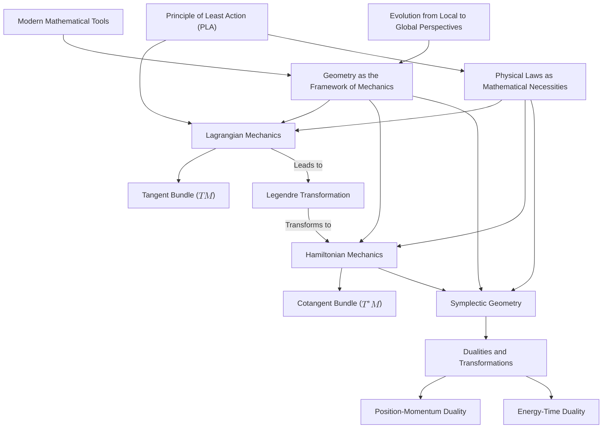

# Reconstructing Classical Mechanics: A Geometric Perspective Rooted in the Principle of Least Action
* * *

*"Geometry is the language of nature's book."*
— Galileo Galilei

# **1. Introduction: The Geometric Essence of Classical Mechanics**

*"In nature, nothing is isolated; everything is connected."*
— Johann Wolfgang von Goethe

Classical mechanics, the foundational pillar of physics, has long served as the primary framework for understanding the motion of objects under the influence of forces. From the planetary orbits described by Kepler's laws to the trajectory of a projectile launched from Earth, classical mechanics provides the tools to predict and analyze a vast array of physical phenomena. Yet, despite its success and extensive application, the traditional formulations of classical mechanics often present a fragmented picture, emphasizing specific forces or systems without revealing the deeper connections that unite them.

Historically, classical mechanics emerged from the monumental works of scientists like Isaac Newton, whose laws of motion and universal gravitation revolutionized our understanding of the physical world. Newtonian mechanics focuses on forces and accelerations, providing a vectorial description of motion that is intuitive yet sometimes limited in scope. As the field progressed, alternative formulations such as Lagrangian and Hamiltonian mechanics were developed, each offering new insights but still largely operating within the confines of traditional approaches.

However, as our mathematical understanding deepened, it became apparent that a more profound and unifying perspective was possible—a perspective rooted in geometry. Geometry, the study of space and the relationships between objects within it, offers a powerful language for describing physical systems. By interpreting classical mechanics through a geometric lens, we can uncover the intrinsic structures that govern motion, revealing a unity that transcends the limitations of conventional methods.

One of the most significant developments in this regard is the **Principle of Least Action** (PLA). The PLA posits that the path taken by a physical system between two states is the one for which the action integral is stationary (usually a minimum). This principle encapsulates the dynamics of a system in a single, variational statement, providing a unifying thread that weaves together different areas of physics. Unlike Newtonian mechanics, which focuses on instantaneous forces, the PLA considers the entire trajectory of a system, offering a global perspective that is inherently geometric.

Despite its elegance and unifying potential, the PLA is often introduced as a mathematical convenience rather than a fundamental principle reflecting the geometric nature of physical laws. Traditional formulations may obscure the deeper connections between different mechanical systems and fail to highlight the role of geometry in shaping the laws of motion.

**Why is a geometric reconstruction necessary?**

1. **Limitations of Traditional Formulations**: Conventional approaches can become cumbersome when dealing with complex systems, non-inertial reference frames, or generalized coordinates. They may require extensive calculations and do not readily expose the underlying simplicity and unity of the laws governing motion.

2. **Lack of Emphasis on Intrinsic Structures**: Traditional mechanics often relies on coordinate-dependent descriptions, which can obscure the intrinsic properties of physical systems. A geometric approach focuses on properties that are independent of the choice of coordinates, revealing fundamental invariants and symmetries.

3. **Connecting to Modern Theories**: Advances in physics, such as general relativity and quantum mechanics, are deeply rooted in geometric concepts. Reconstructing classical mechanics within a geometric framework provides a seamless transition to these modern theories and enhances our overall understanding.

4. **Natural Emergence of Physical Laws**: By deriving the laws of mechanics from geometric principles, we can view them as mathematical necessities rather than empirical observations. This perspective highlights the inherent harmony and consistency of the physical world.

**The necessity of a geometric framework lies in its ability to:**

- **Unify Different Formulations**: Geometry provides a common language that unites Newtonian, Lagrangian, and Hamiltonian mechanics, showing them to be different expressions of the same underlying principles.

- **Illuminate Fundamental Dualities**: Geometric structures naturally give rise to fundamental dualities in physics, such as position-momentum and energy-time. Understanding these dualities enhances our comprehension of physical phenomena.

- **Simplify Complex Systems**: Geometric methods can simplify the analysis of systems with constraints or symmetries, making it easier to find solutions and understand the behavior of physical systems.

- **Reveal Deeper Insights**: A geometric perspective can uncover hidden connections and principles, leading to new discoveries and advancements in physics.

In this document, we aim to **reconstruct classical mechanics** by establishing a modern geometric framework grounded in the **Principle of Least Action**. We will begin by exploring the fundamental concept of evolution and the necessity of geometry in describing change. From there, we will introduce the mathematical structures required for a geometric formulation of mechanics, such as manifolds, tangent and cotangent bundles, and symplectic manifolds.

By systematically developing these concepts, we will demonstrate how the laws of classical mechanics emerge naturally from geometric considerations. We will delve into Lagrangian and Hamiltonian mechanics, showing how they are connected through the Legendre Transformation and how they fit within the geometric framework. We will also explore fundamental dualities and symmetries, highlighting their origins and implications.

**Setting the Stage for Geometric Mechanics**

Our journey will be guided by the following objectives:

1. **Foundation Building**: Establish evolution as the fundamental concept in physics and show how geometric structures arise out of the necessity to describe change in a coherent and consistent manner.

2. **Geometric Development**: Introduce key geometric constructs step by step, ensuring that each concept is a natural progression from the previous one. This approach will make the complex mathematics more accessible and meaningful.

3. **Unified Perspective**: Emphasize the unity of physical laws by showing how different formulations of mechanics are interconnected within the geometric framework. This will highlight the elegance and simplicity underlying classical mechanics.

4. **Integration of Dualities**: Investigate the fundamental dualities and transformations that arise from the geometric structures, deepening our understanding of the relationships between different physical quantities.

5. **Applications and Implications**: Illustrate how this reconstructed framework provides deeper insights into classical mechanics and opens avenues for exploring advanced topics, such as chaos theory, quantum mechanics, and general relativity.

By embracing a geometric perspective, we not only refine our understanding of classical mechanics but also equip ourselves with powerful tools to tackle more complex and modern physical theories. Geometry becomes the bridge that connects different areas of physics, allowing for a more integrated and holistic approach to understanding the natural world.

**Conclusion of the Introduction**

In the chapters that follow, we will embark on a comprehensive exploration of classical mechanics through the lens of geometry. We will see how starting from the simple notion of evolution leads to the rich and intricate structures that underpin all of mechanics. This journey will not only deepen our appreciation for the beauty and coherence of physical laws but also inspire new ways of thinking about the universe.

As we delve into the geometric essence of classical mechanics, we invite you to consider the profound connections between mathematics and physics, and to recognize that geometry is not just a tool for describing space but is fundamental to the very fabric of reality. By reconstructing classical mechanics in this way, we hope to provide a fresh perspective that will enrich both teaching and research, fostering a deeper understanding of the physical world and inspiring future discoveries.

# **2. Evolution and the Necessity of Geometry**

*"Change is the only constant in life."*
— Heraclitus

At the heart of physics lies the concept of **evolution**—the continuous transformation of systems over time. This incessant change is not random but follows underlying principles that can be studied, understood, and predicted. Mechanics, as a branch of physics, seeks to describe and quantify this evolution. To achieve a meaningful and precise description, we must turn to geometry, which provides the essential framework for capturing the nuances of change.

## **2.1 Evolution as the Primitive Concept in Physics**

The universe is in perpetual motion. From the microscopic vibrations of atoms to the grand movements of galaxies, change defines the fabric of reality. In physics, evolution refers to the progression of a system's state over time. This progression is deterministic in classical mechanics, meaning that given the initial conditions and the governing laws, the future states of the system are fully determined.

By considering evolution as the primitive or fundamental concept, we prioritize the **process** of change rather than static entities. This dynamic viewpoint aligns with our observations of nature, where systems are continually interacting and transforming. Evolution encompasses:

- **Temporal Progression**: Time becomes a crucial parameter, marking the sequence of states.
- **State Transformation**: The system transitions from one state to another according to specific rules or laws.

Understanding evolution requires a language capable of expressing continuous and smooth transformations—a language provided by geometry.

## **2.2 Requirements for Meaningful Change and Conservation Principles**

Describing evolution meaningfully imposes several requirements on our theoretical framework:

### **2.2.1 Continuity and Smoothness**

Physical systems exhibit changes that are typically smooth and continuous. Abrupt or discontinuous changes are rare and usually indicative of phase transitions or critical phenomena, which themselves can be described within a continuous framework at a higher level.

- **Mathematical Necessity**: Continuity allows the use of calculus, enabling us to define derivatives (rates of change) and integrals (accumulated quantities).
- **Physical Realism**: Smooth evolution reflects the causality and locality observed in nature—small changes in initial conditions lead to small changes in outcomes.

### **2.2.2 Determinism and Predictability**

Classical mechanics is fundamentally deterministic. This determinism is rooted in:

- **Initial Conditions**: Complete knowledge of a system's state at a given time.
- **Laws of Motion**: Universal rules governing the evolution from one state to another.

Determinism ensures predictability, a cornerstone of scientific inquiry, allowing us to forecast future behavior and understand past dynamics.

### **2.2.3 Conservation Principles**

Conservation laws are central to mechanics, stemming from symmetries in physical laws:

- **Energy Conservation**: Energy remains constant in an isolated system.
- **Momentum Conservation**: The total momentum is conserved in the absence of external forces.
- **Angular Momentum Conservation**: Angular momentum remains constant when no external torque acts on the system.

These principles constrain the possible evolutions of a system, providing powerful tools for analysis and prediction.

## **2.3 The Necessity of Manifold Structures**

To accommodate the requirements of continuity, smoothness, and conservation, we introduce the concept of **manifolds**.

### **2.3.1 Manifolds as Generalized Spaces**

A **manifold** is a mathematical space that, locally, resembles Euclidean space but can have a more complex global structure. Manifolds provide a flexible and general framework for modeling physical systems:

- **Local Triviality**: Near any point, the manifold behaves like ordinary $\mathbb{R}^n$, allowing the use of calculus.
- **Global Complexity**: Manifolds can capture intricate structures, such as the curvature of space in general relativity or the topology of configuration spaces in mechanics.

### **2.3.2 Configuration Space Manifold**

For a mechanical system, the **configuration space** $M$ represents all possible positions or configurations the system can attain:

- **Dimensionality**: The number of degrees of freedom of the system.
- **Structure**: Encodes constraints and symmetries inherent in the system.

By modeling the configuration space as a manifold, we ensure that it has the mathematical properties needed to describe smooth evolution.

### **2.3.3 Necessity for Describing Evolution**

Manifolds are indispensable for:

- **Defining Smooth Paths**: Trajectories of systems are smooth curves within the manifold $M$.
- **Applying Calculus**: Differentiation and integration on manifolds allow us to formulate and solve the equations of motion.
- **Handling Complexity**: Manifolds enable the modeling of systems with complex constraints and interactions.

## **2.4 Tangent Spaces and the Emergence of Velocities**

To describe how a system evolves within the configuration space manifold, we need to consider not just positions but also **velocities**.

### **2.4.1 Tangent Spaces $T_qM$**

At every point $q$ on the manifold $M$, there exists a **tangent space** $T_qM$:

- **Definition**: The set of all possible directions in which the system can tangentially pass through $q$.
- **Interpretation**: Tangent vectors represent the instantaneous velocities of the system at position $q$.

These tangent spaces capture the notion of motion at a specific point, encapsulating all possible immediate changes.

### **2.4.2 Tangent Bundle $TM$**

Collecting all tangent spaces together forms the **tangent bundle** $TM$:

- **Construction**: $TM = \bigcup_{q \in M} T_qM$.
- **Dimensionality**: If $M$ is $n$-dimensional, then $TM$ is $2n$-dimensional.
- **State Representation**: Points in $TM$ are pairs $(q, v)$, where $q \in M$ and $v \in T_qM$.

The tangent bundle provides a comprehensive space in which both positions and velocities are unified, forming the stage upon which dynamics unfold.

### **2.4.3 Velocities as Vectors in Tangent Spaces**

- **Instantaneous Rates of Change**: Velocities are the derivatives of positions with respect to time, $v = \dot{q}$.
- **Vector Fields**: Assigning a velocity vector to every point in $M$ defines a vector field, representing a flow or evolution of the system.

By utilizing tangent spaces and the tangent bundle, we embed the concept of motion directly into the geometric structure of the configuration space.

## **2.5 Geometry as the Framework for Mechanics**

The necessity of geometry arises naturally from the demands of describing evolution:

- **Mathematical Rigor**: Geometry provides the precise language needed to formulate physical laws accurately.
- **Unified Representation**: Geometric structures unify various aspects of mechanics (positions, velocities, accelerations) within a coherent framework.
- **Facilitating Calculus on Manifolds**: Differential geometry extends calculus to manifolds, allowing us to handle curves, surfaces, and higher-dimensional analogs.

### **2.5.1 Implications for Mechanics**

- **Equations of Motion**: Can be formulated geometrically as differential equations on manifolds.
- **Conservation Laws**: Arise from symmetries of the manifold or the geometric structures defined on it (e.g., symplectic forms).
- **Generalization**: The geometric framework accommodates classical systems and extends seamlessly to relativistic and quantum mechanics.

## **2.6 Conclusion**

By recognizing evolution as the foundational concept in physics, we see that geometry is not merely a tool but a necessity. The geometric structures of manifolds, tangent spaces, and the tangent bundle emerge naturally from the need to describe continuous, deterministic, and conserved evolution.

This geometric foundation sets the stage for the development of mechanics:

- **Lagrangian Mechanics**: Utilizes the tangent bundle $TM$ to formulate dynamics in terms of positions and velocities.
- **Hamiltonian Mechanics**: Further builds upon this structure, introducing the cotangent bundle and symplectic geometry.

Understanding that the laws of mechanics are deeply rooted in geometry allows us to appreciate the unity and coherence of physical laws. It provides a robust framework for exploring more complex systems and paves the way for advancements in modern physics.

*By delving deeper into the intrinsic nature of evolution and geometry, we lay a solid foundation upon which the edifice of classical mechanics is built. Geometry becomes the language through which the universe communicates its fundamental principles, revealing that the paths of particles and the curvature of space are expressions of the same underlying reality.*

# **3. The Principle of Least Action: Foundations of Variational Mechanics**

*"Action expresses priorities."*
— Mahatma Gandhi

The **Principle of Least Action (PLA)** stands as one of the most profound and unifying principles in physics. Serving as the cornerstone of classical mechanics, it provides a powerful and elegant framework from which the laws of motion naturally emerge. Unlike formulations focusing on instantaneous forces and accelerations, the PLA considers the entire path a system takes, offering a holistic view of motion rooted in the language of geometry and variational calculus.

## **3.1 Introduction to the Action Functional**

At the heart of the PLA lies the concept of the **action functional**. For a mechanical system transitioning from an initial configuration at time $t_1$ to a final configuration at time $t_2$, the action $S$ is defined as:
$$
S[q] = \int_{t_1}^{t_2} L(q(t), \dot{q}(t), t) \, dt
$$
Here:

- $q(t)$ represents the **generalized coordinates** of the system, encapsulating its configuration at time $t$.
- $\dot{q}(t)$ denotes the **generalized velocities**, the time derivatives of the generalized coordinates.
- $L(q, \dot{q}, t)$ is the **Lagrangian**, a function characterizing the dynamics of the system, typically defined as:
  $$
  L = T - V
  $$
  where $T$ is the kinetic energy and $V$ is the potential energy.

The action $S[q]$ is a **functional**—it assigns a real number to each possible path $q(t)$ the system may follow between $t_1$ and $t_2$. It encapsulates the accumulated dynamics along a trajectory, integrating the Lagrangian over time.

### **3.1.1 Significance of the Action Functional**

The action functional is significant for several reasons:

- **Global Perspective**: It considers the entire path of the system rather than just local properties at each instant.
- **Variational Framework**: Enables the application of variational calculus to derive equations of motion.
- **Connection to Symmetries**: Through Noether's theorem, symmetries of the action correspond to conservation laws.

The action serves as a bridge between the physical trajectory of a system and the underlying geometric and variational principles governing its motion.

## **3.2 Derivation of the Euler-Lagrange Equations**

The Principle of Least Action asserts that the actual path taken by a system is one for which the action functional $S[q]$ is **stationary** under infinitesimal variations of the path, with fixed endpoints. Mathematically, this is expressed as:
$$
\delta S = 0
$$

### **3.2.1 Computing the Variation of the Action**

Consider a small variation $\delta q(t)$ of the path $q(t)$, such that:
$$
q(t) \rightarrow q(t) + \delta q(t), \quad \delta q(t_1) = \delta q(t_2) = 0
$$
The variation of the action is:
$$
\delta S = \int_{t_1}^{t_2} \left( \frac{\partial L}{\partial q} \delta q + \frac{\partial L}{\partial \dot{q}} \delta \dot{q} \right) dt
$$
Using integration by parts on the term involving $\delta \dot{q}$:
$$
\int_{t_1}^{t_2} \frac{\partial L}{\partial \dot{q}} \delta \dot{q} \, dt = \left[ \frac{\partial L}{\partial \dot{q}} \delta q \right]_{t_1}^{t_2} - \int_{t_1}^{t_2} \frac{d}{dt} \left( \frac{\partial L}{\partial \dot{q}} \right) \delta q \, dt
$$
Since $\delta q(t_1) = \delta q(t_2) = 0$, the boundary term vanishes, leaving:
$$
\delta S = \int_{t_1}^{t_2} \left( \frac{\partial L}{\partial q} - \frac{d}{dt} \frac{\partial L}{\partial \dot{q}} \right) \delta q \, dt
$$
For $\delta S$ to be zero for arbitrary $\delta q(t)$, the integrand must vanish:
$$
\frac{d}{dt} \left( \frac{\partial L}{\partial \dot{q}} \right) - \frac{\partial L}{\partial q} = 0
$$
These are the **Euler-Lagrange equations**, fundamental differential equations describing the system's dynamics.

### **3.2.2 Physical Interpretation**

The Euler-Lagrange equations generalize Newton's second law to systems described by generalized coordinates and velocities, accommodating constraints and non-Cartesian coordinate systems naturally. They encapsulate the essence of the system's behavior derived from a variational principle rather than direct force analysis.

## **3.3 Philosophical and Physical Implications of the Principle of Least Action**

The PLA is more than a mathematical formalism; it embodies deep philosophical insights about nature.

### **3.3.1 Natural Efficiency and Economy**

The principle suggests that nature operates optimally:

- **Efficiency**: Systems evolve along paths that optimize (make stationary) the action.
- **Economy of Nature**: Aligns with the idea that natural processes favor minimal expenditure of "effort" or resources.

This concept resonates with other principles in physics, such as Fermat's principle of least time in optics.

### **3.3.2 Underlying Symmetries and Conservation Laws**

Through **Noether's Theorem**, the PLA reveals that symmetries in the action correspond to conservation laws:

- **Time Invariance**: If $L$ does not explicitly depend on time, energy is conserved.
- **Spatial Invariance**: If $L$ is invariant under spatial translations, linear momentum is conserved.
- **Rotational Invariance**: If $L$ is invariant under rotations, angular momentum is conserved.

These connections between symmetries and conservation laws underscore the fundamental role of the PLA in unifying different aspects of physics.

### **3.3.3 Global vs. Local Descriptions**

The PLA provides a **global** description of motion:

- **Holistic Approach**: Considers entire trajectories rather than instantaneous states.
- **Path Dependency**: Emphasizes that the history of the system influences its evolution.

This contrasts with local formulations (like Newton's laws) and aligns more closely with modern physical theories, such as quantum mechanics and general relativity.

## **3.4 The Principle of Least Action as a Manifestation of Motion**

The action functional measures the "aggregate effect" of a system's motion over time. It integrates the interplay between kinetic and potential energies, encapsulating the dynamics into a single scalar quantity.

### **3.4.1 Action as a Measure of Motion**

- **Scalar Quantity**: Provides a single number characterizing the path.
- **Integrative Nature**: Accounts for all contributions along the trajectory.
- **Comparison of Paths**: Allows determination of the "preferred" path by comparing action values.

### **3.4.2 Transition from Evolution to Action**

Building on the concept of evolution:

- **From States to Paths**: Shifts focus from discrete states to continuous paths.
- **Variational Perspective**: Introduces the idea of selecting paths based on extremal principles.

By considering action as central to motion, we deepen our understanding of how systems evolve according to principles of efficiency and natural law.

## **3.5 Examples Illustrating the Principle**

### **3.5.1 Example 1: The Free Particle**

For a particle of mass $m$ moving in free space:

- **Lagrangian**:
  $$
  L = \frac{1}{2} m \dot{q}^2
  $$

- **Action**:
  $$
  S[q] = \int_{t_1}^{t_2} \frac{1}{2} m \dot{q}^2 dt
  $$

- **Euler-Lagrange Equation**:
  $$
  \frac{d}{dt}(m \dot{q}) = 0 \implies m \ddot{q} = 0
  $$

- **Interpretation**: The particle moves at constant velocity, following a straight-line path—the path of least action.

### **3.5.2 Example 2: The Simple Harmonic Oscillator**

For a mass $m$ attached to a spring with stiffness $k$:

- **Lagrangian**:
  $$
  L = \frac{1}{2} m \dot{q}^2 - \frac{1}{2} k q^2
  $$

- **Euler-Lagrange Equation**:
  $$
  m \ddot{q} + k q = 0
  $$

- **Interpretation**: The oscillator follows a sinusoidal motion, minimizing the action over the oscillatory path.

These examples demonstrate how the PLA leads directly to the equations governing familiar physical systems, emphasizing its foundational role.

## **3.6 Variational Principles and the Foundations of Mechanics**

### **3.6.1 Hamilton's Principle**

The PLA is often referred to as **Hamilton's Principle**, which formalizes the idea that the evolution of a system between two times is such that the action integral is stationary.

- **Generalization**: Applies to a wide range of systems, including those with constraints or in fields beyond mechanics.
- **Mathematical Foundation**: Establishes variational calculus as a core mathematical tool in physics.

### **3.6.2 Extension to Field Theories**

The variational approach extends naturally to classical field theories:

- **Fields as Infinite-Dimensional Systems**: The action principle applies to fields by integrating over spacetime.
- **Euler-Lagrange Equations for Fields**: Lead to fundamental equations like Maxwell's equations in electromagnetism.

### **3.6.3 Connection to Quantum Mechanics**

The PLA lays the groundwork for quantum mechanics:

- **Path Integral Formulation**: Feynman's approach sums over all possible paths, weighting each by $e^{i S/\hbar}$, where $\hbar$ is the reduced Planck constant.
- **Quantum-Classical Correspondence**: In the classical limit ($\hbar \rightarrow 0$), the path of stationary action dominates.

This highlights the PLA's pivotal role in bridging classical and quantum physics.

## **3.7 Emphasizing Natural Efficiency and Symmetry**

### **3.7.1 Action and Optimality**

The PLA embodies the idea that physical processes occur in the most "economical" manner:

- **Optimal Paths**: Systems select trajectories that optimize the action.
- **Minimal Principles**: Although called "least action," the principle actually requires the action to be stationary, which can correspond to minima, maxima, or saddle points.

### **3.7.2 Symmetries as Fundamental Features**

Symmetry considerations become central:

- **Invariant Actions**: An action invariant under certain transformations leads to conserved quantities.
- **Noether's Theorem**: Formalizes the intimate link between symmetries and conservation laws.

Understanding these symmetries enriches our comprehension of the physical laws governing motion.

## **3.8 Preparing for Lagrangian Mechanics**

The exploration of the PLA sets the stage for the development of **Lagrangian mechanics**:

- **Geometric Structures**: Introduces the need for geometric constructs like the tangent bundle $TM$.
- **Generalized Coordinates**: Encourages working in arbitrary coordinates suited to the problem at hand.
- **Unified Framework**: Provides a consistent methodology for deriving equations of motion for diverse systems.

By grounding mechanics in the PLA, we adopt a foundational approach that is both flexible and deeply connected to the geometry of the system's configuration space.

## **3.9 Conclusion**

Building upon the concept of evolution and the necessity of geometry discussed in the previous chapter, the Principle of Least Action introduces the idea of action as a scalar measure of motion. It provides a variational foundation from which the equations of motion naturally emerge. This approach not only offers deeper insights into the dynamics of systems but also prepares us for the geometric formulation of mechanics in terms of the **tangent bundle** and **Lagrangian mechanics**.

The PLA serves as a bridge between abstract geometric concepts and tangible physical laws, highlighting the inherent efficiency and symmetry in nature’s design. It elevates the study of mechanics from examining isolated forces to understanding the fundamental principles that dictate motion.

*In embracing the Principle of Least Action, we uncover a guiding thread woven into the fabric of the universe—one that speaks to the intrinsic optimization and harmony present in natural processes. This principle not only unifies various formulations of mechanics but also illuminates the path toward a deeper, more cohesive understanding of the physical world.*

# **4. Lagrangian Mechanics and the Tangent Bundle**

*"The journey of a thousand miles begins with a single step."*
— Lao Tzu

Building upon the Principle of Least Action, we embark on a deeper exploration of classical mechanics through the lens of geometry. **Lagrangian mechanics** provides a powerful and elegant framework for analyzing the dynamics of mechanical systems. By formulating mechanics within the geometric context of the **tangent bundle** $TM$, we reveal the natural interplay between positions and velocities and uncover the intrinsic structures that govern motion. This approach not only enriches our understanding of mechanics but also sets the stage for uncovering fundamental dualities and transitioning to Hamiltonian mechanics.

## **4.1 Configuration Space and the Tangent Bundle $TM$**

### **4.1.1 Configuration Space $M$**

The **configuration space** $M$ of a mechanical system is a manifold representing all possible positions or configurations the system can attain. Each point $q \in M$ corresponds to a unique set of generalized coordinates $(q^1, q^2, \dots, q^n)$ that fully describe the system's spatial state.

- **Degrees of Freedom**: The dimensionality of $M$ is determined by the number of degrees of freedom $n$ of the system.
- **Generalized Coordinates**: These coordinates are not restricted to Cartesian coordinates; they can be any parameters that uniquely specify the system's configuration, accommodating constraints and complex geometries.

By considering $M$ as a smooth manifold, we ensure that calculus and differential geometry can be applied, facilitating precise mathematical descriptions of motion.

### **4.1.2 Tangent Spaces $T_qM$**

At each point $q \in M$, the **tangent space** $T_qM$ is a vector space consisting of all possible velocity vectors that the system can have at that configuration.

- **Definition**: $T_qM$ is the collection of tangent vectors to all possible curves passing through $q$ at time $t$.
- **Velocities as Tangent Vectors**: The velocities $\dot{q}$ are elements of $T_qM$, representing the instantaneous rate of change of the system's configuration.

The tangent space captures the concept of motion in a linear approximation, providing a local linear structure at each point of the manifold.

### **4.1.3 The Tangent Bundle $TM$**

The **tangent bundle** $TM$ is the union of all tangent spaces of $M$, forming a new manifold of twice the dimensionality.
$$
TM = \bigcup_{q \in M} T_qM
$$

- **Structure of $TM$**: Each point in $TM$ is a pair $(q, \dot{q})$, where $q \in M$ and $\dot{q} \in T_qM$.
- **Fiber Bundle Nature**: $TM$ is a vector bundle over $M$, with each fiber $T_qM$ attached to its base point $q$.

The tangent bundle elegantly encapsulates both the positions and velocities of the system, providing the natural setting for analyzing dynamics within the Lagrangian framework.

## **4.2 The Lagrangian Function $L(q, \dot{q}, t)$ on $TM$**

### **4.2.1 Definition and Role of the Lagrangian**

The **Lagrangian** $L$ is a function that maps each state $(q, \dot{q}, t)$ in $TM \times \mathbb{R}$ to a real number, reflecting the system's dynamics.
$$
L: TM \times \mathbb{R} \rightarrow \mathbb{R}
$$
For most mechanical systems, the Lagrangian is defined as:
$$
L(q, \dot{q}, t) = T(q, \dot{q}, t) - V(q, t)
$$

- **Kinetic Energy $T$**: Dependent on $\dot{q}$ and possibly $q$ and $t$, representing the energy due to motion.
- **Potential Energy $V$**: A function of $q$ and possibly $t$, representing the stored energy due to position in a force field.

The Lagrangian encapsulates the essential information about the system's dynamics, serving as the foundational building block in the formulation of the equations of motion.

### **4.2.2 Lagrangian as a Function on the Tangent Bundle**

By defining $L$ on $TM$, we leverage the geometric structure of the tangent bundle:

- **Dependence on $(q, \dot{q})$**: Reflects the system's reliance on both position and velocity.
- **Geometric Interpretation**: Positions $q$ are points on $M$, while velocities $\dot{q}$ are vectors in $T_qM$, making $L$ a function on $TM$.

This geometric viewpoint provides deeper insight into how the physical properties of the system are intrinsically linked to the manifold's structure.

## **4.3 Deriving Equations of Motion Using Geometric Structures**

### **4.3.1 The Action Functional Revisited**

The action functional $S$ is defined as the integral of the Lagrangian along a path $q(t)$ in $M$:
$$
S[q] = \int_{t_1}^{t_2} L(q(t), \dot{q}(t), t) \, dt
$$

- **Path Dependence**: The action depends on the entire trajectory between $t_1$ and $t_2$.
- **Variational Principle**: The physical trajectory minimizes (or makes stationary) the action.

### **4.3.2 Applying the Variational Principle**

To derive the equations of motion, we consider infinitesimal variations $\delta q(t)$ of the path, subject to the conditions $\delta q(t_1) = \delta q(t_2) = 0$.

Calculating the variation of the action:
$$
\delta S = \int_{t_1}^{t_2} \left( \frac{\partial L}{\partial q^i} \delta q^i + \frac{\partial L}{\partial \dot{q}^i} \delta \dot{q}^i \right) dt .
$$
Integrating by parts and applying the boundary conditions, we obtain:
$$
\delta S = \int_{t_1}^{t_2} \left( \frac{\partial L}{\partial q^i} - \frac{d}{dt} \frac{\partial L}{\partial \dot{q}^i} \right) \delta q^i dt .
$$
For $\delta S = 0$ to hold for arbitrary $\delta q^i(t)$, the integrand must vanish:
$$
\frac{d}{dt} \left( \frac{\partial L}{\partial \dot{q}^i} \right) - \frac{\partial L}{\partial q^i} = 0.
$$
These are the **Euler-Lagrange equations**, which are the fundamental equations of motion in Lagrangian mechanics.

### **4.3.3 Geometric Interpretation of the Euler-Lagrange Equations**

The Euler-Lagrange equations describe curves on $TM$:

- **Phase Space Trajectories**: The solutions $(q(t), \dot{q}(t))$ trace out paths in the tangent bundle.
- **Flows on $TM$**: The equations define a vector field on $TM$, representing the system's dynamics.

This interpretation highlights how the evolution of a mechanical system is governed by the geometry of the tangent bundle.

## **4.4 Symmetries, Constraints, and Conservation Laws**

### **4.4.1 Symmetries in the Lagrangian Framework**

Symmetries play a crucial role in mechanics, often leading to conservation laws.

- **Definition of Symmetry**: A transformation $q^i \rightarrow Q^i(q^j, t)$ under which the Lagrangian remains invariant (up to a total derivative).
- **Types of Symmetries**:
  - **Continuous Symmetries**: Infinitesimal transformations parameterized by a continuous parameter.
  - **Discrete Symmetries**: Transformations like reflections or permutations.

### **4.4.2 Noether's Theorem**

**Noether's Theorem** establishes a profound connection between symmetries and conservation laws:

- **Statement**: For every continuous symmetry of the action, there exists a corresponding conserved quantity.
- **Conserved Quantities**:
  - **Energy**: Conserved if $L$ is time-invariant.
  - **Linear Momentum**: Conserved if $L$ is invariant under spatial translations.
  - **Angular Momentum**: Conserved if $L$ is invariant under rotations.

Noether's Theorem is a cornerstone of theoretical physics, revealing the deep link between geometry and physical laws.

### **4.4.3 Constraints and Generalized Coordinates**

Mechanical systems often have constraints that limit their motion:

- **Holonomic Constraints**: Constraints that depend only on coordinates and time, expressible as $f(q^i, t) = 0$.
- **Non-Holonomic Constraints**: Depend on coordinates, velocities, or higher derivatives, and cannot be integrated into a constraint on coordinates alone.

**Incorporating Constraints**:

- **Reduction of Degrees of Freedom**: Use constraints to eliminate variables, reducing $n$ to $m < n$.
- **Lagrange Multipliers**: Introduce additional terms in the Lagrangian to enforce constraints.

### **4.4.4 Conservation Laws in Constrained Systems**

Constraints can affect the conservation laws:

- **Modified Symmetries**: Constraints may break certain symmetries, altering conservation laws.
- **Constraint Forces**: Forces that enforce constraints do no work (in ideal cases), allowing energy conservation to persist.

Understanding how constraints interplay with symmetries is essential for accurately describing the system's dynamics.

## **4.5 Deepening the Understanding of Lagrangian Mechanics**

### **4.5.1 Geometric Nature of the Lagrangian Formalism**

The Lagrangian formulation is inherently geometric:

- **Coordinate-Free Description**: The equations of motion can be expressed independently of coordinate choices, emphasizing intrinsic properties.
- **Fiber Bundle Perspective**: The tangent bundle $TM$ provides a natural setting for dynamics, with the base manifold $M$ and fibers $T_qM$ reflecting positions and velocities.

### **4.5.2 The Role of the Legendre Transformation**

The **Legendre Transformation** bridges the Lagrangian and Hamiltonian formulations:

- **Transition to Cotangent Bundle $T^*M$**: Introduces conjugate momenta $p_i = \partial L / \partial \dot{q}^i$, shifting focus from velocities in $T_qM$ to momenta in $T_q^*M$.
- **Preparation for Hamiltonian Mechanics**: Sets the stage for exploring symplectic geometry and dualities between positions and momenta.

This transformation underscores the deep connections between different formulations of mechanics within the geometric framework.

## **4.6 Examples Highlighting Geometric Insights**

### **4.6.1 Double Pendulum**

A system consisting of two pendulums attached end to end:

- **Configuration Space $M$**: Described by angles $(\theta_1, \theta_2)$.
- **Tangent Bundle $TM$**: Includes angular velocities $(\dot{\theta}_1, \dot{\theta}_2)$.
- **Lagrangian**:
  $$
  L = \frac{1}{2} m_1 l_1^2 \dot{\theta}_1^2 + \frac{1}{2} m_2 \left[ l_1^2 \dot{\theta}_1^2 + l_2^2 \dot{\theta}_2^2 + 2 l_1 l_2 \dot{\theta}_1 \dot{\theta}_2 \cos(\theta_1 - \theta_2) \right] - V
  $$
  Where $V$ is the potential energy due to gravity.

- **Equations of Motion**: Derived using the Euler-Lagrange equations, reflecting the complex interplay between the components.

### **4.6.2 Charged Particle in Electromagnetic Field**

A particle with charge $q$ moving in electromagnetic potentials $(\phi, \mathbf{A})$:

- **Configuration Space $M$**: Positions $\mathbf{r}$.
- **Tangent Bundle $TM$**: Includes velocities $\dot{\mathbf{r}}$.
- **Lagrangian**:
  $$
  L = \frac{1}{2} m \dot{\mathbf{r}}^2 + q \dot{\mathbf{r}} \cdot \mathbf{A}(\mathbf{r}, t) - q \phi(\mathbf{r}, t)
  $$

- **Geometric Insight**: The interaction with the electromagnetic field is incorporated geometrically via the potentials, affecting the dynamics through the Lagrangian.

## **4.7 Advantages of the Geometric Lagrangian Approach**

### **4.7.1 Unified Treatment of Mechanics**

By utilizing the tangent bundle, we achieve a unification:

- **Applicability**: The formalism applies to particles, rigid bodies, continua, and fields.
- **Flexibility**: Handles a wide variety of coordinate systems and constraints naturally.

### **4.7.2 Revealing Intrinsic Structures**

The geometric approach exposes the underlying structures:

- **Intrinsic Properties**: Focuses on properties independent of coordinate choices.
- **Natural Framework**: The manifold and bundle structures align with the physical reality of the systems.

### **4.7.3 Foundation for Advanced Theories**

Establishing mechanics on geometric grounds prepares us for:

- **Hamiltonian Mechanics**: Transitioning to the cotangent bundle and symplectic geometry.
- **Quantum Mechanics**: Geometric quantization relies on the structures developed here.
- **General Relativity**: The language of manifolds and tensors is essential.

## **4.8 Preparing for Dualities and Hamiltonian Mechanics**

This exploration of Lagrangian mechanics within the tangent bundle sets the stage for deeper investigations:

- **Position-Momentum Duality**: The forthcoming Legendre Transformation will unveil the dual nature of positions and momenta.
- **Symplectic Structures**: The cotangent bundle $T^*M$ introduces symplectic geometry, crucial for Hamiltonian mechanics.
- **Canonical Transformations**: Understanding the geometric basis of transformations enhances our ability to analyze and simplify complex systems.

## **4.9 Conclusion**

By developing Lagrangian mechanics within the geometric framework of the tangent bundle, we bridge the Principle of Least Action to a concrete formulation of mechanics grounded in geometry. This approach not only provides profound insights into the nature of motion but also prepares us for the exploration of dualities and the transition to Hamiltonian mechanics. The intrinsic structures revealed here are fundamental to understanding the deeper connections and symmetries that govern the physical world.

*The journey into the geometric realm of Lagrangian mechanics is a crucial step toward unveiling the profound harmony between mathematics and physics. As we progress, each concept unfolds like a stepping stone, guiding us toward a more unified and intrinsic understanding of the mechanics that orchestrate the universe.*

# **5. Legendre Transformation and the Emergence of the Cotangent Bundle**

*"Every exit is an entry somewhere else."*
— Tom Stoppard

In our journey through the geometric formulation of classical mechanics, we have developed a profound understanding of Lagrangian mechanics within the framework of the tangent bundle $TM$. We have seen how the positions and velocities of a system are naturally unified in this setting. However, to delve deeper into the symmetries and fundamental dualities inherent in mechanics, we need to transition to a new geometric structure—the **cotangent bundle** $T^*M$. The **Legendre Transformation** serves as the bridge between these two realms, allowing us to reformulate mechanics in terms of positions and momenta, and paving the way for Hamiltonian mechanics.

## **5.1 Introduction to the Legendre Transformation**

### **5.1.1 Definition and Mathematical Formulation**

The **Legendre Transformation** is a mathematical operation that transforms a function of one set of variables into a function of another set, typically converting between variables that are related via a differential relationship. In the context of mechanics, it allows us to switch from a description in terms of generalized velocities $\dot{q}^i$ to one in terms of generalized momenta $p_i$.

Given a function $f(y)$, its Legendre Transform $g(z)$ is defined by:
$$
g(z) = \sup_{y} \left( y z - f(y) \right)
$$
In mechanics, the Lagrangian $L(q, \dot{q}, t)$ depends on positions $q$, velocities $\dot{q}$, and possibly time $t$. The Legendre Transformation of $L$ yields the **Hamiltonian** $H(q, p, t)$, which depends on positions $q$, generalized momenta $p$, and time $t$.

### **5.1.2 Generalized Momenta**

The **generalized momenta** $p_i$ are defined as the partial derivatives of the Lagrangian with respect to the generalized velocities:
$$
p_i = \frac{\partial L}{\partial \dot{q}^i}
$$
This definition establishes a relationship between the tangent bundle $TM$ variables $(q^i, \dot{q}^i)$ and the cotangent bundle $T^*M$ variables $(q^i, p_i)$.

## **5.2 Emergence of the Cotangent Bundle $T^*M$**

### **5.2.1 Cotangent Spaces $T_q^*M$**

At each point $q \in M$, the **cotangent space** $T_q^*M$ is the dual space to the tangent space $T_qM$. It consists of all linear functionals (covectors) that map tangent vectors to real numbers.

- **Definition**: For each $q \in M$, $T_q^*M$ is the set of all linear maps $\omega: T_qM \rightarrow \mathbb{R}$.
- **Generalized Momenta as Covectors**: The generalized momenta $p_i$ are components of covectors in $T_q^*M$.

### **5.2.2 The Cotangent Bundle $T^*M$**

The **cotangent bundle** $T^*M$ is the union of all cotangent spaces over $M$:
$$
T^*M = \bigcup_{q \in M} T_q^*M
$$

- **Points in $T^*M$**: Each point is a pair $(q, p)$, where $q \in M$ and $p \in T_q^*M$.
- **Phase Space Interpretation**: The cotangent bundle serves as the natural phase space for Hamiltonian mechanics, encoding both positions and momenta.

## **5.3 From Lagrangian to Hamiltonian Mechanics via Legendre Transformation**

### **5.3.1 Constructing the Hamiltonian**

The **Hamiltonian** $H(q, p, t)$ is obtained through the Legendre Transformation of the Lagrangian $L(q, \dot{q}, t)$:
$$
H(q, p, t) = p_i \dot{q}^i - L(q, \dot{q}, t)
$$
where the velocities $\dot{q}^i$ are expressed in terms of positions $q^i$ and momenta $p_i$ by inverting the relation $p_i = \partial L / \partial \dot{q}^i$, assuming the transformation is non-degenerate (the Hessian matrix $\partial^2 L / \partial \dot{q}^i \partial \dot{q}^j$ is invertible).

### **5.3.2 Equivalence of the Equations of Motion**

The Legendre Transformation ensures that the equations of motion derived from the Hamiltonian formalism are equivalent to those from the Lagrangian formalism.

- **Hamilton's Equations**:
  $$
  \dot{q}^i = \frac{\partial H}{\partial p_i}, \quad \dot{p}_i = -\frac{\partial H}{\partial q^i}
  $$

- **Consistency**: These equations can be shown to be equivalent to the Euler-Lagrange equations obtained from the Lagrangian.

## **5.4 Relationship Between Positions and Velocities, Positions and Momenta**

### **5.4.1 Duality Between $TM$ and $T^*M$**

The transition from $TM$ to $T^*M$ highlights a duality:

- **Tangent Vectors and Covectors**: Velocities $\dot{q}^i$ are components of tangent vectors in $T_qM$, while momenta $p_i$ are components of covectors in $T_q^*M$.
- **Pairing**: The pairing between tangent vectors and covectors is given by $p_i \dot{q}^i$, an expression that appears in the Legendre Transformation.

### **5.4.2 Inverse Transformations**

Under appropriate conditions, the Legendre Transformation is invertible:

- **From Velocities to Momenta**: $p_i = \frac{\partial L}{\partial \dot{q}^i}$
- **From Momenta to Velocities**: $\dot{q}^i = \frac{\partial H}{\partial p_i}$

This invertibility allows us to move seamlessly between Lagrangian and Hamiltonian descriptions, depending on which variables are more convenient for a given problem.

## **5.5 Implications for Energy Functions and the Hamiltonian**

### **5.5.1 Total Energy Expression**

In many cases, the Hamiltonian corresponds to the total energy $E$ of the system:
$$
H(q, p, t) = E = T + V
$$

- **Conservative Systems**: For time-independent Lagrangians where kinetic energy $T$ is quadratic in velocities and potential energy $V$ is independent of velocities, $H = E$.
- **Non-Conservative Systems**: For systems with explicit time dependence or velocity-dependent potentials (e.g., electromagnetic potentials), $H$ may not equal the total energy.

### **5.5.2 Role of the Hamiltonian in Dynamics**

The Hamiltonian serves multiple roles:

- **Generator of Evolution**: In Hamilton's equations, $H$ governs the time evolution of the system.
- **Conservation Laws**: If $H$ does not depend explicitly on time, it is conserved along trajectories, reflecting energy conservation.
- **Symplectic Structure**: $H$ defines the flow in phase space that preserves the symplectic structure, a key property in Hamiltonian mechanics.

## **5.6 Geometric Interpretation of the Legendre Transformation**

### **5.6.1 Contact Structures and Symplectic Forms**

The Legendre Transformation can be understood geometrically in terms of contact and symplectic geometry:

- **Contact Manifolds**: The space $TM \times \mathbb{R}$ with coordinates $(q^i, \dot{q}^i, t)$ can be equipped with a contact structure.
- **Symplectic Manifolds**: The cotangent bundle $T^*M$ naturally carries a symplectic structure, defined by the canonical symplectic form $\omega$:
  $$
  \omega = dq^i \wedge dp_i
  $$

- **Transformation**: The Legendre Transformation maps the contact structure on $TM$ to the symplectic structure on $T^*M$.

### **5.6.2 Fiber Bundles and Duality**

- **Fiber Bundles**: Both $TM$ and $T^*M$ are fiber bundles over $M$, with fibers $T_qM$ and $T_q^*M$ respectively.
- **Duality of Fibers**: The fibers are dual vector spaces, reflecting the duality between velocities and momenta.

## **5.7 Examples Illustrating the Legendre Transformation**

### **5.7.1 Simple Harmonic Oscillator**

Consider a one-dimensional harmonic oscillator with Lagrangian:
$$
L = \frac{1}{2} m \dot{q}^2 - \frac{1}{2} k q^2
$$

- **Compute Generalized Momentum**:
  $$
  p = \frac{\partial L}{\partial \dot{q}} = m \dot{q}
  $$

- **Formulate Hamiltonian**:
  $$
  H = p \dot{q} - L = \frac{p^2}{2m} + \frac{1}{2} k q^2
  $$

- **Hamilton's Equations**:
  $$
  \dot{q} = \frac{\partial H}{\partial p} = \frac{p}{m}, \quad \dot{p} = -\frac{\partial H}{\partial q} = -k q
  $$

These equations are equivalent to the second-order differential equation obtained from the Lagrangian formalism.

### **5.7.2 Charged Particle in an Electromagnetic Field**

For a particle with charge $e$ in electromagnetic potentials $\phi(q, t)$ and $\mathbf{A}(q, t)$:

- **Lagrangian**:
  $$
  L = \frac{1}{2} m \dot{q}^2 + e \dot{q} \cdot \mathbf{A}(q, t) - e \phi(q, t)
  $$

- **Generalized Momentum**:
  $$
  p = \frac{\partial L}{\partial \dot{q}} = m \dot{q} + e \mathbf{A}(q, t)
  $$

- **Hamiltonian**:
  $$
  H = p \dot{q} - L = \frac{1}{2m} \left( p - e \mathbf{A} \right)^2 + e \phi(q, t)
  $$

This illustrates how the Legendre Transformation accommodates systems with velocity-dependent potentials, leading to a Hamiltonian that correctly accounts for electromagnetic interactions.

## **5.8 Significance of the Legendre Transformation in Mechanics**

### **5.8.1 Unification of Formulations**

The Legendre Transformation provides a systematic method for transitioning between Lagrangian and Hamiltonian mechanics:

- **Flexibility**: Allows us to choose the most convenient formulation for a given problem.
- **Completeness**: Ensures that no information is lost in the transformation, maintaining the equivalence of the two formulations.

### **5.8.2 Highlighting Fundamental Dualities**

The transformation emphasizes the dual nature of mechanics:

- **Positions and Momenta**: The variables $q^i$ and $p_i$ are treated on equal footing in the Hamiltonian formalism.
- **Symplectic Structure**: The symplectic form $\omega = dq^i \wedge dp_i$ encapsulates the inherent duality and is preserved under Hamiltonian evolution.

### **5.8.3 Foundations for Advanced Theories**

Understanding the Legendre Transformation is crucial for:

- **Symplectic Geometry**: Forms the mathematical backbone of Hamiltonian mechanics.
- **Quantum Mechanics**: The phase space structure and operators in quantum mechanics are deeply connected to the classical phase space and observables.
- **Thermodynamics and Statistical Mechanics**: Legendre transforms relate different thermodynamic potentials (e.g., from internal energy to enthalpy or Gibbs free energy).

## **5.9 Transitioning to Hamiltonian Mechanics**

Having established the Legendre Transformation and the emergence of the cotangent bundle $T^*M$, we are now equipped to delve into **Hamiltonian mechanics**:

- **Phase Space Dynamics**: Hamiltonian mechanics describes the evolution of systems in phase space $T^*M$, with positions and momenta as fundamental variables.
- **Symplectic Structure**: The preservation of the symplectic form under Hamiltonian flow is a central aspect, leading to powerful conservation principles.
- **Canonical Transformations**: The geometric framework facilitates the study of transformations that preserve the symplectic structure, essential for simplifying problems and uncovering deeper symmetries.

## **5.10 Conclusion**

By introducing the Legendre Transformation as a natural consequence of the geometric framework, we establish the profound link between Lagrangian and Hamiltonian mechanics. This bridge is not merely a mathematical convenience but reflects a fundamental duality between positions and momenta, encoded in the structures of the tangent and cotangent bundles $TM$ and $T^*M$.

The cotangent bundle emerges as the appropriate setting for Hamiltonian mechanics, where symplectic geometry plays a central role. Understanding this transition deepens our appreciation of the geometric nature of classical mechanics and prepares us for exploring the rich landscape of Hamiltonian dynamics, symplectic structures, and fundamental dualities.

*"Every exit is an entry somewhere else,"* and so, as we depart from the realm of Lagrangian mechanics and the tangent bundle, we enter the intricate world of Hamiltonian mechanics, where the cotangent bundle and symplectic geometry unveil new perspectives and insights into the fabric of physical laws.

# **6. Hamiltonian Mechanics and Symplectic Geometry**

*"What we observe is not nature itself, but nature exposed to our method of questioning."*
— Werner Heisenberg

As we continue our exploration of classical mechanics through the lens of geometry, we arrive at the powerful framework of **Hamiltonian mechanics**. Building upon the concepts of the cotangent bundle $T^*M$ and the Legendre Transformation, Hamiltonian mechanics offers a profound perspective on the dynamics of physical systems. Central to this formulation is **symplectic geometry**, which provides the mathematical structure necessary to describe the phase space in which Hamiltonian dynamics unfold.

In this chapter, we delve into the intrinsic relationship between Hamiltonian mechanics and symplectic geometry. We will investigate how the symplectic structure is not merely a mathematical abstraction but a fundamental aspect that preserves the essence of dynamics. Through the introduction of symplectic manifolds and the symplectic form $\omega$, we gain deeper insight into the conservation laws and symmetries that govern physical systems.

## **6.1 Introduction to Symplectic Manifolds and the Symplectic Form $\omega$**

### **6.1.1 The Cotangent Bundle as a Symplectic Manifold**

The **cotangent bundle** $T^*M$ of a manifold $M$ serves as the natural phase space in Hamiltonian mechanics. Each point in $T^*M$ represents a state of the system, specified by positions $q^i$ and corresponding momenta $p_i$.

A **symplectic manifold** is a smooth even-dimensional manifold $(P, \omega)$ equipped with a closed, non-degenerate $2$-form $\omega$:

1. **Closedness**: $d\omega = 0$, where $d$ is the exterior derivative.
2. **Non-degeneracy**: For any non-zero vector $v \in T_pP$, there exists a vector $w \in T_pP$ such that $\omega(v, w) \neq 0$.

The cotangent bundle $T^*M$ naturally carries a symplectic structure due to the presence of the **canonical symplectic form**.

### **6.1.2 The Canonical Symplectic Form $\omega$**

The canonical symplectic form $\omega$ on $T^*M$ is defined as:
$$
\omega = -d\theta
$$
where $\theta$ is the **canonical $1$-form** (also known as the **Liouville $1$-form**). In local coordinates $(q^i, p_i)$, the canonical $1$-form is given by:
$$
\theta = p_i \, dq^i
$$
Thus, the symplectic form becomes:
$$
\omega = -d(p_i \, dq^i) = -dp_i \wedge dq^i
$$
Since the wedge product is anti-symmetric, we can write:
$$
\omega = dq^i \wedge dp_i
$$
This $2$-form $\omega$ encapsulates the fundamental geometric structure of phase space in Hamiltonian mechanics.

## **6.2 Formulating Hamilton's Equations Using Symplectic Geometry**

### **6.2.1 Hamiltonian Vector Fields**

Given a Hamiltonian function $H: T^*M \rightarrow \mathbb{R}$, we associate to it a **Hamiltonian vector field** $X_H$ defined by:
$$
\iota_{X_H} \omega = dH
$$
where $\iota_{X_H}$ denotes the interior product (contraction) with $X_H$.

This equation specifies that the Hamiltonian vector field $X_H$ generates the flow that preserves the symplectic structure and dictates the time evolution of the system in phase space.

### **6.2.2 Hamilton's Equations in Symplectic Form**

In local coordinates $(q^i, p_i)$, the Hamiltonian vector field $X_H$ has components satisfying:
$$
X_H = \left( \dot{q}^i = \frac{\partial H}{\partial p_i}, \quad \dot{p}_i = -\frac{\partial H}{\partial q^i} \right)
$$
These are the familiar **Hamilton's equations** of motion, which can be derived directly from the symplectic structure:
$$
\omega(X_H, \cdot) = dH
$$
Expanding $\omega$ and $X_H$, we find:
$$
dq^i \wedge dp_i \left( \left( \dot{q}^j, \dot{p}_j \right), \cdot \right) = dH
$$
Leading to the standard form of Hamilton's equations.

### **6.2.3 Geometric Interpretation**

The Hamiltonian vector field $X_H$ generates a flow $\phi_t$ on phase space $T^*M$:
$$
\frac{d}{dt} \phi_t = X_H \circ \phi_t
$$
This flow describes the time evolution of the system, moving points in phase space along trajectories that preserve the symplectic structure.

## **6.3 Canonical Transformations and Symplectomorphisms**

### **6.3.1 Canonical Transformations**

A **canonical transformation** is a diffeomorphism $F: T^*M \rightarrow T^*M$ that preserves the symplectic structure:
$$
F^* \omega = \omega
$$
where $F^* \omega$ denotes the pullback of $\omega$ by $F$.

Canonical transformations map solutions of Hamilton's equations to other solutions, preserving the form of the equations and the underlying physics.

### **6.3.2 Symplectomorphisms**

A diffeomorphism that preserves the symplectic structure is called a **symplectomorphism**. Canonical transformations are symplectomorphisms of phase space.

- **Properties**:

  - Symplectomorphisms preserve the symplectic form $\omega$.
  - They are volume-preserving transformations due to Liouville's theorem.

- **Generating Functions**:

  Canonical transformations can often be generated by functions, such as Type 1 to Type 4 generating functions, relating old and new coordinates and momenta.

### **6.3.3 Importance of Canonical Transformations**

Canonical transformations are crucial for:

- Simplifying the equations of motion.
- Identifying conserved quantities and symmetries.
- Performing canonical quantization in quantum mechanics.

They allow us to choose coordinates in phase space that make the problem more tractable or reveal hidden structures.

## **6.4 Conservation of Symplectic Structure and Its Physical Implications**

### **6.4.1 Liouville's Theorem**

Liouville's theorem states that the flow generated by the Hamiltonian vector field $X_H$ preserves the symplectic volume form:
$$
\mathcal{L}_{X_H} \omega = 0
$$
where $\mathcal{L}_{X_H}$ is the Lie derivative along $X_H$. This implies that the phase space volume is conserved along trajectories:
$$
\frac{d}{dt} \int_R \omega^n = 0
$$
for any region $R \subset T^*M$, where $\omega^n$ is the $n$-fold wedge product of $\omega$, and $2n$ is the dimension of $T^*M$.

### **6.4.2 Conservation Laws from Symmetries**

The symplectic structure allows us to connect symmetries to conservation laws via Noether's theorem in the Hamiltonian framework.

- **Noether's Theorem (Hamiltonian Version)**:

  If there exists a function $G(q, p, t)$ generating a one-parameter family of canonical transformations under which the Hamiltonian is invariant, then $G$ is conserved along trajectories:
  $$
  \frac{dG}{dt} = \{ G, H \} + \frac{\partial G}{\partial t} = 0
  $$
  where $\{ \cdot , \cdot \}$ denotes the **Poisson bracket**.

### **6.4.3 Poisson Brackets and Dynamics**

The **Poisson bracket** of two functions $f$ and $g$ on phase space is defined as:
$$
\{ f, g \} = \frac{\partial f}{\partial q^i} \frac{\partial g}{\partial p_i} - \frac{\partial f}{\partial p_i} \frac{\partial g}{\partial q^i}
$$
Properties of Poisson brackets:

- **Bilinearity**: Linear in both arguments.
- **Antisymmetry**: $\{ f, g \} = -\{ g, f \}$.
- **Jacobi Identity**: $\{ f, \{ g, h \} \} + \{ g, \{ h, f \} \} + \{ h, \{ f, g \} \} = 0$.
- **Derivation**: Satisfies Leibniz's rule: $\{ f, gh \} = \{ f, g \} h + g \{ f, h \}$.

The time evolution of any function $f(q, p, t)$ along trajectories is given by:
$$
\frac{df}{dt} = \{ f, H \} + \frac{\partial f}{\partial t}
$$

### **6.4.4 Implications for Physical Systems**

The conservation of the symplectic structure has profound implications:

- **Predictability**: Preservation of phase space volumes ensures that statistical properties of ensembles of systems remain consistent over time.
- **Stability Analysis**: Symplectic structure aids in the study of stability and chaos in dynamical systems.
- **Quantum Connections**: The replacement of Poisson brackets with commutators in quantum mechanics reflects the underlying symplectic structure of classical phase space.

## **6.5 Deeper Insights from the Symplectic Framework**

### **6.5.1 Integrable Systems and Action-Angle Variables**

In integrable systems, it's possible to find canonical transformations to **action-angle variables** $(I_i, \theta^i)$ where:

- The Hamiltonian depends only on the action variables $I_i$.
- The equations of motion become trivial: $\dot{I}_i = 0$, $\dot{\theta}^i = \omega_i(I)$.

This simplification arises naturally within the symplectic framework and is instrumental in studying systems like the harmonic oscillator and planetary motion.

### **6.5.2 Symplectic Manifolds Beyond Cotangent Bundles**

While the cotangent bundle $T^*M$ is the prototypical symplectic manifold, symplectic manifolds can be more general:

- **Kähler Manifolds**: Complex manifolds with a compatible symplectic structure.
- **Coadjoint Orbits**: Symplectic structures on the orbits of Lie group actions, important in representation theory.

Exploring these generalizations broadens our understanding of mechanics and its connections to geometry and topology.

### **6.5.3 Contact Geometry and Hamiltonian Systems**

Contact geometry extends symplectic geometry to odd-dimensional manifolds, providing a natural setting for the study of systems with dissipation or time-dependent Hamiltonians.

- **Contact Manifolds**: Manifolds equipped with a contact form $\alpha$ satisfying $\alpha \wedge (d\alpha)^n \neq 0$.

This framework is useful in thermodynamics and geometric optics, where contact transformations play a role analogous to canonical transformations.

## **6.6 Preparing for Deeper Geometric Interpretations**

The symplectic geometry inherent in Hamiltonian mechanics sets the stage for exploring fundamental dualities and deeper geometric interpretations of physical laws:

- **Position-Momentum Duality**: The symmetric role of positions and momenta in the symplectic structure highlights the fundamental duality in mechanics.
- **Energy-Time Duality**: While not as straightforward in classical mechanics, the symplectic framework provides tools for exploring this duality, which becomes more pronounced in quantum mechanics.
- **Geometric Quantization**: Attempts to construct a quantum theory from classical mechanics by exploiting the underlying symplectic structure.

## **6.7 Conclusion**

By presenting Hamiltonian mechanics within the symplectic geometry framework, we have illuminated the profound role that the symplectic structure plays in preserving the essence of dynamics. The symplectic form $\omega$ is not merely a mathematical artifact but is central to the formulation and interpretation of the laws governing physical systems. Canonical transformations and symplectomorphisms reveal the deep symmetries and invariances present in mechanics, allowing us to simplify complex problems and uncover hidden conservation laws.

Building on the cotangent bundle structure, we have developed a cohesive and robust framework that not only unifies different formulations of mechanics but also opens avenues for deeper geometric interpretations. This symplectic perspective will be instrumental as we move forward to explore the fundamental dualities in mechanics and further dissect the geometric underpinnings of the Principle of Least Action.

*As Heisenberg wisely noted, our observations are shaped by the methods we employ. By adopting the symplectic geometry framework, we have refined our method of questioning, exposing new facets of nature and enhancing our understanding of the intricate dance between geometry and physics. The symplectic structure serves as a lens through which the harmony of the universe becomes ever more apparent.*

# **7. Fundamental Dualities and Symmetries in Mechanics**

*"Opposites are not contradictory but complementary."*
— Niels Bohr

The exploration of classical mechanics through a geometric lens has revealed profound insights into the nature of physical laws. Central to this understanding are the **fundamental dualities and symmetries** that permeate mechanics, offering a unifying framework for seemingly disparate concepts. These dualities arise naturally from the geometric structures we've developed, highlighting the intrinsic balance and interconnectedness within physical systems.

In this chapter, we delve into the essential dualities of **position-momentum** and **energy-time**, examining their manifestations within symplectic geometry and their implications for dynamics. We explore how symmetries, through the powerful tool of **Noether's theorem**, give rise to conservation laws that govern physical processes. Moreover, we investigate the role of **canonical transformations** in unveiling these dualities, enhancing our understanding and ability to solve complex mechanical problems.

## **7.1 Position-Momentum Duality in Symplectic Geometry**

### **7.1.1 The Symmetric Role of Positions and Momenta**

In the symplectic manifold $(T^*M, \omega)$, positions $q^i$ and momenta $p_i$ are treated on equal footing. The symplectic form $\omega = dq^i \wedge dp_i$ intertwines these variables, embodying their fundamental duality.

- **Equal Status**: Both $q^i$ and $p_i$ are essential coordinates in phase space, without inherent hierarchy.
- **Interdependence**: Hamilton's equations illustrate how the evolution of positions and momenta are mutually dependent:
  $$
  \dot{q}^i = \frac{\partial H}{\partial p_i}, \quad \dot{p}_i = -\frac{\partial H}{\partial q^i}
  $$
- **Geometric Interpretation**: The symplectic form encapsulates the area-preserving nature of phase space flows, emphasizing the dual contribution of $q^i$ and $p_i$ to the system's dynamics.

### **7.1.2 Manifestations in Physical Systems**

**Example: Simple Harmonic Oscillator**

Consider a one-dimensional harmonic oscillator with Hamiltonian:
$$
H = \frac{p^2}{2m} + \frac{1}{2} k q^2
$$
The equations of motion are:
$$
\dot{q} = \frac{p}{m}, \quad \dot{p} = -k q
$$

- **Phase Space Trajectory**: The oscillator's motion traces an elliptical path in $(q, p)$ space, illustrating the continuous exchange between kinetic and potential energy.
- **Symmetry**: The system's invariance under phase space rotations reflects the underlying position-momentum duality.

### **7.1.3 Quantum Mechanical Implications**

In quantum mechanics, the position-momentum duality is foundational:

- **Heisenberg Uncertainty Principle**: The non-commutativity of position and momentum operators ($[\hat{q}, \hat{p}] = i\hbar$) signifies the intrinsic limits of simultaneously knowing both quantities.
- **Fourier Transform Duality**: Position and momentum representations are related via Fourier transforms, highlighting the dual nature of wavefunctions in space and momentum domains.

## **7.2 Energy-Time Duality and Its Dynamical Implications**

### **7.2.1 Conceptualizing Energy-Time Duality**

While time and energy are not canonically conjugate variables in classical mechanics, they exhibit a profound duality:

- **Hamiltonian as the Generator of Time Evolution**: Energy, represented by the Hamiltonian $H$, dictates the system's temporal progression.
- **Temporal Symmetry and Energy Conservation**: The invariance of physical laws over time leads to the conservation of energy.

### **7.2.2 Noether's Theorem and Time Translation Symmetry**

**Noether's Theorem** bridges symmetries and conservation laws:

- **Time Translation Symmetry**: If the Lagrangian $L$ is independent of time ($\partial L / \partial t = 0$), the system exhibits time translation symmetry.
- **Conservation of Energy**: This symmetry implies that the Hamiltonian $H$ is conserved:
  $$
  \frac{dH}{dt} = -\frac{\partial L}{\partial t} = 0
  $$
- **Implications**: The uniformity of time ensures that energy remains constant throughout the system's evolution.

### **7.2.3 Relativistic Considerations**

In the realm of relativity:

- **Energy-Time Interplay**: Time becomes intertwined with spatial dimensions, and energy with momentum, forming four-vectors.
- **Mass-Energy Equivalence**: Illustrates the deep connection between energy and temporal aspects of particles.

## **7.3 Symmetries and Conservation Laws via Noether's Theorem**

### **7.3.1 Overview of Noether's Theorem**

Noether's Theorem provides a systematic method to associate symmetries with conserved quantities:

- **Statement**: Every continuous symmetry of the action corresponds to a conserved quantity.
- **Fundamental Idea**: Symmetries under transformations (time, space, rotations) yield conservation laws (energy, momentum, angular momentum).

### **7.3.2 Examples of Symmetry-Conservation Correspondence**

1. **Spatial Translation Symmetry**
   - **Symmetry**: Invariance under $q^i \rightarrow q^i + \epsilon^i$.
   - **Conserved Quantity**: Linear momentum $p_i$.
   - **Physical Interpretation**: Homogeneity of space leads to momentum conservation.

2. **Rotational Symmetry**
   - **Symmetry**: Invariance under rotations about an axis.
   - **Conserved Quantity**: Angular momentum $L_i$.
   - **Physical Interpretation**: Isotropy of space ensures angular momentum is conserved.

3. **Time Translation Symmetry**
   - **Symmetry**: Invariance under $t \rightarrow t + \delta t$.
   - **Conserved Quantity**: Energy $H$.
   - **Physical Interpretation**: Uniformity of time results in energy conservation.

### **7.3.3 Geometric Perspective**

In the symplectic framework:

- **Symplectic Flows**: Symmetries generate flows that preserve the symplectic form $\omega$.
- **Momentum Maps**: Capture the conserved quantities associated with symmetries in a geometric context.

## **7.4 Canonical Transformations and Dualities**

### **7.4.1 The Nature of Canonical Transformations**

Canonical transformations are mappings in phase space that preserve the form of Hamilton's equations and the symplectic structure:

- **Definition**: Transformations $(q^i, p_i) \rightarrow (Q^i, P_i)$ satisfying $dq^i \wedge dp_i = dQ^i \wedge dP_i$.
- **Purpose**: Simplify problems, reveal hidden symmetries, or adapt to more convenient variables.

### **7.4.2 Unveiling Dualities through Canonical Transformations**

Canonical transformations can interchange variables, highlighting dualities:

- **Example**: Swapping position and momentum coordinates reflects the position-momentum duality.
- **Generating Functions**: Functions that generate canonical transformations, emphasizing the deep connections between old and new variables.

### **7.4.3 Simplifying Systems with Action-Angle Variables**

For integrable systems:

- **Action-Angle Variables**: Transformations to variables $(I_i, \theta^i)$ where $I_i$ are conserved quantities, and $\theta^i$ increase linearly with time.
- **Advantage**: Simplifies the Hamiltonian to $H = H(I)$, making complex motions easier to analyze.

### **7.4.4 Gauge Transformations and Degrees of Freedom**

- **Gauge Symmetries**: Redundancies in the description of a system's state.
- **Canonical Transformations**: Can adjust gauge choices, revealing equivalences between different formulations.

## **7.5 Deepening Understanding through Dualities**

### **7.5.1 The Unifying Power of Dualities**

Dualities bridge concepts, providing a unified view:

- **Electromagnetic Duality**: Electric and magnetic fields are dual aspects of the electromagnetic force.
- **Wave-Particle Duality**: Demonstrates the complementary nature of particle and wave descriptions.

### **7.5.2 Impact on Modern Theoretical Physics**

- **String Theory**: Dualities connect different string theories, suggesting they are facets of a singular underlying theory.
- **Mirror Symmetry**: In geometry and physics, relates pairs of Calabi-Yau manifolds, reflecting deep geometric dualities.

### **7.5.3 Symmetry Breaking and Emergent Phenomena**

- **Spontaneous Symmetry Breaking**: Leads to phase transitions and the emergence of novel physical properties.
- **Goldstone Bosons**: Massless excitations resulting from broken continuous symmetries.

## **7.6 Mathematical Structures Underlying Dualities**

### **7.6.1 Poisson Brackets and Commutation Relations**

The Poisson bracket formalism encapsulates the fundamental relations between dynamical variables:

- **Definition**:
  $$
  \{ f, g \} = \frac{\partial f}{\partial q^i} \frac{\partial g}{\partial p_i} - \frac{\partial f}{\partial p_i} \frac{\partial g}{\partial q^i}
  $$
- **Canonical Relations**:
  $$
  \{ q^i, p_j \} = \delta^i_j
  $$
- **Role**: Poisson brackets express the infinitesimal generators of canonical transformations.

### **7.6.2 Lie Groups and Algebraic Structures**

Symmetries are formalized through Lie groups and algebras:

- **Lie Groups**: Continuous groups representing symmetry transformations.
- **Lie Algebras**: Associated with the infinitesimal generators of these groups.
- **Structure Constants**: Constants defining the algebra's commutation relations.

### **7.6.3 Fiber Bundles and Geometry**

Fiber bundles provide a geometric framework for dualities:

- **Tangent and Cotangent Bundles**: Representing velocities and momenta, respectively.
- **Duality Maps**: Mathematical constructs that relate different fiber bundles, emphasizing the symmetry between dual variables.

## **7.7 Connections to Quantum Mechanics**

### **7.7.1 Canonical Quantization**

- **From Poisson Brackets to Commutators**: The classical Poisson brackets transition to quantum commutators:
  $$
  \{ f, g \} \rightarrow \frac{1}{i\hbar} [\hat{f}, \hat{g}]
  $$
- **Implications**: Dualities in classical mechanics find their counterparts in the quantum realm.

### **7.7.2 Path Integrals and Dualities**

- **Feynman's Path Integral**: Incorporates the Principle of Least Action in quantum mechanics, summing over all possible paths.
- **Duality in Path Integrals**: Different formulations can be related through dualities, offering various perspectives on quantum phenomena.

## **7.8 Conclusion**

The fundamental dualities and symmetries inherent in mechanics are not merely mathematical curiosities but are essential to a deeper understanding of physical laws. The position-momentum and energy-time dualities exemplify the interconnectedness of physical quantities, reflected geometrically in the symplectic structure of phase space. Symmetries, formalized through Noether's theorem, reveal the conservation laws that are foundational to predicting and comprehending the behavior of mechanical systems.

Canonical transformations provide powerful tools for navigating the complexities of mechanics, unveiling hidden dualities and enabling transformations that simplify analysis. By appreciating these dualities, we gain insights into the unifying principles that govern both classical and quantum realms.

This chapter integrates our previous discussions, highlighting how the geometric framework naturally leads to the recognition of fundamental dualities and symmetries. By exploring these concepts, we've deepened our understanding of mechanical systems, appreciating the unity and coherence that geometry brings to physics. These dualities not only enrich our comprehension but also enhance our ability to address complex problems, reinforcing the central thesis that geometry is the fabric from which physical laws are woven.

*In embracing the wisdom of Niels Bohr, we acknowledge that the apparent contradictions in mechanics are, in fact, complementary aspects of a unified whole. The dualities and symmetries we've explored illuminate the harmonious interplay of forces and motions, inviting us to view the natural world through a lens of profound interconnectedness.*

# **8. Geometric Interpretation of the Principle of Least Action**

*"The whole of science is nothing more than a refinement of everyday thinking."*
— Albert Einstein

The **Principle of Least Action (PLA)** is not merely a mathematical tool but a profound statement about the natural world, encapsulating the essence of motion and physical laws. By reinterpreting the PLA within a geometric framework, we unveil its inherent geometric nature and deepen our understanding of how physical laws emerge as mathematical necessities from geometric principles.

## **8.1 Action as a Geometric Object on Manifolds**

### **8.1.1 The Configuration Space Manifold**

In classical mechanics, the configuration of a system is described by generalized coordinates $q^i$, which represent points on a **configuration space manifold** $M$. This manifold is a smooth, differentiable space that encapsulates all possible configurations of the system.

- **Dimensionality**: The number of degrees of freedom $n$ determines the dimension of $M$.
- **Structure**: The manifold may have curvature and topology reflecting constraints and interactions within the system.

### **8.1.2 The Action Functional as a Geometric Path Integral**

The action $S$ is a functional that assigns a real number to a path $\gamma: [t_1, t_2] \rightarrow M$ in the configuration space manifold:
$$
S[\gamma] = \int_{t_1}^{t_2} L(q^i, \dot{q}^i, t) \, dt
$$
Here, $L$ is the **Lagrangian**, a function defined on the **tangent bundle** $TM$ of $M$, which combines positions $q^i$ and velocities $\dot{q}^i$.

- **Tangent Bundle $TM$**: The collection of all tangent spaces $T_qM$ at every point $q \in M$, representing all possible positions and velocities.
- **Path $\gamma(t)$**: A curve on $M$ representing the system's evolution over time.

The action functional thus becomes a **geometric object**, integrating the Lagrangian along a path in $TM$.

## **8.2 Differential Forms and the Geometric Interpretation**

### **8.2.1 Lagrangian as a $1$-Form on $TM$**

Consider the Lagrangian $L$ as a map from the tangent bundle $TM$ to $\mathbb{R}$:
$$
L: TM \rightarrow \mathbb{R}
$$
Differential forms provide a natural language for integrating over manifolds:

- **$1$-Forms**: Linear functionals that map vectors to scalars.
- **Integration of $1$-Forms**: Along paths, $1$-forms can be integrated to yield scalar quantities, akin to work or action.

### **8.2.2 The Symplectic Form and Phase Space**

Moving to the **cotangent bundle** $T^*M$, the phase space of the system, we introduce the **symplectic form** $\omega$:
$$
\omega = dq^i \wedge dp_i
$$

- **Symplectic Manifold**: $(T^*M, \omega)$ is a symplectic manifold, a geometric structure where the symplectic form provides a measure of the "area" in phase space.
- **Canonical $1$-Form**: $\theta = p_i \, dq^i$, satisfying $\omega = d\theta$.

### **8.2.3 Action as an Integral of the Canonical $1$-Form**

The action can be re-expressed in terms of the canonical $1$-form:
$$
S[\gamma] = \int_{\gamma} (p_i \, dq^i - H \, dt)
$$
This formulation highlights the geometric nature of the action:

- **Integration Over Paths**: The action is the integral of a differential form along a path in phase space.
- **Geometric Object**: Emphasizes that $S$ depends on the geometric properties of the path and the manifold.

## **8.3 Variational Principles in Symplectic Geometry**

### **8.3.1 Hamilton's Principle as a Variational Statement**

Hamilton's Principle states that the actual path taken by a system between two configurations is such that the action is stationary under variations of the path with fixed endpoints.

- **Variations $\delta \gamma$**: Small deviations from the path $\gamma$ within the manifold $M$.
- **Stationarity Condition**: $\delta S = 0$ implies that the first variation of the action vanishes.

### **8.3.2 Geodesics and Least Action**

In the absence of external forces, the paths that extremize the action are **geodesics** of the manifold:

- **Geodesics**: The shortest (or extremal) paths between two points on $M$, generalizing the concept of a "straight line" to curved spaces.
- **Connection to Mechanics**: The natural motion of free particles corresponds to geodesic flow on $M$.

### **8.3.3 Symplectic Structure and Conservation Laws**

The symplectic structure of phase space leads to conservation laws through geometric considerations:

- **Liouville's Theorem**: The symplectic form $\omega$ is preserved under Hamiltonian flow, implying conservation of phase space volume.
- **Noether's Theorem**: Continuous symmetries of the action correspond to conserved quantities, derived from the invariance of the symplectic structure under symmetry transformations.

## **8.4 The Principle of Least Action as a Geometric Necessity**

### **8.4.1 Natural Emergence from Geometric Principles**

The PLA emerges naturally when considering the geometrical structure of mechanics:

- **Minimal Action Paths**: The requirement for the action to be stationary selects paths that are geometrically distinguished within $M$.
- **Intrinsic Property**: The PLA is an intrinsic property of the manifold and the Lagrangian defined on it, not an imposed condition.

### **8.4.2 Geometric Interpretation of Euler-Lagrange Equations**

The Euler-Lagrange equations can be interpreted geometrically:

- **Critical Points of the Action Functional**: Solutions to the Euler-Lagrange equations correspond to critical points where the action is stationary.
- **Variational Derivative**: The differential of the action functional provides the equations of motion when set to zero.

### **8.4.3 Connection to Hamiltonian Mechanics**

In Hamiltonian mechanics, the geometric interpretation becomes even more pronounced:

- **Hamiltonian Vector Fields**: Generated by the Hamiltonian function $H$, dictating the flow in phase space.
- **Symplectic Flow**: The evolution of the system preserves the symplectic structure, emphasizing the geometric nature of dynamics.

## **8.5 Implications for Physical Laws as Geometric Necessities**

### **8.5.1 Geometric Origin of Conservation Laws**

Conservation laws arise from the geometric properties of the manifold and the symmetries of the action:

- **Symmetries and Killing Vectors**: Symmetries correspond to vector fields that preserve the metric (Killing vectors), leading to conserved quantities.
- **Momentum Maps**: Provide a geometric way to understand conserved quantities associated with symmetries.

### **8.5.2 Universality and Unification**

The geometric interpretation suggests that:

- **Universality of Physical Laws**: The same geometric principles apply across different physical systems.
- **Unification Framework**: Geometry serves as a unifying language, connecting mechanics with other areas like general relativity and quantum mechanics.

### **8.5.3 Predictive Power**

Understanding the PLA geometrically enhances our ability to:

- **Predict System Behavior**: By analyzing the geometric structures, we can anticipate how systems will evolve.
- **Discover New Phenomena**: Geometric insights can lead to the identification of previously unnoticed symmetries or invariants.

## **8.6 Examples Illustrating the Geometric Interpretation**

### **8.6.1 The Kepler Problem**

The motion of planets under gravity can be analyzed geometrically:

- **Configuration Space**: The manifold is the plane (or space) minus the origin.
- **Symmetries**: Rotational symmetry leads to conservation of angular momentum.
- **Geodesics in Curved Space**: Orbits correspond to geodesics in an effective potential geometry.

### **8.6.2 The Pendulum**

A simple pendulum demonstrates geometric principles:

- **Configuration Manifold**: A circle $S^1$, representing the angle $\theta$.
- **Action Minimization**: The path of the pendulum bob between two angles in a given time is the one that minimizes the action.
- **Energy Conservation**: Arises from time translation symmetry in the geometric framework.

## **8.7 The Central Role of Geometry in Mechanics**

### **8.7.1 Reinforcing the Central Thesis**

The geometric interpretation of the PLA reinforces our central thesis:

- **Geometry as Fundamental**: Physical laws are manifestations of geometric structures and relationships.
- **Mathematical Necessity**: The emergence of these laws is a natural consequence of the geometry, not arbitrary formulations.

### **8.7.2 Bridging Classical and Modern Physics**

By viewing the PLA geometrically, we create connections to:

- **General Relativity**: Where gravity is described by the curvature of spacetime manifolds.
- **Quantum Mechanics**: Geometric phases and quantization can be understood through symplectic geometry and action principles.

## **8.8 Conclusion**

Reinterpreting the Principle of Least Action within a geometric framework unveils its inherent nature as a geometric principle. The action functional, when seen as a geometric object on manifolds, highlights that physical laws are deeply rooted in the geometry of configuration and phase spaces.

- **Unified Understanding**: The geometric perspective provides a unifying understanding of mechanics, bridging various formulations and extending to other areas of physics.
- **Natural Emergence**: Physical laws emerge naturally from the geometric structures, underscoring that they are not merely empirical observations but necessities dictated by the mathematics of the manifolds.
- **Deepened Insight**: This approach deepens our insight into the intrinsic nature of physical reality, encouraging us to look beyond surface-level descriptions and explore the fundamental geometric fabric of the universe.

This chapter ties together the geometric structures developed throughout our exploration and the Principle of Least Action, reinforcing the central thesis that geometry is fundamental to mechanics. By delving into the geometric interpretation of the PLA, we have deepened our understanding of how physical laws emerge as natural consequences of underlying geometric principles. This perspective not only enriches classical mechanics but also provides a foundation for connecting with modern theories, ultimately enhancing our comprehension of the physical world.

*In refining our everyday thinking through the lens of geometry, we uncover the elegant simplicity underlying the complex tapestry of physical laws. The Principle of Least Action, when viewed geometrically, reveals that the paths traced by particles and the evolution of systems are not arbitrary but are dictated by the very shape and structure of the manifold we inhabit—affirming that geometry is indeed the language of nature's book.*

# **9. Applications and Extensions**

*"The only journey is the one within."*
— Rainer Maria Rilke

Having established a robust geometric framework rooted in the Principle of Least Action, we now turn our attention to the **applications and extensions** of this reconstructed classical mechanics. The power and versatility of the geometric perspective become evident as we explore its implications for complex mechanical systems, delve into advanced topics like chaos theory and quantum mechanics, and speculate on new research directions that may emerge from this approach.

In this chapter, we will:

- Discuss **integrable systems** and the utilization of **action-angle variables** within the geometric framework.
- Explore **chaos theory** and **nonlinear dynamics**, emphasizing the role of geometry in understanding complex, sensitive systems.
- Introduce connections to **quantum mechanics** through **geometric quantization**, highlighting how classical geometry informs quantum phenomena.
- Speculate on **potential new research directions**, considering how the geometric reconstruction might influence future developments in physics.

## **9.1 Integrable Systems and Action-Angle Variables**

### **9.1.1 Understanding Integrable Systems**

An **integrable system** is a dynamical system that possesses as many independent conserved quantities (constants of motion) as degrees of freedom. These conserved quantities allow the system's equations of motion to be solved exactly, often leading to a complete understanding of the system's behavior.

- **Definition**:
  - For a system with $n$ degrees of freedom, integrability requires $n$ independent, Poisson-commuting conserved quantities $F_i$:
    $$
    \{ F_i, F_j \} = 0 \quad \text{for all } i, j
    $$
- **Examples**:
  - The simple harmonic oscillator.
  - Planetary motion under Newtonian gravity (Kepler problem).
  - Rigid body rotation (in the absence of external torques).

### **9.1.2 Action-Angle Variables in the Geometric Framework**

The introduction of **action-angle variables** $(I_i, \theta^i)$ provides a powerful method for analyzing integrable systems within the symplectic geometry framework.

- **Action Variables $I_i$**:
  - Defined as integrals over closed paths in phase space:
    $$
    I_i = \frac{1}{2\pi} \oint_{C_i} p_i \, dq^i
    $$
  - Represent the conserved quantities (actions) associated with the system's periodic motions.
- **Angle Variables $\theta^i$**:
  - Canonically conjugate to the action variables.
  - Increase linearly with time:
    $$
    \dot{\theta}^i = \frac{\partial H}{\partial I_i} = \omega_i(I)
    $$
    where $\omega_i(I)$ are the frequencies of motion.

### **9.1.3 Geometric Interpretation and Applications**

The use of action-angle variables casts the dynamics into a simple, linear form, revealing the underlying geometric structure of the motion.

- **Torus Structure**:
  - The phase space of an integrable system can be viewed as a foliated set of invariant tori, each characterized by constant action variables.
  - The motion on each torus is quasi-periodic, described by linear flows in the angle variables.
- **Application to the Harmonic Oscillator**:
  - For a one-dimensional oscillator:
    $$
    I = \frac{1}{2\pi} \oint p \, dq = \text{constant}
    $$
    The energy is directly related to the action variable:
    $$
    H = \omega I
    $$
- **Perturbation Theory and KAM Theorem**:
  - Small perturbations to integrable systems can be studied using the Kolmogorov-Arnold-Moser (KAM) theorem, which describes the persistence of invariant tori under perturbations.
  - The geometric framework aids in visualizing and analyzing these perturbations.

## **9.2 Chaos Theory and Nonlinear Dynamics**

### **9.2.1 The Onset of Chaos in Hamiltonian Systems**

While integrable systems offer clarity and predictability, many physical systems exhibit **chaotic behavior**, where small differences in initial conditions lead to vastly different outcomes.

- **Sensitive Dependence on Initial Conditions**:
  - Characteristic of chaotic systems, making long-term prediction impossible despite deterministic equations of motion.
- **Nonlinear Interactions**:
  - Nonlinear terms in the equations of motion often give rise to complex dynamics that cannot be solved exactly.

### **9.2.2 Geometric Perspective on Chaos**

The geometric framework provides valuable insights into chaotic dynamics:

- **Phase Space Structures**:
  - Chaotic behavior is associated with complex structures in phase space, such as strange attractors and fractal boundaries.
- **Poincaré Sections**:
  - By considering intersections of trajectories with a lower-dimensional subspace, we can visualize the intricate patterns formed by chaotic systems.
- **Lyapunov Exponents**:
  - Quantify the rate of separation of nearby trajectories, with positive exponents indicating chaos.
- **Hamiltonian Chaos**:
  - Even energy-conserving (Hamiltonian) systems can exhibit chaos due to nonlinearities, with the symplectic structure influencing the nature of the chaotic regions.

### **9.2.3 Examples and Applications**

**Double Pendulum**:

- A simple mechanical system consisting of one pendulum attached to another.
- Exhibits both regular and chaotic motions depending on the energy and initial conditions.
- Geometric analysis reveals regions of stability and chaos in its phase space.

**Celestial Mechanics**:

- The three-body problem exemplifies chaos in gravitational systems.
- Geometric methods help understand the intricate gravitational interactions leading to unpredictable orbits.

**Plasma Physics and Fluid Dynamics**:

- Chaos arises in the motion of charged particles and fluid flows.
- Understanding the geometric structures aids in controlling and predicting system behavior.

## **9.3 Connections to Quantum Mechanics through Geometric Quantization**

### **9.3.1 The Challenge of Bridging Classical and Quantum Mechanics**

Classical mechanics describes macroscopic systems with deterministic precision, while quantum mechanics governs microscopic phenomena with inherent uncertainties. Bridging these realms requires a framework that respects the geometric structures of classical mechanics while incorporating quantum principles.

### **9.3.2 Geometric Quantization**

**Geometric Quantization** is a mathematical procedure that attempts to construct quantum theories from classical phase spaces endowed with symplectic structures.

- **Prequantization**:
  - Assigns a Hilbert space to the symplectic manifold and represents observables as operators.
- **Polarization**:
  - Selects a subset of variables (either positions or momenta) to define the quantum states, reflecting the choice between different quantum representations.
- **Connections and Line Bundles**:
  - Incorporates complex line bundles over the phase space, with connections encoding the symplectic structure.

### **9.3.3 Examples and Applications**

**Quantum Harmonic Oscillator**:

- Starting from the classical phase space, geometric quantization leads to the familiar quantum energy levels and state functions.

**Quantization of Integrable Systems**:

- Action-angle variables facilitate the quantization process.
- The Bohr-Sommerfeld quantization conditions emerge naturally:
  $$
  \oint p_i \, dq^i = 2\pi \hbar \left( n_i + \frac{1}{2} \right)
  $$
  where $n_i$ are integers.

**Topological Quantum Effects**:

- Geometric phases, such as the Berry phase, arise from the underlying geometric structures.
- The Aharonov-Bohm effect illustrates how topology and geometry influence quantum behavior.

### **9.3.4 Implications and Insights**

- **Unification of Concepts**:
  - Geometric quantization provides a unifying language for classical and quantum mechanics.
- **Understanding Quantum Symmetries**:
  - Symmetries and conservation laws in classical mechanics inform quantum selection rules and degeneracies.
- **Limitations and Challenges**:
  - Not all classical systems can be successfully quantized through geometric methods, highlighting areas for further research.

## **9.4 Speculations on Future Research Directions**

### **9.4.1 Geometric Mechanics in Modern Physics**

The geometric reconstruction of classical mechanics opens avenues for exploration in various fields:

- **General Relativity**:
  - Extending geometric methods to spacetime manifolds, deepening our understanding of gravity.
- **Quantum Field Theory**:
  - Applying symplectic geometry and fiber bundles to the phase spaces of fields.
- **Gauge Theories and Fiber Bundles**:
  - Utilizing the geometric framework to study gauge symmetries and interactions.

### **9.4.2 Noncommutative Geometry and Mechanics**

- **Noncommutative Spaces**:
  - Investigating mechanics on spaces where coordinates do not commute, bridging classical mechanics with quantum gravity concepts.
- **Implications for Quantum Gravity**:
  - Geometric approaches may inform the development of a consistent theory of quantum gravity.

### **9.4.3 Symplectic Topology and Advanced Mathematical Methods**

- **Floer Homology**:
  - A tool from symplectic topology that may provide insights into the solutions of Hamiltonian systems.
- **Mirror Symmetry**:
  - Connections between symplectic geometry and complex algebraic geometry, with potential applications in string theory.

### **9.4.4 Computational Geometry and Simulations**

- **Geometric Numerical Integration**:
  - Developing algorithms that preserve the symplectic structure, improving the accuracy of simulations in physics and engineering.
- **Applications to Robotics and Control Theory**:
  - Utilizing geometric mechanics to design control systems that respect the physical constraints of mechanical systems.

## **9.5 The Power and Versatility of the Geometric Reconstruction**

### **9.5.1 Unifying Diverse Phenomena**

The geometric framework demonstrates its strength by unifying:

- **Classical and Quantum Mechanics**: Providing a common language and methodology.
- **Integrable and Chaotic Systems**: Offering insights into both orderly and complex behaviors.
- **Theory and Application**: Bridging abstract mathematical concepts with practical physical systems.

### **9.5.2 Encouraging Further Exploration**

- **Interdisciplinary Research**:
  - Invites collaboration between mathematicians and physicists to explore the rich structures of geometric mechanics.
- **Educational Impact**:
  - Enhances the teaching of mechanics by emphasizing conceptual understanding over computational techniques.

### **9.5.3 Deepening Our Understanding of Nature**

- **Philosophical Implications**:
  - Challenges us to consider the fundamental nature of reality and the role of geometry in describing it.
- **Technological Advancements**:
  - Potential applications in developing new technologies based on the principles of geometric mechanics.

## **9.6 Conclusion**

By applying the geometric framework to advanced topics and modern theories, we've demonstrated the profound impact and versatility of this approach. The exploration of integrable systems and chaos theory within this context reveals the deep geometric structures underlying even the most complex dynamics. The connections we've drawn to quantum mechanics through geometric quantization emphasize the unifying power of geometry in physics.

Speculating on future research directions highlights the ongoing relevance and potential of the geometric reconstruction of classical mechanics. It encourages us to pursue new avenues of inquiry, leveraging geometric insights to tackle unresolved problems and to develop innovative solutions.

*As Rainer Maria Rilke suggests, the true journey lies within—a journey into the depths of understanding and the intrinsic nature of things. By delving deeper into the geometric fabric of mechanics, we embark on this journey, uncovering the hidden symmetries and structures that govern the universe. This exploration not only enriches our comprehension of classical mechanics but also inspires us to seek greater unity and coherence in the laws of nature.*

# **10. Conclusion: Unveiling the Geometric Fabric of Mechanics**

*"Simplicity is the ultimate sophistication."*
— Leonardo da Vinci

As we reach the culmination of our exploration into the geometric reconstruction of classical mechanics, we stand poised to reflect upon the profound insights unearthed along this journey. Starting from the foundational concepts of evolution and the necessity of geometry, we have traversed the intricate tapestry of physical laws, revealing how they emerge naturally from geometric principles. This approach has not only unified disparate formulations of mechanics but also deepened our understanding of the intrinsic nature of the physical world.

## **10.1 Recapitulation of the Geometric Journey**

### **10.1.1 From Evolution to Geometry**

Our journey began by recognizing **evolution** as the fundamental concept in physics—the continuous change and progression inherent in natural systems. To describe evolution meaningfully, we acknowledged the necessity of a **geometric framework**:

- **Manifolds as Configuration Spaces**: By considering the set of all possible states of a system as a manifold $M$, we provided a natural setting for describing physical configurations.
- **Tangent Spaces and Velocities**: The need to describe motion led us to introduce **tangent spaces** $T_qM$ at each point $q \in M$, capturing the notion of velocities as geometric objects.
- **Necessity of Geometric Structures**: These geometric constructs arose naturally from the requirements of describing evolution, not as arbitrary mathematical tools but as essential components of a coherent physical description.

### **10.1.2 The Principle of Least Action as the Cornerstone**

The **Principle of Least Action (PLA)** emerged as the central postulate:

- **Action as a Geometric Functional**: We reinterpreted the action $S[\gamma]$ as a functional on the space of paths $\gamma$ in the configuration manifold $M$, integrating the Lagrangian along these paths.
- **Variational Principles and Equations of Motion**: By seeking paths that make the action stationary, we naturally derived the **Euler-Lagrange equations**, encapsulating the dynamics of the system.
- **Natural Efficiency and Symmetries**: The PLA reflects a profound statement about nature's inherent efficiency and the underlying symmetries that govern physical laws.

### **10.1.3 Unification through Geometric Structures**

The geometric framework allowed us to unify different formulations of mechanics:

- **Lagrangian Mechanics on the Tangent Bundle $TM$**: Positions and velocities were naturally described within $TM$, leading to a deeper understanding of the Lagrangian formalism.
- **Hamiltonian Mechanics on the Cotangent Bundle $T^*M$**: Through the **Legendre Transformation**, we transitioned to Hamiltonian mechanics, with positions and momenta forming the coordinates of $T^*M$.
- **Symplectic Geometry**: The introduction of symplectic manifolds provided a robust geometric structure preserving the essence of Hamiltonian dynamics, emphasizing the fundamental duality between positions and momenta.

## **10.2 The Transformative Potential of the Geometric Lens**

### **10.2.1 Deepening Understanding of Physical Laws**

By viewing physics through the geometric lens, we have:

- **Revealed Intrinsic Connections**: Recognized that physical laws are not imposed but emerge naturally from the geometric properties of the manifolds.
- **Embraced Fundamental Dualities**: Explored the inherent dualities, such as position-momentum and energy-time, arising from the symplectic structure of phase space.
- **Unveiled Symmetries and Conservation Laws**: Utilized Noether's theorem to connect continuous symmetries with conservation laws, highlighting how geometry underpins these foundational principles.

### **10.2.2 Unifying Classical Mechanics**

The geometric approach has unified classical mechanics by:

- **Bridging Different Formulations**: Demonstrated that Lagrangian and Hamiltonian mechanics are not disparate but interconnected through geometric transformations.
- **Providing a Cohesive Framework**: Offered a single, coherent language to describe physical phenomena, enhancing our ability to analyze and solve complex mechanical systems.

## **10.3 The Transformative Impact Beyond Mechanics**

### **10.3.1 Connecting to Modern Theories**

The geometric reconstruction extends its influence to modern physics:

- **Quantum Mechanics**: Geometric quantization shows how classical geometric structures inform quantum behavior, bridging the gap between classical and quantum realms.
- **General Relativity**: The geometric nature of gravity in general relativity resonates with our geometric interpretation, suggesting deeper unifying principles.
- **Field Theories and Beyond**: The methods and insights from geometric mechanics can influence our understanding of gauge theories, string theory, and other advanced topics.

### **10.3.2 Inspiring New Perspectives**

By embracing geometry, we open avenues for:

- **Innovative Problem Solving**: Geometric intuition can lead to novel solutions and simplifications in complex physical problems.
- **Interdisciplinary Collaboration**: Encouraging dialogue between mathematicians and physicists fosters cross-pollination of ideas and methodologies.

## **10.4 Encouraging Further Exploration**

### **10.4.1 The Journey Continues**

Our exploration is but a stepping stone:

- **Delving Deeper**: There remains a wealth of geometric structures and principles to uncover, each offering potential insights into the fabric of the universe.
- **Challenging Boundaries**: As we probe the limits of classical mechanics, questions arise that may lead us to new theories or extensions of existing ones.

### **10.4.2 An Invitation to the Reader**

We invite you to:

- **Engage with the Concepts**: Reflect upon and internalize the geometric principles discussed, considering their implications for understanding the physical world.
- **Contribute to the Dialogue**: Participate in the ongoing development of geometric mechanics, whether through research, teaching, or application.

## **10.5 Final Reflections**

### **10.5.1 Unveiling the Fabric of Reality**

Through our journey, we have:

- **Witnessed the Power of Geometry**: Seen how geometric principles are not mere abstractions but foundational to the laws governing motion and interaction.
- **Recognized the Elegance of Nature**: Appreciated that the complexity of physical phenomena often arises from simple, underlying geometric truths.

### **10.5.2 Embracing Simplicity and Sophistication**

Echoing Leonardo da Vinci, we acknowledge that:

- **Simplicity is Profound**: The most sophisticated understandings arise from embracing simplicity at the foundational level.
- **Geometry as a Universal Language**: Geometry transcends cultural and temporal boundaries, serving as a timeless medium for expressing the laws of nature.

## **10.6 Looking Ahead**

As we conclude, we consider the future implications:

- **Educational Transformation**: Incorporating the geometric perspective into curricula can revolutionize how we teach and learn physics.
- **Technological Advancements**: A deeper understanding of geometric principles may spur innovation in engineering, technology, and computational methods.
- **Philosophical Contemplations**: This journey prompts us to reflect on our place in the universe and the nature of reality itself.

*In the symphony of the cosmos, geometry serves as the foundational melody, harmonizing the complexities of motion, time, and space into a coherent whole. As we peel back the layers of physical laws, we find simplicity at the core—a testament to the elegance with which nature operates. Let us carry forward this revelation, continuing to explore, question, and marvel at the geometric fabric that not only underpins mechanics but all of existence.*

**An Ongoing Voyage**

The exploration of the geometric foundations of mechanics is not an end but a beginning—a gateway to deeper understanding and discovery. By delving into the intrinsic nature of physical laws, we equip ourselves with the tools to unravel the mysteries of the universe.

- **Stay Curious**: Let curiosity be the compass that guides your journey through the realms of physics and mathematics.
- **Seek Unity**: Strive to find the connections that weave together different domains of knowledge, recognizing the underlying harmony.
- **Embrace Complexity Through Simplicity**: Remember that complexity often emerges from simple principles, and by mastering these foundations, we can unlock the secrets of even the most intricate systems.

*In embracing the geometric perspective, we align ourselves with a tradition of thinkers who have sought to understand the universe at its most fundamental level. As we move forward, may we continue to find inspiration in the simplicity and sophistication of geometry, using it to illuminate the path ahead and deepen our connection to the natural world.*

# **Appendix A : Interrelationships of Core Concepts**

To facilitate a deeper understanding of the core concepts and their interrelationships discussed in this document, we present a conceptual diagram and accompanying explanation. This visual representation is designed to help readers quickly grasp the fundamental ideas and how they connect within the geometric framework of classical mechanics.

## **A.1 Conceptual Diagram of Core Concepts**

## **A.2 Explanation of Relationships**

- **Principle of Least Action (A)** is the foundational cornerstone from which **Lagrangian Mechanics (D)** is derived, highlighting how systems choose paths that minimize the action.

- **Lagrangian Mechanics (D)** is formulated on the **Tangent Bundle (F)**, emphasizing positions and velocities as fundamental components in the geometric framework.

- The **Legendre Transformation (H)** bridges **Lagrangian Mechanics (D)** and **Hamiltonian Mechanics (E)**, converting from the tangent bundle to the cotangent bundle.

- **Hamiltonian Mechanics (E)** is formulated on the **Cotangent Bundle (G)** and inherently involves **Symplectic Geometry (C)**, which provides the structure necessary for understanding the conservation and flow of physical systems.

- **Symplectic Geometry (C)** gives rise to **Dualities and Transformations (I)**, such as the **Position-Momentum Duality (J)** and the **Energy-Time Duality (K)**, emphasizing the deep connections within the geometric framework.

- **Geometry as the Framework of Mechanics (B)** underpins both Lagrangian and Hamiltonian formulations, with **Modern Mathematical Tools (M)** like differential geometry and symplectic topology being essential for developing and understanding these concepts.

- **Evolution from Local to Global Perspectives (L)** influences the adoption of geometry as the framework (B), highlighting the importance of global properties in physical systems.

- **Physical Laws as Mathematical Necessities (N)** stem from the **Principle of Least Action (A)**, with both **Lagrangian (D)** and **Hamiltonian Mechanics (E)**, as well as **Symplectic Geometry (C)**, being seen as natural consequences of the geometric interpretation.

## **A.3 Key Points**

- The **Principle of Least Action** initiates the development of classical mechanics, leading to both Lagrangian and Hamiltonian formulations within a geometric context.

- The **Tangent Bundle ($TM$)** and **Cotangent Bundle ($T^*M$)** serve as the natural geometric settings for Lagrangian and Hamiltonian mechanics, respectively.

- The **Legendre Transformation** is the mathematical process that transitions between these two formulations, revealing the underlying duality.

- **Symplectic Geometry** provides the structural framework for Hamiltonian mechanics, facilitating the exploration of conserved quantities and the fundamental dualities in physics.

- **Dualities and Transformations**, such as position-momentum and energy-time dualities, are natural outcomes of the symplectic structure and are crucial for a deeper understanding of physical laws.

- **Modern Mathematical Tools** are indispensable in formalizing and deriving these concepts, ensuring that physical laws emerge as mathematical necessities from geometric principles.

## **A.4 Utilizing the Conceptual Diagram**

This diagram serves as a conceptual roadmap for navigating the document:

- **Understand the Flow of Concepts**: Follow the arrows to see how one concept leads to another, illustrating the logical progression of ideas.

- **Grasp the Interconnections**: Recognize how foundational principles like the PLA influence various aspects of mechanics through geometric interpretations.

- **Appreciate the Unified Framework**: See how geometry acts as the central thread weaving together different formulations and concepts within classical mechanics.

- **Identify Areas for Deeper Study**: Use the diagram to pinpoint concepts that are particularly interconnected or foundational, guiding further exploration.

*This appendix complements the document by providing a visual and concise representation of the core concepts and their relationships. It is intended to aid high-level readers in quickly assimilating the key ideas and appreciating the cohesive geometric framework that underpins classical mechanics.*

