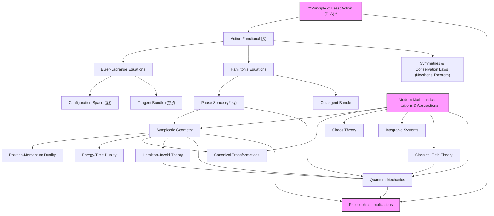

# Reconstructing Classical Mechanics: From First Principles to Elegant Structures
* * *

--- Unveiling the Essence of Motion through the Language of Modern Mathematics

# **1. Introduction**

**Epigraph**:
*"In the quest for understanding, we return to the foundations, discovering anew the simplicity beneath complexity."*
— Anonymous

## **1.1 The Essence of Classical Mechanics**

Classical mechanics, at its core, is the science of motion—an endeavor to comprehend how and why objects move as they do. But beyond the equations and laws that populate textbooks lies a deeper question: **What is classical mechanics truly about?**

At its most fundamental level, classical mechanics is an exploration of the **principles that govern the natural world**. It seeks to unveil the underlying order beneath the myriad phenomena we observe, capturing the **unifying principles** that dictate the behavior of everything from the smallest particles to the largest celestial bodies.

Historically, classical mechanics has been developed through various formulations—**Newtonian**, **Lagrangian**, and **Hamiltonian**—each providing different perspectives and tools for understanding motion. Newtonian mechanics offers a force-based approach, while Lagrangian and Hamiltonian mechanics introduce energy-based and geometric viewpoints. However, these formulations are more than just mathematical methods; they are windows into the **fundamental nature of reality**.

The essence of classical mechanics lies not merely in solving problems but in grasping the **elegant simplicity** that underpins complex phenomena. It is about recognizing that the diverse motions we witness arise from **universal principles** that can be expressed succinctly through the language of mathematics.

Revisiting and deepening our understanding of these core principles is crucial. In doing so, we move beyond rote application and towards a **profound comprehension** of the mechanics that shape our universe. This journey involves peeling back layers of established knowledge to reveal the **foundational ideas** that connect different aspects of mechanics into a cohesive whole.

## **1.2 Challenges and Opportunities**

Despite centuries of development, the study of classical mechanics often presents as a **fragmented landscape**. Traditional presentations tend to compartmentalize the subject into separate formulations and techniques, leading to a compartmentalized understanding:

- **Newtonian Mechanics** focuses on forces and the laws of motion but can become unwieldy when dealing with complex systems or constraints.
- **Lagrangian Mechanics** introduces generalized coordinates and the principle of least action but may seem abstract without a clear geometric interpretation.
- **Hamiltonian Mechanics** offers powerful tools through phase space and canonical transformations but can feel disconnected from physical intuition.

This fragmentation poses challenges for learners and practitioners alike:

- **Conceptual Gaps**: The connections between different formulations are not always evident, hindering a holistic understanding.
- **Mathematical Complexity**: Each formulation introduces its own mathematical framework, which can obscure the underlying simplicity of the principles involved.
- **Limited Perspectives**: Focusing on specific methods may prevent recognition of broader patterns and connections to other areas of physics and mathematics.

However, these challenges also present **opportunities**. By re-examining classical mechanics through the lens of modern mathematics and physics, we can:

- **Unify Different Formulations**: Demonstrate how Newtonian, Lagrangian, and Hamiltonian mechanics are interconnected expressions of the same fundamental principles.
- **Enhance Conceptual Clarity**: Use geometric and structural insights to provide intuitive understanding alongside mathematical rigor.
- **Discover New Connections**: Explore links to contemporary fields such as symplectic geometry, topology, and quantum mechanics, enriching our appreciation of classical mechanics' relevance.

Embracing these opportunities requires a shift from traditional expositions to an approach that places **core principles** and **geometric structures** at the forefront.

## **1.3 A Fresh Approach**

To delve deeper into the essence of classical mechanics, we propose a **principle-centric and geometry-focused methodology**. This approach centers on the **Principle of Least Action (PLA)** and employs modern mathematical concepts to reconstruct classical mechanics from the ground up.

### **1.3.1 Principle-Centric Development**

Starting with the PLA allows us to anchor our exploration in a **universal principle** that underlies all classical motion. The PLA asserts that the true path taken by a system is the one that **extremizes the action functional**. By adopting this principle as our foundation, we can derive the various formulations of mechanics as natural consequences, rather than isolated methods.

This focus ensures that **core ideas remain central**, enabling us to see beyond the specifics of equations to the **fundamental truths** they represent.

### **1.3.2 Emphasis on Geometry and Structure**

Modern mathematics provides powerful tools for understanding complex systems through their geometric properties. By utilizing concepts such as:

- **Manifolds**: To represent configuration spaces and phase spaces, providing a geometric stage for dynamics.
- **Tangent and Cotangent Bundles**: To systematically include velocities and momenta within the geometric framework.
- **Symplectic Geometry**: To explore the intrinsic structures of phase space that govern conservation laws and the behavior of dynamical systems.

This geometric emphasis allows us to visualize and comprehend the **structural elegance** of classical mechanics, revealing patterns and relationships that might remain hidden in purely algebraic treatments.

### **1.3.3 Exploring Interconnections and Dualities**

By examining the **interconnections and dualities** between different formulations, we can appreciate how they offer complementary perspectives on the same phenomena:

- **Newtonian Mechanics**: Emphasizes forces and the direct cause-and-effect relationships in motion.
- **Lagrangian Mechanics**: Highlights the role of energy, constraints, and the path of least action.
- **Hamiltonian Mechanics**: Focuses on the flow of systems in phase space and the symmetries inherent in dynamical evolution.

Understanding these relationships enriches our comprehension and demonstrates the **cohesiveness of classical mechanics** as a unified theory.

### **1.3.4 Incorporating Modern Insights**

Classical mechanics does not exist in isolation from the rest of physics and mathematics. By integrating modern insights, we can:

- **Connect to Quantum Mechanics**: Explore how classical principles transition into quantum realms through concepts like the Hamilton-Jacobi equation and path integrals.
- **Extend to Field Theory**: Generalize mechanics to continuous systems and fields, laying groundwork for advanced theories in electromagnetism and gravitation.
- **Engage with Advanced Mathematics**: Utilize contemporary mathematical frameworks to solve complex problems and uncover new theoretical developments.

This holistic approach not only enhances our understanding of classical mechanics but also positions us to make **meaningful contributions** to ongoing scientific endeavors.

### **1.3.5 Unveiling New Insights and Connections**

By reconstructing classical mechanics from first principles and through modern mathematics, we aim to:

- **Clarify Fundamental Concepts**: Provide clear, intuitive explanations that deepen comprehension.
- **Reveal Hidden Structures**: Expose underlying patterns and symmetries that unify various phenomena.
- **Foster Innovation**: Inspire new questions and lines of inquiry by highlighting connections to other fields and uncovering gaps in current understanding.

This fresh perspective invites experienced researchers and educators to engage with classical mechanics in a way that is both familiar and invigorating, encouraging a **renewed exploration** of its depths.

## **1.4 Summary**

In embarking on this journey, we strive to not only **answer the question** of what classical mechanics truly is but to **experience its beauty** and **elegance** anew. By grounding ourselves in foundational principles and embracing modern mathematical language, we open the door to a richer, more profound appreciation of the mechanics that govern the natural world.

# **2. The Principle of Least Action: The Core of Mechanics**

**Epigraph**:
*"Action is the language through which nature expresses motion."*
— Anonymous

Classical mechanics, at its most profound level, is a study of how and why objects move. While various formulations—Newtonian, Lagrangian, Hamiltonian—provide different perspectives, they all converge upon a unifying principle that lies at the heart of this motion: the **Principle of Least Action** (PLA). This principle is not just a mathematical abstraction but a fundamental law that encapsulates the essence of nature's economy and elegance. In this section, we will delve deep into the action functional, comprehend its significance, and understand how its extremization leads to the natural laws governing dynamics.

## **2.1 Definition and Significance of the Action Functional**

At the core of the PLA is the concept of the **action functional** $S$, a scalar quantity that encapsulates the entire motion of a system over time. For a system moving from time $t_1$ to $t_2$, the action is defined as:
$$
S[q(t)] = \int_{t_1}^{t_2} L(q(t), \dot{q}(t), t) \, dt,
$$
where:
- $q(t)$ represents the generalized coordinates describing the system's configuration at time $t$.
- $\dot{q}(t)$ denotes the generalized velocities.
- $L(q, \dot{q}, t)$ is the **Lagrangian** of the system, a function that characterizes the dynamics by combining kinetic and potential energies.

The action functional is not merely an integral; it is a mapping from the space of possible trajectories $q(t)$ to the real numbers. Each possible path that the system could take between $t_1$ and $t_2$ has an associated action.

**Physical Interpretation and Central Role**

The action encapsulates the **total "effort"** or "cost" associated with a particular path. In analogy to optimization in economics or engineering, where one seeks to minimize cost or energy expenditure, nature, too, operates on a principle of extremization. However, unlike simple minimization, the action is extremized—it could be minimized, maximized, or a saddle point, depending on the context.

The central role of the action functional lies in its ability to succinctly encode the dynamics of a system. By considering the action, we shift our perspective from a local viewpoint—focusing on instantaneous forces and accelerations—to a global one, appreciating the entire path as a whole. This holistic approach provides profound insights into the behavior of physical systems and forms a bridge to other areas of physics, such as quantum mechanics and relativity.

## **2.2 The Principle of Least Action (PLA)**

The **Principle of Least Action** posits that the actual path taken by a physical system between two states is the one for which the action functional is extremized. Mathematically, this is expressed as:
$$
\delta S = 0,
$$
where $\delta S$ represents the first variation of the action functional. This condition implies that any infinitesimal deviation $\delta q(t)$ from the true path results in no first-order change in the action.

**Universality in Determining System Dynamics**

The PLA is remarkably universal. It applies to an astonishing variety of physical systems, from the motion of planets to the propagation of light, and even to quantum fields. Its universality stems from its abstract formulation—it's independent of the specific forces or particles involved. Instead, it relies on the properties of the action functional and the Lagrangian, which can be tailored to represent different systems.

**Derivation of the Euler-Lagrange Equations**

To see how the PLA leads to the equations of motion, consider a system with Lagrangian $L(q, \dot{q}, t)$. We seek the path $q(t)$ that makes $S$ stationary under infinitesimal variations $\delta q(t)$ that vanish at the endpoints $t_1$ and $t_2$:
$$
\delta S = \delta \int_{t_1}^{t_2} L(q, \dot{q}, t) \, dt = 0.
$$
Performing the variation, we have:
$$
\delta S = \int_{t_1}^{t_2} \left( \frac{\partial L}{\partial q} \delta q + \frac{\partial L}{\partial \dot{q}} \delta \dot{q} \right) dt.
$$
Integrating the second term by parts and noting that $\delta q(t_1) = \delta q(t_2) = 0$:
$$
\int_{t_1}^{t_2} \frac{\partial L}{\partial \dot{q}} \delta \dot{q} \, dt = \left. \frac{\partial L}{\partial \dot{q}} \delta q \right|_{t_1}^{t_2} - \int_{t_1}^{t_2} \frac{d}{dt} \left( \frac{\partial L}{\partial \dot{q}} \right) \delta q \, dt = - \int_{t_1}^{t_2} \frac{d}{dt} \left( \frac{\partial L}{\partial \dot{q}} \right) \delta q \, dt.
$$
Combining terms:
$$
\delta S = \int_{t_1}^{t_2} \left( \frac{\partial L}{\partial q} - \frac{d}{dt} \left( \frac{\partial L}{\partial \dot{q}} \right) \right) \delta q \, dt = 0.
$$
Since $\delta q(t)$ is arbitrary, the integrand must vanish:
$$
\frac{d}{dt} \left( \frac{\partial L}{\partial \dot{q}} \right) - \frac{\partial L}{\partial q} = 0.
$$
These are the **Euler-Lagrange equations**, fundamental to the Lagrangian formulation of mechanics. They are differential equations that determine the evolution of the system's coordinates $q(t)$ over time.

## **2.3 Implications of the Principle of Least Action**

The implications of the PLA are profound and far-reaching, providing insights that transcend the boundaries of classical mechanics.

**Unification of Different Formulations**

The PLA serves as a unifying thread connecting various formulations of mechanics:

- **Newtonian Mechanics**: In the Newtonian view, motion is governed by forces and accelerations. The Euler-Lagrange equations derived from the PLA yield Newton's second law $F = m a$ when expressed in Cartesian coordinates and for conservative forces.
  
- **Lagrangian Mechanics**: The PLA is the cornerstone of Lagrangian mechanics, where the dynamics are described in terms of generalized coordinates and energies rather than forces. This formulation is particularly powerful for systems with constraints and in non-Cartesian coordinate systems.
  
- **Hamiltonian Mechanics**: By performing a Legendre transformation on the Lagrangian, we transition to the Hamiltonian formalism. The Hamiltonian approach, deeply rooted in the PLA, introduces phase space and symplectic geometry, enriching our understanding of dynamical systems.

Moreover, the PLA extends beyond classical mechanics:

- **Electrodynamics and Field Theories**: The action principle underlies the formulation of classical field theories, including Maxwell's equations of electromagnetism and Einstein's general relativity.
  
- **Quantum Mechanics**: In quantum mechanics, Feynman's path integral formulation generalizes the PLA, summing over all possible paths with a phase factor determined by the classical action.
  
- **Optics**: Fermat's Principle, stating that light takes the path of least time, is a specific case of the PLA applied to the propagation of light.

**Reflection of Simplicity and Elegance in Natural Laws**

The PLA embodies the simplicity and economy inherent in natural laws:

- **Economy of Nature**: The notion that nature operates in the most efficient manner possible is a recurring theme in physics. The extremization of the action reflects this principle of least "expenditure" or "effort."
  
- **Mathematical Elegance**: The PLA reduces the problem of determining motion to finding stationary points of a scalar functional, a conceptually simple yet mathematically rich approach that leverages the power of calculus of variations.
  
- **Symmetry and Conservation**: The PLA naturally incorporates symmetries and conservation laws through Noether's Theorem, which establishes a profound connection between symmetries of the action and conserved quantities (e.g., energy, momentum, angular momentum).

**Philosophical Perspectives**

The PLA also invites philosophical contemplation:

- **Determinism and Predictability**: By focusing on the action, we emphasize a deterministic view of nature, where the past and future are connected through stationary principles.
  
- **Holistic Viewpoint**: The PLA encourages us to consider the system's path as a whole rather than isolated points in time, promoting a holistic understanding of physical processes.
  
- **Universal Applicability**: The success of the PLA across diverse areas of physics suggests an underlying unity in the laws of nature, hinting at deeper principles yet to be fully understood.

## **2.4 Summary**

By establishing the Principle of Least Action as the foundational pillar of classical mechanics, we gain not only a powerful computational tool but also a window into the intrinsic harmony of the natural world. The action functional and its extremization serve as the gateway through which the rich tapestry of mechanics is woven, unifying various formulations and revealing the profound simplicity underlying complex phenomena. As we progress, this principle will continue to guide us, illuminating the geometric structures and symmetries that define the behavior of physical systems.

# **3. Configuration Space and Lagrangian Mechanics**

**Epigraph**:
*"In the realm of configurations, motion is orchestrated by the tapestry of energies."*
— Anonymous

Having established the Principle of Least Action (PLA) as the foundational cornerstone of classical mechanics, we now turn our attention to the framework in which this principle operates: the **configuration space**. This geometric landscape forms the stage upon which the dynamics of systems unfold, governed by the interplay of kinetic and potential energies encapsulated in the **Lagrangian function**. In this chapter, we will delve into the geometric and analytical constructs of Lagrangian mechanics, exploring how generalized coordinates, constraints, and the Lagrangian formalism coalesce to provide profound insights into the nature of motion.

## **3.1 Configuration Space ($M$)**

At the heart of Lagrangian mechanics lies the concept of **configuration space** $M$, a manifold that represents all possible states (configurations) a system can attain without considering velocities or momenta. Each point in $M$ corresponds to a unique arrangement of the system's components.

**Definition and Generalized Coordinates**

In mathematical terms, the configuration space $M$ is a differentiable manifold whose coordinates are the **generalized coordinates** $q^i$ ($i = 1, 2, \dots, n$), which are variables that uniquely specify the system's configuration. Unlike Cartesian coordinates, generalized coordinates are chosen to best exploit the symmetries and constraints of the system, simplifying the equations of motion.

For a system with $n$ degrees of freedom, the configuration space is $n$-dimensional. The choice of generalized coordinates is not unique; they can be angles, distances, or any parameters that effectively describe the system's state.

**Role of Constraints in Shaping $M$**

Real-world mechanical systems often encounter **constraints**—conditions that limit the ways in which a system can move. Constraints can be:

- **Holonomic**: Constraints that can be expressed as equations relating the coordinates and time, $f(q^i, t) = 0$. They reduce the number of independent generalized coordinates.
- **Non-holonomic**: Constraints involving velocities that cannot be integrated into equations solely involving coordinates and time.
- **Scleronomous**: Time-independent constraints.
- **Rheonomous**: Time-dependent constraints.

Constraints shape the configuration space by effectively removing certain regions or dimensions, thereby reducing the degrees of freedom. The modified space, accommodating the constraints, is often a submanifold of the original configuration space.

**Example: The Double Pendulum**

Consider a double pendulum comprising two rods of lengths $l_1$ and $l_2$ with masses $m_1$ and $m_2$ at their ends. The system's configuration can be described using two angles $\theta_1$ and $\theta_2$, representing the deviation of each rod from the vertical. The constraints (fixed rod lengths and pivot points) reduce the configuration space to a two-dimensional torus embedded in a four-dimensional space.

## **3.2 The Lagrangian Function $L(q, \dot{q}, t)$**

The **Lagrangian function** $L(q, \dot{q}, t)$ is a scalar function that encapsulates the dynamics of a system. It is defined as the difference between the kinetic energy $T(q, \dot{q}, t)$ and the potential energy $V(q, t)$:
$$
L(q, \dot{q}, t) = T(q, \dot{q}, t) - V(q, t).
$$

**Kinetic Energy $T$**

Kinetic energy represents the energy associated with the motion of the system. For particles of mass $m$ moving with velocities $\dot{q}$, it is given by:
$$
T = \frac{1}{2} m_{ij}(q) \dot{q}^i \dot{q}^j,
$$
where $m_{ij}(q)$ is the mass matrix, potentially dependent on the coordinates in systems with moving masses or in non-inertial frames.

**Potential Energy $V$**

Potential energy captures the stored energy due to interactions like gravitational, elastic, or electromagnetic forces. It depends on the positions $q$ and possibly time $t$, but not on velocities $\dot{q}$.

**Physical Interpretation of $L$**

The Lagrangian $L$ embodies the trade-off between kinetic and potential energies during motion. It is not energy itself but a function whose extremization leads to the correct equations of motion through the action principle. By considering $L$ rather than $T$ and $V$ separately, we achieve a unified description that is particularly powerful in systems with complex interactions or in generalized coordinate systems.

**Advantages of the Lagrangian Formalism**

- **Coordinate Independence**: The Lagrangian formulation naturally accommodates any choice of generalized coordinates, making it highly adaptable.
- **Incorporation of Constraints**: Constraints can be elegantly included using methods like Lagrange multipliers, without the need to account for constraint forces explicitly.
- **Symmetry and Conservation Laws**: The dependence of $L$ on certain coordinates directly relates to conserved quantities, as formalized in Noether's Theorem.

## **3.3 Derivation of the Euler-Lagrange Equations**

The Euler-Lagrange equations are obtained by applying the Principle of Least Action to the Lagrangian $L(q, \dot{q}, t)$. The goal is to find the path $q(t)$ that extremizes the action functional $S$:
$$
S[q(t)] = \int_{t_1}^{t_2} L(q, \dot{q}, t) \, dt.
$$

**Derivation**

As previously established, the condition for extremizing $S$ is:
$$
\delta S = 0.
$$
Performing the variation and integrating by parts, we arrive at the Euler-Lagrange equations:
$$
\frac{d}{dt} \left( \frac{\partial L}{\partial \dot{q}^i} \right) - \frac{\partial L}{\partial q^i} = 0.
$$
These are a set of second-order differential equations that determine the evolution of each generalized coordinate $q^i(t)$.

**Examples**

1. **Simple Harmonic Oscillator**

   - **System**: A mass $m$ attached to a spring with stiffness $k$.
   - **Coordinate**: Displacement $x$ from equilibrium.
   - **Lagrangian**:
     $$
     L = T - V = \frac{1}{2} m \dot{x}^2 - \frac{1}{2} k x^2.
     $$

   - **Euler-Lagrange Equation**:
     $$
     m \ddot{x} + k x = 0.
     $$

    This is the familiar equation for simple harmonic motion.

2. **Simple Pendulum**

   - **System**: A mass $m$ attached to a massless rod of length $l$ swinging under gravity.
   - **Coordinate**: Angle $\theta$ from the vertical.
   - **Lagrangian**:
     $$
     L = T - V = \frac{1}{2} m l^2 \dot{\theta}^2 - m g l (1 - \cos\theta).
     $$

   - **Euler-Lagrange Equation**:
     $$
     m l^2 \ddot{\theta} + m g l \sin\theta = 0,
     $$
    which simplifies to:
     $$
     \ddot{\theta} + \frac{g}{l} \sin\theta = 0.
     $$
    This nonlinear equation describes the pendulum's motion.

**Observations**

- The Lagrangian formalism readily incorporates gravity, tension, and other forces without explicitly introducing them into the equations. The potential energy accounts for conservative forces, while non-conservative forces can be included using generalized potentials.
- The approach scales effortlessly to systems with multiple degrees of freedom and complex interactions.

## **3.4 Symmetries and Conservation Laws**

One of the most profound aspects of Lagrangian mechanics is its inherent ability to reveal the connection between symmetries and conservation laws, formalized in **Noether's Theorem**.

**Noether's Theorem**

**Statement**: For every continuous symmetry of the action $S$, there exists a corresponding conserved quantity.

A **symmetry** is a transformation of the system's coordinates that leaves the action (and hence the equations of motion) invariant. A **conserved quantity** is a physical quantity that remains constant over time for a given system.

**Examples of Symmetries and Conserved Quantities**

1. **Time Translation Symmetry**

   - **Symmetry**: If the Lagrangian does not explicitly depend on time ($\partial L / \partial t = 0$), the action is invariant under time translations $t \rightarrow t + \epsilon$.
   - **Conserved Quantity**: **Energy** ($E$).

    The conserved energy is given by:
     $$
     E = \sum_i \dot{q}^i \frac{\partial L}{\partial \dot{q}^i} - L.
     $$

2. **Spatial Translation Symmetry**

   - **Symmetry**: If $L$ does not explicitly depend on a coordinate $q^j$, the action is invariant under translations $q^j \rightarrow q^j + \epsilon$.
   - **Conserved Quantity**: **Linear Momentum** ($p_j$).

    The conserved momentum is:
     $$
     p_j = \frac{\partial L}{\partial \dot{q}^j}.
     $$

3. **Rotational Symmetry**

   - **Symmetry**: If the system is rotationally symmetric (invariant under rotations), the action remains unchanged under rotations $q \rightarrow Rq$.
   - **Conserved Quantity**: **Angular Momentum**.

**Implications of Noether's Theorem**

Noether's Theorem provides a systematic method to identify conserved quantities arising from symmetries, deepening our understanding of physical laws:

- **Unified Framework**: It offers a unifying principle that connects conservation laws across various physical contexts.
- **Predictive Power**: By identifying symmetries, we can predict conserved quantities even in complex systems.
- **Insight into Fundamental Interactions**: The theorem highlights the fundamental role of symmetries in governing physical interactions, guiding the development of modern physics theories, including quantum mechanics and gauge theories.

**Example: Conservation of Angular Momentum in Central Force Motion**

Consider a particle of mass $m$ moving under a central potential $V(r)$, where $r$ is the radial distance from a fixed point. The Lagrangian in spherical coordinates is:
$$
L = \frac{1}{2} m \left( \dot{r}^2 + r^2 \dot{\theta}^2 + r^2 \sin^2\theta \, \dot{\phi}^2 \right) - V(r).
$$
Since $L$ does not depend on the angle $\phi$, the action is invariant under rotations about the $z$-axis, leading to the conservation of the corresponding component of angular momentum:
$$
p_\phi = \frac{\partial L}{\partial \dot{\phi}} = m r^2 \sin^2\theta \, \dot{\phi} = \text{constant}.
$$

**Constraints and Generalized Forces**

In the presence of non-conservative forces or non-holonomic constraints, the conservation laws may not hold strictly. However, the Lagrangian formalism can be extended to include generalized forces $Q_i$, modifying the Euler-Lagrange equations:
$$
\frac{d}{dt} \left( \frac{\partial L}{\partial \dot{q}^i} \right) - \frac{\partial L}{\partial q^i} = Q_i.
$$
This generalization allows us to address a broader class of physical systems within the Lagrangian framework.

## **3.5 Summary**

By exploring the configuration space and developing the Lagrangian formalism, we gain powerful tools to analyze mechanical systems with elegance and generality. The use of generalized coordinates and the incorporation of constraints provide flexibility, while the connection between symmetries and conservation laws offers deep insights into the invariance principles governing the physical world. As we continue our journey, this foundation will enable us to transition smoothly into Hamiltonian mechanics and further appreciate the geometric structures underlying classical mechanics.

# **4. Phase Space and Hamiltonian Mechanics**

**Epigraph**:
*"Phase space is the canvas where the duality of nature paints the story of motion."*
— Anonymous

The journey through classical mechanics leads us from the geometric elegance of configuration space in Lagrangian mechanics to the richer, more profound landscape of **phase space** in Hamiltonian mechanics. While the Lagrangian formalism focuses on the positions and velocities of a system, the Hamiltonian approach elevates the roles of positions and momenta as independent, yet intertwined, variables. This shift not only provides a different mathematical framework but also unveils deeper symmetries and structures inherent in the laws of nature. In this chapter, we delve into the transition from configuration space to phase space, explore the profound significance of the Legendre transform, and illuminate how the Hamiltonian function governs the evolution of dynamical systems.

## **4.1 Phase Space ($T^*M$) and Cotangent Bundle**

**Defining Phase Space and Its Coordinates**

In classical mechanics, the **phase space** of a system encapsulates all possible states of the system by considering both positions and momenta. For a system with $n$ degrees of freedom, the phase space is a $2n$-dimensional manifold characterized by the coordinates $(q^i, p_i)$, where:

- $q^i$ represent the generalized positions, elements of the configuration space $M$.
- $p_i$ are the conjugate momenta corresponding to $q^i$.

This duality of positions and momenta forms the fundamental framework within which Hamiltonian mechanics operates.

**Cotangent Bundle Structure**

Mathematically, phase space is identified with the **cotangent bundle** $T^*M$ of the configuration space $M$. The cotangent bundle is the union of all cotangent spaces $T_q^*M$ at each point $q$ in $M$, where $T_q^*M$ consists of all linear functionals (covectors) acting on the tangent space $T_qM$.

This structure is pivotal because:

- It provides a natural geometric setting for phase space, emphasizing the roles of positions and momenta as coordinates on $T^*M$.
- It allows for the formulation of dynamics in terms of differential forms and symplectic geometry, revealing deeper mathematical properties of mechanical systems.

**Intrinsic Duality and Geometric Significance**

The cotangent bundle embodies the intrinsic duality between positions and momenta:

- **Positions ($q$)** describe where the system is in configuration space.
- **Momenta ($p$)**, as covectors, capture how the system is moving through configuration space.

This duality is not merely a mathematical convenience but reflects fundamental physical principles:

- In the **Hamiltonian perspective**, $q$ and $p$ are treated on equal footing, highlighting the symmetries and conservation laws inherent in the system.
- The **phase space** becomes the stage where the full dynamical behavior of the system is encoded, with trajectories representing the evolution of both positions and momenta over time.

**Phase Space as a Bridge to Modern Physics**

Phase space is also foundational in connecting classical mechanics to quantum mechanics and statistical mechanics:

- In **quantum mechanics**, the uncertainty principle arises from the fundamental non-commutativity of position and momentum operators, reflecting the duality captured in phase space.
- In **statistical mechanics**, phase space provides the setting for defining ensembles and understanding the thermodynamic behavior of systems.

## **4.2 The Legendre Transform**

**From Lagrangian to Hamiltonian: The Legendre Transform**

The **Legendre transform** is the mathematical mechanism that transitions us from the Lagrangian formulation, dependent on positions and velocities $(q, \dot{q})$, to the Hamiltonian formulation, expressed in terms of positions and momenta $(q, p)$. This transformation is profound because it re-expresses the system's dynamics in a way that reveals new symmetries and conservations.

**Defining the Conjugate Momenta**

The conjugate momentum $p_i$ corresponding to the generalized coordinate $q^i$ is defined as:
$$
p_i = \frac{\partial L}{\partial \dot{q}^i},
$$
where $L(q, \dot{q}, t)$ is the Lagrangian of the system.

This definition arises naturally from the action principle and encapsulates how the system's motion imparts momentum.

**Constructing the Hamiltonian Function**

The Hamiltonian $H(q, p, t)$ is defined via the Legendre transform of the Lagrangian:
$$
H(q, p, t) = \sum_{i} p_i \dot{q}^i - L(q, \dot{q}, t).
$$
Here, the velocities $\dot{q}^i$ are implicitly functions of $q^i$ and $p_i$ through the inversion of the momentum definition.

**Significance of the Transformation**

The Legendre transform accomplishes several critical objectives:

- **Reparameterization of Dynamics**: It changes the dependent variables from velocities to momenta, offering a new lens through which to view the system.
- **Revealing Conservation Laws**: By expressing the dynamics in terms of $q$ and $p$, the Hamiltonian formulation makes conservation laws more transparent, especially through the symmetries of phase space.
- **Facilitating Quantization**: The Hamiltonian framework is essential for the transition to quantum mechanics, where the Hamiltonian operator plays a central role.

**Deep Geometric Interpretation**

The Legendre transform is not merely an algebraic tool; it reflects a deeper geometric correspondence:

- It maps the tangent bundle $TM$, associated with velocities, to the cotangent bundle $T^*M$, associated with momenta.
- This mapping preserves the intrinsic geometric structures, allowing the rich properties of symplectic manifolds to be utilized in analyzing the system.

## **4.3 The Hamiltonian Function $H(q, p, t)$**

**Definition and Physical Interpretation**

The **Hamiltonian** $H(q, p, t)$ encapsulates the total energy of the system expressed in terms of generalized coordinates and conjugate momenta. It often represents the sum of kinetic and potential energies when the Lagrangian is of the standard form $L = T - V$.

Physically, the Hamiltonian serves as:

- The generator of time evolution, dictating how a system progresses from one state to another.
- A conserved quantity in systems where $H$ does not explicitly depend on time ($\partial H / \partial t = 0$), embodying the conservation of energy principle.

**Role in Governing Dynamics**

The Hamiltonian function governs the system's dynamics through Hamilton's equations, which relate the time derivatives of $q^i$ and $p_i$ to partial derivatives of $H$:
$$
\dot{q}^i = \frac{\partial H}{\partial p_i}, \quad \dot{p}_i = -\frac{\partial H}{\partial q^i}.
$$
These equations highlight several key aspects:

- **Symmetry Between $q$ and $p$**: Positions and momenta are treated symmetrically, reflecting underlying physical symmetries.
- **First-Order Differential Equations**: The evolution equations are first-order in time, simplifying analysis and numerical integration compared to second-order equations in the Lagrangian formalism.

**Geometric Perspective**

In the geometric view, the Hamiltonian defines a **vector field** on phase space whose integral curves correspond to the system's trajectories. This vector field preserves the symplectic structure of phase space, a property encapsulated in Liouville's Theorem.

**Energy Landscape and Level Sets**

The Hamiltonian function creates an energy landscape in phase space, where:

- **Level Sets of $H$**: Surfaces defined by $H(q, p, t) = E$ represent states of constant energy.
- **Dynamics Constrained to Level Sets**: For conservative systems, the evolution of the system remains on these energy surfaces, revealing conserved quantities and helping to visualize motion.

## **4.4 Hamilton's Equations of Motion**

**Derivation from the Action Principle**

The action principle in Hamiltonian mechanics involves extremizing the action functional expressed in terms of $q$ and $p$:
$$
S[q(t), p(t)] = \int_{t_1}^{t_2} \left( p_i \dot{q}^i - H(q, p, t) \right) dt.
$$
Applying the calculus of variations, variations $\delta q^i$ and $\delta p_i$ lead to Hamilton's equations.

**Detailed Derivation**

1. **Variation with respect to $\delta p_i$**:
$$
\delta S = \int_{t_1}^{t_2} \left( \delta p_i \dot{q}^i - \delta p_i \frac{\partial H}{\partial p_i} \right) dt = \int_{t_1}^{t_2} \delta p_i \left( \dot{q}^i - \frac{\partial H}{\partial p_i} \right) dt.
$$
   Setting $\delta S = 0$ for arbitrary $\delta p_i$, we obtain:
$$
\dot{q}^i = \frac{\partial H}{\partial p_i}.
$$

2. **Variation with respect to $\delta q^i$**:
$$
\delta S = \int_{t_1}^{t_2} \left( -\dot{p}_i \delta q^i - \delta q^i \frac{\partial H}{\partial q^i} \right) dt = \int_{t_1}^{t_2} \delta q^i \left( -\dot{p}_i - \frac{\partial H}{\partial q^i} \right) dt.
$$
   Again, setting $\delta S = 0$ for arbitrary $\delta q^i$, we get:
$$
\dot{p}_i = -\frac{\partial H}{\partial q^i}.
$$

**Hamilton's Equations**

Together, these results form Hamilton's equations:
$$
\dot{q}^i = \frac{\partial H}{\partial p_i}, \quad \dot{p}_i = -\frac{\partial H}{\partial q^i}.
$$

These equations fully describe the system's dynamics in phase space.

**Examples and Comparisons**

1. **Simple Harmonic Oscillator**

   - **Hamiltonian**:
     $$
     H = \frac{p^2}{2m} + \frac{1}{2} k q^2.
     $$

   - **Hamilton's Equations**:
     $$
     \dot{q} = \frac{\partial H}{\partial p} = \frac{p}{m}, \quad \dot{p} = -\frac{\partial H}{\partial q} = -k q.
     $$

   - **Phase Space Trajectory**: The solutions trace out ellipses in the $q$-$p$ plane, reflecting the conserved total energy and periodic nature of the oscillator.

2. **Comparison to Lagrangian Formulation**

   - The Lagrangian approach yields:
     $$
     m \ddot{q} + k q = 0,
     $$
    a second-order differential equation in $q$.

   - Hamiltonian mechanics splits this into two first-order equations, providing a different perspective that can simplify certain analyses and numerical simulations.

**Advantages and Deep Insights**

- **Symplectic Structure Preservation**: Hamilton's equations preserve the symplectic form $\omega = dq^i \wedge dp_i$, a fundamental property leading to conservation laws through symplectic geometry.
- **Integrability and Chaos**: The Hamiltonian formalism is particularly suited for studying integrable systems and the onset of chaos, as it naturally incorporates concepts like phase space flows and Poincaré maps.
- **Canonical Transformations**: Changes of variables that preserve the form of Hamilton's equations, known as canonical transformations, reveal deeper symmetries and facilitate the integration of the equations of motion.

**Intrinsic Nature of Hamiltonian Dynamics**

Hamiltonian mechanics captures the essence of classical dynamics by:

- **Emphasizing Duality**: Treating positions and momenta symmetrically exposes the fundamental duality in mechanical systems.
- **Highlighting Conservation Laws**: The formulation makes conserved quantities more transparent, as they often correspond to symmetries in phase space.
- **Connecting to Quantum Mechanics**: The Hamiltonian function becomes the Hamiltonian operator in quantum mechanics, governing the time evolution of quantum states via the Schrödinger equation.

**Liouville's Theorem**

An important consequence of Hamiltonian mechanics is **Liouville's Theorem**, which states that the flow generated by Hamilton's equations conserves the volume in phase space:
$$
\frac{d}{dt} \left( dq^1 \wedge dp_1 \wedge \dots \wedge dq^n \wedge dp_n \right) = 0.
$$
This property underscores the incompressibility of phase space flow and has profound implications in statistical mechanics.

**Symmetry and Integrability**

Hamiltonian systems with sufficient symmetries can be **integrable**, meaning their equations of motion can be solved exactly. Such systems often admit action-angle variables, leading to a deep understanding of periodic motions and stability.

**Canonical Transformations and Generating Functions**

Canonical transformations preserve the symplectic structure and Hamilton's equations. They are generated by functions that facilitate the integration of motion and the simplification of complex systems.

**Hamilton-Jacobi Theory**

An alternative formulation of classical mechanics, the **Hamilton-Jacobi equation**, arises naturally in the Hamiltonian framework. It provides a link between mechanics and optics (via the principle of least action) and serves as a gateway to quantum mechanics through the correspondence principle.

## **4.5 Summary**

By transitioning to the Hamiltonian formalism and delving into the structure of phase space, we uncover a richer, more profound understanding of classical mechanics. The Hamiltonian approach not only provides alternative methods for solving mechanical problems but also illuminates the deep symmetries and geometric structures that underlie physical laws. This perspective emphasizes the unity between seemingly disparate areas of physics and mathematics, highlighting the elegance and interconnectedness of the natural world. As we proceed, these insights will form the foundation for exploring advanced topics, such as symplectic geometry and the profound connections between classical and quantum mechanics.

# **5. Symplectic Geometry: The Structure of Phase Space**

**Epigraph**:
*"Symplectic geometry weaves the fabric of phase space, preserving the harmony of motion."*
— Anonymous

As we have journeyed from the Principle of Least Action through the Lagrangian and Hamiltonian formulations, we have witnessed the emergence of geometric structures that elegantly encode the dynamics of classical systems. Among these structures, **symplectic geometry** stands out as the profound mathematical foundation underpinning phase space. It captures the essence of Hamiltonian mechanics, revealing the deep interplay between geometry and physics. In this chapter, we delve into the intrinsic nature of symplectic manifolds, the properties of the symplectic form $\omega$, and how these concepts lead to conservation laws and invariants, enriching our understanding of the harmony of motion.

## **5.1 Symplectic Manifolds and the Symplectic Form $\omega$**

At the core of symplectic geometry lies the concept of a **symplectic manifold**, a smooth even-dimensional manifold equipped with a closed, non-degenerate differential $2$-form called the **symplectic form** $\omega$. This structure provides the mathematical language necessary to describe the phase space of Hamiltonian systems, incorporating both positions and momenta in a unified geometric framework.

**Defining Symplectic Manifolds**

A **symplectic manifold** $(M, \omega)$ consists of:

- **Manifold $M$**: A smooth, even-dimensional differentiable manifold.
- **Symplectic Form $\omega$**: A closed (exact differential $d\omega = 0$), non-degenerate $2$-form.

Mathematically, the symplectic form $\omega$ is a bilinear, antisymmetric map:
$$
\omega: T_p M \times T_p M \rightarrow \mathbb{R},
$$
where $T_p M$ is the tangent space at point $p \in M$.

**Properties of the Symplectic Form**

1. **Non-Degeneracy**:

   For all non-zero $v \in T_p M$, there exists $u \in T_p M$ such that $\omega(v, u) \neq 0$.

   - **Physical Interpretation**: Non-degeneracy ensures that the symplectic form pairs vectors uniquely, reflecting the intrinsic coupling between positions and momenta in phase space.

2. **Closedness**:

   The exterior derivative of $\omega$ vanishes:
   $$
   d\omega = 0.
   $$

   - **Physical Interpretation**: Closedness implies the conservation of the symplectic structure under the flow generated by Hamiltonian dynamics, leading to preservation of phase space volumes (Liouville's Theorem).

**Canonical Symplectic Form on $T^*M$**

For the cotangent bundle $T^*M$ (phase space), the natural symplectic form is given in local coordinates $(q^i, p_i)$ by:
$$
\omega = dq^i \wedge dp_i,
$$
where $\wedge$ denotes the wedge product.

This form encapsulates the fundamental Poisson brackets between coordinates and momenta:
$$
\{ q^i, p_j \} = \delta^i_j,
$$
reflecting the basic commutation relations and the inherent symplectic structure.

**Symplectic Structure as the Fabric of Phase Space**

The symplectic form $\omega$ endows phase space with a precise mathematical structure that:

- Encodes the geometry of classical mechanics.
- Allows us to formulate dynamics in a coordinate-free manner.
- Provides the setting for defining Hamiltonian flows and preserving the essential features of mechanical systems.

**Deep Geometric Implications**

The symplectic manifold is more than just a mathematical construct; it embodies the fundamental nature of physical systems:

- **Even-Dimensionality**: Arises naturally due to the pairing of positions and momenta.
- **Non-Degeneracy**: Ensures that every direction in phase space has a complementary direction with which it interacts, mirroring the interconnectedness of physical quantities.
- **Closedness**: Reflects the underlying conservation laws and invariance principles, signifying the stability and predictability of classical systems.

## **5.2 Hamiltonian Vector Fields and Flows**

With the symplectic structure established, we can explore how it gives rise to dynamics through **Hamiltonian vector fields** and their corresponding flows on phase space.

**Hamiltonian Functions and Vector Fields**

Given a Hamiltonian function $H: M \rightarrow \mathbb{R}$, we can associate a unique vector field $X_H$ on $M$ such that:
$$
\iota_{X_H} \omega = dH,
$$
where $\iota_{X_H}$ denotes the interior product of $\omega$ with $X_H$.

This relation defines $X_H$ implicitly, ensuring that $X_H$ generates the flow corresponding to the Hamiltonian dynamics.

**Equation of Motion in Terms of Hamiltonian Vector Fields**

The evolution of any observable $f: M \rightarrow \mathbb{R}$ along the flow generated by $X_H$ is given by:
$$
\frac{df}{dt} = X_H(f) = \{ f, H \},
$$
where $\{ \cdot , \cdot \}$ denotes the Poisson bracket. This reflects how the Hamiltonian vector field dictates the time evolution of observables.

**Flows and Phase Space Trajectories**

The integral curves of $X_H$ define the motion of the system in phase space:

- **Hamiltonian Flow** $\phi_t$: A one-parameter family of diffeomorphisms satisfying $\phi_0 = \text{id}$ and $\frac{d}{dt} \phi_t(p) = X_H(\phi_t(p))$.

- **Conservation of $\omega$**: The flow preserves the symplectic form:
  $$
  \phi_t^* \omega = \omega,
  $$
  where $\phi_t^*$ denotes the pullback of $\phi_t$.

**Physical Significance**

- **Deterministic Evolution**: The Hamiltonian vector field encapsulates the deterministic nature of classical mechanics, where the future trajectory is uniquely determined by the current state.

- **Symplectic Invariance**: The preservation of the symplectic form under the flow ensures that the fundamental geometric and physical properties of the system remain unchanged over time.

**Integrability and Chaos**

- **Integrable Systems**: For systems with enough conserved quantities (integrals of motion), the Hamiltonian flows can be confined to lower-dimensional submanifolds, leading to regular, predictable behavior.

- **Chaotic Systems**: In the absence of sufficient conserved quantities, the flows can exhibit sensitive dependence on initial conditions, leading to chaotic dynamics within the symplectic framework.

## **5.3 Poisson Brackets and Observables**

The symplectic structure provides a natural framework for defining the algebraic structures of mechanics, particularly through the **Poisson bracket**, which captures the fundamental relationships between observables.

**Definition of Poisson Brackets**

For two smooth functions (observables) $f, g: M \rightarrow \mathbb{R}$, the Poisson bracket is defined as:
$$
\{ f, g \} = \omega(X_f, X_g),
$$
where $X_f$ and $X_g$ are the Hamiltonian vector fields corresponding to $f$ and $g$, respectively.

In local coordinates $(q^i, p_i)$:
$$
\{ f, g \} = \sum_{i} \left( \frac{\partial f}{\partial q^i} \frac{\partial g}{\partial p_i} - \frac{\partial f}{\partial p_i} \frac{\partial g}{\partial q^i} \right).
$$

**Properties of the Poisson Bracket**

1. **Bilinearity**:
   $$
   \{ af + bg, h \} = a \{ f, h \} + b \{ g, h \}, \quad a, b \in \mathbb{R}.
   $$

2. **Skew-Symmetry**:
   $$
   \{ f, g \} = - \{ g, f \}.
   $$

3. **Jacobi Identity**:
   $$
   \{ f, \{ g, h \} \} + \{ g, \{ h, f \} \} + \{ h, \{ f, g \} \} = 0.
   $$

4. **Leibniz Rule**:
   $$
   \{ f g, h \} = f \{ g, h \} + g \{ f, h \}.
   $$

These properties endow the space of observables with the structure of a **Lie algebra**, reflecting the fundamental symmetries and conservation laws of the system.

**Relation to the Symplectic Form**

The Poisson bracket is intimately connected to the symplectic form:

- It measures the symplectic area spanned by the vector fields $X_f$ and $X_g$.
- The non-degeneracy of $\omega$ ensures that the Poisson bracket is a non-degenerate bilinear form on the space of observables.

**Algebra of Observables**

- The observables $f$ form a **Poisson algebra**, combining commutative multiplication of functions with the Lie bracket structure provided by the Poisson bracket.

- **Casimir Functions**: Functions that Poisson-commute with all other observables ($\{ f, g \} = 0$ for all $g$) play a special role, often corresponding to conserved quantities or symmetries.

**Physical Significance**

- **Time Evolution of Observables**:

  The Poisson bracket governs the time evolution:
  $$
  \frac{df}{dt} = \{ f, H \}.
  $$

- **Conservation Laws**:

  An observable $f$ is conserved if and only if $\{ f, H \} = 0$, linking conserved quantities directly to symmetries in the Poisson structure.

- **Quantization Prelude**:

  The Poisson algebra structure serves as a classical precursor to the non-commutative algebra of observables in quantum mechanics, with commutators replacing Poisson brackets.

## **5.4 Canonical Transformations and Symplectic Maps**

Within the symplectic framework, certain transformations preserve the symplectic structure, leading to powerful tools for simplifying problems and uncovering hidden symmetries.

**Definition of Canonical Transformations**

A transformation $\Phi: M \rightarrow M$ is said to be **canonical** if it preserves the symplectic form:
$$
\Phi^* \omega = \omega,
$$
where $\Phi^*$ is the pullback by $\Phi$.

**Symplectic Maps**

Canonical transformations are examples of **symplectic maps**, diffeomorphisms that preserve the symplectic structure. They satisfy:

- **Volume Preservation**: Due to the non-degeneracy of $\omega$, symplectic maps preserve phase space volumes (Liouville's Theorem).
- **Preservation of Hamiltonian Structure**: They map solutions of Hamilton's equations to other solutions.

**Generating Functions**

Canonical transformations can often be constructed using **generating functions**, which depend on various combinations of old and new coordinates and momenta. For example:

- **Type 1 Generating Function $F_1(q, Q)$**:
  $$
  p = \frac{\partial F_1}{\partial q}, \quad P = -\frac{\partial F_1}{\partial Q}.
  $$

- **Type 2 Generating Function $F_2(q, P)$**:
  $$
  p = \frac{\partial F_2}{\partial q}, \quad Q = \frac{\partial F_2}{\partial P}.
  $$

- And similarly for other types.

These functions facilitate the transformation between different sets of canonical variables.

**Applications in Simplifying Problems**

- **Action-Angle Variables**: For integrable systems, canonical transformations can reduce the Hamiltonian to a function of momenta alone, simplifying the integration of the equations of motion.

- **Normalization**: Near stable equilibria, transformations can simplify the Hamiltonian, aiding in stability analysis.

**Uncovering Symmetries**

- **Invariance Under Transformations**: Canonical transformations can reveal symmetries not apparent in the original variables, leading to conserved quantities through Noether's Theorem.

- **Connection to Integrability**: Symplectic maps are instrumental in studying the integrability of Hamiltonian systems and the structure of their phase space.

**Physical Interpretation**

- **Coordinate Independence**: The fundamental physical laws are invariant under canonical transformations, emphasizing that the physics is independent of the choice of coordinates.

- **Hidden Conservation Laws**: By transforming to appropriate variables, conserved quantities may become explicit, providing deeper insight into the system's behavior.

**Canonical Transformations in Quantum Mechanics**

- The classical concept of canonical transformations foreshadows the importance of unitary transformations in quantum mechanics, which preserve the inner product structure and the fundamental commutation relations.

## **5.5 Summary**

Through the lens of symplectic geometry, we unveil the profound mathematical structures that form the bedrock of Hamiltonian mechanics. The symplectic form $\omega$ weaves the fabric of phase space, ensuring the harmony of motion is preserved through non-degenerate, closed structures. Hamiltonian vector fields and their flows guide the evolution of systems, while the Poisson brackets reveal the deep algebraic relationships between observables.

Canonical transformations and symplectic maps provide the tools to navigate this rich landscape, uncovering symmetries and simplifying complex problems. They highlight the intrinsic geometric nature of classical mechanics, where the physical laws manifest as geometric invariants.

By delving deep into the intrinsic nature of symplectic geometry, we not only gain a more profound understanding of classical systems but also lay the groundwork for exploring modern physics, where such geometric insights continue to shape our comprehension of the universe at both macroscopic and quantum scales.

# **6. Fundamental Dualities and Transformations**

**Epigraph**:
*"In duality, we find unity; opposing concepts revealing the same truth."*
— Anonymous

In the profound landscape of classical mechanics, dualities and transformations are not mere mathematical conveniences but fundamental aspects that reveal the deep symmetries and interconnectedness of physical laws. These dualities, such as position-momentum and energy-time, emerge naturally from the geometric structures we've explored and offer a richer understanding of the mechanics governing the universe. In this chapter, we delve deeper into these fundamental dualities, examine how they arise from the intrinsic geometry of phase space, and explore the pivotal roles of canonical transformations and the Hamilton-Jacobi theory in bridging different formulations of mechanics.

## **6.1 Position-Momentum Duality**

At the heart of classical mechanics lies the intimate relationship between positions and momenta, encapsulated in the coordinates $q^i$ and $p_i$ of phase space. This duality is not just a pairing of variables but a profound symmetry that underpins the dynamics of physical systems.

**Intertwining of $q^i$ and $p_i$**

In Hamiltonian mechanics, positions and momenta are treated on equal footing, emphasizing their symmetrical roles:

- **Canonical Coordinates**: The generalized positions $q^i$ and their conjugate momenta $p_i$ form pairs that define the state of a system in phase space.
- **Symplectic Structure**: The symplectic form $\omega = dq^i \wedge dp_i$ embodies this duality, ensuring that transformations preserve the fundamental relationships between $q^i$ and $p_i$.

The Hamiltonian equations of motion express how each variable evolves in response to the other:
$$
\dot{q}^i = \frac{\partial H}{\partial p_i}, \quad \dot{p}_i = -\frac{\partial H}{\partial q^i}.
$$
This mutual dependence highlights the intrinsic coupling between positions and momenta.

**Implications for Uncertainty and Measurement**

While classical mechanics allows, in principle, for exact knowledge of both position and momentum, the intertwined nature of $q^i$ and $p_i$ sets the stage for the uncertainty principle in quantum mechanics:

- **Classical Precursors**: The Poisson brackets $\{ q^i, p_j \} = \delta^i_j$ in classical mechanics foreshadow the non-commutative nature of quantum operators.
- **Quantum Mechanics Transition**: Upon quantization, the canonical commutation relations $[ \hat{q}^i, \hat{p}_j ] = i\hbar \delta^i_j$ introduce inherent uncertainties, reflecting the fundamental limits of simultaneous measurements.

**Geometric Interpretation**

The phase space geometry provides a visual and conceptual understanding of position-momentum duality:

- **Symplectic Manifolds**: The structure of phase space as a symplectic manifold ensures that positions and momenta are not independent but are geometrically linked.
- **Liouville's Theorem**: The preservation of phase space volume under Hamiltonian flow emphasizes the balance between $q^i$ and $p_i$.

**Physical Examples**

1. **Simple Harmonic Oscillator**

   - The phase space trajectory is an ellipse, demonstrating the periodic exchange between kinetic and potential energy, and hence between position and momentum.
   - The ellipse reflects the conservation of total energy and the symplectic structure of phase space.

2. **Canonical Transformations**

   - Transformations that mix positions and momenta, such as Fourier transforms, exemplify the duality and are instrumental in analyzing wave phenomena.

**Deep Insights**

- **Complementarity**: Positions and momenta are complementary aspects of a system's state, each providing information that the other lacks.
- **Information Content**: Complete knowledge of both $q^i$ and $p_i$ is necessary to fully describe the instantaneous state, but their evolution is governed by their interplay.
- **Symmetry and Conservation**: The symmetry between positions and momenta is crucial for the conservation laws and invariance principles in classical mechanics.

## **6.2 Energy-Time Duality**

The duality between energy and time is subtler than that of position and momentum but no less fundamental. It emerges from deep symmetries in the laws of physics and plays a crucial role in both classical and quantum mechanics.

**Energy Conservation and Time Translation Symmetry**

**Noether's Theorem** reveals that conservation laws are intimately connected to symmetries:

- **Time Translation Symmetry**: If the Hamiltonian $H(q, p)$ does not explicitly depend on time, the system is invariant under translations in time.
- **Conservation of Energy**: This symmetry leads directly to the conservation of the Hamiltonian function, interpreted as the total energy of the system.

Mathematically, if $\partial H / \partial t = 0$, then:
$$
\frac{dH}{dt} = \frac{\partial H}{\partial t} + \{ H, H \} = 0,
$$
since $\{ H, H \} = 0$, confirming the conservation of energy.

**Implications in Classical Context**

- **Deterministic Evolution**: The time evolution of a system is entirely determined by its Hamiltonian, emphasizing the role of energy in governing dynamics.
- **Time as a Parameter**: In classical mechanics, time is an independent parameter, and energy conservation reflects the uniformity of time.

**Transition to Quantum Mechanics**

In quantum mechanics, the energy-time duality manifests differently:

- **Energy-Time Uncertainty Principle**:
  $$
  \Delta E \Delta t \geq \frac{\hbar}{2}.
  $$
  This principle implies a fundamental limit to the precision with which energy and time can be simultaneously defined, although time is not an operator in standard quantum mechanics.

- **Temporal Evolution Operator**:

  The time evolution of a quantum state is governed by the Hamiltonian:
  $$
  |\psi(t)\rangle = e^{-iHt/\hbar} |\psi(0)\rangle,
  $$
  highlighting the central role of energy in determining how a state changes over time.

**Geometric Perspective**

- **Phase Space Flows**: Energy levels correspond to surfaces in phase space along which the system evolves over time.
- **Action-Angle Variables**: For periodic systems, the action variable relates to energy, and the angle variable corresponds to the phase, linking energy and time in the context of cyclical dynamics.

**Physical Significance**

- **Atomic Transitions**: In quantum systems, energy differences correspond to the frequencies of emitted or absorbed radiation, directly connecting energy to temporal oscillations.
- **Classical Analogy**: In oscillatory systems, higher energies correspond to faster oscillations, linking energy levels to temporal behaviors.

**Deeper Insights**

- **Symmetry Breaking**: Systems with time-dependent Hamiltonians exhibit energy non-conservation, and analyzing such cases reveals how altering time symmetry affects dynamics.
- **Fundamental Constants**: Planck's constant $\hbar$ serves as the bridge between energy and time scales, emphasizing the unity of these concepts across classical and quantum realms.

## **6.3 Canonical Transformations and Generating Functions**

Canonical transformations are at the heart of Hamiltonian mechanics, providing the means to simplify complex problems, uncover hidden symmetries, and deepen our understanding of mechanical systems.

**Deeper Insights into Canonical Transformations**

- **Definition**: A canonical transformation is a change of variables from $(q^i, p_i)$ to $(Q^i, P_i)$ that preserves the form of Hamilton's equations.
- **Symplectic Structure Preservation**: These transformations maintain the symplectic form $\omega$, ensuring the fundamental geometric relationships remain intact.
- **Mathematical Formulation**:

  The transformation satisfies:
  $$
  p_i dq^i - H dt = P_i dQ^i - K dt + dF,
  $$
  where $F$ is the generating function, and $K$ is the new Hamiltonian.

**Types of Generating Functions**

Generating functions facilitate canonical transformations and come in four standard types, depending on their dependence on old and new variables:

1. **Type 1**: $F_1(q, Q, t)$
2. **Type 2**: $F_2(q, P, t)$
3. **Type 3**: $F_3(p, Q, t)$
4. **Type 4**: $F_4(p, P, t)$

Each type leads to specific transformation equations linking old and new coordinates and momenta.

**Applications and Physical Significance**

- **Simplifying Hamiltonians**: By choosing an appropriate generating function, one can transform the Hamiltonian into a simpler form, often facilitating the integration of the equations of motion.
- **Identifying Constants of Motion**: Canonical transformations can make conserved quantities explicit, aiding in solving problems with hidden symmetries.
- **Action-Angle Variables**: In integrable systems, transforming to action-angle variables using canonical transformations simplifies the Hamiltonian, often reducing it to a function of the action variables alone.

**Generating Functions in Practice**

- **Example**: For a harmonic oscillator, a canonical transformation can convert the Hamiltonian into a form dependent only on action variables, simplifying the analysis of its periodic motion.

- **Contact Transformations**: Generating functions that depend on time can introduce time-dependent canonical transformations, useful for systems with explicit time dependence.

**Deep Geometric Interpretation**

- **Transformations as Symplectomorphisms**: Canonical transformations are symplectomorphisms—diffeomorphisms preserving the symplectic structure—highlighting their geometric nature.
- **Phase Space Mapping**: They act to reparameterize phase space without altering the physical content, akin to changing the perspective from which we view the system.

**Role in Quantum Mechanics**

- **Quantum Analogues**: Canonical transformations inspire unitary transformations in quantum mechanics, which preserve the commutation relations and probability amplitudes.
- **Path Integrals**: In the path integral formulation, changes of variables correspond to canonical transformations, affecting the integration measure in a way that preserves the physics.

## **6.4 Hamilton-Jacobi Theory**

The Hamilton-Jacobi theory provides a powerful alternative formulation of classical mechanics, connecting the particle-like descriptions of mechanics with wave phenomena and paving the way toward quantum mechanics.

**Hamilton-Jacobi Equation**

The central equation of the Hamilton-Jacobi theory is:
$$
H\left(q^i, \frac{\partial S}{\partial q^i}, t\right) + \frac{\partial S}{\partial t} = 0,
$$
where:

- $S(q, t)$ is Hamilton's principal function, also known as the action.
- The equation effectively transforms the problem into solving a partial differential equation (PDE) for $S$, from which the motion can be derived.

**Significance in Simplifying Complex Systems**

- **Integration of Motion**: Once $S$ is known, the equations of motion can be obtained by differentiation:
  $$
  p_i = \frac{\partial S}{\partial q^i}.
  $$

- **Reduction of Dynamics**: The Hamilton-Jacobi equation reduces the problem of finding trajectories to solving a PDE, which can sometimes be more tractable.

**Connection to Wave Phenomena**

- **Optical Analogy**: The Hamilton-Jacobi equation resembles the eikonal equation in geometrical optics, linking the mechanics of particles to the propagation of waves.
- **Wave-Particle Duality**: This analogy foreshadows the wave-particle duality inherent in quantum mechanics, where particles exhibit wave-like properties.

**Action as a Generating Function**

- $S$ serves as a generating function for a canonical transformation to new variables in which the Hamiltonian vanishes ($K = 0$), leading to trivial equations of motion.
- This transformation simplifies the integration of motion by effectively "solving" the dynamics through the choice of $S$.

**Applications and Examples**

1. **Hamilton's Characteristic Function**

   For time-independent Hamiltonians, one can define the characteristic function $W(q^i, \alpha_j)$, where $\alpha_j$ are constants, and $S = W - E t$.

2. **Kepler Problem**

   The Hamilton-Jacobi equation is solvable for the Kepler problem (motion under inverse-square central force), providing insights into planetary motion and the conservation of angular momentum.

3. **Quantum Mechanics Bridge**

   - **WKB Approximation**: In quantum mechanics, the Wentzel-Kramers-Brillouin (WKB) approximation utilizes the Hamilton-Jacobi equation to approximate wavefunctions, connecting classical action with quantum phases.
   - **Path Integral Formulation**: Feynman's path integral approach relies on the classical action, reinforcing the connection between classical paths and quantum amplitudes.

**Deep Philosophical Implications**

- **Determinism and Predictability**: The Hamilton-Jacobi theory encapsulates the deterministic nature of classical mechanics while hinting at the probabilistic interpretations in quantum mechanics.
- **Unity of Formulations**: It serves as a unifying framework that bridges the Lagrangian and Hamiltonian formulations, showing that different perspectives can lead to the same physical predictions.

**Geometric Interpretation**

- **Phase Space Foliation**: Solutions to the Hamilton-Jacobi equation correspond to surfaces in phase space along which the system evolves.
- **Canonical Transformations**: The method inherently involves finding a canonical transformation that simplifies the Hamiltonian, showcasing the interplay between dynamics and geometry.

## **6.5 Summary**

By delving deeply into the fundamental dualities and transformations of classical mechanics, we uncover the intricate symmetries and connections that bind the physical laws of the universe. The position-momentum and energy-time dualities reveal the inherent balance and interplay between physical quantities, while canonical transformations and the Hamilton-Jacobi theory provide powerful tools and perspectives for analyzing and simplifying complex systems.

These concepts not only deepen our understanding of classical mechanics but also build bridges to modern physics, highlighting the continuity and coherence of physical theories across different scales and realms. The dualities and transformations examined here underscore the unity of nature's laws and the elegance with which mathematics describes the physical world.

Through this exploration, we appreciate that classical mechanics, far from being a merely historical precursor to modern theories, remains a rich and vibrant field that continues to offer insights into the fundamental workings of the universe.

# **7. Extensions and Modern Connections**

**Epigraph**:
*"From classical roots, the branches of modern physics extend, reaching towards the unknown."*
— Anonymous

Classical mechanics, while rooted in centuries-old principles, continues to influence and intertwine with modern physics. Its foundational concepts have not only survived but thrived, extending into advanced topics and forming bridges to contemporary theories. In this chapter, we explore how the reconstructed framework of classical mechanics naturally extends to integrable systems, chaos theory, field theory, and quantum mechanics. By delving deep into these areas, we unveil the profound connections and pave avenues for new research, demonstrating that classical mechanics is not an isolated relic but a vibrant, evolving discipline that continues to inform our understanding of the universe.

## **7.1 Integrable Systems and Action-Angle Variables**

In the vast landscape of dynamical systems, **integrable systems** occupy a special place due to their exact solvability and rich mathematical structures. An integrable system is one that possesses as many independent constants of motion as degrees of freedom, allowing for its complete solution through quadratures. The exploration of these systems not only provides exact solutions to certain mechanical problems but also deepens our understanding of the underlying geometry of phase space.

**Exact Solvability and Constants of Motion**

An $n$-degree-of-freedom Hamiltonian system is integrable if there exist $n$ functionally independent, mutually commuting constants of motion $F_i$, where:
$$
\{ F_i, F_j \} = 0, \quad \forall i, j = 1, \dots, n.
$$
These constants of motion are in involution, ensuring that the flows generated by $F_i$ commute, leading to regular, predictable dynamics.

**Liouville's Theorem on Integrable Systems**

**Liouville's Theorem** states that if a Hamiltonian system is integrable, then its phase space can be foliated into invariant tori of dimension $n$. The motion on each torus is quasi-periodic, meaning that the system's trajectories densely fill the torus in phase space, and the dynamics can be described using **action-angle variables**.

**Action-Angle Variables**

Action-angle variables $(I_i, \theta^i)$ are canonical coordinates that simplify the Hamiltonian of an integrable system to a function of the action variables alone:
$$
H = H(I_1, I_2, \dots, I_n).
$$
The equations of motion in these variables are:
$$
\dot{I}_i = -\frac{\partial H}{\partial \theta^i} = 0, \quad \dot{\theta}^i = \frac{\partial H}{\partial I_i} = \omega_i(I).
$$
Since the action variables $I_i$ are constants of motion, the angle variables $\theta^i$ evolve linearly in time, and the frequencies $\omega_i$ depend only on $I_i$.

**Physical Interpretation of Action and Angle Variables**

- **Action Variables $I_i$**:

  The action variables represent conserved quantities associated with the system's motion around the invariant torus. Geometrically, they are given by:
  $$
  I_i = \frac{1}{2\pi} \oint_{C_i} p_i \, dq^i,
  $$
  where the integral is taken over a closed path $C_i$ corresponding to a cyclic coordinate.

- **Angle Variables $\theta^i$**:

  The angle variables parameterize the position along the torus and are cyclic coordinates conjugate to the action variables.

**Examples of Integrable Systems**

1. **Harmonic Oscillator**:

   - The Hamiltonian $H = \frac{p^2}{2m} + \frac{1}{2} k q^2$ leads to circular trajectories in phase space.
   - Action variable $I = \frac{E}{\omega}$, where $E$ is the energy and $\omega = \sqrt{k/m}$.
   - Angle variable $\theta = \omega t + \theta_0$.

2. **Kepler Problem**:

   - The motion of planets under gravitational attraction is integrable.
   - The conservation of angular momentum and Runge-Lenz vector leads to closed orbits describable using action-angle variables.

**Importance of Action-Angle Variables**

- **Simplification of Dynamics**: Transforming to action-angle variables reduces the equations of motion to linear equations, greatly simplifying the analysis of complex systems.

- **Quantization in Quantum Mechanics**: In old quantum theory, action variables were quantized according to the Bohr-Sommerfeld condition $I = n \hbar$, highlighting the bridge between classical and quantum mechanics.

- **Perturbation Theory**: Action-angle variables are foundational in studying perturbed integrable systems using methods like canonical perturbation theory, enabling the exploration of near-integrable systems.

**KAM Theory and Stability**

The **Kolmogorov-Arnold-Moser (KAM) theorem** addresses the persistence of quasi-periodic motions in nearly integrable systems when subjected to small perturbations. It demonstrates that many invariant tori survive, but some are destroyed, leading to the emergence of complex dynamics.

## **7.2 Chaos Theory and Nonlinear Dynamics**

While integrable systems offer the comfort of exact solutions, the majority of physical systems are non-integrable, exhibiting rich and often unpredictable behavior known as **chaos**. Chaos theory studies the deterministic yet seemingly random behavior arising from nonlinear dynamics, emphasizing the sensitivity of systems to initial conditions.

**Chaos and Sensitivity to Initial Conditions**

A chaotic system is characterized by exponential divergence of nearby trajectories in phase space. A small difference in initial conditions $\delta x(0)$ grows exponentially with time:
$$
\delta x(t) \approx \delta x(0) e^{\lambda t},
$$
where $\lambda$ is the **Lyapunov exponent**.

**Nonlinear Dynamics and Phase Space Structures**

Chaos arises due to nonlinearities in the equations of motion, leading to complex structures in phase space:

- **Strange Attractors**: Fractal-like structures where trajectories settle into complex patterns.
- **Homoclinic and Heteroclinic Orbits**: Trajectories that connect saddle points in phase space, leading to intricate webs and mixing.

**Poincaré Maps and Sections**

The **Poincaré map** reduces continuous-time dynamics to a discrete map by recording intersections of trajectories with a lower-dimensional section. It provides a powerful visualization of chaotic behavior and the transition from regular to chaotic dynamics.

**Implications for Determinism**

Chaos challenges the classical notion of predictability:

- **Deterministic Yet Unpredictable**: While governed by deterministic equations, the exponential sensitivity limits long-term prediction.
- **Measurement Limitations**: Finite precision in measurements leads to practical unpredictability, necessitating probabilistic descriptions.

**Examples of Chaotic Systems**

1. **Driven Pendulum**:

   - A pendulum subjected to periodic driving forces can exhibit transitions from regular to chaotic motion depending on the driving amplitude and frequency.

2. **Three-Body Problem**:

   - The gravitational interaction of three bodies leads to non-integrable dynamics with chaotic trajectories, as famously demonstrated by Poincaré.

**Entropy and Information**

Chaos is associated with an increase in **metric entropy**, quantifying the rate of information production and loss of predictability.

**Modern Applications of Chaos Theory**

- **Turbulence in Fluids**: Understanding chaotic flows is essential in fluid dynamics and meteorology.
- **Biological Systems**: Modeling complex behaviors in ecosystems and neural networks.
- **Secure Communications**: Chaos-based encryption techniques exploit sensitivity to initial conditions.

## **7.3 Classical Field Theory and Continuum Mechanics**

The principles of classical mechanics extend naturally to systems with infinitely many degrees of freedom, leading to **classical field theory** and **continuum mechanics**. These fields describe the dynamics of continuous media, such as fluids, elastic solids, and electromagnetic fields, broadening the scope of the action principle and the mathematical structures we've developed.

**Lagrangian and Hamiltonian Formulations for Fields**

- **Field Variables**: Instead of finite-dimensional coordinates $q^i(t)$, field theories use fields $\phi(x, t)$ that depend on spatial coordinates $x$ and time $t$.

- **Action Functional**:
  $$
  S[\phi] = \int \mathcal{L}(\phi, \partial_\mu \phi, x^\mu) \, d^4 x,
  $$
  where $\mathcal{L}$ is the **Lagrangian density**, and $x^\mu = (t, \mathbf{x})$.

**Euler-Lagrange Equations for Fields**

The extremization of the action leads to the field equations:
$$
\frac{\partial \mathcal{L}}{\partial \phi} - \partial_\mu \left( \frac{\partial \mathcal{L}}{\partial (\partial_\mu \phi)} \right) = 0.
$$
These equations generalize the Euler-Lagrange equations to continuous systems.

**Examples of Classical Fields**

1. **Electromagnetic Field**:

   - Described by the vector potential $A^\mu$, with the Lagrangian density:
     $$
     \mathcal{L} = -\frac{1}{4} F_{\mu\nu} F^{\mu\nu},
     $$
    where $F_{\mu\nu} = \partial_\mu A_\nu - \partial_\nu A_\mu$.

   - Leads to Maxwell's equations upon applying the Euler-Lagrange equations.

2. **Elastic Media**:

   - Displacement fields $u(\mathbf{x}, t)$ describe deformations in solids.
   - The action principle leads to equations governing elastic waves and vibrations.

**Hamiltonian Formulation for Fields**

- **Canonical Momenta**:
  $$
  \pi(x, t) = \frac{\partial \mathcal{L}}{\partial (\partial_t \phi)}.
  $$

- **Hamiltonian Density**:
  $$
  \mathcal{H} = \pi \partial_t \phi - \mathcal{L}.
  $$

- **Hamilton's Equations for Fields**:
  $$
  \partial_t \phi = \frac{\delta H}{\delta \pi}, \quad \partial_t \pi = -\frac{\delta H}{\delta \phi},
  $$
  where $H = \int \mathcal{H} \, d^3 x$ is the total Hamiltonian.

**Role of the Action Principle in Field Theories**

The action principle is fundamental in formulating field theories:

- **Gauge Invariance**: Symmetries in the action lead to conservation laws via Noether's theorem, such as charge conservation from gauge invariance.

- **General Relativity**: The Einstein-Hilbert action formulates gravity as the geometry of spacetime, with the metric tensor as the dynamic field.

**Continuum Mechanics**

- **Fluid Dynamics**: The Navier-Stokes equations can be derived from an action principle, capturing the dynamics of incompressible and compressible flows.

- **Nonlinear Waves and Solitons**: The study of nonlinear field equations leads to soliton solutions, which are stable, localized waves arising in various physical contexts.

**Mathematical Structures and Techniques**

- **Functional Analysis**: Fields require infinite-dimensional analysis, leading to advanced mathematical tools.

- **Topology and Geometry**: The study of defects in materials and topological solitons involves concepts from differential geometry and topology.

## **7.4 Connections to Quantum Mechanics**

Classical mechanics, through its geometric and variational formulations, forms the bedrock upon which quantum mechanics is constructed. The transition from classical to quantum mechanics involves profound conceptual shifts, but the foundational structures of classical mechanics provide essential insights and tools for understanding quantum phenomena.

**Quantization Methods**

1. **Canonical Quantization**

   - Replace classical observables with operators:
     $$
     q^i \rightarrow \hat{q}^i, \quad p_i \rightarrow \hat{p}_i = -i\hbar \frac{\partial}{\partial q^i}.
     $$

   - Impose commutation relations:
     $$
     [\hat{q}^i, \hat{p}_j] = i\hbar \delta^i_j.
     $$

   - The Hamiltonian becomes an operator governing the Schrödinger equation.

2. **Path Integral Quantization**

   - Based on Feynman's formulation, the amplitude for a system to go from $q_i$ to $q_f$ is a sum over all possible paths:
     $$
     K(q_f, t_f; q_i, t_i) = \int \mathcal{D}[q(t)] e^{\frac{i}{\hbar} S[q(t)]},
     $$
    where $S[q(t)]$ is the classical action.

   - Links the classical action directly to quantum amplitudes.

**Semiclassical Approximations**

- **WKB Approximation**: Uses the Hamilton-Jacobi equation to approximate wavefunctions in the semiclassical limit:
  $$
  \psi(q) \approx A(q) e^{\frac{i}{\hbar} S(q)}.
  $$

- **Ehrenfest's Theorem**: Shows that the expectation values of quantum operators follow classical equations of motion in the classical limit.

**Classical Mechanics Informing Quantum Theory**

1. **Phase Space and the Wigner Function**

   - The Wigner function provides a quasi-probability distribution in phase space, bridging classical and quantum descriptions.

2. **Symplectic Geometry in Quantum Mechanics**

   - The mathematical structures of symplectic geometry underpin the formulation of quantum mechanics, particularly in the context of coherent states and geometric quantization.

3. **Quantum Chaos**

   - Studies the quantum analogs of classically chaotic systems, exploring how classical chaos manifests in quantum spectra and wavefunctions.

**Correspondence Principle**

- **Bohr's Correspondence Principle**: Quantum mechanics must recover classical mechanics in the limit of large quantum numbers or small $\hbar$.

- **Implications**: Guides the construction of quantum theories to ensure consistency with classical observations.

**Modern Developments**

- **Quantum Field Theory (QFT)**: Extends the principles of classical field theory into the quantum realm, where fields are quantized, and particles emerge as excitations of these fields.

- **String Theory and Beyond**: Builds upon classical action principles and geometric concepts to formulate theories aiming to unify gravity with other fundamental interactions.

**Semiclassical Methods in Modern Research**

- **Path Integrals in Quantum Gravity**: Utilize the action principle to explore quantum aspects of spacetime.

- **Topological Quantum Field Theories**: Employ classical geometric concepts to understand quantum invariants in topology.

## **7.5 Summary**

By extending classical mechanics through these advanced topics, we see that the reconstructed framework is not merely a reimagining of old concepts but a foundation upon which modern physics is built and continues to evolve. The rich mathematical structures and principles of classical mechanics permeate contemporary theories, offering deep insights and guiding the exploration of new physical phenomena. This interconnectedness underscores the timeless relevance of classical mechanics and its indispensable role in our ongoing quest to comprehend the mysteries of the universe.

# **8. Philosophical Reflections and Conclusion**

**Epigraph**:
*"In understanding the dance of the cosmos, we glimpse the profound simplicity underlying complexity."*
— Anonymous

The journey through the reconstruction of classical mechanics has been an exploration not only of mathematical formulations and physical principles but also of the deeper philosophical underpinnings that connect us to the universe. As we reach the culmination of this endeavor, it is fitting to reflect on the insights gained, the elegance unveiled, and the implications for our broader understanding of physics and the nature of reality.

## **8.1 The Elegance of Reconstructed Mechanics**

The reconstructed framework of classical mechanics, rooted in the Principle of Least Action and enriched by modern mathematical structures, offers a profound clarity and unity that transcends traditional formulations. This approach reveals the inherent simplicity underlying the apparent complexity of physical phenomena.

**Clarity and Unity Through First Principles**

By starting from the Principle of Least Action, we distill the essence of mechanics to a single, unifying foundation. This principle embodies the idea that nature operates with optimal efficiency, selecting paths that extremize the action functional. Such a perspective eliminates redundancies and disparities found in fragmented formulations, allowing us to see the interconnectedness of concepts that might otherwise appear disparate.

The utilization of geometric structures—manifolds, tangent and cotangent bundles, symplectic manifolds—not only provides mathematical rigor but also offers intuitive visualizations of physical laws. These structures illuminate the pathways of dynamics, making the intricate dance of particles and fields more comprehensible.

**Aesthetic Appreciation of the Theory**

The elegance of the reconstructed mechanics lies in its harmonious blend of simplicity and depth. The mathematical formulations are not mere computational tools but are reflections of the natural world's intrinsic order and symmetry. Observing how fundamental dualities and transformations arise naturally from the geometric framework evokes a sense of wonder akin to appreciating a masterpiece of art.

The symplectic structure of phase space, the seamless transition between Lagrangian and Hamiltonian mechanics, and the revelations provided by Noether's Theorem all contribute to an aesthetic richness. This beauty is not superficial; it is deeply rooted in the coherence and consistency of the theory, mirroring the inherent elegance of the cosmos.

**Resonance with Philosophical Thought**

The reconstructed mechanics resonates with longstanding philosophical inquiries about the nature of reality, causality, and the interplay between order and chaos. It invites contemplation of questions such as:

- **Determinism vs. Free Will**: The deterministic equations of motion contrast with the unpredictable emergence of chaos, prompting reflections on the limits of predictability.

- **Mathematics as a Universal Language**: The effectiveness of mathematical structures in describing physical reality underscores the mysterious correspondence between abstract constructs and tangible phenomena.

- **Unity of Nature**: The unifying principles suggest an underlying coherence in the universe, fostering a holistic view that transcends reductionist approaches.

## **8.2 Implications for Modern Physics**

The implications of this reconstructed framework extend beyond classical mechanics, influencing our understanding of modern physics and hinting at future discoveries.

**Bridging Classical and Quantum Realms**

By highlighting the geometric and structural foundations common to both classical and quantum mechanics, we facilitate a smoother conceptual transition between the two. The exploration of symplectic geometry and action principles lays the groundwork for advanced topics such as geometric quantization and the path integral formulation of quantum mechanics.

Understanding the classical origins of concepts like phase space and canonical transformations enriches our grasp of their quantum counterparts. This continuity reinforces the idea that quantum mechanics is not a rejection of classical ideas but an extension that accommodates new phenomena at different scales.

**Inspiring New Research Directions**

The reconstructed mechanics opens avenues for research in several areas:

- **Quantum Gravity and Unified Theories**: The geometric approach aligns with efforts to develop theories that unify gravity with other fundamental forces, as seen in general relativity and string theory.

- **Complex Systems and Emergent Phenomena**: Insights into chaos and integrability inform the study of complex systems, where simple underlying rules give rise to intricate behaviors.

- **Mathematical Physics and Beyond**: The interplay between physics and advanced mathematics encourages interdisciplinary exploration, potentially leading to breakthroughs in both fields.

**Reevaluating Foundational Concepts**

The reconstruction prompts a reevaluation of foundational concepts, encouraging physicists to question assumptions and explore alternative formulations. This open-minded approach is vital for progress, as it fosters innovation and adaptability in the face of new experimental evidence or theoretical challenges.

**Enriching Educational Perspectives**

Incorporating this framework into education can enhance the way physics is taught and learned:

- **Conceptual Understanding**: Emphasizing principles and structures over rote computation promotes deeper comprehension.

- **Interdisciplinary Connections**: Highlighting links to mathematics, philosophy, and other sciences fosters a more integrated intellectual experience.

## **8.3 Final Thoughts**

The endeavor to reconstruct classical mechanics from first principles is more than an academic exercise; it is a testament to humanity's enduring quest to understand the universe at its most fundamental level.

**The Importance of Continual Re-examination**

Science thrives on the perpetual re-examination of its foundations. By revisiting and refining our understanding of classical mechanics, we not only strengthen the bedrock of physics but also cultivate the intellectual humility and curiosity that drive scientific progress.

- **Adaptability**: As new discoveries emerge, a flexible framework allows for the incorporation of novel concepts without dismantling the entire structure.

- **Critical Thinking**: Challenging established ideas encourages critical thinking and prevents stagnation.

**Encouraging Application of Insights**

Readers are invited to apply these insights in their own work, whether in research, teaching, or further study. The principles and methods discussed offer tools for tackling complex problems, fostering innovation, and contributing to the collective advancement of knowledge.

- **Research Opportunities**: The intersections highlighted in this reconstruction point to fertile grounds for investigation.

- **Educational Impact**: Educators can enrich curricula by incorporating these perspectives, inspiring the next generation of scientists.

**A Continuation of the Journey**

The exploration of classical mechanics is an ongoing journey, one that reflects the infinite layers of understanding within the natural world. Each insight gained opens doors to new questions, challenges, and possibilities.

- **Unity in Diversity**: Recognizing the interconnectedness of ideas across various domains underscores the unity of knowledge.

- **Embracing Complexity**: Accepting the complexity of the universe while seeking underlying simplicity is a paradox that fuels scientific inquiry.

**Closing Reflection**

In embracing the reconstructed framework of classical mechanics, we honor the legacy of the thinkers who laid its foundations while boldly stepping into new realms of understanding. The elegance and coherence of this approach remind us that simplicity and complexity are not opposites but facets of the same reality.

As we continue to explore the depths of physics, let us carry forward the spirit of inquiry, appreciation for beauty in nature, and commitment to uncovering the truths that govern the cosmos.

# **Appendix A : Relationships Between Core Concepts**

In this appendix, we aim to provide a comprehensive overview of the core viewpoints and core concepts presented in this document, highlighting the relationships and interconnections between them. This should facilitate a deeper understanding and allow for quick assimilation of the material. We will present this information through both a table and a schematic diagram.

## **A.1 Conceptual Relationships Table**

The following table summarizes the core viewpoints and core concepts, illustrating how they interrelate and support one another within the reconstructed framework of classical mechanics.

| **Core Viewpoints / Concepts**                              | **Related Core Concepts**                                                                                                                                                                                                                                                                                                                                                                                    | **Explanation of Relationships**                                                                                                                                                                                                                                                                                                                                                                                                                       |
|-------------------------------------------------------------|---------------------------------------------------------------------------------------------------------------------------------------------------------------------------------------------------------------------------------------------------------------------------------------------------------------------------------------------------------------------------------------------------------------|---------------------------------------------------------------------------------------------------------------------------------------------------------------------------------------------------------------------------------------------------------------------------------------------------------------------------------------------------------------------------------------------------------------------------------------------------------|
| **1. Principle of Least Action (PLA)**                      | - Action Functional ($S$) - Euler-Lagrange Equations - Hamilton's Equations - Symmetries and Conservation Laws (Noether's Theorem)                                                                                                                                                                                                                                                            | The PLA is the foundational principle from which the action functional is defined. The extremization of $S$ leads to the Euler-Lagrange equations in Lagrangian mechanics and Hamilton's equations in Hamiltonian mechanics. Symmetries in the action functional give rise to conservation laws via Noether's Theorem.                                                                                                                              |
| **2. Geometric and Structural Foundations**                 | - Configuration Space ($M$) - Tangent Bundle ($TM$) - Phase Space ($T^*M$) - Cotangent Bundle - Symplectic Geometry and Symplectic Manifolds - Hamiltonian Vector Fields and Flows                                                                                                                                                                                           | The geometric structures provide the setting for formulating mechanics. Configuration space $M$ and its tangent bundle $TM$ are essential in Lagrangian mechanics, while phase space $T^*M$ and cotangent bundles are fundamental in Hamiltonian mechanics. Symplectic geometry describes the intrinsic structure of phase space, with symplectic manifolds facilitating the understanding of conservation laws through geometric properties of Hamiltonian flows. |
| **3. Interconnected Formulations and Dualities**            | - Position-Momentum Duality - Energy-Time Duality - Canonical Transformations - Hamilton-Jacobi Theory                                                                                                                                                                                                                                                                                           | The different formulations (Newtonian, Lagrangian, Hamiltonian) are interconnected through fundamental dualities. Position-momentum duality arises in phase space representation, while energy-time duality relates to conservation laws and symmetries. Canonical transformations and the Hamilton-Jacobi theory bridge different formulations, highlighting the unity and symmetry within mechanics.                                                            |
| **4. Modern Mathematical Intuitions and Abstractions**      | - Symplectic Geometry - Poisson Brackets - Action-Angle Variables - Chaos Theory and Nonlinear Dynamics - Classical Field Theory - Connections to Quantum Mechanics                                                                                                                                                                                                                       | Modern mathematical tools provide deeper insights into mechanics. Symplectic geometry and Poisson brackets form the algebraic and geometric backbone of Hamiltonian mechanics. Action-angle variables are crucial in integrable systems. Chaos theory and nonlinear dynamics extend mechanics to complex systems. Classical field theory generalizes mechanics to continuous media. Connections to quantum mechanics are established through quantization methods and semiclassical approximations.               |
| **5. Extensions and Modern Connections**                    | - Integrable Systems - Chaos Theory - Classical Field Theory - Quantum Mechanics - Symplectic Geometry in Quantum Mechanics                                                                                                                                                                                                                                                                   | The reconstructed framework extends to advanced topics. Integrable systems and chaos theory expand our understanding of deterministic and unpredictable behaviors. Classical field theory and continuum mechanics extend mechanics to fields and continuous media. Quantum mechanics builds upon classical principles, with symplectic geometry playing a role in its formulation.                                                                                   |
| **6. Philosophical Implications**                           | - Unity of Physical Laws - Elegance and Simplicity - Continual Re-examination of Foundations - Interdisciplinary Connections                                                                                                                                                                                                                                                                      | The reconstructed mechanics prompts reflections on the nature of reality, emphasizing the unity and simplicity underlying complex phenomena. It highlights the importance of re-examining foundational principles and fosters connections between physics, mathematics, and philosophy.                                                                                                                                                                                                          |

## **A.2 Conceptual Relationships Diagram**

The diagram below illustrates the relationships between the core concepts and viewpoints in a visual format. This schematic serves to highlight how the foundational principles give rise to the various formulations and concepts within classical mechanics, and how these, in turn, connect to modern physics.

### **A.2.1 Explanation of the Diagram**

- **Principle of Least Action (PLA)** is the starting point, leading to the **Action Functional ($S$)**.
- Extremizing the action functional yields both the **Euler-Lagrange Equations** and **Hamilton's Equations**, depending on the formulation.
- The **Euler-Lagrange Equations** are associated with the **Configuration Space ($M$)** and its **Tangent Bundle ($TM$)** in Lagrangian mechanics.
- **Hamilton's Equations** relate to the **Phase Space ($T^*M$)** and **Cotangent Bundle** in Hamiltonian mechanics.
- **Symplectic Geometry (SG)** arises from the structure of phase space, underpinning the **Position-Momentum Duality** and **Energy-Time Duality**.
- **Canonical Transformations** and the **Hamilton-Jacobi Theory** are facilitated by symplectic geometry and connect different formulations.
- **Modern Mathematical Intuitions & Abstractions** feed into symplectic geometry and extend to **Integrable Systems**, **Chaos Theory**, **Classical Field Theory**, and **Quantum Mechanics**.
- The **Philosophical Implications** are linked back to the foundational principles and the advanced concepts, emphasizing the unity and elegance of the reconstructed framework.

## **A.3 Additional Insights**

### **A.3.1 Interdependence of Core Concepts**

The core concepts are not isolated; they are deeply interwoven:

- **Geometry as a Unifying Language**: The geometric structures (manifolds, bundles, symplectic forms) provide a common language that unifies different formulations and concepts, from the PLA to quantum mechanics.
  
- **Symmetries and Conservation Laws**: Noether's Theorem connects symmetries in the action functional to conservation laws, demonstrating how foundational principles lead directly to observable physical quantities.

- **Dualities Bridging Formulations**: Fundamental dualities like position-momentum and energy-time serve as bridges between classical and quantum mechanics, highlighting the continuity across different scales and theories.

### **A.3.2 Flow of Ideas from Principles to Applications**

Starting from the **Principle of Least Action**, we see a natural progression:

1. **Foundational Principles**: PLA and action functional define the groundwork.
2. **Mathematical Formulations**: Euler-Lagrange and Hamilton's equations provide the mathematical tools.
3. **Geometric Structures**: Configuration space, phase space, and symplectic geometry offer geometric interpretations.
4. **Advanced Concepts**: Canonical transformations, Hamilton-Jacobi theory, and dualities expand the theoretical framework.
5. **Extensions to Modern Physics**: Integrable systems, chaos theory, classical field theory, and quantum mechanics represent the application of these principles to complex and modern contexts.
6. **Philosophical Reflections**: The entire framework encourages contemplation of the nature of reality, the effectiveness of mathematics, and the unity of physical laws.

### **A.3.3 Encouraging Further Exploration**

This appendix is designed to serve as a roadmap for readers:

- **Quick Reference**: The table and diagram allow for rapid recall of key concepts and their interrelations.
  
- **Deeper Understanding**: By highlighting connections, readers are encouraged to explore how altering one aspect of the framework impacts others, fostering a holistic grasp of the subject.

- **Foundation for Advanced Study**: The relationships outlined here provide a solid foundation for delving into more specialized or advanced topics within classical mechanics and beyond.

