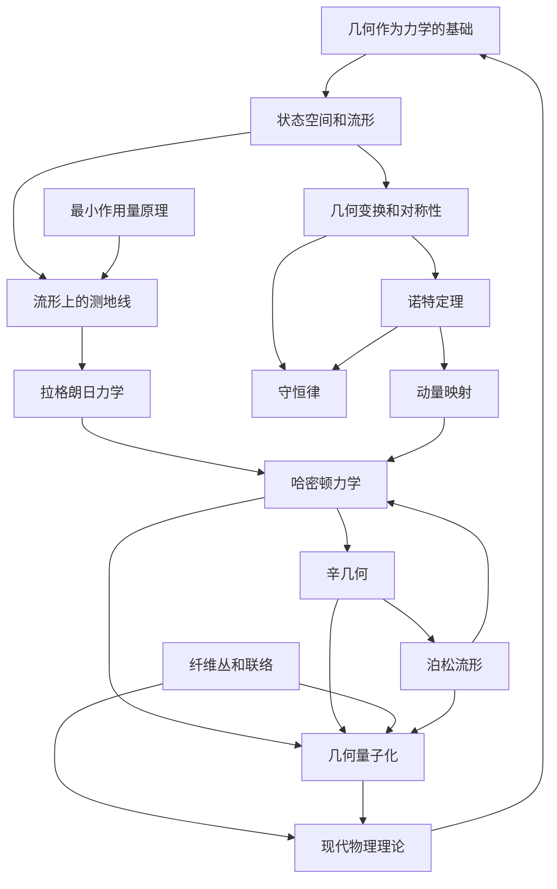

# 纯几何起源的经典力学：从状态演化到物理实在
* * *

--- 几何的织物编织出物理定律的锦缎。

# **1. 引言**

**题词**：
*"几何学是看似由人类创造的知识，但其意义完全独立于人类。"*
— 鲁道夫·斯坦纳

经典力学的研究，作为一门经受了几个世纪考验的学科，今天仍然像牛顿和拉格朗日时代一样基础。它构成了现代物理学的基石。然而，尽管其历史悠久且看似熟悉，我们对其理解中仍有一种不完整的感觉。问题不在于计算的机制或既定公式的应用，而在于经典力学真正代表的本质。**经典力学的内在性质是什么？我们能否将其原理提炼成更纯粹的形式，揭示物理实在结构的更深层次见解？**

## **1.1 探索经典力学的本质**

传统上，经典力学表现为一组在力的作用下支配物体运动的定律和方程。虽然这些定律——牛顿运动定律、哈密顿方程和欧拉-拉格朗日方程——提供了强大的预测工具，但它们往往掩盖了物理世界的潜在统一性和简洁性。多种表述方式可能会模糊不同机械系统及其治理定律之间的基本联系。

一个挑战在于概念的分隔：

- **牛顿力学** 专注于力和加速度，当处理多个粒子或非惯性参考系时，通常导致复杂的矢量方程。
  
- **拉格朗日力学** 强调能量差异，利用广义坐标简化问题，但有时缺乏直观的物理解释。
  
- **哈密顿力学** 引入相空间和辛结构，提供优雅的数学框架，但有时显得远离具体的物理概念。

这种碎片化促使我们进行更深入的探究：**是否存在一个更为根本的原则，所有这些表述都从中衍生而来？**

## **1.2 几何作为基础**

几何学，即对形状、空间及其性质的研究，长期以来一直是数学思想的基石。它提供了一种既普遍又深刻连接物理实在的语言。几何方法应用于物理学表明，自然法则实际上是物理过程发生的基础空间的几何性质的体现。

历史上，几何与物理学之间的互动带来了重大进展：

- **广义相对论**：爱因斯坦关于引力不是力而是时空曲率的革命性见解深刻重塑了我们对引力现象的理解。

- **规范理论**：将基本相互作用(电磁、弱和强相互作用)表述为纤维丛中的连接，揭示了物理定律的深层几何性质。

在此精神下，我们提出**经典力学本身可以完全从纯几何原则重建**。通过将机械系统视为在适当定义的空间内演化的几何对象，我们可以揭示运动定律的内在简洁性和统一性。

## **1.3 几何重构的动机**

这一几何重构的动机是多方面的：

1. **统一表述**：几何基础可以无缝整合牛顿、拉格朗日和哈密顿力学，揭示它们为同一底层结构的不同方面。

2. **对物理定律的更深入理解**：通过从几何原则推导物理定律，我们获得了一个更深刻的理解，为什么这些定律会采取这样的形式，而不仅仅是接受它们为经验观察。

3. **简化与优雅**：几何提供了通过对称性和不变性原则简化复杂问题的工具，导致更优雅的解决方案和推广。

4. **连接经典与现代物理学**：几何视角创建了通往高级理论(如量子力学和广义相对论)的自然路径，促进了对整个物理学的更连贯理解。

## **1.4 通过几何的设想之旅**

本文将踏上**从头开始重建经典力学**的旅程，以纯几何作为我们的指南。我们将深入探讨机械系统的内在性质，探索其演化如何完全由在适当定义的空间内的几何变换来描述。

- **第2章：基础几何概念**
  我们首先建立必要的数学结构。这包括将状态空间作为流形引入，微分几何的语言，以及对称性和变换的作用。

- **第3章：源自几何的动力学**
  在这里，我们探讨机械系统的运动如何被理解为这些几何空间中的测地线，最小作用量原理作为几何性质的自然结果被引入。

- **第4章：基于几何基础的拉格朗日力学**
  我们通过几何术语表达动能和势能来推导拉格朗日形式，通过在流形内应用变分原理得出欧拉-拉格朗日方程。

- **第5章：哈密顿力学与辛几何**
  通过引入辛结构实现向哈密顿力学的过渡。我们研究哈密顿方程如何自然地从相空间的辛几何中涌现。

- **第6章：守恒定律的几何解释**
  我们在几何背景下考察诺特定理，展示如何通过对称性通过微分几何和群论的语言引出守恒定律。

- **第7章：力学中的高级几何结构**
  本章扩展我们的几何框架，包括纤维丛、连接和泊松流形，提供处理更复杂系统的工具，并为场论奠定基础。

- **第8章：几何连接经典与量子力学**
  我们通过几何量子化探索从经典到量子力学的路径，突出所开发的结构如何扩展到现代物理理论。

- **第9章：结论**
  我们反思通过这一几何重构所获得的见解，考虑其对我们理解物理实在的影响及未来研究的潜在方向。

## **1.5 更深层次的意义**

从几何原则重构经典力学不仅仅是一个学术练习；它是揭示**数学与物理学之间深刻互连性**的努力。几何学，既是抽象的又内在地与空间和形式相连，提供了人类直觉与宇宙基本定律之间的独特桥梁。

通过这个视角来看待经典力学，我们旨在：

- **解密复杂概念**：以直观而严谨的方式呈现概念，使高级思想更容易接近。

- **促进跨学科思考**：鼓励数学严谨性与物理直觉的融合，开辟学科交叉处的创新途径。

- **激发新视角**：挑战传统方法，促使读者重新思考熟悉的概念，可能引导出新的发现。

## **1.6 致读者的邀请**

我们邀请您，有经验的教育工作者、研究人员或好奇的心灵，与我们一起踏上这段旅程。我们将一起**深入经典力学的几何核心**，揭开传统处理中可能隐藏的理解层次。

这一探索不仅是获取知识的机会，也是**参与我们感知和描述物理实在本质**的机会。这是重新审视基本原则、质疑假设并欣赏几何与物理学无缝交织所产生之优雅的机会。

让我们开始这项重新发现经典力学的事业，不是作为过去的遗迹，而是作为一个活着的、进化的框架，继续为我们周围的世界提供深刻的见解。

# **2. 基础几何概念**

**题词**：
*"在几何的领域中，每个点都讲述一个故事。"*
— 无名氏

对经典力学的深入理解需要掌握理论所建立的基础几何结构。几何学提供了描述机械系统状态和演化的语言和框架，这种描述既严谨又深刻。在本章中，我们通过引入状态空间、流形、坐标系以及几何变换固有的对称性等基本概念，为经典力学的几何重构奠定基础。通过深入探讨这些基础元素，我们装备了将物理现象解释为几何性质和变换表现的工具。

## **2.1 状态空间与流形**

在我们的几何方法的核心是**状态空间**的概念，这是一种表示机械系统所有可能状态的数学结构。这个空间不仅仅是一系列点的集合；它具有丰富的几何和拓扑结构，捕捉系统的物理属性的本质。

### **2.1.1 状态空间作为流形**

**流形** 是一种数学空间，在小尺度上类似于欧几里得空间，但可以具有更复杂的全局结构。形式上，$n$-维流形 $M$ 是一个拓扑空间，其中每一点都有一个邻域，该邻域同胚(拓扑等价)于 $\mathbb{R}^n$ 的开子集。

机械系统的状态空间被建模为流形，因为：

- **局部欧几里得结构**：在任何点(状态)附近，系统的运动可以用线性方程近似，类似于球面上的小区域看起来是平坦的。
  
- **全局复杂性**：整体结构可以容纳由系统的物理特性引起的复杂配置、约束和拓扑。

**示例**：考虑一个在平面内受约束的简单摆。其配置的状态空间是一个圆 $S^1$，这是一个一维流形，捕捉了所有可能的角度位置。

### **2.1.2 坐标系与图册**

为了进行计算并定量描述流形，我们通过**图册**的概念引入**坐标系**。

- **图册** $(U, \phi)$ 包括一个开子集 $U \subset M$ 和一个同胚映射 $\phi: U \rightarrow \mathbb{R}^n$，将 $U$ 中的点映射到 $\mathbb{R}^n$。
  
- **图册** 是覆盖整个流形 $M$ 的图表集合，确保每个点至少包含在一个图表中。

**坐标系的目的**：

- **局部化**：坐标允许我们局部描述流形，便于涉及导数和积分的计算。

- **转换函数**：在图表重叠的地方，**转换函数** $\phi_{\alpha\beta}$ 将一个图表中的坐标与另一个图表中的坐标关联起来，确保流形上的连续性。

**力学中的重要性**：

- **广义坐标**：在经典力学中，广义坐标 $q^i$ 用于指定系统的配置。这些坐标作为流形上的坐标函数。

- **自由度**：流形的维度对应于系统的自由度数量。

**示例**：对于在三维空间中不受约束运动的粒子，流形是 $\mathbb{R}^3$，标准笛卡尔坐标 $(x, y, z)$ 作为一个全局坐标系。

### **2.1.3 光滑结构与可微性**

为了分析运动并定义速度和加速度等概念，流形必须具备额外的结构：

- **光滑流形** 是配备有图表图册的流形，其转换函数是无限次可微的 ($C^\infty$)。

- **可微函数**：在保持光滑结构的情况下，流形之间的函数称为可微函数，如果它们将光滑函数拉回到光滑函数。

**切空间**：

- 在每一点 $p \in M$，**切空间** $T_p M$ 由所有 $p$ 处的切向量组成，提供 $p$ 附近的流形线性近似。

- **向量场**：为每个点分配一个切向量形成一个向量场，例如表示运动粒子的速度场。

**力学中的重要性**：

- **轨迹**：系统的演化路径表示为一条平滑曲线 $\gamma(t): I \rightarrow M$，其中 $I$ 是 $\mathbb{R}$ 中的一个区间。

- **速度和加速度**：$\gamma(t)$ 的时间导数是切空间 $T_{\gamma(t)} M$ 的元素，提供描述运动所需的量。

### **2.1.4 状态空间的示例**

1. **刚体旋转**：

   - **配置流形**：旋转矩阵群 $SO(3)$ 表示三维空间中刚体的所有可能取向。

   - **流形结构**：$SO(3)$ 是一个光滑、紧致的三维流形(李群)，捕捉旋转自由度。

2. **双摆**：

   - **配置流形**：两个圆的乘积 $S^1 \times S^1$ 表示两个摆臂的角度位置。

   - **流形结构**：一个二维环面，反映了角度的周期性和组合可能性。

3. **相空间**：

   - 对于同时考虑位置和动量的系统，**相空间** 扩展配置流形以包括动量坐标，形成 **余切丛** $T^*M$。

   - 这个空间在哈密顿力学中至关重要，并将在后续章节中进一步探讨。

### **2.1.5 物理状态的重要性**

状态空间的流形结构确保了：

- **连续性和光滑性**：物理状态随时间平滑变化，反映了物理过程的连续性。

- **全局与局部性质**：虽然局部性质决定了即时行为，但流形的全局拓扑对系统的演化有重大影响(例如，封闭轨道的可能性或导致守恒量的拓扑约束)。

- **数学严谨性**：提供严格的数学框架，允许精确的定义和证明，这对于高级理论发展至关重要。

## **2.2 几何变换与对称性**

对称性在物理学中起着关键作用，提供了关于守恒定律和基本相互作用的见解。在几何学中，保持某些结构不变的变换导致流形的对称性，当应用于机械系统的状态空间时，这些对称性转化为物理不变性。

### **2.2.1 微分同胚**

**微分同胚** 是一个光滑、可逆映射 $f: M \rightarrow M$，使得 $f$ 和 $f^{-1}$ 都是无限次可微的。微分同胚作为流形的光滑自同构，重塑流形而不撕裂或粘连。

**性质**：

- **结构保持**：微分同胚保持流形的可微结构。

- **坐标变换**：从一个坐标系转换到另一个坐标系由微分同胚实现。

**力学中的角色**：

- **改变视角**：微分同胚允许我们从不同的坐标视角检查系统，这可以简化问题或揭示隐藏的对称性。

- **描述等价性**：如果物理定律在这种变换下不变，则由微分同胚相关联的两种描述被认为是物理等价的。

### **2.2.2 群作用与对称群**

群 $G$ 在流形 $M$ 上的**群作用** 是一个光滑映射 $\Phi: G \times M \rightarrow M$，满足以下条件：

1. **单位元**：对于所有 $p \in M$，有 $\Phi(e, p) = p$，其中 $e$ 是 $G$ 的单位元。

2. **兼容性**：对于所有 $g_1, g_2 \in G$ 和 $p \in M$，有 $\Phi(g_1 g_2, p) = \Phi(g_1, \Phi(g_2, p))$。

**力学中的对称群**：

- **定义**：机械系统的对称群是一个群 $G$，其作用使系统的拉格朗日量(或哈密顿量)不变。

- **示例**：

  - **平移对称性**：群 $\mathbb{R}^n$ 通过平移作用于 $\mathbb{R}^n$，对应于线性动量守恒。

  - **旋转对称性**：群 $SO(3)$ 通过旋转作用于 $\mathbb{R}^3$，对应于角动量守恒。

### **2.2.3 不变性和物理定律**

对称性的存在导致物理定律的不变性：

- **诺特定理**：作用泛函的连续对称性意味着存在守恒量。这一深刻结果将几何对称性与物理中的守恒定律联系起来。

- **拉格朗日量的不变性**：如果拉格朗日量 $L$ 在对称群 $G$ 的作用下保持不变，则运动方程表现出相应的守恒性质。

**数学表示**：

- **无穷小生成元**：与李群 $G$ 相关的李代数由生成无穷小变换的向量场组成。

- **辛变换**：在哈密顿力学中，保持辛结构的正则变换与守恒量相关联。

### **2.2.4 几何对称性的示例**

1. **时间平移对称性**：

   - **变换**：$t \rightarrow t + \delta t$

   - **不变性**：如果拉格朗日量不显式依赖于时间 ($\partial L / \partial t = 0$)，系统在时间平移下是不变的。

   - **守恒定律**：能量守恒。

2. **空间旋转对称性**：

   - **变换**：$\mathbf{r} \rightarrow R \mathbf{r}$，其中 $R \in SO(3)$

   - **不变性**：对于具有旋转对称性的系统，拉格朗日量在旋转下是不变的。

   - **守恒定律**：角动量守恒。

3. **伽利略变换**(经典力学)：

   - **变换**：$\mathbf{r} \rightarrow \mathbf{r} + \mathbf{v} t$，$t \rightarrow t$

   - **不变性**：牛顿定律在伽利略变换下是不变的，反映了经典力学中的相对性原理。

### **2.2.5 微分同胚与物理等价性**

在广义相对论和高级力学的背景下，微分同胚扮演着更为深刻的角色：

- **广义协变性**：物理定律以一种在任意可微坐标变换(微分同胚)下不变的方式表述。

- **物理可观测量**：在微分同胚下不变的量被认为是物理上有意义的。

**对力学的影响**：

- **不变性表述**：以无坐标、几何不变的方式表达力学定律增强了它们的一般性和适用性。

- **将力理解为几何效应**：在某些高级理论中，我们感知到的力可以解释为流形结构引起的几何效应(例如，在广义相对论中的引力)。

### **2.2.6 对称性导致的简化**

利用对称性可以大大简化机械系统的分析：

- **减少自由度**：对称性可以用于减少变量的数量，将复杂问题转化为更易处理的问题。

- **守恒量**：识别守恒量有助于积分运动方程，并深入理解系统的性质。

- **规范形式**：通过适当的选择坐标和变换，可以将控制系统的方程转化为更易于求解的规范形式。

### **2.2.7 力学中的群论**

**李群与李代数**：

- **李群**：既是连续群又是可微流形，使得可以应用微积分。

- **李代数**：李群单位元处的切空间，配备有括号运算，捕捉群的无穷小结构。

**在力学中的应用**：

- **对称性分析**：李群方法是分析对称性和求解力学中出现的微分方程的强大工具。

- **表示理论**：研究群在向量空间上的作用提供了关于系统可能状态和转变的见解。

### **2.2.8 结论与展望**

理解状态空间流形的几何变换和对称性对于以下方面至关重要：

- **预测物理行为**：对称性告诉我们关于守恒定律和不变性质的信息，这些对于预测系统如何演化至关重要。

- **统一原理**：认识到各种物理现象可以归因于底层的几何对称性，强化了物理定律的统一性。

- **推进理论发展**：这些概念为更高级的主题奠定了基础，如哈密顿力学、辛几何和几何量子化，我们将在后续章节中探讨这些主题。

## **2.3 结论**

通过建立状态空间、流形、坐标系和对称性的几何概念的坚实基础，我们现在可以更深入地探讨动力学的几何表述。在下一章中，我们将探索机械系统的运动如何自然地源于这些空间的几何性质，进一步阐明几何与物理实在之间的深刻联系。

# **3. 几何中产生的动力学**

**题词**：
*"阻力最小的路径铭刻在空间的曲线之中。"*
— 无名氏

在我们建立的几何框架中，机械系统的动力学作为流形内在性质的自然结果而出现。我们不再将力和加速度视为首要概念，而是将运动解释为几何的体现。系统的演化对应于其状态空间流形上的路径，而控制这种演化的定律源于该空间的几何特性。在本章中，我们将探讨如何用测地线——曲面上直线的推广——表示物理系统的自然轨迹。通过将最小作用量原理引入为一个几何概念，我们将几何中的最短路径与力学中观察到的运动联系起来。然后，我们在这一几何背景下运用变分微积分推导出运动的基本方程，揭示了几何与物理之间的深刻相互作用。

## **3.1 测地线与最小作用量原理**

测地线的概念是微分几何的核心，并在我们对力学的几何解释中扮演着关键角色。测地线可以被认为是流形上两点之间“最直”或“最短”的路径，推广了欧几里得空间中直线的概念。在力学领域，我们提出系统的自然运动对应于其状态空间流形上的测地线。这一观点本质上包含了最小作用量原理(PLA)，将其表述为关于系统偏好的路径的几何断言。

### **3.1.1 流形上的测地线**

一个 **测地线** 是流形 $M$ 上的一条曲线 $\gamma(t)$，它满足特定的变分性质——它极化某个泛函，通常是路径的长度或能量。对于配备度量张量 $g$ 的黎曼流形，曲线 $\gamma: [a, b] \rightarrow M$ 的长度由下式给出：
$$
L[\gamma] = \int_a^b \sqrt{g_{ij}(\gamma(t)) \frac{d\gamma^i}{dt} \frac{d\gamma^j}{dt}} \, dt,
$$
其中 $\gamma^i(t)$ 是曲线的坐标表示，$g_{ij}$ 定义了流形的几何结构。

测地线满足 **测地线方程**：
$$
\frac{d^2 \gamma^k}{dt^2} + \Gamma^k_{ij} \frac{d\gamma^i}{dt} \frac{d\gamma^j}{dt} = 0,
$$
其中 $\Gamma^k_{ij}$ 是从度量导出的克里斯托费尔符号。此方程表达了曲线 $\gamma(t)$ 如何演变，以保持平行传输意义上的恒定速度向量，反映了流形的曲率。

### **3.1.2 最小作用量原理作为一个几何概念**

**最小作用量原理 (PLA)** 断言，在两个状态之间的机械系统轨迹使得作用量泛函 $S$ 极化：
$$
S[\gamma] = \int_{t_1}^{t_2} L(q, \dot{q}, t) \, dt,
$$
其中 $L$ 是系统的拉格朗日量，$q$ 是广义坐标，$\dot{q}$ 是它们的时间导数。

在我们的几何框架中，我们重新解释这个原理：

- **几何作用量泛函**：作用量 $S[\gamma]$ 成为与流形上路径 $\gamma$ 相关的几何量。

- **测地线路径作为自然轨迹**：极化 $S$ 的路径是测地线，使 PLA 成为关于流形几何的陈述。

这将 PLA 与定义测地线的变分性质联系起来，表明系统的自然运动本质上是几何的。

### **3.1.4 引力运动作为测地线**

在广义相对论中，粒子沿着弯曲时空中的测地线运动：

- **时空流形**：四维流形具有洛伦兹度量 $g_{\mu\nu}$。

- **测地线方程**：
  $$
  \frac{d^2 x^\mu}{d \tau^2} + \Gamma^\mu_{\alpha\beta} \frac{d x^\alpha}{d \tau} \frac{d x^\beta}{d \tau} = 0,
  $$
  其中 $\tau$ 是固有时。

- **解释**：引力不是一种力，而是时空曲率的体现，测地线代表自然的自由落体轨迹。

这说明了几何与动力学之间的深刻联系，强化了可以从几何原理推导出力学的观点。

### **3.1.5 几何视角的影响**

- **统一描述**：通过将所有力和运动框定为几何效应，我们实现了力学的统一描述。

- **内在性质**：动力学仅依赖于流形的内在几何，而不是外部或任意构造。

- **预测能力**：从流形几何导出的测地线方程可以在不引用传统力定律的情况下预测系统的行为。

## **3.2 几何中的变分微积分**

为了形式化测地线与运动方程之间的联系，我们在几何背景下运用变分微积分。变分微积分允许我们通过考虑路径的无穷小变化来找到极化泛函(如作用量)的路径。

### **3.2.1 几何术语中的变分原理**

给定一个流形 $M$，我们考虑一族由 $\varepsilon$ 参数化的曲线 $\gamma_\varepsilon(t)$，使得 $\gamma_0(t)$ 是感兴趣的曲线。作用量泛函 $S$ 取决于 $\gamma$：
$$
S[\gamma] = \int_{t_1}^{t_2} L(q, \dot{q}, t) \, dt.
$$
变分 $\delta S$ 由 $S$ 随曲线 $\gamma$ 的变化决定：
$$
\delta S = \left. \frac{d}{d\varepsilon} S[\gamma_\varepsilon] \right|_{\varepsilon=0}.
$$
**最小作用量原理** 断言，对于系统的实际路径，$\delta S = 0$。

### **3.2.2 应用于测地线**

对于测地线，拉格朗日量 $L$ 由度量导出：
$$
L = \tfrac{1}{2} g_{ij}(q) \dot{q}^i \dot{q}^j.
$$
应用变分原理：

1. **使用变分 $\delta q^i$ 计算 $\delta S$**：
   $$
   \delta S = \int_{t_1}^{t_2} \left( \frac{\partial L}{\partial q^i} \delta q^i + \frac{\partial L}{\partial \dot{q}^i} \delta \dot{q}^i \right) dt.
   $$

2. **分部积分**：
   $$
   \delta S = \int_{t_1}^{t_2} \left( \frac{\partial L}{\partial q^i} - \frac{d}{dt} \frac{\partial L}{\partial \dot{q}^i} \right) \delta q^i dt + \left[ \frac{\partial L}{\partial \dot{q}^i} \delta q^i \right]_{t_1}^{t_2}.
   $$
   如果 $\delta q^i(t_1) = \delta q^i(t_2) = 0$，边界项消失。

3. **推导欧拉-拉格朗日方程**：

   对于任意 $\delta q^i$，设置 $\delta S = 0$ 导致：
   $$
   \frac{d}{dt} \frac{\partial L}{\partial \dot{q}^i} - \frac{\partial L}{\partial q^i} = 0.
   $$

### **3.2.3 欧拉-拉格朗日方程的几何解释**

在这个框架内：

- **与测地线方程的联系**：由度量导出的拉格朗日量的欧拉-拉格朗日方程等价于测地线方程。

- **内在动力学**：运动方程是流形的内在属性，独立于坐标选择。

- **变分起源**：运动源自极值原理，强调路径的自然性。

### **3.2.4 包含势能**

当存在势能 $V(q)$ 时，拉格朗日量变为：
$$
L = \tfrac{1}{2} g_{ij} \dot{q}^i \dot{q}^j - V(q).
$$
欧拉-拉格朗日方程现在包括由势能导出的力：
$$
\frac{d}{dt} \left( g_{ij} \dot{q}^j \right) - \tfrac{1}{2} \frac{\partial g_{jk}}{\partial q^i} \dot{q}^j \dot{q}^k + \frac{\partial V}{\partial q^i} = 0.
$$

**解释**：

- **修改的测地线**：势能改变了测地线，根据 $V(q)$ 曲率路径。

- **几何编码力**：力被解释为由流形的几何和势能景观引起的。

### **3.2.5 约束与拉格朗日乘子**

对于有约束的系统：

- **约束方程**：$f_a(q) = 0$。

- **扩展的拉格朗日量**：
  $$
  L' = L - \lambda^a f_a(q),
  $$
  其中 $\lambda^a$ 是拉格朗日乘子。

- **带约束的欧拉-拉格朗日方程**：
  $$
  \frac{d}{dt} \frac{\partial L'}{\partial \dot{q}^i} - \frac{\partial L'}{\partial q^i} = 0.
  $$

- **几何解释**：约束将运动限制在子流形上，而乘子在变分框架内强制这些条件。

### **3.2.6 几何变分方法的优势**

- **无坐标表述**：几何方法的内在性质消除了对特定坐标系的依赖。

- **系统的统一处理**：无论是保守系统还是非保守系统，无论是否有约束，都在同一框架内处理。

- **为进一步理论奠定基础**：这种方法为哈密顿力学和场论等高级主题奠定了基础，在这些领域中几何仍然占据核心地位。

### **3.2.7 示例**

**1. 谐振子**：

- **拉格朗日量**：
  $$
  L = \tfrac{1}{2} m (\dot{x})^2 - \tfrac{1}{2} k x^2.
  $$

- **欧拉-拉格朗日方程**：
  $$
  m \ddot{x} + k x = 0.
  $$

- **几何视角**：振子的运动沿着由势能 $V(x) = \tfrac{1}{2} k x^2$ 修改的测地线，相应地曲率了流形。

**2. 中心势场中的粒子**：

- **球坐标下的拉格朗日量**：
  $$
  L = \tfrac{1}{2} m \left( \dot{r}^2 + r^2 \dot{\theta}^2 + r^2 \sin^2\theta \, \dot{\phi}^2 \right) - V(r).
  $$

- **由对称性导出的守恒定律**：旋转对称性导致角动量守恒，这从几何上表现为旋转不变性。

## **3.3 结论与影响**

通过以几何视角解读动力学，我们揭示了对运动的更深层次理解：

- **运动作为测地流**：系统自然沿着由流形几何决定的测地线演化，统一了不同背景下的运动概念。

- **力作为几何效应**：我们感知到的力是流形曲率和结构的表现，将动力学与几何内在地结合在一起。

- **统一框架**：这种方法提供了一个一致且优雅的框架来推导运动方程，适用于广泛的机械系统。

- **为进一步理论奠定基础**：所获得的见解为探索哈密顿力学、辛几何甚至量子力学铺平了道路，在这些领域中几何继续发挥着关键作用。

随着我们进入下一章，我们将在此几何基础上进一步发展**拉格朗日力学**。通过将拉格朗日量定义为一个几何对象并重新审视欧拉-拉格朗日方程，我们将更深入地阐明几何如何封装动力学的本质。

# **4. 从几何基础出发的拉格朗日力学**

**题词**：
*"动力学是运动中的几何之诗。"*
— 无名氏

既然我们已经确立了机械系统的运动可以理解为流形上的测地线，自然地由状态空间的几何性质产生，我们现在将注意力转向在 **拉格朗日力学** 的框架内形式化这一理解。在本章中，我们的目标是将 **拉格朗日函数** 定义为一个几何对象，明确地将动能和势能与几何构造联系起来。然后我们将重新审视 **欧拉-拉格朗日方程**，通过应用于流形的变分原理的几何推理来推导它们。这种方法不仅确认了经典力学的结果，还通过揭示动力学的内在几何本质深化了我们的理解。

## **4.1 拉格朗日函数作为几何对象**

**拉格朗日函数** $L$ 是经典力学表述的核心，作为一个标量函数，其极值化产生了运动方程。传统上定义为动能和势能之差，$L = T - V$，我们现在努力以几何术语解释 $T$ 和 $V$，从而将拉格朗日函数本身渲染为一个几何实体。

### **4.1.1 动能的几何解释**

在表示机械系统构型空间的流形 $M$ 上，动能 $T$ 自然地源于 $M$ 的几何结构。

#### **4.1.1.1 度量张量与动能**

一个 **黎曼流形** $(M, g)$ 是配备有 **度量张量** $g$ 的光滑流形，$g$ 是对称、正定的 (0,2)-张量场，它在每一点 $q \in M$ 上的切空间 $T_q M$ 上定义了一个内积。度量张量允许我们在流形上测量长度和角度。

沿着 $M$ 上路径 $\gamma(t)$ 运动的系统的动能 $T$ 由下式给出：
$$
T = \tfrac{1}{2} g_{ij}(q) \dot{q}^i \dot{q}^j,
$$
其中：

- $g_{ij}(q)$ 是局部坐标 $\{ q^i \}$ 下的度量张量分量，
- $\dot{q}^i = \frac{dq^i}{dt}$ 是这些坐标下的速度向量分量。

这个动能表达式本质上是几何的，因为它直接涉及封装了流形几何性质的度量张量。

#### **4.1.1.2 物理解释**

度量张量 $g_{ij}$ 可以看作是具有广义坐标和约束的系统的质量矩阵的推广。它考虑了质量和构型空间几何的分布，影响动能如何依赖于速度 $\dot{q}^i$。

**例子**：对于在三维欧几里得空间中运动的质量为 $m$ 的粒子，度量张量简单地为 $g_{ij} = m \delta_{ij}$，导致熟悉的表达式 $T = \tfrac{1}{2} m (\dot{x}^2 + \dot{y}^2 + \dot{z}^2)$。

### **4.1.2 势能的几何解释**

虽然动能与流形上速度的几何有关，势能 $V$ 则与定义在流形上的标量场相关。

#### **4.1.2.1 势能作为标量场**

势能函数 $V: M \rightarrow \mathbb{R}$ 为每个点 $q \in M$ 分配一个实数，表示该构型的势能。这个标量场封装了系统内部由势产生的力。

#### **4.1.2.2 几何意义**

在几何框架中，势能通过引入一个标量场修改流形，该标量场影响动力学而不改变由 $g$ 定义的基本几何结构。它可以被视为重力场中的“高度”或流形上势能景观的变化。

**例子**：对于地球表面附近的重力场中的粒子，$V(q) = m g h(q)$，其中 $h(q)$ 是流形上的高度函数。

### **4.1.3 拉格朗日函数作为几何标量**

结合动能和势能的几何表达式，拉格朗日函数 $L: TM \rightarrow \mathbb{R}$ 定义在流形 $M$ 的切丛 $TM$ 上：
$$
L(q, \dot{q}, t) = T(q, \dot{q}) - V(q, t) = \tfrac{1}{2} g_{ij}(q) \dot{q}^i \dot{q}^j - V(q, t).
$$
这里，$L$ 依赖于位置 $q$，速度 $\dot{q}$，以及如果势能随时间变化的话，可能还依赖于时间 $t$。

#### **4.1.3.1 拉格朗日函数的性质**

- **标量函数**：$L$ 在坐标变换下是标量，确保其值在 $M$ 上的坐标变化下不变。
- **流形的内在属性**：由于 $L$ 由几何量 $g$ 和 $V$ 构造，它封装了流形的内在属性和作用在系统上的力。
- **定义在切丛上**：$L$ 的定义域是切丛 $TM$，反映了它依赖于位置和速度。

### **4.1.4 几何术语中的拉格朗日函数示例**

#### **4.1.4.1 简单摆**

- **构型流形**：圆 $S^1$，由角度 $\theta$ 参数化。
- **度量张量**：$g_{\theta\theta} = m l^2$，其中 $l$ 是摆长。
- **动能**：$T = \tfrac{1}{2} m l^2 \dot{\theta}^2$。
- **势能**：$V(\theta) = m g l (1 - \cos\theta)$。
- **拉格朗日函数**：

  $$
  L(\theta, \dot{\theta}) = \tfrac{1}{2} m l^2 \dot{\theta}^2 - m g l (1 - \cos\theta).
  $$

#### **4.1.4.2 刚体旋转**

- **构型流形**：旋转群 $SO(3)$。
- **度量张量**：通过惯性张量 $I_{ij}$ 定义。
- **动能**：
  $$
  T = \tfrac{1}{2} I_{ij} \omega^i \omega^j,
  $$
  其中 $\omega^i$ 是体固定坐标系中的角速度分量。
- **势能**：取决于外部场，例如非均匀质量分布的重力势。
- **拉格朗日函数**：
  $$
  L(R, \dot{R}) = T(R, \dot{R}) - V(R),
  $$
  其中 $R \in SO(3)$ 表示旋转矩阵。

### **4.1.5 拉格朗日函数在动力学中的作用**

拉格朗日函数作为连接几何和动力学的桥梁：

- **封装动力学**：$L$ 包含描述系统运动所需的所有信息，通过几何量 $g_{ij}$ 和 $V(q)$。
- **变分原理**：作用积分 $S[\gamma] = \int L \, dt$ 是一个泛函，其极值化通过最小作用量原理产生运动方程。
- **无坐标解释**：因为 $L$ 由几何不变量构造，所得的动力学独立于所选的具体坐标系。

### **4.1.6 几何定义的优势**

- **统一框架**：提供了一种一致的方法，在单一几何框架内推导各种系统的拉格朗日函数。
- **约束的清晰处理**：约束可以自然地纳入 $M$ 的几何中，影响 $g$ 并简化分析。
- **便于对称性分析**：几何结构使对称性更加明显，有助于通过诺特定理识别守恒定律。

## **4.2 重新审视欧拉-拉格朗日方程**

在建立了拉格朗日函数作为几何对象之后，我们现在使用几何推理重新推导 **欧拉-拉格朗日方程**。这种推导不仅强化了几何与动力学之间的联系，还突出了运动方程的内在性质。

### **4.2.1 流形上的变分原理**

考虑表示机械系统构型空间的光滑流形 $M$。设 $\gamma: [t_1, t_2] \rightarrow M$ 是 $M$ 上的一条光滑曲线，表示系统在时间 $t_1$ 到 $t_2$ 之间的路径。

**作用泛函** 定义为：
$$
S[\gamma] = \int_{t_1}^{t_2} L(q(t), \dot{q}(t), t) \, dt,
$$
其中 $L: TM \times \mathbb{R} \rightarrow \mathbb{R}$ 是拉格朗日函数。

**最小作用量原理** 断言，系统的实际路径 $\gamma$ 使得 $S[\gamma]$ 在端点处消失的变分 $\delta \gamma$ 下保持稳定。

### **4.2.2 欧拉-拉格朗日方程的推导**

为了推导运动方程，我们考虑一族曲线 $\gamma_\varepsilon(t)$，其中 $\gamma_0(t) = \gamma(t)$ 是实际路径，而 $\varepsilon$ 是一个实参数。

#### **4.2.2.1 计算作用量的变化**

作用量的变化为：
$$
\delta S = \left. \frac{d}{d\varepsilon} S[\gamma_\varepsilon] \right|_{\varepsilon=0} = \int_{t_1}^{t_2} \left( \frac{\partial L}{\partial q^i} \delta q^i + \frac{\partial L}{\partial \dot{q}^i} \delta \dot{q}^i \right) dt,
$$
其中 $\delta q^i = \left. \frac{d}{d\varepsilon} q^i_\varepsilon \right|_{\varepsilon=0}$ 是坐标的变分。

#### **4.2.2.2 分部积分**

我们对涉及 $\delta \dot{q}^i$ 的项进行分部积分：
$$
\int_{t_1}^{t_2} \frac{\partial L}{\partial \dot{q}^i} \delta \dot{q}^i dt = \left[ \frac{\partial L}{\partial \dot{q}^i} \delta q^i \right]_{t_1}^{t_2} - \int_{t_1}^{t_2} \frac{d}{dt} \left( \frac{\partial L}{\partial \dot{q}^i} \right) \delta q^i dt.
$$
由于 $\delta q^i(t_1) = \delta q^i(t_2) = 0$，边界项消失。

#### **4.2.2.3 稳定性条件**

对于任意 $\delta q^i$ 设 $\delta S = 0$ 导致：
$$
\int_{t_1}^{t_2} \left( \frac{\partial L}{\partial q^i} - \frac{d}{dt} \left( \frac{\partial L}{\partial \dot{q}^i} \right) \right) \delta q^i dt = 0.
$$
为了使这个积分对所有 $\delta q^i$ 都为零，被积函数必须为零：
$$
\frac{d}{dt} \left( \frac{\partial L}{\partial \dot{q}^i} \right) - \frac{\partial L}{\partial q^i} = 0.
$$
这些是 **欧拉-拉格朗日方程**，是系统运动的基本方程。

### **4.2.3 几何解释**

#### **4.2.3.1 协变导数与几何**

在几何背景下，欧拉-拉格朗日方程可以使用流形 $M$ 上的协变导数来解释：

- 项 $\frac{d}{dt} \left( \frac{\partial L}{\partial \dot{q}^i} \right)$ 涉及加速度，它可以与沿着曲线 $\gamma(t)$ 的速度向量的协变导数相关。
- 偏导数 $\frac{\partial L}{\partial q^i}$ 涉及拉格朗日函数关于坐标的梯度，反映了 $M$ 的几何和势能 $V(q)$ 对运动的影响。

#### **4.2.3.2 内蕴运动方程**

通过用几何量表示方程，我们得到独立于坐标选择的内蕴运动方程：
$$
\nabla_{\dot{\gamma}} \left( \frac{\partial L}{\partial \dot{\gamma}} \right) - \frac{\partial L}{\partial \gamma} = 0,
$$
其中 $\nabla_{\dot{\gamma}}$ 表示沿着曲线 $\gamma$ 的协变导数。

#### **4.2.3.3 与测地线的关系**

当拉格朗日函数仅包含动能时，$L = \tfrac{1}{2} g_{ij} \dot{q}^i \dot{q}^j$，欧拉-拉格朗日方程简化为流形 $M$ 上的测地线方程：
$$
\ddot{q}^k + \Gamma^k_{ij} \dot{q}^i \dot{q}^j = 0,
$$
其中 $\Gamma^k_{ij}$ 是与度量 $g_{ij}$ 相关的克里斯托费尔符号。

当存在势能时，方程变为：
$$
\ddot{q}^k + \Gamma^k_{ij} \dot{q}^i \dot{q}^j = g^{kl} \frac{\partial V}{\partial q^l},
$$
说明势能如何修改测地线路径，有效地“弯曲”流形，这种弯曲由 $V$ 决定。

### **4.2.4 示例与应用**

#### **4.2.4.1 势场中的粒子**

对于质量为 $m$ 的粒子在势 $V(q)$ 下运动：

- **拉格朗日函数**：
  $$
  L(q, \dot{q}) = \tfrac{1}{2} m g_{ij} \dot{q}^i \dot{q}^j - V(q).
  $$

- **欧拉-拉格朗日方程**：
  $$
  m \left( \ddot{q}^k + \Gamma^k_{ij} \dot{q}^i \dot{q}^j \right) = -\frac{\partial V}{\partial q^k}.
  $$

该方程优雅地结合了几何效应(通过 $\Gamma^k_{ij}$)和势能的影响。

#### **4.2.4.2 具有约束的机械系统**

对于具有完整约束的系统，构型空间是子流形 $N \subset M$：

- 拉格朗日函数仍然定义在 $N$ 上，变分原理应用于限制在 $N$ 中的曲线 $\gamma(t)$。
- 欧拉-拉格朗日方程自然地通过流形的几何纳入约束。

### **4.2.5 几何方法的优势**

#### **4.2.5.1 坐标无关性**

通过几何方式表述欧拉-拉格朗日方程，我们确保运动方程在坐标变换下不变，反映了物理实在即动力学不应依赖于任意的坐标选择。

#### **4.2.5.2 力与几何的统一处理**

几何推导无缝整合了力(通过势能)和几何效应(通过流形的曲率)，提供了动力学的整体视图。

#### **4.2.5.3 便于对称性分析**

几何推理突显了流形中固有的对称性。如果拉格朗日函数在连续变换群下不变，诺特定理可以直接在此框架内应用以识别守恒量。

### **4.2.6 与哈密顿力学的联系**

欧拉-拉格朗日方程的几何表述为过渡到哈密顿力学奠定了基础：

- 勒让德变换，将从速度 $\dot{q}^i$ 转换到动量 $p_i = \frac{\partial L}{\partial \dot{q}^i}$，在余切丛 $T^*M$ 的几何背景下自然理解。
- 哈密顿函数 $H(q, p)$ 作为另一个几何对象出现，导致哈密顿方程，这将在下一章中探讨。

## **4.3 总结与影响**

通过将拉格朗日函数定义为几何对象并通过几何推理推导欧拉-拉格朗日方程，我们已经：

- 强化了几何与动力学之间的深刻联系，展示了运动定律如何自然地从流形的性质中涌现。
- 证明了动能和势能本质上是几何的，分别源于流形上的度量张量和标量场。
- 提供了一个坐标无关的力学表述，强调了几何方法的普遍性和优雅性。

这种几何视角不仅丰富了我们对经典力学的理解，还为高级主题奠定了坚实的基础：

- **哈密顿力学与辛几何**：这里介绍的几何结构平滑地过渡到相空间的辛几何，其中哈密顿动力学展开。
- **守恒律与对称性**：几何框架便于应用诺特定理，自然地将对称性与守恒量联系起来。
- **场论的推广**：将这些概念扩展到无限维流形，开启了经典场论的大门，并最终通向量子力学。

随着我们在下一章中深入探讨哈密顿力学和辛几何，我们将继续建立在这里奠定的几何基础上，进一步阐明由几何和物理定律编织的复杂织锦。

# **5. 哈密顿力学与辛几何**

**题词**：
*"在辛的海洋中，能量沿着无形的洋流流动。"*
— 无名氏

通过经典力学的几何之旅，我们自然而然地从基于构型空间和变分原理的拉格朗日表述过渡到哈密顿框架，后者展开于**辛几何**的丰富几何织锦之中。向哈密顿力学的转变不仅仅是变量或形式的变化；它代表了视角的深刻转变，揭示了支撑物理系统动力学的深层几何结构。

在本章中，我们将探索作为辛流形的**相空间**，深入研究使其成为哈密顿动力学自然环境的内在属性。我们将定义**辛结构**，阐明它们如何为哈密顿方程提供几何基础，并讨论**正则坐标**的作用。通过从辛几何推导哈密顿方程，我们强调了相空间中演化的几何本质，揭示了能量和运动如何在辛织锦中交织在一起。

## **5.1 辛流形与相空间**

哈密顿力学的核心概念是**相空间**，一个包含系统位置和动量的几何空间。与仅考虑位置(广义坐标)的构型空间不同，相空间提供了系统在任何给定时间的状态的完整描述。相空间的结构本质上是辛的，理解这种辛结构对于欣赏哈密顿动力学的几何性质至关重要。

### **5.1.1 作为辛流形的相空间**

一个**辛流形** $(M, \omega)$ 是一个配备有闭且非退化微分$2$-形式 $\omega$ 的光滑偶数维流形 $M$，称为**辛形式**。这个辛形式包含了描述哈密顿系统演化的必要几何结构。

**辛流形的定义**：

- **辛形式 $\omega$**：一个$2$-形式 $\omega \in \Omega^2(M)$，满足：
  - **闭性**：$d\omega = 0$。
  - **非退化性**：对于任意非零切向量 $v \in T_p M$，存在一个 $u \in T_p M$ 使得 $\omega(v, u) \neq 0$。

- **偶数维流形**：辛形式的非退化性意味着 $\dim(M) = 2n$ 对于某个整数 $n$，对应于物理系统的 $n$ 个自由度。

**物理解释**：

- 流形 $M$ 表示系统的**相空间**，其中点 $z = (q^i, p_i)$ 指定了广义坐标 $q^i$ 和其共轭动量 $p_i$。
  
- 辛形式 $\omega$ 编码了坐标和动量之间的基本泊松括号关系，反映了它们之间的内在耦合。

### **5.1.2 余切丛与自然辛结构**

对于构型流形 $Q$，相空间 $M = T^*Q$ 自然地被识别为 $Q$ 的**余切丛**：

- **余切丛 $T^*Q$**：所有余切空间 $T^*_q Q$ 在每个点 $q \in Q$ 上的并集，其中 $T^*_q Q$ 包含在切空间 $T_q Q$ 上的线性泛函。

- **正则坐标**：在 $T^*Q$ 上，可以使用局部坐标 $(q^i, p_i)$，其中 $p_i$ 是动量余向量在 $q$ 处的分量。

**正则辛形式**：

- 余切丛 $T^*Q$ 上的辛形式 $\omega$ 由下式给出：
  $$
  \omega = -d\theta,
  $$
  其中 $\theta$ 是**刘维尔$1$-形式**(也称为**正则$1$-形式**)：
  $$
  \theta = p_i \, dq^i.
  $$

- 在局部坐标中，辛形式变为：
  $$
  \omega = dq^i \wedge dp_i.
  $$

**性质**：

- **闭性**：由于 $\omega = -d\theta$ 且 $d^2 = 0$，因此 $d\omega = 0$。

- **非退化性**：$dq^i$ 和 $dp_i$ 之间的配对确保了 $\omega$ 的非退化性。

### **5.1.3 辛结构的重要性**

辛结构为哈密顿力学提供了必要的几何框架：

- **编码动力学**：辛形式 $\omega$ 定义了位置和动量变量如何交织，支配着系统的流。

- **坐标无关的表述**：辛结构允许独立于特定坐标选择的动力学描述。

- **泊松括号的基础**：辛形式支撑着泊松括号，这是哈密顿力学中的一个基本构造。

### **5.1.4 正则坐标与变换**

**正则坐标**：

- 坐标 $(q^i, p_i)$ 是**正则**的，如果它们满足：
  $$
  \{ q^i, q^j \} = 0, \quad \{ p_i, p_j \} = 0, \quad \{ q^i, p_j \} = \delta^i_j,
  $$
  其中 $\{ \cdot , \cdot \}$ 表示泊松括号。

- 这些关系反映了底层的辛结构，并确保了在保持 $\omega$ 的坐标变换下的运动方程的形式不变性。

**正则变换**：

- 一个光滑映射 $\phi: M \rightarrow M$ 是一个**正则变换**(或**辛同构**)，如果它保持辛形式：
  $$
  \phi^* \omega = \omega.
  $$

- 正则变换对应于保持哈密顿结构的相空间变量的变化。

### **5.1.5 辛流形的例子**

**例1：简谐振子**

- **相空间**：$\mathbb{R}^2$ 有坐标 $(q, p)$。

- **辛形式**：$\omega = dq \wedge dp$。

**例2：球面上的运动**

- **构型空间**：$S^2$，2-球面。

- **相空间**：$T^*S^2$，$S^2$ 的余切丛。

- **辛形式**：由 $T^*S^2$ 上的正则$1$-形式导出。

### **5.1.6 辛几何在哈密顿力学中的作用**

辛几何在哈密顿力学中不可或缺，因为它：

- **提供了动力学的语言**：哈密顿系统的演化自然地用辛几何描述。

- **揭示了不变量和守恒律**：辛结构通过诺特定理和守恒量的存在与守恒律密切相关。

- **便于量子化**：理解辛结构对于经典系统的几何量子化至关重要。

## **5.2 从辛结构导出哈密顿方程**

建立了辛流形和辛形式后，我们现在转向使用辛几何的语言推导**哈密顿方程**。这一推导强调了动力学的几何本质，表明哈密顿系统的演化由辛流形上的哈密顿向量场生成的流所支配。

### **5.2.1 哈密顿函数与向量场**

**哈密顿函数 $H$**：

- 一个光滑函数 $H: M \rightarrow \mathbb{R}$，表示系统的总能量。

**哈密顿向量场 $X_H$**：

- 每个哈密顿函数 $H$ 都有一个与其关联的向量场 $X_H$，定义为：
  $$
  \iota_{X_H} \omega = dH,
  $$
  其中 $\iota_{X_H} \omega$ 表示 $\omega$ 与 $X_H$ 的内积(收缩)。

- **解释**：哈密顿向量场 $X_H$ 生成的流支配系统在相空间中的时间演化。

### **5.2.2 哈密顿方程的推导**

**在局部坐标中**：

- 将 $\omega$ 和 $dH$ 写成正则坐标 $(q^i, p_i)$ 的形式：
  $$
  \omega = dq^i \wedge dp_i, \quad dH = \frac{\partial H}{\partial q^i} dq^i + \frac{\partial H}{\partial p_i} dp_i.
  $$

- 条件 $\iota_{X_H} \omega = dH$ 导致：
  $$
  \omega(X_H, \cdot) = dH.
  $$

**$X_H$ 的分量**：

- 设 $X_H = (\dot{q}^i, \dot{p}_i)$，则：
  $$
  \omega(X_H, \cdot) = dq^i \wedge dp_i (\dot{q}^j, \dot{p}_j, \cdot) = \dot{q}^i dp_i - \dot{p}_i dq^i.
  $$

- 与 $dH$ 等价，我们得到：
  $$
  \dot{q}^i = \frac{\partial H}{\partial p_i}, \quad \dot{p}_i = -\frac{\partial H}{\partial q^i}.
  $$

这些是直接从辛结构导出的**哈密顿方程**。

### **5.2.3 哈密顿方程的几何解释**

**辛流**：

- 哈密顿向量场 $X_H$ 生成了一个流 $\phi_t$ 在 $M$ 上，其中 $\phi_t: M \rightarrow M$ 满足：
  $$
  \frac{d}{dt} \phi_t(z) = X_H(\phi_t(z)), \quad \phi_0(z) = z.
  $$

- 流保持辛形式：
  $$
  \phi_t^* \omega = \omega,
  $$
  表明辛结构在哈密顿演化下不变。

**相空间轨迹**：

- 系统在相空间中的轨迹对应于 $X_H$ 的积分曲线。

- 辛结构确保了这些轨迹由初始条件和哈密顿函数唯一确定。

### **5.2.4 泊松括号与动力学**

**泊松括号**：

- 对于光滑函数 $f, g: M \rightarrow \mathbb{R}$，泊松括号定义为：
  $$
  \{ f, g \} = \omega(X_f, X_g),
  $$
  其中 $X_f$ 和 $X_g$ 是分别与 $f$ 和 $g$ 相关联的哈密顿向量场。

- 在正则坐标中：
  $$
  \{ f, g \} = \frac{\partial f}{\partial q^i} \frac{\partial g}{\partial p_i} - \frac{\partial f}{\partial p_i} \frac{\partial g}{\partial q^i}.
  $$

**可观测量的运动方程**：

- 任何可观测量 $f$ 的时间演化由下式给出：
  $$
  \frac{df}{dt} = \{ f, H \}.
  $$

- 这个表达式突显了泊松括号在确定可观测量动力学中的作用。

### **5.2.5 守恒律与对称性**

**哈密顿力学中的诺特定理**：

- 如果哈密顿函数 $H$ 在由函数 $F$ 生成的连续对称性下不变，则 $F$ 沿着流是守恒的：
  $$
  \frac{dF}{dt} = \{ F, H \} = 0.
  $$

- 辛结构通过检查 $H$ 中的对称性来促进守恒量的识别。

### **5.2.6 哈密顿系统的例子**

**例1：简谐振子**

- **哈密顿函数**：
  $$
  H(q, p) = \tfrac{1}{2} m^{-1} p^2 + \tfrac{1}{2} k q^2.
  $$

- **哈密顿方程**：
  $$
  \dot{q} = \frac{\partial H}{\partial p} = \frac{p}{m}, \quad \dot{p} = -\frac{\partial H}{\partial q} = -k q.
  $$

- **相空间轨迹**：系统在 $(q, p)$-空间中描绘出椭圆形路径，说明能量守恒。

**例2：磁场中的带电粒子**

- **哈密顿函数**：
  $$
  H(q, p) = \tfrac{1}{2} m^{-1} \left( p - e A(q) \right)^2,
  $$
  其中 $A(q)$ 是矢势。

- **辛结构的修改**：$A(q)$ 的存在修改了正则动量，导致非平凡的交换关系和更丰富的动力学行为。

### **5.2.7 哈密顿系统与可积性**

**可积系统**：

- 一个哈密顿系统是**可积的**，如果存在 $n$ 个函数独立且泊松对易的运动积分 $F_i$(运动常数)，其中 $n$ 是相空间维数的一半。

- 辛结构在研究可积系统时起着关键作用，允许使用作用-角度变量，并有助于哈密顿方程的积分。

**阿诺尔德-刘维尔定理**：

- 可积系统的相空间可以分解为不变环面，在这些环面上运动是拟周期的。

### **5.2.8 辛表述的优势**

**统一描述**：

- 辛结构为所有哈密顿系统提供了一个统一的几何框架，无论它们的具体形式如何。

**坐标无关性**：

- 该表述本质上是几何的，强调了与坐标选择无关的性质。

**高级理论的基础**：

- 辛几何为诸如以下高级主题奠定了基础：

  - **正则量子化**：以尊重辛结构的方式量化经典系统。
  - **几何力学**：使用几何方法研究机械系统，包括辛几何和泊松几何。

**对混沌与稳定性的洞察**：

- 辛方法促进了对动力学稳定性和混沌的分析，提供了研究扰动及其对系统演化影响的工具。

## **5.3 结论与影响**

通过辛几何的视角探索哈密顿力学，我们已经：

- **揭示了动力学的几何本质**：展示了哈密顿系统的演化由相空间的内在几何结构所支配。

- **强调了辛形式的作用**：展示了非退化的闭 $2$-形式 $\omega$ 如何编码坐标和动量之间的基本关系，直接导致哈密顿方程。

- **整合了对称性与守恒律**：突出显示了辛几何如何自然地包含对称性，促进了守恒量的识别，并提供了对运动不变量的更深层次理解。

- **为进一步探索做好准备**：建立了一个坚实的几何基础，可以在其上构建诸如几何量子化和现代物理理论等高级主题。

辛结构不仅丰富了我们对经典力学的理解，还作为桥梁连接到量子力学和其他几何扮演核心角色的物理领域。随着我们继续这一旅程，我们将深入探讨守恒律的几何解释，并探索更高级的几何结构，进一步解开几何与物理实在基本定律之间复杂的关系。

# **6. 守恒律的几何解释**

**题词**：
*"几何中的对称性低语着守恒的秘密。"*
— 匿名

对称性是物理学的核心，作为指导原则塑造了我们对支配宇宙的基本定律的理解。在我们所发展的几何框架中，对称性表现为保持表示机械系统状态空间流形内在结构的映射。这些对称性不仅仅是美学上的；它们具有深远的物理意义，通过**诺特定理**的强大机制直接导致了守恒律。

在本章中，我们将深入探讨守恒律的几何本质，阐述连续对称性如何在拉格朗日和哈密顿力学的背景下产生守恒量。我们探索**动量映射**和**对称群**的关键作用，使用李群和李代数的语言提供严格而富有洞见的论述。通过揭示几何、对称性和守恒之间的亲密联系，我们展示了贯穿经典力学织锦的潜在统一性。

## **6.1 几何表述中的诺特定理**

诺特定理是理论物理学的基石，优雅地将系统的对称性与其守恒律联系起来。其本质是断言每一个作用泛函的连续对称性对应于一个守恒量。为了充分欣赏这一深刻的结果，我们从几何角度接近它，将对称性解释为使作用不变的流形上的变换。

### **6.1.1 作用泛函中的对称性**

考虑由配置流形 $Q$ 上的拉格朗日函数 $L(q, \dot{q}, t)$ 描述的机械系统。作用泛函为：
$$
S[\gamma] = \int_{t_1}^{t_2} L(q(t), \dot{q}(t), t) \, dt,
$$
其中 $\gamma: [t_1, t_2] \rightarrow Q$ 是 $Q$ 上的一条路径。

**对称变换**是参数化为 $\epsilon$(群参数)的光滑映射 $\Phi_\epsilon: Q \rightarrow Q$，满足以下条件：

1. **可逆性**：对于每个 $\epsilon$，$\Phi_\epsilon$ 是一个微分同胚。
2. **零处为恒等**：$\Phi_0 = \text{id}_Q$，即恒等变换。
3. **群结构**：$\Phi_{\epsilon_1} \circ \Phi_{\epsilon_2} = \Phi_{\epsilon_1 + \epsilon_2}$。

作用的对称性满足：
$$
S[\Phi_\epsilon \circ \gamma] = S[\gamma].
$$
这种不变性意味着变换后的路径 $\Phi_\epsilon \circ \gamma$ 与原始路径 $\gamma$ 具有相同的作用。

### **6.1.2 无穷小变换与对称生成元**

研究连续对称性涉及检查 $\epsilon$ 取小值时对应的无穷小变换。对称性的无穷小生成元是 $Q$ 上的向量场 $X$，定义为：
$$
X(q) = \left. \frac{d}{d\epsilon} \Phi_\epsilon(q) \right|_{\epsilon=0}.
$$
这个向量场封装了对称变换在流形上移动点的无穷小方向。

**例子**：

- **时间平移**：对于时间不变系统，$\Phi_\epsilon(q(t)) = q(t + \epsilon)$，无穷小生成元对应于时间导数 $\frac{d}{dt}$。
- **旋转对称性**：对于旋转不变系统，$\Phi_\epsilon$ 表示无穷小旋转，$X$ 与角动量相关。

### **6.1.3 诺特定理的推导**

为了几何地推导诺特定理，我们考虑由于无穷小对称性变换引起的作用变化。

#### **6.1.3.1 作用的变化**

在 $\Phi_\epsilon$ 下作用的总变化为：
$$
\delta S = \left. \frac{d}{d\epsilon} S[\Phi_\epsilon \circ \gamma] \right|_{\epsilon=0}.
$$
使用链式法则和分部积分，我们可以用拉格朗日函数和无穷小生成元 $X$ 表达 $\delta S$。

#### **6.1.3.2 守恒律的出现**

对于使作用不变的变换 ($\delta S = 0$)，变化导出如下形式的表达式：
$$
\frac{d}{dt} \left( \frac{\partial L}{\partial \dot{q}^i} X^i \right) = \frac{\partial L}{\partial q^i} X^i + \frac{\partial L}{\partial \dot{q}^i} \frac{dX^i}{dt}.
$$
使用欧拉-拉格朗日方程，这简化为一个全时间导数，表明量：
$$
J = \frac{\partial L}{\partial \dot{q}^i} X^i,
$$
是守恒的：
$$
\frac{dJ}{dt} = 0.
$$
这个守恒量 $J$ 称为与 $X$ 生成的对称性相关的**诺特荷**。

### **6.1.4 几何解释**

在几何术语中：

- **对称性作为流**：向量场 $X$ 在 $Q$ 上生成表示连续对称性变换的流。
- **守恒量作为动量映射**：守恒量 $J$ 是从切丛 $TQ$(或在哈密顿力学中余切丛 $T^*Q$)到 $\mathbb{R}$ 的映射，反映了对称性与守恒律之间的相互作用。
- **余切提升**：在哈密顿力学中，对称性变换提升到相空间 $T^*Q$，保持辛结构并通过泊松括号导致守恒律。

### **6.1.5 诺特定理的例子**

#### **6.1.5.1 能量守恒**

- **对称性**：时间平移不变性 ($t \rightarrow t + \epsilon$)。
- **无穷小生成元**：$X = \frac{\partial}{\partial t}$。
- **守恒量**：哈密顿函数 $H = p_i \dot{q}^i - L$，表示总能量。

#### **6.1.5.2 线性动量守恒**

- **对称性**：空间平移不变性 ($q^i \rightarrow q^i + \epsilon \delta^{ij}$)。
- **无穷小生成元**：$X = \frac{\partial}{\partial q^i}$。
- **守恒量**：线性动量 $p_i$。

#### **6.1.5.3 角动量守恒**

- **对称性**：绕轴的旋转不变性。
- **无穷小生成元**：$X = \epsilon_{ijk} q^j \frac{\partial}{\partial q^k}$(旋转生成元)。
- **守恒量**：角动量 $L_i = \epsilon_{ijk} q^j p_k$。

### **6.1.6 配置空间中的解释**

几何方法强调守恒律不是偶然的，而是深深植根于流形的对称性：

- **内在属性**：守恒律源于流形的几何性质，独立于坐标选择。
- **辛流形**：在哈密顿力学中，守恒量对应于在哈密顿向量场生成的流下不变的辛流形上的函数。

### **6.1.7 诺特定理与李群**

考虑的对称性通常与李群有关，李群是具有可微流形结构的连续群。通过对称性与守恒量之间的联系，通过以下对应关系得到精确描述：

- **李群作用**：$Q$ 上的光滑群作用表示对称性。
- **李代数**：无穷小生成元 $X$ 在李括号(向量场的换位子)下形成李代数。
- **诺特荷**：守恒量对应于李代数的对偶，将对称性映射到守恒律。

## **6.2 动量映射与对称群**

为了加深我们对对称性与守恒量之间关系的理解，我们引入**动量映射**的概念，它作为桥梁连接系统的对称性与其守恒量，在几何和代数框架中起作用。

### **6.2.1 李群与辛流形**

设 $G$ 是一个李群，平滑作用于辛流形 $(M, \omega)$：

- **群作用**：$\Phi: G \times M \rightarrow M$，使得 $\Phi(g_1 g_2, z) = \Phi(g_1, \Phi(g_2, z))$ 对所有 $g_1, g_2 \in G$，$z \in M$ 成立。
- **辛作用**：如果 $\Phi_g^* \omega = \omega$ 对所有 $g \in G$ 成立，则该作用是**辛的**，意味着群作用保持辛形式。

### **6.2.2 动量映射的定义**

**动量映射** $J: M \rightarrow \mathfrak{g}^*$ 是从辛流形 $M$ 到李代数 $\mathfrak{g}$ 的对偶 $\mathfrak{g}^*$ 的映射，满足以下条件：

1. **等变关系**：
   $$
   \langle J(z), \xi \rangle = f_\xi(z),
   $$
   其中 $\langle \cdot , \cdot \rangle$ 表示 $\mathfrak{g}^*$ 和 $\mathfrak{g}$ 之间的配对，$f_\xi$ 是与无穷小生成元 $\xi \in \mathfrak{g}$ 相关的哈密顿函数。

2. **哈密顿向量场**：
   $$
   \iota_{X_\xi} \omega = -d f_\xi,
   $$
   其中 $X_\xi$ 是由 $\xi$ 生成的 $M$ 上的向量场。

### **6.2.3 动量映射的性质**

- **守恒律**：如果哈密顿函数 $H$ 在 $G$ 的作用下不变，则动量映射的分量沿着 $H$ 的流是守恒量。
- **余动量映射**：在某些上下文中，动量映射可能定义为带有符号差异或映射到 $-\mathfrak{g}^*$。

### **6.2.4 动量映射的例子**

#### **6.2.4.1 平移不变系统中的线性动量**

- **李群**：空间 $\mathbb{R}^n$ 中的平移。
- **李代数**：向量 $\xi \in \mathbb{R}^n$。
- **动量映射**：
  $$
  J(z) = p_i dq^i,
  $$
  反映了线性动量 $p_i$ 是守恒的。

#### **6.2.4.2 旋转不变系统中的角动量**

- **李群**：旋转 $SO(3)$。
- **李代数**：表示无穷小旋转的斜对称矩阵或向量 $\xi$。
- **动量映射**：
  $$
  J(z) = \mathbf{L} = \mathbf{r} \times \mathbf{p},
  $$
  其中 $\mathbf{L}$ 是角动量向量。

### **6.2.5 与诺特定理的联系**

动量映射的形式化推广了诺特定理：

- **几何视角**：动量映射提供了一个几何对象，封装了由对称性产生的守恒量。
- **代数结构**：李代数 $\mathfrak{g}$ 及其对偶 $\mathfrak{g}^*$ 的结构为守恒量提供了代数框架。

### **6.2.6 李代数与泊松括号**

动量映射分量的泊松括号反映了李代数结构：

- **李-泊松括号**：
  $$
  \{ J_\xi, J_\eta \} = J_{[\xi, \eta]},
  $$
  其中 $[\xi, \eta]$ 是李代数 $\mathfrak{g}$ 中的李括号。

- 这个关系表明与对称性相关的守恒量满足与李代数元素相同的代数关系。

### **6.2.7 辛约化**

辛约化的概念利用动量映射简化哈密顿系统的分析：

- **约化相空间**：通过固定动量映射的值并消去对称群的作用，可以得到一个维度较低的约化相空间。
- **应用**：辛约化在具有大对称群的系统中特别有用，使得计算更易于处理，并提供对系统动力学的更深入理解。

### **6.2.8 例子：对称陀螺**

考虑对称自旋陀螺的运动：

- **配置空间**：$SO(3)$。
- **对称群**：绕对称轴的旋转。
- **动量映射**：

  - 沿着对称轴的角动量分量是守恒的。
  - 动量映射反映了这一守恒律。

### **6.2.9 动量映射形式化的优点**

- **统一框架**：动量映射统一处理由不同类型对称性产生的守恒量。
- **几何清晰度**：提供了对称性如何导致守恒律的清晰几何图景。
- **数学严谨性**：利用了李群和辛几何的成熟理论，确保数学精确性。

## **6.3 结论与影响**

通过几何视角探讨诺特定理和动量映射，我们已经：

- **深化对守恒律的理解**：阐明了守恒律是如何作为流形对称性的自然结果出现的。
- **统一对称性与动力学**：确立了几何中的对称性直接影物理系统动力学，导致守恒量。
- **增强几何框架**：丰富了我们对经典力学的几何表述，提供了分析复杂系统的强大工具。

**进一步研究的影响**：

- **高级力学**：守恒律的几何解释为探索更复杂的系统奠定了基础，包括具有非平凡拓扑结构或场论中的系统。
- **量子力学**：对称性和守恒的概念是量子力学的基础，几何方法促进了向量子理论的过渡。
- **现代物理学**：在广义相对论和粒子物理学等领域，深刻理解对称性对于基本定律的制定至关重要，因为对称性原则指导着这些领域的理论构建。

**反思性思考**：

守恒律的几何解释揭示了空间对称性与物质动力学之间的深刻和谐。它强调了物理定律不是任意的，而是深深植根于几何结构本身。通过接受这种观点，我们不仅获得了数学上的优雅，还对物理宇宙的内在统一性有了更深刻的理解。

# **7. 力学中的高级几何结构**

**题词**：
*"空间的线交织在一起编织出实在的织物。"*
— 匿名

当我们深入探讨经典力学的几何基础时，我们会遇到扩展和丰富我们对物理系统理解的高级结构。**纤维丛**、**联络**和**泊松流形**的概念在构建更复杂的力学理论中扮演着关键角色。这些结构不仅提供了强大的数学工具，还揭示了几何与物理学之间相互作用的深刻见解。通过探索这些高级几何构造，我们为理解场论、规范理论和可积系统开辟了路径，并在一个统一的几何框架内进行研究。

## **7.1 纤维丛与联络**

纤维丛和联络提供了一种几何语言来描述场以及局部几何如何在流形上拼接在一起。它们对于理解全局结构如何从局部对称性和相互作用中涌现至关重要，构成了规范理论和高级力学模型的基础。

### **7.1.1 纤维丛简介**

一个**纤维丛**是一种数学构造，它形式化了一个空间的概念，该空间局部类似于一个乘积空间，但可能具有不同的全局拓扑。正式地，一个纤维丛 $(E, B, \pi, F)$ 由以下部分组成：

- **总空间** $E$：丛的整体空间。
- **底空间** $B$：定义丛的流形。
- **投影映射** $\pi: E \rightarrow B$：一个连续的满射。
- **纤维** $F$：描述每个点 $b \in B$ 上的“典型”纤维 $\pi^{-1}(b)$ 的空间。

在底空间 $B$ 的任何点 $b$ 附近，丛局部看起来像一个乘积 $U \times F$，其中 $U$ 是 $B$ 中的一个开邻域。

**例子**：

1. **切丛 $TM$**：包含流形 $M$ 的所有切空间。底空间是 $M$，每个点 $p \in M$ 上的纤维是切空间 $T_p M$。
   
2. **主丛**：纤维 $F$ 是一个李群 $G$，它在纤维上自由且传递地作用。这些是规范理论表述的基础。

### **7.1.2 纤维丛上的联络**

一个**联络**在纤维丛上提供了一种“连接”或关联不同点上纤维的方法，使得平行移动的概念成为可能。

#### **7.1.2.1 水平空间与垂直空间**

在任何点 $e \in E$ 处：

- **垂直空间 $V_e E$**：纤维在 $e$ 处的切空间。它由指向纤维内部的向量组成。
  
- **水平空间 $H_e E$**：$T_e E$ 中 $V_e E$ 的补空间，由联络定义。它表示可以沿着底流形水平移动的方向，同时保持与纤维结构的联系。

联络将每个切向量 $v \in T_b B$ 分配到唯一的水平提升 $\tilde{v} \in H_e E$，允许在考虑纤维结构的同时沿着流形进行微分。

#### **7.1.2.2 联络形式**

在主丛中，联络可以通过一个**联络$1$-形式** $A$ 来描述：

- **联络$1$-形式 $A$**：一个李代数值的微分形式，编码了纤维在底流形上的扭转方式。
  
- **曲率**：联络的曲率由**曲率$2$-形式** $F = dA + \tfrac{1}{2}[A, A]$ 给出，衡量了联络平坦性的失效程度。

### **7.1.3 在规范理论中的作用**

纤维丛和联络是规范理论几何表述的基础。

- **规范场**：联络$1$-形式 $A$ 对应于物理学中的规范势，例如电磁学中的电磁势。

- **场强**：曲率$2$-形式 $F$ 对应于物理场，如电磁场张量 $F_{\mu\nu}$。

- **规范变换**：丛的局部平凡化的改变对应于规范变换，在不同的数学描述下保持物理等价性。

**例子**：在电磁学中，时空上的主 $U(1)$ 丛封装了电磁场，其中联络形式代表矢量势 $A_\mu$，而曲率形式代表场强 $F_{\mu\nu}$。

### **7.1.4 几何相位与全纯性**

**几何相位**：

- 当量子系统在参数空间中沿着闭合回路传输时，除了动力学相位外，它还可以获得一个**几何相位**(贝里相位)。

- 这一现象可以用纤维丛中的全纯性来解释，其中相位表示纤维在围绕回路移动时的扭转。

**全纯群**：

- 所有可能的全纯性构成的集合形成了一个点处的**全纯群**，反映了丛的内在曲率和拓扑结构。

- 在力学中，全纯效应可以解释诸如傅科摆的进动和汉纳角在经典绝热过程中的现象。

### **7.1.5 力学中的应用**

**非完整约束**：

- 不能整合为位置约束(速度依赖约束)的约束可以优雅地用纤维丛上的联络来描述。

- 联络的水平空间定义了允许的运动，而垂直空间对应于约束方向。

**李群上的力学**：

- 刚体运动和具有对称性的系统的运动可以在李群及其相关的主丛上进行表述。

- **欧拉-庞加莱方程**使用简化变量描述李群上的运动，受益于几何结构。

### **7.1.6 纤维丛与经典场**

**场作为截面**：

- 一个**截面**将底空间 $B$ 的每个点 $b$ 分配到其上方纤维中的一个点 $e \in E$。物理场可以视为适当丛的截面。

**拉格朗日场论**：

- 场论中的拉格朗日密度依赖于场及其导数，这可以通过射流丛来表达，射流丛是切丛的一种推广，容纳了更高阶导数。

- **联络**有助于定义协变导数和规范不变表述，这是经典场论中的关键。

### **7.1.7 总结**

纤维丛和联络提供了一个统一的几何框架，用于：

- 几何地描述场和相互作用。
  
- 自然地结合内部对称性和规范不变性。
  
- 处理带有约束或对称性约简的复杂力学系统。

通过以纤维丛的视角看待力学系统，我们获得了对局部相互作用和全局拓扑如何影响物理行为的更深层次的理解。

## **7.2 泊松流形与可积系统**

虽然辛流形为哈密顿力学提供了一个强大的设置，但它们仅限于非退化情况，即辛形式是可逆的。**泊松流形**推广了这一框架，适应了存在退化的情况，并为带约束和可积系统的动力学提供了一个自然的环境。

### **7.2.1 泊松流形的定义**

一个**泊松流形** $(M, \{ \cdot , \cdot \})$ 是一个配备有泊松括号 $\{ \cdot , \cdot \}$ 的流形 $M$，泊松括号是光滑函数上的双线性运算，满足：

- **反对称性**：$\{ f, g \} = -\{ g, f \}$。
  
- **雅可比恒等式**：$\{ f, \{ g, h \} \} + \{ g, \{ h, f \} \} + \{ h, \{ f, g \} \} = 0$。
  
- **导数性质**：$\{ f, g h \} = \{ f, g \} h + g \{ f, h \}$ (莱布尼兹规则)。

泊松括号允许定义哈密顿向量场和流，推广了辛几何中的概念。

### **7.2.2 与辛几何的关系**

- **辛流形**：一个辛流形是泊松流形的一个特例，其中泊松结构是非退化的且可逆的。

- **退化情况**：在泊松流形中，泊松张量的秩可以在流形的不同区域变化，导致退化。

- **辛叶**：流形分解成辛叶，泊松结构限制在这些叶上成为一个辛结构。这些叶是哈密顿向量场的积分流形。

### **7.2.3 李-泊松结构**

李代数 $\mathfrak{g}^*$ 的对偶自然携带一个泊松结构，称为**李-泊松结构**。

- **李-泊松括号**：
  $$
  \{ f, g \}(\mu) = \langle \mu, [\nabla f(\mu), \nabla g(\mu)] \rangle,
  $$
  其中 $\mu \in \mathfrak{g}^*$，而 $\nabla f, \nabla g$ 被解释为 $\mathfrak{g}$ 中的元素。

- 这种结构在刚体力学、流体力学和等离子体物理的研究中起着重要作用。

**例子**：刚体绕固定点旋转的**欧拉方程**可以使用 $\mathfrak{so}(3)^*$ 上的李-泊松括号来表达。

### **7.2.4 可积系统**

可积系统是指由于存在足够多的守恒量而可以精确求解的系统。

#### **7.2.4.1 双哈密顿系统**

- 一个系统是**双哈密顿**的，如果它承认两个相容的泊松结构 $\pi_1$ 和 $\pi_2$，使得：
  $$
  \{ \cdot , \cdot \}_\lambda = \{ \cdot , \cdot \}_1 + \lambda \{ \cdot , \cdot \}_2
  $$
  对所有标量 $\lambda$ 都是一个泊松括号。

- 这个性质允许构建通勤守恒量的层次结构。

#### **7.2.4.2 拉克斯对与R-矩阵**

- **拉克斯对表示**：动力学可以用一对矩阵来编码，其演化包含了可积结构。

- **经典R-矩阵**：提供经典杨-巴克斯特方程的解，生成泊松结构，并支撑可积模型。

### **7.2.5 泊松约化**

在具有对称性的系统中，泊松约化通过减少自由度来简化动力学，同时保持泊松结构。

- **马尔森-温斯坦约化**：一种通过商除对称性获得约化相空间的过程，导致一个新的泊松流形。

- **应用**：对于理解如重顶和带对称性的流体等系统的动力学至关重要。

### **7.2.6 经典力学中的泊松几何**

**狄拉克约束理论**：

- 对于有约束的系统，泊松括号被修改为**狄拉克括号**以确保与约束的一致性。

- 狄拉克括号在约束流形上定义了一个泊松结构，即使在存在约束的情况下也允许应用哈密顿方法。

### **7.2.7 在力学中的意义**

- **广义动力学**：泊松流形为超越辛情况的哈密顿动力学提供了自然的设置。

- **分析工具**：提供了研究机械系统稳定性、分岔和扰动的强大技术。

- **与量子力学的联系**：泊松括号是量子力学中对易子的经典前驱，突出了经典和量子理论之间的深刻联系。

### **7.2.8 例子**

**托达晶格**：

- 一个模拟在线上带有指数相互作用粒子的可积系统。

- 允许通过泊松结构进行显式求解和分析其可积性质。

**科斯坦特-苏里奥柳括号**：

- 在李群的共轭轨道上定义了一个泊松结构，在几何量子化和表示理论中至关重要。

## **7.3 结论与影响**

通过将我们的几何框架扩展到包括纤维丛、联络和泊松流形，我们丰富了对经典力学及其基础结构的理解。

**关键见解**：

- **统一语言**：纤维丛和联络为场和相互作用提供了一种连贯的语言，将力学与规范理论和场论联系起来。

- **广义几何**：泊松流形将几何方法的应用扩展到具有退化和约束的系统，提供了对机械现象更完整的图景。

- **深刻联系**：这些高级结构揭示了几何、拓扑和物理学之间的内在联系，强调了机械系统的特性深受其底层几何结构的影响。

**未来方向**：

- **几何量子化**：所探讨的概念为使用几何方法量化经典系统铺平了道路，促进了向量子力学的过渡。

- **现代理论物理学**：纤维丛和泊松几何在广义相对论、弦理论和量子场论等高级理论中是不可或缺的，表明了这些结构的持续相关性。

- **数学发展**：对这些几何结构的研究刺激了微分几何、拓扑学和数学物理的进一步研究。

通过深入探究这些高级几何构造的本质，我们不仅增强了对经典力学的理解，还为探索物理理论的更深层次奠定了基础。我们所考察的几何线交织在一起，形成了一个丰富的织锦，继续塑造我们对宇宙的理解。

# 8. 几何连接经典与量子力学

*"量化是从连续到离散的温和过渡。"*

通过对经典力学的探索，我们揭示了几何在塑造运动定律和物理系统演化中所起的重要作用。当我们从经典现象的领域上升到量子域时，一个问题是：几何能否继续引导我们理解量子力学的基础？在本章中，我们将探讨几何原理不仅如何连接经典和量子力学，还提供了一种统一的语言来理解现代物理理论的复杂性。

## 8.1 几何量子化

**写作目标**：将几何量子化呈现为从经典到量子力学的路径。

### 8.1.1 量子化的必要性

经典力学以其连续变量和确定性轨迹与量子力学的概率性和离散性质形成鲜明对比。从经典相空间的光滑流形到量子态的希尔伯特空间的过渡需要一种能够包含这种转变并保持底层几何直觉的形式主义。

### 8.1.2 再访辛流形

回忆一下，在哈密顿力学中，系统的相空间 $M$ 是一个配备有辛形式 $\omega$ 的辛流形。这个结构编码了关于系统动力学和守恒律的基本信息。$M$ 中的点代表系统的可能状态，而 $M$ 上的光滑函数对应于可观测量。

### 8.1.3 预量子化：将函数提升为算子

向量子化迈出的第一步是将经典可观测量与量子算子关联起来。在几何背景下，这是通过构造一个预量子化丛——一个复线丛 $L$ 覆盖 $M$，并配备有一个曲率等于辛形式 $\omega$ 的联络来实现的：
$$
F_{\nabla} = \omega.
$$
这个条件确保了 $L$ 的截面在平行移动过程中获得的几何相位反映了由 $\omega$ 决定的经典动力学。

### 8.1.4 量子态的希尔伯特空间

$L$ 的平方可积截面的空间形成一个希尔伯特空间 $\mathcal{H}$，它作为经典相空间的量子类比。然而，$\mathcal{H}$ 太大，不能直接对应于物理量子态。为了纠正这一点，我们引入极化——选择一组最大数量的对易可观测量——以有效地将 $\mathcal{H}$ 约简到一个合适的子空间。

### 8.1.5 极化与约简

在 $M$ 上的一个极化 $\mathcal{P}$ 是切丛 $TM$ 的一个可积分布，它允许将变量分离为“位置”和“动量”。通过选择实数或复数极化，我们可以定义极化截面的空间 $\mathcal{H}_{\mathcal{P}}$，它代表物理量子态。

例如，在平坦相空间 $\mathbb{R}^{2n}$ 的情况下，选择垂直极化会导致波函数仅依赖于位置坐标 $q$，从而得出熟悉的薛定谔表示。

### 8.1.6 观测量的量子化

可观测量通过将每个经典函数 $f$ 与作用于 $\mathcal{H}_{\mathcal{P}}$ 上的量子算子 $\hat{f}$ 关联来进行量子化。这种关联尊重泊松括号关系：
$$
\{ f, g \} \quad \longrightarrow \quad \frac{1}{i\hbar} [\hat{f}, \hat{g}],
$$
其中 $\{ \cdot , \cdot \}$ 表示泊松括号，而 $[\cdot , \cdot ]$ 是算子的对易子。

### 8.1.7 路径积分表述与几何相位

几何量子化也为量子力学的路径积分表述提供了启示。沿着相空间 $M$ 中路径 $\gamma$ 的作用泛函 $S$ 由于 $L$ 上的联络 $\nabla$ 获得了一个额外的相因子：
$$
\Psi(\gamma) = e^{\frac{i}{\hbar} S(\gamma)}.
$$
这个相位包含了量子现象特有的干涉效应，并反映了相空间的底层几何结构。

### 8.1.8 相干态与经典极限

量子力学中的相干态对应于经典相空间中的点，并提供了量子与经典描述之间的联系。在几何框架中，这些态是使用 $L$ 的截面构建的，这些截面在 $M$ 中局部化并尊重极化。当 $\hbar \to 0$ 时，相干态的性质说明了量子力学如何简化为经典力学，几何结构指导了这一过渡。

### 8.1.9 几何量子化的总结

几何量子化提供了一种从经典系统构建量子理论的强大方法：

- **相空间**：从经典辛流形开始。
- **预量子化线丛**：引入 $L$ 以将函数提升为算子。
- **极化**：选择一组状态以形成物理希尔伯特空间。
- **量子化映射**：将经典可观测量与量子算子关联。
- **经典极限**：提供了量子力学中经典行为出现的见解。

这种基于几何的方法不仅保留了经典理论的对称性和结构，还照亮了经典路径与量子振幅之间的深刻联系。

## 8.2 与现代物理理论的联系

**写作目标**：突出几何方法如何影响当代物理学。

### 8.2.1 广义相对论中的几何

爱因斯坦的广义相对论是几何在现代物理学中关键作用的典型例子。在这个框架中：

- **时空流形**：宇宙被建模为一个四维洛伦兹流形 $(M, g)$，其中 $g$ 是编码引力场的度量张量。
- **测地线**：自由下落的粒子沿着由 $g$ 确定的测地线运动，说明了引力如何表现为时空的曲率。
- **爱因斯坦场方程**：通过爱因斯坦张量 $G_{\mu\nu}$ 将几何曲率与能量-动量内容(通过应力-能量张量 $T_{\mu\nu}$)联系起来：
$$
G_{\mu\nu} = \frac{8\pi G}{c^4} T_{\mu\nu}.
$$

- **几何与物理的统一**：时空的几何性质直接决定了物理现象，强调了几何不仅是数学工具，而是实在的本质织物。

### 8.2.2 规范理论中的纤维丛

规范理论构成了粒子物理标准模型的支柱，具有深刻的几何意义：

- **主丛**：物理场被表示为主纤维丛上的联络，其结构群为 $G$。
- **规范变换**：局部对称性对应于 $G$ 在纤维上的作用，联络决定了场的变换方式。
- **曲率与场强**：联络的曲率对应于场强张量 $F_{\mu\nu}$，封装了力场的动力学。
- **杨-米尔斯理论**：非阿贝尔规范理论将电磁学推广到其他力，底层丛的几何结构决定了相互作用性质。

### 8.2.3 弦理论与高维几何

弦理论将几何范式扩展到更复杂的结构：

- **延展对象**：基本实体是一维弦，其振动对应于粒子。
- **额外维度**：一致性要求存在紧致化在卡拉比-丘流形上的额外空间维度——具有丰富拓扑性质的复几何空间。
- **对偶性与镜像对称**：不同流形之间的几何关系揭示了看似不同的物理理论之间的等价性，暗示了一个更深层次的统一框架。
- **M-理论与膜**：将弦推广到更高维的膜(branes)，引入了更为复杂的几何考虑。

### 8.2.4 量子场论中的几何语言

现代量子场论越来越多地利用几何和拓扑方法：

- **反常与指标定理**：阿蒂亚-辛格指标定理将几何不变量与物理量联系起来，有助于理解量子理论中的反常。
- **拓扑量子场论(TQFTs)**：关注空间的整体特征，观测值取决于拓扑不变量而非局部场。
- **超对称与超几何**：将几何扩展到包括反对易(Grassmann)变量，提供了一个统一玻色子和费米子的框架。

### 8.2.5 几何的统一力量

几何作为一种通用语言贯穿于不同领域的物理学：

- **对称性与守恒**：几何对称性通过诺特定理导致守恒律，适用于从经典力学到量子场论。
- **统一框架**：几何方法力求通过揭示共同的结构性特征来统一基本相互作用。
- **数学严谨性与物理直觉**：几何提供了精确的数学公式，同时保留了对物理现象的直观理解。

### 8.2.6 未来方向：物理学的几何基础

对全面物理理论的追求继续依赖于几何概念：

- **量子引力**：尝试调和广义相对论与量子力学通常涉及新颖的几何构造，例如圈量子引力中的自旋网络。
- **非交换几何**：提出时空坐标可能不交换，导致在最小尺度上修改几何和物理定律。
- **几何重整化**：寻求使用几何方法理解物理理论在不同尺度上的行为。

### 8.2.7 反思：作为理解线索的几何

在物理学的演变过程中，几何已经从描述空间的工具转变为制定物理定律的基本成分。它统一、解释和预测的能力使其在我们理解宇宙的探索中不可或缺。通过拥抱几何原理，我们不仅连接了经典和量子领域，还为揭示实在的最深层次真理铺平了道路。

## 8.3 总结

在本章中，我们深入探讨了几何路径，这些路径从经典力学的确定性景观引导到量子力学的概率地形。通过应用几何量子化，我们看到了经典相空间如何作为构建量子理论大厦的基础。讨论进一步扩展到几何如何影响当代物理学，强调了它在从广义相对论到弦理论等理论中的统一作用。随着我们理解的深入，几何始终是我们通向更深刻理解宇宙的灯塔。

# 9. 结论

*"在理解几何的过程中，我们开始理解宇宙本身。"*

在这一探索中，我们的旅程是一次重新发现的航程——不是通过力和质量的传统路径，而是通过几何这种深刻而优雅的语言来追溯经典力学的脚步。通过从纯粹的几何原理重建经典力学，我们揭示了一个视角，在这个视角下，支配运动和物理系统演化的定律自然地从几何结构的内在属性中涌现出来。

## 9.1 几何在构建力学中的充分性

我们重建的核心在于认识到几何不仅仅是数学工具，而是物理定律建立的基础。通过将状态空间视为流形，并运用微分几何的丰富框架，我们展示了：

- **动力学作为测地线**：物理系统的轨迹对应于流形上的测地线，体现了最小作用量原理。运动不是由于外力作用于惰性物质的结果，而是底层空间自然几何的表现。
  
- **拉格朗日和哈密顿形式**：这两种表述无缝地从几何考虑中产生。拉格朗日通过构型空间的度量性质封装了系统的动力学，而哈密顿形式则利用辛几何描述相空间中的演化。

- **守恒律与对称性**：用几何术语表达的诺特定理照亮了对称性和守恒量之间的深刻联系。时间平移对称性导致能量守恒，空间对称性导致动量守恒——每一种都是底层几何不变性的反映。

这种几何基础使经典运动方程不再是强加于自然的经验定律，而是几何结构的固有属性。它表明，力学可以从几何原则完全推导出来，无需诉诸外部公理或构造。

## 9.2 对理解物理实在的影响

这种几何重建对我们理解宇宙具有深远的影响：

### 9.2.1 空间与动力学的统一

通过将力学定律根植于几何，我们模糊了空间与其中物体之间的界限。空间不再是一个被动的舞台，事件在其上展开，而是积极参与并塑造物理系统行为的角色。这呼应了广义相对论的见解，其中时空几何决定了引力现象。

### 9.2.2 从简单性中涌现

机械系统中观察到的复杂行为从简单的几何原则中涌现。这与哲学观点一致，即宇宙中的复杂性源于基本、简单的规则之间的相互作用——这一概念贯穿了从物理学到生物学的各个领域。

### 9.2.3 几何直觉在问题解决中的应用

采用几何视角增强了我们的直觉，并提供了强大的工具来解决力学问题。以几何对象来可视化动力学可以带来更深入的见解和新颖的方法，可能揭示出代数公式中难以察觉的解决方案。

## 9.3 未来探索的方向

经典力学的几何表述为进一步探究开辟了几条途径：

### 9.3.1 扩展到非经典系统

尽管我们的重点是经典力学，但几何方法自然延伸到相对论和量子系统，如前几章所讨论的那样。探索这些领域可能会带来对物理学更为统一的理解，弥合不同理论之间的鸿沟。

### 9.3.2 可积系统与混沌

研究可积和混沌系统的几何结构可以提供对其底层秩序和不可预测性的洞察。理解几何如何支配稳定性和对初始条件的敏感性仍然是一个丰富的研究领域。

### 9.3.3 几何力学在应用领域的应用

在工程、机器人技术和生物力学中应用几何力学提供了实际的好处。通过利用几何原理，我们可以设计更高效的机械系统和控制算法，这些算法本质上与自然运动一致。

### 9.3.4 教育影响

通过几何重构经典力学可以增强教育方法，为学生提供对物理定律更为连贯和直观的理解。这可能会激励新一代科学家和工程师以几何的方式思考物理世界。

## 9.4 回顾旅程

从基础的几何概念到经典与量子力学之间错综复杂的舞蹈，我们的旅程突显了一个核心主题：**几何是自然的语言**。通过这个视角来看待力学，我们不仅获得了数学上的优雅，还对物理定律的和谐与相互关联有了更深的欣赏。

几何提供了一条统一的线索，将物理学的各个方面编织在一起。它超越了传统学科之间的界限，暗示着在最根本的层面上，宇宙是一个几何构造。这种视角邀请我们重新构思科学探究的方法，强调探索内在结构而非外部表述。

## 9.5 结语

当我们站在经典直觉与几何抽象的十字路口时，我们被提醒，追求理解是一段不断演变的旅程。经典力学的几何重构不是终点，而是一个踏脚石——一个我们可以从中跃入更深层次探究的平台。

通过将几何视为物理定律的起源，我们为自己定位，以揭示关于宇宙的新真理。这种方法鼓励我们超越表面，深入探讨支配实在的底层模式。它挑战我们重新思考假设，并在自然现象的多样性中找到统一。

以本章开篇的话来说：

*"在理解几何的过程中，我们开始理解宇宙本身。"*

让这句话既作为结论，也作为一个邀请——邀请我们继续探索、质疑和发现构成宇宙的深刻几何织锦。

# **附录 A : 几何经典力学核心概念之间的关系**

为了加深对本文所呈现的核心思想及其相互联系的理解，我们提供了几何经典力学中心概念之间关系的全面概述。本附录包括一个**概念图**和一个**关系表**，两者旨在阐明支撑几何重构经典力学的复杂思想网络。

## **A.1 核心概念的概念图**

**图 A.1**：*几何经典力学中核心概念之间的相互联系。*

**说明**：

- **几何作为基础 (A)** 是核心前提，导致了 **状态空间和流形 (B)** 作为机械系统的数学表示的发展。
- **状态空间和流形 (B)** 使我们能够理解 **流形上的测地线 (E)**，通过 **最小作用量原理 (D)** 连接，描述自然运动。
- **几何变换和对称性 (C)**，源于几何结构，导致了 **诺特定理 (I)** 和 **守恒律 (J)** 的出现。
- **拉格朗日力学 (F)** 源自 **测地线 (E)** 并通过勒让德变换进入 **哈密顿力学 (G)**，在 **辛几何 (H)** 中进一步探讨。
- **哈密顿力学 (G)** 与 **泊松流形 (M)** 相连，扩展了框架以适应更复杂的系统。
- **动量映射 (K)** 将对称性与 **哈密顿力学 (G)** 中的守恒量联系起来。
- **纤维丛和联络 (L)** 和 **泊松流形 (M)** 是高级几何结构，对 **现代物理理论 (O)** 和 **几何量子化 (N)** 至关重要。
- **几何量子化 (N)** 桥接了经典和量子力学，影响了 **现代物理理论 (O)**，后者反过来强调了 **几何 (A)** 的基础作用。

## **A.2 核心概念及其关系表**

| **核心概念**                              | **描述**                                                                                 | **相关概念**                                                   |
|-----------------------------------------------|-------------------------------------------------------------------------------------------------|------------------------------------------------------------------------|
| **几何作为力学的基础**   | 提出经典力学源自几何原则。                             | 状态空间和流形、几何变换、现代理论  |
| **状态空间和流形**                 | 表示系统所有可能状态的数学空间。                              | 几何基础、测地线、对称性                             |
| **几何变换和对称性**  | 保持几何性质的变换，导致物理不变性。              | 状态空间、诺特定理、守恒律                      |
| **最小作用量原理**                 | 断言系统的路径最小化作用量积分，这是一个几何概念。     | 流形上的测地线、拉格朗日力学                           |
| **流形上的测地线**                    | 表示系统自然运动的流形上的最短路径。                           | 状态空间、最小作用量原理、拉格朗日力学           |
| **拉格朗日力学**                      | 使用从几何量导出的拉格朗日函数进行表述。                   | 测地线、欧拉-拉格朗日方程、哈密顿力学             |
| **哈密顿力学**                     | 在辛几何中使用哈密顿函数重新表述。                           | 拉格朗日力学、辛几何、泊松流形           |
| **辛几何**                       | 研究哈密顿动力学自然出现的结构。                                 | 哈密顿力学、几何量子化                          |
| **诺特定理**                         | 在几何框架内将连续对称性与守恒律联系起来。                 | 对称性、守恒律、动量映射                           |
| **守恒律**                         | 由于几何对称性而保留的基本量。                                  | 诺特定理、哈密顿力学                               |
| **动量映射**                             | 将对称性与力学中的守恒量联系起来的工具。                              | 诺特定理、哈密顿力学                               |
| **纤维丛和联络**             | 几何描述场和规范理论的结构。                                 | 高级结构、现代理论、几何量子化           |
| **泊松流形**                         | 推广辛流形以包含更复杂的系统。                               | 哈密顿力学、可积系统、几何量子化      |
| **几何量子化**                    | 从经典相空间几何构造量子力学的过程。             | 辛几何、泊松流形、现代理论                |
| **现代物理理论**                  | 受几何方法影响的当前理论，如广义相对论和弦理论。    | 纤维丛、几何量子化、几何基础             |

## **A.3 互相关联概念的叙述**

1. **基础几何**：起点断言几何是力学的基石，主张所有物理定律都从几何结构中涌现。

2. **系统的表示**：机械系统被表示为形式为流形的**状态空间**，提供了一个几何丰富的分析领域。

3. **对称性和变换**：几何变换表现为物理对称性，导致物理学中的基本不变性。

4. **来自几何的动力学**：**最小作用量原理**和测地线描述了系统演化，路径由几何属性决定。

5. **从拉格朗日到哈密顿力学**：

   - **拉格朗日力学**：使用从几何量导出的拉格朗日函数来封装动力学。
   - **哈密顿力学**：过渡到相空间和**辛几何**，提供不同的但相关的表述。
   
6. **辛结构和守恒**：在哈密顿力学中，辛几何为通过诺特定理和**动量映射**理解守恒律铺平了道路。

7. **高级几何结构**：

   - **纤维丛和联络**：引入场和规范理论的几何框架。
   - **泊松流形**：推广辛流形，容纳更复杂和受约束的系统。
   
8. **通往量子力学的桥梁**：

   - **几何量子化**：提供从经典到量子力学的几何程序。
   - **与现代理论的联系**：突显了几何方法对当代物理学的影响，统一了各种物理理论。

9. **结论和意义**：强化了几何在构建力学中的充分性，并建议几何对于理解宇宙至关重要。

## **A.4 关键关系总结**

- **几何 ↔ 物理定律**：几何既作为基础又作为统一线索，物理定律从几何结构中涌现。

- **对称性 ↔ 守恒**：几何对称性直接导致守恒律，建立了物理定律的形式与底层几何不变性之间的深刻联系。

- **动力学 ↔ 测地线和变分原理**：系统的自然运动被理解为流形上的测地线，源自几何框架内的变分原理。

- **经典 ↔ 量子力学**：几何量子化充当经典和量子领域的桥梁，表明量子力学的基本原理可以植根于经典的几何结构。

- **高级结构 ↔ 现代理论**：纤维丛、联络和泊松流形不仅扩展了经典力学，还在现代理论中扮演了关键角色，强调了几何的持久重要性。

## **A.5 对读者的意义**

理解这些核心概念之间的关系使读者能够：

- **掌握统一框架**：认识到力学、几何和物理学整体的相互关联性。

- **欣赏几何的优雅**：看到几何原则如何简化并阐明复杂的物理现象。

- **进一步探索**：受到启发，深入研究更高级的主题，如几何量子化和现代理论物理学，具备坚实的基础理解。

- **应用几何思维**：在各个领域的问题解决中运用几何直觉，丰富理论和实践方法。

*通过综合核心概念及其相互关系，本附录作为几何重构经典力学的简明指南，强化了几何对于理解物理实在的基本重要性的中心论点。*

