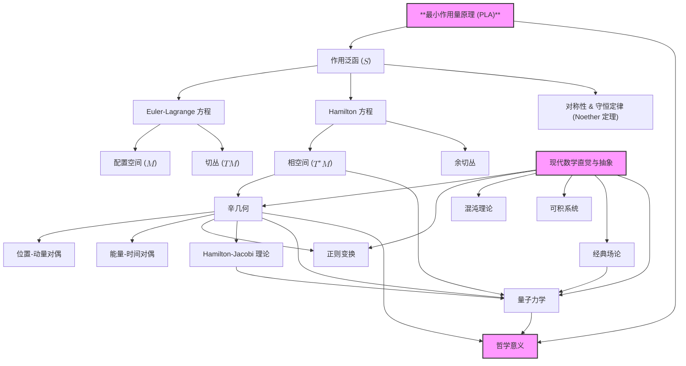

# 重构经典力学：从第一原理到优雅结构
* * *

--- 通过现代数学语言揭示运动的本质

# **1. 引言**

**题词**：
*"在追求理解的过程中，我们回归基础，重新发现复杂性之下的简单性。"*
— 无名氏

## **1.1 经典力学的本质**

经典力学的核心是运动的科学——一种努力理解物体如何以及为何如此运动的尝试。但超越教科书中充斥的方程和定律，有一个更深层次的问题：**经典力学真正是关于什么的？**

在其最根本的层面上，经典力学是对**支配自然界的原理**的探索。它试图揭开我们所观察到的各种现象背后的底层秩序，捕捉决定从小粒子到大天体行为的**统一原理**。

历史上，经典力学通过各种表述形式发展而来——**牛顿力学**、**拉格朗日力学**和**哈密顿力学**——每种形式提供了不同的视角和理解运动的工具。牛顿力学提供了一种基于力的方法，而拉格朗日和哈密顿力学引入了基于能量和几何的观点。然而，这些表述不仅仅是数学方法；它们是窥视**现实的基本性质**的窗口。

经典力学的本质不仅在于解决问题，而在于掌握支撑复杂现象的**优雅简洁性**。它是认识到我们见证的多样运动源自可以通过数学语言简洁表达的**普遍原理**。

重新审视并深化对这些核心原理的理解至关重要。这样做，我们可以超越机械应用，迈向对我们宇宙形状的**深刻理解**。这一旅程涉及剥开既定知识的层次，揭示将不同方面连接成一个整体的**基础思想**。

## **1.2 挑战与机遇**

尽管经过几个世纪的发展，经典力学的研究往往呈现出一个**碎片化的景观**。传统的呈现方式倾向于将主题划分为独立的表述和技术，导致了分割的理解：

- **牛顿力学**专注于力和运动定律，但在处理复杂系统或约束时可能会变得难以驾驭。
- **拉格朗日力学**引入广义坐标和最小作用量原理，但在没有明确几何解释的情况下可能显得抽象。
- **哈密顿力学**通过相空间和正则变换提供了强大的工具，但可能与物理直觉脱节。

这种碎片化对学习者和实践者都构成了挑战：

- **概念差距**：不同表述之间的联系并不总是显而易见，阻碍了整体理解。
- **数学复杂性**：每个表述引入了自己的数学框架，这可能会掩盖所涉原则的底层简洁性。
- **有限视角**：专注于特定方法可能会阻止识别更广泛的模式和其他物理和数学领域的联系。

然而，这些挑战也带来了**机遇**。通过以现代数学和物理学的视角重新审视经典力学，我们可以：

- **统一不同表述**：展示牛顿、拉格朗日和哈密顿力学是如何作为相同基本原理的相互关联表达。
- **增强概念清晰度**：利用几何和结构洞见，在数学严谨性的同时提供直观理解。
- **发现新的联系**：探索与当代领域如辛几何、拓扑和量子力学的联系，丰富我们对经典力学相关性的欣赏。

接受这些机遇需要从传统阐述转向一种将**核心原理**和**几何结构**置于首位的方法。

## **1.3 新方法**

为了更深入地探讨经典力学的本质，我们提出一种**以原理为中心和几何为重点的方法**。这种方法以**最小作用量原理 (PLA)** 为核心，并运用现代数学概念从头开始重构经典力学。

### **1.3.1 以原理为中心的发展**

从PLA开始使我们能够将探索锚定在一个**普遍原理**上，该原理涵盖了所有经典运动。PLA断言系统的实际路径是**使作用量泛函极值化的路径**。通过将这一原则作为我们的基础，我们可以将力学的各种表述视为自然结果，而不是孤立的方法。

这种关注确保**核心思想保持中心位置**，使我们能够超越方程的具体细节，看到它们所代表的**基本真理**。

### **1.3.2 强调几何和结构**

现代数学提供了强大的工具，通过其几何属性理解复杂系统。通过利用诸如：

- **流形**：表示配置空间和相空间，为动力学提供几何舞台。
- **切丛和余切丛**：系统地将速度和动量纳入几何框架。
- **辛几何**：探索相空间中的内在结构，这些结构支配守恒律和动力系统的行为。

这种几何强调使我们能够可视化并理解经典力学的**结构优雅**，揭示纯代数处理中可能隐藏的模式和关系。

### **1.3.3 探索互连和对偶性**

通过检查不同表述之间的**互连和对偶性**，我们可以欣赏它们对同一现象提供的互补视角：

- **牛顿力学**：强调力和运动中的直接因果关系。
- **拉格朗日力学**：突出能量的作用、约束和最小作用路径。
- **哈密顿力学**：关注相空间中的系统的流和动力演化中的固有对称性。

理解这些关系丰富了我们的理解，并展示了经典力学作为统一理论的**一致性**。

### **1.3.4 纳入现代洞见**

经典力学并不是孤立于其他物理和数学之外。通过整合现代洞见，我们可以：

- **连接到量子力学**：探索经典原理如何通过哈密顿-雅可比方程和路径积分过渡到量子领域。
- **扩展到场论**：将力学推广到连续系统和场，为电磁学和引力的高级理论奠定基础。
- **参与高级数学**：利用当代数学框架解决复杂问题并揭示新的理论发展。

这种整体方法不仅增强了我们对经典力学的理解，还使我们能够对正在进行的科学研究做出**有意义的贡献**。

### **1.3.5 揭示新的洞见和联系**

通过从基本原理和现代数学重构经典力学，我们旨在：

- **澄清基本概念**：提供清晰、直观的解释，加深理解。
- **揭示隐藏的结构**：暴露统一各种现象的底层模式和对称性。
- **促进创新**：通过突出与其他领域的联系并揭示当前理解中的空白，激发新的问题和研究方向。

这种新视角邀请经验丰富的研究人员和教育工作者以一种既熟悉又充满活力的方式参与经典力学，鼓励对其深度进行**重新探索**。

## **1.4 总结**

在这段旅程中，我们不仅力求**回答**经典力学真正是什么的问题，还要**体验其美丽**和**优雅**。通过扎根于基础原理并拥抱现代数学语言，我们打开了通往更丰富、更深刻的经典力学世界的门。

# **2. 最小作用量原理：力学的核心**

**题词**：
*"作用量是自然界表达运动的语言。"*
— 无名氏

经典力学在其最深刻层次上，是对物体如何和为何运动的研究。尽管各种表述形式——牛顿力学、拉格朗日力学、哈密顿力学——提供了不同的视角，但它们都汇聚于一个统一的原则，这个原则位于这种运动的核心：**最小作用量原理 (PLA)**。这一原理不仅是一个数学抽象，而且是一个基本定律，它概括了自然界的经济性和优雅性本质。在本节中，我们将深入探讨作用量泛函，理解其重要性，并了解其极值化如何导致支配动力学的自然法则。

## **2.1 作用量泛函的定义及其重要性**

在PLA的核心是**作用量泛函** $S$ 的概念，这是一个标量量，概括了一个系统在时间上的整个运动。对于一个从时间 $t_1$ 到 $t_2$ 运动的系统，作用量定义为：
$$
S[q(t)] = \int_{t_1}^{t_2} L(q(t), \dot{q}(t), t) \, dt,
$$
其中：
- $q(t)$ 表示描述系统在时间 $t$ 时配置的广义坐标。
- $\dot{q}(t)$ 表示广义速度。
- $L(q, \dot{q}, t)$ 是系统的**拉格朗日量**，一个通过结合动能和势能来表征动力学的函数。

作用量泛函不仅仅是一个积分；它是从可能轨迹空间 $q(t)$ 映射到实数的一个映射。每个系统在 $t_1$ 和 $t_2$ 之间可能采取的路径都有一个相关的作用量。

**物理解释及核心作用**

作用量概括了与特定路径相关的**总“努力”**或“成本”。类似于经济学或工程中的优化问题，其中寻求最小化成本或能量消耗，自然界也遵循一种极值化原则。然而，不同于简单的最小化，作用量可以被极值化——它可以是最小值、最大值或鞍点，具体取决于上下文。

作用量泛函的核心作用在于它能够简洁地编码系统的动力学。通过考虑作用量，我们从局部视角（关注瞬时力和加速度）转向全局视角，欣赏整个路径的整体性。这种整体方法提供了对物理系统行为的深刻见解，并形成了与其他物理学领域（如量子力学和相对论）之间的桥梁。

## **2.2 最小作用量原理 (PLA)**

**最小作用量原理**断言，物理系统在两个状态之间实际采取的路径是使作用量泛函极值化的路径。数学上，这表示为：
$$
\delta S = 0,
$$
其中 $\delta S$ 表示作用量泛函的一阶变分。这个条件意味着任何从真实路径的无穷小偏差 $\delta q(t)$ 都不会导致作用量的一阶变化。

**确定系统动力学的普遍性**

PLA具有惊人的普遍性。它适用于各种各样的物理系统，从行星的运动到光的传播，甚至到量子场。其普遍性源于其抽象表述——它独立于具体的力或粒子。相反，它依赖于作用量泛函和拉格朗日量的性质，这些可以调整以表示不同系统。

**欧拉-拉格朗日方程的推导**

为了看到PLA如何导出运动方程，考虑一个具有拉格朗日量 $L(q, \dot{q}, t)$ 的系统。我们寻找使 $S$ 在无穷小变分 $\delta q(t)$ 下保持不变的路径 $q(t)$，该变分在端点 $t_1$ 和 $t_2$ 处消失：
$$
\delta S = \delta \int_{t_1}^{t_2} L(q, \dot{q}, t) \, dt = 0.
$$
进行变分，我们有：
$$
\delta S = \int_{t_1}^{t_2} \left( \frac{\partial L}{\partial q} \delta q + \frac{\partial L}{\partial \dot{q}} \delta \dot{q} \right) dt.
$$
对第二项进行分部积分并注意到 $\delta q(t_1) = \delta q(t_2) = 0$：
$$
\int_{t_1}^{t_2} \frac{\partial L}{\partial \dot{q}} \delta \dot{q} \, dt = \left. \frac{\partial L}{\partial \dot{q}} \delta q \right|_{t_1}^{t_2} - \int_{t_1}^{t_2} \frac{d}{dt} \left( \frac{\partial L}{\partial \dot{q}} \right) \delta q \, dt = - \int_{t_1}^{t_2} \frac{d}{dt} \left( \frac{\partial L}{\partial \dot{q}} \right) \delta q \, dt.
$$
合并各项：
$$
\delta S = \int_{t_1}^{t_2} \left( \frac{\partial L}{\partial q} - \frac{d}{dt} \left( \frac{\partial L}{\partial \dot{q}} \right) \right) \delta q \, dt = 0.
$$
由于 $\delta q(t)$ 是任意的，被积函数必须为零：
$$
\frac{d}{dt} \left( \frac{\partial L}{\partial \dot{q}} \right) - \frac{\partial L}{\partial q} = 0.
$$
这些是**欧拉-拉格朗日方程**，是拉格朗日力学表述的基础。它们是决定系统坐标 $q(t)$ 随时间演化的微分方程。

## **2.3 最小作用量原理的影响**

PLA的影响深远且广泛，提供了超越经典力学边界的洞见。

**不同表述形式的统一**

PLA作为连接各种力学表述形式的统一线索：

- **牛顿力学**：在牛顿观点中，运动由力和加速度支配。由PLA导出的欧拉-拉格朗日方程在笛卡尔坐标下和保守力情况下给出牛顿第二定律 $F = m a$。
  
- **拉格朗日力学**：PLA是拉格朗日力学的基石，在这里动力学用广义坐标和能量而不是力来描述。这种表述特别适用于受约束的系统和非笛卡尔坐标系。
  
- **哈密顿力学**：通过对拉格朗日量进行勒让德变换，我们过渡到哈密顿形式。哈密顿方法，深深植根于PLA，引入相空间和辛几何，丰富了我们对动力系统理解。

此外，PLA还超越了经典力学：

- **电动力学和场论**：作用量原理是经典场论表述的基础，包括麦克斯韦电磁方程和爱因斯坦的广义相对论。
  
- **量子力学**：在量子力学中，费曼的路径积分表述推广了PLA，对所有可能路径求和，路径的相位因子由经典作用量决定。
  
- **光学**：费马原理，即光沿最少时间路径传播，是PLA应用于光传播的一个特例。

**自然法则中的简洁性和优雅性**

PLA体现了自然法则中的简洁性和经济性：

- **自然的经济性**：自然界以最有效的方式运作这一观念在物理学中反复出现。作用量的极值化反映了这一最小“支出”或“努力”的原则。
  
- **数学优雅性**：PLA将确定运动的问题简化为找到标量泛函的驻点，这是一种概念上简单但数学上丰富的方法，利用了变分法的强大工具。
  
- **对称性和守恒**：PLA自然地通过诺特定理纳入了对称性和守恒律，建立了作用量对称性与守恒量（如能量、动量、角动量）之间的深刻联系。

**哲学视角**

PLA还引发了哲学思考：

- **决定论和可预测性**：通过关注作用量，我们强调了一种决定论的自然观，其中过去和未来通过驻值原则相连。
  
- **整体视角**：PLA鼓励我们将系统的路径视为一个整体，而不是孤立的时间点，促进了对物理过程的整体理解。
  
- **普遍适用性**：PLA在物理学各个领域的成功应用暗示了自然法则中的潜在统一性，提示着更深层次的原理尚未完全理解。

## **2.4 总结**

通过将最小作用量原理确立为经典力学的基础支柱，我们不仅获得了一个强大的计算工具，还获得了一个窥视自然界内在和谐的窗口。作用量泛函及其极值化作为连接各种力学表述形式的门户，揭示了复杂现象背后的深刻简洁性。随着我们的进展，这一原则将继续指引我们，照亮定义物理系统行为的几何结构和对称性。

# **3. 配置空间与拉格朗日力学**

**题词**：
*"在配置的领域中，运动是由能量的织锦编排的。"*
— 无名氏

在确立了最小作用量原理 (PLA) 作为经典力学的基础基石之后，我们现在将注意力转向这一原理所运作的框架：**配置空间**。这个几何景观构成了系统动力学展开的舞台，受动能和势能相互作用（包含在**拉格朗日函数**中）的支配。在本章中，我们将深入探讨拉格朗日力学的几何和分析结构，探索广义坐标、约束和拉格朗日形式如何结合在一起，提供对运动本质的深刻见解。

## **3.1 配置空间 ($M$)**

拉格朗日力学的核心概念是**配置空间** $M$，这是一个流形，表示系统可以达到的所有可能状态（配置），而不考虑速度或动量。$M$ 中的每一点对应于系统组件的一个独特排列。

**定义与广义坐标**

在数学上，配置空间 $M$ 是一个可微流形，其坐标是**广义坐标** $q^i$ ($i = 1, 2, \dots, n$)，这些变量唯一地指定了系统的配置。与笛卡尔坐标不同，广义坐标选择以最佳利用系统的对称性和约束，简化运动方程。

对于具有 $n$ 个自由度的系统，配置空间是 $n$ 维的。广义坐标的选取不是唯一的；它们可以是角度、距离或任何能够有效描述系统状态的参数。

**约束在塑造 $M$ 中的作用**

现实世界中的机械系统经常遇到**约束**——限制系统运动方式的条件。约束可以是：

- **完整约束**：可以用坐标和时间的关系式表达的约束，$f(q^i, t) = 0$。它们减少了独立广义坐标的数量。
- **非完整约束**：涉及速度且不能整合为仅包含坐标和时间的方程式的约束。
- **定常约束**：时间无关的约束。
- **时变约束**：时间相关的约束。

约束通过有效地移除某些区域或维度来塑造配置空间，从而减少自由度。适应约束的修改空间通常是原始配置空间的子流形。

**示例：双摆**

考虑由长度分别为 $l_1$ 和 $l_2$ 的两根杆组成的双摆，杆端分别有质量 $m_1$ 和 $m_2$。系统的配置可以用两个角度 $\theta_1$ 和 $\theta_2$ 描述，表示每个杆相对于垂直方向的偏角。约束（固定杆长和铰链点）将配置空间缩减为嵌入四维空间中的二维环面。

## **3.2 拉格朗日函数 $L(q, \dot{q}, t)$**

**拉格朗日函数** $L(q, \dot{q}, t)$ 是一个标量函数，概括了系统的动力学。它被定义为动能 $T(q, \dot{q}, t)$ 与势能 $V(q, t)$ 之差：
$$
L(q, \dot{q}, t) = T(q, \dot{q}, t) - V(q, t).
$$

**动能 $T$**

动能表示与系统运动相关的能量。对于质量为 $m$ 以速度 $\dot{q}$ 运动的粒子，它由下式给出：
$$
T = \frac{1}{2} m_{ij}(q) \dot{q}^i \dot{q}^j,
$$
其中 $m_{ij}(q)$ 是质量矩阵，可能依赖于坐标，在具有移动质量或非惯性系的系统中。

**势能 $V$**

势能捕获由于如重力、弹性或电磁力等相互作用而存储的能量。它取决于位置 $q$ 可能还取决于时间 $t$，但不依赖于速度 $\dot{q}$。

**$L$ 的物理解释**

拉格朗日量 $L$ 体现了运动过程中动能和势能之间的权衡。它本身不是能量，而是一个函数，其极值化通过作用量原理导致正确的运动方程。通过考虑 $L$ 而不是单独考虑 $T$ 和 $V$，我们实现了一种统一的描述，这在具有复杂相互作用或广义坐标系的系统中特别强大。

**拉格朗日形式的优势**

- **坐标独立性**：拉格朗日表述自然适应任何广义坐标的选取，使其高度灵活。
- **包含约束**：可以通过拉格朗日乘数法优雅地包含约束，而无需显式地考虑约束力。
- **对称性和守恒定律**：$L$ 对某些坐标的依赖直接关系到守恒量，正如诺特定理所形式化的。

## **3.3 欧拉-拉格朗日方程的推导**

欧拉-拉格朗日方程是通过对拉格朗日量 $L(q, \dot{q}, t)$ 应用最小作用量原理获得的。目标是找到使作用量泛函 $S$ 极值化的路径 $q(t)$：
$$
S[q(t)] = \int_{t_1}^{t_2} L(q, \dot{q}, t) \, dt.
$$

**推导**

如前所述，使 $S$ 极值化的条件是：
$$
\delta S = 0.
$$
进行变分并分部积分后，我们得到欧拉-拉格朗日方程：
$$
\frac{d}{dt} \left( \frac{\partial L}{\partial \dot{q}^i} \right) - \frac{\partial L}{\partial q^i} = 0.
$$
这是一组二阶微分方程，决定了每个广义坐标 $q^i(t)$ 的演化。

**示例**

1. **简谐振子**

   - **系统**：一个质量为 $m$ 的物体连接到一个刚度为 $k$ 的弹簧上。
   - **坐标**：从平衡位置的位移 $x$。
   - **拉格朗日量**：
     $$
     L = T - V = \frac{1}{2} m \dot{x}^2 - \frac{1}{2} k x^2.
     $$

   - **欧拉-拉格朗日方程**：
     $$
     m \ddot{x} + k x = 0.
     $$

    这是简谐运动的熟悉方程。

2. **单摆**

   - **系统**：一个质量为 $m$ 的物体连接到一个长度为 $l$ 的无质量杆上，在重力作用下摆动。
   - **坐标**：从垂直方向的角度 $\theta$。
   - **拉格朗日量**：
     $$
     L = T - V = \frac{1}{2} m l^2 \dot{\theta}^2 - m g l (1 - \cos\theta).
     $$

   - **欧拉-拉格朗日方程**：
     $$
     m l^2 \ddot{\theta} + m g l \sin\theta = 0,
     $$
    简化为：
     $$
     \ddot{\theta} + \frac{g}{l} \sin\theta = 0.
     $$
    这个非线性方程描述了摆的运动。

**观察**

- 拉格朗日形式轻松地包含了重力、张力和其他力，而无需显式地引入它们到方程中。势能负责保守力，而非保守力可以通过广义势能包括进来。
- 这种方法可以轻松扩展到具有多个自由度和复杂相互作用的系统。

## **3.4 对称性和守恒定律**

拉格朗日力学最深刻的方面之一是它揭示了对称性和守恒定律之间联系的固有能力，这种联系在**诺特定理**中得到了形式化。

**诺特定理**

**表述**：对于作用量 $S$ 的每一个连续对称性，存在一个相应的守恒量。

**对称性**是指系统的坐标变换，使得作用量（因此运动方程）保持不变。**守恒量**是指在一个给定系统中随时间保持不变的物理量。

**对称性和守恒量的例子**

1. **时间平移对称性**

   - **对称性**：如果拉格朗日量不显式依赖于时间 ($\partial L / \partial t = 0$)，则作用量在时间平移 $t \rightarrow t + \epsilon$ 下不变。
   - **守恒量**：**能量** ($E$)。

    守恒的能量由下式给出：
     $$
     E = \sum_i \dot{q}^i \frac{\partial L}{\partial \dot{q}^i} - L.
     $$

2. **空间平移对称性**

   - **对称性**：如果 $L$ 不显式依赖于某个坐标 $q^j$，则作用量在平移 $q^j \rightarrow q^j + \epsilon$ 下不变。
   - **守恒量**：**线动量** ($p_j$)。

    守恒的动量为：
     $$
     p_j = \frac{\partial L}{\partial \dot{q}^j}.
     $$

3. **旋转对称性**

   - **对称性**：如果系统具有旋转对称性（在旋转下不变），则作用量在旋转 $q \rightarrow Rq$ 下保持不变。
   - **守恒量**：**角动量**。

**诺特定理的影响**

诺特定理提供了一种系统的方法来识别由对称性产生的守恒量，加深了我们对物理定律的理解：

- **统一框架**：它提供了一个将不同物理背景下守恒律连接起来的统一原则。
- **预测能力**：通过识别对称性，即使在复杂系统中，我们也可以预测守恒量。
- **对基本相互作用的洞察**：该定理突出了对称性在支配物理相互作用中的根本作用，指导了现代物理学理论的发展，包括量子力学和规范理论。

**示例：中心力场运动中的角动量守恒**

考虑一个质量为 $m$ 的粒子在中心势 $V(r)$ 下运动，其中 $r$ 是从固定点到粒子的径向距离。在球坐标系中，拉格朗日量为：
$$
L = \frac{1}{2} m \left( \dot{r}^2 + r^2 \dot{\theta}^2 + r^2 \sin^2\theta \, \dot{\phi}^2 \right) - V(r).
$$
由于 $L$ 不依赖于角度 $\phi$，作用量在绕 $z$ 轴的旋转下不变，导致相应的角动量分量守恒：
$$
p_\phi = \frac{\partial L}{\partial \dot{\phi}} = m r^2 \sin^2\theta \, \dot{\phi} = \text{常数}.
$$

**约束和广义力**

在存在非保守力或非完整约束的情况下，守恒律可能不严格成立。然而，拉格朗日形式可以扩展以包含广义力 $Q_i$，修改欧拉-拉格朗日方程：
$$
\frac{d}{dt} \left( \frac{\partial L}{\partial \dot{q}^i} \right) - \frac{\partial L}{\partial q^i} = Q_i.
$$
这一推广使我们能够在拉格朗日框架内处理更广泛的一类物理系统。

## **3.5 总结**

通过探讨配置空间和发展拉格朗日形式，我们获得了分析机械系统强大而优雅的工具。使用广义坐标和纳入约束提供了灵活性，而对称性和守恒定律之间的联系则提供了对支配物理世界的不变性原理的深刻见解。随着我们继续这一旅程，这一基础将使我们能够顺利过渡到哈密顿力学，并进一步欣赏经典力学背后的几何结构。

# **4. 相空间与哈密顿力学**

**题词**：
*"相空间是自然对偶性的画布，描绘运动的故事。"*
— 无名氏

通过经典力学的旅程，我们从拉格朗日力学中配置空间的几何优雅过渡到了哈密顿力学中更为丰富和深刻的**相空间**景观。虽然拉格朗日形式侧重于系统的位移和速度，哈密顿方法则提升了位置和动量作为独立但交织变量的地位。这一转变不仅提供了不同的数学框架，还揭示了自然界定律中固有的更深层次的对称性和结构。在本章中，我们将探讨从配置空间到相空间的过渡，探索勒让德变换的深远意义，并阐明哈密顿函数如何支配动力系统的演化。

## **4.1 相空间 ($T^*M$) 和余切丛**

**定义相空间及其坐标**

在经典力学中，系统的**相空间**通过同时考虑位置和动量来包含系统的所有可能状态。对于具有 $n$ 个自由度的系统，相空间是一个 $2n$ 维流形，由坐标 $(q^i, p_i)$ 特征化，其中：

- $q^i$ 表示广义位置，是配置空间 $M$ 的元素。
- $p_i$ 是对应于 $q^i$ 的共轭动量。

这种位置和动量的对偶性构成了哈密顿力学操作的基本框架。

**余切丛结构**

数学上，相空间被识别为配置空间 $M$ 的**余切丛** $T^*M$。余切丛是所有余切空间 $T_q^*M$ 在每个点 $q \in M$ 上的并集，其中 $T_q^*M$ 包含所有作用于切空间 $T_qM$ 上的线性泛函（余向量）。

这一结构至关重要，因为：

- 它为相空间提供了一个自然的几何设置，强调了位置和动量作为 $T^*M$ 上坐标的角色。
- 它允许以微分形式和辛几何的形式表述动力学，揭示了机械系统的更深层次的数学性质。

**内在对偶性和几何意义**

余切丛体现了位置和动量之间的内在对偶性：

- **位置 ($q$)** 描述系统在配置空间中的位置。
- **动量 ($p$)**，作为余向量，捕捉系统在配置空间中的运动方式。

这种对偶性不仅仅是一个数学上的便利，而是反映了基本的物理原理：

- 在**哈密顿视角**中，$q$ 和 $p$ 被同等对待，突出了系统中固有的对称性和守恒律。
- **相空间**成为编码系统完整动力学行为的舞台，轨迹代表了位置和动量随时间的演化。

**相空间作为现代物理学的桥梁**

相空间也是连接经典力学到量子力学和统计力学的基础：

- 在**量子力学**中，不确定性原理源于位置和动量算符的基本非对易性，反映了相空间中捕捉的对偶性。
- 在**统计力学**中，相空间提供了定义系综和理解系统热力学行为的背景。

## **4.2 勒让德变换**

**从拉格朗日到哈密顿：勒让德变换**

**勒让德变换**是从依赖于位置和速度 $(q, \dot{q})$ 的拉格朗日表述转换到用位置和动量 $(q, p)$ 表述的哈密顿表述的数学机制。这种变换之所以深刻，是因为它重新表达了系统的动力学，揭示了新的对称性和守恒律。

**定义共轭动量**

对应于广义坐标 $q^i$ 的共轭动量 $p_i$ 定义为：
$$
p_i = \frac{\partial L}{\partial \dot{q}^i},
$$
其中 $L(q, \dot{q}, t)$ 是系统的拉格朗日量。

这个定义自然地来自于作用量原理，概括了系统运动赋予的动量。

**构造哈密顿函数**

哈密顿量 $H(q, p, t)$ 通过拉格朗日量的勒让德变换定义：
$$
H(q, p, t) = \sum_{i} p_i \dot{q}^i - L(q, \dot{q}, t).
$$
这里，速度 $\dot{q}^i$ 隐式地是 $q^i$ 和 $p_i$ 的函数，通过动量定义的反演得到。

**变换的意义**

勒让德变换实现了几个关键目标：

- **动力学的重新参数化**：它将依赖变量从速度变为动量，提供了观察系统的全新视角。
- **揭示守恒律**：通过用 $q$ 和 $p$ 表述动力学，哈密顿表述使守恒律更加透明，特别是通过相空间的对称性。
- **促进量化**：哈密顿框架对于向量子力学的过渡至关重要，其中哈密顿算符扮演核心角色。

**深层次的几何解释**

勒让德变换不仅仅是代数工具；它反映了更深层次的几何对应关系：

- 它将与速度相关的切丛 $TM$ 映射到与动量相关的余切丛 $T^*M$。
- 这种映射保持了内在的几何结构，使得可以利用辛流形的丰富性质来分析系统。

## **4.3 哈密顿函数 $H(q, p, t)$**

**定义和物理解释**

**哈密顿量** $H(q, p, t)$ 概括了用广义坐标和共轭动量表示的系统的总能量。当拉格朗日量采用标准形式 $L = T - V$ 时，它通常表示动能和势能的和。

物理上，哈密顿量作为：

- 时间演化的生成器，决定了系统如何从一个状态过渡到另一个状态。
- 在 $H$ 不显式依赖于时间 ($\partial H / \partial t = 0$) 的系统中，它是守恒量，体现了能量守恒原理。

**在支配动力学中的作用**

哈密顿函数通过哈密顿方程支配系统的动力学，这些方程将 $q^i$ 和 $p_i$ 的时间导数与 $H$ 的偏导数联系起来：
$$
\dot{q}^i = \frac{\partial H}{\partial p_i}, \quad \dot{p}_i = -\frac{\partial H}{\partial q^i}.
$$
这些方程突出了几个关键方面：

- **$q$ 和 $p$ 之间的对称性**：位置和动量被对称处理，反映了底层的物理对称性。
- **一阶微分方程**：演化方程是一阶时间方程，简化了分析和数值积分，相比于拉格朗日形式中的二阶方程。

**几何视角**

在几何观点中，哈密顿函数定义了相空间上的**向量场**，其积分曲线对应于系统的轨迹。这个向量场保持了相空间的辛结构，这一性质由刘维尔定理所概括。

**能量景观和水平集**

哈密顿函数在相空间中创建了一个能量景观，其中：

- **$H$ 的水平集**：由 $H(q, p, t) = E$ 定义的曲面表示常能量状态。
- **动力学约束在水平集上**：对于保守系统，系统的演化保持在这些能量表面上，揭示了守恒量并有助于可视化运动。

## **4.4 哈密顿运动方程**

**从作用量原理推导**

哈密顿力学中的作用量原理涉及极化用 $q$ 和 $p$ 表示的作用泛函：
$$
S[q(t), p(t)] = \int_{t_1}^{t_2} \left( p_i \dot{q}^i - H(q, p, t) \right) dt.
$$
应用变分法，对 $\delta q^i$ 和 $\delta p_i$ 的变分导致了哈密顿方程。

**详细推导**

1. **关于 $\delta p_i$ 的变分**：
$$
\delta S = \int_{t_1}^{t_2} \left( \delta p_i \dot{q}^i - \delta p_i \frac{\partial H}{\partial p_i} \right) dt = \int_{t_1}^{t_2} \delta p_i \left( \dot{q}^i - \frac{\partial H}{\partial p_i} \right) dt.
$$
   对任意的 $\delta p_i$，设 $\delta S = 0$，我们得到：
$$
\dot{q}^i = \frac{\partial H}{\partial p_i}.
$$

2. **关于 $\delta q^i$ 的变分**：
$$
\delta S = \int_{t_1}^{t_2} \left( -\dot{p}_i \delta q^i - \delta q^i \frac{\partial H}{\partial q^i} \right) dt = \int_{t_1}^{t_2} \delta q^i \left( -\dot{p}_i - \frac{\partial H}{\partial q^i} \right) dt.
$$
   同样，对任意的 $\delta q^i$，设 $\delta S = 0$，我们得到：
$$
\dot{p}_i = -\frac{\partial H}{\partial q^i}.
$$

**哈密顿方程**

这些结果共同构成了哈密顿方程：
$$
\dot{q}^i = \frac{\partial H}{\partial p_i}, \quad \dot{p}_i = -\frac{\partial H}{\partial q^i}.
$$

这些方程完全描述了系统在相空间中的动力学。

**例子和比较**

1. **简谐振子**

   - **哈密顿量**：
     $$
     H = \frac{p^2}{2m} + \frac{1}{2} k q^2.
     $$

   - **哈密顿方程**：
     $$
     \dot{q} = \frac{\partial H}{\partial p} = \frac{p}{m}, \quad \dot{p} = -\frac{\partial H}{\partial q} = -k q.
     $$

   - **相空间轨迹**：解在 $q$-$p$ 平面上描绘出椭圆，反映了振子的总能量守恒和周期性。

2. **与拉格朗日表述的比较**

   - 拉格朗日方法给出：
     $$
     m \ddot{q} + k q = 0,
     $$
    这是一个关于 $q$ 的二阶微分方程。

   - 哈密顿力学将此分为两个一阶方程，提供了不同的视角，可以简化某些分析和数值模拟。

**优势和深刻见解**

- **辛结构保持**：哈密顿方程保持辛形式 $\omega = dq^i \wedge dp_i$，这是通过辛几何导致守恒律的基本性质。
- **可积性和混沌**：哈密顿形式特别适合研究可积系统和混沌的开始，因为它自然地包含了相空间流和庞加莱映射等概念。
- **正则变换**：保持哈密顿方程形式的变量变化，称为正则变换，揭示了更深层次的对称性，并有助于积分运动方程。

**哈密顿动力学的内在性质**

哈密顿力学通过以下方式捕捉经典动力学的本质：

- **强调对偶性**：对位置和动量的对称处理暴露了机械系统中的基本对偶性。
- **突出守恒律**：这种表述使守恒量更加透明，因为它们通常对应于相空间中的对称性。
- **连接量子力学**：哈密顿函数在量子力学中成为哈密顿算符，通过薛定谔方程支配量子态的时间演化。

**刘维尔定理**

哈密顿力学的一个重要后果是**刘维尔定理**，它表明由哈密顿方程生成的流保持相空间中的体积不变：
$$
\frac{d}{dt} \left( dq^1 \wedge dp_1 \wedge \dots \wedge dq^n \wedge dp_n \right) = 0.
$$
这一性质强调了相空间流的不可压缩性，并在统计力学中有深远的影响。

**对称性和可积性**

具有足够对称性的哈密顿系统可以是**可积的**，这意味着其运动方程可以精确求解。这样的系统通常允许引入作用-角变量，从而深入理解周期运动和稳定性。

**正则变换和生成函数**

正则变换保持辛结构和哈密顿方程。它们由便于积分运动和简化复杂系统的函数生成。

**哈密顿-雅可比理论**

经典力学的一种替代表述，**哈密顿-雅可比方程**，自然地出现在哈密顿框架中。它提供了力学与光学（通过最小作用量原理）之间的联系，并通过对应原理成为通往量子力学的桥梁。

## **4.5 总结**

通过转向哈密顿形式并深入探讨相空间的结构，我们揭示了经典力学更为丰富和深刻的理解。哈密顿方法不仅提供了解决机械问题的替代方法，还阐明了物理定律背后的深层次对称性和几何结构。这一视角强调了物理学和数学中看似不同领域的统一，突出了自然界的优雅和相互关联。随着我们继续前进，这些见解将为探索高级主题奠定基础，如辛几何以及经典力学与量子力学之间的深刻联系。

# **5. 辛几何：相空间的结构**

**题词**：
*"辛几何编织相空间的织物，保持运动的和谐。"*
— 无名氏

随着我们从最小作用量原理通过拉格朗日和哈密顿表述的旅程，我们见证了描述经典系统动力学的几何结构的出现。在这些结构中，**辛几何**作为支撑相空间的深刻数学基础脱颖而出。它捕捉了哈密顿力学的本质，揭示了几何与物理之间的深层互动。在本章中，我们将深入探讨辛流形的内在性质、辛形式 $\omega$ 的性质以及这些概念如何导致守恒律和不变量，丰富我们对运动和谐性的理解。

## **5.1 辛流形和辛形式 $\omega$**

辛几何的核心是**辛流形**的概念，即一个配备有闭合且非退化的微分 $2$-形式（称为**辛形式** $\omega$）的光滑偶数维流形。这种结构提供了描述哈密顿系统相空间所需的数学语言，将位置和动量统一在一个几何框架中。

**定义辛流形**

一个**辛流形** $(M, \omega)$ 包括：

- **流形 $M$**：一个光滑的偶数维微分流形。
- **辛形式 $\omega$**：一个闭合（外微分 $d\omega = 0$）且非退化的 $2$-形式。

数学上，辛形式 $\omega$ 是一个双线性、反对称映射：
$$
\omega: T_p M \times T_p M \rightarrow \mathbb{R},
$$
其中 $T_p M$ 是点 $p \in M$ 处的切空间。

**辛形式的性质**

1. **非退化性**：

   对所有非零 $v \in T_p M$，存在 $u \in T_p M$ 使得 $\omega(v, u) \neq 0$。

   - **物理解释**：非退化性确保辛形式唯一配对向量，反映了相空间中位置和动量的内在耦合。

2. **闭合性**：

   辛形式的外微分为零：
   $$
   d\omega = 0.
   $$

   - **物理解释**：闭合性意味着辛结构在由哈密顿动力学生成的流下保持不变，导致相空间体积的保持（刘维尔定理）。

**余切丛 $T^*M$ 上的规范辛形式**

对于余切丛 $T^*M$（相空间），自然的辛形式在局部坐标 $(q^i, p_i)$ 下表示为：
$$
\omega = dq^i \wedge dp_i,
$$
其中 $\wedge$ 表示楔积。

这个形式概括了坐标和动量之间的基本泊松括号：
$$
\{ q^i, p_j \} = \delta^i_j,
$$
反映了基本换位关系和固有的辛结构。

**辛结构作为相空间的织物**

辛形式 $\omega$ 为相空间赋予了一个精确的数学结构，该结构：

- 编码了经典力学的几何。
- 允许我们以坐标无关的方式表述动力学。
- 提供了定义哈密顿流并保持机械系统基本特征的背景。

**深层次的几何含义**

辛流形不仅仅是一个数学构造；它体现了物理系统的根本性质：

- **偶数维性**：自然地源于位置和动量的配对。
- **非退化性**：确保相空间中的每个方向都有一个互补方向与其相互作用，反映了物理量的相互关联。
- **闭合性**：反映了底层的守恒律和不变性原则，标志着经典系统的稳定性和可预测性。

## **5.2 哈密顿向量场和流**

建立了辛结构后，我们可以探讨它是如何通过**哈密顿向量场**及其相应的相空间流产生动力学的。

**哈密顿函数和向量场**

给定一个哈密顿函数 $H: M \rightarrow \mathbb{R}$，我们可以关联一个唯一的向量场 $X_H$，使得：
$$
\iota_{X_H} \omega = dH,
$$
其中 $\iota_{X_H}$ 表示 $\omega$ 与 $X_H$ 的内积。

这个关系隐式地定义了 $X_H$，确保 $X_H$ 生成对应于哈密顿动力学的流。

**用哈密顿向量场表示的运动方程**

沿由 $X_H$ 生成的流演化任何可观测量 $f: M \rightarrow \mathbb{R}$ 的表达式为：
$$
\frac{df}{dt} = X_H(f) = \{ f, H \},
$$
其中 $\{ \cdot , \cdot \}$ 表示泊松括号。这反映了哈密顿向量场如何支配可观测量的时间演化。

**流和相空间轨迹**

$X_H$ 的积分曲线定义了系统在相空间中的运动：

- **哈密顿流** $\phi_t$：一个满足 $\phi_0 = \text{id}$ 和 $\frac{d}{dt} \phi_t(p) = X_H(\phi_t(p))$ 的单参数微分同胚族。

- **$\omega$ 的保持**：流保持辛形式：
  $$
  \phi_t^* \omega = \omega,
  $$
  其中 $\phi_t^*$ 表示 $\phi_t$ 的拉回。

**物理意义**

- **确定性演化**：哈密顿向量场封装了经典力学的确定性，其中未来轨迹由当前状态唯一确定。

- **辛不变性**：流下辛形式的保持确保了系统的根本几何和物理性质随时间不变。

**可积性和混沌**

- **可积系统**：对于具有足够多守恒量（运动积分）的系统，哈密顿流可以限制在低维子流形上，导致规律的、可预测的行为。

- **混沌系统**：在缺乏足够守恒量的情况下，流可以表现出对初始条件的敏感依赖，导致辛框架内的混沌动力学。

## **5.3 泊松括号和可观测量**

辛结构提供了一个定义力学代数结构的自然框架，特别是通过**泊松括号**，它捕捉了可观测量之间的基本关系。

**泊松括号的定义**

对于两个光滑函数（可观测量） $f, g: M \rightarrow \mathbb{R}$，泊松括号定义为：
$$
\{ f, g \} = \omega(X_f, X_g),
$$
其中 $X_f$ 和 $X_g$ 分别是对应于 $f$ 和 $g$ 的哈密顿向量场。

在局部坐标 $(q^i, p_i)$ 下：
$$
\{ f, g \} = \sum_{i} \left( \frac{\partial f}{\partial q^i} \frac{\partial g}{\partial p_i} - \frac{\partial f}{\partial p_i} \frac{\partial g}{\partial q^i} \right).
$$

**泊松括号的性质**

1. **双线性性**：
   $$
   \{ af + bg, h \} = a \{ f, h \} + b \{ g, h \}, \quad a, b \in \mathbb{R}.
   $$

2. **反对称性**：
   $$
   \{ f, g \} = - \{ g, f \}.
   $$

3. **雅可比恒等式**：
   $$
   \{ f, \{ g, h \} \} + \{ g, \{ h, f \} \} + \{ h, \{ f, g \} \} = 0.
   $$

4. **莱布尼兹法则**：
   $$
   \{ f g, h \} = f \{ g, h \} + g \{ f, h \}.
   $$

这些性质赋予可观测量空间以**李代数**的结构，反映了系统的根本对称性和守恒律。

**与辛形式的关系**

泊松括号与辛形式密切相关：

- 它测量了向量场 $X_f$ 和 $X_g$ 张成的辛面积。
- 辛形式的非退化性确保了泊松括号是可观测量空间上的非退化双线性形式。

**可观测量的代数**

- 可观测量 $f$ 形成一个**泊松代数**，结合了函数的交换乘法和由泊松括号提供的李括号结构。

- **卡西米尔函数**：与所有其他可观测量泊松交换的函数（$\{ f, g \} = 0$ 对所有 $g$ 成立）在守恒量或对称性中起着特殊作用。

**物理意义**

- **可观测量的时间演化**：

  泊松括号支配时间演化：
  $$
  \frac{df}{dt} = \{ f, H \}.
  $$

- **守恒律**：

  可观测量 $f$ 是守恒的当且仅当 $\{ f, H \} = 0$，直接将守恒量与泊松结构中的对称性联系起来。

- **量子化的前奏**：

  泊松代数结构作为经典力学到量子力学中非交换可观测量代数的前身，其中泊松括号被换位子取代。

## **5.4 正则变换和辛映射**

在辛几何框架内，某些变换保持了辛结构，从而提供了简化问题和揭示隐藏对称性的强大工具。

**正则变换的定义**

一个变换 $\Phi: M \rightarrow M$ 如果保持辛形式，则称为**正则**：
$$
\Phi^* \omega = \omega,
$$
其中 $\Phi^*$ 是 $\Phi$ 的拉回。

**辛映射**

正则变换是**辛映射**的例子，即保持辛结构的微分同胚。它们满足以下性质：

- **体积保持**：由于 $\omega$ 的非退化性，辛映射保持相空间体积（刘维尔定理）。
- **哈密顿结构的保持**：它们将哈密顿方程的解映射为其他解。

**生成函数**

正则变换通常可以使用**生成函数**构造，这些函数依赖于旧坐标和新坐标的动量的各种组合。例如：

- **类型1生成函数 $F_1(q, Q)$**：
  $$
  p = \frac{\partial F_1}{\partial q}, \quad P = -\frac{\partial F_1}{\partial Q}.
  $$

- **类型2生成函数 $F_2(q, P)$**：
  $$
  p = \frac{\partial F_2}{\partial q}, \quad Q = \frac{\partial F_2}{\partial P}.
  $$

- 其他类型的生成函数类似。

这些函数便于在不同的正则变量集之间进行变换。

**在简化问题中的应用**

- **作用-角变量**：对于可积系统，正则变换可以将哈密顿量简化为仅依赖于动量的函数，从而简化运动方程的积分。

- **正规化**：在稳定平衡点附近，变换可以简化哈密顿量，有助于稳定性分析。

**揭示对称性**

- **变换下的不变性**：正则变换可以揭示原变量中不明显的对称性，通过诺特定理导出守恒量。

- **与可积性的联系**：辛映射在研究哈密顿系统的可积性和相空间结构中起着关键作用。

**物理解释**

- **坐标独立性**：基本物理定律在正则变换下是不变的，强调物理学独立于坐标选择。

- **隐藏的守恒律**：通过转换到适当的变量，守恒量可能变得明显，提供对系统行为的更深入理解。

**正则变换在量子力学中的应用**

- 经典的正则变换概念预示了量子力学中幺正变换的重要性，后者保持了内积结构和基本换位关系。

## **5.5 总结**

通过辛几何的视角，我们揭示了构成哈密顿力学基础的深刻数学结构。辛形式 $\omega$ 编织了相空间的织物，确保通过非退化、闭合结构保持运动的和谐。哈密顿向量场及其流引导系统的演化，而泊松括号揭示了可观测量之间的深层代数关系。

正则变换和辛映射提供了探索这一丰富景观的工具，揭示了对称性并简化了复杂问题。它们突出了经典力学的内在几何性质，其中物理定律表现为几何不变量。

通过深入探讨辛几何的内在性质，我们不仅对经典系统有了更深刻的理解，还为探索现代物理学奠定了基础，在宏观和量子尺度上，这种几何洞见继续塑造我们对宇宙的理解。

# **6. 基本对偶性和变换**

**题词**：
*"在对偶中，我们找到统一；对立的概念揭示了相同的真理。"*
— 无名氏

在经典力学的深刻领域中，对偶性和变换不仅仅是数学上的便利，而是揭示物理定律深层次对称性和相互关联的基本方面。这些对偶性，如位置-动量和能量-时间，自然地从我们探讨的几何结构中涌现出来，提供了对支配宇宙的力学更丰富的理解。在本章中，我们将深入探讨这些基本对偶性，研究它们如何从相空间的内在几何中产生，并探索正则变换和哈密顿-雅可比理论在连接不同力学表述中的关键作用。

## **6.1 位置-动量对偶**

经典力学的核心在于位置和动量之间的亲密关系，这体现在相空间的坐标 $q^i$ 和 $p_i$ 中。这种对偶性不仅仅是变量的配对，而是支撑物理系统动力学的深刻对称性。

**$q^i$ 和 $p_i$ 的交织**

在哈密顿力学中，位置和动量被同等对待，强调了它们的对称角色：

- **正则坐标**：广义位置 $q^i$ 和其共轭动量 $p_i$ 形成定义系统在相空间中状态的对。
- **辛结构**：辛形式 $\omega = dq^i \wedge dp_i$ 体现了这种对偶性，确保变换保持 $q^i$ 和 $p_i$ 之间的基本关系。

哈密顿运动方程表达了每个变量如何响应另一个变量而演化：
$$
\dot{q}^i = \frac{\partial H}{\partial p_i}, \quad \dot{p}_i = -\frac{\partial H}{\partial q^i}.
$$
这种相互依赖突显了位置和动量之间的内在耦合。

**对不确定性和测量的影响**

尽管经典力学原则上允许同时精确知道位置和动量，但 $q^i$ 和 $p_i$ 的交织性质为量子力学中的不确定性原理奠定了基础：

- **经典前驱**：经典力学中的泊松括号 $\{ q^i, p_j \} = \delta^i_j$ 预示了量子算符的非交换性质。
- **量子力学过渡**：在量化过程中，正则换位关系 $[ \hat{q}^i, \hat{p}_j ] = i\hbar \delta^i_j$ 引入了固有的不确定性，反映了同时测量的基本限制。

**几何解释**

相空间几何提供了对位置-动量对偶性的视觉和概念理解：

- **辛流形**：相空间作为辛流形的结构确保了位置和动量不是独立的，而是几何上相互关联的。
- **刘维尔定理**：哈密顿流下相空间体积的保持强调了 $q^i$ 和 $p_i$ 之间的平衡。

**物理例子**

1. **简谐振子**

   - 相空间轨迹是一个椭圆，展示了动能和势能之间的周期交换，因此也反映了位置和动量之间的转换。
   - 椭圆反映了总能量的守恒和相空间的辛结构。

2. **正则变换**

   - 混合位置和动量的变换，如傅里叶变换，体现了对偶性，并在分析波动现象中起着重要作用。

**深刻见解**

- **互补性**：位置和动量是系统状态的互补方面，各自提供了对方所缺乏的信息。
- **信息内容**：完全了解 $q^i$ 和 $p_i$ 是描述瞬时状态所必需的，但它们的演化由它们的相互作用决定。
- **对称性和守恒**：位置和动量之间的对称性对于经典力学中的守恒律和不变性原则至关重要。

## **6.2 能量-时间对偶**

能量和时间之间的对偶性比位置和动量的对偶性更为微妙，但同样根本。它源于物理定律中的深层对称性，在经典力学和量子力学中都起着关键作用。

**能量守恒和时间平移对称性**

**诺特定理**揭示了守恒律与对称性之间的密切联系：

- **时间平移对称性**：如果哈密顿量 $H(q, p)$ 不显式依赖于时间，则系统在时间平移下是不变的。
- **能量守恒**：这种对称性直接导致哈密顿函数的守恒，解释为系统的总能量。

数学上，如果 $\partial H / \partial t = 0$，则：
$$
\frac{dH}{dt} = \frac{\partial H}{\partial t} + \{ H, H \} = 0,
$$
由于 $\{ H, H \} = 0$，确认了能量的守恒。

**在经典背景下的影响**

- **确定性演化**：系统的演化完全由其哈密顿量决定，强调了能量在治理动力学中的作用。
- **时间作为参数**：在经典力学中，时间是一个独立参数，能量守恒反映了时间的均匀性。

**向量子力学的过渡**

在量子力学中，能量-时间对偶性以不同的方式表现：

- **能量-时间不确定性原理**：
  $$
  \Delta E \Delta t \geq \frac{\hbar}{2}.
  $$
  这个原理意味着能量和时间同时定义的精度存在基本限制，尽管时间在标准量子力学中不是一个算符。

- **时间演化算符**：

  量子态的时间演化由哈密顿量控制：
  $$
  |\psi(t)\rangle = e^{-iHt/\hbar} |\psi(0)\rangle,
  $$
  突显了能量在决定状态随时间变化中的核心作用。

**几何视角**

- **相空间流**：能量水平对应于相空间中系统随时间演化的曲面。
- **作用-角变量**：对于周期系统，作用变量与能量相关，角度变量对应于相位，将能量和时间在循环动力学背景下联系起来。

**物理意义**

- **原子跃迁**：在量子系统中，能量差对应于发射或吸收辐射的频率，直接将能量与时间振荡联系起来。
- **经典类比**：在振荡系统中，较高的能量对应于更快的振荡，将能量水平与时间行为联系起来。

**更深层次的见解**

- **对称性破缺**：具有时间依赖哈密顿量的系统表现出能量不守恒，分析此类情况揭示了改变时间对称性如何影响动力学。
- **基本常数**：普朗克常数 $\hbar$ 作为能量和时间尺度之间的桥梁，强调了这些概念在经典和量子领域中的统一。

## **6.3 正则变换和生成函数**

正则变换是哈密顿力学的核心，提供了简化复杂问题、揭示隐藏对称性以及加深我们对力学系统理解的手段。

**对正则变换的更深层次见解**

- **定义**：正则变换是从 $(q^i, p_i)$ 到 $(Q^i, P_i)$ 的变量变化，它保持哈密顿方程的形式不变。
- **辛结构的保持**：这些变换维持辛形式 $\omega$，确保基本几何关系保持不变。
- **数学表述**：

  变换满足：
  $$
  p_i dq^i - H dt = P_i dQ^i - K dt + dF,
  $$
  其中 $F$ 是生成函数，$K$ 是新的哈密顿量。

**生成函数的类型**

生成函数促进了正则变换，并根据其对旧变量和新变量的依赖性分为四种标准类型：

1. **类型1**：$F_1(q, Q, t)$
2. **类型2**：$F_2(q, P, t)$
3. **类型3**：$F_3(p, Q, t)$
4. **类型4**：$F_4(p, P, t)$

每种类型都导致了特定的变换方程，将旧坐标和动量与新坐标和动量联系起来。

**应用和物理意义**

- **简化哈密顿量**：通过选择适当的生成函数，可以将哈密顿量转换为更简单的形式，通常有助于运动方程的积分。
- **识别运动常数**：正则变换可以使守恒量变得明显，有助于解决具有隐藏对称性的问题。
- **作用-角变量**：在可积系统中，使用正则变换转换到作用-角变量可以简化哈密顿量，通常将其减少为仅依赖于作用变量的函数。

**生成函数的实际应用**

- **例子**：对于谐振子，一个正则变换可以将哈密顿量转换为仅依赖于作用变量的形式，简化其周期运动的分析。

- **接触变换**：依赖于时间的生成函数可以引入时间相关的正则变换，适用于显式时间依赖的系统。

**深刻的几何解释**

- **作为辛同胚的变换**：正则变换是辛同胚——保持辛结构的微分同胚——突显了它们的几何性质。
- **相空间映射**：它们作用于重新参数化相空间而不改变物理内容，类似于从不同视角观察系统。

**在量子力学中的角色**

- **量子类比**：正则变换启发了量子力学中的幺正变换，后者保持换位关系和概率幅。
- **路径积分**：在路径积分表述中，变量的变化对应于正则变换，以一种保持物理的方式影响积分测度。

## **6.4 哈密顿-雅可比理论**

哈密顿-雅可比理论提供了经典力学的一种强大替代表述，将力学的粒子描述与波动现象联系起来，并为量子力学铺平了道路。

**哈密顿-雅可比方程**

哈密顿-雅可比理论的核心方程是：
$$
H\left(q^i, \frac{\partial S}{\partial q^i}, t\right) + \frac{\partial S}{\partial t} = 0,
$$
其中：

- $S(q, t)$ 是哈密顿主函数，也称为作用量。
- 该方程有效地将问题转化为求解关于 $S$ 的偏微分方程 (PDE)，从中可以推导出运动。

**在简化复杂系统中的重要性**

- **运动的积分**：一旦知道了 $S$，运动方程可以通过微分得到：
  $$
  p_i = \frac{\partial S}{\partial q^i}.
  $$

- **动力学的简化**：哈密顿-雅可比方程将寻找轨迹的问题简化为求解一个 PDE，这有时可能更容易处理。

**与波动现象的联系**

- **光学类比**：哈密顿-雅可比方程类似于几何光学中的伊科诺尔方程，将粒子的力学与波的传播联系起来。
- **波-粒二象性**：这种类比预示了量子力学中固有的波-粒二象性，其中粒子表现出波动特性。

**作用量作为生成函数**

- $S$ 作为正则变换到新变量的生成函数，在这些新变量中哈密顿量消失 ($K = 0$)，从而导致平凡的运动方程。
- 通过选择 $S$，这种变换通过“解决”动力学问题简化了运动的积分。

**应用和例子**

1. **哈密顿特征函数**

   对于时间无关的哈密顿量，可以定义特征函数 $W(q^i, \alpha_j)$，其中 $\alpha_j$ 是常数，且 $S = W - E t$。

2. **开普勒问题**

   哈密顿-雅可比方程可以求解开普勒问题（逆平方中心力下的运动），提供关于行星运动和角动量守恒的见解。

3. **量子力学的桥梁**

   - **WKB 近似**：在量子力学中，Wentzel-Kramers-Brillouin (WKB) 近似利用哈密顿-雅可比方程来近似波函数，连接经典作用量与量子相位。
   - **路径积分表述**：费曼的路径积分方法依赖于经典作用量，强化了经典路径与量子幅之间的联系。

**深刻的哲学含义**

- **决定论和可预测性**：哈密顿-雅可比理论概括了经典力学的决定性本质，同时暗示了量子力学中的概率解释。
- **表述的统一性**：它作为一个统一框架，连接了拉格朗日和哈密顿表述，表明不同的视角可以得出相同的物理预测。

**几何解释**

- **相空间叶状结构**：哈密顿-雅可比方程的解对应于相空间中系统演化的曲面。
- **正则变换**：该方法本质上涉及找到简化哈密顿量的正则变换，展示了动力学与几何之间的相互作用。

## **6.5 总结**

通过深入探讨经典力学的基本对偶性和变换，我们揭示了束缚宇宙物理定律的复杂对称性和联系。位置-动量和能量-时间的对偶性揭示了物理量之间的内在平衡和相互作用，而正则变换和哈密顿-雅可比理论提供了分析和简化复杂系统的强大工具和视角。

这些概念不仅加深了我们对经典力学的理解，还建立了通向现代物理学的桥梁，突显了不同尺度和领域中物理理论的连续性和一致性。本章探讨的对偶性和变换强调了自然法则的统一性和数学描述物理世界的优雅性。

通过这一探索，我们认识到经典力学远非仅仅是现代理论的历史前奏，而是一个丰富而充满活力的领域，继续为我们提供对宇宙基本运作的深刻见解。

# **7. 扩展和现代联系**

**题词**：
*"从经典根基出发，现代物理学的分支延伸，向着未知探索。"*
— 无名氏

尽管经典力学植根于几个世纪前的原则，但它继续影响并与现代物理学交织在一起。其基础概念不仅得以生存，而且蓬勃发展，扩展到高级主题，并与当代理论形成桥梁。在本章中，我们探讨了经典力学重构框架如何自然地延伸到可积系统、混沌理论、场论和量子力学。通过深入这些领域，我们揭示了深刻的联系，并为新的研究铺平道路，证明经典力学不是孤立的遗迹，而是一个充满活力、不断发展的学科，继续为我们对宇宙的理解提供信息。

## **7.1 可积系统和作用-角变量**

在动力系统的广阔领域中，**可积系统**因其精确可解性和丰富的数学结构占据特殊地位。一个可积系统是指具有与其自由度一样多的独立运动常数的系统，允许通过求积完全求解。对这些系统的探索不仅提供了某些力学问题的精确解，还加深了我们对相空间底层几何结构的理解。

**精确可解性和运动常数**

一个 $n$ 自由度的哈密顿系统是可积的，如果存在 $n$ 个函数上独立且相互对易的运动常数 $F_i$，其中：
$$
\{ F_i, F_j \} = 0, \quad \forall i, j = 1, \dots, n.
$$
这些运动常数处于对合状态，确保由 $F_i$ 生成的流对易，导致规则、可预测的动力学。

**关于可积系统的刘维尔定理**

**刘维尔定理**指出，如果一个哈密顿系统是可积的，那么它的相空间可以被叶状化为 $n$ 维不变环面。每个环面上的运动是准周期的，意味着系统的轨迹在相空间中密集填充环面，动力学可以用 **作用-角变量** 描述。

**作用-角变量**

作用-角变量 $(I_i, \theta^i)$ 是正则坐标，它们将可积系统的哈密顿量简化为仅依赖于作用变量的函数：
$$
H = H(I_1, I_2, \dots, I_n).
$$
这些变量中的运动方程为：
$$
\dot{I}_i = -\frac{\partial H}{\partial \theta^i} = 0, \quad \dot{\theta}^i = \frac{\partial H}{\partial I_i} = \omega_i(I).
$$
由于作用变量 $I_i$ 是运动常数，角变量 $\theta^i$ 随时间线性演化，频率 $\omega_i$ 仅依赖于 $I_i$。

**作用和角变量的物理解释**

- **作用变量 $I_i$**：

  作用变量表示与系统沿不变环面运动相关的守恒量。几何上，它们由以下积分给出：
  $$
  I_i = \frac{1}{2\pi} \oint_{C_i} p_i \, dq^i,
  $$
  其中积分是在对应于循环坐标的闭路径 $C_i$ 上进行的。

- **角变量 $\theta^i$**：

  角变量参数化环面上的位置，并且是作用变量的共轭循环坐标。

**可积系统的例子**

1. **谐振子**：

   - 哈密顿量 $H = \frac{p^2}{2m} + \frac{1}{2} k q^2$ 导致相空间中的圆形轨迹。
   - 作用变量 $I = \frac{E}{\omega}$，其中 $E$ 是能量，$\omega = \sqrt{k/m}$。
   - 角变量 $\theta = \omega t + \theta_0$。

2. **开普勒问题**：

   - 行星在引力吸引下的运动是可积的。
   - 角动量和 Runge-Lenz 向量的守恒导致可以使用作用-角变量描述的封闭轨道。

**作用-角变量的重要性**

- **动力学简化**：转换到作用-角变量将运动方程简化为线性方程，大大简化了复杂系统的分析。

- **量子力学中的量化**：在旧量子理论中，作用变量根据 Bohr-Sommerfeld 条件 $I = n \hbar$ 量化，突显了经典和量子力学之间的桥梁。

- **摄动理论**：作用-角变量是研究受扰可积系统的基础，例如使用正则摄动理论方法，使近似可积系统的探索成为可能。

**KAM 理论和稳定性**

**Kolmogorov-Arnold-Moser (KAM) 定理** 解决了当受到小扰动时，近似可积系统中准周期运动的持久性问题。它表明许多不变环面得以保存，但有些被破坏，导致复杂动力学的出现。

## **7.2 混沌理论和非线性动力学**

虽然可积系统提供了精确解的安慰，但大多数物理系统是非可积的，表现出丰富且往往不可预测的行为，称为 **混沌**。混沌理论研究由非线性动力学产生的确定性但看似随机的行为，强调系统对初始条件的敏感性。

**混沌和对初始条件的敏感性**

混沌系统的特点是相空间中附近轨迹的指数发散。初始条件的小差异 $\delta x(0)$ 随时间呈指数增长：
$$
\delta x(t) \approx \delta x(0) e^{\lambda t},
$$
其中 $\lambda$ 是 **Lyapunov 指数**。

**非线性动力学和相空间结构**

混沌是由运动方程中的非线性引起的，导致相空间中的复杂结构：

- **奇异吸引子**：分形结构，轨迹在其上形成复杂的模式。
- **同宿和异宿轨道**：连接相空间中鞍点的轨迹，导致复杂的网络和混合。

**庞加莱映射和截面**

**庞加莱映射** 通过记录轨迹与低维截面的交点，将连续时间动力学简化为离散映射。它提供了混沌行为的强大可视化工具，以及从规则到混沌动力学的转变。

**对决定论的影响**

混沌挑战了经典的可预测性观念：

- **确定性但不可预测**：尽管由确定性方程控制，指数敏感性限制了长期预测。
- **测量局限性**：有限的测量精度导致实际的不可预测性，需要概率描述。

**混沌系统的例子**

1. **驱动摆**：

   - 受周期驱动力作用的摆可以从规则运动转变为混沌运动，具体取决于驱动幅度和频率。

2. **三体问题**：

   - 三个天体之间的引力相互作用导致非可积动力学和混沌轨迹，正如庞加莱所著名展示的那样。

**熵和信息**

混沌与 **测度熵** 的增加有关，测度熵量化了信息产生和预测性的丧失。

**混沌理论的现代应用**

- **流体中的湍流**：理解混沌流在流体力学和气象学中至关重要。
- **生物系统**：模拟生态系统和神经网络中的复杂行为。
- **安全通信**：基于混沌的加密技术利用对初始条件的敏感性。

## **7.3 经典场论和连续介质力学**

经典力学的原则自然地扩展到具有无限多自由度的系统，导致了**经典场论**和**连续介质力学**。这些领域描述了连续介质的动力学，如流体、弹性固体和电磁场，拓宽了作用原理和我们所发展的数学结构的应用范围。

**场的拉格朗日和哈密顿表述**

- **场变量**：不同于有限维坐标 $q^i(t)$，场理论使用依赖于空间坐标 $x$ 和时间 $t$ 的场 $\phi(x, t)$。

- **作用泛函**：
  $$
  S[\phi] = \int \mathcal{L}(\phi, \partial_\mu \phi, x^\mu) \, d^4 x,
  $$
  其中 $\mathcal{L}$ 是**拉格朗日密度**，且 $x^\mu = (t, \mathbf{x})$。

**场的欧拉-拉格朗日方程**

作用量的极值化导出场方程：
$$
\frac{\partial \mathcal{L}}{\partial \phi} - \partial_\mu \left( \frac{\partial \mathcal{L}}{\partial (\partial_\mu \phi)} \right) = 0.
$$
这些方程将欧拉-拉格朗日方程推广到连续系统。

**经典场的例子**

1. **电磁场**：

   - 由矢量势 $A^\mu$ 描述，其拉格朗日密度为：
     $$
     \mathcal{L} = -\frac{1}{4} F_{\mu\nu} F^{\mu\nu},
     $$
    其中 $F_{\mu\nu} = \partial_\mu A_\nu - \partial_\nu A_\mu$。

   - 应用欧拉-拉格朗日方程后得到麦克斯韦方程组。

2. **弹性介质**：

   - 位移场 $u(\mathbf{x}, t)$ 描述固体中的变形。
   - 作用原理导出控制弹性波和振动的方程。

**场的哈密顿表述**

- **正则动量**：
  $$
  \pi(x, t) = \frac{\partial \mathcal{L}}{\partial (\partial_t \phi)}.
  $$

- **哈密顿密度**：
  $$
  \mathcal{H} = \pi \partial_t \phi - \mathcal{L}.
  $$

- **场的哈密顿方程**：
  $$
  \partial_t \phi = \frac{\delta H}{\delta \pi}, \quad \partial_t \pi = -\frac{\delta H}{\delta \phi},
  $$
  其中 $H = \int \mathcal{H} \, d^3 x$ 是总哈密顿量。

**作用原理在场论中的作用**

作用原理是构建场论的基础：

- **规范不变性**：作用量中的对称性通过诺特定理导致守恒律，例如从规范不变性得出电荷守恒。

- **广义相对论**：爱因斯坦-希尔伯特作用量将引力表述为时空的几何，其中度规张量是动态场。

**连续介质力学**

- **流体力学**：纳维-斯托克斯方程可以从作用原理推导出来，捕捉不可压缩和可压缩流的动力学。

- **非线性波和孤子**：非线性场方程的研究导致孤子解，这些解是稳定、局域化的波，在各种物理背景下出现。

**数学结构和技术**

- **泛函分析**：场需要无穷维分析，导致高级数学工具的使用。

- **拓扑和几何**：材料缺陷和拓扑孤子的研究涉及微分几何和拓扑的概念。

## **7.4 与量子力学的联系**

通过其几何和变分表述，经典力学构成了量子力学的基石。从经典到量子力学的过渡涉及深刻的概念转变，但经典力学的基础结构提供了理解量子现象的重要见解和工具。

**量化方法**

1. **正则量化**

   - 将经典可观测量替换为算符：
     $$
     q^i \rightarrow \hat{q}^i, \quad p_i \rightarrow \hat{p}_i = -i\hbar \frac{\partial}{\partial q^i}.
     $$

   - 施加换位关系：
     $$
     [\hat{q}^i, \hat{p}_j] = i\hbar \delta^i_j.
     $$

   - 哈密顿量成为控制薛定谔方程的算符。

2. **路径积分量化**

   - 基于费曼的表述，系统从 $q_i$ 到 $q_f$ 的振幅是对所有可能路径的求和：
     $$
     K(q_f, t_f; q_i, t_i) = \int \mathcal{D}[q(t)] e^{\frac{i}{\hbar} S[q(t)]},
     $$
    其中 $S[q(t)]$ 是经典作用量。

   - 将经典作用量直接与量子振幅联系起来。

**半经典近似**

- **WKB 近似**：使用哈密顿-雅可比方程在半经典极限下近似波函数：
  $$
  \psi(q) \approx A(q) e^{\frac{i}{\hbar} S(q)}.
  $$

- **埃伦费斯特定理**：表明量子算符的期望值在经典极限下遵循经典运动方程。

**经典力学对量子理论的影响**

1. **相空间和威格纳函数**

   - 威格纳函数提供了一个相空间中的准概率分布，连接经典和量子描述。

2. **辛几何在量子力学中的应用**

   - 辛几何的数学结构支撑了量子力学的表述，特别是在相干态和几何量化的情境中。

3. **量子混沌**

   - 研究经典混沌系统的量子类比，探讨经典混沌如何在量子谱和波函数中表现。

**对应原理**

- **玻尔对应原理**：量子力学必须在大量子数或小 $\hbar$ 的极限下恢复经典力学。

- **意义**：指导量子理论的构建以确保与经典观测的一致性。

**现代发展**

- **量子场论 (QFT)**：将经典场论的原则扩展到量子领域，其中场被量化，粒子作为这些场的激发态出现。

- **弦理论及其他**：基于经典作用原理和几何概念构建旨在统一引力与其他基本相互作用的理论。

**半经典方法在现代研究中的应用**

- **量子引力中的路径积分**：利用作用原理探索时空的量子特性。

- **拓扑量子场论**：运用经典几何概念理解拓扑中的量子不变量。

## **7.5 总结**

通过这些高级主题的扩展，我们看到重构的经典力学框架不仅是旧概念的重新想象，而是现代物理学建立并持续发展的基础。经典力学丰富的数学结构和原则渗透到当代理论中，提供了深刻的见解，并引导新物理现象的探索。这种相互关联强调了经典力学的永恒相关性和它在我们不断追求理解宇宙奥秘中不可或缺的作用。

# **8. 哲学反思与结论**

**题词**：
*"在理解宇宙之舞的过程中，我们窥见了复杂性背后的深刻简单性。"*
— 无名氏

通过重建经典力学的旅程不仅是一次对数学表述和物理原理的探索，也是对我们与宇宙之间更深层次哲学基础的探究。当我们接近这一努力的顶点时，适当地反思所获得的见解、揭示的优雅以及对我们更广泛理解物理学和现实本质的影响是合适的。

## **8.1 重构力学的优雅**

基于最小作用量原理并由现代数学结构丰富起来的经典力学重构框架提供了一种超越传统表述的深刻清晰性和统一性。这种方法揭示了物理现象表面复杂性背后固有的简洁性。

**从第一原理出发的清晰性和统一性**

从最小作用量原理开始，我们将力学的本质提炼为一个统一的基础。这个原理体现了自然界以最优效率运作的思想，选择使作用泛函极值化的路径。这样的视角消除了碎片化表述中的冗余和差异，使我们能够看到原本可能显得分散的概念之间的相互关联。

几何结构——流形、切丛和余切丛、辛流形——的使用不仅提供了数学上的严谨性，还提供了物理定律的直观可视化。这些结构照亮了动力学的路径，使得粒子和场的复杂舞蹈更加易于理解。

**理论的美学欣赏**

重构力学的优雅在于其简洁性和深度的和谐融合。数学表述不仅仅是计算工具，而是自然世界内在秩序和对称性的反映。观察基本对偶性和变换如何自然地从几何框架中产生，会唤起一种类似于欣赏艺术杰作的惊奇感。

相空间的辛结构、拉格朗日和哈密顿力学之间的无缝过渡以及诺特定理提供的启示都为理论增添了美学丰富性。这种美不是肤浅的；它深深植根于理论的一致性和连贯性中，反映了宇宙的内在优雅。

**与哲学思想的共鸣**

重构的力学与关于现实本质、因果关系以及秩序与混沌之间相互作用的长期哲学探究产生了共鸣。它邀请我们思考以下问题：

- **决定论与自由意志**：确定性的运动方程与混沌的不可预测性形成对比，促使我们反思可预测性的界限。

- **数学作为通用语言**：数学结构在描述物理现实方面的有效性强调了抽象构造与具体现象之间的神秘对应关系。

- **自然的统一性**：统一的原则暗示了宇宙中的潜在一致性，促进了超越还原论方法的整体观。

## **8.2 对现代物理学的影响**

这一重构框架的影响超出了经典力学的范畴，影响了我们对现代物理学的理解，并暗示了未来的发现。

**连接经典与量子领域**

通过突出经典和量子力学共同的几何和结构基础，我们促进了两者之间的概念过渡。对辛几何和作用原理的探索为几何量化和量子力学的路径积分表述等高级主题奠定了基础。

理解相空间和正则变换的经典起源丰富了我们对其量子对应物的掌握。这种连续性强化了量子力学不是对经典思想的拒绝，而是容纳不同尺度新现象的扩展。

**启发新的研究方向**

重构的力学为几个领域的研究开辟了途径：

- **量子引力和统一理论**：几何方法与致力于统一引力与其他基本力的理论发展相一致，如广义相对论和弦理论中所见。

- **复杂系统和涌现现象**：对混沌和可积性的洞察有助于研究复杂系统，其中简单的底层规则产生复杂的行为。

- **数学物理及其他**：物理学与高等数学之间的相互作用鼓励跨学科探索，可能会在两个领域中带来突破。

**重新评估基础概念**

重构促使我们重新评估基础概念，鼓励物理学家质疑假设并探索替代表述。这种开放的态度对于进步至关重要，因为它在面对新的实验证据或理论挑战时培养了创新和适应能力。

**丰富教育视角**

将这一框架纳入教育可以增强物理学的教学和学习方式：

- **概念理解**：强调原理和结构而非死记硬背的计算促进更深入的理解。

- **跨学科联系**：突出与数学、哲学及其他科学的联系，促进更综合的知识体验。

## **8.3 最后的思考**

从第一原理重建经典力学的努力不仅仅是一次学术练习；它是人类不懈追求理解宇宙最基本层面的见证。

**持续重新审视的重要性**

科学依赖于对其基础的持续重新审视。通过回顾和改进我们对经典力学的理解，我们不仅加强了物理学的基础，还培养了推动科学进步所需的智力谦逊和好奇心。

- **适应性**：随着新发现的出现，灵活的框架允许在不拆解整个结构的情况下融入新概念。

- **批判性思维**：挑战既定观念鼓励批判性思维，防止停滞。

**鼓励应用见解**

读者被邀请在其自己的工作中应用这些见解，无论是在研究、教学还是进一步的学习中。讨论的原则和方法提供了处理复杂问题、促进创新并为知识的集体进步做出贡献的工具。

- **研究机会**：本重构中突出的交叉点指出了富有成果的研究领域。

- **教育影响**：教育工作者可以通过纳入这些视角来丰富课程，激励下一代科学家。

**旅程的延续**

经典力学的探索是一段持续的旅程，反映了自然世界中理解的无限层次。每个获得的见解都打开了通往新问题、挑战和可能性的大门。

- **多样性中的统一**：认识到各个领域中思想的相互关联性强调了知识的统一性。

- **拥抱复杂性**：在接受宇宙的复杂性的同时寻求底层的简洁性是一种推动科学探究的悖论。

**结束的反思**

在拥抱经典力学的重构框架时，我们既尊重了奠定其基础的思想家的遗产，又勇敢地迈入理解的新领域。这种方法的优雅和连贯性提醒我们，简洁性和复杂性并不是对立面，而是同一现实的不同方面。

随着我们继续深入物理学的探索，让我们带着探究的精神、对自然美的欣赏以及揭示支配宇宙真理的承诺前行。

# **附录 A : 核心概念之间的关系**

在本附录中，我们旨在提供一个全面概述，涵盖本文档中提出的核心观点和核心概念，并突出它们之间的关系和相互联系。这应该有助于更深入的理解，并便于快速掌握材料。我们将通过表格和示意图来呈现这些信息。

## **A.1 概念关系表**

下表总结了核心观点和核心概念，展示了它们在经典力学重构框架内的相互关系和支持方式。

| **核心观点 / 概念**                              | **相关核心概念**                                                                                                                                                                                                                                                                                                                                                                                    | **关系解释**                                                                                                                                                                                                                                                                                                                                                                                                                       |
|-------------------------------------------------------------|---------------------------------------------------------------------------------------------------------------------------------------------------------------------------------------------------------------------------------------------------------------------------------------------------------------------------------------------------------------------------------------------------------------|---------------------------------------------------------------------------------------------------------------------------------------------------------------------------------------------------------------------------------------------------------------------------------------------------------------------------------------------------------------------------------------------------------------------------------------------------------|
| **1. 最小作用量原理 (PLA)**                      | - 作用泛函 ($S$) - Euler-Lagrange 方程 - Hamilton 方程 - 对称性和守恒定律 (Noether 定理)                                                                                                                                                                                                                                                            | PLA 是定义作用泛函的基础原则。$S$ 的极值化导致拉格朗日力学中的 Euler-Lagrange 方程和哈密顿力学中的 Hamilton 方程。作用泛函的对称性通过 Noether 定理产生守恒定律。                                                                                                                              |
| **2. 几何与结构基础**                 | - 配置空间 ($M$) - 切丛 ($TM$) - 相空间 ($T^*M$) - 余切丛 - 辛几何和辛流形 - 哈密顿向量场和流                                                                                                                                                                                           | 几何结构为表述力学提供了背景。配置空间 $M$ 和其切丛 $TM$ 是拉格朗日力学中的关键，而相空间 $T^*M$ 和余切丛是哈密顿力学中的基础。辛几何描述了相空间的内在结构，辛流形通过哈密顿流的几何性质促进了守恒定律的理解。 |
| **3. 相互关联的表述和对偶性**            | - 位置-动量对偶 - 能量-时间对偶 - 正则变换 - Hamilton-Jacobi 理论                                                                                                                                                                                                                                                                                           | 不同的表述（牛顿、拉格朗日、哈密顿）通过基本对偶性相互关联。位置-动量对偶出现在相空间表示中，而能量-时间对偶与守恒定律和对称性有关。正则变换和 Hamilton-Jacobi 理论连接不同的表述，突出了力学内部的统一性和对称性。                                                            |
| **4. 现代数学直觉和抽象**      | - 辛几何 - Poisson 括号 - 作用-角度变量 - 混沌理论和非线性动力学 - 经典场论 - 与量子力学的联系                                                                                                                                                                                                                       | 现代数学工具为力学提供了更深入的见解。辛几何和 Poisson 括号构成了哈密顿力学的代数和几何骨干。作用-角度变量在可积系统中至关重要。混沌理论和非线性动力学将力学扩展到复杂系统。经典场论将力学推广到连续介质。通过量化方法和半经典近似建立了与量子力学的联系。               |
| **5. 扩展与现代联系**                    | - 可积系统 - 混沌理论 - 经典场论 - 量子力学 - 量子力学中的辛几何                                                                                                                                                                                                                                                                   | 重构框架扩展到高级主题。可积系统和混沌理论扩展了我们对确定性和不可预测行为的理解。经典场论和连续介质力学将力学扩展到场和连续介质。量子力学建立在经典原理之上，辛几何在其表述中起着作用。                                                                                   |
| **6. 哲学意义**                           | - 物理定律的统一 - 优雅与简洁 - 持续重新审视基础 - 跨学科联系                                                                                                                                                                                                                                                                      | 重构的力学引发了对现实本质的反思，强调了复杂现象背后的统一性和简洁性。它突出了重新审视基础原则的重要性，并促进了物理学、数学和哲学之间的联系。                                                                                                                                                                                                          |

## **A.2 概念关系图**

下图以视觉格式展示了核心概念和观点之间的关系。该示意图突出了基础原则如何引出经典力学中的各种表述和概念，以及这些概念如何与现代物理学相连。

### **A.2.1 图解说明**

- **最小作用量原理 (PLA)** 是起点，引出**作用泛函 ($S$)**。
- 作用泛函的极值化分别在不同表述中产生 **Euler-Lagrange 方程**和 **Hamilton 方程**。
- **Euler-Lagrange 方程**与拉格朗日力学中的**配置空间 ($M$)** 及其**切丛 ($TM$)** 相关联。
- **Hamilton 方程**与哈密顿力学中的**相空间 ($T^*M$)** 和**余切丛**相关。
- **辛几何 (SG)** 源自相空间的结构，支撑**位置-动量对偶**和**能量-时间对偶**。
- **正则变换** 和 **Hamilton-Jacobi 理论** 由辛几何促进，并连接不同的表述。
- **现代数学直觉与抽象** 进入辛几何，并扩展到 **可积系统**、**混沌理论**、**经典场论** 和 **量子力学**。
- **哲学意义** 回溯到基础原则和高级概念，强调重构框架的统一性和优雅性。

## **A.3 更多见解**

### **A.3.1 核心概念的相互依赖**

核心概念并非孤立存在；它们紧密交织：

- **几何作为统一语言**：几何结构（流形、丛、辛形式）提供了一种统一不同表述和概念的共同语言，从 PLA 到量子力学。
  
- **对称性和守恒定律**：Noether 定理将作用泛函中的对称性与守恒定律联系起来，展示了基础原则如何直接导致可观测的物理量。

- **对偶性连接表述**：基本对偶性如位置-动量和能量-时间作为桥梁连接经典力学和量子力学，突出了不同尺度和理论之间的连续性。

### **A.3.2 从原则到应用的思想流程**

从 **最小作用量原理** 开始，我们可以看到一个自然的进展：

1. **基础原则**：PLA 和作用泛函定义了基础。
2. **数学表述**：Euler-Lagrange 方程和 Hamilton 方程提供了数学工具。
3. **几何结构**：配置空间、相空间和辛几何提供了几何解释。
4. **高级概念**：正则变换、Hamilton-Jacobi 理论和对偶性扩展了理论框架。
5. **现代物理学的扩展**：可积系统、混沌理论、经典场论和量子力学代表了这些原则在复杂和现代背景下的应用。
6. **哲学反思**：整个框架鼓励对现实本质、数学的有效性以及物理定律的统一性进行思考。

### **A.3.3 鼓励进一步探索**

本附录旨在为读者提供一个路线图：

- **快速参考**：表格和图解使关键概念及其相互关系得以快速回忆。
  
- **深入理解**：通过突出连接，鼓励读者探索改变框架的一个方面如何影响其他方面，从而培养对主题的整体掌握。

- **高级研究的基础**：这里概述的关系为深入研究经典力学及其他领域的更专业或高级主题提供了坚实的基础。

