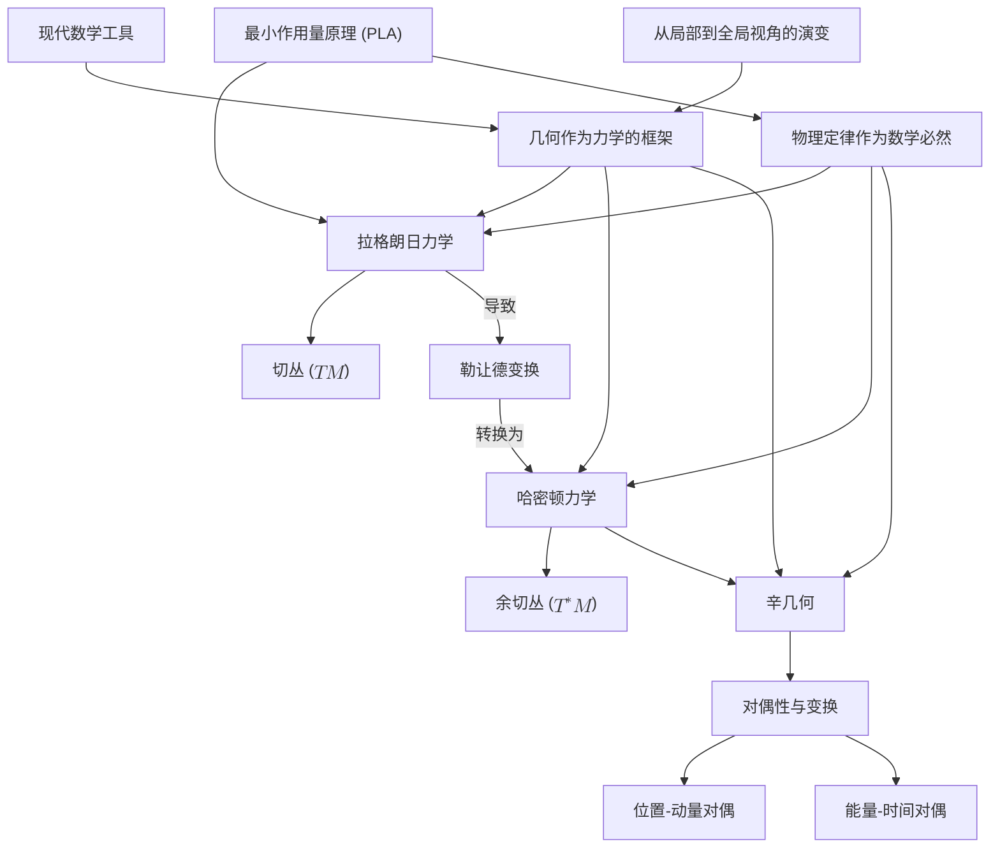

# 重构经典力学：基于最小作用量原理的几何视角
* * *

*"几何是自然之书的语言。"*
— 伽利略·伽利莱

# **1. 引言：经典力学的几何本质**

“在自然界中，没有什么是孤立的；一切都是相互关联的。”
— 约翰·沃尔夫冈·冯·歌德

经典力学，作为物理学的基石，长期以来一直是我们理解物体在力的作用下运动的主要框架。从由开普勒定律描述的行星轨道到从地球发射的抛射物的轨迹，经典力学提供了预测和分析大量物理现象的工具。然而，尽管它取得了成功并得到广泛应用，传统经典力学的表述往往呈现出碎片化的图景，强调特定的力或系统而未能揭示将它们统一起来的更深层次联系。

历史上，经典力学源于像艾萨克·牛顿这样的科学家们的丰功伟绩，他的运动定律和万有引力定律彻底改变了我们对物理世界的理解。牛顿力学关注力和加速度，提供了一种直观但有时范围有限的运动矢量描述。随着领域的发展，拉格朗日力学和哈密顿力学等替代表述被开发出来，每一种都提供了新的见解，但仍主要在传统方法的范围内运作。

然而，随着我们数学理解的加深，一个更为深刻且统一的观点变得清晰 —— 这一观点植根于几何学。几何学，即研究空间及其内部对象之间关系的学科，为描述物理系统提供了强大的语言。通过以几何视角解读经典力学，我们可以揭示支配运动的内在结构，展示出超越传统方法限制的统一性。

在这方面最重要的发展之一是**最小作用量原理**(PLA)。PLA 提出，物理系统在两个状态之间的路径是使得作用量积分驻定(通常是极小值)的路径。这个原理将系统的动力学封装在一个单一的变化陈述中，提供一条贯穿不同物理领域的统一线索。与专注于瞬时力的牛顿力学不同，PLA 考虑系统的整个轨迹，提供一个本质上几何的全局视角。

尽管其优雅性和统一潜力，PLA 通常被介绍为一种数学上的便利，而不是反映物理定律几何性质的基本原则。传统表述可能掩盖了不同机械系统之间的深层联系，并未突出几何在塑造运动定律中的角色。

**为什么需要几何重构？**

1. **传统表述的局限性**：处理复杂系统、非惯性参考系或广义坐标时，常规方法可能会变得繁琐。它们可能需要大量的计算，并不轻易暴露支配运动定律的底层简单性和统一性。

2. **缺乏对内在结构的重视**：传统力学经常依赖于坐标相关的描述，这可能掩盖物理系统的内在属性。几何方法关注独立于坐标选择的属性，揭示基本的不变量和对称性。

3. **连接现代理论**：物理学的进步，如广义相对论和量子力学，深深植根于几何概念。在几何框架内重构经典力学提供了向这些现代理论无缝过渡的可能性，并增强了我们整体的理解。

4. **物理定律的自然涌现**：通过从几何原理推导力学定律，我们可以将其视为数学必然性而非经验观察。这种视角突出了物理世界固有的和谐与一致性。

**几何框架的必要性在于其能够：**

- **统一不同表述**：几何学提供了一种共同的语言，将牛顿力学、拉格朗日力学和哈密顿力学统一起来，显示出它们是相同底层原理的不同表达。

- **阐明基本对偶性**：几何结构自然地引出物理学中的基本对偶性，如位置-动量和能量-时间。理解这些对偶性增强了我们对物理现象的理解。

- **简化复杂系统**：几何方法可以简化具有约束或对称性的系统的分析，使找到解决方案和理解物理系统的行为变得更加容易。

- **揭示更深层次的见解**：几何视角可以发现隐藏的联系和原理，导致物理学的新发现和进展。

在本文档中，我们旨在通过建立基于**最小作用量原理**的现代几何框架来**重构经典力学**。我们将首先探讨演化的根本概念以及描述变化所需的几何结构的重要性。从那里开始，我们将介绍力学几何表述所需的数学结构，如流形、切丛和余切丛、辛流形。

通过系统地发展这些概念，我们将展示经典力学的定律如何自然地从几何考虑中产生。我们将深入研究拉格朗日力学和哈密顿力学，展示它们如何通过勒让德变换相连以及它们如何适应几何框架。我们还将探索基本对偶性和对称性，强调它们的起源和含义。

**为几何力学设定舞台**

我们的旅程将由以下目标引导：

1. **基础建设**：确立演化作为物理学中的根本概念，并展示几何结构如何出于描述变化的一致性和连贯性需求而产生。

2. **几何发展**：逐步引入关键几何构造，确保每个概念都是前一个概念的自然延伸。这种方法将使复杂的数学更加易于接近和有意义。

3. **统一视角**：通过显示力学不同表述在几何框架内的相互关联，强调物理定律的统一性。这将突出经典力学背后的优雅和简洁性。

4. **对偶性整合**：研究从几何结构中产生的基本对偶性和变换，深化我们对不同物理量之间关系的理解。

5. **应用和意义**：说明这种重构框架如何为经典力学提供更深入的见解，并开辟探索混沌理论、量子力学和广义相对论等高级主题的途径。

通过拥抱几何视角，我们不仅精炼了对经典力学的理解，还配备了应对更复杂和现代物理理论的强大工具。几何成为连接不同物理领域桥梁，允许我们以更加综合和整体的方法理解自然世界。

**引言的结束**

在接下来的章节中，我们将通过几何的视角进行全面的经典力学探索。我们将看到，从简单的演化概念出发如何引出支撑所有力学的丰富而复杂的结构。这段旅程不仅会加深我们对物理定律美丽和一致性的欣赏，还会激发关于宇宙的新思考方式。

当我们深入探讨经典力学的几何本质时，我们邀请您考虑数学与物理学之间的深刻联系，并认识到几何不仅是描述空间的工具，而是现实本质结构的根本部分。通过这种方式重构经典力学，我们希望提供一种新的视角，丰富教学和研究，促进对物理世界的更深入理解并激励未来的发现。

# **2. 演化与几何的必要性**

“变化是生活中唯一不变的事物。”
— 赫拉克利特

物理学的核心概念是**演化** —— 系统随时间的连续变换。这种不断的改变不是随机的，而是遵循可以研究、理解和预测的基本原则。作为物理学的一个分支，力学旨在描述和量化这种演化。为了实现有意义且精确的描述，我们必须转向几何学，它提供了捕捉变化细微差别的基本框架。

## **2.1 演化作为物理学中的原始概念**

宇宙处于永恒的运动中。从原子的微观振动到星系的宏大运动，变化定义现实的本质结构。在物理学中，演化指的是系统状态随时间的进展。这种进展在经典力学中是确定性的，意味着给定初始条件和支配定律，系统的未来状态完全被决定。

通过将演化视为原始或基本概念，我们优先考虑**过程**的变化而非静态实体。这种动态观点符合我们对自然界的观察，即系统不断相互作用和转变。演化包括：

- **时间进程**：时间成为一个关键参数，标记状态序列。
- **状态转换**：系统根据特定规则或定律从一个状态过渡到另一个状态。

理解演化需要一种能够表达连续和光滑变换的语言 —— 由几何学提供的语言。

## **2.2 有意义变化和守恒原理的要求**

有意义地描述演化对我们理论框架提出若干要求：

### **2.2.1 连续性和光滑性**

物理系统通常表现出光滑和连续的变化。突兀或不连续的变化很少见，通常指示相变或临界现象，这些本身可以在更高层次的连续框架内描述。

- **数学必然性**：连续性允许使用微积分，使我们能够定义导数(变化率)和积分(累积量)。
- **物理现实性**：光滑演化反映自然界观察到的因果关系和局部性 —— 初始条件的小变化导致结果的小变化。

### **2.2.2 确定性和可预测性**

经典力学本质上是确定性的。这种确定性基于：

- **初始条件**：对系统在给定时间的状态的完整知识。
- **运动定律**：支配从一个状态到另一个状态演化的普遍规则。

确定性确保可预测性，这是科学研究的基石，使我们能够预测未来行为并理解过去的动力学。

### **2.2.3 守恒原理**

守恒定律是力学的核心，源自物理定律的对称性：

- **能量守恒**：孤立系统的能量保持不变。
- **动量守恒**：在没有外力的情况下，总动量保持不变。
- **角动量守恒**：当没有外部力矩作用于系统时，角动量保持不变。

这些原理限制系统的可能演化，为分析和预测提供强大的工具。

## **2.3 流形结构的必要性**

为了满足连续性、光滑性和守恒的要求，我们引入**流形**的概念。

### **2.3.1 流形作为广义空间**

**流形**是一个数学空间，在局部上类似于欧几里得空间，但可以具有更复杂的整体结构。流形为建模物理系统提供了一个灵活而通用的框架：

- **局部平凡性**：在任意点附近，流形表现得像普通的 $\mathbb{R}^n$，允许使用微积分。
- **全局复杂性**：流形可以捕捉复杂的结构，如广义相对论中的空间曲率或力学中构型空间的拓扑结构。

### **2.3.2 构型空间流形**

对于机械系统，**构型空间** $M$ 表示系统可以达到的所有可能位置或构型：

- **维数**：系统的自由度数量。
- **结构**：编码系统固有的约束和对称性。

通过将构型空间建模为流形，我们确保它具有描述光滑演化的数学性质。

### **2.3.3 描述演化的必要性**

流形对于：

- **定义光滑路径**：系统轨迹是流形 $M$ 内的光滑曲线。
- **应用微积分**：流形上的微分和积分使我们能够公式化和求解运动方程。
- **处理复杂性**：流形使我们能够建模具有复杂约束和相互作用的系统。

## **2.4 切空间与速度的涌现**

为了描述系统在构型空间流形内的演化，我们需要考虑不仅仅是位置，还有**速度**。

### **2.4.1 切空间 $T_qM$**

在流形 $M$ 的每一点 $q$ 处，存在一个**切空间** $T_qM$：

- **定义**：系统可以通过 $q$ 点的所有可能切向方向的集合。
- **解释**：切向量表示系统在位置 $q$ 处的瞬时速度。

这些切空间捕捉特定点处的运动概念，包含所有可能的即时变化。

### **2.4.2 切丛 $TM$**

收集所有切空间形成**切丛** $TM$：

- **构造**：$TM = \bigcup_{q \in M} T_qM$。
- **维数**：如果 $M$ 是 $n$ 维的，则 $TM$ 是 $2n$ 维的。
- **状态表示**：$TM$ 中的点是 $(q, v)$ 配对，其中 $q \in M$ 且 $v \in T_qM$。

切丛提供一个综合的空间，其中位置和速度统一，形成动力学展开的舞台。

### **2.4.3 速度作为切空间中的向量**

- **瞬时变化率**：速度是位置关于时间的导数，$v = \dot{q}$。
- **向量场**：为 $M$ 中的每一点分配一个速度向量定义了一个向量场，表示系统的一个流或演化。

通过利用切空间和切丛，我们将运动的概念直接嵌入构型空间的几何结构中。

## **2.5 几何作为力学的框架**

几何的必要性自然源于描述演化的需求：

- **数学严谨性**：几何提供准确表述物理定律所需的精确语言。
- **统一表示**：几何结构在一致的框架内统一力学的各个方面(位置、速度、加速度)。
- **促进流形上的微积分**：微分几何将微积分扩展到流形，使我们能够处理曲线、曲面及其高维类比。

### **2.5.1 对力学的影响**

- **运动方程**：可以几何地表述为流形上的微分方程。
- **守恒定律**：源自流形或其上定义的几何结构(例如辛形式)的对称性。
- **推广**：几何框架容纳了经典系统，并无缝扩展到相对论和量子力学。

## **2.6 结论**

通过认识到演化是物理学中的基础概念，我们看到几何不仅是工具，而且是必需的。流形、切空间和切丛的几何结构自然地从描述连续、确定性和守恒演化的需要中涌现。

这一几何基础为力学的发展奠定了舞台：

- **拉格朗日力学**：利用切丛 $TM$ 以位置和速度表述动力学。
- **哈密顿力学**：在此基础上进一步构建，引入余切丛和辛几何。

理解力学定律深深植根于几何学使我们能够欣赏物理定律的统一性和一致性。它提供一个稳健的框架，用于探索更复杂的系统，并为现代物理学的进步铺平道路。

*通过深入探讨演化的内在本质和几何，我们为经典力学大厦奠定了坚实的基础。几何成为宇宙传达其基本原理的语言，揭示粒子路径和空间曲率是同一底层现实的表现。*

# **3. 最小作用量原理：变分力学的基础**

“作用量表达了优先级。”
— 圣雄甘地

**最小作用量原理 (PLA)** 是物理学中最深刻和统一的原则之一。作为经典力学的基石，它提供一个强大而优雅的框架，从中运动定律自然涌现。与专注于瞬时力和加速度的表述不同，PLA 考虑系统所经历的整个路径，提供以几何和变分微积分语言为基础的运动的整体视图。

## **3.1 作用量泛函的介绍**

在 PLA 的核心是**作用量泛函**的概念。对于一个从时间 $t_1$ 的初始构型过渡到时间 $t_2$ 的最终构型的机械系统，作用量 $S$ 定义为：
$$
S[q] = \int_{t_1}^{t_2} L(q(t), \dot{q}(t), t) \, dt
$$
这里：

- $q(t)$ 表示系统的**广义坐标**，封装系统在时间$t$的构型。
- $\dot{q}(t)$ 表示**广义速度**，即广义坐标的对时间的导数。
- $L(q, \dot{q}, t)$ 是**拉格朗日函数**，描述系统动力学的函数，通常定义为：
  $$
  L = T - V
  $$
  其中 $T$ 是动能，$V$ 是势能。

作用量 $S[q]$ 是一个**泛函** —— 它将一个实数赋给系统在 $t_1$ 和 $t_2$ 之间可能遵循的每个路径 $q(t)$。它沿着轨迹累积动力学，并通过时间积分拉格朗日函数来表达。

### **3.1.1 作用量泛函的重要性**

作用量泛函重要性体现在几个方面：

- **全局视角**：它考虑的是系统的整个路径，而不仅仅是每个瞬间的局部性质。
- **变分框架**：使应用变分微积分推导运动方程成为可能。
- **与对称性的联系**：通过对称性与守恒定律之间的对应关系，如诺特定理所示。

作用量充当系统物理轨迹与其运动所依据的几何和变分原理之间的桥梁。

## **3.2 欧拉-拉格朗日方程的推导**

最小作用量原理断言，系统实际采取的路径是使得作用量泛函 $S[q]$ 在路径的无穷小变化下**驻定**，且端点固定。数学上，这表示为：
$$
\delta S = 0
$$

### **3.2.1 计算作用量的变化**

考虑路径 $q(t)$ 的一个小变化 $\delta q(t)$，使得：
$$
q(t) \rightarrow q(t) + \delta q(t), \quad \delta q(t_1) = \delta q(t_2) = 0
$$
作用量的变化为：
$$
\delta S = \int_{t_1}^{t_2} \left( \frac{\partial L}{\partial q} \delta q + \frac{\partial L}{\partial \dot{q}} \delta \dot{q} \right) dt
$$
对涉及 $\delta \dot{q}$ 的项使用分部积分：
$$
\int_{t_1}^{t_2} \frac{\partial L}{\partial \dot{q}} \delta \dot{q} \, dt = \left[ \frac{\partial L}{\partial \dot{q}} \delta q \right]_{t_1}^{t_2} - \int_{t_1}^{t_2} \frac{d}{dt} \left( \frac{\partial L}{\partial \dot{q}} \right) \delta q \, dt
$$
由于 $\delta q(t_1) = \delta q(t_2) = 0$，边界项消失(为零)，剩下：
$$
\delta S = \int_{t_1}^{t_2} \left( \frac{\partial L}{\partial q} - \frac{d}{dt} \frac{\partial L}{\partial \dot{q}} \right) \delta q \, dt
$$
为了使 $\delta S$ 在任意 $\delta q(t)$ 下为零，被积函数必须为零：
$$
\frac{d}{dt} \left( \frac{\partial L}{\partial \dot{q}} \right) - \frac{\partial L}{\partial q} = 0
$$
这些是**欧拉-拉格朗日方程**，描述系统动力学的基本微分方程。

### **3.2.2 物理解释**

欧拉-拉格朗日方程将牛顿第二定律推广到由广义坐标和速度描述的系统，自然地容纳约束和非笛卡尔坐标系。它们从变分原理而非直接力分析中提炼出系统行为的本质。

## **3.3 最小作用量原理的哲学和物理意义**

PLA 不仅仅是一种数学形式主义；它体现关于自然界的深刻哲学见解。

### **3.3.1 自然效率和经济性**

该原理暗示自然界以最优方式运作：

- **效率**：系统沿着优化(使作用量驻定)的路径演化。
- **自然的经济性**：符合自然过程倾向于最小化“努力”或资源消耗的观点。

这一概念与其他物理原则相呼应，例如光学中的费马最短时间原理。

### **3.3.2 内在对称性和守恒定律**

通过**诺特定理**，PLA 揭示作用量中的对称性对应于守恒定律：

- **时间不变性**：如果 $L$ 不显式依赖于时间，则能量守恒。
- **空间不变性**：如果 $L$ 在空间平移下不变，则线动量守恒。
- **旋转不变性**：如果 $L$ 在旋转下不变，则角动量守恒。

这些对称性与守恒定律之间的联系强调 PLA 在统一物理学不同方面的根本角色。

### **3.3.3 全局描述与局部描述**

PLA 提供一种**全局**的运动描述：

- **整体方法**：考虑整个轨迹，而不是瞬时状态。
- **路径依赖性**：强调系统的历史对其演化的影响。

这与局部表述(如牛顿定律)形成对比，并更接近现代物理理论，如量子力学和广义相对论。

## **3.4 作为运动表现的最小作用量原理**

作用量泛函测量系统随时间运动的“累积效应”。它整合动能和势能之间的相互作用，将动力学囊括到一个单一的标量量。

### **3.4.1 作用量作为运动的度量**

- **标量量**：提供一个表征路径的单个数值。
- **整合性质**：考虑沿着轨迹的所有贡献。
- **路径比较**：通过比较作用量值确定“优选”路径。

### **3.4.2 从演化到作用量的转变**

基于演化概念：

- **从状态到路径**：将焦点从离散状态转移到连续路径。
- **变分视角**：引入根据极值原理选择路径的思想。

通过将作用量视为运动的核心，我们加深了对系统如何根据效率和自然法则演化的理解。

## **3.5 说明原理的例子**

### **3.5.1 例子1：自由粒子**

对于质量为 $m$ 的自由空间中运动的粒子：

- **拉格朗日函数**：
  $$
  L = \frac{1}{2} m \dot{q}^2
  $$

- **作用量**：
  $$
  S[q] = \int_{t_1}^{t_2} \frac{1}{2} m \dot{q}^2 dt
  $$

- **欧拉-拉格朗日方程**：
  $$
  \frac{d}{dt}(m \dot{q}) = 0 \implies m \ddot{q} = 0
  $$

- **解释**：粒子以恒定速度运动，沿直线路径移动 —— 这是作用量最小的路径。

### **3.5.2 例子2：简谐振子**

对于连接在弹簧上的质量 $m$，弹簧的刚度为 $k$：

- **拉格朗日函数**：
  $$
  L = \frac{1}{2} m \dot{q}^2 - \frac{1}{2} k q^2
  $$

- **欧拉-拉格朗日方程**：
  $$
  m \ddot{q} + k q = 0
  $$

- **解释**：振子沿着正弦波运动，在振荡路径上最小化作用量。

这些例子展示 PLA 如何直接导致熟悉的物理系统所遵循的方程，强调其基础性角色。

## **3.6 变分原理与力学的基础**

### **3.6.1 哈密顿原理**

PLA 常被称为**哈密顿原理**，它正式化了系统在两个时间之间的演化使得作用量积分驻定的想法。

- **推广**：适用于广泛的系统，包括有约束的系统或超越力学的领域。
- **数学基础**：确立变分微积分作为物理学中的核心数学工具。

### **3.6.2 扩展到场论**

变分方法自然扩展到经典场论：

- **场作为无限维系统**：通过时空积分应用作用量原理。
- **场的欧拉-拉格朗日方程**：导致基本方程，如电磁学中的麦克斯韦方程。

### **3.6.3 与量子力学的联系**

PLA 为量子力学奠定基础：

- **路径积分表述**：费曼的方法对所有可能路径求和，每条路径按 $e^{i S/\hbar}$ 加权，其中 $\hbar$ 是约化普朗克常数。
- **量子-经典对应**：在经典极限($\hbar \rightarrow 0$)下，驻定作用量的路径占主导地位。

这突显了 PLA 在连接经典和量子物理中的关键角色。

## **3.7 强调自然效率和对称性**

### **3.7.1 作用量与最优性**

最小作用量原理(PLA)体现物理过程以最“经济”的方式发生的思想：

- **最优路径**：系统选择优化作用量的轨迹。
- **极小原理**：尽管称为“最小作用量”，该原理实际上要求作用量驻定，这可以对应于极小值、极大值或鞍点。

### **3.7.2 对称性作为基本特征**

对称性的考虑变得核心：

- **不变作用量**：在某些变换下不变的作用量导致守恒量。
- **诺特定理**：形式化了对称性与守恒定律之间的紧密联系。

理解这些对称性丰富了我们对支配运动的物理定律的理解。

## **3.8 为拉格朗日力学做准备**

对 PLA 的探讨为**拉格朗日力学**的发展奠定基础：

- **几何结构**：引入如切丛 $TM$ 等几何构造的需要。
- **广义坐标**：鼓励使用适合问题的任意坐标。
- **统一框架**：提供一种一致的方法来推导不同系统的运动方程。

通过将力学建立在 PLA 之上，我们采用一种既灵活又深刻联系到系统构型空间几何的基础方法。

## **3.9 结论**

基于前一章讨论的演化概念和几何的必要性，最小作用量原理引入作用量作为运动的标量度量的概念。它提供一个变分基础，从中运动方程自然涌现。这种方法不仅提供对系统动力学的更深入见解，还为我们用**切丛**和**拉格朗日力学**来表述力学的几何公式做好了准备。

PLA 充当抽象几何概念与具体物理定律之间的桥梁，突显自然界设计中的内在效率和对称性。它将力学研究从孤立力的考察提升到对决定运动的基本原理的理解。

*通过拥抱最小作用量原理，我们揭示了一条编织进宇宙结构中的指导线 —— 这条线诉说着自然过程中固有的优化和和谐。这一原理不仅统一了各种力学表述，还照亮了通向更深入、更连贯理解物理世界的道路。*

# **4. 拉格朗日力学与切丛**

*"千里之行，始于足下。"*
— 老子

基于最小作用量原理，我们深入探讨经典力学，通过几何的视角进行分析。**拉格朗日力学**提供一个强大而优雅的框架，用于分析机械系统的动力学。通过在**切丛** $TM$ 的几何背景下构建力学，我们揭示位置和速度之间的自然相互作用，并发现支配运动的内在结构。这种方法不仅丰富我们对力学的理解，还为揭示基本对偶性和过渡到哈密顿力学奠定基础。

## **4.1 构型空间与切丛 $TM$**

### **4.1.1 构型空间 $M$**

机械系统的**构型空间** $M$ 是一个流形，表示系统可以达到的所有可能的位置或构型。每个点 $q \in M$ 对应一组广义坐标 $(q^1, q^2, \dots, q^n)$，这些坐标完全描述系统的空间状态。

- **自由度**：$M$ 的维数由系统的自由度 $n$ 决定。
- **广义坐标**：这些坐标不限于笛卡尔坐标；它们可以是任意唯一指定系统构型的参数，适应约束和复杂几何形状。

通过将 $M$ 视为一个光滑流形，我们确保微积分和微分几何可以应用，从而便于精确描述运动的数学表达。

### **4.1.2 切空间 $T_qM$**

在每个点 $q \in M$ 处，**切空间** $T_qM$ 是一个向量空间，包含系统在该构型下所有可能的速度向量。

- **定义**：$T_qM$ 是所有可能通过 $q$ 点的曲线在时间 $t$ 处的切向量集合。
- **速度作为切向量**：速度 $\dot{q}$ 是 $T_qM$ 的元素，表示系统构型的瞬时变化率。

切空间捕捉运动的概念，在每个流形点提供局部线性结构，实现运动的线性近似。

### **4.1.3 切丛 $TM$**

**切丛** $TM$ 是所有 $M$ 的切空间的并集，形成一个新的维数加倍的流形。
$$
TM = \bigcup_{q \in M} T_qM
$$

- **$TM$ 的结构**：$TM$ 中的每个点是一个配对 $(q, \dot{q})$，其中 $q \in M$ 且 $\dot{q} \in T_qM$。
- **纤维丛性质**：$TM$ 是 $M$ 上的向量丛，每个纤维 $T_qM$ 附着在其基点 $q$ 上。

切丛优雅地封装系统的位移和速度，提供在拉格朗日框架内分析动力学的自然环境。

## **4.2 切丛上的拉格朗日函数 $L(q, \dot{q}, t)$**

### **4.2.1 拉格朗日函数的定义与角色**

**拉格朗日函数** $L$ 是一个映射，将 $TM \times \mathbb{R}$ 中的每个状态 $(q, \dot{q}, t)$ 映射到一个实数，反映系统的动力学。
$$
L: TM \times \mathbb{R} \rightarrow \mathbb{R}
$$
对于大多数机械系统，拉格朗日函数定义为：
$$
L(q, \dot{q}, t) = T(q, \dot{q}, t) - V(q, t)
$$

- **动能 $T$**：依赖于 $\dot{q}$，可能还依赖于 $q$ 和 $t$，表示由于运动产生的能量。
- **势能 $V$**：是 $q$ 和可能 $t$ 的函数，表示由于在力场中的位置而存储的能量。

拉格朗日函数封装系统动力学的关键信息，是推导运动方程的基础构件。

### **4.2.2 作为切丛上的函数的拉格朗日函数**

通过在 $TM$ 上定义 $L$，我们利用切丛的几何结构：

- **依赖于 $(q, \dot{q})$**：反映系统对位置和速度的依赖。
- **几何解释**：位置 $q$ 是 $M$ 上的点，而速度 $\dot{q}$ 是 $T_qM$ 中的向量，使得 $L$ 成为 $TM$ 上的函数。

这种几何观点提供更深入的见解，说明系统的物理属性如何与流形的结构内在联系。

## **4.3 使用几何结构推导运动方程**

### **4.3.1 重新审视作用量泛函**

作用量泛函 $S$ 定义为沿着在 $M$ 中路径 $q(t)$ 的拉格朗日函数的积分：
$$
S[q] = \int_{t_1}^{t_2} L(q(t), \dot{q}(t), t) \, dt
$$

- **路径依赖性**：作用量依赖于 $t_1$ 和 $t_2$ 之间的整个轨迹。
- **变分原理**：物理轨迹使作用量最小化(或驻定)。

### **4.3.2 应用变分原理**

为了推导运动方程，我们考虑路径的无穷小变化 $\delta q(t)$，满足条件 $\delta q(t_1) = \delta q(t_2) = 0$。

计算作用量的变化：
$$
\delta S = \int_{t_1}^{t_2} \left( \frac{\partial L}{\partial q^i} \delta q^i + \frac{\partial L}{\partial \dot{q}^i} \delta \dot{q}^i \right) dt .
$$
通过分部积分并应用边界条件，我们得到：
$$
\delta S = \int_{t_1}^{t_2} \left( \frac{\partial L}{\partial q^i} - \frac{d}{dt} \frac{\partial L}{\partial \dot{q}^i} \right) \delta q^i dt .
$$
为了使 $\delta S = 0$ 对任意 $\delta q^i(t)$ 成立，被积函数必须为零：
$$
\frac{d}{dt} \left( \frac{\partial L}{\partial \dot{q}^i} \right) - \frac{\partial L}{\partial q^i} = 0.
$$
这些是**欧拉-拉格朗日方程**，是拉格朗日力学中的基本运动方程。

### **4.3.3 欧拉-拉格朗日方程的几何解释**

欧拉-拉格朗日方程描述 $TM$ 上的曲线：

- **相空间轨迹**：其解 $(q(t), \dot{q}(t))$ 在切丛中追踪出路径。
- **$TM$上的流**：方程定义 $TM$ 上的一个向量场，表示系统的动力学。

这种解释突显机械系统的演化如何由切丛的几何结构所支配。

## **4.4 对称性、约束与守恒定律**

### **4.4.1 拉格朗日框架中的对称性**

对称性在力学中扮演关键角色，通常导致守恒定律。

- **对称性的定义**：在变换 $q^i \rightarrow Q^i(q^j, t)$ 下，拉格朗日函数保持不变(直至一个全导数)。
- **对称性的类型**：
  - **连续对称性**：由连续参数参数化的无穷小变换。
  - **离散对称性**：如反射或置换等变换。

### **4.4.2 诺特定理**

**诺特定理**建立对称性与守恒定律之间深刻的关系：

- **表述**：对于作用量的每一个连续对称性，存在一个相应的守恒量。
- **守恒量**：
  - **能量**：如果 $L$ 不显式依赖于时间，则能量守恒。
  - **动量**：如果 $L$ 在空间平移下不变，则动量守恒。
  - **角动量**：如果 $L$ 在旋转下不变，则角动量守恒。

诺特定理是理论物理学的基石，揭示几何与物理定律之间的深层联系。

### **4.4.3 约束与广义坐标**

机械系统通常有约束，限制其运动：

- **完整约束**：仅依赖于坐标和时间的约束，可表示为 $f(q^i, t) = 0$。
- **非完整约束**：依赖于坐标、速度或更高阶导数，不能整合为仅依赖于坐标的约束。

**引入约束**：

- **减少自由度**：使用约束消除变量，将 $n$ 减少到 $m < n$。
- **拉格朗日乘子**：在拉格朗日函数中引入附加项以强制约束。

### **4.4.4 约束系统中的守恒定律**

约束可以影响守恒定律：

- **修改后的对称性**：约束可能破坏某些对称性，改变守恒定律。
- **约束力**：理想情况下，约束力不做功，允许能量守恒继续存在。

理解约束与对称性之间的相互作用对于准确描述系统的动力学至关重要。

## **4.5 深入理解拉格朗日力学**

### **4.5.1 拉格朗日形式主义的几何本质**

拉格朗日形式主义本质上是几何的：

- **坐标无关描述**：运动方程可以独立于坐标选择表达，强调内在性质。
- **纤维丛视角**：切丛 $TM$ 为动力学提供自然设置，基流形 $M$ 和纤维 $T_qM$ 分别反映位置和速度。

### **4.5.2 勒让德变换的角色**

**勒让德变换**连接了拉格朗日和哈密顿形式主义：

- **过渡到余切丛 $T^*M$**：引入共轭动量 $p_i = \partial L / \partial \dot{q}^i$，将焦点从 $T_qM$ 中的速度转移到 $T_q^*M$ 中的动量。
- **准备哈密顿力学**：为探索辛几何和位置与动量之间的对偶性奠定基础。

这一变换强调几何框架内不同力学表述之间的深刻联系。

## **4.6 几何见解的实例**

### **4.6.1 双摆**

由两个末端相连的摆组成的系统：

- **配置空间 $M$**：由角度 $(\theta_1, \theta_2)$ 描述。
- **切丛 $TM$**：包括角速度 $(\dot{\theta}_1, \dot{\theta}_2)$。
- **拉格朗日函数**：
  $$
  L = \frac{1}{2} m_1 l_1^2 \dot{\theta}_1^2 + \frac{1}{2} m_2 \left[ l_1^2 \dot{\theta}_1^2 + l_2^2 \dot{\theta}_2^2 + 2 l_1 l_2 \dot{\theta}_1 \dot{\theta}_2 \cos(\theta_1 - \theta_2) \right] - V
  $$
  其中 $V$ 是由于重力引起的势能。

- **运动方程**：通过欧拉-拉格朗日方程推导，反映各组件之间的复杂相互作用。

### **4.6.2 电磁场中的带电粒子**

一个带有电荷 $q$ 的粒子在电磁势 $(\phi, \mathbf{A})$ 中运动：

- **配置空间 $M$**：位置 $\mathbf{r}$。
- **切丛 $TM$**：包括速度 $\dot{\mathbf{r}}$。
- **拉格朗日函数**：
  $$
  L = \frac{1}{2} m \dot{\mathbf{r}}^2 + q \dot{\mathbf{r}} \cdot \mathbf{A}(\mathbf{r}, t) - q \phi(\mathbf{r}, t)
  $$

- **几何见解**：与电磁场的相互作用通过势能几何地纳入拉格朗日函数，从而影响动力学。

## **4.7 几何拉格朗日方法的优势**

### **4.7.1 力学的统一处理**

通过利用切丛，我们实现了统一：

- **适用性**：该形式主义适用于粒子、刚体、连续介质和场。
- **灵活性**：自然地处理各种坐标系和约束。

### **4.7.2 揭示内在结构**

几何方法揭示了底层结构：

- **内在性质**：关注于独立于坐标选择的性质。
- **自然框架**：流形和丛结构与系统的物理现实相一致。

### **4.7.3 为高级理论奠定基础**

基于几何建立力学为我们准备了：

- **哈密顿力学**：过渡到余切丛和辛几何。
- **量子力学**：几何量化依赖于此处发展的结构。
- **广义相对论**：流形和张量的语言是必不可少的。

## **4.8 为对偶性和哈密顿力学做准备**

在切丛内探讨拉格朗日力学为更深入的研究奠定了基础：

- **位置-动量对偶性**：即将来临的勒让德变换将揭示位置和动量的对偶性质。
- **辛结构**：余切丛 $T^*M$ 引入辛几何，对于哈密顿力学至关重要。
- **正则变换**：理解变换的几何基础增强我们分析和简化复杂系统的能力。

## **4.9 结论**

通过在切丛的几何框架内发展拉格朗日力学，我们将最小作用量原理与基于几何的具体力学表述联系起来。这种方法不仅提供了对运动本质的深刻见解，还为我们探索对偶性和过渡到哈密顿力学做好了准备。此处揭示的内在结构对于理解支配物理世界的深层次连接和对称性至关重要。

*进入拉格朗日力学的几何领域的旅程是揭示数学与物理学之间深刻和谐的关键一步。随着我们不断前进，每个概念都像一块垫脚石，引导我们走向更加统一和内在理解的力学，这些力学编排着宇宙的运作。*

# **5. 勒让德变换与余切丛的出现**

*"每一个出口都是另一个地方的入口。"*
— 汤姆·斯托帕德

在我们通过几何形式化经典力学的旅程中，我们已经在切丛 $TM$ 的框架内深入理解拉格朗日力学。我们看到系统的位移和速度如何在这种设置下自然统一。然而，为了更深入探讨力学中的对称性和基本对偶性，我们需要过渡到一个新的几何结构 —— **余切丛** $T^*M$。**勒让德变换**作为这两个领域之间的桥梁，使我们能够以位置和动量为变量重新表述力学，并为哈密顿力学铺平道路。

## **5.1 勒让德变换的介绍**

### **5.1.1 定义与数学表述**

**勒让德变换**是一种数学运算，它将一个变量集的函数转换为另一个变量集的函数，通常是在微分关系相关的变量之间进行转换。在力学的背景下，它允许我们将广义速度 $\dot{q}^i$ 的描述转换为广义动量 $p_i$ 的描述。

给定一个函数 $f(y)$，其勒让德变换 $g(z)$ 定义为：
$$
g(z) = \sup_{y} \left( y z - f(y) \right)
$$
在力学中，拉格朗日函数 $L(q, \dot{q}, t)$ 依赖于位置 $q$、速度 $\dot{q}$，以及可能的时间 $t$。$L$ 的勒让德变换产生**哈密顿函数** $H(q, p, t)$，它依赖于位置 $q$、广义动量 $p$ 和时间 $t$。

### **5.1.2 广义动量**

**广义动量** $p_i$ 定义为拉格朗日函数关于广义速度的偏导数：
$$
p_i = \frac{\partial L}{\partial \dot{q}^i}
$$
这一定义建立切丛 $TM$ 变量 $(q^i, \dot{q}^i)$ 与余切丛 $T^*M$ 变量 $(q^i, p_i)$ 之间的关系。

## **5.2 余切丛 $T^*M$ 的出现**

### **5.2.1 余切空间 $T_q^*M$**

在每个点 $q \in M$ 处，**余切空间** $T_q^*M$ 是切空间 $T_qM$ 的对偶空间。它由所有将切向量映射到实数的线性泛函(余向量)组成。

- **定义**：对于每个 $q \in M$，$T_q^*M$ 是所有线性映射 $\omega: T_qM \rightarrow \mathbb{R}$ 的集合。
- **广义动量作为余向量**：广义动量 $p_i$ 是 $T_q^*M$ 中余向量的分量。

### **5.2.2 余切丛 $T^*M$**

**余切丛** $T^*M$ 是所有余切空间在 $M$ 上的并集：
$$
T^*M = \bigcup_{q \in M} T_q^*M
$$

- **$T^*M$ 中的点**：每个点是一个配对 $(q, p)$，其中 $q \in M$ 且 $p \in T_q^*M$。
- **相空间解释**：余切丛作为哈密顿力学的自然相空间，编码位置和动量。

## **5.3 通过勒让德变换从拉格朗日力学到哈密顿力学**

### **5.3.1 构建哈密顿函数**

**哈密顿函数** $H(q, p, t)$ 通过拉格朗日函数 $L(q, \dot{q}, t)$ 的勒让德变换获得：
$$
H(q, p, t) = p_i \dot{q}^i - L(q, \dot{q}, t)
$$
其中速度 $\dot{q}^i$ 通过求解关系 $p_i = \partial L / \partial \dot{q}^i$ 表示为位置 $q^i$ 和动量 $p_i$ 的函数，假设该变换是非退化的(即 Hessian 矩阵 $\partial^2 L / \partial \dot{q}^i \partial \dot{q}^j$ 是可逆的)。

### **5.3.2 运动方程的等价性**

勒让德变换确保从哈密顿形式主义推导出的运动方程与从拉格朗日形式主义推导出的运动方程等价。

- **哈密顿方程**：
  $$
  \dot{q}^i = \frac{\partial H}{\partial p_i}, \quad \dot{p}_i = -\frac{\partial H}{\partial q^i}
  $$

- **一致性**：这些方程可以被证明与从拉格朗日函数得到的欧拉-拉格朗日方程等价。

## **5.4 位置与速度、位置与动量之间的关系**

### **5.4.1 $TM$ 与 $T^*M$ 之间的对偶性**

从 $TM$ 到 $T^*M$ 的过渡突显一种对偶性：

- **切向量与余向量**：速度 $\dot{q}^i$ 是 $T_qM$ 中切向量的分量，而动量 $p_i$ 是 $T_q^*M$ 中余向量的分量。
- **配对**：切向量和余向量之间的配对由 $p_i \dot{q}^i$ 给出，这是勒让德变换中的表达式。

### **5.4.2 逆变换**

在适当条件下，勒让德变换是可逆的：

- **从速度到动量**：$p_i = \frac{\partial L}{\partial \dot{q}^i}$
- **从动量到速度**：$\dot{q}^i = \frac{\partial H}{\partial p_i}$

这种可逆性使我们可以在拉格朗日和哈密顿描述之间无缝切换，取决于给定问题中哪个变量更为方便。

## **5.5 能量函数与哈密顿函数的意义**

### **5.5.1 总能量表达式**

在许多情况下，哈密顿函数对应于系统的总能量 $E$：
$$
H(q, p, t) = E = T + V
$$

- **保守系统**：对于不显式依赖时间的拉格朗日函数，如果动能 $T$ 是速度的二次函数且势能 $V$ 不依赖于速度，则 $H = E$。
- **非保守系统**：对于显式依赖时间或具有速度依赖势能(如电磁势)的系统，$H$ 可能不等于总能量。

### **5.5.2 哈密顿函数在动力学中的角色**

哈密顿函数扮演多个角色：

- **演化生成元**：在哈密顿方程中，$H$ 支配系统的时演化。
- **守恒定律**：如果 $H$ 不显式依赖于时间，则沿着轨迹它是守恒的，反映能量守恒。
- **辛结构**：$H$ 定义保持辛结构的相空间流，这是哈密顿力学中的关键性质。

## **5.6 勒让德变换的几何解释**

### **5.6.1 接触结构与辛形式**

勒让德变换可以从接触几何和辛几何的角度进行几何理解：

- **接触流形**：空间 $TM \times \mathbb{R}$ 具有坐标 $(q^i, \dot{q}^i, t)$，可以配备接触结构。
- **辛流形**：余切丛 $T^*M$ 自然携带辛结构，由典范辛形式 $\omega$ 定义：
  $$
  \omega = dq^i \wedge dp_i
  $$

- **变换**：勒让德变换将 $TM$ 上的接触结构映射到 $T^*M$ 上的辛结构。

### **5.6.2 纤维丛与对偶性**

- **纤维丛**：$TM$ 和 $T^*M$ 都是 $M$ 上的纤维丛，纤维分别为 $T_qM$ 和 $T_q^*M$。
- **纤维的对偶性**：纤维是对偶向量空间，反映速度和动量之间的对偶性。

## **5.7 说明勒让德变换的例子**

### **5.7.1 简谐振子**

考虑一维简谐振子，其拉格朗日函数为：
$$
L = \frac{1}{2} m \dot{q}^2 - \frac{1}{2} k q^2
$$

- **计算广义动量**：
  $$
  p = \frac{\partial L}{\partial \dot{q}} = m \dot{q}
  $$

- **构建哈密顿函数**：
  $$
  H = p \dot{q} - L = \frac{p^2}{2m} + \frac{1}{2} k q^2
  $$

- **哈密顿方程**：
  $$
  \dot{q} = \frac{\partial H}{\partial p} = \frac{p}{m}, \quad \dot{p} = -\frac{\partial H}{\partial q} = -k q
  $$

这些方程等价于从拉格朗日形式主义得到的二阶微分方程。

### **5.7.2 电磁场中的带电粒子**

对于一个带有电荷 $e$ 的粒子在电磁势 $\phi(q, t)$ 和 $\mathbf{A}(q, t)$ 中：

- **拉格朗日函数**：
  $$
  L = \frac{1}{2} m \dot{q}^2 + e \dot{q} \cdot \mathbf{A}(q, t) - e \phi(q, t)
  $$

- **广义动量**：
  $$
  p = \frac{\partial L}{\partial \dot{q}} = m \dot{q} + e \mathbf{A}(q, t)
  $$

- **哈密顿函数**：
  $$
  H = p \dot{q} - L = \frac{1}{2m} \left( p - e \mathbf{A} \right)^2 + e \phi(q, t)
  $$

这说明勒让德变换如何适应具有速度依赖势能的系统，导致一个正确考虑电磁相互作用的哈密顿函数。

## **5.8 勒让德变换在力学中的重要性**

### **5.8.1 形式的统一**

勒让德变换提供一种系统的方法，在拉格朗日和哈密顿力学之间进行转换：

- **灵活性**：使我们能够选择最适合给定问题的形式。
- **完整性**：确保变换过程中不丢失信息，保持两种形式的等价性。

### **5.8.2 强调基本对偶性**

变换强调力学中的对偶性质：

- **位置和动量**：在哈密顿形式主义中，变量 $q^i$ 和 $p_i$ 被平等对待。
- **辛结构**：辛形式 $\omega = dq^i \wedge dp_i$ 封装内在的对偶性，并在哈密顿演化下保持不变。

### **5.8.3 为高级理论奠定基础**

理解勒让德变换对于以下领域至关重要：

- **辛几何**：构成了哈密顿力学的数学基础。
- **量子力学**：量子力学中的相空间结构和算符与经典相空间和可观测量密切相关。
- **热力学与统计力学**：勒让德变换关联了不同的热力学势(例如，从内能到焓或吉布斯自由能)。

## **5.9 过渡到哈密顿力学**

在建立勒让德变换和余切丛 $T^*M$ 的出现之后，我们现在可以深入探讨**哈密顿力学**：

- **相空间动力学**：哈密顿力学描述系统在相空间 $T^*M$ 中的演化，位置和动量作为基本变量。
- **辛结构**：哈密顿流下辛形式的保持是核心方面，导致强大的守恒原理。
- **正则变换**：几何框架促进对保持辛结构的变换的研究，这对于简化问题和揭示更深层次的对称性至关重要。

## **5.10 结论**

通过将勒让德变换作为几何框架的自然结果引入，我们建立了拉格朗日力学与哈密顿力学之间的深刻联系。这座桥梁不仅是一个数学上的便利，而且反映了位置和动量之间的一种根本对偶性，这种对偶性编码在切丛 $TM$ 和余切丛 $T^*M$ 的结构中。

余切丛作为哈密顿力学的适当设置，其中辛几何扮演核心角色。理解这一过渡加深我们对经典力学几何性质的欣赏，并为我们探索哈密顿动力学、辛结构和基本对偶性的丰富领域做好了准备。

*"每一个出口都是另一个地方的入口"* ，因此，当我们离开拉格朗日力学和切丛的世界时，我们进入了哈密顿力学的复杂世界，在这里，余切丛和辛几何揭示物理定律结构的新视角和见解。

# **6. 哈密顿力学与辛几何**

*"我们观察的不是自然本身，而是自然暴露在我们的提问方法之下。"*
— 沃纳·海森堡

当我们继续通过几何的视角探索经典力学时，我们来到了**哈密顿力学**的强大框架。基于余切丛 $T^*M$ 和勒让德变换的概念，哈密顿力学提供一个深刻的动力学物理系统视角。在这个表述的核心是**辛几何**，它提供描述哈密顿动力学展开的相空间所需的数学结构。

在本章中，我们将深入探讨哈密顿力学与辛几何之间的内在关系。我们将研究辛结构不仅是数学抽象，而且是保持动力学本质的一个根本方面。通过引入辛流形和辛形式 $\omega$，我们对支配物理系统的守恒定律和对称性有了更深入的理解。

## **6.1 辛流形与辛形式 $\omega$ 的介绍**

### **6.1.1 作为辛流形的余切丛**

一个流形 $M$ 的**余切丛** $T^*M$ 在哈密顿力学中作为自然的相空间。$T^*M$ 中的每个点代表系统的状态，由位置 $q^i$ 和相应的动量 $p_i$ 指定。

一个**辛流形**是一个光滑偶数维流形 $(P, \omega)$ ，配备一个闭的、非退化的 $2$-形式 $\omega$：

1. **闭性**：$d\omega = 0$，其中 $d$ 是外导数。
2. **非退化性**：对于任意非零向量 $v \in T_pP$，存在一个向量 $w \in T_pP$ 使得 $\omega(v, w) \neq 0$。

由于**典范辛形式**的存在，余切丛 $T^*M$ 自然携带一个辛结构。

### **6.1.2 典范辛形式 $\omega$**

余切丛 $T^*M$ 上的典范辛形式 $\omega$ 定义为：
$$
\omega = -d\theta
$$
其中 $\theta$ 是**典范 $1$-形式**(也称为**刘维尔 $1$-形式**)。在局部坐标$(q^i, p_i)$中，典范 $1$-形式由下式给出：
$$
\theta = p_i \, dq^i
$$
因此，辛形式变为：
$$
\omega = -d(p_i \, dq^i) = -dp_i \wedge dq^i
$$
由于楔积是反对称的，我们可以写成：
$$
\omega = dq^i \wedge dp_i
$$
这个 $2$-形式 $\omega$ 封装了哈密顿力学中相空间的基本几何结构。

## **6.2 利用辛几何表述哈密顿方程**

### **6.2.1 哈密顿向量场**

给定一个哈密顿函数 $H: T^*M \rightarrow \mathbb{R}$ ，我们关联一个**哈密顿向量场** $X_H$，定义为：
$$
\iota_{X_H} \omega = dH
$$
其中 $\iota_{X_H}$ 表示与 $X_H$ 的内积(收缩)。

这个方程规定哈密顿向量场 $X_H$ 生成的流保持辛结构，并决定相空间中系统的时演化。

### **6.2.2 辛形式下的哈密顿方程**

在局部坐标 $(q^i, p_i)$ 中，哈密顿向量场 $X_H$ 的分量满足：
$$
X_H = \left( \dot{q}^i = \frac{\partial H}{\partial p_i}, \quad \dot{p}_i = -\frac{\partial H}{\partial q^i} \right)
$$
这些是熟悉的**哈密顿方程**，可以直接从辛结构推导出来：
$$
\omega(X_H, \cdot) = dH
$$
展开 $\omega$ 和 $X_H$，我们得到哈密顿方程的标准形式。

### **6.2.3 几何解释**

哈密顿向量场 $X_H$ 生成了相空间 $T^*M$ 上的流 $\phi_t$：
$$
\frac{d}{dt} \phi_t = X_H \circ \phi_t
$$
这个流描述系统的时间演化，沿着轨迹移动相空间中的点，同时保持辛结构。

## **6.3 正则变换与辛同胚**

### **6.3.1 正则变换**

一个**正则变换**是保持辛结构的微分同胚 $F: T^*M \rightarrow T^*M$：
$$
F^* \omega = \omega
$$
其中 $F^* \omega$ 表示 $\omega$ 通过 $F$ 的拉回。

正则变换将哈密顿方程的解映射到其他解，保持方程的形式和底层物理。

### **6.3.2 辛同胚**

保持辛结构的微分同胚称为**辛同胚**。正则变换是相空间的辛同胚。

- **性质**：

  - 辛同胚保持辛形式 $\omega$。
  - 它们是体积保持的变换，这是由刘维尔定理得出的。

- **生成函数**：

  正则变换通常可以通过函数生成，如类型 1 到类型 4 的生成函数，它们关联旧坐标和新坐标以及动量。

### **6.3.3 正则变换的重要性**

正则变换对于以下方面至关重要：

- 简化运动方程。
- 识别守恒量和对称性。
- 在量子力学中进行正则量化。

它们使我们能够在相空间中选择使问题更易处理或揭示隐藏结构的坐标。

## **6.4 辛结构的守恒及其物理意义**

### **6.4.1 刘维尔定理**

刘维尔定理指出，由哈密顿向量场 $X_H$ 生成的流保持辛体积形式：
$$
\mathcal{L}_{X_H} \omega = 0
$$
其中 $\mathcal{L}_{X_H}$ 是沿着 $X_H$ 的李导数。这意味着相空间体积沿着轨迹守恒：
$$
\frac{d}{dt} \int_R \omega^n = 0
$$
对于任意区域 $R \subset T^*M$，其中 $\omega^n$ 是 $\omega$ 的 $n$ 次楔积，且 $2n$ 是 $T^*M$ 的维度。

### **6.4.2 由对称性导出的守恒律**

辛结构使我们能够通过诺特定理在哈密顿框架中连接对称性和守恒律。

- **诺特定理(哈密顿版本)**：

  如果存在一个函数 $G(q, p, t)$ 生成一个参数族的正则变换，使得哈密顿函数不变，则 $G$ 沿着轨迹守恒：
  $$
  \frac{dG}{dt} = \{ G, H \} + \frac{\partial G}{\partial t} = 0
  $$
  其中 $\{ \cdot , \cdot \}$ 表示**泊松括号**。

### **6.4.3 泊松括号与动力学**

两个相空间上的函数 $f$ 和 $g$ 的**泊松括号**定义为：
$$
\{ f, g \} = \frac{\partial f}{\partial q^i} \frac{\partial g}{\partial p_i} - \frac{\partial f}{\partial p_i} \frac{\partial g}{\partial q^i}
$$
泊松括号的性质：

- **双线性**：对两个参数都是线性的。
- **反对称性**：$\{ f, g \} = -\{ g, f \}$。
- **雅可比恒等式**：$\{ f, \{ g, h \} \} + \{ g, \{ h, f \} \} + \{ h, \{ f, g \} \} = 0$。
- **导数性质**：满足莱布尼兹规则：$\{ f, gh \} = \{ f, g \} h + g \{ f, h \}$。

任意函数 $f(q, p, t)$ 沿着轨迹的时间演化由下式给出：
$$
\frac{df}{dt} = \{ f, H \} + \frac{\partial f}{\partial t}
$$

### **6.4.4 对物理系统的含义**

辛结构的守恒具有深远的意义：

- **可预测性**：相空间体积的保持确保系统集合的统计性质随时间保持一致。
- **稳定性分析**：辛结构有助于研究动力系统的稳定性和混沌。
- **量子联系**：在量子力学中，泊松括号被替换为对易子，反映了经典相空间的底层辛结构。

## **6.5 辛框架的更深层次见解**

### **6.5.1 可积系统与作用-角变量**

在可积系统中，可以找到到**作用-角变量** $(I_i, \theta^i)$ 的正则变换，其中：

- 哈密顿函数仅依赖于作用变量 $I_i$。
- 运动方程变得平凡：$\dot{I}_i = 0$，$\dot{\theta}^i = \omega_i(I)$。

这种简化自然地出现在辛框架中，并在研究谐振子和行星运动等系统时非常有用。

### **6.5.2 超出余切丛的辛流形**

虽然余切丛 $T^*M$ 是典型的辛流形，但辛流形可以更为一般：

- **凯勒流形**：具有兼容辛结构的复流形。
- **共轭轨道**：李群作用轨道上的辛结构，在表示理论中非常重要。

探索这些推广扩展了我们对力学及其与几何和拓扑联系的理解。

### **6.5.3 接触几何与哈密顿系统**

接触几何将辛几何扩展到奇数维流形，为研究带有耗散或时依赖哈密顿函数的系统提供自然设置。

- **接触流形**：配备有接触形式 $\alpha$ 的流形，满足 $\alpha \wedge (d\alpha)^n \neq 0$。

这个框架在热力学和几何光学中很有用，其中接触变换扮演的角色类似于正则变换。

## **6.6 为更深层次的几何解释做准备**

哈密顿力学中固有的辛几何为探索基本对偶性和物理定律的更深层次几何解释奠定基础：

- **位置-动量对偶性**：位置和动量在辛结构中的对称角色突显力学中的基本对偶性。
- **能量-时间对偶性**：虽然在经典力学中不那么直接，但辛框架提供探索这一对偶性的工具，这在量子力学中变得更加明显。
- **几何量化**：尝试通过利用底层的辛结构从经典力学构建量子理论。

## **6.7 结论**

通过在辛几何框架内呈现哈密顿力学，我们阐明辛结构在保持动力学本质方面所扮演的重要角色。辛形式 $\omega$ 不仅仅是数学上的产物，而是构成和解释支配物理系统的定律的核心。正则变换和辛同胚揭示力学中存在的深刻对称性和不变性，使我们能够简化复杂问题并发现隐藏的守恒律。

基于余切丛结构，我们发展了一个连贯且稳健的框架，不仅统一力学的不同表述，还开辟了更深层次几何解释的道路。这种辛视角将在我们继续探索力学中的基本对偶性以及进一步剖析最小作用原理的几何基础时发挥重要作用。

*正如海森堡明智地指出的那样，我们的观察是由我们所采用的方法所塑造的。通过采用辛几何框架，我们改进了我们的提问方法，揭示了自然的新面貌，并增强了我们对几何与物理之间错综复杂关系的理解。辛结构作为一扇窗户，使得宇宙的和谐之美更加显现。*

# **7. 力学中的基本对偶性和对称性**

*"对立面不是矛盾的，而是互补的。"*
— 尼尔斯·玻尔

通过几何视角探索经典力学揭示了物理定律本质的深刻见解。这一理解的核心是力学中**基本的对偶性和对称性**，它们为看似不同的概念提供了一个统一的框架。这些对偶性自然地源于我们发展的几何结构，突显物理系统内部的固有平衡和相互联系。

在本章中，我们将深入探讨**位置-动量**和**能量-时间**的基本对偶性，研究它们在辛几何中的表现及其对动力学的影响。我们还将探讨如何通过对称性，特别是通过强大的**诺特定理**工具，产生支配物理过程的守恒律。此外，我们将研究**正则变换**在揭示这些对偶性时所扮演的角色，以增强我们的理解和解决复杂力学问题的能力。

## **7.1 辛几何中的位置-动量对偶性**

### **7.1.1 位置和动量的对称角色**

在辛流形 $(T^*M, \omega)$ 中，位置 $q^i$ 和动量 $p_i$ 处于平等地位。辛形式 $\omega = dq^i \wedge dp_i$ 交织这些变量，体现它们的基本对偶性。

- **平等地位**：$q^i$ 和 $p_i$ 都是相空间中的基本坐标，没有内在的等级。
- **相互依赖**：哈密顿方程展示位置和动量的演化是如何相互依赖的：
  $$
  \dot{q}^i = \frac{\partial H}{\partial p_i}, \quad \dot{p}_i = -\frac{\partial H}{\partial q^i}
  $$
- **几何解释**：辛形式封装相空间流的面积保持性质，强调 $q^i$ 和 $p_i$ 对系统动力学的双重贡献。

### **7.1.2 在物理系统中的表现**

**例子：简谐振子**

考虑一个一维谐振子，其哈密顿函数为：
$$
H = \frac{p^2}{2m} + \frac{1}{2} k q^2
$$
运动方程为：
$$
\dot{q} = \frac{p}{m}, \quad \dot{p} = -k q
$$

- **相空间轨迹**：振子的运动在 $(q, p)$ 空间中描绘出椭圆路径，展示动能和势能之间的连续交换。
- **对称性**：系统在相空间旋转下的不变性反映底层的位置-动量对偶性。

### **7.1.3 量子力学中的含义**

在量子力学中，位置-动量对偶性是基础性的：

- **海森堡不确定性原理**：位置和动量算符的非对易性($[\hat{q}, \hat{p}] = i\hbar$)表明同时精确知道这两个量的内在限制。
- **傅里叶变换对偶性**：位置和动量表示通过傅里叶变换相关联，突显波函数在空间和动量域中的双重性质。

## **7.2 能量-时间对偶性及其动力学含义**

### **7.2.1 理解能量-时间对偶性**

虽然时间和能量在经典力学中不是规范共轭变量，但它们表现出深刻的对偶性：

- **哈密顿量作为时间演化的生成器**：能量，由哈密顿量 $H$ 表示，决定系统的时序进展。
- **时间对称性和能量守恒**：物理定律的时间不变性导致能量的守恒。

### **7.2.2 诺特定理与时间平移对称性**

**诺特定理**将对称性与守恒律联系起来：

- **时间平移对称性**：如果拉格朗日量 $L$ 不依赖于时间($\partial L / \partial t = 0$)，系统表现出时间平移对称性。
- **能量守恒**：这种对称性意味着哈密顿量 $H$ 是守恒的：
  $$
  \frac{dH}{dt} = -\frac{\partial L}{\partial t} = 0
  $$
- **含义**：时间的均匀性确保能量在整个系统演化过程中保持不变。

### **7.2.3 相对论考虑**

在相对论领域：

- **能量-时间相互作用**：时间与空间维度交织在一起，能量与动量形成四矢量。
- **质能等价**：展示了能量与粒子时间方面的深刻联系。

## **7.3 通过诺特定理探讨对称性和守恒律**

### **7.3.1 诺特定理概述**

诺特定理提供一种系统的方法，将对称性与守恒量联系起来：

- **陈述**：每个作用量的连续对称性对应一个守恒量。
- **基本思想**：在变换(时间、空间、旋转)下的对称性产生守恒律(能量、动量、角动量)。

### **7.3.2 对称性-守恒对应关系的例子**

1. **空间平移对称性**
   - **对称性**：在 $q^i \rightarrow q^i + \epsilon^i$ 下的不变性。
   - **守恒量**：线性动量 $p_i$。
   - **物理解释**：空间的齐次性导致动量守恒。

2. **旋转对称性**
   - **对称性**：绕轴旋转的不变性。
   - **守恒量**：角动量 $L_i$。
   - **物理解释**：空间的各向同性确保角动量守恒。

3. **时间平移对称性**
   - **对称性**：在 $t \rightarrow t + \delta t$ 下的不变性。
   - **守恒量**：能量 $H$。
   - **物理解释**：时间的均匀性导致能量守恒。

### **7.3.3 几何视角**

在辛框架中：

- **辛流**：对称性生成保持辛形式 $\omega$ 的流。
- **动量映射**：在几何背景下捕捉与对称性相关的守恒量。

## **7.4 正则变换与对偶性**

### **7.4.1 正则变换的本质**

正则变换是在相空间中保持哈密顿方程形式和辛结构的映射：

- **定义**：变换 $(q^i, p_i) \rightarrow (Q^i, P_i)$ 满足 $dq^i \wedge dp_i = dQ^i \wedge dP_i$。
- **目的**：简化问题，揭示隐藏的对称性，或适应更方便的变量。

### **7.4.2 通过正则变换揭示对偶性**

正则变换可以互换变量，突出对偶性：

- **例子**：交换位置和动量坐标反映了位置-动量对偶性。
- **生成函数**：生成正则变换的函数，强调旧变量和新变量之间的深层次联系。

### **7.4.3 用作用-角变量简化系统**

对于可积系统：

- **作用-角变量**：变换到变量 $(I_i, \theta^i)$，其中 $I_i$ 是守恒量，$\theta^i$ 随时间线性增加。
- **优势**：将哈密顿量简化为 $H = H(I)$，使复杂运动更容易分析。

### **7.4.4 规范变换与自由度**

- **规范对称性**：描述系统状态的冗余性。
- **正则变换**：可以调整规范选择，揭示不同表述之间的等价性。

## **7.5 通过对偶性深化理解**

### **7.5.1 对偶性的统一力量**

对偶性连接概念，提供统一的观点：

- **电磁对偶性**：电场和磁场是电磁力的对偶方面。
- **波粒二象性**：展示了粒子和波动描述的互补性质。

### **7.5.2 对现代理论物理学的影响**

- **弦理论**：对偶性连接不同的弦理论，暗示它们是单一底层理论的不同方面。
- **镜像对称**：在几何和物理学中，关联成对的卡拉比-丘流形，反映深层次的几何对偶性。

### **7.5.3 对称性破缺与涌现现象**

- **自发对称性破缺**：导致相变和新物理性质的出现。
- **戈德斯通玻色子**：由破缺的连续对称性产生的无质量激发。

## **7.6 对偶性背后的数学结构**

### **7.6.1 泊松括号与对易关系**

泊松括号形式化封装动态变量之间的基本关系：

- **定义**：
  $$
  \{ f, g \} = \frac{\partial f}{\partial q^i} \frac{\partial g}{\partial p_i} - \frac{\partial f}{\partial p_i} \frac{\partial g}{\partial q^i}
  $$
- **典范关系**：
  $$
  \{ q^i, p_j \} = \delta^i_j
  $$
- **角色**：泊松括号表达正则变换的无穷小生成元。

### **7.6.2 李群与代数结构**

对称性通过李群和李代数形式化：

- **李群**：表示对称变换的连续群。
- **李代数**：与这些群的无穷小生成元相关联。
- **结构常数**：定义代数的对易关系的常数。

### **7.6.3 纤维丛与几何**

纤维丛为对偶性提供几何框架：

- **切丛和余切丛**：分别表示速度和动量。
- **对偶映射**：关联不同纤维丛的数学构造，强调对偶变量之间的对称性。

## **7.7 与量子力学的联系**

### **7.7.1 正则量化**

- **从泊松括号到对易子**：经典的泊松括号过渡到量子对易子：
  $$
  \{ f, g \} \rightarrow \frac{1}{i\hbar} [\hat{f}, \hat{g}]
  $$
- **含义**：经典力学中的对偶性在量子领域中找到了对应的表达。

### **7.7.2 路径积分与对偶性**

- **费曼路径积分**：在量子力学中结合最小作用量原理，求和所有可能的路径。
- **路径积分中的对偶性**：不同的表述可以通过对偶性相互关联，提供观察量子现象的各种视角。

## **7.8 结论**

力学中固有的基本对偶性和对称性不仅仅是数学上的奇异性，而是对物理定律更深层次理解的关键。位置-动量和能量-时间对偶性展示了物理量之间的相互关联性，并在相空间的辛结构中几何地反映出来。通过对称性并通过诺特定理形式化，揭示了作为预测和理解机械系统行为基础的守恒律。

正则变换为应对力学的复杂性提供强大的工具，揭示隐藏的对偶性，并使能够进行简化分析的变换。通过欣赏这些对偶性，我们获得了洞察统一原则的机会，这些原则支配着经典和量子领域的力学。

本章整合我们之前的讨论，突显了几何框架如何自然地引导我们认识到基本的对偶性和对称性。通过探索这些概念，我们加深了对机械系统的理解，欣赏了几何为物理学带来的统一性和连贯性。这些对偶性不仅丰富了我们的理解，还增强了我们解决复杂问题的能力，强化了中心论点，即几何是编织物理定律的织物。

*秉承尼尔斯·玻尔的智慧，我们认识到力学中的表观矛盾实际上是统一整体的互补方面。我们所探讨的对偶性和对称性照亮了力与运动的和谐互动，邀请我们通过深刻互连的视角来观察自然界。*

# **8. 最小作用量原理的几何解释**

*"整个科学不过是日常思维的精炼。"*
— 阿尔伯特·爱因斯坦

**最小作用量原理 (PLA)** 不仅仅是一个数学工具，而是关于自然界的深刻陈述，它概括运动和物理定律的本质。通过在几何框架内重新解释 PLA，我们揭示其固有的几何性质，并加深了对物理定律如何从几何原则中作为数学必然性涌现的理解。

## **8.1 作用量作为流形上的几何对象**

### **8.1.1 配置空间流形**

在经典力学中，系统的配置由广义坐标 $q^i$ 描述，这些坐标代表**构型空间流形** $M$ 上的点。这个流形是一个光滑、可微的空间，封装系统的所有可能配置。

- **维度**：自由度的数量 $n$ 决定 $M$ 的维度。
- **结构**：流形可能具有反映系统内部约束和相互作用的曲率和拓扑。

### **8.1.2 作用量泛函作为几何路径积分**

作用量 $S$ 是一个将实数赋给配置空间流形 $M$ 中路径 $\gamma: [t_1, t_2] \rightarrow M$ 的功能：
$$
S[\gamma] = \int_{t_1}^{t_2} L(q^i, \dot{q}^i, t) \, dt
$$
这里，$L$ 是**拉格朗日量**，定义在 $M$ 的**切丛** $TM$ 上，结合位置 $q^i$ 和速度 $\dot{q}^i$。

- **切丛 $TM$**：所有点 $q \in M$ 处的切空间 $T_qM$ 的集合，表示所有可能的位置和速度。
- **路径 $\gamma(t)$**：一条表示系统随时间演化的 $M$ 上的曲线。

因此，作用量泛函成为一个**几何对象**，沿着 $TM$ 中的路径积分拉格朗日量。

## **8.2 微分形式与几何解释**

### **8.2.1 拉格朗日量作为 $TM$ 上的 $1$-形式**

考虑拉格朗日量 $L$ 作为从切丛 $TM$ 到 $\mathbb{R}$ 的映射：
$$
L: TM \rightarrow \mathbb{R}
$$
微分形式为在流形上积分提供自然的语言：

- **$1$-形式**：将向量映射到标量的线性泛函。
- **$1$-形式的积分**：沿着路径积分 $1$-形式可以得到标量量，类似于功或作用量。

### **8.2.2 辛形式与相空间**

移动到**余切丛** $T^*M$，即系统的相空间，我们引入**辛形式** $\omega$：
$$
\omega = dq^i \wedge dp_i
$$

- **辛流形**：$(T^*M, \omega)$ 是一个辛流形，一个几何结构，其中辛形式提供相空间中“面积”的度量。
- **典范$1$-形式**：$\theta = p_i \, dq^i$，满足 $\omega = d\theta$。

### **8.2.3 作用量作为典范 $1$-形式的积分**

作用量可以用典范 $1$-形式重新表达：
$$
S[\gamma] = \int_{\gamma} (p_i \, dq^i - H \, dt)
$$
这种表述突显作用量的几何性质：

- **沿着路径积分**：作用量是相空间中路径上的微分形式的积分。
- **几何对象**：强调 $S$ 依赖于路径和流形的几何属性。

## **8.3 辛几何中的变分原理**

### **8.3.1 哈密顿原理作为一个变分陈述**

哈密顿原理指出，系统在两个配置之间实际走过的路径使得作用量在固定端点的路径变化下是驻定的。

- **变化 $\delta \gamma$**：流形 $M$ 内的路径 $\gamma$ 的小偏差。
- **驻定条件**：$\delta S = 0$ 意味着作用量的一阶变分为零。

### **8.3.2 几何与最小作用量**

在外力不存在的情况下，使作用量极值化的路径是流形上的**测地线**：

- **测地线**：流形 $M$ 上两点之间的最短(或极值)路径，推广曲面上“直线”的概念。
- **与力学的联系**：自由粒子的自然运动对应于 $M$ 上的测地线流。

### **8.3.3 辛结构与守恒律**

相空间的辛结构通过几何考虑导致守恒律：

- **刘维尔定理**：辛形式 $\omega$ 在哈密顿流下保持不变，意味着相空间体积的守恒。
- **诺特定理**：作用量的连续对称性对应于守恒量，由辛结构在对称变换下的不变性导出。

## **8.4 最小作用量原理作为几何必然性**

### **8.4.1 从几何原则自然涌现**

当考虑力学的几何结构时，PLA 自然地涌现：

- **最小作用量路径**：要求作用量驻定来选择在流形 $M$ 内以几何区分的路径。
- **内在属性**：PLA 是流形及其上定义的拉格朗日量的内在属性，不是强加的条件。

### **8.4.2 欧拉-拉格朗日方程的几何解释**

欧拉-拉格朗日方程可以从几何角度解释：

- **作用量泛函的临界点**：欧拉-拉格朗日方程的解对应于作用量驻定的临界点。
- **变分导数**：作用量泛函的微分在设为零时提供运动方程。

### **8.4.3 与哈密顿力学的联系**

在哈密顿力学中，几何解释更加明显：

- **哈密顿向量场**：由哈密顿函数 $H$ 生成，决定相空间中的流。
- **辛流**：系统的演化保持辛结构，强调动力学的几何性质。

## **8.5 物理定律作为几何必然性的含义**

### **8.5.1 守恒律的几何起源**

守恒律源于流形的几何属性和作用量的对称性：

- **对称性和 Killing 向量**：对称性对应于保持度量(Killing 向量)的向量场，导致守恒量。
- **动量映射**：提供一种理解与对称性相关的守恒量的几何方法。

### **8.5.2 普遍性和统一性**

几何解释表明：

- **物理定律的普遍性**：相同的几何原则适用于不同的物理系统。
- **统一框架**：几何作为统一语言，连接力学与其他领域如广义相对论和量子力学。

### **8.5.3 预测能力**

几何地理解 PLA 增强了我们：

- **预测系统行为**：通过分析几何结构，我们可以预见系统将如何演化。
- **发现新现象**：几何见解可以引导识别以前未注意到的对称性或不变量。

## **8.6 说明几何解释的例子**

### **8.6.1 开普勒问题**

行星在引力作用下的运动可以几何地分析：

- **构型空间**：流形是平面(或空间)减去原点。
- **对称性**：旋转对称性导致角动量守恒。
- **曲率空间中的测地线**：轨道对应于有效势能几何中的测地线。

### **8.6.2 摆**

简单摆展示了几何原理：

- **构型流形**：一个圆 $S^1$，表示角度 $\theta$。
- **作用量最小化**：给定时间内摆锤在两个角度之间的路径是最小化作用量的路径。
- **能量守恒**：源于几何框架中的时间平移对称性。

## **8.7 几何在力学中的核心角色**

### **8.7.1 强化中心论点**

PLA 的几何解释强化了我们的中心论点：

- **几何作为基础**：物理定律是几何结构和关系的表现。
- **数学必然性**：这些定律的出现是几何的自然结果，而不是任意的公式。

### **8.7.2 桥接经典与现代物理学**

通过几何视角看待 PLA，我们创建了与以下领域的联系：

- **广义相对论**：其中引力由时空流形的曲率描述。
- **量子力学**：几何相位和量化可以通过辛几何和作用量原理来理解。

## **8.8 结论**

在几何框架内重新解释最小作用量原理揭示其作为几何原则的固有性质。当将作用量泛函视为流形上的几何对象时，突显物理定律深深植根于配置空间和相空间的几何结构中。

- **统一理解**：几何视角提供对力学的统一理解，连接了各种表述，并延伸到物理学的其他领域。
- **自然涌现**：物理定律从几何结构中自然涌现，强调它们不仅仅是经验观察的结果，而是由流形数学所决定的必然性。
- **深入洞察**：这种方法加深我们对物理现实内在本质的理解，鼓励我们超越表面描述，探索宇宙的基本几何织构。

本章将我们在探讨过程中发展的几何结构与最小作用量原理联系起来，强化了中心论点，即几何是力学的基础。通过深入研究 PLA 的几何解释，我们加深了对物理定律如何作为底层几何原则的自然结果而涌现的理解。这一视角不仅丰富了经典力学，还为与其他现代理论的连接提供了基础，最终增强了我们对物理世界的理解。

*通过几何的视角精炼我们的日常思维，我们揭开了复杂物理定律织锦下优雅的简洁性。从几何角度看，最小作用量原理揭示了粒子所追踪的路径和系统演化并非任意，而是由我们所栖息的流形的形状和结构所决定的 —— 确认了几何确实是自然界之书的语言。*

# **9. 应用与拓展**

*"唯一的旅程是内心的旅程。"*
— 里尔克·马利亚·赖内

在建立基于最小作用量原理的稳健几何框架之后，我们现在将注意力转向这种重构的经典力学的**应用与拓展**。随着我们探索其对复杂机械系统的含义、深入研究混沌理论和量子力学等高级主题，并推测由此方法可能产生的新研究方向，几何视角的力量和灵活性变得显而易见。

在本章中，我们将：

- 讨论**可积系统**以及在几何框架内使用**作用-角变量**。
- 探索**混沌理论**和**非线性动力学**，强调几何在理解复杂敏感系统中的角色。
- 介绍通过**几何量化**与**量子力学**的联系，突出经典几何如何指导量子现象。
- 推测**潜在的新研究方向**，考虑几何重构如何影响物理学的未来发展。

## **9.1 可积系统与作用-角变量**

### **9.1.1 理解可积系统**

一个**可积系统**是一个具有与自由度一样多独立守恒量(运动常数)的动力系统。这些守恒量使得系统的运动方程可以精确求解，通常导致对系统行为的完全理解。

- **定义**：
  - 对于具有 $n$ 个自由度的系统，可积性要求存在 $n$ 个独立且泊松交换的守恒量 $F_i$：
    $$
    \{ F_i, F_j \} = 0 \quad \text{for all } i, j
    $$
- **例子**：
  - 简谐振子。
  - 牛顿引力下的行星运动(开普勒问题)。
  - 无外力矩作用下的刚体旋转。

### **9.1.2 几何框架中的作用-角变量**

引入**作用-角变量** $(I_i, \theta^i)$ 为在辛几何框架内分析可积系统提供强大的方法。

- **作用变量 $I_i$**：
  - 定义为相空间中闭合路径上的积分：
    $$
    I_i = \frac{1}{2\pi} \oint_{C_i} p_i \, dq^i
    $$
  - 表示与系统周期运动相关的守恒量(作用量)。
- **角变量 $\theta^i$**：
  - 与作用变量正则共轭。
  - 随时间线性增加：
    $$
    \dot{\theta}^i = \frac{\partial H}{\partial I_i} = \omega_i(I)
    $$
    其中 $\omega_i(I)$ 是运动频率。

### **9.1.3 几何解释与应用**

使用作用-角变量将动力学转化为简单的线性形式，揭示运动的底层几何结构。

- **环面结构**：
  - 可积系统的相空间可以视为由不变环面组成的叶状集合，每个环面由恒定的作用变量表征。
  - 每个环面上的运动是准周期的，由角变量中的线性流描述。
- **谐振子的应用**：
  - 对于一维振子：
    $$
    I = \frac{1}{2\pi} \oint p \, dq = \text{constant}
    $$
    能量直接与作用变量相关：
    $$
    H = \omega I
    $$
- **扰动理论与 KAM 定理**：
  - 使用 Kolmogorov-Arnold-Moser (KAM) 定理可以研究对可积系统的微小扰动，该定理描述扰动下不变环面的持久性。
  - 几何框架有助于可视化和分析这些扰动。

## **9.2 混沌理论与非线性动力学**

### **9.2.1 哈密顿系统中的混沌起源**

虽然可积系统提供了清晰和可预测性，但许多物理系统表现出**混沌行为**，其中初始条件的微小差异会导致截然不同的结果。

- **对初始条件的敏感依赖**：
  - 混沌系统的特征，使得尽管运动方程是确定性的，但长期预测不可能。
- **非线性相互作用**：
  - 运动方程中的非线性项常常导致无法精确求解的复杂动力学。

### **9.2.2 混沌的几何视角**

几何框架为混沌动力学提供了宝贵的见解：

- **相空间结构**：
  - 混沌行为与相空间中的复杂结构相关，如奇异吸引子和分形边界。
- **庞加莱截面**：
  - 通过考虑轨迹与低维子空间的交点，可以可视化混沌系统形成的复杂图案。
- **李雅普诺夫指数**：
  - 量化附近轨迹分离的速率，正指数指示混沌。
- **哈密顿混沌**：
  - 即使能量守恒(哈密顿)系统也可能由于非线性而表现出混沌，辛结构影响混沌区域的性质。

### **9.2.3 例子与应用**

**双摆**：

- 一个简单的机械系统，由一个摆连接到另一个摆上。
- 根据能量和初始条件的不同，表现出规则和混沌运动。
- 几何分析揭示其相空间中的稳定性和混沌区域。

**天体力学**：

- 三体问题展示了引力系统中的混沌。
- 几何方法帮助理解复杂的引力相互作用导致的不可预测轨道。

**等离子体物理与流体力学**：

- 混沌出现在带电粒子和流体的流的运动中。
- 理解几何结构有助于控制和预测系统行为。

## **9.3 通过几何量化与量子力学的联系**

### **9.3.1 桥接经典与量子力学的挑战**

经典力学以确定性精度描述宏观系统，而量子力学以固有的不确定性支配微观现象。桥接这两个领域需要一个既尊重经典力学的几何结构又结合量子原理的框架。

### **9.3.2 几何量化**

**几何量化**是一种试图从具有辛结构的经典相空间构建量子理论的数学程序。

- **预量化**：
  - 将希尔伯特空间分配给辛流形，并将可观测量表示为算符。
- **极化**：
  - 选择一组变量(位置或动量)来定义量子态，反映不同量子表示的选择。
- **联络与线丛**：
  - 包括相空间上的复线丛，联络编码辛结构。

### **9.3.3 例子与应用**

**量子谐振子**：

- 从经典相空间出发，几何量化导出熟悉的量子能级和状态函数。

**可积系统的量化**：

- 作用-角变量促进了量化过程。
- Bohr-Sommerfeld 量化条件自然出现：
  $$
  \oint p_i \, dq^i = 2\pi \hbar \left( n_i + \frac{1}{2} \right)
  $$
  其中 $n_i$ 是整数。

**拓扑量子效应**：

- 几何相位，如贝里相位，源自底层几何结构。
- Aharonov-Bohm 效应说明了拓扑和几何如何影响量子行为。

### **9.3.4 含义与见解**

- **概念的统一**：
  - 几何量化为经典和量子力学提供了一种统一的语言。
- **理解量子对称性**：
  - 经典力学中的对称性和守恒律告知量子选择规则和简并性。
- **局限性与挑战**：
  - 并非所有经典系统都能通过几何方法成功量化，突显了进一步研究的领域。

## **9.4 未来研究方向的推测**

### **9.4.1 现代物理学中的几何力学**

经典力学的几何重构为各种领域的探索开辟了途径：

- **广义相对论**：
  - 将几何方法扩展到时空流形，深化我们对引力的理解。
- **量子场论**：
  - 将辛几何和纤维丛应用于场的相空间。
- **规范理论与纤维丛**：
  - 利用几何框架研究规范对称性和相互作用。

### **9.4.2 非交换几何与力学**

- **非交换空间**：
  - 研究坐标不交换的空间上的力学，连接经典力学与量子引力概念。
- **对量子引力的影响**：
  - 几何方法可能为发展一致的量子引力理论提供信息。

### **9.4.3 辛拓扑与高等数学方法**

- **弗洛尔同调**：
  - 来自辛拓扑的工具，可能为哈密顿系统的解提供见解。
- **镜像对称**：
  - 辛几何与复代数几何之间的联系，有潜力应用于弦理论。

### **9.4.4 计算几何与模拟**

- **几何数值积分**：
  - 开发保持辛结构的算法，提高物理和工程仿真中的准确性。
- **机器人与控制理论的应用**：
  - 利用几何力学设计尊重机械系统物理约束的控制系统。

## **9.5 几何重构的力量与灵活性**

### **9.5.1 统一多样现象**

几何框架通过统一展示了其力量：

- **经典力学与量子力学**：提供了一种共同的语言和方法。
- **可积系统与混沌系统**：对有序行为和复杂行为都提供了深刻的见解。
- **理论与应用**：将抽象的数学概念与实际物理系统联系起来。

### **9.5.2 鼓励进一步探索**

- **跨学科研究**：
  - 邀请数学家和物理学家合作，探索几何力学的丰富结构。
- **教育影响**：
  - 通过强调概念理解而非计算技术，增强了力学的教学效果。

### **9.5.3 深化我们对自然的理解**

- **哲学意义**：
  - 挑战我们思考现实的本质以及几何在描述它时的角色。
- **技术进步**：
  - 基于几何力学原理开发新技术的潜在应用。

## **9.6 结论**

通过将几何框架应用于高级主题和现代理论，我们展示了这种方法的深远影响和灵活性。在此背景下对可积系统和混沌理论的探讨揭示了即使是最复杂的动力学背后的深层几何结构。我们通过几何量化与量子力学建立的联系强调了几何在物理学中的统一力量。

对未来研究方向的推测突显几何重构经典力学的持续相关性和潜力。它鼓励我们探索新的研究途径，利用几何见解解决未决问题并开发创新解决方案。

*正如里尔克·马利亚·赖内所言，真正的旅程在于内心 —— 深入理解和事物内在本质的旅程。通过更深入地探索力学的几何织构，我们踏上了这一旅程，揭示支配宇宙的隐藏对称性和结构。这种探索不仅丰富我们对经典力学的理解，还激励我们在自然法则中寻求更大的统一和连贯性。*

# **10. 结论：揭示力学的几何织构**

*"简约是终极的精致。"*
— 莱昂纳多·达·芬奇

当我们达到对经典力学几何重构探索的顶点时，我们准备好反思这一旅程中所揭示的深刻见解。从进化的基础概念和几何的必要性出发，我们穿越了物理定律的复杂织锦，揭示了它们如何自然地从几何原则中涌现。这种方法不仅统一力学的不同表述，还深化我们对物理世界内在本质的理解。

## **10.1 几何之旅的回顾**

### **10.1.1 从进化到几何**

我们的旅程始于认识到**进化**作为物理学中的基本概念 —— 自然系统中固有的连续变化和进展。为了有意义地描述进化，我们承认**几何框架**的必要性：

- **流形作为构型空间**：通过将系统的所有可能状态视为流形 $M$，我们为描述物理配置提供一个自然的设置。
- **切空间与速度**：描述运动的需求使我们引入每个点 $q \in M$ 处的**切空间** $T_qM$，捕捉速度作为几何对象的概念。
- **几何结构的必要性**：这些几何构造自然地从描述进化的需要中产生，不是任意的数学工具，而是连贯物理描述的基本组成部分。

### **10.1.2 最小作用量原理作为基石**

**最小作用量原理 (PLA)** 作为中心假设浮现：

- **作用量作为几何泛函**：我们将作用量 $S[\gamma]$ 重新解释为配置流形 $M$ 中路径 $\gamma$ 的空间上的泛函，沿着这些路径积分拉格朗日量。
- **变分原理与运动方程**：通过寻找使作用量保持不变的路径，我们自然地推导出**欧拉-拉格朗日方程**，概括了系统的动力学。
- **自然效率与对称性**：PLA 反映了关于自然界固有效率和支配物理定律的底层对称性的深刻陈述。

### **10.1.3 通过几何结构实现统一**

几何框架使我们能够统一力学的不同表述：

- **切丛 $TM$ 上的拉格朗日力学**：位置和速度在 $TM$ 中自然描述，导致对拉格朗日形式主义的更深入理解。
- **余切丛 $T^*M$ 上的哈密顿力学**：通过**勒让德变换**，我们过渡到哈密顿力学，其中位置和动量构成 $T^*M$ 的坐标。
- **辛几何**：引入辛流形提供了保留哈密顿动力学本质的强大几何结构，强调位置和动量之间的基本对偶性。

## **10.2 几何视角的变革潜力**

### **10.2.1 深化对物理定律的理解**

通过几何视角看物理学，我们：

- **揭示内在联系**：认识到物理定律不是强加的，而是从流形的几何性质中自然涌现的。
- **拥抱基本对偶性**：探讨了由相空间的辛结构引起的固有对偶性，如位置-动量和能量-时间。
- **揭示对称性和守恒律**：利用诺特定理将连续对称性与守恒律联系起来，突出几何如何支撑这些基本原则。

### **10.2.2 统一经典力学**

几何方法通过以下方式统一经典力学：

- **连接不同表述**：展示拉格朗日力学和哈密顿力学不是分离的，而是通过几何变换相互连接的。
- **提供一致的框架**：提供一种单一、连贯的语言来描述物理现象，增强我们分析和解决复杂机械系统的能力。

## **10.3 几何重构对超越力学的影响**

### **10.3.1 连接到现代理论**

几何重构将其影响扩展到现代物理学：

- **量子力学**：几何量化显示经典几何结构如何指导量子行为，弥合经典和量子领域的差距。
- **广义相对论**：广义相对论中引力的几何性质与我们的几何解释相呼应，暗示了更深的统一原则。
- **场论及其他**：几何力学的方法和见解可以影响我们对规范理论、弦理论和其他高级主题的理解。

### **10.3.2 激发新视角**

通过接受几何，我们开辟了新的途径：

- **创新问题解决**：几何直觉可以引导我们在复杂物理问题中找到新颖的解决方案和简化方法。
- **跨学科合作**：鼓励数学家和物理学家之间的对话，促进思想和方法的交叉融合。

## **10.4 鼓励进一步探索**

### **10.4.1 旅程继续**

我们的探索只是一个垫脚石：

- **深入挖掘**：仍然有许多几何结构和原则等待揭示，每一个都可能提供对宇宙织构的潜在见解。
- **挑战边界**：当我们探究经典力学的极限时，问题可能会引导我们走向新的理论或现有理论的扩展。

### **10.4.2 对读者的邀请**

我们邀请您：

- **参与概念**：反思并内化讨论的几何原则，考虑其对理解物理世界的含义。
- **参与对话**：无论通过研究、教学还是应用，参与几何力学的持续发展。

## **10.5 最后的反思**

### **10.5.1 揭示现实的织锦**

通过我们的旅程，我们：

- **见证了几何的力量**：看到几何原则不仅仅是抽象的，而是支配运动和相互作用的定律的基础。
- **认识到自然的优雅**：欣赏到物理现象的复杂性往往源于简单的底层几何真理。

### **10.5.2 拥抱简单与复杂**

呼应莱昂纳多·达·芬奇，我们承认：

- **简单是深刻的**：最复杂的理解源于在基础层面上拥抱简单。
- **几何作为通用语言**：几何超越文化和时间的界限，作为一种表达自然法则的永恒媒介。

## **10.6 展望未来**

当我们结束时，我们考虑未来的含义：

- **教育转型**：将几何视角纳入课程可以彻底改变我们教授和学习物理学的方式。
- **技术进步**：对几何原则的更深入理解可能会激发工程、技术和计算方法的创新。
- **哲学思考**：这段旅程促使我们反思我们在宇宙中的位置以及现实的本质。

*在宇宙的交响乐中，几何作为基础旋律，和谐地将运动、时间和空间的复杂性整合为一个连贯的整体。当我们揭开物理定律的层次时，我们在核心找到了简单 —— 这是自然界运作之优雅的证明。让我们带着这一启示继续探索、提问并惊叹于支撑力学乃至整个存在的几何织构。*

**持续的航行**

对力学几何基础的探索不是一个终点而是一个开始 —— 通往更深层次理解和发现的门户。通过深入物理定律的内在本质，我们装备了自己以解开宇宙奥秘的工具。

- **保持好奇**：让好奇心成为您穿越物理和数学领域的指南针。
- **寻求统一**：努力找到编织不同知识领域之间的联系，认识到底层的和谐。
- **通过简单拥抱复杂**：记住复杂性常常源自简单的原则，掌握这些基础可以使我们解锁最复杂系统的秘密。

*在接受几何视角的过程中，我们与那些寻求理解宇宙最基本层面的思想家传统保持一致。随着我们继续前进，愿我们在几何的简单和复杂中找到灵感，用它照亮前方的道路并加深我们与自然界的联系。*

# **附录 A : 核心概念的相互关系**

为了加深对本文档中讨论的核心概念及其相互关系的理解，我们提供一个概念图及其解释。这种视觉表示旨在帮助读者快速掌握基本思想以及它们在经典力学几何框架内的连接方式。

## **A.1 核心概念的概念图**

## **A.2 关系的解释**

- **最小作用量原理**是**拉格朗日力学**的基础基石，突出系统选择使作用量最小化的路径。

- **拉格朗日力学**在**切丛**上进行表述，强调位置和速度作为几何框架中的基本组成部分。

- **勒让德变换**桥接**拉格朗日力学**和**哈密顿力学**，从切丛转换到余切丛。

- **哈密顿力学**在**余切丛**上进行表述，并内在地涉及**辛几何**，后者提供理解物理系统的守恒和流所需要的结构。

- **辛几何**产生**对偶性与变换**，如**位置-动量对偶**和**能量-时间对偶**，强调几何框架内的深刻联系。

- **几何作为力学的框架**支撑拉格朗日和哈密顿表述，**现代数学工具**如微分几何和辛拓扑对于发展和理解这些概念是必不可少的。

- **从局部到全局视角的演变**影响了几何作为框架的采用，突出物理系统中全局性质的重要性。

- **物理定律作为数学必然**源自**最小作用量原理**，**拉格朗日力学**和**哈密顿力学**以及**辛几何**被视为几何解释的自然结果。

## **A.3 关键点**

- **最小作用量原理**引发了经典力学的发展，导致拉格朗日和哈密顿表述在几何上下文中的形成。

- **切丛 ($TM$)** 和**余切丛 ($T^*M$)** 分别作为拉格朗日和哈密顿力学的自然几何设置。

- **勒让德变换**是在这两种表述之间转换的数学过程，揭示底层的对偶性。

- **辛几何**为哈密顿力学提供结构框架，促进守恒量和物理学中基本对偶性的探索。

- **对偶性与变换**，如位置-动量对偶和能量-时间对偶，是辛结构的自然结果，对于更深入地理解物理定律至关重要。

- **现代数学工具**对于形式化和推导这些概念是不可或缺的，确保物理定律作为几何原则的数学必然性而出现。

## **A.4 使用概念图**

该图作为概念路线图，用于导航文档：

- **理解概念的流程**：跟随箭头查看一个概念如何引出另一个概念，展示思想的逻辑进展。

- **掌握相互联系**：认识到像 PLA 这样的基础原则如何通过几何解释影响力学的各个方面。

- **欣赏统一框架**：看到几何如何作为贯穿不同表述和概念的中心线索，编织成经典力学的整体框架。

- **识别深入研究的领域**：使用该图来确定特别相互关联或基础的概念，指导进一步的探索。

*本附录通过提供核心概念及其关系的视觉和简洁表示来补充文档。它旨在帮助高级读者快速吸收关键思想并欣赏支撑经典力学的连贯几何框架。*

