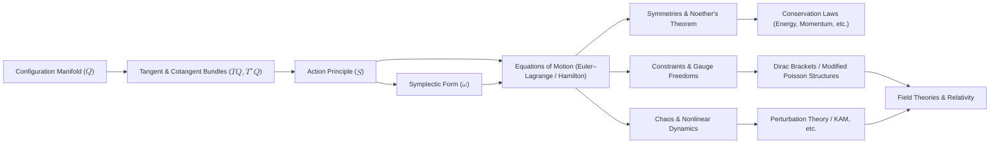

# Re-Architecting Classical Mechanics: A Modern Geometric Vision
* * *

--- Let us rebuild mechanics from its innermost core, guided by the geometry of motion.

# Chapter 1. Why Rebuild Mechanics?

**Epigraph:**
“To see anew, one must first unsee what was once certain.”

This opening chapter initiates our journey by examining why we should revisit the foundations of Classical Mechanics. It traces a concise historical arc—from Newton’s original force-centric view to Lagrangian and Hamiltonian reforms—before culminating in modern geometric perspectives. The goal is to illustrate how a deeper, more unified understanding emerges once we shift our viewpoint from forces to geometry and variations.

## 1.1 Motivation and Historical Glance

### Goal
Highlight the need to depart from conventional force-based narratives, providing historical hints of shifts (Newton → Lagrange → Hamilton → modern geometry).

### Content

1. **Newton’s Force-Centric Framework**
   - In the principled equations of Newton’s “Philosophiæ Naturalis Principia Mathematica,” forces were proclaimed as the primitive cause of motion. Mathematical formulas were pinned directly to intuitive everyday experiences—pushing, pulling, resisting—and the concept of “inertial mass” anchored the second law.
   - While revolutionary in its time, this direct force-based perspective can obscure the elegantly simpler structures hidden underneath: Newton’s laws must be restated individually for each new force encountered (gravity, electromagnetic forces, friction, etc.).

2. **Transition to Analytical Mechanics**
   - Toward the late 18th century, Lagrange took a significant leap by formulating mechanics in terms of generalized coordinates and potentials, culminating in his “Mécanique Analytique.” This shift from force vectors to energy-like scalars (the Lagrangian $L = T - V$) allowed a uniform way to handle constraints and different types of forces.
   - Shortly thereafter, Hamilton refined these ideas into a phase-space picture, revealing deeper symmetries. The Hamiltonian viewpoint introduced canonical coordinates $(q, p)$, and from that vantage, mechanics can be seen as a rich geometrical discipline revolving around symplectic structures.

3. **Emergence of Geometric and Variational Principles**
   - Even as early as Maupertuis, Euler, and Leibniz, the notion that “Nature acts by extremizing some quantity” began to take hold. This led to the principle of least (or stationary) action, unifying the seemingly disparate phenomena of mechanics under a single statement: “The path taken is the one that renders the action stationary.”
   - Over time, mathematicians and physicists realized that the Lagrangian/Hamiltonian formalism resonates naturally with differential geometry, where the configuration space $Q$ can be treated as a manifold, and “motion” as geodesics in an appropriately defined space or as flows preserving a symplectic form.

4. **Motivation for Rebuilding**
   - Although the Newtonian perspective remains powerful for direct computations, it can hide the structural unity behind distinct problems. A geometric-variational perspective, on the other hand, unveils universal patterns—conservation laws, symmetries, integrability, chaos—without rewriting the fundamental laws for each force.
   - Our primary motivation is to help experienced readers see beyond the incremental additions of forces and potentials, and instead appreciate that the entire edifice of classical mechanics emerges from just a few geometric and variational postulates.

In short, this historical glimpse reveals that the deeper we dig into mechanics, the more we encounter hidden geometric relationships and overarching principles of variation. By letting go of the entrenched force-based approach, we pave the way to a more cohesive and far-reaching theory.

## 1.2 Core Vision: Geometry + Variations

### Goal
Introduce the philosophical stance of “form is content,” explaining how geometry and action principles shape our understanding of motion.

### Content

1. **Reconceiving ‘Forces’ as Geometric Manifestations**
   - In the conventional approach, a “force” is an external entity that changes the momentum of a particle. In the geometric-variational perspective, however, what we call “force” can often be seen as a manifestation of the underlying geometry of configuration space coupled with an energy principle.
   - Just as geodesics on a curved manifold represent “free motion,” so do actual mechanical trajectories represent “extremals” of an action within a carefully structured geometric arena.

2. **Variations as the Language of Motion**
   - By framing motion as the stationary path of an action functional $S$, we unify dynamics under a single statement: “Physical trajectories are those that render $S$ stationary under small variations.”
   - This approach elegantly bypasses the need to specify forces in a piecewise manner; instead, any “force” is encoded in the choice of potential, constraint, or metric.

3. **Symplectic Geometry as the ‘Form’ of Mechanics**
   - While the action principle provides the **equations**, symplectic geometry provides the **structure**. Positions and momenta become conjugate variables in a symplectic manifold $P$.
   - One could say: if we could keep only one concept from all of mechanics, it might be the symplectic form $\omega$ (or the action $S$), since it alone encodes the fundamental “DNA” of how motion evolves through time.

4. **“Form is Content”—A Philosophical Note**
   - This idea, borrowed from modern mathematics and philosophy, posits that the relational structure (i.e., geometry, transformations, symplectic form) **is** the essence of a system. We do not need to **add** forces separately when the geometry already dictates where ‘forces’ come from.
   - Moreover, such a viewpoint sets us up for more advanced ideas—like gauge fields, general relativity, and quantum field theory—where geometry and action remain central and universal.

5. **If Only One Concept Survived…**
   - So we pose the thought experiment: “In a cataclysm that destroyed most of our knowledge, which single concept would suffice to recreate classical mechanics?”
   - The best candidate is arguably the concept of **the action principle** (or equivalently, the **symplectic structure**). From there, one can systematically recover Newton’s laws, Lagrange’s equations, Hamilton’s equations, and the familiar tapestry of classical phenomena.

Hence, in the spirit of “form is content,” this treatise begins by placing the geometrical and variational principles at the very heart of our reconstruction. As we proceed, we shall see how traditional mechanical ideas—forces, constraints, and symmetries—emerge rather naturally as secondary notions once we adopt the viewpoint that configuration space plus a carefully defined action (or symplectic form) is the rightful bedrock of the theory.

## 1.3 Concluding Note for Chapter 1

By revisiting mechanics from this perspective, we let go of stale frameworks in order to reveal a vibrant conceptual unity. The following chapters will develop these geometric and variational notions step by step, showing how they truly serve as the hidden conductor behind the “mechanical harmonies” of classical physics.

# Chapter 2. Configuration and State: The Minimal Ingredients

**Epigraph:**
“A world is first made of possibilities.”

This chapter introduces the bedrock of our geometric formulation: the concept of a “configuration space” and its relationship to phase space. We emphasize that physically meaningful configurations can be elegantly modeled as points on a manifold $Q$, and that to analyze dynamics, we naturally extend $Q$ to its cotangent bundle $T^*Q$, where momenta and positions become inseparably intertwined.

## 2.1 Manifolds as Configuration Spaces

### Goal
Show how specifying the set of possible states as a manifold $Q$ is the first essential building block.

### Content

1. **Intuitive Concept of Configuration**
   - In mechanics, each distinct “arrangement” of a system is called a configuration. For a single particle in three-dimensional Euclidean space, a configuration is simply its position $\mathbf{r} \in \mathbb{R}^3$. For a more complex system—a rigid body—the set of all orientations is $\mathrm{SO}(3)$.
   - Whether it’s a pendulum angle, a robot’s joint angles, or a set of generalized coordinates for $n$ particles, the idea is always the same: a configuration enumerates all the geometrically valid ways the system can be arranged.

2. **Why a Manifold?**
   - We treat configurations formally as an abstract manifold $Q$ because not all configuration spaces are as trivial as $\mathbb{R}^n$. Some are curved (like spheres or rotation groups), some have topological constraints, and some are products of simpler spaces.
   - A manifold is a space that looks locally like $\mathbb{R}^n$ but may have a more intricate global shape. For example, $\mathrm{SO}(3)$ is a 3-dimensional manifold that is topologically distinct from $\mathbb{R}^3$.

3. **Local Coordinates and Dimension**
   - Although $Q$ can be globally curved, in a small enough neighborhood we can set up “local” coordinates—like choosing latitude and longitude on a sphere—to parameterize all possible configurations near a point.
   - The dimension of $Q$ typically corresponds to the “degrees of freedom” of the system. A simple pendulum has $1$ degree of freedom ($\theta$), thus $Q \cong S^1$. A rigid body in 3D free space has $6$ degrees of freedom ($3$ for position, $3$ for orientation), though the orientation alone sits on $\mathrm{SO}(3)$.

4. **Physical Examples**
   1. **Particle in $\mathbb{R}^3$**
      - $Q \cong \mathbb{R}^3$, local coordinates $(x,y,z)$.
      - Straightforward geometry but still richly connects to everything that follows.
   2. **Rigid Body on $\mathrm{SO}(3)$**
      - Orientation is a 3D manifold, distinct from $\mathbb{R}^3$.
      - Emphasizes that not all degrees of freedom are linear.
   3. **Linked Pendulums and Robotic Arms**
      - Configuration space could be a product of circles $(S^1)^n$ if each segment is a rotating link.
      - Illustrates topological complexity when multiple joints are involved.

Through these instances, one sees that specifying $Q$—the manifold of all possible system states—constitutes the primary act in a geometric approach to mechanics. Once $Q$ is chosen, the rest of the formalism (dynamical laws, constraints, and even what counts as a “force”) flows from how we embed or interpret that manifold in a higher-dimensional construction.

## 2.2 Phase Space, Tangent and Cotangent Bundles

### Goal
Establish that the natural extension of $Q$ is $T^*Q$, the arena of dynamics.

### Content

1. **Velocity and the Tangent Bundle $TQ$**
   - In purely kinematic terms, if $Q$ captures all possible configurations, then “motion” can be viewed as a path $\gamma(t)$ in $Q$.
   - The instantaneous velocity $\dot{\gamma}(t)$ at time $t$ is a vector tangent to $Q$ at the point $\gamma(t)$. Collectively, all such “tangent vectors” at every point of $Q$ form the tangent bundle $TQ$.
   - For a pendulum on $S^1$, the velocity at $\theta$ is $\dot{\theta}$ in the tangent space $T_{\theta}S^1$. For a rigid body, velocities are represented by both translational and angular velocity components in the tangent space of $\mathrm{SO}(3) \times \mathbb{R}^3$.

2. **Moment(a) and the Cotangent Bundle $T^*Q$**
   - While $TQ$ deals with velocities, classical mechanics often prefers momenta $p$, which belong to the dual space of velocities—i.e., the cotangent space.
   - The cotangent bundle $T^*Q$ is then the natural setting for Hamiltonian mechanics, where the state is $(q, p)$. Each fiber $T_q^*Q$ is the space of all possible momentum covectors at configuration $q$.
   - The passage from $TQ$ to $T^*Q$ is not just mathematical formality; it is intertwined with the definition of Lagrangians and Hamiltonians (via the Legendre transform).

3. **From Configuration to Phase Space**
   - In many physical problems (e.g., a free particle in $\mathbb{R}^3$), one starts by specifying the Lagrangian $L(q,\dot{q})$. By defining the conjugate momentum $p_i = \partial L/\partial \dot{q}_i$, one lifts the description from the tangent bundle to the cotangent bundle.
   - Phase space $P \equiv T^*Q$ (sometimes denoted $\Gamma$) is the essential arena for Hamiltonian mechanics, replete with the symplectic form that underpins the equations of motion.

4. **State vs. Configuration**
   - A “configuration” $q \in Q$ expresses only **where** the system is; a “state” $(q,p) \in T^*Q$ expresses both **where** the system is **and** in what dynamical “momentum condition” it resides. This distinction is crucial for describing evolution: knowledge of state determines future trajectories in a deterministic classical setting.
   - Thus, if $Q$ is $6$-dimensional for a free rigid body ($3$ for position, $3$ for orientation), then the corresponding phase space $T^*Q$ is $12$-dimensional, carrying both position/orientation and linear/angular momentum.

5. **Why Manifolds + Bundles?**
   - Incorporating advanced geometry from the outset might seem daunting, but it pays off by unifying constrained systems, rigid motion, continuum fields, and so forth, all under the same umbrella.
   - The language of manifolds and bundles is flexible enough to handle local constraints, non-Euclidean geometry (e.g., rotating frames or curved spacetimes), and complicated topologies that frequently appear in real-world applications (such as robotic linkages or molecular bonds).

In summary, the fundamental “possibility space” of a system is the manifold $Q$. Once we add in velocities or momenta, we ascend naturally to the tangent or cotangent bundle, culminating in the full-blown “phase space” viewpoint that powers Hamiltonian mechanics. With these structures in place, we can now integrate the action principle (Chapter 3) and the symplectic viewpoint (Chapter 4) to reveal how dynamical laws emerge from geometry itself.

## 2.3 Concluding Note for Chapter 2

We have laid out the minimal geometric scaffolding required to proceed:
- The **configuration manifold** $Q$ organizes all possible “static” configurations;
- The **tangent** ($TQ$) and **cotangent bundles** ($T^*Q$) create the dynamical extension that captures velocities and momenta, respectively;
- By regarding states as points in $T^*Q$, we prepare the ground for the deeper variational and symplectic treatments to come.

Indeed, “a world is first made of possibilities,” and from these possibilities, we forge the blueprint for an evolving mechanical system. In the next chapter, we will see how the action principle leverages this geometric structure to prescribe motion—a step that transforms pure geometry into a richly governed dynamical realm.

# Chapter 3. The Action Principle as the Generator of Dynamics

**Epigraph:**
“There is no shorter route to the laws of motion than the path of least action.”

Having established in Chapter 2 the geometric setting—configuration manifolds and their tangent/cotangent bundles—we now address the next critical layer in our reconstruction of Classical Mechanics: the action principle. This principle offers a unifying viewpoint from which all “forces” and “constraints” can be reinterpreted in terms of a single variational statement, elucidating how motion emerges with remarkable clarity. 

## 3.1 The Action Functional

### Goal
Offer a precise definition of the action $S$, emphasizing how it is the ultimate “source code” of classical motion.

### Content

1. **Defining the Lagrangian $L$**
   - In the Lagrangian formulation, each configuration $q\in Q$ has an associated velocity $\dot{q}\in T_{q}Q$, and possibly explicit time dependence $t$.
   - A typical mechanical Lagrangian takes the form
     $$
       L(q,\dot{q},t) = T(\dot{q}) \;-\; V(q),
     $$
    where $T$ is the kinetic energy (often quadratic in $\dot{q}$) and $V$ is the potential energy (depending on $q$). More general Lagrangians might incorporate non-conservative terms, gauge fields, or constraint-based modifications.

2. **Action Integral**
   - The action $S$ is an integral of the Lagrangian over a time interval,
     $$
       S[q(\cdot)] \;=\; \int_{t_1}^{t_2} \,L\big(q(t), \dot{q}(t), t\big)\, \mathrm{d}t,
     $$
    where $q(t)$ is a path in the configuration manifold $Q$.
   - Crucially, $S$ is a functional, meaning it assigns a real number to each possible trajectory $q(t)$. In this sense, $S$ can be viewed as the “source code” that encodes how the system evolves: once $L$ is chosen, the entire dynamical structure is determined by how $S$ depends on $q(\cdot)$.

3. **Boundary Conditions and Physical Trajectories**
   - To pick out actual “physical” trajectories from all mathematically possible ones, we usually fix the initial configuration $q(t_1)$ and final configuration $q(t_2)$. The variation $\delta q(t)$ is then forced to vanish at $t_1$ and $t_2$—i.e., the endpoints of the path are held fixed.
   - This boundary condition reflects a key physical assumption: the system has definite configurations at the start and end times, and we look for smooth curves $q(t)$ connecting these boundary points in a manner that extremizes the action.

4. **Interpretation and Universality**
   - The principle “the physical path is that which makes $S$ stationary” under small variations is incredibly powerful. It unifies many concepts that, in older treatments, were introduced piecemeal (e.g., forces, constraints, energy conservation).
   - Philosophically, one might say Nature “chooses” the path of least (or, more precisely, stationary) action; mathematically, it means the equations of motion follow from a single optimization principle, rather than separate force laws.

In essence, the action $S$ is a compact, global representation of how the system’s configuration evolves amidst energies, constraints, and symmetries. By focusing on $S$, we shift from a view of mechanics as “forces acting on bodies” to “optimal trajectories in configuration space,” paving the way for the deeper geometric unifications we will encounter in subsequent chapters.

## 3.2 Variational Derivatives and Euler–Lagrange Equations

### Goal
Explain how $\delta S = 0$ yields the equations of motion, unifying multiple mechanical principles under one umbrella.

### Content

1. **Variation of the Action: $\delta S$**
   - To find the path that makes $S$ stationary, we vary $q(t)$ by an infinitesimal amount $\delta q(t)$. Formally,
     $$
       \delta S 
       \;=\; \int_{t_1}^{t_2} 
       \Biggl[
         \frac{\partial L}{\partial q} \,\delta q 
         \;+\; \frac{\partial L}{\partial \dot{q}} \,\delta \dot{q}
       \Biggr] \mathrm{d}t.
     $$
   - Integrating by parts the term involving $\delta \dot{q}$ and using the boundary condition $\delta q(t_1)=\delta q(t_2)=0$, we arrive at:
     $$
       \delta S
       \;=\; \int_{t_1}^{t_2}
       \Bigl[
         \frac{\partial L}{\partial q} 
         \;-\; \frac{d}{dt}\Bigl(\frac{\partial L}{\partial \dot{q}}\Bigr) 
       \Bigr]
       \delta q \;\mathrm{d}t.
     $$

2. **Euler–Lagrange Equations**
   - For the action to be stationary, we require $\delta S = 0$ for *all* variations $\delta q(t)$. This implies
     $$
     \frac{\partial L}{\partial q} 
     \;-\;
     \frac{d}{dt}\Bigl(\frac{\partial L}{\partial \dot{q}}\Bigr)
     \;=\; 0.
     $$
   - These Euler–Lagrange equations unify Newton’s laws, allowing the “force” to be read off from $\partial L /\partial q$. Indeed, in familiar cases where $L = T - V$, we retrieve $\mathbf{F} = -\nabla V$. But the strength of this formulation is that it applies equally well to non-Cartesian coordinates, constraints, or exotic potentials, all with the *same* principle $\delta S=0$.

3. **Coordinate-Free Perspective**
   - While we typically write the Euler–Lagrange equations in coordinates, the principle itself is coordinate-free: it simply states that the first variation of $S$ must vanish.
   - Geometrically, one can describe solutions as geodesics or extremals in an appropriately defined bundle over spacetime. This perspective merges neatly with the symplectic viewpoint (to appear in Chapter 4), revealing deeper invariants.

4. **Constraints and Lagrange Multipliers**
   - Real systems often come with constraints (holonomic or otherwise). In the Lagrangian setting, one can introduce Lagrange multipliers to incorporate constraints into the action. For instance, if the constraint is $\phi(q) = 0$, the augmented Lagrangian might read
     $$
       \widetilde{L}(q,\dot{q},\lambda)
       \;=\; L(q,\dot{q})
             \;+\; \lambda\,\phi(q).
     $$
   - By treating $\lambda$ as an additional variable to be varied, one ensures that the constraint is enforced in the resulting equations of motion. This universal procedure showcases that constraints do not require ad hoc “forces of constraint” but rather follow from the very same variational principle.

5. **Why it Unifies Various Mechanical Principles**
   - Newton’s laws appear as a special case, but so do the laws of continuum mechanics, optics (Fermat’s principle), and even geodesic motion in general relativity—once we frame them via a suitable action.
   - The Hamiltonian approach, canonical momenta, symmetries, and conservation laws (to be discussed in Chapters 4 and 5) find their roots in the action principle as well, illustrating how broad this unification truly is.

Thus, by requiring $\delta S=0$, we seamlessly derive the core laws of motion while accommodating constraints, coordinate changes, and a wide range of functional forms for $L$. This is why the action principle stands as the generative engine behind all classical dynamics—no extraneous postulates about force or inertia are needed once a suitable $L$ is given.

## 3.3 Concluding Note for Chapter 3

In this chapter, we have placed the action principle in its rightful position as the “generator” of classical dynamics. The Lagrangian formalism, encapsulated in $\delta S=0$, elegantly yields the Euler–Lagrange equations—a concise, universal recipe for motion. Considering how simply boundary conditions and constraints can be integrated under this scheme, one begins to see how it both simplifies and unifies many seemingly disconnected mechanical scenarios.

Building on the insight that $\delta S=0$ encodes all fundamental dynamics, we next journey to the Hamiltonian picture (Chapter 4). There, we will explore how symplectic geometry transposes these same variational ideas onto phase space, opening the door to powerful geometric invariants, canonical transformations, and beyond.

# Chapter 4. Symplectic Geometry: The Cultural Heart of Hamiltonian Mechanics

**Epigraph:**
“The symplectic form is the hidden conductor of all mechanical harmonies.”

Having established the elegance of the action principle in Chapter 3, we now move to the Hamiltonian formulation—arguably the most geometrically evocative representation of Classical Mechanics. In this chapter, we uncover how the Legendre transform bridges the Lagrangian and Hamiltonian pictures, and how the symplectic form $\omega$ underlies every dynamical flow in phase space. These ideas form the backbone of modern analytical mechanics, unifying areas as diverse as integrable systems, chaos theory, and quantum mechanics.

## 4.1 From Lagrangians to Hamiltonians

### Goal
Demonstrate the Legendre transform in a geometric sense, transitioning from $(q, \dot{q})$ to $(q, p)$.

### Content

1. **Momentum as a Conjugate Variable**
   - In the Lagrangian framework, we treat $(q,\dot{q})$ as the fundamental variables describing a system’s state. However, once we define the canonical (generalized) momentum as
     $$
       p_i \;=\; \frac{\partial L}{\partial \dot{q}_i},
     $$
    we step into a new viewpoint where $(q,p)$ become equally fundamental.
   - This switch is not merely a coordinate change; it reflects a deeper transformation: velocities $\dot{q}$ are replaced by momenta $p$, opening the door to Hamiltonian mechanics.

2. **Legendre Transform and the Hamiltonian $\mathbf{H}$**
   - Formally, the Hamiltonian $H$ emerges from the Legendre transform of the Lagrangian $L$:
     $$
       H(q,p,t)
       \;=\;
       \sum_{i} p_i \,\dot{q}_i \;-\; L\bigl(q,\dot{q}(p),t\bigr),
     $$
    where $\dot{q}(p)$ is the velocity expressed as a function of momentum (assuming non-degeneracy).
   - For a “standard” mechanical system where $L=T-V$ (kinetic minus potential), this typically yields
     $$
       H(q,p) \;=\; \frac{p^2}{2m} \;+\; V(q),
     $$
    or, in more general coordinates, $H = \sum p_i^2/(2 \, m_i) + V$. The Hamiltonian often corresponds to the total energy, but in more complex systems (e.g., with constraints or time-dependent potentials) it may deviate from a simple “$\text{energy} = T + V$” interpretation.

3. **Geometric Meaning of the Transform**
   - The passage from Lagrangian to Hamiltonian form can be interpreted as a movement from the tangent bundle $TQ$ (where velocities live) to the cotangent bundle $T^*Q$ (where momenta live).
   - In geometric mechanics, this shift is pivotal: the Hamiltonian formulation intrinsically carries a symplectic 2-form $\omega$, granting a rich structure that unifies flows, integrable systems, and transformations.
   - Moreover, once we adopt $(q,p)$ coordinates, the equations of motion become first-order ODEs in phase space, rather than second-order ODEs in configuration space.

4. **Advantages of Hamiltonian Perspective**
   - Symplectic geometry becomes far more transparent in the Hamiltonian picture, as we will see in §4.2.
   - Canonical momenta are often more natural variables in field theory, quantum mechanics, and advanced topics like gauge theories.
   - Powerful techniques like canonical transformations, Poisson brackets, and generating functions find their simplest expression in $(q,p)$-space.

Hence, the Legendre transform is not just an algebraic trick; it is a conceptual leap that reinterprets classical motion in terms of geometry on phase space—setting the stage for the symplectic framework to come.

## 4.2 The Symplectic Form and Hamilton’s Equations

### Goal
Introduce the 2-form $\omega$, clarify non-degeneracy and closedness, and show how Hamilton’s equations come from $\omega$ and $H$.

### Content

1. **Defining the Symplectic Form**
   - On the cotangent bundle $T^*Q$, we define a canonical 1-form, often written $\theta = \sum_i p_i\,dq_i$. Its exterior derivative $\omega = d\theta$ yields the **symplectic 2-form**:
     $$
       \omega \;=\; \sum_i dq_i \,\wedge\, dp_i.
     $$
   - This 2-form $\omega$ is **closed** ($d\omega=0$) and **non-degenerate**, making $(T^*Q,\omega)$ a true symplectic manifold. Physically, $\omega$ encapsulates the geometry of phase space, dictating how states evolve in time under Hamilton’s equations.

2. **Hamilton’s Equations from $\omega$ and $H$**
   - Once we have a Hamiltonian function $H(q,p)$, the phase-space flow is determined by requiring that the total derivative of $H$ vanish along trajectories. In differential-geometric terms, the Hamiltonian vector field $X_H$ must satisfy
     $$
       \iota_{X_H}\,\omega \;=\; dH,
     $$
    where $\iota$ denotes the interior product.
   - Expressed in coordinates, these conditions reproduce the familiar **Hamilton’s Equations**:
     $$
     \dot{q}_i \;=\; \frac{\partial H}{\partial p_i},
     \qquad
     \dot{p}_i \;=\; -\,\frac{\partial H}{\partial q_i}.
     $$
   - This succinctly shows how “motion” in phase space is intimately governed by the symplectic form $\omega$ and the Hamiltonian potential landscape $H$.

3. **Canonical Coordinates and Poisson Brackets**
   - The coordinates $(q_i, p_i)$ are labeled **canonical** precisely because $\omega$ takes the simple standard form $\sum dq_i \wedge dp_i$. A **canonical transformation** is one that preserves $\omega$.
   - In the Hamiltonian language, the Poisson bracket of two functions $f, g$ is given by
     $$
       \{f, g\}
       \;=\;
       \sum_i
       \left(
         \frac{\partial f}{\partial q_i}\,\frac{\partial g}{\partial p_i}
         \;-\;
         \frac{\partial f}{\partial p_i}\,\frac{\partial g}{\partial q_i}
       \right).
     $$
    This bracket offers a powerful algebraic tool for studying symmetries, integrals of motion, and canonical transformations.

4. **Liouville’s Theorem and Phase-Volume Preservation**
   - One immediate consequence of Hamilton’s equations is **Liouville’s Theorem**, which states that phase-space volume (as measured by $\omega^n$) remains constant along the flow. In layman’s terms, the Hamiltonian flow “stirs” the phase space without stretching or compressing it globally.
   - Geometrically, this ties to the fact that $\omega$ is closed ($d\omega=0$), ensuring incompressibility in phase space. Physically, it underlies much of statistical mechanics (ergodic theory) and underpins the possibility of chaotic mixing while preserving measure.

5. **Implications and Unified Vision**
   - The symplectic form $\omega$ thus orchestrates all mechanical phenomena: from integrable motion (where one can find action-angle variables) to chaotic dynamics (where mixing occurs but volume is still preserved).
   - With $(T^*Q, \omega)$ recognized as the natural “stage,” the Hamiltonian formalism becomes more than a convenient method—it is a **geometric discipline** in which transformations (canonical transformations) and conservation laws (Noether’s theorem in Hamiltonian language) have elegant, coordinate-invariant formulations.

## 4.3 Concluding Note for Chapter 4

We have traced how the Legendre transform paves the way from the velocity-based Lagrangian picture to the momentum-based Hamiltonian one, and how the symplectic form $\omega$ becomes the governing “conductor” for all mechanical evolutions in phase space. This geometric tapestry reveals that the “flow” of states—the essence of dynamics—is inseparable from the non-degenerate, closed 2-form $\omega$ and the Hamiltonian function $H$.

In the ensuing chapters, we will further leverage this formalism. Chapter 5 explores how symmetries and conservation laws arise naturally in the Hamiltonian setting (via Noether’s theorem and canonical transformations), while later sections delve into constraints, integrability, chaos, and beyond. The hallmark of Hamiltonian mechanics is its unification of local differential equations and global geometric structures—a testament to why the symplectic form is indeed “the hidden conductor of all mechanical harmonies.”

# Chapter 5. Structures and Symmetries: Noether’s Theorem Revisited

**Epigraph:**
“Every hidden symmetry births a new constant of motion.”

Classical Mechanics is replete with hidden structures, and no principle captures their profundity more elegantly than Noether’s theorem. In this chapter, we explore how continuous symmetries (in both Lagrangian and Hamiltonian formulations) guarantee the existence of conserved quantities, unifying momentum, energy, angular momentum, and beyond. We then turn to canonical transformations, which preserve the symplectic structure and thus serve as the fundamental coordinate changes in Hamiltonian mechanics—paving the road to integrable systems, action-angle variables, and further avenues of simplification.

## 5.1 Continuous Symmetries and Conservation Laws

### Goal
Show how Noether’s theorem is the unifying principle behind momentum, energy, angular momentum, and others. Emphasize that whether a system is formulated in Lagrangian or Hamiltonian form, symmetries yield invariants.

### Content

1. **Noether’s Theorem: A Brief Overview**
   - At its core, Noether’s theorem states that each continuous symmetry of the action $S$ engenders a corresponding conservation law. If an infinitesimal transformation of the coordinates does not alter the value of $S$, then there exists a conserved quantity associated with that transformation.
   - Classic illustrations:
     – Time-translation invariance implies conservation of energy.
     – Spatial-translation invariance implies conservation of (linear) momentum.
     – Rotational invariance implies conservation of angular momentum.

2. **Symmetry in the Lagrangian Picture**
   - In Lagrangian mechanics, a continuous symmetry may be expressed as a small shift in the generalized coordinates, $q \mapsto q + \delta q(\epsilon)$, that leaves $L$ (or, more precisely, the action $S$) invariant to first order in $\epsilon$.
   - By manipulating the Euler–Lagrange equations under these transformations, one can isolate the Noether current or Noether charge—essentially the integrand of the conserved quantity.
   - Example: If $L$ does not explicitly depend on time, $\tfrac{\partial L}{\partial t} = 0$, the associated Noether invariant is the Hamiltonian $H$—interpreted physically as total energy.

3. **Symmetry in the Hamiltonian Picture**
   - Hamiltonian mechanics offers an alternate vantage through Poisson brackets. A function $F(q,p)$ is conserved if its total time derivative vanishes: $\dot{F} = \{F,H\} = 0$.
   - A continuous symmetry corresponds to a generator $G$, such that performing the canonical transformation generated by $G$ leaves the Hamiltonian structure invariant. In many cases, $G$ itself is the conserved quantity.
   - For instance, rotational invariance arises in Hamiltonian mechanics through the angular momentum components $L_x, L_y, L_z$. The Poisson brackets $\{L_i, H\} = 0$ indicate that each component is time-invariant under rotational symmetry (assuming isotropy).

4. **Deeper Insight: Symmetry as a Statement of Redundancy**
   - A symmetry essentially says that some aspect of the system’s configuration or phase space labeling is redundant. If pivoting your reference frame (translation, rotation, phase shift) does not change the physics, there must be a corresponding invariant.
   - This viewpoint helps unify constraints, gauge theories, and advanced formulations: constraints often reflect symmetries of a higher-level description.

5. **Examples and Extensions**
   - **Central Force Problems**: Spherical symmetry implies conservation of angular momentum—which in turn reduces the effective dimension of the motion.
   - **Gauge Invariance**: In field theory, local gauge invariance leads to conserved currents (electric charge, etc.), representing a vast generalization of Noether’s theorem in modern physics.

Thus, whether we articulate it in terms of Lagrangian symmetries or Hamiltonian generators, Noether’s theorem provides both conceptual elegance—each symmetry yields a conservation law—and practical guidance, telling us which quantities remain constant as a system evolves.

## 5.2 Canonical Transformations and Generators

### Goal
Explain how certain transformations preserve $\omega$, re-labeling states without changing physics. Explicate the link to integrable systems, action-angle variables, and simplifying transformations.

### Content

1. **What Are Canonical Transformations?**
   - In Hamiltonian mechanics, a transformation $(q,p) \mapsto (Q,P)$ is **canonical** if it preserves the symplectic form $\omega$. Concretely, this means
     $$
       \sum_i dQ_i \wedge dP_i
       \;=\; 
       \sum_i dq_i \wedge dp_i,
     $$
    so that the structure of Hamilton’s equations remains unchanged.
   - Equivalently, such transformations preserve the Poisson bracket structure, $\{Q_i,P_j\} = \delta_{ij}$.

2. **Generators of Canonical Transformations**
   - Many canonical transformations can be generated by a single function $G$ (sometimes called the **generating function**), which can depend on various mixes of old and new variables $(q,P)$ or $(Q,p)$.
   - Geometrically, “generating” a small canonical transformation is akin to flowing along the vector field determined by a particular function on phase space (the Hamiltonian of that flow). This viewpoint merges seamlessly with Noether’s theorem: a continuous symmetry is precisely a canonical transformation that leaves $H$ invariant.

3. **Action-Angle Variables and Integrable Systems**
   - In integrable systems with $n$ degrees of freedom and $n$ independent conserved quantities in involution, one can (under suitable regularity conditions) perform a canonical transformation to **action-angle** variables $(J_i,\theta_i)$.
   - The new Hamiltonian $H(J)$ depends only on the “actions” $J_i$ (constants of motion), while the “angles” $\theta_i$ evolve uniformly in time. This transformation not only solves the system exactly but also illuminates the geometric structure: motion is on invariant tori in phase space.
   - Conceptually, action-angle descriptions represent the apex of simplifying transformations, revealing the **symphonic harmony** in integrable motions—while also highlighting how non-integrable (chaotic) systems deviate from this pristine scenario.

4. **Simplifying Complex Problems**
   - Canonical transformations are powerful for decoupling or simplifying Hamiltonians in problems ranging from celestial mechanics (e.g., Delaunay variables) to quantum mechanics (canonical quantization).
   - By systematically searching for transformations that reduce a Hamiltonian’s complexity, one can turn certain multi-degree-of-freedom problems into effectively one-dimensional motions, or identify small oscillations around stable equilibria.

5. **Connection to Symmetries and Constraints**
   - A symmetry transformation that generates a conserved quantity is itself a special canonical transformation that leaves the Hamiltonian unaltered ($\delta H = 0$).
   - Conversely, constraints can often be tackled by enlarging the phase space (adding gauge degrees of freedom) and then using canonical transformations or gauge-fixing procedures that reduce redundant dynamical variables.

In summary, canonical transformations form the principal mechanism by which Hamiltonian mechanics achieves its remarkable adaptability and power. They shape the phase space in ways that either highlight integrability or expose complex dynamical structures. Together, symmetries and their generating transformations unify the notion that a system’s deeper invariants, whether momentum or energy or otherwise, arise from the geometry of phase space itself.

## 5.3 Concluding Note for Chapter 5

From Noether’s theorem capturing the essence of continuous symmetries, to canonical transformations reshaping phase space while preserving its symplectic fabric, we see that Classical Mechanics rests on structural invariants rather than ad hoc forces. Symmetries do not merely yield “nice shortcuts” to conserve quantities; they reflect fundamental redundancies in how we label the system. Canonical transformations likewise exploit that geometry, enabling us to re-parameterize complex problems into simpler forms and occasionally unveil exact integrability.

In the next chapters, we will see how these concepts apply to both simple and intricate mechanical systems (Chapter 6), setting the stage for exploring chaos (Chapter 7), field extensions (Chapter 8), and more philosophical frontiers (Chapter 9). By now, the recurring theme should be evident: geometry and variations illuminate all aspects of mechanics, with symmetries and canonical transformations as the threads binding the tapestry together.

# Chapter 6. From Simple Systems to Complex Phenomena

**Epigraph:**
“To master the small is to glimpse the large.”

Thus far, we have established the fundamental geometric and variational structures that underlie Classical Mechanics. In this chapter, we illustrate how these abstract principles unify the description of both “simple” models—such as oscillators, pendulums, or rigid bodies—and more involved systems with constraints or gauge freedoms. We see how the same interpretive framework (configuration manifolds, action principles, symplectic geometry) scales smoothly from basic archetypes to intricate mechanical phenomena.

## 6.1 Archetypal Systems (Oscillators, Pendulums, Rigid Bodies)

### Goal
Demonstrate how the same geometric-lagrangian framework covers broad classes of mechanical models.

### Content

1. **Why These Archetypes Matter**
   - Oscillators, pendulums, and rigid bodies have stood as bedrock examples for centuries because they represent foundational “building blocks” in mechanics. Despite their simple appearances, they encapsulate many crucial ideas: constraints (pendulums), group-manifold structures (rigid bodies), and stable equilibria (oscillators).
   - By seeing how each arises from the same underlying geometric-lagrangian viewpoint, we gain confidence that more complex systems follow the same pattern.

2. **Simple Harmonic Oscillator (SHO)**
   - **Configuration Manifold:** For a one-dimensional SHO, $Q \cong \mathbb{R}$. Although the topology is trivial, the oscillator’s dynamics hinge on a quadratic potential.
   - **Lagrangian/Action:**
     $$
       L \;=\; \tfrac12\,m\,\dot{q}^2 - \tfrac12\,k\,q^2,
       \quad
       S = \int L\,dt.
     $$
    The Euler–Lagrange equation yields $\ddot{q} + \tfrac{k}{m}\,q=0$.
   - **Symplectic/Hamiltonian Form:** Transitioning to the Hamiltonian description, we define the momentum $p = m\,\dot{q}$, so
     $$
       H(q,p) = \frac{p^2}{2m} + \frac12\,k\,q^2.
     $$
    The resulting phase-space flow orbits are ellipses in $(q,p)$ space, reflecting a fundamental harmonic motion.
   - **Key Insight:** Even this simplest system—one degree of freedom, linear potential—serves as a seed for understanding normal-mode expansions in more complex, higher-dimensional systems.

3. **Pendulum**
   - **Configuration Manifold:** A planar pendulum with a fixed anchor and a bob of length $\ell$ is effectively constrained to a circle $S^1$. Thus $Q \cong S^1$, parameterized by the angle $\theta$.
   - **Geometric Nature:**
     - The circle structure signals that the movement is not exactly on a line but on a closed loop.
     - The local coordinate $\theta$ can in principle run from $-\pi$ to $\pi$, but topologically, $-\pi$ and $\pi$ represent the same configuration.
   - **Lagrangian:**
     $$
       L(\theta,\dot{\theta})
       \;=\;
       \tfrac12\,m\,(\ell^2)\,\dot{\theta}^2
       \;-\;
       m\,g\,\ell\,\bigl(1-\cos\theta\bigr).
     $$
    The Euler–Lagrange equation encapsulates the well-known pendulum dynamics $\ddot{\theta} + (\tfrac{g}{\ell}) \sin\theta=0$.
   - **Small-Angle vs. Full Nonlinearity:**
     - Near $\theta=0$, $\sin\theta \approx \theta$, reproducing SHO-like motion with frequency $\sqrt{g/\ell}$.
     - The full nonlinear system retains a periodic yet more complicated topology in phase space.
   - **Broader Significance:** Understanding the pendulum’s manifold structure prepares us for more sophisticated constraints, such as double pendulums or multi-joint robotic arms, each adding further circles or tori to the configuration space.

4. **Rigid Bodies**
   - **Configuration Manifold:** For a free rigid body in 3D, the rotational degrees of freedom reside on $\mathrm{SO}(3)$, a 3D Lie group manifold. If translation is also considered, the total configuration space can be $\mathrm{SO}(3)\times \mathbb{R}^3$.
   - **Lagrangian and Inertia Tensor:**
     $$
       T \;=\; \tfrac12\,\boldsymbol{\omega}^\mathsf{T} \mathbf{I} \,\boldsymbol{\omega},
       \quad
       V=0 \quad (\text{if free rotation}),
     $$
    where $\boldsymbol{\omega}$ is the angular velocity vector in body coordinates, and $\mathbf{I}$ is the inertia matrix.
   - **Euler’s Equations:** The Euler–Lagrange equation specialized to $\mathrm{SO}(3)$ yields Euler’s equations of rigid-body rotation.
   - **Geometric Aspects:**
     - $\mathrm{SO}(3)$ is a nonlinear manifold; locally one can choose Euler angles or quaternions, but globally it has nontrivial topology (like a 3D sphere up to certain identifications).
     - Rigid-body rotation conserves angular momentum unless external torques act, a reflection of the same Noetherian symmetry arguments introduced in Chapter 5.

5. **Continuity Among Examples**
   - All these systems, from an oscillator in $\mathbb{R}$ to a rigid body on $\mathrm{SO}(3)$, share the same conceptual underpinnings: pick $Q$, define a suitable $L$ or $H$, and derive equations of motion.
   - “Constraints” (like a pendulum’s fixed pivot) or nontrivial manifolds (like $\mathrm{SO}(3)$) manifest seamlessly in the same formalism, showcasing the remarkable generality of geometric-lagrangian mechanics.

## 6.2 Constraints, Non-Holonomic Systems, and Gauge Freedoms

### Goal
Delve into advanced constraint-handling, including non-holonomic constraints and gauge-like redundancies.

### Content

1. **Holonomic vs. Non-Holonomic Constraints**
   - **Holonomic Constraints:** Constraints that can be expressed as algebraic equations $f(q_1,\dots,q_n) = 0$ in terms of the coordinates alone (possibly including time). These reduce the dimension of the configuration manifold $Q$. For instance, a pendulum constraint $\|\mathbf{r}\| = \ell$ is effectively “holonomic,” restricting the motion to a circle (or sphere in higher dimensions).
   - **Non-Holonomic Constraints:** Constraints that involve the velocities as well and **cannot** be integrated into a purely coordinate-based condition. An example is a rolling wheel, where the velocity constraint imposes $\dot{x} - R \dot{\theta}\cos\phi =0$, etc., without a single global function relating $x$ and $\theta$.
   - Geometrically, non-holonomic constraints define submanifolds of $TQ$ (the tangent bundle), rather than submanifolds of $Q$. These are typically described via Pfaffian forms or distributions—leading to richer, sometimes more complicated dynamical behavior.

2. **Incorporating Constraints in the Variational Principle**
   - **Holonomic:** As seen with the pendulum, one either reparametrizes $Q$ (e.g., $\theta$ on a circle) or introduces Lagrange multipliers enforcing $f(q)=0$. In both cases, the geometry remains consistent with the principle of stationary action.
   - **Non-Holonomic:** Here, one often uses the method of undetermined multipliers (or Dirac–Bergmann procedures in Hamiltonian language) to incorporate velocity-level constraints, leading to generalized Lagrange or Hamilton equations. These constraints can yield non-conservative forces that do not derive from a potential.

3. **Gauge-Like Redundancies**
   - **Gauge Freedoms as Redundant Coordinates:** In certain mechanical systems (especially with local symmetries), there may be “extra” variables that do not affect observable physics. One classic example is a spinning top with an internal symmetry, or a system with re-labelling invariances.
   - **Mathematical Parallels to Gauge Theories:** While gauge theories are more prominent in field theory, the principle is the same: we can parametrize a system with extra degrees of freedom that do not alter the physical outcomes, and these must be “factored out” or fixed via constraints.
   - Such gauge freedoms appear in the Hamiltonian formalism as first-class constraints that generate transformations among physically equivalent states—a direct link to advanced concepts in relativity and quantum field theory.

4. **Dirac Brackets and Generalized Poisson Structures**
   - When constraints do not preserve the canonical symplectic form or generate second-class constraints, the Poisson bracket structure must be modified. Dirac introduced “Dirac brackets” to handle such situations, effectively projecting out the unphysical degrees of freedom.
   - In systems with non-holonomic constraints, one might get a “generalized” (non-symmetric or non-homogeneous) bracket that still yields consistent equations of motion. This underscores how the geometric viewpoint adapts to constraints by adjusting the underlying phase-space geometry, rather than forcing ad hoc force terms.

5. **Practical Philosophical Note**
   - Constraints, whether holonomic or non-holonomic, are not bolt-on complexities; they reflect that real mechanical systems often live on submanifolds of a simpler ambient space. This submanifold viewpoint is essential to robotics (joint limits, rolling wheels, mobile platforms), to multi-body dynamics (linkages, arms), and to advanced theoretical frameworks (gauge fields).
   - By embedding constraints directly into the variational or symplectic formalism, we preserve the elegant unity of geometry and dynamics, revealing how “complicated” mechanical phenomena remain consistent with the same fundamental principles of classical mechanics.

## 6.3 Concluding Note for Chapter 6

From the ubiquitous oscillator to the subtlety of gauge freedoms, the overarching message stands: once we commit to a geometric-lagrangian or Hamiltonian formulation, the distinction between “simple” and “complex” systems becomes more about the shape of $Q$ and the nature of constraints than any fundamental shift in theory. Indeed, “to master the small is to glimpse the large,” for analyzing archetypal, constrained, and group-manifold systems not only clarifies the essence of classical mechanics but also sets the stage for understanding chaotic and continuum phenomena in upcoming chapters.

By understanding that even complex constraints and gauge redundancies fit neatly into the same theoretical scaffolding, we better appreciate how classical mechanics, at its heart, remains a geometry-driven discipline. Next, we will examine how this geometric foundation illuminates the interplay between integrability and chaos (Chapter 7), further emphasizing the power of a “geometry first” approach in explaining the universe’s wide spectrum of mechanical behaviors.

# Chapter 7. Beyond Integrability: Chaos and Nonlinear Dynamics

**Epigraph:**
“Even the most elegant symplectic form can unleash chaos.”

Having established in previous chapters that symplectic geometry codifies classical motion through Hamilton’s equations and conservation laws, we now confront the paradoxical coexistence of structure and unpredictability in nonlinear dynamics. Classical Mechanics, once seen as neatly deterministic, harbors rich layers of complexity—particularly when integrability breaks down and chaos emerges. In this chapter, we delve into these subtleties by first examining Liouville’s theorem and the preservation of phase-space volume (§7.1), then exploring how seemingly small perturbations can catalyze chaotic behavior (§7.2). Ultimately, we see that symplectic geometry not only orchestrates stable orbits in integrable systems but also shapes chaotic trajectories in intricate ways.

## 7.1 Liouville’s Theorem and Phase-Space Volume

### Goal
Recap volume-preservation properties and their significance.

### Content

1. **Liouville’s Theorem in a Nutshell**
   - In Hamiltonian mechanics, the phase space is a symplectic manifold $(P, \omega)$, typically $P = T^*Q$. Liouville’s theorem states that the flow generated by any Hamiltonian $H$ preserves the symplectic volume. Concretely, if $\rho$ is the standard phase-space volume form (given by $\frac{\omega^n}{n!}$ in a $2n$-dimensional phase space), then $\rho$ is constant along the flow.
   - Equivalently, if one tracks a region of phase space through time, its volume remains unchanged, even though it may get stretched or deformed in complicated ways. Hence, the Hamiltonian flow is **incompressible** with respect to the symplectic measure.

2. **Why Volume Preservation Matters**
   - **Statistical and Ergodic Consequences:** Volume preservation lays the foundation for statistical mechanics, enabling an interpretation of phase-space densities as probabilities that evolve without dissipation. This is integral to the ergodic hypothesis and Boltzmann’s insights into equilibrium distributions.
   - **Geometric Perspective on “Forces”:** Because forces in the Hamiltonian formalism arise from gradients of $H$, they never “create” or “destroy” phase-space volume. This underscores a deeper structural property: the geometry of $\omega$ dictates that Hamiltonian flows must remain measure-preserving.
   - **Prelude to Chaos:** Far from guaranteeing regular behavior, incompressibility can amplify small distortions and lead to extremely complicated folding and stretching in phase space. A chaotic system incessantly folds and stretches phase-space regions, akin to taffy pulled in many directions while never changing its overall volume.

3. **Ergodicity and Mixing**
   - **Ergodicity:** A system is ergodic if, roughly, a single trajectory eventually passes “close” to every point in the region of phase space consistent with the energy. Volume preservation alone does not assure ergodicity, but it sets the stage for such phenomena.
   - **Mixing:** Some Hamiltonian systems are **mixing**, meaning any initially localized volume is eventually spread everywhere while globally preserving volume; this is the hallmark of strong chaos.
   - **Illustrative Examples:** Billiards on a stadium-shaped table or the classical kicked rotor exhibit these properties. Despite Liouville’s theorem guaranteeing no net volume change, local stretching and folding can be intense, causing chaotic mixing.

Hence, Liouville’s theorem reveals that while motion in a Hamiltonian system is tightly bound by symplectic geometry, there is ample room for complexity—leading us directly to phenomena that stray beyond tidy integrable solutions.

## 7.2 Perturbation Theory and Onset of Chaos

### Goal
Introduce small parameters, expansions, resonance phenomena, and route to chaos.

### Content

1. **Integrable vs. Non-Integrable Systems**
   - An **integrable** system in $n$ degrees of freedom has $n$ independent integrals of motion in involution, leading to regular trajectories confined to invariant tori (as described in Chapter 5’s discussion of action-angle variables).
   - However, real-world systems rarely remain perfectly integrable. Small perturbations—due to additional potentials, nonlinear couplings, or time-dependent forcings—can disrupt the tori. This disruption can be mild or catastrophic, giving rise to chaos.

2. **Role of Small Parameters**
   - Often, one can treat these perturbations with expansions in a small dimensionless parameter $\epsilon$, rewriting the Hamiltonian as
     $$
       H(q,p) \;=\; H_0(q,p) \;+\; \epsilon\,H_1(q,p) \;+\; \epsilon^2\,H_2(q,p) \;+\;\cdots
     $$
    where $H_0$ is the perfectly integrable part and $\epsilon\,H_1$ the first-order correction.
   - The delicate question is whether the invariant tori of $H_0$ persist under small $\epsilon$. Kolmogorov–Arnold–Moser (KAM) theory provides a partial but profound answer: many (though not all) tori survive if the perturbation is sufficiently small and some non-resonance conditions hold.

3. **Resonance and Chaos: The Chirikov Standard Map**
   - **Resonance:** A frequent route to chaos is the overlapping of resonances. When two or more resonance conditions coincide, small perturbations can drastically rearrange phase space, destroying the “smooth fences” that typically confine trajectories.
   - **Chirikov Standard Map:** One canonical example is the standard map (kicked rotor), which in discrete time tracks the angle $\theta$ and its momentum. For certain parameter values, resonances overlap and large chaotic zones appear, even though the underlying dynamics remain symplectic and volume-preserving.
   - Chaos arises when orbits jump among multiple resonant “islands,” no longer locked to a single invariant torus, thereby exhibiting sensitive dependence on initial conditions.

4. **Kolmogorov–Arnold–Moser (KAM) Theory**
   - KAM theory states that for sufficiently small $\epsilon$ and sufficiently irrational frequency ratios (i.e., Diophantine conditions), many tori remain stable. Trajectories near these tori remain quasi-periodic rather than disintegrating into chaos.
   - Nonetheless, not all tori survive—especially near resonances where rational frequency ratios enable orbits to “lock” and resonate. These resonance zones, once expanded, can interconnect, fueling large-scale chaos.
   - In short, KAM theory elegantly explains how integrable structure erodes gradually as perturbations increase, delineating a fractal-like boundary between stable motion and chaotic seas.

5. **Broader Outlook on Nonlinear Dynamics**
   - The interplay of stable and chaotic regions marks a hallmark of Hamiltonian systems. Even within an “almost” integrable regime, one can see a mosaic of KAM tori, stability islands, and chaotic arcs.
   - **Physical Applications:** Planetary motion (resonances among orbits of asteroids and planets), molecular dynamics (competing vibrational modes), and plasma physics (magnetic field-line chaos) all exhibit these phenomena.
   - **Conceptual Significance:** The same symplectic structure that enforces Liouville’s volume preservation also catalyzes intricate webs of resonance, enabling tiny disturbances to unfold into chaotic trajectories. Far from overshadowing geometry, chaos is a manifestation of it—an emergent property of how Hamiltonian flows can stretch and fold phase space under resonance conditions.

## 7.3 Concluding Note for Chapter 7

Contrary to classical images of clockwork predictability, Hamiltonian mechanics does not guarantee simplicity or integrability. Liouville’s theorem ensures that flows remain volume-preserving but says nothing about whether trajectories remain orderly or spiral into chaotic labyrinths. Perturbation theory shows how the slightest of nonlinear couplings can gradually unravel integrable structures, creating a tapestry of stable tori interspersed with chaotic zones.

From rigid order (integrable) to tumultuous turbulence (chaotic), it is the same symplectic geometry that underlies both extremes. In the next chapters, we extend our perspective to field systems (Chapter 8) and broader philosophical dimensions (Chapter 9). The lessons from chaos will remain relevant: geometry, action, and symplectic form do not yield trivial “law and order”; they provide the guiding framework within which complexity—and sometimes chaos—unfolds.

# Chapter 8. Extensions to Fields and Relativity

**Epigraph:**
“Geometry extends beyond particles and into the fabrics of spacetime and fields.”

Our exploration thus far has shown how classical mechanics, when built on a rigorous geometric foundation, readily unifies points, momenta, and symmetries within a finite-dimensional phase space. Yet many real-world and theoretical systems are better described by **fields** rather than discrete sets of coordinates—implying an infinite-dimensional configuration space. Moreover, once relativistic effects or gauge principles enter the picture, the core geometric viewpoint extends to broader settings where spacetime itself can be curved or endowed with additional local symmetries. In this chapter, we glimpse how Lagrangian and Hamiltonian frameworks morph to accommodate these “larger” contexts, reaffirming that the geometry + action principle remains the backbone of theoretical physics well beyond particle mechanics.

## 8.1 Classical Field Theories

### Goal
Show how Lagrangian/Hamiltonian mechanics generalizes to fields, where $Q$ is infinite-dimensional.

### Content

1. **From Particles to Fields: The Leap to Infinite Dimensions**
   - In conventional mechanics, the configuration space $Q$ might be finite-dimensional (e.g., $\mathbb{R}^3$, $\mathrm{SO}(3)$, or a product thereof). But in field theories (electromagnetism, fluid dynamics, elasticity, etc.), the “configuration variable” is a **field** $\phi(x)$, typically defined at each point $x$ in space (or spacetime).
   - Thus, $Q$ becomes an infinite-dimensional space of possible field configurations: $\phi \in Q$ might be a function, $\phi: \Sigma \to \mathcal{V}$ for some domain $\Sigma$ (e.g., 3D space or 4D spacetime) and target space $\mathcal{V}$ (e.g., $\mathbb{R}$, $\mathbb{C}$, or a more general manifold).

2. **The Field Lagrangian and Action**
   - As with particle mechanics, one defines a Lagrangian density $\mathcal{L}(\phi, \partial\phi)$, which now depends on $\phi$ and its derivatives. The action $S$ becomes a spacetime integral:
     $$
       S[\phi(\cdot)] 
       = 
       \int_{\Sigma}\,\mathcal{L}\big(\phi(x), \partial_\mu\phi(x)\big)\, d^dx,
     $$
    where $d^dx$ indicates measure over the domain’s dimension. In a relativistic context, $\Sigma$ might be the entire spacetime volume.
   - Requiring $\delta S=0$ under variations of $\phi(x)$ yields **field equations** (e.g., wave equations, Maxwell’s equations, etc.), mirroring how Euler–Lagrange equations arise in finite dimensions.

3. **Examples of Field Lagrangians**
   1. **Wave Equation:** For a real scalar field $\phi(x)$ in $3+1$ dimensions, a free field Lagrangian density can be
      $$
        \mathcal{L} 
        = 
        \tfrac12\,(\partial_\mu \phi)(\partial^\mu \phi) 
        - 
        \tfrac12\,m^2\,\phi^2.
      $$
     Varying this yields the Klein–Gordon equation (in a relativistic context) or the simpler wave equation if $m=0$.
   2. **Electromagnetism:** The $\mathbf{E}$ and $\mathbf{B}$ fields can be combined into the electromagnetic field tensor $F_{\mu\nu}$. One writes
      $$
        \mathcal{L} 
        = 
        -\,\tfrac{1}{4}\,F_{\mu\nu}F^{\mu\nu},
      $$
     and variation leads to Maxwell’s equations.
   3. **Other Instances:** Elasticity theory, fluid mechanics, and beyond can be similarly cast in an action-principle approach, albeit with specialized boundary conditions or constraints.

4. **Hamiltonian Formalism for Fields**
   - Analogous to the finite-dimensional Legendre transform, one defines a conjugate momentum density $\pi(x)$ to the field $\phi(x)$. The Hamiltonian density $\mathcal{H}(\phi,\pi)$ is then introduced, and the total Hamiltonian emerges by integrating $\mathcal{H}$ over space.
   - A canonical Poisson bracket structure extends to fields, leading to functional derivatives $\{\phi(x), \pi(y)\} = \delta(x-y)$ in a classical continuum setting. This structure again reveals the symplectic-like geometry on an infinite-dimensional phase space, though technicalities abound (e.g., functional analysis, boundary conditions).

5. **Geometric Summary**
   - Despite the infinite-dimensional leap, the same “geometry + action” logic applies. The field $\phi$ becomes the place of “configuration,” while its variations $\delta \phi$ reveal dynamics governed by an action principle.
   - The symplectic or Hamiltonian viewpoint for fields (often called the **instantaneous** or **canonical** formalism) underscores that local interactions in a field theory are but repercussions of the same global variational framework that we saw for finite particles.

## 8.2 Relativistic Mechanics and Gauge Theories

### Goal
Indicate how the standard approach can adapt to special/general relativity and how gauge fields resemble constrained systems on larger symmetry groups.

### Content

1. **Relativistic Particles and the Geometry of Spacetime**
   - In Special Relativity (flat spacetime), the action principle accommodates Lorentz invariance by building an invariant interval into the Lagrangian. For instance, a free relativistic particle might have
     $$
       S = -\,m \int \sqrt{-\,\eta_{\mu\nu}\, \dot{x}^\mu \,\dot{x}^\nu} \, d\tau,
     $$
    where $\eta_{\mu\nu}$ is the Minkowski metric. The geometry of $\eta$ ensures that the equations of motion are Lorentz-covariant.
   - In General Relativity (curved spacetime), one “upgrades” $\eta_{\mu\nu}$ to a general metric $g_{\mu\nu}(x)$. Geodesic motion follows from varying the length of worldlines with respect to $g$. The Einstein field equations themselves arise from varying the Einstein–Hilbert action in the space of all possible metrics—a grander example of the same principle.

2. **Local Symmetries and Gauge Freedoms**
   - **Gauge Theories as Constrained Systems:** At heart, a gauge theory imposes local symmetries that can re-label fields without altering physical observables—akin to a continuous redundancy in the variables. This is reminiscent of constrained mechanical systems, but now the constraints are **symmetry** constraints at every point in spacetime.
   - **Yang–Mills Theories:** For a non-Abelian gauge group $G$, one introduces a gauge field $A_\mu$ taking values in the Lie algebra of $G$. The field strength $F_{\mu\nu}$ generalizes the electromagnetic tensor, and the Lagrangian density might read
     $$
       \mathcal{L}
       = 
       -\,\tfrac14\,\mathrm{Tr}\bigl(F_{\mu\nu}\,F^{\mu\nu}\bigr).
     $$
    Variation yields the non-Abelian analog of Maxwell’s equations, complete with gauge transformations serving as local reparametrizations.
   - **Connection to Hamiltonian Constraint Formalism:** The Gauss law constraints (in electromagnetism or Yang–Mills) reflect first-class constraints in the Hamiltonian formalism, reminiscent of how we handle holonomic/non-holonomic constraints in finite-dimensional systems (Chapter 6). Here, constraints express the fact that gauge transformations leave the system invariant, linking local symmetries to the presence of unphysical (or “redundant”) degrees of freedom we must factor out.

3. **Symplectic Structure in Curved Spacetimes**
   - Even when the underlying manifold is curved, one still can define a field’s Hamiltonian structure on spatial slices of spacetime (the “$3+1$” decomposition). However, now the geometry is not Euclidean: the metric can evolve dynamically (as in General Relativity), or it may remain fixed (as in a gravitational background problem).
   - Gravitational constraints themselves (the diffeomorphism constraints) spawn the entire “constraint algebra” that yields Einstein’s equations, showcasing that general covariance is essentially a gauge symmetry at the level of spacetime geometry.

4. **Broader Perspective**
   - The same conceptual triad—configurations, momenta, and an action principle—echoes throughout modern theoretical physics, whether describing electrons in quantum fields, cosmic inflation in a dynamical metric, or gauge bosons in Yang–Mills.
   - The unbounded dimensionality of field spaces and the complexities of local gauge freedom do not dethrone geometry and variation as the unifying themes; rather, they spotlight the adaptability of these methods for tackling even the most far-reaching physical theories.

## 8.3 Concluding Note for Chapter 8

In stepping beyond the realm of finite-dimensional classical mechanics, our “geometry plus action” framework has proven resilient. Whether in a continuous field theory with infinite degrees of freedom or a relativistic system with local gauge invariances, the essential lesson is that **fields and spacetime metrics themselves can be seen as coordinates on a manifold**, extended in dimension and subject to the same variational underpinnings.

From wave equations to Maxwell’s electromagnetism, from gauge fields to general relativity, one finds that symplectic geometry and action principles endure as the fundamental grammar of theoretical physics. The universal patterns—constraints as symmetries, momentum as a dual variable, and invariance under transformations—continue unabated. In the coming chapters, we turn our eyes toward the bigger philosophical and future perspectives (Chapter 9), seeing how these expansions into fields and relativity invite new speculation and fresh directions for inquiry.

# Chapter 9. Philosophical and Future Outlook

**Epigraph:**
“Beyond these equations, the mysteries beckon.”

The preceding chapters have shown how a geometry-first approach offers a clean, unified framework for classical mechanics—one that naturally accommodates constraints, symmetries, nonlinear phenomena, and even field-theoretic extensions. Yet the story of geometry and action does not end with finite-dimensional systems or even classical field theories; these same principles open larger questions that bridge into quantum theory, emergent complexities, and advanced control. In this chapter, we take a step back to reflect on why geometry so powerfully underlies mechanics, and how this perspective signals new research frontiers.

## 9.1 Reflecting on the Geometric Paradigm

### Goal
Summarize how geometry unifies classical mechanics at every scale.

### Content

1. **Why Geometry?**
   - At a deep level, mechanics is about “how configurations change.” Our emphasis on manifolds and symplectic forms illuminates that **any** lawful evolution is intimately tied to topological and geometric structures. Coordinates themselves may be re-labeled, but the underlying geometry—the form of the action, the symplectic 2-form, the momentum maps—remains invariant.
   - This geometric viewpoint acts as a unifying principle, revealing that the notion of “force” reduces to partial derivatives of a Lagrangian or Hamiltonian function, and that “constraints” and “gauge freedoms” reflect submanifolds or redundant coordinate choices.

2. **Classical Mechanics as an Expression of Universal Geometry**
   - The same symplectic structure that guides a pendulum’s swinging also governs planetary motions, the behavior of charged particles in electromagnetic fields, and possibly even the orbits of galaxies (assuming a suitable gravitational potential).
   - The manifestly coordinate-independent language (differential forms, boundary variations, etc.) indicates that these laws transcend particular coordinate systems, hinting that **the geometry itself** is the substrate of mechanical reality rather than the “force laws” we once took as primary.

3. **Links to Quantum Theory**
   - In passing from classical Poisson brackets to quantum commutators, the same symplectic form that undergirds Hamiltonian mechanics becomes the backbone of quantum mechanics—albeit with the addition of $\hbar$ and operator formalism.
   - Geometric quantization, path integrals, and the notion of wavefunctions in momentum and configuration spaces all reflect the continuous presence of the geometry-action duality—this time in a non-commuting, probabilistic regime.
   - Thus, geometry is not merely a method for classical analysis: it is the thread that connects classical integrable systems to quantum integrable models, revealing deep structural correspondences (e.g., action-angle variables leading to quantum eigenstates and Bohr–Sommerfeld quantization rules).

4. **Modern Geometric Approaches**
   - Symplectic and differential geometry, combined with group theory and topology, have become indispensable tools in mathematical physics, bridging from classical integrable systems (Liouville integrability) to advanced gauge theories and the frontiers of quantum gravity.
   - The impetus to see “the world as geometry” has led to breakthroughs across theoretical physics: from the classification of gauge anomalies to understanding dualities between strongly and weakly coupled regimes.
   - Classical Mechanics, once purely seen in Newton’s functional-differential form, now stands revealed as a specialized case of these broad geometric frameworks.

Hence, geometry unifies classical mechanics at every scale precisely because geometry encodes the essential invariants and symmetries that give structure to dynamical evolution. From micro to cosmic, from integrable to chaotic, from rigid bodies to field theories—once we adopt a manifold-based perspective, we glimpse an underlying tapestry that transcends the need for ad hoc force laws.

## 9.2 Research Frontiers and Speculations

### Goal
Motivate new directions: geometric mechanics in robotics, advanced control, celestial mechanics, emergent phenomena in complex systems.

### Content

1. **Geometric Mechanics in Robotics and Control**
   - **Lie Group Methods:** Robotic arms and drones with multiple articulated joints can be modeled by products of $\mathrm{SO}(3)$ or $\mathrm{SE}(3)$ manifolds. Geometric control techniques exploit group structures to design smooth, stable motions without linearizing the system.
   - **Nonholonomic Control:** Self-driving cars, rolling robots, and wheeled platforms exhibit constraints that are elegantly described by distribution-based geometry, where the system’s feasible velocities form a subbundle of its tangent bundle. Advanced control laws use geometric insight to achieve optimal maneuvers, path planning, and feedback stabilization.

2. **Advanced Celestial Mechanics and Astrodynamics**
   - The $n$-body problem in celestial mechanics is famously complex, yet geometric approaches—using symplectic integrators, Poincaré sections, and manifold-based trajectory design—enable efficient navigation of satellites and spacecraft.
   - NASA’s “Interplanetary Superhighway” concept relies on the analysis of invariant manifolds in multi-body problems to find low-energy paths for missions. These methods echo the core Lagrangian-Hamiltonian geometry taught in simpler toy models.

3. **Emergent Phenomena in Complex Systems**
   - **Coupled Oscillators and Network Dynamics:** Even far outside classical “physics,” the synchronization of large networks of oscillators (e.g., neural networks, power grids) can be studied via low-dimensional manifold embeddings and action-angle variables for each oscillator.
   - **Soft Robotics and Continuum Mechanics:** Deformable robots or elastic media approximate infinite-dimensional manifolds in practice. The interplay of geometry, constraints, and control becomes even richer here, demonstrating that “soft” structures obey the same fundamental action-based approach once discretized or continuously modeled.

4. **Gauge Theories, Quantum Fields, and Beyond**
   - We have seen how classical gauge constraints extend into field theories. The frontier of quantum field theory and quantum gravity remains an active zone where geometry-based methods—e.g., twistor theory, spin networks, or loop quantum gravity—seek to unify finite and infinite degrees of freedom under a single geometric principle.
   - The spirit remains: geometry plus local symmetries plus a variational principle (the action) may ultimately offer the keys to a consistent quantum theory of spacetime, though the details remain elusive.

5. **Speculative Horizons**
   - **Beyond Einstein’s Gravity:** The quest to geometrize physics has led some to propose extended symplectic structures or degenerate metrics to account for dark matter, dark energy, or other phenomena not explained by standard models.
   - **Non-commutative and Non-smooth Geometries:** Emergent approaches treat spacetime as discrete or fractal-like at the Planck scale, raising questions about how symplectic geometry or action principles survive in a fundamentally non-smooth regime.
   - **Machine Learning and Data-Driven Models:** Surprisingly, geometric formalisms have begun to appear in machine learning for the analysis of high-dimensional manifolds of data, leading some to draw parallels with classical mechanical systems and the possibility of “learning” stable orbits or constraints.

In short, a “from-the-geometry-up” approach is not just intellectually elegant—it is practically generative. Whether in engineering or astrophysics, quantum frontiers or biology, comprehensive geometric frameworks can unify phenomena that at first glance seem disparate. Building new theories by beginning with geometry and variation, rather than patching on forces or constraints as afterthoughts, remains a promising route to discovering deeper unities in nature.

## 9.3 Concluding Note for Chapter 9

By stepping back from the details of equations and looking at the global geometric picture, we see how far-reaching the action principle and symplectic worldview can be. Classical Mechanics, re-architected from geometry, is not an end in itself; it is a stepping stone for broader applications in robotics, control, astrophysics, quantum theories, and yet-to-be-discovered realms. The mysteries beyond these equations beckon us to keep exploring, confident that geometry—the manifold, the form, the variational principle—will remain our most potent guide.

In the final chapter (Chapter 10), we will reassemble the key insights from this journey, emphasizing that the geometric approach sees little distinction between “fundamental” and “applied” mechanics, or between “classical” and “modern” physics. All are facets of a single, sweeping geometric tapestry, illuminated by the action principle and the forms that bring it to life.

# Chapter 10. Concluding Remarks

**Epigraph:**
“All that remains is the form within which all phenomena dance.”

At the end of our systematic journey, one idea shines through all the details: classical mechanics, re-architected from geometry and action, becomes more than a method for solving differential equations; it becomes a universal language for describing how systems evolve. By starting with the simplest abstractions—configuration manifolds, symplectic forms, and the action principle—we have seen how forces, constraints, and symmetries naturally arise rather than being postulated. This geometric unification transcends the typical boundaries of “Newtonian,” “Lagrangian,” or “Hamiltonian” frameworks and leads smoothly into higher realms like field theory, gauge systems, and modern physics.

## 10.1 Revisiting the Central Themes

1. **Geometry as the Underlying Scaffold**
   - Whether a system consists of a single pendulum or an infinite field, the notion of a manifold of configurations—and a symplectic or variational structure governing its dynamics—renders the equations of motion not just differential equations but **geometric flows**.
   - Forces, constraints, and even chaotic behavior can all be read off from how the manifold is shaped or how the action is chosen.

2. **Action as the Generative Principle**
   - From Chapter 3 onward, it became clear that the action principle is not just a convenient recipe for obtaining Euler–Lagrange equations; it is the conceptual root from which all mechanical phenomena sprout.
   - Hamilton’s principle extends equally well to field theories, gauge symmetries, and possibly quantum frameworks (through path integrals), highlighting that “the path of least action” is as close as we get to a fundamental “source code” in classical physics.

3. **Symplectic Geometry and Beyond**
   - We introduced the symplectic form $\omega$ in Chapter 4, unveiling it as the keeper of phase-space volume (Liouville’s theorem), the driver of Hamilton’s equations, and the pivot around which canonical transformations revolve.
   - Symplectic methods gave us insight into integrable structures on tori, as well as the onset of chaos (Chapters 5–7), showing that elegant invariants and unpredictable behavior need not oppose each other but, rather, coexist within the same geometric framework.

4. **Constraints, Gauge Freedoms, and Extensions**
   - Constraints (Chapter 6) and gauge redundancies (Chapters 6, 8) did not require ad hoc patchworks. Instead, they fit naturally once we recognized that constraints reflect submanifolds of permissible motion, or symmetries that re-label degrees of freedom without physical effect.
   - This viewpoint scaled neatly into field theory and relativity (Chapter 8), where local gauge groups and curved spacetimes simply become new expressions of the same geometry + action principle.

5. **A Broader Philosophical and Practical Horizon**
   - In Chapter 9, we contextualized classical mechanics in relation to quantum theory, robotics, control, and numerous “frontier” applications, seeing that geometry-driven approaches carry surprising leverage and insight.
   - This underscores that a geometry-first approach is not purely academic: it fosters unification across multiple branches of physics and engineering, from the smallest to the largest scales.

## 10.2 Final Thoughts: A Call to Apply Geometry Widely

This perspective—rebuilding mechanics from geometry and action—lends theoretical clarity and fosters a powerful problem-solving ethic. Instead of memorizing formulas for specialized cases, we can:
- Identify the appropriate configuration manifold.
- Apply a variational or symplectic viewpoint.
- Incorporate constraints and symmetries as geometric conditions, not extra “force laws.”

Such a path encourages creative solutions in robotics, advanced control, multi-body systems, and even high-energy physics. While the details may differ across fields (non-holonomic or gauge constraints, discrete or continuous media, integrable or chaotic regimes), the overarching geometric grammar remains the same.

Most importantly, as research horizons expand—toward quantum gravity, non-commutative geometry, or exotic states of matter—this geometric method becomes a guiding principle rather than a mere computational tool. The deeper mysteries of nature often reveal themselves through patterns of symmetry and curvature, validated by or discovered through an action principle.

## 10.3 Epilogue: Form over Force

Newton’s grand insight was to recast motion into universal laws of interaction. Lagrange, Hamilton, and their successors recognized that behind these laws stands a deeper formalism—an economy of description grounded in geometry and variations. By “unseeing” the old force-based narrative and placing geometry first, we rediscover mechanics in a form that is genuinely flexible and open-ended, ready to integrate new phenomena and synergy with adjacent fields.

“All that remains is the form within which all phenomena dance.”
Let us continue to refine that form, embrace its unifying nature, and follow it toward the uncharted frontiers of physical theory.

## Appendix A : Conceptual Map of Core Ideas

Below is a schematic diagram capturing the most pivotal concepts and their relationships in this document’s geometric re-architecture of Classical Mechanics. The flow reads (roughly) from left to right, showing how “configuration” and “action” serve as the bedrock for more advanced constructs such as symplectic geometry, conservation laws, and extensions to field theories.

### Reading Guide

1. **Configuration Manifold ($Q$)**
   At the foundation lies the manifold of all possible configurations. This can be linear ($\mathbb{R}^n$) or curved ($\mathrm{SO}(3)$, etc.), reflecting the geometrical essence of the system’s arrangement.

2. **Tangent & Cotangent Bundles**
   Velocity information (tangent vectors) and momentum information (cotangent vectors) live here, preparing the way for Lagrangian and Hamiltonian descriptions.

3. **Action Principle ($S$)**
   The keystone of our formulation: requiring $\delta S = 0$ yields the classical equations of motion in both Lagrangian and Hamiltonian form.

4. **Equations of Motion**
   Whether in Euler–Lagrange or Hamilton’s equations, these constitute the differential statements of dynamics, flowing naturally from the action and the chosen coordinates ($q$, $\dot{q}$, or $q$, $p$).

5. **Symplectic Form ($\omega$)**
   When passing to the Hamiltonian picture, the non-degenerate, closed 2-form $\omega$ emerges as the vital structure preserving phase-space geometry and guiding canonical transformations.

6. **Symmetries & Noether’s Theorem**
   Continuous symmetries of the action lead to conserved quantities—unifying momentum, energy, or angular momentum—and tie elegantly to the geometry via Poisson brackets and canonical transformations.

7. **Conservation Laws**
   Natural corollaries of symmetries, such as invariants of motion, which in turn shape integrable systems or more involved behaviors under small perturbations.

8. **Constraints & Gauge Freedoms**
   Holonomic, non-holonomic, or gauge-like redundancies reflect submanifolds or first-class constraints in the Hamiltonian formalism. These link to advanced treatments (Dirac brackets) and local symmetries (gauge fields).

9. **Chaos & Nonlinear Dynamics**
   Despite the structure imposed by $\omega$, real-world systems can exhibit chaos once integrability is broken—an interplay illuminated by KAM theory and volume-preserving but highly stretching flows.

10. **Field Theories & Relativity**
    Extending “configuration” to infinite-dimensional function spaces or curved spacetime upholds the same action and symplectic logic, underscoring the broad scope of this geometric approach.

By following this chain—from specifying a manifold of configurations through to field-theoretic generalizations—one sees that the entire edifice of modern Classical Mechanics rests on a remarkably cohesive geometric and variational foundation.

