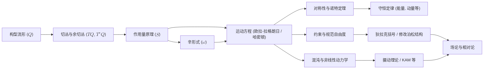

# 重构经典力学：现代几何视野
* * *

--- 由运动的几何引导，让我们从其最核心处重建力学。

# 第一章. 为什么重建力学？

**题词:**
“要以新的视角看待问题，首先必须不再执着于曾经确信的事物。”

本章作为开篇，通过审视为何应重新审视经典力学的基础，开启我们的旅程。它追溯一段简明的历史弧线 —— 从牛顿最初的力中心观点到拉格朗日和哈密顿的改革 —— 最终归结为现代几何视角。目标是展示当我们从力转向几何和变分时，如何浮现更深刻、更统一的理解。

## 1.1 动机与历史回顾

### 目标
强调脱离传统基于力的叙述的必要性，提供历史上转变的线索(牛顿 → 拉格朗日 → 哈密顿 → 现代几何)。

### 内容

1. **牛顿的力中心框架**
   - 在牛顿的《自然哲学的数学原理》中，力被宣布为运动的原始原因。数学公式直接关联到直观的日常经验 —— 推、拉、抵抗 —— 而“惯性质量”的概念锚定第二定律。
   - 尽管在其时代具有革命性，这种直接基于力的视角可能会掩盖其下隐藏的更为优雅的简单结构：牛顿定律必须为每种新遇到的力(重力、电磁力、摩擦力等)分别重述。

2. **向分析力学的转变**
   - 到了18世纪末，拉格朗日通过引入广义坐标和势能，将力学表述为他的《分析力学》，实现了重大飞跃。从力向量到能量类标量(拉格朗日量 $L = T - V$)的转变允许一种统一的方法处理约束和不同类型的力。
   - 随后不久，哈密顿将这些思想提炼成相空间图景，揭示了更深的对称性。哈密顿观点引入正则坐标 $(q, p)$，从这个角度，力学可以被视为围绕辛结构旋转的丰富几何学科。

3. **几何和变分原理的出现**
   - 早在莫佩尔蒂、欧拉和莱布尼茨时期，自然界“通过极化某种量”这一观念就开始形成。这导致了最小(或驻定)作用量原理，将看似不同的力学现象统一在一个单一陈述下：“所取路径是使作用量驻定化的路径。”
   - 随着时间的推移，数学家和物理学家意识到拉格朗日/哈密顿形式主义自然地与微分几何共鸣，其中构型空间 $Q$ 可以视为流形，“运动”可以视为在适当定义的空间中的测地线或保持辛形式的流。

4. **重建的动机**
   - 虽然牛顿视角在直接计算中仍然强大，但它可能会隐藏不同问题背后的结构统一性。另一方面，几何-变分视角揭示了普遍模式 —— 守恒律、对称性、可积性、混沌 —— 无需为每个力重写基本定律。
   - 我们的首要动机是帮助有经验的读者超越力和势能的增量添加，而是欣赏整个经典力学大厦仅从少数几何和变分公理中涌现出来。

简而言之，这段历史回顾揭示了我们越深入研究力学，就越会遇到隐藏的几何关系和总体变分原则。通过放弃根深蒂固的基于力的方法，我们为更连贯且深远的理论铺平道路。

## 1.2 核心愿景：几何 + 变分

### 目标
介绍“形式即内容”的哲学立场，解释几何和作用量原理如何塑造我们对运动的理解。

### 内容

1. **重新思考‘力’为几何表现**
   - 在传统方法中，“力”是一个改变粒子动量的外部实体。然而，在几何-变分视角下，我们所谓的“力”通常可以看作构型空间底层几何与能量原理结合的表现。
   - 正如曲面上的测地线代表“自由运动”，实际机械轨迹也代表在精心构建的几何领域内使作用量“极化”的路径。

2. **变分作为运动的语言**
   - 通过将运动视为作用量泛函 $S$ 的稳定路径，我们将动力学统一在一个单一陈述下：“物理轨迹是那些在小变分下使 $S$ 驻定化的路径。”
   - 这种方法优雅地避开了需要逐片指定力的需求；相反，任意“力”都编码在势能、约束或度量的选择中。

3. **辛几何作为力学的‘形式’**
   - 由作用量原理提供**方程**，而辛几何提供**结构**。位置和动量成为辛流形 $P$ 中的共轭变量。
   - 可以说：如果我们只能保留一个来自所有力学的概念，那可能是辛形式 $\omega$(或作用量 $S$)，因为它单独编码运动随时间演化的根本“DNA”。

4. **“形式即内容” —— 哲学注记**
   - 这个想法借鉴现代数学和哲学，认为关系结构(即几何、变换、辛形式)**就是**系统的本质。我们不需要**额外添加**力，因为几何已经决定了‘力’的来源。
   - 此外，这样的观点为我们准备了更高级的概念 —— 如规范场、广义相对论和量子场论 —— 其中几何和作用量仍然是中心和普遍的。

5. **如果只有一个概念幸存下来…**
   - 因此，我们提出一个思想实验：“在一个摧毁了大部分知识的灾难中，哪一个单一概念足以重建经典力学？”
   - 最好的候选者或许是**作用量原理**(或等效地，**辛结构**)。从那里，可以系统地恢复牛顿定律、拉格朗日方程、哈密顿方程以及熟悉的经典现象织锦。

因此，本着“形式即内容”的精神，本论著从一开始就将几何和变分原理置于我们重建的核心。随着我们继续前进，我们将看到传统的力学概念 —— 力、约束和对称性 —— 在我们采用构型空间加上精心定义的作用量(或辛形式)作为理论基础的观点下，自然而然地涌现出来。

## 1.3 第一章的结语

通过从这个视角重新审视力学，我们放弃了陈旧的框架，以揭示一个充满活力的概念统一性。接下来的章节将逐步发展这些几何和变分概念，展示它们如何真正作为经典物理学“机械和谐”背后的隐秘指挥者。

# 第二章. 构型与状态：最小的成分

**题词:**
“世界首先由可能性构成。”

本章介绍我们几何公式的基础：构型空间的概念及其与相空间的关系。我们强调物理上有意义的构型可以优雅地建模为流形 $Q$ 上的点，并且为了分析动力学，我们自然地将 $Q$ 扩展到它的余切丛 $T^*Q$，在那里动量和位置不可分割地交织在一起。

## 2.1 流形作为构型空间

### 目标
展示如何将可能的状态集指定为流形 $Q$ 是第一个基本构建块。

### 内容

1. **构型的直观概念**
   - 在力学中，系统的每个不同“排列”称为一个构型。对于三维欧几里得空间中的单个粒子，构型仅仅是其位置 $\mathbf{r} \in \mathbb{R}^3$。对于更复杂的系统 —— 如刚体 —— 所有方向的集合是 $\mathrm{SO}(3)$。
   - 无论是摆的角度、机器人的关节角度，还是 $n$ 个粒子的一组广义坐标，这个想法始终相同：构型列举系统可以安排的所有几何上有效的方式。

2. **为什么是流形？**
   - 我们正式将构型视为抽象流形 $Q$，因为并非所有的构型空间都像 $\mathbb{R}^n$ 那样简单。有些是弯曲的(如球体或旋转群)，有些有拓扑约束，有些是更简单空间的乘积。
   - 流形是一个局部看起来像 $\mathbb{R}^n$ 但可能具有更复杂全局形状的空间。例如，$\mathrm{SO}(3)$ 是一个拓扑上不同于 $\mathbb{R}^3$ 的三维流形。

3. **局部坐标和维度**
   - 尽管 $Q$ 可能整体上是弯曲的，但在足够小的邻域内我们可以设置“局部”坐标 —— 就像在球体上选择纬度和经度 —— 以参数化接近某一点的所有可能构型。
   - $Q$ 的维度通常对应于系统的“自由度”。简单的摆有 $1$ 个自由度 ($\theta$)，因此 $Q \cong S^1$。三维自由空间中的刚体有 $6$ 个自由度($3$ 个用于位置，$3$ 个用于方向)，尽管仅方向位于 $\mathrm{SO}(3)$ 上。

4. **物理例子**
   1. **$\mathbb{R}^3$ 中的粒子**
      - $Q \cong \mathbb{R}^3$，局部坐标 $(x,y,z)$。
      - 简单的几何结构但仍与后续内容丰富地连接。
   2. **$\mathrm{SO}(3)$ 上的刚体**
      - 方向是一个三维流形，不同于 $\mathbb{R}^3$。
      - 强调并非所有自由度都是线性的。
   3. **连杆摆和机器人臂**
      - 如果每个段落是一个旋转链接，则构型空间可能是圆的乘积 $(S^1)^n$。
      - 当涉及多个关节时展示了拓扑复杂性。

通过这些实例，可以看出指定 $Q$ —— 所有可能系统状态的流形 —— 构成了几何力学方法的主要行为。一旦选择 $Q$，其余的形式主义(动力学定律、约束条件，甚至什么是“力”)就从我们如何嵌入或解释该流形在更高维构造中流出。

## 2.2 相空间、切丛和余切丛

### 目标
确立 $Q$ 的自然扩展是 $T^*Q$，即动力学的领域。

### 内容

1. **速度和切丛 $TQ$**
   - 仅从运动学角度看，如果 $Q$ 捕捉所有可能的构型，那么“运动”可以看作 $Q$ 中的路径 $\gamma(t)$。
   - 时间 $t$ 时的瞬时速度 $\dot{\gamma}(t)$ 是 $Q$ 在点 $\gamma(t)$ 处的切向量。所有这样的“切向量”在 $Q$ 的每一点上形成切丛 $TQ$。
   - 对于 $S^1$ 上的摆，$\theta$ 处的速度是 $\dot{\theta}$ 在切空间 $T_{\theta}S^1$ 中。对于刚体，速度由 $\mathrm{SO}(3) \times \mathbb{R}^3$ 的切空间中的平移和角速度分量表示。

2. **动量和余切丛 $T^*Q$**
   - 虽然 $TQ$ 处理的是速度，但经典力学通常更喜欢动量 $p$，它属于速度的对偶空间 —— 即余切空间。
   - 余切丛 $T^*Q$ 是哈密顿力学的自然设定，其中状态是 $(q, p)$。每个纤维 $T_q^*Q$ 是配置 $q$ 处所有可能的动量协向量的空间。
   - 从 $TQ$ 到 $T^*Q$ 的转变不仅仅是数学形式；它与拉格朗日量和哈密顿量的定义(通过勒让德变换)交织在一起。

3. **从构型到相空间**
   - 在许多物理问题中(例如，$\mathbb{R}^3$ 中的自由粒子)，首先指定拉格朗日量 $L(q,\dot{q})$。通过定义共轭动量 $p_i = \partial L/\partial \dot{q}_i$，我们将描述从切丛提升到余切丛。
   - 相空间 $P \equiv T^*Q$(有时记作 $\Gamma$)是哈密顿力学的基本领域，充满了支撑运动方程的辛形式。

4. **状态与构型**
   - “构型” $q \in Q$ 仅表达系统**在哪里**；“状态” $(q,p) \in T^*Q$ 表达系统**在哪里**，**并且**处于什么动态“动量条件”。这种区分对于描述演化至关重要：在确定的经典环境中，状态的知识决定未来的轨迹。
   - 因此，如果 $Q$ 对于自由刚体是 $6$ 维的($3$ 个用于位置，$3$ 个用于方向)，则相应的相空间 $T^*Q$ 是 $12$ 维的，携带位置/方向和线性/角动量。

5. **为什么是流形 + 丛？**
   - 从一开始就结合高级几何可能会显得令人生畏，但它通过统一约束系统、刚体运动、连续场等所有内容而得到了回报。
   - 流形和丛的语言足够灵活，可以处理局部约束、非欧几里得几何(例如，旋转框架或弯曲时空)以及在实际应用中经常出现的复杂拓扑结构(如机器人连杆或分子键)。

总之，系统的根本“可能性空间”是流形 $Q$。一旦我们加入速度或动量，我们就自然地上升到切丛或余切丛，最终达到完整的“相空间”视角，这推动了哈密顿力学的发展。有了这些结构，我们现在可以整合作用量原理(第三章)和辛观点(第四章)，揭示动力学定律如何从几何本身涌现出来。

## 2.3 第二章的结语

我们已经铺好了所需的最小几何框架：
- **构型流形** $Q$ 组织所有可能的“静态”构型；
- **切丛** ($TQ$) 和**余切丛** ($T^*Q$) 创建了捕捉速度和动量的动力学扩展；
- 通过将状态视为在 $T^*Q$ 中的点，我们为接下来的变分和辛处理奠定基础。

确实，“世界首先由可能性构成”，从这些可能性中，我们锻造了一个演化的机械系统的蓝图。在下一章中，我们将看到作用量原理如何利用这一几何结构来规定运动 —— 这一步将纯几何转化为一个受严格治理的动力学领域。

# 第三章. 作用量原理作为动力学的生成器

**题词:**
“通往运动定律的最短路径是作用量最小的路径。”

在第二章中建立了几何设置 —— 构型流形及其切丛/余切丛 —— 我们现在来探讨经典力学重构中的下一个关键层：作用量原理。这一原理提供了一个统一的视角，从其中可以重新解释所有的“力”和“约束”，并以单一变分陈述的形式阐明了运动如何以惊人的清晰度涌现。

## 3.1 作用量泛函

### 目标
提供作用量 $S$ 的精确定义，强调它是经典运动的最终“源代码”。

### 内容

1. **定义拉格朗日量 $L$**
   - 在拉格朗日表述中，每个构型 $q\in Q$ 有一个相关的速度 $\dot{q}\in T_{q}Q$，并且可能有显式的时间依赖 $t$。
   - 一个典型的机械拉格朗日量形式为
     $$
       L(q,\dot{q},t) = T(\dot{q}) \;-\; V(q),
     $$
    其中 $T$ 是动能(通常与 $\dot{q}$ 呈二次型关系)，而 $V$ 是势能(取决于 $q$)。更一般的拉格朗日量可能会包含非保守项、规范场或基于约束的修改。

2. **作用量积分**
   - 作用量 $S$ 是拉格朗日量在时间区间上的积分，
     $$
       S[q(\cdot)] \;=\; \int_{t_1}^{t_2} \,L\big(q(t), \dot{q}(t), t\big)\, \mathrm{d}t,
     $$
    其中 $q(t)$ 是构型流形 $Q$ 中的一条路径。
   - 关键的是，$S$ 是一个泛函，意味着它为每个可能的轨迹 $q(t)$ 分配一个实数。在这个意义上，$S$ 可以被视为编码系统如何演化的“源代码”：一旦选择 $L$，整个动力学结构就由 $S$ 如何依赖于 $q(\cdot)$ 确定。

3. **边界条件和物理轨迹**
   - 为了从所有数学上可能的轨迹中挑选出实际的“物理”轨迹，我们通常固定初始构型 $q(t_1)$ 和最终构型 $q(t_2)$。变分 $\delta q(t)$ 则被强迫在 $t_1$ 和 $t_2$ 处消失 —— 即路径的端点保持固定。
   - 这个边界条件反映关键的物理假设：系统在开始和结束时间具有确定的构型，我们寻找连接这些边界点的光滑曲线 $q(t)$，使得作用量极化。

4. **解释和普遍性**
   - “使 $S$ 在小变分下驻定化的物理路径”这一原则非常强大。它统一了许多概念，在旧的处理方法中这些概念是逐个引入的(例如，力、约束、能量守恒)。
   - 从哲学上讲，可以说自然界“选择”了作用量最小(或更准确地说，稳定化)的路径；从数学上讲，这意味着运动方程可以从单个优化原则得出，而不是通过分离的力定律。

本质上，作用量 $S$ 是一个紧凑的全局表示，描述系统构型如何在能量、约束和对称性中演化。通过关注 $S$，我们将力学的观点从“作用于物体的力”转变为“构型空间中的最优轨迹”，为后续章节中遇到的更深层次的几何统一铺平道路。

## 3.2 变分导数和欧拉-拉格朗日方程

### 目标
解释 $\delta S = 0$ 如何产生运动方程，将多个力学原理统一在一个框架下。

### 内容

1. **作用量的变分：$\delta S$**
   - 为了找到使 $S$ 驻定化的路径，我们通过无穷小量 $\delta q(t)$ 对 $q(t)$ 进行变分。形式上，
     $$
       \delta S 
       \;=\; \int_{t_1}^{t_2} 
       \Biggl[
         \frac{\partial L}{\partial q} \,\delta q 
         \;+\; \frac{\partial L}{\partial \dot{q}} \,\delta \dot{q}
       \Biggr] \mathrm{d}t.
     $$
   - 对涉及 $\delta \dot{q}$ 的项进行分部积分，并使用边界条件 $\delta q(t_1)=\delta q(t_2)=0$，我们得到：
     $$
       \delta S
       \;=\; \int_{t_1}^{t_2}
       \Bigl[
         \frac{\partial L}{\partial q} 
         \;-\; \frac{d}{dt}\Bigl(\frac{\partial L}{\partial \dot{q}}\Bigr) 
       \Bigr]
       \delta q \;\mathrm{d}t.
     $$

2. **欧拉-拉格朗日方程**
   - 为了使作用量驻定化，我们需要对所有变分 $\delta q(t)$ 满足 $\delta S = 0$。这意味着
     $$
     \frac{\partial L}{\partial q} 
     \;-\;
     \frac{d}{dt}\Bigl(\frac{\partial L}{\partial \dot{q}}\Bigr)
     \;=\; 0.
     $$
   - 这些欧拉-拉格朗日方程统一了牛顿定律，允许从 $\partial L /\partial q$ 读取“力”。实际上，在熟悉的情况下 $L = T - V$，我们恢复了 $\mathbf{F} = -\nabla V$。但这种表述的优势在于它同样适用于非笛卡尔坐标、约束条件或奇异势能，所有这些都遵循相同的变分原则 $\delta S=0$。

3. **无坐标视角**
   - 尽管我们通常在坐标中写出欧拉-拉格朗日方程，但该原则本身是无坐标的：它仅仅要求 $S$ 的一阶变分为零。
   - 几何上，可以将解描述为时空适当定义的丛中的测地线或极值。这一视角与辛观点(将在第四章讨论)无缝融合，揭示更深层次的不变量。

4. **约束和拉格朗日乘子**
   - 实际系统往往带有约束(完整或非完整)。在拉格朗日设定中，可以通过引入拉格朗日乘子将约束纳入作用量。例如，如果约束是 $\phi(q) = 0$，则增广拉格朗日量可能是
     $$
       \widetilde{L}(q,\dot{q},\lambda)
       \;=\; L(q,\dot{q})
             \;+\; \lambda\,\phi(q).
     $$
   - 通过将 $\lambda$ 视为一个额外的变量进行变分，确保约束在结果的运动方程中得到执行。这一通用程序展示了约束不需要临时的“约束力”，而是遵循相同的变分原则。

5. **为什么它统一了各种力学原理**
   - 牛顿定律是一个特例，但连续介质力学、光学(费马原理)甚至广义相对论中的测地线运动也都可以通过合适的作用量框架来表达。
   - 哈密顿方法、正则动量、对称性和守恒律(将在第四章和第五章讨论)也在作用量原理中找到根源，展示了这种统一的广泛性。

因此，通过要求 $\delta S=0$，我们可以无缝推导出核心运动定律，同时容纳约束、坐标变换和广泛的 $L$ 函数形式。这就是为什么作用量原理成为所有经典动力学背后的生成引擎 —— 一旦给出合适的 $L$，就不需要关于力或惯性的额外公设。

## 3.3 第三章的结语

在本章中，我们将作用量原理置于其应有的位置，作为经典动力学的“生成元”。拉格朗日形式主义，封装在 $\delta S=0$ 中，优雅地产生了欧拉-拉格朗日方程 —— 一个简洁、普遍的运动配方。考虑到边界条件和约束如何在这个方案中轻松集成，人们开始看到它如何简化并统一许多看似不相关的力学情景。

基于 $\delta S=0$ 编码所有基本动力学的洞察，我们接下来将进入哈密顿图景(第四章)。在那里，我们将探索辛几何如何将这些相同的变分思想转化为相空间，打开通向强大的几何不变量、正则变换和其他领域的门。

# 第四章. 辛几何：哈密顿力学的文化心脏

**题词:**
“辛形式是所有机械谐波的隐秘指挥者。”

在第三章中确立了作用量原理的优雅之后，我们现在转向哈密顿表述 —— 这可能是经典力学最具有几何启发性的表示。在本章中，我们将揭示勒让德变换如何连接拉格朗日和哈密顿图像，以及辛形式 $\omega$ 如何作为相空间中每个动力流的基础。这些思想构成了现代分析力学的骨干，统一了从可积系统、混沌理论到量子力学等不同的领域。

## 4.1 从拉格朗日量到哈密顿量

### 目标
以几何方式展示勒让德变换，从 $(q, \dot{q})$ 转换到 $(q, p)$。

### 内容

1. **动量作为共轭变量**
   - 在拉格朗日框架中，我们把 $(q,\dot{q})$ 视为描述系统状态的基本变量。然而，一旦我们定义正则(广义)动量为
     $$
       p_i \;=\; \frac{\partial L}{\partial \dot{q}_i},
     $$
    我们就进入了新的视角，在其中 $(q,p)$ 同样基本。
   - 这种转换不仅仅是坐标变换；它反映更深层次的转变：速度 $\dot{q}$ 被动量 $p$ 取代，从而开启了哈密顿力学的大门。

2. **勒让德变换和哈密顿量 $\mathbf{H}$**
   - 形式上，哈密顿量 $H$ 由拉格朗日量 $L$ 的勒让德变换得出：
     $$
       H(q,p,t)
       \;=\;
       \sum_{i} p_i \,\dot{q}_i \;-\; L\bigl(q,\dot{q}(p),t\bigr),
     $$
    其中 $\dot{q}(p)$ 是用动量表示的速度(假设非退化)。
   - 对于一个“标准”的机械系统，其中 $L=T-V$ (动能减势能)，这通常给出
     $$
       H(q,p) \;=\; \frac{p^2}{2m} \;+\; V(q),
     $$
    或者在更一般的坐标下，$H = \sum p_i^2/(2 \, m_i) + V$。哈密顿量通常对应总能量，但在更复杂的系统中(例如，带有约束或时间依赖势能的系统)，它可能偏离简单的“$\text{能量} = T + V$”解释。

3. **变换的几何意义**
   - 从拉格朗日到哈密顿形式的过渡可以解释为从切丛 $TQ$ (速度所在的空间)到余切丛 $T^*Q$ (动量所在的空间)的移动。
   - 在几何力学中，这一转变至关重要：哈密顿表述本质上携带一个辛 $2$-形式 $\omega$，赋予丰富的结构，统一了流、可积系统和变换。
   - 此外，一旦我们采用 $(q,p)$ 坐标，运动方程成为相空间中的第一阶常微分方程，而不是构型空间中的第二阶常微分方程。

4. **哈密顿视角的优势**
   - 在哈密顿图像中，辛几何变得更加透明，如我们将在 §4.2 中看到的。
   - 正则动量在场论、量子力学和高级主题如规范理论中通常是更自然的变量。
   - 强大的技术如正则变换、泊松括号和生成函数在 $(q,p)$-空间中找到了最简单的表达。

因此，勒让德变换不仅仅是一个代数技巧；它是概念上的飞跃，重新解释了经典运动，将其视为相空间上的几何 —— 为即将到来的辛框架奠定了基础。

## 4.2 辛形式和哈密顿方程

### 目标
引入 $2$-形式 $\omega$，澄清其非退化性和封闭性，并展示哈密顿方程如何从 $\omega$ 和 $H$ 中得出。

### 内容

1. **定义辛形式**
   - 在余切丛 $T^*Q$ 上，我们定义一个典范 $1$-形式，通常写作 $\theta = \sum_i p_i\,dq_i$。其外导数 $\omega = d\theta$ 给出**辛 $2$-形式**：
     $$
       \omega \;=\; \sum_i dq_i \,\wedge\, dp_i.
     $$
   - 这个 $2$-形式 $\omega$ 是**封闭的**($d\omega=0$)和**非退化的**，使得 $(T^*Q,\omega)$ 成为真正的辛流形。物理上，$\omega$ 包含相空间的几何，决定状态在哈密顿方程下的时间演化。

2. **哈密顿方程从 $\omega$ 和 $H$ 中得出**
   - 一旦我们有了哈密顿函数 $H(q,p)$，相空间流由要求 $H$ 沿着轨迹的全导数消失(为零)来确定。在微分几何术语中，哈密顿向量场 $X_H$ 必须满足
     $$
       \iota_{X_H}\,\omega \;=\; dH,
     $$
    其中 $\iota$ 表示内积。
   - 用坐标表示，这些条件再现了熟悉的**哈密顿方程**：
     $$
     \dot{q}_i \;=\; \frac{\partial H}{\partial p_i},
     \qquad
     \dot{p}_i \;=\; -\,\frac{\partial H}{\partial q_i}.
     $$
   - 这简洁地展示了相空间中的“运动”是如何由辛形式 $\omega$ 和哈密顿势能景观 $H$ 紧密控制的。

3. **正则坐标和泊松括号**
   - 坐标 $(q_i, p_i)$ 被称为**正则**恰因为 $\omega$ 采取简单的标准形式 $\sum dq_i \wedge dp_i$。**正则变换**是保持 $\omega$ 不变的变换。
   - 在哈密顿语言中，两个函数 $f, g$ 的泊松括号由下式给出
     $$
       \{f, g\}
       \;=\;
       \sum_i
       \left(
         \frac{\partial f}{\partial q_i}\,\frac{\partial g}{\partial p_i}
         \;-\;
         \frac{\partial f}{\partial p_i}\,\frac{\partial g}{\partial q_i}
       \right).
     $$
    这个括号提供了研究对称性、运动积分和正则变换的强大代数工具。

4. **刘维尔定理和相体积守恒**
   - 哈密顿方程的一个直接结果是**刘维尔定理**，它指出相空间体积(由 $\omega^n$ 测量)沿着流保持不变。用通俗的话说，哈密顿流“搅拌”相空间而不全局拉伸或压缩它。
   - 几何上，这与 $\omega$ 是封闭的($d\omega=0$)的事实有关，确保了相空间中的不可压缩性。物理上，它支撑统计力学(遍历理论)的许多内容，并支持了在保持测度的同时进行混沌混合的可能性。

5. **含义和统一视野**
   - 辛形式 $\omega$ 因此指挥着所有的机械现象：从可积运动(其中可以找到作用-角度变量)到混沌动力学(其中发生混合但体积仍然保持不变)。
   - 一旦认识到 $(T^*Q, \omega)$ 是自然的“舞台”，哈密顿形式主义就不仅仅是一种方便的方法 —— 它成为了一种**几何学科**，其中变换(正则变换)和守恒律(哈密顿语言中的诺特定理)有优雅的、坐标不变的表述。

## 4.3 第四章的结语

我们追溯了勒让德变换如何从基于速度的拉格朗日图像铺平道路到基于动量的哈密顿图像，以及辛形式 $\omega$ 如何成为相空间中所有机械演化的“指挥者”。这一几何织锦揭示了“状态的流” —— 即动力学的本质 —— 与非退化的、封闭的 $2$-形式 $\omega$ 和哈密顿函数 $H$ 不可分割。

在接下来的章节中，我们将进一步利用这一形式主义。第五章探讨对称性和守恒律如何在哈密顿设定中自然出现(通过诺特定理和正则变换)，而后续部分深入研究了约束、可积性、混沌等领域。哈密顿力学的标志在于它统一了局部微分方程和全局几何结构 —— 证明了为什么辛形式确实是“所有机械谐波的隐秘指挥者”。

# 第五章. 结构与对称性：重温诺特定理

**题词:**
“每个隐藏的对称性孕育出一个新的运动常数。”

经典力学充满了隐藏的结构，而没有任何原则比诺特定理更能优雅地捕捉其深刻性。在本章中，我们探讨连续对称性(无论是在拉格朗日还是哈密顿表述中)如何保证守恒量的存在，统一了动量、能量、角动量等概念。然后，我们将转向正则变换，它保持辛结构，因此作为哈密顿力学中的基本坐标变换 —— 为可积系统、作用-角度变量及进一步简化的途径铺平道路。

## 5.1 连续对称性和守恒律

### 目标
展示诺特定理是如何成为动量、能量、角动量等守恒律背后的统一原理。强调无论系统是用拉格朗日形式还是哈密顿形式表示，对称性都会产生不变量。

### 内容

1. **诺特定理简介**
   - 其核心，诺特定理指出，作用量 $S$ 的每个连续对称性都会引出相应的守恒律。如果坐标的无穷小变换不改变 $S$ 的值，则存在一个与该变换相关的守恒量。
   - 经典示例：
     – 时间平移不变性意味着能量守恒。
     – 空间平移不变性意味着(线性)动量守恒。
     – 旋转不变性意味着角动量守恒。

2. **拉格朗日图像中的对称性**
   - 在拉格朗日力学中，连续对称性可以表示为广义坐标的小位移，$q \mapsto q + \delta q(\epsilon)$，使得 $L$ (或更精确地说，作用量 $S$)在一阶 $\epsilon$ 下不变。
   - 通过在这些变换下操作欧拉-拉格朗日方程，可以隔离出诺特流或诺特荷 —— 基本上是守恒量的被积函数。
   - 示例：如果 $L$ 不显式依赖于时间，$\tfrac{\partial L}{\partial t} = 0$，则对应的诺特不变量是哈密顿量 $H$ —— 物理上解释为总能量。

3. **哈密顿图像中的对称性**
   - 哈密顿力学通过泊松括号提供另一种视角。如果函数 $F(q,p)$ 的全时间导数为零：$\dot{F} = \{F,H\} = 0$，则 $F$ 是守恒的。
   - 连续对称性对应于一个生成元 $G$，使得由 $G$ 生成的正则变换保持哈密顿结构不变。在许多情况下，$G$ 本身就是守恒量。
   - 例如，旋转不变性在哈密顿力学中通过角动量分量 $L_x, L_y, L_z$ 体现出来。泊松括号 $\{L_i, H\} = 0$ 表明每个分量在旋转对称性下(假设各向同性)随时间不变。

4. **深入理解：对称性作为一种冗余声明**
   - 对称性本质上说，系统的配置或相空间标记的某些方面是冗余的。如果旋转你的参考框架(平移、旋转、相位移动)不改变物理性质，那么必须存在一个相应的不变量。
   - 这种观点有助于统一约束、规范理论和高级表述：约束通常反映更高层次描述的对称性。

5. **示例和扩展**
   - **中心力问题**：球对称性意味着角动量守恒 —— 这反过来约化了运动的有效维度。
   - **规范不变性**：在场论中，局部规范不变性导致守恒流(电荷等)，代表了现代物理学中诺特定理的广泛推广。

因此，无论我们是用拉格朗日对称性还是哈密顿生成元来表达，诺特定理不仅提供了概念上的优雅 —— 每个对称性产生一个守恒律 —— 还提供了实际指导，告诉我们哪些量在系统演化过程中保持不变。

## 5.2 正则变换和生成元

### 目标
解释某些变换如何保持 $\omega$，重新标记状态而不改变物理性质。阐明其与可积系统、作用-角度变量和简化变换的联系。

### 内容

1. **什么是正则变换？**
   - 在哈密顿力学中，变换 $(q,p) \mapsto (Q,P)$ 是**正则**的，如果它保持辛形式 $\omega$。具体来说，这意味着
     $$
       \sum_i dQ_i \wedge dP_i
       \;=\; 
       \sum_i dq_i \wedge dp_i,
     $$
    从而使哈密顿方程的结构保持不变。
   - 等价地，这样的变换保持泊松括号结构，$\{Q_i,P_j\} = \delta_{ij}$。

2. **正则变换的生成元**
   - 许多正则变换可以通过一个函数 $G$ (有时称为**生成函数**)生成，它可以依赖于旧变量和新变量的各种组合 $(q,P)$ 或 $(Q,p)$。
   - 几何上，“生成”一个小的正则变换类似于在相空间上沿着由某个函数确定的向量场流动(该流的哈密顿量)。这种观点与诺特定理无缝结合：连续对称性正是使 $H$ 保持不变的正则变换。

3. **作用-角度变量和可积系统**
   - 在具有 $n$ 个自由度和 $n$ 个独立守恒量的可积系统中(在适当正则条件下)，可以进行正则变换到**作用-角度**变量 $(J_i,\theta_i)$。
   - 新的哈密顿量 $H(J)$ 仅依赖于“作用” $J_i$ (运动常数)，而“角度” $\theta_i$ 随时间均匀变化。这种变换不仅精确求解了系统，还揭示了几何结构：运动发生在相空间中的不变环面上。
   - 概念上，作用-角度描述代表了简化变换的顶峰，揭示了可积运动中的**交响乐和谐** —— 同时也突出了非可积(混沌)系统如何偏离这一纯净场景。

4. **简化复杂问题**
   - 正则变换在从天体力学到量子力学(如正则量化)的问题中，用于解耦或简化哈密顿量非常强大。
   - 通过系统地寻找约化哈密顿量复杂性的变换，可以将某些多自由度问题转化为实际上的一维运动，或识别围绕稳定平衡的小振荡。

5. **与对称性和约束的联系**
   - 生成守恒量的对称性变换本身是一个特殊的正则变换，它使哈密顿量保持不变($\delta H = 0$)。
   - 相反，约束往往可以通过扩大相空间(添加规范自由度)并使用正则变换或规范固定程序来处理，以减少冗余的动力学变量。

总之，正则变换构成哈密顿力学实现其非凡适应性和力量的主要机制。它们以突出可积性或揭示复杂动力学结构的方式塑造相空间。对称性和其生成变换共同统一了这样一个概念：系统的深层不变量，无论是动量、能量或其他，都源于相空间本身的几何结构。

## 5.3 第五章的结语

从诺特定理捕捉连续对称性的本质，到正则变换在保持辛结构的同时重塑相空间，我们看到经典力学建立在结构性不变量而非随意的力之上。对称性不仅仅是提供“便捷捷径”来守恒量；它们反映了我们标记系统方式中的基本冗余。同样，正则变换利用这种几何结构，使我们能够重新参数化复杂问题为更简单的形式，并偶尔揭示出精确的可积性。

在接下来的章节中，我们将看到这些概念如何应用于简单和复杂的机械系统(第六章)，为探索混沌(第七章)、场扩展(第八章)和更哲学的前沿(第九章)铺路。到目前为止，反复出现的主题应该是明显的：几何和变分照亮了力学的所有方面，而对称性和正则变换则是编织这幅织锦的线索。

# 第六章. 从简单系统到复杂现象

**题词:**
“掌握小的，便是窥见大的。”

迄今为止，我们已经建立了经典力学的基本几何和变分结构。在本章中，我们将说明这些抽象原则如何统一描述“简单”模型(如振子、摆、刚体)和更复杂的带约束或规范自由度的系统。我们将看到相同的解释框架(配置流形、作用原理、辛几何)如何光滑地从基本原型扩展到复杂的机械现象。

## 6.1 原型系统(振子、摆、刚体)

### 目标
展示相同的几何-拉格朗日框架如何覆盖广泛的机械模型类别。

### 内容

1. **为何这些原型重要**
   - 振子、摆和刚体作为几个世纪以来的经典例子，因为它们代表了力学中的基础“构建块”。尽管它们看起来简单，但它们包含了多个关键概念：约束(摆)、群-流形结构(刚体)和驻定平衡(振子)。
   - 通过观察每个系统如何源自相同的底层几何-拉格朗日视角，我们获得了信心，即更复杂的系统也遵循相同的模式。

2. **简谐振子 (SHO)**
   - **配置流形:** 对于一维 SHO，$Q \cong \mathbb{R}$。尽管拓扑是平凡的，振子的动力学依赖于一个二次型势能。
   - **拉格朗日/作用量:**
     $$
       L \;=\; \tfrac12\,m\,\dot{q}^2 - \tfrac12\,k\,q^2,
       \quad
       S = \int L\,dt.
     $$
    欧拉-拉格朗日方程得出 $\ddot{q} + \tfrac{k}{m}\,q=0$。
   - **辛/哈密顿形式:** 转换到哈密顿描述，定义动量 $p = m\,\dot{q}$，因此
     $$
       H(q,p) = \frac{p^2}{2m} + \frac12\,k\,q^2.
     $$
    结果的相空间流轨道在 $(q,p)$ 空间中为椭圆，反映了基本的谐波运动。
   - **关键见解:** 即使是最简单的系统 —— 一个自由度、线性势能 —— 也为理解更复杂、高维系统的正则模展开提供了种子。

3. **摆**
   - **配置流形:** 一个平面摆，固定点和长度为 $\ell$ 的摆锤，实际上被限制在一个圆 $S^1$ 上。因此 $Q \cong S^1$，由角度 $\theta$ 参数化。
   - **几何性质:**
     - 圆结构表明运动不是在线上，而是在闭合环上。
     - 局部坐标 $\theta$ 可以从 $-\pi$ 到 $\pi$，但在拓扑上，$-\pi$ 和 $\pi$ 表示相同的配置。
   - **拉格朗日:**
     $$
       L(\theta,\dot{\theta})
       \;=\;
       \tfrac12\,m\,(\ell^2)\,\dot{\theta}^2
       \;-\;
       m\,g\,\ell\,\bigl(1-\cos\theta\bigr).
     $$
    欧拉-拉格朗日方程概括了著名的摆动力学 $\ddot{\theta} + (\tfrac{g}{\ell}) \sin\theta=0$。
   - **小角度 vs. 完全非线性:**
     - 在 $\theta=0$ 附近，$\sin\theta \approx \theta$，重现类似 SHO 的运动，频率为 $\sqrt{g/\ell}$。
     - 完全非线性系统保留了周期性的更复杂相空间拓扑。
   - **更广泛的意义:** 理解摆的流形结构为我们准备了更复杂的约束，如双摆或多关节机器人臂，每个都进一步增加了配置空间中的圆或环面。

4. **刚体**
   - **构型流形:** 对于自由的三维刚体，旋转自由度位于 $\mathrm{SO}(3)$，一个三维李群流形。如果考虑平移，总构型空间可以是 $\mathrm{SO}(3)\times \mathbb{R}^3$。
   - **拉格朗日和惯性张量:**
     $$
       T \;=\; \tfrac12\,\boldsymbol{\omega}^\mathsf{T} \mathbf{I} \,\boldsymbol{\omega},
       \quad
       V=0 \quad (\text{if free rotation}),
     $$
    其中 $\boldsymbol{\omega}$ 是机体坐标中的角速度向量，而 $\mathbf{I}$ 是惯性矩阵。
   - **欧拉方程:** 欧拉-拉格朗日方程专门化到 $\mathrm{SO}(3)$ 产生刚体旋转的欧拉方程。
   - **几何方面:**
     - $\mathrm{SO}(3)$ 是一个非线性流形；局部可以选择欧拉角或四元数，但在全局上有非平凡的拓扑(类似于某些识别下的三维球)。
     - 刚体旋转除非有外力矩作用，否则守恒角动量，这是第五章引入的诺特定理对称性论证的反映。

5. **例子之间的连续性**
   - 从 $\mathbb{R}$ 中的振子到 $\mathrm{SO}(3)$ 上的刚体，所有这些系统共享相同的概念基础：选择 $Q$，定义合适的 $L$ 或 $H$，并推导运动方程。
   - “约束”(如摆的固定支点)或非平凡流形(如 $\mathrm{SO}(3)$)无缝地出现在相同的公式中，展示了几何-拉格朗日力学的非凡普遍性。

## 6.2 约束、非完整系统和规范自由度

### 目标
深入探讨高级约束处理，包括非完整约束和类似规范的冗余。

### 内容

1. **完整 vs. 非完整约束**
   - **完整约束:** 可以用坐标的代数方程 $f(q_1,\dots,q_n) = 0$ 表达的约束(可能包括时间)。这些约束减少了配置流形 $Q$ 的维度。例如，摆的约束 $\|\mathbf{r}\| = \ell$ 实际上是“完整的”，将运动限制在一个圆(或更高维度的球)上。
   - **非完整约束:** 涉及速度且**不能**整合为纯坐标条件的约束。一个例子是滚动轮，其中速度约束施加 $\dot{x} - R \dot{\theta}\cos\phi =0$ 等，而没有单个全局函数关联 $x$ 和 $\theta$。
   - 几何上，非完整约束定义为 $TQ$ (切丛)的子流形，而不是 $Q$ 的子流形。这些通常通过 Pfaffian 形式或分布描述 —— 导致更丰富、有时更复杂的动力学行为。

2. **变分原理中的约束纳入**
   - **完整:** 如摆所示，要么重新参数化 $Q$ (例如，圆上的 $\theta$)，要么引入拉格朗日乘子强制 $f(q)=0$。在这两种情况下，几何与作用量的驻定原理保持一致。
   - **非完整:** 这里通常使用未定乘子法(或哈密顿语言中的 Dirac–Bergmann 程序)来包含速度级别的约束，导致广义的拉格朗日或哈密顿方程。这些约束可以产生不来自势能的非保守力。

3. **类似规范的冗余**
   - **规范自由度作为冗余坐标:** 在某些机械系统中(特别是具有局部对称性的系统)，可能存在不影响可观测物理的“额外”变量。一个经典例子是具有内部对称性的自旋陀螺，或具有重新标记不变性的系统。
   - **与规范理论的数学平行:** 尽管规范理论在场论中更为突出，但原理是相同的：我们可以用不影响物理结果的额外自由度参数化系统，这些必须通过约束“消除”或固定。
   - 这样的规范自由度在哈密顿形式中表现为生成物理等效状态之间变换的第一类约束 —— 直接联系到相对论和量子场论中的高级概念。

4. **Dirac 括号和广义泊松结构**
   - 当约束不保持标准的辛形式或生成第二类约束时，泊松括号结构必须修改。Dirac 引入了“Dirac 括号”来处理这种情况，有效地消除了非物理自由度。
   - 在具有非完整约束的系统中，可能会得到“广义的”(非对称或非齐次)括号，仍然产生一致的运动方程。这强调了几何观点如何通过调整底层相空间几何结构适应约束，而不是强行添加特设力项。

5. **实际哲学注记**
   - 无论是完整还是非完整的约束，并不是附加的复杂性；它们反映了真实的机械系统往往生活在更简单环境空间的子流形上。这种子流形观点对于机器人(关节限制、滚动轮、移动平台)、多体动力学(连杆、手臂)和高级理论框架(规范场)至关重要。
   - 通过将约束直接嵌入变分或辛形式中，我们保留了几何和动力学的优雅统一，揭示了“复杂”的机械现象如何与经典力学的相同基本原则保持一致。

## 6.3 第六章的结语

从无处不在的振子到规范自由度的微妙之处，核心信息是：一旦我们致力于几何-拉格朗日或哈密顿表述，“简单”和“复杂”系统之间的区别更多地在于 $Q$ 的形状和约束的性质，而不是理论上的根本转变。确实，“掌握小的，便是窥见大的”，因为分析原型、受约束的和群-流形系统不仅澄清了经典力学的本质，还为理解后续章节中的混沌和连续现象奠定基础。

通过理解即使复杂的约束和规范冗余也能整齐地融入相同的理论框架，我们更好地认识到经典力学在其核心仍然是一个由几何驱动的学科。接下来，我们将探讨这一几何基础如何阐明可积性与混沌之间的相互作用(第七章)，进一步强调“几何优先”方法在解释宇宙广泛机械行为中的力量。

# 第七章. 超越可积性：混沌与非线性动力学

**题词:**
“即使是最优雅的辛形式也能释放混沌。”

在前几章中，我们已经确立了辛几何通过哈密顿方程和守恒律编码经典运动，现在我们将面对非线性动力学中结构与不可预测性共存的悖论。曾经被视为整洁决定论的经典力学，实际上蕴含着丰富的复杂层次 —— 尤其是在可积性崩溃和混沌出现时。在本章中，我们将首先探讨刘维尔定理和相空间体积的保持(§7.1)，然后探索看似微小的扰动如何催化混沌行为(§7.2)。最终，我们将看到辛几何不仅编排可积系统中的稳定轨道，还以复杂的方式塑造混沌轨迹。

## 7.1 刘维尔定理和相空间体积

### 目标
回顾体积保持性质及其重要性。

### 内容

1. **刘维尔定理简述**
   - 在哈密顿力学中，相空间是一个辛流形 $(P, \omega)$，通常 $P = T^*Q$。刘维尔定理指出，由任意哈密顿量 $H$ 生成的流保持辛体积不变。具体来说，如果 $\rho$ 是标准的相空间体积形式(在 $2n$ 维相空间中由 $\frac{\omega^n}{n!}$ 给出)，则 $\rho$ 沿流是常数。
   - 等价地，如果我们跟踪相空间中的一个区域随时间的变化，它的体积保持不变，尽管它可能以复杂的方式被拉伸或变形。因此，哈密顿流相对于辛测度是**不可压缩的**。

2. **为何体积保持重要**
   - **统计和遍历后果:** 体积保持为统计力学奠定基础，使相空间密度可以解释为概率，这些概率在演化过程中不会耗散。这是遍历假设和玻尔兹曼对平衡分布见解的核心。
   - **关于“力”的几何视角:** 由于哈密顿形式中的力源于 $H$ 的梯度，它们永远不会“创造”或“破坏”相空间体积。这强调一个更深层次的结构性属性：$\omega$ 的几何决定哈密顿流必须保持测度不变。
   - **通向混沌的序曲:** 远远不是保证规律行为，不可压缩性可以放大微小的扭曲，导致相空间中极其复杂的折叠和拉伸。混沌系统不断折叠和拉伸相空间区域，类似于太妃糖在多个方向上被拉伸，但总体体积保持不变。

3. **遍历性和混合**
   - **遍历性:** 如果一个系统是遍历的，粗略地说，单个轨迹最终会经过与能量一致的相空间区域中的每个点附近。单独的体积保持并不保证遍历性，但它为此类现象奠定了基础。
   - **混合:** 一些哈密顿系统是**混合的**，意味着任意初始局部化的体积最终会在全局保持体积的同时扩散到整个空间；这是强混沌的标志。
   - **说明性例子:** 例如在体育场形状的台球或经典的踢转子中表现出这些性质。尽管刘维尔定理保证没有净体积变化，局部的拉伸和折叠可以非常剧烈，导致混沌混合。

因此，刘维尔定理揭示了虽然哈密顿系统的运动严格受辛几何约束，但仍有许多复杂的空间 —— 直接将我们引向超越整齐可积解的现象。

## 7.2 扰动理论和混沌的开始

### 目标
介绍小参数、展开、共振现象和通往混沌的路径。

### 内容

1. **可积 vs. 非可积系统**
   - 一个**可积的** $n$ 自由度系统有 $n$ 个独立的运动积分且彼此对合，导致规则的轨迹限制在不变环面(如第五章讨论的作用-角度变量所述)。
   - 然而，实在世界中的系统很少保持完全可积。额外势能、非线性耦合或时变强迫等小扰动可以扰乱环面。这种扰乱可能是轻微的也可能是灾难性的，从而引发混沌。

2. **小参数的作用**
   - 通常，可以用小无量纲参数 $\epsilon$ 的展开来处理这些扰动，将哈密顿量重写为
     $$
       H(q,p) \;=\; H_0(q,p) \;+\; \epsilon\,H_1(q,p) \;+\; \epsilon^2\,H_2(q,p) \;+\;\cdots
     $$
    其中 $H_0$ 是完全可积的部分，$\epsilon\,H_1$ 是一阶修正。
   - 关键问题是 $H_0$ 的不变环面是否能在小 $\epsilon$ 下保持。Kolmogorov–Arnold–Moser (KAM) 理论提供了一个部分的但深刻的答案：如果扰动足够小且满足某些非共振条件，许多(但不是全部)环面会保持稳定。

3. **共振与混沌：Chirikov 标准映射**
   - **共振:** 通向混沌的一个常见途径是共振的重叠。当两个或更多共振条件重合时，小扰动可以极大地重新排列相空间，摧毁通常限制轨迹的“光滑栅栏”。
   - **Chirikov 标准映射:** 一个典型例子是标准映射(踢转子)，它在离散时间中跟踪角度 $\theta$ 和其动量。对于某些参数值，共振重叠并出现大的混沌区域，尽管底层动力学仍然保持辛和体积不变。
   - 当轨道在多个共振“岛屿”之间跳跃，不再锁定在一个不变环面上时，混沌就出现了，表现出对初值的敏感依赖。

4. **Kolmogorov–Arnold–Moser (KAM) 理论**
   - KAM 理论指出，对于足够小的 $\epsilon$ 和足够无理的频率比(即 Diophantine 条件)，许多环面保持稳定。靠近这些环面的轨迹保持准周期性，而不是分解成混沌。
   - 然而，并非所有环面都能幸存 —— 特别是在接近共振的地方，有理频率比使轨道能够“锁定”并共振。这些共振区域一旦扩展，可以相互连接，促进大规模的混沌。
   - 简而言之，KAM 理论优雅地解释了可积结构如何随着扰动增加逐渐侵蚀，划定了稳定运动和混沌海洋之间的分形边界。

5. **非线性动力学的广泛展望**
   - 稳定和混沌区域的交织标志着哈密顿系统的特征。即使在“几乎”可积的区域内，也可以看到 KAM 环面、稳定岛和混沌弧的镶嵌。
   - **物理应用:** 行星运动(小行星和行星轨道之间的共振)、分子动力学(竞争振动模式)和等离子体物理学(磁力线混沌)都表现出这些现象。
   - **概念意义:** 同样的辛结构不仅强制刘维尔体积保持，还催化了复杂的共振网络，使微小的扰动能够展开成混沌轨迹。混沌并不是掩盖几何，而是其表现 —— 它是哈密顿流在共振条件下拉伸和折叠相空间的涌现属性。

## 7.3 第七章的结语

与经典机械钟表般的可预测性形象相反，哈密顿力学并不保证简单性或可积性。刘维尔定理确保流保持体积不变，但并未说明轨迹是否会保持有序或陷入混沌迷宫。扰动理论展示了最轻微的非线性耦合如何逐渐解开可积结构，创造出稳定的环面与混沌区域交织的图景。

从刚性秩序(可积)到动荡湍流(混沌)，相同的辛几何支撑着这两个极端。在接下来的章节中，我们将扩展视角到场系统(第八章)和更广泛的哲学维度(第九章)。混沌的教训将继续相关：几何、作用量和辛形式并不会产生简单的“法律和秩序”；它们提供了复杂性 —— 有时是混沌 —— 展开的指导框架。

# 第八章. 场论与相对论的扩展

**题词:**
“几何学不仅限于粒子，还延伸到时空和场的织物中。”

迄今为止的探讨展示了如何在严格的几何基础上构建经典力学，从而将点、动量和对称性统一在一个有限维相空间内。然而，许多实在世界和理论系统更适合用**场**而不是离散坐标集来描述 —— 这意味着一个无限维的构型空间。此外，一旦引入相对论效应或规范原理，核心的几何视角便扩展到了更广泛的环境中，其中时空本身可以是弯曲的或具有额外的局部对称性。在本章中，我们将窥见拉格朗日和哈密顿框架如何变形以适应这些“更大”的上下文，重申几何+作用量原理仍然是超越粒子力学的理论物理的支柱。

## 8.1 经典场论

### 目标
展示拉格朗日/哈密顿力学如何推广到场，其中 $Q$ 是无限维的。

### 内容

1. **从粒子到场：跃入无限维**
   - 在传统力学中，构型空间 $Q$ 可能是有限维的(例如，$\mathbb{R}^3$，$\mathrm{SO}(3)$，或其乘积)。但在场论(电磁学、流体力学、弹性力学等)中，“构型变量”是一个**场** $\phi(x)$，通常定义在空间(或时空)的每个点 $x$。
   - 因此，$Q$ 成为一个无限维的可能场构型空间：$\phi \in Q$ 可能是一个函数，$\phi: \Sigma \to \mathcal{V}$，其中 $\Sigma$ 是某个域(例如，3D 空间或 4D 时空)，而 $\mathcal{V}$ 是目标空间(例如，$\mathbb{R}$，$\mathbb{C}$，或更一般的流形)。

2. **场的拉格朗日量和作用量**
   - 与粒子力学类似，定义一个依赖于 $\phi$ 和其导数的拉格朗日密度 $\mathcal{L}(\phi, \partial\phi)$。作用量 $S$ 成为时空积分：
     $$
       S[\phi(\cdot)] 
       = 
       \int_{\Sigma}\,\mathcal{L}\big(\phi(x), \partial_\mu\phi(x)\big)\, d^dx,
     $$
    其中 $d^dx$ 表示域的维度上的测度。在相对论背景下，$\Sigma$ 可能是整个时空体积。
   - 要求 $\delta S=0$ 在 $\phi(x)$ 的变分下产生**场方程**(例如，波动方程、麦克斯韦方程等)，类似于欧拉-拉格朗日方程在有限维中的出现。

3. **场拉格朗日量的例子**
   1. **波动方程:** 对于 $3+1$ 维中的实标量场 $\phi(x)$，自由场拉格朗日密度可以是
      $$
        \mathcal{L} 
        = 
        \tfrac12\,(\partial_\mu \phi)(\partial^\mu \phi) 
        - 
        \tfrac12\,m^2\,\phi^2.
      $$
     变分后得到 Klein–Gordon 方程(在相对论背景下)或如果 $m=0$ 则为简单的波动方程。
   2. **电磁学:** $\mathbf{E}$ 和 $\mathbf{B}$ 场可以组合成电磁场张量 $F_{\mu\nu}$。写出
      $$
        \mathcal{L} 
        = 
        -\,\tfrac{1}{4}\,F_{\mu\nu}F^{\mu\nu},
      $$
     变分后得到麦克斯韦方程。
   3. **其他实例:** 弹性理论、流体力学等也可以类似地通过作用量原理方法表述，尽管有专门的边界条件或约束。

4. **场的哈密顿形式主义**
   - 类似于有限维的勒让德变换，定义场 $\phi(x)$ 的共轭动量密度 $\pi(x)$。然后引入哈密顿密度 $\mathcal{H}(\phi,\pi)$，总哈密顿量通过对 $\mathcal{H}$ 进行空间积分得到。
   - 规范泊松括号结构扩展到场，导致经典连续介质中的泛函导数 $\{\phi(x), \pi(y)\} = \delta(x-y)$。这种结构再次揭示了无限维相空间上的辛几何，尽管技术细节较多(例如，泛函分析、边界条件)。

5. **几何总结**
   - 尽管跃入了无限维，相同的“几何+作用量”逻辑仍然适用。场 $\phi$ 变成了“构型”的地位，而其变分 $\delta \phi$ 揭示了由作用量原理支配的动力学。
   - 场的辛或哈密顿观点(通常称为**瞬时**或**正则**形式主义)强调在场论中的局部相互作用只是我们看到的有限粒子全局变分框架的反响。

## 8.2 相对论力学和规范理论

### 目标
指出标准方法如何适应狭义/广义相对论，以及规范场如何类似于更大对称群上的约束系统。

### 内容

1. **相对论粒子和时空的几何**
   - 在狭义相对论(平坦时空)中，作用量原理通过在拉格朗日量中引入洛伦兹不变区间来容纳洛伦兹不变性。例如，一个自由相对论粒子可能有
     $$
       S = -\,m \int \sqrt{-\,\eta_{\mu\nu}\, \dot{x}^\mu \,\dot{x}^\nu} \, d\tau,
     $$
    其中 $\eta_{\mu\nu}$ 是闵可夫斯基度量。$\eta$ 的几何确保运动方程是洛伦兹协变的。
   - 在广义相对论(弯曲时空)中，将 $\eta_{\mu\nu}$ 升级为一般度量 $g_{\mu\nu}(x)$。测地线运动通过相对于 $g$ 变分世界线长度得出。爱因斯坦场方程本身来自在所有可能度量空间中变分爱因斯坦-希尔伯特作用 —— 这是相同原理的一个更宏大的例子。

2. **局部对称性和规范自由度**
   - **规范理论作为约束系统:** 本质上，规范理论施加局部对称性，可以在不改变物理可观测量的情况下重新标记场 —— 类似于变量中的连续冗余。这让人联想到受约束的机械系统，但现在约束是每个时空点上的**对称**约束。
   - **Yang–Mills 理论:** 对于非阿贝尔规范群 $G$，引入取值于 $G$ 的李代数中的规范场 $A_\mu$。场强 $F_{\mu\nu}$ 推广了电磁张量，拉格朗日密度可能是
     $$
       \mathcal{L}
       = 
       -\,\tfrac14\,\mathrm{Tr}\bigl(F_{\mu\nu}\,F^{\mu\nu}\bigr).
     $$
    变分后得到非阿贝尔麦克斯韦方程的类比，包括规范变换作为局部重新参数化。
   - **与哈密顿约束形式主义的联系:** 高斯定律约束(在电磁学或 Yang–Mills 中)反映了哈密顿形式主义中的第一类约束，类似于我们在有限维系统中处理完整/非完整约束的方式(第六章)。这里，约束表达了规范变换使系统不变的事实，将局部对称性与必须消除的非物理(或“冗余”)自由度联系起来。

3. **弯曲时空中的辛结构**
   - 即使底层流形是弯曲的，仍然可以在时空的空间切片上定义场的哈密顿结构(“$3+1$”分解)。然而，现在几何不再是欧几里得的：度量可以动态演化(如在广义相对论中)，或者保持固定(如在引力背景问题中)。
   - 引力约束本身(微分同胚约束)生成了整个“约束代数”，产生了爱因斯坦方程，展示了广义协变性本质上是时空几何层面的规范对称性。

4. **更广泛的观点**
   - 无论是在量子场中的电子、动态度量中的宇宙膨胀，还是 Yang–Mills 中的规范玻色子，相同的概念三元组 —— 构型、动量和作用量原理 —— 回响在整个现代理论物理学中。
   - 场空间的无界维数和局部规范自由度的复杂性并没有削弱几何和变分作为统一主题的地位；相反，它们突显了这些方法在应对最远端的物理理论时的适应性。

## 8.3 第八章的结语

在超越有限维经典力学领域的过程中，我们的“几何+作用量”框架证明了其韧性。无论是具有无限自由度的连续场论，还是具有局部规范不变性的相对论系统，基本教训是**场和时空度量本身可以被视为流形上的坐标**，在维度上扩展并受相同的变分基础支配。

从波动方程到麦克斯韦电磁学，从规范场到广义相对论，人们发现辛几何和作用量原理作为理论物理学的基本语法继续存在。普遍模式 —— 约束作为对称性、动量作为对偶变量、以及在变换下的不变性 —— 持续不断。在接下来的章节中，我们将目光投向更大的哲学和未来视角(第九章)，看到这些扩展到场和相对论如何引发新的推测和探索的新方向。

# 第九章. 哲学与未来展望

**题词:**
“超越这些方程，谜团在召唤。”

前几章展示了如何以几何优先的方法为经典力学提供一个清晰、统一的框架 —— 该方法自然地容纳了约束、对称性、非线性现象，甚至场论扩展。然而，几何和作用量的故事并未随着有限维系统或经典场论而结束；这些相同的原则开启了更大的问题，这些问题连接到量子理论、涌现复杂性和高级控制。在本章中，我们将退一步反思为什么几何如此有力地支撑着力学，并探讨这一视角如何标志新的研究前沿。

## 9.1 反思几何范式

### 目标
总结几何如何在每个尺度上统一经典力学。

### 内容

1. **为何是几何？**
   - 在深层次上，力学是关于“构型如何变化”。我们对流形和辛形式的强调揭示了**任何**合法演化都紧密关联于拓扑和几何结构。坐标本身可以重新标记，但底层几何 —— 作用量的形式、辛 $2$-形式、动量映射 —— 保持不变。
   - 这种几何观点作为一种统一原则，揭示了“力”的概念简化为拉格朗日或哈密顿函数的偏导数，而“约束”和“规范自由度”反映了子流形或冗余坐标选择。

2. **经典力学作为普遍几何的表达**
   - 指引钟摆摆动的同一辛结构也支配着行星运动、带电粒子在电磁场中的行为，甚至可能是星系轨道(假设合适的引力势)。
   - 明显与坐标无关的语言(微分形式、边界变分等)表明这些定律超越了特定的坐标系统，暗示**几何本身**是机械实在的基质，而非我们曾经视为首要的“力定律”。

3. **与量子理论的联系**
   - 从经典泊松括号过渡到量子对易关系时，支持哈密顿力学的同一辛形式成为量子力学的支柱 —— 尽管添加了 $\hbar$ 和算子形式。
   - 几何量化、路径积分以及动量和构型空间中的波函数概念都反映了几何-作用量二元性的持续存在 —— 这次是在非交换、概率性的领域。
   - 因此，几何不仅仅是经典分析的方法：它是连接经典可积系统与量子可积模型的线索，揭示了深层的结构性对应关系(例如，作用-角变量通向量子本征态和玻尔-索末菲量化规则)。

4. **现代几何方法**
   - 辛几何和微分几何结合群论和拓扑已成为数学物理不可或缺的工具，从经典可积系统(刘维尔可积性)到高级规范理论和量子引力前沿。
   - “将世界视为几何”的冲动已在理论物理学中带来了突破：从规范异常分类到理解强耦合和弱耦合区域之间的对偶性。
   - 一度纯粹以牛顿函数-微分形式呈现的经典力学，现在被揭示为这些广泛几何框架的一个特例。

因此，几何在每个尺度上统一经典力学，正是因为它编码了赋予动力学演化结构的本质不变量和对称性。从微观到宇宙，从可积到混沌，从刚体到场论 —— 一旦我们采用基于流形的视角，我们就瞥见了一幅超越对特定力定律需求的底层织锦。

## 9.2 研究前沿与推测

### 目标
激励新方向：机器人技术中的几何力学、高级控制、天体力学、复杂系统中的涌现现象。

### 内容

1. **机器人技术和控制中的几何力学**
   - **李群方法:** 具有多个关节的机器人臂和无人机可以通过 $\mathrm{SO}(3)$ 或 $\mathrm{SE}(3)$ 流形的乘积建模。几何控制技术利用群结构设计光滑、稳定的运动，而无需线性化系统。
   - **非完整控制:** 自动驾驶汽车、滚动机器人和轮式平台表现出由分布几何优雅描述的约束，其中系统的可行速度形成其切丛的子丛。先进的控制律使用几何洞察来实现最优操作、路径规划和反馈稳定。

2. **高级天体力学和航天动力学**
   - 天体力学中的 $n$ 体问题是著名的复杂问题，但几何方法 —— 使用辛积分器、庞加莱截面和基于流形的轨迹设计 —— 使得卫星和航天器的高效导航成为可能。
   - NASA 的“行星际高速公路”概念依赖于多体问题中不变流形的分析，以找到低能量路径用于任务。这些方法呼应了简单玩具模型中教授的核心拉格朗日-哈密顿几何。

3. **复杂系统中的涌现现象**
   - **耦合振荡器和网络动力学:** 即使远超出经典的“物理”，大型振荡器网络(如神经网络、电力网)的同步也可以通过低维流形嵌入和每个振荡器的作用-角度变量进行研究。
   - **软机器人技术和连续介质力学:** 可变形机器人或弹性介质在实践中近似无限维流形。几何、约束和控制的相互作用在这里变得更加丰富，表明“软”结构一旦离散化或连续建模，同样遵循基本的作用量原理。

4. **规范理论、量子场论及更远的领域**
   - 我们已经看到经典规范约束如何延伸到场论。量子场论和量子引力的前沿仍然是活跃地带，其中基于几何的方法 —— 例如，扭量理论、自旋网络或圈量子引力 —— 试图在单一几何原理下统一有限和无限自由度。
   - 精神依然存在：几何加上局部对称性加上变分原理(作用量)最终可能提供一致的时空量子理论的关键，尽管细节仍然难以捉摸。

5. **推测性的视野**
   - **超越爱因斯坦的引力:** 将物理学几何化的追求促使一些人提出扩展的辛结构或退化的度量来解释暗物质、暗能量或其他标准模型无法解释的现象。
   - **非交换和非光滑几何:** 新兴方法将时空视为普朗克尺度下的离散或分形状，引发了关于辛几何或作用量原理在根本上非光滑领域中如何生存的问题。
   - **机器学习和数据驱动模型:** 出乎意料的是，几何形式主义已经开始出现在机器学习中，用于分析高维数据流形，导致一些人将经典力学系统与“学习”稳定轨道或约束的可能性进行类比。

简而言之，“从几何出发”的方法不仅在理论上优雅，在实践中也是富有成效的。无论是在工程还是天体物理学，量子前沿还是生物学，全面的几何框架都可以统一那些乍看之下似乎不同的现象。通过从几何和变分开始构建新理论，而不是事后添加力或约束，依然是发现自然界更深层次统一性的有希望途径。

## 9.3 第九章的结语

通过从方程的细节中抽离，审视全局的几何图景，我们看到了作用量原理和辛世界观可以有多么深远的影响。从几何重构的经典力学本身并不是目的；它是机器人技术、控制、天体物理学、量子理论以及尚未发现领域的更广泛应用的垫脚石。超越这些方程的谜团在召唤我们继续探索，坚信几何 —— 流形、形式、变分原理 —— 将继续是我们最有力的指引。

在最后一章(第十章)，我们将汇集这段旅程中的关键见解，强调几何方法几乎不区分“基础”和“应用”力学，也不区分“经典”和“现代”物理学。所有这些都是单个宏大的几何织锦的不同方面，由作用量原理和赋予其生命的形态照亮。

# 第十章. 结语

**题词:**
“所剩的只是现象舞动其中的形式。”

在我们系统性旅程的终点，一个思想贯穿所有细节：从几何和作用量重构的经典力学不仅仅是一种求解微分方程的方法；它成为一种描述系统如何演化的通用语言。通过从最简单的抽象 —— 构型流形、辛形式和作用量原理 —— 出发，我们看到力、约束和对称性自然地产生，而不是被假设。这种几何统一超越了“牛顿”、“拉格朗日”或“哈密顿”框架的典型界限，并顺利过渡到场论、规范系统和现代物理学的更高领域。

## 10.1 回顾核心主题

1. **几何作为底层支架**
   - 无论系统是由单个钟摆还是无限场组成，构型流形的概念 —— 以及支配其动力学的辛或变分结构 —— 使运动方程不仅仅是微分方程，还是**几何流**。
   - 力、约束甚至混沌行为都可以从流形的形状或作用量的选择中读取。

2. **作用量作为生成原则**
   - 从第三章开始，我们清楚地看到作用量原理不仅仅是获得欧拉-拉格朗日方程的便捷方法；它是所有机械现象发芽的概念根源。
   - 哈密顿原理同样适用于场论、规范对称性和可能的量子框架(通过路径积分)，这表明“最小作用路径”是我们在经典物理学中最接近于基本“源代码”的东西。

3. **辛几何及其他**
   - 我们在第四章引入辛形式 $\omega$，揭示了它是相空间体积的守护者(刘维尔定理)、哈密顿方程的驱动者以及正则变换围绕旋转的轴心。
   - 辛方法为我们提供关于环面上可积结构的见解，以及混沌的起始(第五至第七章)，显示优雅不变量和不可预测的行为不必相互对立，而是在同一几何框架内共存。

4. **约束、规范自由度和扩展**
   - 约束(第六章)和规范冗余(第六章、第八章)不需要临时修补。相反，一旦认识到约束反映了允许运动的子流形，或者重新标记自由度而不产生物理效应的对称性，它们就自然地契合。
   - 这种观点整齐地扩展到场论和相对论(第八章)，其中局部规范群和弯曲时空只是同一几何+作用量原理的新表达。

5. **更广阔的哲学与实践视野**
   - 在第九章中，我们将经典力学置于量子理论、机器人技术、控制及众多“前沿”应用的背景下，看到几何驱动的方法带来了令人惊讶的杠杆作用和洞察力。
   - 这强调了几何优先的方法不仅仅是纯粹学术性的：它促进了物理学和工程学多个分支的统一，从小到大各个尺度。

## 10.2 最后思考：广泛应用几何的号召

这种视角 —— 从几何和作用量重建力学 —— 提供了理论上的清晰性并培养了强大的问题解决伦理。我们不必记忆专门情况的公式，而是可以：
- 确定适当的构型流形。
- 应用变分或辛观点。
- 将约束和对称性作为几何条件纳入，而不是额外的“力定律”。

这样的路径鼓励在机器人技术、高级控制、多体系统乃至高能物理学中的创造性解决方案。虽然不同领域的细节可能有所不同(非完整或规范约束，离散或连续介质，可积或混沌区域)，但总体的几何语法保持不变。

最重要的是，随着研究视野的扩展 —— 朝向量子引力、非交换几何或奇异物质状态 —— 这种几何方法成为一种指导原则，而不仅仅是一个计算工具。自然的深层奥秘往往通过对称性和曲率的模式显现出来，这些模式通过作用量原理得到验证或发现。

## 10.3 尾声：形式胜过力

牛顿的伟大洞见是将运动重铸为普遍的相互作用定律。拉格朗日、哈密顿及其继任者认识到，在这些定律背后存在着更深的形式主义 —— 一种基于几何和变分的经济描述。通过“忘却”旧的基于力的叙事并将几何置于首位，我们以一种真正灵活且开放的形式重新发现了力学，准备整合新现象并与相邻领域协同。

“所剩的只是现象舞动其中的形式。”
让我们继续精炼这一形式，拥抱其统一的本质，并跟随它走向物理理论的未知前沿。

## 附录 A : 核心概念的概念图

以下是捕捉本文档中经典力学几何重构最关键概念及其关系的示意图。流向大致从左到右，展示了“构型”和“作用量”如何作为更高级构造的基础，如辛几何、守恒定律和场论扩展。

### 阅读指南

1. **构型流形 ($Q$)**
   在基础处是所有可能构型的流形。它可以是线性的 ($\mathbb{R}^n$) 或弯曲的 ($\mathrm{SO}(3)$ 等)，反映系统的几何本质。

2. **切丛与余切丛**
   速度信息(切向量)和动量信息(余切向量)在此存在，为拉格朗日和哈密顿描述铺路。

3. **作用量原理 ($S$)**
   我们的表述基石：要求 $\delta S = 0$ 得出拉格朗日和哈密顿形式的经典运动方程。

4. **运动方程**
   无论是欧拉-拉格朗日方程还是哈密顿方程，这些构成动力学的微分陈述，自然地从作用量和所选坐标 ($q$, $\dot{q}$, 或 $q$, $p$) 流出。

5. **辛形式 ($\omega$)**
   当转向哈密顿图像时，非退化、封闭的 $2$-形式 $\omega$ 出现为保持相空间几何和引导正则变换的关键结构。

6. **对称性与诺特定理**
   作用量的连续对称性导致守恒量 —— 统一了动量、能量或角动量 —— 并通过泊松括号和正则变换优雅地联系到几何。

7. **守恒定律**
   对称性的自然推论，如运动不变量，反过来塑造可积系统或在小扰动下的更复杂行为。

8. **约束与规范自由度**
   完整、非完整或规范类冗余反映了哈密顿形式中的子流形或一阶约束。这些链接到高级处理(狄拉克括号)和局部对称性(规范场)。

9. **混沌与非线性动力学**
   尽管有 $\omega$ 施加的结构，现实世界系统在可积性破坏后仍可表现出混沌 —— 这是由 KAM 理论和保体积但高度拉伸的流照亮的相互作用。

10. **场论与相对论**
    将“构型”扩展到无限维函数空间或弯曲时空，维持相同的变分和辛逻辑，强调了这种几何方法的广泛范围。

通过遵循这条从指定构型流形到场论推广的链条，我们可以看到现代经典力学的整个大厦建立在一个非常连贯的几何和变分基础上。

