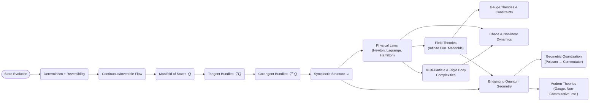

# A Radical Reinvention of Classical Mechanics: From Core Evolution to Universal Geometric Order
* * *

--- In the minimal dance of changing states lies the grand tapestry of mechanical law.

# Chapter I. The Pure Origin

**Epigraph:** “In the beginning, there was only change.”

## I.A. State Evolution as Fundamental Reality

### I.A.1 Defining “State” with Zero Assumptions

Let us start from a place of complete conceptual sparseness—imagine you know nothing about forces, equations of motion, or energy forms. You notice, however, that something in nature is always changing. The simplest premise is that there is a “something” one can label as a system’s state. A “state” is a snapshot holding everything necessary to describe that system at a given moment.

But what does “state” mean when we impose no preexisting structure like forces or potential energy? At zero assumptions, “state” is just an identifier. If you can say, “Now the system is in state $A$, and later it transitions to state $B$,” that’s sufficient as a starting point. All else—frameworks like Newtonian mechanics or Hamiltonian mechanics—must be built on top of this bare naming scheme for states.

Key insight:
- We do not yet specify how states appear or what quantities they store. We only acknowledge that a system’s configuration at any instant is fully captured by labeling it as a unique state.

### I.A.2 Requirements of Consistent Evolution: Determinism + Reversibility

**(1) Determinism**

If you only have the notion of “states,” how might they evolve over time? One requirement to make “change” workable is that any given state must evolve in a unique, predictable way. If from the same state we could end up in multiple different future states, there would be no coherent law—no possibility of a predict-and-check mechanism. This requirement is determinism:

- Determinism means the present state univocally determines the next one. At the mathematical level, it implies the existence of a function (or flow) $\Phi$  such that if the system is in state $S_0$ at time $t_0$, its state at a future time $t_0 + \Delta t$ is $\Phi_{\Delta t}(S_0)$. 

Crucially, this also leads to the notion that solutions to the “law of motion” cannot branch. If they did, we would lose a consistent handle on future predictions.

**(2) Reversibility**

Equally fundamental for classical mechanics is that the transition from one state to another be invertible. If a system evolves from state $A$ to state $B$, we want to be able to trace those steps backward to recover $A$. This concept is reversibility:

- Reversibility means no intrinsic “loss of information” about how you got from $A$ to $B$. If the system’s evolution were not invertible, you could lose details along the way and have no consistent manner to move backward in time.

This property is extremely consequential. It forbids certain “dissipative” behaviors at the fundamental law level: while friction or damping can appear in macroscopic models, the bedrock of classical mechanics is built on time-reversible flow equations. Indeed, friction is typically described as an effective phenomenon rather than a fundamental irreversibility in the deeper Hamiltonian framework.

### I.A.3 The Emergent “State Space” as a Manifold

Once determinism and reversibility are in place, we see that states form a structure more sophisticated than a mere set. If a state changes continuously with time, one might glean the following:

1. **Continuity and Paths**
   Because states connect seamlessly over time, we can imagine a continuous path $S(t)$. That continuity suggests something akin to a topological or differentiable manifold—locally we can assign coordinates to states in a smooth manner.

2. **Uniqueness and Invertible Flow**
   Determinism means that from a state $S_0$, there is a single trajectory forward in time. Reversibility implies that this forward evolution is invertible, hinting at an “automorphism” on the set of states. Such a structure—where each point has a well-defined tangent direction and invertible flows—resonates with the notion of a differentiable manifold and smooth dynamical flow.

3. **A Manifold of All Possibilities**
   We call this entire collection of states (and the continuous ways they can shift into one another) the “state space” or “configuration space.” In modern language, we interpret this as a manifold $Q$. Though we do not yet know its dimension or shape, we do know it must be smooth enough to host the system’s unbroken chain of states.

Hence, geometry sneaks in:
- States form points of a manifold.
- Time evolution implies well-defined curves (trajectories) in that manifold.
- Determinism + reversibility suggest these curves are parameterized by time in an invertible manner.

Summarizing this conceptual leap:
- We started with nothing but “things change.” 
- Insisting on deterministic and invertible change forced us to accept continuity and smoothness.
- The set of all states must then be structured like a manifold—capable of hosting forward and backward flows.

## I.B. Emergence of Geometry

**(This is the “why geometry?” moment in the document.)**

Even though we started with minimal assumptions, we end up concluding that states must inhabit some geometrically consistent place. Indeed, the geometry arises from the simplest demands:

1. **Tangent Vectors**
   Smooth evolution means we can talk about velocities—i.e., tangent vectors—at each state. If you sample the tangent vector at every point in the manifold, you obtain a vector field, describing the system’s “law of change.”

2. **Constraints from Reversibility**
   In reversible systems, each vector field flow must be invertible. This property alone narrows possible structures significantly, showing we cannot have globally dissipative “flows” at the fundamental level (like friction) unless we incorporate effective “reservoir states.” Hence, reasons for introducing an advanced structure—like a symplectic or volume form that is preserved—begin to appear.

3. **No Arbitrary Freedoms**
   The principle of “information is never lost” in purely classical settings encourages a volume-preserving flow in the state space (Liouville’s theorem will appear logically later). More specifically, to keep track of the “distinctness” of states through time, one typically (though more subtly) obtains a non-degenerate structure that eventually is recognized as the symplectic form.

In the subsequent chapters, we will see how imposing additional minimal bits—like the notion of “system energy” or the principle of “least action”—guides the transition from the manifold $Q$ to its cotangent bundle $T^*Q$, which we call phase space, plus the symplectic geometry it carries. But the essence is already visible: the geometry is not an add-on; it is demanded by the constraints of deterministic and reversible evolution itself.

## I.C. Look Ahead

- **Next Steps**: We have established that states, arranged in a manifold, evolve according to invertible flows. The next natural question: Where do concepts like momentum or constraints (like forces) come from? How do we define “energies” or “actions” in this pristine manifold viewpoint? That’s precisely where the variational methods, tangent/cotangent bundles, and symplectic forms (Chapters 2 and onward) step in.

- **Link to Modern Perspectives**: While our impetus is classical, this geometric viewpoint seamlessly generalizes. The approach we adopt—starting from minimal constraints and building up geometry—mirrors how advanced physics merges classical frameworks with quantum or relativistic theories, continuing the theme of geometry as an essential guiding structure.

## I.D. Concluding Remarks for Chapter I

In short, Chapter I has argued that once you demand evolution to be deterministic and reversible, “states” must inhabit a mathematical manifold, and dynamics must be encoded in invertible flows on that manifold. We have not invoked Newton’s laws or Lagrangians but discovered that the seeds of geometry—and soon, symplectic geometry—are unavoidable. With the foundation set, we stand poised to watch the full bloom of Classical Mechanics from this geometric vantage in the chapters to come.

# Chapter II. The Geometric Framework

**Epigraph:** “Space bends to accommodate motion.”

Having established in Chapter I that deterministic and reversible evolution forces states to inhabit a manifold, we now explore how geometry steps center stage—shaping motion, forging constraints, and ultimately defining what we call “physical laws.” In seeking a purely geometric path, we dig into the tangent and cotangent bundles that arise from continuity and invertibility, culminating in the symplectic form that encodes the full tapestry of classical mechanics.

## II.A Natural Geometric Structures

The main claim is this: once we agree states live on a manifold $Q$ and time-evolve smoothly, the manifold’s tangent spaces and dual spaces (leading to $TQ$ and $T^*Q$) inevitably appear. Reversibility, in particular, imposes the crucial condition that leads to non-degenerate 2-forms—i.e., the symplectic structure.

### II.A.1 Tangent Bundles and Velocities

1. **From Continuous Evolution to Tangent Vectors**

Classical mechanics demands that, for every point $q \in Q$, the system evolves continuously in time. Concretely, if you label the system’s configuration by $q(t)$ with $q: \mathbb{R} \to Q$, then the rate of change $\dot{q}(t)$ at each instant lives in the tangent space $T_{q(t)} Q$. Formally:
$$
\frac{d}{dt} \, q(t) \in T_{q(t)} Q.
$$

- If $Q$ is $n$-dimensional, each point $q$ in $Q$ has an associated $n$-dimensional tangent space $T_{q} Q$.
- The collection of all tangent vectors across all points is the **tangent bundle** $TQ$.

2. **Vector Fields as Dynamical Laws**

A deterministic time evolution can be encoded by a vector field $X: Q \to TQ$, assigning to each configuration $q$ a tangent vector $X(q)$. In standard notation, if we write local coordinates $(q^1, \dots, q^n)$ on $Q$, then:
$$
X(q) \;=\; \bigl( X^1(q), \dots, X^n(q) \bigr),
$$
defining how states move locally. The idea:

- A system’s “law of motion” is basically a vector field that maps each $q$ to its velocity $\dot{q}$.
- If the manifold is smooth and finite-dimensional, we can hope for well-defined integral curves $q(t)$ satisfying
$$
\dot{q}^i(t) \;=\; X^i\bigl(q(t)\bigr).
$$

Hence, requirement of continuous evolution naturally yields a tangent bundle viewpoint: the system’s motion is an integral curve of some velocity field $X$.

### II.A.2 From Reversibility to Symplectic Necessity

So far, we have a smooth manifold $Q$ with a velocity field. Yet classical physics also demands **reversibility**: we must be able to invert the flow and trace the system backward in time. Mathematically, that begs a stronger condition on these flows—something that eventually leads to a special 2-form, the **symplectic form**.

1. **Non-Degenerate Forms and Invertible Flows**

- For a flow on $Q$ to be globally invertible (in the dynamical sense), certain volume-like or area-like structures remain constant in time, preventing “collapses” of orbits onto each other. 
- A typical first step: preserving a volume form is enough for incompressibility (e.g., Liouville’s Theorem). But classical mechanics specifically works with a “phase space,” a $2n$-dimensional manifold, on which the relevant structure is a non-degenerate 2-form $\omega$. 

2. **Closed and Non-Degenerate 2-Forms: The Symplectic Form**

A **symplectic form** $\omega$ on a $2n$-dimensional manifold $M$ (which we often identify with the “phase space”) is:

- **Closed**:
  $$
    d\omega = 0,
  $$
- **Non-Degenerate**: for every non-zero vector $v$, there is some $w$ such that
  $$
    \omega(v, w) \;\neq\; 0.
  $$

In classical mechanics, this manifold $M$ is the cotangent bundle $T^*Q$. Each point in $M$ is $\bigl(q, p\bigr)$, representing configuration $q$ and momentum $p$. The condition of invertible, volume/information-preserving flow effectively translates into:
$$
\iota_X \omega \;=\; 0 \quad \Longleftrightarrow \quad X \;=\; 0 \quad \text{(non-degeneracy condition)},
$$
ensuring we do not lose directions during evolution. Moreover, the closedness $d\omega = 0$ underpins conservation laws and Hamiltonian flows.

3. **Phase Space as a Symplectic Manifold**

Hence, by reversing the logic: if we want a world where motion is both continuous and invertible, we get that the “arena” for motion cannot be just any manifold but typically a **symplectic manifold** of dimension $2n$. Physically:

- **Dimension $2n$**: We need coordinate pairs $(q^i, p_i)$.
- **Symplectic 2-form $\omega$**: This form encodes how these coordinates couple to define “area” elements in phase space.

### II.A.3 The Cotangent Bundle and Dual Variables

Now we come to a pivotal reason why we speak of $T^*Q$:

1. **Why Cotangent, Not Just Tangent?**

- In Lagrangian mechanics, velocities $\dot{q}$ live in $TQ$. Meanwhile, in Hamiltonian mechanics, momenta $p$ live in $T^*Q$. 
- The momenta are the natural “dual variables” to positions. This duality arises from the Legendre transform, connecting kinetic-energy expressions (like $\tfrac12 m \dot{q}^2$) to momentum definitions $p = \partial L / \partial \dot{q}$. 

2. **Defining **$T^*Q$** Precisely**

- For each point $q \in Q$, the cotangent space $T^*_q Q$ is the space of linear functionals on $T_q Q$. 
- Globally, $T^*Q = \bigcup_{q \in Q} T^*_q Q$. A typical element is $(q, p)$, with $p$ a 1-form at $q$.

3. **Canonical Symplectic Form**

- On $T^*Q$, there is a canonical 1-form, often denoted $\theta = \sum_i p_i \, dq^i$. Its exterior derivative yields the canonical 2-form:
$$
\omega \;=\; -\, d\theta \;=\; \sum_i dq^i \wedge dp_i.
$$

- This $\omega$ is precisely the symplectic form used in Hamiltonian mechanics. Non-degeneracy follows from standard arguments in differential geometry, ensuring you can invert relationships between velocity-like and momentum-like variables.

4. **Interpretation: Positions vs. Momenta as Conjugate Pairs**

Once we adopt $(q, p)$ in $T^*Q$, the symplectic form effectively ties each $dq^i$ with a unique $dp_i$, capturing the “paired” nature of classical degrees of freedom: each coordinate has a conjugate momentum. The geometry enforces that a small shift in $q^i$ is paired with a corresponding shift in $p_i$ to preserve volume/information.

## II.B Physical Laws from Geometry

Now that we see how manifold plus symmetry constraints leads to a symplectic manifold $(T^*Q, \omega)$, we can observe that classical “laws of motion” are not separate rules but direct outcomes:

1. **Poisson Brackets and Hamiltonian Evolution**

- The symplectic form $\omega$ lets us define Poisson brackets for any functions $f, g$ on $T^*Q$:
$$
\{f, g\} \;\equiv\; \sum_{i=1}^n \Bigl(\frac{\partial f}{\partial q^i} \,\frac{\partial g}{\partial p_i} \;-\; \frac{\partial f}{\partial p_i} \,\frac{\partial g}{\partial q^i}\Bigr).
$$

- A Hamiltonian $H(q,p)$ then generates the flow vector field $X_H$ by:
$$
\iota_{X_H}\omega \;=\; dH,
$$
  yielding Hamilton’s equations:
$$
\dot{q}^i \;=\; \frac{\partial H}{\partial p_i}, 
\quad
\dot{p}_i \;=\; -\, \frac{\partial H}{\partial q^i}.
$$

2. **Conservation of Phase-Space Volume: Liouville’s Theorem**

- Because $\omega$ is closed and **non-degenerate**, the Hamiltonian flow preserves the volume form $\omega^n$. This is precisely Liouville’s theorem: no net compression or expansion of states in phase space.

3. **Forces as Geometry, Constraints as Submanifolds**

- Instead of “force” as an external concept, the geometry plus the chosen Hamiltonian clarifies how “generalized forces” appear. 
- Constraints become submanifolds or embeddings in $Q$ or $T^*Q$. They are naturally handled by restricting the geometry to those submanifolds or adding constraints via Lagrange multipliers, consistent with the manifold viewpoint.

Hence, the entire notion of classical motion—Newton’s laws, Lagrange’s equations, Hamilton’s equations, Noether’s theorem—can be read off from this geometric scenario. We see that the real “heart” of classical physics is indeed the symplectic manifold and the concept of an evolving 1-form $\theta$, rather than any single, force-based approach.

## II.C Interconnections and Forward Glance

- **Ties to Chapter III**: Next, we incorporate the **action principle**, which formalizes how the integrals of the Lagrangian or equivalently the canonical 1-form lead to equations of motion. This step cements the “why” behind Hamilton’s principle of stationary action.
- **Ties to Chapter IV**: Once we have a handle on $(q, p)$ and $\omega$, we can look at the full Hamiltonian perspective, canonical transformations, and Poisson structures neatly in place.

## II.D Concluding Remarks for Chapter II

Chapter II reveals how the raw demands of invertible, continuous evolution conjure a tangent/cotangent manifold framework. Symplectic geometry emerges as a necessity, not a convenience, placing momenta as dual to positions. With that bedrock established, we can unify all major classical formulations under a single geometric canopy.

# Chapter III. Physical Systems as Geometric Necessities

**Epigraph:** “From abstract necessity springs concrete existence.”

With geometry established as the bedrock of mechanics, we can now see how entire classes of physical laws — often introduced as separate “Newtonian force laws” or “Lagrangian/Hamiltonian equations” — emerge as natural corollaries of the symplectic manifold framework. In this chapter, we unify the concepts by illustrating how specific mechanical systems arise almost inevitably from the geometry. Far from being a set of separate, historically discovered laws, the standard approaches (Newton, Lagrange, Hamilton) become different manifestations of the same underlying geometric principle.

## III.A Elementary Systems

Here, “elementary” refers to those benchmark models (free particle, harmonic oscillator, central force problem) that epitomize the essential forms of motion. We demonstrate how each is simply a restriction of the symplectic manifold idea, in some low dimension or with a particular choice of Hamiltonian.

### III.A.1 Free Particle

1. **Geometric Setting**

A free particle’s configuration space is a Euclidean manifold, say $\mathbb{R}^n$. Its phase space is $T^*\mathbb{R}^n$, with canonical coordinates $(q^i, p_i)$. The symplectic form is
$$
\omega \;=\; \sum_{i=1}^n \mathrm{d}q^i \wedge \mathrm{d}p_i.
$$

2. **Hamiltonian and Equations of Motion**

The simplest (and historically first) Hamiltonian is purely kinetic:
$$
H(q, p) \;=\; \frac{1}{2m}\, \sum_{i=1}^n (p_i)^2.
$$
Hamilton’s equations,
$$
\dot{q}^i \;=\; \frac{\partial H}{\partial p_i} \;=\; \frac{p_i}{m}, 
\quad
\dot{p}_i \;=\;-\, \frac{\partial H}{\partial q^i} \;=\; 0,
$$
show that $p_i$ are constants and $q^i$ evolve linearly in time. This is the standard uniform motion in an $n$-dimensional Euclidean space. We see that “no force” literally means “no dependence on $q^i$,” an immediate sign there is nothing in the geometry twisting or curving the phase space flow.

3. **Interpretation**
- Information Preserved: The volume in phase space is trivially preserved (Liouville’s theorem).
- Newton’s First Law: Typically introduced as “an object in uniform motion remains so unless acted upon by a force,” now reads directly from the Hamiltonian structure being $q$-independent.

### III.A.2 Harmonic Oscillator

1. **Configuration Space and Hamiltonian**

Next, we add a quadratic potential:
$$
H(q, p) \;=\; \frac{1}{2m}\,(p^2) \;+\; \tfrac12\,k\,q^2,
$$
with configuration space still $\mathbb{R}$ (or $\mathbb{R}^n$ for $n$ uncoupled oscillators). The symplectic form remains
$$
\omega \;=\; \mathrm{d}q \wedge \mathrm{d}p.
$$

2. **Equations of Motion**

Hamilton’s equations yield
$$
\dot{q} \;=\; \frac{p}{m}, 
\quad
\dot{p} \;=\;-\,k\,q.
$$
Combining them, $\ddot{q} = -(k/m)\,q$, the hallmark oscillator equation. In phase space, trajectories form closed ellipses of constant energy:
$$
E = \tfrac1{2m}\,p^2 + \tfrac12\,k\,q^2.
$$

3. **Interpretation**
- Periodic Geodesics in Phase Space: The oscillator’s elliptical orbits reflect a “twisting” in $\omega$ that couples $q$ and $p$.
- Lagrangian or Newton? In Lagrangian form, we see $L = \tfrac12\,m\,\dot{q}^2 - \tfrac12\,k\,q^2$. In Newton’s original language, the “force” $F = -\,k\,q$ emerges naturally as $-\partial V/\partial q$. This again is a geometry-driven phenomenon: the Hamiltonian depends quadratically on $q$.

### III.A.3 Central Force Problems

1. **Spherical Symmetry**

In $\mathbb{R}^3$ with spherical symmetry, the Hamiltonian might be
$$
H \;=\; \frac{\|p\|^2}{2m} \;+\; V\bigl(r\bigr),
\quad
r = \|q\|.
$$

2. **Angular Momentum and Submanifolds**

Rotational invariance translates to a conserved angular momentum vector $\mathbf{L}$. Phase space flow restricted to those level sets of $H$ and $\|\mathbf{L}\|$ yields orbits reminiscent of planetary motion or scattering orbits. Newton’s inverse-square law (for gravity) is just one choice of $V(r)$ in the universal geometric setting.

3. **Interpretation**
- The conservation of angular momentum arises from a continuous rotational symmetry. This is precisely the statement of Noether’s theorem within symplectic geometry.
- The orbits (e.g., ellipses for Kepler) are geodesics on the appropriate effective potential surface in phase space.

## III.B Complex Systems

Having illustrated the “simple” building blocks, we see how layering or coupling these systems remains within the same geometric language: multi-dimensional manifolds or infinite-dimensional for field configurations, still governed by the same symplectic or variational logic.

### III.B.1 Many-Body Mechanics

1. **High-Dimensional Phase Space**

For $N$ particles in $\mathbb{R}^3$, the configuration manifold is $Q \cong \bigl(\mathbb{R}^3\bigr)^N$. The phase space is of dimension $6N$. The symplectic form is a direct sum:
$$
\omega \;=\; \sum_{j=1}^N \sum_{i=1}^3 \mathrm{d}q^i_j \wedge \mathrm{d}p_{i,j}.
$$

2. **Interaction Potentials**

A general Hamiltonian might read:
$$
H \;=\; \sum_{j=1}^N \frac{\|p_j\|^2}{2\,m_j} \;+\; \sum_{j < k} V\bigl(\|q_j - q_k\|\bigr).
$$

3. **Interpretation**
- The geometry does not change: it is still a big symplectic manifold. Forces are partial derivatives of the potential with respect to coordinates.
- Collective phenomena (center-of-mass motion, relative coordinates, normal modes) are naturally embedded in this high-dimensional structure.

### III.B.2 Field Theories (An Infinite-Dimensional Manifold)

When the “number of degrees of freedom” goes to infinity, we get fields $\phi(\mathbf{x})$. The configuration space is effectively a space of functions. Although we lose finite-dimensional tractability, the same logic continues:

- The **functional** derivative plays the role of momentum.
- A symplectic (or multisymplectic) form emerges in function space.
- Hamilton’s principle generalizes to field actions:
$$
S[\phi] = \int \bigl(\text{Lagrangian density}\bigr)\,\mathrm{d}t\,\mathrm{d}\mathbf{x}.
$$

The path/variational viewpoint is unchanged. This underscores the universality of our geometric viewpoint — from a single free particle to classical fields, all revolve around manifoldness, symplectic structure, and variational logic.

### III.B.3 Continuous Media

Fluid flow or elastic deformations similarly inhabit infinite-dimensional configurations. They rely on specifying how the manifold (the “shape” of the fluid domain or deformation map) changes in time:

1. **Example: Ideal Incompressible Fluid**

- The group of volume-preserving diffeomorphisms on a domain can form the manifold $Q$.
- Hamilton’s principle leads to Euler’s equations; the momentum mapping yields vorticity conservation from Noether arguments.

2. **Geometric Unification**

Everything from rigid bodies to continuum mechanics folds back into the geometry of transformations and symplectic structure, reaffirming that “mechanical laws” are broad manifestations of the same foundation.

## III.C The Laws as an Outgrowth of Geometry

Let us finally connect these systems back to the standard formulations:

1. **Variational Principles**
   The principle of least action $\delta S = 0$ applies to each example: the minimal geodesic in free space, the closed elliptical orbits in oscillator potentials, the two-body gravitational problem, etc. The geometrical statement is that the actual path in configuration space (or phase space) is “extremal” under changes consistent with boundary conditions.

2. **Lagrangian Mechanics**
   In Lagrange’s approach $L = T - V$, the Euler–Lagrange equations for $q^i(t)$ come directly from:
$$
\frac{\mathrm{d}}{\mathrm{d}t}\Bigl(\frac{\partial L}{\partial \dot{q}^i}\Bigr) \;-\; \frac{\partial L}{\partial q^i} \;=\; 0.
$$
But geometrically, this is just the condition that the trajectory in $Q$ obeys the stationary-action principle. The “forces” $Q^i$ see are ephemeral proxies for partial derivatives of a potential or constraints. The deeper impetus is the geometry of the variational path.

3. **Hamiltonian Mechanics**
   Passing from velocities to momenta yields the Hamiltonian $H(q,p)$. The flow is:
$$
\dot{q}^i \;=\;\frac{\partial H}{\partial p_i}, 
\quad
\dot{p}_i \;=\;-\,\frac{\partial H}{\partial q^i},
$$
which is nothing more than specifying a symplectic vector field that preserves the 2-form $\omega$. Liouville’s theorem then states the volume form is invariant under Hamiltonian flows, ensuring a consistent, invertible evolution.

4. **Newton’s Laws as a Subset**

   Historically, mechanics began with Newton’s three laws. But from our vantage:

- **Newton’s First Law** (inertia): A free Hamiltonian with no $q$-dependence → uniform motion.
- **Newton’s Second Law** $\mathbf{F} = m\,\mathbf{a}$: If $V(q)$ is a potential, then
$$
m\,\ddot{q}^i = -\,\frac{\partial V}{\partial q^i},
$$
  which is exactly the Hamiltonian or Lagrangian condition in coordinate-based form.
- **Newton’s Third Law** (action-reaction) arises from internal symmetry, especially when summing interactions in multi-particle systems, reflecting momentum or angular momentum conservation from Noether’s theorem.

  Hence, Newton’s machinery is no more or less than a coordinate-level expression of the deeper geometric premises. What used to be “force” is now the differential of a potential or the partial derivative of a Hamiltonian. The illusions of “push/pull” are replaced by the more fundamental statement that phase space flows follow symplectic lines of force.

## III.D Interconnections

- **Bridging to Next Chapters**: We have displayed how fundamental mechanical laws germinate from the geometry, and how simple or complex systems do not disrupt the underlying logic. The next chapters further explore how symplectic geometry spawns canonical transformations, handles constraints, and eventually paves the route to advanced topics like chaos and field theories.
- **Unified Perspective**: The key theme is that all classical dynamics are geometric byproducts—Newton, Lagrange, and Hamilton are but various “screens” displaying the same geometric show behind the scenes.

## III.E Concluding Remarks for Chapter III

In sum, classical motion, free or forced, can be read off from the manifold-cum-symplectic structure plus a chosen Hamiltonian function. The “elementary” systems show how easily familiar laws arise, while more “complex” domains uphold the same patterns, only extended in dimension or scope. What might appear as separate laws in an elementary textbook are, under this new vantage, natural consequences of geometry guiding evolution—a testament to why geometry truly stands at the heart of classical mechanics.

# Chapter IV. Expansions: Constraints, Multi-body, and Field Realms

**Epigraph:** “In the swirl of many bodies, geometry still reigns.”

In the previous chapters, we saw how classical mechanics—traditionally approached through forces or energies—arises from deeper geometric roots. The same ideas of manifolds, symplectic forms, and variational principles scale up impressively to account for complicated interactions, larger numbers of particles, and even fields described by infinitely many degrees of freedom. Below, we show how the unifying geometric formalism persists and guides us through constraints, multi-body systems, and field-theoretic formulations.

## IV.A Constraints, Holonomy, and Non-Holonomic Systems

So far, we have mainly considered unconstrained motion on a configuration manifold $Q$. In reality, many mechanical systems are restricted by constraints (e.g., rolling without slipping, linkages in a robotic arm, or rods in a rigid body). These constraints can be holonomic or non-holonomic, and each type is naturally addressed in the geometric framework.

### IV.A.1 Holonomic Constraints and Submanifolds

1. **Defining Holonomic Constraints**

A constraint is **holonomic** if it can be expressed as an equation $f(q) = 0$ (or multiple such equations) that reduces the effective dimension of $Q$. In that case, the motion is restricted to a submanifold $M \subset Q$ defined by $f(q) = 0$. Within the Lagrangian or Hamiltonian formulations, one can incorporate such constraints using Lagrange multipliers or by describing motion directly on the reduced manifold.

2. **Geometric Interpretation**

Because holonomic constraints define submanifolds, the usual symplectic form and variational principles just get restricted to these “constraint surfaces.” Symmetries remain intact if the constraints themselves are invariant. The flow on each submanifold preserves the induced geometry.

3. **Example: Pendulum on a Rigid Rod**

A pendulum’s configuration space for a mass on a rod (no stretch allowed) is the circle $S^1$. This is a one-dimensional submanifold of $\mathbb{R}^2$, the unconstrained space of planar motion. All the usual geometry-based arguments (least action, symplectic structure in phase space) hold, just restricted to the circle (and to its cotangent bundle in the Hamiltonian form).

### IV.A.2 Non-Holonomic Constraints and Hidden Geometry

1. **Definition and Common Examples**

**Non-holonomic** constraints typically look like $a_i(q)\,\dot{q}^i + \dots = 0$ and **cannot** be integrated into a purely coordinate-based condition $f(q) = \mathrm{const}$. Examples include rolling constraints (a wheel or sphere rolling on a plane), or certain robotic joints. They lead to velocity-based restrictions that do not reduce the configuration space dimension in a straightforward manner.

2. **Lagrange Multipliers and Dirac Brackets**

- **Lagrange Multipliers**: One can still incorporate such constraints in a Lagrangian formalism, but each velocity-level restriction introduces additional terms. For Hamiltonian mechanics, **Dirac brackets** generalize Poisson brackets to handle constraints consistently, ensuring the system evolves on a submanifold in phase space without losing invertibility.

3. **Geometric Outlook: Distribution and Holonomy**

Non-holonomic constraints define distributions in the tangent bundle (i.e., directions the system can actually move). The geometry can become more intricate: the constraint distribution may be non-integrable, leading to phenomena like “holonomy loops,” where traversing loops in the configuration leads to net motion, akin to the well-known rolling-sphere paradox.

4. **Illustration: Rolling Wheel**

A wheel rolling without slipping on a plane has constraint:
$$
\dot{x}\,\cos\theta + \dot{y}\,\sin\theta \;=\; R\,\dot{\theta},
$$
which is not integrable to a pure position-level equation. Instead, its manifold is 3D ($x, y, \theta$) but velocity-level constraints exist. The geometry of the distribution can yield surprising “Steering” or “break of integrability,” forming the basis of robotics motion planning (under differential constraints).

## IV.B Rigid Body and Multi-Particle Mechanics

### IV.B.1 Rigid-Body Configurations

The configuration of a rigid body in 3D space can be described by the manifold $\mathrm{SE}(3)$ (the special Euclidean group combining rotations $\mathrm{SO}(3)$ and translations). If we only consider rotations about a fixed point, we restrict to $\mathrm{SO}(3)$:

1. **Configuration Manifold** $Q \cong \mathrm{SO}(3)$
   - Each point $R \in \mathrm{SO}(3)$ is an orientation in 3D.
   - Tangent vectors at $R$ represent angular velocities; the system is thus a principal fiber bundle over $\mathrm{SO}(3)$ with group $\mathrm{SO}(3)$ itself.

2. **Inertia Tensor and Hamiltonian**

A rotating body has a kinetic energy involving the inertia tensor $I$. In local coordinates, the Lagrangian might look like:
$$
L \;=\; \tfrac12\, \boldsymbol{\omega}^{T}\,I\,\boldsymbol{\omega},
$$
where $\boldsymbol{\omega}$ is angular velocity in body-fixed frames. Passing to momenta leads to a Hamiltonian; the geometry is anchored by a nontrivial but well-understood symplectic structure on $T^*\mathrm{SO}(3)$.

3. **Poisson Spheres and Euler’s Equations**

The classical Euler top and rigid-body equations in 3D emerge from the same manifold approach, with phase space dimension $6$ (three angles, three momenta). The rotations are captured by left-invariant or right-invariant vector fields on $\mathrm{SO}(3)$, generating the familiar Euler’s equations for angular momentum. Angular momentum is a momentum map associated with the $\mathrm{SO}(3)$ symmetry.

### IV.B.2 Multi-Particle Systems

The geometry becomes more expansive when we consider $N$ particles. The configuration manifold is $Q \cong \mathbb{R}^{3N}$ (or a suitable submanifold if constraints exist). Each particle has position $\mathbf{q}_i$ and momentum $\mathbf{p}_i$. Then:

- **Phase Space** is $6N$ dimensional.
- **Symplectic Form** is the sum:
$$
\omega \;=\; \sum_{i=1}^N \sum_{j=1}^3 \mathrm{d}q_{i}^j \,\wedge\, \mathrm{d}p_{j,i}.
$$

- **Interaction Potential** $V(\| \mathbf{q}_i - \mathbf{q}_j \|)$ or more complicated forms define internal forces.
- **Collective Phenomena**: Normal modes, integrable many-body systems, chaos, or cluster formations all fit into the same Hamiltonian geometry context.

### IV.B.3 Integrable vs. Chaotic

With many degrees of freedom, systems can range from integrable (having enough conserved quantities) to chaotic (sensitive to initial conditions). The geometric principles remain: flows are symplectic, Liouville’s theorem holds, and Poisson structures unify advanced techniques like action-angle variables (for integrable cases) or KAM theory (for near-integrable chaos).

## IV.C Field Theories: Infinite Dimensional Geometry

Complex real-world systems often involve fields $\phi(\mathbf{x}, t)$ that have infinitely many degrees of freedom. The classical examples (electromagnetism, elastic waves, fluids) can still be recast in a Lagrangian or Hamiltonian framework, albeit on infinite-dimensional manifolds of field configurations.

1. **Configuration as Maps**

We consider $Q$ as the space of field configurations, e.g. $\phi: \Omega \to \mathbb{R}$, where $\Omega$ is a spatial domain. The tangent space $TQ$ then consists of small variations $\delta \phi(\mathbf{x})$. A Legendre transform now yields “conjugate momenta” $\pi(\mathbf{x})$. The symplectic form becomes an integral:
$$
\omega \;=\; \int_\Omega \mathrm{d}\pi(\mathbf{x}) \,\wedge\, \mathrm{d}\phi(\mathbf{x})\, \mathrm{d}\mathbf{x}.
$$

2. **Hamiltonian PDEs**

The Hamiltonian might be
$$
H[\phi, \pi] \;=\; \int_\Omega \mathcal{H}\bigl(\phi(\mathbf{x}), \pi(\mathbf{x}), \nabla \phi(\mathbf{x})\bigr)\, \mathrm{d}\mathbf{x},
$$
and the resulting Hamilton’s equations become partial differential equations (PDEs). Despite the functional complexity, it is still a symplectic geometry story, now living in function spaces. The same geometry-based logic defines conserved energies, momenta, etc.

3. **Gauge Freedoms**

Some fields (e.g. electromagnetism, Yang–Mills) have local symmetries, meaning constraints in the infinite-dimensional sense. The geometry is that of principal bundles or fiber bundles, where gauge transformations preserve curvature-like objects. In Hamiltonian language, these yield first-class constraints and lead to Dirac bracket structures again.

## IV.D Interconnections and Forward Glance

1. **Chaotic Realms**: Chapter VII will detail how even “simple” Hamiltonians with small perturbations can yield chaotic motion. The expanded viewpoint of multi-body or continuum fields does not lose the fundamentals: it accumulates them, sometimes revealing new emergent phenomena.

2. **Geometric Consistency**: Regardless of whether we treat rolling constraints, spinning rigid bodies, or wave equations in a continuum, the invariants and the flows remain symplectically guided. The entire advanced edifice rests on the same bedrock from earlier chapters.

## IV.E Concluding Remarks for Chapter IV

As we expand from single-particle setups to multi-dimensional constraints, non-holonomic conditions, and even infinite-dimensional fields, the unifying principle persists: a manifold of states, endowed with a symplectic (or similarly consistent geometric) form, plus a Hamiltonian to orchestrate evolution. Whether describing a rolling sphere, a rigid rotor, or an entire fluid flow, the geometry “still reigns.” It demands that every system can be approached through the lens of variational statements, symplectic forms, and invertible flows, thereby tying small local constraints to sweeping universal laws.

In the subsequent chapters, we will see that these expansions into large-dimensional systems, or subtle constraints, open broad frontiers such as chaos, integrable hierarchies, and eventually the bridging into quantum or relativistic frameworks. But the message remains: no matter how complex or broad the domain, geometry stands as the underlying conductor, shaping every mechanical harmony.

# Chapter V. Deep Unification: Quantum and Beyond

**Epigraph:** “The symplectic whisper grows into quantum echoes.”

The geometric view of classical mechanics—manifolds, symplectic forms, variational principles—presents far more than a neat re-derivation of Newtonian or Lagrangian laws. It lays a conceptual roadway into quantum theory, gauge fields, and other modern frontiers. In this chapter, we reveal how the same symplectic formalism, once paired with additional structures, naturally extends to quantum mechanics, advanced gauge symmetries, and emerging realms like non-commutative geometry. Rather than tacking on quantum principles artificially, we see them as the next logical step in our geometric narrative, where Poisson brackets transition into commutators and local forces morph into fiber-bundle connections.

## V.A Geometric Quantization

At the heart of classical mechanics lies a symplectic manifold $(M,\omega)$. Quantum mechanics, viewed from a geometric vantage, can be seen as “quantizing” this manifold: encoding wavefunctions such that classical observables correspond to operators. The crux is translating Poisson brackets to commutators in a manner consistent with the manifold’s topological constraints.

### V.A.1 From Poisson to Commutator: The Core Idea

1. **Classical Observables**
   As we established, classical observables are real-valued functions $f$ on phase space $M$. The Poisson bracket is given by
   $$
   \{f, g\} \;=\; \sum_{i=1}^n 
   \Bigl(\frac{\partial f}{\partial q^i}\,\frac{\partial g}{\partial p_i} 
   - \frac{\partial f}{\partial p_i}\,\frac{\partial g}{\partial q^i}\Bigr).
   $$
   In the more abstract geometric language, $\omega$ yields a Poisson structure. 

2. **Quantum Operators**
   Geometric quantization demands that each classical function $f$ map to a quantum operator $\hat{f}$. Poisson brackets must correspond (up to a factor of $i\hbar$) to commutators:
   $$
   \bigl[\hat{f},\,\hat{g}\bigr] \;=\; i\,\hbar\,\widehat{\{f,\,g\}}.
   $$

3. **Implications**
   This ensures that the classical limit $\hbar \to 0$ recovers Poisson brackets from commutators, matching our classical structures. The geometry behind $(M,\omega)$ is disguised in wavefunction spaces and operator algebra in quantum mechanics.

### V.A.2 Integrality Condition and Prequantum Line Bundles

1. **Integrality and $\hbar$**
   For a symplectic manifold $(M, \omega)$ to admit a full “geometric quantization,” $\omega$ typically must satisfy an integrality condition:
   $$
   \bigl[\tfrac{\omega}{2\pi\hbar}\bigr] \; \in\; H^2(M, \mathbb{Z}),
   $$
   meaning $\omega/2\pi\hbar$ is an integral cohomology class. This topological constraint ensures that phase space volume is quantized in Planck-sized “cells.”

2. **Prequantum Line Bundles**
   With integrality, one builds a complex line bundle $L$ over $M$, whose curvature equals $-\,i\,\omega$. Sections of $L$ supply “prequantum wavefunctions.”
   - Locally, $L$ is trivial, but globally it can twist in ways capturing the manifold’s nontrivial topology.
   - A connection on $L$ reflects $\omega$; this is the foundation of “prequantization.”

3. **From Prequantum to Full Quantum**
   Simply taking all sections of $L$ is too large. We require a polarization (splitting of coordinates into “positions” and “momenta”) to define physically relevant wavefunctions. Once chosen, one obtains a Hilbert space of polarized sections, the quantum states. Observables become certain differential operators derived from $\hat{f}_{\mathrm{pre}} = -\,i\,\hbar\,\nabla_{X_f} + f$.

### V.A.3 Summation: Poisson–Commutator Bridge

Hence geometric quantization cements:

- Phase space $(M, \omega)$ $\to$ Hilbert space.
- Functions $f$ with Poisson bracket $\to$ Operators $\hat{f}$ with commutator.
- Liouville’s theorem $\to$ unitarity of time evolution.

In short, if classical mechanics is geometry, then quantum mechanics is geometry plus “quantum line bundles,” bridging Poisson brackets to operator algebras.

## V.B Modern Extensions: Gauge Fields, Non-Commutative Geometry, and Beyond

The same geometric viewpoint illuminates how local symmetries (gauge transformations), advanced operator algebras, or even integrable hierarchies fit into a single picture.

### V.B.1 Gauge Theories and Fiber Bundles

1. **Gauge Potentials as Connections**

In electromagnetism or non-abelian gauge theories (like Yang–Mills), we interpret gauge fields $A$ as connections on principal bundles. The curvature of $A$ is the field strength $F$. These are natural generalizations of the symplectic connection idea: we preserve local gauge invariance, ensuring physical states differ only by transformations that do not change the underlying geometry.

2. **Phase Space and Constraints**

In Hamiltonian form, gauge constraints appear as first-class constraints (following Dirac’s classification), requiring a reduction in phase space or introducing a structured Poisson bracket (the Dirac bracket). This is a direct analog of how holonomic constraints shape finite-dimensional systems, extended to local symmetries on infinite-dimensional spaces.

3. **Momentum Maps**

Noether’s theorem extends neatly: each gauge symmetry yields a conserved charge (the momentum map). In electromagnetism, this might be total electric charge; in non-abelian gauge fields, color charges. The entire geometry is essentially the same Hamiltonian blueprint, scaled to group actions on infinite-dimensional manifolds.

### V.B.2 Non-Commutative Geometry and Quantum Field Theories

1. **Non-Commutative Coordinates**

At very high energies or small scales, one hypothesizes that spacetime coordinates $x^\mu$ themselves do not commute:
$$
\bigl[x^\mu,\; x^\nu\bigr] \;=\; i\,\thetaup^{\mu\nu}.
$$
This universal notion of “symplecticization” or “Poisson structure in spacetime” extends geometry into a realm where local commutative features vanish. The algebra of functions is replaced by operator algebras. The impetus: the same geometric logic—Poisson bracket $\to$ commutator—applied at the level of spacetime coordinates.

2. **Implications for QFT**

Quantum field theories (QFTs) that incorporate non-commutative geometry see modifications of Feynman rules, renormalization behaviors, and gauge structures. However, the conceptual foundation stays consistent with the classical $\to$ quantum bridging. One might say non-commutative geometry is a “global” or “spacetime-level” version of the local quantum approach from Chapter III.

3. **Integrable Hierarchies**

Another advanced domain is integrable PDEs (Korteweg–de Vries, Toda lattice, etc.), often admitting a Hamiltonian description with infinite sets of commuting charges. The geometric viewpoint unifies them: 
- Phase space is the space of fields,
- A symplectic form yields a Poisson bracket 
- Hierarchies of conserved integrals reflect a deep commutative subalgebra in Poisson brackets
- Quantizing these systems leads to advanced “quantum integrable models.”

## V.C Potential for Emerging Realms

The story does not end with gauge fields or straightforward quantum mechanics:

1. **Quantum Gravity**: If quantum mechanics arises from geometric quantization of finite or infinite-dimensional manifolds, one might suspect that gravitational fields, themselves geometric, should also be quantized. The approach fosters $\mathrm{Loop}$ quantum gravity, string theory geometry, or spin networks, each reliant on advanced symplectic and variational logic.

2. **Topological Mechanics and Higher Categories**: Modern emphases on topological states of matter or higher category symmetries are expansions of the same geometric formalism, sometimes relaxing local metric data for purely topological constraints on gauge fields.

3. **Information Theory**: The boundary between geometry, quantum states, and entanglement has become a hot topic, tying classical geometry to quantum-circuit analogies or AdS/CFT “spacetime from quantum entanglement” viewpoints. All continue the theme: geometry is fundamental, and the symplectic seed thrives at every scale.

## V.D Interconnections

We see how the classical symplectic skeleton seamlessly scaffolds quantum frameworks: no stitchwork needed. The same manifold perspective that yields Hamilton’s equations in classical realms transforms into line bundles, operators, and gauge couplings in quantum or field contexts. This strong unity emerges because at every step—be it a “force” in classical physics or a “gauge connection” in advanced field theoretic contexts—there is geometry behind the scenes.

## V.E Concluding Remarks for Chapter V

Classical mechanics, rebuilt from geometry, forms the perfect springboard into quantum mechanics, gauge fields, and possibly quantum gravity. Poisson brackets morph into commutators, symplectic flows become unitary evolutions, and local gauge transformations become higher-level constraints. What started as a purely classical enterprise ends up as a blueprint for the grand edifice of theoretical physics. Indeed, the “symplectic whisper” that shaped Newton, Lagrange, and Hamilton quietly orchestrates a symphony in quantum realms, proving that the geometry-based vantage offers clarity and conceptual unity across seemingly disparate frontiers.

# Appendix A : Conceptual Relationship Map

Below is a concise schematic illustrating key ideas and how they interconnect, reflecting the geometric path from simple “states in evolution” to advanced topics like field theories and quantum extensions. It helps advanced readers see at a glance how the entire text’s logic unifies around the same geometric seeds (determinism, reversibility, symplectic form, etc.).

## A.1 Explanatory Notes

1. **State Evolution**
   We begin with the foundational recognition that physical reality is “always changing.” By requiring that such change be both deterministic (unique future evolution from each state) and reversible (no intrinsic information loss), we are logically led to…

2. **Manifold of States ($Q$)**
   The set of all states must be equipped with a manifold structure. This ensures smooth trajectories in state space and invertible flows.

3. **Tangent and Cotangent Bundles**
   Once we place these states on a manifold $Q$, continuous evolution implies the notion of tangent vectors (velocities), while momentum naturally emerges as the dual variable (cotangent bundle $T^*Q$).

4. **Symplectic Structure**
   When we include the requirement of preserving information in time, we obtain a non-degenerate 2-form $\omega$. This is the linchpin for modern formulations of classical mechanics: Hamiltonian, Lagrangian, and Newtonian laws all appear as specialized coordinate projections of the deeper symplectic geometry.

5. **Physical Laws**
   With $\omega$ and a suitable Hamiltonian on $T^*Q$, standard equations of motion (Newton, Lagrange, Hamilton) are derived. Notably, constraints (holonomic or non-holonomic), multi-body expansions, and more complicated phenomena (chaos, gauge fields) do not require layering on extra assumptions; they emerge from restricting or extending this same geometry.

6. **Quantum and Beyond**
   At the apex of the diagram, the same reasoning underlies geometric quantization. The step from Poisson brackets to commutators is a geometric bridging, opening doors to quantum field theories, advanced gauge symmetries, integrable hierarchies, and possibly quantum gravity or non-commutative geometries.

## A.2 Why This Map Matters

This map encapsulates the spirit of our “re-architecture” of Classical Mechanics: from minimal premises (state evolution + determinism + reversibility) to the heights of contemporary physics, all guided by the inevitability of geometric structure. By examining each node in the diagram, one sees that standard mechanical “laws” and even quantum generalizations are — in essence — consequences of symplectic flows through well-defined manifolds.

Such a unifying viewpoint, we hope, stimulates deeper insights and fosters novel applications, echoing the main text’s overarching message: geometry serves as the fundamental, generative principle of classical (and beyond-classical) physics.

