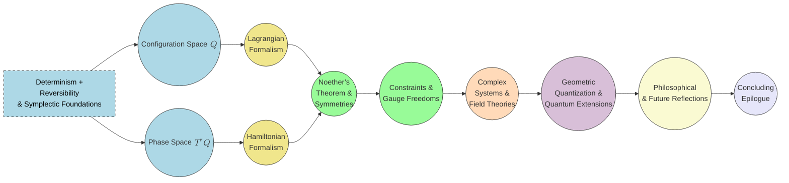

# Classical Mechanics Revisited: A Comprehensive Geometric and Variational Approach
* * *

--- All motion is geometry in time—let the action principle reveal the symphony.

# Chapter 1. Re-Envisioning Classical Mechanics

**Epigraph:** “To begin anew, we must see the old with fresh eyes.”

Classical Mechanics, as it is usually taught and learned, has long stood on the bedrock of Newton’s laws. Despite its success, modern mathematics and physics provide an opportunity to revisit these foundations from a deeper perspective—one that highlights geometry and the evolution of states as the true heart of the discipline. This chapter establishes the motivation for such a “radical” reboot, then lays out the simple yet powerful assumptions that become our guiding light: the existence of change, its determinism, and its reversibility.

## 1.1 Motivation and Purpose

**Goal**: Argue why a “radical” or “first-principles” reboot of Classical Mechanics is worthwhile, including historical perspective on how geometry gradually took center stage (Lagrange, Hamilton, Cartan).

**Content Summary**: Emphasize the tension between “force-based” vs. “geometry-based” approaches, the advent of modern mathematics (differential geometry, group theory), and how they unify classical phenomena.

### 1.1.1 From Newtonian Forces to Geometric Manifolds

The historical evolution of Classical Mechanics illuminates an undercurrent that has slowly but persistently shifted the emphasis away from a purely “force-based” view. Isaac Newton’s monumental work outlined the laws of motion and universal gravitation in terms of forces:
$$
\mathbf{F} \;=\; m\, \mathbf{a}.
$$
Yet, over the next two centuries, radical reformulations by Lagrange and Hamilton revealed a different conceptual nucleus. Rather than focusing on instantaneous pushes and pulls, these later viewpoints placed the **configuration space** of a system front and center. Lagrange’s approach introduced the **Lagrangian** $L = T - V$ and the principle of stationary action:
$$
\delta \!\int L\, dt \;=\; 0,
$$
leading to Euler–Lagrange equations that are independent of coordinate choices. Hamilton’s subsequent formulation placed positions $(q^i)$ and momenta $(p_i)$ on more equal footing, crystallizing the notion of **phase space** and revealing hidden geometric structures.

As differential geometry matured in the 19th and early 20th century (notably with the work of Cartan, Poincaré, Darboux, and others), the deeper symplectic nature of Hamiltonian mechanics was recognized. Phase space could be understood as a **symplectic manifold**, with its 2-form $\omega$ shaping every lawful trajectory. Approaching mechanics from this geometric vantage offered—quite literally—an additional dimension of clarity: positions and momenta became conjugate coordinates bound by global constraints such as
$$
\omega \;=\; \sum_{i=1}^n dq^i \,\wedge\, dp_i,
$$
and Liouville’s theorem on volume preservation emerged as a natural corollary of the manifold structure.

### 1.1.2 Why a Modern Reboot?

Modern physics has extended classical concepts into diverse and extreme realms: quantum systems, relativistic spacetimes, gauge theories, and beyond. In each extension, we see the **geometric** perspective flourish. That same perspective can be harnessed to re-architect Classical Mechanics itself—not just as a relic of Newton’s Principia, but as an active, living theory whose core is **geometry and evolution**.

1. It **Corrects Misconceptions**: A geometry-first standpoint demotes “force” to an emergent notion, derived from deeper variational or symplectic structures. This clarifies conceptual confusions about conservative vs. non-conservative forces, generalized coordinates, and potential functions.
2. It **Unifies Theories**: From rigid-body dynamics to field theories, seeing the manifold/variational/spacetime viewpoint unifies apparently disparate topics under one fundamental principle: invertible and deterministic changes shape a symplectic manifold.
3. It **Catalyzes Future Insights**: Just as Lagrangian and Hamiltonian methods opened new vistas (e.g., chaos theory, integrable systems, geometric control), this deeper reconstruction can spur cross-pollination with modern mathematics, such as category theory, topology, or non-commutative geometry.

Hence, we argue that a radical re-introduction to Classical Mechanics—starting from the bare notion of state evolution, and building up the geometry with minimal assumptions—can lead to a cleaner, more profound understanding that resonates with 21st-century mathematical physics.

## 1.2 Core Intuition: Change, Determinism, Reversibility

**Goal**: Cement the fundamental assumptions that “change exists,” is deterministic, and is reversible. Show how these notions force a structured manifold viewpoint.

**Content Summary**: Outline zero-assumption states, uniqueness of flow, invertibility, hints of the eventual symplectic condition.

### 1.2.1 Change as the Primal Observation

We begin from an almost philosophical stance: “things change with time.” Let there be a set of “states” $\{ S_\alpha \}$. If we simply accept that the system’s state changes continuously over an external parameter (time), we can mark each state by a label $q$. The question then arises: how do we **mathematically** represent the fact that some state $q(t_0)$ at time $t_0$ evolves to another state $q(t_1)$ at a later time $t_1$? This leads us to consider:

- **Continuity**: The function $q(t)$ should be continuous in $t$, capturing the idea that nature does not “jump” abruptly (at least at the classical level).
- **Smoothness**: Often, we also demand differentiability or smoothness, implying that state evolution can be locally approximated or expanded. This sets the stage for tangent vectors and velocity-like notions.

Mathematically, if states are identified with points on a set $Q$, then continuity/smoothness of $q(t)$ suggests that $Q$ should carry a **manifold** structure where local charts and coordinate systems are well-defined.

### 1.2.2 Determinism: A Unique Future from the Present

Next, we insist that from any given state $S_0$, there is precisely one future trajectory. A state cannot “branch” into multiple next states if the dynamics are well-defined. Formally, one might write
$$
\dot{q}(t) \;=\; X\bigl(q(t)\bigr),
$$
where $X$ is a vector field on $Q$. Such a vector field dictates the unique velocity at each point. Determinism translates to:
$$
q(t_1) \;=\; \Phi_{t_1 - t_0}\!\bigl(q(t_0)\bigr),
$$
for some flow $\Phi_{\Delta t}$ on $Q$. In short, $\Phi$ is the time-evolution mapping that is single-valued for each $q$. This forms the preliminary scaffolding for a dynamical system on a manifold.

### 1.2.3 Reversibility: No Information Lost

Classical physics has historically sought to be time-reversible at its fundamental level. If the system moves from state $A$ to state $B$, we can (in principle) invert the flow and return to $A$. Mathematically, $\Phi_{\Delta t}(\cdot)$ must be an invertible function. Hence, each flow $\Phi_{t}$ is a diffeomorphism on $Q$.

- **Invertibility**: The mapping $\Phi_{t}\colon Q \to Q$ is bijective and smooth with a smooth inverse.
- **No Dissipation**: This excludes fundamental friction or dissipation, which are typically emergent from more elaborate microstates. The Hamiltonian viewpoint exemplifies this: Hamiltonian flows preserve phase-space volume, ensuring no “collapsing” of trajectories.

From these two demands—**determinism** and **reversibility**—the seeds of symplectic geometry are planted. Ultimately, one recognizes that the consistency of invertible flows requires volume preservation in an extended (phase) space, guiding us toward non-degenerate 2-forms $\omega$. Although the formal reasoning proceeds over multiple chapters (particularly Chapters 2, 3, and 4), the essential impetus is already visible here in Chapter 1: classical mechanics, at its core, is **structured evolution** on a manifold.

### 1.2.4 Hints Toward the Symplectic Condition

Even with no mention of “force,” “energy,” or “momentum,” we see how the simplest demands (continuous, deterministic, invertible flows) suggest that:

1. **States** form a manifold $Q$ (or eventually $T^*Q$ as the phase space).
2. **Flows** exist that preserve distinctness (**Liouville’s Theorem** style outcomes eventually follow).
3. Extra structure arises once we pair positions with momenta and require the flow to be non-degenerate, giving $\omega$.

So, while we do not yet define $\omega$ in detail (that is Chapter 2’s domain), we already sense that mechanics is not just about “$\mathbf{F} = m\,\mathbf{a}$” but about mapping states in a smooth, invertible manner.

## 1.3 Interconnections and Forward Path

At this point, we have uncovered the fundamental impetus:

- **Why geometry?** Because invertible, continuous evolution implies a manifold structure with smooth flows.
- **Why momentum and configuration?** Because bestowing invertibility in time at the fundamental level (without losing information) forces an equal emphasis on “where” (position) and “how” (momentum).

In the next chapter, we formalize this geometric seed. We explore how to represent states more rigorously, introducing the ideas of configuration spaces $\bigl(Q\bigr)$ and phase spaces $\bigl(T^*Q\bigr)$. This progression then sets the stage for the powerful Principle of Least Action and the symplectic Hamiltonian formalism in subsequent chapters.

Hence, Chapter 1 is less about equations and more about the conceptual reset: we dwell not on forces but on flows; not on instantaneous pushes but on a global manifold supporting invertible dynamics. As we move forward, we will see how these premises reorganize the entire structure of Classical Mechanics into a theorem-like inevitability, guided by geometry and variation.

# Chapter 2. Configuration Spaces and Phase Spaces

**Epigraph:** “A universe of possibilities resolves into geometry.”

A central realization in modern treatments of Classical Mechanics is that “states” of a system can be placed under a manifold structure. This viewpoint elevates geometry to a foundational role: by representing all possible configurations as points on a manifold, we open the door to rigorous definitions of velocity, momentum, and eventually the symplectic forms that govern Hamiltonian evolution. In this chapter, we develop these ideas step by step.

## 2.1 Manifolds and Configuration Space $Q$

**Goal**: Give an accessible yet rigorous introduction to manifolds, local coordinates, tangent spaces. Explain how “position-only” viewpoints form the configuration manifold $Q$.

**Content Summary**: Define dimension, charts, smoothness, examples (single particle in $\mathbb{R}^3$, rigid body on $\mathrm{SO}(3)$), interpretation of constraints as submanifolds.

### 2.1.1 From Sets of Configurations to Manifolds

In classical mechanics, we start by identifying the set $Q$ of all possible “positions” or “configurations” of our system. For a single particle moving in three-dimensional space, we often take $Q = \mathbb{R}^3$. Yet for more intricate systems (e.g. a rigid body, a robot arm, a vibrating membrane), the set of valid configurations may be curved and higher-dimensional. For instance:

- **Rigid Body Rotations**: A free rigid body in 3D has orientations on the special orthogonal group $\mathrm{SO}(3)$.
- **$N$-Particle System**: If each particle moves in $\mathbb{R}^3$, the combined configuration space can be $\mathbb{R}^{3N}$, possibly reduced by internal constraints such as fixed distances between particles.

A **manifold** is a space that is locally homeomorphic to $\mathbb{R}^n$ (for some $n$), but globally can have curvature or topology distinct from Euclidean space. So when we say “$Q$ is an $n$-dimensional manifold,” we mean that for every point $q \in Q$, there is a neighborhood that can be continuously mapped to $\mathbb{R}^n$, preserving smooth structure—but not necessarily globally flattened.

### 2.1.2 Local Coordinates and Charts

Each local region of a manifold $Q$ can be described by a **chart** $\varphi$, which is a smooth bijection $\varphi: U \subset Q \to \mathbb{R}^n$. In that region, we represent a point $q\in U\subset Q$ by coordinates $(q^1,\dots,q^n)\equiv \varphi(q)$. 

For instance:
- On $\mathbb{R}^3$, a trivial chart is simply $\varphi(q) = (x,y,z)$.
- On $\mathrm{SO}(3)$, one might use Euler angles $(\alpha,\beta,\gamma)$ to parametrize local patches of the group, though globally multiple charts are needed to avoid coordinate singularities.

By patching together such local charts with **smooth transition functions**, we define the manifold structure. The integer $n$ is the **dimension** of $Q$. Physically, $n$ often corresponds to the number of “generalized coordinates” needed to specify the system’s configuration.

### 2.1.3 Tangent Spaces and Smoothness

A manifold notion goes hand in hand with the concept of **smoothness**: we can talk about functions $f: Q \to \mathbb{R}$ being differentiable if, when composed with local charts, they become differentiable in the usual sense on $\mathbb{R}^n$. Consequently, each point $q \in Q$ possesses a **tangent space** $T_q Q$. This is an $n$-dimensional vector space whose elements (tangent vectors) can be viewed as directions of possible motion or derivatives of smooth curves passing through $q$. Formally, if $\gamma(t)$ is a curve in $Q$ with $\gamma(0)=q$, then
$$
\dot{\gamma}(0) \;\in\; T_q Q.
$$
Understanding these tangent spaces is essential for defining velocities and eventually for constructing the Hamiltonian framework.

### 2.1.4 Constraints as Submanifolds

Many physical systems are restricted by geometric constraints (e.g., a pendulum attached to a rigid rod, or a rolling sphere). Such constraints effectively reduce the dimension of the original $\mathbb{R}^m$ in which the system might be embedded. Mathematically, constraints define a **submanifold** $M \subset Q$, typically through equations like
$$
f(q) \;=\; 0, 
$$
where $q\in Q$. Motion is then constrained to lie in $M$. Later, we will see how constraints can be integrated (holonomic) or might remain velocity-level restrictions (non-holonomic).

## 2.2 Tangent and Cotangent Bundles

**Goal**: Elucidate how velocities live in $TQ$ and momenta naturally belong to $T^*Q$. Illustrate the dual pairing between velocity and momentum.

**Content Summary**: Definitions, coordinate transformations, Legendre transform basics. Motivation for introducing momentum as “dual variable” to position (prepare for Lagrangian/Hamiltonian formalisms).

### 2.2.1 The Tangent Bundle $TQ$

Each point $q\in Q$ has a tangent space $T_q Q$. The **tangent bundle** of $Q$ is
$$
TQ \;=\; \bigcup_{q\in Q} T_q Q,
$$
which is itself a manifold of dimension $2n$, where $n=\dim(Q)$. A point in $TQ$ is a pair $(q, \dot{q})$ consisting of a position $q$ and velocity $\dot{q}\in T_q Q$. In local coordinates $(q^1,\dots,q^n)$, a velocity vector may be written as $\dot{q}^i$. Thus a point in $TQ$ can be represented as $\bigl(q^i,\dot{q}^i\bigr)$.

The significance: 
- **Lagrangian Mechanics** typically lives on $TQ$. The Lagrangian $L(q,\dot{q},t)$ is a function on this bundle (plus time).
- **Vectors $\dot{q}$** capture how the state changes with respect to time.

### 2.2.2 Why Cotangent Bundles?

Though velocities can parametrize the state’s change, classical mechanics often emphasizes **momenta**. Given a Lagrangian $L(q,\dot{q},t)$, the momenta are
$$
p_i \;=\; \frac{\partial L}{\partial \dot{q}^i}.
$$
These $p_i$ transform as components of a **covector**. That is, if $\dot{q}\in T_q Q$, then $p$ is most naturally an element of $T_q^* Q$, the **cotangent space** at $q$. The cotangent space $T_q^* Q$ is the dual vector space to $T_q Q$, meaning it holds linear functionals that act on tangent vectors.

Hence the **cotangent bundle** $T^*Q$ is
$$
T^*Q \;=\; \bigcup_{q \in Q} T_q^* Q,
$$
which is also a manifold of dimension $2n$. In local coordinates $\bigl(q^i\bigr)$, an element of $T^*Q$ can be written as $(q^i, p_i)$. 

### 2.2.3 Legendre Transforms and the Position-Momentum Duality

When shifting from the Lagrangian to the Hamiltonian viewpoint, we perform a **Legendre transform**:
$$
H(q,p,t) \;=\; \sum_{i=1}^n p_i \,\dot{q}^i \;-\; L(q,\dot{q},t),
$$
where $p_i = \partial L / \partial \dot{q}^i$. This transform effectively re-labels $\dot{q}^i$ in favor of $p_i$, turning the natural domain from $\bigl(q^i,\dot{q}^i\bigr)$ into $\bigl(q^i,p_i\bigr)$. The latter lives in $T^*Q$, not $TQ$.

The **duality** of $(q,\dot{q})$ versus $(q,p)$ is fundamental:

- **Lagrangian mechanics**: Emphasizes kinetic energy minus potential energy as a function of $(q,\dot{q},t)$.
- **Hamiltonian mechanics**: Focuses on the total energy expressed in phase space $(q,p,t)$.

To recast a system from Lagrangian to Hamiltonian, we must pass from velocities $\dot{q}^i$ to momenta $p_i$. This cotangent-bundle perspective sets the stage for symplectic geometry.

## 2.3 Symplectic Manifolds and Phase Space

**Goal**: Show how determinism + reversibility beget a symplectic 2-form $\omega$. Phase space $(q, p)$-coordinates become the core structure.

**Content Summary**: Non-degeneracy, closedness $\bigl(d\omega = 0\bigr)$, Liouville volume, canonical coordinates, introduction to Poisson brackets.

### 2.3.1 Phase Space as the Cotangent Bundle

In Hamiltonian mechanics, the “state” of the system is given by a point in $T^*Q$ with coordinates $(q^i,p_i)$. This $2n$-dimensional manifold is typically called the **phase space**. A crucial property for Hamiltonian flows is that they must preserve the invertibility of evolution in time—no two trajectories can merge. This injects the concept of volume-preservation or, more specifically, a **non-degenerate 2-form** $\omega$.

On $T^*Q$, there is a natural 1-form $\theta$ (the canonical 1-form), often written in local coordinates as
$$
\theta \;=\; \sum_{i=1}^n p_i \, dq^i,
$$
and its exterior derivative is
$$
\omega \;=\; -\, d\theta \;=\; \sum_{i=1}^n dq^i \,\wedge\, dp_i.
$$
This 2-form $\omega$ is **symplectic** because it is closed $\bigl(d\omega=0\bigr)$ and non-degenerate. Non-degeneracy means that $\omega(v,\cdot)=0$ implies $v=0$.

### 2.3.2 Determinism, Reversibility, and the Symplectic Condition

Recall from Chapter 1 that deterministic and reversible flows must be invertible and volume-preserving at the most fundamental level. In phase space, the symplectic form $\omega$ ensures:

1. **Unique Flow Generation**: For a Hamiltonian $H(q,p)$, one can define a vector field $X_H$ by the relation
$$
\iota_{X_H}\, \omega \;=\; dH.
$$
Because $\omega$ is non-degenerate, the vector field $X_H$ is well-defined, and each point in phase space has a unique velocity.

2. **Conservation of Volume**: The symplectic volume $\omega^n$ is conserved by Hamiltonian flows (“Liouville’s theorem”), guaranteeing no merging of phase-space trajectories (reversibility in essence).

Hence, the geometry of $\omega$ encapsulates the same physical constraints we laid out: invertible, deterministic evolution. Indeed, if $\omega$ degenerates or is not closed, the Hamiltonian structure fails, and one can no longer guarantee such integrable flows.

### 2.3.3 Canonical Coordinates and Poisson Brackets

In local coordinates $\bigl(q^i, p_i\bigr)$ for $T^*Q$, the standard symplectic form
$$
\omega \;=\; \sum_{i=1}^n dq^i \,\wedge\, dp_i
$$
is called the **canonical** (Darboux) form. One immediate consequence is the emergence of **Poisson brackets**:
$$
\{F, G\} \;\equiv\; \sum_{i=1}^n \Bigl( 
\frac{\partial F}{\partial q^i} \,\frac{\partial G}{\partial p_i}
\;-\;
\frac{\partial F}{\partial p_i}\,\frac{\partial G}{\partial q^i}
\Bigr),
$$
which measure how two observables $F,G$ vary under each other’s Hamiltonian flow. This bracket structure is intimately tied to $\omega$: one can show that $\omega$ and the Poisson bracket are essentially dual ways of expressing the same underlying geometry.

## 2.4 Interconnections and Forward Glance

In summary, Chapter 2 has introduced:

1. **Configuration Spaces**: The manifold $Q$ where positions (configurations) reside.
2. **Tangent Bundles**: The extension $TQ$ capturing velocities $\dot{q}$.
3. **Cotangent Bundles**: The dual $T^*Q$ holding momenta $p$.
4. **Symplectic Manifold**: The phase space $T^*Q$, endowed with the non-degenerate, closed 2-form $\omega$.

This geometry-first approach reveals that momentum is not just a random variable but the **natural dual** to position, and that deterministic, invertible time evolution demands a symplectic structure. In the next chapter (Chapter 3), we employ the **Action Principle** to show how specific equations of motion (Euler–Lagrange or Hamilton’s equations) emerge from these mathematical underpinnings. The variational viewpoint will unify the manifold picture of $(q,\dot{q})$ with the symplectic realm of $(q,p)$ in a single, elegant framework.

# Chapter 3. The Action Principle and Lagrangian Mechanics

**Epigraph:** “Nature, to find its path, weighs every possibility—and chooses the extremal one.”

In the previous chapters, we identified how states of a system can be organized on manifolds and how phase space (endowed with a symplectic form) encodes invertible, deterministic evolution. This chapter introduces the variational perspective central to modern physics: the Principle of Least Action. By specifying an action functional and demanding that it be stationary ($\delta S = 0$), we arrive at the celebrated Euler–Lagrange equations—capturing the geometry and dynamics in a single unified statement. Moreover, this viewpoint seamlessly connects velocities $\dot{q}$ to momenta $p$ via the Legendre transform, ushering us from Lagrangian to Hamiltonian pictures.

## 3.1 Principle of Least Action

**Goal**: Formally present $\delta S = 0$ as a unifying statement of motion. Derive Euler–Lagrange equations in both coordinate and coordinate-free expressions.

**Content Summary**: Action functionals 
$$
S[q] \;=\; \int L\bigl(q(t),\,\dot{q}(t),\,t\bigr)\, dt,
$$
boundary conditions, variations, role of constraints (holonomic vs. non-holonomic) with Lagrange multipliers.

### 3.1.1 Defining the Action Functional

Let $Q$ be the configuration manifold of dimension $n$. A trajectory $q(t)$ is a smooth map
$$
q: [t_0,\, t_1] \;\to\; Q,
$$
subject to fixed endpoints $q(t_0)=q_0$ and $q(t_1)=q_1$ (for simplicity).

- **Lagrangian $L$**: The Lagrangian is a real-valued function
$$
L\bigl(q, \dot{q}, t\bigr),
$$
  often written in local coordinates $\bigl(q^i,\dot{q}^i\bigr)$. Physically, we might identify $L = T - V$ (kinetic plus potential), but from a geometric standpoint, $L$ is simply a function on the tangent bundle $TQ$ (plus time).

- **Action**:
$$
S[q] \;=\; \int_{t_0}^{t_1} L\Bigl(q(t),\dot{q}(t),t\Bigr)\, dt.
$$
  This integral over time measures the “cost” or “weight” of the path $q(t)$.

Via the **Principle of Least Action**, we say that nature “chooses” the path $q(t)$ that makes $S[q]$ stationary under small variations of $q$. In other words, if $\delta q(t)$ is an infinitesimal deformation of the path (with fixed endpoints $\delta q(t_0) = \delta q(t_1) = 0$), we require
$$
\delta S[q] \;=\; 0.
$$

### 3.1.2 Euler–Lagrange Equations (Coordinate Form)

Performing the first variation, we get:
$$
\delta S[q] \;=\; 
\int_{t_0}^{t_1} \biggl(\frac{\partial L}{\partial q^i}\,\delta q^i 
\;+\; \frac{\partial L}{\partial \dot{q}^i}\,\delta \dot{q}^i\biggr)\, dt 
\;=\;
\int_{t_0}^{t_1} \biggl(\frac{\partial L}{\partial q^i}
\;-\;\frac{d}{dt}\,\frac{\partial L}{\partial \dot{q}^i}\biggr)\delta q^i\, dt
\;=\; 0,
$$
where we have integrated by parts and used the boundary conditions $\delta q^i(t_0)=\delta q^i(t_1)=0$. Because $\delta q^i(t)$ is arbitrary in the interior, the integrand must vanish for each $i$:
$$
\frac{d}{dt}\,\frac{\partial L}{\partial \dot{q}^i} 
\;-\;\frac{\partial L}{\partial q^i} \;=\; 0,
$$
giving the **Euler–Lagrange equations** in coordinates. These equations of motion unify species that we might historically ascribe to Newton’s laws, but here they arise purely from the stationary action principle.

### 3.1.3 Coordinate-Free Notion and Constraints

In more advanced treatments, one can derive the Euler–Lagrange equations without picking explicit coordinates, by using the fibered structure $TQ \to Q$ and differentiating the action. The result is the same: a “force-like” term arises from partial derivatives of $L$ with respect to configuration variables, while “inertial-like” terms arise from derivatives of $\partial L/\partial \dot{q}$.

- **Holonomic Constraints**: If constraints can be expressed as $\Phi(q)=0$, we can reduce the motion to a submanifold or employ Lagrange multipliers. Then the variations must also satisfy $\delta \Phi(q)=0$.

- **Non-Holonomic Constraints**: If constraints appear at the velocity level $\psi\bigl(q,\dot{q}\bigr)=0$, one typically includes them using generalized methods or by incorporating them into the variation directly (e.g., with an appropriate Lagrange multiplier or a specialized bracket).

Hence, whether or not we have constraints, the action principle retains its overarching power: it states that the actual path is that which yields $\delta S=0$.

## 3.2 Legendre Transform and Lagrangian $\to$ Hamiltonian

**Goal**: Introduce the Legendre transform systematically, linking $L(q,\dot{q})$ with $H(q,p)$.

**Content Summary**: Definition of momenta 
$$
p_i = \frac{\partial L}{\partial \dot{q}^i},
$$
Hamilton’s principle vs. Lagrange’s, partial vs. total Legendre transforms, examples (harmonic oscillator, free particle).

### 3.2.1 Definition of Generalized Momenta

From the Lagrangian viewpoint on $TQ$, we define the **generalized momenta** as
$$
p_i \;\equiv\; \frac{\partial L}{\partial \dot{q}^i}.
$$
These momentum components $p_i$ lie in the cotangent space $T^*_q Q$, as introduced in Chapter 2. If the Lagrangian is non-degenerate (e.g., typical kinetic-energy terms), one can invert the relationship $\dot{q}^i = \dot{q}^i(q,p)$ near each point.

### 3.2.2 The Hamiltonian via the Legendre Transform

The **Legendre transform** recasts the dynamics in terms of $(q,p)$ rather than $(q,\dot{q})$. We define
$$
H\bigl(q,p,t\bigr) 
\;=\; \sum_{i=1}^n p_i \,\dot{q}^i \;-\; L\bigl(q,\dot{q},t\bigr),
$$
where $\dot{q}^i=\dot{q}^i(q,p,t)$ is implicitly given by $p_i = \partial L/\partial \dot{q}^i$. This yields the Hamiltonian $H$, which typically coincides with the total energy in many physical systems ($H = T + V$) but can be more generally any function on $T^*Q$.

The condition $\delta S=0$ in Lagrangian form becomes an equivalent statement in Hamiltonian form:
$$
\dot{q}^i 
\;=\; \frac{\partial H}{\partial p_i}, 
\qquad
\dot{p}_i 
\;=\; -\,\frac{\partial H}{\partial q^i}.
$$
These are **Hamilton’s equations**, which we will explore in Chapter 4 alongside the symplectic structure.

### 3.2.3 Illustrative Examples

- **Harmonic Oscillator**:
  Let
  $$
  L \;=\; \tfrac12\,m\,\dot{q}^2 \;-\; \tfrac12\,k\,q^2.
  $$
  Then the momentum is $p = m\,\dot{q}$.
  Performing the Legendre transform,
  $$
  H(q,p)
  \;=\;
  p\,\dot{q} \;-\; L
  \;=\; 
  p\,\dot{q} \;-\;\bigl[\tfrac12\,m\,\dot{q}^2 \;-\;\tfrac12\,k\,q^2\bigr].
  $$
  Substituting $\dot{q} = p/m$, we get
  $$
  H 
  \;=\; 
  \tfrac{p^2}{2m} \;+\; \tfrac12\,k\,q^2.
  $$
  Thus it recovers the total energy.

- **Free Particle**:
  Here $L=\tfrac12\,m\,\dot{q}^2$ implies $p = m\,\dot{q}$. The Hamiltonian becomes $H = p^2/(2m)$. No potential energy or dependence on $q$.

In each case, the Legendre transform retains all the equations of motion but shifts from the velocity-based Lagrangian language to the momentum-based Hamiltonian language.

## 3.3 Geometry of the Lagrangian Formalism

**Goal**: Highlight geometric underpinnings: tangent bundle $TQ$, fiber derivatives, symplectic structures emerging from the Hessian of $L$.

**Content Summary**: Coordinate transformations in Lagrange’s equations, generalized coordinates, gauge-like redundancy in Lagrangian definitions.

### 3.3.1 The Tangent Bundle Structure

Recall that in Chapter 2 we introduced $TQ$, whose points are $(q,\dot{q})$. The Lagrangian 
$$
L: TQ \,\times\, \mathbb{R}_{t} \;\to\; \mathbb{R}
$$
is a function taking an element of $TQ$ plus maybe explicit time dependence to a real number. Vectors in $T_{(q,\dot{q})}(TQ)$ describe variations $\delta q^i, \delta \dot{q}^i$. The Euler–Lagrange equations capture how the system’s integral curve must traverse $TQ$ in the “least action” sense.

### 3.3.2 Fiber Metrics and Non-Degenerate Kinetic Forms

Often, $L$ has a kinetic term $\tfrac12\,m_{ij}(q)\,\dot{q}^i \dot{q}^j$ (mass matrix $m_{ij}$) plus potential $V(q)$. Geometrically, $m_{ij}(q)$ can be seen as defining a Riemannian metric on each tangent space $T_q Q$. In that case, local geometry matches “kinetic energy = quadratic form in velocities.” Non-degeneracy of this metric ensures the Legendre transform is invertible.

### 3.3.3 Gauge-Like Redundancy in Lagrangians

A Lagrangian can always be modified by a total time derivative of some function $f(q,t)$ without changing the equations of motion. Namely, 
$$
L^\star = L + \frac{d}{dt}f(q,t)
$$
yields the same Euler–Lagrange equations. In differential-geometric terms, this is akin to adding an exact 1-form on $Q$, leaving the extremal curves unchanged. This “gauge freedom” underscores that the physical content is in the Euler–Lagrange equations, not in any absolute value of the action.

## 3.4 Interconnections

At this stage, we see how the **variational principle** organizes classical mechanics:

1. **Lagrangian**: Functions on $(q,\dot{q},t)$. Stationary action $\delta S=0$ $\rightarrow$ Euler–Lagrange equations in $(q,\dot{q})$-space.
2. **Legendre Transform**: Moves to $(q,p)$-space, unveiling the Hamiltonian and symplectic viewpoint we address next.
3. **Constraints**: Incorporated naturally by restricting admissible variations or introducing multipliers.

Thus, the Lagrangian formalism lies at the heart of classical mechanics’ geometric unity: a single function $L$ suffices to encode mass distribution, potential energies, and even coupling to fields. In Chapter 4, we let these same ideas bloom in phase space, revealing Hamilton’s equations, canonical transformations, and the full symplectic domain.

# Chapter 4. Hamiltonian Mechanics and Symplectic Geometry

**Epigraph:** “In the symplectic sea, momenta and positions dance in perfect pairs.”

By transitioning from velocities to momenta via the Legendre transform, we gain a fresh perspective on Classical Mechanics: the Hamiltonian formulation. In this viewpoint, the natural habitat for dynamical evolution becomes phase space $\bigl(q^i, p_i\bigr)$, endowed with a rich symplectic structure. Hamilton’s equations then emerge as direct consequences of symplectic geometry, and essential features like integrals of motion, volume conservation, and coordinate transformations fall into place as part of a unified picture. This chapter details how the Hamiltonian framework crystallizes around the symplectic 2-form $\omega$, revealing powerful tools such as Poisson brackets, Liouville’s Theorem, and canonical transformations.

## 4.1 Hamilton’s Equations and Poisson Brackets

**Goal**: Present Hamiltonian mechanics as a direct manifestation of symplectic geometry. Show how Poisson brackets arise and relate to canonical transformations.

**Content Summary**: Hamilton’s equations from $\iota_{X_H}\omega = dH$, canonical coordinates, generating functions, basic integrable examples.

### 4.1.1 Hamilton’s Equations as a Symplectic Flow

Recall from Chapter 3 that a Hamiltonian function
$$
H\colon T^*Q \;\to\; \mathbb{R}
$$
assigns to each point $\bigl(q^i,p_i\bigr)$ in phase space a real value (often the total energy). The phase space $T^*Q$ is endowed with the canonical symplectic form
$$
\omega \;=\; \sum_{i=1}^n dq^i \wedge dp_i.
$$
A Hamiltonian vector field $X_H$ is determined by the condition
$$
\iota_{X_H}\,\omega \;=\; dH,
$$
where $\iota_{X_H}$ is the interior product (contraction) of $\omega$ with $X_H$. Because $\omega$ is non-degenerate, there is a unique vector field $X_H$ at every point of $T^*Q$, generating a first-order ODE system for $\bigl(q^i(t), p_i(t)\bigr)$. In local coordinates, these yield the well-known **Hamilton’s equations**:
$$
\dot{q}^i \;=\; \frac{\partial H}{\partial p_i},
\qquad
\dot{p}_i \;=\; -\,\frac{\partial H}{\partial q^i}.
$$
These differential equations are precisely the flows preserving $\omega$, guaranteeing invertible and deterministic evolution (cf. Chapter 2). Their coordinate form elegantly encodes the “position-momentum equally fundamental” principle.

### 4.1.2 Poisson Brackets and Observables

The symplectic form also induces a **Poisson bracket** among smooth functions $F, G$ on phase space:
$$
\{F,\,G\}
\;=\;
\sum_{i=1}^n \Bigl(\frac{\partial F}{\partial q^i}\,\frac{\partial G}{\partial p_i}
\;-\;
\frac{\partial F}{\partial p_i}\,\frac{\partial G}{\partial q^i}
\Bigr).
$$
From a geometric standpoint, $\{F, \cdot\}$ acts as the infinitesimal generator of canonical transformations. One finds:
$$
\dot{F}
\;=\;
\{F,\,H\}
\;=\;
\sum_i
\Bigl(
\frac{\partial F}{\partial q^i}\,\frac{\partial H}{\partial p_i}
\;-\;
\frac{\partial F}{\partial p_i}\,\frac{\partial H}{\partial q^i}
\Bigr).
$$
Thus, the Poisson bracket with $H$ dictates time evolution of any observable $F(q,p,t)$. In brevity, Hamilton’s equations can be recast as:
$$
\dot{q}^i = \{q^i,H\}, 
\qquad
\dot{p}_i = \{p_i,H\}.
$$

### 4.1.3 Canonical Coordinates and Generating Functions

A key strength of Hamiltonian mechanics is its invariance under symplectic (canonical) transformations—coordinate changes that preserve $\omega$. In practice, one often uses **generating functions** $S(q,P)$ (or one of the other three possible types) to define transformations:
$$
\begin{cases}
p_i \;=\;\frac{\partial S}{\partial q^i},\\
Q^i \;=\;\frac{\partial S}{\partial P_i}.
\end{cases}
$$
Here, $(q,p)$ and $(Q,P)$ are equally valid canonical coordinates on phase space, and $\omega$ retains its form. Such transformations simplify problem-solving (e.g., reducing a system to integrable form or identifying constants of motion). We will see more advanced uses in Section 4.3.

### 4.1.4 Basic Integrable Examples

- **One-Dimensional Harmonic Oscillator**: The Hamiltonian
$$
H(q,p) = \frac{p^2}{2m} + \frac12\,k\,q^2
$$
  gives $\dot{q} = p/m$, $\dot{p}=-\,k\,q$.

  The Poisson bracket structure reflects the oscillator’s elliptical orbits in $(q,p)$ space, which can be turned into circles under a suitable canonical transformation (Sec. 4.3’s action–angle approach).

- **Central Force Motions**: For a particle in 3D with
$$
H = \tfrac{\|\mathbf{p}\|^2}{2m} + V(\|\mathbf{q}\|),
$$
  the angular momentum $\mathbf{L} = \mathbf{q}\times \mathbf{p}$ is often a conserved quantity, expressed elegantly via Poisson brackets $\{\mathbf{L}^2,H\}=0$. A canonical transformation to spherical orbits might simplify analysis.

## 4.2 Liouville’s Theorem and Energy Surfaces

**Goal**: Establish volume-preserving flows, constant energy surfaces, integrals of motion.

**Content Summary**: Phase flow invariance, first integrals, Liouville volume, examples like the pendulum and central force problems.

### 4.2.1 Symplectic Volume and Liouville’s Theorem

Because Hamiltonian flows are symplectomorphisms, they preserve the volume form $\frac{\omega^n}{n!}$ in a $2n$-dimensional phase space. Concretely, if $\rho$ denotes the density in phase space, Liouville’s Theorem says:
$$
\frac{d\rho}{dt} \;=\; 0
\quad\Longrightarrow\quad
\rho \;=\;\text{constant along the flow}.
$$
Physically, one interprets $\rho$ as the density of representative points (e.g., an ensemble of initial conditions), implying no net compression or expansion of “phase fluid.” This underpins the micro-reversibility concepts of statistical mechanics.

Furthermore, the same property ensures that sets of initial conditions evolve in a one-to-one manner—no merging of trajectories, consistent with time-reversal symmetry.

### 4.2.2 Energy Surfaces and First Integrals

A crucial subset of phase space is the **energy surface** 
$$
\Sigma_E = \{(q,p)\;\vert\;H(q,p)=E\},
$$
which is $(2n-1)$-dimensional. If $H$ does not explicitly depend on time, the energy $E$ is a conserved quantity, so trajectories remain on $\Sigma_E$. Additional constants of motion (like angular momentum or other invariants) may further restrict the motion to lower-dimensional manifolds. Integrable systems are precisely those with enough integrals to reduce the flow to smooth tori in phase space (Sec. 4.3).

- **Pendulum**: The energy is
  $$
  H(q,p)=\frac{p^2}{2m\ell^2} + mg\ell\,(1-\cos q),
  $$
  where $q$ is the angular displacement. Level sets $H=E$ describe the pendulum’s swing amplitude or rotation regimes (librations vs. rotations).

- **Central Force**: Again, $\mathbf{L}$ plus energy restrict orbits in 6D phase space to surfaces delineated by $\{H = E\}\cap\{\|\mathbf{L}\|=\text{const}\}$, yielding solutions akin to Keplerian ellipses (for inverse-square law) or other conic sections.

### 4.2.3 Integral Manifolds and Flow Structure

The geometry of Liouville’s theorem extends to Poincaré sections, revealing the interplay of stable, unstable, or chaotic motion. For integrable systems, one obtains a foliation of phase space by invariant tori, each carrying quasi-periodic flow. For non-integrable systems with partial integrals, the dynamics can grow complicated but remains volume-preserving globally.

## 4.3 Canonical Transformations, Action–Angle Variables

**Goal**: Illustrate how certain transformations preserve the symplectic form. Action–angle coordinates exhibit integrable systems neatly.

**Content Summary**: Review of generating functions for canonical transformations, how to simplify Hamiltonians, resonances, prelude to perturbation theory.

### 4.3.1 Canonical Transformations in Depth

A **canonical transformation** is any smooth change of coordinates in phase space $(q,p)\mapsto(Q,P)$ preserving $\omega$, i.e. satisfying
$$
\sum_{i=1}^n dQ^i \wedge dP_i
\;=\;
\sum_{i=1}^n dq^i \wedge dp_i.
$$
Such transformations can be generated by functions $F\bigl(q,P\bigr)$, $F\bigl(Q,p\bigr)$, etc. (depending on the chosen type). They provide a systematic tool to:
1. Simplify a Hamiltonian,
2. Identify invariants,
3. Switch to more convenient variables (e.g., center-of-mass, relative coordinates).

### 4.3.2 Action–Angle Variables and Integrable Systems

In a fully integrable system with $n$ degrees of freedom, one has $n$ independent integrals of motion in involution (i.e. their Poisson brackets vanish). By the Liouville–Arnold theorem, the regular part of phase space is foliated by invariant $n$-tori. Near each torus, one can define:

- **Action Variables** $I_i$, which are integrals of motion capturing the “size” of these tori,
- **Angle Variables** $\theta^i$, which evolve linearly in time on each torus.

Thus, the Hamiltonian becomes a function $H=H(I)$ alone, causing the $\theta^i$ to wind around the torus with constant frequencies $\omega^i(I)$. This representation drastically simplifies the analysis of multi-periodic orbits, resonance phenomena, and small perturbations.

### 4.3.3 Resonances and Prelude to Perturbation Theory

When the frequency ratios $\omega^i(I)$ become commensurate, the motion can exhibit resonance, leading to intricate changes in the dynamics upon small perturbations. This line of reasoning sets the stage for deeper investigations into near-integrable chaos (KAM theory), which we explore in later chapters. The key takeaway is that canonical transformations, culminating in action–angle variables, unwrap the geometry of integrable flows into elegantly parameterized tori.

## 4.4 Interconnections

Having established Hamilton’s equations as flows in the symplectic manifold, we see how invariants (energy surfaces, additional integrals) guide the structure of motion, while canonical transformations and action–angle variables unify the analysis of integrable systems. In Chapter 5, we delve deeper into how symmetries generate conservation laws (Noether’s theorem) and how local gauge transformations or constraints fit neatly within the Hamiltonian-symplectic framework. Past that, we extend outward to multi-body complexities, field theories, and quantum analogs—each segment standing on the robust geometric scaffolding introduced here.

# Chapter 5. Beyond Coordinates: Symmetries, Noether’s Theorem, and Gauge Freedoms

**Epigraph:** “Symmetry is the secret architect of conserved laws.”

In the preceding chapters, we explored how classical mechanics takes a decidedly geometric shape when formulated in terms of manifold structures, action principles, and symplectic flows. This chapter elevates the discussion by focusing on symmetries, both global and local, and the profound consequences they hold for conservation laws. We begin with Noether’s theorem, a cornerstone principle relating continuous symmetries to conserved quantities, and show how it applies seamlessly in both Lagrangian and Hamiltonian frameworks. We then proceed to “gauge freedoms,” localized versions of symmetry, which introduce constraints and call upon more advanced machinery like Dirac brackets. These ideas pave the way for understanding more nuanced mechanical systems (Chapter 6) and set the stage for field-theoretic expansions (Chapter 7).

## 5.1 Symmetry and Noether’s Theorem

**Goal**: Demonstrate how continuous symmetries yield conservation laws, bridging Lagrangian and Hamiltonian viewpoints.

**Content Summary**: Coordinate transformations that leave $S$ or $H$ invariant, momentum maps, angular momentum, energy, gauge symmetries in classical fields.

### 5.1.1 Global Symmetries in the Lagrangian Framework

A **symmetry** in the Lagrangian perspective is a continuous transformation of the configuration variables $q^i(t)$ that leaves the action invariant (up to possible boundary terms). Concretely, suppose we consider a one-parameter group of transformations:
$$
q^i \;\mapsto\; q^i + \epsilon\,\delta q^i(q,t)\quad (\epsilon \text{ small}),
$$
where $\delta q^i$ depends smoothly on $q^i$ and possibly on $t$. The action remains invariant:
$$
S[q] \;=\;\int_{t_0}^{t_1} L\bigl(q,\dot{q},t\bigr)\,dt
\quad\longmapsto\quad
S[q+\epsilon\,\delta q] \;=\; S[q].
$$

**Noether’s Theorem (Lagrangian Statement)** says that to each continuous symmetry, there corresponds a conserved current or quantity. In typical mechanical systems, this quantity takes the form:
$$
\mathcal{I}
\;=\;\sum_i\,\frac{\partial L}{\partial \dot{q}^i}\,\delta q^i,
$$
which remains constant in time along solutions of the Euler–Lagrange equations. Familiar examples include:

1. **Time-Translation Symmetry** $\implies$ **Energy Conservation**
2. **Space-Translation Symmetry** $\implies$ **Linear Momentum Conservation**
3. **Rotational Symmetry** $\implies$ **Angular Momentum Conservation**

These invariants reflect fundamental observations like “energy is conserved if and only if the Lagrangian has no explicit time dependence.”

### 5.1.2 Momentum Maps and Hamiltonian Symmetries

In the Hamiltonian (phase-space) language, symmetries manifest as canonical transformations that preserve the form of the Hamiltonian $H(q,p,t)$. If a Hamiltonian does not explicitly depend on time, $\partial H/\partial t=0$, then $H$ itself is conserved. More generally, a Hamiltonian that is invariant under some transformation group $\mathcal{G}$ yields a set of momentum maps capturing the conserved quantities.

- **Momentum Map**: Given a group action $g: (q,p)\mapsto(q^\prime,p^\prime)$ that is canonical (i.e., preserves $\omega$) and leaves $H$ invariant, one can define a function
  $$
  \mathbf{J}\colon T^*Q \,\to\, \mathfrak{g}^*,
  $$
  where $\mathfrak{g}^*$ is the dual of the Lie algebra of $\mathcal{G}$. Each component of $\mathbf{J}$ is a conserved quantity. For rotations in 3D, this is just the angular momentum vector $\mathbf{L}=\mathbf{r}\times\mathbf{p}$. For translations, it is linear momentum, etc.

Hence, **Noether’s theorem** in Hamiltonian form states that each continuous canonical symmetry (with well-defined group action) yields a conserved momentum map. This formalism becomes even more potent in field theories (Chapter 7), where gauge bosons and local symmetry transformations generate more elaborate constraints.

### 5.1.3 Illustrative Classical Field Symmetries

Even in classical field contexts (pre-quantum), one might consider, for instance, an electromagnetic field described by potentials $(\phi(\mathbf{x},t), \mathbf{A}(\mathbf{x},t))$. A global gauge transformation:
$$
\mathbf{A} \;\mapsto\; \mathbf{A}, \quad
\phi \;\mapsto\;\phi\;+\;\text{constant},
$$
can lead to a shift in Lagrangian densities that does not affect the equations of motion, implying certain conserved currents (electric charge, for instance, if we incorporate matter fields). This anticipates local gauge invariances that come under heavier scrutiny in Section 5.2.

## 5.2 Gauge Invariance and Constraints

**Goal**: Show how local gauge transformations can manifest as constraints in classical systems, introducing Dirac brackets for first-class constraints.

**Content Summary**: Elementary examples of gauge freedom in electromagnetism or similar settings, identification of physical vs. gauge degrees of freedom.

### 5.2.1 Local Gauge Transformations

A **local gauge symmetry** is a symmetry transformation that depends on the point in space or spacetime. Unlike the global transformations considered earlier, local gauge transformations can vary from place to place, introducing additional structure and constraints:
$$
q^i(\mathbf{x},t) 
\;\mapsto\;
q^i(\mathbf{x},t)+ \delta q^i(\mathbf{x},t),
$$
where $\delta q^i$ might be anything except that it preserves the form of the Lagrangian/Hamiltonian under a certain differential or local rule. In electromagnetism, for instance, the vector potential $\mathbf{A}$ and scalar potential $\phi$ can shift as
$$
\mathbf{A} 
\;\mapsto\;
\mathbf{A} \;+\;\nabla \alpha(\mathbf{x},t),
\quad
\phi
\;\mapsto\;
\phi - \frac{\partial \alpha}{\partial t},
$$
leaving $\mathbf{E}=-\nabla \phi - \partial_t \mathbf{A}$ and $\mathbf{B} = \nabla\times\mathbf{A}$ physically unchanged.

### 5.2.2 Constraints and Dirac Brackets

Local symmetries often come hand in hand with constraints: certain linear or nonlinear relations among the canonical variables that must be enforced at all times. These constraints typically appear in Hamiltonian formulations as $\varphi(q,p)=0$ or $\chi(q,p)=0$. When the constraint is “first-class,” it generates a gauge transformation—a direct reflection of local symmetry.

- **Dirac’s Approach**: In the presence of first-class constraints, the canonical Poisson bracket structure is modified to the **Dirac bracket** $\{\ ,\ \}_D$. A Dirac bracket effectively reduces the phase space by factoring out gauge redundancies, ensuring physical observables remain gauge-invariant.

- **Gauge Degrees of Freedom**: Not all canonical coordinates represent physical degrees of freedom—some gauge variables can be reparameterized at will. The constraint analysis (e.g., primary, secondary constraints, gauge-fixing conditions) systematically identifies which variables are physical and which are pure gauge.

For classical electromagnetism, the Gauss law constraint $\nabla\cdot\mathbf{E}=4\pi\rho$ is an example of a first-class constraint. One can either solve it explicitly (eliminating unphysical degrees of freedom) or implement it via Dirac’s framework. Similarly, for simpler mechanical systems (like a mass on a circle with no real effect from the circle’s rotation as a gauge variable), one may find analogous constraints that reflect leftover “symmetry” in the coordinate choice.

### 5.2.3 Physical vs. Gauge Variables

One of the deeper conceptual leaps is distinguishing illusions of coordinate redundancy from genuine physical motion. Gauge symmetry often means certain transformations do not lead to new physical states. This underlies the notion that “gauge equivalence classes” represent the same reality. In simpler mechanical contexts, constraints can similarly remove spurious coordinates—ensuring only physically meaningful motions remain.

For upcoming chapters:

- **Chapter 6** extends these ideas to multi-particle systems, rigid bodies, and complex constraints, some akin to gauge freedoms.
- **Chapter 7** delves into field theories with infinitely many degrees of freedom, where gauge invariance becomes indispensable in describing fundamental interactions (Yang–Mills theories).

## 5.3 Interconnections and Forward Glance

This chapter has illuminated the vital link between symmetries and conservation laws (Noether’s theorem), showing how each continuous symmetry seeds a constant of motion. We bridged Lagrangian and Hamiltonian pictures, emphasizing the universal geometric significance of momentum maps. The discussion then turned to local gauge freedoms, revealing how they appear as first-class constraints in Hamiltonian form, culminating in Dirac bracket adjustments that carve out correct physical degrees of freedom.

Looking ahead, Chapter 6 broadens our scope: from the vantage of symplectic geometry and constraints, we tackle iconic mechanical systems and explore the interplay of integrability, chaos, and advanced constraint structures. As the path continues, the notion of local gauge symmetry we introduced here will resurface in the infinite-dimensional realm of classical fields (Chapter 7), eventually guiding us to quantum and beyond.

# Chapter 6. Archetypal Systems and Complex Behaviors

**Epigraph:** “From the simplest pendulum to a choir of oscillators, geometry weaves the same tune.”

Classical Mechanics, especially in its geometric formulation, is not just an abstract framework of definitions and theorems. It powerfully illuminates a broad spectrum of physical systems—some elegantly integrable, others teetering on the edge of chaos. This chapter delves into quintessential mechanical examples, illustrating how the principles of Chapters 1–5 bear fruit in real-world contexts. We begin with three “archetypes” of increasing complexity: the motion of a particle in a potential, the harmonic oscillator, and the rigid body (Euler top). Each system showcases the manifold structures and symplectic insights at the heart of modern mechanics. Then we move beyond integrable domains to the onset of chaos in systems only slightly perturbed away from solvable configurations. Finally, we address constraints in realistic scenarios, from non-holonomic rolling constraints to robotic manipulations, demonstrating how geometric methods (including Dirac brackets) systematically handle these added layers of complexity.

## 6.1 Archetypes: Particle in Potential, Oscillator, Rigid Body

**Goal**: Illustrate standard models within the geometric-lagrangian-hamiltonian frameworks.

**Content Summary**: Detailed analysis of the harmonic oscillator, central force, rigid body (Euler top). Emphasize manifold aspects ($\mathrm{SO}(3)$, etc.), hidden symmetries.

### 6.1.1 Particle in a Potential

One of the most fundamental systems in classical mechanics is a single particle of mass $m$ moving in a potential $V(\mathbf{q})$. In Lagrangian form, the standard choice is
$$
L(\mathbf{q}, \dot{\mathbf{q}}, t) 
\;=\; 
T - V 
\;=\; 
\tfrac12\,m\,\|\dot{\mathbf{q}}\|^2 \;-\; V(\mathbf{q}),
$$
where $\mathbf{q}\in \mathbb{R}^n$ (commonly $n=1,2,3$ in typical scenarios). Moving to Hamiltonian language, we define momenta 
$$
\mathbf{p} 
\;=\; 
m\,\dot{\mathbf{q}},
$$
and the Hamiltonian becomes
$$
H(\mathbf{q}, \mathbf{p})
\;=\;
\frac{\|\mathbf{p}\|^2}{2m} + V(\mathbf{q}).
$$
Phase space is $\mathbb{R}^{2n}$ with coordinates $(\mathbf{q},\mathbf{p})$. In the absence of constraints, this is the canonical example of a straightforward manifold structure.

Many well-known features of classical mechanics—like energy conservation, closed orbits for certain power-law potentials, or scattering for repulsive potentials—unfold from this archetype. The geometry is typically flat (Cartesian) unless we impose a curved environment or constraints. Even so, the rules learned here generalize to more intricate settings.

### 6.1.2 Harmonic Oscillator: The Master Example

The harmonic oscillator 
$$
H(q,p) 
\;=\; 
\frac{p^2}{2m} \;+\;\tfrac12\,k\,q^2
$$
occupies a pivotal place in every branch of physics, from classical to quantum. Its significance lies in its perfect integrability and the simple, closed-form (sinusoidal) solutions that exemplify a stable equilibrium. In Lagrangian form,
$$
L(q,\dot{q})
\;=\;
\tfrac12\,m\,\dot{q}^2 \;-\;\tfrac12\,k\,q^2.
$$

1. **Symplectic Circles**: In the $(q,p)$-plane, energy surfaces $\tfrac12\,m^{-1}p^2+\tfrac12\,k\,q^2=E$ are ellipses. A canonical transformation can map these ellipses to circles, clarifying the simple harmonic motion geometry.

2. **Action–Angle Variables**: As introduced in Chapter 4, the action variable $I=\frac{E}{\omega}$ (with $\omega=\sqrt{k/m}$) is constant, and the angle variable $\theta$ evolves uniformly in time. This pair $(I,\theta)$ elegantly captures the oscillator’s periodicity.

3. **Hidden Symmetries**: Although the oscillator might appear trivial, it sets the stage for more advanced systems where small oscillations around stable points approximate harmonic motion. Moreover, the oscillator’s mathematical structure reemerges in quantum theory and field expansions.

### 6.1.3 Rigid Body (Euler Top)

A rigid body provides one of the richest examples of geometry in motion. Consider a free rigid body rotating about its center of mass, with principal moments of inertia $I_1,I_2,I_3$. The configuration space for its orientation is $\mathrm{SO}(3)$, a 3D manifold of rotations. The Lagrangian can be expressed in body-fixed coordinates:
$$
L(\boldsymbol{\omega})
\;=\;
\tfrac12\bigl(
I_1\,\omega_1^2 + I_2\,\omega_2^2 + I_3\,\omega_3^2
\bigr),
$$
where $\boldsymbol{\omega}=(\omega_1,\omega_2,\omega_3)$ is the angular velocity in the rotating frame. In the Hamiltonian formalism, we switch from $\boldsymbol{\omega}$ to the **body angular momentum** $\mathbf{M}=\mathsf{I}\,\boldsymbol{\omega}$, yielding
$$
H(\mathbf{M})
\;=\;
\tfrac12\bigl(
\frac{M_1^2}{I_1} + \frac{M_2^2}{I_2} + \frac{M_3^2}{I_3}
\bigr).
$$

1. **Manifold Aspects**: Because $\mathrm{SO}(3)$ is nontrivial topologically (it’s compact, 3D, and has $\pi_1(\mathrm{SO}(3))=\mathbb{Z}_2$), global coordinate charts must be patched. The dynamics, however, can be globally described in terms of $\mathbf{M}$.

2. **Euler Equations**: The body-frame dynamics obey
$$
\dot{\mathbf{M}} 
\;=\; 
\mathbf{M}\times\boldsymbol{\omega},
$$
   mirroring Hamilton’s equations on the coadjoint orbits of $\mathrm{SO}(3)$. Conservation of total kinetic energy and the fixed-length nature of $\mathbf{M}$ (in certain settings) show how geometry underlies these rotational motions.

3. **Hidden Symmetries**: A free rigid body has $\mathrm{SO}(3)$ symmetry. If potentials or external fields are introduced, one might break symmetry partially and discover new constants of motion or complicate the dynamics, sometimes leading to integrable scenarios (Lagrange top) or chaotic ones (heavy top with non-symmetric inertia).

Hence, the rigid body exemplifies how nontrivial configuration manifolds, group structures, and symplectic geometry intertwine.

## 6.2 Chaotic and Non-Integrable Systems

**Goal**: Show how slight perturbations or additional degrees of freedom break integrability, leading to chaos.

**Content Summary**: Poincaré sections, KAM theory, sensitive dependence on initial conditions, phase-space portraits, route to chaos.

### 6.2.1 Definitions and First Hints of Chaos

An integrable system is one with enough conserved quantities in involution to reduce solutions into neatly parameterized tori (Liouville–Arnold theorem). However, real physical systems are often either non-integrable or become so under slight perturbations. This $\textbf{non-integrability}$ can lead to $\textbf{chaotic}$ trajectories: bounded yet sensitive to initial conditions, displaying fractal structures in phase space and a breakdown of regular motion.

A classic demonstration is a double pendulum or a driven oscillator—conceptually simple yet richly endowed with chaotic solutions. Even seemingly benign changes, e.g., adding small nonlinear terms to a harmonic oscillator, can produce surprising complexity if no integrals remain to confine the orbits neatly.

### 6.2.2 Poincaré Sections and Phase Portraits

One way to visualize complicated multi-dimensional flows is through **Poincaré sections**. If a system is time-periodic or effectively so, we can sample phase-space points at discrete intervals to see how trajectories pass through a lower-dimensional slice. Patterns such as closed loops (indicating regular or quasi-periodic dynamics), scattered points (chaotic orbits), or coexistence of both can emerge in one diagram, revealing the “mixed” nature of many real systems.

- In the **driven pendulum**, for instance, plotting $(q,p)$ stroboscopically (once per driving period) can reveal stable islands of motion (where orbits are locked onto a near-periodic cycle) surrounded by chaotic seas (where solutions wander unpredictably in the reduced slice).

### 6.2.3 KAM Theory and the Route to Chaos

Kolmogorov–Arnold–Moser (KAM) theory is a deep result explaining how most invariant tori of a non-degenerate integrable Hamiltonian survive small perturbations, but some resonant tori can break, giving rise to chaotic highways. The interplay of stable tori, resonance zones, and chaotic layers shapes the “mixed phase space” typical of transitional systems between full integrability and unbounded chaos.

- **Sensitive Dependence on Initial Conditions**: In a chaotic regime, two nearby orbits can diverge exponentially, making long-term prediction (in phase space) practically impossible. This is mathematically manifested by a positive Lyapunov exponent $\lambda>0$.

- **Bifurcations**: As parameters of a system vary, stable solutions can lose stability, giving way to cascades of period doublings, eventually culminating in chaos. This route to chaos is famously seen in logistic maps and periodically driven damped oscillators.

Although these phenomena might appear random, they remain governed by deterministic Hamiltonian flows. The geometry of phase space is still symplectic; it’s just that orbits do not confine themselves to simple invariant tori.

## 6.3 Constraints and Non-Holonomic Dynamics

**Goal**: Demonstrate advanced constraint handling in real physical systems (rolling, robotic arms).

**Content Summary**: Non-holonomic constraints, distributions, holonomy loops, geometric phases, Dirac brackets in Hamiltonian form.

### 6.3.1 Holonomic vs. Non-Holonomic Constraints

Earlier chapters introduced **holonomic constraints** that can be written as functions $\Phi(q) = 0$ or integrated forms of velocity constraints $\dot{\Phi}=0$. In contrast, **non-holonomic constraints** cannot be reduced to purely configurational restrictions. Examples include a rolling wheel without slipping, where velocity directions are restricted but not integrable into a simple equation of $q$.

Formally, a non-holonomic constraint is often expressed as
$$
A(q,t)\,\dot{q} = 0,
$$
where $A$ is a 1-form (or set of them) that is not exact—meaning it cannot be globally integrated to produce a function $\Phi$ with $\Phi(q)=\mathrm{const.}$. Non-holonomic constraints define **distributions** on the tangent bundle $TQ$; the system must remain in these “sub-bundles” of allowable velocities at each instant.

### 6.3.2 Rolling, Robotic Arms, and Beyond

- **Rolling Disk or Sphere**: A classic example is a disk rolling on a plane without slipping. The velocity of the contact point must be zero, imposing a linear velocity-level constraint. This prevents any sideways motion that would violate the no-slipping condition. The resulting dynamics include geometric phases and path-dependent phenomena (like parallel parking a car, which is effectively a rolling constraint on the front-wheel orientation and vehicle translation).

- **Robotic Mechanisms**: Robotic arms or wheeled robots are replete with constraints—joints only rotate about certain axes, end-effectors must meet tasks subject to link geometry, wheels roll without slipping, etc. Analyzing these constraints geometrically allows systematically designing control laws, stability analyses, and trajectory planning.

### 6.3.3 Dirac Brackets and Geometric Phases

When constraints appear in the Hamiltonian framework, one obtains constraint functions $\phi_i(q,p)=0$. If these constraints are “second-class” (they do not generate gauge symmetries), one may define **Dirac brackets**:
$$
\{F,G\}_D 
\;=\;
\{F,G\}
\;-\;
\sum_{i,j}\,\{F,\phi_i\}
\,C^{-1}_{ij}\,
\{\phi_j,G\},
$$
where $C_{ij}=\{\phi_i,\phi_j\}$ is the constraint matrix. Dirac brackets effectively reduce the phase space to the submanifold satisfying $\phi_i=0$, preserving the correct equations of motion even in the presence of complicated velocity-level constraints.

- **Geometric Phase and Holonomy**: Certain non-holonomic systems exhibit a geometric phase (or “anholonomy”). As one cycles through a closed loop of allowable motions in configuration space, the system’s final state may differ from its initial state in ways not captured by a potential. The rolling coin’s orientation after a complete loop or the orientation of a parallel-parked car are classic examples. These phases relate deeply to curvature-like properties of the non-holonomic distribution.

Hence, non-holonomic dynamics broadens the geometric tapestry introduced in prior chapters, highlighting that constraints inject additional structure into the manifold, requiring refined tools like distributions, Dirac brackets, and an understanding of holonomy loops.

## 6.4 Interconnections

Chapter 6 serves as a vivid tapestry of how the abstract principles in earlier chapters manifest in tangible mechanical systems. We have:

1. **Simple Archetypes** (particle in potential, harmonic oscillator) that highlight integrability, explicit solutions, and classical symmetries.
2. **Rigid Body** on $\mathrm{SO}(3)$, revealing nontrivial manifold geometry and group-theoretic insights.
3. **Chaotic Dynamics** showing how slight departures from integrability can produce fractal-like orbits and sensitive dependence on initial conditions, all within the symplectic framework.
4. **Constraints** (holonomic, non-holonomic) that demand advanced treatments of velocity limitations, gauge-like redundancies, or path-dependent geometric phases.

This natural progression leads to **Chapter 7**, where these ideas are lifted into the realm of **field theories** and **continuum mechanics**, extending the same geometric and variational logic to systems with infinitely many degrees of freedom. By seeing how constraints and chaotic phenomena arise in finite-dimensional cases, we are better prepared to handle the grander scale of fields, gauge symmetries, and more nuanced structures in advanced physics.

# Chapter 7. Field Theories and Continuum Mechanics

**Epigraph:** “When degrees of freedom stretch to infinity, geometry still prevails.”

So far, our examinations of classical mechanics have primarily centered on systems with finitely many degrees of freedom. However, if we allow a system’s “configuration” to be specified by functions (fields) instead of a finite set of variables, we naturally arrive at continuum and field theories. In such cases, the conceptual framework of manifolds, symplectic geometry, and variational principles remains surprisingly robust; it simply unfolds into infinite-dimensional settings. This chapter describes how to extend the powerful ideas of Lagrangian and Hamiltonian mechanics to fields, discussing examples ranging from waves to relativistic gauge theories. We also highlight the geometric structures—symplectic or multisymplectic forms—that govern such systems, and show how local gauge invariances merge seamlessly with the constraint-based viewpoints introduced in earlier chapters.

## 7.1 From Particles to Fields

**Goal**: Generalize Lagrangian/Hamiltonian mechanics to systems with infinitely many degrees of freedom.

**Content Summary**: Fields as maps, functional derivatives, Hamiltonian PDEs, momentum densities, examples (wave equation, scalar field, elasticity).

### 7.1.1 The Leap to Infinite Dimensions

In a finite-dimensional system, each degree of freedom is captured by coordinates $q^i(t)$. By contrast, a classical field is often modeled as a function 
$$
\phi \;:\; \text{(space, time)} \;\to\; \mathbb{R} 
\quad\text{or more generally}\quad 
\phi \;:\; \text{(space, time)} \;\to\; M,
$$
where $M$ could be a manifold encoding internal degrees of freedom (e.g., target spaces for complex fields or spin fields). The configuration “space” becomes an infinite-dimensional space of such functions.

- **Example**: A vibrating string can be described by $\phi(x,t)\in \mathbb{R}$, representing the string’s transverse displacement at each point $x$.
- **General Principle**: The system evolves according to partial differential equations (PDEs) rather than ordinary differential equations (ODEs). Conceptually, the continuous field has “infinitely many” degrees of freedom—one at each point in space.

### 7.1.2 Lagrangian Density and Functional Derivatives

To adapt the principle of least action, one typically writes a **Lagrangian density** $\mathcal{L}\bigl(\phi,\partial_\mu \phi,t\bigr)$. The action is then
$$
S[\phi]
\;=\;
\int \mathcal{L} \bigl(\phi,\partial_\mu \phi\bigr)\, d^dx\, dt,
$$
where $d^dx$ represents volume elements over spatial dimensions, and $\partial_\mu \phi$ denotes derivatives with respect to space and time coordinates. Demanding $\delta S=0$ under small variations $\delta\phi$ yields the **Euler–Lagrange equations for fields**:
$$
\frac{\partial \mathcal{L}}{\partial \phi}
\;-\;
\partial_\mu \Bigl(\frac{\partial \mathcal{L}}{\partial(\partial_\mu \phi)}\Bigr)
\;=\; 0.
$$

- **Functional Derivatives**: In field theory, derivatives become “functional derivatives” because $\phi$ is a function rather than a finite set of coordinates. The principle, however, is identical: small variations in $\phi$ must not change the action to first order if $\phi$ solves the field equations.

### 7.1.3 Hamiltonian Formulations of Field PDEs

Switching to a Hamiltonian picture in field theory involves defining canonical momenta fields. For a scalar field $\phi$, one might define
$$
\pi(\mathbf{x},t)
\;=\;
\frac{\partial \mathcal{L}}{\partial(\partial_t \phi)},
$$
so that $\bigl(\phi(\mathbf{x}), \pi(\mathbf{x})\bigr)$ are analogous to $\bigl(q^i,p_i\bigr)$ in finite-dimensional mechanics. The Hamiltonian density $\mathcal{H}$ is typically given by
$$
\mathcal{H}
\;=\;
\pi\,\partial_t \phi
\;-\; \mathcal{L},
$$
leading to **Hamiltonian field equations**:
$$
\partial_t \phi 
\;=\;
\frac{\delta \mathcal{H}}{\delta \pi}, 
\quad
\partial_t \pi 
\;=\;
-\frac{\delta \mathcal{H}}{\delta \phi},
$$
where $\delta/\delta \phi$ denotes functional differentiation. Examples include:

- **Wave Equation**: $\mathcal{H} = \tfrac12\,\pi^2 + \tfrac12\,(\nabla\phi)^2$.
- **Klein–Gordon Field**: $\mathcal{H} = \tfrac12\,\bigl[\pi^2 + (\nabla\phi)^2 + m^2 \phi^2\bigr].$

Each of these maintains an infinite-dimensional symplectic structure on the space of $(\phi,\pi)$ over all spatial points. Although the mathematics is subtler (we now require functional analysis), the spirit remains the same: invertible, deterministic evolutions in phase space, with a conserved volume form (in a distributional sense).

### 7.1.4 Illustrative Applications

- **Elasticity and Continuum Mechanics**: For a deformable solid with displacement field $\mathbf{u}(\mathbf{x},t)$, the Lagrangian density might combine kinetic terms $\tfrac12\,\rho\,\dot{\mathbf{u}}^2$ and potential terms (strain energy). Field equations become elasticity PDEs.
- **Fluid Dynamics**: In some formulations, fluid variables (density $\rho$, velocity potential $\phi$, etc.) can be embedded into a canonical or near-canonical structure, revealing hidden symplectic aspects of fluid motion.

By bridging from discrete to continuum, we preserve all the essential geometry—just at a grander scale.

## 7.2 Gauge Fields and Symplectic Structures in Field Theory

**Goal**: Connect local gauge invariance with constraints in an infinite-dimensional phase space.

**Content Summary**: Yang–Mills fields, principal bundles, curvature, canonical (or multisymplectic) forms, constraints classification à la Dirac.

### 7.2.1 Local Gauge Invariance

Earlier chapters introduced the notion of gauge symmetries in finite dimensions, leading to first-class constraints and Dirac brackets. In field theories—especially for fundamental interactions (electromagnetism, weak, strong forces)—the gauge group becomes local, meaning one can “rotate” internal degrees of freedom differently at each point in spacetime. 

- **Yang–Mills Theory**: A prototypical example is a non-Abelian gauge field $A_\mu^a$, associated with a Lie group $G$ (e.g., SU(2), SU(3), etc.). The field strength tensor is
  $$
  F_{\mu\nu}^a
  \;=\;
  \partial_\mu A_\nu^a
  \;-\;
  \partial_\nu A_\mu^a
  \;+\;
  g\,f^{abc}\,A_\mu^b\,A_\nu^c,
  $$
  and the Lagrangian density
  $$
  \mathcal{L}
  \;=\;
  -\,\tfrac14\,F_{\mu\nu}^a\,F^{\mu\nu}_a
  $$
  is invariant under local gauge transformations $A_\mu \mapsto g A_\mu g^{-1} - (\partial_\mu g)\,g^{-1}$.

Such gauge invariance introduces a network of constraints in the canonical (Hamiltonian) approach, generalizing the finite-dimensional Dirac constraint analysis.

### 7.2.2 Principal Bundles, Curvature, and the Geometry of Gauge Fields

From a more geometric vantage, a gauge theory can be seen as defining a **principal bundle** $P\to X$, where $X$ is spacetime and the fiber is the gauge group $G$. The local gauge potential $A_\mu^a$ corresponds to a connection on this bundle, and its curvature is $F_{\mu\nu}^a$. The structure group’s local transformations reflect “vertical” gauge shifts in the bundle.

- **Symplectic or Multisymplectic Forms**: In field theory, one can attempt a **multisymplectic** formulation, where the notion of a 2-form $\omega$ is generalized to a higher-dimensional form that applies simultaneously in space and time. This approach unifies the Lagrangian and Hamiltonian pictures in a single geometric setting.

- **First-Class Constraints**: As with simpler gauge models, the Gauss law in non-Abelian gauge theory acts as a primary constraint requiring $\nabla\cdot\mathbf{E}=0$ or its non-Abelian generalization. Handling these constraints precisely often involves Dirac’s algorithm extended to infinite dimensions, ensuring that only gauge-invariant (physical) variables remain.

### 7.2.3 Constraint Classification à la Dirac

In field contexts, constraints multiply significantly: we can have infinite families of constraints at each point in space. Dirac’s classification into first-class (which generate gauge transformations) and second-class (which truly reduce phase-space dimension) still applies, but now in a distributional sense. The finite-dimensional Dirac bracket notion extends to the field algebra of local observables:

1. **Gauge-Fixing**: One chooses conditions (e.g., Lorenz gauge, Coulomb gauge) to remove redundant gauge variables.
2. **Physical Hilbert Space** (in quantum analog): Only states invariant under these gauge transformations remain physically meaningful.

Hence, field theory merges geometric insight (principal bundles, curvature) with Hamiltonian constraints to ensure consistent, gauge-invariant dynamics.

## 7.3 Interconnections and Outlook

Chapter 7 thus illustrates that the leap from a finite number of particles to continuum fields is conceptually straightforward once one embraces the geometry of states and symplectic evolution. The fundamental laws—variational principles, symplectic flows, gauge constraints—remain intact but manifest in infinite-dimensional function spaces. This perspective naturally bridges into quantum field theory, where operators replace classical fields, yet the geometric seeds (symplectic or Poisson brackets) remain recognizable in commutator structures.

In Chapter 8, we will see how classical Poisson brackets transition into quantum commutators, particularly under “geometric quantization” programs. There, gauge fields become the playground for a deep interplay between local symmetry, topological invariants, and quantum anomalies—providing a final testament to the broad power of geometry in physics.

# Chapter 8. Bridging to Quantum Mechanics and Modern Extensions

**Epigraph:** “As Poisson becomes a commutator, classical structures sing in quantum keys.”

Classical Mechanics, in its symplectic and variational guise, lays the foundation for all modern physical theories. Yet the twentieth century introduced powerful new ideas—quantum mechanics first and foremost—that, while seemingly alien to Newtonian conceptions of motion, can be cast elegantly in the same geometric idiom. This chapter traces the path from classical phase space, with its Poisson brackets and symplectic structures, to quantum Hilbert spaces governed by commutators and operators. We will first look at the conceptual and mathematical framework known as “geometric quantization,” which attempts to systematically translate classical observables and flows into quantum operators and wavefunctions. Then we push even further, outlining developments in non-commutative geometry and related frontiers, where the notion of “space” itself can deform, hinting at possible quantum gravity realms or integrable quantum models.

## 8.1 Geometric Quantization

**Goal**: Clarify how to pass from classical phase space to a quantum Hilbert space, integrality conditions on $\omega$, line bundles, etc.

**Content Summary**: Kostant–Souriau theory, prequantum bundles, polarization, basic quantum operators, examples (harmonic oscillator, spin systems by $\mathrm{SU}(2)$ geometry).

### 8.1.1 From Poisson Brackets to Commutators

In the classical Hamiltonian framework, observables are real-valued functions on phase space $T^*Q$ (or a more general symplectic manifold $\mathcal{M}$). Their mutual “dynamical interaction” is governed by the Poisson bracket:
$$
\{F, G\}
\;=\;
\sum_{i=1}^n
\Bigl(
\partial_{q^i} F \,\partial_{p_i} G
\;-\;
\partial_{p_i} F \,\partial_{q^i} G
\Bigr).
$$
In quantum mechanics, the roles of $(q^i, p_i)$ become operators $\hat{q}^i, \hat{p}_i$ on a Hilbert space, with the fundamental relation
$$
[\hat{q}^i,\, \hat{p}_j]
\;=\;
i\hbar\,\delta^i_j
\quad\Longleftrightarrow\quad
\{q^i,\,p_j\}
\;=\;
\delta^i_j.
$$
The abstract principle is that the Poisson bracket $\{\ ,\ \}$ morphs into $\tfrac{1}{i\hbar}[\ ,\ ]$ as we move from classical to quantum. But making this transition rigorous for general symplectic manifolds demands additional constructions.

### 8.1.2 The Kostant–Souriau Framework and Prequantum Bundles

A core geometric approach to quantization arises from the **Kostant–Souriau theory**, where one first builds a “prequantum line bundle” over the symplectic manifold $\mathcal{M}$. Informally:

1. **Integral Symplectic Form**: For a closed 2-form $\omega$ to serve as the curvature of a line bundle’s connection, it typically must satisfy an integrality condition ($\tfrac{1}{2\pi\hbar}\omega$ should be in the integral cohomology class). This ensures that the phase factor one picks up around closed loops is well-defined, enabling a global wavefunction-like object.

2. **Prequantum Line Bundle**: Over each point $m\in\mathcal{M}$, one has a complex line whose connection curvature reproduces $\omega$. The prequantum wavefunction is then a section of this line bundle, and observables are realized as certain differential operators that encode the Poisson bracket via commutators.

While prequantization captures the classical brackets at the operator level, it yields wavefunctions that are too large (depending on all phase-space coordinates). True physical quantum wavefunctions typically reside in a smaller Hilbert space of functions on configuration space (or another polarized submanifold). Enter the next stage: polarization.

### 8.1.3 Polarization and the True Quantum Hilbert Space

A **polarization** is a choice of maximal “half-dimensional” distribution of the complexified tangent bundle that is involutive and Lagrangian with respect to $\omega$. Concretely, picking a polarization means deciding which directions in phase space can be considered “coordinates” and which become “momenta,” such that one constructs wavefunctions depending primarily on half of the phase-space variables.

- **Example**: In a typical mechanical system with configuration space $Q$ of dimension $n$, one might choose the vertical polarization spanned by $\partial/\partial p_i$. Then wavefunctions become functions of $q^i$ only, paralleling the usual position-space wavefunction $\psi(q)$.

- **Geometric Implications**: Different polarizations can lead to different quantum representations (e.g., momentum-space wavefunctions, Bargmann–Fock representations for the harmonic oscillator, etc.). Yet each representation is physically equivalent, just expressed in different “canonical” variables.

### 8.1.4 Examples: Harmonic Oscillator and Spin via $\mathrm{SU}(2)$

- **Harmonic Oscillator**: On $\mathbb{R}^{2}$ with canonical symplectic form, the integrality condition is automatically satisfied for discrete values related to $\hbar$. A natural polarization selects “position” directions. The resulting quantum Hilbert space is $L^2(\mathbb{R})$. Operator transformations on the prequantum bundle neatly reproduce the standard ladder operators $\hat{a}, \hat{a}^\dagger$.

- **Spin Systems and $\mathrm{SU}(2)$ Geometry**: For spin-$\tfrac12$ or generally spin-$j$, the classical “phase space” can be identified with the 2-sphere $S^2$, endowed with an area form. Geometric quantization sees it as the coadjoint orbit of $\mathrm{SU}(2)$. The integrality condition corresponds to $2j\in \mathbb{Z}$. One obtains finite-dimensional Hilbert spaces (the spin multiplets). This elegantly explains why spin arises in “half-integer lumps” from a fully geometric standpoint.

Thus, geometric quantization, though technically challenging, supplies a coherent picture of how classical symplectic data metamorphoses into quantum Hilbert spaces and operators.

## 8.2 Non-Commutative Geometry and Beyond

**Goal**: Outline more futuristic or advanced takes on geometry, including non-commutative spacetimes.

**Content Summary**: $\star$-products, non-commutative algebras, potential links to quantum gravity, integrable quantum models.

### 8.2.1 The $\star$-Product and Deformation Quantization

An alternative viewpoint, known as **deformation quantization**, tries to keep the notion of phase space as a manifold of classical observables but endows their product with a $\star$-product that depends on $\hbar$. Formally,
$$
F \star G 
\;=\;
F\,G 
\;+\;
\frac{i\hbar}{2}\{F,G\}
\;+\;
O(\hbar^2),
$$
such that in the limit $\hbar \to 0$, one recovers the usual commutative product. However, at finite $\hbar$, the product becomes non-commutative in a manner that reproduces the quantum commutator. This approach bypasses the explicit construction of Hilbert spaces or line bundles in the initial stages, focusing instead on consistently deforming the algebra of classical observables.

- **Weyl and Moyal**: A specific $\star$-product used for standard $\mathbb{R}^{2n}$ phase space is the Moyal product, which is especially straightforward in the harmonic oscillator case.

- **Geometric Insights**: Deformation quantization is deeply tied to the symplectic form and classifies possible “quantum deformations” in cohomological terms. It complements geometric quantization, though the latter typically yields more direct connections to wavefunctions and operators.

### 8.2.2 Non-Commutative Geometry and Possible Quantum Gravity

Going further, some theories suggest that spacetime itself might become non-commutative at very short distances, casting “points” as elements of a non-commutative algebra. In such proposals:

1. **Spacetime Coordinates**: Operators $\hat{x}^\mu$ with commutation relations $[\hat{x}^\mu,\hat{x}^\nu]\neq 0$.
2. **Gauge Fields**: The concept of gauge transformations becomes entwined with the non-commutative product, leading to novel features like the Seiberg–Witten map in string-inspired models.
3. **Quantum Gravity**: Some investigators see non-commutative geometry as a stepping stone to unify quantum mechanics and general relativity, hypothesizing minimal lengths or discrete structures woven into the geometry.

While these directions remain speculative—no definitive experiment has confirmed non-commutative spacetime—the conceptual leap from classical symplectic geometry to operator-based geometry is a natural extension of the quantum logic born from Poisson brackets.

### 8.2.3 Integrable Quantum Models and Algebraic Structures

The language of non-commutative algebras also arises in **integrable quantum systems**, where the quantum version of commuting Hamiltonians or quantum Lax pairs leads to solutions via Bethe ansatz or algebraic geometry methods. Tools like the **Quantum Inverse Scattering Method** rest on non-commuting operators but maintain a hidden commutativity in sets of conserved charges. This resonates with the classical concept of integrability (Chapter 6) but at an operator level. The synergy between classical and quantum integrable structures underscores yet again that geometry remains salient—only that we have replaced Poisson brackets with algebraic commutators.

## 8.3 Interconnections and Forward Glance

In bridging classical symplectic geometry to quantum theory, we see how each building block—Poisson brackets, action functionals, symplectic forms—finds a counterpart in commutator algebras, wavefunction spaces, or $\star$-products. The rigorous path typically involves advanced mathematics (line bundles, cohomology, representation theory), but the conceptual arc is straightforward: 
- classical mechanics → geometry of phase space → operators and Hilbert spaces → quantum dynamics.

With Chapter 8, we’ve arrived at the threshold where classical geometry meets quantum formalisms in a harmonious extension. Chapter 9 shifts to reflect on the deeper philosophical and conceptual ruminations: how do these geometric notions reshape our view of “force,” “time,” and “space,” and where do they lead us if we continue to push into relativistic or gravitational domains? By placing quantum mechanics within a geometric continuum, we see that classical mechanics, far from being an outdated relic, remains an essential scaffold for the leading edges of contemporary physical theory.

# Chapter 9. Philosophical and Future Reflections

**Epigraph:** “In the unending search for structure, geometry is the constant guide.”

Having traversed the landscape of classical mechanics—from the minimal postulates of invertible flows to the rich tapestry of symplectic geometry, constraints, symmetries, and field theories—we now step back to contemplate the broader significance and future trajectory of these ideas. Is “force” truly an independent notion, or does it emerge as a secondary concept in a geometric universe? Might time itself be a relational quantity, woven into the structure of phase space? By adopting a geometry-first lens, we more easily see parallels across Newtonian, relativistic, and quantum domains. Such insights point us toward open research frontiers, including integrable systems on curved or topological spaces, advanced robotics leveraged by geometric control, and the tantalizing possibility of unifying quantum physics with gravity.

## 9.1 Philosophical Musings and Conceptual Unity

**Goal**: Summarize how viewing mechanics from a geometric vantage changes perspective on “force,” “time,” and “space.” Reflect on bridging to relativity and quantum.

**Content Summary**: Time as a parameter vs. time as geometry, interplay of energy and momentum as conjugate pair, the quest for even higher unifications.

### 9.1.1 Forces Revisited: Epiphenomena of Geometry?

Historically, Newton’s second law spelled out “force” as the product of mass and acceleration. Yet in the modern geometric viewpoint, force becomes less of a fundamental entity and more a reflection of how geodesics deviate in a curved configuration manifold or how potential energy gradients shape the Lagrangian/Hamiltonian. One might argue that “forces” are simply codifications of the way an action functional is skewed by potential terms. This conceptual pivot—from direct physical push/pull to geometric vistas—underpins field theories too, where “forces” arise from curvature in bundles (e.g., gauge fields).

This geometric reinterpretation resonates strongly with general relativity, where gravity itself emerges from spacetime curvature rather than from a conventional “force.” It suggests a continuity of outlook from classical mechanics’ manifold approach to the curved spacetimes central to Einstein’s theory.

### 9.1.2 Time as Geometry: Canonical vs. Relativistic Perspectives

In standard Hamiltonian mechanics, time is an external parameter; we evolve states through a symplectic flow under a Hamiltonian. In contrast, relativity merges time with space into a four-dimensional manifold, challenging the notion of a universal, external clock. The geometric approach to mechanics smoothly adapts to this shift: one can embed the symplectic structure onto submanifolds of spacetime or treat Hamiltonian constraints that relegate “time” to an emergent parameter (as in the ADM formalism for general relativity).

While we have not dived deeply into relativistic formalisms here, the same philosophical stance underlies them: time is not an absolute stage but part of the geometric tapestry. This viewpoint paves the way for approaches in canonical quantum gravity, where the Hamiltonian constraint links time’s evolution to the geometry of a spatial slice.

### 9.1.3 Energy and Momentum: Conjugate Pairs, Deeper Symmetries

One of the most illuminating aspects of the symplectic viewpoint is how every coordinate has a partner—position and momentum, time and energy, angle and angular momentum. In more advanced theories, even gauge fields pair with charges or fluxes in higher-dimensional analogs. These conjugate pairs remind us that what we see as distinct physical observables are often “partners” in the underlying geometry. The impetus toward unification in modern physics (e.g., the quest to unify forces, or to embed gravity with the other interactions) finds conceptual anchor in these paired structures.

At a philosophical level, it suggests a continuous web in which “matter” and “motion” are not separate entities but interlinked coordinates of a grander manifold, occasionally offering glimpses of deeper symmetries—some realized, others spontaneously broken.

## 9.2 Potential Research Directions

**Goal**: Look ahead to open problems, e.g. geometric approaches to complex systems, advanced robotics/controls, emergent phenomena in modern physics.

**Content Summary**: Mentions advanced integrable systems, quantum–classical boundary, topological effects, synergy with data-driven modeling (e.g. geometric machine learning of dynamical systems).

### 9.2.1 Integrable Systems, Chaos, and Topological Structures

In Chapter 6, we encountered how slight perturbations can turn an integrable system chaotic, while certain symmetries and invariants preserve neat tori. Open questions abound in higher-dimensional integrable settings, especially those with topological or global constraints (e.g., on a manifold with nontrivial homotopy), or with partial integrability. Might new topological invariants constrain chaotic mixing? Are there exotic “quasi-periodic” solutions that remain stable on non-standard manifolds?

Furthermore, in field theories, integrable PDEs (e.g., soliton systems) exhibit infinite towers of conserved quantities and close parallels to finite-dimensional symplectic geometry. Bridging these systems to realistic chaotic field configurations—turbulence in fluids, magnetically confined plasmas—represents an ongoing challenge. Topological degrees of freedom (knotted vortex lines, topological solitons) are prime examples of how geometry continues to generate novel research frontiers.

### 9.2.2 Bridging the Quantum–Classical Boundary

Although Chapter 8 sketched how Poisson brackets become commutators, many crucial questions remain. Quantum–classical correspondence in chaotic regimes, the role of decoherence in practical systems, and how semiclassical techniques might approximate strongly interacting quantum fields are all rich topics. There is ongoing exploration into “geometric quantum computation” (holonomic gates), quantum optimal control, and the interplay of gauge constraints with quantum anomalies.

From a purely classical geometry standpoint, we still seek a deeper unification: does the structure of phase space in large-dimensional systems reveal emergent quantum-like phenomena (like discrete spectra of certain collective modes)? Do advanced quantization schemes on curved or singular manifolds yield new insights into black hole physics or the holographic principle? These remain compelling invitations to unify geometry and quantum mechanics at even higher levels.

### 9.2.3 Geometric Methods in Robotics, Control, and Machine Learning

Outside of fundamental physics, geometric approaches increasingly pervade applied domains:

- **Robotics and Control**: Non-holonomic constraints, Lie group methods (for manipulators on $\mathrm{SO}(3)$ or $\mathrm{SE}(3)$), and geometric integration schemes are shaping modern robotics. By leveraging the same structures highlighted in classical mechanics, engineers can design more stable, efficient, and agile robots.
- **Machine Learning of Dynamical Systems**: Data-driven discovery of governing equations—where deep networks attempt to infer symplectic forms, constraints, or Lagrangians from observed trajectories—is rapidly evolving. The synergy between geometric priors and data-driven models can drastically improve interpretability and performance, bridging the gap between black-box techniques and physically grounded knowledge.

Such interdisciplinary expansions confirm that geometric mechanics is far from a purely theoretical enterprise; it intersects with technology and computation at multiple levels.

## 9.3 Interconnections and Looking Ahead

These philosophical reflections and future directions highlight that classical mechanics, at least when viewed in the geometric–variational lens, forms a conceptual bedrock for broader physics. It invites us to see “force” as geometry, “time” as a relational coordinate, and “energy–momentum” as a conjugate pairing. From this vantage, one glimpses a continuous thread through classical, relativistic, and quantum realities, even suggesting possibilities for non-commutative geometry or emergent discrete structures.

In the final chapter, we will close the loop by emphasizing once more how all the preceding chapters—manifolds, symplectic flows, constraints, gauge fines—integrate into a single narrative. Classical mechanics, far from an outdated discipline, is revealed as a vibrant realm of inquiry whose geometric logic fuels discoveries from advanced robotics to quantum field theory. If geometry is nature’s hidden architect, the Principle of Least Action is its blueprint. And from that blueprint, an ever-unfolding cosmos of research, application, and interactive wonder emerges.

# Chapter 10. Concluding Remarks and Epilogue

**Epigraph:** “Thus, all motion is but geometry in action.”

Having traversed the manifold of ideas spanning from basic invariants to gauge fields and quantum extensions, we arrive at the final chapter with a simple yet profound takeaway: the entire edifice of Classical Mechanics can be built upon a minimal notion—that states evolve invertibly in time, and that this evolution is governed by a symplectic (geometric) structure tying positions and momenta together. Everything else—the principle of least action, Euler–Lagrange and Hamilton’s equations, constraints, symmetries, and eventually quantum analogues—arises organically from these bedrock insights.

## 10.1 From a Single Seed to a Towering Framework

The starting point was the observation that if physical systems truly evolve deterministically and reversibly, the collection of all possible states (configuration or phase space) must be endowed with a structure that enforces uniqueness of trajectories and the preservation of volumes. Digging deeper, we recognized the necessity of a symplectic 2-form, whose non-degeneracy ensures a one-to-one mapping of velocities and momenta. From this vantage:

1. **Lagrangian Mechanics** emerges from action principles on tangent bundles, culminating in Euler–Lagrange equations that unify constraints, forces, and coordinate transformations in one stroke.
2. **Hamiltonian Mechanics** reformulates the same content on cotangent bundles, revealing Poisson brackets and the powerful invariance of symplectic volume (Liouville’s theorem) along flows.
3. **Constraints and Gauge Systems** fit naturally into this geometric framework, clarifying the roles of first-class constraints (as gauge freedoms) and second-class constraints (as physical restrictions).
4. **Extended Systems and Fields** show that the same symplectic logic can guide infinitely many degrees of freedom (field configurations), explaining everything from wave equations to gauge fields in continuum theories.
5. **Quantum Boundaries** preserve the same skeleton of Poisson structure, though now transcribed into commutators or $\star$-products. Thus, the seeds of geometry remain visible, even when classical systems are promoted to quantum operators.

In short, the seemingly disparate branches of mechanics find harmony through shared geometric DNA.

## 10.2 Rediscovering the Power of a Geometry-First View

The journey also illuminated how adopting a geometry-first lens reframes fundamental notions:

- **Forces†** become epiphenomena of potential gradients and manifold curvature, rather than axiomatic building blocks.
- **Time** can be seen as an external parameter (non-relativistic mechanics) or an emergent coordinate (relativistic and Hamiltonian constraint formalisms). In each case, the symplectic (or multisymplectic) structure weaves time and space into a coherent tapestry.
- **Symmetries** unify everything from conservation laws (Noether’s theorem) to gauge freedoms, reinforcing that the “invariance” perspective is not supplementary but essential for unraveling deep conservation principles.

This perspective also forges deeper ties between classical mechanics, general relativity, and quantum physics, showing that the search for a “unified theory” is not some contrivance but a natural extension of geometric principles that run like a thread through each domain.

## 10.3 An Invitation to Future Explorations

By disentangling classical mechanics from the vestiges of pure force-based treatments, we open the door to advanced applications and modern directions:

1. **Nonlinear Control and Robotics**: Real-world mechanical systems with constraints and interactions often benefit from the same geometric constructs that illuminate idealized classical models.
2. **Data-Driven Discoveries**: Recent machine learning approaches strive to encode symplectic or Lagrangian priors into modeling frameworks, promising interpretable predictions that respect physical laws.
3. **Quantum and Beyond**: With classical geometry as a baseline, quantum field theories and potential quantum gravity theories may be tackled with geometric quantization, non-commutative geometry, or topological invariants—a continuation of the logic we saw in Chapter 8.

None of these developments require discarding classical mechanics as “antiquated.” On the contrary, a geometry-first approach to classical mechanics becomes a powerful compass for navigating new frontiers, ensuring that whatever expansions or generalizations we undertake remain anchored in foundational coherence.

## 10.4 A Final Perspective

Though titled as a “conclusion,” this chapter should be viewed more like a transitional vantage point—where one stands to gaze upon the many branches that trace outward. From the simplest calculations of a pendulum’s swing to the complexities of gauge theories, one unbroken geometric thread emerges: canonical coordinates, symplectic forms, and invertible flows. These are not mere technicalities; they are the universal grammar through which nature’s motion is parsed and understood.

The real message of this text is to encourage advanced readers—those who might have absorbed classical mechanics in a piecewise fashion—to revisit its foundations and see them anew: geometry at every level, from the curvature of configuration space to the canonical transformations that unify entire families of phenomena.

We close, therefore, with the same guiding phrase: “All motion is geometry in time—let the action principle reveal the symphony.” So let curiosity and geometry chart the path forward, be that in fundamental physics, applied robotics, or grander questions of quantum spacetime. Indeed, it is precisely because we have recognized the geometric underpinnings that classical mechanics remains forever young—a dynamic portal to the deepest structures of our universe.

## 10.5 Note on “Forces”

(†) “Forces” in a geometric perspective—particularly in the Lagrangian or Hamiltonian language—are more like manifestations of potential functions, constraints, or curvature rather than stand-alone entities. This does not diminish their utility in engineering or everyday problem-solving but instead situates them within a broader geometric logic.

# Appendix A. Conceptual Syntheses and Relations

Below, we present a high-level schematic that clarifies how the key concepts in this document interconnect. By tracing the flow of ideas—beginning with the bedrock assumptions of deterministic, symplectic evolution—readers can visualize how each formalism, theorem, and application dances around a common geometric kernel.

## A.1 Core Concepts Diagram

**Reading the Diagram**:

1. **Core Principles**
   The entire approach starts with the premise that physical systems evolve deterministically and reversibly, necessitating a symplectic structure (invertible flows, volume preservation, etc.).
   
2. **Configuration Space ($Q$) and Phase Space ($T^*Q$)**
   From these principles, we recognize that “position variables” alone define the configuration manifold $Q$, whereas pairing positions with momenta yields the cotangent bundle $T^*Q$, the natural stage for Hamiltonian flows.

3. **Lagrangian and Hamiltonian Formalisms**
   Lagrangian theory lives on the tangent bundle $TQ$ or directly uses $Q$ and its velocities, while Hamiltonian mechanics flourishes on $T^*Q$. Both encode the same physics; each emphasizes different facets (velocities vs. momenta).

4. **Noether’s Theorem & Symmetries**
   Continuous symmetries in either formalism lead to conserved quantities (e.g., momentum, angular momentum), showcasing how geometry and invariance principles unify.

5. **Constraints & Gauge Freedoms**
   Some symmetries become local, introducing gauge structures and first-class constraints. Managing these constraints often requires Dirac brackets and reveals that certain coordinates are mere redundancies.

6. **Complex Systems & Field Theories**
   Once symplectic geometry and constraints are understood in finite dimensions, they naturally extend to continuum fields and advanced multi-body systems, setting the stage for field-theoretic expansions.

7. **Geometric Quantization & Quantum Extensions**
   Understanding Poisson brackets and symplectic geometry paves the way for quantum mechanics. One can systematically “deform” or “quantize” the classical phase space into a Hilbert-space-based quantum theory.

8. **Philosophical & Future Reflections**
   Finally, stepping back to consider how this geometry-first approach alters our interpretation of space, time, forces, and the potential integration of relativity or emergent quantum gravity.

9. **Concluding Epilogue**
   Everything reconverges onto a single credo: “All motion is geometry in time,” from the simplest pendulum to advanced gauge fields and quantum phenomena.

## A.2 Recommended Navigational Links

Below is a compact table that re-emphasizes key conceptual relationships. Each row shows how a major concept is “rooted in” certain assumptions, “deploys or uses” particular mathematical structures, and “points toward” advanced or related topics.

| Concept                      | Rooted In                                   | Deploys / Uses                                 | Points Toward                                                      |
| ---------------------------- | ------------------------------------------- | ---------------------------------------------- | ------------------------------------------------------------------ |
| Core Principles              | Determinism, Reversibility, Smoothness      | Unique invertible flows, Volume Preservation   | Configuration/Phase Spaces, Symplectic Geometry                    |
| Configuration Space $Q$      | Manifold of “positions”                     | Local charts, Tangent spaces                   | Tangent Bundle $TQ$, Constraints                                   |
| Phase Space $T^*Q$           | Cotangent bundle of $Q$                     | Natural pairing of $q\ \&\ p$, Symplectic form | Hamiltonian Mechanics, Poisson Brackets                            |
| Lagrangian Mechanics         | Action functional on $TQ$                   | Euler–Lagrange eqs, Minimizing $S[q]$          | Legendre transform → Hamiltonian, Constraints                      |
| Hamiltonian Mechanics        | Symplectic manifold $T^*Q$                  | Hamilton’s eqs, Poisson bracket                | Canonical transformations, Momentum maps                           |
| Noether’s Theorem & Symmetry | Invariance of $L$ or $H$                    | Momentum maps, Conserved quantities            | Gauge Freedoms, Symmetry-Breaking phenomena                        |
| Constraints & Gauge Freedoms | Local symmetry or topological constraints   | Dirac brackets, Reduced phase space            | Field Theories, Non-holonomic robotics                             |
| Complex Systems              | Multi-body or non-integrable dynamics       | Poincaré sections, KAM theory, Chaos           | Continuum expansions, Turbulence, Bifurcations                     |
| Field Theories               | Continuum degrees of freedom                | Functional derivatives, PDE-based Hamiltonian  | Quantization of fields, Gauge invariance                           |
| Geometric Quantization       | Poisson → Commutators, Cohomology           | Prequantum bundles, Polarization               | Quantum field theory, Noncommutative geometry                      |
| Philosophical Reflection     | Time/force reinterpretation                 | Relativity synergy, Emergent structures        | Advanced unification (gravitation + quantum?), Topological effects |
| Concluding Epilogue          | Entire synergy of geometrodynamical insight | Clearer lens on “All motion is geometry”       | Future expansions: robotics, quantum gravity, data-driven physics  |

## A.3 Conclusion

These graphical and tabular representations are not exhaustive recipes but guiding tools. They help clarify how each concept—manifolds, symplectic forms, action functionals, constraints, or quantum deformations—links back to our fundamental assumptions of deterministic, reversible evolution and the symplectic necessity for invertible flows. By consulting the diagram or the table, advanced readers can situate any given technique (e.g., Dirac brackets, gauge fixing) within the grand tapestry, seeing more directly how each subject resonates with the underlying geometric symphony that is “Classical Mechanics Revisited.”

