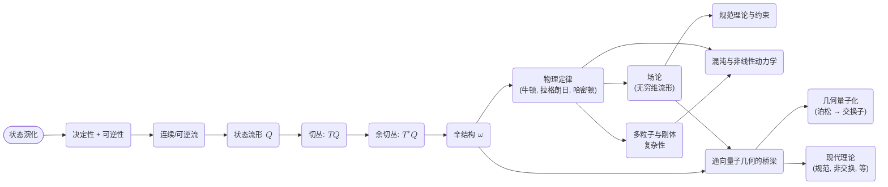

# 经典力学的激进重构：从核心演化到普遍几何秩序
* * *

--- 在状态变化的最小化舞蹈中，存在着机械法则的宏大织锦。

# 第一章. 纯粹的起源

**题词**：“起初，唯有变化。”

## I.A. 将状态演化视为基本实在

### I.A.1 以零假设定义“状态”

让我们从一个完全概念稀疏的地方开始 —— 想象你对力、运动方程或能量形式一无所知。然而，你注意到自然界中的某些东西总是在变化。最简单的前提是存在一个可以标记为系统状态的“某物”。一个“状态”是一个快照，它包含描述该系统在某一时刻所需的一切。

但在我们不施加任何预先存在的结构如力或势能的情况下，“状态”意味着什么？在零假设下，“状态”只是一个标识符。如果你可以说，“现在系统处于状态 $A$，之后它转变为状态 $B$”，这就足以作为起点。其余的一切 —— 像牛顿力学或哈密顿力学这样的框架 —— 必须建立在这个对状态的裸名称方案之上。

关键洞见：
- 我们尚未具体说明状态是如何出现的或它们存储哪些量。我们只承认系统在任何瞬间的配置可以通过将其标记为唯一状态来完全捕捉。

### I.A.2 一致演化的必要条件：决定论 + 可逆性

**(1) 决定论**

如果你只有“状态”的概念，它们如何随时间演化？使“变化”可操作的一个要求是任何一个给定的状态必须以独特且可预测的方式演化。如果从相同的状态我们可以结束于多个不同的未来状态，那么就不会有连贯的定律 —— 没有预测和检验机制的可能性。这个要求就是决定论：

- 决定论意味着当前状态唯一地确定下一个状态。在数学层面上，这意味着存在一个函数(或流) $\Phi$，使得如果系统在时间 $t_0$ 处于状态 $S_0$，其在将来时间 $t_0 + \Delta t$ 的状态是 $\Phi_{\Delta t}(S_0)$。

至关重要的是，这也导致“运动定律”的解不能分叉的概念。如果它们分叉了，我们将失去对未来预测的一致性控制。

**(2) 可逆性**

对于经典力学同样基本的是从一个状态到另一个状态的转换是可逆的。如果一个系统从状态 $A$ 演化到状态 $B$，我们希望能够追溯这些步骤以恢复 $A$。这个概念是可逆性：

- 可逆性意味着关于你是如何从 $A$ 到达 $B$ 的没有任何内在的信息丢失。如果系统的演化不是可逆的，你可能会在过程中丢失细节，并且没有一致的方法可以向后移动时间。

这一性质具有极其重要的后果。它禁止某些“耗散”行为在基本定律层面出现：虽然摩擦或阻尼可以在宏观模型中出现，但经典力学的基础是建立在时间可逆的流方程上的。实际上，在更深的哈密顿框架中，摩擦通常被描述为一种有效现象，而不是根本不可逆性现象。

### I.A.3 涌现的“状态空间”作为一个流形

一旦决定了决定论和可逆性，我们看到状态形成一种比简单集合更复杂的结构。如果一个状态随时间连续变化，你可以推断以下几点：

1. **连续性和路径**
   因为状态在时间上无缝连接，我们可以想象一条连续的路径 $S(t)$。这种连续性暗示了类似于拓扑或微分流形的东西 —— 局部上我们可以以光滑的方式为状态分配坐标。

2. **唯一性和可逆流**
   决定论意味着从状态 $S_0$ 出发，在时间中向前只有一个轨迹。可逆性意味着这种向前的演化是可逆的，暗示了一个状态集上的“自同构”。这种结构 —— 每个点都有一个明确定义的切线方向和可逆流 —— 与微分流形和光滑动力学流的概念相呼应。

3. **所有可能性的流形**
   我们将所有状态的这种整体集合(以及它们可以连续转变的方式)称为“状态空间”或“配置空间”。用现代语言来说，我们将其解释为一个流形 $Q$。虽然我们还不知道它的维度或形状，但我们确实知道它必须足够光滑以承载系统未中断的状态链。

因此，几何学悄然进入：
- 状态形成流形的点。
- 时间演化意味着流形中有明确定义的曲线(轨迹)。
- 决定论 + 可逆性表明这些曲线以可逆的方式由时间参数化。

总结这一概念飞跃：
- 我们从“事物变化”开始。
- 坚持决定论和可逆变化迫使我们接受连续性和光滑性。
- 所有状态的集合必须像流形一样结构化 —— 能够承载向前和向后的流。

## I.B. 几何的涌现

**(这是文档中讲解“为什么是几何？”的时刻。)**

即使我们从最小的假设开始，我们也得出结论，状态必须存在于某种几何一致的地方。事实上，几何从最简单的要求中产生：

1. **切向量**
   光滑演化意味着我们可以谈论每个状态的速度 —— 即切向量。如果你在流形的每一点取样切向量，你会得到一个向量场，描述系统的“变化定律”。

2. **来自可逆性的约束**
   在可逆系统中，每个向量场流必须是可逆的。仅此特性就大大缩小了可能的结构范围，表明我们在基本层面上不能有全局耗散的“流”(如摩擦)，除非我们引入有效的“储库状态”。因此，引入高级结构的理由 —— 如保持不变的辛形式或体积形式 —— 开始显现。

3. **无任意自由度**
   “信息从未丢失”的原则在纯粹的经典环境中鼓励状态空间中的体积保持流(刘维尔定理会稍后逻辑上出现)。更具体地说，为了通过时间来跟踪状态的“独特性”，人们通常(尽管更微妙地)获得一个非退化的结构，它最终被识别为辛形式。

在随后的章节中，我们将看到如何施加额外的最小量 —— 如“系统能量”的概念或“最小作用量”的原理 —— 以引导从流形 $Q$ 到它的余切丛 $T^*Q$ 的转变，我们称之为相空间，以及它所携带的辛几何。但本质已经可见：几何不是附加的；它是由决定论和可逆演化的约束所要求的。

## I.C. 展望

- **下一步**：我们已经确定状态按照可逆流排列在一个流形中。下一个自然的问题是：动量或约束(如力)的概念是从哪里来的？我们如何在这种纯粹的流形视角中定义“能量”或“作用量”？这正是变分方法、切丛/余切丛和辛形式(第 2 章及以后)介入的地方。

- **与现代视角的联系**：虽然我们的动机是经典的，但这种几何视角可无缝地推广。我们采用的方法 —— 从最小约束开始并构建几何 —— 反映高级物理学如何将经典框架与量子或相对论理论合并，继续以几何作为基本指导结构的主题。

## I.D. 第一章的结语

简而言之，第一章论证了一旦你要求演化是决定论和可逆的，“状态”就必须存在于一个数学流形中，而动力学必须编码在这个流形上的可逆流中。我们没有引用牛顿定律或拉格朗日量，而是发现了几何的种子 —— 很快，辛几何 —— 是不可避免的。随着基础的奠定，我们准备好了从这个几何视角观看接下来各章中经典力学的全面绽放。

# 第二章. 几何框架

**题词**：“空间弯曲以适应运动。”

在第一章中，我们已经确立了决定论和可逆演化迫使状态存在于一个流形上，我们现在探讨几何如何成为舞台的中心 —— 塑造运动、锻造约束，并最终定义我们所谓的“物理定律”。在寻求纯粹几何路径的过程中，我们深入研究了由连续性和可逆性产生的切丛和余切丛，最终达到编码经典力学全部织锦的辛形式。

## II.A 自然几何结构

主要主张是这样的：一旦我们同意状态存在于一个流形 $Q$ 上并且时间演化是光滑的，流形的切空间和对偶空间(导致 $TQ$ 和 $T^*Q$)不可避免地会出现。特别是可逆性施加了关键条件，这将导致非退化的 $2$-形式 —— 即辛结构。

### II.A.1 切丛和速度

1. **从连续演化到切向量**

   经典力学要求对于每个点 $q \in Q$，系统随时间连续演化。具体来说，如果你用 $q(t)$ 标记系统的配置，其中 $q: \mathbb{R} \to Q$，则每个瞬间的变化率 $\dot{q}(t)$ 存在于切空间 $T_{q(t)} Q$ 中。形式上：
$$
\frac{d}{dt} \, q(t) \in T_{q(t)} Q.
$$

   - 如果 $Q$ 是 $n$ 维的，则每个点 $q$ 在 $Q$ 中都有一个相关的 $n$ 维切空间 $T_{q} Q$。
   - 所有切向量的集合构成**切丛** $TQ$。

2. **作为动力学定律的向量场**

   一个确定性的时间演化可以通过一个向量场 $X: Q \to TQ$ 编码，它为每个配置 $q$ 分配一个切向量 $X(q)$。在标准符号中，如果我们在 $Q$ 上写出局部坐标 $(q^1, \dots, q^n)$，则：
$$
X(q) \;=\; \bigl( X^1(q), \dots, X^n(q) \bigr),
$$
   定义状态如何局部移动。想法：

   - 系统的“运动定律”基本上是一个向量场，它将每个 $q$ 映射到其速度 $\dot{q}$。
   - 如果流形是光滑且有限维的，我们可以期望存在满足以下条件的明确定义的积分曲线 $q(t)$：
$$
\dot{q}^i(t) \;=\; X^i\bigl(q(t)\bigr).
$$

因此，连续演化的自然要求自然引出切丛视角：系统的运动是某个速度场 $X$ 的积分曲线。

### II.A.2 从可逆性到辛必要性

到目前为止，我们有一个带有速度场的光滑流形 $Q$。然而，经典物理学还要求**可逆性**：我们必须能够逆转流并追溯系统回到过去。数学上，这需要对这些流施加更强的条件 —— 最终导致一个特殊的 $2$-形式，即**辛形式**。

1. **非退化形式和可逆的流**

   - 为了使 $Q$ 上的流在动力学意义上全局可逆，某些类似体积或面积的结构必须保持不变，防止轨道之间的“坍塌”。
   - 一个典型的初步步骤：保持体积形式不变足以保证不可压缩性(例如，刘维尔定理)。但经典力学特别处理的是“相空间”，这是一个 $2n$ 维流形，其上的相关结构是一个非退化的 $2$-形式 $\omega$。

2. **封闭且非退化的 $2$-形式：辛形式**

   一个**辛形式** $\omega$ 在一个 $2n$ 维流形 $M$ 上(我们通常将其标识为“相空间”)是：

   - **封闭**：
  $$
    d\omega = 0,
  $$
   - **非退化**：对于每一个非零向量 $v$，存在某个 $w$ 使得
  $$
    \omega(v, w) \;\neq\; 0.
  $$

   在经典力学中，这个流形 $M$ 是余切丛 $T^*Q$。在 $M$ 中的每一点是 $\bigl(q, p\bigr)$，表示配置 $q$ 和动量 $p$。可逆的、体积/信息保持流的条件有效转换为：
$$
\iota_X \omega \;=\; 0 \quad \Longleftrightarrow \quad X \;=\; 0 \quad \text{(non-degeneracy condition)},
$$
   以确保我们在演化过程中不丢失方向。此外，封闭性 $d\omega = 0$ 支撑守恒定律和哈密顿流。

3. **作为辛流形的相空间**

   因此，通过反向逻辑：如果我们想要一个运动既是连续又是可逆的世界，我们会发现运动的“场地”不能是任意流形，而通常是维度为 $2n$ 的**辛流形**。物理上：

   - **维度 $2n$**：我们需要坐标配对 $(q^i, p_i)$。
   - **辛 $2$-形式 $\omega$**：这个形式编码这些坐标如何耦合以定义相空间中的“面积”元素。

### II.A.3 余切丛和对偶变量

现在我们来到了为什么我们谈论 $T^*Q$ 的关键原因：

1. **为什么是余切而不仅仅是正切？**

   - 在拉格朗日力学中，速度 $\dot{q}$ 存在于 $TQ$ 中。而在哈密顿力学中，动量 $p$ 存在于 $T^*Q$ 中。
   - 动量是位置的自然“对偶变量”。这种对偶性源于勒让德变换，它连接动能表达式(如 $\tfrac12 m \dot{q}^2$)和动量定义 $p = \partial L / \partial \dot{q}$。

2. **精确定义 $T^*Q$**

   - 对于每个点 $q \in Q$，余切空间 $T^*_q Q$ 是在 $T_q Q$ 上的线性泛函空间。
   - 全局上，$T^*Q = \bigcup_{q \in Q} T^*_q Q$。一个典型元素是 $(q, p)$，其中 $p$ 是在 $q$ 处的 $1$-形式。

3. **典范辛形式**

   - 在 $T^*Q$ 上，存在一个典范 $1$-形式，通常记为 $\theta = \sum_i p_i \, dq^i$。它的外导数产生典范 $2$-形式：
$$
\omega \;=\; -\, d\theta \;=\; \sum_i dq^i \wedge dp_i.
$$

   - 这个 $\omega$ 正是在哈密顿力学中使用的辛形式。非退化性遵循微分几何中的标准论证，确保可以逆转速度类和动量类变量之间的关系。

4. **解释：位置与动量作为共轭配对**

   一旦我们在 $T^*Q$ 中适配 $(q, p)$，辛形式有效地将每个 $dq^i$ 与唯一的 $dp_i$ 相关联，以捕捉经典自由度的“配对”性质：每个坐标都有一个共轭动量。几何强制在 $q^i$ 中的一个小移动与在 $p_i$ 中的相应移动配对以保持体积/信息。

## II.B 从几何中推导物理定律

既然我们看到流形加上对称性约束如何导致辛流形 $(T^*Q, \omega)$，我们可以观察到经典“运动定律”不是独立的规则而是直接的结果：

1. **泊松括号和哈密顿演化**

   - 辛形式 $\omega$ 使我们能够为 $T^*Q$ 上的任意函数 $f, g$ 定义泊松括号：
$$
\{f, g\} \;\equiv\; \sum_{i=1}^n \Bigl(\frac{\partial f}{\partial q^i} \,\frac{\partial g}{\partial p_i} \;-\; \frac{\partial f}{\partial p_i} \,\frac{\partial g}{\partial q^i}\Bigr).
$$

   - 一个哈密顿量 $H(q,p)$ 通过：
$$
\iota_{X_H}\omega \;=\; dH,
$$
    生成流向量场 $X_H$，得到哈密顿方程：
$$
\dot{q}^i \;=\; \frac{\partial H}{\partial p_i}, 
\quad
\dot{p}_i \;=\; -\, \frac{\partial H}{\partial q^i}.
$$

2. **相空间体积守恒：刘维尔定理**

   - 因为 $\omega$ 是封闭的且**非退化的**，哈密顿流保持体积形式 $\omega^n$。这正是刘维尔定理：相空间中状态没有净压缩或膨胀。

3. **力作为几何，约束作为子流形**

   - 代替“力”作为一个外部概念，几何加上选择的哈密顿量澄清了“广义力”如何出现。
   - 约束成为 $Q$ 或 $T^*Q$ 中的子流形或嵌入。它们自然地通过限制几何到这些子流形或通过拉格朗日乘子添加约束来处理，与流形视角一致。

因此，整个经典运动的概念 —— 牛顿定律、拉格朗日方程、哈密顿方程、诺特定理 —— 可以从这个几何场景中读出。我们看到经典物理学的真正“核心”确实是辛流形和演化 $1$-形式 $\theta$ 的概念，而不是任何单一的基于力的方法。

## II.C 相互联系和展望

- **与第三章的联系**：接下来，我们将引入**作用量原理**，它形式化了拉格朗日量或等效的典范 $1$-形式的积分如何导致运动方程。这一步巩固哈密顿最小作用量原理背后的“为什么”。
- **与第四章的联系**：一旦我们掌握 $(q, p)$ 和 $\omega$，我们可以从完整的哈密顿视角出发，处理规范变换和泊松结构。

## II.D 第二章的结语

第二章揭示了可逆、连续演化的原始需求如何召唤出正切/余切流形框架。辛几何作为必要性而非便利性出现，将动量定位为位置的对偶。有了这一基础，我们可以将所有主要的经典表述统一在一个单一的几何框架下。

# 第三章. 物理系统作为几何必然

**题词**：“从抽象的必然性中产生具体的实在。”

随着几何被确立为力学的基础，我们现在可以看到整个类别的物理定律 —— 通常作为单独的“牛顿力定律”或“拉格朗日/哈密顿方程”引入 —— 如何作为辛流形框架的自然推论出现。在本章中，我们通过展示特定的力学系统如何几乎不可避免地从几何中产生来统一这些概念。远非一组分离的历史发现定律，标准方法(牛顿、拉格朗日、哈密顿)成为同一基本几何原理的不同表现形式。

## III.A 基本系统

这里，“基本”指的是那些基准模型(自由粒子、谐振子、中心力问题)，它们体现运动的基本形式。我们展示每个模型如何仅仅是辛流形思想在低维或特定哈密顿量选择下的限制。

### III.A.1 自由粒子

1. **几何设置**

   自由粒子的配置空间是一个欧几里得流形，比如 $\mathbb{R}^n$。其相空间是 $T^*\mathbb{R}^n$，具有典范坐标 $(q^i, p_i)$。辛形式为
$$
\omega \;=\; \sum_{i=1}^n \mathrm{d}q^i \wedge \mathrm{d}p_i.
$$

2. **哈密顿量和运动方程**

   最简单(且历史上最先出现)的哈密顿量仅包含动能：
$$
H(q, p) \;=\; \frac{1}{2m}\, \sum_{i=1}^n (p_i)^2.
$$
   哈密顿方程，
$$
\dot{q}^i \;=\; \frac{\partial H}{\partial p_i} \;=\; \frac{p_i}{m}, 
\quad
\dot{p}_i \;=\;-\, \frac{\partial H}{\partial q^i} \;=\; 0,
$$
   表明 $p_i$ 是常数且 $q^i$ 随时间线性演化。这是标准的 $n$ 维欧几里得空间中的匀速运动。我们看到“无外力”实际上意味着“不依赖于 $q^i$”，这是几何没有扭曲或弯曲相空间流的直接标志。

3. **解释**
   - 信息保持：相空间中的体积显然是守恒的(刘维尔定理)。
   - 牛顿第一定律：通常表述为“一个物体在不受外力作用时将保持匀速运动”，现在直接从哈密顿结构对 $q$ 的独立性读出。

### III.A.2 谐振子

1. **配置空间和哈密顿量**

   接下来，我们添加一个二次势能：
$$
H(q, p) \;=\; \frac{1}{2m}\,(p^2) \;+\; \tfrac12\,k\,q^2,
$$
   配置空间仍然是 $\mathbb{R}$ (或对于 $n$ 个不耦合振子的 $\mathbb{R}^n$)。辛形式保持为
$$
\omega \;=\; \mathrm{d}q \wedge \mathrm{d}p.
$$

2. **运动方程**

   哈密顿方程给出
$$
\dot{q} \;=\; \frac{p}{m}, 
\quad
\dot{p} \;=\;-\,k\,q.
$$
   结合它们，$\ddot{q} = -(k/m)\,q$，这是典型的振子方程。在相空间中，轨迹形成封闭椭圆，能量守恒：
$$
E = \tfrac1{2m}\,p^2 + \tfrac12\,k\,q^2.
$$

3. **解释**
   - 相空间中的周期测地线：振子的椭圆轨道反映在 $\omega$ 中的“扭曲”，它耦合 $q$ 和 $p$。
   - 拉格朗日还是牛顿？在拉格朗日形式中，我们看到 $L = \tfrac12\,m\,\dot{q}^2 - \tfrac12\,k\,q^2$。用牛顿的原始语言，“力” $F = -\,k\,q$ 自然地作为 $-\partial V/\partial q$ 出现。这再次是一个几何驱动的现象：哈密顿量对 $q$ 有二次型依赖。

### III.A.3 中心力问题

1. **球对称性**

   在 $\mathbb{R}^3$ 中具有球对称性，哈密顿量可能是
$$
H \;=\; \frac{\|p\|^2}{2m} \;+\; V\bigl(r\bigr),
\quad
r = \|q\|.
$$

2. **角动量和子流形**

   旋转不变性转化为守恒的角动量向量 $\mathbf{L}$。相空间流限制在 $H$ 和 $\|\mathbf{L}\|$ 的水平集上，产生类似于行星运动或散射轨道的轨迹。牛顿的平方反比律(用于引力)只是在普遍几何背景下 $V(r)$ 的一种选择。

3. **解释**
   - 角动量守恒源于连续的旋转对称性。这正是诺特定理在辛几何中的陈述。
   - 轨道(例如，开普勒椭圆)是相空间中适当有效势能表面上的测地线。

## III.B 复杂系统

通过说明这些“简单”的构建块，我们看到层叠或耦合这些系统仍然在相同的几何语言中：多维流形或场配置的无穷维，仍然由相同的辛或变分逻辑支配。

### III.B.1 多体力学

1. **高维相空间**

   对于 $\mathbb{R}^3$ 中的 $N$ 个粒子，配置流形是 $Q \cong \bigl(\mathbb{R}^3\bigr)^N$。相空间的维度为 $6N$。辛形式是直和：
$$
\omega \;=\; \sum_{j=1}^N \sum_{i=1}^3 \mathrm{d}q^i_j \wedge \mathrm{d}p_{i,j}.
$$

2. **相互作用势能**

   一个一般的哈密顿量可以写为：
$$
H \;=\; \sum_{j=1}^N \frac{\|p_j\|^2}{2\,m_j} \;+\; \sum_{j < k} V\bigl(\|q_j - q_k\|\bigr).
$$

3. **解释**
   - 几何不变：仍然是一个大的辛流形。力是势能关于坐标的偏导数。
   - 集体现象(质心运动、相对坐标、正则模式)自然嵌入这个高维结构中。

### III.B.2 场论(无穷维流形)

当“自由度的数量”趋于无穷时，我们得到场 $\phi(\mathbf{x})$。配置空间实际上是一个函数空间。虽然失去了有限维的可处理性，但相同的逻辑继续：

- **泛函**导数扮演动量的角色。
- 在函数空间中出现辛(或多辛)形式。
- 哈密顿原理推广到场的作用量：
$$
S[\phi] = \int \bigl(\text{Lagrangian density}\bigr)\,\mathrm{d}t\,\mathrm{d}\mathbf{x}.
$$

路径/变分观点不变。这强调了我们几何观点的普遍性 —— 从单个自由粒子到经典场，所有都围绕着流形性、辛结构和变分逻辑。

### III.B.3 连续介质

流体的流或弹性变形同样占据无穷维配置。它们依赖于描述流形(流体域或变形映射的“形状”)随时间变化的方式：

1. **示例：理想不可压缩流体**

   - 一个区域上的体积保持微分同胚群可以构成流形 $Q$。
   - 哈密顿原理导致欧拉方程；动量映射从诺特定理得出涡量守恒。

2. **几何统一**

   从刚体到连续介质力学的一切都折叠回到变换和辛结构的几何中，重申“力学定律”是同一基础的广泛表现。

## III.C 定律作为几何的衍生物

让我们最终将这些系统与标准表述联系起来：

1. **变分原理**
   最小作用量原理 $\delta S = 0$ 适用于每个例子：自由空间中的最小测地线、振子势中的封闭椭圆轨道、两体引力问题等。几何陈述是实际路径在配置空间(或相空间)中在符合边界条件的变化下是“极值”的。

2. **拉格朗日力学**
   在拉格朗日方法中 $L = T - V$，对于 $q^i(t)$ 的欧拉-拉格朗日方程直接来自于：
$$
\frac{\mathrm{d}}{\mathrm{d}t}\Bigl(\frac{\partial L}{\partial \dot{q}^i}\Bigr) \;-\; \frac{\partial L}{\partial q^i} \;=\; 0.
$$
   但从几何上看，这只是要求 $Q$ 中的轨迹遵守变分作用量原理。所见的“力” $Q^i$ 是势能或约束的偏导数的临时代理。更深层次的驱动力是变分路径的几何。

3. **哈密顿力学**
   从速度过渡到动量得到哈密顿量 $H(q,p)$。该流为：
$$
\dot{q}^i \;=\;\frac{\partial H}{\partial p_i}, 
\quad
\dot{p}_i \;=\;-\,\frac{\partial H}{\partial q^i},
$$
   这不过是规定了一个保持 $2$-形式 $\omega$ 的辛向量场。刘维尔定理指出体积形式在哈密顿流之下不变，确保一致且可逆的演化。

4. **牛顿定律作为子集**

   从历史上看，力学始于牛顿的三大定律。但从我们的角度来看：

   - **牛顿第一定律**(惯性)：一个没有 $q$ 依赖性的自由哈密顿量 → 匀速运动。
   - **牛顿第二定律** $\mathbf{F} = m\,\mathbf{a}$：如果 $V(q)$ 是一个势能，则
$$
m\,\ddot{q}^i = -\,\frac{\partial V}{\partial q^i},
$$
    这正是坐标形式下的哈密顿或拉格朗日条件。
   - **牛顿第三定律**(作用-反作用)源于内部对称性，特别是在多粒子系统中求和相互作用时，反映了动量或角动量守恒，这来自于诺特定理。

  因此，牛顿的机制无非是更深层次几何前提的坐标级表达。曾经的“力”现在是势能的微分或哈密顿量的偏导数。“推/拉”的幻觉被更根本的陈述所取代，即相空间流遵循力的辛线。

## III.D 相互联系

- **通往下一章的桥梁**：我们展示了基本力学定律如何从几何中萌发，以及简单或复杂系统如何不扰乱底层逻辑。接下来的章节将进一步探讨辛几何如何产生规范变换、处理约束，并最终为混沌和场论等高级主题铺平道路。
- **统一视角**：关键主题是所有经典动力学都是几何的副产品 —— 牛顿、拉格朗日和哈密顿只是显示幕后相同几何现象的不同“屏幕”。

## III.E 第三章的结语

总之，经典运动，无论是自由的还是受力的，都可以从流形加辛结构加上选定的哈密顿函数中读出。“基本”系统展示熟悉的定律如何轻易地出现，而更“复杂”的领域则保持相同的模式，只是在维度或范围上进行扩展。在初等教科书中可能被视为分离定律的内容，在这个新的视角下，实际上是几何引导演化的自然结果 —— 这证明了为什么几何真正处于经典力学的核心。

# 第四章. 扩展：约束、多体和场论领域

**题词**：“在多体的漩涡中，几何依然主宰。”

在前几章中，我们看到经典力学 —— 传统上通过力或能量来处理 —— 如何从更深层次的几何根源中产生。流形、辛形式和变分原理的相同思想惊人地扩展到解释复杂的相互作用、更多的粒子数量，甚至由无限多个自由度描述的场。下面，我们展示统一的几何形式主义如何持续存在，并引导我们穿越约束、多体系统和场论表述。

## IV.A 约束、全纯性和非全纯系统

到目前为止，我们主要考虑在配置流形 $Q$ 上的无约束运动。实际上，许多机械系统受到约束(例如，滚动而不滑动、机器人臂中的连杆或刚体中的杆)。这些约束可以是全纯的或非全纯的，每种类型都在几何框架中自然得到处理。

### IV.A.1 全纯约束和子流形

1. **定义全纯约束**

   如果一个约束可以表示为方程 $f(q) = 0$ (或多个这样的方程)，它约化了 $Q$ 的有效维度，则该约束是**全纯的**。在这种情况下，运动被限制在一个由 $f(q) = 0$ 定义的子流形 $M \subset Q$ 上。在拉格朗日或哈密顿表述中，可以通过使用拉格朗日乘数或将运动直接描述在约化的流形上来包含此类约束。

2. **几何解释**

   由于全纯约束定义子流形，通常的辛形式和变分原理仅限于这些“约束面”。如果约束本身是不变的，对称性保持完整。每个子流形上的流保持诱导的几何结构。

3. **示例：刚性杆上的摆**

   质量位于不可伸长的杆上的摆的配置空间是一个圆 $S^1$。这是 $\mathbb{R}^2$ 中的一个一维子流形，$\mathbb{R}^2$ 是平面运动的无约束空间。所有基于几何的常规论证(最小作用量、相空间中的辛结构)仍然成立，只是限制在圆上(以及在哈密顿形式中限制在它的余切丛上)。

### IV.A.2 非全纯约束和隐藏几何

1. **定义和常见示例**

   **非全纯**约束通常看起来像 $a_i(q)\,\dot{q}^i + \dots = 0$ 并且**不能**积分成纯坐标条件 $f(q) = \mathrm{const}$。例子包括滚动约束(轮子或球在平面上滚动)或某些机器人关节。它们导致速度级别的限制，不会以简单的方式约化配置空间的维度。

2. **拉格朗日乘数和狄拉克括号**

   - **拉格朗日乘数**：即使在拉格朗日形式主义中也可以包含此类约束，但每个速度级别的限制引入额外的项。对于哈密顿力学，**狄拉克括号**推广泊松括号以一致地处理约束，确保系统在相空间的子流形上演化而不失去可逆性。

3. **几何展望：分布和全纯性**

   非全纯约束在切丛中定义分布(即系统实际可以移动的方向)。几何可能变得更加复杂：约束分布可能是不可积的，导致现象如“全纯环”，其中在配置空间中遍历环路会导致净运动，类似于著名的滚动球悖论。

4. **说明：滚动轮**

   一个在平面上无滑动滚动的轮子有约束：
$$
\dot{x}\,\cos\theta + \dot{y}\,\sin\theta \;=\; R\,\dot{\theta},
$$
   这不能积分成纯位置级别的方程。相反，其流形是三维的($x, y, \theta$)，但存在速度级别的约束。分布的几何结构可以产生令人惊讶的“转向”或“可积性的破坏”，成为机器人运动规划(在微分约束下)的基础。

## IV.B 刚体和多粒子力学

### IV.B.1 刚体配置

3D 空间中刚体的配置可以用流形 $\mathrm{SE}(3)$ (特殊欧几里得群，结合旋转 $\mathrm{SO}(3)$ 和平移)来描述。如果我们只考虑绕固定点的旋转，则限制为 $\mathrm{SO}(3)$：

1. **配置流形** $Q \cong \mathrm{SO}(3)$
   - 每个点 $R \in \mathrm{SO}(3)$ 是 3D 中的一个方向。
   - 在 $R$ 处的切向量表示角速度；因此系统是 $\mathrm{SO}(3)$ 上的主纤维丛，群为 $\mathrm{SO}(3)$ 本身。

2. **惯性张量和哈密顿量**

   旋转体具有涉及惯性张量 $I$ 的动能。在局部坐标中，拉格朗日量可能如下所示：
$$
L \;=\; \tfrac12\, \boldsymbol{\omega}^{T}\,I\,\boldsymbol{\omega},
$$
   其中 $\boldsymbol{\omega}$ 是机体固定框架中的角速度。转换到动量后得到哈密顿量；几何由在 $T^*\mathrm{SO}(3)$ 上的非平凡但易于理解的辛结构锚定。

3. **泊松球和欧拉方程**

   经典的欧拉陀螺和 3D 刚体方程从相同的流形方法中涌现，相空间维度为 $6$ (三个角度，三个动量)。旋转由 $\mathrm{SO}(3)$ 上的左不变或右不变向量场捕捉，生成熟悉的角动量欧拉方程。角动量是与 $\mathrm{SO}(3)$ 对称性相关的动量映射。

### IV.B.2 多粒子系统

当我们考虑 $N$ 个粒子时，几何变得更加广泛。配置流形是 $Q \cong \mathbb{R}^{3N}$ (如果有约束则为合适的子流形)。每个粒子有位置 $\mathbf{q}_i$ 和动量 $\mathbf{p}_i$ 。则：

- **相空间** 是 $6N$ 维的。
- **辛形式** 是总和：
$$
\omega \;=\; \sum_{i=1}^N \sum_{j=1}^3 \mathrm{d}q_{i}^j \,\wedge\, \mathrm{d}p_{j,i}.
$$

- **相互作用势能** $V(\| \mathbf{q}_i - \mathbf{q}_j \|)$ 或更复杂的形式定义内部力。
- **集体现象**：正常模式、可积多体系统、混沌或簇形成都符合相同的哈密顿几何背景。

### IV.B.3 可积与混沌

当自由度很多时，系统可以从可积(有足够的守恒量)到混沌(对初始条件敏感)。几何原则保持不变：流是辛的，刘维尔定理成立，泊松结构统一了高级技术，如可积情况下的作用-角度变量或近可积混沌的 KAM 理论。

## IV.C 场论：无穷维几何

复杂的实在世界系统通常涉及具有无穷多个自由度的场 $\phi(\mathbf{x}, t)$。经典例子(电磁学、弹性波、流体)仍然可以在拉格朗日或哈密顿框架中重新表述，尽管是在无穷维的场配置流形上。

1. **配置作为映射**

   我们将 $Q$ 视为场配置的空间，例如 $\phi: \Omega \to \mathbb{R}$，其中 $\Omega$ 是一个空间域。切空间 $TQ$ 则由小变化 $\delta \phi(\mathbf{x})$ 组成。勒让德变换现在产生“共轭动量” $\pi(\mathbf{x})$。辛形式变为积分：
$$
\omega \;=\; \int_\Omega \mathrm{d}\pi(\mathbf{x}) \,\wedge\, \mathrm{d}\phi(\mathbf{x})\, \mathrm{d}\mathbf{x}.
$$

2. **哈密顿偏微分方程**

   哈密顿量可能是
$$
H[\phi, \pi] \;=\; \int_\Omega \mathcal{H}\bigl(\phi(\mathbf{x}), \pi(\mathbf{x}), \nabla \phi(\mathbf{x})\bigr)\, \mathrm{d}\mathbf{x},
$$
   由此产生的哈密顿方程变成偏微分方程(PDE)。尽管函数复杂，但它仍然是辛几何的故事，现在存在于函数空间中。基于几何的逻辑定义了守恒的能量、动量等。

3. **规范自由度**

   一些场(例如电磁学、杨-米尔斯理论)具有局部对称性，意味着无穷维意义上的约束。几何是主丛或纤维丛的几何，其中规范变换保持类似曲率的对象。在哈密顿语言中，这些产生一类约束并再次导致狄拉克括号结构。

## IV.D 相互联系和展望

1. **混沌领域**：第七章将详细说明即使是带有小扰动的“简单”哈密顿量也可能产生混沌运动。多体或连续场的扩展视角不会失去基础：它积累基础，有时揭示新的涌现现象。

2. **几何一致性**：无论我们处理滚动约束、旋转刚体还是连续介质中的波动方程，不变量和流始终保持辛引导。整个高级结构仍然建立在前面章节中的同一基础上。

## IV.E 第四章的结语

当我们从单粒子设置扩展到多维约束、非全纯条件，甚至无穷维场时，统一的原则依然存在：一个状态流形，配备辛(或类似的一致几何)形式，加上一个哈密顿量来编排演化。无论是描述滚动球、刚性转子，还是整个流体的流，几何“依然主宰”。它要求每个系统都可以通过变分陈述、辛形式和可逆流的视角来接近，从而将小的局部约束与广泛的普遍定律联系起来。

在后续章节中，我们将看到这些向大维系统的扩展，或微妙的约束，开辟了广阔的前沿领域，如混沌、可积层次结构，最终是通向量子或相对论框架的桥梁。但信息保持不变：无论领域的复杂性或广度如何，几何始终作为底层的指挥者，塑造每一个机械和谐。

# 第五章. 深度统一：量子及其他

**题词**：“辛的低语成长为量子的回声。”

经典力学的几何视角 —— 流形、辛形式、变分原理 —— 不仅仅是对牛顿或拉格朗日定律的整洁重新推导。它铺设一条通往量子理论、规范场和其他现代前沿的概念道路。在本章中，我们揭示相同的辛形式主义，一旦与额外的结构配对，自然地扩展到量子力学、高级规范对称性以及非交换几何等新兴领域。不是人为地附加量子原理，而是将它们视为我们几何叙事的下一步逻辑发展，其中泊松括号转换为对易子，局部力转换为纤维丛联络。

## V.A 几何量子化

经典力学的核心是一个辛流形 $(M,\omega)$。从几何角度看，量子力学可以被视为“量子化”这个流形：编码波函数，使得经典可观测量对应于算子。关键是将泊松括号转换成对易子，同时保持与流形拓扑约束的一致性。

### V.A.1 从泊松到对易子：核心思想

1. **经典可观测量**
   如我们所建立的，经典可观测量是相空间 $M$ 上的实值函数 $f$ 。泊松括号由下式给出：
   $$
   \{f, g\} \;=\; \sum_{i=1}^n 
   \Bigl(\frac{\partial f}{\partial q^i}\,\frac{\partial g}{\partial p_i} 
   - \frac{\partial f}{\partial p_i}\,\frac{\partial g}{\partial q^i}\Bigr).
   $$
   在更抽象的几何语言中，$\omega$ 产生一个泊松结构。

2. **量子算子**
   几何量子化要求每个经典函数 $f$ 映射到一个量子算子 $\hat{f}$ 。泊松括号必须对应(相差一个 $i\hbar$ 因子)到对易子：
   $$
   \bigl[\hat{f},\,\hat{g}\bigr] \;=\; i\,\hbar\,\widehat{\{f,\,g\}}.
   $$

3. **意义**
   这确保经典极限 $\hbar \to 0$ 从对易子恢复泊松括号，匹配我们的经典结构。$(M,\omega)$ 的几何隐藏在量子力学中的波函数空间和算子代数中。

### V.A.2 整数条件和预量子线丛

1. **整数性和 $\hbar$**
   对于辛流形 $(M, \omega)$ 能够接受完整的“几何量子化”，$\omega$ 通常必须满足一个整数条件：
   $$
   \bigl[\tfrac{\omega}{2\pi\hbar}\bigr] \; \in\; H^2(M, \mathbb{Z}),
   $$
   即 $\omega/2\pi\hbar$ 是一个整数上同调类。这一拓扑约束确保相空间体积以普朗克大小的“单元”量化。

2. **预量子线丛**
   满足整数条件后，可以在 $M$ 上构造一个复线丛 $L$，其曲率等于 $-\,i\,\omega$。$L$ 的截面提供“预量子波函数”。
   - 局部上，$L$ 是平凡的，但全局上它可以扭曲，捕捉流形的非平凡拓扑。
   - 在 $L$ 上的联络反映 $\omega$；这是“预量子化”的基础。

3. **从预量子到全量子**
   仅取所有 $L$ 的截面太大。我们需要一个极化(坐标分为“位置”和“动量”)来定义物理相关的波函数。选择极化后，得到一个极化截面的希尔伯特空间，即量子态。可观测量成为从 $\hat{f}_{\mathrm{pre}} = -\,i\,\hbar\,\nabla_{X_f} + f$ 导出的某些微分算子。

### V.A.3 总结：泊松-对易子桥梁

因此，几何量子化巩固了：

- 相空间 $(M, \omega)$ $\to$ 希尔伯特空间。
- 带有泊松括号的函数 $f$ $\to$ 带有对易子的算子 $\hat{f}$ 。
- 刘维尔定理 $\to$ 时间演化的幺正性。

简而言之，如果经典力学是几何，那么量子力学就是几何加上“量子线丛”，将泊松括号桥接到算子代数。

## V.B 现代扩展：规范场、非交换几何及其他

相同的几何视角阐明了局部对称性(规范变换)、高级算子代数甚至可积层次结构如何融入单一图景。

### V.B.1 规范理论和纤维丛

1. **规范势作为连接**

   在电磁学或非阿贝尔规范理论(如杨-米尔斯理论)中，我们将规范场 $A$ 解释为主丛上的联络。$A$ 的曲率是场强 $F$。这些是辛联络思想的自然推广：我们保持局部规范不变性，确保物理状态仅通过不改变底层几何的变换而不同。

2. **相空间和约束**

   在哈密顿形式中，规范约束表现为一类约束(根据狄拉克分类)，需要约化相空间或引入结构化的泊松括号(狄拉克括号)。这直接类比于全纯约束如何塑造有限维系统，并扩展到无限维空间上的局部对称性。

3. **动量映射**

   诺特定理优雅地扩展：每个规范对称性产生一个守恒荷(动量映射)。在电磁学中，这可能是总电荷；在非阿贝尔规范场中，是色荷。整个几何本质上是相同的哈密顿蓝图，扩展到群作用于无限维流形上。

### V.B.2 非交换几何和量子场论

1. **非交换坐标**

   在非常高能量或小尺度下，假设时空坐标 $x^\mu$ 本身不交换：
$$
\bigl[x^\mu,\; x^\nu\bigr] \;=\; i\,\thetaup^{\mu\nu}.
$$
   这种普遍的“辛化”或“时空中的泊松结构”概念将几何扩展到一个局部交换特征消失的领域。函数的代数被算子代数取代。动机：相同的几何逻辑 —— 泊松括号 $\to$ 对易子 —— 应用于时空坐标的层面上。

2. **对量子场论的影响**

   包含非交换几何的量子场论(QFTs)看到费曼规则、重整化行为和规范结构的修改。然而，概念基础与经典 $\to$ 量子的桥接保持一致。可以说，非交换几何是第三章局部量子方法的“全局”或“时空级”版本。

3. **可积层次结构**

   另一个高级领域是可积偏微分方程(Korteweg–de Vries, Toda 格点等)，通常承认带有无穷多组交换荷的哈密顿描述。几何视角将它们统一：
   - 相空间是场的空间，
   - 辛形式产生泊松括号，
   - 守恒积分的层次结构反映泊松括号中的深层对易子子代数，
   - 量子化这些系统导致高级“量子可积模型”。

## V.C 新兴领域的潜力

故事不会止步于规范场或简单的量子力学：

1. **量子引力**：如果量子力学源于有限或无限维流形的几何量子化，人们可能怀疑引力场本身也是几何的，应该被量子化。这种方法促进了圈量子引力、弦理论几何或自旋网络的发展，每个都依赖于高级的辛和变分逻辑。

2. **拓扑力学和高阶范畴**：对拓扑物质状态或高阶范畴对称性的现代强调是相同几何形式主义的扩展，有时放松局部度量数据，转而对规范场施加纯粹的拓扑约束。

3. **信息理论**：几何、量子态和纠缠之间的边界已成为热门话题，将经典几何与量子电路类比或 AdS/CFT “时空来自量子纠缠” 视角联系起来。所有这些继续同一个主题：几何是根本的，辛种子在每个尺度上茁壮成长。

## V.D 相互联系

我们看到经典的辛骨架如何无缝支撑量子框架：无需拼凑。同样的流形视角，在经典领域产生哈密顿方程，而在量子或场论背景下转换为线丛、算子和规范耦合。这种强大的统一性之所以出现，是因为在每一步 —— 无论是经典物理学中的“力”还是高级场论背景下的“规范连接” —— 背后都有几何。

## V.E 第五章的结语

从几何重建的经典力学为量子力学、规范场甚至可能是量子引力提供了完美的跳板。泊松括号转换为对易子，辛流成为幺正演化，局部规范变换成为更高层次的约束。始于纯粹经典事业的东西最终成为理论物理宏伟建筑的蓝图。确实，“辛的低语”塑造了牛顿、拉格朗日和哈密顿，悄悄地在量子领域编排一曲交响乐，证明几何视角在看似不同的前沿领域中提供了清晰和概念统一。

# 附录 A : 概念关系图

下面是简洁的示意图，展示关键概念及其相互联系，反映从简单的“状态演化”到高级主题如场论和量子扩展的几何路径。它帮助高级读者一目了然地看到整个文本的逻辑如何围绕相同的几何种子(决定性、可逆性、辛形式等)统一起来。

## A.1 解释说明

1. **状态演化**
   我们从基础的认识开始，即物理实在是“始终在变化的”。通过要求这种变化既是决定性的(每个状态都有唯一的未来演化)又是可逆的(没有内在的信息损失)，我们逻辑上被引导到以下内容。

2. **状态流形 ($Q$)**
   所有状态的集合必须配备一个流形结构。这确保状态空间中的光滑轨迹和可逆流。

3. **切丛和余切丛**
   一旦我们将这些状态置于流形 $Q$ 上，连续演化意味着切向量(速度)的概念，而动量自然作为对偶变量出现(余切丛 $T^*Q$)。

4. **辛结构**
   当我们加入在时间中保持信息的要求时，我们得到一个非退化的 $2$-形式 $\omega$。这是现代经典力学公式的核心：哈密顿、拉格朗日和牛顿定律都作为更深层次的辛几何的专门坐标投影出现。

5. **物理定律**
   在 $T^*Q$ 上有了 $\omega$ 与合适的哈密顿量后，可以推导出标准的运动方程(牛顿、拉格朗日、哈密顿)。值得注意的是，约束(全纯或非全纯)、多体扩展以及更复杂的现象(混沌、规范场)不需要额外假设；它们从限制或扩展这一相同几何中涌现出来。

6. **量子及其他**
   在图表的顶端，相同的推理支持几何量子化。从泊松括号到对易子的步骤是一种几何桥接，为量子场论、高级规范对称性、可积层次结构，甚至可能是量子引力或非交换几何打开了大门。

## A.2 为什么这个图示重要

此图示概括了我们对经典力学“重新架构”的精神：从最小的前提(状态演化 + 决定性 + 可逆性)到当代物理学的高度，全部由几何结构的必然性指导。通过检查图表中的每个节点，可以看到标准的机械“定律”甚至是量子泛化 —— 本质上 —— 都是通过定义良好的流形上的辛流的结果。

我们希望，这样的统一观点能够激发更深的洞察，并促进新的应用，呼应正文的主要信息：几何作为经典(及超经典)物理的基本生成原则。

