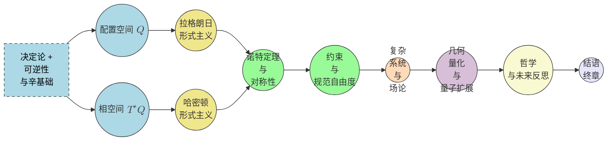

# 重温经典力学：一个全面的几何与变分方法
* * *

--- 所有运动都是在时间中的几何 —— 让作用原理揭示交响乐。

# 第1章. 重新构想经典力学

**题词：** “要重新开始，我们必须用新的眼光看待旧的事物。”

经典力学，如其通常被教授和学习的那样，长期以来一直建立在牛顿定律的基础之上。尽管它取得了成功，现代数学和物理学提供了一个机会，从更深层次的角度重新审视这些基础 —— 一个强调几何和状态演化作为学科真正核心的视角。本章确立了这种“激进”重启的动力，然后概述了简单而强大的假设，这些假设成为我们的指导原则：变化的存在、其决定性和可逆性。

## 1.1 动机与目的

**目标**：论证为什么对经典力学进行“激进”或“第一原理”的重启是有价值的，包括历史上几何逐渐占据中心舞台的过程(拉格朗日、哈密顿、嘉当)。

**内容摘要**：强调“基于力”的方法与“基于几何”的方法之间的张力，现代数学(微分几何、群论)的兴起，以及它们如何统一经典现象。

### 1.1.1 从牛顿力到几何流形

经典力学的历史演变揭示了一股逐渐但持续地将重点从纯粹的“基于力”的观点转移开来的暗流。艾萨克·牛顿的巨著《自然哲学的数学原理》以力的形式阐述了运动定律和万有引力：
$$
\mathbf{F} \;=\; m\, \mathbf{a}.
$$
然而，在接下来的两个世纪中，拉格朗日和哈密顿的激进改革揭示了一个不同的概念核心。这些后来的观点不再专注于瞬时的推拉，而是将系统的**构型空间**置于中心位置。拉格朗日的方法引入了**拉格朗日量** $L = T - V$ 和作用量驻值原理：
$$
\delta \!\int L\, dt \;=\; 0,
$$
导致了欧拉-拉格朗日方程，这些方程独立于坐标选择。随后，哈密顿的公式将位置 $(q^i)$ 和动量 $(p_i)$ 置于更平等的地位，澄清了**相空间**的概念，并揭示了隐藏的几何结构。

随着19世纪和20世纪初微分几何的发展(特别是嘉当、庞加莱、达布等人的工作)，哈密顿力学的深层辛性质得到了认可。相空间可以理解为一个**辛流形**，其 $2$-形式 $\omega$ 塑造了每个合法轨迹。从这个几何视角出发，提供了字面上的额外清晰维度：位置和动量成为由全局约束绑定的共轭坐标，例如
$$
\omega \;=\; \sum_{i=1}^n dq^i \,\wedge\, dp_i,
$$
和刘维尔定理关于体积保持做为流形结构的一个自然推论。

### 1.1.2 为何需要现代重启？

现代物理学已经将经典概念扩展到了多样且极端的领域：量子系统、相对论时空、规范理论等。在每次扩展中，我们看到**几何**视角的繁荣。同样的视角可以用来重构经典力学本身 —— 不仅仅作为牛顿《原理》的遗物，而是作为一个活跃的、活生生的理论，其核心是**几何和演化**。

1. 它**纠正误解**：以几何为首的观点将“力”降级为一个衍生概念，源自更深的变分或辛结构。这澄清了关于保守力与非保守力、广义坐标和势函数的概念混淆。
2. 它**统一理论**：从刚体力学到场论，看到流形/变分/时空视角统一了表面上不同的主题，归结为一个基本原则：可逆且确定的变化塑造了一个辛流形。
3. 它**催化未来洞察**：正如拉格朗日和哈密顿方法开辟了新视野(例如，混沌理论、可积系统、几何控制)，这种深层次的重构可以促进与现代数学的交叉，如范畴论、拓扑学或非交换几何。

因此，我们认为，对经典力学进行激进的重新介绍 —— 从最基本的状态演化概念出发，通过最小假设构建几何 —— 可以引导出一种更干净、更深刻的理解，与21世纪的数学物理相呼应。

## 1.2 核心直觉：变化、决定性、可逆性

**目标**：巩固“变化存在”、具有决定性和可逆性的基本假设。展示这些概念如何迫使采用结构化的流形视角。

**内容摘要**：概述零假设状态、流动的唯一性、可逆性，以及最终的辛条件的暗示。

### 1.2.1 变化作为原始观察

我们从几乎哲学的立场开始：“事物随时间变化。”设有一组“状态” $\{ S_\alpha \}$。如果我们仅仅接受系统状态随外部参数(时间)连续变化的事实，我们可以用标签 $q$ 标记每个状态。问题随之而来：我们如何**数学地**表示从时间 $t_0$ 的某个状态 $q(t_0)$ 演化到稍后的时间 $t_1$ 的另一个状态 $q(t_1)$ ？这引导我们考虑：

- **连续性**：函数 $q(t)$ 应该在 $t$ 中连续，捕捉自然界不会“突然跳跃”(至少在经典层面上)的想法。
- **光滑性**：通常，我们也要求可微性或光滑性，这意味着状态演化可以在局部近似或展开。这为切向量和速度类概念奠定基础。

数学上，如果状态被识别为集合 $Q$ 上的点，则 $q(t)$ 的连续性/光滑性暗示 $Q$ 应该具有一个**流形**结构，其中局部图和坐标系是明确定义的。

### 1.2.2 决定性：从现在到唯一的未来

接下来，我们坚持认为从任意给定状态 $S_0$，应该有且仅有一个未来轨迹。如果动力学是良好定义的，状态不能从一个状态“分支”成多个下一个状态。形式上，可以写为
$$
\dot{q}(t) \;=\; X\bigl(q(t)\bigr),
$$
其中 $X$ 是 $Q$ 上的向量场。这样的向量场规定每个点的唯一速度。决定性转换为：
$$
q(t_1) \;=\; \Phi_{t_1 - t_0}\!\bigl(q(t_0)\bigr),
$$
对于某个 $Q$ 上的流 $\Phi_{\Delta t}$ 成立。简而言之，$\Phi$ 是单值的时间演化映射。这为流形上的动力学系统形成初步框架。

### 1.2.3 可逆性：信息不丢失

经典物理学历史上一直在其根本层面寻求时间可逆性。如果系统从状态 $A$ 移动到状态 $B$，我们原则上可以反转流并返回到 $A$。数学上，$\Phi_{\Delta t}(\cdot)$ 必须是一个可逆函数。因此，每个流 $\Phi_{t}$ 是 $Q$ 上的微分同胚。

- **可逆性**：映射 $\Phi_{t}\colon Q \to Q$ 是双射且光滑，具有光滑的逆。
- **无耗散**：这排除了基本摩擦或耗散，这些通常是更复杂的微观状态的衍生。哈密顿观点就是一个例子：哈密顿流保持相空间体积，确保轨迹不会“坍塌”。

从这两个要求 —— **决定性**和**可逆性** —— 辛几何的种子被种下。最终，人们认识到，可逆流的一致性要求在扩展的(相)空间中保持体积不变，引导我们走向非退化$2$-形式 $\omega$。虽然正式推理将在多个章节中进行(特别是在第 2、3 和 4 章)，但第 1 章已经展示了本质的推动力：经典力学的核心是在流形上的**结构化演化**。

### 1.2.4 辛条件的暗示

即使没有提到“力”、“能量”或“动量”，我们也可以看到最简单的假设(连续、决定性、可逆的流动)暗示了：

1. **状态** 形成一个流形 $Q$ (或最终 $T^*Q$ 作为相空间)。
2. **流** 存在并且保持区分性(类似于**刘维尔定理**的结果最终会跟随)。
3. 额外结构一旦我们将位置与动量配对并要求流动是非退化的，就会出现 $\omega$。

因此，虽然我们尚未详细定义 $\omega$ (这是第2章的内容)，我们已经感觉到力学不仅仅是关于“$\mathbf{F} = m\,\mathbf{a}$”，而是关于以平滑、可逆的方式映射状态。

## 1.3 相互关联与前进路径

此时，我们已经揭示了基本的动力：

- **为什么是几何？** 因为可逆、连续的演化意味着一个具有光滑流动的流形结构。
- **为什么是动量和构型？** 因为在根本层面上赋予时间的可逆性(不丢失信息)迫使我们同样重视“在哪里”(位置)和“如何”(动量)。

在下一章中，我们将正式化这一几何种子。我们将更严格地探讨如何表示状态，引入构型空间 $\bigl(Q\bigr)$ 和相空间 $\bigl(T^*Q\bigr)$ 的概念。这一进展为后续章节中的最小作用量原理和辛哈密顿形式主义奠定基础。

因此，第 1 章较少关注方程，更多关注概念上的重置：我们不讨论力，而是讨论流；不讨论瞬时的推拉，而是讨论支持可逆动力学的整体流形。随着我们继续前进，我们将看到这些前提如何重组整个经典力学的结构，成为一个由几何和变分引导的定理般的必然性。

# 第2章. 构型空间和相空间

**题词：** “可能性的宇宙进入几何中求解。”

现代经典力学处理中的一个核心认识是，系统的“状态”可以被赋予流形结构。这一观点将几何提升到基础性角色：通过将所有可能的构型表示为流形上的点，我们打开了严格定义速度、动量以及最终控制哈密顿演化的辛形式的大门。在本章中，我们将逐步发展这些概念。

## 2.1 流形和构型空间 $Q$

**目标**：给出一个既易懂又严格的流形介绍，包括局部坐标、切空间。解释仅考虑“位置”的观点如何形成构型流形 $Q$。

**内容摘要**：定义维数、图表、光滑性、例子(单粒子在 $\mathbb{R}^3$ 中，刚体在 $\mathrm{SO}(3)$ 上)，约束作为子流形的解释。

### 2.1.1 从构型集合到流形

在经典力学中，我们首先识别出系统所有可能的“位置”或“构型”的集合 $Q$。对于在三维空间中运动的单个粒子，我们通常取 $Q = \mathbb{R}^3$。但对于更复杂的系统(例如刚体、机械臂、振动膜)，有效构型的集合可能是弯曲且高维的。例如：

- **刚体旋转**：自由刚体在3D中的方向位于特殊正交群 $\mathrm{SO}(3)$ 上。
- **$N$-粒子系统**：如果每个粒子在 $\mathbb{R}^3$ 中运动，则组合构型空间可以是 $\mathbb{R}^{3N}$，可能通过内部约束如粒子之间的固定距离来约化。

**流形**是一个局部同胚于 $\mathbb{R}^n$ (对于某些 $n$ 成立)的空间，但整体上可能具有不同于欧几里得空间的曲率或拓扑。因此，当我们说“$Q$ 是一个 $n$-维流形”时，我们指的是对于每一个点 $q \in Q$，存在一个邻域可以连续映射到 $\mathbb{R}^n$，保持光滑结构 —— 但不一定全局平坦。

### 2.1.2 局部坐标和图表

流形 $Q$ 的每个局部区域可以通过一个**图表** $\varphi$ 来描述，它是光滑双射 $\varphi: U \subset Q \to \mathbb{R}^n$。在这个区域内，我们用坐标 $(q^1,\dots,q^n)\equiv \varphi(q)$ 表示一个点 $q\in U\subset Q$。

例如：
- 在 $\mathbb{R}^3$ 上，一个平凡的图表就是 $\varphi(q) = (x,y,z)$。
- 在 $\mathrm{SO}(3)$ 上，可以使用欧拉角 $(\alpha,\beta,\gamma)$ 参数化群的局部补丁，尽管全局需要多个图表以避免坐标奇点。

通过用**光滑过渡函数**拼接这样的局部图表，我们定义流形结构。整数 $n$ 是 $Q$ 的**维数**。物理上，$n$ 通常对应于指定系统构型所需的“广义坐标”数量。

### 2.1.3 切空间和平滑性

流形的概念与**平滑性**概念密切相关：我们可以谈论函数 $f: Q \to \mathbb{R}$ 是否可微，如果它们与局部图表复合后在 $\mathbb{R}^n$ 上按常规意义可微。因此，每个点 $q \in Q$ 拥有一个**切空间** $T_q Q$。这是一个 $n$-维向量空间，其元素(切向量)可以被视为可能运动的方向或通过 $q$ 的光滑曲线的导数。形式上，如果 $\gamma(t)$ 是 $Q$ 中的一条曲线，且 $\gamma(0)=q$，则
$$
\dot{\gamma}(0) \;\in\; T_q Q.
$$
理解这些切空间对于定义速度以及最终构建哈密顿框架至关重要。

### 2.1.4 约束作为子流形

许多物理系统受到几何约束(例如，附着在刚性杆上的摆，或滚动的球)。这些约束有效地减少系统可能嵌入的原始 $\mathbb{R}^m$ 的维数。数学上，约束定义一个**子流形** $M \subset Q$，通常通过方程
$$
f(q) \;=\; 0, 
$$
其中 $q\in Q$。运动被限制在 $M$ 内。稍后，我们将看到如何整合约束(完整约束)或它们可能保持为速度级别的限制(非完整约束)。

## 2.2 切丛和余切丛

**目标**：阐明速度存在于 $TQ$ 中而动量自然属于 $T^*Q$。说明速度和动量之间的对偶配对。

**内容摘要**：定义、坐标变换、勒让德变换基础。引入动量作为位置的“对偶变量”的动机(为拉格朗日/哈密顿形式主义做准备)。

### 2.2.1 切丛 $TQ$

每个点 $q\in Q$ 有一个切空间 $T_q Q$。$Q$ 的**切丛**是
$$
TQ \;=\; \bigcup_{q\in Q} T_q Q,
$$
它本身是一个 $2n$ 维流形，其中 $n=\dim(Q)$。切丛中的一个点是一对 $(q, \dot{q})$，由位置 $q$ 和速度 $\dot{q}\in T_q Q$ 组成。在局部坐标 $(q^1,\dots,q^n)$ 下，速度向量可以写作 $\dot{q}^i$。因此，切丛中的一个点可以表示为 $\bigl(q^i,\dot{q}^i\bigr)$。

重要性：
- **拉格朗日力学**通常存在于 $TQ$ 上。拉格朗日量 $L(q,\dot{q},t)$ 是这个丛上的函数(加上时间)。
- **向量 $\dot{q}$** 捕捉状态随时间变化的方式。

### 2.2.2 为什么是余切丛？

虽然速度可以参数化状态的变化，但经典力学经常强调**动量**。给定拉格朗日量 $L(q,\dot{q},t)$，动量为
$$
p_i \;=\; \frac{\partial L}{\partial \dot{q}^i}.
$$
这些 $p_i$ 作为**余向量**的分量进行变换。也就是说，如果 $\dot{q}\in T_q Q$，则 $p$ 最自然地是 $T_q^* Q$ 的元素，即在 $q$ 处的**余切空间**。余切空间 $T_q^* Q$ 是 $T_q Q$ 的对偶向量空间，意味着它包含作用于切向量的线性泛函。

因此，**余切丛** $T^*Q$ 是
$$
T^*Q \;=\; \bigcup_{q \in Q} T_q^* Q,
$$
它也是一个 $2n$ 维流形。在局部坐标 $\bigl(q^i\bigr)$ 下，余切丛的一个元素可以写作 $(q^i, p_i)$。

### 2.2.3 勒让德变换和位置-动量对偶

从拉格朗日视角转向哈密顿视角时，我们执行一个**勒让德变换**：
$$
H(q,p,t) \;=\; \sum_{i=1}^n p_i \,\dot{q}^i \;-\; L(q,\dot{q},t),
$$
其中 $p_i = \partial L / \partial \dot{q}^i$。这种变换实际上重新标记 $\dot{q}^i$ 而支持 $p_i$，将自然域从 $\bigl(q^i,\dot{q}^i\bigr)$ 变为 $\bigl(q^i,p_i\bigr)$。后者存在于 $T^*Q$ 中，而不是 $TQ$ 中。

$(q,\dot{q})$ 与 $(q,p)$ 之间的**对偶**是根本性的：

- **拉格朗日力学**：强调动能减去势能作为 $(q,\dot{q},t)$ 的函数。
- **哈密顿力学**：关注在相空间 $(q,p,t)$ 中表达的总能量。

为了将系统从拉格朗日形式转换为哈密顿形式，我们必须从速度 $\dot{q}^i$ 转换为动量 $p_i$。这种余切丛视角为辛几何奠定基础。

## 2.3 辛流形和相空间

**目标**：展示决定性和可逆性如何导致辛 $2$-形式 $\omega$。相空间 $(q, p)$-坐标成为核心结构。

**内容摘要**：非退化性、闭合性 $\bigl(d\omega = 0\bigr)$、刘维尔体积、正则坐标，引入到泊松括号。

### 2.3.1 相空间作为余切丛

在哈密顿力学中，系统的“状态”由 $T^*Q$ 中的一个点给出，坐标为 $(q^i,p_i)$。这个 $2n$-维流形通常称为**相空间**。哈密顿流的关键属性之一是它们必须保持时间演化中的可逆性 —— 两条轨迹不能合并。这注入体积保持的概念，或者更具体地说，这是一个**非退化$2$-形式** $\omega$。

在 $T^*Q$ 上，存在一个自然的 $1$-形式 $\theta$ (正则 $1$-形式)，通常在局部坐标下写为
$$
\theta \;=\; \sum_{i=1}^n p_i \, dq^i,
$$
其外导数为
$$
\omega \;=\; -\, d\theta \;=\; \sum_{i=1}^n dq^i \,\wedge\, dp_i.
$$
这个 $2$-形式 $\omega$ 是**辛的**，因为它闭合 $\bigl(d\omega=0\bigr)$ 且非退化。非退化意味着 $\omega(v,\cdot)=0$ 蕴含 $v=0$。

### 2.3.2 决定性、可逆性和辛条件

回顾第 1 章，决定性和可逆性流动必须在最根本层面上是可逆的和体积保持的。在相空间中，辛形式 $\omega$ 确保以下两点：

1. **唯一流生成**：对于哈密顿量 $H(q,p)$，可以通过关系
$$
\iota_{X_H}\, \omega \;=\; dH
$$
   定义一个向量场 $X_H$。因为 $\omega$ 非退化，向量场 $X_H$ 是良好定义的，相空间中的每个点都有唯一的速度。

2. **体积守恒**：辛体积 $\omega^n$ 由哈密顿流保持(“刘维尔定理”)，保证相空间轨迹不会合并(本质上是可逆性)。

   因此，$\omega$ 的几何结构包含我们所阐述的相同物理约束：可逆、决定性的演化。确实，如果 $\omega$ 退化或不是闭合的，哈密顿结构将失效，无法再保证这样的可积流。

### 2.3.3 正则坐标和泊松括号

在 $T^*Q$ 的局部坐标 $\bigl(q^i, p_i\bigr)$ 中，标准辛形式
$$
\omega \;=\; \sum_{i=1}^n dq^i \,\wedge\, dp_i
$$
被称为**正则**(Darboux)形式。一个直接的结果是**泊松括号**的出现：
$$
\{F, G\} \;\equiv\; \sum_{i=1}^n \Bigl( 
\frac{\partial F}{\partial q^i} \,\frac{\partial G}{\partial p_i}
\;-\;
\frac{\partial F}{\partial p_i}\,\frac{\partial G}{\partial q^i}
\Bigr),
$$
它测量两个可观测量 $F,G$ 在彼此的哈密顿流下的变化。这个括号结构与 $\omega$ 密切相关：可以证明 $\omega$ 和泊松括号本质上是表达相同底层几何的两种对偶方式。

## 2.4 相互联系和前瞻

总结一下，第 2 章介绍了：

1. **构型空间**：位置(构型)所在的流形 $Q$。
2. **切丛**：扩展 $TQ$ 捕捉速度 $\dot{q}$。
3. **余切丛**：对偶 $T^*Q$ 持有动量 $p$。
4. **辛流形**：相空间 $T^*Q$，配备非退化、闭合的 $2$-形式 $\omega$。

这种以几何为先的方法揭示动量不仅仅是随机变量，而是位置的**自然对偶**，并且确定性的、可逆的时间演化需要一个辛结构。在下一章(第 3 章)中，我们将使用**作用原理**来展示如何从这些数学基础中推导出具体的运动方程(欧拉-拉格朗日方程或哈密顿方程)。变分观点将流形图景 $(q,\dot{q})$ 与辛领域 $(q,p)$ 统一在一个单一而优雅的框架中。

# 第3章. 作用原理和拉格朗日力学

**题词：** “自然，为了找到它的路径，权衡每一种可能性 —— 并选择极值的那个。”

在前几章中，我们识别了系统状态如何在流形上组织以及相空间(配备辛形式)如何编码可逆的、确定性演化。本章介绍现代物理学的核心变分观点：最小作用原理。通过指定一个作用泛函并要求它保持驻定($\delta S = 0$)，我们得出著名的欧拉-拉格朗日方程 —— 用一个统一的陈述捕捉几何和动力学。此外，这种观点通过勒让德变换无缝连接速度 $\dot{q}$ 和动量 $p$，引导我们从拉格朗日图景过渡到哈密顿图景。

## 3.1 最小作用原理

**目标**：正式提出 $\delta S = 0$ 作为运动的统一陈述。推导坐标和无坐标表达的欧拉-拉格朗日方程。

**内容摘要**：作用泛函
$$
S[q] \;=\; \int L\bigl(q(t),\,\dot{q}(t),\,t\bigr)\, dt,
$$
边界条件，变分，约束的作用(完整约束 vs. 非完整约束)与拉格朗日乘子。

### 3.1.1 定义作用泛函

设 $Q$ 是 $n$ 维构型流形。轨迹 $q(t)$ 是一个光滑映射
$$
q: [t_0,\, t_1] \;\to\; Q,
$$
受固定端点 $q(t_0)=q_0$ 和 $q(t_1)=q_1$ 的限制(为简单起见)。

- **拉格朗日量 $\,L$**：拉格朗日量是一个实值函数
$$
L\bigl(q, \dot{q}, t\bigr),
$$
  通常在局部坐标 $\bigl(q^i,\dot{q}^i\bigr)$ 下表示。物理上，我们可能识别 $L = T - V$ (动能加势能)，但从几何角度来看，$L$ 仅仅是切丛 $TQ$ 上的时间依赖函数。

- **作用**：
$$
S[q] \;=\; \int_{t_0}^{t_1} L\Bigl(q(t),\dot{q}(t),t\Bigr)\, dt.
$$
  这个时间积分测量路径 $q(t)$ 的“成本”或“权重”。

通过**最小作用原理**，我们说自然“选择”的路径 $q(t)$ 使得 $S[q]$ 在 $q$ 的微小变分下保持驻定。换句话说，如果 $\delta q(t)$ 是路径的一个无穷小变形(具有固定端点 $\delta q(t_0) = \delta q(t_1) = 0$)，我们需要
$$
\delta S[q] \;=\; 0.
$$

### 3.1.2 欧拉-拉格朗日方程(坐标形式)

进行一阶变分，我们得到：
$$
\delta S[q] \;=\; 
\int_{t_0}^{t_1} \biggl(\frac{\partial L}{\partial q^i}\,\delta q^i 
\;+\; \frac{\partial L}{\partial \dot{q}^i}\,\delta \dot{q}^i\biggr)\, dt 
\;=\;
\int_{t_0}^{t_1} \biggl(\frac{\partial L}{\partial q^i}
\;-\;\frac{d}{dt}\,\frac{\partial L}{\partial \dot{q}^i}\biggr)\delta q^i\, dt
\;=\; 0,
$$
其中我们进行分部积分并使用边界条件 $\delta q^i(t_0)=\delta q^i(t_1)=0$。因为 $\delta q^i(t)$ 在内部是任意的，每个 $i$ 的被积函数必须为零：
$$
\frac{d}{dt}\,\frac{\partial L}{\partial \dot{q}^i} 
\;-\;\frac{\partial L}{\partial q^i} \;=\; 0,
$$
这给出坐标形式的**欧拉-拉格朗日方程**。这些运动方程统一了历史上归因于牛顿定律的现象，但在这里它们纯粹来自驻定作用原理。

### 3.1.3 无坐标的概念和约束

在更高级的处理中，可以不选择显式坐标而推导欧拉-拉格朗日方程，通过使用纤维结构 $TQ \to Q$ 和对作用泛函求导。结果相同：一个“类力”项来自 $L$ 对构型变量的偏导数，而“惯性”项来自 $\partial L/\partial \dot{q}$ 的导数。

- **完整约束**：如果约束可以表示为 $\Phi(q)=0$，我们可以将运动限制在一个子流形上或使用拉格朗日乘子。此时变分也必须满足 $\delta \Phi(q)=0$。

- **非完整约束**：如果约束出现在速度水平 $\,\psi\bigl(q,\dot{q}\bigr)=0$，通常使用广义方法或直接将其纳入变分(例如，使用适当的拉格朗日乘子或专门的括号)。

因此，无论是否有约束，作用原理都保留其主导力量：它声明实际路径是使 $\delta S=0$ 的那个路径。

## 3.2 勒让德变换和拉格朗日 $\to$ 哈密顿

**目标**：系统地引入勒让德变换，将 $L(q,\dot{q})$ 与 $H(q,p)$ 联系起来。

**内容摘要**：动量定义
$$
p_i = \frac{\partial L}{\partial \dot{q}^i},
$$
哈密顿原理 vs. 拉格朗日原理，部分 vs. 完全勒让德变换，例子(谐振子，自由粒子)。

### 3.2.1 广义动量的定义

从 $TQ$ 上的拉格朗日视角出发，我们将**广义动量**定义为
$$
p_i \;\equiv\; \frac{\partial L}{\partial \dot{q}^i}.
$$
这些动量分量 $p_i$ 属于余切空间 $T^*_q Q$，如第 2 章所述。如果拉格朗日量是非退化的(例如，典型的动能项)，可以在每一点附近反转关系 $\dot{q}^i = \dot{q}^i(q,p)$。

### 3.2.2 通过勒让德变换得到哈密顿量

**勒让德变换**将动力学重新表述为 $(q,p)$ 而不是 $(q,\dot{q})$。我们定义
$$
H\bigl(q,p,t\bigr) 
\;=\; \sum_{i=1}^n p_i \,\dot{q}^i \;-\; L\bigl(q,\dot{q},t\bigr),
$$
其中 $\dot{q}^i=\dot{q}^i(q,p,t)$ 由 $p_i = \partial L/\partial \dot{q}^i$ 隐含给出。这产生哈密顿量 $H$，在许多物理系统中通常与总能量一致 ($H = T + V$)，但更一般地可以是 $T^*Q$ 上的任意函数。

拉格朗日形式中的 $\delta S=0$ 条件在哈密顿形式中成为等价陈述：
$$
\dot{q}^i 
\;=\; \frac{\partial H}{\partial p_i}, 
\qquad
\dot{p}_i 
\;=\; -\,\frac{\partial H}{\partial q^i}.
$$
这些是**哈密顿方程**，我们将在第 4 章中结合辛结构进一步探讨。

### 3.2.3 说明性例子

- **谐振子**：
  设
  $$
  L \;=\; \tfrac12\,m\,\dot{q}^2 \;-\; \tfrac12\,k\,q^2.
  $$
  则动量为 $p = m\,\dot{q}$。
  进行勒让德变换，
  $$
  H(q,p)
  \;=\;
  p\,\dot{q} \;-\; L
  \;=\; 
  p\,\dot{q} \;-\;\bigl[\tfrac12\,m\,\dot{q}^2 \;-\;\tfrac12\,k\,q^2\bigr].
  $$
  代入 $\dot{q} = p/m$，我们得到
  $$
  H 
  \;=\; 
  \tfrac{p^2}{2m} \;+\; \tfrac12\,k\,q^2.
  $$
  因此它恢复了总能量。

- **自由粒子**：
  这里 $L=\tfrac12\,m\,\dot{q}^2$ 意味着 $p = m\,\dot{q}$。哈密顿量变为 $H = p^2/(2m)$。没有势能或对 $q$ 的依赖。

在每种情况下，勒让德变换保留所有运动方程，但将基于速度的拉格朗日语言转换为基于动量的哈密顿语言。

## 3.3 拉格朗日形式主义的几何基础

**目标**：突出几何基础：切丛 $TQ$，纤维导数，从 $L$ 的黑塞矩阵中出现的辛结构。

**内容摘要**：拉格朗日方程中的坐标变换，广义坐标，拉格朗日定义中的规范冗余。

### 3.3.1 切丛结构

回顾第 2 章，我们引入了 $TQ$，其点为 $(q,\dot{q})$。拉格朗日量
$$
L: TQ \,\times\, \mathbb{R}_{t} \;\to\; \mathbb{R}
$$
是一个函数，取 $TQ$ 的元素加上可能的时间依赖性得到一个实数。在 $T_{(q,\dot{q})}(TQ)$ 中的向量描述变分 $\delta q^i, \delta \dot{q}^i$。欧拉-拉格朗日方程捕捉系统积分曲线如何以“最小作用”方式穿越 $TQ$。

### 3.3.2 纤维度量和非退化动能形式

通常，$L$ 有一个动能项 $\tfrac12\,m_{ij}(q)\,\dot{q}^i \dot{q}^j$ (质量矩阵 $m_{ij}$) 和一个势能项 $V(q)$。几何上，$m_{ij}(q)$ 可以被视为定义每个切空间 $T_q Q$ 上的黎曼度量。在这种情况下，局部几何匹配“动能 = 速度的二次形式”。该度量的非退化性确保勒让德变换是可逆的。

### 3.3.3 拉格朗日中的规范冗余

拉格朗日量可以通过某个函数 $f(q,t)$ 的全时间导数进行修改而不改变运动方程。即，
$$
L^\star = L + \frac{d}{dt}f(q,t)
$$
产生相同的欧拉-拉格朗日方程。在微分几何术语中，这类似于在 $Q$ 上添加一个精确的 $1$-形式，保持极值曲线不变。这种“规范自由度”强调物理内容在于欧拉-拉格朗日方程，而不是作用的绝对值。

## 3.4 相互联系

在这个阶段，我们看到**变分原理**如何组织经典力学：

1. **拉格朗日量**：在 $(q,\dot{q},t)$ 上的函数。驻定作用 $\delta S=0$ $\rightarrow$ 在 $(q,\dot{q})$-空间中的欧拉-拉格朗日方程。
2. **勒让德变换**：转移到 $(q,p)$-空间，揭示哈密顿量和我们在下一节中讨论的辛观点。
3. **约束**：通过限制允许的变分或引入乘子自然地纳入。

因此，拉格朗日形式主义位于经典力学几何统一的核心：一个函数 $L$ 就足以编码质量分布、势能，甚至场的耦合。在第 4 章中，我们将让这些相同的思想在相空间中绽放，揭示哈密顿方程、正则变换和完整的辛领域。

# 第4章. 哈密顿力学和辛几何

**题词：** “在辛海中，动量和位置成对完美地舞动。”

通过勒让德变换从速度过渡到动量，我们获得经典力学的新视角：哈密顿表述。在这个视角中，动力学演化的自然栖息地成为相空间 $\bigl(q^i, p_i\bigr)$，其配备有丰富的辛结构。哈密顿方程作为辛几何的直接结果出现，而诸如运动积分、体积守恒和坐标变换等基本特征则作为一个统一图景的一部分自然地融入其中。本章详细介绍哈密顿框架如何围绕辛 $2$-形式 $\omega$ 形成，揭示泊松括号、刘维尔定理和正则变换等强大工具。

## 4.1 哈密顿方程和泊松括号

**目标**：将哈密顿力学呈现为辛几何的直接体现。展示泊松括号是如何产生的，并与正则变换的关系。

**内容摘要**：由 $\iota_{X_H}\omega = dH$ 导出的哈密顿方程，正则坐标，生成函数，基本可积例子。

### 4.1.1 哈密顿方程作为辛流

回顾第 3 章，一个哈密顿函数
$$
H\colon T^*Q \;\to\; \mathbb{R}
$$
给相空间中的每一点 $\bigl(q^i,p_i\bigr)$ 分配一个实数值(通常是总能量)。相空间 $T^*Q$ 配备有标准辛形式
$$
\omega \;=\; \sum_{i=1}^n dq^i \wedge dp_i.
$$
一个哈密顿向量场 $X_H$ 由条件
$$
\iota_{X_H}\,\omega \;=\; dH,
$$
确定，其中 $\iota_{X_H}$ 是 $\omega$ 与 $X_H$ 的内积(收缩)。由于 $\omega$ 是非退化的，在 $T^*Q$ 的每一点都有唯一的向量场 $X_H$，生成 $\bigl(q^i(t), p_i(t)\bigr)$ 的一阶 ODE 系统。在局部坐标下，这些方程给出著名的**哈密顿方程**：
$$
\dot{q}^i \;=\; \frac{\partial H}{\partial p_i},
\qquad
\dot{p}_i \;=\; -\,\frac{\partial H}{\partial q^i}.
$$
这些微分方程正是保持 $\omega$ 不变的流，保证可逆性和确定性演化(参见第 2 章)。它们的坐标形式优雅地编码“位置和动量同等重要”的原则。

### 4.1.2 泊松括号和可观测量

辛形式也诱导在相空间上光滑函数 $F, G$ 之间的**泊松括号**：
$$
\{F,\,G\}
\;=\;
\sum_{i=1}^n \Bigl(\frac{\partial F}{\partial q^i}\,\frac{\partial G}{\partial p_i}
\;-\;
\frac{\partial F}{\partial p_i}\,\frac{\partial G}{\partial q^i}
\Bigr).
$$
从几何角度来看，$\{F, \cdot\}$ 作为正则变换的无穷小生成元作用。我们发现：
$$
\dot{F}
\;=\;
\{F,\,H\}
\;=\;
\sum_i
\Bigl(
\frac{\partial F}{\partial q^i}\,\frac{\partial H}{\partial p_i}
\;-\;
\frac{\partial F}{\partial p_i}\,\frac{\partial H}{\partial q^i}
\Bigr).
$$
因此，与 $H$ 的泊松括号决定任意可观测量 $F(q,p,t)$ 的时间演化。简而言之，哈密顿方程可以重新表述为：
$$
\dot{q}^i = \{q^i,H\}, 
\qquad
\dot{p}_i = \{p_i,H\}.
$$

### 4.1.3 正则坐标和生成函数

哈密顿力学的一个关键优势是它在辛(正则)变换下的不变性 —— 即保持 $\omega$ 不变的坐标变化。实际上，通常使用**生成函数** $S(q,P)$ (或另外三种可能类型之一)来定义变换：
$$
\begin{cases}
p_i \;=\;\frac{\partial S}{\partial q^i},\\
Q^i \;=\;\frac{\partial S}{\partial P_i}.
\end{cases}
$$
这里，$(q,p)$ 和 $(Q,P)$ 是相空间上同样有效的正则坐标，且 $\omega$ 保留其形式。这种变换简化了解题过程(例如，将系统简化为可积形式或识别运动常数)。我们将在第 4.3 节中看到更高级的用法。

### 4.1.4 基本可积例子

- **一维谐振子**：哈密顿量
$$
H(q,p) = \frac{p^2}{2m} + \frac12\,k\,q^2
$$
  给出 $\dot{q} = p/m$, $\dot{p}=-\,k\,q$。

  泊松括号结构反映谐振子在 $(q,p)$ 空间中的椭圆轨道，可以通过适当的正则变换(第 4.3 节的作用-角度方法)转换为圆形。

- **中心力运动**：对于三维空间中的粒子，
$$
H = \tfrac{\|\mathbf{p}\|^2}{2m} + V(\|\mathbf{q}\|),
$$
  角动量 $\mathbf{L} = \mathbf{q}\times \mathbf{p}$ 通常是一个守恒量，通过泊松括号 $\{\mathbf{L}^2,H\}=0$ 优雅地表达。一个到球形轨道的正则变换可能简化分析。

## 4.2 刘维尔定理和能量曲面

**目标**：建立体积保持流，常能量曲面，运动积分。

**内容摘要**：相流不变性，首次积分，刘维尔体积，如摆和中心力问题的例子。

### 4.2.1 辛体积和刘维尔定理

因为哈密顿流是辛同胚，所以它们保持在 $2n$ 维相空间中的体积形式 $\frac{\omega^n}{n!}$。具体来说，如果 $\rho$ 表示相空间中的密度，刘维尔定理说：
$$
\frac{d\rho}{dt} \;=\; 0
\quad\Longrightarrow\quad
\rho \;=\;\text{constant along the flow}.
$$
物理上，$\rho$ 被解释为代表点的密度(例如，一组初始条件)，意味着“相流体”没有净压缩或膨胀。这支撑了统计力学中的微观可逆性概念。

此外，同一性质确保初始条件集以一对一的方式演化 —— 轨迹不会合并，符合时间反转对称性。

### 4.2.2 能量曲面和首次积分

相空间的一个关键子集是**能量曲面**
$$
\Sigma_E = \{(q,p)\;\vert\;H(q,p)=E\},
$$
它是 $(2n-1)$-维的。如果 $H$ 不显式依赖于时间，则能量 $E$ 是一个守恒量，因此轨迹保留在 $\Sigma_E$ 上。其他运动常数(如角动量或其他不变量)可能会进一步限制运动到更低维的流形。可积系统正是那些具有足够多的积分以将流简化为相空间中平滑环面的系统(第 4.3 节)。

- **摆**：能量为
  $$
  H(q,p)=\frac{p^2}{2m\ell^2} + mg\ell\,(1-\cos q),
  $$
  其中 $q$ 是角位移。水平集 $H=E$ 描述摆的摆动幅度或旋转模式(摆动 vs. 旋转)。

- **中心力**：再次，$\mathbf{L}$ 加上能量将 6D 相空间中的轨道限制在由 $\{H = E\}\cap\{\|\mathbf{L}\|=\text{const}\}$ 划分的表面上，产生类似于开普勒椭圆(对于平方反比律)或其他圆锥曲线的解。

### 4.2.3 积分流形和流结构

刘维尔定理的几何延伸到庞加莱截面，揭示稳定、不稳定或混沌运动的相互作用。对于可积系统，获得相空间的不变环面叶状结构，每个环面上携带准周期流。对于具有部分积分的非可积系统，动力学可以变得复杂，但总体上仍然保持体积不变。

## 4.3 正则变换，作用-角度变量

**目标**：说明某些变换如何保持辛形式。作用-角度坐标清晰地展示可积系统的特征。

**内容摘要**：正则变换生成函数的回顾，如何简化哈密顿量，共振，扰动理论的前奏。

### 4.3.1 正则变换深入探讨

一个**正则变换**是相空间中任意平滑的坐标变换 $(q,p)\mapsto(Q,P)$，保持 $\omega$，即满足
$$
\sum_{i=1}^n dQ^i \wedge dP_i
\;=\;
\sum_{i=1}^n dq^i \wedge dp_i.
$$
这样的变换可以通过函数 $F\bigl(q,P\bigr)$，$F\bigl(Q,p\bigr)$ 等(取决于所选类型)生成。它们提供了一种系统工具来：
1. 简化哈密顿量，
2. 识别不变量，
3. 切换到更方便的变量(例如，质心，相对坐标)。

### 4.3.2 作用-角度变量和可积系统

在一个具有 $n$ 个自由度的完全可积系统中，有 $n$ 个独立的对合运动积分(即它们的泊松括号为零)。根据刘维尔-阿诺尔德定理，相空间的规则部分被不变的 $n$-环面叶状化。在每个环面附近，可以定义：

- **作用变量** $\,I_i$，它们是捕捉这些环面“大小”的运动积分，
- **角度变量** $\,\theta^i$，它们在每个环面上线性地随时间演化。

因此，哈密顿量成为仅依赖于 $I$ 的函数 $H=H(I)$，导致 $\theta^i$ 以常频率 $\omega^i(I)$ 在环面上缠绕。这种表示极大地简化多周期轨道、共振现象和小扰动的分析。

### 4.3.3 共振和扰动理论的前奏

当频率比 $\omega^i(I)$ 变得可公度时，运动可以表现出共振，导致在小扰动下动态发生复杂变化。这一思路为近可积混沌(KAM 理论)的深入研究奠定基础，我们将在后续章节中探讨。关键结论是，正则变换，特别是作用-角度变量，将可积流的几何展开为优雅参数化的环面。

## 4.4 相互联系

在建立哈密顿方程作为辛流形中的流之后，我们看到不变量(能量曲面，额外的积分)如何指导运动结构，而正则变换和作用-角度变量如何统一可积系统的分析。在第 5 章中，我们将更深入地探讨对称性如何生成守恒律(诺特定理)，以及局部规范变换或约束如何整齐地融入哈密顿-辛框架。在此之后，我们向外扩展到多体复杂性、场论和量子类比 —— 每个部分都建立在这儿介绍的坚实几何框架之上。

# 第5章. 超越坐标：对称性、诺特定理和规范自由度

**题词：** “对称性是守恒律的秘密建筑师。”

在前面的章节中，我们探讨了经典力学如何在流形结构、作用原理和辛流的表述下呈现出明确的几何形态。本章将讨论提升到更高的层次，专注于对称性，包括全局和局部对称性，以及它们对守恒律的深远影响。我们从诺特定理开始，这是一个将连续对称性与守恒量联系起来的核心原则，并展示它如何无缝地应用于拉格朗日和哈密顿框架。然后我们转向“规范自由度”，即对称性的局部版本，这引入了约束，并需要使用更高级的工具如狄拉克括号。这些概念为理解更为微妙的力学系统(第 6 章)铺平道路，并为场论扩展(第 7 章)奠定基础。

## 5.1 对称性和诺特定理

**目标**：演示连续对称性如何产生守恒律，连接拉格朗日和哈密顿视角。

**内容摘要**：使 $S$ 或 $H$ 不变的坐标变换，动量映射，角动量，能量，经典场中的规范对称性。

### 5.1.1 拉格朗日框架中的全局对称性

在拉格朗日视角中，**对称性**是构型变量 $q^i(t)$ 的连续变换，该变换使作用量不变(最多可能有边界项)。具体来说，假设我们考虑一个单参数变换群：
$$
q^i \;\mapsto\; q^i + \epsilon\,\delta q^i(q,t)\quad (\epsilon \text{ 很小}),
$$
其中 $\delta q^i$ 光滑依赖于 $q^i$ 并可能依赖于 $t$。作用量保持不变：
$$
S[q] \;=\;\int_{t_0}^{t_1} L\bigl(q,\dot{q},t\bigr)\,dt
\quad\longmapsto\quad
S[q+\epsilon\,\delta q] \;=\; S[q].
$$

**诺特定理 (拉格朗日表述)** 表明，对于每个连续对称性，存在一个守恒流或量。在典型的机械系统中，这个量的形式为：
$$
\mathcal{I}
\;=\;\sum_i\,\frac{\partial L}{\partial \dot{q}^i}\,\delta q^i,
$$
它沿着欧拉-拉格朗日方程的解随时间保持常数。熟悉的例子包括：

1. **时间平移对称性** $\implies$ **能量守恒**
2. **空间平移对称性** $\implies$ **线性动量守恒**
3. **旋转对称性** $\implies$ **角动量守恒**

这些不变量反映诸如“如果拉格朗日量没有显式的时间依赖，则能量守恒”等基本观察。

### 5.1.2 动量映射和哈密顿对称性

在哈密顿(相空间)语言中，对称性表现为保持哈密顿量 $H(q,p,t)$ 形式的正则变换。如果哈密顿量不显式依赖于时间，$\partial H/\partial t=0$，则 $H$ 本身是守恒的。更一般地，一个在某些变换群 $\mathcal{G}$ 下不变的哈密顿量产生一组动量映射，捕捉守恒量。

- **动量映射**：给定一个正则(即保持 $\omega$)且使 $H$ 不变的群作用 $g: (q,p)\mapsto(q^\prime,p^\prime)$，可以定义一个函数
  $$
  \mathbf{J}\colon T^*Q \,\to\, \mathfrak{g}^*,
  $$
  其中 $\mathfrak{g}^*$ 是 $\mathcal{G}$ 的李代数的对偶。动量映射的每个分量都是一个守恒量。对于三维空间中的旋转，这正是角动量向量 $\mathbf{L}=\mathbf{r}\times\mathbf{p}$。对于平移，它是线性动量，如此等等。

因此，**诺特定理**在哈密顿形式下表明，每个连续正则对称性(具有明确定义的群作用)产生一个守恒的动量映射。这种形式主义在场论(第 7 章)中变得更为强大，其中规范玻色子和局部对称性变换生成更复杂的约束。

### 5.1.3 经典场对称性的说明

即使在经典场论背景下(预量子)，例如，考虑由势 $(\phi(\mathbf{x},t), \mathbf{A}(\mathbf{x},t))$ 描述的电磁场。一个全局规范变换：
$$
\mathbf{A} \;\mapsto\; \mathbf{A}, \quad
\phi \;\mapsto\;\phi\;+\;\text{常数},
$$
可能导致拉格朗日密度的位移，但不影响运动方程，意味着某些守恒流(例如，如果我们纳入物质场，则为电荷)。这预示在第 5.2 节中更深入研究的局部规范不变性。

## 5.2 规范不变性和约束

**目标**：展示局部规范变换如何在经典系统中表现为约束，引入用于处理一阶约束的狄拉克括号。

**内容摘要**：电磁学或其他类似设置中的规范自由度的基本例子，区分物理与规范自由度。

### 5.2.1 局部规范变换

**局部规范对称性**是依赖于空间或时空点的对称性变换。与之前考虑的全局变换不同，局部规范变换可以在不同位置变化，引入额外的结构和约束：
$$
q^i(\mathbf{x},t) 
\;\mapsto\;
q^i(\mathbf{x},t)+ \delta q^i(\mathbf{x},t),
$$
其中 $\delta q^i$ 可以是任意东西，只要它根据某个微分或局部规则保持拉格朗日量/哈密顿量的形式不变。在电磁学中，例如，矢势 $\mathbf{A}$ 和标势 $\phi$ 可以变换为
$$
\mathbf{A} 
\;\mapsto\;
\mathbf{A} \;+\;\nabla \alpha(\mathbf{x},t),
\quad
\phi
\;\mapsto\;
\phi - \frac{\partial \alpha}{\partial t},
$$
使得 $\mathbf{E}=-\nabla \phi - \partial_t \mathbf{A}$ 和 $\mathbf{B} = \nabla\times\mathbf{A}$ 物理上不变。

### 5.2.2 约束和狄拉克括号

局部对称性通常伴随着约束：必须始终强制执行的正则变量之间的线性或非线性关系。这些约束通常出现在哈密顿表述中，如 $\varphi(q,p)=0$ 或 $\chi(q,p)=0$。当约束是“一阶”时，它生成一个规范变换 —— 这是局部对称性的直接反映。

- **狄拉克方法**：在一阶约束存在的情况下，标准的泊松括号结构被修改为**狄拉克括号** $\{\ ,\ \}_D$。狄拉克括号有效地通过消除规范冗余来约化相空间，确保物理可观测量保持规范不变。

- **规范自由度**：并非所有正则坐标代表物理自由度 —— 一些规范变量可以随意重新参数化。约束分析(例如，初级约束，次级约束，规范固定条件)系统地识别哪些变量是物理的，哪些是纯规范的。

对于经典电磁学，高斯定律约束 $\nabla\cdot\mathbf{E}=4\pi\rho$ 是一个一阶约束的例子。可以通过显式求解(消除非物理自由度)或通过狄拉克框架实现。同样，对于更简单的机械系统(例如，质量在圆上的运动，其中圆的旋转作为规范变量没有实际效果)，可以找到类似的约束，这些约束反映坐标选择中的剩余“对称性”。

### 5.2.3 物理变量与规范变量

一个更深层次的概念飞跃是区分坐标冗余的幻觉和真正的物理运动。规范对称性通常意味着某些变换不会导致新的物理状态。这背后的理念是“规范等价类”代表相同的现实。在更简单的机械背景下，约束可以类似地去除虚假坐标 —— 确保只有物理上有意义的运动保留。

对于后续章节：

- **第 6 章** 将这些思想扩展到多粒子系统、刚体和复杂约束，其中一些类似于规范自由度。
- **第 7 章** 深入研究具有无限多自由度的场论，其中规范不变性在描述基本相互作用(杨-米尔斯理论)中不可或缺。

## 5.3 相互联系和展望

本章阐明了对称性和守恒律(诺特定理)之间的关键联系，展示了每个连续对称性如何播种一个运动常数。我们连接拉格朗日和哈密顿图像，强调动量映射的普遍几何意义。然后讨论转向局部规范自由度，揭示它们如何作为一阶约束出现在哈密顿形式中，最终通过狄拉克括号调整来雕刻出正确的物理自由度。

展望未来，第 6 章将拓宽我们的视野：从辛几何和约束的角度出发，我们处理标志性机械系统，并探索可积性、混沌和高级约束结构之间的相互作用。随着路径的继续，我们在本章中介绍的局部规范对称性概念将在经典场的无限维领域(第 7 章)中再次出现，最终引导我们走向量子及其他领域。

# 第6章. 典型系统与复杂行为

**题词：** “从最简单的摆到振荡器的合唱，几何编织着相同的旋律。”

经典力学，特别是在其几何表述中，并不仅仅是一个抽象的定义和定理框架。它强有力地照亮了广泛的实际系统 —— 有些优雅地可积，另一些则处于混沌边缘。本章深入探讨典型机械实例，展示第 1-5 章的原则如何在现实世界背景下结出果实。我们从三个“原型”开始，复杂度逐步增加：势场中的粒子运动、谐振子和刚体(欧拉陀螺)。每个系统都展现了现代力学核心的流形结构和辛见解。然后我们超越可积域，研究稍微偏离可解配置系统的混沌起始。最后，我们处理现实场景中的约束，从非完整滚动约束到机器人操作，展示如何使用几何方法(包括狄拉克括号)系统地处理这些附加的复杂层次。

## 6.1 原型：势场中的粒子、谐振子、刚体

**目标**：在几何-拉格朗日-哈密顿框架内说明标准模型。

**内容摘要**：谐振子、中心力、刚体(欧拉陀螺)的详细分析。强调流形方面($\mathrm{SO}(3)$ 等)，隐藏对称性。

### 6.1.1 势场中的粒子

经典力学中最基本的系统之一是质量为 $m$ 的单个粒子在势 $V(\mathbf{q})$ 中的运动。在拉格朗日形式下，标准选择是
$$
L(\mathbf{q}, \dot{\mathbf{q}}, t) 
\;=\; 
T - V 
\;=\; 
\tfrac12\,m\,\|\dot{\mathbf{q}}\|^2 \;-\; V(\mathbf{q}),
$$
其中 $\mathbf{q}\in \mathbb{R}^n$ (通常情况下 $n=1,2,3$)。转换到哈密顿语言中，我们定义动量
$$
\mathbf{p} 
\;=\; 
m\,\dot{\mathbf{q}},
$$
哈密顿量变为
$$
H(\mathbf{q}, \mathbf{p})
\;=\;
\frac{\|\mathbf{p}\|^2}{2m} + V(\mathbf{q}).
$$
相空间是 $\mathbb{R}^{2n}$，坐标为 $(\mathbf{q},\mathbf{p})$。在没有约束的情况下，这是简单流形结构的典范例子。

许多经典力学的知名特征 —— 如能量守恒、某些幂律势的封闭轨道或排斥势的散射 —— 都从这个原型展开。除非我们施加曲率环境或约束，否则几何通常是平坦的(笛卡尔)。即使如此，这里学到的规则可以推广到更复杂的设置。

### 6.1.2 谐振子：主例

谐振子
$$
H(q,p) 
\;=\; 
\frac{p^2}{2m} \;+\;\tfrac12\,k\,q^2
$$
在物理的各个分支中占据重要地位，从经典到量子。它的意义在于其完美的可积性和简单的封闭形式(正弦波)解，这些解体现稳定的平衡。在拉格朗日形式下，
$$
L(q,\dot{q})
\;=\;
\tfrac12\,m\,\dot{q}^2 \;-\;\tfrac12\,k\,q^2.
$$

1. **辛圆**：在 $(q,p)$-平面中，能量曲面 $\tfrac12\,m^{-1}p^2+\tfrac12\,k\,q^2=E$ 是椭圆。一个正则变换可以将这些椭圆映射为圆，澄清简谐运动的几何。

2. **作用-角度变量**：正如第 4 章所介绍的，作用变量 $I=\frac{E}{\omega}$ (其中 $\omega=\sqrt{k/m}$)是常数，角度变量 $\theta$ 随时间均匀演化。这配对 $(I,\theta)$ 优雅地捕捉振子的周期性。

3. **隐藏对称性**：尽管振子看似平凡，但它为更高级系统奠定基础，在稳定点附近的小振动近似于谐振运动。此外，振子的数学结构在量子理论和场扩展中重新出现。

### 6.1.3 刚体(欧拉陀螺)

刚体提供了运动中几何丰富性的最佳示例之一。考虑一个绕质心自由旋转的刚体，具有主惯性矩 $I_1,I_2,I_3$。其定向的构型空间是 $\mathrm{SO}(3)$，这是一个 3 维旋转流形。拉格朗日量可以用体固定坐标表示：
$$
L(\boldsymbol{\omega})
\;=\;
\tfrac12\bigl(
I_1\,\omega_1^2 + I_2\,\omega_2^2 + I_3\,\omega_3^2
\bigr),
$$
其中 $\boldsymbol{\omega}=(\omega_1,\omega_2,\omega_3)$ 是旋转框架中的角速度。在哈密顿形式中，我们从 $\boldsymbol{\omega}$ 转换为**体角动量** $\mathbf{M}=\mathsf{I}\,\boldsymbol{\omega}$，得到
$$
H(\mathbf{M})
\;=\;
\tfrac12\bigl(
\frac{M_1^2}{I_1} + \frac{M_2^2}{I_2} + \frac{M_3^2}{I_3}
\bigr).
$$

1. **流形方面**：由于 $\mathrm{SO}(3)$ 拓扑上非平凡(它是紧致的、3 维的且有 $\pi_1(\mathrm{SO}(3))=\mathbb{Z}_2$)，全局坐标图表必须拼接。然而，动力学可以在 $\mathbf{M}$ 的全局描述中进行。

2. **欧拉方程**：体框架中的动力学遵循
$$
\dot{\mathbf{M}} 
\;=\; 
\mathbf{M}\times\boldsymbol{\omega},
$$
   它镜像在 $\mathrm{SO}(3)$ 的共轭轨道上的哈密顿方程。总动能的守恒和 $\mathbf{M}$ 的固定长度(在某些设置中)显示了几何如何支撑这些旋转运动。

3. **隐藏对称性**：自由刚体具有 $\mathrm{SO}(3)$ 对称性。如果引入势或外部场，可能会部分破坏对称性并发现新的运动常数或使动力学复杂化，有时导致可积情形(拉格朗日陀螺)或混沌情形(重力陀螺，惯性非对称)。

因此，刚体展示了非平凡构型流形、群结构和辛几何如何交织在一起。

## 6.2 混沌与不可积系统

**目标**：展示轻微扰动或额外自由度如何打破可积性，导致混沌。

**内容摘要**：庞加莱截面，KAM 理论，对初始条件的敏感依赖，相空间肖像，通往混沌的路径。

### 6.2.1 定义与混沌的初步迹象

一个可积系统是有足够多的对合守恒量，可以将解约化为整齐参数化的环面(刘维尔-阿诺德定理)。然而，实际物理系统往往要么不可积，要么在轻微扰动下变得不可积。这种**不可积性**可以导致**混沌**轨道：有界但对初始条件敏感，在相空间中显示出分形结构和规律运动的崩溃。

一个经典的演示是双摆或驱动振子 —— 概念上简单但富含有混沌解。即使是看似无害的变化，例如向谐振子添加小的非线性项，如果没有任何积分保持轨道整齐，也会产生令人惊讶的复杂性。

### 6.2.2 庞加莱截面与相空间肖像

可视化复杂多维流的一种方法是通过**庞加莱截面**。如果系统是时间周期性的或实际上是这样，我们可以在离散的时间间隔内采样相空间点，以观察轨迹如何通过较低维的切片。闭合环(指示规则或准周期动力学)、散点(混沌轨道)或两者的共存可以在一张图中显现，揭示许多实际系统的“混合”性质。

- 例如，在**驱动摆**中，以驱动周期为单位绘制 $(q,p)$ 的频闪图(每驱动周期一次)可以揭示稳定运动的岛屿(轨道锁定在一个近周期循环中)，周围是混沌海洋(其解在约化的切片中随机游荡)。

### 6.2.3 KAM理论与通往混沌的路径

Kolmogorov–Arnold–Moser (KAM) 理论是一个深刻的结果，解释了大多数非退化可积哈密顿系统的不变环面如何在小扰动下幸存，但一些共振环面可以破裂，形成混沌通道。稳定环面、共振区和混沌层的相互作用塑造了过渡系统典型的“混合相空间”，介于完全可积和无界混沌之间。

- **对初始条件的敏感依赖**：在混沌状态下，两个相邻轨道可以指数发散，使得相空间中的长期预测实际上不可能。这在数学上表现为正的李雅普诺夫指数 $\lambda>0$。

- **分岔**：随着系统参数的变化，稳定解可以失去稳定性，导致周期倍增的级联，最终演变为混沌。这一通往混沌的路径在逻辑映射和周期驱动的阻尼振子中著名地显现。

尽管这些现象可能看起来是随机的，但它们仍然受确定性哈密顿流的支配。相空间的几何仍然是辛的；只是轨道不再局限于简单的不变环面上。

## 6.3 约束与非完整动力学

**目标**：展示实际物理系统中(滚动、机械臂)的高级约束处理。

**内容摘要**：非完整约束，分布，全纯回路，几何相位，哈密顿形式中的狄拉克括号。

### 6.3.1 完整约束与非完整约束

前面章节介绍了可以写成函数 $\Phi(q) = 0$ 或速度约束的积分形式 $\dot{\Phi}=0$ 的**完整约束**。相比之下，**非完整约束**不能约化为纯粹的构型限制。例如，一个无滑动滚动的轮子，其速度方向受到限制但不能积分成 $q$ 的简单方程。

正式地，非完整约束通常表示为
$$
A(q,t)\,\dot{q} = 0,
$$
其中 $A$ 是一个 $1$-形式(或一组 $1$-形式)，它不是精确的 —— 意味着它不能全局积分以产生一个函数 $\Phi$ 满足 $\Phi(q)=\mathrm{const.}$。非完整约束定义在切丛 $TQ$ 上的**分布**；系统必须在这些“子丛”允许的速度内保持每一时刻的状态。

### 6.3.2 滚动、机械臂及其他

- **滚动圆盘或球体**：一个经典例子是圆盘在一个平面上无滑动地滚动。接触点的速度必须为零，施加了一个线性速度级别的约束。这防止了任意违反无滑动条件的侧向运动。由此产生的动力学包括几何相位和路径依赖现象(如平行停车，实际上是前轮方向和车辆平移的滚动约束)。

- **机器人机制**：机器人臂或轮式机器人充满了约束 —— 关节只能绕某些轴旋转，末端执行器必须满足连杆几何的任务，车轮无滑动滚动等。几何分析这些约束使得可以系统地设计控制律、稳定性分析和轨迹规划。

### 6.3.3 狄拉克括号与几何相位

当约束出现在哈密顿框架中时，我们得到约束函数 $\phi_i(q,p)=0$。如果这些约束是“第二类”的(它们不生成规范对称性)，我们可以定义**狄拉克括号**：
$$
\{F,G\}_D 
\;=\;
\{F,G\}
\;-\;
\sum_{i,j}\,\{F,\phi_i\}
\,C^{-1}_{ij}\,
\{\phi_j,G\},
$$
其中 $C_{ij}=\{\phi_i,\phi_j\}$ 是约束矩阵。狄拉克括号有效地将相空间约化到满足 $\phi_i=0$ 的子流形上，即使在复杂的速度级别约束存在的情况下也能保持正确的运动方程。

- **几何相位与全纯性**：某些非完整系统表现出几何相位(或“非全纯性”)。当我们在构型空间中通过一个闭合回路的允许运动时，系统的最终状态可能与其初始状态不同，这种差异不能由势能捕捉。完成一圈后滚动硬币的方向或平行停车的汽车方向是经典的例子。这些相位与非完整分布的曲率性质密切相关。

因此，非完整动力学扩展了前面章节引入的几何织锦，突出了约束如何为流形注入额外结构，需要使用分布、狄拉克括号和对全纯回路的理解等精细工具。

## 6.4 相互联系

第 6 章作为一幅生动的织锦，展示了前面章节中的抽象原则如何在具体的机械系统中体现。我们有：

1. **简单原型**(势场中的粒子、谐振子)，强调可积性、显式解和经典对称性。
2. **刚体** 在 $\mathrm{SO}(3)$ 上，揭示非平凡流形几何和群论见解。
3. **混沌动力学** 展示轻微偏离可积性如何产生分形轨道和对初始条件的敏感依赖，所有这些都在辛框架内。
4. **约束**(完整、非完整)，要求对速度限制、类似规范的冗余性或路径依赖的几何相位进行高级处理。

这一自然进展引导我们进入**第 7 章**，在那里这些思想被提升到**场论**和**连续介质力学**的领域，将相同的几何和变分逻辑扩展到具有无限多自由度的系统。通过观察有限维情况中约束和混沌现象的出现，我们更好地准备处理场、规范对称性和高级物理学中更细致的结构。

# 第7章. 场论与连续介质力学

**题词**：“当自由度延伸至无穷，几何依然主导。”

迄今为止，我们对经典力学的考察主要集中在具有有限多个自由度的系统上。然而，如果我们允许系统的“构型”由函数(场)而不是有限数量的变量来指定，我们自然会到达连续介质和场论。在这种情况下，流形、辛几何和变分原理的概念框架仍然令人惊讶地稳健；它只是展开到无限维设置中。本章描述如何将拉格朗日和哈密顿力学的强大思想扩展到场论中，讨论的例子从波到相对论规范理论。我们还强调支配这些系统的几何结构 —— 辛形式或多重辛形式，并展示局部规范不变性如何无缝地融合到前几章引入的基于约束的观点中。

## 7.1 从粒子到场

**目标**：将拉格朗日/哈密顿力学推广到具有无限多自由度的系统。

**内容摘要**：场作为映射，泛函导数，哈密顿偏微分方程，动量密度，例子(波动方程，标量场，弹性理论)。

### 7.1.1 跃迁到无限维

在有限维系统中，每个自由度由坐标 $q^i(t)$ 捕捉。相比之下，一个经典场通常被建模为函数
$$
\phi \;:\; \text{(space, time)} \;\to\; \mathbb{R} 
\quad\text{or more generally}\quad 
\phi \;:\; \text{(space, time)} \;\to\; M,
$$
其中 $M$ 可以是编码内部自由度的流形(例如，复场或自旋场的目标空间)。构型“空间”成为这样一个函数的无限维空间。

- **例子**：振动弦可以用 $\phi(x,t)\in \mathbb{R}$ 描述，表示弦在每一点 $x$ 的横向位移。
- **一般原则**：系统根据偏微分方程(PDEs)而不是常微分方程(ODEs)演化。概念上，连续场具有“无限多”的自由度 —— 每个空间点有一个。

### 7.1.2 拉格朗日密度和泛函导数

为了适应最小作用量原理，通常写为一个**拉格朗日密度** $\mathcal{L}\bigl(\phi,\partial_\mu \phi,t\bigr)$。作用量则为
$$
S[\phi]
\;=\;
\int \mathcal{L} \bigl(\phi,\partial_\mu \phi\bigr)\, d^dx\, dt,
$$
其中 $d^dx$ 表示空间维度上的体积元素，$\partial_\mu \phi$ 表示关于空间和时间坐标的导数。要求 $\delta S=0$ 在小变化 $\delta\phi$ 下得到**场的欧拉-拉格朗日方程**：
$$
\frac{\partial \mathcal{L}}{\partial \phi}
\;-\;
\partial_\mu \Bigl(\frac{\partial \mathcal{L}}{\partial(\partial_\mu \phi)}\Bigr)
\;=\; 0.
$$

- **泛函导数**：在场论中，导数变为“泛函导数”，因为 $\phi$ 是一个函数而不是有限个坐标。然而，原理是一样的：如果 $\phi$ 求解场方程，则 $\phi$ 的小变化不应改变作用量的一阶项。

### 7.1.3 场 PDE 的哈密顿表述

切换到场论中的哈密顿图景涉及定义正则动量场。对于标量场 $\phi$，可以定义
$$
\pi(\mathbf{x},t)
\;=\;
\frac{\partial \mathcal{L}}{\partial(\partial_t \phi)},
$$
使得 $\bigl(\phi(\mathbf{x}), \pi(\mathbf{x})\bigr)$ 类似于有限维力学中的 $\bigl(q^i,p_i\bigr)$。哈密顿密度 $\mathcal{H}$ 通常给出为
$$
\mathcal{H}
\;=\;
\pi\,\partial_t \phi
\;-\; \mathcal{L},
$$
这导致**哈密顿场方程**：
$$
\partial_t \phi 
\;=\;
\frac{\delta \mathcal{H}}{\delta \pi}, 
\quad
\partial_t \pi 
\;=\;
-\frac{\delta \mathcal{H}}{\delta \phi},
$$
其中 $\delta/\delta \phi$ 表示泛函导数。例子包括：

- **波动方程**：$\mathcal{H} = \tfrac12\,\pi^2 + \tfrac12\,(\nabla\phi)^2$。
- **克莱因-戈登场**：$\mathcal{H} = \tfrac12\,\bigl[\pi^2 + (\nabla\phi)^2 + m^2 \phi^2\bigr]$。

每个都保持在所有空间点上的 $(\phi,\pi)$ 空间的无限维辛结构。尽管数学更加微妙(现在需要泛函分析)，精神是一样的：相空间中的可逆、确定性演化，以及守恒的体积形式(在分布意义上)。

### 7.1.4 说明性应用

- **弹性理论与连续介质力学**：对于具有位移场 $\mathbf{u}(\mathbf{x},t)$ 的可变形固体，拉格朗日密度可能结合动能项 $\tfrac12\,\rho\,\dot{\mathbf{u}}^2$ 和势能项(应变能)。场方程成为弹性 PDE。
- **流体动力学**：在某些表述中，流体变量(密度 $\rho$，速度势 $\phi$ 等)可以嵌入到正则或近正则结构中，揭示流体运动的隐藏辛方面。

通过从离散过渡到连续，我们保留了所有的基本几何 —— 只是在一个更大的尺度上展现。

## 7.2 规范场与场论中的辛结构

**目标**：连接局部规范不变性与无限维相空间中的约束。

**内容摘要**：杨-米尔斯场，主丛，曲率，正则(或多辛)形式，按狄拉克分类的约束。

### 7.2.1 局部规范不变性

前面章节介绍了有限维中的规范对称性概念，这导致一类约束和狄拉克括号。在场论中 —— 特别是对于基本相互作用(电磁、弱、强力) —— 规范群变得局部，意味着可以在时空的每个点“旋转”内部自由度。

- **杨-米尔斯理论**：一个典型的例子是非阿贝尔规范场 $A_\mu^a$，与李群 $G$ (如 SU(2)，SU(3) 等)相关联。场强张量为
  $$
  F_{\mu\nu}^a
  \;=\;
  \partial_\mu A_\nu^a
  \;-\;
  \partial_\nu A_\mu^a
  \;+\;
  g\,f^{abc}\,A_\mu^b\,A_\nu^c,
  $$
  拉格朗日密度
  $$
  \mathcal{L}
  \;=\;
  -\,\tfrac14\,F_{\mu\nu}^a\,F^{\mu\nu}_a
  $$
  在局部规范变换 $A_\mu \mapsto g A_\mu g^{-1} - (\partial_\mu g)\,g^{-1}$ 下不变。

这种规范不变性在正则(哈密顿)方法中引入一个约束网络，推广了有限维的狄拉克约束分析。

### 7.2.2 主丛、曲率与规范场的几何

从更几何的角度来看，规范理论可以被视为定义了一个**主丛** $P\to X$，其中 $X$ 是时空，纤维是规范群 $G$。局部规范势 $A_\mu^a$ 对应于这个丛上的一个联络，其曲率为 $F_{\mu\nu}^a$。结构群的局部变换反映丛中的“垂直”规范位移。

- **辛或多重辛形式**：在场论中，可以尝试一个**多重辛**表述，其中 $2$-形式 $\omega$ 的概念被推广到一个高维形式，该形式同时应用于空间和时间。这种方法在单一几何设置中统一拉格朗日和哈密顿图景。

- **一类约束**：如同更简单的规范模型一样，非阿贝尔规范理论中的高斯定律作为一个初级约束，要求 $\nabla\cdot\mathbf{E}=0$ 或其非阿贝尔推广。精确处理这些约束通常涉及到扩展到无限维的狄拉克算法，确保只有规范不变(物理)变量保留下。

### 7.2.3 按狄拉克分类的约束

在场的上下文中，约束显著增加：我们可以在每个空间点有无限多个约束族。狄拉克的分类为一类(生成规范变换)和二类(真正约化相空间维度)仍然适用，但现在是在分布意义上。有限维的狄拉克括号概念扩展到了局部可观测量的场代数：

1. **规范固定**：选择条件(例如洛伦兹规范，库仑规范)以去除冗余的规范变量。
2. **物理希尔伯特空间**(在量子类似物中)：只有在这些规范变换下不变的状态在物理上是有意义的。

因此，场论将几何见解(主丛，曲率)与哈密顿约束相结合，以确保一致的、规范不变的动力学。

## 7.3 相互联系与展望

第 7 章因此表明，一旦接受状态和辛演化的几何，从有限数量的粒子跃迁到连续场在概念上是直接的。基本定律 —— 变分原理，辛流，规范约束 —— 保持不变，但在无限维函数空间中表现出来。这一视角自然地过渡到量子场论，其中算子取代了经典场，但几何种子(辛或泊松括号)在对易子结构中仍然可识别。

在第 8 章中，我们将看到经典泊松括号如何转换为量子对易子，特别是在“几何量化”程序下。在那里，规范场成为了局部对称性、拓扑不变量和量子反常之间深刻互动的游乐场 —— 提供了几何在物理学中广泛力量的最终证明。

# 第 8 章. 通往量子力学与现代扩展的桥梁

**题词**：“当泊松括号成为对易子，经典结构以量子音调歌唱。”

在辛和变分伪装下的经典力学为所有现代物理理论奠定基础。然而，20 世纪引入了强大的新思想 —— 首先是量子力学 —— 尽管这些新思想看似与牛顿运动概念格格不入，但它们可以优雅地用相同的几何语言表达。本章追溯从具有泊松括号和辛结构的经典相空间到由对易子和算子支配的量子希尔伯特空间的路径。我们将首先探讨被称为“几何量化”的概念和数学框架，该框架试图系统地将经典可观测量和流转换为量子算子和波函数。然后我们进一步推进，概述非交换几何及相关前沿领域的发展，在这些领域中，“空间”本身的观念可以变形，暗示着可能的量子引力领域或可积量子模型。

## 8.1 几何量化

**目标**：阐明如何从经典相空间过渡到量子希尔伯特空间，包括 $\omega$ 的积分条件、线丛等。

**内容摘要**：Kostant–Souriau 理论，预量子丛，极化，基本量子算子，例子(谐振子，$\mathrm{SU}(2)$ 几何描述的自旋系统)。

### 8.1.1 从泊松括号到对易子

在经典哈密顿框架中，可观测量是相空间 $T^*Q$ 上的实值函数(或更一般的辛流形 $\mathcal{M}$)。它们之间的“动力学相互作用”由泊松括号控制：
$$
\{F, G\}
\;=\;
\sum_{i=1}^n
\Bigl(
\partial_{q^i} F \,\partial_{p_i} G
\;-\;
\partial_{p_i} F \,\partial_{q^i} G
\Bigr).
$$
在量子力学中，$(q^i, p_i)$ 的角色变成希尔伯特空间上的算子 $\hat{q}^i, \hat{p}_i$，具有基本关系
$$
[\hat{q}^i,\, \hat{p}_j]
\;=\;
i\hbar\,\delta^i_j
\quad\Longleftrightarrow\quad
\{q^i,\,p_j\}
\;=\;
\delta^i_j.
$$
抽象的原则是，泊松括号 $\{\ ,\ \}$ 在从经典过渡到量子时变成 $\tfrac{1}{i\hbar}[\ ,\ ]$。但对于一般辛流形，使这一转变严格化需要额外的构造。

### 8.1.2 Kostant–Souriau 框架与预量子丛

几何量化的中心方法之一是 **Kostant–Souriau 理论**，其中首先在辛流形 $\mathcal{M}$ 上构建一个“预量子线丛”。非正式地说：

1. **积分辛形式**：为了使闭 $2$-形式 $\omega$ 成为线丛联络的曲率，它通常必须满足积分性条件($\tfrac{1}{2\pi\hbar}\omega$ 应位于整数上同调类中)。这确保沿着闭合回路拾取的相位因子是明确定义的，从而使全局波函数状对象成为可能。

2. **预量子线丛**：在每个点 $m\in\mathcal{M}$ 上，有一个复线，其联络曲率再现 $\omega$。预量子波函数是这个线丛的一个截面，而可观测量则被实现为某些微分算子，这些算子通过对易子编码泊松括号。

虽然预量化在算子级别捕捉经典括号，但它产生的波函数太大(依赖于所有相空间坐标)。真正的物理量子波函数通常位于配置空间(或另一个极化子流形)上的较小希尔伯特空间中。进入下一阶段：极化。

### 8.1.3 极化与真实的量子希尔伯特空间

**极化**是选择复化切丛的最大“半维”分布，该分布关于 $\omega$ 是对合且拉格朗日的。具体来说，选择极化意味着决定相空间中的哪些方向可以被视为“坐标”，哪些成为“动量”，以便构造主要依赖于一半相空间变量的波函数。

- **例子**：在一个典型机械系统中，配置空间 $Q$ 的维度为 $n$，可以选择由 $\partial/\partial p_i$ 张成的垂直极化。则波函数就只依赖于 $q^i$，类似于通常的位置空间波函数 $\psi(q)$。

- **几何意义**：不同的极化可能导致不同的量子表示(例如，动量空间波函数，谐振子的 Bargmann–Fock 表示等)。然而，每个表示在物理上是等价的，只是用不同的“正则”变量表达。

### 8.1.4 例子：谐振子和 $\mathrm{SU}(2)$ 描述的自旋

- **谐振子**：在带有标准辛形式的 $\mathbb{R}^{2}$ 上，积分性条件对于与 $\hbar$ 相关的离散值自动满足。自然的极化选择“位置”方向。结果得到的量子希尔伯特空间是 $L^2(\mathbb{R})$。预量子丛上的算子变换整齐地重现了标准的阶梯算子 $\hat{a}, \hat{a}^\dagger$。

- **自旋系统和 $\mathrm{SU}(2)$ 几何**：对于自旋 $-\tfrac12$ 或一般自旋 $-j$，经典的“相空间”可以识别为带有面积形式的 2-球 $S^2$。几何量化将其视为 $\mathrm{SU}(2)$ 的共轭轨道。积分性条件对应于 $2j\in \mathbb{Z}$。由此获得有限维希尔伯特空间(自旋多重态)。这从完全几何的角度优雅地解释了为什么自旋以“半整数量子化”的形式出现。

因此，尽管几何量化技术上具有挑战性，但它提供一个连贯的画面，说明了经典辛数据如何转变为量子希尔伯特空间和算子。

## 8.2 非交换几何及其他

**目标**：概述更具未来感或先进的几何观点，包括非交换时空。

**内容摘要**：$\star$-乘积，非交换代数，与量子引力的潜在联系，可积量子模型。

### 8.2.1 $\star$-乘积与形变量化

另一种观点，称为**形变量化**，试图保留相空间作为经典可观测量流形的概念，但赋予它们一个依赖于 $\hbar$ 的 $\star$-乘积。形式上，
$$
F \star G 
\;=\;
F\,G 
\;+\;
\frac{i\hbar}{2}\{F,G\}
\;+\;
O(\hbar^2),
$$
使得在 $\hbar \to 0$ 的极限下，恢复通常的交换乘积。但在有限 $\hbar$ 下，乘积变得非交换，以一种再现量子对易子的方式。这种方法绕过显式构造希尔伯特空间或线丛的初始阶段，而是专注于一致地形变经典可观测量的代数。

- **Weyl 和 Moyal**：用于标准 $\mathbb{R}^{2n}$ 相空间的具体 $\star$-乘积是 Moyal 乘积，在谐振子情况下尤其简单。

- **几何见解**：形变量化与辛形式紧密相关，并在上同调术语中分类可能的“量子形变”。它补充了几何量化，尽管后者通常提供与波函数和算子的更直接连接。

### 8.2.2 非交换几何与可能的量子引力

进一步而言，一些理论建议时空本身在非常短的距离上可能变得非交换，将“点”视为非交换代数的元素。在这些提议中：

1. **时空坐标**：算子 $\hat{x}^\mu$ 具有非零交换关系 $[\hat{x}^\mu,\hat{x}^\nu]\neq 0$。
2. **规范场**：规范变换的概念与非交换乘积交织在一起，导致如 Seiberg–Witten 映射等新颖特征出现在弦启发模型中。
3. **量子引力**：一些研究者认为非交换几何是统一量子力学和广义相对论的垫脚石，假设最小长度或离散结构编织进几何中。

尽管这些方向仍属推测 —— 没有决定性的实验确认非交换时空 —— 但从经典辛几何到基于算子的几何的概念飞跃是量子逻辑从泊松括号诞生的自然延伸。

### 8.2.3 可积量子模型与代数结构

非交换代数的语言也在**可积量子系统**中出现，其中交换哈密顿量或量子 Lax 配对的量子版本通过 Bethe 猜测或代数几何方法得出解。像**量子逆散射方法**这样的工具基于非交换算子，但在守恒电荷集中保持隐藏的交换性。这与经典可积性概念(第 6 章)在算子层面上呼应，再次强调了几何的重要性 —— 我们只是用代数对易子取代了泊松括号。

## 8.3 相互联系与前瞻

在将经典辛几何与量子理论连接的过程中，我们看到每个构建块 —— 泊松括号、作用量泛函、辛形式 —— 都在对易子代数、波函数空间或 $\star$-乘积中找到对应物。严格的路径通常涉及高等数学(线丛、上同调、表示论)，但概念上的脉络是直接的：
- 经典力学 → 相空间的几何 → 算子和希尔伯特空间 → 量子动力学。

通过第 8 章，我们已经到达了经典几何与量子形式主义在一个和谐扩展中相遇的门槛。第 9 章将转向反思更深层次的哲学和概念沉思：这些几何概念如何重塑我们对“力”、“时间”和“空间”的看法，如果我们继续深入相对论或引力领域，它们会引导我们走向何方？通过将量子力学置于一个几何连续体中，我们看到，经典力学远非一个过时的遗物，而是当代物理理论前沿的一个基本框架。

# 第9章. 哲学与未来展望

**题词**：“在无尽的结构探索中，几何是永恒的向导。”

在遍历经典力学的领域 —— 从可逆流的最小假设到丰富的辛几何、约束、对称性和场论织锦 —— 我们现在退后一步，以思考这些思想的更广泛意义和未来轨迹。力是否真的是一个独立的概念，还是在几何宇宙中作为一个次级概念出现？时间本身可能是一个关系量，能编织进相空间的结构中吗？通过采用几何优先的视角，我们更容易看到牛顿、相对论和量子领域的平行之处。这些见解指向开放的研究前沿，包括曲率或拓扑空间上的可积系统、基于几何控制的先进机器人技术，以及将量子物理与引力统一的诱人可能性。

## 9.1 哲学沉思与概念统一

**目标**：总结从几何视角看待力学如何改变对“力”、“时间”和“空间”的看法。反思通往相对论和量子的桥梁。

**内容摘要**：时间作为参数与时间作为几何，能量和动量作为共轭对的相互作用，追求更高的统一。

### 9.1.1 力的再审视：几何的副现象？

历史上，牛顿第二定律将“力”表述为质量和加速度的乘积。然而，在现代几何视角下，力变得不那么像一个基本实体，而更像是弯曲配置流形中测地线偏离的反映，或者是势能梯度如何塑造拉格朗日量/哈密顿量。有人可能会说，“力”仅仅是作用量泛函被势项扭曲的方式的编码。这一概念转变 —— 从直接的物理推拉到几何视图 —— 也为场论奠定基础，其中“力”源于丛中的曲率(例如，规范场)。

这种几何重新解释与广义相对论强烈共鸣，在广义相对论中，引力本身从时空曲率而非传统意义上的“力”中涌现。它暗示了一个从经典力学的流形方法到爱因斯坦理论中核心的弯曲时空的连续视角。

### 9.1.2 时间作为几何：正则与相对论视角

在标准哈密顿力学中，时间是一个外部参数；我们在哈密顿量的作用下通过对称流演化状态。相比之下，相对论将时间与空间合并成一个四维流形，挑战了普遍的外部时钟观念。力学的几何方法可以平滑地适应这一转变：可以将辛结构嵌入时空的子流形上，或者处理哈密顿约束，将“时间”视为一个涌现参数(如广义相对论的 ADM 形式)。

虽然我们在这里没有深入探讨相对论的形式主义，但同样的哲学立场支撑着它们：时间不是一个绝对舞台，而是几何织锦的一部分。这一观点为正则量子引力的方法铺平道路，其中哈密顿约束将时间的演化与空间切片的几何联系起来。

### 9.1.3 能量和动量：共轭配对，更深层次的对称性

辛几何视角中最令人启发的一个方面是每个坐标都有一个伙伴 —— 位置和动量，角度与角动量，时间与能量。在更高级的理论中，甚至规范场也与电荷或通量在高维类比中配对。这些共轭配对提醒我们，看似不同的物理可观测量往往是底层几何中的“伙伴”。现代物理学中寻求统一的动力(例如，统一力或嵌入引力与其他相互作用)在这些配对结构中找到了概念性的锚点。

在哲学层面上，它暗示一个连续的网络，在这个网络中，“物质”和“运动”不是分离的实体，而是更大流形中的互连坐标，偶尔提供更深层次对称性的瞥见 —— 一些实现，另一些自发破缺。

## 9.2 潜在研究方向

**目标**：展望开放问题，例如复杂系统的几何方法，先进机器人/控制，现代物理学中的涌现现象。

**内容摘要**：提到高级可积系统，量子-经典边界，拓扑效应，与数据驱动建模的协同(例如，动力系统的几何机器学习)。

### 9.2.1 可积系统、混沌与拓扑结构

在第 6 章中，我们遇到了微小扰动如何使一个可积系统变得混沌，而某些对称性和不变量则保持整洁的环面。在高维可积设置中存在大量开放问题，特别是那些具有拓扑或全局约束(例如，具有非平凡同伦的流形)，或部分可积的情况。新的拓扑不变量是否限制了混沌混合？是否存在非标准流形上的稳定“准周期”解？

此外，在场论中，可积 PDE (例如，孤子系统)表现出无限多的守恒量，并与有限维辛几何有密切的平行关系。将这些系统与现实的混沌场配置桥接 —— 流体中的湍流，磁约束等离子体 —— 仍然是一个持续的挑战。拓扑自由度(缠结的涡线，拓扑孤子)是几何继续生成新颖研究前沿的典型例子。

### 9.2.2 桥接量子-经典边界

尽管第 8 章概述了泊松括号如何成为对易子，但仍有许多关键问题未解决。混沌区域中的量子-经典对应，实际系统中退相干的作用，以及半经典技术如何近似强相互作用量子场都是丰富的话题。正在进行的探索包括“几何量子计算”(全纯门)、量子最优控制，以及规范约束与量子异常之间的相互作用。

仅从经典几何的角度来看，我们仍在寻求更深层次的统一：大维系统相空间的结构是否揭示出新兴的类似量子的现象(如某些集体模式的离散谱)？在曲率或奇异流形上的高级量化方案是否为黑洞物理或全息原理提供新的见解？这些仍然是吸引人的问题，旨在更高层次上统一几何和量子力学。

### 9.2.3 几何方法在机器人、控制与机器学习中的应用

在基础物理学之外，几何方法越来越多地渗透到应用领域：

- **机器人与控制**：非完整约束，李群方法(用于 $\mathrm{SO}(3)$ 或 $\mathrm{SE}(3)$ 上的操纵器)，以及几何积分方案正在塑造现代机器人技术。通过利用经典力学中突出的相同结构，工程师可以设计更稳定、高效和敏捷的机器人。
- **动力系统的机器学习**：从观测轨迹中推断辛形式、约束或拉格朗日量的基于数据的发现正在迅速发展。几何先验与数据驱动模型之间的协同作用可以显著提高可解释性和性能，弥合黑箱技术和物理基础知识之间的差距。

这种跨学科扩展确认了几何力学远非纯粹的理论事业；它在多个层面与技术和计算交叉。

## 9.3 相互联系与展望

这些哲学反思和未来方向突显了经典力学 —— 至少当从几何-变分视角来看 —— 构成了更广泛物理学的概念基石。它邀请我们将“力”视为几何，“时间”视为关系坐标，“能量-动量”视为共轭配对。从这一视角出发，可以看到贯穿经典、相对论和量子现实的连续线索，甚至暗示了非交换几何或涌现离散结构的可能性。

在最后一章中，我们将再次强调所有先前章节 —— 流形、辛流、约束、规范精细 —— 如何整合成一个单一叙事。经典力学，远非一个过时的学科，被揭示为一个充满活力的探究领域，其几何逻辑推动了从先进机器人技术到量子场论的发现。如果几何是自然的隐藏建筑师，最小作用量原理就是它的蓝图。从那个蓝图中，一个不断展开的研究、应用和互动奇迹的世界涌现。

# 第10章. 结语与终章

**题词**：“因此，所有的运动不过是几何在作用。”

在遍历了从基本不变量到规范场和量子扩展的思想流形后，我们带着一个简单而深刻的收获来到最后一章：整个经典力学的大厦可以建立在一个最小的概念之上 —— 状态随时间可逆地演化，并且这种演化由一个辛(几何)结构支配，该结构将位置和动量联系在一起。其余的一切 —— 最小作用量原理、欧拉-拉格朗日方程和哈密顿方程、约束、对称性，最终是量子类比 —— 都从这些基础洞见中自然产生。

## 10.1 从一颗种子到宏伟的框架

起点是观察到如果物理系统确实确定性和可逆地演化，所有可能状态的集合(配置或相空间)必须具备一种结构，以确保轨迹的唯一性和体积的保持。深入探讨后，我们认识到辛 $2$-形式的必要性，其非退化性保证速度和动量之间的一一映射。从这个视角出发：

1. **拉格朗日力学**从切丛上的作用原理中浮现，最终得出欧拉-拉格朗日方程，这统一了约束、力和坐标变换。
2. **哈密顿力学**在同一内容上重新表述为余切丛，揭示泊松括号和沿着流的辛体积不变性(刘维尔定理)。
3. **约束和规范系统**自然地融入这个几何框架，澄清一级约束(作为规范自由度)和二级约束(作为物理限制)的作用。
4. **扩展系统和场**表明相同的辛逻辑可以指导无限多的自由度(场构型)，解释了从波动方程到连续理论中的规范场的一切。
5. **量子边界**保留了相同泊松结构的骨架，尽管现在转录为对易子或 $\star$-乘积。因此，即使经典系统被提升为量子算符，几何的种子仍然可见。

简而言之，看似不同的力学分支通过共享的几何 DNA 找到了和谐。

## 10.2 重新发现几何优先视角的力量

这段旅程也照亮了采用几何优先视角如何重塑基本概念：

- **力 (†)** 成为势梯度和流形曲率的附带现象，而不是公理性的构建块。
- **时间**可以被视为外部参数(非相对论力学)或涌现坐标(相对论和哈密顿约束形式)。在每种情况下，辛(或多辛)结构将时间和空间编织成一个连贯的整体。
- **对称性**统一了从守恒律(诺特定理)到规范自由度的一切，强化了“不变性”视角不是补充而是揭示深层守恒原则所必需的。

这一视角也在经典力学、广义相对论和量子物理之间建立了更深层次的联系，表明寻找“统一理论”的努力不是人为制造的，而是几何原理自然延伸的结果，这些原理像一条线贯穿每个领域。

## 10.3 邀请未来的探索

通过将经典力学从纯粹基于力的处理方式中解脱出来，我们为高级应用和现代方向打开了大门：

1. **非线性控制和机器人技术**：具有约束和相互作用的真实机械系统通常受益于阐明理想化经典模型的相同几何构造。
2. **数据驱动的发现**：最近的机器学习方法努力将辛或拉格朗日先验编码到建模框架中，承诺尊重物理定律的可解释预测。
3. **量子及更远**：以经典几何为基础，量子场论和潜在的量子引力理论可以通过几何量化、非交换几何或拓扑不变量来解决 —— 这是我们在第 8 章看到的逻辑的延续。

这些发展不需要将经典力学视为“过时”。相反，几何优先的方法使经典力学成为导航新前沿的强大指南针，确保无论我们进行何种扩展或概括，它们都扎根于基础一致性。

## 10.4 最后的视角

虽然标题为“结论”，但本章应被视为一个过渡视角 —— 站在那里眺望向外延伸的许多分支。从最简单的摆动计算到规范理论的复杂性，一条未断裂的几何线索浮现：正则坐标、辛形式和可逆流。这些不仅仅是技术细节；它们是解析和理解自然运动的通用语法。

本文的真实信息是鼓励高级读者 —— 那些可能以碎片化方式吸收经典力学的人 —— 重新审视其基础并以新的眼光看待它们：各个层次的几何，从配置空间的曲率到统一整个现象家族的正则变换。

因此，我们以同一引导语结束：“所有运动都是时间中的几何 —— 让作用原理揭示交响乐。” 让好奇心和几何为前进的道路绘制蓝图，无论是基础物理学、应用机器人技术，还是更宏大的量子时空问题。的确，正是因为我们认识到几何基础，经典力学才永远年轻 —— 成为通往我们宇宙最深结构的动态门户。

## 10.5 关于“力”的注释

(†) 在几何视角下 —— 特别是在拉格朗日或哈密顿语言中 —— “力”更像是势函数、约束或曲率的表现，而不是独立实体。这并不减少它们在工程或日常问题解决中的实用性，而是将它们置于更广泛的几何逻辑中。

# 附录 A. 概念综合与关系

下面，我们提供一个高层次的示意图，阐明本文档中的关键概念如何相互关联。通过追踪思想的流动 —— 从确定性、辛演化的基石假设开始 —— 读者可以可视化每个形式主义、定理和应用如何围绕一个共同的几何核心舞动。

## A.1 核心概念图

**解读图表**：

1. **核心原理**
   整个方法始于物理系统决定论和可逆演化这一前提，这需要一个辛结构(可逆流、体积保持等)。
   
2. **配置空间 ($Q$) 和相空间 ($T^*Q$)**
   从这些原理出发，我们认识到“位置变量”单独定义配置流形 $Q$，而将位置与动量配对则产生余切丛 $T^*Q$，这是哈密顿流的自然舞台。

3. **拉格朗日和哈密顿形式主义**
   拉格朗日理论存在于切丛 $TQ$ 或直接使用 $Q$ 和其速度，而哈密顿力学在 $T^*Q$ 上繁荣发展。两者编码相同的物理；每个强调不同的方面(速度 vs. 动量)。

4. **诺特定理与对称性**
   无论哪种形式主义中的连续对称性都导致守恒量(例如，动量、角动量)，展示了如何通过几何和不变性原则实现统一。

5. **约束与规范自由度**
   某些对称性成为局部的，引入了规范结构和一级约束。管理这些约束通常需要 Dirac 括号，并揭示某些坐标仅仅是冗余的。

6. **复杂系统与场论**
   一旦理解了有限维中的辛几何和约束，它们自然地扩展到连续场和高级多体系统，为场论扩展奠定了基础。

7. **几何量化与量子扩展**
   理解泊松括号和辛几何为量子力学铺平道路。可以系统地“变形”或“量化”经典相空间，进入基于希尔伯特空间的量子理论。

8. **哲学与未来反思**
   最后，退一步考虑这种几何优先的方法如何改变我们对空间、时间、力以及相对论或涌现量子引力潜在整合的理解。

9. **结语终章**
   一切重新汇聚到一个信条：“所有运动都是时间中的几何”，从最简单的摆动到高级规范场和量子现象。

## A.2 推荐导航链接

下表紧凑地重申关键概念关系。每一行显示主要概念“根植于”某些假设，“部署或使用”特定数学结构，并“指向”高级或相关主题。

| 概念                       | 根植于                              | 部署 / 使用                            | 指向                                      |
|------------------------------|-----------------------------------------|-------------------------------------------|-----------------------------------------------------|
| 核心原理              | 决定论，可逆性，光滑性 | 唯一可逆流，体积保持 | 配置/相空间，辛几何 |
| 配置空间 $Q$        | “位置”的流形                | 局部图表，切空间              | 切丛 $TQ$，约束                      |
| 相空间 $T^*Q$             | $Q$ 的余切丛                  | $q$ 和 $p$ 的自然配对，辛形式 | 哈密顿力学，泊松括号            |
| 拉格朗日力学         | $TQ$ 上的作用泛函                | 欧拉-拉格朗日方程，最小化 $S[q]$       | 勒让德变换 → 哈密顿，约束       |
| 哈密顿力学        | 辛流形 $T^*Q$               | 哈密顿方程，泊松括号           | 正则变换，动量映射            |
| 诺特定理与对称性 | $L$ 或 $H$ 的不变性                   | 动量映射，守恒量       | 规范自由度，对称性破缺现象         |
| 约束与规范自由度 | 局部对称性或拓扑约束 | Dirac 括号，约化相空间       | 场论，非完整机器人              |
| 复杂系统              | 多体或不可积动力学  | Poincaré 截面，KAM 理论，混沌      | 连续扩展，湍流，分岔       |
| 场论               | 连续自由度           | 泛函导数，基于 PDE 的哈密顿量 | 场的量化，规范不变性            |
| 几何量化       | 泊松 → 交换子，上同调      | 预量化丛，极化          | 量子场论，非交换几何        |
| 哲学反思     | 时间/力的重新解释            | 相对论协同效应，涌现结构   | 高级统一(引力 + 量子？)，拓扑效应 |
| 结语终章          | 几何动力学见解的整体协同 | 更清晰的“所有运动是几何”视角 | 未来扩展：机器人，量子引力，数据驱动的物理学 |

## A.3 结论

这些图形和表格表示不是详尽的配方，而是指导工具。它们帮助澄清每个概念——流形、辛形式、作用泛函、约束或量子变形——如何回溯到我们关于决定论、可逆演化的根本假设以及辛结构对于可逆流的必要性。通过查阅图表或表格，高级读者可以将任何给定技术(例如，Dirac括号，规范固定)置于宏大的织锦中，更直接地看到每个主题如何与“重温经典力学”的底层几何交响乐共鸣。

