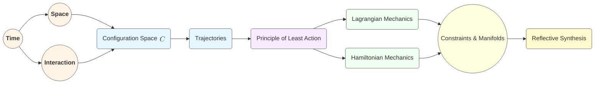

# Classical Mechanics Reborn: A Radical Reconstruction from First Principles
* * *

--- In the void, we dare to create anew.

# Chapter 1. The Void: Emergence of Core Concepts

Epigraph: *“Every great structure begins in emptiness.”*

In this opening chapter, we imagine stepping into a formless expanse—no preconceived laws, no standard frameworks, no inherited repertoire of Newtonian mechanics or advanced formalisms. Our mission is to plant the seeds from which a fully fleshed-out classical mechanics might grow. We introduce three primal concepts that serve as the bedrock of every mechanical theory:  
- Time  
- Space  
- Interaction  

By approaching them with a fresh mind—one cleared of traditional definitions—we gain a perspective that is both radically simple and fertile, capable of generating the full tapestry of classical mechanics from within. Below, we examine each concept in turn, then describe how they begin to coalesce into the notion of “physical systems.”

## 1.1 Time as the Foundational Ingredient

**Goal**: Define time $t$ as the one-dimensional continuum marking evolution.  
**Summary**: Presents time as the inevitable parameter for all change. We motivate time’s role in describing motion before introducing spatial or dynamic concepts.

1. **Motivating the Idea of Time**  
   Without time, the concept of “change” would be meaningless. In our blank slate approach, we first acknowledge an evolving “now”—a sequence of instants forming a continuum $t \in \mathbb{R}$. This continuum is not assumed to be discrete nor necessarily “absolute” in a Newtonian sense; yet we need some measure to distinguish “before” and “after.”  
   
2. **Time as a Constructive Continuum**  
   Drawing a subtle parallel to intuitionist views in mathematics, we can imagine time as constructed moment by moment. Each instant $t$ emerges as an index labeling the unfolding of existence. Regardless of deeper philosophical questions (whether time flows or we navigate a block universe), we treat $t$ as a parameter that allows us to encode sequences of events.  
   
3. **Implications for Dynamics**  
   Though we do not yet speak of forces or motion, time’s arrow already hints that our coming framework will involve derivatives $\frac{d}{dt}$ or integrals $\int \ldots dt$. These are the formal ways we capture the passage from one state to the next. Even reduced to emptiness, time remains the loom on which we weave the tapestry of mechanics.  

As we progress, time becomes the reference for change—a unidimensional thread that all physical events must share. From this vantage point, we can then ask: “Where do these events occur, and what changes?”

## 1.2 Space: The Arena of Existence

**Goal**: Introduce the idea of space $\mathcal{S}$ in which objects “live.”  
**Summary**: Discuss how space logically follows once we allow that change must have a location. We bring in minimal geometric intuition, leaving dimension general to highlight how the same concept extends from $\mathbb{R}^1$ to $\mathbb{R}^n$.

1. **Transitioning from Time to Space**  
   While time labels the “when” of events, we also need a “where.” If we allow that phenomena occur “somewhere,” it becomes natural to posit a manifold $\mathcal{S}$ whose points track possible positions. These positions are not necessarily $\mathbb{R}^3$ or even finite-dimensional; but classical mechanics traditionally assumes $\mathcal{S} \subseteq \mathbb{R}^n$ for some integer $n$.  

2. **The Minimal Geometric Intuition**  
   - **Dimensionality**: We typically let $\mathcal{S} \simeq \mathbb{R}^n$, though advanced applications (e.g., robotic linkages, continuum media) may require more sophisticated manifolds.  
   - **Distance or Metric**: We may or may not initially endow $\mathcal{S}$ with a metric. Classical mechanics often relies on Euclidean geometry, but we could remain open to more general structures (like curved spaces in general relativity, though that lies beyond strict “classical” scope).  
   - **Topological Continuum**: Our approach emphasizes continuity; points in $\mathcal{S}$ are infinitely close to each other in some sense, mirroring how time was also taken to be continuous.  

3. **Space as Physical Context**  
   By itself, $\mathcal{S}$ is just an “arena.” Nothing compels an object to move or remain at rest. Our impetus is to keep this concept minimal—merely an abstract container, ready to be filled with physical interpretation once we introduce “interactions.”  

Thus, pairing time $t$ with space $\mathcal{S}$ is the first step toward describing “where” and “when.” But we still lack any sense of “why” or “how.” That role is played by the next concept, “Interaction.”

## 1.3 Interaction and the Concept of Physical Systems

**Goal**: Introduce the notion of a system and interactions as fundamental building blocks of mechanics.  
**Summary**: Propose that “forces” or “influences” can be replaced by a more abstract notion of “interactions,” which glue together time, space, and matter into a meaningful dynamic framework.

1. **Why Interactions?**  
   In classical treatments, we typically say forces drive motion. But from a deeper vantage, “force” is just one manifestation of a broader idea: that diverse elements of the universe exert influences on one another. We refer to these influences as “interactions.” Formally, an interaction could be gravitational, electromagnetic, or symbolic (if we were to model information exchange)—the key is that something causes or guides change.  

2. **Systems as Defined by Interactions**  
   We define a *physical system* as an entity (or coupled set of entities) that can be isolated conceptually by specifying:  
   $$
   \text{System} = \{\text{set of degrees of freedom in space } \mathcal{S}\} \;+\; \{\text{interaction rules}\}.
   $$  
   Interactions might specify how the system’s “points” in space respond to changes in time, often formulated as differential equations or action principles (discussed in later chapters).  

3. **From Interaction to Equations of Motion**  
   Although we have not yet introduced equations of motion, this concept of interaction foreshadows them. Eventually, we will say:  
   $$
   \frac{d}{dt}(\text{System’s state}) = \text{Interaction}( \text{System’s state}, t ).
   $$  
   Whether we call that “force,” “potential,” or a “constraint,” it is simply a governed relationship that dictates how the system evolves within the arena of space as time progresses.

4. **The Bridge Toward Measurable Dynamics**  
   The introduction of interaction invites the notion of *cause and effect* in time. It suggests that “the next moment” is not arbitrary but follows from how the system’s state couples to its environment or internal structures. In the subsequent chapters, we will formalize these ideas via the principle of least action, eventually revealing how Lagrangian or Hamiltonian mechanics encapsulate these interactions in an elegant formal apparatus.  

## 1.4 Relation to Other Chapters

This chapter lays the groundwork for everything that follows. By proposing **Time**, **Space**, and **Interaction** as the base triad, we form the conceptual nucleus whose expansions—in the form of configurations, actions, constraints, etc.—will shape the entire edifice of classical mechanics. Chapter 2 will build upon these ideas by introducing the *configuration space* $\mathcal{C}$ and the notion of *trajectories* in time, ultimately leading to the principle of least action and beyond.

> We start with emptiness and a handful of simple ideas, but from these seeds: a universe of classical mechanics will bloom.

# Chapter 2. From Configurations to Trajectories

Epigraph: *“Motion is meaning in the flow of time.”*

In the previous chapter, we laid out three fundamental building blocks—Time, Space, and Interaction—within a blank conceptual field. Now we move one layer outward, introducing the notion of a “configuration” and explaining how such configurations evolve over time to form trajectories. These two pillars—configuration spaces and kinematics—will be the launching pad for deeper formalisms in classical mechanics.

## 2.1 Configuration Space $\mathcal{C}$

**Goal**: Define the concept of configuration as the minimal specification of a system’s instantaneous state.  
**Summary**: We build $\mathcal{C}$ from the fundamental triad (Time, Space, Interaction). Each point in $\mathcal{C}$ captures the system’s arrangement, bridging the static concept of “position” with the dynamic idea of “change.”

1. **Bridging Space and System**  
   Whereas Chapter 1 treated $\mathcal{S}$ (space) as an abstract arena, a physical system typically has distinguishable parts—particles, rigid bodies, or generalized coordinates. To describe the *entire* system in one snapshot, we collect all relevant positions and orientations into a single “configuration.” For $N$ point particles in $\mathbb{R}^3$, for example, a single configuration might be  
   $$
     \mathbf{q} \;=\; \left( x_1, y_1, z_1,\;\dots,\; x_N, y_N, z_N \right).
   $$  
   More complex systems—rigid bodies, robots with joints, fields—each require their own adapted coordinates. But in all cases, a *configuration* is the minimal set of variables needed to specify the system at a given instant in time.

2. **From Single Positions to a Unified Space**  
   We thus define the *configuration space* $\mathcal{C}$ as:
   $$
     \mathcal{C} \;=\; \{\text{all possible configurations } \mathbf{q}\}.
   $$
   - In simple cases, $\mathcal{C}$ is isomorphic to $\mathbb{R}^n$.  
   - In more specialized systems (e.g., a pendulum), $\mathcal{C}$ can look like a circle $S^1$.  
   - For a multi-joint robotic arm, $\mathcal{C}$ can be a product of multiple angles (often $(S^1)^k$).  
   - In continuum systems (like fluids or fields), $\mathcal{C}$ becomes an infinite-dimensional space of function configurations.

   Crucially, $\mathcal{C}$ is where a system “lives in an instant,” embodying how the fundamental triad (Time, Space, Interaction) is realized concretely: *the system’s location in real space, influenced by the nature of its parts and how they may connect or constrain one another*.

3. **Constraints and Degrees of Freedom**  
   Not every point in $\mathcal{S}^N$ (the naive Cartesian product of all positions) may be valid. Constraints—whether geometric, holonomic, or arising from interactions—can reduce the dimension. Hence, $\mathcal{C}$ is often a manifold cut out by constraints embedded in a larger ambient space. We postpone a detailed discussion of constraints until Chapter 5, but it is worth noting that $\mathcal{C}$ is as large (or as small) as the system’s rules dictate.

4. **Dynamic Potential of a Configuration**  
   A single configuration is static in nature—just a freeze-frame. Yet we sense that each configuration implicitly “hints” at how the system *could move* if we let time progress. To formalize this progression, we now shift from the static notion of a point in $\mathcal{C}$ to the dynamic idea of a *trajectory.*

## 2.2 Trajectories and Kinematics

**Goal**: Show how a trajectory $\gamma(t)\in\mathcal{C}$ is a path in configuration space parameterized by time.  
**Summary**: Discuss how trajectories encode motion. This provides a purely geometric viewpoint for kinematics before forces or energy are introduced.

1. **Definition of a Trajectory**  
   A *trajectory* is a function
   $$
     \gamma : \mathbb{R} \;\rightarrow\; \mathcal{C},
     \quad t \;\mapsto\; \gamma(t),
   $$
   where $t$ is the time parameter and $\gamma(t)$ is the system’s configuration at that instant. Each point of the map is a valid $\mathbf{q}\in\mathcal{C}$. Conceptually, $\gamma(t)$ traces out a “curve” through configuration space as time advances.

2. **Kinematics: Motion Without Forces**  
   At this stage, we are describing *how* a system moves without yet explaining *why*. This purely geometric viewpoint—studying $\gamma(t)$ for its own sake—constitutes *kinematics*:  
   - *Position* in $\mathcal{C}$ at time $t$.  
   - *Velocity* as the derivative $\dot{\gamma}(t)$.  
   - *Acceleration* as the second derivative $\ddot{\gamma}(t)$.  

   These concepts apply even if we do not specify the forces or constraints that generated the motion.

3. **Intrinsic vs. Extrinsic Descriptions**  
   - **Intrinsic approach**: $\mathcal{C}$ is viewed as a manifold, so *velocity* is a tangent vector in $T_{\gamma(t)}\mathcal{C}$, and *acceleration* is a second derivative in the tangent bundle. This perspective sets the stage for modern differential geometry in mechanics.  
   - **Extrinsic approach**: If $\mathcal{C} \subseteq \mathbb{R}^n$, kinematic quantities can be viewed as vectors in $\mathbb{R}^n$.  

   Both pictures converge on the idea that a trajectory is the system’s path in a structured space. We preserve the geometric viewpoint so we can later access powerful concepts like Lagrangian/Hamiltonian formalisms and symplectic geometry.

4. **Links to Future Structures**  
   - **Velocity and the Action Principle**: Although we have not yet introduced the *action functional*, note that *velocity* $\dot{\gamma}(t)$ will soon appear in expressions like the Lagrangian $L(\mathbf{q}, \dot{\mathbf{q}}, t)$.  
   - **Possible vs. Actual Trajectories**: A key theme in later chapters is that many conceivable paths might exist in $\mathcal{C}$, but only certain *actual* trajectories are followed. The *Principle of Least Action* (Chapter 3) will highlight which path nature “chooses.”  
   - **Phase Space**: Once velocities ($\dot{\mathbf{q}}$) are recognized as essential variables, we will naturally evolve into the concept of generalized momenta and ultimately the *phase space* (Chapter 4).

## 2.3 Relation to Other Chapters

This chapter marks our transition from the bare fundamentals of Chapter 1 to the more structured frameworks soon to come:
- We **initiated** the concept of *configurations* $\mathbf{q}$, setting the stage for the Lagrangian $L(\mathbf{q},\dot{\mathbf{q}},t)$.
- We **connected** the notion of *trajectories* to the abstract spaces introduced earlier (Time, Space, Interaction) without yet imposing force laws or external constraints.  
- Chapters 3 and 4 will **build upon** this idea by introducing the action principle and culminating in Lagrangian/Hamiltonian mechanics.

With configurations and trajectories in hand, we now stand ready to tackle the question of *which* trajectories nature prefers—enter the Principle of Least Action.

# Chapter 3. The Principle of Least Action & Variational Methods

Epigraph: *“Where reason sleeps, nature draws the shortest path.”*

Having laid the groundwork of Time, Space, Interaction (Chapter 1) and introduced the concept of trajectories in a configuration space (Chapter 2), we now arrive at a seminal pillar of classical mechanics: **The Principle of Least Action**. This chapter explores how nature’s choice of trajectory can be cast as an extremization problem—leading to the deep and unifying formalism of Lagrangian mechanics. We begin by defining the action functional itself, then show how making that functional “stationary” yields the Euler–Lagrange equations, and finally discuss how this principle generalizes beyond simple systems, even into field theory.

## 3.1 The Action Functional

**Goal**: Define the action $\mathcal{A}[\gamma]$ for a trajectory $\gamma$.  
**Summary**: Motivate why a functional $\mathcal{A}[\gamma]$ measuring the “cost” or “effort” of a path is natural. We connect it to the emergent idea of “physical laws” as constraints shaped by interactions.

1. **From Trajectories to Functionals**  
   In Chapter 2, we confronted the geometric notion that a physical system’s motion is a “path” $\gamma(t)$ through its configuration space $\mathcal{C}$. Intuitively, nature’s path is neither arbitrary nor random: there is something optimizing or extremizing about actual motions. To encode this intuition, we assign to each path $\gamma$ a scalar measure $\mathcal{A}[\gamma]$ called the *action*.  

2. **Physical Intuition for $\mathcal{A}[\gamma]$**  
   Historically introduced by Maupertuis, Euler, and Lagrange, the action can be interpreted as an “effort” or “cost” integral. A simple example is the classical *kinetic minus potential energy* integral:  
   $$
     \mathcal{A}[\gamma]
       \;=\;\int_{t_1}^{t_2}\,\left[T(\mathbf{q},\dot{\mathbf{q}})\;-\;V(\mathbf{q})\right]\,dt,
   $$  
   where $T$ is the kinetic energy and $V$ the potential energy. One can generalize this idea to other definitions depending on the physical situation. Regardless of the specific form, we conceive of $\mathcal{A}[\gamma]$ as arising from the *interactions* introduced in Chapter 1.  

3. **Emergence from Time, Space, Interaction**  
   - **Time** provides the integration variable.  
   - **Space** (through $\mathbf{q}$) specifies the system’s possible positions.  
   - **Interaction** enters through the choice of $T$ and $V$—or more abstractly, a Lagrangian $L(\mathbf{q},\dot{\mathbf{q}},t)$—reflecting how forces or fields shape the system’s evolution.  
   Thus, the action integrates the influences of these three fundamentals along a proposed path.

4. **Universal vs. Context-Dependent**  
   While the principle of least (or stationary) action remains universal in classical mechanics, the specific functional form of $\mathcal{A}$ depends on the physical context. Notably, *any* consistent model that evolves from the triad (Time, Space, Interaction) can often be recast into an action principle.

## 3.2 Variational Principles

**Goal**: Introduce the calculus of variations and see how $\delta \mathcal{A}=0$ leads to Euler–Lagrange equations.  
**Summary**: Start from nothing beyond a generic action integral, show how requiring a stationary action yields equations governing trajectories.

1. **Stationary Action**  
   The Principle of Least Action (PLA) is sometimes stated as “nature seeks the path that minimizes the action,” but more precisely, *stationary* action means  
   $$
     \delta \mathcal{A}[\gamma] \;=\; 0,
   $$  
   subject to fixed boundary conditions $\mathbf{q}(t_1)$ and $\mathbf{q}(t_2)$. Mathematically, this means small variations of the path do *not* alter $\mathcal{A}$ to first order.

2. **Euler–Lagrange Equations**  
   By applying the calculus of variations to a Lagrangian $L(\mathbf{q}, \dot{\mathbf{q}}, t)$, one obtains the **Euler–Lagrange equations**:
   $$
     \frac{d}{dt}\left(\frac{\partial L}{\partial \dot{\mathbf{q}}}\right)
       \;-\;\frac{\partial L}{\partial \mathbf{q}}
       \;=\;\mathbf{0}.
   $$  
   These equations effectively *select* valid trajectories from the infinite set of possible $\gamma(t)$. Remarkably, this formal statement encapsulates Newton’s laws in many standard scenarios, but it does so from a more profound vantage: motion emerges from an extremal principle rather than an explicit force-balance approach.

3. **Geometric & Conceptual Insights**  
   - **Natural Extension of Chapter 2**: Once we acknowledge that the system can take myriad paths in $\mathcal{C}$, the action principle is a next-level “filter” that chooses which path is physically realized.  
   - **Equivalent to Newton’s Second Law (in many cases)**: In typical mechanics textbooks, Euler–Lagrange equations can be rearranged to yield $m\ddot{\mathbf{x}} = -\nabla V(\mathbf{x})$. But the PLA viewpoint clarifies that *energy*, *momentum*, and *constraints* are integrated within one variational statement.  
   - **Mathematical Efficiency**: The parametric freedom in $L$ (kinetic minus potential, or more exotic forms) makes the action formalism surprisingly flexible for coupling multiple influences—gravity, electromagnetic fields, constraints, etc.—in a single expression.

4. **Beyond Minimization**  
   While the principle is historically called “least action,” in many cases the path yields a local extremum or even a saddle point. Strict minimization can fail to capture certain realistic motions (e.g., in field theories or with boundary conditions). Hence, “principle of stationary action” or “extremal action” is more precise.

## 3.3 Physical Meaning and Generalizations

**Goal**: Explore how the notion of Lagrangian $L(q,\dot{q},t)$ emerges, and how this framework extends from simple systems to fields.  
**Summary**: Emphasize the conceptual leap—forces become secondary. The “Lagrangian viewpoint” arises from this variational approach.

1. **The Lagrangian as Core Descriptor**  
   In practical mechanics, we define the action by specifying a Lagrangian:
   $$
     \mathcal{A}[\gamma]
       \;=\;\int_{t_1}^{t_2}\,L\left(\mathbf{q}(t),\,\dot{\mathbf{q}}(t),\,t\right)\,dt.
   $$
   The Lagrangian typically captures kinetic minus potential energy ($L = T - V$) in elementary mechanics, but more sophisticated forms incorporate constraints, generalized potentials (like gauge fields in electromagnetism), or even dissipative terms (with some caution in purely conservative approaches).

2. **Forces Become Derived Quantities**  
   Rather than postulating “$\mathbf{F}=m\mathbf{a}$” from the start, the Lagrangian approach sees *force* as a manifestation of the potential gradient (if the system is conservative) or as partial derivatives of the Lagrangian with respect to coordinates. This viewpoint demotes force from a fundamental axiom to an emergent concept within the variational scheme.

3. **Field Theories & Continuum Mechanics**  
   The same principle extends seamlessly to field theories—e.g., in electromagnetism, the Lagrangian density $\mathcal{L}(\phi, \partial_\mu \phi)$ is integrated over spacetime, and its stationary variation yields Maxwell’s equations. In continuum mechanics as well, one treats fields of displacements or densities, applying a variational principle to derive the governing PDEs. Thus, the Lagrangian viewpoint scales from particle-based systems to fields spanning dimensions higher than $1$.

4. **Conceptual Leap**  
   - **Unity & Elegance**: The PLA merges geometric intuition (paths in $\mathcal{C}$) and algebraic formalism (functional variation) into one powerful statement.  
   - **Future Path to Hamiltonian**: Introducing momenta $p_i = \frac{\partial L}{\partial \dot{q}_i}$ sets the stage for the *Legendre transform* and *Hamiltonian mechanics* (Chapter 4).  
   - **Ties to Symmetry**: A natural byproduct of Lagrangian methods is Noether’s theorem, which connects symmetries of $L$ to conserved quantities (energy, momentum, angular momentum). Although we do not detail it here, symmetry-based reasoning will reappear in advanced contexts.

## 3.4 Relation to Other Chapters

Chapter 3 seamlessly integrates with everything prior and provides the conceptual engine for everything to follow:

- **Chapter 1 & 2**: Gave us the underlying triad—Time, Space, Interaction—and the possibility of multiple trajectories in $\mathcal{C}$.  
- **Chapter 3**: Declares *how* nature selects among those trajectories: by requiring the action to be stationary (Principle of Least Action).  
- **Future Directions**: Chapter 4 will express these same dynamics in a Hamiltonian framework, revealing additional geometric insights (symplectic structure, canonical transformations). Ultimately, constraints and advanced manifolds (Chapter 5) and broader perspectives (Chapter 6) all rest on the bedrock provided by the action principle.

Thus, the action principle stands as a unifying thread through classical mechanics—an elegant lens through which we see that beneath every specific force law or potential, the deep logic of motion is governed by a variational rule that we can summarize in just a few lines of mathematics.

# Chapter 4. Analytical Frameworks: Lagrangian and Hamiltonian Mechanics

Epigraph: *“Two perspectives, one reality: the path and its unfolding.”*

In previous chapters, we established how physical systems can be viewed through the lens of time, space, and interaction—leading to trajectories in configuration space governed by the principle of stationary action. Chapter 4 now explores two major analytical formalisms that bring these ideas into full mathematical clarity: Lagrangian mechanics and Hamiltonian mechanics. Although they rest upon the same underlying principles, each framework provides its own distinct perspective, unifying into a grand geometric view of classical motion.

## 4.1 Lagrangian Mechanics Revisited

**Goal**: Re-derive the Lagrangian equations more formally and discuss their structure (generalized coordinates, constraints).  
**Summary**: Show how the Euler–Lagrange equations become an established system of ODEs in $\mathcal{C}$. Highlight the geometric viewpoint and the role of generalized momenta.

1. **Generalized Coordinates and Degrees of Freedom**  
   In Chapter 2, we introduced $\mathcal{C}$ as the set of all possible configurations. A point in $\mathcal{C}$ can be described by generalized coordinates $(q_1, q_2, \dots, q_n)$, where $n$ is the number of degrees of freedom after accounting for constraints.  
   - Constraints (holonomic or otherwise) reduce the effective dimension of this space. Even so, the Lagrangian formulation seamlessly incorporates them by using appropriate coordinate sets or Lagrange multipliers (discussed more thoroughly in Chapter 5).  

2. **Formal Statement of Euler–Lagrange Equations**  
   Recall that from the action principle $\delta \mathcal{A} = 0$, we derive the Euler–Lagrange equations for each generalized coordinate $q_i$:
   $$
     \frac{d}{dt}\biggl(\frac{\partial L}{\partial \dot{q}_i}\biggr)
       \;-\;\frac{\partial L}{\partial q_i}
       \;=\;0,
   $$
   where $L(q, \dot{q}, t)$ is the Lagrangian. These equations form a system of coupled ordinary differential equations in $(q_1(t), \dots, q_n(t))$.  

3. **Geometric Structure in Configuration Space**  
   - Each trajectory $\gamma(t)$ in $\mathcal{C}$ now satisfies this system, effectively giving us the system’s *equations of motion.*  
   - The partial derivatives $\frac{\partial L}{\partial \dot{q}_i}$ introduce **generalized momenta** $p_i$, bridging the gap to Hamiltonian mechanics.  
   - Because $L$ is typically *kinetic minus potential* (or a more general form), its structure encodes how interactions (forces, constraints) manifest in each coordinate direction.

4. **Beyond Newton’s Vector Form**  
   It is worth reiterating that Newton’s $\mathbf{F} = m\mathbf{a}$ emerges naturally as one special case where $L = T - V$. But in more complex settings—e.g., rotating frames, coupled oscillators, or fields—the Lagrangian approach still holds by systematically tracking energies and constraints rather than requiring a direct force-balance statement.  

5. **Constraints and Lagrange Multipliers**  
   While details come later (Chapter 5), one highlight of Lagrangian mechanics is its clean method of handling constraints through Lagrange multipliers. Instead of separately imposing each constraint, we incorporate them right into the action principle, ensuring that only valid trajectories (in compliance with constraints) are singled out by $\delta \mathcal{A} = 0$.  

Thus, Lagrangian mechanics gives us a potent perspective: equations of motion arise from an extremal principle applied to a carefully constructed function $L$. Yet this is only one viewpoint. We now turn to a complementary framework, revealing new geometric and conceptual depths in classical mechanics.

## 4.2 Hamiltonian Mechanics: A Dual View

**Goal**: Present the Legendre transform from Lagrangian $L$ to Hamiltonian $H$.  
**Summary**: Move from configuration-velocity space $(q,\dot{q})$ to phase space $(q,p)$. Emphasize how Hamiltonian flows encode time evolution and unify energy viewpoints.

1. **Legendre Transform: From $L$ to $H$**  
   The hallmark of Hamiltonian mechanics is the transition from $(q,\dot{q})$ to a new set of variables $(q,p)$, where $p_i$ (the generalized momenta) is defined by
   $$
     p_i \;=\;\frac{\partial L}{\partial \dot{q}_i}.
   $$
   We then define the **Hamiltonian** $H$ as the Legendre transform:
   $$
     H(q,p,t) \;=\;\sum_{i=1}^{n} p_i\,\dot{q}_i \;-\;L(q,\dot{q},t).
   $$
   Provided $L$ is “regular” (i.e., invertible with respect to $\dot{q}$), the velocities $\dot{q}(p,q)$ can be solved in terms of $(p,q)$.

2. **Phase Space and Hamilton’s Equations**  
   Once we adopt $(q,p)$ as the fundamental variables, the system evolves in the **phase space** $T^*\mathcal{C}$. The canonical Hamilton’s equations follow:
   $$
     \dot{q}_i \;=\;\frac{\partial H}{\partial p_i}, 
     \qquad
     \dot{p}_i \;=\;-\frac{\partial H}{\partial q_i}.
   $$
   - This dual formulation trades direct reference to velocities for a momentum-based approach.  
   - Often, $H$ corresponds to the total energy $T + V$ in conservative systems, but not always (e.g., time-dependent potentials or non-conservative forces can complicate this interpretation).

3. **Energy-Centric Perspective**  
   By placing $H$ at the center, Hamiltonian mechanics highlights energy as a central organizing principle. In many classical systems, $H$ is conserved if it does not explicitly depend on $t$. This leads directly to powerful results concerning equilibrium, stability, and integrable dynamics.

4. **Advantages Over Lagrangian Mechanics**  
   - **Direct PDE Form**: Hamilton’s equations can be seen as a first-order system of PDEs in $(q,p)$, sometimes more amenable to phase-space analysis.  
   - **Canonical Transformations**: The notion of “change of variables” extends to canonical transformations preserving the phase-space structure—one of the conceptual jewels of Hamiltonian mechanics.  
   - **Broader Symmetry Insight**: Hamiltonian flow on phase space naturally pairs with symplectic geometry (Section 4.3), linking mechanics to powerful concepts in advanced mathematics.

## 4.3 Symplectic Geometry & Phase Space

**Goal**: Uncover the deeper geometric structure behind Hamiltonian mechanics.  
**Summary**: Introduce the symplectic form $\omega$, Hamiltonian vector fields, and the notion of canonical transformations, showing that mechanics is fundamentally a geometry of flows on $2n$-dimensional manifolds.

1. **The Symplectic Form**  
   The central object in Hamiltonian geometry is a **closed, non-degenerate 2-form** $\omega$ on phase space $T^*\mathcal{C}$. In standard coordinates $(q_i, p_i)$, this is often written as
   $$
     \omega \;=\;\sum_{i=1}^{n} \,dq_i \wedge dp_i.
   $$
   - Non-degeneracy ensures $\omega$ pairs velocity directions in a meaningful way, reflecting the coupling between $q$ and $p$.  
   - Closure ($d\omega = 0$) implies the geometry is free of “twists,” enabling globally consistent definitions of canonical transformations.

2. **Hamiltonian Vector Fields**  
   If $H(q,p)$ is a real-valued function on phase space, then *Hamilton’s equations* can be viewed intrinsically as the flow generated by the **Hamiltonian vector field** $X_H$:
   $$
     \iota_{X_H}\,\omega \;=\; dH.
   $$
   Here, $\iota_{X_H}\,\omega$ denotes the interior product of $X_H$ with the symplectic form $\omega$. This compact statement elegantly encapsulates how the system evolves in phase space according to $H$.  

3. **Canonical Transformations**  
   A transformation in phase space is *canonical* if it preserves $\omega$. In coordinates, it preserves the fundamental Poisson brackets:
   $$
     \{q_i, p_j\} \;=\;\delta_{ij}, 
     \quad
     \{q_i, q_j\} \;=\;\{p_i, p_j\} \;=\;0.
   $$
   - Canonical transformations are the Hamiltonian analog of orthogonal transformations in Euclidean geometry, but here they respect symplectic structure.  
   - This concept explains how certain complicated problems in mechanics can be simplified by a clever change of variables that “untangles” the dynamics while leaving the underlying physics intact.

4. **Why Symplectic Geometry Matters**  
   - **Unifying Mathematics and Mechanics**: Symplectic geometry frames classical mechanics within a modern mathematical language, linking it to topology, differential geometry, and even quantum theory via geometric quantization.  
   - **Global Perspectives**: While local computations of Hamilton’s equations can suffice in small neighborhoods, truly understanding integrable systems, chaotic flows, or orbital resonances often requires a global viewpoint. Symplectic geometry offers the right conceptual tools.  

## 4.4 Relation to Other Chapters

Chapter 4 completes the core theoretical columns of classical mechanics by presenting Lagrangian and Hamiltonian mechanics not as two disjoint methods, but as two complementary facets of the same deeper principle—extremal action in time leads to an elegant geometry in phase space. Together, they connect:

- **Chapters 1–3**: Provide the fundamental triad (Time, Space, Interaction) and the principle of stationary action.  
- **Chapter 4**: Demonstrates how these principles manifest in system dynamics (Lagrangian) and the geometry of phase space (Hamiltonian).  
- **Chapters 5–6**: Will build on these frameworks to incorporate constraints, manifold structures, and advanced topics—ultimately positioning classical mechanics as a living, evolving conceptual structure, continually open to reinterpretation and extension.

In short, Lagrangian and Hamiltonian mechanics stand as two perspectives on a single reality, illuminating how nature’s paths unfold in time while unveiling the deeper geometric symmetries and conservation laws that shape those paths.

# Chapter 5. Constraints, Manifolds, and Complex Systems

Epigraph: *“When constraints bind, new degrees of freedom arise in disguise.”*

Having surveyed the power of the Lagrangian and Hamiltonian formalisms, we now confront the real-world complexities that often arise in mechanical systems: constraints. These may take the form of rigid links (e.g., robotic arms), rolling contacts (e.g., wheels on a surface), or other geometric and dynamical restrictions. Far from being a mere technicality, constraints force us to reconsider the shape of configuration and phase spaces themselves. In this chapter, we explore two threads:

1. How constraints reduce dimensionality, turning once-free spaces into manifolds of possible motions.  
2. How the broader language of fiber bundles (tangent and cotangent bundles) naturally extends our reconstruction of mechanics.  

Through these perspectives, we see that constraints not only limit motion but can also reveal new and elegant geometrical structures that unify complex systems under the same principles introduced in Chapter 1—Time, Space, and Interaction.

## 5.1 Constraints and Reduced Spaces

**Goal**: Demonstrate how constraints reduce dimensionality and produce manifolds of possible motions.  
**Summary**: Both holonomic and nonholonomic constraints are reconsidered in the fresh perspective of “emergent geometry” shaped by the interactions introduced in Chapter 1.

1. **Holonomic vs. Nonholonomic Constraints**  
   - A **holonomic constraint** can be expressed as an algebraic (or differential) condition integrable into a function  
     $$
       f\left(q_1,\dots,q_n,t\right) = 0,
     $$  
    directly restricting the coordinates $q_i$. These constraints typically reduce the dimension of the configuration space $\mathcal{C}$ to a submanifold $\mathcal{C}'\subset \mathcal{C}$.  
   - A **nonholonomic constraint** arises when the constraint cannot be expressed purely as $f(\mathbf{q}, t)=0$ but instead as a non-integrable differential relationship, such as  
     $$
       a_1(q)\,dq_1 \;+\;\dots\;+\;a_n(q)\,dq_n \;=\;0,
     $$  
    without a global function $f$. This typically reduces allowable *directions* of motion without necessarily defining a lower-dimensional manifold in the same straightforward way. Rolling constraints (e.g., a wheel rolling on a plane) are a classic example.

2. **Configuration Space Under Constraints**  
   From our “blank slate” vantage, each constraint effectively “carves out” a legitimate region of the original configuration space $\mathcal{C}$. In the holonomic case, we might define  
   $$
     \mathcal{C}' \;=\;\left\{\mathbf{q}\in \mathcal{C}\,\middle|\;f(\mathbf{q},t)=0\right\}, 
   $$  
   forming a submanifold. In nonholonomic situations, the feasible trajectories flow through $\mathcal{C}$ with additional velocity-level restrictions; the space of “reachable velocities” is thus a distribution of directions rather than a simple submanifold.

3. **Emergent Geometry**  
   - **Submanifolds and Embeddings**: A holonomic constraint yields an embedded submanifold $\mathcal{C}'\subseteq \mathcal{C}$. Motion must remain in $\mathcal{C}'$, creating an “effective” configuration space that is lower-dimensional but still governed by the same variational principles (Chapters 3 and 4).  
   - **Nonholonomic Distributions**: In nonholonomic systems, geometric structures known as *distributions* arise. These distributions specify which directions in the tangent space $T_{\mathbf{q}}\mathcal{C}$ are allowed for instantaneous motion. A distribution that fails to integrate into submanifolds leads to phenomena such as *rolling without slipping* or *drifting motion*, reflecting how real systems can flow into new regions of $\mathcal{C}$ that are not captured by a single simple constraint equation.

4. **Implications for Equations of Motion**  
   The Lagrangian or Hamiltonian formalisms (Chapter 4) can incorporate constraints via Lagrange multipliers (holonomic) or generalized methods (nonholonomic). In each case, the effective “reduced” equations respect the geometric character of the constraints. From a global viewpoint, these constraints reorder how we see the feasible paths in $\mathcal{C}$ or in phase space $T^*\mathcal{C}$, revealing motion that might be unexpected from a naive coordinate perspective.  

In short, constraints do more than limit motion: they reshape the geometry of the system’s possible evolution, sometimes simplifying or complicating the analysis. This leads us naturally to the notion of tangent and cotangent bundles—tools that unify how we represent velocities, momenta, and constraints within a single elegant structure.

## 5.2 Fiber Bundles across Mechanics

**Goal**: Generalize configuration and phase spaces to tangent/cotangent bundles.  
**Summary**: Explore how advanced manifold concepts (tangent bundle $T\mathcal{C}$, cotangent bundle $T^*\mathcal{C}$) arise naturally within the reconstruction.

1. **Tangent Bundles and Kinematics**  
   The **tangent bundle** $T\mathcal{C}$ is formed by attaching to each point $\mathbf{q}\in \mathcal{C}$ its tangent space $T_{\mathbf{q}}\mathcal{C}$. Physically, this captures *all possible velocities* at each configuration, enabling a more intrinsic description of motion:  
   $$
     T\mathcal{C} \;=\;\{\left(\mathbf{q},\dot{\mathbf{q}}\right) \;\mid\;\mathbf{q}\in \mathcal{C},\;\dot{\mathbf{q}}\in T_{\mathbf{q}}\mathcal{C}\}. 
   $$  
   - **Connection to Lagrangian Mechanics**: The Lagrangian $L(\mathbf{q},\dot{\mathbf{q}},t)$ is naturally a function on $T\mathcal{C}\times \mathbb{R}$. Each velocity vector $\dot{\mathbf{q}}$ belongs to the tangent space, making the tangent bundle the natural home for Lagrangian dynamics.

2. **Cotangent Bundles and Phase Space**  
   The **cotangent bundle** $T^*\mathcal{C}$ arises by attaching the dual space $T^*_{\mathbf{q}}\mathcal{C}$ (linear functionals on $T_{\mathbf{q}}\mathcal{C}$) to each $\mathbf{q}$. Coordinates $(q,p)$ in $T^*\mathcal{C}$ correspond to generalized positions $q$ and generalized momenta $p$.  
   - **Hamiltonian Mechanics**: As seen in Chapter 4, Hamilton’s equations live most naturally in $T^*\mathcal{C}$. The symplectic form $\omega$ is a 2-form on this cotangent bundle, giving it the canonical structure that underlies Hamiltonian flows and canonical transformations.

3. **Constraints and Fiber Bundles**  
   When constraints exist, we often deal with sub-bundles or reduced bundles—a portion of $T\mathcal{C}$ or $T^*\mathcal{C}$ consistent with the constraint geometry. For instance, with holonomic constraints, we can define a tangential sub-bundle that only includes velocity vectors valid for the submanifold $\mathcal{C}'$. Nonholonomic constraints lead to more complex pictures—a distribution living in $T\mathcal{C}$ that does not integrate neatly into a submanifold.

4. **Global Picture of Mechanics**  
   - **Unified by Bundles**: Whether we use Lagrangian or Hamiltonian methods, a manifold-based approach ensures that all relevant objects (configurations, velocities, momenta, constraints) fit into a coherent geometric tapestry.  
   - **Connection to Gauge Theories**: In advanced physics, the fiber-bundle viewpoint extends beyond classical mechanics to gauge fields, where local symmetries form fiber bundles over spacetime. The conceptual leap from mechanical constraints to field constraints is surprisingly natural once one embraces the manifold perspective.  
   - **Complex Systems**: Multi-component systems (robots, biological systems, granular media) often exhibit constraints that spontaneously emerge from friction, collisions, or interactions with the environment. By seeing these constraints as geometric conditions on $T\mathcal{C}$ or $T^*\mathcal{C}$, we gain a clearer sense of how “complex” behavior can follow from purely geometric constraints.

## 5.3 Relation to Other Chapters

Chapter 5 addresses the real-world wrinkles in classical mechanics—those that require us to move past simple, unconstrained motion and incorporate the manifold viewpoint:  
- **Earlier Chapters**: Provided the seeds for $\mathcal{C}$ and $T^*\mathcal{C}$. Constraints now refine or reshape these spaces into submanifolds or distributions.  
- **Chapter 6**: Will reflect on how these manifold-based insights generalize the entire classical framework, preparing us for potential leaps into advanced frontiers (e.g., continuum mechanics, robotics, or gauge theories).

Hence, constraints are no mere inconvenience: they highlight classical mechanics as a profoundly **geometric** discipline, in which limiting certain motions can surprisingly open the door to richer structural discoveries. In many ways, constraints are catalysts, compelling us to see that the spaces of motion, themselves, are evolving artifacts shaped by Time, Space, and Interaction.

# Chapter 6. Reflective Synthesis: Perspectives and Extensions

Epigraph: *“To see farther, look within the structure you have built.”*

Having traced classical mechanics from its barest conceptual elements (Time, Space, Interaction) through successively richer frameworks (configuration spaces, action principles, Lagrangian and Hamiltonian formalisms, constraints, and manifolds), we arrive at the final step: reflection and forward-looking perspectives. In this closing synthesis, we gather the conceptual threads scattered across previous chapters, showing how they interlock into a unified vision. We then open the doors to fresh realms, suggesting ways that this “ground-up” reconstruction can spark novel paradigms, from celestial mechanics to modern field theories.

## 6.1 Unified Vision

**Goal**: Summarize how all preceding layers unify under the triad (Time, Space, Interaction).  
**Summary**: Reflect on how each major result—Newtonian laws, Lagrangian mechanics, Hamiltonian mechanics—materializes from a single conceptual seed.

1. **Recap of Core Themes**  
   - **Time** as the rhythmic parameter of change, a continuum where all dynamic behavior unfolds.  
   - **Space** as the manifold of possible “positions,” generalized in dimension and curvature.  
   - **Interaction** as the binding thread giving rise to forces, potentials, or constraints—ultimately captured in the action functional and its variations.  
   These three foundational concepts erect the scaffold for everything else: from the simplest free particle to complex, coupled systems.

2. **Emergence of Classical Structures from a Few Axioms**  
   - **Trajectories**: In Chapter 2, we observed how motion can be seen as a path $\gamma(t)$ in configuration space, with or without external forces.  
   - **Variational Principles**: In Chapter 3, we introduced the action functional and showed how stationary action naturally yields equations of motion—ushering forces from an afterthought of the potential to a derived concept.  
   - **Lagrangian & Hamiltonian Formulations**: Chapter 4 reminded us that classical mechanics can be viewed as either (1) a path in configuration-velocity space with a Lagrangian, or (2) a flow in phase space with a Hamiltonian—two outlooks on the same underlying dynamics.  
   - **Constraints & Manifold Structures**: By Chapter 5, constraints further revealed that classical mechanics is geometry in action: constraints carve submanifolds or distributions within the bigger configuration/phase spaces, embedding complex real-world limitations into elegantly reduced structures.

3. **Conceptual Continuity**  
   None of these steps stands as an isolated invention. Each arises logically from the minimal triad (Time, Space, Interaction), making classical mechanics feel less like a patchwork of methods and more like a coherent story:  
   1) Identify how systems exist in space and time.  
   2) Specify how they interact (the Lagrangian or Hamiltonian).  
   3) Derive the resulting motion, mindful of constraints and geometry.  
   This storyline preserves a sense of “constructivist freedom”—we are building the laws, not merely enumerating them, highlighting mechanics as ongoing conceptual evolution.

4. **Newtonian Laws in the Broader Context**  
   As one final insight, note that Newton’s Second Law emerges as a special case—yet the deeper architecture includes far more general settings (non-inertial frames, field theories, advanced constraints, etc.). Indeed, the “laws of motion” are not simply taken for granted but reappear as the inevitable outcome of a well-chosen action principle built from Time, Space, and Interaction.

## 6.2 Doors to New Directions

**Goal**: Inspire advanced researchers to identify open problems or novel frameworks.  
**Summary**: Highlight how this radical “ground-up” perspective might lead to new lines of thought in celestial mechanics, continuum mechanics, or quantum transitions.

1. **Beyond Classical: Quantum and Statistical Mechanics**  
   Our triad-based approach can be extended into realms often treated as separate:  
   - **Quantum**: Many standard quantum formulations (path integrals, canonical quantization) can be viewed as a continuation of the variational spirit. Instead of a single classical path, we sum over all possible paths, introducing wavefunctions and operators.  
   - **Statistical**: In statistical mechanics, the idea of a configuration space broadens to phase space ensembles, allowing entropy, temperature, and partition functions to be interpreted as emergent concepts atop a classical foundation.  

2. **Celestial Mechanics and Nonlinearity**  
   - **N-body Gravitation**: Classical mechanics of multiple gravitational bodies remains an area rich in subtleties, chaos, and emergent patterns. The symplectic geometry lens from Chapter 4 and the manifold approach from Chapter 5 continue to reveal new structures such as resonances, Lagrange points, and KAM tori.  
   - **Chaos and Integrable Systems**: The boundary between integrable and chaotic dynamics is a frontier where Hamiltonian geometry meets real-world complexity. A “radical reconstruction” approach may yield alternative insights into how chaos emerges and how integrable limits appear.

3. **Continuum Mechanics and Field Theories**  
   - **Field Lagrangians**: Extending the Lagrangian concept to fields highlights how partial differential equations (e.g., wave equations, fluid equations) arise from an action principle in infinite-dimensional configuration spaces.  
   - **General Relativity**: Though it sits at the borderline between classical and relativistic frames, GR also emerges from a variational principle (Einstein–Hilbert action). The approach of building from geometric first principles can provide an especially clear path to understanding spacetime as a dynamical entity.

4. **Engineering and Robotics**  
   - **Nonlinear Control**: When we incorporate control inputs, constraints, and feedback loops, the viewpoint of geometry plus interaction remains potent. One can view control laws as constraints added to the dynamics, shaping feasible trajectories in $\mathcal{C}$ or $\mathcal{C}'$.  
   - **Soft Robotics and Complex Mechanisms**: Mechanisms with variable stiffness or continuum limbs highlight the need for manifold-based thinking, as traditional rigid-body assumptions break down. A “constructivist” approach opens new ways to formulate systematic mechanical design.

5. **Emerging Mathematical Structures**  
   - **Gauge Fields and Topology**: Our exposition of constraints and symplectic forms has direct analogs in gauge theories, where the fiber-bundle viewpoint generalizes to internal symmetries.  
   - **Higher-Category Mechanics**: In advanced mathematics, there is growing interest in describing dynamical systems with higher-categorical structures, particularly for systems with nested constraints or multi-scale interactions. The seeds planted here—Time, Space, Interaction—may flourish into wholly new frameworks suited to multi-layered or fractal-like dynamics.

6. **Philosophical and Educational Implications**  
   - **Contextualizing Knowledge**: Treating laws of motion as emergent constructs fosters an appreciation for how scientific theories evolve and might continue evolving.  
   - **Teaching a Constructivist Mechanics**: Students may benefit from an approach that starts with minimal assumptions, letting them discover the laws rather than accept them. This fosters deeper conceptual insight and flexible thinking—hallmarks of advanced intellectual training.

## 6.3 Looking Back—and Forward

In sum, this final chapter invites us to step back and gaze upon the edifice we have built:  
- We began with emptiness and the primal triad—Time, Space, Interaction.  
- We constructed the notion of trajectories and an action principle that selects among them.  
- We revealed two powerful analytical frameworks (Lagrangian and Hamiltonian) plus the geometry of constraints and manifolds.  
- We now see how these elements form a coherent unity capable of branching into new scientific and philosophical directions.

Classical mechanics, far from a static relic, becomes a supple, evolving structure—one that encapsulates centuries of insight yet continually spawns fresh avenues of thought. In a very real sense, the story remains ongoing. By re-examining fundamentals, we keep open the possibility of rewriting old chapters, discovering new ones, and carrying the spirit of “rebirth” into whatever form physics and mathematics may next reveal.

# Appendix A: Conceptual Relationships

To help readers see at a glance how the core ideas in this book connect, below is a diagram showing the major concepts and the way they lead from one to another. Each node references the relevant chapters or sections where the concept is introduced or elaborated. By following the arrows, you can trace the logical flow from our primal triad (Time, Space, Interaction) to the final synthesis of classical mechanics.

**Diagram Key and Commentary:**

1. **Time, Space, Interaction** (Chapter 1):  
   Represented in soft orange nodes, these three primal elements constitute the initial vantage point from which we reconstruct mechanics.  

2. **Configuration Space $\mathcal{C}$** (Chapter 2):  
   Denoted in pale blue, this notion emerges once we embed Time and Space in a physical system that interacts with itself or an environment.  

3. **Trajectories** (Chapter 2):  
   A system’s motion is realized as a path (trajectory) in $\mathcal{C}$.  

4. **Principle of Least Action** (Chapter 3):  
   Shown in lavender, it provides the overarching criterion for which trajectories are “preferred” by nature.  

5. **Lagrangian and Hamiltonian Mechanics** (Chapter 4):  
   These two frameworks (light green nodes) flow from the action principle and offer complementary viewpoints—one anchored in coordinates and velocities, the other in coordinates and momenta.  

6. **Constraints and Manifolds** (Chapter 5):  
   Shown in a yellow node, constraints carve out lower-dimensional manifolds in configuration or phase space, shaping complex systems.  

7. **Reflective Synthesis** (Chapter 6):  
   Concluding the flow (pale yellow), this final node pulls together all threads into a unified vision, highlighting how each piece arises naturally from the initial triad.

This map can serve as a mental reference for navigating the text. By following the arrows, readers see not just a linear sequence of chapters, but an intertwined structure: the triad in Chapter 1 underpins everything, while each subsequent chapter builds more specialized frameworks that still reflect the original insight that *Time, Space, and Interaction* together generate the machinery of classical mechanics.

