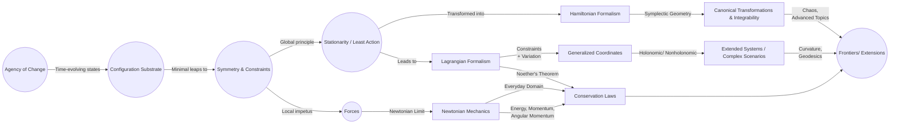

# Reimagining Classical Mechanics: A Minimalist, Concept-Driven Architecture
* * *

--- Strip away preconceptions and build anew—let the essence of motion and symmetry define all.

# Chapter 1. Foundational Bedrock

**Epigraph:**  
“In a blank universe, a single spark of transformation awaits definition.”

At the heart of any mechanical theory lies an initial seed: a notion of how things change and the framework in which these changes unfold. While later chapters will unveil forces, energies, conservation laws, and more complex structures, this opening chapter insists on clearing the clutter of preconceived frameworks. We begin by positing the most primary ideas—“Agency of Change,” a “substrate” for configurations and time, and ultimately the seeds of symmetry and constraint—that will collectively build new roads toward classical mechanics.

## 1.1. The Minimal Core: “Agency of Change”

Introduce the minimal concept that something (a “system”) can shift states over a parameter we interpret as time, preparing the ground for all subsequent notions of motion, force, or energy.

1. **Why We Need a Notion of Change**  
   In a universe devoid of preconceived laws, the most immediate observation is that “something can vary.” Let us name this property “Agency of Change.” Mathematically, one can model a system’s “state” by an element in some set—call it $\mathcal{S}$. Over an abstract parameter $t$, these states transition as a function  
   $$
     \Phi : t \mapsto s \in \mathcal{S}.
   $$  
   No forces or energies are yet invoked; we merely acknowledge a capacity for evolution.

2. **A State Space and Its Evolution**  
   The simplest abstraction is to let $\mathcal{S}$ be discrete or continuous. In discrete form, the system “hops” from one state to another at integer-like time steps. Continuously, we expect a mapping $\Phi(t)$ over real $t$. Both viewpoints share a primal unity: an entity that “changes” as $t$ progresses, marking the birth of “dynamics.”

3. **Seeding “Dynamics” Without Referencing Energy or Force**  
   Even without specifying what drives transitions, we sense a difference between “static” and “evolving” systems. This difference—how a state transitions from $s_1$ to $s_2$ as $t$ flows—sows the seeds of “dynamics.” In classical mechanics, we will eventually color this dynamic with forces, momenta, or Hamiltonians, but first we must maintain an unadorned clarity: there is a system, it has states, and it changes over time.

## 1.2. Configurations & Time: The Substrate

Define a conceptual “substrate” for states to live in—our earliest step toward what will become a configuration space. Highlight the interplay between discrete and continuous time, referencing philosophical parallels to continuum-building.

1. **Basic Definitions: Points, Dimension, and Time Labels**  
   We enlarge the concept of “state” into a “configuration.” Rather than an abstract set, consider a manifold $\mathcal{Q}$ whose points represent distinct possible configurations. A single configuration is thus a point $q \in \mathcal{Q}$. Time, by contrast, is an external parameter $t \in \mathbb{R}$ (or some subset). Together, a system’s evolution is described by  
   $$
     q(t) : \mathbb{R} \to \mathcal{Q}.
   $$  
   If $\mathcal{Q}$ has dimension $n$, there are $n$ degrees of “positional” freedom. We thereby take a first step on the road toward what is traditionally called “configuration space.”

2. **Discrete vs. Continuous Constructions**  
   Drawing parallels to constructive philosophies, one can imagine building up the real line of time (or even the manifold $\mathcal{Q}$) from more primitive pieces. Does the continuum exist a priori, or do we assemble it from smaller intervals or “choice sequences”? The question, reminiscent of the intuitionistic perspective, underscores the idea that each new “time slice” or “configuration slice” might be actively constructed. This tension between assuming continuity or building it is deeply relevant if we aim to define classical mechanics from the ground up.

3. **Link to Broader Philosophical Parallels**  
   Echoing the “Radical Vision” of constructing mathematics anew, we note that positing $\mathcal{Q}$ as a continuum reveals an assumption. Indeed, many aspects of classical mechanics rest on continuity—velocities, accelerations, integrals—so it is vital to recognize the conceptual leap taken here. Even so, we suspect that the elegant structures of classical mechanics hint that this leap is fruitful: time and configuration likely flow continuously, setting the stage for the differential equations to come.

## 1.3. From Transformation to Invariance: Symmetries & Constraints

Motivate the idea that certain changes might preserve something, foreshadowing symmetries (like those leading to conserved momenta) and constraints that reduce the effective degrees of freedom.

1. **Invariance and Its Meaning**  
   Once we acknowledge that our system has states $q \in \mathcal{Q}$ evolving in time, we can ask: is there any transformation that leaves a relevant property unchanged? Symbolically, suppose a transformation  
   $$
     q \;\mapsto\; q'
   $$  
   acts on $\mathcal{Q}$. Invariance under that transformation means some structural feature remains constant—whether it is a distance, an angle, or a general measure. This principle anticipates how internal symmetries lead to conserved quantities, famously codified in Noether’s theorem.

2. **Constraints and Degrees of Freedom**  
   Even at this preliminary stage, constraints (holonomic or otherwise) can be introduced as conditions restricting the range of permissible $q(t)$. A simple constraint might say “the system must remain on a fixed surface” (like a bead on a wire). Conceptually, constraints reduce the dimension of the available “substrate” and thus reshape how we model transformations or invariances.

3. **Precursor to Symmetry-Induced Conservation**  
   While full-blown Noether’s theorem belongs later, here we plant the seed: if there is an invariance in how a system can be transformed, it often implies a quantity that remains constant throughout evolution. For example, if configuration space is homogeneous in one direction, momentum is conserved; if it is isotropic about an axis, angular momentum is conserved. These relationships clarify how the minimal notion of “change” can be complemented by “unchange”—symmetry principles that will crucially shape the rest of classical mechanics.

## 1.4. Conclusion

In these three sections, we embed the necessary philosophical and technical scaffolding from which the grand narrative of mechanics emerges. “Agency of Change” sets the stage for dynamics. “Configurations & Time” invests it with dimensional richness. “From Transformation to Invariance” supplies the blueprint for symmetries and constraints. By the end of this chapter, the reader should sense how minimal leaps—states, time, and invariances—can form the bedrock from which all classical mechanics can be reconstructed.

# Chapter 2. Emergence of Classical Dynamics

**Epigraph:**  
“From a single thread of change, the tapestry of motion unfurls.”

Having laid the rudiments of states and transformations, we now unfold the familiar structures of classical dynamics. This chapter traces how the raw concept of “change” (from Chapter 1) crystallizes into forces, energies, and, eventually, the principle of least action. In doing so, we see Newtonian mechanics arise as a potent limit—a specialization elegantly capturing much of everyday physics.

## 2.1. Conceptual Path to “Forces”

Show how an external or internal impetus emerges from the notion of changing states, motivating the idea of “forces” and the ways we can represent them (e.g., as vectors or potential fields).

1. **From Pure Change to Directed Change**  
   Earlier, we established that a system’s state $s \in \mathcal{S}$ evolves over time. Absent further structure, the system “drifts” from one state to another without explanation. Here, we posit that this evolution can be driven by an impetus—an influence that “pushes” or “pulls” the state in a particular manner. This impetus becomes our intuitive handle on “force.”

2. **Hypothesizing a Push/Pull**  
   Let us imagine an infinitesimal slice of time $\mathrm{d}t$. If the state transitions from $s(t)$ to $s(t) + \mathrm{d}s$, one can propose that  
   $$
     \mathrm{d}s \;=\; \mathbf{F}(s)\,\mathrm{d}t,
   $$  
   where $\mathbf{F}(s)$ is an object “pushing” the system’s state. This **force-like quantity** may exist in different guises: a gradient from a potential, a Lagrangian multiplier for constraints, or a direct vector field on a manifold. Whichever representation we choose, the key point is that **force** is encoded as the driver of the system’s instantaneous change.

3. **Representations of the Impetus**  
   - **Vectors or Forms**: In a Euclidean setting, we can view force as a vector $\mathbf{F} \in \mathbb{R}^n$. On a more general manifold, it might be a covector or a differential form guiding the evolution directions.  
   - **Potential-Like Constructs**: Alternatively, we might define a scalar function $\Phi(q)$ whose negative gradient acts as force. This potential viewpoint paves the way for energy-based analyses.  
   - **Constrained Systems & Reaction Forces**: If additional constraints exist (e.g., the system must remain on a surface), a portion of the impetus may arise as “reaction forces” enforcing those restrictions.

Taken together, the notion of “force” is not an axiom but a conceptual step capturing and categorizing the impetus behind system evolution—paving the road to deeper, integral-based pictures.

## 2.2. The Principle of Optimality (or Stationarity)

Introduce a key conceptual pivot: rather than analyzing forces at each instant, shift to a broader integral viewpoint where the system’s trajectory “optimizes” or “stationarizes” a certain functional. This approach births the principle of least action—a unifying premise for Lagrangian and Hamiltonian mechanics.

1. **Local vs. Global**  
   In the force-based viewpoint, we look at each instantaneous $\mathrm{d}t$ and see how $\mathrm{d}s$ or $\mathrm{d}q$ depends on $\mathbf{F}$. However, one might instead ask: “Which path from $q(t_0)$ to $q(t_1)$ does nature choose?” Here we posit that nature “selects” paths that render an **action functional** stationary. Symbolically, we define an action:
   $$
     S[q(\cdot)] \;=\; 
     \int_{t_0}^{t_1} L\!\bigl(q(t),\dot{q}(t),t\bigr)\,\mathrm{d}t,
   $$
   and impose the extremal condition  
   $$
     \delta S \;=\; 0.
   $$

2. **Why “Optimal” or “Stationary” Paths?**  
   - **Unification**: A single functional $S$ can incorporate all relevant physical detail (kinetic, potential, constraints) in a consistent manner.  
   - **Continuity & Variation**: By allowing small variations of the entire path $q(t)$, we switch from local impulses (force) to a global coherence principle: the system’s trajectory is “one piece,” bridging initial and final states in a self-consistent fashion.  
   - **Generality**: Lagrangian and Hamiltonian formalisms follow from this principle. Even relativistic or field-theoretic expansions rely on analogous stationarity conditions.

3. **Seeds of Lagrangian & Hamiltonian Mechanics**  
   - **Lagrangian Mechanics**: The function $L$ typically combines kinetic and potential energies, leading to Euler–Lagrange equations.  
   - **Hamiltonian Mechanics**: Via the Legendre transform, we re-interpret the same principle in phase space with momentum variables, bridging local kinematics to global conservation laws.

Hence, the shift to an integral (or global) perspective does more than unify phenomena; it elegantly organizes the fabric of classical mechanics under one overarching principle.

## 2.3. Newtonian Mechanics as a Specialization

Show that Newton’s laws—a cornerstone of everyday physics—emerge naturally within this framework, appearing as a simplified or particular limit that remains robust for low velocities, non-relativistic domains, and relatively flat backgrounds.

1. **Position, Velocity, Acceleration Formalism**  
   In a Euclidean setting, let the configuration space be $\mathbb{R}^3$. Label a system’s configuration as $\mathbf{r}(t)$. Then the velocity is $\dot{\mathbf{r}}(t)$ and acceleration is $\ddot{\mathbf{r}}(t)$. The impetus or “force” can be directly equated to mass times acceleration:
   $$
     \mathbf{F} \;=\; m\,\ddot{\mathbf{r}}(t).
   $$

2. **$\mathbf{F} = m \mathbf{a}$ and The Everyday Domain**  
   Newton’s second law thus states:
   $$
     m\,\ddot{\mathbf{r}}(t) \;=\; \mathbf{F}\bigl(\mathbf{r}(t)\bigr).
   $$  
   This is a direct expression of local dynamics, valid when velocities are small relative to $c$ (the speed of light), and spacetime curvature is negligible. Forces in this viewpoint might be gravitational, electromagnetic, or contact interactions.

3. **Why It Remains Robust**  
   Despite the deeper elegance of the action principle, Newton’s laws offer a direct, transparent system of ordinary differential equations. In typical terrestrial or low-speed astronomical settings, they hold spectacular predictive power. Their close ties to the integral-based formalisms ensure that any domain in which we can define a suitable Lagrangian or Hamiltonian can yield Newtonian equations as a straightforward reading.

By situating Newton’s laws within the broader notion of impetus and stationarity, we see them not as universal bedrock but as a supremely effective branch of a more general tree—one whose trunk is the principle of change, and whose crown is the principle of least action.

## 2.4. Conclusion

This chapter has traversed the evolution from a simple impetus concept to the unifying least-action premise, ultimately distilling Newton’s laws as a crucial but specialized corollary. Forces, in the broad sense, are reinterpreted as local differential expressions of what can also be described as a global optimization of trajectories. Through this lens, Classical Dynamics stands on two pillars: the local language of forces and the global language of variational optimization. Both reflect the same underlying tapestry, woven from the single thread of change.

# Chapter 3. Analytical Expansions: Lagrangian & Hamiltonian Layers

**Epigraph:**  
“Where functionals guide motion, and momentum becomes the voice of geometry.”

The stride from conceptual “forces” and “optimal paths” to rigorous analytical formalisms underpins much of classical mechanics’ enduring power. In this chapter, we transition from qualitative ideas to the Lagrangian and Hamiltonian frameworks, revealing how an integral principle (the action) sharpens into precise equations. The result is a toolset that not only unifies energy, momentum, and symmetries but also aligns with a deep geometric infrastructure—symplectic manifolds—illuminating the mechanics of everything from planetary orbits to chaotic systems.

## 3.1. Lagrangian Architecture

Demonstrate how “action functionals” build upon the minimal principle to yield the Euler–Lagrange equations. Along the way, highlight Lagrangian symmetries, Noether’s theorem, constraint handling via generalized coordinates, and the geometry of configuration spaces.

1. **Action Functional and the Principle of Stationarity**  
   The Lagrangian approach codifies the idea that a system’s true path is one that extremizes (or stationarizes) the action. Concretely, we define:  
   $$
     S[q(\cdot)]
     \;=\;
     \int_{t_{0}}^{t_{1}}
       L\bigl(q(t),\,\dot{q}(t),\,t\bigr)
     \;\mathrm{d}t,
   $$
   where $q(t)$ represents the system’s trajectory in configuration space, and $\dot{q}(t)$ its time derivative. The “least (or stationary) action” principle states:
   $$
     \delta S[q(\cdot)] \;=\; 0,
   $$
   for all small variations $\delta q(t)$ that vanish at the boundaries $t_0$ and $t_1$.

2. **Variation, Boundary Conditions, and the Euler–Lagrange Equations**  
   By performing the functional derivative $\delta S$ and integrating by parts, one arrives at the celebrated Euler–Lagrange equations:
   $$
     \frac{\mathrm{d}}{\mathrm{d}t}
       \Bigl(\frac{\partial L}{\partial \dot{q}^i}\Bigr)
     \;-\;
     \frac{\partial L}{\partial q^i}
     \;=\; 0,
   $$
   for each generalized coordinate $q^i$. Thus, from a global statement about action stationarity, we obtain local differential equations that govern motion. The pivotal role of boundary conditions—usually fixing $q(t_0)$ and $q(t_1)$—exposes how classical mechanics marries local insight (differential equations) with global constraints.

3. **Noether’s Theorem and Symmetries**  
   A striking virtue of the Lagrangian viewpoint is its synergy with symmetry. If $L$ is invariant under a continuous coordinate transformation (e.g., spatial translation, rotation, time shift), Noether’s theorem asserts the existence of a conserved quantity (linear momentum, angular momentum, energy, etc.). Symbolically, a symmetry $\delta q$ leading to $\delta S=0$ implies the conservation of some conjugate momentum:
   $$
     \frac{\mathrm{d}}{\mathrm{d}t}
       \Bigl(
         \sum_i \frac{\partial L}{\partial \dot{q}^i}\,\delta q^i
       \Bigr)
     \;=\; 0.
   $$
   Thus, invariance yields integrals of motion, forging a robust link between geometry and dynamics.

4. **Constraints and Generalized Coordinates**  
   In many practical situations—from pendulums constrained to an arc to rigid bodies with internal constraints—one does not treat every coordinate as free. Instead, constraints reduce the system to fewer degrees of freedom. We introduce generalized coordinates $(q^1, \dots, q^n)$ to describe allowable configurations, rewriting the Lagrangian appropriately. The Euler–Lagrange procedure applies as usual, with constraints built into the choice of coordinates or enforced via Lagrange multipliers. Either way, the Lagrangian formalism accommodates a wide variety of mechanical systems with surprising elegance, unifying them under the action-based principle.

5. **Configuration Space Geometry**  
   Each system’s “configuration space” $\mathcal{Q}$ can be a manifold of dimension $n$. A Lagrangian $L(q,\dot{q},t)$ is thus a function on the tangent bundle $T\mathcal{Q}$. Abstractly, the Lagrangian viewpoint ties geometry (the shape of $\mathcal{Q}$) together with physics (the form of $L$) to produce the system’s evolution rules. This bridging prepares us for an even deeper geometric reinterpretation in the Hamiltonian framework.

## 3.2. Hamiltonian Perspective

Show how the principle of stationarity (or optimality) transforms naturally into phase-space language via the Legendre transform, unveiling Hamilton’s equations, the role of energy, and canonical transformations.

1. **Legendre Transform from $L$ to $H$**  
   The generalized momentum corresponding to $q^i$ is:
   $$
     p_i
     \;=\;
     \frac{\partial L}{\partial \dot{q}^i}.
   $$
   Provided this relationship is invertible (e.g., nonsingular kinetic energy terms), we define the Hamiltonian $H$ through the Legendre transform:
   $$
     H\bigl(q,\,p,\,t\bigr)
     \;=\;
     \sum_i \,p_i\,\dot{q}^i
     \;-\;
     L\bigl(q,\,\dot{q},\,t\bigr),
   $$
   where $\dot{q}^i$ is expressed in terms of $\bigl(q,p\bigr)$. This new function $H$ often represents the total energy (kinetic plus potential), though subtleties arise with gauge or velocity-dependent potentials.

2. **Canonical Equations in Phase Space**  
   By re-stating the action principle in terms of $\bigl(q^i, p_i\bigr)$ instead of $\bigl(q^i, \dot{q}^i\bigr)$, we obtain Hamilton’s equations:
   $$
     \dot{q}^i
     \;=\;
     \frac{\partial H}{\partial p_i},
     \quad
     \dot{p}_i
     \;=\;
     -\,\frac{\partial H}{\partial q^i}.
   $$
   These simple-looking first-order ODEs unify the concept of force $\mathbf{F}$ with energy conservation: the velocities and momenta become canonical coordinates describing the system’s evolution in the **phase space** $T^*\mathcal{Q}$.

3. **Hamilton’s Principle and Conservation of Energy**  
   Just as the Lagrangian method harnesses $\delta S \!=\! 0$, the Hamiltonian approach likewise ensures that if $H$ does not explicitly depend on time, it is a conserved quantity (i.e., total energy). Indeed, the canonical structure elegantly encodes many invariants: if a coordinate is cyclic (unfeatured in $H$), its conjugate momentum is conserved.

4. **Canonical Transformations & Symmetry**  
   The Hamiltonian formalism highlights the geometry of transformations that preserve the form of Hamilton’s equations—called canonical transformations. These transformations often simplify problems, reveal integrals of motion, or clarify hidden symmetries. They can be generated by specialized “generating functions,” leading to entire methods of solution (e.g., action-angle variables in integrable systems).

5. **From Velocity to Momentum: A Conceptual Shift**  
   While Lagrangian mechanics prizes “velocity-based” $\dot{q}$ variables, Hamiltonian mechanics re-centers attention on momenta $p$. Both pictures are fully equivalent under suitable conditions. This dual perspective proves crucial in revealing deeper geometric structures (symplectic manifolds, Poisson brackets) that unify discrete transformations, continuous symmetries, and integral invariants.

## 3.3. The Geometry of Phase Space

Highlight the deeper geometric structure underlying Hamiltonian mechanics, focusing on symplectic manifolds, transformations, integrability, and glimpses of advanced dynamical phenomena.

1. **From Tangent Bundles to Cotangent Bundles**  
   In Lagrangian mechanics, we treat the tangent bundle $T\mathcal{Q}$, with coordinates $\bigl(q^i,\dot{q}^i\bigr)$, as fundamental. Hamiltonian mechanics instead dwells on the cotangent bundle $T^*\mathcal{Q}$, with coordinates $\bigl(q^i,p_i\bigr)$. This shift is not merely an algebraic curiosity: it reflects how momentum, rather than velocity, can serve as the primary descriptor of dynamics.

2. **Symplectic Manifolds and Hamiltonian Flow**  
   A defining feature of $T^*\mathcal{Q}$ is its symplectic structure, given by a closed, non-degenerate 2-form $\omega$. Often written locally as
   $$
     \omega
     \;=\;
     \sum_i
       \mathrm{d}p_i
       \,\wedge\,
       \mathrm{d}q^i,
   $$
   this form underlies Hamilton’s equations. Indeed, for a Hamiltonian $H$, the flow vector field $X_H$ satisfies
   $$
     \iota_{X_H}\,\omega
     \;=\;
     \mathrm{d}H,
   $$
   enforcing a richly geometric prescription for time evolution. The non-degeneracy of $\omega$ ensures each Hamiltonian function $H$ generates a unique flow.

3. **Integrability, Chaos, and Canonical Structures**  
   The symplectic viewpoint clarifies when systems are (a) integrable—supporting global action-angle variables and quasi-periodic orbits, or (b) chaotic—where small differences in initial conditions cause exponential divergence. Canonical transformations boil down to changes of coordinates on a symplectic manifold preserving $\omega$. These transformations allow one to linearize or decouple certain dynamics, dissect hidden symmetries, and develop perturbation theories—essential for unraveling the orderly to the chaotic.

4. **Wider Horizons: Links to Field Theory and Quantization**  
   This geometric apparatus generalizes far beyond point mechanics: fields themselves can be cast in an infinite-dimensional phase space with a symplectic form, preluding quantum constructions (geometric quantization) or relativistic field theories. By recognizing phase space as a geometric stage, classical mechanics merges seamlessly into modern frameworks where curvature, topology, and boundary conditions shape the evolution in ways reminiscent of the “radical visions” that champion building mathematics from minimal postulates.

## 3.4. Conclusion

The Lagrangian and Hamiltonian layers exemplify how a single principle of stationary action can be cast in two complementary languages—velocity-based vs. momentum-based—and how each perspective aligns with a unifying geometry. The Lagrangian approach underscores how symmetrical design leads to conservation laws via Noether’s theorem, while the Hamiltonian approach reveals the profound symplectic tapestry weaving together transformations and invariants. Together, they constitute the analytical backbone of classical mechanics, preparing us for expansions into more generalized, constrained, or high-dimensional worlds explored in subsequent chapters.

# Chapter 4. Extensions & Conceptual Ramifications

**Epigraph:**  
“In one principle’s wake, entire worlds of structure crest and break.”

Having established the core frameworks of Lagrangian and Hamiltonian mechanics, we now widen the lens. Real-world systems often involve constraints, non-Cartesian coordinates, or purely geometric viewpoints that reveal mechanics’ deeper—and sometimes hidden—structures. Moreover, the symplectic perspective we introduced in the Hamiltonian formalism enables a rich array of transformations and theoretical expansions, many of which tie into modern mathematics. This chapter explores how the minimal ideas of stationary action and phase-space geometry extend into advanced techniques, bridging classical mechanics with cutting-edge frontiers in geometry and beyond.

## 4.1. Constraints, Generalized Coordinates, and Beyond

Explore how our minimal approach extends to complicated constraints or non-Cartesian scenarios, showing that generalized coordinates can elegantly encapsulate almost any physical setup. Provide a glimpse into geodesics in curved spaces and their role as minimal paths, hinting at possible connections to relativity.

1. **Holonomic vs. Nonholonomic Constraints**  
   - **Holonomic Constraints**: These can be expressed as algebraic or differential conditions among coordinates, e.g.$f(q^1,\dots,q^n)=0$. A simple example is a pendulum constrained to move on a circle. By reducing the dimensionality of configuration space through these constraints, one obtains fewer—but wholly independent—generalized coordinates.  
   - **Nonholonomic Constraints**: These involve velocity-level or inequality-based restrictions that cannot be integrated into a single algebraic equation. A rolling sphere without slipping, for instance, imposes a velocity constraint linking translational and rotational coordinates. While Lagrange multipliers and generalized coordinates still help, the treatment of nonholonomic systems can yield crucial distinctions—some constraint forces do no work, while others drastically alter the system’s degrees of freedom, momentum, or energy conservation patterns.

2. **Role of Generalized Coordinates and Momenta**  
   One of Lagrangian/Hamiltonian mechanics’ most potent innovations is that it trades standard Cartesian coordinates for variables tailored to the system’s symmetry or geometry. These “generalized coordinates” streamline equations of motion, enabling one to handle complex linkages, rotating reference frames, or flexible bodies with minimal conceptual overhead. Correspondingly, one computes generalized momenta via  
   $$
     p_i
     \;=\;
     \frac{\partial L}{\partial \dot{q}^i},
   $$
   capturing a unified notion of momentum that may combine linear, angular, or even gauge components.

3. **Geodesics as Minimal Paths in Curved Spaces**  
   Typically, constraints or curved coordinate systems can be interpreted as an underlying manifold on which the system moves. In a purely geometric viewpoint—for instance, a free particle on a curved surface—the path of least action is effectively a geodesic: the curve that “locally” minimizes (or stationarizes) length or energy. This concept resonates with passages into general relativity, where particles in free fall follow spacetime geodesics. By highlighting geodesic motion, we see the principle of stationarity uniting classical mechanics with geometric frameworks that scale elegantly into advanced topics.

## 4.2. Symplectic Geometry & Canonical Transformations

Delve deeper into the transformations preserving the core symplectic structure of phase space. Explore generating functions, Liouville’s theorem, and advanced topics such as integrable systems and chaos, illustrating the richness of Hamiltonian geometry.

1. **Generating Functions and Canonical Transformations**  
   Canonical transformations are change-of-variable maps $(q,p) \mapsto (Q,P)$ that preserve the symplectic form $\omega$. They ensure the structure of Hamilton’s equations remains intact. Generating functions—such as $F_2(q,P)$—provide a systematic way to define these transformations, guaranteeing $\mathrm{d}p \wedge \mathrm{d}q = \mathrm{d}P \wedge \mathrm{d}Q$. Canonical transformations allow us to simplify equations of motion, sometimes reducing them to integrable forms.

2. **Liouville’s Theorem and Phase-Space Volume**  
   A central insight of Hamiltonian mechanics is that the flow generated by $H$ preserves phase-space volume—a statement known as Liouville’s theorem. In simpler terms, if we follow an ensemble of initial conditions as they evolve in phase space, the shape may deform but its total volume remains constant. This result underpins statistical mechanics, ergodic theory, and many arguments about equilibrium distributions (e.g., the microcanonical ensemble).

3. **Seeds of Advanced Topics: Action-Angle Variables, Integrability, and Chaos**  
   - **Action-Angle Variables**: In integrable Hamiltonian systems—where there are as many integrals of motion as degrees of freedom—one can transform the system into “action-angle” coordinates $(J,\theta)$. The evolution then proceeds uniformly in these angles, a gentle motion describing invariant tori in phase space.  
   - **Chaos**: When integrability breaks, small perturbations can produce sensitive dependence on initial conditions. This phenomenon leads to chaotic dynamics, exemplifying how deterministic equations can yield unpredictable long-term evolution. Canonical transformations and perturbation theory help identify transition layers between integrable regimes and chaos.

In short, symplectic geometry illuminates how transformations, invariants, and stability interplay in Hamiltonian systems—unifying a wide class of mechanical phenomena under a single geometric tapestry.

## 4.3. Tangential Views from Modern Mathematics

Connect the minimalistic approach to frontier ideas—fiber bundles, geometric quantization, and topological methods—that see classical mechanics as part of a broader mathematical cosmos. Illustrate how the “build-from-zero” spirit resonates with modern or “intuitionistic” expansions.

1. **Fiber Bundles & Gauge Structures**  
   We can reinterpret mechanical systems in the language of principal or associated fiber bundles. For instance, a rotating rigid body or a charged particle in an electromagnetic field can be cast in geometric terms: local trivializations, gauge connections, curvature. Such frameworks demonstrate that classical systems often encode topological constraints and gauge fields implicitly.  

2. **Geometric Quantization & the Bridge to Quantum Mechanics**  
   In bridging classical and quantum theories, one often starts with a symplectic manifold $(\mathcal{M}, \omega)$ and a line bundle with suitable connections. The procedure known as geometric quantization tries to systematically “quantize” classical degrees of freedom, turning Poisson brackets into commutators. While historically many technicalities arise, the conceptual thrust is that classical phase space can be the progenitor of quantum Hilbert spaces, aligning with the idea of building advanced physics from the simplest mechanical core.

3. **Torsion, Non-Symmetric Extensions, and Constructive Perspectives**  
   - **Torsion / Non-Symmetric Connections**: Certain advanced theories in differential geometry allow for torsion, effectively warping the usual notion of geodesics or parallel transport. Incorporating torsion expansions into mechanical models echoes possible “generalized” classical dynamics or coupling with spin degrees of freedom.  
   - **Constructive or Intuitionistic Themes**: The “Radical Vision” perspective suggests we might re-derive continuous structures from discrete or mental “choice sequences.” Modern constructive expansions of classical mechanics might define the continuum, symplectic forms, or measure spaces in a step-by-step manner, challenging the older assumption that these structures appear fully formed. These approaches can represent alternative foundations—ones that place the creativity of the observer or a “building subject” at the center of mechanical law.

## 4.4. Conclusion

Classical mechanics transcends simple point masses moving in Cartesian planes. Through constraints and generalized coordinates, it accommodates any arrangement of links, surfaces, or fields. Symplectic geometry cements the Hamiltonian viewpoint into a robust geometric program, where transformations and measures of stability or chaos become natural. Moreover, modern mathematics extends these ideas in directions bridging quantum theory, topology, and constructive approaches, showing that at each boundary we cross, new conceptual worlds of mechanical structure await.

# Chapter 5. Unifying Insights & Prospective Frontiers

**Epigraph:**  
“In the stillness of minimal assumptions lie infinite vistas of mechanical possibility.”

With each preceding chapter, we built classical mechanics from a few core principles—“Agency of Change,” “Spacetime Awareness,” and “Optimality”—and uncovered how standard formulations (Newtonian, Lagrangian, Hamiltonian) emerge by systematic layering. Now we consolidate those threads, showing that the essential “spark” of motion branches into multiple perspectives, each echoing the same fundamental ideas. We then look beyond traditional boundaries, connecting classical mechanics to philosophical undercurrents, modern scientific frontiers, and speculative new frameworks. In so doing, we underscore how re-deriving classical mechanics from scratch can be a generative act, prompting further structural insights and entirely new fields.

## 5.1. Summary of the Core: From One Principle to Many Formulations

Recap how every essential facet of classical mechanics arises from a small kernel of concepts—namely, “Agency of Change” plus “Stationarity (Optimality).” Highlight how Newtonian, Lagrangian, and Hamiltonian formulations unify under these fundamental premises of change and symmetry.

1. **A Single Spark of Dynamics**  
   We began with the minimal idea that something changes over time: a “system” evolving in a conceptual substrate. That single statement seeded the notion of a state space or configuration manifold, culminating naturally in the idea of an impetus—force, momentum, or potential—driving transformations.  

2. **Newtonian, Lagrangian, and Hamiltonian Views**  
   - **Newtonian**: Focuses on local forces and accelerations (e.g., $\mathbf{F} = m \mathbf{a}$), especially effective for direct modeling in Euclidean spaces.  
   - **Lagrangian**: Elevates the integral property (action) and derives local equations of motion via stationarity. Symmetries become explicit, and constraints find a systematic footing in generalized coordinates.  
   - **Hamiltonian**: Translates this stationarity principle into phase-space language, unveiling symplectic geometry, canonical transformations, and integrability/chaos. Momentum, rather than velocity, becomes the central descriptor.  

3. **Unifying Themes**  
   - **Symmetry & Conservation**: Noether’s theorem ties symmetrical invariances to conserved quantities, bridging each formulation’s approach to invariants (momentum, energy, angular momentum).  
   - **Geometry & Variational Principles**: Whether we speak of geodesics on a surface (Lagrangian) or flows on a symplectic manifold (Hamiltonian), geometry anchors the notion of “minimal or stationary paths.”  
   - **Layers of Abstraction**: Each formalism can be viewed as an embodiment of the same primal idea: a system’s path through configuration/phase space is governed by an “optimal” or “self-consistent” impetus.

In short, everything traced back to a single root—time-evolving states shaped by constraints, symmetries, and a principle of stationarity. From this root, a richly branching tree of mechanical formulations blossomed, each preserving the same living essence in different mathematical attire.

## 5.2. Emergent Philosophical & Practical Views

Reflect on the deeper nature of space, time, and continuity, connecting them to broader scientific discourse. Address whether mechanics implies teleological “goals” in the universe or simply encodes local dynamical laws in global integrals. Explore how classical mechanics resonates with or influences modern physics.

1. **Teleological Illusions vs. Mechanical Necessity**  
   The principle of least action sometimes draws commentary about nature’s “wisdom” or “purposeful design.” In reality, this “optimality” is no more than a mathematically consistent statement that the dynamics follow from stationary variation of a functional. What some interpret as teleology is, in a deeper sense, the reflection of local rules (forces, constraints) folded into a global integral description. Yet the sense of “nature’s design” retains philosophical charm, reminding us that the universe’s structural order often emerges from seemingly minimal assumptions.

2. **Space, Time, and Continuum**  
   We have seen how a continuum notion of configuration or phase space is central to classical theory. However, from an intuitionistic or constructive vantage, the continuum might be built step-by-step (via choice sequences or discrete underpinnings). Classical mechanics can live on top of that framework or externalize it; either way, the geometric coherence suggests that once continuity is adopted (or constructed), the principle of stationarity elegantly unifies local and global phenomena.

3. **Parallels in Modern Domains**  
   - **Continuum Mechanics**: The same action-based or variational logic extends to deformable media, fluid flows, or field theories, indicating how local stress-strain relations mirror global energy functionals.  
   - **Field Theory and Relativity**: Einstein’s field equations can be derived from an action principle, and the idea of geodesics generalizes to curved spacetime. Thus, the blueprint we sketched in classical mechanics resonates into the domain of general relativity and beyond.  
   - **Quantum Mechanics**: Path integrals, operator methods, and semiclassical expansions trace back to classical actions. The symplectic structure transforms into a quantum commutator or wavefunction realm, maintaining echoes of geometry and stationarity.

Overall, the classical approach remains a core conceptual anchor for advanced physics, bridging everyday phenomena with the frontiers of theoretical science.

## 5.3. Future Directions & Sparks of Innovation

Suggest how a “start-from-scratch” approach, built on minimal conceptual anchors, can open wholly new perspectives in mechanics. Offer glimpses of potential research avenues—from exotic geometries to computational strategies—and encourage ongoing radical re-derivations that question fundamentals.

1. **Torsional, Non-Commutative, or Discrete Classical Mechanics**  
   - **Torsional Extensions**: Suppose we allow for connections with torsion in a classical manifold. This might give rise to new force-like terms, possibly relevant for spin or extended bodies whose geometry is not entirely symmetrical.  
   - **Non-Commutative Coordinates**: In certain quantum-inspired or emergent gravity setups, one may consider coordinates that do not commute. Re-deriving Hamiltonian or Lagrangian rules in partial non-commutative spaces can reveal subtle corrections to standard mechanics.  
   - **Discrete Analogues**: Computation-driven paradigms can discretize time or space, modeling mechanical evolution as a series of leapfrog steps or local cellular-automaton rules. Such discrete frameworks often approximate classical mechanics well, but might also spontaneously yield new phenomena not easily seen in the continuum limit.

2. **Synergy with Computational Methods and Big Data**  
   - **Multi-Scale Mechanical Systems**: In everything from molecular dynamics to celestial mechanics, bridging microscopic details with macroscopic patterns demands a synergy of classical laws, numerical simulation, and statistical methods. The geometric unity at small scale guides stable integrators or geometric integrators that preserve symplectic structure. This synergy is especially interesting in high-dimensional systems (e.g., climate, astrophysical clusters).  
   - **Machine-Learned Approaches**: Minimal conceptual anchors can be used to guide machine-learning algorithms that discover or refine mechanical laws from data. Indeed, neural networks or symbolic regression often “re-derive” Hamiltonians or Lagrangians from observational sets—a reflection that even black-box methods tend toward these core structures when seeking predictive completeness.

3. **Further “Radical Re-Derivations”**  
   - **Questioning the Continuum**: Drawing inspiration from intuitionism or discrete mathematics, we might attempt to reconstruct mechanics on minimal sets, revealing how continuous geometry emerges.  
   - **Cross-Disciplinary Sparks**: Borrowing from category theory, topological quantum field theories, or dissipative systems might extend the classical blueprint in unexpected ways. Each new vantage can sharpen or reformulate old structures (e.g., friction, open systems, feedback cycles).  
   - **Philosophical Re-Examination**: The “Agency of Change” concept could be recast in more general contexts, from biology (e.g., morphogenesis) to network dynamics (e.g., social or economic systems). Investigating mechanical analogies in these domains might open entire new fields of “generalized mechanics.”

In essence, having stripped classical mechanics to its conceptual skeleton, we gain a vantage from which myriad new “organs” can be grafted. The result: an evolving, adaptive science that remains coherent with its classical heritage yet ventures into domains as varied as quantum geometry, discrete computation, or socio-complex systems.

## 5.4. Conclusion

By building from the ground up, focusing on minimal but powerful anchors, we have not only renewed our grasp of classical mechanics but prepared the stage for new leaps. Symmetry, geometry, energy principles—these remain luminous signposts guiding emergent theories and bridging seemingly disparate fields. Far from being a purely historical or “settled” discipline, classical mechanics proves a living fountain of ideas, each wave of re-interpretation revealing further possibilities in mathematics, physics, and beyond.

# Appendix A: Conceptual Relationship Overview

Below is a conceptual diagram illustrating how the primary ideas and formal frameworks in this article interweave. Starting from the minimal seeds of “Agency of Change” and “Configuration Substrate,” we progress toward forces, variational principles, and the dual expansions of Lagrangian and Hamiltonian mechanics. Hovering at every level are symmetries and constraints, guiding us toward conserved quantities and deeper geometric structures. This diagram aims to convey, at a glance, the logical flow of the text and how each notion connects to the others.

**Diagram Explanation:**

1. **Agency of Change** and the **Configuration Substrate** form the ground layer. Together, they define that “something” can evolve over time within a conceptual continuum or manifold.  
2. **Symmetry & Constraints** arise naturally once one recognizes that certain transformations may leave properties invariant, and that some valid configurations are restricted.  
3. **Forces** (local viewpoint) and the **Principle of Stationarity** (global viewpoint) grow out of these foundations. They respectively introduce how we model an instantaneous push/pull or a universal integral principle (least action).  
4. **Newtonian Mechanics** is retrieved by specializing to direct acceleration–force relationships in a typically Euclidean and low-speed setting.  
5. **Lagrangian Formalism** unifies dynamics under an action integral, handles constraints via generalized coordinates, and highlights Noether’s theorem, revealing conserved quantities under continuous symmetries.  
6. **Hamiltonian Formalism** transforms the Lagrangian viewpoint into phase-space language, emphasizing momentum over velocity; it then naturally connects to **Symplectic Geometry**, where canonical transformations and volume preservation become explicit.  
7. **Extended or Complex Systems**—including nonholonomic constraints, curved spaces, and geodesic motion—slot neatly into the Lagrangian/Hamiltonian framework, showcasing broad applicability.  
8. **Frontiers & Extensions** unify advanced concepts (chaos, integrable or partially integrable systems, quantum geometry, torsion, and more), encouraging the re-derivation of classical premises to push into new realms of physics and mathematics.

By following these interlinked ideas, a reader appreciates how the initial “spark” of change carries forward into robust mathematical architectures—Newtonian, Lagrangian, Hamiltonian—and eventually into modern theoretical panoramas.

