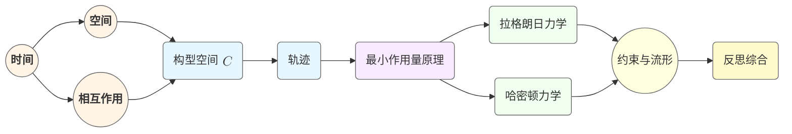

# 经典力学重生：从第一原理激进重构
* * *

--- 在空无中，我们敢于重新创造。

# 第一章 空无：核心概念的涌现

题词：*“每一个伟大的结构都始于空无。”*

在这一开篇章节中，我们想象踏入一个无形的广阔空间 —— 没有预设的定律，没有标准框架，也没有继承下来的牛顿力学或高级形式化的工具箱。我们的任务是从中种下种子，使一个完整的经典力学体系得以生长。我们引入三个基本概念，这些概念是每个机械理论的基础：
- 时间
- 空间
- 相互作用

通过以全新的视角来接近它们 —— 一个清除了传统定义的思维 —— 我们获得了一个既极其简单又富有成效的视角，能够从内部生成经典力学的完整图景。下面，我们将依次考察每个概念，然后描述它们如何开始凝聚成“物理系统”的概念。

## 1.1 时间作为基础成分

**目标**：定义时间 $t$ 为标记演化的连续一维流形。  
**概要**：将时间呈现为所有变化的必然参数。我们在引入空间或动力学概念之前，先探讨时间在描述运动中的作用。

1. **动机时间的概念**  
   没有时间，“变化”这个概念将是毫无意义的。在我们的空白画布方法中，首先承认一个不断发展的“现在” —— 形成一个连续体 $t \in \mathbb{R}$ 的瞬间序列。这个连续体不被假设为离散的，也不一定具有牛顿意义上的“绝对性”；然而，我们需要某种度量来区分“之前”和“之后”。

2. **时间作为构建的连续统**  
   与数学中的直觉主义观点进行微妙的类比，我们可以想象时间是一刻接一刻地构建出来的。每一瞬间 $t$ 作为一个标记存在展开的索引出现。无论深层次的哲学问题(时间是否流动或者我们是否在一个块宇宙中导航)，我们都将 $t$ 视作一个允许我们编码事件序列的参数。

3. **对动力学的影响**  
   尽管我们还没有谈论力或运动，但时间的箭头已经暗示了我们即将到来的框架将涉及导数 $\frac{d}{dt}$ 或积分 $\int \ldots dt$。这些是我们捕捉从一种状态到另一种状态过渡的正式方式。即使还原为空无，时间仍然是编织力学图景的织机。

随着我们的进展，时间成为变化的参考 —— 一条所有物理事件必须共享的一维线索。从这个角度来看，我们可以进一步问：“这些事件发生在何处，发生了什么变化？”

## 1.2 空间：存在的舞台

**目标**：介绍物体“生活”的空间 $\mathcal{S}$ 的概念。  
**概要**：讨论一旦允许变化必须有一个位置时，空间是如何在逻辑上跟随的。我们引入最小几何直觉，保持维度的一般性，突显同一概念如何从 $\mathbb{R}^1$ 扩展到 $\mathbb{R}^n$。

1. **从时间到空间的转变**  
   虽然时间标记事件的“何时”，我们还需要一个“何地”。如果我们允许现象发生在“某处”，自然会假设一个流形 $\mathcal{S}$ 来追踪可能的位置。这些位置不一定是 $\mathbb{R}^3$ 甚至不一定有限维；但经典力学传统上假设 $\mathcal{S} \subseteq \mathbb{R}^n$ 对于某个整数 $n$ 成立。

2. **最小几何直觉**  
   - **维度**：我们通常设 $\mathcal{S} \simeq \mathbb{R}^n$，尽管高级应用(例如机器人连杆、连续介质)可能需要更复杂的流形。
   - **距离或度量**：我们可能最初不会给 $\mathcal{S}$ 配备度量。经典力学经常依赖欧几里得几何，但我们也可以保持开放态度，接受更一般的结构(如广义相对论中的弯曲空间，尽管这超出了严格的“经典”范围)。
   - **拓扑连续统**：我们的方法强调连续性；在 $\mathcal{S}$ 中的点在某种意义上彼此无限接近，类似于时间也被视为连续的。

3. **作为物理背景的空间**  
   单独来看，$\mathcal{S}$ 只是一个“舞台”。没有任何东西迫使物体移动或保持静止。我们的冲动是保持这个概念的最小化 —— 仅仅是一个抽象容器，准备好一旦引入“相互作用”就填充物理解释。

因此，将时间 $t$ 与空间 $\mathcal{S}$ 结合是描述“何地”和“何时”的第一步。但我们仍然缺乏任何关于“为何”或“如何”的感觉。这个角色由下一个概念“相互作用”来扮演。

## 1.3 相互作用与物理系统的概念

**目标**：引入系统和相互作用作为力学的基本构建块的概念。  
**概要**：提出“力”或“影响”可以被一个更抽象的“相互作用”概念所取代，它将时间、空间和物质粘合成一个有意义的动力学框架。

1. **为什么需要相互作用？**  
   在经典处理中，我们通常说力驱动运动。但从更深的角度看，“力”只是更广泛思想的一个表现：即宇宙的不同元素对彼此施加影响。我们称这些影响为“相互作用”。形式上，相互作用可以是引力、电磁力或象征性的(如果我们建模信息交换) —— 关键是某些东西导致或引导变化。

2. **由相互作用定义的系统**  
   我们将一个**物理系统**定义为一个实体(或一组耦合的实体)，可以通过指定以下内容将其概念上孤立出来：
   $$
   \text{System} = \{\text{set of degrees of freedom in space } \mathcal{S}\} \;+\; \{\text{interaction rules}\}.
   $$
   相互作用可能规定了系统在空间中的“点”如何响应时间的变化，通常表述为微分方程或作用原理(将在后续章节讨论)。

3. **从相互作用到运动方程**  
   尽管我们尚未引入运动方程，但这个相互作用的概念预示了它们。最终，我们会说：
   $$
   \frac{d}{dt}(\text{System’s state}) = \text{Interaction}( \text{System’s state}, t ).
   $$
   无论我们称之为“力”、“势能”还是“约束”，它只是一个规定的关系，决定了系统在空间舞台上随时间演化的方式。

4. **通往可测量动力学的桥梁**  
   相互作用的引入带来时间上的**因果关系**概念。它表明“下一时刻”不是任意的，而是根据系统状态与其环境或内部结构的耦合而来的。在后续章节中，我们将通过最小作用量原理正式化这些想法，最终揭示拉格朗日或哈密顿力学如何以优雅的形式装置封装这些相互作用。

## 1.4 与其他章节的关系

本章为接下来的一切奠定基础。通过提出**时间**、**空间**和**相互作用**作为基础三元组，我们形成了概念的核心，其扩展形式(如构型、作用、约束等)将塑造整个经典力学的大厦。第二章将在这些思想的基础上，引入**构型空间** $\mathcal{C}$ 和时间中的**轨迹**概念，最终导向最小作用量原理及更远。

> 我们从空无和一些简单的想法开始，但从这些种子中：一个经典的力学宇宙将绽放。

# 第二章 从构型到轨迹

题词：*“运动是时间流动中的意义。”*

在前一章中，我们在一个空白的概念领域内列出了三个基本构建块 —— 时间、空间和相互作用。现在我们向外推进一层，引入“构型”的概念，并解释这些构型如何随着时间演化形成轨迹。这两个支柱 —— 构型空间和运动学 —— 将是经典力学更深层次形式化的起点。

## 2.1 构型空间 $\mathcal{C}$

**目标**：定义构型为系统瞬时状态的最小描述。  
**概要**：我们从基本三元组(时间、空间、相互作用)构建 $\mathcal{C}$。在 $\mathcal{C}$ 中的每个点捕捉系统的排列，将静态的“位置”概念与动态的“变化”概念联系起来。

1. **连接空间与系统**  
   虽然第一章将 $\mathcal{S}$ (空间)视为一个抽象的舞台，但物理系统通常有可区分的部分 —— 粒子、刚体或广义坐标。为了在一个快照中描述整个系统，我们将所有相关的位置和方向收集到一个单一的“构型”中。例如，在 $\mathbb{R}^3$ 中的 $N$ 个点粒子的一个构型可能是
   $$
     \mathbf{q} \;=\; \left( x_1, y_1, z_1,\;\dots,\; x_N, y_N, z_N \right).
   $$
   更复杂的系统 —— 刚体、带有关节的机器人、场 —— 各自需要适应其自身的坐标。但在所有情况下，一个**构型**是在给定时间点指定系统所需的最小变量集。

2. **从单个位置到统一空间**  
   因此，我们定义**构型空间** $\mathcal{C}$ 为：
   $$
     \mathcal{C} \;=\; \{\text{all possible configurations } \mathbf{q}\}.
   $$
   - 在简单情况下，$\mathcal{C}$ 同构于 $\mathbb{R}^n$。
   - 在更专门的系统(例如单摆)中，$\mathcal{C}$ 可能看起来像一个圆 $S^1$。
   - 对于多关节机械臂，$\mathcal{C}$ 可以是多个角度的乘积(通常是 $(S^1)^k$)。
   - 在连续介质系统(如流体或场)中，$\mathcal{C}$ 成为一个无限维的空间，包含函数构型。

   关键在于，$\mathcal{C}$ 是系统在一瞬间“存在”的地方，体现基本三元组(时间、空间、相互作用)的具体实现：**系统在真实空间中的位置，受到其组成部分的性质及其如何连接或约束彼此的影响**。

3. **约束与自由度**  
   并非在 $\mathcal{S}^N$ (所有位置的幼稚笛卡尔积)中的每个点都有效。几何约束、完整约束或由相互作用产生的约束可以减少维度。因此，$\mathcal{C}$ 通常是嵌入更大环境空间中的约束流形。关于约束的详细讨论推迟到第五章，但值得注意的是，$\mathcal{C}$ 的大值(或小值)取决于系统的规则。

4. **构型的动态潜力**  
   单个构型本质上是静态的 —— 只是一个冻结帧。然而，我们感觉到每个构型隐含地“暗示”如果让时间进展，系统**可能如何移动**。为了形式化这一进展，我们现在从 $\mathcal{C}$ 中静态点的概念转向动态的**轨迹**概念。

## 2.2 轨迹与运动学

**目标**：展示轨迹 $\gamma(t)\in\mathcal{C}$ 是由时间参数化的构型空间中的路径。  
**概要**：讨论轨迹如何编码运动。这提供一个纯粹的几何视角来进行运动学研究，而无需引入力或能量。

1. **轨迹的定义**  
   一个**轨迹**是一个函数
   $$
     \gamma : \mathbb{R} \;\rightarrow\; \mathcal{C},
     \quad t \;\mapsto\; \gamma(t),
   $$
   其中 $t$ 是时间参数，而 $\gamma(t)$ 是该瞬间的系统构型。映射的每个点都是一个有效的 $\mathbf{q}\in\mathcal{C}$。概念上，$\gamma(t)$ 随着时间的推移在构型空间中描绘出一条“曲线”。

2. **运动学：无外力下的运动**  
   在这个阶段，我们描述系统**如何**运动，而尚未解释**为什么**。这种纯粹的几何视角 —— 研究 $\gamma(t)$ 本身 —— 构成**运动学**：
   - **构型空间 $\mathcal{C}$ 中的时间 $t$ 位置**。
   - **速度**作为导数 $\dot{\gamma}(t)$。
   - **加速度**作为二阶导数 $\ddot{\gamma}(t)$。

   这些概念即使在我们没有指定生成运动的力或约束的情况下也适用。

3. **内在与外在描述**  
   - **内在方法**：$\mathcal{C}$ 被视为一个流形，因此**速度**是 $T_{\gamma(t)}\mathcal{C}$ 中的切向量，**加速度**是切丛中的二阶导数。这种视角为力学中的现代微分几何奠定基础。
   - **外在方法**：如果 $\mathcal{C} \subseteq \mathbb{R}^n$，运动学量可以被视为 $\mathbb{R}^n$ 中的向量。

   两种图景都集中在轨迹是系统在结构化空间中的路径这一概念上。我们保持了几何视角，以便稍后能够使用强大的概念，如拉格朗日/哈密顿形式化和辛几何。

4. **与其他未来结构的联系**  
   - **速度与作用原理**：虽然我们尚未引入**作用泛函**，但请注意**速度** $\dot{\gamma}(t)$ 将很快出现在拉格朗日 $L(\mathbf{q}, \dot{\mathbf{q}}, t)$ 等表达式中。
   - **可能与实际轨迹**：后续章节的一个关键主题是 $\mathcal{C}$ 中可能存在许多可想象的路径，但只有某些**实际**轨迹被遵循。**最小作用量原理**(第三章)将突显自然“选择”的路径。
   - **相空间**：一旦认识到速度($\dot{\mathbf{q}}$)是必不可少的变量，我们将自然地发展到广义动量的概念，并最终形成**相空间**(第四章)。

## 2.3 与其他章节的关系

本章标志着我们从第一章的基本基础过渡到即将出现的更结构化的框架：
- 我们**引入**了**构型** $\mathbf{q}$ 的概念，为拉格朗日 $L(\mathbf{q},\dot{\mathbf{q}},t)$ 奠定基础。
- 我们将**轨迹**的概念与早期介绍的抽象空间(时间、空间、相互作用)**相连接**，而未施加力定律或外部约束。
- 第三章和第四章将**建立在**这一思想的基础上，通过引入作用原理并最终发展到拉格朗日/哈密顿力学。

掌握了构型和轨迹，我们现在准备好探讨**哪些**轨迹是自然界所偏好的 —— 进入最小作用量原理。

# 第三章 最小作用量原理与变分方法

题词：*“当理性沉睡，自然绘制最短路径。”*

在奠定了时间、空间、相互作用(第一章)的基础，并引入构型空间中的轨迹概念(第二章)之后，我们现在来到经典力学的一个重要支柱：**最小作用量原理**。本章探讨自然选择的轨迹如何被表述为一个极值问题 —— 从而引出拉格朗日力学的深刻而统一的形式化理论。我们将从定义作用泛函开始，然后展示使该泛函“驻定”如何产生欧拉-拉格朗日方程，最后讨论这一原理如何超越简单系统，甚至扩展到场论。

## 3.1 作用泛函

**目标**：定义轨迹 $\gamma$ 的作用 $\mathcal{A}[\gamma]$。  
**概要**：解释为什么测量路径“代价”或“效应”的泛函 $\mathcal{A}[\gamma]$ 是自然的，并将其与由相互作用塑造的“物理定律”这一新兴概念联系起来。

1. **从轨迹到泛函**  
   在第二章中，我们面对的是这样一个几何概念：物理系统的运动是其构型空间 $\mathcal{C}$ 中的一条“路径” $\gamma(t)$。直观上，自然的路径既不是任意的也不是随机的：实际运动中存在某种优化或极值化的过程。为了编码这种直觉，我们为每条路径 $\gamma$ 分配一个标量度量 $\mathcal{A}[\gamma]$，称为**作用**。

2. **$\mathcal{A}[\gamma]$ 的物理直觉**  
   作用最早由莫佩尔蒂、欧拉和拉格朗日引入，可以解释为“效应”或“代价”积分。一个简单的例子是经典的**动能减去势能**积分：
   $$
     \mathcal{A}[\gamma]
       \;=\;\int_{t_1}^{t_2}\,\left[T(\mathbf{q},\dot{\mathbf{q}})\;-\;V(\mathbf{q})\right]\,dt,
   $$
   其中 $T$ 是动能，$V$ 是势能。根据物理情境，这个想法可以推广到其他定义。无论具体形式如何，我们都认为 $\mathcal{A}[\gamma]$ 源自第一章介绍的**相互作用**。

3. **从时间、空间、相互作用中产生**  
   - **时间**提供积分变量。  
   - **空间**(通过 $\mathbf{q}$)指定系统可能的位置。  
   - **相互作用**通过选择 $T$ 和 $V$ —— 或者更抽象地，通过拉格朗日 $L(\mathbf{q},\dot{\mathbf{q}},t)$ —— 反映力或场如何塑造系统的演化。  
   因此，作用沿着所提议的路径整合了这三个基本要素的影响。

4. **普遍性与上下文依赖**  
   虽然最小(或驻定)作用原理在经典力学中具有普遍性，但 $\mathcal{A}$ 的具体函数形式取决于物理上下文。值得注意的是，**任意**从三元组(时间、空间、相互作用)演变而来的一致模型通常都可以重新表述为一个作用原理。

## 3.2 变分原理

**目标**：介绍变分法并展示 $\delta \mathcal{A}=0$ 如何导出欧拉-拉格朗日方程。  
**概要**：从通用的作用积分出发，展示要求作用驻定如何产生控制轨迹的方程。

1. **驻定作用**  
   最小作用量原理(PLA)有时被表述为“自然寻求使作用最小化的路径”，但更精确地说，**驻定**作用意味着
   $$
     \delta \mathcal{A}[\gamma] \;=\; 0,
   $$
   取决于固定的边界条件 $\mathbf{q}(t_1)$ 和 $\mathbf{q}(t_2)$ 。数学上，这意味着路径的小变化在一阶上不会改变 $\mathcal{A}$。

2. **欧拉-拉格朗日方程**  
   通过对拉格朗日 $L(\mathbf{q}, \dot{\mathbf{q}}, t)$ 应用变分法，得到**欧拉-拉格朗日方程**：
   $$
     \frac{d}{dt}\left(\frac{\partial L}{\partial \dot{\mathbf{q}}}\right)
       \;-\;\frac{\partial L}{\partial \mathbf{q}}
       \;=\;\mathbf{0}.
   $$
   这些方程有效地从无限多可能的 $\gamma(t)$ 中**选择**有效的轨迹。值得注意的是，这种形式化陈述在许多标准场景下概括了牛顿定律，但它这样做是从一个更深刻的视角出发：运动从极值原理中浮现，而不是明确的力平衡方法。

3. **几何与概念见解**  
   - **第二章的自然延伸**：一旦我们承认系统可以在 $\mathcal{C}$ 中采取无数条路径，作用原理就是一种更高层次的“过滤器”，选择哪条路径是物理实现。  
   - **等价于牛顿第二定律(在许多情况下)**：在典型的力学教科书中，欧拉-拉格朗日方程可以重新排列为 $m\ddot{\mathbf{x}} = -\nabla V(\mathbf{x})$。但是，PLA 视角澄清了在一个变分陈述中，**能量**、**动量**和**约束**被整合在一起。  
   - **数学效率**：$L$ 的参数自由度(动能减去势能，或更奇特的形式)使得作用形式主义在单一表达式中结合多种影响(重力、电磁场、约束等)时异常灵活。

4. **超越最小化**  
   尽管这一原理历史上被称为“最小作用”，但在许多情况下，路径产生局部极值甚至是鞍点。严格最小化可能无法捕捉某些现实运动(例如，在场论或边界条件下)。因此，“驻定作用原理”或“极值作用”更为精确。

## 3.3 物理意义与推广

**目标**：探讨拉格朗日 $L(q,\dot{q},t)$ 的概念如何出现，以及这个框架如何从简单系统扩展到场。  
**概要**：强调概念上的飞跃 —— 力成为次要因素。这种“拉格朗日视角”源于这种变分方法。

1. **作为核心描述符的拉格朗日**  
   在实际力学中，我们通过指定一个拉格朗日来定义作用：
   $$
     \mathcal{A}[\gamma]
       \;=\;\int_{t_1}^{t_2}\,L\left(\mathbf{q}(t),\,\dot{\mathbf{q}}(t),\,t\right)\,dt.
   $$
   拉格朗日通常在初等力学中捕捉动能减去势能($L = T - V$)，但更复杂的形式包含约束、广义势(如电磁学中的规范场)或甚至耗散项(在纯保守方法中需谨慎处理)。

2. **力成为派生量**  
   而不是一开始就假设“$\mathbf{F}=m\mathbf{a}$”，拉格朗日方法将**力**视为势梯度的表现(如果系统是保守的)或拉格朗日相对于坐标的偏导数。这种观点将力从基本公理降级为变分方案中的衍生概念。

3. **场论与连续介质力学**  
   同样的原理无缝地扩展到场论中 —— 例如，在电磁学中，拉格朗日密度 $\mathcal{L}(\phi, \partial_\mu \phi)$ 在时空上积分，其驻定变分产生麦克斯韦方程。在连续介质力学中，同样处理位移场或密度场，应用变分原理推导控制 PDE。因此，拉格朗日视角从基于粒子的系统扩展到场维度超过 $1$ 维的空间。

4. **概念上的飞跃**  
   - **统一与优雅**：PLA 将几何直觉($\mathcal{C}$ 中的路径)与代数形式化(泛函变分)合并为一个强大的陈述。  
   - **通往哈密顿的动力**：引入动量 $p_i = \frac{\partial L}{\partial \dot{q}_i}$ 为**勒让德变换**和**哈密顿力学**(第四章)奠定基础。  
   - **对称性的联系**：拉格朗日方法的一个自然副产品是诺特定理，它将 $L$ 的对称性与守恒量(能量、动量、角动量)联系起来。虽然这里不详细讨论，但基于对称性的推理将在高级上下文中再次出现。

## 3.4 与其他章节的关系

第三章无缝地集成了之前的所有内容，并为后续内容提供概念引擎：

- **第一章与第二章**：为我们提供了底层三元组 —— 时间、空间、相互作用 —— 以及 $\mathcal{C}$ 中多条轨迹的可能性。  
- **第三章**：声明**如何**自然在这些轨迹中进行选择：通过要求作用驻定(最小作用量原理)。  
- **未来方向**：第四章将以哈密顿框架表达相同的动力学，揭示额外的几何见解(辛结构、正则变换)。最终，约束与高级流形(第五章)及更广泛的视角(第六章)都建立在作用原理提供的基础上。

因此，作用原理作为经典力学中的一条统一线索而存在 —— 这是一个优雅的视角，透过它我们可以看到每一个具体的力定律或势背后，运动的深层逻辑是由一个可以用几行数学公式总结的变分规则所支配的。

# 第四章 分析框架：拉格朗日力学与哈密顿力学

题词：*“两种视角，一个实在：路径及其展开。”*

在前面的章节中，我们通过时间、空间和相互作用的视角探讨了物理系统 —— 这导致了由驻定作用原理支配的构型空间中的轨迹。第四章现在探索两个主要的分析形式化理论，这些理论将这些思想带入完全的数学清晰度：拉格朗日力学和哈密顿力学。尽管它们基于相同的底层原理，但每个框架都提供了自己独特的视角，统一成经典运动的宏大几何视图。

## 4.1 拉格朗日力学重访

**目标**：更正式地重新推导拉格朗日方程并讨论其结构(广义坐标，约束)。  
**概要**：展示欧拉-拉格朗日方程如何在 $\mathcal{C}$ 中成为一组确立的常微分方程。突显几何视角和广义动量的作用。

1. **广义坐标和自由度**  
   在第二章中，我们将 $\mathcal{C}$ 引入为所有可能构型的集合。在 $\mathcal{C}$ 中的一个点可以通过广义坐标 $(q_1, q_2, \dots, q_n)$ 描述，其中 $n$ 是考虑约束后的自由度数。  
   - 约束(完整或非完整)减少了该空间的有效维度。即便如此，拉格朗日公式通过使用适当的坐标集或拉格朗日乘子(将在第五章详细讨论)无缝地将其纳入。

2. **欧拉-拉格朗日方程的形式陈述**  
   回顾从作用原理 $\delta \mathcal{A} = 0$ 导出的每组广义坐标 $q_i$ 的欧拉-拉格朗日方程：
   $$
     \frac{d}{dt}\biggl(\frac{\partial L}{\partial \dot{q}_i}\biggr)
       \;-\;\frac{\partial L}{\partial q_i}
       \;=\;0,
   $$
   其中 $L(q, \dot{q}, t)$ 是拉格朗日函数。这些方程形成一组耦合的常微分方程 $(q_1(t), \dots, q_n(t))$。

3. **构型空间中的几何结构**  
   - 在 $\mathcal{C}$ 中的每条轨迹 $\gamma(t)$ 现在满足这个系统，有效地给出了系统的**运动方程**。  
   - 偏导数 $\frac{\partial L}{\partial \dot{q}_i}$ 引入了**广义动量** $p_i$，桥接了到哈密顿力学的间隙。  
   - 因为 $L$ 通常是**动能减去势能**(或其它更一般的形式)，其结构编码了相互作用(力，约束)在每个坐标方向上的表现。

4. **超越牛顿矢量形式**  
   值得重申的是，牛顿的 $\mathbf{F} = m\mathbf{a}$ 自然地作为一个特例出现，其中 $L = T - V$。但在更复杂的设置中 —— 例如旋转参考标架、耦合振子或场 —— 拉格朗日方法仍然有效，通过系统地追踪能量和约束而不是直接要求力平衡来保持有效性。

5. **约束和拉格朗日乘子**  
   尽管细节将在后面讨论(第五章)，拉格朗日力学的一个亮点是通过拉格朗日乘子处理约束的干净方法。不是单独施加每个约束，而是将它们直接纳入作用原理中，确保只有符合约束的有效轨迹被 $\delta \mathcal{A} = 0$ 单独挑选出来。

因此，拉格朗日力学为我们提供了一个有力的视角：运动方程源于对精心构造的函数 $L$ 应用极值原理而产生。但这只是其中一个视角。我们现在转向一个互补的框架，揭示经典力学中新的几何和概念深度。

## 4.2 哈密顿力学：对偶视角

**目标**：介绍从拉格朗日 $L$ 到哈密顿 $H$ 的勒让德变换。  
**概要**：从构型-速度空间 $(q,\dot{q})$ 转移到相空间 $(q,p)$。强调哈密顿流如何编码时间演化并统一能量观点。

1. **勒让德变换：从 $L$ 到 $H$**  
   哈密顿力学的标志是从 $(q,\dot{q})$ 过渡到一组新变量 $(q,p)$，其中广义动量 $p_i$ 定义为
   $$
     p_i \;=\;\frac{\partial L}{\partial \dot{q}_i}.
   $$
   我们然后定义**哈密顿量** $H$ 作为勒让德变换：
   $$
     H(q,p,t) \;=\;\sum_{i=1}^{n} p_i\,\dot{q}_i \;-\;L(q,\dot{q},t).
   $$
   如果 $L$ 是“正则的”(即相对于 $\dot{q}$ 可逆)，可以解出速度 $\dot{q}(p,q)$ 以表示 $(p,q)$。

2. **相空间与哈密顿方程**  
   一旦我们采用 $(q,p)$ 作为基本变量，系统在**相空间** $T^*\mathcal{C}$ 中演化。经典的哈密顿方程如下：
   $$
     \dot{q}_i \;=\;\frac{\partial H}{\partial p_i}, 
     \qquad
     \dot{p}_i \;=\;-\frac{\partial H}{\partial q_i}.
   $$
   - 这种对偶表述以动量为基础进行直接引用。  
   - 通常，在保守系统中 $H$ 对应于总能量 $T + V$，但并不总是如此(例如，时间依赖的势或非保守力会复杂化这种解释)。

3. **以能量为中心的视角**  
   通过将 $H$ 放在中心位置，哈密顿力学突显了能量作为核心组织原则。在许多经典系统中，如果 $H$ 不显式依赖于 $t$，则它是守恒的。这直接导致关于平衡、稳定性和可积动力学的强大结果。

4. **优于拉格朗日力学的优点**  
   - **直接偏微分方程形式**：哈密顿方程可以视为 $(q,p)$ 中的一阶偏微分方程系统，有时更适合相空间分析。  
   - **正则变换**：变量“变化”的概念扩展到保持相空间结构的正则变换 —— 这是哈密顿力学的概念瑰宝之一。  
   - **更广泛的对称性洞察**：相空间上的哈密顿流自然与辛几何(第 4.3 节)配对，将力学与高级数学中的强大概念联系起来。

## 4.3 辛几何与相空间

**目标**：揭示哈密顿力学背后的深层几何结构。  
**概要**：引入辛形式 $\omega$、哈密顿向量场以及正则变换的概念，展示力学本质上是在 $2n$ 维流形上的流的几何学。

1. **辛形式**  
   哈密顿几何中的中心对象是相空间 $T^*\mathcal{C}$ 上的**闭合的、非退化的 2-形式** $\omega$。在标准坐标 $(q_i, p_i)$ 下，这通常写为
   $$
     \omega \;=\;\sum_{i=1}^{n} \,dq_i \wedge dp_i.
   $$
   - 非退化确保 $\omega$ 有意义地配对速度方向，反映了 $q$ 和 $p$ 之间的耦合。  
   - 闭合性 ($d\omega = 0$) 意味着几何没有“扭曲”，允许全局一致地定义正则变换。

2. **哈密顿向量场**  
   如果 $H(q,p)$ 是相空间上的实值函数，则**哈密顿方程**可以内在地看作由**哈密顿向量场** $X_H$ 生成的流：
   $$
     \iota_{X_H}\,\omega \;=\; dH.
   $$
   这里，$\iota_{X_H}\,\omega$ 表示 $X_H$ 与辛形式 $\omega$ 的内积。这个紧凑的陈述优雅地封装了系统如何根据 $H$ 在相空间中演化。

3. **正则变换**  
   如果相空间中的变换保持 $\omega$，则称为**正则变换**。在坐标中，它保持基本泊松括号：
   $$
     \{q_i, p_j\} \;=\;\delta_{ij}, 
     \quad
     \{q_i, q_j\} \;=\;\{p_i, p_j\} \;=\;0.
   $$
   - 正则变换是哈密顿力学中欧几里得几何正交变换的类比，但这里它们尊重辛结构。  
   - 这个概念解释了某些复杂的力学问题如何通过巧妙的变量变化简化，“解开”动力学同时保持潜在的物理不变。

4. **为什么辛几何重要**  
   - **统一数学与力学**：辛几何将经典力学置于现代数学语言中，将其与拓扑学、微分几何学甚至量子理论通过几何量子化联系起来。  
   - **全局视角**：虽然局部计算哈密顿方程在小邻域中可能足够，但真正理解可积系统、混沌流或轨道共振往往需要全局视角。辛几何提供了正确的概念工具。

## 4.4 与其他章节的关系

第四章通过呈现拉格朗日力学和哈密顿力学作为同一更深原理的两个互补方面，完成了经典力学的核心理论支柱 —— 时间中的极值作用导致相空间中的优雅几何。它们共同连接：

- **第一章至第三章**：提供基本三元组(时间、空间、相互作用)和驻定作用原理。  
- **第四章**：展示了这些原理如何在系统动力学(拉格朗日)和相空间几何(哈密顿)中体现。  
- **第五章至第六章**：将在此基础上构建约束、流形结构和高级主题，最终定位经典力学作为一个不断开放于重新诠释和扩展的概念结构。

简而言之，拉格朗日力学和哈密顿力学站在单一现实的两个视角上，阐明了自然路径在时间中的展开方式，同时揭示了塑造这些路径的深层几何对称性和守恒定律。

# 第五章 约束、流形和复杂系统

题词：*“当约束绑定时，新的自由度以伪装的形式出现。”*

在探讨拉格朗日和哈密顿形式的强大功能之后，我们现在面对的是机械系统中常常出现的现实世界的复杂性：约束。这些约束可能采取刚性连接(例如，机器人手臂)、滚动接触(例如，表面上的轮子)或其他几何和动力学限制的形式。约束不仅仅是技术细节，它们迫使我们重新考虑构型空间和相空间本身的形状。在本章中，我们将探讨两个主题：

1. 约束如何降低维度，将曾经自由的空间转变为可能运动的流形。
2. 纤维丛(切丛和余切丛)的广泛语言如何自然地扩展我们对力学的重构。

通过这些视角，我们看到约束不仅限制运动，还可以揭示新的优雅几何结构，将复杂系统都统一在同一原理下 —— 在第一章所引入的时间、空间和相互作用。

## 5.1 约束与降维空间

**目标**：展示约束如何降低维度并产生可能运动的流形。
**概要**：在第一章介绍的相互作用塑造的“涌现几何”新视角下，重新审视完整约束和非完整约束。

1. **完整约束与非完整约束**
   - 一个**完整约束**可以表示为一个代数(或微分)条件，可积分成一个函数
     $$
       f\left(q_1,\dots,q_n,t\right) = 0,
     $$
    以直接限制坐标 $q_i$。这些约束通常将构型空间 $\mathcal{C}$ 的维度减少到子流形 $\mathcal{C}'\subset \mathcal{C}$。
   - 当约束不能纯粹表示为 $f(\mathbf{q}, t)=0$，而是表现为不可积的微分关系时，就会出现**非完整约束**，如
     $$
       a_1(q)\,dq_1 \;+\;\dots\;+\;a_n(q)\,dq_n \;=\;0,
     $$
    没有全局函数 $f$。这通常减少了允许的**运动方向**，而不必以同样直接的方式定义较低维度的流形。例如，轮子在平面上滚动是经典的例子。

2. **约束下的构型空间**
   从我们的“空白画布”角度来看，每个约束实际上“切割出”原始构型空间 $\mathcal{C}$ 的合法区域。在完整情况下，我们可以定义
   $$
     \mathcal{C}' \;=\;\left\{\mathbf{q}\in \mathcal{C}\,\middle|\;f(\mathbf{q},t)=0\right\},
   $$
   形成一个子流形。在非完整情况下，在 $\mathcal{C}$ 中的可行轨迹流具有额外的速度级别的限制；“可达速度”的空间因此是一个方向分布，而不是简单的子流形。

3. **涌现几何**
   - **子流形与嵌入**：一个完整约束产生嵌入子流形 $\mathcal{C}'\subseteq \mathcal{C}$。运动必须保持在 $\mathcal{C}'$ 内，创建一个“有效”的构型空间，其维度较低但仍由相同的变分原理(第三章和第四章)控制。
   - **非完整分布**：在非完整系统中，会出现称为**分布**的几何结构。这些分布指定切空间 $T_{\mathbf{q}}\mathcal{C}$ 中哪些方向允许瞬时运动。一个无法整合为子流形的分布会导致诸如**无滑动滚动**或**漂移运动**等现象，反映真实系统如何流入 $\mathcal{C}$ 的新区域，而这些区域无法用单一简单约束方程捕捉。

4. **对运动方程的影响**
   拉格朗日或哈密顿形式(第四章)可以通过拉格朗日乘子(完整)或广义方法(非完整)结合约束。在每种情况下，有效的“降维”方程都尊重约束的几何特征。从全局视角来看，这些约束重新排序我们在 $\mathcal{C}$ 或相空间 $T^*\mathcal{C}$ 中看到的可行路径，揭示从单纯坐标视角可能意想不到的运动。

简而言之，约束不仅仅限制运动：它们重塑系统可能演化的几何形状，有时简化或复杂化分析。这自然而然地引导我们进入切丛和余切丛的概念 —— 这些工具在一个优雅的结构中统一表示速度、动量和约束。

## 5.2 力学中的纤维丛

**目标**：将构型空间和相空间推广到切丛/余切丛。
**概要**：探讨高级流形概念(切丛 $T\mathcal{C}$，余切丛 $T^*\mathcal{C}$)如何在重构中自然出现。

1. **切丛与运动学**
   **切丛** $T\mathcal{C}$ 是通过将每个点 $\mathbf{q}\in \mathcal{C}$ 的切空间 $T_{\mathbf{q}}\mathcal{C}$ 连接到该点形成的。物理上，这捕捉了每个构型处的**所有可能的速度**，使运动描述更加内在：
   $$
     T\mathcal{C} \;=\;\{\left(\mathbf{q},\dot{\mathbf{q}}\right) \;\mid\;\mathbf{q}\in \mathcal{C},\;\dot{\mathbf{q}}\in T_{\mathbf{q}}\mathcal{C}\}.
   $$
   - **与拉格朗日力学的联系**：拉格朗日量 $L(\mathbf{q},\dot{\mathbf{q}},t)$ 自然是在 $T\mathcal{C}\times \mathbb{R}$ 上的一个函数。每个速度向量 $\dot{\mathbf{q}}$ 属于切空间，使得切丛成为拉格朗日动力学的自然归属。

2. **余切丛与相空间**
   **余切丛** $T^*\mathcal{C}$ 是通过将对偶空间 $T^*_{\mathbf{q}}\mathcal{C}$ ($T_{\mathbf{q}}\mathcal{C}$ 上的线性泛函)附加到每个 $\mathbf{q}$ 形成的。余切丛中的坐标 $(q,p)$ 对应于广义位置 $q$ 和广义动量 $p$。
   - **哈密顿力学**：如第四章所示，哈密顿方程最自然地存在于 $T^*\mathcal{C}$ 中。辛形式 $\omega$ 是这个余切丛上的一个 2-形式，赋予它支持哈密顿流和正则变换的规范结构。

3. **约束与纤维丛**
   当存在约束时，我们经常处理子丛或降维丛 —— 与约束几何一致的部分 $T\mathcal{C}$ 或 $T^*\mathcal{C}$。例如，对于完整约束，我们可以定义一个切向子丛，只包含子流形 $\mathcal{C}'$ 的有效速度向量。非完整约束导致更复杂的图像 —— 在 $T\mathcal{C}$ 中生活的分布，不能整齐地整合为子流形。

4. **力学的整体图景**
   - **由丛统一**：无论我们使用拉格朗日还是哈密顿方法，基于流形的方法确保所有相关对象(构型、速度、动量、约束)融入一个连贯的几何图景。
   - **与规范理论的联系**：在高级物理学中，纤维丛观点超越经典力学扩展到规范场，其中局部对称性形成时空上的纤维丛。一旦接受流形视角，从机械约束到场约束的概念飞跃就显得非常自然。
   - **复杂系统**：多组件系统(机器人、生物系统、颗粒介质)通常表现出自发从摩擦、碰撞或环境相互作用中产生的约束。通过将这些约束视为 $T\mathcal{C}$ 或 $T^*\mathcal{C}$ 上的几何条件，我们能够更清楚地理解“复杂”行为如何仅由几何约束产生。

## 5.3 与其他章节的关系

第五章解决了经典力学中的现实世界皱纹 —— 那些要求我们超越简单的、无约束运动并引入流形视角的问题：
- **早期章节**：提供了 $\mathcal{C}$ 和 $T^*\mathcal{C}$ 的基础。约束现在细化或重塑这些空间为子流形或分布。
- **第六章**：将反思这些基于流形的见解如何推广整个经典框架，为我们准备跃进高级前沿(例如，连续介质力学、机器人学或规范理论)。

因此，约束不仅仅是不便之处：它们突显了经典力学作为一门深刻的**几何**学科，在这种学科中，限制某些运动可以惊人地打开通往更丰富的结构发现的大门。在很多方面，约束是催化剂，迫使我们看到运动空间本身是被时间、空间和相互作用塑造的演化产物。

# 第六章 反思综合：视角与扩展

题词：*“要看得更远，审视你所构建的结构。”*

从最基本的概要元素(时间、空间、相互作用)追踪经典力学，经过越来越丰富的框架(构型空间、作用原理、拉格朗日和哈密顿形式、约束和流形)，我们来到了最后一步：反思与展望未来。在这个总结性综合中，我们将前几章分散的概念线索汇集起来，展示它们如何交织成一个统一的愿景。然后，我们将打开通往新领域的门，建议这种“自下而上”的重建如何激发从天体力学到现代场论的新范式。

## 6.1 统一的愿景

**目标**：总结所有先前层次如何在三元组(时间、空间、相互作用)下统一。
**概要**：反思每个主要结果 —— 牛顿定律、拉格朗日力学、哈密顿力学 —— 如何从单一概念种子中显现出来。

1. **核心主题回顾**
   - **时间**作为变化的节奏参数，是所有动态行为展开的连续体。
   - **空间**作为可能“位置”的流形，在维度和曲率上得到推广。
   - **相互作用**作为产生力、势能或约束的纽带 —— 最终体现在作用泛函及其变分中。
   这三个基础概念构成了其他一切的基础：从最简单的自由粒子到复杂的耦合系统。

2. **从少量公理中产生的经典结构**
   - **轨迹**：在第二章中，我们观察到运动可以视为构型空间中的路径 $\gamma(t)$，无论是否有外部力。
   - **变分原理**：在第三章中，我们引入了作用泛函，并展示了驻定作用自然地导出了运动方程 —— 将力从势能的附带产物转化为推导出的概念。
   - **拉格朗日与哈密顿表述**：第四章提醒我们，经典力学可以被视为 (1) 带有拉格朗日的构型-速度空间中的路径，或者 (2) 带有哈密顿量的相空间中的流 —— 同一潜在动力学的两种观点。
   - **约束与流形结构**：到了第五章，约束进一步揭示了经典力学实际上是在作用中的几何：约束切割出更大的构型/相空间内的子流形或分布，将复杂的现实世界限制嵌入优雅的降维结构中。

3. **概念连续性**
   这些步骤没有一个是孤立的发明。每个步骤都从最小的三元组(时间、空间、相互作用)逻辑地产生，使得经典力学感觉不像是一堆方法的拼凑，而是一个连贯的故事：
   1) 确定系统如何存在于时空之中。
   2) 指定它们如何相互作用(拉格朗日或哈密顿量)。
   3) 导出运动，注意约束和几何。
   这个故事线保留了一种“建构主义自由” —— 我们在构建规律，而不仅仅是列举它们，强调力学作为一种持续的概念进化。

4. **广义背景下的牛顿定律**
   作为一个最终的见解，请注意牛顿第二定律作为一个特殊情况出现 —— 但更深的架构包括更一般的设置(非惯性系、场论、高级约束等)。事实上，“运动定律”不是简单地被接受为既定事实，而是从精心选择的作用原理中重新出现的结果，这些原理建立在时间、空间和相互作用之上。

## 6.2 新方向之门

**目标**：激励高级研究人员识别开放问题或新颖框架。
**概要**：强调这种激进的“自下而上”视角如何引导天体力学、连续介质力学或量子跃迁的新思路。

1. **超越经典：量子力学与统计力学**
   我们的基于三元组的方法可以扩展到通常被视为独立的领域：
   - **量子**：许多标准量子公式(路径积分、正则量子化)可以视为变分精神的延续。代替单一的经典路径，我们对所有可能路径求和，引入波函数和算符。
   - **统计**：在统计力学中，构型空间的概念拓宽到相空间系综，允许熵、温度和配分函数被视为经典基础上的涌现概念。

2. **天体力学与非线性**
   - **多体引力**：多个引力体的经典力学仍然是一个丰富且充满微妙之处、混沌和涌现模式的领域。第四章的辛几何视角和第五章的流形方法继续揭示新的结构，如共振、拉格朗日点和 KAM 环面。
   - **混沌与可积系统**：可积与混沌动力学之间的边界是一个前沿领域，其中哈密顿几何遇到现实世界的复杂性。一种“彻底重构”的方法可能会提供关于混沌如何出现以及可积极限如何显现的替代见解。

3. **连续介质力学与场论**
   - **场拉格朗日量**：将拉格朗日概念扩展到场突显了偏微分方程(例如，波动方程、流体方程)如何从无限维构型空间中的作用原理中产生。
   - **广义相对论**：尽管它处于经典与相对论框架的边界，GR 也源于一个变分原理(爱因斯坦-希尔伯特作用)。从几何第一原理构建的方法提供了特别清晰的路径来理解时空作为一个动力实体。

4. **工程与机器人技术**
   - **非线性控制**：当我们结合控制输入、约束和反馈回路时，几何加相互作用的观点仍然强大。可以将控制律视为添加到动力学中的约束，塑造在 $\mathcal{C}$ 或 $\mathcal{C}'$ 中的可行轨迹。
   - **软体机器人与复杂机构**：具有可变刚度或连续肢体的机构突显了流形思维的必要性，因为传统的刚体假设失效。一种“建构主义”方法开辟了新的系统机械设计途径。

5. **新兴数学结构**
   - **规范场与拓扑**：我们对约束和辛形式的阐述在规范理论中有直接类比，纤维丛观点推广到内部对称性。
   - **高范畴力学**：在高级数学中，对于具有嵌套约束或多尺度相互作用的系统，描述其动力学的兴趣日益增加。这里播下的种子 —— 时间、空间、相互作用 —— 可能会在多层或类似分形的动力学中蓬勃发展，形成全新的框架。

6. **哲学与教育意义**
   - **知识的语境化**：将运动定律视为涌现构造，培养了一种欣赏，欣赏科学理论如何演变并可能如何继续演变的。
   - **教授建构主义力学**：学生可能受益于一种从最少假设开始的方法，让他们发现规律而不是接受它们。这促进了更深层次的概念洞察力和灵活思考 —— 这是高级智力训练的标志。

## 6.3 回顾与展望

总之，这一最终章节邀请我们退后一步，审视我们所构建的大厦：
- 我们从空无和原始三元组 —— 时间、空间、相互作用开始。
- 我们构建了轨迹的概念和一个在它们之间进行选择的作用原理。
- 我们揭示了两个强大的分析框架(拉格朗日和哈密顿)加上约束和流形的几何。
- 我们现在看到这些元素如何形成一个能够分支到新的科学和哲学方向的连贯整体。

经典力学，远远不是一个静态遗迹，成为一个灵活的、不断发展的结构 —— 它不仅囊括了几个世纪的洞见，还不断孕育新的思想道路。从非常真实的意义上讲，这个故事仍在继续。通过重新审视基本原理，我们保持了重写旧篇章、发现新篇章并将“重生”的精神带入物理学和数学下一个可能揭示的形式的可能性。

# 附录 A：概念关系

为了帮助读者一目了然地了解本书中的核心思想是如何连接的，下面是一个图示，展示了主要概念以及它们如何从一个概念引导到另一个概念。每个节点引用了介绍或详细阐述该概念的相关章节或部分。通过跟随箭头，读者可以追踪从我们的原始三元组(时间、空间、相互作用)到经典力学最终综合的逻辑流程。

**图例及注释：**

1. **时间、空间、相互作用**(第一章)：
   用浅橙色节点表示，这三个原始元素构成了我们重构力学的初始视角。

2. **构型空间 $\mathcal{C}$** (第二章)：
   用淡蓝色表示，一旦我们将时间和空间嵌入到与自身或环境相互作用的物理系统中，这一概念就出现了。

3. **轨迹**(第二章)：
   系统的运动在 $\mathcal{C}$ 中实现为一条路径(轨迹)。

4. **最小作用量原理**(第三章)：
   用淡紫色表示，它提供了自然界“优选”轨迹的总体标准。

5. **拉格朗日和哈密顿力学**(第四章)：
   这两个框架(浅绿色节点)从作用原理导出，并提供互补的观点 —— 一个基于坐标和速度，另一个基于坐标和动量。

6. **约束与流形**(第五章)：
   用黄色节点表示，约束在构型或相空间中切割出较低维度的流形，塑造复杂系统。

7. **反思综合**(第六章)：
   结束流程(浅黄色)，这个最终节点将所有线索整合成一个统一的愿景，强调每一块是如何自然地从初始三元组产生的。

这张地图可以作为导航文本的心理参考。通过跟随箭头，读者不仅看到章节的线性序列，还看到一个交织的结构：第一章中的三元组支撑着一切，而每一后续章节构建了更专业的框架，这些框架仍然反映了最初的洞察力，即**时间、空间和相互作用**共同生成了经典力学的机制。

