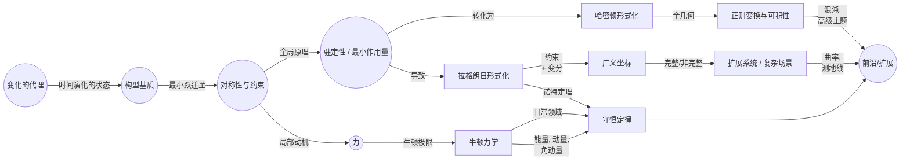

# 重新构想经典力学：一种极简的、概念驱动的架构
* * *

--- 摒弃先入之见，重新构建 —— 让运动与对称性的本质定义一切。

# 第一章 基础基石

**题词：**  
“在一片空白的宇宙中，一个单一的变换火花在等待定义。”

任何机械理论的核心都蕴含着一个初始种子：事物如何变化的概念以及这些变化展开的框架。虽然后续章节将揭示力、能量、守恒定律和更复杂的结构，但开篇第一章坚持清理预先构想的框架中的杂乱。我们从最基础的概念开始 —— “变化的代理”，一种配置和时间的“基质”，最终是对称性和约束的种子 —— 这些概念共同为经典力学铺平新的道路。

## 1.1 最小核心：“变化的代理”

本节引入最小的概念，即某物(一个“系统”)可以在我们解释为时间的参数上改变状态，这为所有后续运动、力或能量的概念奠定基础。

1. **为什么我们需要变化的概念**  
   在一个没有预设法则的宇宙中，最直接的观察是“某些东西可以变化”。让我们将这种性质命名为“变化的代理”。数学上，可以通过集合 $\mathcal{S}$ 中的元素来模拟系统的“状态”。在一个抽象参数 $t$ 上，这些状态作为函数转移
   $$
     \Phi : t \mapsto s \in \mathcal{S}.
   $$  
   没有引入力或能量；我们只是承认了一种演化的潜力。

2. **状态空间及其演化**  
   最简单的抽象是让 $\mathcal{S}$ 离散或连续。在离散形式中，系统以类似整数的时间步长从一个状态“跳跃”到另一个状态。连续地，我们期望在实数 $t$ 之上的映射 $\Phi(t)$。两种观点共享原始统一性：一个随 $t$ 进展而“变化”的实体，标志着“动力学”的诞生。

3. **不引用能量或力播种“动力学”**  
   即使不指定是什么驱动转变，我们也感觉到“静态”和“演化”系统之间的差异。这种差异 —— 随着 $t$ 的流，状态如何从 $s_1$ 过渡到 $s_2$ —— 播种了“动力学”的种子。在经典力学中，我们将最终用力、动量或哈密顿量为这种动力学着色，但首先我们必须保持清晰：有一个系统，它有状态，并且随着时间变化。

## 1.2 配置与时间：基质

本节定义状态存在的概念“基质” —— 这是迈向将成为配置空间的第一步。强调离散时间和连续时间之间的相互作用，引用构建连续统一体的哲学平行。

1. **基本定义：点、维度和时间标签**  
   我们扩展“状态”的概念进入“配置”。考虑一个流形 $\mathcal{Q}$，其点表示不同的可能配置，而不是一个抽象集合。因此，单个配置是一个点 $q \in \mathcal{Q}$。相比之下，时间是一个外部参数 $t \in \mathbb{R}$ (或某个子集)。总之，系统的演化由
   $$
     q(t) : \mathbb{R} \to \mathcal{Q}.
   $$  
   描述。如果 $\mathcal{Q}$ 有维度 $n$，则存在 $n$ 个“位置”的自由度。因此，我们迈出了走向传统称为“配置空间”的第一步。

2. **离散构造与连续构造**  
   类比建设性的哲学，可以想象从更原始的部分构建时间的真实线(甚至是流形 $\mathcal{Q}$)。连续统一体是否先验存在，还是我们从小区间或“选择序列”组装它？这个问题让人想起直觉主义的观点，强调每个新的“时间片”或“配置片”可能是主动构建的。如果我们旨在从头定义经典力学，则假设连续性或构建它的张力密切相关。

3. **链接到更广泛的哲学平行**  
   回应重新构建数学的新“激进视角”，我们注意到假设 $\mathcal{Q}$ 为连续统一体揭示了一个假设。实际上，经典力学的许多方面依赖于连续性 —— 速度、加速度、积分 —— 因此认识到这里采取的概念飞跃至关重要。即便如此，我们怀疑经典力学的优雅结构暗示这个飞跃是有益的：时间和配置很可能连续流动，为即将到来的微分方程奠定基础。

## 1.3 从变换到不变性：对称性与约束

本节激发某些变化可能保留某些东西的想法，预示对称性(如导致守恒动量的那些)和减少有效自由度的约束。

1. **不变性及其含义**  
   一旦我们承认系统具有随时间演化的状态 $q \in \mathcal{Q}$，我们可以问：是否存在某种变换保持相关属性不变？符号上，假设一个变换
   $$
     q \;\mapsto\; q'
   $$  
   作用于 $\mathcal{Q}$。该变换下的不变性意味着某种结构性特征保持不变 —— 无论是距离、角度还是一般测度。这一原则预见内部对称性如何导致守恒量，编码在著名的诺特定理中。

2. **约束与自由度**  
   即使在这个初步阶段，约束(完整或非完整)可以作为限制允许 $q(t)$ 范围的条件引入。一个简单的约束可能说“系统必须保持在固定表面上”(如导线上的珠子)。概念上，约束减少了可用“基质”的维度，从而重塑我们如何建模变换或不变性。

3. **对称性诱导守恒的前奏**  
   尽管完整的诺特定理属于后文，但我们在这里播下种子：如果系统转换方式存在不变性，通常意味着在整个演化过程中保持不变的量。例如，如果配置空间在一个方向上是均匀的，则动量守恒；如果它围绕一个轴各向同性，则角动量守恒。这些关系澄清了“变化”的最小概念如何通过“不变” —— 将对称性原理补充完整，这将在经典力学的其余部分中发挥关键作用。

## 1.4 结论

在这三个部分中，我们嵌入了必要的哲学和技术支架，力学的宏大叙事由此产生。“变化的代理”为动力学设定舞台。“配置与时间”赋予其维度丰富性。“从变换到不变性”提供对称性和约束的蓝图。本章结束时，读者应该感觉到最小的跨越 —— 状态、时间和不变性 —— 如何形成可以重建所有经典力学的基础基石。

# 第二章 经典动力学的出现

**题词：**  
“从变化的单一线索中，运动的挂毯展开。”

在奠定状态和变换的基本概念之后，我们现在展开经典动力学的熟悉结构。本章追溯“变化”(第一章中的原始概念)如何具体化为力、能量，并最终成为最小作用量原理。通过这样做，我们看到牛顿力学作为一个强大的极限出现 —— 一种优雅地捕捉大部分日常物理现象的专业化。

## 2.1 概念路径到“力”

本节展示外部或内部推动力如何从状态变化的概念中浮现，激发“力”的概念以及我们可以表示它们的方式(例如，作为向量或势场)。

1. **从纯粹变化到定向变化**  
   之前，我们已经确定系统的状态 $s \in \mathcal{S}$ 随时间演化。没有进一步的结构，系统会从一个状态“漂移”到另一个状态而没有解释。这里，我们假设这种演化可以由一种推动力驱动 —— 一种以特定方式“推动”或“拉动”状态的影响。这种推动力成为我们对“力”的直观理解。

2. **假设一个推/拉**  
   让我们想象一个无穷小的时间片 $\mathrm{d}t$。如果状态从 $s(t)$ 转变为 $s(t) + \mathrm{d}s$，可以提出  
   $$
     \mathrm{d}s \;=\; \mathbf{F}(s)\,\mathrm{d}t,
   $$  
   其中 $\mathbf{F}(s)$ 是“推动”系统状态的对象。这个**类力的量**可能以不同形式存在：势的梯度、约束的拉格朗日乘子，或流形上的直接向量场。无论选择哪种表示，关键点是**力**被编码为系统瞬时变化的驱动者。

3. **推动力的表示**  
   - **向量或形式**：在欧几里得设置中，我们可以将力视为向量 $\mathbf{F} \in \mathbb{R}^n$。在一个更一般的流形上，它可能是引导演化方向的余向量或微分形式。  
   - **类似势的构造**：或者，我们可以定义一个标量函数 $\Phi(q)$，其负梯度作为力。这种势观点为基于能量的分析铺平道路。  
   - **约束系统与反应力**：如果存在额外的约束(例如，系统必须保持在某个曲面上)，一部分推动力可能表现为“反应力”，强制这些限制。

综合来看，“力”的概念不是公理，而是捕捉和分类系统演化的推动力的一个概念步骤 —— 为深入的基于积分的图像铺路。

## 2.2 最优性(或驻定性)原理

本节介绍一个关键的概念转折点：而不是在每个瞬间分析力，转向一个更广泛的积分视角，其中系统的轨迹“优化”或“驻定”某个泛函。这种方法产生了最小作用量原理 —— 拉格朗日和哈密顿力学的统一前提。

1. **局部 vs 全局**  
   在基于力的观点中，我们查看每个瞬时 $\mathrm{d}t$ 并观察 $\mathrm{d}s$ 或 $\mathrm{d}q$ 如何依赖于 $\mathbf{F}$。然而，我们可能会问：“从 $q(t_0)$ 到 $q(t_1)$ 的哪条路径是自然界选择的？”这里我们假设自然界“选择”使**作用量泛函**驻定的路径。符号上，我们定义一个作用量：
   $$
     S[q(\cdot)] \;=\; 
     \int_{t_0}^{t_1} L\!\bigl(q(t),\dot{q}(t),t\bigr)\,\mathrm{d}t,
   $$
   并施加极值条件  
   $$
     \delta S \;=\; 0.
   $$

2. **为什么选择“最优”或“驻定”路径？**  
   - **统一性**：一个单一泛函 $S$ 可以一致地包含所有相关的物理细节(动能、势能、约束)。  
   - **连续性与变分**：通过允许整个路径 $q(t)$ 的小变化，我们将从局部脉冲(力)转向全局一致性原则：系统的轨迹是“一体的”，以自洽的方式连接初始和最终状态。  
   - **普遍性**：拉格朗日和哈密顿形式主义源于这一原则。即使相对论或场论扩展也依赖于类似的驻定条件。

3. **拉格朗日与哈密顿力学的种子**  
   - **拉格朗日力学**：函数 $L$ 通常结合动能和势能，导致欧拉-拉格朗日方程。  
   - **哈密顿力学**：通过勒让德变换，我们在相空间中重新解释相同的原则，使用动量变量，将局部运动学与全局守恒定律联系起来。

因此，转向积分(或全局)视角不仅统一了现象；它在单一的总体原则下优雅地组织了经典力学的结构。

## 2.3 牛顿力学作为一种专业化

本节展示牛顿定律 —— 日常物理学的基石 —— 在这种框架内自然出现，表现为简化或特定的极限，在低速、非相对论领域和平坦背景中仍然稳健。

1. **位置、速度、加速度的形式化**  
   在欧几里得设置中，设配置空间为 $\mathbb{R}^3$。标记系统的配置为 $\mathbf{r}(t)$。则速度为 $\dot{\mathbf{r}}(t)$，加速度为 $\ddot{\mathbf{r}}(t)$。推动力或“力”可以直接等同于质量乘以加速度：
   $$
     \mathbf{F} \;=\; m\,\ddot{\mathbf{r}}(t).
   $$

2. **$\mathbf{F} = m \mathbf{a}$ 和日常领域**  
   牛顿第二定律因此表述为：
   $$
     m\,\ddot{\mathbf{r}}(t) \;=\; \mathbf{F}\bigl(\mathbf{r}(t)\bigr).
   $$  
   这是对局部动力学的直接表达，当速度相对于光速 $c$ 较小时，时空曲率可忽略不计时有效。在这个观点中的力可能是引力、电磁力或接触相互作用。

3. **为何它依然稳健**  
   尽管作用量原理具有更深的优雅性，但牛顿定律提供一个直接透明的常微分方程系统。在典型的地面或低速天文环境中，它们具有惊人的预测能力。它们与基于积分的形式主义的紧密联系确保了任何可以定义适当拉格朗日或哈密顿的领域都可以产生牛顿方程作为简单的读取结果。

通过将牛顿定律置于更广泛的推动力和驻定性的概念中，我们看到它们不是普遍的基础，而是更一般树的一支极为有效的分支 —— 其主干是变化原则，其冠是最小作用量原理。

## 2.4 结论

本章遍历了从简单推动力概念到统一的最小作用量前提的演变，最终提炼出牛顿定律作为重要但专业化的推论。广义上的力被重新解释为可以描述为轨迹全局优化的局部微分表达式。通过这种视角，经典动力学建立在两个支柱上：力的局部语言和变分优化的全局语言。两者都反映了相同的底层挂毯，由变化的单一线索编织而成。

# 第三章 解析展开：拉格朗日与哈密顿层次

**题词：**  
“在泛函引导运动的地方，动量成为几何的声音。”

从概念上的“力”和“最优路径”到严格的分析形式主义的跨越支撑了经典力学持久的力量。在本章中，我们从定性的想法过渡到拉格朗日和哈密顿框架，揭示一个积分原理(作用量)如何锐化为精确的方程。结果是一个不仅统一能量、动量和对称性，还与深层几何基础设施 —— 辛流形 —— 相一致的工具集，照亮了从行星轨道到混沌系统的所有机械现象。

## 3.1 拉格朗日架构

本节展示“作用泛函”如何基于最小原理产生欧拉-拉格朗日方程。在此过程中，突显拉格朗日对称性、诺特定理、通过广义坐标处理约束以及构型空间的几何结构。

1. **作用泛函与驻定性原理**  
   拉格朗日方法编码这样的想法，一个系统的真正路径是使作用量极值化(或驻定化)的路径。具体来说，我们定义：
   $$
     S[q(\cdot)]
     \;=\;
     \int_{t_{0}}^{t_{1}}
       L\bigl(q(t),\,\dot{q}(t),\,t\bigr)
     \;\mathrm{d}t,
   $$
   其中 $q(t)$ 表示系统在构型空间中的轨迹，而 $\dot{q}(t)$ 是其时间导数。“最小(或驻定)作用量”原理表明：
   $$
     \delta S[q(\cdot)] \;=\; 0,
   $$
   对所有在边界 $t_0$ 和 $t_1$ 处消失(为零)的小变化 $\delta q(t)$ 成立。

2. **变分、边界条件及欧拉-拉格朗日方程**  
   通过对 $\delta S$ 执行函数导数并分部积分，可以得到著名的欧拉-拉格朗日方程：
   $$
     \frac{\mathrm{d}}{\mathrm{d}t}
       \Bigl(\frac{\partial L}{\partial \dot{q}^i}\Bigr)
     \;-\;
     \frac{\partial L}{\partial q^i}
     \;=\; 0,
   $$
   对每个广义坐标 $q^i$ 成立。因此，从关于作用量驻定性的全局陈述中，我们得到了控制运动的局部微分方程。边界条件的关键作用 —— 通常固定 $q(t_0)$ 和 $q(t_1)$ —— 揭示了经典力学如何将局部洞察(微分方程)与全局约束结合起来。

3. **诺特定理与对称性**  
   拉格朗日观点的一个显著优点在于其与对称性的协同作用。如果 $L$ 在连续坐标变换下不变(例如，空间平移、旋转、时间位移)，诺特定理断言存在守恒量(线动量、角动量、能量等)。符号上，导致 $\delta S=0$ 的对称性 $\delta q$ 暗示某些共轭动量的守恒：
   $$
     \frac{\mathrm{d}}{\mathrm{d}t}
       \Bigl(
         \sum_i \frac{\partial L}{\partial \dot{q}^i}\,\delta q^i
       \Bigr)
     \;=\; 0.
   $$
   因此，不变性产生运动积分，建立了几何与动力学之间的强大联系。

4. **约束与广义坐标**  
   在许多实际情况下 —— 从受限于弧线的摆到具有内部约束的刚体 —— 并非每个坐标都被视为自由的。相反，约束减少了系统的自由度。我们引入广义坐标 $(q^1, \dots, q^n)$ 来描述允许的构型，并适当重写拉格朗日函数。欧拉-拉格朗日过程如常应用，约束被内置到坐标的选择中或通过拉格朗日乘子强制执行。无论哪种方式，拉格朗日形式主义都以惊人的优雅容纳了各种机械系统，将其统一在基于作用量的原则之下。

5. **构型空间几何**  
   每个系统的“构型空间” $\mathcal{Q}$ 可能是一个 $n$ 维流形。拉格朗日函数 $L(q,\dot{q},t)$ 因此是切丛 $T\mathcal{Q}$ 上的一个函数。抽象地说，拉格朗日观点将几何($\mathcal{Q}$ 的形状)与物理($L$ 的形式)结合在一起，生成系统的演化规则。这种桥梁为我们准备了在哈密顿框架下的更深层次几何重新解释。

## 3.2 哈密顿视角

本节展示驻定性(或最优性)原理如何自然地通过勒让德变换转化为相空间语言，揭示哈密顿方程、能量的作用以及正则变换。

1. **从 $L$ 到 $H$ 的勒让德变换**  
   对应于 $q^i$ 的广义动量是：
   $$
     p_i
     \;=\;
     \frac{\partial L}{\partial \dot{q}^i}.
   $$
   如果这种关系是可逆的(例如，非奇异动能项)，我们通过勒让德变换定义哈密顿量 $H$：
   $$
     H\bigl(q,\,p,\,t\bigr)
     \;=\;
     \sum_i \,p_i\,\dot{q}^i
     \;-\;
     L\bigl(q,\,\dot{q},\,t\bigr),
   $$
   其中 $\dot{q}^i$ 根据 $\bigl(q,p\bigr)$ 表达。这个新函数 $H$ 通常表示总能量(动能加势能)，尽管在规范或速度依赖势的情况下会有一些细微之处。

2. **相空间中的正则方程**  
   通过将作用量原理用 $\bigl(q^i, p_i\bigr)$ 而不是 $\bigl(q^i, \dot{q}^i\bigr)$ 重新表述，我们得到哈密顿方程：
   $$
     \dot{q}^i
     \;=\;
     \frac{\partial H}{\partial p_i},
     \quad
     \dot{p}_i
     \;=\;
     -\,\frac{\partial H}{\partial q^i}.
   $$
   这些看起来简单的一阶 ODE 统一了力 $\mathbf{F}$ 与能量守恒的概念：速度和动量成为描述系统在**相空间** $T^*\mathcal{Q}$ 中演化的正则坐标。

3. **哈密顿原理与能量守恒**  
   正如拉格朗日方法利用 $\delta S \!=\! 0$，哈密顿方法同样确保如果 $H$ 不显式依赖于时间，则它是一个守恒量(即总能量)。事实上，正则结构优雅地编码许多不变量：如果一个坐标是循环的(不在 $H$ 中出现)，它的共轭动量是守恒的。

4. **正则变换与对称性**  
   哈密顿形式主义突显保持哈密顿方程形式的变换的几何结构 —— 称为正则变换。这些变换常常简化问题，揭示运动积分，或澄清隐藏的对称性。它们可以通过专门的“生成函数”生成，从而引出整套解法(例如，在可积系统中的作用角变量)。

5. **从速度到动量：概念转换**  
   尽管拉格朗日力学重视“基于速度”的 $\dot{q}$ 变量，哈密顿力学重新关注动量 $p$。在适当的条件下，这两种图景完全等价。这种对偶视角对于揭示更深层次的几何结构(辛流形、泊松括号)至关重要，这些结构统一了离散变换、连续对称性和积分不变量。

## 3.3 相空间的几何

本节突显哈密顿力学背后的深层几何结构，重点介绍辛流形、变换、可积性以及高级动力学现象的简要介绍。

1. **从切丛到余切丛**  
   在拉格朗日力学中，我们将切丛 $T\mathcal{Q}$，带有坐标 $\bigl(q^i,\dot{q}^i\bigr)$，作为基本对象。哈密顿力学则关注余切丛 $T^*\mathcal{Q}$，带有坐标 $\bigl(q^i,p_i\bigr)$。这种转变不仅仅是代数上的奇思妙想：它反映了动量而非速度如何成为动力学的主要描述者。

2. **辛流形与哈密顿流**  
   $T^*\mathcal{Q}$ 的一个决定性特征是其辛结构，由闭合且非退化的 2-形式 $\omega$ 给出。通常局部地写为：
   $$
     \omega
     \;=\;
     \sum_i
       \mathrm{d}p_i
       \,\wedge\,
       \mathrm{d}q^i,
   $$
   这种形式构成了哈密顿方程的基础。实际上，对于哈密顿量 $H$，流向量场 $X_H$ 满足：
   $$
     \iota_{X_H}\,\omega
     \;=\;
     \mathrm{d}H,
   $$
   为时间演化强制执行一个丰富的几何规定。$\omega$ 的非退化性确保每个哈密顿函数 $H$ 生成唯一的流。

3. **可积性、混沌与正则结构**  
   辛观点澄清了系统何时是 (a) 可积的 —— 支持全局作用角变量和准周期轨道，或 (b) 混沌的 —— 其中初始条件的小差异导致指数发散。正则变换归结为在保留 $\omega$ 的辛流形上进行坐标变换。这些变换允许人们线性化或解耦某些动力学，剖析隐藏的对称性，并发展扰动理论 —— 对于从有序到混沌的解析至关重要。

4. **更广阔的视野：与场论和量子化的联系**  
   这种几何装置远远超出了点力学：场本身可以在无限维相空间中被赋予辛形式，预示着量子构造(几何量子化)或相对论场论。通过识别相空间作为一个几何舞台，经典力学无缝地融入现代框架，其中曲率、拓扑和边界条件以一种类似于“从最少公设构建数学”的激进愿景的方式塑造进化。

## 3.4. 结论

拉格朗日与哈密顿层次展示了单一的驻定作用量原理如何用两种互补的语言 —— 基于速度的和基于动量的 —— 表达，以及每种视角如何与统一的几何结构相一致。拉格朗日方法强调对称设计如何通过诺特定理导致守恒律，而哈密顿方法揭示将变换与不变量编织在一起的深刻的辛结构。它们共同构成经典力学的分析支柱，为我们进一步扩展到更广义、受约束或高维的世界做好准备，这些内容将在后续章节中探讨。

# 第四章 扩展与概念影响

**题词：**  
“随着一个原理醒来，整个结构世界便达到顶峰然后破碎。”

在建立拉格朗日和哈密顿力学的核心框架之后，我们现在扩大视野。现实世界的系统通常涉及约束、非笛卡尔坐标或纯粹的几何视角，这些揭示了力学更深层次 —— 有时是隐藏的 —— 结构。此外，我们在哈密顿形式主义中介绍的辛观点使得变换和理论扩展成为可能，其中许多与现代数学紧密相连。本章探讨最小的作用量原理和相空间几何如何扩展到高级技术，将经典力学与几何学及其它领域的前沿联系起来。

## 4.1 约束、广义坐标及其他

本节探讨我们最小的方法如何扩展到复杂的约束或非笛卡尔场景，展示广义坐标可以优雅地封装几乎任何物理设置。简要介绍曲面上的测地线及其作为最小路径的角色，暗示其与相对论的可能联系。

1. **完整约束与非完整约束**  
   - **完整约束**：这些可以用坐标之间的代数或微分条件表示，例如 $f(q^1,\dots,q^n)=0$。一个简单的例子是一个被限制在一个圆周上运动的摆。通过这些约束减少构型空间的维度，可以获得较少但完全独立的广义坐标。  
   - **非完整约束**：这些涉及速度级别的或基于不等式的限制，不能集成到单一的代数方程中。例如，一个无滑动滚动的球体施加了一个连接平移和旋转坐标的速率约束。虽然拉格朗日乘子和广义坐标仍然有帮助，但非完整系统的处理可能会导致关键的区别 —— 一些约束力不做功，而其他则显著改变系统的自由度、动量或能量守恒模式。

2. **广义坐标和动量的作用**  
   拉格朗日/哈密顿力学最有力的创新之一是它用针对系统对称性或几何特性的变量替代标准笛卡尔坐标。这些“广义坐标”简化了运动方程，使人们能够以最少的概念开销处理复杂连杆、旋转参考标架或柔性体。相应地，通过
   $$
     p_i
     \;=\;
     \frac{\partial L}{\partial \dot{q}^i},
   $$
   计算广义动量，捕捉到一种统一的动量概念，可能结合线性、角动量甚至规范成分。

3. **曲面上的测地线作为最小路径**  
   通常，约束或弯曲坐标系可以解释为系统在其上移动的潜在流形。从纯粹的几何角度看 —— 例如，在曲面上自由粒子的运动 —— 作用量最小的路径实际上是一条测地线：局部上“最小化”(或驻定化)长度或能量的曲线。这个概念与广义相对论中的通道共鸣，其中自由下落的粒子跟随时空测地线。通过突显测地线运动，我们看到驻定性原理将经典力学与可优雅扩展到高级主题的几何框架统一起来。

## 4.2 辛几何与正则变换

本节深入探讨保持相空间核心辛结构的变换。探索生成函数、刘维尔定理以及诸如可积系统和混沌等高级主题，展示哈密顿几何的丰富性。

1. **生成函数与正则变换**  
   正则变换是保持辛形式 $\omega$ 的变量映射 $(q,p) \mapsto (Q,P)$。它们确保哈密顿方程的结构保持不变。生成函数 —— 如 $F_2(q,P)$ —— 提供一种系统定义这些变换的方法，保证 $\mathrm{d}p \wedge \mathrm{d}q = \mathrm{d}P \wedge \mathrm{d}Q$。正则变换允许我们简化运动方程，有时将其简化为可积形式。

2. **刘维尔定理与相空间体积**  
   哈密顿力学的一个核心见解是，由 $H$ 生成的流保持相空间体积 —— 这被称为刘维尔定理。简单地说，如果我们跟踪初始条件集合在相空间中的演化，形状可能会变形，但总体积保持不变。这一结果奠定了统计力学、遍历理论以及关于平衡分布(如微正则系综)的许多论证的基础。

3. **高级主题的种子：作用-角变量、可积性与混沌**  
   - **作用-角变量**：在具有与自由度数量相同的运动积分的可积哈密顿系统中，可以将系统转换为“作用-角”坐标 $(J,\theta)$。然后，演化在这些角度上均匀进行，描述相空间中不变环面的温和运动。  
   - **混沌**：当可积性破裂时，小扰动可能导致对初始条件的敏感依赖。这种现象导致混沌动力学，展示了确定性方程如何产生不可预测的长期演化。正则变换和扰动理论有助于识别可积区与混沌之间的过渡层。

简而言之，辛几何阐明了变换、不变量和稳定性如何在哈密顿系统中相互作用 —— 在单一几何织锦下统一了广泛的机械现象。

## 4.3 现代数学的切线视图

本节将最小方法与前沿思想 —— 纤维丛、几何量子化和拓扑方法 —— 联系起来，这些思想将经典力学视为更广泛数学宇宙的一部分。说明“从零构建”的精神如何与现代或“直觉主义”的扩展共鸣。

1. **纤维丛与规范结构**  
   我们可以用主丛或伴随纤维丛的语言重新解释机械系统。例如，一个旋转刚体或电磁场中的带电粒子可以用几何术语表示：局部平凡化、规范联络、曲率。这样的框架表明，经典系统常常隐式地编码拓扑约束和规范场。

2. **几何量子化与通向量子力学的桥梁**  
   在桥接经典与量子理论时，通常从辛流形 $(\mathcal{M}, \omega)$ 和带有合适联络的线丛开始。称为几何量子化的程序试图系统地“量子化”经典自由度，将泊松括号变为对易子。尽管历史上存在许多技术细节，但概念上的推动力在于，经典相空间可以成为量子希尔伯特空间的起源，符合从最简单的机械核心构建高级物理学的理念。

3. **挠率、非对称扩展与构造视角**  
   - **挠率 / 非对称联络**：某些高级微分几何理论允许存在挠率，有效地扭曲了通常的测地线或平行传输概念。将挠率扩展纳入机械模型回响着可能的“广义”经典动力学或与自旋自由度的耦合。  
   - **构造或直觉主义主题**：“激进视角”建议我们可以从离散或思维的“选择序列”重新推导连续结构。经典力学的现代构造扩展可能逐步定义连续统、辛形式或测度空间，挑战旧有的假设，即这些结构完全形成。这些方法代表了替代基础 —— 将观察者的创造力或“构建主体”置于机械定律的中心。

## 4.4 结论

经典力学超越了在笛卡尔平面上运动的简单质点。通过约束和广义坐标，它可以适应任何链接、表面或场的排列。辛几何将哈密顿观点巩固为一个稳健的几何计划，其中变换和稳定性的测量或混沌变得自然。此外，现代数学在桥接量子理论、拓扑学和构造方法的方向上扩展了这些想法，展示了我们在每个跨越的边界上，新的机械结构概念世界等待着我们去发现。

# 第五章 统一的见解与未来的前沿

**题词：**  
“在最小假设的静止中，蕴含着无限的机械可能性。”

随着每一章的推进，我们从几个核心原则 —— “变化的代理”、“时空意识”和“最优性” —— 出发构建了经典力学，并揭示了标准表述(牛顿、拉格朗日、哈密顿)是如何通过系统的分层出现的。现在我们将这些线索整合起来，展示运动的基本“火花”如何分支成多个视角，每个视角都回响着相同的基本思想。然后我们超越传统的界限，将经典力学与哲学潜流、现代科学前沿及推测性的新框架联系起来。这样做，我们强调从头重新推导经典力学可以是一个生成行为，促使进一步的结构洞察和全新领域的诞生。

## 5.1 核心总结：从一个原理到多种表述

本节回顾经典力学的每一个基本方面如何源自一个小的核心概念集合 —— 即，“变化的代理”加上“驻定性(最优性)”。突显牛顿、拉格朗日和哈密顿表述如何在这些关于变化和对称的基本前提下统一。

1. **单一的动力学火花**  
   我们从最小的想法开始，即某物随时间而变化：“系统”在一个概念基质中演化。这个单一陈述孕育了状态空间或构型流形的概念，最终自然地引出了驱动变换的动机 —— 力、动量或势能。

2. **牛顿、拉格朗日和哈密顿的观点**  
   - **牛顿**：专注于局部力和加速度(例如 $\mathbf{F} = m \mathbf{a}$)，在欧几里得空间中的直接建模特别有效。  
   - **拉格朗日**：提升积分属性(作用量)并通过驻定性推导局部运动方程。对称性变得明确，约束在广义坐标中找到系统的立足点。  
   - **哈密顿**：将这一驻定性原理转化为相空间语言，揭示辛几何、正则变换以及可积性/混沌。动量而非速度成为中心描述符。

3. **统一主题**  
   - **对称性与守恒**：诺特定理将对称不变性与守恒量联系起来，桥接了每种表述方法中的不变量(动量、能量、角动量)。  
   - **几何与变分原理**：无论我们谈论的是表面上的测地线(拉格朗日)还是辛流形上的流(哈密顿)，几何锚定了“最小或驻定路径”的概念。  
   - **抽象层次**：每个形式化方法都可以视为同一原始想法的体现：系统在构型/相空间中的路径由一个“最优”或“自洽”的动机所支配。

简而言之，一切都追溯到单个根源 —— 由约束、对称性和驻定性原理塑造的时间演化的状态。从这个根部，形成了一个丰富的分支树状的经典力学公式，每个公式以不同的数学服饰保持着相同的活力本质。

## 5.2 新兴的哲学与实践观点

本节反思空间、时间与连续性的深层性质，将其与更广泛的科学讨论联系起来。探讨力学是否暗示了宇宙中的目的论“目标”，或者只是将局部动力学定律编码为全局积分。探索经典力学如何与现代物理学共鸣或影响现代物理学。

1. **目的论幻象与机械必然性**  
   最小作用量原理有时会引发关于自然界“智慧”或“有意设计”的评论。实际上，这种“最优性”不过是对动力学从泛函的驻定变化中得出的一个数学上一致的陈述。一些人认为的目的论，在更深的意义上，是局部规则(力、约束)折叠进入全局积分描述的反映。然而，“自然设计”的感知仍然具有哲学魅力，提醒我们宇宙的结构秩序往往从看似最小的假设中涌现。

2. **空间、时间与连续统**  
   我们已经看到，构型或相空间的连续统概念对于经典理论至关重要。然而，从直觉主义或构造的角度来看，连续统可能是逐步建立的(通过选择序列或离散基础)。经典力学可以在该框架之上存在或将其实体化；无论如何，几何一致性表明一旦采用(或构建)连续性，驻定性原理就能优雅地统一局部与全局现象。

3. **现代领域的平行**  
   - **连续介质力学**：基于作用或变分逻辑扩展到可变形介质、流体的流或场论，表明局部应力-应变关系如何映射到全局能量泛函。  
   - **场论与相对论**：爱因斯坦的场方程可以从作用原理导出，测地线的概念推广到弯曲时空。因此，我们在经典力学中勾勒的蓝图在广义相对论及其他领域产生共鸣。  
   - **量子力学**：路径积分、算子方法和半经典展开追溯到经典作用量。辛结构转化为量子交换子或波函数领域，保持了几何和驻定性的回声。

总体而言，经典方法仍然是高级物理的核心概念支柱，将日常现象与理论科学的前沿联系起来。

## 5.3 未来方向与创新火花

本节建议一种基于最小概念锚点的“从头开始”方法如何在力学中开辟全新的视角。提供潜在研究途径的一瞥 —— 从奇异几何到计算策略 —— 并鼓励持续的激进重推导，质疑基本原理。

1. **挠率、非交换或离散经典力学**  
   - **挠性扩展**：假设我们允许经典流形上的连接有挠率。这可能会产生新的类力项，可能与自旋或几何不对称的延展物体相关。  
   - **非交换坐标**：在某些量子启发或涌现引力设置中，可以考虑不交换的坐标。在部分非交换空间中重新推导哈密顿或拉格朗日规则可以揭示对标准力学的微妙修正。  
   - **离散类似物**：计算驱动范式可以离散化时间或空间，将机械演化建模为一系列蛙跳步骤或局部细胞自动机规则。这样的离散框架通常很好地近似经典力学，但也可能自发产生在连续极限下不易观察的新现象。

2. **与计算方法和大数据的协同**  
   - **多尺度机械系统**：从分子动力学到天体力学，从微观细节到宏观模式的桥梁需要经典定律、数值模拟和统计方法的协同。小尺度的几何统一指导稳定积分器或保留辛结构的几何积分器。这种协同在高维系统(如气候、天体物理团簇)中尤其有趣。  
   - **机器学习方法**：最小概念锚点可用于引导从数据中发现或细化机械定律的机器学习算法。事实上，神经网络或符号回归常常从观测集中“重新推导”哈密顿量或拉格朗日量 —— 这是即使黑箱方法在寻求预测完整性时也倾向于这些核心结构的一种反映。

3. **进一步的“激进重推导”**  
   - **质疑连续统**：从直觉主义或离散数学中汲取灵感，我们可以尝试在最小集合上重构力学，揭示连续几何是如何产生的。  
   - **跨学科火花**：借用范畴论、拓扑量子场论或耗散系统的方法可能以意想不到的方式扩展经典蓝图。每个新的视角可以锐化或重新阐述旧结构(如摩擦、开放系统、反馈循环)。  
   - **哲学再审视**：“变化的代理”概念可以在更广泛的背景下重新定义，从生物学(如形态发生)到网络动力学(如社会或经济系统)。在这些领域中调查机械类比可能会开启整个“广义力学”的新领域。

本质上，通过将经典力学简化为其概念骨架，我们获得了一个可以从其嫁接无数新“器官”的视角。结果是一种不断演变、适应的科学，它既与其经典遗产保持一致，又冒险进入量子几何、离散计算或社会复杂系统等多样领域。

## 5.4 结论

通过从基础开始构建，专注于强大但最小的锚点，我们不仅更新了对经典力学的理解，还为新的飞跃奠定了舞台。对称性、几何、能量原理 —— 这些仍然是指引新兴理论的明亮路标，架起看似迥异的领域之间的桥梁。远非一个纯粹的历史性或“已解决”的学科，经典力学证明是一个充满想法的活泉，每一次重新解释的浪潮都在数学、物理学及其他领域揭示更多的可能性。

# 附录 A：概念关系概览

下面是一个概念图，展示在本文中的主要思想和形式框架是如何交织在一起的。从“变化的代理”和“构型基质”的最小种子开始，我们逐步进展到力、变分原理以及拉格朗日和哈密顿力学的双重扩展。在每一层都存在对称性和约束，引导我们找到守恒量和更深层次的几何结构。该图旨在一目了然地传达文本的逻辑流程以及每个概念如何与其他概念相联系。

**图表解释：**

1. **变化的代理**和**构型基质**形成基础层。它们共同定义了“某物”可以在一个概念连续统或流形内随时间演化。
2. **对称性与约束** 在认识到某些变换可能保持性质不变且某些有效配置受到限制时自然产生。
3. **力**(局部视角)和**驻定性原理**(全局视角)从这些基础上发展而来。它们分别介绍了如何建模瞬时的推/拉或一个普遍的积分原理(最小作用量)。
4. **牛顿力学**通过在典型的欧几里得和低速设置中专门化加速度-力关系来获得。
5. **拉格朗日形式化**将动力学统一在一个作用量积分下，通过广义坐标处理约束，并突显诺特定理，揭示在连续对称下的守恒量。
6. **哈密顿形式化**将拉格朗日观点转化为相空间语言，强调动量而非速度；它自然连接到**辛几何**，其中正则变换和体积保存变得明确。
7. **扩展或复杂系统** —— 包括非完整约束、弯曲空间和测地线运动 —— 无缝融入拉格朗日/哈密顿框架，展示了广泛的应用性。
8. **前沿与扩展**统一高级概念(混沌、可积或部分可积系统、量子几何、挠率等)，鼓励重新推导经典前提以推进新的物理和数学领域。

通过跟随这些相互关联的思想，读者可以理解初始的“变化火花”如何延续到稳健的数学架构 —— 牛顿、拉格朗日、哈密顿 —— 并最终进入现代理论全景。

