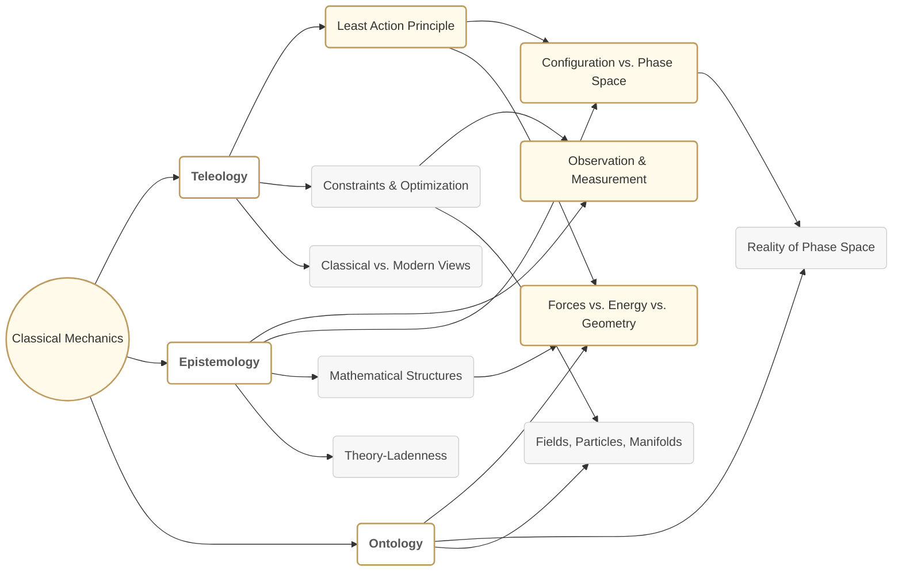

# Reimagining Classical Mechanics Through a Modern Philosophical Lens
* * *

--- Only by challenging our frameworks can we unlock the deeper truths behind motion and reality.

# **1. Core Viewpoint & Central Concepts**  
*Epigraph: “From the roots of motion to the edges of existence—our vantage changes everything.”*

Viewed through the lenses of teleology, epistemology, and ontology, Classical Mechanics transforms from a mere collection of mathematical models into a profound inquiry into the fabric of reality. Teleologically, one might ask “Why does nature seem to optimize or minimize certain quantities?” Epistemologically, we confront “How do we truly know the underlying principles of motion?” And ontologically, we probe “What actually exists in mechanical descriptions—forces, energies, geometries, or something more fundamental?” These questions stretch beyond the conventional scope of equations and into the deeper philosophical territory that Classical Mechanics implicitly occupies.

At the heart of Classical Mechanics lie several intertwined concepts:

1. **Principle of Least Action (PLA)**: Often introduced as a variational rule that yields Newton’s or Hamilton’s equations, it can also be seen as a potential teleological statement: paths taken by systems might reflect some “optimal” or “extremal” design in nature. Whether this is a mere mathematical device or evidence of deeper purpose is a key philosophical juncture.

2. **Dual Perspectives (Lagrangian and Hamiltonian Mechanics)**: While Lagrangian mechanics frames the problem in terms of configuration space and kinetic-potential energy trade-offs, Hamiltonian mechanics shifts to phase space—momenta paired alongside coordinates. Both are, in principle, mathematically equivalent, yet each draws our attention to distinct conceptual structures (e.g., configuration vs. momentum, velocity vs. energy). This duality foregrounds epistemic choices about how we best capture the essence of motion.

3. **Configuration and Phase Spaces**: The transition from a coordinate-and-velocity viewpoint (configuration space) to a coordinate-and-momentum viewpoint (phase space) is more than a technical recasting: it alters the meaning of “state,” “time evolution,” and “observation,” all of which bear epistemological and ontological significance. Are we describing an absolute geometry of events, or a more abstract manifold of possibilities?

In concert, these themes illuminate the core argument of this document: **that the seemingly austere framework of Classical Mechanics conceals fundamental questions of purpose, knowledge, and being.** Addressing these questions not only enriches our grasp of mechanical laws, it redefines them—in ways that may resonate with broad philosophical paradigms or even open pathways to new research. By approaching motion from teleological, epistemological, and ontological angles, we find that classical mechanics stands at the nexus of rigorous science and profound human inquiry.

# 2. Philosophical Foundations for Reconstructing Mechanics  
*Epigraph: “In understanding why we ask how, we redefine what truly governs motion.”*

To reconstruct Classical Mechanics from a deeper vantage, one must confront the very philosophical pillars upon which it rests. Teleology, epistemology, and ontology—each in its own way—sculpt our notions of what motion is, why it happens, and how we can claim knowledge about it. By interweaving these perspectives, we uncover latent threads that have guided the evolution of mechanics from Aristotle through modern quantum thinkers, revealing how old questions of “purpose” and “reality” persist in today’s formulations.

## 2.1 Teleology: From Aristotle’s Finals to Feynman’s Pragmatism

Within the realm of mechanics, teleology concerns the “why” behind motion. Historically, Aristotle proposed that natural processes tend toward “ends” or “goals”; his universe was imbued with final causes. Later theorists, such as Maupertuis and Euler, invoked something akin to a “purpose” in nature through ideas like the Principle of Least Action—it appeared that systems spontaneously seek minimal or optimal configurations.

Yet modern caution—exemplified by Richard Feynman—urges us not to ascribe conscious “aim” to particles and fields. Instead, the mathematician-physicist viewpoint reduces teleology to a compact set of equations and variational statements. Does least action imply nature’s design, or is it simply a powerful, unifying model? In many modern texts, teleological connotations are softened to reflect a methodological convenience: physical laws appear “optimized,” but this might be no more than our mathematical lens.  
• From a strictly scientific angle, teleology risks conflating descriptive elegance with actual “purpose.”  
• From a broader philosophical stance, however, the resonance with purposeful design cannot be easily dismissed—it highlights an enduring tension between seeming “intent” and impersonal formalism.

## 2.2 Epistemology: The Architecture of Knowledge in Mechanics

If teleology explores the “why,” epistemology explores how we come to “know.” In Classical Mechanics, our knowledge chains from empirical observation, mathematics, and the conceptual frameworks we choose to adopt:

1. **Observation as a Starting Point**: Inspired by the empirical success of Newton’s laws, mechanics has always prized measurable phenomena—accelerations, forces, or energies. But the path from raw data to equations is paved with assumptions about continuity, differentiability, and the feasibility of idealized experiments.

2. **Mathematical Structure and Modeling**: Once we decide on an approach (e.g., Lagrangian vs. Hamiltonian formulations), we commit to an internal “language” of states, transformations, and conserved quantities. These structures impose a certain worldview—whether it be velocity-based or momentum-based, local differential laws or global variational principles. Our epistemic stance thus depends heavily on the chosen model’s internal coherence and predictive power.

3. **Reliability and Theory-Ladenness**: Mathematical predictions become validated when they converge with experiments. Still, each experiment is “theory-laden,” shaped by prior assumptions about how to measure force, position, or time. Hence, even “classical” mechanics is not neutral. Our techniques—like coordinate systems or integrals of motion—are contingent upon a bigger epistemic scaffolding: we believe in the continuity of spacetime, the sufficiency of real numbers in modeling nature, etc.

In short, by acknowledging that our knowledge of mechanics is intrinsically bound up with the frameworks we impose, we open ourselves to new vantage points. Changing from a force-based to an action-based approach is not just a technical revision—it’s an epistemic reconfiguration of where we see the “essence” of interaction and evolution.

## 2.3 Ontology: What Really “Is” in Mechanical Theories?

The final leg of our philosophical triad concerns ontology: the nature of being or existence within Classical Mechanics. At its simplest, early Newtonian ontologies posited a cosmos of particles with well-defined forces. But the emergence of Analytical Mechanics complicated this picture:

1. **Fields vs. Particles vs. Geometries**:  
   - In Newton’s original sense, “particles” and “forces” were the real constituents.  
   - By the time of Lagrange and Hamilton, “energy” or “action” could be viewed as the more fundamental entity.  
   - In modern geometric or symplectic treatments, it is arguably the manifold structure itself—composed of points labeled by $(q,p)$—that “exists” in a more primary sense.

2. **Levels of Abstraction**:  
   - Are coordinates $(q, \dot{q})$ or $(q,p)$ just convenient labels for real processes, or do they reflect a deeper truth about spacetime?  
   - When we speak of “phase space,” do we mean a physically real $6N$-dimensional manifold (for $N$ particles) or simply a mathematical device for systematizing knowledge?

3. **Mechanics and Reality**:  
   - Some interpret the principle of least action as an ontologically “true” statement about how nature “chooses” its actualized paths.  
   - Others take a more instrumental stance, seeing it as a succinct way to encode equations of motion without positing any deeper existence claims.

This tension underscores how rethinking “what is” in mechanics leads us to reevaluate the status of classical laws themselves. They might be fundamental truths woven into spacetime’s architecture—or they might be approximate frameworks shaped by deeper, possibly quantum or emergent, realities.

## 2.4 Concluding Remarks on Philosophical Foundations

Teleology, epistemology, and ontology do not merely add intellectual flourish to a mechanical treatise; they inform the very structures on which our theories rest. By tracing teleological elements (purpose or optimization), epistemic commitments (how we justify knowledge), and ontological claims (what we believe mechanics fundamentally describes), we lay the groundwork for reimagining Classical Mechanics in a way that harmonizes its formidable mathematical successes with the philosophical depth that gave birth to it. 

In proceeding chapters, we will see how this triad surfaces again and again—whether we are analyzing the historical arc from Newton to Lagrange, investigating dualities in phase space, or inquiring into what “really exists” behind the abstractions of force, energy, or action. By embracing these foundational questions, we make room for a reinvigorated, philosophically aware mechanical worldview that stands ready to engage with the complexities of both mind and nature.

# 3. A Philosophical Trajectory of Classical Mechanics

## 3.1 From Newton to Analytical Mechanics  
*Epigraph: “Each reformulation of motion is also a step in transforming our view of nature’s blueprint.”*

Classical Mechanics, famously initiated by Isaac Newton, first took shape around the idea of force-driven motion. In Newton’s formulation, each change in velocity is correlated with a corresponding force, capturing how external influences “cause” modifications in an object’s motion. This picture served as a guiding beacon for centuries, enabling precise predictions of planetary orbits, falling objects, and countless mechanical systems.

Yet as physicists probed more complex systems—such as constrained motions, multi-particle interactions, or rotational dynamics—the *force-centric* approach began to feel cumbersome. Questions arose: Are we simply enumerating every force in a system, or might there be a more unified principle? Enter **Analytical Mechanics**, which shifts attention away from direct force-causality to energy balances, symmetries, and constraints. Two particularly influential reworkings emerged:

1. **Lagrangian Mechanics:** Built on the Lagrangian $L = T - V$ (kinetic minus potential energy). By extremizing an integral of $L$ over time, one derives Euler-Lagrange equations that encapsulate the dynamics across an entire trajectory. Here, constraints and generalized coordinates take center stage. Motion becomes less about “which force is pushing?” and more about “how energies balance and shape possible paths.”

2. **Hamiltonian Mechanics:** Recasts the problem in terms of a Hamiltonian $H$, frequently corresponding to total energy. Instead of tracking forces, we now highlight **conjugate momenta**. Hamilton’s equations describe time evolution in a phase space of coordinates and momenta, revealing deeper structures like symplectic geometry and integrals of motion.

Philosophically, this progression from Newton to Lagrange and Hamilton parallels an evolution of conceptual focus:

- **From “Why do forces exist?” to “How do we encode all motion in one unifying principle?”**  
  The Newtonian approach leads one to dissect every interaction, while Analytical Mechanics consolidates them into universal functionals (Lagrangians, Hamiltonians). In doing so, it subtly replaces direct force causality with overarching notions of energy or action.  

- **From “Forces as ultimate causes” to “Constraints and symmetries as choosing the path.”**  
  The emphasis in Analytical Mechanics on constraints, boundary conditions, and energy surfaces underscores that the “cause” of motion might be better described by boundary terms and global properties rather than localized pushes and pulls.

This shift reflects not just a mathematical preference, but a deeper philosophical reimagining: the laws of motion become coded in an abstract functional or energy-based blueprint, inviting us to see mechanical phenomena as a tapestry of symmetries, invariants, and extremal principles rather than a sum of individual forces acting piecewise.

## 3.2 Action Principles, Variational Methods, and Duality  
*Epigraph: “In the search for ‘least’ paths, we often find the most profound symmetries.”*

If Newton laid a foundation by tying motion to external impetus, the **Principle of Least Action** (PLA) reframed motion as an outcome of universal optimization—or at least *stationarity*—over all possible paths. This leap would prove to be both an elegant unification and a fertile ground for philosophical debate. At its core:

1. **Variational Calculus**: Instead of focusing on the net force at each instant, one imagines all potential trajectories the system could follow between initial and final states. The actual trajectory is singled out by making the action integral—roughly, the integral of $L$ over time—extremal. This approach neatly encodes constraints and even quantum analogies (via path integrals), pointing to a deeper geometry beneath classical equations.

2. **Legendre Transform**: Bridging **Lagrangian** and **Hamiltonian** mechanics, the Legendre transform shifts our perspective from velocity coordinates $\dot{q}$ to momenta $p$. This re-parameterization clarifies the link between energy-based descriptions (Hamiltonian) and trajectory-based descriptions (Lagrangian). Geometrically, it converts the tangent bundle to the cotangent bundle, revealing a **symplectic structure**—an elegant 2-form $\omega$ that organizes the entire phase space in a closed, non-degenerate manner.

3. **Duality**: The transformation between $(q,\dot{q})$ and $(q,p)$ underscores multiple dualities. Just as position and momentum are paired, so are energy and time in certain advanced analyses. The principle of least action thereby resonates with broader philosophical discussions:

   - **Teleological Undercurrents**: Maupertuis and Euler saw nature’s “efficiency” or “economy” as pointing toward deeper design or purpose. A system’s path is not just found by summing up momentary forces; it emerges from an integrated, global principle.  
   - **Mathematical Elegance vs. Real Purpose**: Modern formulations (à la Feynman) often reduce teleology to a formal convenience—nature doesn’t “aim” for minimal action but rather obeys equations that are *concise* when expressed in action-minimizing form. The debate persists whether this brevity is accidental or indicative of higher metaphysical truths.

By highlighting the PLA, we see how the classical mindset transforms into a **global** viewpoint: local force laws become one facet of a deeper, integrative principle. The geometry of phase space (symplectic manifolds), the pairing of conjugate variables (position $\sim$ momentum, energy $\sim$ time), and the integrals of motion arising from variational symmetries (Noether’s theorem) all point to a tapestry of dualities bridging multiple facets of mechanistic reality. 

In sum, **the journey from force-based Newtonian rules to action-based Analytical Mechanics** marks not just a technical convenience but a philosophical awakening. Motion is no longer a product of sum-of-forces alone; it is determined by a confluence of constraints, symmetries, and variational principles that lay bare the latticework of universal laws. Whether one reads therein a slender thread of teleology or a purely formal structure remains a matter of interpretation, yet it is indisputable that the principle of least action enframes mechanical phenomena in a broader, more unified vision—one in which geometry and mathematics partner to unveil nature’s most profound pathways.

# 4. Epistemological Dimensions: Knowledge, Models, and Representation

## 4.1 Configuration Space vs. Phase Space  
*Epigraph: “In reconfiguring space, we reshape the questions we can ask—and the answers we might find.”*

A fundamental question in Classical Mechanics—often overlooked from a philosophical point of view—is: “How do we choose to represent the system?” In practice, two principal representations prevail, each embedded in distinct mathematical structures:

1. **Configuration Space (Tangent Bundle Perspective)**  
   - Here, a system’s state is described by its generalized coordinates $q$ and their time derivatives $\dot{q}$. Geometrically, this framework occupies the **tangent bundle** $T\mathcal{Q}$, where each point corresponds to $(q, \dot{q})$.  
   - This viewpoint underlies **Lagrangian mechanics**, emphasizing velocities and potential/kinetic energies. It feels natural when dealing with constraints on coordinates or forms of motion: each velocity vector “lives” directly above the configuration point $q$.

2. **Phase Space (Cotangent Bundle Perspective)**  
   - Here, we re-describe the system’s state in terms of coordinates $q$ and their conjugate momenta $p$. The structure is the **cotangent bundle** $T^{*}\mathcal{Q}$.  
   - This formalism is native to **Hamiltonian mechanics**, where momenta become as essential as position. Symplectic geometry arises naturally in this setting: $\omega = \mathrm{d}q \wedge \mathrm{d}p$ captures the manifold’s fundamental two-form, conferring special geometric and topological properties on phase space.

From an epistemic standpoint, choosing configuration space vs. phase space is not simply a matter of algebraic convenience. It shapes the way we pose questions about causality, constraints, and conservation laws. Configuration space focuses on local changes in velocity (often more straightforward for applying boundary conditions), while phase space draws us into a global geometry where momentum, energy, and integrals of motion become transparent.  

Crucially, **Noether’s theorem** bridges these perspectives by relating continuous symmetries to conservation laws. It holds true whether we adopt Lagrangian coordinates or Hamiltonian coordinates, yet the interpretation can differ subtly. In configuration space, one might see symmetries as transformations in $(q,\dot{q})$-coordinates; in phase space, those same symmetries emerge as canonical transformations preserving the symplectic form. This underscores that “symmetry” and “conservation” are not mere happenstance but reflect deeper structures that transcend a single choice of representation.

Thus, each framework expands or limits our knowledge differently. Configuration space may highlight how constraints reduce degrees of freedom, while phase space can illuminate global integrability and chaos. Epistemically, then, each vantage reveals certain patterns or invariants more clearly, subtly influencing how we conceive, measure, and interpret mechanical phenomena.

## 4.2 Boundaries, Constraints, and the Role of Nonholonomic Systems  
*Epigraph: “When friction enters, purity fades—yet therein lies the nature of realistic knowledge.”*

On paper, many mechanical formulations begin with idealized assumptions—frictionless surfaces, rigid bodies, perfect constraints. Real-world scenarios, however, rarely respect such neat abstractions. Two related facets that significantly shape our epistemic stance are:

1. **Boundary Conditions**  
   - Lightly touched upon in classical derivations, boundary conditions determine how we set initial and final states, as well as whether (and how) partial derivatives vanish. In Lagrangian mechanics, we often fix end configurations so that no unwanted boundary terms appear in the variational principle. However, in more advanced or realistic contexts (e.g., free endpoints, impulsive collisions, or open systems exchanging matter/energy with the environment), boundary terms do not simply vanish.  
   - Epistemologically speaking, specifying boundary conditions reveals what we consider “legitimate data”: positions, momenta, energies, or something else. This choice underlines the extent to which experiments and external interactions define what is physically observable and thus “real” within the model.

2. **Nonholonomic Constraints**  
   - Classical “holonomic” constraints can typically be expressed as algebraic relationships among coordinates, integrable to reduce degrees of freedom. However, many practical systems—like rolling motion without slipping—introduce velocity-dependent constraints that do not integrate into a neat coordinate condition. Such **nonholonomic** constraints complicate or even invalidate naive transformations to reduce the system dimension.  
   - From a geometric viewpoint, these constraints may be interpreted as distributions on the tangent bundle (or phase space) that disallow certain directions of motion. Whether one sees these constraints as purely “epistemic fences” (our partial understanding of friction or rolling contact) or as “ontological facts” (true aspects of how bodies interact with surfaces) is partly a philosophical stance. In practice, acknowledging nonholonomic constraints shifts how we model the system, including which variables we count as fundamental and which Lagrangians or Hamiltonians remain valid.

In sum, boundaries and constraints remind us that mechanics—even in its classical domain—is richly intertwined with observation, idealization, and the complexities of real systems. We rarely have the luxury of infinite freedom; friction, rolling, or interactions with the environment hinder pure motions. Understanding these limitations not only refines our equations but also highlights the role of measurement and abstraction in selecting which “theory of motion” we use. By scrutinizing boundary terms and advanced constraints, we see that classical mechanics is not a static edifice of universal truths but a reflection—sometimes approximate, sometimes exact—of how phenomena are carved up by human concepts, experimental capabilities, and the seemingly irreducible complexities inherent in everyday matter.

# 5. Ontological Perspectives: What Exists in Classical Mechanics?

## 5.1 Forces, Energy, or Geometry?  
*Epigraph: “To question what is real is to test the foundations of the very language of mechanics.”*

Classical Mechanics, for all its apparent clarity and precision, can nevertheless obscure the question of what really “exists” in its theoretical universe. Traditionally, Newtonian mechanics posits that physical “stuff”—particles endowed with mass—moves under the influence of forces. Yet as we shift from Newton’s conception of push-and-pull to analytical formalisms, alternative ontological frameworks emerge:

1. **Force-Centric Reality (Newtonian View)**  
   - Here, the fundamental ontology comprises discrete particles and the forces acting upon them. Forces, considered measurable and well-defined, are causes that instantaneously change momentum. This perspective aligns with a tangible, almost “contact”-based notion of reality: objects and fields are distinct, spatially well-defined entities that push or pull on one another.

2. **Energy-Based Reality (Analytical Mechanics)**  
   - Lagrangian and Hamiltonian formulations suggest that “energy” (kinetic, potential, total) might be more ontologically fundamental than force. Instead of enumerating every force, one focuses on a global function—like the Hamiltonian—that dictates how states evolve in time. In this sense, energy becomes the unifying thread; forces can be interpreted as partial derivatives of potential energy or momentum flows. Reality, in this picture, revolves around the continuous transformation and conservation of energies, diminishing the role of direct “cause and effect” in favor of differential constraints and boundary conditions.

3. **Geometric or Structural Reality (Modern Symplectic View)**  
   - Hamiltonian mechanics also introduces a symplectic manifold, effectively a structured phase space that encodes all possible states $(q, p)$. The form $\omega = \mathrm{d}q \wedge \mathrm{d}p$ in phase space underlies a deep geometric principle, unifying the entire dynamics into a single manifold where canonical transformations preserve the symplectic structure.  
   - Some philosophers and mathematicians argue that this geometric manifold itself is the truest representation of “what exists.” Forces and energies become emergent properties within a deeper, more abstract geometry. Here, reality is not “stuff” moving in space but rather points (or distributions) flowing on a high-dimensional manifold according to symplectic laws.

In deciding between these views, we are forced to confront whether reality hinges more on tangible interactions (Newtonian forces), holistic invariants (energy), or an abstract geometry that outlasts specific coordinate choices. No single stance universally prevails: each not only furnishes its own predictions but also frames what “exists”—particles, fluxes of energy, or structural topologies of motion. Ultimately, the choice may reflect deeper philosophical preferences about discreteness vs. continuity, local actions vs. global principles, and the primordial role (or non-role) of force. By unearthing these biases, one can see how a shift in approach transforms the entire interpretive framework of mechanical phenomena.

## 5.2 Teleological Tones vs. Physical Pragmatism  
*Epigraph: “In the tension between purpose and pragmatism, we glimpse both the poetry and the precision of nature.”*

The Principle of Least Action has long tempted interpreters to imbue mechanics with teleological meaning. Maupertuis, Euler, and others championed the idea that nature “chooses” paths minimizing action—invoking an almost purposeful elegance. Yet modern science often bristles at the suggestion of goal-directedness in inanimate systems:

1. **Classical Teleology:**  
   - Historical statements of the least-action principle sometimes took on a quasi-theological hue: that God or nature herself “prefers” economy in motion. If the cosmos embodies perfection, minimal action is simply a reflection of this intrinsic harmony.  
   - In this traditional reading, systems “aim” to reduce or optimize some quantity—action—endowing the laws of motion with an implicit sense of direction or final cause.

2. **Contemporary Model-Based Perspective:**  
   - Physicists like Feynman recast such teleological overtones as artifacts of mathematical modeling. “A particle doesn’t know where it’s going,” he famously quipped. Rather, one obtains the same classical equations by formulating the problem either from local force balances (Newton) or from a global functional minimum (Lagrange/Hamilton). The formal elegance, in other words, is a unifying convenience, not evidence of inherent purpose.  
   - Many modern analyses see “optimal paths” as emerging naturally from solving differential equations under constraints. Variational calculus is extremely powerful—yet does not require any anthropomorphic or cosmic benevolence. It is simply the language that organizes the equations of motion into a compact, globally consistent principle.

3. **Quantum and Emergent Phenomena:**  
   - The debate between teleological or purely pragmatic interpretations continues in quantum contexts, where path integrals sum over infinite possible trajectories. While classical mechanics emerges from constructive interference of “nearby” paths (stationary phase approximation), the principle can look suspiciously teleological from the classical limit.  
   - In emergent systems—ranging from self-organizing biological processes to certain condensed matter states—“least action” or “minimal energy” solutions might appear to be “sought” by the system. Yet the deeper explanation usually resides in selection pressures, stability criteria, or phase-dynamic inevitabilities, rather than purposeful intent.

Hence, whether least-action statements echo a hidden teleology or illustrate a nuanced mathematical framework remains an open philosophical question. It captures a recurring tension between poetic or intuitive readings of nature’s elegance and the scientific insistence on neutral, testable models. By acknowledging both angles, one sees how the same equations can invite divergent existential conclusions. The fact that classical mechanics can simultaneously inspire robust engineering feats, aesthetic admiration, and theological speculation attests to its enduring grip on humanity’s attempt to decode the deeper logic—or spirit—of motion.

# 6. Reconstructing Classical Mechanics from a Philosophical Standpoint

## 6.1 Proposed Theoretical Reframing  
*Epigraph: “When we reimagine the core definitions, we reshape the entire horizon of mechanical theory.”*

Having navigated the triad of teleology, epistemology, and ontology, we find ourselves in a position to ask: How might Classical Mechanics look if we explicitly weave these philosophical threads into its foundation? Rather than treating teleology as a taboo or mere historical curiosity, or epistemology as an afterthought to equations, or ontology as a footnote to physical laws, we can propose a remodeling in which these perspectives are recognized as essential, generative forces.

1. **Synthesis of Newton, Lagrange, and Hamilton**  
   - Instead of viewing Newtonian, Lagrangian, and Hamiltonian mechanics as strictly separate formulations, we might see them as complementary windows onto the same underlying reality. A teleological viewpoint can highlight the global action principles. An epistemological lens can sharpen the question of how we “know” or measure states—be they forces, energies, or phase-space points. An ontological approach bridges the debates around what is truly “real,” from discrete forces to energy flows to geometric structures.  
   - Reframing these formalisms in a single, philosophically aware architecture allows teachers and researchers to pivot fluidly among different mechanical perspectives. The principle of least action, for instance, need not be reduced to a purely computational shortcut; it can retain a “why” dimension that enriches both description and insight.

2. **Clarifying Frames of Reference vs. Seeking Ultimate Laws**  
   - One of the philosophical benefits of this holistic stance is the realization that “ultimate laws” may not be the final goal. Classical Mechanics can be re-envisioned as an evolving latticework of robust, modular models—each valid within certain domains, each furnishing partial truths that collectively map onto physical reality.  
   - The cat-and-mouse game of searching for deeper, more encompassing “theories of everything” remains open, yet reframing the conversation helps us see mechanics as a flexible, dynamic framework. We embrace the notion that the vantage we adopt (force-based, energy-based, or geometry-based) is inextricably tied to the kind of questions we are asking, the experimental data we can gather, and the conceptual aims we hold.

3. **Implications for Teaching and Research**  
   - Emphasizing teleology, epistemology, and ontology can help educators cultivate a broader understanding of mechanics as more than just problem-solving. Students learn not only the equations but also the rationale behind choosing certain formalisms, the philosophical stakes of each assumption, and how those assumptions shape real-world applications.  
   - For researchers, this philosophical awareness sparkles in interdisciplinary contexts: analyzing complex systems, bridging to quantum or statistical mechanics, or addressing emergent, self-organizing phenomena. Each area benefits from a capacity to question assumptions about “what is real,” “how do we know,” and “why might nature adopt certain optimal or constrained pathways.”

By “mashing up” Newton, Lagrange, and Hamilton within a philosophically unified framework, we uncover new vantage points. Teleological hints in the principle of least action need not be dismissed out of hand but can be bracketed as conceptual tools, open to interpretation yet powerfully unifying. Likewise, acknowledging that our epistemic processes drive which variables we measure—and that those measurements feed back into our mechanical models—fosters humility and creativity in equal measure.

## 6.2 Practical and Conceptual Implications  
*Epigraph: “Confronting the boundaries of knowledge, we rewrite mechanics as a dialogue between mind and matter.”*

A renewed philosophical framing of Classical Mechanics does more than refine lecture notes; it shifts how we approach cutting-edge scientific and engineering challenges. By weaving together teleology, epistemology, and ontology, we discover a spectrum of new or re-envisioned possibilities:

1. **New Geometric Insights and Computational Methods**  
   - As we treat geometry not just as a calculational convenience but as an ontology-laden perspective, novel computational algorithms can emerge—especially in robotics, control theory, or high-dimensional optimization. If we think of constraints or symmetries as truly “real,” we may prioritize structure-preserving algorithms (e.g., symplectic integrators) that intrinsically respect the geometry of phase space.  
   - Researchers in areas like machine learning and artificial intelligence can profit from seeing mechanical models as platforms for explicating how “action minimization” might generalize, leading to fresh synergy between classical modeling and data-driven approaches.

2. **Bridging to Complex Systems and Control Theory**  
   - In robotics or advanced control systems, the teleological framing—systems behaving “as if” they seek to optimize or stabilize certain functionals—can inform more holistic design strategies. Rather than forcing solutions via localized feedback, one might engineer constraints or energy landscapes encouraging emergent, system-wide behaviors.  
   - Likewise, acknowledging the layering of epistemic constraints (sensor limitations, computational approximations) helps structure robust, fault-tolerant solutions that align with the deeper geometry or energetics of the system.

3. **Quantum Transitions and Post-Classical Theories**  
   - A philosophical stance that interprets classical mechanics as part of a wider tapestry encourages us to see quantum mechanics not as a disconnected set of rules but as an extension or successor that retains certain classical principles (e.g., least action in path integrals) albeit with probabilistic nuance.  
   - This vantage can also pave the way for bridging emergent phenomena—like condensed matter phases or biological self-organization—with classical underpinnings, illuminating where classical geometry or teleological analogies might linger even within quantum or complex adaptive realms.

4. **Open Questions and New Innovations**  
   - With attention to teleology, we unavoidably stumble upon the bigger question: why does the cosmos exhibit stable laws or apparent underlying optimalities in the first place? While such an inquiry frequently ventures beyond the typical scope of physics, it can spur conceptual breakthroughs in theoretical cosmology, philosophy of science, or even AI-driven research agendas.  
   - The interplay of epistemic frameworks with measurement apparatus can inspire new experimental designs, especially in domains like gravitational wave detection, high-precision satellite formation, or microelectromechanical systems. Recognizing the subtle ways measurement shapes “what is real” can refine both experiment and theory.

Thus, a philosophical reexamination of mechanics is not a mere academic exercise: it offers concrete, practical benefits for those aiming to push the boundaries of technology, theoretical frameworks, and interdisciplinary innovation. By seeing Classical Mechanics as a dialogue between mind and matter—rather than a static pantheon of dogmatic laws—we remain open to the creative flux that has always fueled scientific progress. Enriched with teleological nuance, sharpened epistemic reflection, and a broadened sense of ontology, Classical Mechanics can continue evolving, as it has for centuries, to meet the ongoing challenges of comprehension and invention.

# 7. Conclusion & Future Directions  
*Epigraph: “In seeing deeper than formulas, we find that the universe’s dance is both simpler and more mysterious than we ever imagined.”*

Thus far, we have journeyed through the foundational pillars—teleology, epistemology, and ontology—to reexamine Classical Mechanics from a modern philosophical lens. This exploration suggests that equations and calculations, while indispensable, do not exhaust the richness of mechanical theory. Indeed, by probing underlying motivations (teleology), frameworks of knowledge (epistemology), and views on what “exists” (ontology), we find Classical Mechanics to be not just a toolset for engineers and physicists, but a living dialogue where physics meets the deeper questions of human curiosity.

1. **Reaffirming Our Core Philosophical Aims**  
   - Teleologically, we looked at how minimal or extremal principles (e.g., the Principle of Least Action) can evoke questions of “purpose” in nature—even if modern physics tends to interpret these principles as elegant mathematical formulations rather than literal ends or goals.  
   - Epistemologically, we saw that choices of representation (configuration space vs. phase space) and the handling of constraints reveal the subtle, foundational ways in which measurements, assumptions, and theoretical constructs shape the reality we observe.  
   - Ontologically, the evolving debate from force-based mechanics to energy-based or geometry-based descriptions highlights how we continually refine our vision of “what is real,” distancing ourselves from static dogmas about forces acting in empty space, in favor of more structural or relational interpretations.  

2. **A Call to Deeper Investigation and Reflection**  
   - **For Teachers**: Incorporating these philosophical threads can enrich classroom discussions. Rather than present Newton’s laws or Hamilton’s formalism as “settled science,” educators can spark curiosity by showing that behind every equation lies a centuries-spanning conversation about why nature might follow such laws and how we interpret those laws to begin with.  
   - **For Researchers**: Reflecting on teleology, epistemology, and ontology opens avenues in interdisciplinary studies—from control theory to quantum foundations, from cosmology to computational modeling. Recognizing that our frameworks arise out of particular philosophical commitments reveals creative new directions in algorithm design, experimental setups, or theoretical expansions.  
   - **For Students of Science and Philosophy**: The marriage of rigor and reflection fosters a mindset that is not just adept at problem-solving but open-minded about the deeper significance of the solutions. This openness might lead to breakthroughs that purely formulaic approaches could miss.

3. **Towards Creative Scientific Progress**  
   - By shifting our focus from purely procedural manipulations to thoughtful, philosophically aware research, we harness both the “hard” power of established mathematics and the “soft” insight drawn from conceptual inquiry. This dual capacity helps us adapt mechanics to emerging domains like robot swarms, complex adaptive systems, and neuromorphic computing architectures—areas where the interplay of structure, function, and purpose is often front and center.  
   - Ultimately, such an approach does more than refine existing knowledge; it can lay the groundwork for entire paradigms yet to be conceived. In reevaluating fundamental concepts with fresh scrutiny, we leave space for radical innovations that might redefine the future of physics, engineering, or even our philosophical understanding of reality.

In closing, our vantage on Classical Mechanics—no longer solely an archipelago of formulas—remains inseparable from big questions about purpose, limited knowledge, and the substance of the world. As we continue to refine our theories and harness their powers in technology, may we also keep alive the spirit of philosophical wonder that first drew humanity to the stars and asked, “Why do the heavens move as they do?” The path ahead invites us to challenge our frameworks unceasingly and, in doing so, unlock ever deeper truths about motion, matter, and mind.

# Appendix A: Conceptual Synthesis

Below is a conceptual map illustrating how the key philosophical lenses—teleology, epistemology, and ontology—inform the major themes of the document. The diagram also highlights how these themes intertwine with core mechanical constructs such as forces, energy, and geometry.

**Reading the Diagram**:

1. The main node “Classical Mechanics” (A) anchors the entire discussion.  
2. Three principal themes—Teleology, Epistemology, and Ontology—branch out, representing the fundamental philosophical stances explored in the document.  
3. Under each theme, the diagram lists core ideas or representative concepts addressed in the text:  
   - Teleology (B1) connects to the Principle of Least Action (C1) and threads of classical vs. modern interpretations (C3).  
   - Epistemology (B2) addresses how we observe and measure (D1), leading to the choice between configuration and phase spaces (D2).  
   - Ontology (B3) poses the question of what truly “exists” in mechanics (E1), be it forces, energy, or deeper geometric structures (E3).  
4. Cross-links illustrate how these themes inform and reinforce one another: for instance, the Principle of Least Action (C1) ties into how we represent states (D2) and the debate over forces vs. energy (E1).  
5. In this way, the diagram visually depicts the interconnected nature of teleological questions, epistemic frameworks, and ontological assertions within Classical Mechanics.

By consulting this map as a guide, readers can situate each concept within the broader philosophical tapestry of the document, quickly grasping how teleology, epistemology, and ontology interlock to enrich our understanding of Newtonian and Analytical Mechanics.

