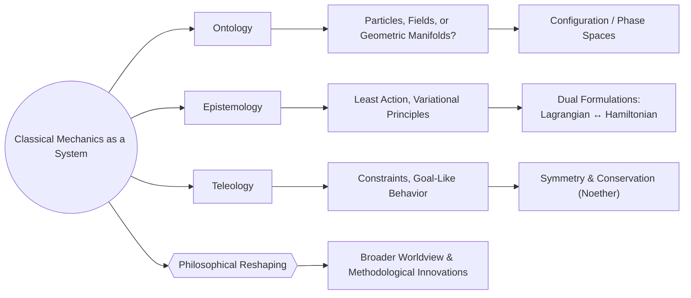

# Revisiting Classical Mechanics Through a Modern Philosophical Lens
* * *

--- By uniting ontology, epistemology, and teleology, we reshape our understanding of motion and reality.

# Chapter 1. Introduction and Philosophical Motivation

**Epigraph:**  
“Mechanics began as a study of motion; we now look beyond motion to the nature of reality itself.”

This chapter lays the groundwork for viewing classical mechanics through a contemporary philosophical lens. It begins by tracing how the subject, once defined by Newton’s laws, has continuously intersected with deeper questions of what truly exists (ontology), how we acquire knowledge of it (epistemology), and whether any teleological (purpose-oriented) dimension operates within physical law. By emphasizing these three philosophical domains, we create a platform upon which subsequent chapters will build a full-scale reexamination of classical mechanics—one that transcends mere formulaic proficiency and instead interrogates the underlying structure and meaning of the discipline.

From an historical perspective, Newton’s epoch cemented the idea of force and absolute space as explanatory pillars. Yet as we proceed, we observe that modern analytical mechanics (e.g., Lagrangian and Hamiltonian formalisms) gradually displace force from its central role, pointing instead to geometry, constraints, and energy principles as fundamental. These transformations do more than refine problem-solving methods: they reshape our understanding of reality, motion, and purpose. Consequently, taking a philosophical approach is not just an optional exercise; it is a pathway to unlocking deeper insights into why and how classical mechanics continues to illuminate and challenge our worldview.

## 1.1. From Newton’s Laws to Analytical Mechanics

**Goal:**  
Offer a concise review of major paradigm shifts—Newtonian to Lagrangian/Hamiltonian—underscored by philosophical transformations.

Classical mechanics famously traces its roots back to Isaac Newton’s three laws of motion, enshrining force, mass, and absolute space as ontological cornerstones. In this original view, the universe is a grand stage of inert matter acted upon by forces, which themselves are treated as real, irreducible entities. This approach was nothing short of revolutionary: it unified terrestrial and celestial domains under a single mathematical framework, drove centuries of scientific progress, and shaped our intuitive notion of how the world “works.”

Yet as the centuries passed, new mathematical insights and scientific discoveries began shifting the conceptual core of mechanics. The analytical viewpoint—led by luminaries like Lagrange and Hamilton—focused less on raw forces and more on energy functionals, generalized coordinates, and global principles such as the principle of least action. These changes implied that force might be demoted to a derived effect: in Lagrangian mechanics, for instance, force emerges from the gradient of a potential (or from constraints), while in Hamiltonian mechanics, it corresponds to the rate of change of momentum as encoded by a more comprehensive energy function. Increasingly, geometry and abstract construction came to the forefront, suggesting that reality may be most fruitfully described not by pushes and pulls but by the shapes and structures of configuration or phase spaces.

In short, the transformation from Newtonian to analytic formalisms carried profound philosophical ramifications. Where Newton positioned force and absolute space as primary “reals,” analytical mechanics introduced a subtler ontology—systems navigated by potentials, subject to boundary conditions, and best understood through continuous calculus of variation. This trajectory foreshadows further expansions of mechanics into symplectic geometry, gauge theories, and even quantum contexts, making it essential to see how each conceptual advance restates or remolds what we consider the bedrock of physical reality.

## 1.2. Relevance of Ontology, Epistemology, and Teleology

**Goal:**  
Explicitly define these philosophical terms and connect them to topics in classical mechanics.

The paradigm shifts outlined above naturally pivot us toward three philosophical axes that bear heavily on the interpretation of physical theory:

1. **Ontology** – the study of what truly exists.  
   In Newton’s era, forces and masses were taken as real, tangible building blocks of the cosmos. In Lagrangian/Hamiltonian mechanics, reality seems increasingly identified with intangible constructs like configuration spaces, potentials, and actions. Key ontological questions arise: Are particles “real,” or is the true existence found in the geometric structures guiding their trajectories?

2. **Epistemology** – the study of how we obtain and validate knowledge.  
   Classical mechanics provides not just equations but an entire methodology (e.g., modeling, constraints, energy variations) for explaining and predicting motion. We must ask: how do we mentally build and refine these models to ensure they mirror nature? Variational principles, symmetries, and Legendre transforms all exemplify knowledge frameworks that extend beyond mere force-based intuitions.

3. **Teleology** – the study of purpose or end-directed processes.  
   While teleology traditionally inhabits biological or philosophical conversations, certain aspects of physics—such as the principle of least action—sound strikingly purposive: systems “choose” paths that minimize (or extremize) action. Though mechanical systems need not literally have “intentions,” the mathematical parallels to goal-directed behavior invite reflection. Does the universe harbor a principle akin to purposeful design, or is teleology merely an elegant way of summarizing constraints and laws?

By situating classical mechanics within these three philosophical domains, we recognize it as more than a venerable set of formulas for orbital motions or spinning tops. Instead, classical mechanics emerges as a lens through which we decode reality, test our conceptual frameworks, and ponder whether “purpose” might lurk behind the illusions of purely deterministic processes. The chapters to follow expand on each of these themes—ontology, epistemology, and teleology—leading ultimately to a broader reconstruction of classical mechanics as a philosophical system, one with profound implications for our understanding of the universe.

# Chapter 2. Ontological Considerations: What is Real in Classical Mechanics?

**Epigraph:**  
“When we measure motion, we measure ourselves against reality—is it the particle, the field, or the manifold that truly exists?”

Classical mechanics has long been hailed as the study of moving bodies—a science of forces, masses, and trajectories. Yet beneath this apparently straightforward description lies a profound ontological question: what do these concepts represent in the grander scheme of reality? This chapter examines how classical mechanics frames the “stuff” of the universe, revealing a continuous evolution from force-focused narratives to geometry-based formalisms. We interrogate whether fundamental existence resides in discrete particles, continuous fields, or abstract manifolds, and how a deeper reading of configuration and phase spaces illuminates the nature of physical reality. By exploring constraints, potentials, and gauge fields, we see how each layer of mechanics redefines what we call “real,” pushing us to confront whether ontology itself transforms as the theory matures.

## 2.1. The Evolution from Force-Centric to Geometry-Centric

**Goal:**  
Show how force once stood as the central ontology but gave way to Hamiltonians, Lagrangians, and geometry.

The Newtonian worldview posited force as the linchpin of physical reality—a real agent acting upon inert masses to produce accelerations. In that framework, force was not merely a computational tool but a tangible entity bridging cause and effect in the cosmos. This perspective, while enormously successful, implicitly assumed that space and time provided a static backdrop in which forces operated.

Analytical mechanics dramatically reshaped this ontological picture. In Lagrangian mechanics, the emphasis shifts to an action principle—an integral of the Lagrangian over time—rendering force a secondary phenomenon derived from the potential’s derivatives. Likewise, in Hamiltonian mechanics, the notion of force emerges from the gradient of the Hamiltonian function in phase space. Both formalisms relegate force to a derivative concept: no longer is it an autonomous “thing” but rather a manifestation of deeper mathematical structures like partial derivatives of energy functions.

This changed spotlight implies an ontological pivot: instead of force, the central “reality” becomes the geometry of the system’s configuration or phase space. The crucial objects are the trajectories and the constraints that shape them, whether originating from a potential or from generalized coordinates. In effect, classical mechanics migrates from a “push-and-pull” worldview to one guided by geometry and global energy surfaces. Such a shift hints that the essence of reality may lie in how systems navigate complex manifolds rather than in how external forces drive them.

## 2.2. Configuration Space, Phase Space, and Symplectic Manifolds

**Goal:**  
Clarify why these mathematical spaces came to represent reality in advanced classical mechanics.

Having seen force demoted to a derivative concept, we next ask: if not force, then what stands at the core of mechanical reality? The answer arrives in the form of configuration space (for Lagrangian formulations) and phase space (for Hamiltonian formulations). Configuration space abstracts away from mundane coordinates into a minimal set of generalized variables, capturing the essential degrees of freedom of a system. This abstraction, while seemingly mathematical, exerts an ontological claim: it posits that the “real” system is fully described by these generalized coordinates—no extraneous references to a universal background are strictly necessary.

Phase space goes one step further, pairing each generalized coordinate with a corresponding momentum to create a richer, $2n$-dimensional tapestry. This space, structured by a symplectic form, encodes the complete state of a system in a single geometric object. In this view, reality is enacted on a symplectic manifold where points represent states, and flows through this manifold represent time evolution. Hamilton’s equations assume the shape of geometric flows—“symplectic flows”—that preserve the underlying symplectic structure, reinforcing the idea that geometry, rather than force, is the prime mover.

Even constraints and potentials fit neatly into this geometric outlook. Holonomic constraints restrict the manifold to a subspace, shaping possible motions without recourse to direct “pushes.” Potentials, similarly, appear as scalar fields that bend the geometry of accessible states, giving rise to “paths of motion” that reflect local curvatures in the energy landscape. Taken together, these notions recast the fundamental question “What exists?” into a statement about how orbits embed within a structured manifold. Whether we speak of gauge fields in advanced theories or frictional constraints in everyday problems, the ontological thread remains: classical mechanics has become a geometry-centric account of reality, in which “forces” and “interactions” reveal themselves as local readouts of manifold structure, potential landscapes, or boundary conditions.

Thus, classical mechanics steadily abandons naive force-based axioms to embrace a higher-level description where spaces and symplectic forms anchor our notion of “real.” This shift sets the stage for the subsequent chapters, where we interweave knowledge-making (epistemology) and possible purpose (teleology) into the tapestry, bringing us closer to a full philosophical re-visioning of mechanics itself.

# Chapter 3. Epistemological Framework: How Do We Know What We Know?

**Epigraph:**  
“By formulating actions and symmetries, we do more than solve equations—we establish a measure of what it means to know.”

In any scientific discipline, knowledge is neither a static inventory of facts nor a random collection of equations. It is constructed through specific principles, validated by observation or logic, and continuously tested for consistency and predictive power. Classical mechanics is a particularly striking example. Its formalisms—ranging from Newton’s laws to the canonical equations of Hamilton—emerged from both empirical data (celestial or terrestrial) and bold theoretical syntheses. This chapter asks how classical mechanics provides and validates knowledge: by what epistemic channels does it organize phenomena, unify disparate observations, and offer ever deeper insight into physical reality?

From the vantage of the previous chapters, we see that classical mechanics has migrated from a force-centric viewpoint to a geometry-centric interpretation, subtly changing how we conceptualize “truth” about motion. The epistemological lens reveals that adopting Lagrangian or Hamiltonian methods is not just a matter of convenience; these frameworks powerfully constrain how we discover, formalize, and confirm knowledge. In other words, the very structure of mechanics shapes the potential content of what we regard as real and intelligible. Through variational principles, models, and symmetries, classical mechanics thus stands as a prime example of how scientific theories become epistemic engines—truth-seeking devices operating under the twin constraints of empirical adequacy and conceptual elegance.

## 3.1. The Principle of Least Action as an Epistemic Tool

**Goal:**  
Reveal how the principle of least action encapsulates observational data and theoretical elegance.

Perhaps the most significant unifying thread in advanced mechanics is the principle of least (or stationary) action. In Lagrangian form, this principle holds that the physical trajectory of a system minimizes (or extremizes) an integral known as the action, $S$. From an epistemic perspective, the principle of least action accomplishes two critical functions:

1. **Condensing Observational Data into a Single Functional**  
   Instead of separately analyzing all the “forces” or interactions for each individual phenomenon, the principle of least action weaves them into one global quantity, $S = \int L \, dt$. The Lagrangian $L$ collects kinetic and potential terms under one roof. Observational data about motion—be it projectile trajectories, planetary orbits, or pendulum oscillations—can all be encoded in the same formal structure. The fact that real systems do indeed follow paths that satisfy the Euler–Lagrange equations (derived from minimizing $S$) provides a deep synchronization between nature’s observed behavior and the theoretical notion of a stationary action.

2. **Offering Theoretical Economy and Elegance**  
   In physics, “economy” of description often signals profound underlying unity. The principle of least action replaces multiple force-dependent statements with a single global condition on the action functional. This global viewpoint not only simplifies derivations (e.g., deriving laws of motion with fewer assumptions) but also offers a conceptual elegance: it ties together a wide range of phenomena—classical, relativistic, and even quantum (in path-integral formalisms)—with the same variational motif. From an epistemic standpoint, such unification is invaluable: it streamlines the search for new laws, clarifies the relationships among old ones, and suggests pathways to deeper, more universal theories.

### 3.1.1. Why does nature “choose” paths of extremal action?

While we cannot conclusively assert that nature deliberately “chooses” minimal action, two epistemic threads complement each other to reinforce this principle:

- **Empirical Adequacy**: Time and again, experiments confirm that real-world motions satisfy the Euler–Lagrange equations. Hence, positing a stationary-action principle works exceptionally well—its success occurs across mechanical systems, wave phenomena, optics, and more.  
- **Conceptual Cohesion**: The stationary-action viewpoint dovetails elegantly with conservation laws (via Noether’s theorem) and with symmetrical arguments about space, time, and internal degrees of freedom. It becomes a central marketplace where mathematics, experiment, and theoretical insight exchange values seamlessly.

In short, the principle of least action is not merely a formulaic tool; it is an epistemic architecture guiding how we unify data, represent motion, and foresee new discoveries.

## 3.2. Duality, Legendre Transforms, and Other Epistemic Bridges

**Goal:**  
Discuss how transformations (Legendre) and dual formulations (Lagrangian/Hamiltonian) broaden our ways of “knowing.”

While the principle of least action underpins the Lagrangian form, an equivalent statement emerges in Hamiltonian mechanics. The transition linking these two viewpoints is the **Legendre transform**, an algebraic–geometric technique that re-expresses one description in terms of a complementary set of variables. From an epistemological perspective, this duality and the process of transformation reveal deeper truths:

1. **Multiple Perspectives, One Reality**  
   If Lagrangian mechanics treats velocity $\dot{q}$ as the key dynamical variable, Hamiltonian mechanics treats momentum $p$ as equally fundamental. The Legendre transform shows that both pictures are consistent renditions of the same underlying phenomenon, simply expressed in different coordinates. This “lowest common denominator” fosters a more robust sense of knowledge: any single formalism’s successes or limitations can be tested against its counterpart. The fact that they align reaffirms a deeper structural truth about the system, which transcends coordinate choices.

2. **Epistemic Resilience**  
   In science, resilience of knowledge is often increased by methodological redundancy. Having two well-tested frameworks (Lagrangian and Hamiltonian) that converge in predictions fortifies the credibility of the theory. Moreover, each approach excels in different contexts—constraints are often simpler in the Lagrangian picture, while canonical transformations and phase-space geometry shine in the Hamiltonian world. This complementary nature expands our capacity to address a wider array of problems, from designing stable orbits in celestial mechanics to formulating quantum analogs.

3. **Modeling Flexibility vs. Deeper Truths**  
   A subtle epistemological question arises: does the multiplicity of formalisms indicate that the true essence of mechanics is “coordinate-dependent,” or does it hint at a universal backbone beneath differing representations? Many would argue that it underscores a deeper unity—an invariant structure captured by symplectic geometry, gauge invariants, or topological considerations—while local coordinate sets (Lagrangian in configuration space, Hamiltonian in phase space) reflect only partial “projections” of that underlying reality. Hence, the Legendre transform’s role goes beyond mathematics into epistemic demonstration: the underlying mechanical system can be viewed from various angles, and each vantage can be equally legitimate despite focusing on distinct variables.

In sum, transformations like the Legendre map and the interplay of Lagrangian/Hamiltonian mechanics represent epistemic bridges—tools that expand, test, and solidify our understanding. By revealing that different but equivalent descriptions can coexist, classical mechanics underscores how it is not locked into a single set of vantage points. This dual (or multiple) perspective approach exemplifies both the flexibility and the conceptual strength of the theory, enabling it to tackle everything from constrained rigid-body motions to quantum field analogies.

## 3.3. Conclusion

Epistemology in classical mechanics is far more than a question of “does it predict experimental outcomes?” It stretches to how knowledge is built, validated, and cross-checked through profound organizing principles like least action or symplectic structure. By recognizing that the same physics can be cast in multiple but convergent formalisms, we gain a robust sense of certainty that the knowledge we glean is anchored in a genuine understanding of physical law, not just ephemeral curve-fitting. This viewpoint naturally propels us toward the next questions of teleology and “purposeful” structure—if classical mechanics can unify knowledge so elegantly, might it also imply a kind of directedness or “goal” in how nature plays out its motions? We will explore these ideas in the following chapter, framing them as the teleological dimensions of mechanical systems.

# Chapter 4. Teleological Dimensions: Purpose, Constraints, and Universality

**Epigraph:**  
“Behind every differential equation may lie a purposive shape to reality—an echo of teleological structures in nature.”

Classical mechanics, in principle, seems far removed from any idea of “purpose.” After all, Newton’s laws were famously non-teleological in character: they described how forces change momentum without referencing any “goal” for motion. Yet as we delve deeper—particularly through the lens of analytical mechanics—subtle analogies to teleology emerge. Whether expressed as constraints channeling a system’s behavior or as nature’s “preference” for minimizing action, classical mechanics resonates with frameworks that suggest some underlying directionality in physical law. This chapter explores how such “goal-oriented” analogies might be interpreted, and how they help unify our understanding of constraints, equilibria, symmetries, and conservation laws.

## 4.1. Constraints as Purpose?

**Goal:**  
Interpret constraints not just as geometric limitations but as hints toward an underlying “direction” or “intention” in mechanical systems.

Most systems in classical mechanics are not free to roam an unconstrained infinite space. Instead, they face holonomic or nonholonomic constraints—relations that either limit positions to certain submanifolds or restrict possible velocity vectors at each instant. While these constraints can be purely geometrical (e.g., a bead constrained to move on a wire), they often function like “directives,” shaping how the system evolves.

1. **Holonomic vs. Nonholonomic**  
   - Holonomic constraints can be written as algebraic equations involving coordinates (e.g., a particle on a sphere). The system’s “purpose,” so to speak, is to remain on that manifold. Whether we picture a pendulum swinging on a pivot or a rolling sphere, the system “obeys” the constraint as though it were an internal directive disallowing motion off the permissible surface.  
   - Nonholonomic constraints, by contrast, emerge at the velocity level (e.g., rolling without slipping), adding dynamic rules to how the system can move. This imposes a sort of “directionality” on the permissible velocity space—a hidden instruction about where the motion may go next.

2. **Constraints as “Channels of Intention”**  
   In philosophical terms, one could argue that constraints embody a micro-level teleology: they steer the system toward particular trajectories that would be inaccessible otherwise. The system does not “choose” these trajectories per se, but from an observer’s perspective, it is as if the system has an embedded “intention” or “goal” to satisfy the constraint at all times. Seen this way, constraints not only reduce degrees of freedom but also shape the system’s emergent behavior into forms that can appear “purposeful.”  

3. **Architecting Equilibria and Preferred Paths**  
   Constraints can create stable or unstable equilibria that effectively serve as “attractors.” In a stable equilibrium, small perturbations are naturally corrected, as if the system were “seeking” to return to a designated rest configuration. This phenomenon, long interpreted in conventional physics as a matter of simple energy minimization, can be understood in teleological terms: the system “aims” for the lowest potential energy consistent with its constraints. Although this is metaphorical language, it can highlight how constraints sculpt the solution space to favor certain outcomes.

Through this lens, constraints do more than limit motion. They impose directional conditions that a system’s degrees of freedom must obey, quietly echoing a teleological tone: “the system must remain on this path,” or, “it cannot deviate from these velocity directions.” Whether we read this as genuine purpose or as a figurative interpretive tool, the fit between constraints and teleological language deepens our conceptual grasp of classical mechanics.

## 4.2. Symmetry, Conservation, and “Goals” of Nature

**Goal:**  
Link conservation laws to an implicit teleology—nature’s “intent” to preserve certain quantities.

A hallmark of advanced discourse in classical mechanics and field theory is the profound relationship between symmetries and conservation laws, famously encapsulated in Noether’s theorem. When a system’s action is invariant under a continuous symmetry (such as time translation or rotation), a corresponding quantity (energy, angular momentum, etc.) remains constant over time. This theorem not only unifies numerous physical observations but also opens the door to a teleological reading.

1. **Noether’s Theorem as Teleological Harmony**  
   If a system’s Lagrangian does not change under certain transformations—like shifting the origin of time—then energy remains conserved. Metaphorically, one could suggest that nature “seeks” to preserve energetic content in the face of uniform time shifts. Similarly, rotational symmetry yields a “goal” of preserving angular momentum. From the mechanical perspective, there is no conscious design, yet the outcome is that certain core quantities simply do not change once a symmetry is present. This structural rigidity can be read as nature’s “intent” to uphold invariance.

2. **Conservation as a Guiding Purpose**  
   In everyday language, we might say the system “aims” to maintain momentum or energy, adjusting other parameters to fulfill that aim. Although “aim” is not literally an active drive, the interplay of symmetry and conservation laws can appear teleological when described purely in conceptual terms. The principle of least action itself neatly connects to these invariants through Noether’s theorem, suggesting that “optimal” or “stationary” paths also coincide with a broader consistency in the cosmos—i.e., certain symmetrical structures must remain unviolated.

3. **From Metaphor to Method**  
   Teleological language, while risky if taken too literally, can be methodologically illuminating. It invites us to notice patterns or structures in classical mechanics as if nature were “conserving” or “pursuing” something. This metaphor can lead researchers to anticipate what the laws might look like if new symmetries or constraints were introduced. Indeed, the quest for unifying laws in modern physics often hinges on seeking out deeper symmetries in hopes of unearthing new conservation principles or coupling constants.  

By merging constraint-driven motion (Section 4.1) with Noether-inspired conservation laws, classical mechanics not only explains how things move but also frames the “why” in an implicit teleological sense. Whether we conceive of a pendulum seeking equilibrium or the universe preserving momentum, teleology surfaces as a conceptual stance bridging constraints, stability, and the unwavering reliability of conservation laws.

## 4.3. Conclusion

Teleology may not be a standard watchword of classical mechanics, but its echoes resound whenever constraints, stability, symmetries, and conservation laws conspire to produce orderly, direction-filled outcomes. Even though no conscious choice is at play, one cannot deny that the principle of least action, stable equilibria, and Noether’s theorem paint a picture of nature as consistently “preferring” certain paths, states, or invariants. The interpretive step of calling this “purpose” might be philosophical rather than scientific, but it uncovers a layer of conceptual cohesion that enriches both teaching and theoretical exploration. From here, we move to Chapter 5, where these threads of ontology, epistemology, and teleology coalesce into a renewed philosophical reading of classical mechanics—one that sees it not as an archaic discipline, but as a timeless scheme for understanding the structured rationality inherent in physical law.

# Chapter 5. Philosophical Reconstruction: A Modern View of Classical Mechanics

**Epigraph:**  
“To see classical mechanics anew is to alter our cosmic perspective—beyond equations, we find a method of describing existence.”

Classical mechanics is often perceived as the cornerstone of “old” physics—a historical relic surpassed by relativity and quantum theory. Yet when reexamined through the lenses of ontology, epistemology, and teleology, it reveals itself as an ever-evolving conceptual framework with profound philosophical depth. This chapter synthesizes the preceding discussions, proposing that classical mechanics, far from being a mere set of computational recipes, offers a rich tapestry of ideas about reality, knowledge, and even the possibility of purpose embedded in natural law. By uniting geometry, action principles, and constraints into a coherent worldview, we can see classical mechanics not just as “dated science” but as a living, generative approach to understanding our universe—one that can inspire creative expansions and shape scientific thought well into the future.

## 5.1. Core Synthesis: From Newtonian Axioms to Geometric Bases

**Goal:**  
Demonstrate how the entire conceptual arc (force → geometry → potential → action) re-situates classical mechanics as an evolving philosophical system.

At its inception, classical mechanics hinged on Newtonian axioms that posited force and mass as primary. These notions carried embedded assumptions about absolute space and time—structures existing independently of the phenomena they contained. Over centuries, however, the discipline progressed beyond force-based models toward formulations centered on geometry and variational principles:

1. **From Force to Potentials**  
   In the Lagrangian formulation, forces derive from a potential function, making them emergent details of an underlying energy structure rather than irreducible axioms. Consequently, the notion of “force” is demoted to a byproduct of how energy gradients and constraints shape the system’s evolution.  

2. **From Potentials to Global Action**  
   The principle of least (or stationary) action extends this de-emphasis on local force by postulating a global property of systems’ trajectories. Rather than describing motion with push-and-pull interactions, we see motion as the result of a path extremizing an integral (the action) across time. This shift suggests a holistic viewpoint where an entire trajectory—and by extension, the entirety of the system’s history—contributes to determining its dynamics.

3. **From Action to Geometry**  
   Hamiltonian mechanics, symplectic manifolds, and phase-space techniques further remove us from naive force pictures by emphasizing geometric flows, conserved quantities, and invariants embedded in a symplectic structure. The “real” substance of a mechanical system—ontologically and epistemologically—becomes the geometry of its state space rather than the notion of particles being jostled by forces.

Together, these transformations amount to a philosophical reconfiguration of mechanics. It is no longer about forces as brute facts but about the topology and geometry of motion, the invariances that shape possible evolutions, and the global principles (least action, conservation laws) that unify seemingly disparate phenomena. This reconfiguration has major implications for our worldview: once forces are seen as derived rather than fundamental, the cosmos appears less like a battleground of collision events and more like a cohesive tapestry governed by elegantly orchestrated structures.

## 5.2. Implications for Future Research and Education

**Goal:**  
Offer guidelines on how to harness these philosophical insights in higher-level teaching, research collaborations, and conceptual expansions (e.g., in quantum or relativistic frameworks).

Viewing classical mechanics as a dynamic, philosophically rich system lays the groundwork for new ways of teaching, researching, and even imagining physics:

1. **Pedagogical Approaches**  
   - A Geometry-First Curriculum: Introducing Lagrangian and Hamiltonian methods early, alongside the principle of least action, can help students see beyond force-dominated perspectives. Tying these concepts to easy-to-visualize geometric forms (like phase portraits) fosters deeper intuition about the nature of motion.  
   - Emphasizing Constraints and Variational Methods: Rather than relegating constraints to advanced topics, one can integrate them into the initial framework, showing how “purposeful” or “directed” motion arises from seemingly simple boundary conditions. This vantage invites students to think structurally rather than memorizing sets of equations.

2. **Research Dialogues**  
   - Bridging Classical and Modern Physics: By spotlighting geometry and action principles, classical mechanics becomes a conceptual stepping-stone into quantum mechanics (e.g., via path integrals) or general relativity (e.g., via geodesic motion in curved spacetime). Researchers can exploit these analogies to formulate new hypotheses in emergent fields like quantum gravity or advanced gauge theories, grounding them in centuries-tested mechanical principles.  
   - Philosophical Reflexivity in New Theories: Recognizing mechanics as a framework of existence, knowledge, and direction encourages theoretical physicists to ask foundational questions before plunging into calculations. Inquiring about what is “really real” or how “purpose” might manifest at a cosmic scale, for instance, can inspire fresh lines of inquiry and novel mathematical formalisms.

3. **Conceptual Expansion**  
   - Interdisciplinary Engagement: The recognition that classical mechanics can be interpreted philosophically opens doors to collaborations with philosophers, cognitive scientists, mathematicians, and others investigating structural patterns in complex systems. The universal nature of variational principles and constraints resonates with models in biology, economics, and systems theory.  
   - Evolving Attitudes Toward Mechanistic Explanation: A geometry/action-based worldview offers nuance to the old mechanistic slogan, “nature is a machine.” Instead, nature can be sensed as a living geometry, a realm of interlinked constraints, symmetries, and flows that both reflect and transcend straightforward cause-effect narratives.

In short, adopting a philosophical lens does more than refresh how we teach or conduct research; it reframes classical mechanics as a shared language for understanding pattern and structure across diverse scientific disciplines. By doing so, we keep alive the creative spark that ignited Newton’s age and carry it forward into the next frontiers of theoretical investigation—ultimately reminding us that mechanics is not just about calculating orbits, but about perceiving the deep rational architecture of the universe itself.

## 5.3. Conclusion

This philosophical reconstruction of classical mechanics, grounded in geometry, constraints, and action principles, compels us to strip away the vestiges of a purely force-centric narrative and instead appreciate the field’s capacity to illuminate fundamental questions about reality, knowledge, and purpose. By integrating the ontological, epistemological, and teleological perspectives, classical mechanics transforms into a vibrant knowledge system—rich in conceptual nuance and open to future innovations. The concluding chapter will tie these threads together, underscoring how this renewed interpretation of mechanics informs not just science education or specialized research but also broader cultural and intellectual dialogues about the role of physics in our collective pursuit of meaning.

## Chapter 6. Conclusion

**Epigraph:**  
“To reconstruct mechanics is to reconstruct our approach to reality—this journey is both scientific and philosophical.”

Classical mechanics might initially appear as a closed chapter of physics, overshadowed by more modern theories. Yet as this document has explored, returning to its foundations through the lenses of ontology, epistemology, and teleology reveals it to be a remarkably fertile conceptual arena. We have seen how “force” gives way to geometry and action functionals; how knowledge crystallizes in variational principles and dual formulations; and how a subtle teleological flavor undergirds constraints and symmetry-conservation laws. At each turn, classical mechanics provides a vehicle for interrogating deeper philosophical questions that transcend mere formulaic proficiency.

A central insight is the multi-layered meaning of “mechanics.” Historically, it was about predicting planetary orbits and trajectories. Now, reframed philosophically, it becomes a means of examining the nature of reality (is it built from particles or manifold structures?), the methodology of knowledge (why do variational principles work so well?), and the possibility of “purpose” in natural law (does least action reflect an underlying goal of minimal expenditure?). Taken together, these vantage points illustrate that classical mechanics—far from obsolete—continues to inspire new thinking, challenging us to confront how we define existence, knowledge, and directionality in physics.

Adopting this renewed philosophical perspective can also expand our cosmic outlook. By perceiving the universe as a seamless interplay of geometry, constraints, and energy flows—rather than as a collection of isolated forces—we may discover fresh ways of questioning entrenched assumptions in science. Such questions might open unexplored routes in quantum interpretations, cosmological modeling, or even cross-disciplinary analogies in biology and social sciences. In practical research, the deep structural unity unveiled by analytical mechanics could serve as a blueprint for formulating and testing new theories. In education, emphasizing the conceptual backbone behind classical equations can cultivate deeper scientific intuition and intellectual curiosity among learners.

In short, classical mechanics stands not as a relic, but as a portal: a vantage from which we can glimpse the profound unity and order underlying our world. Embracing a philosophical stance—one that interweaves ontology, epistemology, and teleology—does more than enliven historical theories. It sparks a transformation in perspective: mechanics becomes a tool not just for modeling motion, but for reflecting on the very framework of reality and the ways in which scientific inquiry illuminates it.

Whether one teaches, researches, or simply ponders the scope of physical law, approaching classical mechanics with philosophical depth can unlock a wealth of insight. It urges a bold openness to new paradigms, a readiness to see patterns beneath seemingly disparate domains, and a willingness to ask: what might the future hold if we reimagine this “classical” edifice as a continuously evolving system of thought, bridging the rational and the mysterious, the empirical and the existential? That question, ultimately, is the heart of this project—a question whose answers promise to reshape, once again, our understanding of motion, reality, and our place within it.

# Appendix A: Conceptual Overview and Interrelations

Below is a concise overview aiming to illuminate the core ideas—ontology, epistemology, teleology, geometry, and philosophical reshaping—and how they interconnect in the context of classical mechanics.

## A.1. Key Concepts and Their Relationships

1. **Ontological Basis**  
   - Focuses on what is ultimately “real”: particles, fields, geometry, or the action principle.  
   - Shifts from a force-centric worldview to one grounded in potentials, constraints, and manifold structures.

2. **Epistemological Foundations**  
   - Investigates how we build, validate, and refine knowledge in mechanics.  
   - Emphasizes variational principles, dual formalisms (Lagrangian/Hamiltonian), and how they converge to bolster theoretical credibility.

3. **Teleological (Purpose-Driven) Reinterpretation**  
   - Explores goal-directed analogies, especially through constraints and least-action laws.  
   - Examines how symmetries and conservation might suggest a subtle “directionality” in natural law.

4. **Geometry, Constraints, and Symplectic Structures**  
   - Highlights the fundamental role of configuration and phase spaces, as well as symplectic manifolds in Hamiltonian mechanics.  
   - Shows how constraints sculpt trajectories, sometimes appearing to imbue systems with “intent.”

5. **Philosophical Reshaping**  
   - Proposes classical mechanics as more than a historical discipline—rather, a vibrant philosophical system that informs worldview, methods, and intellectual creativity.  
   - Envisions expansions into education, interdisciplinary research, and advanced theoretical frameworks (quantum, cosmological, etc.).

## A.2. Diagram of Core Relationships

**Diagram Explanation**:

1. **Classical Mechanics as a System** (A) is the overarching framework where three main dimensions—Ontology (B), Epistemology (C), and Teleology (D)—converge.  
2. **Ontology** (B) anchors the discussion of what “really exists”, leading to questions about whether reality is best described by discrete particles, continuous fields, or abstract manifolds (E). These inquiries further point to the geometric representation of mechanical systems in configuration and phase spaces (H).  
3. **Epistemology** (C) addresses how knowledge in mechanics is formulated, validated, and refined. Core methods include variational principles and the principle of least action (F), which then have dual representations in Lagrangian and Hamiltonian formalisms (I).  
4. **Teleology** (D) introduces the concept of purposeful or goal-like behavior. Constraints and certain stability conditions can appear to “steer” a system, hinting at teleological motifs (G). Additionally, deeper symmetries yield conservation laws (J), potentially read as nature’s “intent” to preserve specific invariants.  
5. All three conceptual threads funnel into the **Philosophical Reshaping** (K), where classical mechanics is reinterpreted as a living, philosophically rich discipline. This culminates in expanded horizons for education, cross-disciplinary research, and new theoretical directions (L).

Through this conceptual map, readers can see how ontology, epistemology, teleology, and geometry each critically inform one another, together painting a holistic portrait of classical mechanics not as a static historical relic, but as an ongoing philosophical venture.

